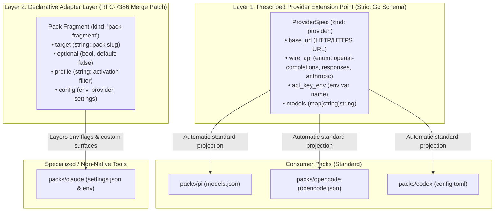
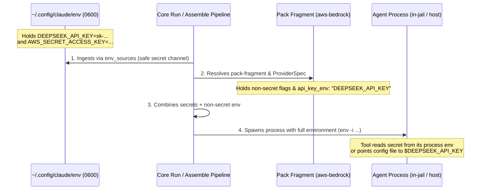
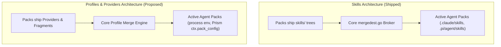
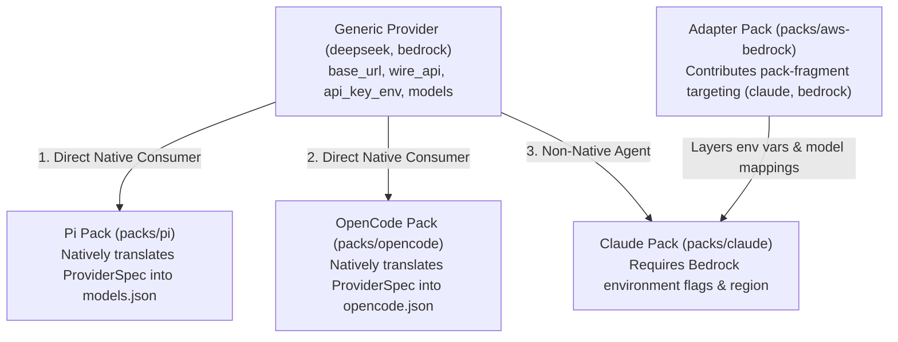

# Pack Profiles: Typed Providers, Cross-Pack Fragments, and Generic Merging

> **DRAFT SUPERSEDED, 2026-09-02.** This first pass never left draft, and the design was built
> from a different shape — read [`profiles-as-pack-variants.md`](profiles-as-pack-variants.md)
> (the parent) and [`providers.md`](../reference/providers.md), which is the reference the two
> review docs and the two implementation plans behind them were all distilled into (the plans
> were deleted when their work landed, 2026-09-02; `git log` holds them).
> Three positions below were **reversed**, not refined: the `wire_api` vocabulary is three
> canonical names — `anthropic`, `openai-chat-completions`, `openai-responses` — and never the
> four borrowed spellings the [§3](#3-the-architectural-tension-prescribed-extension-point-vs-generic-fragments) diagram, [§5](#5-manifest-schemas--field-definitions)'s two examples and [§8.2](#82-projections-automatic-env-vs-prism-derivelua)'s derive listings still use
> ([OQ-PT1](../reference/providers.md#why-its-this-way)); profile names are declared by the user, at user scope only ([OQ-CS5](../reference/providers.md#why-its-this-way)), and
> **declaration is mandatory** — an undeclared name is a reportable error, not a silent no-op
> ([OQ-CS6](../reference/providers.md#why-its-this-way), reversing [`profiles-as-pack-variants.md`](./profiles-as-pack-variants.md) [OQ-5](./profiles-as-pack-variants.md#14-decision-ledger)); and `env_shape` is deleted — an
> agent's delivery, credential included, is composed by that agent pack's own env-emitting
> derive ([OQ-PT9](../reference/providers.md#why-its-this-way), folded into [OQ-CS8](../reference/providers.md#why-its-this-way)). The body below is kept as the argument that produced
> those answers, and still spells the key `api_key_env`, renamed `api_key_env_name`; of the
> three, only [§5.1](#51-the-typed-provider-schema-kind-provider)'s `wire_api` row was already corrected in place (2026-09-02, `a01dbda5`).

**Status:** DRAFT, 2026-08-29 — **re-stamped 2026-09-09: "Nothing built" is true of this doc's
SCHEMAS and false of the machinery it argued for.** `kind: "provider"` shipped
(`internal/packdecl/kinds.go:157`, in the parent's per-protocol `endpoints` shape rather than
[§5.1](#51-the-typed-provider-schema-kind-provider)'s flat `base_url`/`wire_api`), and [§4](#4-the-secrets-issue-decoupling-configuration-from-credentials)'s `api_key_env` shipped as
`api_key_env_name` — with the secret-shaped-value refusal live in both the config and pack
validators. `env_sources` was never this doc's to build: it predates it by six weeks.
`kind: "pack-fragment"` is the one thing here that is genuinely absent, and its function is served
by `config-overlay` plus the `profile` modifier. ⚠ **[§11](#11-open-questions)'s three questions were PHANTOM, and were
compacted 2026-09-09** — all three had been answered by shipped code
([§12](#12-decision-ledger) is the ledger): [OQ-1](#12-decision-ledger) → `use_profiles`, keyed by CLI name, beside a
separate `profiles` declaration key; [OQ-2](#12-decision-ledger) → one `-p` with two value grammars, and this doc's
leaning refused on the record; [OQ-3](#12-decision-ledger) → bare slugs, `packs/zai` and `packs/cerebras`. Two of the
three matched NEITHER option offered; [OQ-3](#12-decision-ledger) matched its second option and is recorded for the example
it named that never happened. They carried the 💬 glyph until 2026-09-09 and so inflated the
corpus-wide live-question sweep by three; the file now counts zero. Read
[`providers.md`](../reference/providers.md) for all of it in current spelling.

**The short version.** `agent_profiles` is an architectural inversion: it leaks the concept of "agents" into core and forces Go-level runtime special-casing ([`internal/cli/run/assemble.go:722`](../../internal/cli/run/assemble.go#L722)). Conversely, making everything an opaque, untyped JSON dictionary creates **stringly-typed chaos** where field naming drifts (`baseURL` vs `base_url`) and typos fail silently. This design resolves the tension with a **Dual-Layer Architecture**:
1. **The Prescribed Extension Point (`kind: "provider"`)**: A strictly-typed `ProviderSpec` defining standard LLM endpoints (`base_url`, `wire_api`, `api_key_env`, `models`) that all standard agents (Pi, Codex, OpenCode) consume automatically.
2. **The Declarative Adapter Layer (`kind: "pack-fragment"`)**: An RFC-7386 JSON Merge Patch layer for tool-specific process flags (`env`), custom file surfaces, and non-standard bridges (e.g. `aws-bedrock` adapting Claude).
3. **Ironclad Secret Hygiene (`env_sources` + `api_key_env`)**: Solves the secrets issue by enforcing that git-tracked manifests carry *only* environment variable names (`api_key_env: "DEEPSEEK_API_KEY"`), while plaintext credentials remain strictly in untracked `0600` host files.

**The most important sections in this doc are [§3](#3-the-architectural-tension-prescribed-extension-point-vs-generic-fragments) (The Architectural Tension & Dual-Layer Synthesis), [§4](#4-the-secrets-issue-decoupling-configuration-from-credentials) (The Secrets Issue & `env_sources`), and [§5](#5-manifest-schemas--field-definitions) (The Manifest Schemas)**.

> [!NOTE]
> **A counter-design exists (2026-08-29):** [`profiles-as-pack-variants.md`](profiles-as-pack-variants.md)
> argues that most of [§3](#3-the-architectural-tension-prescribed-extension-point-vs-generic-fragments)'s dual-layer architecture is already shipped (providers are a live derive
> source consumed by three packs; `packs/claude/derive.lua:5` already branches on the active
> profile), and proposes one kind — a named variant of a pack's OWN declarations, generalizing
> `kind: "autonomy"` — instead of `provider` + `pack-fragment`. Read its [§9](#9-alignment-with-repo-principles) for the point-by-point
> diff. This doc is unchanged; the open questions below are still live.

**Reads with:** [`profiles-as-pack-variants.md`](profiles-as-pack-variants.md) (the counter-design), [`pack-code-separation.md`](pack-code-separation.md) (the mandate that core knows no agents), [`extension-point-principle.md`](extension-point-principle.md) (the framework author designs the extension point, not the first extender), [`stringly-typed-references-principle.md`](stringly-typed-references-principle.md) (stringly-typed references fail closed by default), [`happy-path-principle.md`](happy-path-principle.md) (fill the matrix with one unified path), [`host-agent-environment.md`](host-agent-environment.md) (the two-channel host env delivery these profiles feed), and [`pack-system.md`](pack-system.md) (the pack layer model).

---

## 1. Principles & Verdict Up Front

1. **P1 — Core Knows Packs, Not Agents.** There is no `agent_profiles`, no `YOLO_AGENT_PROFILES`, and no switch on `claude` in runtime assembly. Everything operates on pack identifiers (slugs), manifest contributions, and generic configuration dictionaries.
2. **P2 — Design the Extension Point Upfront, Not the First Extender.** Per [`extension-point-principle.md`](extension-point-principle.md), LLM endpoints have a known, standard shape across the industry. Core must define a strictly-typed `ProviderSpec` extension point upfront rather than forcing pack authors to invent ad-hoc schemas.
3. **P3 — Stringly-Typed References Fail Closed by Default.** Per [`stringly-typed-references-principle.md`](stringly-typed-references-principle.md), cross-pack target references (`target: "claude"`) must be verified at load time. If a referenced target pack is not selected, launch resolution **fails fatally by default**, unless explicitly declared `"optional": true`.

   > [!WARNING]
   > **The principle this cites was amended 2026-08-30 and P3 no longer states it correctly.** A reference now asks *two* questions, and `optional` answers only the second: **does this string name a real pack** (fatal always — `optional: true` does not excuse `target: "cloude"`) versus **is that pack selected here** (fatal when required, a clean skip when optional). As written, P3 lets a typo'd optional target be silently dropped — the exact failure [§2](#2-diagnosis-what-exists-today-and-why-it-breaks) of the principle exists to prevent. The principle also gained **R5, placement**, which [§8.1](#81-target-pack-verification-fail-closed-rule)'s "check against the active `packs` set" does not satisfy. See [`stringly-typed-references-principle.md`](stringly-typed-references-principle.md) [§3](./stringly-typed-references-principle.md#3-a-reference-asks-two-questions-and-only-one-of-them-is-optional) and [§4](./stringly-typed-references-principle.md#4-where-the-gate-goes-r5), and [`profiles-as-pack-variants.md`](profiles-as-pack-variants.md) [§8](./profiles-as-pack-variants.md#8-fail-closed-but-on-the-right-set).
4. **P4 — Git-Tracked Packs Never Contain Secrets.** Reusable packs and fragments carry configuration, model aliases, and the *name* of the environment variable holding the credential (`api_key_env`). Secret values are ingested strictly at runtime from external `0600` files via `env_sources`.
5. **P5 — Adapter Packs Bridge Non-Native Agents.** When an agent pack does not natively speak a provider's protocol, an independent adapter pack (e.g. `aws-bedrock`) contributes a `pack-fragment` to bridge the gap without modifying Core or the upstream agent pack.
6. **P6 — Zero-Boilerplate Projection with Escape-Hatch Fallback.** Standard configuration facets (process environment variables, standard OpenAI/Anthropic endpoint structures) project automatically into the runtime environment without requiring bespoke Lua derivation in every pack.

---

## 2. Diagnosis: What Exists Today and Why It Breaks

The existing implementation in [`agent-auth-modes.md`](agent-auth-modes.md) achieved launch-time swapping, but introduced three structural defects:

### 2.1 The Architectural Inversion (`agent_profiles`)
In [`internal/config/config.go:67`](../../internal/config/config.go#L67) and [`internal/config/validate.go:902-922`](../../internal/config/validate.go#L902-L922), core defines `agent_profiles` as a top-level schema key. 
This contradicts the fundamental invariant stated in [`AGENTS.md`](../../AGENTS.md):
> *"AGENTS ARE PACKS. Core does not know what an agent is. There is no agent registry, no agents config key, and no YOLO_AGENTS."*

By naming the key `agent_profiles` and expecting pack names (`pi`, `claude`, `codex`) as keys, core re-introduced the very domain abstraction it spent months removing.

### 2.2 Imperative Residue in Core Assembly
Because core treated Claude's Bedrock auth mode as a special case, [`internal/cli/run/assemble.go:722-754`](../../internal/cli/run/assemble.go#L722-L754) contains hardcoded Go logic:

```go
// assemble.go:722 — hardcoded special case in core runner
if prof, ok := effectiveProfiles.Get("claude"); ok && prof == "bedrock" {
    env = append(env, "-e", "CLAUDE_CODE_USE_BEDROCK=1")
    if provs := cfgMap(cfg, "providers"); provs != nil {
        if bedVal, ok := provs.Get("bedrock"); ok {
            // Extracts region, Opus/Haiku/Sonnet model IDs and sets ANTHROPIC_DEFAULT_*
        }
    }
}
```

This violates pack isolation: adding a new auth mode to Claude or a new agent pack requires modifying Go code in core.

### 2.3 The "Core Knows Providers" Redundancy
In [`internal/config/config.go:88`](../../internal/config/config.go#L88) and [`internal/config/validate.go:840-900`](../../internal/config/validate.go#L840-L900), Core hardcodes:
```go
knownProviderKeys = set("base_url", "wire_api", "api_key_env", "models", "region", "capabilities")
```
Unlike MCP servers (which Core spawns as child processes) or LSP servers (which Core installs via npm/go), Core **never connects to, executes, or manages an LLM provider**. A provider is pure configuration data consumed by in-jail tools or exported as env vars. Type-checking `base_url` in Go makes Core pretend to understand LLM semantics while being nothing more than a data conduit.

### 2.4 Downstream Application: Obviating Host Shell Wrappers
A primary downstream motivation of the pack profile and fragment architecture is eliminating custom `.bashrc` wrapper functions (e.g. subshell `claude()` functions sourcing untracked `~/.config/claude/env` files and unsetting `AWS_PROFILE`). Detailed analysis and real-world case study are documented in [`host-agent-environment.md` §2.2](host-agent-environment.md#22-real-world-case-study-obviating-bashrc-wrapper-functions).

---

## 3. The Architectural Tension: Prescribed Extension Point vs. Generic Fragments

When designing how providers and profiles interact across packs, two opposing architectural failure modes emerge:

```
┌─────────────────────────────────────────────────────────────┐
│ Failure Mode A: Stringly-Typed Chaos (Pure Untyped JSON)    │
│ • No prescribed provider schema anywhere                    │
│ • Key drift: `baseURL` vs `base_url`, `api` vs `wire_api`   │
│ • Typos fail silently; zero universal tool interoperability │
└──────────────────────────────┬──────────────────────────────┘
                               │ Tension
                               ▼
┌─────────────────────────────────────────────────────────────┐
│ Failure Mode B: Rigid Agent-Specific Core Hardcoding        │
│ • Core hardcodes Bedrock, Claude, and Anthropic logic in Go │
│ • Adding a new provider requires patching Core runner code  │
│ • Inversion: Core knows tool names and private auth modes   │
└─────────────────────────────────────────────────────────────┘
```

### 3.1 The Synthesis: The Dual-Layer Model

We resolve the tension by cleanly separating **Standard Provider Protocol** from **Tool-Specific Adaptation**:



1. **Layer 1: The Prescribed Provider (`kind: "provider"` / `ProviderSpec`)**:
   * For standard LLM endpoints (OpenAI-compatible, Anthropic API, DeepSeek, Ollama, vLLM).
   * Strictly typed in Go schema: validates URLs, enforces `wire_api` enums, checks model maps, and validates environment variable identifiers.
   * Universal consumption: Pi, Codex, and OpenCode consume this standard shape with zero per-provider glue code.
2. **Layer 2: Declarative Adapters (`kind: "pack-fragment"`)**:
   * For non-standard tool adaptations (e.g. Claude Code requiring `CLAUDE_CODE_USE_BEDROCK=1`, AWS region variables, or SigV4 auth proxies).
   * Targets specific packs (`target: "claude"`) and activates under specific profiles (`profile: "bedrock"`).
   * Carries process environment variables (`env`), config overlays, or arbitrary settings.

---

## 4. The Secrets Issue: Decoupling Configuration from Credentials

One of the most dangerous anti-patterns in agent configuration systems is **leaking plaintext API keys into git-tracked configuration files, manifests, or container image layers**.

### 4.1 The Three Security Invariants for Secrets
1. **Never Commit Secrets to Packs or Profiles:** Reusable pack manifests (`packs/*/pack.json`), workspace configs (`yolo-jail.jsonc`), and shared dotfiles are frequently tracked in version control or distributed as packages. They must **never** contain API keys, session tokens, or private endpoints with embedded credentials.
2. **References Must Be Explicit Identifiers (`api_key_env`):** Packs declare the *name* of the environment variable where the secret lives (e.g. `"api_key_env": "DEEPSEEK_API_KEY"`), never the secret itself.
3. **Secrets Ingestion is Strictly External (`env_sources`):** Secrets enter the jail exclusively through untracked, permissions-restricted (`0600`) dotenv files on the host (e.g. `~/.config/claude/env`, `~/.aws/credentials`).

```
┌─────────────────────────────────────────────────────────────┐
│ 1. Git-Tracked Configuration (Packs & Profiles)             │
│ • Endpoints: `base_url: "https://api.deepseek.com/v1"`      │
│ • Flags: `CLAUDE_CODE_USE_BEDROCK: "1"`, `AWS_REGION`       │
│ • Credential POINTER: `api_key_env: "DEEPSEEK_API_KEY"`     │
└──────────────────────────────┬──────────────────────────────┘
                               │ references secret by NAME
                               ▼
┌─────────────────────────────────────────────────────────────┐
│ 2. Untracked Host Secrets (Machine-Local 0600 Files)        │
│ • Stored in `~/.config/claude/env` or `.env`                │
│ • Ingested purely via `env_sources: [...]`                  │
│ • Hydrated into process environment at launch               │
└─────────────────────────────────────────────────────────────┘
```

### 4.2 Data Flow Sequence: Secrets vs. Configuration



### 4.3 Schema Validation Trap Prevention for Secrets
To prevent accidental credential leaks into git:
* The `api_key_env` field strictly accepts a **POSIX environment variable name** (matching `^[A-Z_][A-Z0-9_]*$`).
* If a user or pack author mistakenly enters a string starting with `sk-`, `Bearer `, or containing whitespace, `yolo check` and launch preflight **hard-fail**:
  ```
  ERROR: invalid api_key_env value "sk-9f82...": must be an environment variable name (e.g. "DEEPSEEK_API_KEY"), not a plaintext secret. Store the secret in an untracked file referenced by env_sources.
  ```

---

## 5. Manifest Schemas & Field Definitions

### 5.1 The Typed Provider Schema: `kind: "provider"`

A pack contributing a standard LLM provider declares `kind: "provider"`:

```jsonc
// packs/deepseek/pack.json
{
  "name": "deepseek",
  "description": "DeepSeek API provider integration",
  "contributes": [
    {
      "kind": "provider",
      "name": "deepseek",
      "base_url": "https://api.deepseek.com/v1",
      "wire_api": "openai-completions",
      "api_key_env": "DEEPSEEK_API_KEY", // Secret lives in untracked ~/.config/... via env_sources
      "models": {
        "default": "deepseek-chat",
        "coder": "deepseek-coder"
      }
    }
  ]
}
```

#### Field Definitions (`ProviderSpec`):

| Field | Type | Required | Description |
| :--- | :--- | :--- | :--- |
| `kind` | `string` | **Yes** | Must be `"provider"`. |
| `name` | `string` | **Yes** | Unique provider identifier (e.g. `"deepseek"`, `"bedrock"`, `"local-ollama"`). |
| `base_url` | `string` | **Yes** | Fully qualified HTTP or HTTPS base URL. |
| `wire_api` | `string` | No | The wire protocol that URL speaks, named in yolo's canonical vocabulary: `"anthropic"`, `"openai-chat-completions"`, `"openai-responses"`. Never passed through: each derive translates it into its own agent's spelling, and emits no entry at all for a protocol that agent cannot speak ([providers.md](../reference/providers.md) §3.4). |
| `api_key_env`| `string` | No | Name of the environment variable containing the secret API key. |
| `models` | `map[string]string` | No | Map of generic model aliases (e.g. `"default"`, `"fast"`, `"coder"`) to upstream model IDs. |
| `region` | `string` | No | Cloud provider region (e.g. `"us-east-1"`). |

---

### 5.2 The Adapter Fragment Schema: `kind: "pack-fragment"`

A pack contributing configuration overlays or adaptations targeting another pack declares `kind: "pack-fragment"`:

```jsonc
// packs/aws-bedrock/pack.json
{
  "name": "aws-bedrock",
  "description": "AWS Bedrock provider integration and adapter bridge",
  "contributes": [
    // Dedicated adapter bridge for Claude Code (required by default)
    {
      "kind": "pack-fragment",
      "target": "claude",
      "profile": "bedrock",
      "config": {
        "env": {
          "CLAUDE_CODE_USE_BEDROCK": "1",
          "AWS_REGION": "us-east-1",
          "ANTHROPIC_DEFAULT_OPUS_MODEL": "us.anthropic.claude-opus-5[1m]",
          "ANTHROPIC_DEFAULT_HAIKU_MODEL": "us.anthropic.claude-3-5-haiku-20241022-v1:0"
        }
      }
    },
    // Opportunistic adapter for Pi (marked optional)
    {
      "kind": "pack-fragment",
      "target": "pi",
      "profile": "bedrock",
      "optional": true,
      "config": {
        "provider": {
          "base_url": "http://127.0.0.1:18080/bedrock/v1",
          "wire_api": "openai-completions",
          "api_key_env": "AWS_BEDROCK_API_KEY",
          "models": { "default": "anthropic.claude-v3" }
        }
      }
    }
  ]
}
```

#### Field Definitions (`PackFragmentSpec`):

| Field | Type | Required | Description |
| :--- | :--- | :--- | :--- |
| `kind` | `string` | **Yes** | Must be `"pack-fragment"`. |
| `target` | `string` | **Yes** | Target pack slug being adapted (e.g. `"claude"`, `"pi"`, `"codex"`). |
| `optional` | `boolean` | No (default: **`false`**) | **Target presence requirement.** When `false`, if `<target>` is not in the active `packs` list, launch resolution **fails fatally** naming the missing target. When `true`, unselected targets are skipped cleanly without error. |
| `profile` | `string` | No | **Activation filter tag.** When set, this fragment only merges into `<target>` when the active profile matches this name. When omitted, applies unconditionally across all profiles. |
| `config` | `object` | **Yes** | JSON Merge Patch configuration dictionary (`env`, `provider`, `settings`) delivered to `<target>`. |

---

## 6. The Architectural Parallel: Mirroring the Skills & Briefings Broker

In YOLO Jail, Skills and Briefings represent **shared pools of resources** that multiple agents consume in different, tool-specific ways:



| Subsystem Dimension | Skills Subsystem ([`internal/packload/mergedest.go`](../../internal/packload/mergedest.go)) | Pack Profiles & Providers Subsystem |
| :--- | :--- | :--- |
| **The Resource Pool** | Markdown skill folders (`skills/*/SKILL.md`) contributed by content packs | Typed `ProviderSpec` records and declarative `pack-fragment` dictionaries |
| **Consumer Declaration** | Agent pack declares a consumption slot: `{ kind: "skills", into: ".claude/skills" }` | Agent pack declares a profile surface in Lua or receives `ctx.pack_config` and `env` |
| **Content Origin** | Zero-ceremony packs ship `skills/` without knowing which agent reads them | Provider packs ship endpoints without knowing tool-specific JSON formats |
| **Core's Role** | **Broker/Resolver**: Collects skills, queries active agent packs for destinations, fans out | **Broker/Resolver**: Collects providers and fragments, merges by profile, injects `env`, passes to Prism |
| **Agent Knowledge in Core** | **Zero**: Core has no hardcoded `".claude/skills"`; it reads destinations from manifests | **Zero**: Core has no hardcoded `claude` Bedrock checks or provider schemas; it executes generic rules |

---

## 7. The Adapter Pack Pattern: Bridging Non-Native Agents

When a user selects a provider profile (`active_profiles: { claude: "bedrock", pi: "bedrock" }`), the system resolves the integration through three distinct pathways:



1. **Direct Native Consumers:** If an agent pack natively knows how to project generic provider dictionaries into its configuration (e.g. Pi rendering `~/.pi/agent/models.json` or OpenCode rendering `opencode.json`), it consumes the provider directly with zero adapter packs required.
2. **Built-in Agent Modes:** If an agent pack ships with built-in multi-mode support in its own manifest, it handles the profile internally.
3. **Adapter Packs (Bridging the Gap):** If an agent pack (like `packs/claude`) does **not** ship with native support for a specific cloud provider (like AWS Bedrock), an independent **Adapter Pack** (`packs/aws-bedrock`) bridges the gap by contributing a `pack-fragment`. The adapter pack layers in the translation without requiring any modifications to Core or to the upstream agent pack.

---

## 8. Resolution & Runtime Projection Pipeline

When yolo prepares a container launch, it resolves the effective configuration for each active pack:

```
┌─────────────────────────────────────────────────────────────┐
│ 1. Base Pack Defaults (Target pack's own manifest)          │
└──────────────────────────────┬──────────────────────────────┘
                               │ merge
                               ▼
┌─────────────────────────────────────────────────────────────┐
│ 2. Cross-Pack Shipped Fragments (filtered by active profile)│
└──────────────────────────────┬──────────────────────────────┘
                               │ merge
                               ▼
┌─────────────────────────────────────────────────────────────┐
│ 3. User-Level Pack Profiles (~/.config/yolo-jail/...)       │
└──────────────────────────────┬──────────────────────────────┘
                               │ merge
                               ▼
┌─────────────────────────────────────────────────────────────┐
│ 4. Workspace Pack Profiles (yolo-jail.jsonc)                │
└──────────────────────────────┬──────────────────────────────┘
                               │ merge
                               ▼
┌─────────────────────────────────────────────────────────────┐
│ 5. CLI Transient Overrides (-p, --profile)                  │
└──────────────────────────────┬──────────────────────────────┘
                               │
                               ▼
            [ Fully Resolved Composite Pack Object ]
```

### 8.1 Target Pack Verification (Fail-Closed Rule)
During Step 2:
1. For each `pack-fragment` declared by selected packs:
2. Core checks if `frag.Target` is in the set of active `packs`.
3. If `frag.Target` is **not** selected and `frag.Optional == false`:
   * Core aborts launch with a fatal error naming the declaring pack, the missing target, and active packs.
4. If `frag.Optional == true`, the fragment is skipped cleanly.

### 8.2 Projections: Automatic `env` vs. Prism `derive.lua`

Once Core finishes merging fragments and profile overrides into a single `resolved_pack_config` for the receiving pack:

#### Channel 1: Automatic Process Environment (`env`)
Core inspects `resolved_pack_config.env`. Any key-value pairs (e.g. `CLAUDE_CODE_USE_BEDROCK=1`, `AWS_REGION=us-east-1`) are automatically injected into the container process environment and the pack's binary launcher (`~/.yolo-launchers/<bin>`).

#### Channel 2: File Projection via Prism (`derive.lua`)
Core passes the resolved composite dictionary into Prism as `ctx.pack_config` and the active profile name as `ctx.profile`.

##### Pi (`packs/pi/derive.lua` $\rightarrow$ `~/.pi/agent/models.json`)
```lua
yolo.derive("pi", "models", function(ctx)
  local prov = (ctx.pack_config and ctx.pack_config.provider)
  if not prov or type(prov) ~= "table" or not prov.base_url then
    return {}
  end

  local models = {}
  for alias, id in pairs(prov.models or {}) do
    table.insert(models, { id = id, name = alias })
  end

  return {
    providers = {
      [ctx.profile or "default"] = {
        baseUrl = prov.base_url,
        api = prov.wire_api or "openai-completions",
        apiKeyEnv = prov.api_key_env,
        models = models,
      }
    }
  }
end)
```

##### Codex (`packs/codex/derive.lua` $\rightarrow$ `~/.codex/config.toml`)
```lua
yolo.derive("codex", "config", function(ctx)
  local prov = (ctx.pack_config and ctx.pack_config.provider)
  if not prov or type(prov) ~= "table" or not prov.base_url then
    return {}
  end

  return {
    model_providers = {
      [ctx.profile or "default"] = {
        base_url = prov.base_url,
        wire_api = prov.wire_api or "responses",
        api_key_env = prov.api_key_env,
      }
    }
  }
end)
```

##### OpenCode (`packs/opencode/derive.lua` $\rightarrow$ `~/.config/opencode/opencode.json`)
```lua
yolo.derive("opencode", "config", function(ctx)
  local prov = (ctx.pack_config and ctx.pack_config.provider)
  if not prov or type(prov) ~= "table" or not prov.base_url then
    return {}
  end

  local models = {}
  for alias, id in pairs(prov.models or {}) do
    models[id] = { name = alias }
  end

  return {
    provider = {
      [ctx.profile or "default"] = {
        npm = "@ai-sdk/openai-compatible",
        baseURL = prov.base_url,
        apiKey = prov.api_key_env and ("{env:" .. prov.api_key_env .. "}") or nil,
        models = models,
      }
    }
  }
end)
```

---

## 9. Alignment with Repo Principles

| Principle | How This Design Conforms |
| :--- | :--- |
| **[`extension-point-principle.md`](extension-point-principle.md)** | **Rule 1 (Name the job):** `kind: "provider"` and `kind: "pack-fragment"`.<br/>**Rule 2 (Silence means inert):** Unselected fragments do nothing.<br/>**Rule 3 (Claims require target filtering):** Fragments explicitly name `target`.<br/>**Rule 4 (Explicit turn-off):** `null` tombstones keys via RFC-7386.<br/>**Rule 5 (Refuse unmatched references):** Mismatched targets or invalid fields fail at load time.<br/>**Rule 6 (Ship one edge, design namespace):** Ships `aws-bedrock` $\rightarrow$ `claude` while settling the universal extension point. |
| **[`stringly-typed-references-principle.md`](stringly-typed-references-principle.md)** | `target: "<pack>"` is required by default (`optional: false`); unselected targets trigger a fatal resolution error naming the missing pack and candidates. ⚠ **Partial as of the principle's 2026-08-30 amendment** — see the warning under P3: existence and selection are now separate checks, and this row covers only the second. |
| **[`happy-path-principle.md`](happy-path-principle.md)** | One unified merge pipeline across the entire matrix: Linux containers, macOS Apple Container, `macos-user`, and Host Render Target (`yolo host apply`). |
| **[`pack-code-separation.md`](pack-code-separation.md)** | Deletes all hardcoded `claude` Bedrock checks from `assemble.go` and removes `knownProviderKeys` from Core. |

---

## 10. CLI Ergonomics & Launch-Time Swapping

The CLI front door is unified around generic profile flags:

```bash
# 1. Target the binary being executed (e.g. pi) with a profile
yolo -p glm -- pi
yolo --profile glm -- pi

# 2. Activate a profile globally across all active packs
yolo --profile dev

# 3. Explicit multi-pack profile assignment
yolo --pack-profile pi=glm,claude=bedrock

# 4. Host-side execution with clean environment (per host-agent-environment.md)
yolo host -p bedrock -- claude
```

> [!WARNING]
> **The block above is NOT the shipped grammar, and two of its lines are traps.** Verified against
> [`runcmd.go`](../../internal/cli/runcmd.go) 2026-09-09.
>
> - **`--pack-profile` does not exist.** It was deleted 2026-09-03 without ever shipping in a
>   release; `-p`/`--profile` carries both grammars instead, dispatching on the VALUE: a token
>   containing `=` is a comma-separated, repeatable `<cli>=<name>` pair list, anything else is a
>   bare profile name. The two cannot be ambiguous because profile names refuse `=` at
>   declaration. So example 3 is spelled `yolo -p pi=glm,claude=bedrock`.
> - **A bare `-p` never keys on the command after `--`.** Example 1 above reads as example 2:
>   `yolo -p glm -- pi` selects `glm` for every pack the launch selects, not for `pi`. This is the
>   ruling refusing this doc's own leaning under [OQ-2](#12-decision-ledger), in as many words —
>   *a short option whose meaning depends on a token further down the argv is the confusion the
>   ruling removed*. Name the CLI explicitly when the distinction matters.
>
> Neither flag makes any refusal: every value flag takes its value from the next token when there
> is one and silently takes none when there is not, so `yolo -p` with nothing after it selects
> nothing.

---

## 11. Open Questions

> [!NOTE]
> **Nothing here is live.** All three were overtaken by shipped code and were flipped to ✅ on
> **2026-09-09**, during a corpus sweep that found them still carrying the 💬 glyph and so still
> counting toward the corpus-wide live-question total. They are compacted into
> [§12](#12-decision-ledger); each entry below keeps only what shipped and how it relates to the
> options the question offered, because that relation is the useful part.

1. ✅ **[OQ-1](#12-decision-ledger): Profile Mapping Keying in User Config** — **ANSWERED BY EVENTS (2026-09-09).**
   Neither option shipped. The question assumed ONE nested key holding both the profile's
   definition and its activation, and asked only which order to nest it in: Option A pack-first
   (`pack_profiles.<pack>.<profile>`), Option B profile-first (`profiles.<name>.<pack>`). What
   shipped **splits the two jobs across two flat top-level keys** — `profiles` DECLARES a profile,
   `use_profiles` ACTIVATES one, keyed by **CLI name**
   ([`profiles.go`](../../internal/config/profiles.go), and `InstallBins` in
   [`packload.go`](../../internal/packload/packload.go) is the one authority for what a CLI name
   resolves to). Option B's own name survives as the declaration half, which is why this reads as a
   partial match and is not one: the grouping argument the leaning rested on — one named block
   configuring several packs at once — is served by the declaration key, while activation is a flat
   CLI→name map with no nesting at all.

   > [!WARNING]
   > **Both keys are user-scope ONLY, and a workspace spelling of either is a refusal, not an
   > override.** `use_profiles` is the reason it has to be a refusal rather than a construction:
   > the selection is read off the MERGED config, so a workspace entry would have taken effect and
   > only that check stops it. Activating a profile steers which endpoint and model an agent talks
   > to exactly as declaring one does, and the workspace file is the committed, agent-editable one.
   > Also note `agent_profiles` — the schema [§2.1](#21-the-architectural-inversion-agent_profiles)
   > diagnoses — is now a NAMED RENAME error pointing at `use_profiles`, not a silent ignore.

2. ✅ **[OQ-2](#12-decision-ledger): CLI Flag Shorthand** — **ANSWERED BY EVENTS (2026-09-09).**
   Neither option shipped, and the leaning was refused on the record. The question offered a choice
   between `-p` defaulting to `--profile` and `-p` defaulting to `--pack-profile`; what shipped is
   **one flag with two VALUE grammars and no default to choose** — `--pack-profile` was deleted
   2026-09-03 having never shipped in a release, and `-p`/`--profile` dispatches on whether the
   value contains `=`. The leaning went further than either option, proposing that a bare `-p` key
   on the command after `--`; that is exactly what the ruling rejected. The full correction, with
   the shipped spellings, is the warning at the end of [§10](#10-cli-ergonomics--launch-time-swapping)
   — read it there, because [§10](#10-cli-ergonomics--launch-time-swapping)'s example block is
   still written in the pre-ruling grammar.

3. ✅ **[OQ-3](#12-decision-ledger): Provider Pack Naming Convention** — **ANSWERED BY EVENTS (2026-09-09),
   and this is the one that matched its option.** Bare slugs shipped, which was the second option
   offered and the leaning: `packs/zai` and `packs/cerebras`, no `provider-` prefix. Recorded
   anyway because the *example* the option named never happened and would mislead a reader who
   takes the answer as a precedent — **`aws-bedrock` is not a pack.** Bedrock ships as a provider
   CONTRIBUTION of `packs/claude` (named `bedrock`), which is the shape to expect whenever a
   provider is inseparable from one agent.

   > [!WARNING]
   > **Provider names are sole-owned per NAME, not per pack**
   > ([`kinds.go`](../../internal/packdecl/kinds.go)). Two packs shipping one provider name is a
   > collision — they would each be supplying "the" zai. One pack shipping two names is ordinary.
   > So a `provider-` prefix would have bought nothing the name-keyed exclusivity does not already
   > give, which is the durable reason bare slugs were right, rather than the "matches existing
   > conventions" the leaning offered.

---

## 12. Decision Ledger

| ID | Ruling / Decision | Date | Settled in |
| :--- | :--- | :--- | :--- |
| OQ-1 | **Neither option.** Two flat top-level keys, not one nested one: `profiles` declares, `use_profiles` activates keyed by CLI name — both user-scope only, and a workspace spelling of either is a refusal | 2026-09-09 (answered by events; keys landed 2026-08-31, renamed 2026-09-02) | [§11](#11-open-questions), `internal/config/profiles.go` |
| OQ-2 | **Neither option, and the leaning refused.** One flag, two value grammars: `-p`/`--profile` reads `<cli>=<name>` when the value contains `=`, else a bare name applying to every selected pack. A bare `-p` never keys on the command after `--`. `--pack-profile` deleted, never released | 2026-09-09 (answered by events; ruled and built 2026-09-03) | [§10](#10-cli-ergonomics--launch-time-swapping)'s warning, `internal/cli/runcmd.go` |
| OQ-3 | **Bare slugs — the option as offered** (`packs/zai`, `packs/cerebras`). Its `aws-bedrock` example did not happen: bedrock is a provider contribution of `packs/claude`, and provider names are sole-owned per name, so a `provider-` prefix buys nothing | 2026-09-09 (answered by events) | [§11](#11-open-questions), `internal/packdecl/kinds.go` |
