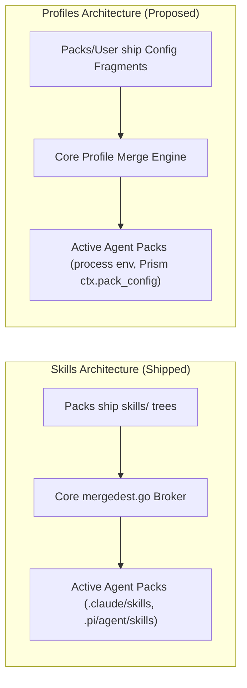

# Pack Profiles: Cross-Pack Config Fragments and Generic Profile Merging

**Status:** DRAFT, 2026-08-29. Nothing built.

**The short version.** `agent_profiles` is an architectural inversion: it leaks the concept of "agents" into core and forces Go-level runtime special-casing ([`internal/cli/run/assemble.go:722`](../../internal/cli/run/assemble.go#L722)). This design replaces it with **Pack Profiles** and **Pack Config Fragments** — a generic, RFC-7386 JSON Merge Patch object model. Packs can ship configuration fragments targeting other packs (e.g. an `aws-bedrock` pack layering Bedrock configuration into `claude`), users can define and swap named profiles globally or per-pack, and core automatically projects standard keys (such as `env`) into the jail without requiring per-pack Lua boilerplate or Go-side hardcoding.

**The most important sections in this doc are §3 (Prototypes & Pros/Cons) and §4 (The Skills Architecture Parallel)** — comparing how providers can be represented as generic fragments and showing how this mirrors Core's proven skills brokering model.

**Reads with:** [`pack-code-separation.md`](pack-code-separation.md) (the mandate that core knows no agents), [`pack-config-collaboration.md`](pack-config-collaboration.md) (surface sharing and `config-overlay`), [`agent-auth-modes.md`](agent-auth-modes.md) (the original auth mode design being refactored), and [`pack-system.md`](pack-system.md) (the pack layer model).

---

## 1. Principles & Verdict Up Front

The design rests on four core principles:

1. **P1 — Core Knows Packs, Not Agents.** There is no `agent_profiles`, no `YOLO_AGENT_PROFILES`, and no switch on `claude` in runtime assembly. Everything operates on pack identifiers (slugs), manifest contributions, and generic configuration dictionaries.
2. **P2 — A Pack Profile is a Generic Merged Object.** A pack configuration/profile is an atomic JSON/JSONC dictionary ($$\text{env} + \text{provider} + \text{settings}$$) composed via standard RFC-7386 merge patch semantics.
3. **P3 — Packs Can Ship Fragments for Other Packs.** A pack is not restricted to configuring itself. It can declare declarative configuration fragments that target other packs (e.g. an `aws-bedrock` pack contributing Bedrock provider/env definitions to the `claude` pack).
4. **P4 — Zero-Boilerplate Projection with Escape-Hatch Fallback.** Standard configuration facets (process environment variables, standard OpenAI/Anthropic endpoint structures) project automatically into the runtime environment without requiring bespoke Lua derivation in every pack. For idiosyncratic dialects (e.g. Codex TOML or Pi JSON), the pack's `derive.lua` receives the resolved composite object as `ctx.pack_config` / `ctx.profile`.

---

## 2. Diagnosis: What Exists Today and Why It Breaks

The existing implementation in [`agent-auth-modes.md`](agent-auth-modes.md) achieved launch-time swapping, but introduced three structural defects:

### 2.1 The Architectural Inversion (`agent_profiles`)
In [`internal/config/config.go:67`](../../internal/config/config.go#L67) and [`internal/config/validate.go:902-922`](../../internal/config/validate.go#L902-L922), core defines `agent_profiles` as a top-level schema key. 
This contradicts the fundamental invariant stated in [`AGENTS.md`](../../AGENTS.md):
> *"AGENTS ARE PACKS. Core does not know what an agent is. There is no agent registry, no agents config key, and no YOLO_AGENTS."*

By naming the key `agent_profiles` and expecting pack names (`pi`, `claude`, `codex`) as keys, core re-introduced the very domain abstraction it spent months removing.

### 2.2 Imperative Residue in Core Assembly
Because core treated Claude's Bedrock auth mode as a special case, [`internal/cli/run/assemble.go:722-754`](../../internal/cli/run/assemble.go#L722-L754) contains hardcoded Go logic:

```go
// assemble.go:722 — hardcoded special case in core runner
if prof, ok := effectiveProfiles.Get("claude"); ok && prof == "bedrock" {
    env = append(env, "-e", "CLAUDE_CODE_USE_BEDROCK=1")
    if provs := cfgMap(cfg, "providers"); provs != nil {
        if bedVal, ok := provs.Get("bedrock"); ok {
            // Extracts region, Opus/Haiku/Sonnet model IDs and sets ANTHROPIC_DEFAULT_*
        }
    }
}
```

This violates pack isolation: adding a new auth mode to Claude or a new agent pack requires modifying Go code in core.

### 2.3 The "Core Knows Providers" Redundancy
In [`internal/config/config.go:88`](../../internal/config/config.go#L88) and [`internal/config/validate.go:840-900`](../../internal/config/validate.go#L840-L900), Core hardcodes:
```go
knownProviderKeys = set("base_url", "wire_api", "api_key_env", "models", "region", "capabilities")
```
Unlike MCP servers (which Core spawns as child processes) or LSP servers (which Core installs via npm/go), Core **never connects to, executes, or manages an LLM provider**. A provider is pure configuration data consumed by in-jail tools or exported as env vars. Type-checking `base_url` in Go makes Core pretend to understand LLM semantics while being nothing more than a data conduit.

---

## 3. Prototypes & Comparison: How Far Should Genericism Go?

To evaluate how to replace hardcoded `providers` with generic fragments, we examine three concrete prototypes.


---

### 3.1 Prototype 1: Raw Per-Pack Dialects (The Pure Opaque Extreme)

In this prototype, Core knows nothing, but there is no shared provider schema anywhere. The user writes the exact native dialect for each tool under a profile in `~/.config/yolo-jail/config.jsonc`:

```jsonc
// Prototype 1: Raw per-pack configuration
{
  "profiles": {
    "deepseek": {
      // 1. Pi's native dialect (~/.pi/agent/models.json)
      "pi": {
        "models": {
          "deepseek": {
            "baseUrl": "https://api.deepseek.com/v1",
            "api": "openai-completions",
            "apiKeyEnv": "DEEPSEEK_API_KEY",
            "models": [{ "id": "deepseek-coder", "name": "default" }]
          }
        }
      },
      // 2. OpenCode's native dialect (~/.config/opencode/opencode.json)
      "opencode": {
        "provider": {
          "deepseek": {
            "npm": "@ai-sdk/openai-compatible",
            "baseURL": "https://api.deepseek.com/v1",
            "apiKey": "{env:DEEPSEEK_API_KEY}",
            "models": { "deepseek-coder": { "name": "default" } }
          }
        }
      },
      // 3. Codex's native dialect (~/.codex/config.toml)
      "codex": {
        "model_providers": {
          "deepseek": {
            "base_url": "https://api.deepseek.com/v1",
            "wire_api": "responses",
            "api_key_env": "DEEPSEEK_API_KEY"
          }
        }
      },
      // 4. Claude's native dialect (Environment variables)
      "claude": {
        "env": {
          "ANTHROPIC_BASE_URL": "https://api.deepseek.com/v1",
          "ANTHROPIC_API_KEY": "${DEEPSEEK_API_KEY}"
        }
      }
    }
  }
}
```

#### Pros & Cons of Prototype 1
* 👍 **Pros:**
  * Zero abstraction leak in Core or Prism.
  * Maximum flexibility: any pack receives exactly what its native format expects.
  * No translation layers or intermediate data models.
* 👎 **Cons:**
  * **Extremely ugly and verbose:** The user must memorize and maintain four distinct JSON/TOML dialects for a single LLM endpoint.
  * **Zero reuse:** Adding a fifth tool requires hand-writing a fifth dialect block for every existing profile.
  * **High error rate:** Typographical errors in tool-specific keys are hard to debug.

---

### 3.2 Prototype 2: Generic Shared Fragments + Lua Dialect Projections

In this prototype:
1. Core still knows **zero** provider keys (no `knownProviderKeys`).
2. Core only knows how to merge JSON dictionaries, expand named fragment references, and inject an `"env"` dictionary.
3. The user writes **one** canonical fragment in config.
4. Each pack's `derive.lua` projects that canonical fragment into its own dialect.

```jsonc
// Prototype 2: Canonical Fragments in User Config
{
  // 1. Reusable generic fragment templates
  "fragments": {
    "deepseek": {
      "base_url": "https://api.deepseek.com/v1",
      "wire_api": "openai_completions",
      "api_key_env": "DEEPSEEK_API_KEY",
      "models": { "default": "deepseek-coder" }
    }
  },

  // 2. Map fragments to packs under profile 'deepseek'
  "profiles": {
    "deepseek": {
      "pi": { "provider": "deepseek" },
      "opencode": { "provider": "deepseek" },
      "codex": { "provider": "deepseek" }
    }
  }
}
```

#### How `packs/pi/derive.lua` consumes it:
```lua
-- packs/pi/derive.lua
yolo.derive("pi", "models", function(ctx)
  local cfg = ctx.pack_config or {}
  local prov = cfg.provider
  if not prov or type(prov) ~= "table" or not prov.base_url then
    return {}
  end

  local models = {}
  for alias, id in pairs(prov.models or {}) do
    table.insert(models, { id = id, name = alias })
  end

  return {
    providers = {
      [ctx.profile or "default"] = {
        baseUrl = prov.base_url,
        api = prov.wire_api or "openai-completions",
        apiKeyEnv = prov.api_key_env,
        models = models,
      }
    }
  }
end)
```

#### Pros & Cons of Prototype 2
* 👍 **Pros:**
  * **Clean user ergonomics:** Define the provider once; all packs consume it.
  * **Clean Core:** Core Go code contains no LLM/provider schemas.
  * **Pack-owned dialects:** The translation from generic fields (`base_url`, `models`) to native files (`models.json`) lives in the pack's Lua layer, where it belongs.
* 👎 **Cons:**
  * Requires packs that want to consume generic providers to implement a standard derive mapping (though this is only ~10 lines of Lua).
  * User config still requires mapping packs to profiles (`profiles.deepseek.pi = ...`).

---

### 3.3 Prototype 3: "Provider Packs" (Cross-Pack Shipped Fragments)

In this prototype, instead of the user writing provider configurations in `~/.config/yolo-jail/config.jsonc`, provider integrations ship as **first-class packs** (e.g. `packs/aws-bedrock`, `packs/deepseek`, `packs/ollama`). 

Selecting the pack in `packs: ["claude", "pi", "aws-bedrock"]` automatically layers configuration fragments into target packs:

```jsonc
// packs/aws-bedrock/pack.json
{
  "name": "aws-bedrock",
  "description": "AWS Bedrock provider integration",
  "contributes": [
    // 1. Layer Bedrock into Claude (injects process env vars)
    {
      "kind": "pack-fragment",
      "target": "claude",
      "profile": "bedrock",
      "config": {
        "env": {
          "CLAUDE_CODE_USE_BEDROCK": "1",
          "AWS_REGION": "us-east-1",
          "ANTHROPIC_DEFAULT_OPUS_MODEL": "us.anthropic.claude-opus-5[1m]",
          "ANTHROPIC_DEFAULT_HAIKU_MODEL": "us.anthropic.claude-3-5-haiku-20241022-v1:0"
        }
      }
    },
    // 2. Layer Bedrock into Pi (injects provider definition into models.json)
    {
      "kind": "pack-fragment",
      "target": "pi",
      "profile": "bedrock",
      "config": {
        "provider": {
          "base_url": "http://127.0.0.1:18080/bedrock/v1",
          "wire_api": "openai_completions",
          "models": { "default": "anthropic.claude-v3" }
        }
      }
    }
  ]
}
```

Now, running:
```bash
yolo -p bedrock -- claude
# or
yolo -p bedrock -- pi
```
activates the profile and merges the `aws-bedrock` fragment into `claude` or `pi` with **zero user config** and **zero Go code in Core**!

#### Pros & Cons of Prototype 3
* 👍 **Pros:**
  * **Zero user configuration:** Users just add `"aws-bedrock"` or `"ollama"` to their `packs` list.
  * **Completely decentralized:** Community packs can ship support for custom local inference servers (vLLM, LMStudio) without modifying Core or official agent packs.
  * **Composable:** Multiple provider packs can coexist cleanly without colliding unless activating the same profile name.
* 👎 **Cons:**
  * Requires designing the `pack-fragment` contribution kind in `internal/packdecl`.
  * If a user wants a custom private internal endpoint, they either need to author a local pack or use Prototype 2's user config fragments.

---

### 3.4 Comprehensive Prototype Comparison

| Dimension | Prototype 1 (Raw Dialects) | Prototype 2 (Generic User Fragments) | Prototype 3 (Provider Packs) |
| :--- | :--- | :--- | :--- |
| **Core Go Complexity** | Minimal (Generic Dicts) | Minimal (Generic Dicts + Inlining) | Low (Generic Dicts + `pack-fragment`) |
| **User Ergonomics** | ❌ Awful (Manual multi-dialect JSON) | ✅ Clean (1 shared fragment block) | 🌟 Instant (Zero config, just add pack) |
| **Cross-Pack Modularity** | Low | Medium | 🌟 High (Packs layer into each other) |
| **Maintenance Burden** | User owns all dialects | Pack authors own Lua mapping | Provider pack author owns fragment |
| **Extensibility for Custom Endpoints** | High (but painful) | 🌟 High (easy in `config.jsonc`) | High (via local pack or user layer) |

---

### 3.5 The Synthesized Architecture: Combining Prototypes 2 & 3

The optimal design combines **Prototype 2** and **Prototype 3**:
1. **Core remains strictly generic:** Core validates only that `fragments`, `profiles`, and `pack-fragment` are JSON dictionaries. Core executes RFC-7386 merge patch resolution and auto-injects `"env"`.
2. **Packs ship cross-pack fragments (Prototype 3):** Official and community packs (`aws-bedrock`, `ollama`) ship `pack-fragment` contributions for zero-config onboarding.
3. **Users can declare custom fragments in config (Prototype 2):** Users with custom endpoints or API keys define `fragments` in `~/.config/yolo-jail/config.jsonc` that merge cleanly on top of pack-shipped fragments.

---

## 4. The Architectural Parallel: How Core Handles Skills & Briefings

The proposed Pack Profiles model is **not a new conceptual pattern** in YOLO Jail — it directly parallels how Core handles **Skills** and **Briefings**.



### 4.1 Side-by-Side Comparison

In YOLO Jail, Skills and Briefings represent **shared pools of resources** that multiple agents consume in different, tool-specific ways:

| Subsystem Dimension | Skills Subsystem ([`internal/packload/mergedest.go`](../../internal/packload/mergedest.go)) | Briefing Subsystem | Pack Profiles Subsystem (Proposed) |
| :--- | :--- | :--- | :--- |
| **The Resource Pool** | Markdown skill folders (`skills/*/SKILL.md`) contributed by content packs (e.g. `matt-core`, `configuring-the-jail`) | Markdown prose fragments contributed across selected packs | Configuration dictionaries / fragments (`env`, `provider`, `settings`) contributed by provider packs or user config |
| **Consumer Declaration** | Agent pack declares a consumption slot: `{ kind: "skills", into: ".claude/skills" }` | Agent pack declares a briefing destination: `{ kind: "briefing", into: "AGENTS.md" }` | Agent pack declares a profile/config surface in Lua or receives `ctx.pack_config` and `env` |
| **Content Origin** | Zero-ceremony packs ship `skills/` without knowing which agent will read them | Content packs ship `AGENTS.md` prose without knowing agent file names | Provider packs or user fragments ship config without knowing tool-specific JSON formats |
| **Core's Role** | **Broker/Resolver**: Collects skills from all source packs, queries active agent packs for `into` paths, and fans the merged tree out | **Broker/Resolver**: Concatenates briefing text from all packs and writes to declared destinations | **Broker/Resolver**: Merges config fragments from active packs/profiles and projects them into `env` and `ctx.pack_config` |
| **Agent Knowledge in Core** | **Zero**: Core has no hardcoded `".claude/skills"`; it reads destinations from selected manifests | **Zero**: Core has no hardcoded briefing filenames; it reads from active manifests | **Zero**: Core has no hardcoded `claude` Bedrock checks or provider schemas; it merges JSON and injects `env` |

### 4.2 Why This Pattern Works
As noted in [`internal/packload/mergedest.go:20-25`](../../internal/packload/mergedest.go#L20-L25):
> *"THE DESTINATIONS COME FROM THE SELECTED PACK SET. An agent pack's skills contribution exists to NAME the directory its agent reads from, and its briefing names the file its agent reads instructions from; a content pack merges into the destinations those packs name. So 'which destinations?' is answered by the packs list — the one place the user has already stated which agents they use — and not by core knowing any tool's name."*

Pack Profiles follow this exact same design:
1. **Providers/Fragments are the content pool** (like `skills/`).
2. **Agent packs are the consumers** declaring how they consume that content (via `env` and `derive.lua`).
3. **Core is the agnostic broker** resolving and delivering the data based strictly on the user's selected `packs` list.

---

## 5. Manifest Schema: `kind: "pack-fragment"`

A pack declares configuration fragments targeting other packs in its `pack.json`:

```jsonc
{
  "name": "aws-bedrock",
  "contributes": [
    {
      "kind": "pack-fragment",
      "target": "claude",
      "profile": "bedrock",
      "config": {
        "env": {
          "CLAUDE_CODE_USE_BEDROCK": "1",
          "AWS_REGION": "us-east-1"
        }
      }
    }
  ]
}
```

### 5.1 Field Definitions

| Field | Type | Description |
| :--- | :--- | :--- |
| `kind` | `string` | Must be `"pack-fragment"`. |
| `target` | `string` | Target pack slug (e.g. `"claude"`, `"pi"`). |
| `profile` | `string` (optional) | Profile name this fragment binds to. If omitted, applies globally to `<target>` across all profiles. |
| `config` | `object` | JSON Merge Patch configuration dictionary (`env`, `provider`, `settings`). |

---

## 6. Resolution & Merge Pipeline

When yolo prepares a container launch, it resolves the effective configuration for each active pack:

```
┌─────────────────────────────────────────────────────────────┐
│ 1. Base Pack Defaults (Target pack's own manifest)          │
└──────────────────────────────┬──────────────────────────────┘
                               │ merge
                               ▼
┌─────────────────────────────────────────────────────────────┐
│ 2. Cross-Pack Shipped Fragments (from selected packs)       │
└──────────────────────────────┬──────────────────────────────┘
                               │ merge
                               ▼
┌─────────────────────────────────────────────────────────────┐
│ 3. User-Level Pack Profiles (~/.config/yolo-jail/...)       │
└──────────────────────────────┬──────────────────────────────┘
                               │ merge
                               ▼
┌─────────────────────────────────────────────────────────────┐
│ 4. Workspace Pack Profiles (yolo-jail.jsonc)                │
└──────────────────────────────┬──────────────────────────────┘
                               │ merge
                               ▼
┌─────────────────────────────────────────────────────────────┐
│ 5. CLI Transient Overrides (-p, --profile)                  │
└──────────────────────────────┬──────────────────────────────┘
                               │
                               ▼
            [ Fully Resolved Composite Pack Object ]
```

### 6.1 RFC-7386 Merge Rules
1. **Objects / Maps (`env`, `settings`, `models`)**: Recursively merged. Keys in higher-precedence layers overwrite keys in lower layers. Setting a key to `null` deletes it (tombstoning).
2. **Scalars / Strings**: Higher-precedence value wins.
3. **Fragment Expansion**: If `"provider"` is a string, it is expanded against the merged `fragments` table before merging.

---

## 7. Runtime Projection: Zero-Boilerplate vs. Custom Fallback

### 7.1 Automatic Projection (Core-Handled)

Core inspects the resolved pack object and automatically applies standard domains:

1. **Automatic Environment Variables (`env`)**:
   Any key-value pair in `pack_config.env` is automatically exported into the container process environment when launching that pack's binary (or globally if the pack is active).
   *This completely removes the hardcoded Bedrock block in [`internal/cli/run/assemble.go:722`](../../internal/cli/run/assemble.go#L722)!*
2. **Prism Surface Delivery**:
   Core passes the resolved composite pack configuration object into Prism as `ctx.pack_config` and the active profile name as `ctx.profile`.

---

## 8. CLI Ergonomics & Launch-Time Swapping

The CLI front door is unified around generic profile flags, deprecating tool-specific flags like `--claude-auth`:

```bash
# 1. Target the binary being executed (e.g. pi) with a profile
yolo -p glm -- pi
yolo --profile glm -- pi

# 2. Activate a profile globally across all active packs
yolo --profile dev

# 3. Explicit multi-pack profile assignment
yolo --pack-profile pi=glm,claude=bedrock
```

### Deprecation & Compatibility
* `yolo --claude-auth=bedrock` $\rightarrow$ Aliased to `--pack-profile claude=bedrock` with a deprecation notice.
* `--agent-profile` $\rightarrow$ Aliased to `--pack-profile`.

---

## 9. Security & Scope Boundaries

Cross-pack configuration fragments and profiles interact with YOLO Jail's trust model:

| Scope / Source | Authority & Placement | Gate / Approval |
| :--- | :--- | :--- |
| **User Config** (`~/.config/yolo-jail/`) | Full authority over endpoints, API key env vars, and profiles. | None (User-owned). |
| **Workspace Config** (`yolo-jail.jsonc`) | Can select active profiles or define repo-specific profiles. | Subject to config-change approval prompt if altering endpoints. |
| **Official Shipped Packs** (`packs/*`) | Can contribute `pack-fragment` definitions. | Pre-audited in repo. |
| **Fetched Third-Party Packs** | Can contribute `pack-fragment` definitions. | Disclosed in `yolo pack footprint` and approved during pack install. |

> [!WARNING]
> **Host Access Boundary:** `pack-fragment` can set process environment variables (`env`), but cannot grant host file reads or loopholes. Host access grants remain governed exclusively by `reads-host`, `mount`, and `loophole` contributions.

---

## 10. Non-Goals & What This Does Not License

* **Not Replacing Static File Overlays (`config-overlay`)**: `config-overlay` remains the dedicated mechanism for contributing static keys to specific file surfaces (e.g. `fileSuggestion` in `.claude/settings.json`). `pack-fragment` operates at the semantic pack configuration level.
* **Not an Arbitrary IPC Channel**: `pack-fragment` is declarative data merged at launch time; it is not runtime inter-pack communication.
* **Not Re-introducing Agents**: Core does not maintain an agent enum or registry. A pack target in `pack-fragment` is simply a pack slug string.

---

## 11. Alternatives Considered

| Alternative | Summary | Verdict |
| :--- | :--- | :--- |
| **Alt 1: Opaque Pack Settings (`packs.<name>.settings`)** | Provide an opaque dictionary per pack, similar to loophole settings. | **Rejected.** Fails to support cross-pack profiles (e.g. `aws-bedrock` contributing to `claude`) and prevents unified CLI profile swapping (`-p glm`). |
| **Alt 2: Pure Lua-Only Resolution** | Leave all profile resolution to Lua in each pack's `derive.lua`. | **Rejected.** Forces every pack author to reinvent the same 50-line config-to-profile mapping boilerplate and leaves environment variable injection unsolved. |
| **Alt 3: Retain `agent_profiles` with Aliases** | Keep `agent_profiles` in core and just add a generic alias. | **Rejected.** Perpetuates the architectural leak in core and leaves the `assemble.go` Bedrock hardcode in place. |

---

## 12. Risks & Mitigations

| Risk | Mitigation |
| :--- | :--- |
| **Fragment Collisions** (Multiple packs contributing conflicting keys to profile `bedrock` on `claude`) | `yolo pack footprint` reports all fragment claims. Collisions on non-map keys are flagged during validation. |
| **Config Migration Breakage** (Users with existing `agent_profiles` in user config) | Core auto-migrates `agent_profiles` $\rightarrow$ `pack_profiles` with a warning during `yolo check` and launch. |
| **Target Pack Missing** (Pack A ships a fragment for Pack B, but Pack B is not selected) | Inert fragments are skipped cleanly without error (similar to how skills destinations work when unselected). |

---

## 13. Open Questions

1. 💬 **OQ-1: Global profile name vs. pack-scoped profile mapping in config.** Should `pack_profiles` in user config be keyed first by profile name (`profiles.bedrock.claude`) or by pack name (`pack_profiles.claude.bedrock`)?
   
   _Leaning:_ Key by profile name first (`profiles.<profile>.<pack>`) because a user thinking in terms of "dev", "bedrock", or "deepseek" wants to group the cross-tool configuration together in one block.

   **Answer:**
   > _(empty — fill in when decided)_

2. 💬 **OQ-2: Fragment interpolation vs literal expansion.** When a pack fragment specifies `"provider": "deepseek"`, should Core resolve `fragments.deepseek` and inline it, or pass the reference string directly to Lua?
   
   _Leaning:_ Core expands string references from `fragments` before calling Prism so that Lua derive functions always receive a fully materialized dictionary.

   **Answer:**
   > _(empty — fill in when decided)_

3. 💬 **OQ-3: Should `pack-fragment` support conditional activation based on selected packs?** For example, "apply this fragment to `claude` only if `aws-bedrock` AND `tavily` are both active".
   
   _Leaning:_ No for v1. Keep fragment activation dependent only on the contributing pack being selected and the named profile being active. Conditional multi-pack dependencies add combinatorial complexity without clear current need.

   **Answer:**
   > _(empty — fill in when decided)_

4. 💬 🤷 **OQ-4: CLI Shorthand Flag Collision.** Is `-p` reserved exclusively for `--profile` / `--pack-profile`, or does it risk collision with future flags?
   
   _Leaning:_ `-p` is already used for profile selection in `agent-auth-modes.md` and is the standard shorthand in CLI tools. Keep `-p` as the alias for `--profile`.

   **Answer:**
   > _(empty — fill in when decided)_
