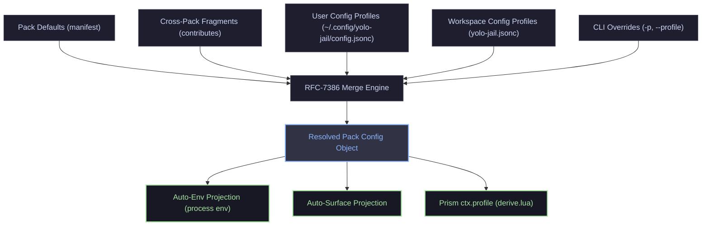

# Pack Profiles: Cross-Pack Config Fragments and Generic Profile Merging

**Status:** DRAFT, 2026-08-29. Nothing built.

**The short version.** `agent_profiles` is an architectural inversion: it leaks the concept of "agents" into core and forces Go-level runtime special-casing (`internal/cli/run/assemble.go:722`). This design replaces it with **Pack Profiles** and **Pack Config Fragments** — a generic, RFC-7386 JSON Merge Patch object model. Packs can ship configuration fragments targeting other packs (e.g. an `aws-bedrock` pack layering Bedrock configuration into `claude`), users can define and swap named profiles globally or per-pack, and core automatically projects standard keys (such as `env`) into the jail without requiring per-pack Lua boilerplate or Go-side hardcoding.

**The most important section in this doc is §4 and §5** — how cross-pack configuration fragments merge and project without forcing every pack author to reinvent config-to-profile mappings.

**Reads with:** [`pack-code-separation.md`](pack-code-separation.md) (the mandate that core knows no agents), [`pack-config-collaboration.md`](pack-config-collaboration.md) (surface sharing and `config-overlay`), [`agent-auth-modes.md`](agent-auth-modes.md) (the original auth mode design being refactored), and [`pack-system.md`](pack-system.md) (the pack layer model).

---

## 1. Principles & Verdict Up Front

The design rests on four core principles:

1. **P1 — Core Knows Packs, Not Agents.** There is no `agent_profiles`, no `YOLO_AGENT_PROFILES`, and no switch on `claude` in runtime assembly. Everything operates on pack identifiers (slugs), manifest contributions, and generic configuration dictionaries.
2. **P2 — A Pack Profile is a Generic Merged Object.** A pack configuration/profile is an atomic JSON/JSONC dictionary ($$\text{env} + \text{provider} + \text{settings}$$) composed via standard RFC-7386 merge patch semantics.
3. **P3 — Packs Can Ship Fragments for Other Packs.** A pack is not restricted to configuring itself. It can declare declarative configuration fragments that target other packs (e.g. an `aws-bedrock` pack contributing Bedrock provider/env definitions to the `claude` pack).
4. **P4 — Zero-Boilerplate Projection with Escape-Hatch Fallback.** Standard configuration facets (process environment variables, standard OpenAI/Anthropic endpoint structures) project automatically into the runtime environment without requiring bespoke Lua derivation in every pack. For idiosyncratic dialects (e.g. Codex TOML or Pi JSON), the pack's `derive.lua` receives the resolved composite object as `ctx.pack_config` / `ctx.profile`.

---

## 2. Diagnosis: What Exists Today and Why It Breaks

The existing implementation in [`agent-auth-modes.md`](agent-auth-modes.md) achieved launch-time swapping, but introduced three structural defects:

### 2.1 The Architectural Inversion (`agent_profiles`)
In [`internal/config/config.go:67`](../../internal/config/config.go#L67) and [`internal/config/validate.go:902-922`](../../internal/config/validate.go#L902-L922), core defines `agent_profiles` as a top-level schema key. 
This contradicts the fundamental invariant stated in [`AGENTS.md`](../../AGENTS.md):
> *"AGENTS ARE PACKS. Core does not know what an agent is. There is no agent registry, no agents config key, and no YOLO_AGENTS."*

By naming the key `agent_profiles` and expecting pack names (`pi`, `claude`, `codex`) as keys, core re-introduced the very domain abstraction it spent months removing.

### 2.2 Imperative Residue in Core Assembly
Because core treated Claude's Bedrock auth mode as a special case, [`internal/cli/run/assemble.go:722-754`](../../internal/cli/run/assemble.go#L722-L754) contains hardcoded Go logic:

```go
// assemble.go:722 — hardcoded special case in core runner
if prof, ok := effectiveProfiles.Get("claude"); ok && prof == "bedrock" {
    env = append(env, "-e", "CLAUDE_CODE_USE_BEDROCK=1")
    if provs := cfgMap(cfg, "providers"); provs != nil {
        if bedVal, ok := provs.Get("bedrock"); ok {
            // Extracts region, Opus/Haiku/Sonnet model IDs and sets ANTHROPIC_DEFAULT_*
        }
    }
}
```

This violates pack isolation: adding a new auth mode to Claude or a new agent pack requires modifying Go code in core.

### 2.3 Limits of `config-overlay`
Today, [`config-overlay`](pack-config-collaboration.md) allows a pack to contribute static JSON keys to a static file surface (e.g. `claude/settings`). However:
* It cannot inject dynamic **environment variables** (`CLAUDE_CODE_USE_BEDROCK=1`).
* It cannot define **profile-dependent variations** (e.g., "apply this overlay only when profile `bedrock` is active").
* It requires the contributing pack to know the exact internal file path and JSON schema of the target tool, rather than expressing a semantic configuration bundle.

---

## 3. Data Model: The Generic Merged Pack Configuration

Every pack in an active jail resolves to a **Composite Pack Configuration Object**. 



### 3.1 Schema of a Pack Config / Profile Object

A pack configuration object contains standard, core-recognized namespaces alongside arbitrary pack-specific settings:

```jsonc
{
  // 1. Environment variables injected into the jail process environment
  "env": {
    "CLAUDE_CODE_USE_BEDROCK": "1",
    "AWS_REGION": "us-east-1",
    "ANTHROPIC_DEFAULT_OPUS_MODEL": "us.anthropic.claude-opus-5[1m]"
  },

  // 2. Canonical provider/endpoint definition (optional)
  "provider": {
    "base_url": "https://api.deepseek.com/v1",
    "wire_api": "openai_completions",
    "api_key_env": "DEEPSEEK_API_KEY",
    "models": {
      "default": "deepseek-coder",
      "reasoner": "deepseek-reasoner"
    }
  },

  // 3. Arbitrary pack-specific settings passed through to Prism / derive.lua
  "settings": {
    "temperature": 0.2,
    "max_tokens": 4096
  }
}
```

### 3.2 User and Workspace Configuration

In `~/.config/yolo-jail/config.jsonc` or `yolo-jail.jsonc`, profiles and providers are configured generically without referencing "agents":

```jsonc
{
  // 1. Shared reusable provider catalog (optional)
  "providers": {
    "deepseek": {
      "base_url": "https://api.deepseek.com/v1",
      "wire_api": "openai_completions",
      "api_key_env": "DEEPSEEK_API_KEY",
      "models": { "default": "deepseek-coder" }
    },
    "bedrock-us": {
      "wire_api": "anthropic_bedrock",
      "region": "us-east-1",
      "models": {
        "default": "us.anthropic.claude-opus-5[1m]",
        "haiku": "us.anthropic.claude-3-5-haiku-20241022-v1:0"
      }
    }
  },

  // 2. Generic pack profiles
  "pack_profiles": {
    "claude": {
      "bedrock": {
        "env": { "CLAUDE_CODE_USE_BEDROCK": "1" },
        "provider": "bedrock-us" // expands from providers table or inline object
      }
    },
    "pi": {
      "glm": {
        "provider": "deepseek"
      }
    }
  },

  // 3. Active profile selection (per pack or global default)
  "active_profiles": {
    "claude": "bedrock",
    "pi": "glm"
  }
}
```

> [!NOTE]
> When `"provider": "bedrock-us"` is a string reference, core automatically resolves and inlines the corresponding object from the `providers` catalog during merge resolution.

---

## 4. Cross-Pack Configuration Fragments

A pack can declare configuration fragments targeting other packs using a new contribution kind in `pack.json`: **`pack-fragment`**.

### 4.1 Manifest Declaration: `kind: "pack-fragment"`

An `aws-bedrock` pack can contribute Bedrock configuration directly into the `claude` pack:

```jsonc
// packs/aws-bedrock/pack.json
{
  "name": "aws-bedrock",
  "description": "AWS Bedrock integration and credentials for coding packs",
  "contributes": [
    {
      "kind": "pack-fragment",
      "target": "claude",
      "profile": "bedrock",
      "config": {
        "env": {
          "CLAUDE_CODE_USE_BEDROCK": "1",
          "AWS_REGION": "us-east-1",
          "ANTHROPIC_DEFAULT_OPUS_MODEL": "us.anthropic.claude-opus-5[1m]",
          "ANTHROPIC_DEFAULT_HAIKU_MODEL": "us.anthropic.claude-3-5-haiku-20241022-v1:0"
        }
      }
    },
    {
      "kind": "pack-fragment",
      "target": "pi",
      "profile": "bedrock",
      "config": {
        "provider": {
          "base_url": "http://127.0.0.1:18080/bedrock/v1",
          "wire_api": "openai_completions",
          "models": { "default": "anthropic.claude-v3" }
        }
      }
    }
  ]
}
```

### 4.2 Fragment Properties

| Field | Type | Description |
| :--- | :--- | :--- |
| `kind` | `string` | Must be `"pack-fragment"`. |
| `target` | `string` | Target pack slug (e.g. `"claude"`, `"pi"`). |
| `profile` | `string` (optional) | Profile name this fragment binds to. If omitted, applies globally to `<target>` across all profiles. |
| `config` | `object` | JSON Merge Patch configuration dictionary (`env`, `provider`, `settings`). |

---

## 5. Resolution & Merge Pipeline

When yolo prepares a container launch, it resolves the effective configuration for each active pack:

```
┌─────────────────────────────────────────────────────────────┐
│ 1. Base Pack Defaults (Target pack's own manifest)          │
└──────────────────────────────┬──────────────────────────────┘
                               │ merge
                               ▼
┌─────────────────────────────────────────────────────────────┐
│ 2. Cross-Pack Shipped Fragments (from selected packs)       │
└──────────────────────────────┬──────────────────────────────┘
                               │ merge
                               ▼
┌─────────────────────────────────────────────────────────────┐
│ 3. User-Level Pack Profiles (~/.config/yolo-jail/...)       │
└──────────────────────────────┬──────────────────────────────┘
                               │ merge
                               ▼
┌─────────────────────────────────────────────────────────────┐
│ 4. Workspace Pack Profiles (yolo-jail.jsonc)                │
└──────────────────────────────┬──────────────────────────────┘
                               │ merge
                               ▼
┌─────────────────────────────────────────────────────────────┐
│ 5. CLI Transient Overrides (-p, --profile)                  │
└──────────────────────────────┬──────────────────────────────┘
                               │
                               ▼
            [ Fully Resolved Composite Pack Object ]
```

### 5.1 RFC-7386 Merge Rules
1. **Objects / Maps (`env`, `settings`, `models`)**: Recursively merged. Keys in higher-precedence layers overwrite keys in lower layers. Setting a key to `null` deletes it (tombstoning).
2. **Scalars / Strings**: Higher-precedence value wins.
3. **Provider Name Expansion**: If `"provider"` is a string, it is expanded against the merged `providers` table before merging.

---

## 6. Runtime Projection: Zero-Boilerplate vs. Custom Fallback

A key requirement is that pack authors should not need to write repetitive Lua code in `derive.lua` just to consume a profile.

### 6.1 Automatic Projection (Core-Handled)

Core inspects the resolved pack object and automatically applies standard domains:

1. **Automatic Environment Variables (`env`)**:
   Any key-value pair in `pack_config.env` is automatically exported into the container process environment when launching that pack's binary (or globally if the pack is active).
   *This completely removes the hardcoded Bedrock block in `internal/cli/run/assemble.go:722`!*
2. **Provider Projection for Standard Agents**:
   If a pack does not declare a custom provider derive hook, core's default Prism layer projects `pack_config.provider` into standard formats where applicable.

### 6.2 Prism Lua Fallback (`ctx.pack_config` and `ctx.profile`)

For packs with idiosyncratic configuration files, the Lua derive context is enriched with:
* `ctx.pack_config`: The full resolved configuration object for this pack.
* `ctx.profile`: The active profile name for this pack (e.g. `"bedrock"` or `"default"`).
* `ctx.providers`: The global providers table.

#### Example: `packs/pi/derive.lua` (Cleaned Up)
```lua
-- pi: render ~/.pi/agent/models.json from resolved pack config
yolo.derive("pi", "models", function(ctx)
  local cfg = ctx.pack_config or {}
  local prov = cfg.provider
  if not prov or type(prov) ~= "table" or not prov.base_url then
    return {}
  end

  local models = {}
  for alias, id in pairs(prov.models or {}) do
    table.insert(models, { id = id, name = alias })
  end

  return {
    providers = {
      [ctx.profile or "default"] = {
        baseUrl = prov.base_url,
        api = prov.wire_api or "openai-completions",
        apiKeyEnv = prov.api_key_env,
        models = models,
      }
    }
  }
end)
```

---

## 7. CLI Ergonomics & Launch-Time Swapping

The CLI front door is unified around generic profile flags, deprecating tool-specific flags like `--claude-auth`:

```bash
# 1. Target the binary being executed (e.g. pi) with a profile
yolo -p glm -- pi
yolo --profile glm -- pi

# 2. Activate a profile globally across all active packs
yolo --profile dev

# 3. Explicit multi-pack profile assignment
yolo --pack-profile pi=glm,claude=bedrock
```

### Deprecation & Compatibility
* `yolo --claude-auth=bedrock` $\rightarrow$ Aliased to `--pack-profile claude=bedrock` with a deprecation notice.
* `--agent-profile` $\rightarrow$ Aliased to `--pack-profile`.

---

## 8. Security & Scope Boundaries

Cross-pack configuration fragments and profiles interact with YOLO Jail's trust model:

| Scope / Source | Authority & Placement | Gate / Approval |
| :--- | :--- | :--- |
| **User Config** (`~/.config/yolo-jail/`) | Full authority over endpoints, API key env vars, and profiles. | None (User-owned). |
| **Workspace Config** (`yolo-jail.jsonc`) | Can select active profiles or define repo-specific profiles. | Subject to config-change approval prompt if altering endpoints. |
| **Official Shipped Packs** (`packs/*`) | Can contribute `pack-fragment` definitions. | Pre-audited in repo. |
| **Fetched Third-Party Packs** | Can contribute `pack-fragment` definitions. | Disclosed in `yolo pack footprint` and approved during pack install. |

> [!WARNING]
> **Host Access Boundary:** `pack-fragment` can set process environment variables (`env`), but cannot grant host file reads or loopholes. Host access grants remain governed exclusively by `reads-host`, `mount`, and `loophole` contributions.

---

## 9. Non-Goals & What This Does Not License

* **Not Replacing Static File Overlays (`config-overlay`)**: `config-overlay` remains the dedicated mechanism for contributing static keys to specific file surfaces (e.g. `fileSuggestion` in `.claude/settings.json`). `pack-fragment` operates at the semantic pack configuration level.
* **Not an Arbitrary IPC Channel**: `pack-fragment` is declarative data merged at launch time; it is not runtime inter-pack communication.
* **Not Re-introducing Agents**: Core does not maintain an agent enum or registry. A pack target in `pack-fragment` is simply a pack slug string.

---

## 10. Alternatives Considered

| Alternative | Summary | Verdict |
| :--- | :--- | :--- |
| **Alt 1: Opaque Pack Settings (`packs.<name>.settings`)** | Provide an opaque dictionary per pack, similar to loophole settings. | **Rejected.** Fails to support cross-pack profiles (e.g. `aws-bedrock` contributing to `claude`) and prevents unified CLI profile swapping (`-p glm`). |
| **Alt 2: Pure Lua-Only Resolution** | Leave all profile resolution to Lua in each pack's `derive.lua`. | **Rejected.** Forces every pack author to reinvent the same 50-line config-to-profile mapping boilerplate and leaves environment variable injection unsolved. |
| **Alt 3: Retain `agent_profiles` with Aliases** | Keep `agent_profiles` in core and just add a generic alias. | **Rejected.** Perpetuates the architectural leak in core and leaves the `assemble.go` Bedrock hardcode in place. |

---

## 11. Risks & Mitigations

| Risk | Mitigation |
| :--- | :--- |
| **Fragment Collisions** (Multiple packs contributing conflicting keys to profile `bedrock` on `claude`) | `yolo pack footprint` reports all fragment claims. Collisions on non-map keys are flagged during validation. |
| **Config Migration Breakage** (Users with existing `agent_profiles` in user config) | Core auto-migrates `agent_profiles` $\rightarrow$ `pack_profiles` with a warning during `yolo check` and launch. |
| **Target Pack Missing** (Pack A ships a fragment for Pack B, but Pack B is not selected) | Inert fragments are skipped cleanly without error (similar to how skills destinations work when unselected). |

---

## 12. Open Questions

1. 💬 **OQ-1: Global profile name vs. pack-scoped profile mapping in config.** Should `pack_profiles` in user config be keyed first by profile name (`profiles.bedrock.claude`) or by pack name (`pack_profiles.claude.bedrock`)?
   
   _Leaning:_ Key by pack name first (`pack_profiles.<pack>.<profile>`), with a top-level `active_profiles: { "<pack>": "<profile>" }` or a shorthand `profile: "<name>"` for uniform naming across packs.

   **Answer:**
   > _(empty — fill in when decided)_

2. 💬 **OQ-2: Interpolation of Provider Catalog Entries in Fragments.** When a fragment specifies `"provider": "bedrock-us"`, should core inline the entire provider definition into `pack_config.provider` before calling Prism, or pass the reference string and let Prism resolve it?
   
   _Leaning:_ Inline before calling Prism. Core already resolves `providers` and inlining guarantees that Lua scripts and auto-env projectors always see a fully expanded object.

   **Answer:**
   > _(empty — fill in when decided)_

3. 💬 **OQ-3: Should `pack-fragment` support conditional activation based on selected packs?** For example, "apply this fragment to `claude` only if `aws-bedrock` AND `tavily` are both active".
   
   _Leaning:_ No for v1. Keep fragment activation dependent only on the contributing pack being selected and the named profile being active. Conditional multi-pack dependencies add combinatorial complexity without clear current need.

   **Answer:**
   > _(empty — fill in when decided)_

4. 💬 🤷 **OQ-4: CLI Shorthand Flag Collision.** Is `-p` reserved exclusively for `--profile` / `--pack-profile`, or does it risk collision with future flags?
   
   _Leaning:_ `-p` is already used for profile selection in `agent-auth-modes.md` and is the standard shorthand in CLI tools. Keep `-p` as the alias for `--profile`.

   **Answer:**
   > _(empty — fill in when decided)_
