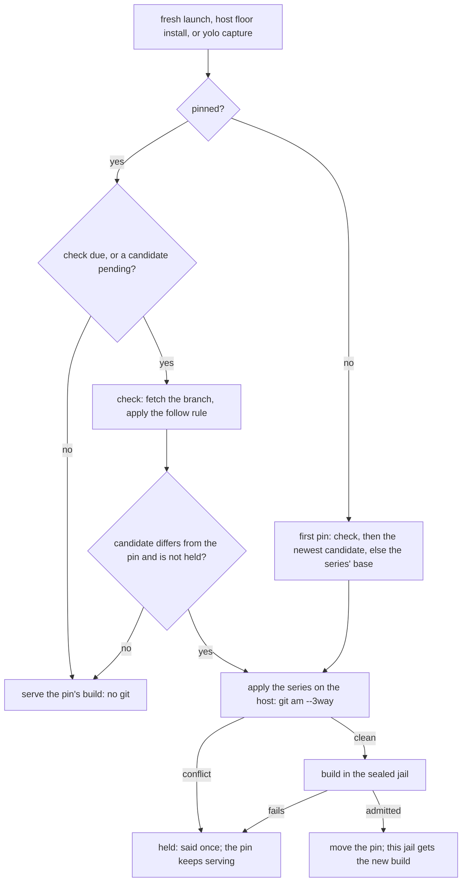

# A patched fork follows its upstream — a patch series that rebuilds itself while it applies

**Status:** 2026-10-03. Nothing built. Evidence read at `026fca672`; the `git am` behavior in
[§5.2](#52-the-operation-and-what-applies-cleanly-means) MEASURED the same day with git 2.55.0 in
scratch repositories.

> **In short.** A patched fork is the existing fork route with its pin turned into a ratchet: the
> upstream moves the candidate, and only an admitted build moves the pin. Everything else, the
> sealed build, the store, the lock and the launch's ref rule, is reused unchanged.

**Why it matters.** The maintainer runs a forked `pi` and today rebases it by hand onto every
upstream release. In his words, 2026-10-03: *"I want another mode where you can specify a set of
patches that will then get applied to the latest of the upstream. So we can essentially have an
evergreen build as long as these patches clean apply."*

**The shape.** A fork pack names the upstream `source` and a `patches` directory. A per-fork
hourly [check](#41-where-the-check-runs) finds a [candidate](#61-the-pin-is-a-ratchet), the
[advance](#61-the-pin-is-a-ratchet) applies the series on the host and builds it in the sealed
capture jail, and the fork lock's pin moves only after that build is admitted.

**Cost.** The one exception to [*"never rebuild on a timer"*](forked-programs-as-packs.md#9-failure-modes),
scoped to forks that declare `patches`; a fresh launch can wait for a build once per upstream move;
and the host runs `git am` over pack content for the first time.

**Start at [§6](#6-the-pin-the-lock-and-the-store-key)**: the pin as the last good build, from which
the failure handling and the notch behavior fall out.

**Needs your ruling:** [OQ-PFK1](#OQ-PFK1), [OQ-PFK2](#OQ-PFK2), [OQ-PFK3](#OQ-PFK3).

**Reads with:** [`forked-programs-as-packs.md`](forked-programs-as-packs.md) (the fork route this
extends; its ledger is the ground truth for every FP-D cited here),
[`patched-forks-plan.md`](patched-forks-plan.md) (the implementation sketch, incomplete while the
three questions are open), [`program-delivery.md`](program-delivery.md) (the agent-dependency
evergreen rule this mode brings forks under).

---

## 1. The verdict, and five principles

The request, whole, as the maintainer made it on 2026-10-03: *"For the fork stuff that we're
currently using for a PI fork, I want another mode where you can specify a set of patches that will
then get applied to the latest of the upstream. So we can essentially have an evergreen build as
long as these patches clean apply. So basically you will still detect updates in the upstream. When
that happens you will fetch the upstream, apply the patches, and then build so that we don't have to
just do essentially clean rebases for every new upstream version."* It reverses the fork route's
[patch-set non-goal](forked-programs-as-packs.md#1-goal-and-non-goals) for this mode only.

**Build it as a field on the existing route, not as a new route.** A patched fork is a `program`
with `via: "source"` and `fork_of`, exactly as a fork is today
([FP-D5](forked-programs-as-packs.md#FP-D5)), plus one field, `patches`. Its `source` names the
**upstream** repository instead of a fork repository. The sealed build
([FP-D9](forked-programs-as-packs.md#FP-D9): a build jail handed no credential and nothing that
writes outside its own workspace), the capture store, the
`build` receipt, the fork lock and the jail's delivery are the fork route's, unchanged in shape.

Two terms, both coined here:

- A **plain fork** *(coined here)* is the fork route as built: a `source` pinned at one commit,
  moved only by `yolo pack update` ([FP-D18](forked-programs-as-packs.md#FP-D18)). It is not a new
  thing; the name only tells it apart.
- A **patched fork** *(coined here)* is a fork that declares `patches`: its `source` is the
  upstream, its bytes are the upstream at a commit with the series applied, and its pin follows the
  upstream for as long as the series applies and builds. It is not a rebase of a fork branch (no
  fork repository is involved) and not a plain fork with a moving ref (the pin moves only through a
  build).

Why this fits the product rather than bending it: a forked agent is an **agent dependency**
(coined in [program-delivery.md §3.5](program-delivery.md#35-the-second-axis-who-the-dependency-serves-amendment-2026-09-03)),
and the ruled policy for that class is *latest*, refreshed at most hourly
([OQ-PD11, OQ-PD12](program-delivery.md#decision-ledger), 2026-09-03). A plain fork pins one,
which that rule says the class does not do; the patched fork brings a forked agent back under its
class's own rule.

**The five principles**, numbered so later sections can cite them:

- **P1. The ref decides what moves**, as it does for a pack ([`OQ-PF1`](../reference/pack-system.md#oq-pf1),
  the maintainer's *"yes, I want this"*, 2026-09-25). A branch moves; a tag or a commit holds
  ([§3.3](#33-what-the-latest-of-the-upstream-is)).
- **P2. The pin is the last good build.** It moves only to a candidate whose build this machine
  admitted ([§6.1](#61-the-pin-is-a-ratchet)).
- **P3. The series is data on the host and code only in the jail.** It is applied on the host,
  where nothing from the patches or the upstream runs, and built in the sealed jail; nothing patched
  is written to the user's tree ([§5](#5-applying-the-series)).
- **P4. A steady-state launch runs no git.** One per-fork hourly check gates every git run
  ([§4.2](#42-the-throttle)).
- **P5. A series that stops applying costs a line, never the launch** and, under
  [OQ-PFK1](#OQ-PFK1)'s leaning, never the program ([§8](#8-failure-and-the-next-step)).

## 2. What exists today, precisely

Read at `026fca672`.

| Piece | What it does today | Where |
| :--- | :--- | :--- |
| The fork declaration | `fork_of`, `source`, `build`, `produces` on a `program` with `via: "source"`; nothing else that moves bytes | [`contributes.go:48-88`](../../internal/packdecl/contributes.go#L48-L88), [`fork.go:130-162`](../../internal/packdecl/fork.go#L130-L162) |
| The recipe hash | sha256 of the JSON array `[build, sorted produces, subdir]` | `ForkRecipe`, [`fork.go:280-286`](../../internal/packdecl/fork.go#L280-L286) |
| The fork lock | `forks.lock.json`, one `{key, source, ref, commit}` per fork, schema 1, decoded with unknown fields ignored | [`forklock.go:34-52`](../../internal/packsrc/forklock.go#L34-L52), [`:77`](../../internal/packsrc/forklock.go#L77) |
| The launch's pin | pins an unpinned fork once; a standing pin returns with no git run and no lock taken | `PinForks`, [`forkpin.go:79-115`](../../internal/packsrc/forkpin.go#L79-L115) |
| The ref rule and its fetch | the **per-mirror step**, [FP-D18](forked-programs-as-packs.md#FP-D18)'s name for the launch refresh's fetch-and-resolve of one repository: a branch is fetched when its last good fetch is over an hour old, and every tag a fetch moved is put back | `refreshMirror`, [`refresh.go:293-427`](../../internal/packsrc/refresh.go#L293-L427); `BranchRefreshInterval`, [`:67`](../../internal/packsrc/refresh.go#L67) |
| A git run before the stamp | the per-mirror step reads every ref with `rev-parse` before it reads the stamp | [`refresh.go:316-335`](../../internal/packsrc/refresh.go#L316-L335) |
| Store git hygiene | no hooks, no fsmonitor, a cleaned environment, no lazy fetch outside a receiving run | `storeGitConfig`, [`store.go:276`](../../internal/packsrc/store.go#L276); [`store.go:322-325`](../../internal/packsrc/store.go#L322-L325) |
| The build act | lock per build, hit after the lock, checkout copied on the host into a staging workspace, sealed jail, `produces` check, admit, `build` receipt | `buildFork`, [`cli/forkbuild.go:107-170`](../../internal/cli/forkbuild.go#L107-L170) |
| The source checkout | the pinned commit's tree, copied on the host, links copied as links | `checkOutForkSource`, [`cli/forkbuild.go:310-326`](../../internal/cli/forkbuild.go#L310-L326) |
| The hit check | newest entry per (bin, platform, source), a hit only at the asked revision and recipe | `resolveForkBuild`, [`capturematerialize.go:311-332`](../../internal/cli/capturematerialize.go#L311-L332) |
| A failed launch build | said, nothing stored, and the next launch builds it again: no memo | [`cli/forkbuild.go:202-207`](../../internal/cli/forkbuild.go#L202-L207) |
| Where a launch pins, and where it builds | pin above the dispatch on every launch, attach included; build in the fresh-launch path only | [`run.go:319`](../../internal/cli/run/run.go#L319), [`run.go:1330`](../../internal/cli/run/run.go#L1330) |
| The jail's view | reads its fork decisions once, at boot, from one env pair | `ForkBuildsEnv`, [`forklauncher.go:12-13`](../../internal/entrypoint/forklauncher.go#L12-L13), [`:40`](../../internal/entrypoint/forklauncher.go#L40) |
| A failure memo with back-off | per (bin, platform), a day doubling to a week, reset by a new yolo | `capture.AutoFailure`, [`autofailure.go`](../../internal/capture/autofailure.go); [`autocapture.go:96-100`](../../internal/cli/autocapture.go#L96-L100) |

Three of these decide most of the design. **The per-mirror step is reusable as it is**, because
every fetch of a mirror brings all of its branches and tags, so the check's fetch of the followed
branch brings new releases too ([§4.3](#43-the-check-itself)). **It cannot be the throttle**, because it runs git before it reads
its stamp. **The hit check is already newest-then-check**, so a store that admits only successful
candidates serves the last good build without a new lookup ([§6.3](#63-the-store-key)).

## 3. The declaration

### 3.1 The fields

The stand-in fork the plan measured ([its step 7 run](forked-programs-as-packs-plan.md#steps-1-to-3-on-a-stand-in-fork-2026-10-01)),
rewritten as a patched fork:

```jsonc
{
  "kind": "program", "bin": "pi", "via": "source", "fork_of": "pi",
  "source": "git+https://github.com/earendil-works/pi?ref=main",  // the UPSTREAM, and the branch it is read from
  "patches": "patches",                                           // a directory in this pack
  "follow": "release",                                            // "release", "release:<prefix>" or "head"
  "build": "npm ci --ignore-scripts && npm run build && cd packages/coding-agent && npm install -g \"$(npm pack --silent)\"",
  "produces": [".npm-global/bin/pi", ".npm-global/lib/node_modules/@earendil-works/pi-coding-agent"]
}
```

| Field | Meaning | Validated |
| :--- | :--- | :--- |
| `source` | The upstream repository, with the mandatory `?ref=` ([`addr.go:17`](../../internal/packsrc/addr.go#L17)) naming the branch to follow, or a tag or commit to hold at | as today ([`fork.go:169-180`](../../internal/packdecl/fork.go#L169-L180)); the ref's kind is read at the check |
| `patches` | A clean pack-relative directory holding the series ([§3.2](#32-the-series)). Its presence is the opt-in to this mode | statically: relative, no `..`, only beside `via: "source"`; its contents at the check |
| `follow` | What a branch ref yields: `release` (the newest release on it), `release:<prefix>` (the same, for tags named `<prefix><version>`), or `head` (its newest commit). Default: [OQ-PFK2](#OQ-PFK2)'s leaning, `release` | statically: the grammar, and only beside `patches` |

`follow` without `patches` is refused, naming the reason: a plain fork's pin moves only by
`yolo pack update` ([FP-D18](forked-programs-as-packs.md#FP-D18)), and following an upstream is
this mode's opt-in, not a dial on that one.

### 3.2 The series

**The series** is the ordered set of patch files a patched fork applies, in the field-standard sense
of a [`git format-patch`](https://git-scm.com/docs/git-format-patch) series. Its rules:

- **Its members are the regular files in the `patches` directory whose names end in `.patch`**, in
  byte-wise lexical order of their names. `git format-patch` numbers its output `0001-…`, so its
  order is the series' order. Nothing else is read: no series file, no subdirectory, no other
  extension.
- **Each member is a mail-format patch, as `git format-patch` writes it**, because `git am` is the
  operation ([§5.2](#52-the-operation-and-what-applies-cleanly-means)). A plain `diff -u` is
  refused at the check, naming the file and the `format-patch` command that makes one.
- **A symlink, or any non-regular file, named `*.patch` is refused.** The host reads these files
  with a pack's authority; a link would make the series a read of whatever it points at.
- **An existing directory with no `*.patch` is a series of zero patches:** the upstream as it is,
  followed. A missing or unreadable directory is never read as empty, because a typo would then
  build the upstream unpatched under the fork's name: it is the fork's reason
  ([§8](#8-failure-and-the-next-step)).
- **Paths are the repository's.** `format-patch` writes paths from the repository root, so the series
  applies to the whole commit even when `source` names a `//subdir`; the build then sees the
  subdirectory, as a plain fork's does. A member that touches only files outside it applies and
  changes nothing the build sees.
- **A series may name its base**: the `base-commit:` line `git format-patch --base` writes into
  the first patch. Two things read it: the first pin's fallback ([§6.4](#64-the-first-pin)) and the
  three-way fallback's preimages ([§5.2](#52-the-operation-and-what-applies-cleanly-means)).

The **series digest** *(coined here)* is the sha256 of the JSON array of `[name, sha256 of the
file's bytes]` pairs in series order. JSON for the reason `ForkRecipe` uses it: no separator can be
spelled inside a value ([`fork.go:277-278`](../../internal/packdecl/fork.go#L277-L278)). A rename
changes the digest and costs one rebuild; that is accepted to keep the digest a function of what
the directory lists.

### 3.3 What "the latest of the upstream" is

The **follow rule** *(coined here)* is P1 applied to a patched fork. The source's ref is read
from the upstream's mirror with the per-mirror step's own lookup (`classifyRef`,
[`refresh.go:503-534`](../../internal/packsrc/refresh.go#L503-L534), a tag before a branch):

| The ref is | The candidate commit is |
| :--- | :--- |
| a branch, `follow: "head"` | the branch's commit |
| a branch, `follow: "release"` | the newest tag merged into the branch whose name is a semantic version, optionally `v`-prefixed |
| a branch, `follow: "release:<prefix>"` | the same, among tags named `<prefix>` followed by a semantic version (a monorepo's per-package tags) |
| a tag, a full commit, or anything else that resolves but is not a branch | that commit, always: the fork is held there and follows nothing |
| unresolvable | none: the fork's reason ([§8](#8-failure-and-the-next-step)) |

The release rule's details, each decided ([PF-D4](#PF-D4)):

- **Newest** is semantic-version precedence ([semver.org §11](https://semver.org/#spec-item-11)),
  never tag date. Build metadata is ignored; a **pre-release** (a version with a `-` suffix) is never
  chosen; a tag that does not parse is ignored.
- **Merged into the branch** is what gives the mandatory ref a meaning in this mode: releases *of
  that line*. A project that cuts releases on `release/1.x` names that branch. The cost: a release
  tagged on a commit no branch contains is invisible, and `follow: "head"` or a tag ref is the way
  around it.
- **A re-pointed tag is not followed.** A fetch puts back every tag it moved
  ([`refresh.go:357-358`](../../internal/packsrc/refresh.go#L357-L358)), so the mirror keeps the
  first object a tag named. A new tag is kept.
- **No ancestry check.** The candidate is whatever the rule names, forward or back: a force-pushed
  head, or a `follow` changed from `head` to `release`, can name an older commit, and it is a
  candidate like any other.

A patched fork is **held** *(coined here)* when its pin is not following: its ref names no branch,
or its newest candidate did not apply or build ([§8](#8-failure-and-the-next-step)). Held is not
unavailable: a held fork serves its pin.

**Holding is spelled with a ref, not a field.** A user who wants to stay on a release writes
`?ref=v0.99.2`, the same spelling that freezes a pack. The series is still applied there, and the
fork rebuilds only if the series or the recipe changes ([§6.1](#61-the-pin-is-a-ratchet)).

## 4. Detection

### 4.1 Where the check runs

The **check** *(coined here)* is the act that reads the upstream for a newer candidate. It runs in
exactly the acts that can build ([OQ-FP4](forked-programs-as-packs.md#14-decision-ledger): eager, at
the notch's readiness act), through one implementation:

- a **fresh jail launch**, in the fork build trigger's slot ([`run.go:1330`](../../internal/cli/run/run.go#L1330)),
  below every attach decision and under the launch lock ([FP-D14](forked-programs-as-packs.md#FP-D14));
- the host floor's install act: `yolo host -- <bin>` and `yolo host apply --assert`
  ([FP-D16](forked-programs-as-packs.md#FP-D16));
- `yolo capture <forked bin>`, and `yolo pack update`, `yolo pack install` and `yolo pack rebase`,
  each forcing it ([§8.3](#83-the-explicit-acts)).

It **never** runs on an attach, a `--dry-run`, inside a jail or inside a capture or build jail. The
last three are the fork pin's exclusions ([`run/forkbuild.go:128-132`](../../internal/cli/run/forkbuild.go#L128-L132),
[`:147-151`](../../internal/cli/run/forkbuild.go#L147-L151)); the first is the build trigger's, since
an attach builds nothing ([FP-D14](forked-programs-as-packs.md#FP-D14)). An attach still prints the
fork's line from the lock, as it does today.

### 4.2 The throttle

**One check per fork per `BranchRefreshInterval` (3600 s,
[`refresh.go:67`](../../internal/packsrc/refresh.go#L67)), measured from the last check attempt,
whatever its outcome.** The interval is the pack refresh's and the agent launchers', so "how often
does something a pack follows move" keeps one answer across the product.

- **The throttle is a file read, never git.** A **check stamp** *(coined here)* per fork key, kept
  in the pack store beside the mirror stamps, is read first. Inside the interval, with nothing
  pending ([§6.2](#62-the-check-record-and-what-is-pending)), the launch serves the pin and runs no
  git and no network. This is P4.
- **It is its own stamp, not the mirror's.** The per-mirror stamp records a fetch for a repository
  and ref, and the launch's pack refresh runs before the fork trigger: a branch pack on the same
  repository and branch would leave it fresh on every launch, and a check gated on it would never
  run. Reading it also takes a `rev-parse` first ([§2](#2-what-exists-today-precisely)).
- **An attempt counts.** A check whose fetch failed still writes the stamp, so an offline machine
  retries once an hour rather than paying a fetch timeout on every launch.

### 4.3 The check itself

Under the fork lock's flock ([`forklock.go:163-179`](../../internal/packsrc/forklock.go#L163-L179)),
re-reading the stamp there:

1. Write the stamp (the attempt).
2. Run the per-mirror step for the source's repository and ref, unchanged: the launch's store
   (`LaunchFetchTimeout`, 60 s per repository, no terminal for git,
   [`refresh.go:75-84`](../../internal/packsrc/refresh.go#L75-L84)), a fetch when the mirror's own
   stamp for that branch is over an hour old, fsck on receipt, tags put back.
3. Apply the follow rule ([§3.3](#33-what-the-latest-of-the-upstream-is)) to what the mirror now
   holds, with no further network.

The per-mirror step needs no change for releases: the source's ref is a branch, a fetch of the
mirror brings every branch and tag ([`store.go:476-477`](../../internal/packsrc/store.go#L476-L477)),
and a tag it added stays.

**Concurrency.** Two launches due at once serialize on the fork lock; the second re-reads a fresh
stamp and runs no git. The build is outside the fork lock, on the build's own lock, where a second
launch waits for the first build and uses it ([FP-D1](forked-programs-as-packs.md#FP-D1)).

**Offline.** A fetch that fails leaves the mirror's own answer in use, as for a pack
([`refresh.go:33-36`](../../internal/packsrc/refresh.go#L33-L36)). The candidate is computed from it,
which is usually the pin, and the launch says once that it could not check, naming the error and
that the next check is in an hour. A machine that has never fetched the upstream and has no pin has
nothing to serve, as a plain fork's first pin does ([FP-D18](forked-programs-as-packs.md#FP-D18)).

## 5. Applying the series

### 5.1 Where it runs

**On the host, before the sealed jail starts, inside the build's own staging workspace in the
capture store, holding the upstream mirror's lock.** The apply is part of the build act's checkout
([`checkOutForkSource`](../../internal/cli/forkbuild.go#L310)): where a plain fork copies a commit's
tree into `src/`, a patched fork gets the upstream commit there with the series applied.

- **A scratch repository** *(the implementer's layout)*: its objects borrowed from the upstream's
  mirror, its git directory outside `src/`, its work tree `src/`. The build sees no `.git`, exactly
  as a plain fork's build does.
- **The store's git hygiene, whole**: no hook, no fsmonitor, a cleaned environment, no terminal, the
  launch's fetch budget, and fsck on everything received ([`store.go:259-276`](../../internal/packsrc/store.go#L259-L276)).
  The committer is a fixed identity, so no user config is consulted for one.
- **Nothing it makes outlives the build.** The staging workspace is deleted when the build ends
  ([`cli/forkbuild.go:136-137`](../../internal/cli/forkbuild.go#L136-L137)), so an upstream followed
  hourly leaves only git objects in the mirror, never a tree per candidate.

Why the host and not the jail (alternative B in [§11](#11-alternatives-with-verdicts)): a three-way
apply needs the upstream's objects, which only the host's mirror holds; the host can say *which
patch conflicts* before paying for a jail; and **no code runs**. `git am` parses patch text and
merges files; hooks are off, and the repository and the patches contribute no executable. The pack
store already checks third-party repositories out on the host for every git pack and every fork, so
the host's exposure grows by a patch parser, not by a new channel.

> [!IMPORTANT]
> **Nothing patched is ever written to the user's tree.** The workspace, the fork pack's own
> directory (whose patch files are read, never written) and any clone of the user's are untouched
> by every act in this design. `yolo pack rebase` prints the command that writes a new series and
> leaves running it to the user ([§8.4](#84-yolo-pack-rebase)).

### 5.2 The operation, and what "applies cleanly" means

**The operation is `git am --3way`, each member in series order, onto a detached HEAD at the
candidate commit.** The series **applies cleanly** when every member is applied and `git am` stops
on none: no conflict, no "patch does not apply", no unreadable member. That is the bar a rebase
without conflicts meets, which is what the maintainer does by hand today.

MEASURED 2026-10-03 with git 2.55.0, in throwaway repositories holding one file of 30 lines or of
5, each patch changing one line (a dash is a case not run):

| Upstream change | `git am` | `git am --3way` | `git cherry-pick` |
| :--- | :--- | :--- | :--- |
| 30 lines: an edit two lines from the patched one, inside its context | fails | applies | applies |
| 30 lines: five lines inserted at the top (an offset) | applies | — | — |
| 30 lines: the patched file renamed | — | applies, to the new name | applies |
| 5 lines: the patch's own change already made, plus an edit elsewhere | fails | applies: *"No changes -- Patch already applied."*, exit 0 | — |
| 5 lines: an edit to the line next to the patched one | fails | conflicts | — |
| 5 lines: a different edit to the patched line | — | conflicts | — |

So `git am` without `--3way`, which is `git apply`'s exact-context rule, holds a series where a
hand rebase is clean, and `--3way` agreed with `cherry-pick` in every case both were run on. Two
consequences, both decided:

- **A member the upstream already contains is clean**, and said once per candidate: *"0001-….patch
  is already in upstream v0.100.0; drop it from `<dir>`"*. The series keeps applying.
- **The fallback needs each member's preimage blobs.** The upstream mirror is a blobless partial
  clone ([`store.go:462-463`](../../internal/packsrc/store.go#L462-L463)), so the apply fetches the
  series' base commit's blobs for the paths the series touches, through the store's checked fetch,
  when the series names one. A series with no `base-commit:` gets the fallback only for blobs the
  mirror already holds. UNMEASURED: no partial mirror has been through this; the scratch-repository
  measurement above used full repositories.

**Never more than that.** No reduced context (`-C`), no fuzz, no merge strategy that prefers one
side, and no conflict resolution of any kind beyond what `git am --3way` does itself.

### 5.3 The patched tree

The **patched tree** *(coined here)* is the git tree object at the scratch repository's HEAD after
the series applied: a content address of exactly the source the build compiles. It is recorded on
the build receipt and in the pin ([§6](#6-the-pin-the-lock-and-the-store-key)). It is a record, not
a key: a second machine that applies the same series at the same commit and gets another tree (a
different git merging differently) builds its own and says so once, naming both trees. It is never
refused for that ([PF-D15](#PF-D15)).

## 6. The pin, the lock and the store key

### 6.1 The pin is a ratchet

A patched fork's **pin** is the inputs of its last good build: the upstream commit, the series
digest and the recipe hash, plus the patched tree and, under `follow: "release"`, the tag name.
A **candidate** *(coined here)* is the same tuple for what the manifest and the follow rule ask for
now. Whenever the two differ, the candidate is pending. The **advance** *(coined here)* is the act
that takes a candidate toward the pin: apply the series ([§5](#5-applying-the-series)), build, and,
once the build is admitted, move the pin. It is not the check, which only finds the candidate
([§4](#4-detection)).

**The pin moves to a candidate only after the candidate's build is admitted to this machine's
capture store.** That one rule (P2) is the whole of last-good-build serving: the lock always names a
build that existed when it was written, and a candidate that fails to apply or to build never
touches it. It covers every cause of a candidate, with no case analysis:

| What changed | Candidate |
| :--- | :--- |
| the upstream moved (the check found another commit) | (that commit, current series, current recipe) |
| the series changed (an edited patch, or the fork pack's own refresh) | (the commit the last check found, new series, current recipe) |
| `build` or `produces` changed | (the commit the last check found, current series, new recipe) |
| the ref changed to a tag (a hold) | (the tag's commit, current series, current recipe) |

The move is made under the fork lock, **compare-and-swap**: the entry is re-read and rewritten only
if it still names the pin this advance started from. A launch that finds it already moved (another
launch's advance) leaves it; a stale advance never overwrites a newer pin.

**This is the explicit exception to [*"never rebuild on a timer or on every launch"*](forked-programs-as-packs.md#9-failure-modes)**,
and to [*"a fork that drifts from its lock is reported, never silently refreshed"*](forked-programs-as-packs.md#12-what-this-does-not-license).
It is scoped to forks whose manifest declares `patches`, which is the user's opt-in, and the rebuild
is never silent: the launch that moves a pin says so in a disclosure line, *"updated fork
`pi-fork/pi`: v0.99.2 → v0.100.0, 3 patches; this jail runs the new build"*, which no flag hides
([`OQ-RO3`](../reference/report-tiers.md#why-its-this-way)). Every other rule of the fork route
stands: a plain fork never moves at launch, a hit builds nothing, and a
[near-miss](forked-programs-as-packs.md#9-failure-modes), an entry whose key is not the one asked
for, is never served.

### 6.2 The check record, and what is pending

The **check record** *(coined here)* is one machine-local record per fork key, in the pack store:
the check stamp, the last candidate found, and that candidate's outcome. It is not the lock: it says
what *this machine* tried, and the lock may arrive from another machine with the config.

| Outcome on the record | What later launches do |
| :--- | :--- |
| none, or the candidate equals the pin | serve the pin |
| pending (found, not yet tried) | run the advance on it |
| did not apply (patch, files) | serve the pin; never apply that (candidate, series) again |
| build failed (error, yolo version, count) | serve the pin; retry after a back-off ([§8.1](#81-the-failure-table)) |

It is written only under the fork lock's flock, by the check, the advance and the explicit acts
of [§8.3](#83-the-explicit-acts). A record that cannot be read is no record: the next check starts
over, which costs at most one apply.

### 6.3 The store key

The build key stays [FP-D8](forked-programs-as-packs.md#FP-D8)'s: selection by (bin, platform,
source), and a hit only at the asked revision and recipe ([`capturematerialize.go:311-332`](../../internal/cli/capturematerialize.go#L311-L332)).

- **The revision is the upstream commit**, not a synthetic patched commit. The upstream commit is a
  fact any machine can fetch; a commit yolo made locally exists on no remote
  ([alternative E](#11-alternatives-with-verdicts)).
- **The recipe hash gains the series digest, for a patched fork only.** A patched fork's recipe is
  `ForkRecipe`'s array with the series digest appended; a plain fork's array is byte-for-byte what
  it is today ([`fork.go:283`](../../internal/packdecl/fork.go#L283)), so no existing entry stops
  hitting the day this ships. **Two series never share an entry**: their recipes differ, so neither
  is ever a hit for the other.
- **The `build` receipt gains `series` and `tree`** (the digest and the patched tree), additive
  fields, as [FP-D8](forked-programs-as-packs.md#FP-D8) lets the schema grow.
- **What is served is looked up by the pin's recipe, not the manifest's.** While a candidate is
  pending or failed, the manifest asks for the candidate and the pin names the last good build; the
  launch and the host floor ask the store for the pin. Because the store admits only successful
  candidates and the pin moves right after, the newest entry for the selection key is the pin's in
  every state but one: a crash between the admit and the lock write, which costs one rebuild, the
  price [FP-D8](forked-programs-as-packs.md#FP-D8) already accepts.

### 6.4 The first pin

A patched fork with no pin for its declared source (FP-D18's case) is pinned by its first advance,
with these differences from a plain fork:

- **The lock entry is written after the admit, not before the build.** A patched fork with no
  admitted build has no pin, so a first build that fails leaves no entry and the next launch tries
  again, as a plain fork's failed first build is retried
  ([`cli/forkbuild.go:203-204`](../../internal/cli/forkbuild.go#L203-L204)). The back-off of
  [§8.1](#81-the-failure-table) applies only while a pin is being served.
- **If the series does not apply at the newest candidate, the series' base commit is tried**, when
  the series names one and the follow rule's branch contains it. A series exported from a fork
  branch with `--base` applies there by construction, so a migrating user gets a working program on
  the first launch, and the line says it is held at the base and why.
- **A mode change is a new pin.** An entry made for a plain fork is no pin for a patched fork of the
  same key, and the reverse, even at the same source: the entry records which mode made it.

### 6.5 The lock entry

```jsonc
"pi-fork/pi": {
  "key": "pi-fork/pi",
  "source": "git+https://github.com/earendil-works/pi?ref=main",
  "ref": "main",
  "commit": "<upstream commit of the last good build>",
  "tag": "v0.99.2",              // follow: "release" only
  "series": "<series digest>",
  "tree": "<patched tree>",
  "recipe": "<recipe hash, series included>"
}
```

**The schema stays 1, and the four fields are additive.** Bumping it would make an older yolo refuse
the whole file, every plain fork with it, which is [FP-D7](forked-programs-as-packs.md#FP-D7)'s
reason for a second file in the first place. The cost is that an older yolo that rewrites the lock
for another fork drops these fields, since `LoadForkLock` ignores what it does not know and `Save`
writes only what it decoded ([`forklock.go:77`](../../internal/packsrc/forklock.go#L77),
[`:92-126`](../../internal/packsrc/forklock.go#L92-L126)). A patched entry missing its `recipe` is
therefore read as a pin at that commit whose build inputs are unknown: its candidate is (that
commit, the current series, the current recipe), built as a first pin is.

**Who writes it.** A patched entry is written by an advance whose build was admitted, and by nothing
else; `yolo pack install` and `yolo pack update` still remove the entries of forks that left the
selection, as they do today ([`cli/forkpin.go:112-114`](../../internal/cli/forkpin.go#L112-L114)).

### 6.6 What the mode never does

- **Never moves a pin to a build this machine has not admitted**, and never writes a patched entry
  before the admit.
- **Never runs the check or a build on an attach, a dry run, in a jail or in a build jail.**
- **Never runs git on a launch inside the throttle** with nothing pending.
- **Never builds on the host**, and never applies the series inside the jail.
- **Never writes a patched file into the user's tree**, nor any file into the fork pack.
- **Never falls back to the base's own delivery** when a patched fork has no build, which the fork
  plan's *Don't* list already forbids for a plain fork.
- **Never refuses a launch** over a check, an apply or a build.

## 7. The build and the launch



**The build is the fork route's build act, unchanged**: the same sealed jail, the same `produces`
and link checks, the same per-build lock and its bounded wait (`forkBuildWaitBound`, 20 minutes,
[`cli/forkbuild.go:65`](../../internal/cli/forkbuild.go#L65)). Only its checkout differs
([§5.1](#51-where-it-runs)).

**What a build costs, as measured.** The stand-in, pi's upstream at `v0.99.2`, built in 17 s in a
nested jail ([the plan's run](forked-programs-as-packs-plan.md#steps-1-to-3-on-a-stand-in-fork-2026-10-01)).
The one fork build the maintainer's host logs show, on 2026-10-02, held its sealed jail for about
35 s from the keeper's start to its teardown; that log does not record whether it stored an entry.
Under the hourly check, that is at most one build per fork per upstream move, and under
`follow: "release"` one per release.

**Whether the launch that finds a candidate waits for it is [OQ-PFK3](#OQ-PFK3).** Under its
leaning the launch waits, as a first build makes it wait today
([`cli/forkbuild.go:177-212`](../../internal/cli/forkbuild.go#L177-L212)), and the jail starts on
whichever build the pin names when the advance ends: the new one on success, the last good one on
any failure. The advance's lines come after the launch's *Forks this launch* block, which is printed
above the dispatch from the lock as it stood ([`run/forkbuild.go:165-172`](../../internal/cli/run/forkbuild.go#L165-L172)),
so the move line names the build this jail gets.

## 8. Failure, and the next step

Every stop names its next step ([`happy-path-principle.md`](../reference/happy-path-principle.md)).
"Said once" means on the launch whose check or advance found it; every later launch carries a
short [held](#33-what-the-latest-of-the-upstream-is) suffix on the fork's existing line, *"held at
v0.99.2: upstream v0.100.0 does not take 0002-….patch"*, until the candidate changes. Nothing here
refuses a launch
([§9 of the fork route](forked-programs-as-packs.md#9-failure-modes): a broken fork is one missing
tool).

### 8.1 The failure table

| Failure | Behavior (under [OQ-PFK1](#OQ-PFK1)'s leaning where a pin exists) |
| :--- | :--- |
| The check's fetch fails | the mirror's answer is used; said once per failed check, with the error and *"next check in an hour"* |
| The ref names nothing, or `follow: "release"` finds no release on the branch | with a pin: held, said once, naming `follow: "head"` or a tag ref; with none: no program, the same reason |
| The series directory is missing, unreadable, or holds a link or a plain diff | no candidate: held at the pin, or no program with no pin; the reason names the file |
| A member does not apply at the candidate | recorded against (candidate, series) and **never retried for that pair**; said once: the upstream commit and tag, the member's name, the conflicting files, the pin still serving, and `yolo pack rebase <pack>/<bin>` |
| A member is already upstream | clean ([§5.2](#52-the-operation-and-what-applies-cleanly-means)); said once, naming the file to drop |
| The build fails at the candidate | recorded; retried after [OQ-PD26](program-delivery.md#decision-ledger)'s back-off, a day doubling to a week, reset by a different yolo; said once with the error and `yolo capture <bin>` to retry now |
| The build-lock wait runs out | that launch's failed build, not recorded: another build of the same key holds the lock, as losing the capture lock is not a failure under [OQ-PD26](program-delivery.md#decision-ledger) |
| No pin, and nothing applies or builds | no program, the reason, and the same next step; the next launch tries again |
| The pin's build is gone from the store (a prune, a wiped store) | rebuilt from the pin's own inputs, as a plain fork's miss is, when the series is still the pin's |
| The lock names a commit this machine cannot build (it arrived with the config) | as a plain fork today ([FP-D17](forked-programs-as-packs.md#FP-D17)): no program until it builds here, said with the next step |
| The pin's build is gone from the store and the pin's series is no longer the pack's | the pin cannot be rebuilt; the candidate is built as a first pin is |
| A crash mid-advance | the staging workspace has no admitted entry, so nothing changed; a crash after the admit costs one rebuild ([§6.3](#63-the-store-key)) |

**A conflict is never retried for the same pair** by a launch, because `git am` over the same
commit and the same bytes gives the same answer. The pair changes when the upstream moves again or
the series is edited, and either makes a new candidate; `yolo pack update` retries it on demand.

### 8.2 The conflict message

One message, on the launch that found it:

```text
fork pi-fork/pi: upstream v0.100.0 (3f2a9c1e) does not take the patch series —
  0002-tui-compact-footer.patch conflicts in packages/tui/src/footer.ts
  still running v0.99.2 (8092abf0) + 3 patches
  rebase the series: yolo pack rebase pi-fork/pi
```

### 8.3 The explicit acts

| Act | On a patched fork |
| :--- | :--- |
| `yolo pack update` | forces the check, ignoring the throttle and any recorded outcome, applies the series to the candidate in a scratch tree, and reports *applies; the next launch builds it* or the conflict message. It records the candidate as pending. **It builds nothing and never moves the pin**, since only an admitted build may (P2) |
| `yolo pack install` | the same, for a patched fork with no pin; a pinned one is left alone, as install leaves a pinned plain fork |
| `yolo capture <bin>` | builds a held or pending candidate now, ignoring the back-off; with none, rebuilds the pin's own inputs, as it force-rebuilds a plain fork |
| `yolo pack status` | the pin (upstream commit, tag, patch count, series digest), the check record's candidate and outcome, and when the next check is due; offline, as today |

### 8.4 `yolo pack rebase`

**A new verb, `yolo pack rebase <pack>/<bin> [--onto <ref>]`** *(coined here)*: it reproduces the
apply in a tree the user can work in, and is the next step every conflict names.

1. **Host only.** In a jail it says the fork's mirror and pack live on the host, and names the
   command there.
2. It forces the check, and picks the target: `--onto`, else the held or pending candidate, else
   the newest candidate.
3. It makes a scratch clone at the target from the store's mirror, in yolo's state directory, and
   prints its path. The location is the implementer's; a second run while one is in progress says
   so and names `--restart`.
4. It runs `git am --3way` over the series there.
5. **Clean:** it says the next launch builds it, and removes the clone.
6. **A conflict:** it stops with `git am` mid-series and prints, in order: the member and files;
   `git -C <clone> am --continue`, to run after resolving; and the export that replaces the series,
   removing the old members and then running
   `git -C <clone> format-patch --base=<target> -o <the pack's patches dir> <target>..HEAD`.
   For a fork pack fetched from git, whose directory in the pack store is never written, it names
   the pack's repository to commit the result to instead.

**It never writes the fork pack's files.** The patch directory is the user's source of truth, maybe
a repository with uncommitted work, so yolo prints the command and the user runs it.

## 9. Notch coverage

A notch is where an agent runs: a jail, the host through `yolo host`, or the unbuilt guest
([the fork route's §8](forked-programs-as-packs.md#8-notch-coverage-and-the-one-that-does-not-exist)).

| Notch / backend | Patched fork |
| :--- | :--- |
| **jail, podman (Linux or a macOS VM)** | yes: the check, the host apply and the sealed build run at a fresh launch |
| **jail, Apple Container** | as a plain fork: above the read-only bind floor, yes; below it, no store is mounted and the fork's reason says so ([`run/forkbuild.go:63-68`](../../internal/cli/run/forkbuild.go#L63-L68)). A build may fail to start while another workspace's jail runs, as an Apple Container capture jail cannot start beside a running jail (INFERRED, [OQ-PD25](program-delivery.md#decision-ledger)); that is a failed build, and the pin keeps serving |
| **jail, macos-user** | none: the fork route delivers nothing there ([FP-D3](forked-programs-as-packs.md#FP-D3), [`run/forkbuild.go:91-98`](../../internal/cli/run/forkbuild.go#L91-L98)), and the line says so |
| **`yolo host`, Linux** | yes. The host floor's install act runs the advance through the same implementation ([FP-D16](forked-programs-as-packs.md#FP-D16)), and asks the store for the pin's build; its near-miss check compares against the pin's recipe instead of the manifest's ([`ensure.go:155-162`](../../internal/hostfloor/ensure.go#L155-L162)). FP-D16's *"a fork's floor entry is never polled for an update"* gives way to the check, for a patched fork only. A moved pin reinstalls from a build this machine admitted; one whose manifest says it cannot move out of the jail's home has no floor entry, as FP-D16 says of any build, and the floor's older copy goes by [FP-D17](forked-programs-as-packs.md#FP-D17)'s rule while jails run the new build. The stand-in measured relocatable ([the plan's run](forked-programs-as-packs-plan.md#steps-1-to-3-on-a-stand-in-fork-2026-10-01)) |
| **`yolo host`, macOS** | none, as for every fork: the build is of the jail's platform ([FP-D16](forked-programs-as-packs.md#FP-D16)) |
| **guest** | unbuilt, as every verb there is; nothing here is keyed on the notch set |

## 10. Migration from a plain fork

The maintainer's fork today is a plain fork whose `source` names a fork repository. To move it to
this mode:

1. **Export the series** from the fork's checkout, naming its base:
   `git format-patch --base=$(git merge-base <upstream>/main HEAD) -o <fork pack>/patches <upstream>/main..HEAD`.
2. **Edit the fork pack's manifest**: point `source` at the upstream with `?ref=` its branch, add
   `"patches": "patches"`, and `follow` if not the default.
3. **Launch.** The lock's entry was made for the old source, so it is no pin
   ([`forkpin.go:171-177`](../../internal/packsrc/forkpin.go#L171-L177)); the first advance pins
   the newest candidate, or the series' base when the newest does not take it
   ([§6.4](#64-the-first-pin)). The jail waits for that first build, as it does for any fork.

**What already exists on the day this ships is untouched**: every plain fork's lock entry, recipe
and store entry, and so every plain fork's build. The old plain fork's build stays in the store as
the newest entry for its old source, as after any edited source. A host with an older yolo refuses
a patched fork pack by name, since the host decodes manifests strictly
([`packload.go:949-952`](../../internal/packload/packload.go#L949-L952)); an older in-jail
entrypoint decodes tolerantly ([`packsurfaces.go:73`](../../internal/entrypoint/packsurfaces.go#L73)),
ignores `patches`, and loses nothing, because a jail never builds and materializes the key the host
hands it.

## 11. Alternatives, with verdicts

| Alternative | Verdict |
| :--- | :--- |
| **A. The series as a ref range** (the commits on a fork branch since its merge base, rebased by yolo) | **Rejected.** Two moving refs instead of one, a set defined implicitly by the merge base (a merge commit on the fork branch changes it), and a second remote to fetch and trust. Files in the pack are the declaration's home, digest trivially, and review as diffs; [§10](#10-migration-from-a-plain-fork) turns the branch into them once |
| **B. Apply inside the sealed build jail** | **Rejected.** The jail gets a copied tree with no git objects, so no three-way fallback; and an apply failure costs a jail boot and reads as a build failure. The host apply runs no code ([§5.1](#51-where-it-runs)) |
| **C. Plain `git apply`, no three-way** | **Rejected**, measured: it holds a series where a hand rebase is clean ([§5.2](#52-the-operation-and-what-applies-cleanly-means)) |
| **D. A quilt-style `series` file** | **Rejected.** A second source of truth for an order `format-patch` names already, and one more thing to fall out of step |
| **E. A synthetic patched commit as the revision** | **Rejected.** No remote holds it, so a machine given the lock could not fetch it ([FP-D18](forked-programs-as-packs.md#FP-D18)'s fetch by commit); the upstream commit plus the series digest is the fetchable identity |
| **F. Send fork sources through the launch's hourly pack refresh** | **Rejected**, as the plan's *Don't* list already says: that refresh moves a ref with no build, which is the near-miss this design's pin rule exists to prevent |
| **G. Let a plain fork follow its branch too** | **Reachable, not designed for.** A series of zero patches with `source` naming the fork's own branch is exactly it; nothing else is added for it, so the exception to *"never rebuild on a timer"* stays scoped to a manifest that declares `patches` |

## 12. Risks

| Risk | Mitigation |
| :--- | :--- |
| **A clean three-way merge that is wrong.** `--3way` can produce code that compiles and misbehaves, as a hand rebase can | The build is the only automatic check, and that is stated. Every move is disclosed with both versions; a hold is one ref edit; `yolo pack rebase --onto` reproduces any target |
| **Upstream code arrives unreviewed.** A plain fork ran only what its owner pushed; a patched fork runs the upstream's latest, on the host floor too | The same exposure the base pack's own npm delivery has at both notches today, since agent dependencies are evergreen ([OQ-PD12](program-delivery.md#decision-ledger)). The build runs sealed ([FP-D9](forked-programs-as-packs.md#FP-D9)), and every move is a disclosure line |
| **A synced lock moves a pin another machine cannot build** | That machine has no program until it can, said with the next step ([FP-D17](forked-programs-as-packs.md#FP-D17)); its own last good build is not served, because the lock no longer names it |
| **The mirror grows** with every followed commit | Only git objects, compressed; no tree per candidate is kept ([§5.1](#51-where-it-runs)) |
| **A new upstream build that cannot be relocated** leaves `yolo host` without the program while jails run it ([§9](#9-notch-coverage)) | Said at the host with the jail's home named, as FP-D16 does; `?ref=` a tag holds the fork at the last relocatable release |
| **A fetch that hangs** holds a launch up to 60 s | Once per hour at most, since the attempt is stamped ([§4.2](#42-the-throttle)), as for a branch pack |

## 13. What this does not cover

- **Resolving a conflict.** yolo applies or holds; it never edits a patch, and no agent is asked to.
- **A rebase inside a jail.** `yolo pack rebase` is the host's ([§8.4](#84-yolo-pack-rebase)); a jail
  holds neither the mirror nor the pack's own directory.
- **Writing the series.** No verb writes the fork pack's files.
- **Plain forks.** Their behavior, lock entries and store keys do not change.
- **A remote build cache, cross-compilation, reproducible builds**: the fork route's
  [non-goals](forked-programs-as-packs.md#1-goal-and-non-goals) stand.
- **Notification outside a launch.** A held fork is said in the launch stream and `yolo pack status`;
  nothing polls when no act runs.

## 14. What I would build, in order

1. **The declaration and the check, with no build:** `patches` and `follow` validated, the series
   read and digested, the check stamp and record, and `yolo pack status` and `yolo pack update`
   reporting a candidate and whether the series applies. Nothing moves yet.
2. **The advance at a fresh launch:** the host apply in the build's checkout, the recipe and receipt
   fields, the ratchet's compare-and-swap, the first pin's base fallback, the messages.
3. **`yolo pack rebase`.**
4. **The host floor**, reading the pin's recipe.
5. **Rerun the plan's step-7 measurement** on the maintainer's own series against a newer upstream.

**Done looks like:**

- With a patched fork selected and a new upstream release published, the first fresh launch past
  the hourly check says the upstream moved, and its jail runs the new release with the series, with
  nobody having typed a command.
- A second launch inside the hour runs no git process.
- An upstream release that conflicts with a member is said once, with the member, the files and
  `yolo pack rebase`; the jail runs the previous build, and later launches show only the held suffix.
- `yolo pack rebase` stops at the same conflict, and after the user resolves and exports, the next
  launch builds and moves the pin.
- A plain fork builds nothing more than it did, and its store entry still hits after the upgrade.

## Open Questions

1. 💬 **OQ-PFK1: When the series stops applying at a newer upstream, or the build there fails, what runs?**

   Decides whether an upstream move can ever take the program away, and whether the user's own
   edited series is held the same way ([§6.1](#61-the-pin-is-a-ratchet)).

   - **A — The last good build keeps running.** The pin stays where it is, the failure is said
     once with its next step, and an edited series that fails is held the same way.
   - **B — Nothing runs until the series is fixed.** The plain fork's rule
     ([FP-D17](forked-programs-as-packs.md#FP-D17)): no program, said with the next step.
   - **C — The base pack's own program runs.** The upstream release, unpatched, through the base's
     npm delivery.

   <!-- vantage: question id=OQ-PFK1 leaning="A — the request is an evergreen build as long as the patches clean apply, which says what stops, not that the program goes; and the agent-dependency rule runs what is installed when an update cannot happen (OQ-PD12). C runs a program the user forked away from, under the fork's name." -->

   _Leaning:_ A — the request is an evergreen build as long as the patches clean apply, which says
   what stops, not that the program goes; and the agent-dependency rule runs what is installed when
   an update cannot happen ([OQ-PD12](program-delivery.md#decision-ledger)). C runs a program the
   user forked away from, under the fork's name.

   **Answer:**
   > _(empty — fill in when decided)_

2. 💬 **OQ-PFK2: What does a patched fork follow when `follow` is absent: the newest release, or the branch head?**

   Decides how often the fork rebuilds and what it is built from by default; both stay declarable
   ([§3.3](#33-what-the-latest-of-the-upstream-is)).

   - **A — The newest release.** The newest version tag on the branch: one build per release, and
     the series meets states the upstream tested, as the base pack's own npm delivery does.
   - **B — The branch head.** Every upstream commit, checked hourly: the freshest code, more builds,
     and more chances that a commit in the middle of upstream work breaks the series.

   <!-- vantage: question id=OQ-PFK2 leaning="A — the request's 'every new upstream version' reads as releases, and it keeps the fork on the cadence the unforked base pack already follows." -->

   _Leaning:_ A — the request's "every new upstream version" reads as releases, and it keeps the
   fork on the cadence the unforked base pack already follows.

   **Answer:**
   > _(empty — fill in when decided)_

3. 💬 **OQ-PFK3: Does the fresh launch that finds a new candidate wait for its build?**

   Decides whether a launch can grow by one build per upstream move (17 s and about 35 s measured for
   pi, [§7](#7-the-build-and-the-launch)), or whether yolo gains a background builder.

   - **A — Wait.** The launch builds, as a first build already makes it wait, and the jail starts on
     the new build, or on the last good one if the advance fails.
   - **B — Start on the last good build, and build in the background.** No launch waits; a detached
     host process runs the sealed build, and the next fresh launch takes it.

   <!-- vantage: question id=OQ-PFK3 leaning="A — a jail reads its fork decisions once at boot (FP-D14), so a background build reaches only the next fresh launch, at the price of a new detached host builder and a second jail beside the user's, which Apple Container may not start (OQ-PD25)." -->

   _Leaning:_ A — a jail reads its fork decisions once at boot
   ([FP-D14](forked-programs-as-packs.md#FP-D14)), so a background build reaches only the next fresh
   launch, at the price of a new detached host builder and a second jail beside the user's, which
   Apple Container may not start ([OQ-PD25](program-delivery.md#decision-ledger)).

   **Answer:**
   > _(empty — fill in when decided)_

## Decision Ledger

Every row is an implementation decision made in drafting, reversible, and none is built. The three
calls that are the maintainer's are [OQ-PFK1](#OQ-PFK1)–[OQ-PFK3](#OQ-PFK3), above.

| ID | Ruling / Decision | Date | Settled in | Built |
| :--- | :--- | :--- | :--- | :--- |
| <a id="PF-D1"></a>PF-D1 | *Implementation decision.* **A patched fork is a `via: "source"` fork with a `patches` field; its `source` names the upstream.** No new `via` and no new kind, because the delivery is the fork route's. An older host refuses the pack by its strict decode, naming the field; an older entrypoint ignores the field harmlessly, because a jail never builds | 2026-10-03 | [§1](#1-the-verdict-and-five-principles), [§3.1](#31-the-fields), [§10](#10-migration-from-a-plain-fork) | — |
| <a id="PF-D2"></a>PF-D2 | *Implementation decision.* **The series is the regular `*.patch` files in the pack-relative `patches` directory, in byte-wise lexical order, each in `git format-patch` form.** No series file; links, non-regular files and plain diffs are refused; an existing empty directory is zero patches; a missing one is the fork's reason. The series digest is the sha256 of the JSON `[name, content sha256]` list | 2026-10-03 | [§3.2](#32-the-series) | — |
| <a id="PF-D3"></a>PF-D3 | *Implementation decision, applying [`OQ-PF1`](../reference/pack-system.md#oq-pf1).* **The source's ref decides what moves: a branch is followed by `follow`, a tag or full commit holds the fork there.** `follow` is `release`, `release:<prefix>` or `head`, and is refused without `patches` | 2026-10-03 | [§3.3](#33-what-the-latest-of-the-upstream-is) | — |
| <a id="PF-D4"></a>PF-D4 | *Implementation decision.* **A release is the newest tag merged into the branch whose name is a semantic version, optionally `v`- or prefix-led, by semver precedence; pre-releases and unparseable tags are never chosen, a re-pointed tag is not followed, and no ancestry check is made** | 2026-10-03 | [§3.3](#33-what-the-latest-of-the-upstream-is) | — |
| <a id="PF-D5"></a>PF-D5 | *Implementation decision, under [OQ-FP4](forked-programs-as-packs.md#14-decision-ledger).* **The check runs where a build can follow: a fresh launch's fork trigger, the host floor's install act, and the explicit acts; never an attach, a dry run, a jail or a build jail. It is throttled per fork at `BranchRefreshInterval` from the last attempt, by a check stamp read before any git, and its fetch is the per-mirror step unchanged** | 2026-10-03 | [§4](#4-detection) | — |
| <a id="PF-D6"></a>PF-D6 | *Implementation decision.* **The series is applied on the host, in the build's own staging workspace, under the upstream mirror's lock and the store's git hygiene, by `git am --3way` onto the candidate commit; it applies cleanly when `git am` stops on no member.** A member already upstream is clean and named; the series' base commit supplies the fallback's preimages; nothing made outlives the build | 2026-10-03 | [§5](#5-applying-the-series) | — |
| <a id="PF-D7"></a>PF-D7 | *Implementation decision, under [FP-D8](forked-programs-as-packs.md#FP-D8).* **The revision stays the upstream commit; a patched fork's recipe appends the series digest, and a plain fork's stays byte-identical; the `build` receipt gains `series` and `tree`; the selection key is unchanged** | 2026-10-03 | [§6.3](#63-the-store-key) | — |
| <a id="PF-D8"></a>PF-D8 | *Implementation decision, the explicit exception to the fork route's [§9](forked-programs-as-packs.md#9-failure-modes) and [§12](forked-programs-as-packs.md#12-what-this-does-not-license).* **A patched fork's pin is its last good build's inputs, and moves only after a candidate's build is admitted, by compare-and-swap under the fork lock, with a disclosure line.** The lock entry gains `tag`, `series`, `tree` and `recipe` at schema 1; an entry missing `recipe` is a pin with unknown inputs; an entry made in the other mode is no pin. The served build is looked up by the pin's recipe | 2026-10-03 | [§6.1](#61-the-pin-is-a-ratchet), [§6.5](#65-the-lock-entry) | — |
| <a id="PF-D9"></a>PF-D9 | *Implementation decision.* **A machine-local check record per fork, in the pack store: a conflict is never retried for the same (candidate, series); a build failure is retried after [OQ-PD26](program-delivery.md#decision-ledger)'s back-off while a pin serves; a lost build-lock wait is not recorded** | 2026-10-03 | [§6.2](#62-the-check-record-and-what-is-pending), [§8.1](#81-the-failure-table) | — |
| <a id="PF-D10"></a>PF-D10 | *Implementation decision.* **A first pin is written only after its build is admitted, retries on the next launch, and falls back to the series' base commit when the newest candidate does not take the series** | 2026-10-03 | [§6.4](#64-the-first-pin) | — |
| <a id="PF-D11"></a>PF-D11 | *Implementation decision, under the happy-path principle.* **Each failure is said once, on the launch that found it, with its next step; later launches carry a held suffix on the fork's line; nothing refuses a launch** | 2026-10-03 | [§8](#8-failure-and-the-next-step) | — |
| <a id="PF-D12"></a>PF-D12 | *Implementation decision.* **`yolo pack update` and `yolo pack install` force the check and the apply and record the candidate, and never build or move a patched pin; `yolo capture <bin>` builds the held candidate now, or rebuilds the pin** | 2026-10-03 | [§8.3](#83-the-explicit-acts) | — |
| <a id="PF-D13"></a>PF-D13 | *Implementation decision.* **`yolo pack rebase <pack>/<bin> [--onto <ref>]`, host-only, replays the series in a scratch clone, stops at a conflict, and prints the continue and export commands; it never writes the fork pack** | 2026-10-03 | [§8.4](#84-yolo-pack-rebase) | — |
| <a id="PF-D14"></a>PF-D14 | *Implementation decision, under [FP-D16](forked-programs-as-packs.md#FP-D16) and [FP-D17](forked-programs-as-packs.md#FP-D17).* **The host floor runs the advance at its install act, asks the store for the pin's build, and judges a near-miss against the pin's recipe; a patched fork's floor entry is checked rather than never polled** | 2026-10-03 | [§9](#9-notch-coverage) | — |
| <a id="PF-D15"></a>PF-D15 | *Implementation decision.* **The patched tree is recorded on the receipt and in the pin; a machine whose apply gives another tree builds it and says so once, never refused** | 2026-10-03 | [§5.3](#53-the-patched-tree) | — |
