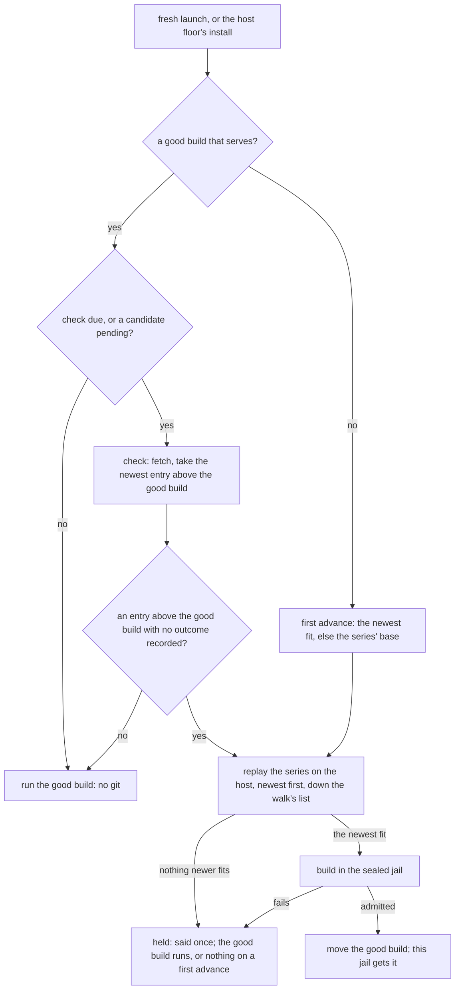

# A patched fork follows its upstream — a patch series that rebuilds itself while it applies

**Status:** 2026-10-03, amended 2026-10-04 for the newest-fit walk ([PF-D10](#PF-D10)) and the
owner key ([PF-D22](#PF-D22)), whose evidence was read at `48491fd4a`. [§14](#14-what-i-would-build-in-order)
step 1 built 2026-10-04: the declaration, the series, the check and its record, the replay, and the
explicit acts' reports, with nothing moving; the ledger's Built column says where. Evidence read
at `026fca672`; every `git` behavior in
[§5](#5-applying-the-series) MEASURED the same day with git 2.55.0 in scratch repositories, a
blobless mirror among them, and pi's upstream cadence read from GitHub the same day.

> **In short.** A patched fork is the existing fork route with its pin replaced by a machine-local
> ratchet: the upstream moves the candidate, and only a build this machine admitted moves what runs.

**Why it matters.** The maintainer runs a forked `pi` and today rebases it by hand onto every new
upstream version. In his words, 2026-10-03: *"I want another mode where you can specify a set of
patches that will then get applied to the latest of the upstream. So we can essentially have an
evergreen build as long as these patches clean apply."*

**The shape.** A fork pack names the upstream `source` and a `patches` directory. An hourly
[check](#41-where-the-check-runs) finds a [candidate](#61-the-good-build-is-a-ratchet); the
[advance](#61-the-good-build-is-a-ratchet) replays the series on the host and builds it in the
sealed capture jail; and this machine's [good build](#61-the-good-build-is-a-ratchet) moves only
once that build is admitted.

**Cost.** It departs from several of the fork route's rules for forks that declare `patches`, each
named in [PF-D8](#PF-D8). A fresh launch waits for a build once per upstream version it takes (pi
cut five in the five days to 2026-10-03), the store keeps a 137.6 MB build of pi for each version a
running jail still uses, and the host runs `git` over pack content for the first time.

**Start at [§6](#6-the-good-build-the-record-and-the-store-key)**: the good build as a ratchet, from
which the failure handling and the notch behavior fall out.

**Decided under your delegation of 2026-10-04, yours to overrule:** [OQ-PFK1](#OQ-PFK1) B,
[OQ-PFK2](#OQ-PFK2) A, [OQ-PFK3](#OQ-PFK3) A and [OQ-PFK4](#OQ-PFK4) A, each on its leaning.

**Reads with:** [`forked-programs-as-packs.md`](forked-programs-as-packs.md) (the fork route this
extends; its ledger is the ground truth for every FP-D cited here),
[`patched-forks-plan.md`](patched-forks-plan.md) (the implementation sketch, incomplete while the
questions are open), [`program-delivery.md`](program-delivery.md) (the agent-dependency rule this
mode brings forks under), [`patched-extensions.md`](patched-extensions.md) (the companion that takes
this mode to pi extensions, sharing its implementation through [PF-D22](#PF-D22)'s owner key).

---

## 1. The verdict, and five principles

The request, whole, as the maintainer made it on 2026-10-03: *"For the fork stuff that we're
currently using for a PI fork, I want another mode where you can specify a set of patches that will
then get applied to the latest of the upstream. So we can essentially have an evergreen build as
long as these patches clean apply. So basically you will still detect updates in the upstream. When
that happens you will fetch the upstream, apply the patches, and then build so that we don't have to
just do essentially clean rebases for every new upstream version."* It amends the fork route's
[patch-set non-goal](forked-programs-as-packs.md#1-goal-and-non-goals) for this mode only. On
2026-10-04 he extended it: *"I want the fork patch thing to cover pi extensions as well."* That route
is [`patched-extensions.md`](patched-extensions.md), which reuses this design up to the build's output.

**Build it as a field on the existing route, not as a new route.** A patched fork is a `program`
with `via: "source"` and `fork_of`, exactly as a fork is today
([FP-D5](forked-programs-as-packs.md#FP-D5)), plus one field, `patches`. Its `source` names the
**upstream** repository instead of a fork repository. The sealed build
([FP-D9](forked-programs-as-packs.md#FP-D9): a build jail handed no credential and nothing that
writes outside its own workspace), the capture store, the `build` receipt and the jail's delivery
are the fork route's, unchanged in shape.

Two terms, both coined here:

- A **plain fork** *(coined here)* is the fork route as built: a `source` pinned at one commit in
  the fork lock, moved only by `yolo pack update` ([FP-D18](forked-programs-as-packs.md#FP-D18)).
  It is not a new thing; the name only tells it apart.
- A **patched fork** *(coined here)* is a fork that declares `patches`: its `source` is the
  upstream, its bytes are the upstream at a commit with the series applied, and what runs follows
  the upstream for as long as the series applies and builds. It is not a rebase of a fork branch (no
  fork repository is involved) and not a plain fork with a moving ref (nothing moves except through
  a build).

**Why this fits the product rather than bending it.** A forked agent is an **agent dependency**
(coined in [program-delivery.md §3.5](program-delivery.md#35-the-second-axis-who-the-dependency-serves-amendment-2026-09-03)),
and the ruled policy for that class is *latest*, refreshed at most hourly, with no pin and a receipt
for its record ([OQ-PD11, OQ-PD12](program-delivery.md#decision-ledger), 2026-09-03, stated there as
P6). A plain fork pins one revision; a patched fork follows. It takes that rule whole, except where a
source build cannot:

| The agent-dependency rule | A patched fork | Why it departs |
| :--- | :--- | :--- |
| Latest, checked at most once per `UPDATE_INTERVAL` (3600 s) per program | the same: one check per fork per hour ([§4.2](#42-the-throttle)) | — |
| Trigger: *"the AGENT'S OWN INVOCATION, not a jail launch"* | the notch's readiness act: a fresh jail launch, or the host floor's install ([§4.1](#41-where-the-check-runs)) | the invocation is inside the jail, which mounts the capture store read-only and builds no fork ([`run/forkbuild.go:128-132`](../../internal/cli/run/forkbuild.go#L128-L132)), and a jail reads its fork decisions once at boot ([FP-D14](forked-programs-as-packs.md#FP-D14)); [OQ-FP4](forked-programs-as-packs.md#14-decision-ledger) ruled a fork's build eager at that act |
| Bound: 60 s for the update, then run what is installed; a Ctrl-C runs the installed version ([OQ-PD22](program-delivery.md#decision-ledger)) | 60 s for the check's fetch; how long a launch waits for the build is [OQ-PFK3](#OQ-PFK3) | a build has no such bound today: pi's took 17 s and about 35 s ([§7](#7-the-build-and-the-launch)), and one cut off at 60 s where it takes longer would never land |
| `agent_updates` (user scope, per pack or global) opts out | honored: off holds the fork at its good build and runs no check ([§3.4](#34-holding-a-patched-fork)) | — |
| Failure is scoped to the command: *"Offline with the agent installed → run what is there"* | a new upstream version that does not apply or build leaves the good build running ([§6.1](#61-the-good-build-is-a-ratchet)) | — |
| *Pin: none*; *Record: a receipt, for what did I run* | no fork-lock entry; the good build is a record on this machine, beside the build receipt ([§6.5](#65-nothing-in-the-fork-lock)) | — |

**The five principles**, numbered so later sections can cite them:

- **P1. The ref and `follow` decide what moves.** The ref as it does for a pack
  ([`OQ-PF1`](../reference/pack-system.md#oq-pf1), the maintainer's *"yes, I want this"*,
  2026-09-25): a tag or a full commit holds. On a branch, `follow` says whether the newest version
  tag or the head is taken ([§3.3](#33-what-the-latest-of-the-upstream-is)).
- **P2. What runs moves only through a build this machine admitted, and stays on this machine.**
  The good build moves to a new build only once that build is in this machine's capture
  store, and it is recorded in this machine's pack store, never in the fork lock
  ([§6.1](#61-the-good-build-is-a-ratchet), [§6.5](#65-nothing-in-the-fork-lock)). Whether it
  still runs after the user's own edit fails is [OQ-PFK1](#OQ-PFK1).
- **P3. The series is data on the host and code only in the jail.** The host replays it with no
  hook, no user git config and nothing from the patches or the upstream running; the sealed jail
  builds it; nothing patched is written to the user's tree ([§5](#5-applying-the-series)).
- **P4. A steady-state launch runs no git.** One per-fork hourly check gates every git run
  ([§4.2](#42-the-throttle)).
- **P5. A new upstream version the series does not fit costs a line, never the launch and never
  the program** ([§8](#8-failure-and-the-next-step)).

## 2. What exists today, precisely

Read at `026fca672`.

| Piece | What it does today | Where |
| :--- | :--- | :--- |
| The fork declaration | `fork_of`, `source`, `build`, `produces` on a `program` with `via: "source"`; nothing else that moves bytes | [`contributes.go:48-88`](../../internal/packdecl/contributes.go#L48-L88), [`fork.go:130-162`](../../internal/packdecl/fork.go#L130-L162) |
| The recipe hash | sha256 of the JSON array `[build, sorted produces, subdir]` | `ForkRecipe`, [`fork.go:280-286`](../../internal/packdecl/fork.go#L280-L286) |
| The fork lock | `forks.lock.json` beside the user config, one `{key, source, ref, commit}` per fork, schema 1; a yolo that rewrites it writes back only the fields it decoded | [`forklock.go:34-64`](../../internal/packsrc/forklock.go#L34-L64), [`:77`](../../internal/packsrc/forklock.go#L77), [`:92-126`](../../internal/packsrc/forklock.go#L92-L126) |
| The fork-lock pinner | a launch, the host floor's install and `yolo capture <forked bin>` pin an unpinned fork through one pinner, which resolves the ref and writes the entry at once; a standing pin is an entry whose source matches as written | `PinForks`, [`forkpin.go:79-167`](../../internal/packsrc/forkpin.go#L79-L167), [`:173`](../../internal/packsrc/forkpin.go#L173); [`run/forkbuild.go:113-115`](../../internal/cli/run/forkbuild.go#L113-L115) |
| `yolo pack install` and `update` | pin or re-pin every selected fork, and prune the entries of forks the user-scope selection lacks | `pinForks`, [`cli/forkpin.go:38-130`](../../internal/cli/forkpin.go#L38-L130), [`:112`](../../internal/cli/forkpin.go#L112); [`hostselection.go:89-91`](../../internal/cli/hostselection.go#L89-L91) |
| The per-mirror step | [FP-D18](forked-programs-as-packs.md#FP-D18)'s name for the launch refresh's fetch-and-resolve of one repository: a branch fetched when its last good fetch is over an hour old, every tag a fetch moved put back, and every resolved commit checked out into the pack store's `trees/` | `refreshMirror`, [`refresh.go:293-427`](../../internal/packsrc/refresh.go#L293-L427), the checkout at [`:420`](../../internal/packsrc/refresh.go#L420); `BranchRefreshInterval`, [`:67`](../../internal/packsrc/refresh.go#L67) |
| A git run before the stamp | the per-mirror step reads every ref with `rev-parse` before it reads the stamp | [`refresh.go:316-335`](../../internal/packsrc/refresh.go#L316-L335) |
| The pack store's trees | no reaper reads `trees/` (`internal/prune` searched 2026-10-03) | [`store.go:708-722`](../../internal/packsrc/store.go#L708-L722) |
| Store git hygiene | overrides two settings of the user's own git config (hooks, fsmonitor) and honors the rest on purpose, for its credential helpers; a cleaned environment; no lazy fetch outside a receiving run | `storeGitConfig`, [`store.go:259-276`](../../internal/packsrc/store.go#L259-L276); [`store.go:307-322`](../../internal/packsrc/store.go#L307-L322) |
| The mirror, and its prefetch | a bare blobless partial clone; one fetch of every blob a checkout of one commit needs, best-effort | [`store.go:462-463`](../../internal/packsrc/store.go#L462-L463); `prefetchBlobs`, [`store.go:774-797`](../../internal/packsrc/store.go#L774-L797) |
| The build act | a lock per build keyed on (source as written, commit, recipe, platform), a hit re-checked after the lock, the checkout copied into a staging workspace that is the build jail's `/workspace`, sealed jail, `produces` check, admit, `build` receipt | `buildFork`, [`cli/forkbuild.go:82`](../../internal/cli/forkbuild.go#L82), [`:107-170`](../../internal/cli/forkbuild.go#L107-L170), [`:403-406`](../../internal/cli/forkbuild.go#L403-L406) |
| The source checkout | the pinned commit's tree (the subdirectory alone for a `//subdir` source), copied on the host, links copied as links | `checkOutForkSource`, [`cli/forkbuild.go:310-326`](../../internal/cli/forkbuild.go#L310-L326); [`store.go:708-716`](../../internal/packsrc/store.go#L708-L716) |
| The hit check | newest entry per (bin, platform, source as written), a hit only at the asked revision and recipe | `resolveForkBuild`, [`capturematerialize.go:311-332`](../../internal/cli/capturematerialize.go#L311-L332) |
| A failed launch build | said, nothing stored, and the next launch builds it again: no memo | [`cli/forkbuild.go:202-207`](../../internal/cli/forkbuild.go#L202-L207) |
| Where a launch pins, and where it builds | pin above the dispatch on every launch, attach included; build in the fresh-launch path only, and a fork with no pinned commit gets its reason before any build | [`run.go:319`](../../internal/cli/run/run.go#L319), [`run.go:1330`](../../internal/cli/run/run.go#L1330), [`run/forkbuild.go:50-52`](../../internal/cli/run/forkbuild.go#L50-L52) |
| The jail's view | reads its fork decisions once, at boot, from one env var, and materializes the handed key at the program's first run | `ForkBuildsEnv`, [`forklauncher.go:36-40`](../../internal/entrypoint/forklauncher.go#L36-L40) |
| The host floor's fork arms | read the manifest's recipe in four places, and never refresh a fork's entry | [`ensure.go:155-162`](../../internal/hostfloor/ensure.go#L155-L162), [`floor.go:521`](../../internal/hostfloor/floor.go#L521), [`cli/hostfloor.go:121-129`](../../internal/cli/hostfloor.go#L121-L129), [`built.go:176`](../../internal/hostfloor/built.go#L176); [`ensure.go:187-190`](../../internal/hostfloor/ensure.go#L187-L190) |
| A failure memo with back-off | per (bin, platform), a day doubling to a week, reset by a new yolo | `capture.AutoFailure`, [`autofailure.go`](../../internal/capture/autofailure.go); [`autocapture.go:96-100`](../../internal/cli/autocapture.go#L96-L100) |
| The store's reclaimer | `yolo prune` keeps the newest entry per selection key and reaps the rest; nothing reaps one sooner | [`capture/gc.go`](../../internal/capture/gc.go) |

Four of these decide most of the design:

- **The per-mirror step's fetch is reusable; its checkout is not.** Every fetch of a mirror brings
  all of its branches and tags, so the check's fetch of the followed branch brings new versions too
  ([§4.3](#43-the-check-itself)). But the step checks out every commit it resolves into a tree no
  reaper reads, 23 MB for pi's main per check where main moved, so the check takes the step's fetch
  and ref rule and no checkout.
- **It cannot be the throttle**, because it runs git before it reads its stamp.
- **The store answers a fork by its source as written, newest first.** Two forks of one upstream
  share a selection key, and an edited `?ref=` is a new address. A patched fork's build is found by
  the fork and its exact inputs instead ([§6.3](#63-what-is-served-and-the-store-key)).
- **The store's git honors the user's own config.** That is right for a fetch, whose credential
  helpers a private upstream needs, and wrong for a replay, where a signing or whitespace setting
  changes the answer ([§5.1](#51-where-it-runs)).

## 3. The declaration

### 3.1 The fields

The stand-in fork the plan measured ([its step 7 run](forked-programs-as-packs-plan.md#steps-1-to-3-on-a-stand-in-fork-2026-10-01)),
rewritten as a patched fork:

```jsonc
{
  "kind": "program", "bin": "pi", "via": "source", "fork_of": "pi",
  "source": "git+https://github.com/earendil-works/pi?ref=main",  // the UPSTREAM, and the branch it is read from
  "patches": "patches",                                           // a directory in this pack
  "follow": "release",                                            // "release", "release:<prefix>" or "head"
  "build": "npm ci --ignore-scripts && npm run build && cd packages/coding-agent && npm install -g \"$(npm pack --silent)\"",
  "produces": [".npm-global/bin/pi", ".npm-global/lib/node_modules/@earendil-works/pi-coding-agent"]
}
```

| Field | Meaning | Validated |
| :--- | :--- | :--- |
| `source` | The upstream repository, with the mandatory `?ref=` ([`addr.go:17`](../../internal/packsrc/addr.go#L17)) naming a branch to follow, or a tag or a full commit to hold at. `HEAD` and an abbreviated commit are refused, since neither names whether it moves | as today ([`fork.go:169-180`](../../internal/packdecl/fork.go#L169-L180)); the ref's kind at the check |
| `patches` | A clean pack-relative directory holding the series ([§3.2](#32-the-series)). Its presence is the opt-in to this mode | statically: relative, no `..`, only beside `via: "source"`; its contents at each advance |
| `follow` | What a branch ref yields: `release` (the newest version tag on it), `release:<prefix>` (the same, among tags named `<prefix><version>`), or `head` (its newest commit). Default: [OQ-PFK2](#OQ-PFK2)'s leaning, `release` | statically: the grammar, and only beside `patches` |

`follow` without `patches` is refused, naming the reason: a plain fork's pin moves only by
`yolo pack update` ([FP-D18](forked-programs-as-packs.md#FP-D18)), and following an upstream is
this mode's opt-in, not a dial on that one.

The fork key `<pack>/<bin>` is this route's **owner key** *(coined in [PF-D22](#PF-D22))*: the key
the check, its record and lock, the replay, the ratchet and the explicit acts use. A patched
extension's is `<pack>/<name>` ([`patched-extensions.md`](patched-extensions.md#1-defined-terms)), so
one implementation serves both, and a pack's owner keys are unique across the two.

### 3.2 The series

**The series** is the ordered set of patch files a patched fork applies, in the field-standard sense
of a [`git format-patch`](https://git-scm.com/docs/git-format-patch) series. Its rules:

- **Its members are the regular files in the `patches` directory whose names end in `.patch`**, in
  byte-wise lexical order of their names. `git format-patch` numbers its output `0001-…`, so its
  order is the series' order. Nothing else is read: no series file, no subdirectory, no other
  extension.
- **Each member is a mail-format patch, as `git format-patch` writes it**, because `git am` makes
  its commits ([§5.2](#52-the-replay-and-what-applies-cleanly-means)). A plain `diff -u` is refused,
  naming the file and the `format-patch` command that makes one.
- **No link anywhere on the way.** Every component of the path from the pack root to each member
  is checked with `lstat`, as the pack store checks a subdirectory (`treeResolved`,
  [`store.go:896-915`](../../internal/packsrc/store.go#L896-L915)): a symlink as the directory, on
  its path or as a member, or any non-regular member, is refused, in a fetched pack and a local one
  alike. The host reads these bytes with a pack's authority, and a link would make the series a read
  of whatever it names.
- **A series has at least one member.** An empty directory, a missing one and an unreadable one are
  each the fork's reason, never read as no patches. A patched fork with nothing to apply would be a
  plain fork that follows its branch, which nobody asked for and which a typo would produce under
  the fork's name; the reason for an empty directory names a plain fork as the way to deliver the
  upstream unpatched.
- **It names its base.** The first member carries the `base-commit:` line
  `git format-patch --base` writes, and a series without one is refused, naming that flag. The
  replay starts there ([§5.2](#52-the-replay-and-what-applies-cleanly-means)), the first advance
  falls back there ([§6.4](#64-the-newest-fit-and-the-first-advance)), and the base must be an
  upstream commit: one the mirror holds or can fetch by its id.
- **Paths are the repository's.** `format-patch` writes paths from the repository root, so the series
  is replayed over the whole commit even when `source` names a `//subdir`, and the build gets the
  subdirectory, as a plain fork's does ([§5.1](#51-where-it-runs)).
- **Read once per advance.** The advance reads every member's bytes once, digests them, and replays
  from that copy, so the digest it records describes the bytes it applied, however long it waited
  for a lock ([§6.6](#66-locks-and-their-order)).

The **series digest** *(coined here)* is the sha256 of the JSON array of `[name, sha256 of the
file's bytes]` pairs in series order. JSON for the reason `ForkRecipe` uses it: no separator can be
spelled inside a value ([`fork.go:277-278`](../../internal/packdecl/fork.go#L277-L278)). A rename
changes the digest and costs one rebuild; that is accepted to keep the digest a function of what
the directory lists.

### 3.3 What "the latest of the upstream" is

The **follow rule** *(coined here)* is P1 applied to a patched fork. The source's ref is read
from the upstream's mirror with the per-mirror step's own lookup (`classifyRef`,
[`refresh.go:503-534`](../../internal/packsrc/refresh.go#L503-L534), a tag before a branch):

| The ref is | The candidate commit is |
| :--- | :--- |
| a branch, `follow: "head"` | the branch's commit |
| a branch, `follow: "release"` | the newest tag merged into the branch whose name is a semantic version, optionally `v`-prefixed |
| a branch, `follow: "release:<prefix>"` | the same, among tags named `<prefix>` followed by a semantic version (a monorepo's per-package tags) |
| a tag, or a full commit | that commit, always: the fork is held there and follows nothing |
| `HEAD`, an abbreviated commit, or anything else that resolves but is not one of the above | none: refused, naming a branch, a tag or a full commit. `HEAD` moves with its branch whenever the mirror is fetched ([`refresh.go:15-17`](../../internal/packsrc/refresh.go#L15-L17)), so it would read as held while it moves |
| unresolvable | none: the fork's reason ([§8](#8-failure-and-the-next-step)) |

The release rule's details, each decided ([PF-D4](#PF-D4)):

- **Newest** is semantic-version precedence ([semver.org §11](https://semver.org/#spec-item-11)),
  never tag date. Build metadata is ignored; a **pre-release** (a version with a `-` suffix) is never
  chosen; a tag that does not parse is ignored.
- **Major versions are crossed.** `release` takes `v1.0.0` after `v0.99.2` as it takes any newer
  version, which pi's upstream published on 2026-10-01. No major-line constraint is designed: a user
  who wants to stay on one holds ([§3.4](#34-holding-a-patched-fork)), and a project that keeps a
  branch per line is followed on that branch.
- **Merged into the branch** is what gives the mandatory ref a meaning in this mode: versions *of
  that line*. The cost: a version tagged on a commit no branch contains is invisible, and
  `follow: "head"` or a tag ref is the way around it.
- **A re-pointed tag is not followed.** A fetch puts back every tag it moved
  ([`refresh.go:357-358`](../../internal/packsrc/refresh.go#L357-L358)), so the mirror keeps the
  first object a tag named. A new tag is kept.
- **No ancestry check against the good build.** The candidate is whatever the rule names, forward
  or back: a force-pushed head, or a `follow` changed from `head` to `release`, can name an older
  commit, and it is a candidate like any other. Against the series' base there is one: the walk
  offers only version tags that contain the base ([§6.4](#64-the-newest-fit-and-the-first-advance)).

Which of the commits the rule allows an advance builds is the newest one the series fits, found by
that walk.

A patched fork is **held** *(coined here)* when what runs is not following: its ref names a tag or
a commit, `agent_updates` holds it, or its newest candidate did not apply or build
([§8](#8-failure-and-the-next-step)). Held is not unavailable: a held fork runs its good build.

### 3.4 Holding a patched fork

Two spellings, by who owns what:

| Who | How | What it holds |
| :--- | :--- | :--- |
| The manifest's owner | a tag or a full commit as `source`'s `?ref=`, the spelling that freezes a pack | the upstream commit; the series is still applied there, and the fork rebuilds only when the series or the recipe changes |
| Any user, including one of a fork pack someone else publishes | `agent_updates` off for the fork pack, by its name or through `"*"`, or for its base pack | no check runs, and the upstream commit stays the good build's: an edited ref or `follow` waits until the hold lifts, while a change to the series or the recipe is built at that commit. A fork with no good build still gets its first advance, check included, as a cold start installs an agent its launcher holds back from updating |

The base pack counts because a user who freezes `pi` means the program they run as `pi`, which the
fork now delivers. A ref edit is not a new address: a build is identified by repository,
subdirectory, commit and recipe, never the ref ([§6.3](#63-what-is-served-and-the-store-key)), so
moving `?ref=main` to `?ref=v0.99.2` while the good build is `v0.99.2` builds nothing.

## 4. Detection

### 4.1 Where the check runs

The **check** *(coined here)* is the act that reads the upstream for a newer candidate. It runs at
the acts that ready a fork's program ([OQ-FP4](forked-programs-as-packs.md#14-decision-ledger):
eager, at the notch's readiness act) and at the explicit acts, through one implementation:

- a **fresh jail launch**, in the fork build trigger's slot ([`run.go:1330`](../../internal/cli/run/run.go#L1330)),
  below every attach decision and under the launch lock ([FP-D14](forked-programs-as-packs.md#FP-D14));
- the host floor's install act: `yolo host -- <bin>` and `yolo host apply --assert`
  ([FP-D16](forked-programs-as-packs.md#FP-D16)), through a source arm of the floor's refresh
  ([§9](#9-notch-coverage));
- `yolo capture <forked bin>`, `yolo pack update`, `yolo pack install` and, under
  [OQ-PFK4](#OQ-PFK4)'s leaning, `yolo pack rebase`, each forcing it
  ([§8.3](#83-the-explicit-acts)). Of these only `yolo capture` builds.

It **never** runs on an attach, a `--dry-run`, inside a jail, inside a capture or build jail, or
while `agent_updates` holds the fork, a first advance aside ([§3.4](#34-holding-a-patched-fork)). The middle three are the
fork pin's exclusions ([`run/forkbuild.go:128-132`](../../internal/cli/run/forkbuild.go#L128-L132),
[`:147-151`](../../internal/cli/run/forkbuild.go#L147-L151)); an attach builds nothing
([FP-D14](forked-programs-as-packs.md#FP-D14)), and says what the running jail runs
([§7](#7-the-build-and-the-launch)).

### 4.2 The throttle

**One check per fork per `BranchRefreshInterval` (3600 s,
[`refresh.go:67`](../../internal/packsrc/refresh.go#L67)), measured from the last check attempt,
whatever its outcome.** The interval is the pack refresh's and the agent launchers', so "how often
does something a pack follows move" keeps one answer across the product.

- **The throttle is a file read, never git.** A **check stamp** *(coined here)* per fork key, in the
  fork's check record ([§6.2](#62-the-check-record-and-what-is-pending)) in the pack store, is read
  first. Inside the interval, with nothing pending, the launch runs the good build and runs no git
  and no network. This is P4.
- **It is its own stamp, not the mirror's.** The per-mirror stamp records a fetch for a repository
  and ref, and the launch's pack refresh runs before the fork trigger: a branch pack on the same
  repository and branch would leave it fresh on every launch, and a check gated on it would never
  run. Reading it also takes a `rev-parse` first ([§2](#2-what-exists-today-precisely)).
- **An attempt counts.** A check whose fetch failed still writes the stamp, so an offline machine
  retries once an hour rather than paying a fetch timeout on every launch.
- **An edit to what the check reads makes it due at once.** The record keeps the repository,
  subdirectory, ref and `follow` the last check read, and a launch that finds any of them changed
  checks now, so an edited `follow` or a new hold is never an hour late.

### 4.3 The check itself

Under the fork's record lock ([§6.6](#66-locks-and-their-order)), re-reading the stamp there:

1. Write the stamp (the attempt).
2. Run the per-mirror step's fetch and ref rule for the source's repository and ref, with no
   checkout: the launch's store (`LaunchFetchTimeout`, 60 s per repository, no terminal for git,
   [`refresh.go:75-84`](../../internal/packsrc/refresh.go#L75-L84)), a fetch when the mirror's own
   stamp for that branch is over an hour old, fsck on receipt, and every tag a fetch moved put
   back. An explicit act fetches whatever either stamp says, still putting tags back, so a version
   published minutes ago is seen.
3. Apply the follow rule ([§3.3](#33-what-the-latest-of-the-upstream-is)) to what the mirror now
   holds and take the candidate, the newest entry of the walk's list above the good build
   ([§6.1](#61-the-good-build-is-a-ratchet), [§6.4](#64-the-newest-fit-and-the-first-advance)),
   with no replay and no further network; the base it needs is the one the series' first member
   names. Release the mirror's lock, and record the commit, its tag and the check's sequence
   number.

The fetch needs no change for versions: the source's ref is a branch, a fetch of the mirror brings
every branch and tag ([`store.go:476-477`](../../internal/packsrc/store.go#L476-L477)), and a tag it
added stays.

**Concurrency.** Two launches due at once serialize on the fork's record lock; the second re-reads a
fresh stamp and runs no git. Checks of different forks wait for each other only when they name one
upstream repository, on its mirror lock for the fetch (READ the per-repository flock,
[`store.go:23`](../../internal/packsrc/store.go#L23), [`refresh.go:637-641`](../../internal/packsrc/refresh.go#L637-L641)),
and none of this takes the fork lock `forks.lock.json`'s writers share.

**Offline.** A fetch that fails leaves the mirror's own answer in use, as for a pack
([`refresh.go:33-36`](../../internal/packsrc/refresh.go#L33-L36)), and the record notes the failure.
No advance runs until a check fetches again: the build needs the network too, and its failure would
start a back-off the next online launch has no reason for. The launch says once that it could not
check, with the error, *"next check in an hour"*, and `yolo pack update` to check now. A machine that
has never fetched the upstream has nothing to serve
([§6.4](#64-the-newest-fit-and-the-first-advance)).

## 5. Applying the series

### 5.1 Where it runs

**On the host, inside the build act, before the sealed jail starts.** Where a plain fork copies a
commit's tree into `src/` ([`checkOutForkSource`](../../internal/cli/forkbuild.go#L310)), a patched
fork's build act replays the series and copies the result.

- **A scratch repository outside the staging workspace** *(its layout is the implementer's)*. Its
  git directory and work tree sit in a private temporary directory, never in the staging workspace,
  which is the build jail's `/workspace` ([`cli/forkbuild.go:132-143`](../../internal/cli/forkbuild.go#L132-L143),
  [`:403-406`](../../internal/cli/forkbuild.go#L403-L406)): a git directory there would be visible
  to the build and writable by it. It borrows the mirror's objects read-only and is deleted when the
  build act ends.
- **Blobs first, into the mirror.** A repository that borrows another's objects has no promisor
  remote, so it cannot fetch what it lacks: MEASURED, a checkout through objects borrowed from a
  blobless mirror failed with *"unable to read sha1 file"*, exit 128, and succeeded once those blobs
  were prefetched into the mirror. So, under the mirror's lock, the store's checked prefetch
  ([`store.go:774-797`](../../internal/packsrc/store.go#L774-L797)) brings into the mirror every blob
  the replay reads: the candidate's whole commit, and at the base at least the paths the series
  touches. A blob that cannot be fetched is an apply error, never a conflict
  ([§5.2](#52-the-replay-and-what-applies-cleanly-means)).
- **The mirror's lock is held from the prefetch to the end of the replay**, so no fetch or gc runs
  in the mirror under borrowed objects, and released before any record is written and before the
  build starts ([§6.6](#66-locks-and-their-order)).
- **The source's subdirectory is copied into `src/`** with the copy that never follows a link
  (`copySourceTree`, [`cli/forkbuild.go:347`](../../internal/cli/forkbuild.go#L347)), so the build
  sees the layout and the absent `.git` a plain fork's build sees.
- **Nothing it makes outlives the build.** The scratch repository and the staging workspace
  ([`cli/forkbuild.go:136-137`](../../internal/cli/forkbuild.go#L136-L137)) are deleted. What stays
  is the blobs the prefetch brought into the mirror, as git objects; no tree per candidate is checked
  out in the pack store ([§2](#2-what-exists-today-precisely)).

**Two git config regimes**, because the fetch needs the user's config and the replay must not see it:

| Run | Config | Why |
| :--- | :--- | :--- |
| The check's fetch, and the blob prefetch | the store's: the user's own git config honored, its hooks and fsmonitor overridden (`storeGitConfig`) | a private upstream needs the user's credential helpers and `insteadOf` rewrites |
| The replay | no user or system config (`GIT_CONFIG_GLOBAL=/dev/null`, `GIT_CONFIG_NOSYSTEM=1`), hooks off, no signing, whitespace not judged, a fixed committer identity | the replay is local, and a user setting changes its answer or runs a user program. MEASURED: with `commit.gpgsign=true`, `git am` ran the configured `gpg.program` and, when it failed, stopped with *"gpg failed to sign the data"*, exit 128; with `apply.whitespace=error`, a member adding a trailing space failed, exit 128. Both applied with no user config. A `core.autocrlf`, or a filter or merge driver the user defines, would change the patched bytes with no error at all |

Why the host and not the jail (alternative B in [§11](#11-alternatives-with-verdicts)): the replay
needs the upstream's objects, which only the host's mirror holds; the host can say *which member
conflicts* before paying for a jail; and **no code from the pack, the upstream or the user's config
runs**. With no user config, no hook, and no filter or merge driver defined, `git` parses patch text
and merges files. The pack store already checks third-party repositories out on the host for every
git pack and every fork, so the host's exposure grows by a patch parser and a merge, not by a new
channel.

> [!IMPORTANT]
> **Nothing patched is ever written to the user's tree.** The workspace, the fork pack's own
> directory (whose patch files are read, never written) and any clone of the user's are untouched
> by every act in this design. Under [OQ-PFK4](#OQ-PFK4)'s leaning, `yolo pack rebase` prints the
> command that writes a new series and leaves running it to the user ([§8.4](#84-rebasing-the-series)).

### 5.2 The replay, and what "applies cleanly" means

The **replay** *(coined here)* is the series made into commits at its base, then those commits
picked onto the candidate:

1. **At the base.** `git am` applies each member, in series order, onto the series' base commit. A
   series exported with `--base` applies there by construction; one that does not is a malformed
   series, the fork's reason, never a conflict with the upstream.
2. **Onto the candidate.** Each commit step 1 made is picked onto the candidate commit in order,
   three-way, as `git cherry-pick` and `git rebase` pick: one merge per commit, whose base is that
   commit's parent. The mechanism (`git cherry-pick`, `git rebase --onto`, or
   `git merge-tree --write-tree` with no work tree) is the implementer's, provided it agrees with
   the table below.

The series **applies cleanly** when step 1 applies every member and step 2 stops on no commit. That
is the bar the maintainer's hand rebase meets, since a rebase is the same picks.

- **A member whose pick changes nothing is already upstream.** It is clean, and said once per
  candidate: *"0001-….patch is already in upstream v1.0.1; drop it from `<dir>`"*.
- **A conflict** is a pick that stopped with conflicting paths while every object it read was
  present. Anything else that stops the replay (a blob that could not be fetched, a git that failed
  or ran out of time) is an **apply error** *(coined here)*: the candidate stays pending and the
  next check retries it ([§6.2](#62-the-check-record-and-what-is-pending)).

**Why not `git am --3way` onto the candidate.** A later member's preimage is the base plus the
earlier members, a blob that exists only where the series was made. MEASURED 2026-10-03 with git
2.55.0, on a two-member series made with `git format-patch --base` (members changing lines 10 and 12
of a 30-line file): in a full clone of the upstream alone, `git am --3way` applied the first member
and stopped at the second with *"sha1 information is lacking or useless (f.txt) … could not build
fake ancestor"*, exit 128, no conflict marker in the file and the member unapplied, where the
fork's own `git rebase` was clean. The same series, by each strategy:

| Upstream change | `git am` | `git am --3way` | the replay | the fork's `git rebase` |
| :--- | :--- | :--- | :--- | :--- |
| an edit to line 14, inside the second member's context only | fails | fails: *"could not build fake ancestor"* | applies | applies |
| five lines inserted at the top (an offset) | applies | applies | applies | applies |
| the file renamed | fails | applies | applies, to the new name | applies |
| the first member's change already made, plus an edit at line 25 | fails | applies | applies; the first member picks nothing | applies |
| an edit to line 11, between the two members' lines | fails | conflicts | conflicts at the first member | conflicts |
| another edit to line 12, the second member's line | fails | conflicts | conflicts at the second member | conflicts |

The replay agreed with the fork's rebase in every case, and in a repository holding only the
upstream. The same day it ran against a blobless mirror too: a `file://` clone honors the blobless
filter once the source repository sets `uploadpack.allowFilter=true`, such a mirror lacked all three
of its blobs, and with them prefetched into it the replay through borrowed objects was clean with
lazy fetching off (`GIT_NO_LAZY_FETCH=1`).

**Never more than that.** No reduced context (`-C`), no fuzz, no merge strategy that prefers one
side, and no conflict resolution of any kind.

### 5.3 The patched tree

The **patched tree** *(coined here)* is the git tree object of the source's subdirectory (the whole
tree for a repository-root source) in the replay's last commit: the content address of exactly what
is copied into `src/`. It is read before the build jail starts, so nothing the build does can change
it, and recorded on the build receipt and the good build ([§6](#6-the-good-build-the-record-and-the-store-key)).
It is a record, not a key: a second machine that replays the same series at the same commit and gets
another tree (another git merging differently) builds its own and says so once, naming both trees.
It is never refused for that ([PF-D15](#PF-D15)).

## 6. The good build, the record and the store key

### 6.1 The good build is a ratchet

A patched fork's **good build** *(coined here)* is this machine's record of the inputs of the last
build of it this machine admitted: the upstream commit, the tag under `follow: "release"`, the
series digest, the recipe hash and the patched tree. It is not a pin: nothing writes it to the fork
lock, and it never leaves the machine ([§6.5](#65-nothing-in-the-fork-lock)).

A **candidate** *(coined here)* is the same inputs for what the manifest and the last check ask for
now. Its commit is the newest entry of the walk's list, above the good build when there is one
([§6.4](#64-the-newest-fit-and-the-first-advance)): under `follow: "head"` the branch's tip, and
otherwise the newest version tag merged into the branch that contains the series' base and
outranks the good build's version. The check finds it from what the mirror holds, with no replay
([§4.3](#43-the-check-itself)). With a good build, an empty list leaves the good build's own commit
as the candidate, so nothing is pending and no held suffix is shown; with none, the first advance
builds the base ([§6.4](#64-the-newest-fit-and-the-first-advance)). Otherwise, walking the list newest first and
passing over every entry that did not apply, the candidate is **pending** when the first entry
reached has no recorded outcome, or a build failure past its back-off; when every entry did not
apply, or that first entry's failed build is still backing off, nothing is pending
([§6.2](#62-the-check-record-and-what-is-pending)). The **advance** *(coined here)* is the act that
takes a candidate to a good build: replay ([§5](#5-applying-the-series)) down the list, build the
newest fit, which may be an older entry than the candidate, and, once the build is admitted, move
the good build. It is not the check, which only finds the candidate ([§4](#4-detection)).

**The good build moves to a new build only after that build is admitted to this machine's capture
store** (P2). A candidate that does not apply or build never touches it. That one
rule covers every cause of a candidate:

| What changed | Candidate |
| :--- | :--- |
| a check found another upstream commit | (that commit, the manifest's series, the manifest's recipe) |
| the series changed (an edited patch, or the fork pack's own refresh) | (the last check's commit, the new series, the recipe) |
| `build` or `produces` changed | (the last check's commit, the series, the new recipe) |
| the repository, subdirectory, ref or `follow` changed | a check at once ([§4.2](#42-the-throttle)), then the first row |
| `agent_updates` holds the fork | (the good build's commit, the manifest's series, the manifest's recipe), with no check |

**The move is a compare-and-swap under the fork's record lock that prefers the newer check.** The
good build moves to this advance's build only if this advance's candidate came from a check no older
than the one behind the good build; at the same check, the later admit wins. So two launches that
found two upstream commits in turn end on the newer one, whichever build finishes first. A build
that loses the swap is reaped at once, since no launch was handed it
([§6.3](#63-what-is-served-and-the-store-key)).

**A new upstream version that fails never costs the program.** That is the class's ruled rule,
*"Offline with the agent installed → run what is there; the user asked to run it, not to update
it"* ([program-delivery.md §3.5](program-delivery.md#35-the-second-axis-who-the-dependency-serves-amendment-2026-09-03),
[OQ-PD12](program-delivery.md#decision-ledger)), applied to a version the series does not fit: it is
decided ([PF-D8](#PF-D8)), not open. What runs after the user's own edit to the series, `build` or
`produces` fails is [OQ-PFK1](#OQ-PFK1).

**The move is never silent.** The launch that moves a good build says so in a disclosure line,
*"updated fork `pi-fork/pi`: v0.99.2 → v1.0.1, 3 patches; this jail runs the new build"*, which no
flag hides ([`OQ-RO3`](../reference/report-tiers.md#why-its-this-way)).

**What this overrides, for a manifest that declares `patches`, and only there** ([PF-D8](#PF-D8)):

- the fork route's [§9](forked-programs-as-packs.md#9-failure-modes) *"Never rebuild on a timer or
  on every launch"*: an hourly check finds a new upstream version, and the launch builds it;
- [§9](forked-programs-as-packs.md#9-failure-modes)'s *"Never serve an entry whose key does not
  match what is being asked for"*, for the upstream commit only: the good build serves at an older
  upstream commit while a newer candidate is pending or failed. Whether the series or the recipe may
  lag too is [OQ-PFK1](#OQ-PFK1);
- [§12](forked-programs-as-packs.md#12-what-this-does-not-license)'s *"A fork that drifts from its
  lock is reported, never silently refreshed"*: a patched fork has no lock entry to drift from, and
  its rebuild is disclosed;
- [FP-D18](forked-programs-as-packs.md#FP-D18)'s *"A standing pin never moves at launch … `yolo pack
  update` is still the only act that moves one"*: the good build moves at the readiness act, and
  `yolo pack update` never moves it;
- [FP-D16](forked-programs-as-packs.md#FP-D16)'s *"A fork's floor entry is never polled for an
  update"*: it is checked hourly, under `agent_updates`, as an npm program's is;
- [FP-D17](forked-programs-as-packs.md#FP-D17)'s *"A failed reinstall does not keep the installed
  copy running when it is not the build the pack now asks for"*, for a newer upstream only: the
  floor keeps the good build. The edit half is [OQ-PFK1](#OQ-PFK1);
- the fork route's done condition that *"A second machine, given only the config, ends up running
  the same forked binary"* ([§11](forked-programs-as-packs.md#11-sequencing)): a second machine runs
  the newest upstream the series fits there ([§6.4](#64-the-newest-fit-and-the-first-advance)).

Every other rule of the fork route stands: a plain fork never moves at launch, a hit builds nothing,
and nothing is built on the host.

### 6.2 The check record, and what is pending

The **check record** *(coined here)* is one record per owner key ([PF-D22](#PF-D22)) in the pack
store: the check stamp
and what the last check read (repository, subdirectory, ref, `follow`), the last check's commit with
its sequence number and whether its fetch failed, the good build, and one outcome per entry of the
walk's list ([§6.4](#64-the-newest-fit-and-the-first-advance)), so an entry that did not apply is
never replayed again however many newer entries come after it. It is machine-local by design, written only under the fork's record lock through a temp
file and a rename, and read without a lock.

| Outcome on the record | What later launches do |
| :--- | :--- |
| nothing pending ([§6.1](#61-the-good-build-is-a-ratchet)): the list is empty, every entry on it did not apply, or the first that may still apply is backing off a failed build | run the good build; a held suffix only when the list is not empty |
| pending | run the advance; whether a launch waits for it is [OQ-PFK3](#OQ-PFK3) |
| pending, and the last fetch failed | run the good build; no advance until a check fetches |
| apply error | run the good build; the next check retries |
| did not apply (the member, its paths), for (entry, series digest, yolo version, git version) | run the good build; no launch replays that key again. A new upstream commit, an edited series, another yolo or another git is a new key, since an upgrade may be the fix |
| build failed (the error, the yolo version, the count), for that entry | run the good build; retried after [OQ-PD26](program-delivery.md#decision-ledger)'s back-off, a day doubling to a week, reset by another candidate or another yolo. With nothing to serve, every fresh launch retries instead, as a plain fork's failed build is retried |

Never recorded as an outcome: a lost build-lock wait, a build jail the runtime would not start, and
an advance a Ctrl-C ended ([§8.1](#81-the-failure-table)). Each leaves the candidate pending.

**Losing the record costs a lookup, not a rebuild.** A record that is gone or cannot be read is
recovered from the capture store: the newest admitted build of this fork key, for this platform,
whose recipe is the manifest's (the series included), is the good build; with none, the next fresh
launch runs a first advance ([§6.4](#64-the-newest-fit-and-the-first-advance)). The check starts
over, which costs at most one walk.

### 6.3 What is served, and the store key

- **What is served is the good build**, when its series digest and recipe are the manifest's, under
  [OQ-PFK1](#OQ-PFK1)'s leaning, and always under its option A. Its upstream commit may lag the
  candidate either way.
- **It is found exactly**: by the fork key and platform, then by its repository, subdirectory,
  commit and recipe, never newest-then-compare. Two forks of one upstream, a `yolo capture` of a
  candidate and a swap one launch lost each leave a newer entry that is not the good build, and an
  exact lookup is unmoved by all three.
- **The ref is not part of a build's identity.** The build's lock, its staging and its receipt name
  the repository and subdirectory, never the source as written (today's build id,
  [`cli/forkbuild.go:82`](../../internal/cli/forkbuild.go#L82)), so moving a hold from `?ref=main` to
  `?ref=v0.99.2` finds the build already there.
- **The revision is the upstream commit**, not a synthetic patched commit. The upstream commit is a
  fact any machine can fetch; a commit yolo made locally exists on no remote
  ([alternative E](#11-alternatives-with-verdicts)).
- **The recipe hash gains the series digest, for a patched fork only.** A patched fork's recipe is
  `ForkRecipe`'s array with the series digest appended; a plain fork's array is byte-for-byte what
  it is today ([`fork.go:283`](../../internal/packdecl/fork.go#L283)), so no existing entry stops
  hitting the day this ships. Two series never share an entry.
- **The `build` receipt gains `fork`, `series` and `tree`** (the fork key, the series digest and the
  patched tree), additive fields, as [FP-D8](forked-programs-as-packs.md#FP-D8) lets the schema grow.
  The fork key is what a patched build's selection keys on, so a plain fork's query never selects a
  patched build and no fork's query selects another's.
- **The move reclaims what no jail uses.** Once the good build moves, every other build of this fork
  on this machine that no running jail was handed is reaped. Each fresh launch records what it handed
  its jail beside the jail's own pack tree, which goes only once its container is known gone, and a
  record that cannot be read keeps every build. A jail materializes its build at the program's first
  run, not at boot, so a build a running jail was handed must outlive the move. `yolo prune` is
  unchanged: it keeps the newest build per fork, which is the good build except after a crash
  between an admit and the record's write ([§8.1](#81-the-failure-table)).

### 6.4 The newest fit, and the first advance

**Every advance takes the newest fit** *(coined here)*: the first entry of a list, newest first,
onto which the series replays cleanly ([PF-D10](#PF-D10), amended 2026-10-04). Not "the newest, else
the base": that drops a second machine, or an edited series, to the base even where v1.2 fits and
only v1.3 conflicts. The list:

1. Under `follow: "head"`, the branch's tip.
2. The version tags merged into the branch that contain the series' base, the base's own tag
   included, by the release rule's precedence ([§3.3](#33-what-the-latest-of-the-upstream-is));
   under `release:<prefix>`, only that prefix's.

A tag or commit ref lists that commit alone. With a good build, the list holds only entries above
it: the tip when it differs from the good build's commit, and versions of higher precedence than the
one the good build runs (its tag, or the newest version its commit contains). A hold's commit, and a
list read under another ref or `follow` than the good build's, are cut at the good build's commit
instead, so a hold or an edited rule can name an older commit ([PF-D34](#PF-D34)).

- **Replays run down the list** in the advance's replay step ([§5.1](#51-where-it-runs)), each
  entry's blobs prefetched first. A conflict is recorded against its entry ([PF-D9](#PF-D9)), and an
  entry with one is passed over with no replay, so no entry is replayed twice for one series, yolo
  version and git version; an apply error ends the walk and leaves the entries it did not settle
  pending.
- **The first clean entry is the newest fit, and the advance builds it.** With none, the good build
  holds, and the held line names the candidate and the member that stopped it.
- **Bound:** 60 s for the whole walk, its prefetches included, a budget of its own, apart from the
  check's fetch, which has the same `LaunchFetchTimeout` ([§4.3](#43-the-check-itself)); so git holds
  a launch at most 120 s before a build. A walk that runs past it is an apply error for the entries
  it did not reach ([§5.2](#52-the-replay-and-what-applies-cleanly-means)): nothing is recorded for
  them, they stay pending, and the next check retries them. On a first advance the base is still
  built meanwhile, as in any state with nothing to serve.
- **Tags must contain the base**, so an older version cannot pass for an update: a branch whose
  newest version predates the base, as one of the maintainer's extension upstreams does
  ([`patched-extensions.md` §3.2](patched-extensions.md#32-the-maintainers-five-forks)), builds the
  base, not that version.

A patched fork with no good build on this machine, after recovery
([§6.2](#62-the-check-record-and-what-is-pending)), gets a **first advance**:

- **The good build is written after the admit.** A first build that fails leaves no good build, and
  the next fresh launch tries again, as a plain fork's failed first build is retried
  ([`cli/forkbuild.go:202-207`](../../internal/cli/forkbuild.go#L202-L207)), with no back-off, since
  nothing serves.
- **If nothing on the list fits, the series' base is built**, when the followed branch contains the
  base. The series applies there by construction, so a migrating user
  gets a working program on the first launch, held at the base, and the line says why. A tag or
  commit hold gets no fallback, since the user named the commit. An empty list is no hold: a series
  whose base is past the branch's newest version builds the base, nothing is pending afterwards, and
  later launches carry no held suffix.
- **The same fallback covers any state with nothing to serve**, which under [OQ-PFK1](#OQ-PFK1)'s
  leaning includes an edit that does not fit the newest candidate: the edited series is built at its
  own base before the program goes.
- **A second machine given only the config** runs its own first advance, and converges on the
  newest upstream the series fits there.

### 6.5 Nothing in the fork lock

**A patched fork has no entry in `forks.lock.json`, and every fork-lock pinner skips it**: the
launch's pin ([`run.go:319`](../../internal/cli/run/run.go#L319)), the host floor's
([`cli/hostfloor.go:105-118`](../../internal/cli/hostfloor.go#L105-L118)) and `yolo capture`'s
([`capturehost.go:267-271`](../../internal/cli/capturehost.go#L267-L271)), all through `PinForks`,
and `yolo pack install` and `update` ([`cli/forkpin.go:38`](../../internal/cli/forkpin.go#L38)).
Four reasons, each enough:

- **The class's record is a receipt, not a lockfile** (P6's *Pin: none*,
  [program-delivery.md §3.5](program-delivery.md#35-the-second-axis-who-the-dependency-serves-amendment-2026-09-03)).
- **The lock travels.** It sits beside the user config ([`forklock.go:61-64`](../../internal/packsrc/forklock.go#L61-L64)),
  and [FP-D18](forked-programs-as-packs.md#FP-D18) expects it to arrive with the config from another
  machine. A good build in it would name another machine's admit, so the receiving machine would run
  nothing until it had built that, and would lose its own: P2 and P5 broken there.
- **An older yolo that rewrites the lock** writes back only the fields it decoded
  ([`forklock.go:77`](../../internal/packsrc/forklock.go#L77), [`:92-126`](../../internal/packsrc/forklock.go#L92-L126)).
- **`yolo pack install` and `update` prune** the entries of forks the user-scope selection lacks
  ([`cli/forkpin.go:112`](../../internal/cli/forkpin.go#L112)).

So the reason a launch gives a fork with no pinned commit, which names `yolo pack install`
([`run/forkbuild.go:50-52`](../../internal/cli/run/forkbuild.go#L50-L52)), never reaches a patched
fork: its delivery comes from the advance in the trigger slot, a first advance included. A plain-fork
entry left under the key from before a migration ([§10](#10-migration-from-a-plain-fork)) is ignored,
and the next `yolo pack install` or `update` drops it, saying *"fork pi-fork/pi is a patched fork
now; its plain-fork pin is dropped from forks.lock.json"*. A hold that should travel with the config
is spelled in the manifest or in `agent_updates` ([§3.4](#34-holding-a-patched-fork)), both of which
travel already.

### 6.6 Locks, and their order

| Lock | Held across | Never held across |
| :--- | :--- | :--- |
| the build's own lock (per build identity) | the replay and the build | — |
| the fork's record lock (per fork key, in the pack store) | a read-modify-write of the record, and the check's fetch (60 s at most) | a build |
| the upstream mirror's lock | a fetch, a blob prefetch and the replay | a record write, a build |

**The order is the build lock, then the record lock, then the mirror lock**, and nothing waits for a
lock earlier in that order while it holds a later one. The fork lock `forks.lock.json`'s writers
share, when an act holds it too (`yolo pack update`), comes before the record lock. Every flock in
the pack store blocks with no bound ([`refresh.go:668-704`](../../internal/packsrc/refresh.go#L668-L704)),
so an order inverted anywhere is two launches hung for good.

**A launch that waited for another's build of the same candidate takes its result, success or
failure.** Once it holds the build lock it reads the record, and a move or a failure recorded for
this candidate since its advance began ends its advance, with the good build as the record now names
it. Today only a store hit stops a waiter ([`cli/forkbuild.go:125-131`](../../internal/cli/forkbuild.go#L125-L131)),
so every launch that waited on a failing build would build it again.

### 6.7 What the mode never does

- **Never moves the good build to a build this machine has not admitted**, and never writes a good
  build to the fork lock.
- **Never runs the check or a build on an attach, a dry run, in a jail or in a build jail**, nor the
  check while `agent_updates` holds a fork that has a good build.
- **Never runs git on a launch inside the throttle** with nothing pending.
- **Never builds on the host**, and never replays the series inside the jail.
- **Never replays with the user's git config**, and never puts the scratch repository where the
  build can reach it.
- **Never writes a patched file into the user's tree**, nor any file into the fork pack.
- **Never falls back to the base's own delivery** when a patched fork has no build, which the fork
  plan's *Don't* list already forbids for a plain fork
  ([`forked-programs-as-packs-plan.md`](forked-programs-as-packs-plan.md)).
- **Never refuses a launch** over a check, a replay or a build.

## 7. The build and the launch



**The build is the fork route's build act**: the same sealed jail, the same `produces` and link
checks, the same per-build lock and its bounded wait (`forkBuildWaitBound`, 20 minutes,
[`cli/forkbuild.go:65`](../../internal/cli/forkbuild.go#L65)). Its checkout differs
([§5.1](#51-where-it-runs)), its identity ignores the ref
([§6.3](#63-what-is-served-and-the-store-key)), and a waiter takes the winner's result
([§6.6](#66-locks-and-their-order)). A build jail the runtime would not start is not a failed build:
the advance tells the two apart by whether the build line started, and only a build line that ran and
failed is recorded ([§8.1](#81-the-failure-table)).

**What a build costs, as measured.** The stand-in, pi's upstream at `v0.99.2`, built in 17 s in a
nested jail, and its entry was 137.6 MB
([the plan's run](forked-programs-as-packs-plan.md#steps-1-to-3-on-a-stand-in-fork-2026-10-01)).
The one fork build the maintainer's host logs show, on 2026-10-02, held its sealed jail for about
35 s from the keeper's start to its teardown; that log does not record whether it stored an entry.
Read from GitHub on 2026-10-03, pi's upstream published five versions from 2026-09-29 to
2026-10-03 (`v0.99.0` to `v1.0.1`) and made 16 commits on `main` in the 24 hours to 2026-10-03
12:00 UTC: about a build a day under `follow: "release"`, and up to one per hourly check under
`head`.

**Whether the launch that finds a candidate waits for it is [OQ-PFK3](#OQ-PFK3).** Under its leaning
the launch waits for the advance, bounded at `forkBuildWaitBound` and ended early by a Ctrl-C, and
the jail starts on the good build as the record names it when the advance ends: the new build on
success, and the previous one on any failure, at the bound, or after a Ctrl-C. A build stopped at
the bound is recorded as failed; one a Ctrl-C ended is not recorded, and the next launch tries again.
A first advance has nothing to fall back to, so a Ctrl-C there ends the launch, as it does at a cold
install ([OQ-PD22](program-delivery.md#decision-ledger) narrows that only for updates). The
advance's lines come after the launch's *Forks this launch* block, printed above the dispatch
([`run/forkbuild.go:165-172`](../../internal/cli/run/forkbuild.go#L165-L172)), so the move line
names the build this jail gets.

**Every fork line names the series**, at launch and in the footprint's claim line (`forkClaimDetail`,
[`packload/forks.go:47-49`](../../internal/packload/forks.go#L47-L49), which would otherwise print two
series of one upstream identically): *"pi-fork/pi: v1.0.1 (3f2a9c1e) + 3 patches (series 5d1c09ab),
patched fork of pi"*. [OQ-FP6](forked-programs-as-packs.md#14-decision-ledger) rules that the
disclosure names *"the commit that produced the binary on your PATH"*, and for a patched fork the
upstream commit alone is not that.

**An attach says what the running jail runs.** It reads what that jail was handed (the record beside
its pack tree, [§6.3](#63-what-is-served-and-the-store-key)), as it reads the running jail's pack
tree through `pack-trees/.live`, never the good build as it stands. When the good build has moved
since that jail booted, it says so: *"this jail runs pi-fork/pi at v0.99.2 + 3 patches; v1.0.1 + 3
patches is built, and the next fresh launch, once this jail stops, runs it"*.

## 8. Failure, and the next step

Every stop names its next step ([`happy-path-principle.md`](../reference/happy-path-principle.md)).
"Said once" means on the launch whose check or advance found it. Every later launch carries a short
[held](#33-what-the-latest-of-the-upstream-is) suffix on the fork's existing line until the candidate
changes, and the suffix names the step too: *"held at v0.99.2: upstream v1.0.1 does not take
0002-….patch — `yolo pack rebase pi-fork/pi`"*. Nothing here refuses a launch
([§9 of the fork route](forked-programs-as-packs.md#9-failure-modes): a broken fork is one missing
tool).

### 8.1 The failure table

| Failure | What runs | Recorded | Said, with the next step |
| :--- | :--- | :--- | :--- |
| The check's fetch fails | the good build | the attempt, and that the fetch failed, so no advance runs until a check fetches | once per failed check: the error, *"next check in an hour"*, and `yolo pack update` to check now |
| The ref is `HEAD` or an abbreviated commit, names nothing, or `follow: "release"` finds no version on the branch. (A branch whose versions all predate the series' base is an empty list instead, not this row: [PF-D27](#PF-D27).) | the good build, held; nothing without one | — | the ref, and the spellings that work: `follow: "head"`, a branch, a tag or a full commit |
| The series cannot be read: its directory missing, unreadable or empty, a link on its path, a member that is a plain diff, or no `base-commit:` | [OQ-PFK1](#OQ-PFK1): nothing under its leaning, the good build under its option A | — | the file, and the fix for its cause: correct `patches` or create the directory; the path's permissions; a regular file in place of the link; a plain fork for no patches; `git format-patch` for a plain diff; `git format-patch --base` for a missing base |
| The series does not apply at its own base | as the row above | — | the member, and re-exporting the series from its branch with `git format-patch --base` |
| A member conflicts at the newest version | a build of the newest version above the good build that the series fits ([§6.4](#64-the-newest-fit-and-the-first-advance)); with none, the good build | did not apply, for each entry that conflicted, with (series, yolo version, git version) | once: the conflict message ([§8.2](#82-the-conflict-message)) |
| An object the replay needs cannot be fetched, or git fails | the good build | apply error; the next check retries | once: the error, and `yolo pack update` to retry now |
| A member is already upstream | the new build: the series is clean | — | once per candidate, naming the file to drop |
| The runtime would not start the build jail | the good build | nothing; the candidate stays pending | the runtime's error; on Apple Container, that a capture jail cannot start beside a running one ([§9](#9-notch-coverage)), and that `yolo capture <bin>` builds it once the other jails stop |
| The build fails, or runs past the 20-minute bound | the good build | build failed, for the entry built, with back-off | once: the error; that the build's output is above, and in `<workspace>/.yolo/launch.log` for a jail launch; `yolo capture <bin>` to retry now; and, to stay on the running version, `agent_updates` off for the fork pack, or a tag `?ref=` in a manifest you own |
| Another build of this candidate holds the build lock past the 20-minute wait | the good build | nothing | the pid holding it, that the next launch takes its result, and stopping that pid if it hung |
| Another launch's build of this candidate failed while this one waited | the good build; nothing rebuilt | already, by that launch | that launch's error, once |
| The user's own edit to the series, `build` or `produces` does not apply or build at the candidate, nor at the series' base | [OQ-PFK1](#OQ-PFK1): nothing under its leaning, the good build under its option A | as the cause's row | the cause's message, and that reverting the edit brings back the good build |
| No good build, and nothing applies or builds, the base included | nothing | no back-off: nothing serves | the cause's message; the next fresh launch tries again |
| The good build's entry is gone (a prune, a wiped store) | rebuilt from its own inputs, or the candidate when its series is no longer the manifest's | — | as a first build |
| The record is gone or unreadable | the good build recovered from the store ([§6.2](#62-the-check-record-and-what-is-pending)) | rewritten | once: that it was recovered |
| A crash mid-advance | the good build: no admit happened, or an admit's record write was lost | — | nothing; the lookup is exact, and the next advance finds the admitted entry as a hit |

### 8.2 The conflict message

One message, on the launch that found it:

```text
fork pi-fork/pi: upstream v1.0.1 (3f2a9c1e) does not take the patch series —
  0002-tui-compact-footer.patch conflicts in packages/tui/src/footer.ts
  still running v0.99.2 (8092abf0) + 3 patches
  rebase the series: yolo pack rebase pi-fork/pi
```

Under [OQ-PFK4](#OQ-PFK4)'s option B, the last line is the printed commands of
[§8.4](#84-rebasing-the-series) instead.

### 8.3 The explicit acts

| Act | On a patched fork |
| :--- | :--- |
| `yolo pack update` | forces the check, ignoring the throttle, both stamps and any recorded outcome; replays the series at the candidate in a scratch repository; and reports *applies; the next launch builds it* or the conflict message. It records the outcome, builds nothing and never moves the good build, since only an admitted build may (P2). It drops a plain-fork entry left under a patched fork's key ([§6.5](#65-nothing-in-the-fork-lock)) |
| `yolo pack install` | the same, for a patched fork with no good build; one with a good build is left alone, as install leaves a pinned plain fork |
| `yolo capture <bin>` | forces the check, then builds the pending candidate now, ignoring a back-off; with none, rebuilds the good build's own inputs, as it force-rebuilds a plain fork. Its build goes through the swap ([§6.1](#61-the-good-build-is-a-ratchet)) like any advance's |
| `yolo pack status` | the good build (upstream commit, tag, patch count, series digest, and whether the store holds it), the candidate and its outcome, what holds the fork, and when the next check is due, all offline. It reads the good build's recipe, not the manifest's, so a fork with a candidate pending does not read *"not built yet"* (`forkBuiltState`, [`cli/forkpin.go:180-189`](../../internal/cli/forkpin.go#L180-L189)) |
| `yolo pack rebase` | under [OQ-PFK4](#OQ-PFK4)'s leaning, [§8.4](#84-rebasing-the-series) |

### 8.4 Rebasing the series

Under [OQ-PFK4](#OQ-PFK4)'s leaning, a verb, **`yolo pack rebase <pack>/<bin> [--onto <ref>]
[--into <dir>]`** *(coined here)*, reproduces the replay where the user can work, and is the next
step every conflict names:

1. **Host only.** In a jail it says the fork's mirror and pack live on the host, and names the
   command to run there.
2. It forces the check, and picks the target: `--onto`, else the held or pending candidate, else the
   newest candidate.
3. **It clones the upstream at `--into`**, by default `./<pack>-<bin>-rebase` in the current
   directory. It refuses, naming `--into`, a directory a workspace could not be (`$HOME` itself, or
   inside `~/.config/yolo-jail` or `~/.local/share/yolo-jail`: `paths.WorkspaceScopeBreach`) and one
   that exists and is not its own clone; on its own clone it says so and names `--restart`. The clone
   is of the upstream's URL, blobless, so its promisor is the upstream and a checkout fetches what it
   lacks; a clone borrowing the store's mirror has no promisor, the case
   [§5.1](#51-where-it-runs) measured.
4. **It replays the series** as [§5.2](#52-the-replay-and-what-applies-cleanly-means) does, under
   the replay's config regime: the series applied at its base on a branch, then
   `git rebase --onto <target> <base>`, so a conflict stops with markers in the work tree and
   `git rebase --continue` resumes it.
5. **Clean:** it says the next launch builds it, and removes the clone.
6. **A conflict:** it stops mid-rebase and prints, in order: the member and its paths;
   `git -C <dir> rebase --continue`, to run after resolving; and the export that replaces the series
   with no moment where it is empty or partial:
   `git -C <dir> format-patch --base=<target> -o <patches>.new <target>..HEAD`, then
   `mv <patches> <patches>.old && mv <patches>.new <patches> && rm -r <patches>.old`. A launch that
   reads the series between the two renames finds no directory, which is that one launch's reason
   ([§8.1](#81-the-failure-table)), never an empty or a partial series.
7. **A fork pack fetched from git**, whose directory in the pack store is never written: it prints
   `git clone <the pack's repository> <path>`, the export into that clone's `patches` directory, and
   the commit and push, and says the launch's pack refresh brings a branch-tracking pack's new series
   within the hour, or `yolo pack update` now.
8. **A jail can resolve it.** The clone is an ordinary workspace, so `cd <dir> && yolo` starts a jail
   there and the conflict can be handed to an agent.

**It never writes the fork pack's files.** The patch directory is the user's source of truth, maybe
a repository with uncommitted work, so yolo prints the commands and the user runs them.

## 9. Notch coverage

A notch is where an agent runs: a jail, the host through `yolo host`, or the unbuilt guest
([the fork route's §8](forked-programs-as-packs.md#8-notch-coverage-and-the-one-that-does-not-exist)).

| Notch / backend | Patched fork |
| :--- | :--- |
| **jail, podman (Linux or a macOS VM)** | yes: the check, the host replay and the sealed build run at a fresh launch |
| **jail, Apple Container** | as a plain fork: above the read-only bind floor, yes; below it, no store is mounted and the fork's reason says so ([`run/forkbuild.go:63-68`](../../internal/cli/run/forkbuild.go#L63-L68)). A capture jail cannot start beside a running jail (INFERRED, [OQ-PD25](program-delivery.md#decision-ledger)), so while another workspace's jail runs, an advance cannot build. That is not a failed build: nothing is recorded, the candidate stays pending, the good build runs, and the line names `yolo capture <bin>` once the other jails stop. The launch's own jail is not running yet when its advance runs |
| **jail, macos-user** | none: the fork route delivers nothing there ([FP-D3](forked-programs-as-packs.md#FP-D3), [`run/forkbuild.go:91-98`](../../internal/cli/run/forkbuild.go#L91-L98)), and the line says so |
| **`yolo host`, Linux** | yes. The floor's install runs the advance through the same implementation, from a source arm of the floor's refresh, which today returns at once for a fork ([`ensure.go:187-190`](../../internal/hostfloor/ensure.go#L187-L190)), and honors `agent_updates` through the floor's `UpdatesAllowed`. Its four readers of the manifest's recipe read the good build's: `servesANearMiss` ([`ensure.go:155-162`](../../internal/hostfloor/ensure.go#L155-L162)), `buildPending` ([`floor.go:521`](../../internal/hostfloor/floor.go#L521)), the lookup and build behind `ResolveBuild` and `Build` ([`cli/hostfloor.go:121-129`](../../internal/cli/hostfloor.go#L121-L129)), and the install record ([`built.go:176`](../../internal/hostfloor/built.go#L176)). A newer upstream that fails keeps the installed good build; after a failed edit the floor follows [OQ-PFK1](#OQ-PFK1), and under its leaning [FP-D17](forked-programs-as-packs.md#FP-D17)'s removal stands ([`ensure.go:121-136`](../../internal/hostfloor/ensure.go#L121-L136)). Whether `yolo host -- <bin>` waits for the advance is [OQ-PFK3](#OQ-PFK3). A moved good build reinstalls from a build this machine admitted; one whose manifest says it cannot move out of the jail's home has no floor entry, as [FP-D16](forked-programs-as-packs.md#FP-D16) says of any build. The stand-in measured relocatable ([the plan's run](forked-programs-as-packs-plan.md#steps-1-to-3-on-a-stand-in-fork-2026-10-01)) |
| **`yolo host`, macOS** | none, as for every fork: the build is of the jail's platform ([FP-D16](forked-programs-as-packs.md#FP-D16)) |
| **guest** | unbuilt, as every verb there is; nothing here is keyed on the notch set |

## 10. Migration from a plain fork

The maintainer's fork today is a plain fork whose `source` names a fork repository. To move it to
this mode:

1. **Export the series** from the fork's checkout, naming its base, which this mode requires:
   `git format-patch --base=$(git merge-base <upstream>/main HEAD) -o <fork pack>/patches <upstream>/main..HEAD`.
2. **Edit the fork pack's manifest**: point `source` at the upstream with `?ref=` its branch, add
   `"patches": "patches"`, and `follow` if not the default.
3. **Launch.** A patched fork reads no fork-lock entry ([§6.5](#65-nothing-in-the-fork-lock)), so the
   old one is ignored until the next `yolo pack install` or `update` drops it. The first advance
   builds the newest fit, or the series' base when nothing newer takes it
   ([§6.4](#64-the-newest-fit-and-the-first-advance)), and the jail waits for that first build, as
   it does for any fork.

**What already exists on the day this ships is untouched**: every plain fork's lock entry, recipe
and store entry, and so every plain fork's build. The old plain fork's build stays in the store under
its old selection key until `yolo prune` reaps it.

**An older yolo.** A host on a yolo older than this mode refuses the fork pack, since the host
decodes manifests strictly ([`packload.go:949-952`](../../internal/packload/packload.go#L949-L952)),
with the strict decode's message, `pack.json: json: unknown field "patches"` (the shape
[`packdecl.go:562`](../../internal/packdecl/packdecl.go#L562) records), which names no next step. This
design cannot change a binary already installed. Two mitigations:

- **A pack author** publishes the patched manifest on a new branch or tag, leaves the plain-fork
  manifest where existing users point, and says in the pack's README which yolo reads it.
- **The strict decode's unknown-field refusal** gains *"a newer yolo may read this field: update
  yolo"*, which helps the next new field, not this one.

An older in-jail entrypoint decodes tolerantly ([`packsurfaces.go:73`](../../internal/entrypoint/packsurfaces.go#L73)),
ignores `patches`, and loses nothing, because a jail never builds and materializes the key the host
hands it.

## 11. Alternatives, with verdicts

| Alternative | Verdict |
| :--- | :--- |
| **A. The series as a ref range** (the commits on a fork branch since its merge base, rebased by yolo) | **Rejected.** Two moving refs instead of one, a set defined implicitly by the merge base (a merge commit on the fork branch changes it), and a second remote to fetch and trust. Files in the pack are the declaration's home, digest trivially, and review as diffs; [§10](#10-migration-from-a-plain-fork) turns the branch into them once |
| **B. Apply inside the sealed build jail** | **Rejected.** The jail gets a copied tree with no git objects, so no three-way pick; and a replay failure costs a jail boot and reads as a build failure. The host replay runs no code ([§5.1](#51-where-it-runs)) |
| **C. Plain `git apply`, no three-way** | **Rejected**, measured: it fails where a hand rebase is clean ([§5.2](#52-the-replay-and-what-applies-cleanly-means)) |
| **D. A quilt-style `series` file** | **Rejected.** A second source of truth for an order `format-patch` names already, and one more thing to fall out of step |
| **E. A synthetic patched commit as the revision** | **Rejected.** No remote holds it, so no other machine could fetch it; the upstream commit plus the series digest is the fetchable identity |
| **F. Send fork sources through the launch's hourly pack refresh** | **Rejected**, as the plan's *Don't* list already says: that refresh moves a ref with no build, which is the near-miss this design's ratchet exists to prevent |
| **G. `git am --3way` onto the candidate** | **Rejected**, measured: a stacked series' later member has no preimage in a repository holding only the upstream, and it stops with no conflict marker where a rebase is clean ([§5.2](#52-the-replay-and-what-applies-cleanly-means)) |
| **H. A series of zero patches, following the branch as it is** | **Rejected.** That is a plain fork that rebuilds on a timer, which nobody asked for and which would make two ways to deliver one thing ([`fill-the-matrix-principle.md`](../reference/fill-the-matrix-principle.md)); a series has at least one member ([§3.2](#32-the-series)) |
| **I. The good build in the fork lock, shared across machines** | **Rejected** under P6's *Pin: none*: the lock travels, so its good build would name another machine's admit, and the receiving machine would run nothing until it had built that ([§6.5](#65-nothing-in-the-fork-lock)). A hold that travels is spelled in the manifest or in `agent_updates` ([§3.4](#34-holding-a-patched-fork)) |

## 12. Risks

| Risk | Mitigation |
| :--- | :--- |
| **A clean three-way pick that is wrong.** A pick can produce code that compiles and misbehaves, as a hand rebase can | The build is the only automatic check, and that is stated. Every move is disclosed with both versions; a hold is one ref edit or one `agent_updates` key; `yolo pack rebase --onto` reproduces any target |
| **Upstream code arrives unreviewed.** A plain fork ran only what its owner pushed; a patched fork runs the upstream's latest, on the host floor too | The same exposure the base pack's own npm delivery has at both notches today, since agent dependencies are evergreen ([OQ-PD12](program-delivery.md#decision-ledger)). The build runs sealed ([FP-D9](forked-programs-as-packs.md#FP-D9)), every move is a disclosure line, and the replay runs no user program ([§5.1](#51-where-it-runs)) |
| **The store grows by a build per upstream version taken**: 137.6 MB for the stand-in pi build, so about 0.7 GB in the five days to 2026-10-03 under `release`, and up to 3.3 GB a day under `head`, were nothing reclaimed | The move reaps every build no running jail was handed ([§6.3](#63-what-is-served-and-the-store-key)), so the store holds the good build and the builds running jails use. The mirror grows by git objects only, with no checkout per check |
| **A new upstream build that cannot be relocated** leaves `yolo host` without the program while jails run it ([§9](#9-notch-coverage)) | Said at the host with the jail's home named, as FP-D16 does; a hold keeps the fork at the last relocatable version |
| **A launch waits on the network or a build** | The check's fetch holds a launch up to 60 s once an hour, and the walk, its blob prefetches included, has a 60 s bound of its own, so git holds a launch at most 120 s before a build. A build wait comes about once a day under `release` at pi's cadence, and up to every hourly check under `head`; under [OQ-PFK3](#OQ-PFK3)'s leaning it is at most 20 minutes and a Ctrl-C ends it |
| **Checks of one fork serialize** | On its own record lock, for at most the check's 60 s fetch. Other forks' checks wait only when they name one upstream repository, on its mirror lock for the fetch; the fork lock's writers do not wait ([§6.6](#66-locks-and-their-order)) |

## 13. What this does not cover

- **Resolving a conflict.** yolo replays or holds; it never edits a patch, and no agent is asked to,
  though a jail can be started in the rebase clone ([§8.4](#84-rebasing-the-series)).
- **Writing the series.** No verb writes the fork pack's files.
- **Plain forks.** Their behavior, lock entries and store keys do not change.
- **A good build shared across machines** ([alternative I](#11-alternatives-with-verdicts)).
- **A major-version constraint on `follow: "release"`** ([§3.3](#33-what-the-latest-of-the-upstream-is)).
- **A remote build cache, cross-compilation, reproducible builds**: the fork route's
  [non-goals](forked-programs-as-packs.md#1-goal-and-non-goals) stand.
- **Notification outside a launch.** A held fork is said in the launch stream and `yolo pack status`;
  nothing polls when no act runs.
- **pi extensions, and any other tree a pack delivers.** This design patches programs; the same mode
  over a `files` tree, sharing this implementation through [PF-D22](#PF-D22)'s owner key, is
  [`patched-extensions.md`](patched-extensions.md).

## 14. What I would build, in order

1. **The declaration and the check, with no build:** `patches` and `follow` validated; the series
   read, refused and digested; the check record and its lock, keyed by the owner key
   ([PF-D22](#PF-D22)) so patched extensions reuse them; the fetch with no checkout; and
   `yolo pack status` and `yolo pack update` reporting a candidate and whether the series replays.
   Nothing moves yet.
2. **The advance at a fresh launch:** the replay with its config regime and blob prefetch, outside
   the staging workspace, and the newest-fit walk over it
   ([§6.4](#64-the-newest-fit-and-the-first-advance)); the identity and receipt fields and the exact
   lookup; the swap and the
   reaping; the first advance's fallback; the fork-lock pinners skipping a patched fork; the messages
   and the attach line.
3. **`yolo pack rebase`**, as [OQ-PFK4](#OQ-PFK4) rules.
4. **The host floor**: its four recipe readers and the refresh arm.
5. **Rerun the plan's step-7 measurement** on the maintainer's own series against a newer upstream.

**Done looks like:**

- With a patched fork selected and a new upstream version published, the first fresh launch past
  the hourly check says the upstream moved, and its jail runs the new version with the series, with
  nobody having typed a command.
- A second launch inside the hour runs no git process.
- A `follow: "release"` series whose base is past the branch's newest version builds the base once,
  then runs no git inside the hour and shows no held suffix.
- A series whose second member's context moved upstream applies, as the maintainer's rebase does.
- An upstream version that conflicts with a member is said once, with the member, the paths and the
  next step; the jail runs the previous build, and later launches show only the held suffix.
- `agent_updates` off for the fork pack runs no check, and the fork stays on its build.
- An offline launch runs the good build and records no failure.
- An attach to a jail that booted before a move names the build that jail runs.
- `yolo pack rebase` stops at the same conflict, and after the user resolves and exports, the next
  launch builds and moves the good build.
- `forks.lock.json` holds no entry for a patched fork, and a plain fork builds nothing more than it
  did, its store entry still hitting after the upgrade.

## Open Questions

1. ✅ **OQ-PFK1: When the user's own edit to the series, `build` or `produces` does not apply or build, does the previous good build keep running?**

   A new upstream version that fails already keeps it running ([PF-D8](#PF-D8)). The request does
   not cover an edit, and serving the build it replaced is the near-miss the fork route forbids
   ([§6.3](#63-what-is-served-and-the-store-key)).

   - **A — Yes, hold.** The good build runs, and the failure is said once with its next step;
     overrides the fork route's near-miss rule and [FP-D17](forked-programs-as-packs.md#FP-D17) for
     this mode.
   - **B — No, FP-D17's rule.** The series' base is tried, and with nothing built the program is
     missing, said with the next step.

   <!-- vantage: question id=OQ-PFK1 -->

   _Leaning:_ B — an edit is the user's own act at the moment they launch, so its failure is theirs
   to see, and A would run code they just changed away from; the cost is a fetched fork pack whose
   author pushes a broken series, which its users hold by pinning that pack's ref.

   **Answer:**
   > **B**, decided 2026-10-04 on the leaning under the maintainer's delegation of that day:
   > "I want to get the patched forks and patched extensions out as soon as possible. So if there's design decisions you can make, make them and build it. And we can always adjust later."
   > The user's own failed edit is said at once with its next step, and FP-D17's rule stands: the series' base is tried, and with nothing built the program is missing. Adjustable: his to overrule once he has tested the build.

2. ✅ **OQ-PFK2: When `follow` is absent, does a patched fork on a branch take its newest version tag or its head?**

   Decides how often the fork rebuilds and what it is built from by default; both stay declarable
   ([§3.3](#33-what-the-latest-of-the-upstream-is)).

   - **A — The newest version.** About a build a day at pi's cadence, each at a state the upstream
     released, the cadence the base pack's npm delivery follows. But `?ref=main` then means something
     other than what [`OQ-PF1`](../reference/pack-system.md#oq-pf1) gives a branch ref.
   - **B — The head.** What [`OQ-PF1`](../reference/pack-system.md#oq-pf1) already makes a branch ref mean: up to one build per hourly check
     (pi made 16 commits in a day), and more series breaks in mid-work commits.

   <!-- vantage: question id=OQ-PFK2 -->

   _Leaning:_ A — the request counts its rebuilds in upstream versions, and under [OQ-PFK3](#OQ-PFK3)'s leaning
   every build is a launch that waits, which B would make most launches past the hour.

   **Answer:**
   > **A**, decided 2026-10-04 on the leaning under the maintainer's delegation of that day:
   > "I want to get the patched forks and patched extensions out as soon as possible. So if there's design decisions you can make, make them and build it. And we can always adjust later."
   > With no `follow`, a patched fork takes its upstream's newest version tag; `follow: "head"` still follows the branch head. Adjustable: his to overrule once he has tested the build.

3. ✅ **OQ-PFK3: Does the launch that finds a new candidate wait for its build, at a fresh jail launch and at `yolo host -- <bin>`?**

   [OQ-FP4](forked-programs-as-packs.md#14-decision-ledger) builds a fork before a launch runs
   anything that needs it. With a good build the program exists, so this decides only how long a
   launch waits for a newer one ([§7](#7-the-build-and-the-launch)).

   - **A — Wait, bounded and interruptible.** Up to `forkBuildWaitBound`, 20 minutes; a Ctrl-C ends
     the advance, not the launch; any stop starts on the good build.
     [OQ-PD22](program-delivery.md#decision-ledger)'s shape.
   - **B — Wait 60 s, [OQ-PD12](program-delivery.md#decision-ledger)'s bound**, then start on the good build while the build finishes
     detached.
   - **C — Never wait.** Start on the good build, and build detached.

   <!-- vantage: question id=OQ-PFK3 -->

   _Leaning:_ A, at both notches — a jail reads its fork decisions once at boot
   ([FP-D14](forked-programs-as-packs.md#FP-D14)), so a detached build reaches only the next fresh
   launch, and B and C need a new detached host builder and a second jail beside the user's, which
   Apple Container may not start ([OQ-PD25](program-delivery.md#decision-ledger)).

   **Answer:**
   > **A**, decided 2026-10-04 on the leaning under the maintainer's delegation of that day:
   > "I want to get the patched forks and patched extensions out as soon as possible. So if there's design decisions you can make, make them and build it. And we can always adjust later."
   > At a fresh jail launch and at `yolo host -- <bin>`, the launch waits for the build up to `forkBuildWaitBound`, and a Ctrl-C ends the advance and starts on the good build. Adjustable: his to overrule once he has tested the build.

4. ✅ **OQ-PFK4: Does a series that stops fitting get a verb, `yolo pack rebase`, or a printed git recipe?**

   Decides whether the conflict message's next step is one command or five, and whether yolo gains
   a verb ([§8.4](#84-rebasing-the-series)).

   - **A — A verb.** It clones the upstream outside yolo's state directory, replays the series to
     the conflict, and prints the continue and export commands; it writes nothing in the pack.
   - **B — A recipe.** The conflict message prints the clone, the replay at the base,
     `git rebase --onto` and the export, with the commits filled in.

   <!-- vantage: question id=OQ-PFK4 -->

   _Leaning:_ A — the happy-path principle's easiest next step is yolo doing it, and the base and
   target commits B asks the user to copy are where a hand rebase goes wrong.

   **Answer:**
   > **A**, decided 2026-10-04 on the leaning under the maintainer's delegation of that day:
   > "I want to get the patched forks and patched extensions out as soon as possible. So if there's design decisions you can make, make them and build it. And we can always adjust later."
   > `yolo pack rebase` clones the upstream outside yolo's state directory, replays the series to the conflict, and prints the continue and export commands; it writes nothing in the pack. Adjustable: his to overrule once he has tested the build.

## Decision Ledger

Every row is reversible, and the Built column says what has been built of each.
[PF-D1](#PF-D1)–[PF-D22](#PF-D22) are implementation decisions made in drafting, and
[PF-D27](#PF-D27)–[PF-D34](#PF-D34) are implementation decisions made building it. [PF-D23](#PF-D23)–[PF-D26](#PF-D26) are the four questions that were the
maintainer's, [OQ-PFK1](#OQ-PFK1)–[OQ-PFK4](#OQ-PFK4), decided on their leanings on 2026-10-04 under
his delegation, and still his to overrule. [PF-D8](#PF-D8),
[PF-D16](#PF-D16) and [PF-D19](#PF-D19) apply rulings of
[`program-delivery.md`](program-delivery.md#decision-ledger) rather than making one.

| ID | Ruling / Decision | Date | Settled in | Built |
| :--- | :--- | :--- | :--- | :--- |
| <a id="PF-D1"></a>PF-D1 | *Implementation decision.* **A patched fork is a `via: "source"` fork with a `patches` field; its `source` names the upstream.** No new `via` and no new kind, because the delivery is the fork route's. An older host refuses the pack by its strict decode with no next step, which this design cannot change; the unknown-field refusal gains *"a newer yolo may read this field"* for the next field, and a pack author keeps a plain-fork manifest where older users point. An older entrypoint ignores the field harmlessly, because a jail never builds | 2026-10-03 | [§1](#1-the-verdict-and-five-principles), [§3.1](#31-the-fields), [§10](#10-migration-from-a-plain-fork) | Step 1, 2026-10-04: `patches` and `follow` on a fork (`packdecl/contributes.go`, `fork.go`), and the strict decode's unknown-field hint (`packdecl.go`, `unknownFieldHint`) |
| <a id="PF-D2"></a>PF-D2 | *Implementation decision.* **The series is the regular `*.patch` files in the pack-relative `patches` directory, in byte-wise lexical order, each in `git format-patch` form, at least one, the first naming its base.** No series file; a link anywhere on the path, a non-regular member, a plain diff, a missing `base-commit:` and an empty, missing or unreadable directory are each the fork's reason. The bytes are read once per advance, and the series digest is the sha256 of the JSON `[name, content sha256]` list of that copy | 2026-10-03 | [§3.2](#32-the-series) | Step 1, 2026-10-04: `packsrc.ReadSeries` (`packsrc/series.go`), its details [PF-D30](#PF-D30) |
| <a id="PF-D3"></a>PF-D3 | *Implementation decision, applying [`OQ-PF1`](../reference/pack-system.md#oq-pf1).* **The ref and `follow` decide what moves: a tag or a full commit holds the fork there, a branch is followed as `follow` says, and `HEAD` or an abbreviated commit is refused.** `follow` is `release`, `release:<prefix>` or `head`, and is refused without `patches` | 2026-10-03 | [§3.3](#33-what-the-latest-of-the-upstream-is) | Step 1, 2026-10-04: the static refusals (`packdecl/fork.go`, `patchedForkProblems`) and the ref's kind at the check (`packsrc/patchcheck.go`) |
| <a id="PF-D4"></a>PF-D4 | *Implementation decision.* **A version is the newest tag merged into the branch whose name is a semantic version, optionally `v`- or prefix-led, by semver precedence; pre-releases and unparseable tags are never chosen, a re-pointed tag is not followed, major versions are crossed, and no ancestry check is made against the good build.** Amended 2026-10-04 with [PF-D10](#PF-D10): the walk lists only versions that contain the series' base | 2026-10-03 · amended 2026-10-04 | [§3.3](#33-what-the-latest-of-the-upstream-is) | Step 1, 2026-10-04: `packsrc/follow.go`, and the list in `packsrc/patchcheck.go` ([PF-D27](#PF-D27)) |
| <a id="PF-D5"></a>PF-D5 | *Implementation decision, under [OQ-FP4](forked-programs-as-packs.md#14-decision-ledger).* **The check runs at the acts that ready a fork's program (a fresh launch's fork trigger, the host floor's install act) and at the explicit acts, which force it; never on an attach, a dry run, in a jail or a build jail, or while `agent_updates` holds the fork. It is throttled per fork at `BranchRefreshInterval` from the last attempt by a stamp read before any git, is due at once when what it reads changed, and uses the per-mirror step's fetch and ref rule with no checkout** | 2026-10-03 | [§4](#4-detection) | Step 1, 2026-10-04: the check, its throttle and its fetch with no checkout (`packsrc.CheckPatched`, `fetchStep` split from `refreshMirror`), run by the explicit acts; the launch's and the floor's triggers are steps 2 and 4 |
| <a id="PF-D6"></a>PF-D6 | *Implementation decision.* **The replay: the series applied by `git am` at its base, then its commits picked three-way onto the candidate one at a time; it applies cleanly when neither step stops.** A pick that changes nothing is a member already upstream, and clean; a conflict is a pick stopped with conflicting paths and every object present, and anything else is an apply error. Chosen over `git am --3way`, which was measured unable to replay a stacked series in a repository holding only the upstream | 2026-10-03 | [§5.2](#52-the-replay-and-what-applies-cleanly-means) | Step 1, 2026-10-04: `packsrc.WalkSeries` ([PF-D29](#PF-D29)), run by `yolo pack update` and `install`; the build act's use is step 2 |
| <a id="PF-D7"></a>PF-D7 | *Implementation decision, under [FP-D8](forked-programs-as-packs.md#FP-D8).* **The revision stays the upstream commit; a patched fork's recipe appends the series digest, and a plain fork's stays byte-identical; the `build` receipt gains `fork`, `series` and `tree`; a patched build is selected by the fork key, identified by repository, subdirectory, commit and recipe, never the ref, and found by an exact lookup** | 2026-10-03 | [§6.3](#63-what-is-served-and-the-store-key) | Step 1, 2026-10-04: the recipe half (`packdecl.PatchedForkRecipe`, a plain fork's pinned by `TestAPlainForkRecipeIsByteForByteWhatItWas`; [PF-D31](#PF-D31)); the receipt, the selection and the lookup are step 2 |
| <a id="PF-D8"></a>PF-D8 | *Implementation decision, applying [OQ-PD12](program-delivery.md#decision-ledger)'s "offline with the agent installed → run what is there" to a new upstream version the series does not fit.* **What runs moves only after a candidate's build is admitted on this machine, by a compare-and-swap under the fork's record lock that prefers the newer check, with a disclosure line; a new upstream version that does not apply or build leaves the good build running.** For a manifest that declares `patches`, and only there, it overrides: the fork route's [§9](forked-programs-as-packs.md#9-failure-modes) *"never rebuild on a timer or on every launch"*, and its *"never serve an entry whose key does not match"* for the upstream commit; [§12](forked-programs-as-packs.md#12-what-this-does-not-license)'s *"a fork that drifts from its lock is reported, never silently refreshed"*; [FP-D18](forked-programs-as-packs.md#FP-D18)'s standing pin, moved only by `yolo pack update`; [FP-D16](forked-programs-as-packs.md#FP-D16)'s floor entry that is never polled; [FP-D17](forked-programs-as-packs.md#FP-D17)'s failed-reinstall removal, for a newer upstream; and [§11](forked-programs-as-packs.md#11-sequencing)'s done condition that a second machine runs the same binary. The edit half of the near-miss and FP-D17 rules is [OQ-PFK1](#OQ-PFK1) | 2026-10-03 | [§6.1](#61-the-good-build-is-a-ratchet) | — |
| <a id="PF-D9"></a>PF-D9 | *Implementation decision.* **A machine-local check record per fork in the pack store, written under the fork's record lock and read without one. The record keeps one outcome per entry of the walk's list. A conflict is never replayed again by a launch for the same (entry, series, yolo version, git version); a build failure is backed off per entry on [OQ-PD26](program-delivery.md#decision-ledger)'s schedule while a good build serves, and retried by every fresh launch while nothing serves; an apply error, a failed fetch, a lost build-lock wait, a build jail the runtime would not start and a Ctrl-C are not recorded as outcomes; a lost record is recovered from the store's receipts** | 2026-10-03 | [§6.2](#62-the-check-record-and-what-is-pending), [§8.1](#81-the-failure-table) | Step 1, 2026-10-04: the record, its lock and the conflict outcomes (`packsrc/checkrecord.go`, [PF-D28](#PF-D28)); build failures, their back-off and the recovery are step 2 |
| <a id="PF-D10"></a>PF-D10 | *Implementation decision, amended 2026-10-04.* **Every advance takes the newest fit: the first entry, newest first, of the branch's tip under `follow: "head"` and then the version tags merged into the branch that contain the series' base, above the good build when there is one, onto which the series replays; conflicts are recorded per entry per [PF-D9](#PF-D9) so no entry is replayed twice; the walk has a 60 s bound of its own, apart from the check's, and one that runs past it is an apply error for the entries it did not reach, which stay pending. The check's candidate is the list's newest entry, found from the mirror with no replay; an empty list leaves nothing pending and no held suffix. With no fit the good build holds; a first advance builds the series' base, when the followed branch contains it, writes the good build only after its admit, and retries on the next fresh launch with no back-off; the same fallback serves any state with nothing to serve.** The amendment replaces "the newest candidate, else the base", which drops a second machine or an edited series to the base where an intermediate version fits ([`patched-extensions.md` §6.2](patched-extensions.md#62-the-newest-fit-walk)) | 2026-10-03 · amended 2026-10-04 | [§6.4](#64-the-newest-fit-and-the-first-advance) | Step 1, 2026-10-04: the list (`walkList`, `AboveGood`) and the walk (`WalkSeries`); the advance that builds its fit is step 2 |
| <a id="PF-D11"></a>PF-D11 | *Implementation decision, under the happy-path principle.* **Each failure is said once, on the launch that found it, with its next step; later launches carry a held suffix that names the step; every fork line names the series; an attach names the build its running jail was handed; nothing refuses a launch** | 2026-10-03 | [§7](#7-the-build-and-the-launch), [§8](#8-failure-and-the-next-step) | — |
| <a id="PF-D12"></a>PF-D12 | *Implementation decision.* **`yolo pack update` and `yolo pack install` force the check and the replay and record the outcome, and never build or move the good build; `yolo capture <bin>` forces the check and builds the candidate now, or rebuilds the good build, through the swap; `yolo pack status` reads the good build and the candidate apart** | 2026-10-03 | [§8.3](#83-the-explicit-acts) | Step 1, 2026-10-04: `yolo pack update`, `install` and `status` (`cli/patchedfork.go`, [PF-D32](#PF-D32)); `yolo capture` is step 2 |
| <a id="PF-D13"></a>PF-D13 | *Implementation decision, under [OQ-PFK4](#OQ-PFK4)'s leaning, and void under its option B.* **`yolo pack rebase` clones the upstream's URL blobless at `--into`, by default a directory in the current one where a workspace may be, replays to the conflict with `git rebase --onto`, and prints the continue command and an export into a new directory renamed into place; it never writes the fork pack** | 2026-10-03 | [§8.4](#84-rebasing-the-series) | — |
| <a id="PF-D14"></a>PF-D14 | *Implementation decision, under [FP-D16](forked-programs-as-packs.md#FP-D16) and [FP-D17](forked-programs-as-packs.md#FP-D17).* **The host floor runs the advance at its install act from a source arm of its refresh, honoring `agent_updates`; its four recipe readers read the good build's; a newer upstream that fails keeps the installed good build, and a failed edit follows [OQ-PFK1](#OQ-PFK1)** | 2026-10-03 | [§9](#9-notch-coverage) | — |
| <a id="PF-D15"></a>PF-D15 | *Implementation decision.* **The patched tree is the source subdirectory's tree in the replay's last commit, read before the build jail starts and recorded on the receipt and the good build; a machine whose replay gives another tree builds it and says so once, and is never refused** | 2026-10-03 | [§5.3](#53-the-patched-tree) | — |
| <a id="PF-D16"></a>PF-D16 | *Implementation decision, applying P6's "Pin: none" ([program-delivery.md §3.5](program-delivery.md#35-the-second-axis-who-the-dependency-serves-amendment-2026-09-03)).* **A patched fork's good build is machine-local, in the pack store, and `forks.lock.json` holds no entry for it: every fork-lock pinner skips a patched fork, and `yolo pack install` and `update` drop a plain-fork entry left under its key, saying so** | 2026-10-03 | [§6.5](#65-nothing-in-the-fork-lock) | Step 1, 2026-10-04: every pinner skips a patched fork at `packload.PinForks` and `ForkPins` ([PF-D33](#PF-D33)), and `yolo pack install` and `update` drop the plain-fork entry (`cli/forkpin.go`) |
| <a id="PF-D17"></a>PF-D17 | *Implementation decision.* **The lock order is the build lock, the fork's record lock, then the mirror lock; the record lock is never held across a build, nor the mirror lock across a record write or a build; a launch that waited for another's build of the same candidate takes its result, success or failure** | 2026-10-03 | [§6.6](#66-locks-and-their-order) | Step 1, 2026-10-04: the record lock, then the mirror lock, in the check (`TestTheCheckTakesTheRecordLockBeforeTheMirrors`); the build lock is step 2 |
| <a id="PF-D18"></a>PF-D18 | *Implementation decision.* **The replay runs in a scratch repository outside the staging workspace, borrowing the mirror's objects once their blobs are prefetched into the mirror under its lock, with no user or system git config, no signing, no whitespace judgment and a fixed identity; the fetch keeps the store's regime, the user's config honored for its credentials; the source subdirectory is copied into `src/` with a copy that never follows a link** | 2026-10-03 | [§5.1](#51-where-it-runs) | Step 1, 2026-10-04: the scratch repository, the prefetch and the replay's config (`packsrc/replay.go`); the copy into `src/` is step 2 |
| <a id="PF-D19"></a>PF-D19 | *Implementation decision, applying [OQ-PD12](program-delivery.md#decision-ledger)'s `agent_updates` opt-out.* **`agent_updates` off for the fork pack or its base holds a patched fork: no check runs, a change to the series or the recipe is built at the good build's commit, and a fork with no good build still gets its first advance** | 2026-10-03 | [§3.4](#34-holding-a-patched-fork) | — |
| <a id="PF-D20"></a>PF-D20 | *Implementation decision.* **The move reaps every other build of the fork that no running jail was handed, read from the record each fresh launch leaves beside its jail's pack tree, and keeps every build when a record cannot be read; a build that loses the swap is reaped at once; `yolo prune` is unchanged** | 2026-10-03 | [§6.3](#63-what-is-served-and-the-store-key) | — |
| <a id="PF-D21"></a>PF-D21 | *Implementation decision.* **A build jail the runtime would not start is not a failed build: nothing is recorded, the candidate stays pending, and the line names the runtime's error and the step that builds it, on Apple Container among others** | 2026-10-03 | [§8.1](#81-the-failure-table), [§9](#9-notch-coverage) | — |
| <a id="PF-D22"></a>PF-D22 | *Implementation decision.* **The check, its record and lock, the replay and its walk, the ratchet and the explicit acts are keyed by an owner key: `<pack>/<bin>` for a patched fork, `<pack>/<name>` for a patched extension ([`patched-extensions.md`](patched-extensions.md)). One implementation serves both, and a pack's owner keys are unique across its patched programs and patched extensions** | 2026-10-04 | [§3.1](#31-the-fields), [§6.2](#62-the-check-record-and-what-is-pending) | Step 1, 2026-10-04: the record and its lock are keyed by an owner key string (`packsrc.CheckRecord.Owner`), a fork's being `Fork.Key()` |
| <a id="PF-D23"></a>PF-D23 | *Decided under delegation, on [OQ-PFK1](#OQ-PFK1)'s leaning.* **A user's own edit to the series, `build` or `produces` that fails is not held: the base is tried, and with nothing built the program is missing, said with the next step** | 2026-10-04 | [OQ-PFK1](#OQ-PFK1) | — |
| <a id="PF-D24"></a>PF-D24 | *Decided under delegation, on [OQ-PFK2](#OQ-PFK2)'s leaning.* **With no `follow`, a patched fork follows its upstream's newest version tag** | 2026-10-04 | [OQ-PFK2](#OQ-PFK2) | Step 1, 2026-10-04: `packsrc.DefaultFollow` |
| <a id="PF-D25"></a>PF-D25 | *Decided under delegation, on [OQ-PFK3](#OQ-PFK3)'s leaning.* **A fresh launch, and `yolo host -- <bin>`, waits for the advance up to `forkBuildWaitBound`; a Ctrl-C ends the advance and the launch starts on the good build** | 2026-10-04 | [OQ-PFK3](#OQ-PFK3) | — |
| <a id="PF-D26"></a>PF-D26 | *Decided under delegation, on [OQ-PFK4](#OQ-PFK4)'s leaning.* **A series that stops fitting gets `yolo pack rebase`, which writes nothing in the pack** | 2026-10-04 | [OQ-PFK4](#OQ-PFK4) | — |
| <a id="PF-D27"></a>PF-D27 | *Implementation decision, building [§14](#14-what-i-would-build-in-order) step 1, reversible; corrected in review the same day.* **A branch on which a release rule finds no version tag at all is [§8.1](#81-the-failure-table)'s ref problem: the check names no candidate, the good build runs held, nothing runs without one, and the reason names what the rule reads, `follow: "head"` and a hold. A branch whose versions all predate the series' base is [§6.4](#64-the-newest-fit-and-the-first-advance)'s empty list instead: a first advance builds the base, nothing is pending afterwards, and no held suffix shows. Two tags of equal precedence keep the one whose name sorts last, and a commit two versions name is one entry, the newer, so the list is the same on every machine.** The first draft read both as the empty list, so a patched fork that forgot `follow: "head"` over an upstream with no tags at all (one of the maintainer's extension upstreams, [`patched-extensions.md` §3.2](patched-extensions.md#32-the-maintainers-five-forks)) would have sat at its base for good with nothing said | 2026-10-04 | [§3.3](#33-what-the-latest-of-the-upstream-is), [§6.4](#64-the-newest-fit-and-the-first-advance), [§8.1](#81-the-failure-table) | Step 1, 2026-10-04: `walkList`, `versionsContaining` and `noVersionProblem` (`packsrc/patchcheck.go`) |
| <a id="PF-D28"></a>PF-D28 | *Implementation decision, building step 1, reversible.* **The check record is JSON, schema 1, at `<PacksDir>/checks/<owner slug>.json`, its flock at `<PacksDir>/locks/check-<owner slug>.lock`, the slug being the mirror's hashed slug of the owner key. What a check reads adds the series' base to the repository, subdirectory, ref and follow rule, so a series re-exported onto another base is checked at once: the walk's list holds only versions that contain the base. The attempt writes the check stamp alone; what the check read is written with what it found, so a check killed in its git after an edit leaves the record due at once rather than pairing the new inputs with the old list, and a stamped attempt with no answer is due too. The record keeps the last check's whole list, cut at the good build when it is read (`Candidates`), which answers only a check of what the record last read. A check that names a list drops the outcomes of commits that left it; one with a problem keeps them all. An explicit act's clean replay is recorded as an `applies` outcome, which holds nothing back and is there for `yolo pack status`. The yolo version an outcome is keyed by is the stamped version and the commit it was built from** | 2026-10-04 | [§4.2](#42-the-throttle), [§6.2](#62-the-check-record-and-what-is-pending) | Step 1, 2026-10-04: `packsrc/checkrecord.go`, `packsrc/patchcheck.go`, `cli.patchedYoloVersion` |
| <a id="PF-D29"></a>PF-D29 | *Implementation decision, under [PF-D6](#PF-D6) and [PF-D18](#PF-D18), reversible.* **The replay's mechanism: `git am --no-3way --whitespace=nowarn`, one member at a time so a failure names its member, in a scratch work tree checked out at the base; then each commit picked onto the entry with `git merge-tree --write-tree --merge-base=<commit>^` and `git commit-tree`, with no work tree. A pick whose tree is the tree it was picked onto is a member already upstream. `--merge-base` needs git 2.40, so an older git is an apply error naming the version it needs. The whole commit of the base and of each entry is prefetched, not only the series' paths, because a pick's rename detection reads blobs anywhere in the two trees; a blob still missing after the prefetch is an apply error before any pick reads it. The replay's git runs with `GIT_CONFIG_GLOBAL=/dev/null`, `GIT_CONFIG_NOSYSTEM=1` and `GIT_ATTR_NOSYSTEM=1`, every other `GIT_` variable dropped but `GIT_EXEC_PATH` (an allowlist: the config carried in the environment, `GIT_TEMPLATE_DIR`, `GIT_ATTR_SOURCE` and `GIT_DEFAULT_HASH` among what it drops), its scratch repository made with `git init --template=` so no template's config or attributes become its own, `-c` settings turning off hooks, fsmonitor, signing, `core.autocrlf`, the attributes file, rerere, gc and every transport, and a fixed identity and date.** MEASURED by its tests: under a user config with `merge.renames=false`, signing through a missing signer and `apply.whitespace=error`, and under a template whose config turns renames off and whose attributes merge every file as binary, a series whose file the upstream renamed replays clean and gives a hand rebase's tree. The first draft passed `GIT_TEMPLATE_DIR` through, under which that series conflicted | 2026-10-04 | [§5.1](#51-where-it-runs), [§5.2](#52-the-replay-and-what-applies-cleanly-means) | Step 1, 2026-10-04: `packsrc/replay.go`; the build act's use is step 2 |
| <a id="PF-D30"></a>PF-D30 | *Implementation decision, under [PF-D2](#PF-D2), reversible.* **A member is mail-format when its first line is the mbox `From <object id> ` line `git format-patch` writes, and is refused when it carries no `diff --git` (a cover letter or an empty commit), since it makes no commit to replay. One read takes at most 64 MiB of series. The reads go through an `os.Root` of the pack with `O_NOFOLLOW`, so a link swapped in after the lstat walk still cannot reach outside the pack** | 2026-10-04 | [§3.2](#32-the-series) | Step 1, 2026-10-04: `packsrc/series.go` |
| <a id="PF-D31"></a>PF-D31 | *Implementation decision, under [PF-D7](#PF-D7), reversible.* **The series is read by the acts, never at selection. The selection's rewrite carries a patched fork's series directory and follow rule onto the base's program (`Install.Patches`, `Install.Follow`), not its digest; `Install.SourceRecipe()` is empty for a patched fork, which matches no stored build, and its recipe is asked with the digest of a series read (`Install.PatchedSourceRecipe`) or read off the good build.** The plan sketch had the rewrite carry the digest. Reading the series at every selection, a jail's included, would buy nothing: the host floor's recipe readers read the good build's ([§9](#9-notch-coverage)), and the advance reads the series once itself | 2026-10-04 | [§6.3](#63-what-is-served-and-the-store-key) | Step 1, 2026-10-04: `packdecl/fork.go`, `packload/forks.go` |
| <a id="PF-D32"></a>PF-D32 | *Implementation decision, under [PF-D12](#PF-D12) and [PF-D19](#PF-D19), reversible.* **`yolo pack update` checks and replays a patched fork even while `agent_updates` holds it, as its npm refresh ignores that policy because a human asked, and says the hold. It walks the whole list from the newest entry, ignoring recorded outcomes, and exits non-zero when the fetch failed, the series cannot be read or does not apply at its base, the check names no candidate, or nothing on the list takes the series. `yolo pack install` checks only a patched fork with no good build. Both run after the fork lock is released, so no act holds the fork lock and a record lock at once** | 2026-10-04 | [§8.3](#83-the-explicit-acts) | Step 1, 2026-10-04: `cli/patchedfork.go`, `cli/forkpin.go` |
| <a id="PF-D33"></a>PF-D33 | *Implementation decision, under [PF-D16](#PF-D16), reversible.* **Every fork-lock pinner skips a patched fork at the one function they all reach, `packload.PinForks` (a launch, the host floor's install and `yolo capture`), and the readers' `ForkPins`, which ignores a plain-fork entry left under its key. The host floor's fork, built from the base's rewritten program, carries `patches` for that test to see.** Until the advance is built ([§14](#14-what-i-would-build-in-order) step 2), a patched fork's reason there says this yolo checks and replays it but does not build it yet; step 2 replaces it | 2026-10-04 | [§6.5](#65-nothing-in-the-fork-lock) | Step 1, 2026-10-04: `packload/forkpin.go`, `cli/hostfloor.go` (`floorForkBuild`) |
| <a id="PF-D34"></a>PF-D34 | *Implementation decision, under [PF-D10](#PF-D10) and [§3.3](#33-what-the-latest-of-the-upstream-is), building step 1, reversible.* **The walk's list is cut at the good build by version precedence only when it is a branch's list read under the repository, subdirectory, ref and `follow` the good build's check read. A tag or full-commit hold's one entry is a candidate unless it is the good build's commit, whatever version that runs; a list read under another rule is cut at the good build's commit in list order, every entry above it, or the whole list when the commit is not on it. The good build records what its check read (`GoodBuild.Read`), written by the advance; one that records nothing is cut by precedence.** §3.3 makes a hold "that commit, always" and a `follow` changed from `head` to `release` a candidate "like any other", forward or back, and a precedence cut dropped both whenever the good build runs a version as new; a tag hold and a full-commit hold of one commit disagreed. Cutting an edited rule's list at the good build's own entry, rather than not at all, keeps a fit below it from replacing it when a newer entry conflicts. The series' base is not part of the rule: a re-exported series is §6.1's series row. A missing record keeps the precedence cut so that no absent field moves a good build back | 2026-10-04 | [§3.3](#33-what-the-latest-of-the-upstream-is), [§6.4](#64-the-newest-fit-and-the-first-advance) | Step 1, 2026-10-04: `CheckRecord.Candidates`, `BeforeGood` (`packsrc/patchcheck.go`); the advance writes `GoodBuild.Read` in step 2 |
