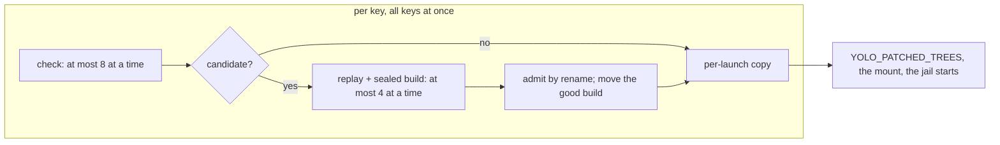

# One keyed build for every pi extension: in parallel, published by rename, read without a lock, and updated at launch or for the next one

**Status:** 2026-10-05. Built: [XB-D14](#XB-D14), the unshared npm prefix with the refresh's
throttle beside its lock, and [XB-D34](#XB-D34), the npm launcher's install kept off a piped
launch's stdout; then [OQ-6](pi-git-extension-caching.md#OQ-6) (c) as [XB-D35](#XB-D35) to
[XB-D38](#XB-D38) build it (an unmodified extension from git or npm, built on the host with an
empty series, copied read-only per launch, its fallback where no tree is handed), [§14](#14-what-i-would-build-in-order)'s step 1
([XB-D41](#XB-D41)), step 2 for extensions ([XB-D39](#XB-D39), measured in [XB-D40](#XB-D40)) and, on 2026-10-06, for a jail launch's
patched forks and plain forks' missing builds too, in one pool with its extensions ([XB-D56](#XB-D56), [XB-D57](#XB-D57)), and
the background-mode slice 1 ([XB-D42](#XB-D42)), built 2026-10-08 for built trees and runtime-checked only on Linux, rootful, nested Podman ([XB-D58](#XB-D58) to [XB-D65](#XB-D65)); and [XB-D24](#XB-D24)'s version probe and [§9](#9-the-startup-profile)'s #1 and #7, the compile caches, as [XB-D51](#XB-D51) to [XB-D55](#XB-D55) record. Evidence read at `854480458` (main) and `d44cb88b9`
(the held store, branch `held/pi-extension-store`), and pi 1.0.1 read as installed in this jail, not
run. MEASURED by a research pass of 2026-10-05 in scratch outside the repository, on a machine whose
one-minute load ran from 5 to 138 on 32 CPUs: most figures below are medians of repeated runs, with
CPU time (user+sys of the whole process tree) beside wall time, because single wall-clock numbers
were unreliable under that load; a figure from one run, or with wall time only, says so where it
appears. The research harness was not the build this design specifies, and
[§5.2](#52-the-pipeline) names how. MEASURED 2026-10-06, building step 2 for a
jail launch's pool: a warm build jail whose build line only writes a file took 1.2 to 1.3 s from its
start line to its admit, two at once in a nested launch ([XB-D13](#XB-D13)). UNMEASURED: no real pi has loaded a tree built this way, and the maintainer's migration of his extensions remains. For the Podman next-launch mode, the 2026-10-08 source candidate passed the parent integration/runtime gate only on Linux, rootful, nested Podman: a detached advance made its build available only to a later fresh jail, and termination and kill cases fenced and recovered the real build workspace. Rootless Podman and native macOS runtime behavior remain UNMEASURED; Darwin evidence is static vet/compile only. This source-built slice 1 does not imply native/performance/migration slice 2. Independent review and the landing commit remain outstanding. The Apple Container check-only path, the host path, and patched-fork/captured-program timing are still unbuilt. An npm source was built in the sealed jail
and its tree mounted read-only by the integration cell of 2026-10-05, and a build jail's start was
timed against a warm launch ([XB-D40](#XB-D40)).

> **In short.** An unmodified extension is a patched extension with no patches. So every extension
> a pack declares can be built the way a patched one already is, on the host, each key under its own
> lock and all keys at once, and handed to the next launch whenever you would rather not wait.

**Why it matters.** pi's extensions were refreshed in front of a launch, hourly, under one lock every
jail on the machine shared, into an npm prefix every pi jail loaded from, against the 2026-09-25
no-leakage ruling ([OQ-4](pi-git-extension-caching.md#OQ-4)); and every build ran one key after
another. On 2026-10-05 the maintainer asked for each of those to change, and both changed that day
([XB-D14](#XB-D14), [XB-D39](#XB-D39)).

**The shape.** One pipeline per extension key (check, build, admit, copy), run for all keys of a
launch at once; per-key host locks; records and trees published by rename; and one `agent_updates`
value that picks when the pipeline runs.

**Cost.** An npm source kind and a `fallback` field on `files`; a read-only copy of each tree per
fresh launch, so an extension that writes into its own directory at run time fails there
([§11](#11-risks)); updates that arrive at a jail launch rather than at a pi relaunch; until trees
land, an npm install of pi's extensions in every workspace ([§6.3](#63-what-replaces-the-machine-wide-lock-now));
and, under [OQ-6](pi-git-extension-caching.md#OQ-6)'s leaning, the held in-jail store not landing.

**Start at [§2](#2-the-verdict-and-five-principles)**: the comparison that decides [OQ-6](pi-git-extension-caching.md#OQ-6). Everything
after it holds under either answer unless it says otherwise.

**Needs your ruling:** [OQ-6](pi-git-extension-caching.md#OQ-6) (c) and [OQ-XB1](#OQ-XB1) (A, widened
to captures) were ruled 2026-10-05, and [XB-D14](#XB-D14) confirmed. [`pi-extension-lifecycle.md` OQ-4](pi-extension-lifecycle.md#OQ-4)
rides with [OQ-6](pi-git-extension-caching.md#OQ-6) ([§4.4](#44-entries-no-pack-declares)). [XB-D27](#XB-D27), the reading of
your update-timing ruling against [OQ-2](pi-git-extension-caching.md#OQ-2), was confirmed the same day.

**Reads with:**
- [`pi-git-extension-caching.md`](pi-git-extension-caching.md): the held store, its rulings
  [OQ-2](pi-git-extension-caching.md#OQ-2) to [OQ-5](pi-git-extension-caching.md#OQ-5), and
  [OQ-6](pi-git-extension-caching.md#OQ-6). This doc extends it; split out so each stays decidable.
- [`patched-extensions.md`](patched-extensions.md) and [`patched-forks.md`](patched-forks.md): the
  build, admit, delivery and locks this reuses. Every PPX and PF term and row cited here is theirs.
- [`pi-extension-lifecycle.md`](pi-extension-lifecycle.md): the pre-launch refresh this changes.
- [`program-delivery.md`](program-delivery.md): the agent CLI's own update, which
  [OQ-XB1](#OQ-XB1) leaves in front until [OQ-PD23](program-delivery.md#OQ-PD23).
- [`pi-extension-store-builds-plan.md`](pi-extension-store-builds-plan.md): the implementation
  sketch, incomplete while questions are open; nobody builds from it.

---

## 1. Defined terms

Coined here unless a link says otherwise:

- **Unmodified extension**: a `files` contribution that names a `source` and no `patches`. Its bytes
  are the upstream at one commit or version, built in the sealed capture jail. Not a
  [patched extension](patched-extensions.md#1-defined-terms), which carries a series, and not a pi
  `git:` or `npm:` entry, which pi installs and updates itself.
- **Raw entry**: an element of pi's `packages` list written in pi's own source grammar (`git:`,
  `npm:`, a URL), which pi installs and updates itself, whoever wrote it: a pack's `config-list`, the
  host layer, or a `pi install` inside a jail. Not a local path, which pi only loads.
- **Background advance**: the check and advance ([PF-D5](patched-forks.md#PF-D5),
  [PF-D8](patched-forks.md#PF-D8)) a fresh launch starts as a detached host process after handing
  each key the build it already has. Not the in-jail pre-launch refresh, which pi runs.
- **Update timing**: which of two moments a key's advance runs at, **at launch** (the launch waits
  for it, bounded) or **for the next launch** (a background advance). A per-pack value of
  `agent_updates` ([§7.6](#76-the-setting)).

[Built tree](patched-extensions.md#1-defined-terms), extension key, owner key, owning agent pack,
newest fit, good build, check, advance and held keep their meanings in the patched designs. The held
store's own **tree**, **mirror** and **pointer** keep [theirs](pi-git-extension-caching.md#defined-terms),
and are named "the held store's" wherever they appear.

## 2. The verdict, and five principles

**Build every extension a pack declares as a patched extension is built, with an empty series, and
do not land the held in-jail store.** The two pipelines make byte-equivalent trees: a replay of no
patches is a checkout, and a build line equal to pi's dependency command, run when pi runs it
([XB-D3](#XB-D3)), installs what pi would. What differs is everything around the bytes, the
writability of the tree included:

| | Held store ([OQ-6](pi-git-extension-caching.md#OQ-6) a or b) | Capture route ([OQ-6](pi-git-extension-caching.md#OQ-6) c) |
| :--- | :--- | :--- |
| Where the build runs | In your jail, at a pi exec; install scripts run there, workspace mounted (READ the held `prelaunchtrees.go`, PG-D25) | On the host, in the sealed, credential-free build jail ([PPX §7.1](patched-extensions.md#71-the-build-act)) |
| Who can write the store | Every pi jail; a container agent runs as root in its user namespace, so read-only bits bind nothing ([store §4](pi-git-extension-caching.md#4-invariants-and-done-conditions)'s limit) | No jail: the capture store is mounted read-only or not at all |
| How pi finds a tree | A pointer the pi pack's post-merge rewrite writes into the settings, amending [`OQ-LT2`](../reference/pack-system.md#oq-lt2) | A list entry the author writes ([PE7](patched-extensions.md#2-the-verdict-and-three-more-principles)); nothing is rewritten |
| Your own `pi install` | Shared through the rewrite | pi's, per workspace ([§4.4](#44-entries-no-pack-declares)) |
| When an update lands | At any pi exec, hourly | At a fresh jail launch, hourly; a pi relaunch inside a running jail keeps its trees |
| macos-user, a macOS host | The same store (unverified on a Mac) | pi's own install, through the author's `fallback` ([§4.3](#43-delivery-and-the-fallback)) |
| Writable at run time | Write bits cleared (READ, the held `build.go:160-183`), which a container agent's root overrides, so such a write lands in a tree other jails load | No: a tree is mounted read-only, so an extension that writes into its own directory fails with `EROFS`, where pi's own writable install, today's route and the fallback's, lets it ([§11](#11-risks)) |
| Cost per pi exec | 63.6–67.1 ms CPU warm as held, 42.8–43.7 ms with [§8](#8-if-the-held-store-lands-instead)'s fixes (MEASURED: the medians of two rounds of 20 runs) | None: the launcher reads a wire it already reads |
| Machine-wide lock | None | None |
| Pipelines for one property | Two: this and patched extensions ([PPX alternative G](patched-extensions.md#14-alternatives-and-what-this-does-not-cover) rejected the store as the base for patched ones) | One |

My read is that the capture route is what the request asked for in its own words (*"if we can just
capture unmodified extensions that would probably be great"*), and that its real costs, updates
only at a jail launch, your own `pi install` staying per workspace, and a read-only tree that an
extension writing beside itself cannot use, are smaller than a store any jail can write and a
rewrite that amends a standing ruling. That is
[OQ-6](pi-git-extension-caching.md#OQ-6)'s leaning; the restated question is there.

The principles, numbered so later sections and the store's design can cite them:

- **XB-P1. One build for one property.** An extension tree is built one way, patched or not; two
  mechanisms for one property is the drift [OQ-5](pi-git-extension-caching.md#OQ-5)'s ruling named.
- **XB-P2. Per key, never per machine.** Every lock, record and throttle this design adds names one
  extension key, one repository or one workspace, never the machine. Two throttles it does not add
  still name the machine, and [§6.1](#61-every-lock-in-pis-path) says who owns them.
- **XB-P3. Publish complete, read without locking.** A tree or record becomes visible by one rename,
  completion marker last, and a reader checks the marker and takes no lock.
- **XB-P4. Nothing a jail can write feeds another jail or the host.** Not a tree, not a record, not a
  cache a build reads.
- **XB-P5. Timing changes when, never what.** Either timing hands a launch only an admitted build or
  the author's fallback; the background mode only changes which launch first gets a newer one.

## 3. What exists today, precisely

As drafted on 2026-10-05, before anything here was built. A row the build has since changed says
which ledger row changed it, and what holds now.

| Fact | Where | How known |
| :--- | :--- | :--- |
| *Changed by [XB-D14](#XB-D14):* pi's refresh, `pi update --extensions`, ran in front of the exec under `.pi-shared-npm/.yolo-update.lock`, one lock for the machine, since the prefix it wrote was one directory every pi jail mounted. It now runs under `.pi/.yolo-update.lock`, one per workspace | [`packs/pi/pack.json`](../../packs/pi/pack.json) | READ |
| A launch whose settings content is new, finding that lock held, waits up to `UPDATE_TIMEOUT` (60 s) for it; since [XB-D14](#XB-D14), only behind another session of its own workspace | [`prelaunchrefresh.go`](../../internal/entrypoint/prelaunchrefresh.go) (`_wait_for_refresh_lock`) | READ |
| *Changed by [XB-D29](#XB-D29) and [XB-D26](#XB-D26):* the refresh was due when its stamp, `~/.cache/yolo-agent-stamps/refresh/pi.stamp`, was over an hour old (machine-global), or the settings content was never refreshed with successfully; a failure recorded no seen marker (the stamp was touched on every outcome), so new content offline refreshed on every launch. The stamp and the seen markers now live beside the lock, in `.pi/.yolo-refresh/`, and a failed refresh of new content waits out the hour | [`prelaunchrefresh.go`](../../internal/entrypoint/prelaunchrefresh.go) (`_refresh_due`, `_refresh_content_unseen`) | READ; the repeat MEASURED, three launches in a row |
| *Changed by [XB-D25](#XB-D25):* the patched-extension gate ran after the refresh, so a launch it stopped had paid for the refresh first. It now runs first, in every template | [`shims.go`](../../internal/entrypoint/shims.go), [`forklauncher.go`](../../internal/entrypoint/forklauncher.go) | READ |
| *Changed by [XB-D39](#XB-D39):* patched extensions were delivered one key after another, each advance with its own build jail. A launch's extensions now advance in one pool, each build still in its own build jail | [`treedelivery.go`](../../internal/cli/treedelivery.go), [`treepool.go`](../../internal/cli/treepool.go) | READ |
| A build's lock is a kernel `flock` per build identity, which the kernel releases when its holder dies | [`forkbuild.go`](../../internal/cli/forkbuild.go), [`pidlock.go`](../../internal/pidlock/pidlock.go) | READ |
| A sealed build's `~/.cache` is its own, made under its staging workspace and removed with it | [`seal.go`](../../internal/cli/run/seal.go), [`forkbuild.go`](../../internal/cli/forkbuild.go) | READ |
| `agent_updates` is a bool or a per-pack map of bools, user scope only; the jail's reader reads any other shape as "on" | [`config/agentupdates.go`](../../internal/config/agentupdates.go), [`validate.go`](../../internal/config/validate.go), [`entrypoint/agentupdates.go`](../../internal/entrypoint/agentupdates.go) | READ |
| pi 1.0.1 checks npm versions 4 at a time, then runs one batched npm install beside git updates 4 at a time; its startup installs anything still missing one at a time | `dist/core/package-manager.js:36-37`, `:884`, `:896-911`, `:1000-1040` | READ |
| pi 1.0.1's git dependency step for npm is `install --omit=dev --legacy-peer-deps`; its npm install is `install <spec> --prefix <root> --legacy-peer-deps` | `package-manager.js:1483-1499`, `:1505-1526` | READ |
| The held resolver resolves every pointer one after another, looks each git ref up twice, prefetches no blobs, and runs `<npmCommand> install` with neither of pi's flags when `npmCommand` is set | `held/pi-extension-store:internal/pkgtrees/pkgtrees.go:200-211`, `git.go`, `packs/pi/pack.json` | READ |

The maintainer's own pack lists nine extensions as raw entries in the list every jail gets (READ,
the staged `/ctx/packs/matt/pack.json:74-82`). Four are four of his five forks, which
[the patched-extension migration](patched-extensions.md#13-migrating-the-maintainers-five-forks)
turns into patched extensions; the fifth, `pi-automode`, is a raw entry in the guarded posture's
list (`:113`), which only the host gets. The other five of the nine are unmodified: one git entry pinned to a commit
(`pi-thread-goal`) and four npm packages, one of them an exact pin. So **the npm source kind is most of
what "capture unmodified extensions" buys him.**

## 4. Capturing unmodified extensions

### 4.1 The declaration

```jsonc
{ "kind": "files",
  "into": ".pi/agent/yolo-ext/pi-web-access",
  "source": "npm:pi-web-access",
  "fallback": "npm:pi-web-access" },
{ "kind": "files",
  "into": ".pi/agent/yolo-ext/pi-thread-goal",
  "source": "git+https://github.com/T50-Systems/pi-thread-goal?ref=5650274186687d1c5bfb18c8d11276a31830e0b3",
  "fallback": "git:github.com/T50-Systems/pi-thread-goal@5650274186687d1c5bfb18c8d11276a31830e0b3" },
// and in the pack's config-list on pi/settings at /packages, in the same edit:
//  - "npm:pi-web-access"
//  + "~/.pi/agent/yolo-ext/pi-web-access/node_modules/pi-web-access"
//  - "git:github.com/T50-Systems/pi-thread-goal@5650274186687d1c5bfb18c8d11276a31830e0b3"
//  + "~/.pi/agent/yolo-ext/pi-thread-goal"
```

| Field | Rule beside `source` with no `patches` |
| :--- | :--- |
| `source` | A git source as [PF-D1](patched-forks.md#PF-D1) has it, or `npm:<name>[@<spec>]`, where `<spec>` is an exact version, a dist-tag or a range, and absent means `latest` ([XB-D5](#XB-D5)) |
| `follow` | Git only. Default `head`, what pi does with the same `git:` entry today; a tag or commit `?ref=` is fixed ([XB-D2](#XB-D2)). Refused beside an npm source |
| `build` | Optional. Absent means pi's own dependency command ([XB-D3](#XB-D3)) |
| `produces`, `into` | As for a patched extension ([PPX §4](patched-extensions.md#4-the-declaration)) |
| `fallback` | Optional: the raw entry pi installs itself where this launch hands no tree ([§4.3](#43-delivery-and-the-fallback)). Refused beside `patches`, since the upstream unpatched is not what a series asks for |

**The tree's list entry** is `~/<into>` for a git source and `~/<into>/node_modules/<name>` for an
npm source, because an npm tree is an npm prefix, the shape pi's own install leaves
([XB-D6](#XB-D6)). The lint, the owning agent pack's match ([PPX-D4](patched-extensions.md#PPX-D4))
and the fallback all compare that exact string; core reads none of pi's grammar.

This reverses, for `files` only, [PF alternative H](patched-forks.md#11-alternatives-with-verdicts)'s
*"a series has at least one member"* and [PPX §4](patched-extensions.md#4-the-declaration)'s
*"Zero patches would be a plain `git:` entry"*. H's reason was that nobody asked for a zero-patch
mode and that it would make two ways to deliver one thing; for an extension both have turned:
the request asks for it, and a plain `git:` entry is the second way, not this. A `program` keeps H
([XB-D1](#XB-D1)).

### 4.2 Building and admitting

Unchanged from [PPX §7](patched-extensions.md#7-the-build-and-the-admit): the check per key at most
hourly ([PF-D5](patched-forks.md#PF-D5)), the ratchet ([PF-D8](patched-forks.md#PF-D8)), the back-off
of a failed build ([PF-D9](patched-forks.md#PF-D9)), the sealed build jail narrowed to the contributing
pack, the image's `/bin/node` and `/bin/npm`, the final copy, and the admit's checks. What an empty
series changes:

- **The walk has one entry.** Every candidate fits, so the newest is taken: the branch's tip under
  `follow: "head"`, the newest version tag under `release`, the resolved version for npm.
- **The recipe's series digest is a fixed value for no series**, so a patched and an unmodified build
  of one commit never share an entry.
- **The npm check runs on the host, in Go**: one HTTPS request per package for the registry's
  abbreviated metadata, through one keep-alive client per process, resolved by node-semver's rules
  ([XB-D5](#XB-D5), [XB-D11](#XB-D11)). An exact version needs no request at all.
- **An npm build starts from an empty checkout** and runs pi's npm invocation into it.

### 4.3 Delivery, and the fallback

A built tree is delivered exactly as a patched one is ([PPX §8.1](patched-extensions.md#81-in-a-jail)):
a per-launch copy, by reflink or copy and never a hardlink, mounted read-only at `~/<into>`, and
named in `YOLO_PATCHED_TREES`, which keeps its name ([XB-D8](#XB-D8)). The Linux host renders it as
[PPX §8.3](patched-extensions.md#83-at-the-host) says. Read-only is a change for an unmodified
extension, which pi's own install leaves writable: one that writes into its own directory at run
time works there and fails here, and the fallback does not catch it, since a tree was handed
([§11](#11-risks)).

**Where the launch hands no tree, the fallback takes the list entry's place** ([XB-D7](#XB-D7)): at a
notch that builds none (macos-user, a macOS host, a nested launch, Apple Container below its read-only
floor with no good build on the machine), after a build that failed with nothing serving, or when the
wire is absent. Core contributes the author's `fallback` string in place of the tree's list entry in
the contributing pack's own `config-list` and posture-list entries, before the fold. So pi installs
the extension itself, per workspace, exactly as it does today. This is not the post-merge rewrite
[`OQ-LT2`](../reference/pack-system.md#oq-lt2) forbids: it chooses between two strings one author wrote,
in that author's own contribution, before anything merges. Each fallback taken is said once at launch,
naming the reason and that pi installs it in this workspace.

Without a `fallback`, an unmodified extension behaves as a patched one:
[PPX-D18](patched-extensions.md#PPX-D18)'s stop at a notch that builds trees, and a line at one that
builds none.

### 4.4 Entries no pack declares

A raw entry stays pi's, installed and refreshed per workspace, once the npm prefix is per workspace
([§6.3](#63-what-replaces-the-machine-wide-lock-now)). Nothing rewrites it, so it is not shared; it
no longer leaks either, which was the fault [OQ-5](pi-git-extension-caching.md#OQ-5)'s ruling set out
to end. It departs from that ruling's *"pi's updater touches nothing in a jail"* for entries no pack
declares, which [OQ-6](pi-git-extension-caching.md#OQ-6)'s option (c) says. Moving one into a pack is
an edit: the `files` contribution of [§4.1](#41-the-declaration), its list entry, and its old raw
string as the `fallback`.

[`pi-extension-lifecycle.md` OQ-4](pi-extension-lifecycle.md#OQ-4), who installs a package the refresh
did not reach and under what lock, narrows under (c) to raw entries in one workspace: two pi sessions
of that workspace starting together while a raw package is missing. Its leaning, accept and document,
fits that better than it did the machine-wide case.

### 4.5 What it changes in the store's design

Under [OQ-6](pi-git-extension-caching.md#OQ-6) (c):

| In [`pi-git-extension-caching.md`](pi-git-extension-caching.md) | Becomes |
| :--- | :--- |
| [§3.1](pi-git-extension-caching.md#31-the-store)–[§3.8](pi-git-extension-caching.md#38-garbage-collection): the store, pointers, resolver, locks and reaper | Not landed. The held branch stays unmerged as the record of option (a) |
| [§3.2](pi-git-extension-caching.md#32-pointing-pi-at-a-tree)'s rewrite and its amendment of [`OQ-LT2`](../reference/pack-system.md#oq-lt2) | Not needed; [`OQ-LT2`](../reference/pack-system.md#oq-lt2) stands as written |
| [§3.11](pi-git-extension-caching.md#311-the-npm-store), the npm store | npm extensions a pack declares become built trees; `.pi-shared-npm` is retired now, under every option ([§6.3](#63-what-replaces-the-machine-wide-lock-now)) |
| [§3.12](pi-git-extension-caching.md#312-the-refresh-trigger-that-stays), `due_on_change` | Stays, for raw entries |
| [§4](pi-git-extension-caching.md#4-invariants-and-done-conditions)'s I1, I2 and I4 | Hold, through per-launch copies and one capture entry per key, commit and recipe |
| I3 | A launch runs pi on the trees it was handed or on the author's fallback, or [PPX-D18](patched-extensions.md#PPX-D18) stops it and says why |
| The limit, a hostile jail writing the shared store | Gone: no jail writes the capture store |
| Its done conditions | Replaced by [§12](#12-what-done-looks-like) |

Under (a) or (b) the store lands with [§8](#8-if-the-held-store-lands-instead)'s fixes, and
[§5](#5-parallel-installs-and-updates) to [§7](#7-when-updates-run) apply to both pipelines.

## 5. Parallel installs and updates

### 5.1 What ran one after another

As drafted; [XB-D39](#XB-D39) put the tree arm's keys in one pool, and on 2026-10-06
[XB-D56](#XB-D56) ran a jail launch's forks in the same pool as its extensions.

- **The launch's tree arm** advanced one key, then the next, and the fork arm before it did the same
  for patched forks, until [XB-D39](#XB-D39) and [XB-D56](#XB-D56) ran every key of both in one pool
  ([`cli/buildpool.go`](../../internal/cli/buildpool.go)).
- **The held resolver** resolves every pointer in turn (READ, `pkgtrees.go:200-211` on the held
  branch).
- **pi** checks 4 at a time and installs in two waves, then its startup installs what is still
  missing one at a time ([§3](#3-what-exists-today-precisely)).

### 5.2 The pipeline

Every key a fresh launch's fork-build slot serves, a plain fork's missing build, a patched fork's
advance and an extension tree's alike, runs its own pipeline, and the pipelines run together
([XB-D10](#XB-D10)):



- **Checks** are network-bound and cheap, so up to 8 run at once. MEASURED in the research pass: a
  registry metadata request costs 0.018 s CPU for four in parallel, against 0.84 s for four
  `npm view` runs; a git `ls-remote` 0.16–0.33 s wall.
- **Builds** are CPU-bound, so at most `min(4, max(1, CPUs/2))` run at once, 4 being pi's own
  `GIT_UPDATE_CONCURRENCY`. A key's build starts as soon as its own check finds a candidate; it never
  waits for other checks. **On Apple Container, one at a time**: a capture jail cannot start beside
  a running jail there (INFERRED, [OQ-PD25](program-delivery.md#decision-ledger)), and a second build
  jail is one, so the same backend capability that decides [XB-D21](#XB-D21) caps the pool at 1 until
  two sealed build jails are measured starting together on a Mac.
- **Copies** start as each key's advance ends.
- **Locks** stay [PF §6.6](patched-forks.md#66-locks-and-their-order)'s, in its order, so two keys of
  one repository serialize on its mirror lock for the fetch, the blob prefetch and the replay, and
  build in parallel ([PPX-D13](patched-extensions.md#PPX-D13)).

**What it buys**, from the research pass's measurements of the same nine extensions (MEASURED,
four interleaved rounds at a load of 97 to 105). **Its harness was not this design's build**, in four
ways: it fetched each git source at depth 1, where pi clones in full and packsrc fetches a blob-less
mirror and prefetches its blobs, which the same pass measured slower than either (summed over five
repositories, medians of three: 14.6 s with the prefetch, 7.2 s for a full clone, 2.6 s at depth 1);
it ran no install scripts, on pi's side too; the trees of a round shared one cold npm cache, which
[XB-D12](#XB-D12) forbids; and no build jail ran. With those deviations, pi's own cold install took a
median 6.56 s wall and 18.9 s CPU; the nine trees built at once, each in its own directory and
published by rename, took 6.03 s and 16.7 s with pi's commands, and 4.91 s and 14.1 s skipping
empty dependency steps and npm's audit as well, skips this design does not take ([XB-D3](#XB-D3)). The larger wins
are where pi repeats work a machine-wide build does once. They come from a second run set, scripts
off as above and medians of three, in which pi's cold install on an empty machine took 17.2 s wall
(one of its three runs timed out at 600 s), so compare within a set and not across: there, a new
workspace on a warm machine cost pi 18.0 s wall and 14.1 s CPU to clone and install again, and a
no-change update 1.89 s and 1.26 s; a built tree costs a copy. The build jail's own start is
UNMEASURED apart from a build ([XB-D13](#XB-D13)).

### 5.3 What is shared, and what never is

| Shared | Why it is safe |
| :--- | :--- |
| One bare mirror per repository, host-side, with one blob prefetch per checkout | packsrc's, under its per-repository flock; a jail never writes it |
| The registry's metadata, fetched once per package name per check | Read-only, and checked again by npm's own integrity at install |
| A built tree, per machine, for every workspace | Admitted by the sealed build and copied per launch |

**Never an npm cache shared across builds** ([XB-D12](#XB-D12)). npm's cache index maps a request to
a digest a writer chooses, which is [the injection channel AGENTS.md names](../../AGENTS.md#invariants--gotchas)
for npm's `_cacache`; a build runs an upstream's install scripts, so a shared cache would let one
extension's scripts choose another's bytes, and the machine's `~/.cache`, which every jail writes,
would let a jail choose what the host's pi later loads. The cost is measured, in wall time: five git
dependency steps at once took 2.96 s with private cold caches and 2.53 s with one shared cold cache,
and four npm trees 4.46 s against 2.90 s, while their CPU was about equal (3.97 s against 3.82 s,
and 4.61 s against 4.55 s; MEASURED, research pass, medians of three).

### 5.4 Output, interrupts and bounds

- **Lines print in declaration order**, each key's buffered until it and every key before it have
  ended ([PPX-D13](patched-extensions.md#PPX-D13)). One start line per build prints at once, naming
  the extension and its log, because a launch parked in silence reads as a hang.
- **One Ctrl-C ends every wait** ([PF-D57](patched-forks.md#PF-D57)): every in-flight advance is
  cancelled, each key with a good build is handed it, and a key with none takes its fallback or is
  [PPX-D18](patched-extensions.md#PPX-D18)'s stop.
- **The bounds are per key and unchanged**: 60 s for a check's fetch, 60 s for the walk, and
  `forkBuildWaitBound` (20 minutes) for a build ([OQ-PFK3](patched-forks.md#OQ-PFK3)). A launch now
  waits for the slowest key, not for the sum.

## 6. No machine-wide lock

### 6.1 Every lock in pi's path

| Lock | Scope | After this design |
| :--- | :--- | :--- |
| `.pi-shared-npm/.yolo-update.lock`, pi's refresh | **The machine**, because the prefix is | Moves to `.pi/.yolo-update.lock`, one workspace ([§6.3](#63-what-replaces-the-machine-wide-lock-now)) |
| The program's install-prefix lock, `$NPM_CONFIG_PREFIX/.yolo-update.lock` | One workspace (`~/.npm-global`) | Unchanged ([`shims.go`](../../internal/entrypoint/shims.go)) |
| The MCP server refresh's lock | One workspace's prefix | Unchanged |
| A build's lock | One build identity | Unchanged, a kernel flock |
| An owner key's record lock | One key | Unchanged |
| A mirror's lock | One repository | Unchanged |
| The launch lock | One workspace | Unchanged |
| The held store's `mirror-<slug>` and `tree-<key>` locks | One repository, one tree | Land only under (a) or (b), retuned ([§8](#8-if-the-held-store-lands-instead)) |
| The refresh's stamp and its seen-content markers (throttles, not locks) | **The machine**, under `~/.cache` | Move beside the refresh's lock, one workspace ([XB-D14](#XB-D14)) |
| The agent CLI's hourly update stamp, `~/.cache/yolo-agent-stamps/<bin>.stamp` (a throttle) | **The machine**, over an `npm install -g` into each workspace's `$NPM_CONFIG_PREFIX` ([`shims.go`](../../internal/entrypoint/shims.go)) | Unchanged here: [OQ-PD23](program-delivery.md#OQ-PD23) owns it, and its leaning makes the stamp stop mattering |
| The MCP server refresh's stamps, `~/.cache/yolo-agent-stamps/servers` (throttles) | **The machine**, over installs into each workspace's prefix, under that prefix's lock ([`serverrefresh.go`](../../internal/entrypoint/serverrefresh.go)) | Unchanged here; it has the CLI stamp's shape, so it is ruled with [OQ-PD23](program-delivery.md#OQ-PD23) |

The first row is the one machine-wide lock in pi's path. Three machine-wide throttles sit over
per-workspace work, against [§6.2](#62-the-rules)'s rule 6. This design moves the refresh's, because
a seen marker there can make a new workspace skip the refresh it needs
([§6.3](#63-what-replaces-the-machine-wide-lock-now)). The CLI's and the servers' throttle only
updates: a missing CLI or server installs whatever its stamp says (READ, the cold install at
[`shims.go`](../../internal/entrypoint/shims.go), the absent server at
[`serverrefresh.go`](../../internal/entrypoint/serverrefresh.go)), so they can keep a
workspace on an older version but start no unlocked install, which is
[OQ-PD23](program-delivery.md#OQ-PD23)'s question.

### 6.2 The rules

1. **A reader never locks.** It checks a completion marker written last, and a record written by
   rename. Correctness never depends on a lock being held, except a completed build's settle and compare-and-swap of a record
   ([PF-D8](patched-forks.md#PF-D8)).
2. **A lock names one key, one repository or one workspace** ([XB-P2](#2-the-verdict-and-five-principles)),
   never the machine. Two keys of one repository share its mirror lock and no other, and nothing waits
   for a lock earlier in [PF §6.6](patched-forks.md#66-locks-and-their-order)'s order while holding a
   later one.
3. **A lock is single-flight, not a gate.** It saves duplicate work. A build that loses a rename to an
   identical one discards its own copy.
4. **A kernel lock where every contender shares a kernel** (the host's, on the host and on
   macos-user, which is the macOS Seatbelt backend and runs no VM; on podman, the Linux kernel of the
   host or of its VM), so a dead holder releases at once. A directory lock with a heartbeat only where
   contenders may not share one: Apple Container runs each jail in its own VM over one host directory,
   the held store's case.
5. **A background holder never waits.** It tries each lock once and skips the key if it is held
   ([§7.4](#74-for-the-next-launch-the-option)).
6. **A throttle has its lock's scope.** A stamp that covers one workspace's work lives with that
   workspace's lock.

### 6.3 What replaces the machine-wide lock, now

[XB-D14](#XB-D14), as one change and first, under every [OQ-6](pi-git-extension-caching.md#OQ-6)
option, has two halves:

- **The held branch's PG-D23**, its ledger row of 2026-09-26 on `held/pi-extension-store`:
  `.pi-shared-npm` is retired as `.pi-shared-git` was. `packs/pi` stops declaring the state and its
  `shared_directory` hook, an `unshare_directory` hook replaces the link
  ([PG-D8](pi-git-extension-caching.md#7-decision-ledger)), the refresh's lock becomes
  `.pi/.yolo-update.lock`, and the host directory is left for a human to delete.
- **The refresh's stamp and seen-content markers move beside that lock.** PG-D23 alone is not
  enough on main. It was built for a branch where every npm entry became a pointer to a tree, so a
  machine-wide throttle had little per workspace left to skip (READ, the held
  `prelaunchrefresh.go:86-91`). On main, a workspace whose settings
  content another workspace already refreshed (its seen marker present, the stamp under an hour old)
  skips the refresh (READ `prelaunchrefresh.go:140-145`), and pi's own startup then installs every
  npm extension into the new, empty prefix, unlocked and one at a time (READ pi 1.0.1
  `package-manager.js:1014-1019`).

The wait for new content stays, now between sessions of one workspace only.

**Built 2026-10-05**, after the confirmation below: both halves, the stamp and markers in
`<store>/.yolo-refresh/` ([XB-D29](#XB-D29), [XB-D30](#XB-D30)), a launch line naming the old
folder's `rm -rf` while it is still in the machine store ([XB-D31](#XB-D31)), the base-home sweep
leaving it alone ([XB-D32](#XB-D32)), and the `shared_directory` hook kept for other packs
([XB-D33](#XB-D33)).

**What it costs, and why it needed your confirmation.** Until trees land, each workspace installs
its npm extensions itself: that is [OQ-5](pi-git-extension-caching.md#OQ-5)'s option (c), which your
2026-09-26 ruling passed over for (a), taken as an interim on the way to (a). I propose it now because
the shared prefix was a live breach of the no-leakage ruling, and because you said on 2026-10-05
*"I don't love a machine wide lock seems like we can do better here"*. In the research pass a single
refresh in one jail reported *"changed 292 packages"* in the prefix every pi jail loaded from. Taking
an option you passed over was your call, and you confirmed it that day.

## 7. When updates run

### 7.1 The ruling

The maintainer, 2026-10-05: *"I want to have it default update at launch and then I want to have an
option to change that to update on next launch so it updates while you're using it I guess"*. So the
default is update at launch, bounded and throttled hourly as today. The option, as I read it, runs the
update in the background so its result lands on the next launch; *"I guess"* is his own hedge, and
that reading rests on the clause it hedges. In that mode a launch can start on the build it already
has while a newer one is fetched.

My reading, INFERRED and not his words, is that for a pack that opts in this amends
[OQ-2](pi-git-extension-caching.md#OQ-2)'s *"what you get in a launch should not depend on the state
of other launches"*: which version a launch gets then depends on what an earlier launch's background
advance built. That waits on his confirmation ([XB-D27](#XB-D27)); until he gives it, [OQ-2](pi-git-extension-caching.md#OQ-2)'s row in
the store's design stands as written, and once he does, that row records the amendment too. Nothing
else changes: a launch still runs only an admitted build or the author's fallback
([XB-P5](#2-the-verdict-and-five-principles)).

### 7.2 Two kinds of launch

| Update | Runs at | Default (at launch) | Option (for the next launch) |
| :--- | :--- | :--- | :--- |
| A built tree's check and advance (patched or unmodified) | A fresh jail launch, on the host | Waits, bounded ([§7.3](#73-at-launch-the-default)) | A background advance ([§7.4](#74-for-the-next-launch-the-option)) |
| pi's refresh of raw entries | Every pi exec in a jail, hourly per workspace | Waits, 60 s bound | Stays in front under [OQ-XB1](#OQ-XB1)'s leaning ([§7.5](#75-what-stays-in-front)) |
| pi's own CLI, and its MCP servers | Every pi exec, hourly per machine ([§6.1](#61-every-lock-in-pis-path)) | Waits, as today | Stays in front under the same leaning |

### 7.3 At launch (the default)

Today's behavior, unchanged except for [§5](#5-parallel-installs-and-updates)'s parallelism: a key
whose check is due is checked; a candidate is built while the launch waits, up to
`forkBuildWaitBound`; a Ctrl-C ends the wait and starts on the good build
([OQ-PFK3](patched-forks.md#OQ-PFK3)); a key with no good build builds, or takes its fallback when its
build fails. Within the hour, a launch runs no git and no registry request.

### 7.4 For the next launch (the option)

1. **The launch hands what it has, at once.** Each key with a good build is handed it with no check;
   a key with none and a `fallback` is handed the fallback, so pi installs it this once; a key with
   neither builds in front, since there is nothing to hand.
2. **When any key's check is due, a candidate is pending, or a key took its fallback for want of a
   build, the launch starts one background advance**: a detached host process in a session of its
   own, its standard streams on a log file, so it neither holds a piped launch's output open nor
   dies with the terminal. It runs at normal priority: a deprioritized holder of a key's build lock
   or a repository's mirror lock would stretch the wait of a launch at the default timing in another
   workspace, up to `forkBuildWaitBound`, and an unprivileged process cannot raise its priority back
   once a waiter appears (INFERRED from setpriority(2): on Linux, lowering a nice value needs an
   `RLIMIT_NICE` that defaults to none). It resolves the selection itself, as
   `yolo capture <pack>/<name>` does, never from the launch's staged tree, which goes when the jail
   stops ([XB-D19](#XB-D19)).
3. **It runs the same check and advance**, in parallel, with [§6.2](#62-the-rules)'s rule 5: a key
   whose lock another launch holds is skipped. Its check claims the key's hourly stamp, so the next
   launch inside the hour starts no second one.
4. **What it builds lands for the next fresh launch** through the record's compare-and-swap
   ([PF-D8](patched-forks.md#PF-D8)). It never touches a running jail's copy, and at the Linux host it
   moves the good build without swapping the link, which the next host render does.
5. **It says so** ([XB-D20](#XB-D20)): one line at the spawn naming the keys and the log; at the next
   launch the move line, or the failure with the log and when it is retried. No flag hides either
   ([`OQ-RO3`](../reference/report-tiers.md#why-its-this-way)).

**When a background advance is killed**, its flocks are released by the kernel at once
([`pidlock.go`](../../internal/pidlock/pidlock.go)) and its record stays as it was. Two things do
not end with it on their own. Nothing stops a build jail when the yolo process that started it dies
(READ: `rg Pdeathsig internal/ cmd/` finds a parent-death signal only in the GitHub broker and the
jail keeper, neither on the build path), and no reclaimer removes a capture
staging directory: `yolo prune` leaves it on purpose, and only the next build of the same id clears it
(READ [`gc.go`](../../internal/capture/gc.go),
[`store.go`](../../internal/capture/store.go)). That next build reuses the same
staging path and container name ([`forkbuild.go`](../../internal/cli/forkbuild.go)),
so it could clear the directory under a build jail still running in it. Hence
([XB-D19](#XB-D19)): on SIGTERM or SIGHUP the background advance kills its builds' process groups
and removes each build jail by name (`<runtime> rm -f <cname>`), and every build first asks whether
a container of its name is running. Yes, or "could not ask", and it does not clear the staging: it
says so and leaves the key's candidate pending. Only a known "no" clears it. A SIGKILL, which no
handler sees, is what that question covers.

**On Apple Container** a build jail cannot start beside a running jail (INFERRED,
[PF §9](patched-forks.md#9-notch-coverage)), so there the background advance checks but does not
build ([XB-D21](#XB-D21)). The next fresh launch builds a pending candidate in front, before its own
jail starts, and **only when no other jail is running**; while one is, it starts on the good build and
its line names `yolo capture <pack>/<name>` as the step that builds it once the other jails stop, as
[PF §9](patched-forks.md#9-notch-coverage) has it. So on Apple Container the next-launch option is
the at-launch wait whenever a build happens at all; it saves only the checks. macos-user and a macOS
host build nothing, so they start none.

Under (a) or (b), the same option is the held store's prefetch: a detached in-jail run that fetches,
resolves and builds trees but never repoints, so the next pi exec repoints with no network
([§8](#8-if-the-held-store-lands-instead)).

### 7.5 What stays in front

Three other updates run in front of pi, and each rewrites in place files a running pi in the same
jail reads:

- **pi's refresh of raw entries** resets and cleans a git checkout whose target moved
  (`git clean -fdx` deletes its `node_modules` before the dependency command reinstalls them) and
  runs one batched `npm install` into the npm prefix for every npm package with a newer version
  (READ, pi 1.0.1 `package-manager.js:1641-1665` for git, `updateNpmBatch` at `:928-943` for npm),
  while pi's own startup installs any missing package with no lock
  ([lifecycle §3.5](pi-extension-lifecycle.md#35-who-installs-a-package-the-refresh-did-not-reach)).
- **pi's own CLI** updates by `npm install -g` over the install a running pi loads its lazily
  imported chunks from (INFERRED from the bundle's hash-named chunk imports).
- **The MCP servers' refresh** must complete before the exec, by ruling
  ([OQ-PD12a](program-delivery.md#decision-ledger)).

Whether the option moves them too is [OQ-XB1](#OQ-XB1). Under its leaning they stay in front, and
pi's CLI joins the background once it is delivered once per machine, which is
[OQ-PD23](program-delivery.md#OQ-PD23)'s leaning.

### 7.6 The setting

`agent_updates` takes four values, at its top level or per pack, user scope only as today
([XB-D17](#XB-D17)):

```jsonc
"agent_updates": { "*": true, "pi": "next-launch" }
// true or "launch": update at launch; "next-launch": update for the next launch; false: hold
```

- **Whose value governs a tree**: `false` from the contributing pack or the owning agent pack holds
  it ([PPX-D9](patched-extensions.md#PPX-D9)); otherwise the owning agent pack's value picks the
  timing, else the contributing pack's ([XB-D18](#XB-D18)).
- **Readers.** The check that asks "may it move" reads both strings as yes; a separate reader answers
  "when". `host_floor`, which shares `agent_updates`' shape, stays boolean.
- **An older jail-side reader** reads a string as "on", update at launch, except under a `"*": false`
  default, where it treats the pack's string as absent and holds. Both halves come from one tree on
  every launch, so that pairing needs a source skew the launch already refuses.

## 8. If the held store lands instead

Under [OQ-6](pi-git-extension-caching.md#OQ-6) (a) or (b), these land with it ([XB-D16](#XB-D16)),
each found by the research pass against `d44cb88b9`:

| Defect or cost | Fix | Measured effect |
| :--- | :--- | :--- |
| The git dependency command has drifted from pi 1.0.1: a set `npmCommand` runs a bare `install`, pulling dev dependencies and pi's own `@earendil-works/pi-*` peers into every tree | Per-manager argv mirroring pi's `getGitDependencyInstallArgs` (npm, bun, pnpm) | `pi-subagents` 634 MB → 21 MB; `pi-dynamic-workflows` 687 MB → 15 MB |
| No blob prefetch: a checkout from the blob-less mirror makes one fetch per file | packsrc's one-request prefetch ([`store.go`](../../internal/packsrc/store.go)) | Five trees: 670 s wall, 65.8 s CPU as held, one run each → 14.6 s, 0.94 s, medians of three |
| Each git ref looked up twice per launch | One lookup per pointer | Warm launch with the pointers already resolved 4 at once: 62.4–65.8 → 42.8–43.7 ms CPU (medians of two rounds of 20; the held store's own serial baseline is [§2](#2-the-verdict-and-five-principles)'s 63.6–67.1 ms) |
| Pointers resolved one after another | At most 4 at once, Node probed once | Cold trees, mirrors present: 7.2–7.5 s → 1.5–1.7 s wall, CPU about the same |
| The store's git ignores packsrc's hook and fsmonitor guard | `storeGitConfig` ([`store.go`](../../internal/packsrc/store.go)) | READ |
| A dead holder blocks a waiter up to 600 s | Heartbeat 5 s, stale after 60 s, for a Go holder | INFERRED |
| A launch can repoint at a tree a prune is removing, and pi skips the missing path silently | The reaper removes the marker, then renames the tree into `tmp/`; a repoint re-checks the marker after its rename | INFERRED |

The refresh's stamp per workspace, the refresh skipped when nothing is raw, and the background
prefetch of [§7.4](#74-for-the-next-launch-the-option) apply there too. Landing replays the six held
commits onto main with nine conflicting files, five of them code, each conflict small
([the sketch](pi-extension-store-builds-plan.md#landing-the-held-store)).

## 9. The startup profile

Measured 2026-10-05 against scratch copies of this jail's pi state, `PI_OFFLINE=1`, no agent session,
sockets and child processes blocked during loading (MEASURED unless marked). The jail runs the pi fork
build at 0.99.1, whose package manager is byte-identical to 1.0.1's.

| # | Step | Cost | How often | Improvement | Where it goes |
| :--- | :--- | :--- | :--- | :--- | :--- |
| 1 | Compiling extensions with jiti's cache empty | `pi --help` 7.0 s wall, 10.2 s CPU (n=5), against 0.68 s and 0.88 s warm (n=10) | The first pi start after every jail start: the cache is `/tmp/jiti`, which a restart empties | Keep the cache per workspace across restarts, never machine-wide | Built: [XB-D52](#XB-D52), [XB-D54](#XB-D54) |
| 2 | The pre-launch refresh, when due | At least 8.4 s wall in one real run (INFERRED from file times), 60 s bound; 131 ms wall, 161 ms CPU offline | Hourly per machine, and on new settings content | The background mode; skip it when nothing is raw, and for a version probe | Here: [§7](#7-when-updates-run), [XB-D23](#XB-D23), [XB-D24](#XB-D24) |
| 3 | The MCP server refresh, when stale, and the agent CLI's own update, when due | An `npm install` per server, and one for the CLI, each with a 60 s bound; not timed | Hourly per machine | Stays in front ([OQ-XB1](#OQ-XB1)); a version probe skips both | Here: [XB-D24](#XB-D24) |
| 4 | A nix build with nothing to do, at a fresh launch | 1.69 s median wall (n=15 spans in the host perf log; wall only) | Every fresh launch declaring `packages:` ([`autoload.go`](../../internal/image/autoload.go)) | The stock-image skip for a launch with `packages:` | Already on the [roadmap](../plans/roadmap.md) |
| 5 | The durable-directory walk | 0.30 s and 0.95 s for the two passes of one launch (one launch, wall only); 2.0 s where it hit its cap ([`report.go`](../../internal/durable/report.go)) | Twice per fresh launch | Walk once, in the jail's own boot | Already on the [roadmap](../plans/roadmap.md) |
| 6 | Extensions loading with a warm cache | 473 ms wall, 596 ms CPU for 23 extensions (n=5) | Every start | One shared jiti instance with its module cache on (pi gives each extension its own, with `moduleCache: false`, READ `loader.js:478`) | pi upstream, not yolo work |
| 7 | Node's compile cache for pi's own bundle | `pi --version` 210 → 135 ms wall (research, wall only); re-measured in review by running the jail's pi `cli.js --version` under `/bin/node` directly, n=15 each, interleaved, at a load of about 99: 869 → 641 ms CPU, 746 → 483 ms wall, cold cache against warm | The first start after a jail start: unset `NODE_COMPILE_CACHE` puts it in `/tmp` | A persistent directory, with #1 | Built: [XB-D53](#XB-D53), [XB-D54](#XB-D54) |
| 8 | Evaluating pi's bundle | About 100 ms (INFERRED from a CPU profile) | Every start | Lazy imports of highlighting, undici and yaml | pi upstream |
| 9 | A `rg` call through mise's shim for an inactive tool | 14.6 ms wall against 0.6 ms (n=20, research); 37 ms CPU against 3.3 ms (n=21, MEASURED here at a load of 127) | Every `rg` pi's grep tool runs | Let no inactive tool's shim shadow `/bin` | [Roadmap](../plans/roadmap.md) |
| 10 | The held store's resolver, per pi exec | 63.6–67.1 ms CPU warm, 42.8–43.7 ms fixed (medians of two rounds of 20) | Every pi exec, under (a) or (b) only | [§8](#8-if-the-held-store-lands-instead); none under (c) | Here |
| 11 | MCP connections at the first prompt | Up to 10 s wait (READ); the `tavily` server is `npx -y tavily-mcp@latest`, a registry lookup per session | Every session | Install or pin it | The user's own config, not yolo work |
| 12 | The launcher's own steps, and the Node binary | 18–20 ms wall; about 6 ms wall for the image's Node against mise's (wall only) | Every start | None worth making | — |

Container creation, 0.31–6.07 s wall per fresh launch, varied with load and was not investigated.

**Found on the way, and routed to the roadmap as defects:** a due update of an npm-delivered agent
CLI writes npm's output to the launcher's standard output, so `pi -p … | consumer` hands it to the
consumer (MEASURED with a fake `npm`; READ, the npm template's `npm install -g … 2>&1` with no
redirect, in its one install function; fixed 2026-10-05, [XB-D34](#XB-D34), and the two other
launcher installs that wrote there, the native template's installer run and the package-manager
launcher's install, in review, [XB-D43](#XB-D43)). And `pi --version` runs every update step, the
CLI's, the servers' and the refresh, so a version probe can hold a launch for about two minutes, a
60 s wait for the lock and a 60 s refresh (INFERRED from those bounds), and write the npm prefix. The
research pass's own first `pi --version` ran the refresh and rewrote the shared prefix, and the
review's first ran the refresh too (MEASURED: it printed *"Updated packages"*). The probe is designed
here, as [XB-D24](#XB-D24), and the roadmap entry points at it.

**What belongs here** is #2, #3's probe half and #10, and one finding for #1: under (c) a tree sits at the same
`~/<into>` path in every jail and across its versions, so a per-workspace compile cache keyed by
path and content keeps hitting after an update for every file that did not change (INFERRED from
jiti's path-and-hash cache key). A machine-wide one is ruled out by
[XB-P4](#2-the-verdict-and-five-principles): compiled code a jail wrote would run in another.

## 10. Alternatives

| Alternative | Verdict |
| :--- | :--- |
| **Land the held store with the fixes** ([§8](#8-if-the-held-store-lands-instead)) | [OQ-6](pi-git-extension-caching.md#OQ-6)'s option (a) or (b); not the leaning ([§2](#2-the-verdict-and-five-principles)) |
| **Both: capture for what packs declare, the held store and its rewrite for raw entries** | **Rejected.** Two pipelines for one property ([XB-P1](#2-the-verdict-and-five-principles)), and the rewrite still amends [`OQ-LT2`](../reference/pack-system.md#oq-lt2) |
| **Recognize `git:` and `npm:` strings in a pack's `config-list` and capture them automatically** | **Rejected.** Core would parse pi's grammar ([store §5](pi-git-extension-caching.md#5-alternatives)); a pack writes the structured form instead |
| **Build every due key in one build jail** | **Deferred** until a build jail's start is measured apart from its build ([XB-D13](#XB-D13)); it costs failure isolation, since a stray in the delta could not be blamed on one key |
| **One npm cache shared by builds** | **Rejected** ([§5.3](#53-what-is-shared-and-what-never-is)) |
| **The background update on main's shared prefix** | **Rejected.** It writes in place under running sessions, and races pi's own startup install ([§7.5](#75-what-stays-in-front)) |
| **The background advance after the session ends** | **Rejected.** It holds the terminal after the user quits, and a one-shot `yolo -- pi -p` ends before it can run |
| **Delivering a newer tree into a running jail** (mount the per-launch directory whole, repoint at a pi exec) | **Not now.** It would let a pi relaunch take an update under (c), at the cost of a host process watching each jail; [§13](#13-what-this-does-not-cover) |
| **Resolving npm ranges with `npm view` in a build jail** | **Rejected.** The check must be cheap and host-side; a jail per check is the cost [§5.2](#52-the-pipeline) removes |
| **A flock for the held store's locks** | **Rejected.** Apple Container runs each jail in its own VM, where a flock arbitrates nothing ([§6.2](#62-the-rules) rule 4) |

## 11. Risks

| Risk | Mitigation |
| :--- | :--- |
| A cold machine's first launch waits for several build jails where pi installed in seconds | Builds run 4 at once; the background mode with a `fallback` hands pi's own install that once; the wait is once per machine per version |
| A build jail's own start dominates small trees | Measured first ([XB-D13](#XB-D13)); batching per contributing pack is ready to build if it does |
| A long-lived jail runs old extensions | An attach says when a newer good build waits ([PPX §8.1](patched-extensions.md#81-in-a-jail)); under (a) a pi relaunch updates |
| An npm package from a private registry | Not covered: no credential reaches the check or the sealed build, so it stays a raw entry ([XB-D5](#XB-D5)) |
| A node-semver range resolved differently in Go than by npm | Tested against node-semver's own range cases; an exact pin avoids it |
| An install script that needs a credential fails sealed | It fails as a build, the good build or the fallback serves, and the line names the log |
| A detached process outlives what launched it | Its locks are kernel flocks, its wait is bounded per key, and its log is named at the spawn |
| Per-launch copies on a filesystem without reflinks | About 100 MB for the maintainer's nine (MEASURED tree sizes, summed): 38 MB of git trees, 62 MB of npm trees |
| An extension that writes into its own directory at run time (a lazy download, a cache, state beside its code) fails with `EROFS` under `~/<into>`, where pi's writable install let it; the fallback does not catch it, since a tree was handed | Not detected by the launch. The extension's own error names the read-only path, and the next step is to keep that extension raw: its `fallback` string back in the list, in place of the contribution. None of the maintainer's five unmodified extensions does this (READ, a search of their installed code for writes relative to their own directory; heuristic, not exhaustive) |
| Apple Container builds one key at a time, and none while another jail runs | [XB-D10](#XB-D10)'s cap of 1 there and [XB-D21](#XB-D21)'s condition; a launch that cannot build says so and names `yolo capture <pack>/<name>` |

## 12. What done looks like

- A second workspace's fresh launch on a machine that has built the maintainer's extensions runs no
  `npm install` and no clone, and pi lists their tools, checked by hand.
- A fresh launch with nine due keys builds them concurrently: the slot's wall time is the slowest
  key's plus a copy, and the lines print in declaration order.
- pi's launcher takes no lock in a machine-scoped directory, and its extension refresh's stamp is
  per workspace: two workspaces refresh their raw entries in the same minute without waiting on, or
  silencing, each other.
- With `"pi": "next-launch"`, a fresh launch whose keys are all due starts pi with no network wait, a
  line names the background log, and the next fresh launch runs what that advance built.
- On macos-user an extension with a `fallback` is installed by pi in the workspace, as today, with one
  line saying so.
- `pi --version` through the launcher runs no CLI update, no server refresh, no pre-launch refresh,
  no tree gate and no tree step, while a cold home still installs the CLI; `pi --help` still runs
  the refresh and the gate.
- A launch the tree gate stops runs no refresh first.
- A background advance sent SIGTERM or SIGHUP mid-build leaves no build jail of its names running,
  and a build whose container name is still running, or cannot be asked about, leaves its staging
  directory alone and its candidate pending (checked by hand on podman).
- On Apple Container a fresh launch runs at most one build jail at a time.
- A refresh that fails on new settings content runs at most once an hour.

## 13. What this does not cover

- **A verb that converts a raw entry into a contribution.** The edit is by hand
  ([§4.4](#44-entries-no-pack-declares)).
- **Delivering a newer tree into a running jail** ([§10](#10-alternatives)).
- **Private registries and authenticated git** for a captured extension.
- **pi's own CLI in the background mode**, which waits on [OQ-PD23](program-delivery.md#OQ-PD23).
- **Writing the list entry for the author**, which waits on [OQ-PR1](pack-pi-resources.md#OQ-PR1).
- **The compile caches and the shim**, routed to the [roadmap](../plans/roadmap.md).

## 14. What I would build, in order

1. **The launcher.** What no ruling holds: the refresh skipped when nothing is raw
   ([XB-D23](#XB-D23)), every update step skipped for a version probe ([XB-D24](#XB-D24)), the gate
   first ([XB-D25](#XB-D25)), and a failed refresh throttled ([XB-D26](#XB-D26)). Then, once you
   confirm it, [XB-D14](#XB-D14) as one change: PG-D23's unsharing and the refresh's stamp and seen
   markers beside its lock. Confirmed and built 2026-10-05, with the npm launcher's stdout fix
   ([XB-D34](#XB-D34)). The four fixes before it were built the same day ([XB-D41](#XB-D41)).
2. **The parallel advance** for patched forks and extensions as they are today
   ([XB-D10](#XB-D10)–[XB-D13](#XB-D13)), with the build jail's start measured on an extension with
   nothing to install. Built 2026-10-05 for extensions ([XB-D39](#XB-D39)), and measured
   ([XB-D40](#XB-D40)); patched forks keep their serial advance.
3. **The update-timing value and the background advance** ([XB-D17](#XB-D17)–[XB-D22](#XB-D22)), as
   [OQ-XB1](#OQ-XB1) rules; it serves the patched pipeline already built. A seam only, 2026-10-05
   ([XB-D42](#XB-D42)); its source-built slice 1 passed runtime checks on 2026-10-08 only in Linux,
   rootful, nested Podman: the timing reader, detached background advance and next-launch outcome for
   built trees ([XB-D58](#XB-D58) to [XB-D65](#XB-D65)). Rootless Podman and native macOS runtime
   behavior remain UNMEASURED; Darwin evidence is static vet/compile only. This does not imply
   native/performance/migration slice 2. Apple Container's check-only advance, the host's update/report,
   and patched-fork and captured-program timing remain unbuilt.
4. **Under (c)**: the unmodified git source and the fallback ([XB-D1](#XB-D1)–[XB-D3](#XB-D3),
   [XB-D7](#XB-D7), [XB-D8](#XB-D8)), then the npm source ([XB-D5](#XB-D5), [XB-D6](#XB-D6),
   [XB-D11](#XB-D11)), then the maintainer's five migrated, each keeping its old string as its
   fallback. **Under (a) or (b)**: [§8](#8-if-the-held-store-lands-instead)'s fixes, then the landing
   in the sketch. (c) was ruled, and all but the migration was built 2026-10-05
   ([XB-D35](#XB-D35)–[XB-D38](#XB-D38)); the migration is the maintainer's, in his own pack.

Every call site gets a test that fails when the call site is deleted: the pool's use in the slot, the
spawn of the background advance, the fallback's substitution, the stamp's path and each launcher
template's order.

## Open Questions

[OQ-6](pi-git-extension-caching.md#OQ-6), which way pack-declared extensions are built and whether
anything rewrites pi's list, is restated in the store's design.

1. ✅ <a id="OQ-XB1"></a>**OQ-XB1: When an extension updates in the background, do pi's own CLI update, its MCP servers' refresh and its refresh of entries no pack declares move out of the launch too?**

   Each rewrites in place files a running pi in the same jail reads ([§7.5](#75-what-stays-in-front)),
   so the background mode covers safely only what yolo builds and hands as a copy.

   - **A — Only what yolo builds.** The three stay in front, hourly and bounded as today; pi's CLI
     joins the background once it is delivered once per machine
     ([OQ-PD23](program-delivery.md#OQ-PD23)).
   - **B — All of them.** Each runs detached after pi starts; a running session can find its files
     replaced underneath it, and pi's startup install can race the refresh.


   _Leaning:_ A — only what yolo builds moves to the background. B takes the three steps out of the
   launch when they are due: the refresh, at least 8.4 s in the one real run timed
   ([§9](#9-the-startup-profile) #2), hourly per workspace once [XB-D14](#XB-D14) lands, and the
   CLI's update and the servers' refresh, not timed and hourly per machine, each of the three
   bounded at 60 s. It buys that with the in-place breakage the trees exist to end, and pi's CLI
   joins once [OQ-PD23](program-delivery.md#OQ-PD23) delivers it once per machine.

   **Answer:**
   > **Ruled in review 2026-10-05, A, widened to everything yolo captures:** *"only what YOLO builds, I
   > guess, unless by, if there are things that we capture, then I think yes, the answer is we should count
   > that as being built, and I think that covers most everything, because it would be nice to be as
   > consistent as possible, so there's only one simplified mental model."* In the background mode,
   > whatever yolo builds or captures (extension trees, patched forks and extensions, captured programs)
   > is updated in the background; only pi's refresh of hand-installed extensions, and anything not yet
   > delivered by a build or capture, stays in front.

## Decision Ledger

Every row is an implementation decision, reversible, made 2026-10-05 in drafting or, from
[XB-D29](#XB-D29) on, in building, or, from [XB-D43](#XB-D43) on, in review of the build
(2026-10-05 and 2026-10-06), or, [XB-D51](#XB-D51) to [XB-D55](#XB-D55), in building the startup
fixes, numbered after the rest when the two builds were merged, except [XB-D14](#XB-D14) and [XB-D27](#XB-D27), which the maintainer
confirmed that day; his own ruling of that day is recorded
in [§7.1](#71-the-ruling). Rows marked *under (c)* apply only if
[OQ-6](pi-git-extension-caching.md#OQ-6) is ruled (c), and [XB-D16](#XB-D16) only under (a) or (b).
[XB-D56](#XB-D56) and [XB-D57](#XB-D57) were made building [§14](#14-what-i-would-build-in-order)'s
step 2 for a jail launch's forks and extensions in one pool. [XB-D58](#XB-D58) to
[XB-D65](#XB-D65) record the 2026-10-08 Podman slice 1 of [XB-D42](#XB-D42), built and runtime-checked only on Linux, rootful, nested Podman; rootless Podman and native macOS runtime behavior remain UNMEASURED, and Darwin evidence is static vet/compile only. This does not imply native/performance/migration slice 2; the remaining platform and key types are still unbuilt.

| ID | Ruling / Decision | Date | Settled in | Built |
| :--- | :--- | :--- | :--- | :--- |
| <a id="XB-D1"></a>XB-D1 | *Under (c), following the request of 2026-10-05.* **A `files` contribution may name `source` with no `patches`; the patched extension's check, walk, build, admit, delivery, ratchet, back-off, hold and explicit acts apply unchanged with an empty series.** `follow`, `build` and `produces` are accepted beside `source` alone on `files`; a `program` keeps [PF alternative H](patched-forks.md#11-alternatives-with-verdicts) | 2026-10-05 | [§4.1](#41-the-declaration) | yes, 2026-10-05, declared as [XB-D35](#XB-D35) has it |
| <a id="XB-D2"></a>XB-D2 | *Under (c).* **With no `patches`, `follow` defaults to `head`, what pi does with the same `git:` entry; a tag or commit `?ref=` is fixed, and checked only until it first resolves** | 2026-10-05 | [§4.1](#41-the-declaration) | yes, 2026-10-05; the fixed ref is [XB-D37](#XB-D37) |
| <a id="XB-D3"></a>XB-D3 | *Under (c).* **An unmodified git source with no `build` runs pi 1.0.1's npm dependency command, `npm install --omit=dev --legacy-peer-deps`, whenever the checkout has a `package.json`, exactly when pi runs it (READ `package-manager.js:1570-1572`, `:1635-1637`), and nothing otherwise.** A narrower skip, for a `package.json` declaring no dependencies and no install-time script, saved 3.35 s on a cold `pi-background-tasks` (MEASURED, research), and is not taken: some roots with no dependencies of their own still need the command, an npm-workspaces root to link its members (MEASURED in review with npm 11.17.0: before the install a member's `require` of another fails with `MODULE_NOT_FOUND`, after it returns) and a root `binding.gyp` to run node-gyp (INFERRED from npm's default install script), and the saving is once per machine per version. A patched extension keeps [PPX-D3](patched-extensions.md#PPX-D3)'s rule, no `build` and no command, since its author writes the build its series needs; the default here exists because an unmodified extension replaces a raw entry pi would have installed this way | 2026-10-05 | [§4.1](#41-the-declaration) | yes, 2026-10-05: `packdecl.UnmodifiedGitBuild` |
| <a id="XB-D4"></a>XB-D4 | *Under (c).* **The recipe of a build with no series carries a fixed series digest**, so a patched and an unmodified build of one commit never share a capture entry | 2026-10-05 | [§4.2](#42-building-and-admitting) | yes, 2026-10-05: `packsrc.EmptySeries`'s digest |
| <a id="XB-D5"></a>XB-D5 | *Under (c).* **An npm source is `npm:<name>[@<spec>]` against the public registry. The host resolves it from the registry's abbreviated metadata: an exact version with no request, a dist-tag to its version, a range to its highest match by node-semver's rules, prereleases only where the range names one.** The matcher is Go, tested against node-semver's range cases. No credential reaches the check or the build, so a private registry is not covered | 2026-10-05 | [§4.2](#42-building-and-admitting) | yes, 2026-10-05, with npm's own pick rule ([XB-D36](#XB-D36)) |
| <a id="XB-D6"></a>XB-D6 | *Under (c).* **An npm tree is an npm prefix built with pi's own invocation, `npm install <name>@<version> --prefix <tree> --legacy-peer-deps`, and its list entry is `~/<into>/node_modules/<name>`**: pi's own layout, so Node resolves the package's dependencies as it does under pi's install. The lint, the owning agent pack's match and the fallback compare that string | 2026-10-05 | [§4.1](#41-the-declaration) | yes, 2026-10-05: `packdecl.NpmTreeInstall`, `packdecl.TreeListEntry` |
| <a id="XB-D7"></a>XB-D7 | *Under (c).* **An unmodified extension may declare `fallback`. Wherever the launch hands no tree for its key, whatever the reason, core contributes the fallback in place of the tree's list entry in the contributing pack's own list contributions, before the fold, and says so once. A key with a fallback never sets [PPX-D24](patched-extensions.md#PPX-D24)'s stop.** Refused beside `patches` | 2026-10-05 | [§4.3](#43-delivery-and-the-fallback) | yes, 2026-10-05 ([XB-D38](#XB-D38)) |
| <a id="XB-D8"></a>XB-D8 | *Under (c).* **`YOLO_PATCHED_TREES` keeps its name and shape and carries unmodified keys too; an absent wire means nothing was handed.** Renaming it moves a host↔jail contract for no behavior | 2026-10-05 | [§4.3](#43-delivery-and-the-fallback) | yes, 2026-10-05: the wire is unchanged |
| <a id="XB-D9"></a>XB-D9 | *Under (c).* **Raw entries are not rewritten and stay pi's, per workspace; moving one into a pack is an edit, with no verb** | 2026-10-05 | [§4.4](#44-entries-no-pack-declares) | yes, 2026-10-05: nothing rewrites a raw entry |
| <a id="XB-D10"></a>XB-D10 | **The fork-build slot runs every owner key's pipeline concurrently: checks up to 8 at once, builds up to `min(4, max(1, CPUs/2))` and 1 on Apple Container, decided by the backend capability [XB-D21](#XB-D21) reads, since a second build jail may not start beside the first there (INFERRED, [OQ-PD25](program-delivery.md#decision-ledger)); each key's build as soon as its own check finds a candidate, copies as each advance ends; [PF §6.6](patched-forks.md#66-locks-and-their-order)'s locks and order unchanged; lines buffered per key and printed in declaration order, with one start line per build at once; one Ctrl-C cancels every wait** | 2026-10-05 | [§5.2](#52-the-pipeline), [§5.4](#54-output-interrupts-and-bounds) | 2026-10-05, the tree arms ([XB-D39](#XB-D39)); 2026-10-06, a jail launch's patched forks, patched extensions and plain forks' missing builds in one pool ([XB-D56](#XB-D56)): `cli/buildpool.go` (`runBuildSlot`), `run.Options.BuildSlot`, `run.SlotChecks` and `run.SlotBuildJails`; pinned by `TestTheSlotBuildsItsKeysAtOnceAndPrintsThemInOrder`, `TestAppleContainerBuildsOneKeyAtATime`, `TestOneCtrlCEndsEveryBuildAndWaitOfThePool` and `run.TestTheSlotIsOneActAndTheImageBuildStartsBesideIt`. A host act's tree advances keep XB-D39's pool |
| <a id="XB-D11"></a>XB-D11 | *Under (c).* **npm metadata is fetched by the host in Go over one keep-alive client per process, once per package name per check, never by an `npm view` subprocess** | 2026-10-05 | [§5.3](#53-what-is-shared-and-what-never-is) | yes, 2026-10-05: `packsrc.fetchNpmPackument` |
| <a id="XB-D12"></a>XB-D12 | **No npm cache is shared between builds or with any jail; each build keeps the seal's private cache, removed with its staging** | 2026-10-05 | [§5.3](#53-what-is-shared-and-what-never-is) | yes, 2026-10-05: each build keeps its seal's cache, and nothing new is shared |
| <a id="XB-D13"></a>XB-D13 | **One build jail per key. The parallel advance's first build measures a build jail's start on an extension with nothing to install; if that exceeds 5 s, batching a launch's due keys per contributing pack into one build jail, each admitted separately, is built next** | 2026-10-05 | [§10](#10-alternatives) | measured 2026-10-05 ([XB-D40](#XB-D40)): under 5 s, so nothing is batched. Measured again 2026-10-06 in a jail launch's pool ([XB-D56](#XB-D56)): two extensions whose build line only writes a file, rebuilt at once in a nested launch from a fresh workspace with a scratch HOME, at a load of about 40 on 32 CPUs, took 1.3 s and 1.2 s each from the start line to the admit, the image and the jail binaries warm |
| <a id="XB-D14"></a>XB-D14 | *Confirmed by the maintainer 2026-10-05 ("yes, unshare now"): it takes [OQ-5](pi-git-extension-caching.md#OQ-5)'s option (c), which his 2026-09-26 ruling passed over, as an interim.* **One change, first, under every [OQ-6](pi-git-extension-caching.md#OQ-6) option, with two halves: the held branch's PG-D23 (`.pi-shared-npm` retired as `.pi-shared-git` was, its state and `shared_directory` hook gone, an `unshare_directory` hook in their place, the refresh's lock at `.pi/.yolo-update.lock`, and the host directory left for a human to delete), and a refresh's stamp and seen-content markers moved into its lock's directory, so the throttle has the lock's scope**; for pi, one workspace. Not PG-D23 alone: it was built for a branch where npm entries became pointers, and on main a machine-wide seen marker would let a new workspace skip the refresh and leave pi's startup to install every npm extension unlocked. Until trees land, each workspace installs its own npm extensions | 2026-10-05 | [§6.3](#63-what-replaces-the-machine-wide-lock-now) | yes, 2026-10-05, with [XB-D29](#XB-D29)–[XB-D33](#XB-D33) |
| <a id="XB-D15"></a>XB-D15 | **[§6.2](#62-the-rules)'s six rules bind every lock this design adds** | 2026-10-05 | [§6.2](#62-the-rules) | — |
| <a id="XB-D16"></a>XB-D16 | *Under (a) or (b) only.* **The held store lands with [§8](#8-if-the-held-store-lands-instead)'s fixes: pi 1.0.1's per-manager dependency argv, packsrc's blob prefetch and `storeGitConfig`, one ref lookup per pointer, at most 4 pointers at once with Node probed once, a 5 s heartbeat and 60 s staleness, a reaper that drops the marker before the tree, and its prefetch as the background mode** | 2026-10-05 | [§8](#8-if-the-held-store-lands-instead) | — |
| <a id="XB-D17"></a>XB-D17 | **`agent_updates` takes `true`, `false`, `"launch"` and `"next-launch"`, at its top level or per pack, user scope only; `true` is `"launch"`. "May it move" reads both strings as yes; a separate reader answers "when"; `host_floor` stays boolean** | 2026-10-05 | [§7.6](#76-the-setting) | the shape and the "may it move" reader 2026-10-06 ([OQ-PD30](program-delivery.md#decision-ledger)); the "when" reader for built trees 2026-10-08, slice 1 of [XB-D42](#XB-D42): `config.PackTimingDecision`, read by `cli.treeUpdateTiming` |
| <a id="XB-D18"></a>XB-D18 | **`false` from a tree's contributing or owning agent pack holds it; otherwise the owning agent pack's value picks its timing, else the contributing pack's; a patched fork's is its own pack's** | 2026-10-05 | [§7.6](#76-the-setting) | the hold, `run.PatchedForkHold`; the timing 2026-10-08 for built trees, with [XB-D58](#XB-D58)'s precedence: `cli.treeUpdateTiming`, pinned by `TestTreeUpdateTimingReadsOwnerThenContributingPack` and `config.TestPackTimingDecisionPrecedence`. A patched fork's is not read yet ([XB-D61](#XB-D61)) |
| <a id="XB-D19"></a>XB-D19 | **In the next-launch mode a fresh launch hands each key its good build or its fallback at once, builds in front only a key with neither, and starts one background advance when any check is due, any candidate pending or any key took its fallback for want of a build: a detached host process in its own session, at normal priority, its streams on a log, resolving the selection itself, taking each lock once and skipping a held key, moving good builds by the record's compare-and-swap and never a running jail's copy or the host's link. On SIGTERM or SIGHUP it kills its builds' process groups and removes each build jail by name; and every build, in either mode, asks whether a container of its name is running before it clears its staging, clearing it only on a known "no"** and otherwise leaving the candidate pending with a line. Normal priority because a deprioritized holder of a lock a foreground launch waits on stretches that wait, and an unprivileged process cannot raise its priority back | 2026-10-05 | [§7.4](#74-for-the-next-launch-the-option) | 2026-10-08 on podman, slice 1 of [XB-D42](#XB-D42), with [XB-D58](#XB-D58) to [XB-D65](#XB-D65): `cli/backgroundadvance.go` (`yolo internal background-advance`), the spawn condition `advance.wantsBackground`; pinned by `TestANextLaunchKeyDueForACheckStartsOneBackgroundAdvance`, `TestANextLaunchKeyWithNothingDueStartsNone`, `TestAFallbackKeyStartsTheBackgroundAdvance`, `TestABackgroundCheckSkipsAHeldRecordLock`, `TestABackgroundBuildSkipsAHeldBuildLock`, `TestAnUnknownRunningBuildJailKeepsItsStagingAndTheCandidatePending` and `TestASIGTERMEndsTheBackgroundAdvancesBuildsAndRemovesEachJail`. Not on Apple Container or macos-user, nor at the host ([XB-D61](#XB-D61)) |
| <a id="XB-D20"></a>XB-D20 | **A background advance is said at its spawn, naming its keys and log, and its outcome at the next launch: the move line, or the failure with the log and its retry time** | 2026-10-05 | [§7.4](#74-for-the-next-launch-the-option) | 2026-10-08 for a jail launch: the spawn line, and `cli.noteBackgroundOutcome` at the next launch ([XB-D64](#XB-D64)); pinned by `TestTheNextLaunchReportsTheBackgroundMoveOnce`, `TestTheNextLaunchReportsAFailureWithItsLogAndRetry` and `TestAnUnfinishedBackgroundAdvanceIsSaidAndStartedAgain`. The host's report is slice 2 |
| <a id="XB-D21"></a>XB-D21 | **On Apple Container the background advance checks but builds nothing, and the next fresh launch builds a pending candidate in front, before its own jail starts, only when no other jail is running; while one is, it starts on the good build and its line names `yolo capture <pack>/<name>`. So there the next-launch option is the at-launch wait whenever a build happens.** A build jail cannot start beside a running jail there (INFERRED, [PF §9](patched-forks.md#9-notch-coverage)) | 2026-10-05 | [§7.4](#74-for-the-next-launch-the-option) | — |
| <a id="XB-D22"></a>XB-D22 | **At the Linux host, `yolo host -- <bin>` of an owning agent in the next-launch mode starts the same background advance; the next host render swaps the link** | 2026-10-05 | [§7.4](#74-for-the-next-launch-the-option) | — |
| <a id="XB-D23"></a>XB-D23 | **A pack's refresh may declare the files, home-relative or relative to the directory the program starts in, and the fixed strings that make it worth running; the launcher skips the refresh, and the second program process it costs, when none of those files holds any of those strings. pi declares `~/.pi/agent/settings.json` and `.pi/settings.json` in the starting directory, which is where pi 1.0.1 reads its project settings (READ `settings-manager.js:100`), and `"npm:`, `"git:`, `"http://`, `"https://` and `"ssh://`**: the prefixes pi parses as a remote source, `"git:` covering `git://` too (READ `package-manager.js:1170-1192`, `utils/git.js:150-156`). Not a bare `"http`, which pi's own keys such as `"httpIdleTimeoutMs"` match, and not `"git@`, which pi reads as a local path | 2026-10-05 | [§9](#9-the-startup-profile) | yes, 2026-10-05 ([XB-D41](#XB-D41)) |
| <a id="XB-D24"></a>XB-D24 | **A program may declare probe arguments; an invocation whose first argument is one runs no hourly update of the program, no MCP server refresh, no pre-launch refresh, no tree gate and no tree step. A cold install still runs, since without it nothing answers. pi declares `--version` and `-v`, which pi 1.0.1 answers right after parsing its arguments, before it resolves a package or loads an extension (READ `dist/main.js:500-503`).** Not `--help` or `-h`: pi answers those only after building the whole runtime, which resolves every package, installs a missing one with no lock and loads every extension (READ `main.js:697-715`, `core/resource-loader.js:363`, `core/package-manager.js:1014-1019`), so skipping the refresh for them would hand a first install to that unlocked path, and skipping the gate would let pi's loader try a tree that was not handed (INFERRED) | 2026-10-05 | [§9](#9-the-startup-profile) | yes, 2026-10-05, as [XB-D51](#XB-D51): `probe_args`. [XB-D41](#XB-D41)'s `probe`, built beside it, was folded into it when the two were merged on 2026-10-06 |
| <a id="XB-D25"></a>XB-D25 | **The tree gate runs first in every launcher template, right after the update mode's exit and before any install, update or refresh**, amending [PPX-D24](patched-extensions.md#PPX-D24)'s "after the install and the refresh": a launch the gate stops pays for nothing | 2026-10-05 | [§3](#3-what-exists-today-precisely) | yes, 2026-10-05 ([XB-D41](#XB-D41)) |
| <a id="XB-D26"></a>XB-D26 | **A refresh that fails on new settings content records when it failed; that content is due again only once the failure is older than `UPDATE_INTERVAL`** | 2026-10-05 | [§3](#3-what-exists-today-precisely) | yes, 2026-10-05 ([XB-D41](#XB-D41)) |
| <a id="XB-D27"></a>XB-D27 | *Confirmed by the maintainer 2026-10-05:* *"I'm ok with this, it's kinda like caching but not quite. it's incidental and approaches the same state."* **For a pack set to `"next-launch"`, the update-timing ruling amends [OQ-2](pi-git-extension-caching.md#OQ-2)'s "what you get in a launch should not depend on the state of other launches": which admitted build a launch gets may depend on what an earlier launch's background advance finished.** Once confirmed, [OQ-2](pi-git-extension-caching.md#OQ-2)'s row in the store's design notes the amendment | 2026-10-05 | [§7.1](#71-the-ruling) | — |
| <a id="XB-D28"></a>XB-D28 | **Ruled in review ([OQ-XB1](#OQ-XB1) A, widened):** in the background update mode, everything yolo builds or captures updates in the background; only what neither delivers (pi's refresh of hand-installed extensions) stays in front | 2026-10-05 | [OQ-XB1](#OQ-XB1) | a seam only, 2026-10-05 ([XB-D42](#XB-D42)); 2026-10-08, slice 1: built trees at a podman jail launch. Patched forks and captured programs are slice 2 |
| <a id="XB-D29"></a>XB-D29 | *Building [XB-D14](#XB-D14).* **A pre-launch refresh's stamp and seen markers live in `<store>/.yolo-refresh/<bin>.stamp` and `<bin>.seen/`, the store being its lock's parent; for pi, `~/.pi/.yolo-refresh/`. The directory's name is one Go constant (`entrypoint.RefreshStateDirName`) spliced into every launcher template, and writing either never creates the store.** One directory, so a store gains one bookkeeping entry; its `.yolo-` prefix keeps a store's emptiness test from counting it as content, as the lock's does; the bin in each name keeps two programs locking one store apart | 2026-10-05 | [§6.3](#63-what-replaces-the-machine-wide-lock-now) | yes, 2026-10-05 |
| <a id="XB-D30"></a>XB-D30 | *Building [XB-D14](#XB-D14).* **A refresh whose store is missing or refuses writes says so at every launch, where it said so once an hour.** Its stamp lives in that store now, and keeping one anywhere else would be the machine-wide throttle that let one jail's failed mount silence another's refresh ([lifecycle §3.2](pi-extension-lifecycle.md#32-execution-tier-pre-launch-auto-refresh)'s caveat). For pi the store is the workspace's `.pi`, which every pi jail mounts, so only a broken jail says it | 2026-10-05 | [§6.3](#63-what-replaces-the-machine-wide-lock-now) | yes, 2026-10-05 |
| <a id="XB-D31"></a>XB-D31 | *Building [XB-D14](#XB-D14).* **A fresh launch on podman or Apple Container, other than a sealed build, prints one line for each `at` of a selected pack's `unshare_directory` hook that is a real directory in the machine store and that no selected pack still declares shared, naming the pack and the exact `rm -rf`, to run once every jail started before the update has stopped. Absent, unreadable, a link or a file prints nothing, and nothing deletes the folder.** Read from the hook, so `.pi-shared-git` is covered too and core learns nothing about pi; not deleted, by the move-over-delete rule, since a jail an older yolo launched still mounts it. Not on macos-user, whose machine tier is the sandbox account's home, which the launching user may not be able to list or delete in without sudo, and which no Mac has run this against | 2026-10-05 | [§6.3](#63-what-replaces-the-machine-wide-lock-now) | yes, 2026-10-05 |
| <a id="XB-D32"></a>XB-D32 | *Building [XB-D14](#XB-D14).* **The base-home sweep that `yolo check` reports knows each shipped `unshare_directory` hook's `at` as retired (`basehome.Decls.RetiredSharedDirs`): it is neither a walk root nor an unknown top-level directory, so it is never a move candidate and never an "incomplete detection" warning.** Otherwise the `node_modules` left in every pi user's `.pi-shared-npm` read as an unknown root at every `yolo check`; the launch line of [XB-D31](#XB-D31) is where it is reported | 2026-10-05 | [§6.3](#63-what-replaces-the-machine-wide-lock-now) | yes, 2026-10-05 |
| <a id="XB-D33"></a>XB-D33 | *Building [XB-D14](#XB-D14), as PG-D23 did.* **The `shared_directory` hook stays in core with no shipped user, and its tests run on a fixture pack of pi's old shape.** It is a generic hook a configured pack may declare, and removing a hook name breaks that pack's manifest | 2026-10-05 | [§6.3](#63-what-replaces-the-machine-wide-lock-now) | yes, 2026-10-05 |
| <a id="XB-D34"></a>XB-D34 | *The roadmap's first item ([§9](#9-the-startup-profile), "Found on the way").* **The npm launcher's `npm install -g` sends npm's whole output to stderr (`>&2`, in place of `2>&1`) on every path through its one install function: a cold install, a moved pin, the hourly update and `yolo pack update`.** The native template's installer run and the package-manager launcher's install, found here still on `2>&1`, moved to `>&2` in review ([XB-D43](#XB-D43)) | 2026-10-05 | [§9](#9-the-startup-profile) | yes, 2026-10-05 |
| <a id="XB-D35"></a>XB-D35 | *Building [OQ-6](pi-git-extension-caching.md#OQ-6) (c) and [XB-D1](#XB-D1), reversible.* **An unmodified extension is declared as XB-D1 has it, with no new form: a `files` contribution with `source` and no `patches`, which every reader of a patched extension takes unchanged — the extension key, the owning agent pack, the lint, the review-marked footprint claim, the mount of the per-launch copy, the host's link — through one predicate (`packdecl.Contribution.IsBuiltTree`). Refused beside it, each naming why: `from`, `fork_of`, `agent` and `agents`, as beside a patched one; `?ref=HEAD`; and `follow` and `build` beside an npm source, whose tree is npm's own install of the package ([XB-D6](#XB-D6)). `fallback` is one line, not the tree's own list entry, refused beside `patches` and on every other kind.** The smallest form is the one already there: reusing the declaration keeps one way to deliver a built tree | 2026-10-05 | [§4.1](#41-the-declaration) | yes, 2026-10-05: `packdecl.unmodifiedExtensionProblems`, `fallbackPlacementProblems`, `packload.PatchedTrees` |
| <a id="XB-D36"></a>XB-D36 | *Building [XB-D5](#XB-D5), reversible.* **An npm source's name follows validate-npm-package-name's rules for a new package, with no leading `-`; its spec is read as npm-package-arg reads one: an exact version, else a node-semver range, else a dist-tag, and none is `latest`. A range resolves as npm's own pick-manifest does: the `latest` tag's version when it satisfies the range, else the highest satisfying version that is not deprecated, else the highest (made exact in review, [XB-D47](#XB-D47)); a spec node-semver reads only in loose mode is refused. The matcher is `internal/nodesemver`, tested on node-semver's own range, comparison and invalid-version fixtures (the loose and includePrerelease rows left out). A version stands where a git commit does — the list, the good build, the receipt's revision — and as its own tag, so a line names it once; and the list, the registry's one answer for the spec, is cut at the good build's version alone, so a dist-tag moved back is followed, as npm would install it.** XB-D5's "highest match" refined to the latest-first rule `npm install` itself applies, so a tree is the version pi's install would have taken | 2026-10-05 | [§4.2](#42-building-and-admitting) | yes, 2026-10-05: `packsrc.ParseNpm`, `npmPackument.pick`, `RefKindNpm*` |
| <a id="XB-D37"></a>XB-D37 | *Building [XB-D2](#XB-D2), reversible.* **An unmodified extension whose source names one revision for good — a git tag or full commit, or an exact npm version — is checked only until a check resolves it (`packsrc.CheckDue`, for a check that reads no series base); a patched series always names a base, so every patched fork and extension keeps its hourly check.** An exact npm version is resolved with no request at all ([XB-D5](#XB-D5)) | 2026-10-05 | [§4.1](#41-the-declaration) | yes, 2026-10-05 |
| <a id="XB-D38"></a>XB-D38 | *Building [XB-D7](#XB-D7), reversible.* **The fallback is `packload.ApplyTreeFallbacks`: copies of the contributing pack with every entry equal to the tree's list entry replaced, in its config-lists and posture lists, handed to the one list collector (`packoverlay.Collect`) at the jail's boot (`entrypoint.withTreeFallbacks`, from YOLO_PATCHED_TREES: a key with no build, a key the wire does not name, or no wire at all) and at the host's apply and its `config render` preview (`cli.hostTreeFallbacks`: every tree on a macOS host, and on Linux each with no good build serving). The launch says each fallback taken once (`run.FallbackLine`), macos-user's line says it in place of "starts without it", the host's render reports "not rendered", and a key with a fallback sets neither the jail's stop nor the host's.** Substituted at the collector's input, not inside it, so no reader of lists learns of trees, and the packs a launch loaded are never written | 2026-10-05 | [§4.3](#43-delivery-and-the-fallback) | yes, 2026-10-05 |
| <a id="XB-D39"></a>XB-D39 | *Building [XB-D10](#XB-D10), reversible.* **The parallel advance runs a fresh launch's tree arm and a host act's tree advances (`cli.runTreesInParallel`): at most 8 checks and min(4, max(1, CPUs/2)) builds at once, 1 where `run.BuildJailsSideBySide` says a second capture jail cannot start beside a running one (Apple Container). The whole pool runs under ONE interrupt scope, so one Ctrl-C cancels every key's check, lock wait and build at once, a first build's included — which then hands no tree, so the key takes its fallback or [PPX-D18](patched-extensions.md#PPX-D18)'s stop, where an extension's first advance used to end the launch — and every pooled build runs as a child process (forkbuildchild.go), since two in-process build jails would share this process's signal arms. Lines print in declaration order (`cli.orderedOutput`); a held key's build says at once that it started, naming `<logs>/tree-build-<slug>.log`, which receives its lines as they come ([XB-D50](#XB-D50): from the build's start, appended to).** Patched forks keep their serial advance in the slot before it: a launch carries one or two, its extensions are the many, and their one-Ctrl-C contract (PF-D57) is pinned key by key. One scope per concurrent advance would hand the Ctrl-C to the innermost alone | 2026-10-05 | [§5.2](#52-the-pipeline), [§5.4](#54-output-interrupts-and-bounds) | yes, 2026-10-05; at a jail launch superseded 2026-10-06 by [XB-D56](#XB-D56), whose pool holds the patched forks too and shows one progress line, so this pool runs a host act's tree advances alone |
| <a id="XB-D40"></a>XB-D40 | *Measuring [XB-D13](#XB-D13).* **MEASURED 2026-10-05, n=3, in a nested jail at a one-minute load of 27 to 37 on 32 CPUs: a fresh launch that built `npm:is-number@7.0.0` (no dependencies, no install script) in its build jail took 2.7, 2.9 and 5.0 s, against 1.2, 1.3 and 1.7 s for the launch right after it, so the build jail's start with its install cost about 1.5 to 3.3 s — under XB-D13's 5 s, so batching a pack's keys into one build jail is not built.** Wall time only, from the integration cell's own launches | 2026-10-05 | [§10](#10-alternatives) | — |
| <a id="XB-D41"></a>XB-D41 | *Building [XB-D23](#XB-D23) to [XB-D26](#XB-D26), reversible.* **XB-D23 is `refresh.only_if`, `{files, project_files, contains}`, read by the launcher with the shell alone, so no shim and no missing tool can change its answer (true since [XB-D46](#XB-D46)); XB-D24 is `probe` on a `program`, tested once, at each template's header, against the launcher's first argument (*merged 2026-10-06 into [XB-D51](#XB-D51)'s `probe_args`, which also skips the authentication step and the model menu; this row's probe cells now run `probe_args`*); XB-D25 moves the tree gate above the cold install in all three templates, the source launcher's materialize included; XB-D26 is a `<key>.failed` marker beside the seen markers, which a success removes.** `pi --help` still refreshes and still passes the gate, since pi answers it only after loading every extension | 2026-10-05 | [§9](#9-the-startup-profile) | yes, 2026-10-05: `entrypoint.probeArgsDeclShell` ([XB-D51](#XB-D51)), `onlyIfSplices`, `_refresh_record_failed`; `packs/pi` declares both |
| <a id="XB-D42"></a>XB-D42 | *Building [XB-D28](#XB-D28), reversible.* **The Podman next-launch mode for built trees reads their timing and starts a detached background advance; a fresh launch serves its last good build or fallback, and the new build can be used by a later launch.** A key with neither build nor fallback is built in front. | 2026-10-05 | [§7.4](#74-for-the-next-launch-the-option) | Source-built slice 1, runtime-checked 2026-10-08 only on Linux, rootful, nested Podman ([XB-D58](#XB-D58) to [XB-D65](#XB-D65)); rootless Podman and native macOS runtime behavior remain UNMEASURED; Darwin evidence is static vet/compile only. This does not imply native/performance/migration slice 2. Independent source and documentation review is complete. Apple Container check-only advance, host update/report, and patched-fork/captured-program timing are not built |
| <a id="XB-D43"></a>XB-D43 | *In review of [XB-D34](#XB-D34), reversible.* **The native template's installer run and the package-manager launcher's `npm install -g` send their whole output to stderr (`>&2`, in place of `2>&1`), as the npm template's install does.** The first reaches a piped launch on every cold install of an installer-delivered agent (claude, codex, agy), and `~/.local` is per workspace, so every new workspace's first launch is one; it also runs on the hourly update of an installer pack declaring no update verb. The second reaches a cold pnpm run piped into another command. Each is pinned by a cell that runs the launcher with its two streams apart behind an installer writing to both | 2026-10-05 | [§9](#9-the-startup-profile) | yes, 2026-10-05 |
| <a id="XB-D44"></a>XB-D44 | *In review of [XB-D31](#XB-D31), reversible.* **The launch line never names a directory any SHIPPED pack declares shared (`packload.EmbeddedSharedDirs`), whatever the workspace selects.** `storage.EnsureGlobalStorage` makes each of those on every machine for any workspace's jails to mount, so it is live by construction, the same shipped-set exception AGENTS.md names for that function; and a configured pack's `unshare_directory` may name any directory, so without this a hook naming `.claude-shared-credentials`, in a workspace not selecting claude, printed the `rm -rf` that logs every claude jail out. Not refused in the manifest instead: a configured pack retiring its own old shared directory is the hook's purpose, and a name a shipped pack later adds would turn a working manifest into an error | 2026-10-05 | [§6.3](#63-what-replaces-the-machine-wide-lock-now) | yes, 2026-10-05 |
| <a id="XB-D45"></a>XB-D45 | *In review of [XB-D30](#XB-D30), reversible.* **A refresh lock that cannot be taken says its next step, by cause: a missing store says this jail did not mount it and to restart the jail (`yolo stop` on the host, then launch again); a store that is there says the write was refused or something not a directory holds the lock's path, and names `ls -ld` of both paths, `printf %q`-quoted, to tell which.** XB-D30 made the line print at every launch, so a line naming no step became a stop at every launch; the causes are told apart by the store's own existence, which the launcher reads anyway | 2026-10-05 | [§6.3](#63-what-replaces-the-machine-wide-lock-now) | yes, 2026-10-05 |
| <a id="XB-D46"></a>XB-D46 | *In review of [XB-D41](#XB-D41), reversible.* **The refresh's worth test and its lock's owner check read their files with bash's own `$(<file)`, inside braces carrying the `2>/dev/null`, never `cat`.** XB-D41 said the worth test was read with the shell alone and it ran `cat`, which a user's `security.blocked_tools` turns into a shim first on PATH that exits 127: every refresh was then skipped for good, and through the same `cat` no launcher saw its own token, so none released its lock. Other tools the launcher runs (`mkdir`, `date`, `cksum`) are not moved: a blocker of those breaks far more than the refresh | 2026-10-05 | [§9](#9-the-startup-profile) | yes, 2026-10-05 |
| <a id="XB-D47"></a>XB-D47 | *In review of [XB-D36](#XB-D36), reversible.* **The pick is npm-pick-manifest 11.0.3's (npm 11's bundled one), less `engines`: an explicit dist-tag is its version, deprecated or not, when the registry lists it; anything else is a range, and no spec is `*`, as npm-package-arg reads `npm install <name>`, pi's install for `npm:<name>`. A range takes the `latest` tag's version only when the registry lists it, it is not deprecated, and it satisfies the range or the range is literally `*`, a pre-release included; else the highest satisfying version that is not deprecated; else the highest.** XB-D36 took `latest` whenever it satisfied the range, deprecated or not, skipped a pre-release `latest` for `*`, and read no spec as the `latest` tag, so a tree could hold a version pi's own install would not (MEASURED in review against npm-pick-manifest 11.0.3: `^1.0.0` over a deprecated `latest` 1.5.0 gave 1.5.0 where npm gives 1.4.0; every cell of `TestAnNpmRangePicksAsNpmPickManifestDoes` MEASURED against that module and npm-package-arg in node 24.19.0's bundled npm). `engines` is not read: npm weighs it against the node and npm doing the install, which are the build jail's and unknown to the host's check, so a `latest` whose `engines` excludes that node is still taken here, where npm would fall back; the abbreviated metadata carries no staged or restricted versions to weigh | 2026-10-05 | [§4.2](#42-building-and-admitting) | yes, 2026-10-05: `npmPackument.pick` |
| <a id="XB-D48"></a>XB-D48 | *In review of [XB-D36](#XB-D36), reversible.* **An npm check whose registry ANSWERED, and answered nothing the source names, is a spec problem that names the edit, never a failed fetch: a 404 for the package names the source's package name, and a dist-tag the registry does not carry, one naming a version it does not list, or a range nothing satisfies names the source's spec, each spelled as written, with `yolo pack update` to check again once it is edited.** They were the "next check, in an hour, tries again" of an unreachable registry, the 404 recorded as a fetch error, and the next check would get the same answer. A failed request, a timeout or another status keeps that wording and its `FetchErr` | 2026-10-05 | [§4.2](#42-building-and-admitting) | yes, 2026-10-05: `packsrc.errNpmNoPackage`, `findNpmCandidates` |
| <a id="XB-D49"></a>XB-D49 | *In review of [XB-D37](#XB-D37), reversible.* **`yolo pack status` says an unmodified extension resolved for good (`packsrc.CheckRecord.Settled`, the one predicate `CheckDue` reads too) has no next check — "what it names never moves, so no launch checks it again; `yolo pack update` checks now" — in place of a time; its `?ref=` hold says it is built there and rebuilds only when its build recipe changes, with no series; and a nested launch's reason for it names no series replayed.** The status printed "next check: in …, at a fresh launch then", which after the hour read "in under a minute" forever, for a check no launch runs | 2026-10-06 | [§4.1](#41-the-declaration) | yes, 2026-10-06 |
| <a id="XB-D50"></a>XB-D50 | *In review of [XB-D39](#XB-D39), reversible.* **A key's build log, `<logs>/tree-build-<slug>.log`, is opened only once that key's build starts, under the build's own lock and slot, and appended to after a header line naming the key, the time and yolo's pid; a log over 1 MiB is first renamed to `<log>.1`, never truncated.** It was opened, truncating, at the start of every key's lane in every launch, so a second workspace's launch that built nothing of the key emptied the log a first launch's start line had just named, and wrote its own lines into it. One file per key is kept, so the start line names one path; a rename leaves a build still writing to the old file writing to it. Two launches building two different revisions of one key at once still interleave in it, each block under its own header | 2026-10-06 | [§5.4](#54-output-interrupts-and-bounds) | yes, 2026-10-06; a host act's since [XB-D56](#XB-D56), a jail launch's builds each writing the launch's own `.yolo/build-<slug>.log` ([`patched-forks.md` PF-D79](patched-forks.md#PF-D79)) |
| <a id="XB-D51"></a>XB-D51 | **[XB-D24](#XB-D24) as built, in all three launcher templates (npm, installer, a fork's source), with `probe_args` the program's declaration; only the FIRST argument counts. Three additions: a probe also skips the authentication step and the model menu, which run before the exec and whose results a version answer never reads (the authentication step can start a browser login, and codex's model menu runs codex a second time); it skips the reinstall a moved pin would make, which is an update; and a fork's materialize still runs, since a home holding an older build does not hold this launch's program. pi declares `--version` and `-v`; claude, codex, copilot, opencode, oh-omp and agy declare `--version`, the word the per-pack install matrix runs (`integration/agents_test.go`), since no other agent was run here.** MEASURED with a fake `npm` and a fake `yolo` that log every call, every step due: `--version` and `-v` call neither and leave no stamp or lock, and the same home invoked with `-p --version` calls `npm view`, `npm install`, the MCP server refresh, the authentication step, the model menu and the refresh (`internal/entrypoint/probeargs_test.go`) | 2026-10-05 | [§9](#9-the-startup-profile) | 2026-10-05 |
| <a id="XB-D52"></a>XB-D52 | **A program may declare `temp_caches`, names of directories under its temporary directory (Node's `os.tmpdir()`: `$TMPDIR`, else `$TMP`, `$TEMP`, `/tmp`); right before the exec, after the tree gate, the launcher links each `<tmpdir>/<name>` that does not exist to `~/.local/state/yolo/compile-cache/tmp/<name>`, and never replaces one that does. pi declares `jiti`.** READ in jiti 2.7.0, which pi ships and inlines in its bundle (`dist/jiti.cjs`, `dist/bundle/chunks/jiti-loader-*.js`): the cache is `<caller>/../node_modules/.cache/jiti` when that `node_modules` exists, else `os.tmpdir()/jiti`, and `JITI_FS_CACHE` and `JITI_CACHE` are parsed as JSON booleans, so no variable carries a directory; pi passes no `fsCache` (`dist/core/extensions/loader.js:477-480`). Not `TMPDIR` for pi, which would make every temporary file pi and its commands write persistent, and not a `node_modules` beside pi's loader, which rests on pi's bundle layout. `~/.local` is per workspace on podman, Apple Container and macos-user, and the link names the home by path, so in each jail it resolves into that jail's own home ([XB-P4](#2-the-verdict-and-five-principles)). On macos-user `/tmp` is the Mac's, shared by every workspace's sandbox: the link resolves through the account home's `~/.local` link, which names the workspace launched last, so it is per workspace for one session at a time, the backend's supported mode, and a `/tmp/jiti` an earlier session left as a directory stays until the Mac clears `/tmp` (INFERRED; not run on a Mac). MEASURED, `pi --help` in a scratch copy of this jail's pi state, `PI_OFFLINE=1`, median of 7 interleaved at a one-minute load of 18 to 10 on 32 CPUs: the first start after a restart 7.65 s wall, 11.25 s CPU before, 0.69 s and 0.89 s with the cache kept; a warm start 0.68 s and 0.87 s | 2026-10-05 | [§9](#9-the-startup-profile) | 2026-10-05 |
| <a id="XB-D53"></a>XB-D53 | **A program its launcher runs under a Node it resolved (a declared `node_floor`, in the npm and source templates) is handed `NODE_COMPILE_CACHE=~/.local/state/yolo/compile-cache/node`, unless the environment already names one.** pi calls `module.enableCompileCache()` itself (`dist/bundle/cli.js`), which reads the variable and otherwise writes to `<tmpdir>/node-compile-cache`. The processes pi starts inherit it and cache in the same workspace directory. Not for an npm-delivered agent that is a native binary: opencode's bin is one, as copilot's was while it was npm-delivered (its `npm-loader.js` spawned one; it now installs with GitHub's own installer, [OQ-NI1](../plans/native-installer-migration.md#OQ-NI1)) (READ), so Node would cache nothing of theirs and only reach what they start. MEASURED, `pi --version` as for [XB-D52](#XB-D52), median of 15 at a load of about 12: 219 ms wall, 252 ms CPU on a restart's empty cache against 146 ms and 181 ms with the cache kept | 2026-10-05 | [§9](#9-the-startup-profile) | 2026-10-05 |
| <a id="XB-D54"></a>XB-D54 | **At most once a day per workspace, on a stamp in the cache directory, the launcher removes the files under `~/.local/state/yolo/compile-cache` that no program has written for 7 days; it never removes a directory.** Neither cache prunes itself, and a path-keyed one only grows: this jail's `/tmp/jiti` held 1,040 entries, 28 MB, all of one extension at 1,040 different paths, written over about a day (MEASURED). A file still in use is compiled again at most once a week | 2026-10-05 | [§9](#9-the-startup-profile) | 2026-10-05 |
| <a id="XB-D55"></a>XB-D55 | **At the host, nothing: `yolo host -- pi` execs the host's own pi, its PATH copy or the host floor's one-line exec script, through none of the jail's launcher templates, so pi's own defaults for both caches stand there.** The host is one user's machine and no jail writes its temporary directory: a container's `/tmp` is its own, and a Mac's login sessions set a per-user `$TMPDIR` under `/var/folders` rather than the `/tmp` the macos-user sandbox writes (INFERRED) | 2026-10-05 | [§9](#9-the-startup-profile) | 2026-10-05 |
| <a id="XB-D56"></a>XB-D56 | *Implementation decision, building [XB-D10](#XB-D10) for a jail launch and superseding [XB-D39](#XB-D39) there, reversible.* **The slot's two halves stay the triggers they were and hand their keys to one act (`run.Options.BuildSlot`), whose pool runs every key on a goroutine of its own under the act's one interrupt scope: a key's check takes one of 8 check slots, and its walk, replay and build hold one of `min(4, max(1, CPUs/2))` build slots, 1 on Apple Container, from its first walk to its advance's end; a freed slot goes to the waiting key declared first. Every pooled build is the `yolo internal fork-build-jail` child, a first advance's and a plain fork's included, since an in-process build jail's launch mutates process-wide state (its signal arms, its pack-record scope) that two at once would share, and the delivery record's read-modify-write is serialized by a process mutex, since the record lock of one fork does not exclude another's hand. One progress line stands for the pool, naming what builds, how many check and how many keys have ended; each key's lines are buffered and printed once it and every key before it ended, its build's result line with its own time; a build's start line prints at once. The pool's Ctrl-C ends every build and every wait for a slot: a key with a good build is handed it, and one with none goes without, said, which for a first advance ends its wait rather than the launch ([PF-D80](patched-forks.md#PF-D80)).** Found building it: a first advance's build jail ran in the launch's own process, and two would have shared its signal arms; the delivery record assumed one writer | 2026-10-05 | [§5.2](#52-the-pipeline), [§5.4](#54-output-interrupts-and-bounds) | 2026-10-05: `cli/buildpool.go`, `run/buildslot.go`, `run.handedFileMu`; pinned by `TestTheSlotBuildsItsKeysAtOnceAndPrintsThemInOrder`, `TestAppleContainerBuildsOneKeyAtATime`, `TestOneCtrlCEndsEveryBuildAndWaitOfThePool`, `TestOneCtrlCEndsEveryPatchedForksWaitInALaunch`, `TestTheFIFOSemaphoreServesTheEarliestDeclaredFirst`, `TestALaunchWiresTheBuildSlot` and `run.TestTheDeliveryRecordKeepsEveryHandThePoolMakesAtOnce` |
| <a id="XB-D57"></a>XB-D57 | *Implementation decision, under [XB-D10](#XB-D10), reversible.* **A fresh launch whose slot has keys to ready starts its own image build beside the slot: the image identity's eval and, unless the runtime holds the stock image it names, the nix build of the image's derivation, silently, loading, tagging and rooting nothing (`image.Prewarm`). The image step then runs as ever, in its place and with every line it prints, its eval answered by the prewarm's (one eval per launch, `run.identityMemo`) and its build found in the store. A failed prewarm is ignored; a Ctrl-C ends it with the slot's wait, and the image step builds again. Not where the image step's request is unknown before the slot or no image is built: the store-delivered packages opted in, a macOS host, macos-user, a dry run, a capture or build jail's launch.** Nothing the slot does feeds the image, whose inputs are the flake and the config's packages, while the slot's results reach the jail as mounts and an env var assembled after the image step. What it buys: the eval, about half a second warm, on every launch whose slot has work, and a cold image build overlapped with the slot's checks; with a build pending the first build jail's own launch needs the same image, so the two wait on one nix build | 2026-10-05 | [§5.2](#52-the-pipeline) | 2026-10-05: `run/imageprewarm.go`, `image.Prewarm`; pinned by `run.TestTheSlotIsOneActAndTheImageBuildStartsBesideIt`, `run.TestTheImageIdentityIsEvaluatedOnce` and `image.TestPrewarmBuildsTheDerivationAndNothingElse` |
| <a id="XB-D58"></a>XB-D58 | *Implementation decision, building [XB-D18](#XB-D18) as the lead approved it (1a), reversible.* **A built tree's timing is read from the owning agent pack's own `agent_updates` entry, then the contributing pack's, then `"*"`, then a top-level value, then at the launch; a `false` counts as at the launch, since whether it moves is the hold's reader's.** It extends [OQ-PD31](program-delivery.md#decision-ledger)'s "a pack's own entry beats `*` whole" to a tree's second governing pack | 2026-10-08 | [§7.6](#76-the-setting) | 2026-10-08: `config.PackTimingDecision` |
| <a id="XB-D59"></a>XB-D59 | *Implementation decision, building [§6.2](#62-the-rules)'s rule 5 as the lead approved it (1b), reversible.* **The background advance tries once, never waiting, the check's record and mirror locks, the walk's mirror lock and the build's lock, skipping the key when one is held; only a completed build's settle record write waits (rule 1), and [PF §6.6](patched-forks.md#66-locks-and-their-order)'s order keeps that wait from closing a cycle.** A held lock is no failure: nothing is recorded for it and its outcome is "skipped", which no launch says. A check that meets a held mirror lock puts the attempt's stamp back, so the record reads as it did | 2026-10-08 | [§6.2](#62-the-rules) | 2026-10-08: `packsrc.Store.NoWait`, `packsrc.ErrLockHeld`, `advance.lockHeldSkip` |
| <a id="XB-D60"></a>XB-D60 | *Implementation decision, building [XB-D19](#XB-D19) as the lead approved it (1c), reversible.* **The background advance resolves its keys from the user config, as `yolo capture <pack>/<name>` does; its resolver passes the background context, NoWait and detached-git posture through fetched-pack resolution too, so a busy incomplete checkout defers and a cancellation interrupts instead of waiting before the keyed advance. A key it cannot find there gets the outcome "unresolved", which the next launch says, naming `yolo capture`.** The child reads no staged launch tree and never renders or replaces a running jail's copy | 2026-10-08 | [§7.4](#74-for-the-next-launch-the-option) | 2026-10-08: `cli.runBackgroundAdvanceUnder`, `config.ResolvePackSpec`; pinned by `TestTheBackgroundAdvanceResolvesItsKeysFromTheUserSelection`, `TestBackgroundSelectionDefersAFetchedPackWhoseCheckoutLockIsHeld` and `TestBackgroundSelectionCancelsItsDetachedGit` |
| <a id="XB-D61"></a>XB-D61 | *Implementation decision, slice 1 of [XB-D42](#XB-D42) as the lead approved it, reversible.* **On Apple Container a next-launch key updates at the launch, with one dim line saying so; macos-user builds no tree: [XB-D21](#XB-D21) makes the option the at-launch wait there whenever a build happens, and its check-only advance is slice 2. `yolo host -- <bin>` keeps updating its owner's trees at its launch, with one dim line that the next-launch mode applies to jail launches. Patched forks and captured programs read no timing yet.** None of the three can strand a key: each updates as the default timing does | 2026-10-08 | [§7.4](#74-for-the-next-launch-the-option) | 2026-10-08: `run.BackgroundBuildsOn`; pinned by `TestOnAppleContainerANextLaunchKeyUpdatesAtTheLaunch` and `TestAHostLaunchSaysTheNextLaunchModeIsAJailLaunchs` |
| <a id="XB-D62"></a>XB-D62 | *Implementation constraint under [XB-D59](#XB-D59).* **A background key skips a held sibling mirror lock in its own process too.** There is no process mutex wait: the pending sibling retries at a later launch. Independent repositories still build in parallel under the pool bound | 2026-10-08 | [§6.2](#62-the-rules) | `packsrc.flockTry`; pinned by `packsrc.TestANoWaitTrySkipsItsOwnProcessesSibling` and `cli.TestBackgroundAdvancesBuildIndependentKeysInParallel` |
| <a id="XB-D63"></a>XB-D63 | *Implementation constraint under [XB-D59](#XB-D59).* **Only the completed build's settle may wait for its record lock.** Initialization, legacy re-key, replay bookkeeping, interrupted-check stamp cleanup and an advance with no completed build use the NoWait store; a busy key defers to the next launch | 2026-10-08 | [§6.2](#62-the-rules) | `advance.records`, `advance.loadOrRecover`, `run.RekeyLegacyGood`; pinned by `TestABackgroundRecoverySkipsABusyRecord`, `TestBackgroundReplayAndFinishSkipABusyRecord` and `run.TestANoWaitLegacyReKeyLeavesABusyRecordAndReceipt` |
| <a id="XB-D64"></a>XB-D64 | *Implementation decision, building [XB-D20](#XB-D20), reversible.* **Each key's outcome is a record under `~/.local/share/yolo-jail/background-advance/`, never under `cache/`, written by rename, beside the lock its advance holds; the next fresh launch claims it into a unique temporary file by rename, so one launch says it and a newer outcome cannot overwrite the bytes it reads. A move says what it built and from what, not that this jail necessarily runs it; a failed build its error, the log and its back-off's end; a check, start or replay that failed its concrete one-line cause, even while last-good delivery succeeds, and a retry an hour after the advance; a build jail not known gone the candidate left pending. A record still running while its lock is held is said as running and left; one running with its lock free, or stopped by a signal, is said as unfinished and makes a next-launch-mode launch retry; an at-launch or held launch promises no background spawn. A lost swap, nothing to do and a skip say nothing.** One log, `~/.local/share/yolo-jail/logs/background-advance.log`, moved aside past a MiB, holds every background advance's lines; a build's own output stays in its key's tree build log | 2026-10-08 | [§7.4](#74-for-the-next-launch-the-option) | 2026-10-08: `cli.noteBackgroundOutcome`, `paths.BackgroundAdvanceDir`; the replay cause is pinned by `TestBackgroundReplayFailureReportsItsCauseWhileLastGoodServes` |
| <a id="XB-D65"></a>XB-D65 | *Implementation decision, building [XB-D19](#XB-D19), reversible.* **A build child that returns under the background advance's cancelled context has its build jail removed by name at once, on the runtime the build recorded, before the build's staging is looked at, so no list of running jails is kept; a background build keeps `forkBuildWaitBound`; and its lines name the next fresh launch as what runs a build and the next background advance as what tries again.** The spawn leaves out a key whose background lock is held, since that advance's outcome reaches the next launch | 2026-10-08 | [§7.4](#74-for-the-next-launch-the-option) | 2026-10-08: `advance.removeBuildJailOf`, `run.ForceRemoveContainer` |
