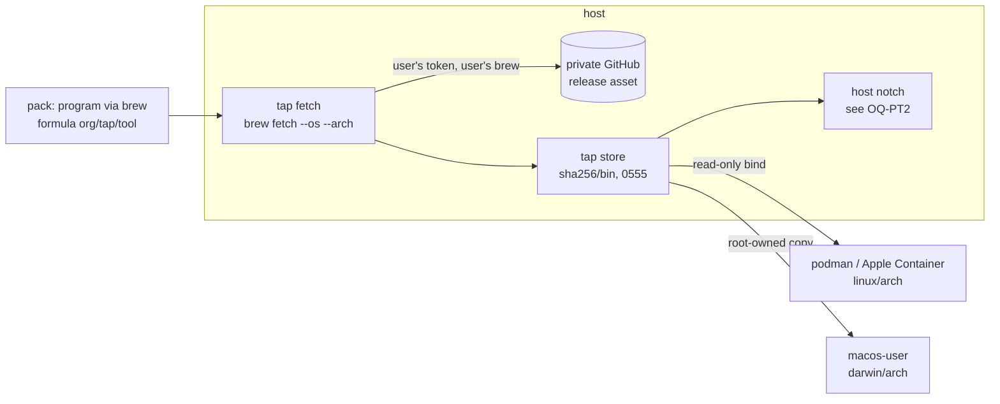

# Tools from a private Homebrew tap: the host fetches, the jail receives bytes

**Status:** 2026-10-08. Nothing built. Written against `d50a833d9`. Homebrew facts were read from
Homebrew's `main` source and docs on 2026-10-08 ([§2.2](#22-how-a-private-tap-authenticates)).

> **In short.** The credential for a private tap is needed only to *download*. So the download is
> moved to the host, which already holds that credential. yolo runs the user's own `brew` there
> for the jail's platform and gives the jail only the verified file. No credential, tap clone or
> `brew` ever reaches a jail.

**Why it matters.** The hosts install these tools with Homebrew, and inside a jail they do not
exist. Today the only ways to get them into a jail are to copy a GitHub token in, which is
forbidden, or to copy binaries in by hand on every release.

**The shape.** A pack's `program` gets a fourth route, `via: "brew"`. A **tap fetch** runs on the
host. Its result goes into a **tap store**, and each backend's existing read-only delivery puts it
in the jail ([§4](#4-the-design)).

**Cost.** One new host crossing: a pack can make yolo run the user's `brew`, and so the tap's
Ruby, on the host ([§4.6](#46-trust-and-disclosure)). A jail stops working the day the host's
token expires, which is also the day the host stops working.

**Start at [§4](#4-the-design).** The backend matrix is [§5](#5-per-backend-matrix).

**Needs your ruling:** [OQ-PT1](#OQ-PT1), [OQ-PT2](#OQ-PT2), [OQ-PT3](#OQ-PT3),
[OQ-PT4](#OQ-PT4), [OQ-PT5](#OQ-PT5).

**Reads with:** [`program-delivery.md`](program-delivery.md) (the delivery classes this adds
to), [`host-tool-provisioning.md`](host-tool-provisioning.md) and
[`host-notch-readiness.md`](host-notch-readiness.md) (the host floor and its readiness act),
[`boundary-broker.md`](boundary-broker.md) (the GitHub broker this design does not use, and why),
and [`loophole-system.md`](../reference/loophole-system.md#a-program-the-loophole-downloads)
(the digest-pinned download cache this reuses in shape).

---

## 1. The request, and what is settled

The maintainer's request, 2026-10-08: *"I have some tools that I want available in the jail as
well as on the hosts … they come from Homebrew from a tap which is in a GitHub repo which is
private. So the hosts get credentials are required for grabbing these tools from Homebrew and I
want to get them into the jail."*

**Maintainer fact (2026-10-08, his words):** *"These homebrew tap stuff, they will be
cross-compiled for both Mac and Linux. So they will be able to just pull their own native stuff.
You don't have to deal with cross-compilation in that area."* Each formula therefore publishes a
native build for macOS and for Linux. Building from source, Linux bottles and the Linuxbrew prefix
are the tap's concern, not this design's. A formula with no build for the jail's platform is a
refusal ([§4.7](#47-failure-paths)), not a problem to solve here.

Constraints this design does not reopen:

- **Host credentials never cross into a jail** ([`AGENTS.md`](../../AGENTS.md), the briefing's
  *Limitations*). No token, credential helper, `gh` login, SSH key or keychain item is copied,
  mounted, forwarded or written into a jail.
- **Agents and tools are packs; core knows no tool by name**
  ([`AGENTS.md`](../../AGENTS.md#packs-and-what-core-does-not-know)).
- **A launch is a readiness act** at the jail ([`OQ-JR1`](jail-notch-readiness.md#OQ-JR1)) and at
  the host ([`HNR-D1`](host-notch-readiness.md#HNR-D1)). A declared program that cannot be made
  present stops the launch, and `YOLO_ALLOW_MISSING_PROGRAMS=1` is the bypass.
- **The trust boundary today is disclosure, not consent**
  ([`pack-system.md`](../reference/pack-system.md#the-credential-boundary-disclosure-not-consent)).
  Every host crossing is named on every launch.

### Defined terms

- **Private tap.** A Homebrew [tap](https://docs.brew.sh/Taps) whose GitHub repository is private,
  and whose formulae download release assets from private repositories. Not a public tap that
  happens to be rate-limited.
- **Tap program** *(coined here)*. A `program` a pack declares `via: "brew"`, naming a formula in a
  tap. Not a `requires` entry: yolo makes a tap program present, while `requires` only checks for a
  binary.
- **Jail platform** *(coined here)*. The `<goos>/<goarch>` a jail runs: `linux/<arch of the VM or
  host>` on the container backends, and the host's own `darwin/<arch>` on macos-user. Not the
  host's platform, which differs on podman on macOS and on Apple Container.
- **Tap fetch** *(coined here)*. The host-side act: run the user's `brew` to download one formula's
  build for one platform, without installing it.
- **Tap store** *(coined here)*. A yolo-owned host directory of fetched builds, keyed by sha256. Not
  Homebrew's download cache, which `brew cleanup` prunes. Not the pack-binaries cache, whose digests
  a manifest pins ahead of time; a tap store digest comes from the formula when the fetch runs.

## 2. What exists today

### 2.1 In yolo

| Fact | Where |
| :--- | :--- |
| A `program` is delivered `via` `npm`, `installer` or `source`; nothing names Homebrew | [`contributes.go`](../../internal/packdecl/contributes.go) (`Via`) |
| The user-scope `provisioners` order can rank `brew` first **at the host** to install an agent. It covers only host installs, and no jail reads it | [`provisioners.go`](../../internal/config/provisioners.go), [`PS-D9`](provisioner-sets.md#PS-D9) |
| `install_hints` may name `owner/tap/name`. It is printed advice, not an install | [`installhints.go`](../../internal/packdecl/installhints.go) |
| The GitHub broker refuses `gh release download`, *"it writes files on the host"*, and every verb outside the workspace's approved repositories | [`policy.go`](../../internal/ghbroker/policy.go) |
| A loophole's `binaries` are downloaded **host-side** by `yolo pack install` and checked against a pinned sha256. They are kept in a content-addressed cache that no jail mounts whole, and delivered as one read-only file bind per build | [`loophole-system.md`](../reference/loophole-system.md#a-program-the-loophole-downloads) |
| macos-user has no bind mounts. Its launchers run captured programs from a **root-owned copy** under the backend's state directory | [`install-capture.md` H4](../plans/install-capture.md#hand-offs--what-is-not-wired-and-the-exact-line-that-wires-it) |
| macos-user's Seatbelt profile allows by default and denies `/Users`. The sandbox account can therefore read `/opt/homebrew` but not the host user's home, Homebrew cache or keychain. `SandboxPath` leaves `/opt/homebrew/bin` out on purpose | [`seatbelt.go`](../../internal/macosuser/seatbelt.go), [`macosuser.go`](../../internal/macosuser/macosuser.go) (`SandboxPath`) |
| Apple Container 1.1.0 binds a single regular file intact (measured 2026-09-14) | [`helpers.go`](../../internal/cli/run/helpers.go) |
| The image's `/lib64` interpreter is nix-ld, so a dynamically linked FHS glibc binary runs in a container jail | [`flake.nix`](../../flake.nix) (`nixLd`), [`mise-node-dynamic-linking.md`](../reference/mise-node-dynamic-linking.md) |

### 2.2 How a private tap authenticates

Read from Homebrew's `main` source and docs on 2026-10-08. The [sources](#appendix-a-homebrew-sources)
are at the end.

1. **The tap clone uses git's credentials only.** `brew tap owner/repo` runs a plain HTTPS
   `git clone` with `GIT_TERMINAL_PROMPT=0`. Credentials come from the user's git credential helper
   or from an SSH URL in the two-argument form. `HOMEBREW_GITHUB_API_TOKEN` plays no part.
2. **A release-asset download needs a token, and core has no private-GitHub strategy.** Taps either
   ship a custom download strategy that reads `ENV["HOMEBREW_GITHUB_API_TOKEN"]` and calls the
   assets API with `Accept: application/octet-stream`, or declare a `url … header:` Authorization
   header, which GoReleaser now generates as `url_headers`. Either way the token is read **at
   download time, on whatever machine runs brew**.
3. **brew's environment is filtered.** `bin/brew` re-executes under `env -i` and keeps `HOMEBREW_*`,
   `HOME`, `PATH`, `SSH_AUTH_SOCK` and a short list of others. Since 5.1.14, variables named like
   secrets are also replaced by placeholders while formula Ruby is evaluated. brew's own GitHub API
   calls fall back from `HOMEBREW_GITHUB_API_TOKEN` to `gh auth token`, and then to the macOS
   keychain. A tap strategy that reads `ENV` directly sees the variable only.
4. **A Mac's brew can fetch the Linux build.** `brew fetch --os=linux --arch=arm64 <formula>` reloads
   the formula as that platform, downloads through the formula's own strategy, and checks its
   sha256. `brew --cache --os=… --arch=…` prints where the file is. `brew info --json=v2 --variations`
   reports each platform's URL and checksum.
5. **brew refuses to run as root** unless it detects a container (`/run/.containerenv` and kin).
   This is why an in-jail brew is possible in principle ([§6](#6-alternatives-considered), B).

## 3. Verdict, and principles

**Recommendation: option C+A from the brief.** The *declaration* is a pack `program` (C). The
*mechanism* is a host-side fetch whose bytes are staged into the jail (A). The other two options
are rejected in [§6](#6-alternatives-considered).

- <a id="PT-P1"></a>**PT-P1. The credential's only job is the download, so the download happens
  where the credential already is.** The jail needs bytes, not access.
- <a id="PT-P2"></a>**PT-P2. yolo never handles the credential, even on the host.** It runs the
  user's `brew` as the user, in the environment the launch was given, and brew's own rules find the
  token. yolo reads, stores and forwards no token. The same `brew` command the user would type is
  what runs.
- <a id="PT-P3"></a>**PT-P3. One store, every backend.** All four jail backends take their bytes
  from the tap store. Only the final step differs: a read-only bind, or a root-owned copy.
- <a id="PT-P4"></a>**PT-P4. A jail never fetches.** Not on boot, and not from a nested launch. It
  holds no route to the private repository.

## 4. The design



### 4.1 Declaration

A pack declares a tap program:

```jsonc
{ "kind": "program", "bin": "tool", "via": "brew", "formula": "org/tap/tool" }
```

- `formula` is required on `via: "brew"` and refused on every other route. It must be fully
  qualified as `owner/tap/name`. A bare name could resolve to homebrew/core, which has no formula
  of that name.
- `path` is optional: the file's path inside the downloaded archive. By default it is the one
  regular file named `bin`. Zero or several matches is a fetch failure that names the candidates.
- The private tap's own repository can ship this pack and be named by its `git+ssh://` address in
  `packs`. That clone also runs on the host, with the host's git credentials. The conventional local
  pack is the zero-setup home for it. Whether the declaration is a pack at all is
  [OQ-PT1](#OQ-PT1).

### 4.2 The tap fetch

**Trigger.** The fetch runs on the host. It runs in a jail launch's pre-flight, before the container
or sandbox starts and in the place packs are staged. It also runs in the host readiness act
([`HNR-D1`](host-notch-readiness.md#HNR-D1)). Each launch fetches only the jail platform it is
starting. An attach fetches nothing: it joins a jail whose bytes are already delivered, and a
running jail's bytes never change ([§4.3](#43-delivery-per-backend)).

**Steps, per tap program:**

1. **Check that the tap exists** (`brew tap` lists it). If it is missing the launch fails and names
   `brew tap org/tap`. yolo does not tap it ([OQ-PT4](#OQ-PT4)).
2. **Resolve the version** under the policy [OQ-PT3](#OQ-PT3) rules.
3. **Fetch for the jail platform:** `brew fetch --formula --os=<goos> --arch=<goarch> org/tap/tool`,
   then `brew --cache` with the same flags for the path. When the jail platform is the host's own
   (macos-user, and podman on a Linux host of the same arch), the flags are omitted and a host that
   already installed the formula hits brew's cache with no download.
4. **Check the bytes:** brew has verified the formula's sha256. yolo then hashes the file itself,
   extracts it if it is an archive, and finds `bin`. It checks that the file is an executable for
   the jail platform (ELF for linux with the right machine, Mach-O for darwin with the right CPU).
   On linux it also checks that the program interpreter is not under a Homebrew prefix: a
   `/home/linuxbrew/.linuxbrew/lib/ld.so` interpreter would not exist in the jail. A standard FHS
   interpreter is accepted, because nix-ld provides it.
5. **Admit:** atomic rename into the tap store as `<sha256 of the extracted bin>/<bin>`, mode
   `0555`. A digest that is already present is reused, so admission is idempotent.
6. **Record** the admitted digest against `(formula, platform)` together with the version, as the
   last good build for that pair.

**Environment.** yolo runs `brew` from the host's `brew` on the launch PATH, as the user, in the
launch's own environment. It never adds a variable that holds a credential. brew's `env -i` then
keeps what brew keeps. That `brew` path is read from the PATH the launch was given, by the same
rule as [`HE-DIR1`](../reference/host-agent-environment.md#he-dir1). The case where that
environment has no token is [OQ-PT5](#OQ-PT5).

**Concurrency.** One host lock per `(formula, platform)` covers steps 2 to 6. A second launch waits,
then finds the record written and does not download again. brew's own download lock covers anything
else that runs brew at the same time. Admission is a rename of content-addressed bytes, so two
admissions of the same digest cannot disagree.

### 4.3 Delivery per backend

The jail reaches a tap program by its bare name. The agent's PATH is unchanged: no entry is
added and none is moved ([`AGENTS.md`](../../AGENTS.md#invariants--gotchas), the PATH-order
invariant). The mechanism is a generated launcher in `~/.yolo/bin/launch`, the same as every other
pack program. The launcher execs the delivered file and installs nothing. The existing collision
rule applies: no launcher is written for a name `/bin`, `/usr/bin` or a declared `mise_tools` entry
already provides. A blocker of the same name still wins, because it sits ahead on PATH.

- **podman (Linux host, or the macOS podman machine) and Apple Container:** the admitted file is a
  read-only bind at a path core owns. It is one file bind per program, as for `{jail_binary:…}`, and
  never the whole store.
- **macos-user:** the file is copied into a root-owned directory under the backend's state directory
  that the sandbox account can read, as for H4's captures. Delivery does not go through
  `/opt/homebrew`, for two reasons:
  - `SandboxPath` leaves `/opt/homebrew/bin` out on purpose.
  - `brew upgrade` changes the kegs there while a session is running.

A running jail keeps the bytes it was launched with. A newer fetch changes only the next launch,
which matches how pack trees behave.

### 4.4 The host notch

On the host there is already a Homebrew that the private tap works in. What a host launch does with
a tap program is [OQ-PT2](#OQ-PT2):

- **brew install.** yolo runs `brew install org/tap/tool` into the user's Homebrew, and the floor
  records the keg's `opt` path as the program's entry. That is an explicit path, not a PATH lookup,
  so [`HNR-D2`](host-notch-readiness.md#HNR-D2) holds.
- **Floor copy.** yolo places the tap store's host-platform file in the floor prefix.

### 4.5 Updates and offline

- **Version.** Each launch resolves the version under [OQ-PT3](#OQ-PT3). If it is the same as the
  recorded last good build, nothing downloads. Version checks happen no more often than the floor's
  update interval, which defaults to one hour (`hostfloor.DefaultUpdateInterval`).
- **Offline, with a last good build.** The launch uses that build and prints one line naming the
  formula, the version and when it was fetched. The jail starts.
- **Offline, with nothing fetched.** This is the readiness refusal. It names the formula, the
  platform and brew's error, and it offers `YOLO_ALLOW_MISSING_PROGRAMS=1`, under which the launch
  starts and lists the missing program.
- **Retention.** The tap store keeps two kinds of entry:
  - the current and the previous build for each `(formula, platform)`;
  - every digest a container yolo can see is running with.

  Anything else is reclaimed by liveness, never by age. A reaper that cannot ask the runtime
  declines rather than sweeping (the tri-state rule in [`AGENTS.md`](../../AGENTS.md#architecture)).
  `yolo stores` lists the tap store as yolo's.

### 4.6 Trust and disclosure

- **New host crossing.** Selecting a pack with a tap program makes yolo run the user's `brew` on the
  host. `brew fetch` evaluates the formula, which is Ruby from the tap. The tap is code the user
  already runs whenever they `brew install` from it. [OQ-PT4](#OQ-PT4) keeps that true by never
  tapping anything new: a pack can only name formulae from a tap the user added themselves.
- **Disclosure.** Every launch prints one line per tap program. Like the pack read and exec
  banners, the line cannot be suppressed. `yolo pack footprint` lists `brew` as a host-execution
  crossing that names the tap.
- **What the jail can learn.** It gets the bytes of one build of each declared formula. It gets no
  formula source, no tap clone, no release listing and no other asset. A program that has its own
  secrets compiled in carries them into the jail, as it would onto the host. That property belongs
  to the program, not to this channel.

### 4.7 Failure paths

| Case | What happens |
| :--- | :--- |
| No `brew` on the launch PATH | Readiness refusal naming `brew` and the formula. A Linux host without Linuxbrew falls in this case |
| Tap not tapped | Refusal naming `brew tap org/tap` ([OQ-PT4](#OQ-PT4)) |
| brew download fails with 401/404 and no token is in the environment | Refusal naming `HOMEBREW_GITHUB_API_TOKEN` and the environment yolo was started from ([OQ-PT5](#OQ-PT5)). A last good build is used if one exists, with a line saying so |
| The formula has no build for the jail platform | Refusal naming the formula and the platform. The other backends are unaffected. Per the maintainer's fact this should not happen |
| `bin` not found, or found more than once, in the archive | Refusal listing the candidates and naming the pack's `path` key |
| Wrong executable format, or an interpreter under a brew prefix | Refusal naming what was found |
| Checksum mismatch (brew's own check) | Refusal with brew's message. Nothing is admitted |
| A nested launch (yolo run inside a jail) | It never fetches ([PT-P4](#PT-P4)). It re-delivers the outer jail's copy when the platforms match, and otherwise reports the program as unavailable in a nested jail |
| `formula` on a non-brew route, or not fully qualified | Pack validation error |
| Zero tap programs | Nothing runs. There is no brew probe and no line |

### 4.8 Done looks like

- A pack declares `org/tap/tool`. In a podman jail on a Mac, `tool --version` prints the Linux arm64
  build's version.
- In the same jail, nothing holds a GitHub credential: neither `env`, nor `/proc/1/environ`, nor
  `~/.config`, nor any mounted file.
- On macos-user, the same command runs the darwin build from the root-owned copy.
- With the network down, a second launch starts and prints the last-good line. A first launch on a
  clean machine refuses and names the bypass.
- A tap that was never tapped refuses with the `brew tap` command, and yolo has run no `brew tap`.

## 5. Per-backend matrix

Columns are the four options in [§6](#6-alternatives-considered). Recommended is C+A.

| Backend (jail platform) | A: stage the host's installed binary | B: in-jail brew via a broker | C+A: host tap fetch → tap store (recommended) | D: nix store |
| :--- | :--- | :--- | :--- | :--- |
| **macos-user** (darwin/host arch) | Works: same platform, `/opt/homebrew` readable. But it puts every brew tool on PATH, or needs a per-tool link, and depends on the user having installed the formula | No: the sandbox user cannot write `/opt/homebrew`, and a second Homebrew prefix would be per account | Works: native fetch, root-owned copy | Possible via the native store, but the credential has to go into the nix daemon |
| **podman, Linux host** (linux/host arch) | Works only with Linuxbrew on the host and a self-contained binary | Possible (brew allows root in a container), but needs a credential-adding proxy for the tap and the assets | Works: native fetch, read-only bind | Same objection as above |
| **podman, macOS VM** (linux/VM arch) | No: the host's binary is darwin | As for a Linux host | Works: `brew fetch --os=linux`, read-only bind | Same objection as above |
| **Apple Container** (linux/arm64) | No, as for the macOS VM | As for a Linux host | Works: as for the macOS VM, with a single-file bind | Same objection as above |
| **Updates** | Follow the user's `brew upgrade` | A refresh in every jail | One host refresh per interval ([OQ-PT3](#OQ-PT3)) | An image or store rebuild per release |
| **Offline** | Whatever is installed | Nothing new, and a cold jail fails | Last good build, or a refusal with the bypass | Whatever was built |
| **Credential location** | Host only | Host only, but behind a new live channel | Host only, used by brew alone | Copied into the daemon's netrc or `access-tokens`, which is **forbidden** |

## 6. Alternatives considered

- **A. Stage the host's installed binary.** *Rejected as the general mechanism; kept as a fact.* It
  cannot serve a Linux jail on a Mac, and those are two of the four backends. On macos-user it would
  work, but it makes the jail depend on what the host happens to have installed, and it adds a
  second delivery path for one backend ([PT-P3](#PT-P3)).
- **B. A broker loophole narrowed to the tap repository, with brew run in the jail.** *Rejected.*
  - brew in the jail needs the token *value*. A tap strategy reads `ENV` at download time, so the
    broker would have to be a TLS-intercepting proxy that adds the header, with a CA installed in the
    jail.
  - The jail would gain a live channel to the private repository, which only a precise path filter
    could stop from listing or downloading other assets.
  - Every jail would carry a Homebrew. The bytes the jail ends up with are the same as C+A's.
  - The existing GitHub broker refuses `release download`
    ([`policy.go`](../../internal/ghbroker/policy.go)), and [`boundary-broker.md`
    §4.5](boundary-broker.md#45-the-alternative-mint-a-narrow-token) rejected handing a token to a
    jail.
- **C alone. A pack `program` whose installer runs host-side.** *Folded in.* This is the
  recommendation's declaration. Without A's staging it says nothing about how the bytes reach a
  container.
- **D. Mirror the tool into the nix store** (`packages:` with `url`+`hash`). *Rejected.* The nix
  daemon fetches as root for every user, so the token would have to go into its netrc or
  `access-tokens`. That is a second copy that nothing rotates. It would also rebuild the image on
  every release. A variant that adds host-fetched bytes to the store with `nix store add-file` avoids
  the credential. It is not chosen, because which store a jail reaches differs per backend and the
  GC root would need managing. It stays the natural follow-up if store-delivered packages become the
  default.

## 7. Non-goals

- **Not cross-compilation, source builds or bottles.** These are the tap's concern, per the
  maintainer's fact in [§1](#1-the-request-and-what-is-settled).
- **Not public formulae from homebrew/core.** Their Linux builds are bottles tied to the Linuxbrew
  prefix. `packages:` and `mise_tools` already cover public tools.
- **Not a general GitHub release fetcher.** The route is defined by brew's own resolution of a
  formula, not by a URL.
- **Not jail-side `brew`.** No jail gets Homebrew, a tap clone or a writable Cellar.
- **Not a change to the GitHub broker** or to its repository scope.
- **Not a new credential source.** The token is still one the user set up for brew on the host.

## 8. Risks

| Risk | Mitigation |
| :--- | :--- |
| A launch started without the token (a desktop launcher, a cron job) fails to fetch | The last good build covers later launches. The refusal names the variable. [OQ-PT5](#OQ-PT5) decides whether yolo does more |
| A tap's custom strategy breaks on a brew upgrade, as these strategies historically have | It breaks the host first, and in the same way. The refusal carries brew's own error |
| `brew fetch --os=linux` from a Mac fails on a tap's strategy for reasons a Linux host would not hit | The first build step measures it on the maintainer's two named formulae before anything else is built |
| A pack names a formula from a tap the user did not intend to expose to a jail | Disclosure on every launch, and only already-tapped taps ([OQ-PT4](#OQ-PT4)) |
| The tap store grows with every release | Retention keeps two builds per pair plus the live ones ([§4.5](#45-updates-and-offline)) |

## 9. What I would build, in order

1. **Measure first.** On a Mac, run `brew fetch --os=linux --arch=arm64` and `brew --cache` with the
   same flags on two of the maintainer's formulae, from a terminal and from a launch without the
   token. That settles [§2.2](#22-how-a-private-tap-authenticates) step 4 for these taps, and the
   [OQ-PT5](#OQ-PT5) failure.
2. **The declaration**, with its validation: `via: "brew"`, `formula`, `path`.
3. **The tap fetch and the tap store**: the lock, the format checks, admission, the last-good
   record and retention.
4. **Container delivery**: a file bind plus a launcher, measured in a nested jail and on Apple
   Container.
5. **macos-user delivery**: the root-owned copy. This needs a Mac run.
6. **The host notch**, as [OQ-PT2](#OQ-PT2) rules.
7. **Disclosure and footprint**, and the user-guide page for a private tap.

## Open Questions

1. 💬 **OQ-PT1: Is a tap program declared in a pack, or in a config key?**

   Settles where the user writes `org/tap/tool`.

   - **Pack `program` with `via: "brew"`.** Inherits the jail and host readiness acts, the
     launchers and the disclosure. The tap repository can ship the pack. Costs a few lines of
     `pack.json`, or an entry in the local pack.
   - **A user-scope key, for example `brew_programs: ["org/tap/tool"]`.** One line per tool, like
     `mise_tools`. Needs its own plumbing for each notch, and puts a tool vocabulary into core.

   <!-- vantage: question id=OQ-PT1 leaning="Pack program — everything a program needs already exists for packs, and the local pack makes it nearly one line." -->

   _Leaning:_ Pack program — everything a program needs already exists for packs, and the local pack makes it nearly one line.

   **Answer:**
   > _(empty — fill in when decided)_

2. 💬 **OQ-PT2: At the host, does yolo `brew install` the formula or place its own floor copy?**

   Settles who owns the host's copy, and whether `brew upgrade` updates it.

   - **brew install.** The user's Homebrew owns the copy. `brew upgrade`, `brew list` and
     `brew uninstall` behave as usual, and the floor records the keg's `opt` path. yolo writes into
     the user's Homebrew.
   - **Floor copy.** yolo places the tap store's host build in its floor prefix. The host and jail
     versions are identical by construction. A brew-installed copy, if the user has one, becomes a
     second copy.

   <!-- vantage: question id=OQ-PT2 leaning="brew install — the host is where this tap already works, and a second copy beside the user's Homebrew helps nobody." -->

   _Leaning:_ brew install — the host is where this tap already works, and a second copy beside the user's Homebrew helps nobody.

   **Answer:**
   > _(empty — fill in when decided)_

3. 💬 **OQ-PT3: Which version does a launch deliver, and who refreshes the tap?**

   Settles evergreen versus reproducible, and whether yolo runs `brew update`.

   - **Evergreen.** On the floor's update interval yolo runs `brew update`, which brew's own
     auto-update would also run on the user's next brew command, and delivers the tap's current
     version. It matches agent CLIs ([`program-delivery.md`
     §3.5](program-delivery.md#35-the-second-axis-who-the-dependency-serves-amendment-2026-09-03)).
   - **Follow the tap as the user left it.** yolo never runs `brew update`, so versions move only
     when the user runs brew.
   - **Pinned in the pack.** Reproducible, but every release needs a pack edit.

   <!-- vantage: question id=OQ-PT3 leaning="Evergreen — these are the user's own tools, like agent CLIs, and brew's auto-update already makes the same change." -->

   _Leaning:_ Evergreen — these are the user's own tools, like agent CLIs, and brew's auto-update already makes the same change.

   **Answer:**
   > _(empty — fill in when decided)_

4. 💬 **OQ-PT4: Does yolo ever run `brew tap` itself?**

   Settles whether a pack can bring a new tap's Ruby onto the host.

   - **Never.** A missing tap is a refusal naming `brew tap org/tap`. A pack can only use taps the
     user added. Setting up a new machine takes one manual command.
   - **Tap on first use.** No manual step, but selecting a pack becomes enough to run a new
     repository's code on the host with the user's credentials.

   <!-- vantage: question id=OQ-PT4 leaning="Never — one command per machine buys the rule that a pack cannot introduce host code the user never tapped." -->

   _Leaning:_ Never — one command per machine buys the rule that a pack cannot introduce host code the user never tapped.

   **Answer:**
   > _(empty — fill in when decided)_

5. 💬 **OQ-PT5: When the launch environment lacks `HOMEBREW_GITHUB_API_TOKEN`, does yolo supply one?**

   A tap strategy reads only that variable, so a launch from a desktop launcher fails where a
   terminal launch works.

   - **No.** Refuse, or use the last good build, and name the variable. yolo never handles a token
     ([PT-P2](#PT-P2)).
   - **Yes, from the host's `gh auth token` or keychain.** The fetch always works, but yolo becomes a
     host-side credential handler, which it is nowhere else.

   <!-- vantage: question id=OQ-PT5 leaning="No — the last good build covers most launches, and yolo staying out of the credential is the property this design rests on." -->

   _Leaning:_ No — the last good build covers most launches, and yolo staying out of the credential is the property this design rests on.

   **Answer:**
   > _(empty — fill in when decided)_

## Decision Ledger

Implementation decisions made while designing. Each one is reversible, and none needs a ruling.

| ID | Ruling / Decision | Date | Settled in | Built |
| :--- | :--- | :--- | :--- | :--- |
| <a id="PT-D1"></a>PT-D1 | The fetch runs host-side only: in the jail launch's pre-flight and in the host readiness act. An attach and a nested launch never fetch | 2026-10-08 | [§4.2](#42-the-tap-fetch), [§4.7](#47-failure-paths) | — |
| <a id="PT-D2"></a>PT-D2 | yolo runs the launch PATH's `brew` as the user, in the launch's environment, and adds no credential to it | 2026-10-08 | [§4.2](#42-the-tap-fetch) | — |
| <a id="PT-D3"></a>PT-D3 | The tap store is content-addressed (`<sha256>/<bin>`, `0555`), admits by atomic rename, and is never mounted whole | 2026-10-08 | [§4.2](#42-the-tap-fetch), [§4.3](#43-delivery-per-backend) | — |
| <a id="PT-D4"></a>PT-D4 | yolo checks every admitted file: the executable format matches the jail platform, and a Linux interpreter is not under a Homebrew prefix | 2026-10-08 | [§4.2](#42-the-tap-fetch) | — |
| <a id="PT-D5"></a>PT-D5 | Container jails get one read-only file bind per program, and macos-user gets a root-owned copy. Each is reached through a generated launcher, and no PATH entry is added | 2026-10-08 | [§4.3](#43-delivery-per-backend) | — |
| <a id="PT-D6"></a>PT-D6 | One host lock per `(formula, platform)`. A last-good record per pair. Retention keeps current, previous and live digests, by liveness | 2026-10-08 | [§4.2](#42-the-tap-fetch), [§4.5](#45-updates-and-offline) | — |
| <a id="PT-D7"></a>PT-D7 | Offline: use the last good build and print a line. With nothing fetched, the readiness refusal with `YOLO_ALLOW_MISSING_PROGRAMS=1` | 2026-10-08 | [§4.5](#45-updates-and-offline) | — |
| <a id="PT-D8"></a>PT-D8 | One disclosure line per tap program on every launch, and a `brew` host-execution row in `yolo pack footprint` | 2026-10-08 | [§4.6](#46-trust-and-disclosure) | — |

## Appendix A. Homebrew sources

Read on 2026-10-08. Behavior was checked against `main`, which is Homebrew 5.x, not against a
tagged 4.x release.

- Taps and private clones: <https://docs.brew.sh/Taps>, and brew source `Library/Homebrew/tap.rb`.
- Environment filtering: brew source `bin/brew`, and `extend/ENV/sensitive.rb` (5.1.14, PR #22384,
  <https://github.com/Homebrew/brew/releases/tag/5.1.14>).
- Header placeholders and redirect handling: `download_strategy/curl_download_strategy.rb`.
- The GitHub credential fallback order: `utils/github/api.rb`.
- Cross-platform fetch and cache: `cmd/fetch.rb`, `cmd/--cache.rb`, and the
  [manpage](https://docs.brew.sh/Manpage). Checksums: `resource.rb`.
- Running as root: `Library/Homebrew/brew.sh`. Linux support tiers:
  <https://docs.brew.sh/Support-Tiers>.
- GoReleaser formulae and `url_headers`: <https://goreleaser.com/customization/homebrew_formulas/>
  and <https://goreleaser.com/customization/homebrew_casks/>.
- Token scopes: Contents read for release assets,
  <https://docs.github.com/en/rest/authentication/permissions-required-for-fine-grained-personal-access-tokens>.
