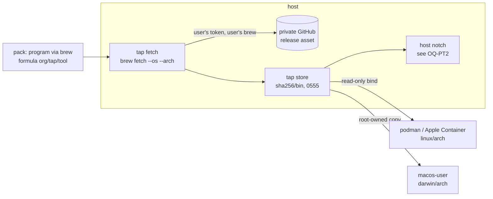

# Tools from a private Homebrew tap: the host fetches, the jail receives bytes

**Status:** 2026-10-08. Nothing built. Written against `d50a833d9`; staging and logging claims
rechecked at `90625ec13` for the docs-only repairs. Homebrew facts were read from Homebrew's `main`
source and docs on 2026-10-08 ([§2.2](#22-how-a-private-tap-authenticates)). No native fetch or
backend-delivery measurement is claimed here.

> **In short.** The credential for a private tap is needed only to *download*. So the download is
> moved to the host, which already holds that credential. yolo runs the user's own `brew` there
> for the jail's platform and gives the jail only the verified file. No credential, tap clone or
> `brew` ever reaches a jail.

**Why it matters.** The hosts install these tools with Homebrew, and inside a jail they do not
exist. Today the only ways to get them into a jail are to copy a GitHub token in, which is
forbidden, or to copy binaries in by hand on every release.

**The shape.** A pack's `program` gets a fourth route, `via: "brew"`. A **tap fetch** runs on the
host. Its result goes into a **tap store**, and each backend's existing read-only delivery puts it
in the jail ([§4](#4-the-design)).

**Cost.** One new host crossing: a pack can make yolo run the user's `brew`, and so the tap's
Ruby, on the host ([§4.6](#46-trust-and-disclosure)). A jail stops working the day the host's
token expires, which is also the day the host stops working.

**Start at [§4](#4-the-design).** The backend matrix is [§5](#5-per-backend-matrix).

**Needs your ruling:** [OQ-PT1](#OQ-PT1), [OQ-PT2](#OQ-PT2), [OQ-PT3](#OQ-PT3),
[OQ-PT4](#OQ-PT4), [OQ-PT5](#OQ-PT5).

**Reads with:** [`program-delivery.md`](program-delivery.md) (the delivery classes this adds
to), [`host-tool-provisioning.md`](host-tool-provisioning.md) and
[`host-notch-readiness.md`](host-notch-readiness.md) (the host floor and its readiness act),
[`boundary-broker.md`](boundary-broker.md) (the GitHub broker this design does not use, and why),
and [`loophole-system.md`](../reference/loophole-system.md#a-program-the-loophole-downloads)
(the digest-pinned download cache this reuses in shape).

---

## 1. The request, and what is settled

The maintainer's request, 2026-10-08: *"I have some tools that I want available in the jail as
well as on the hosts … they come from Homebrew from a tap which is in a GitHub repo which is
private. So the hosts get credentials are required for grabbing these tools from Homebrew and I
want to get them into the jail."*

**Maintainer ask (2026-10-08, his words):** *"on Mac we want to be careful if we're on the guest
or the host or the jail and install the right version of things. It'll be cross-compiled for all
… the choices here of architecture and operating system."* That is the per-notch platform table in
[§4.2](#42-the-tap-fetch).

**Maintainer fact (2026-10-08, his words):** *"I don't actually have any of these homebrew
packages ready in the tap yet, so we'll have to test this with a public repo we can use, the one
that YoloJail has hosted in for a test."* That is yolo's own public tap, which
[§9](#9-what-i-would-build-in-order) uses for the first measurement and the fixtures.

**Maintainer fact (2026-10-08, his words):** *"These homebrew tap stuff, they will be
cross-compiled for both Mac and Linux. So they will be able to just pull their own native stuff.
You don't have to deal with cross-compilation in that area."* Each formula therefore publishes a
native build for macOS and for Linux. Building from source, Linux bottles and the Linuxbrew prefix
are the tap's concern, not this design's. A formula with no build for the jail's platform is a
refusal ([§4.7](#47-failure-paths)), not a problem to solve here.

Constraints this design does not reopen:

- **Host credentials never cross into a jail** ([`AGENTS.md`](../../AGENTS.md), the briefing's
  *Limitations*). No token, credential helper, `gh` login, SSH key or keychain item is copied,
  mounted, forwarded or written into a jail.
- **Agents and tools are packs; core knows no tool by name**
  ([`AGENTS.md`](../../AGENTS.md#packs-and-what-core-does-not-know)).
- **A launch is a readiness act** at the jail ([`OQ-JR1`](jail-notch-readiness.md#OQ-JR1)) and at
  the host ([`HNR-D1`](host-notch-readiness.md#HNR-D1)). A declared program that cannot be made
  present stops the launch, and `YOLO_ALLOW_MISSING_PROGRAMS=1` is the bypass.
- **The trust boundary today is disclosure, not consent**
  ([`pack-system.md`](../reference/pack-system.md#the-credential-boundary-disclosure-not-consent)).
  Every host crossing is named on every launch.

### Defined terms

- **Private tap.** A Homebrew [tap](https://docs.brew.sh/Taps) whose GitHub repository is private,
  and whose formulae download release assets from private repositories. Not a public tap that
  happens to be rate-limited.
- **Tap program** *(coined here)*. A `program` a pack declares `via: "brew"`, naming a formula in a
  tap. Not a `requires` entry: yolo makes a tap program present, while `requires` only checks for a
  binary.
- **Jail platform** *(coined here)*. The `<goos>/<goarch>` a jail runs: `linux/<arch of the VM or
  host>` on the container backends, and the host's own `darwin/<arch>` on macos-user. Not the
  host's platform, which differs on podman on macOS and on Apple Container. Each notch's value, and
  where yolo learns it, is the table in [§4.2](#42-the-tap-fetch).
- **Tap fetch** *(coined here)*. The host-side act: run the user's `brew` to download one formula's
  build for one platform, without installing it.
- **Tap store** *(coined here)*. A yolo-owned host directory of fetched builds, keyed by sha256. Not
  Homebrew's download cache, which `brew cleanup` prunes. Not the pack-binaries cache, whose digests
  a manifest pins ahead of time; a tap store digest comes from the formula when the fetch runs.

## 2. What exists today

### 2.1 In yolo

| Fact | Where |
| :--- | :--- |
| A `program` is delivered `via` `npm`, `installer` or `source`; nothing names Homebrew | [`contributes.go`](../../internal/packdecl/contributes.go) (`Via`) |
| The user-scope `provisioners` order can rank `brew` first **at the host** to install an agent. It covers only host installs, and no jail reads it | [`provisioners.go`](../../internal/config/provisioners.go), [`PS-D9`](provisioner-sets.md#PS-D9) |
| `install_hints` may name `owner/tap/name`. With `provisioners.host` ranking `brew` first, `hostfloor.Outranking` hands that program to brew at the host: the floor keeps no entry, a host launch runs brew's copy, and the stop names `brew install <hint>`. This is the exception [`HNR-D2`](host-notch-readiness.md#HNR-D2) allows | [`installhints.go`](../../internal/packdecl/installhints.go), [`hostfloor/provisioners.go`](../../internal/hostfloor/provisioners.go) |
| The GitHub broker refuses `gh release download`, *"it writes files on the host"*, and every verb outside the workspace's approved repositories | [`policy.go`](../../internal/ghbroker/policy.go) |
| A loophole's `binaries` are downloaded **host-side** by `yolo pack install` and checked against a pinned sha256. They are kept in a content-addressed cache that no jail mounts whole, and delivered as one read-only file bind per build | [`loophole-system.md`](../reference/loophole-system.md#a-program-the-loophole-downloads) |
| macos-user has no bind mounts. Its launchers run captured programs from a **root-owned copy** under the backend's state directory | [`install-capture.md` H4](../plans/install-capture.md#hand-offs--what-is-not-wired-and-the-exact-line-that-wires-it) |
| macos-user's Seatbelt profile allows by default and denies `/Users`, `/Volumes`, the keychains and raw disks. The sandbox account can therefore read **all of** `/opt/homebrew`, including every tap's clone and its `.git/config`, and `/etc/homebrew/brew.env`, but not the host user's home, Homebrew cache or keychain. `SandboxPath` does not include `/opt/homebrew/bin` | [`seatbelt.go`](../../internal/macosuser/seatbelt.go), [`macosuser.go`](../../internal/macosuser/macosuser.go) (`SandboxPath`) |
| Apple Container 1.1.0 binds a single regular file intact (measured 2026-09-14) | [`helpers.go`](../../internal/cli/run/helpers.go) |
| The image's `/lib64` interpreter is nix-ld, so a dynamically linked FHS glibc binary runs in a container jail | [`flake.nix`](../../flake.nix) (`nixLd`), [`mise-node-dynamic-linking.md`](../reference/mise-node-dynamic-linking.md) |

### 2.2 How a private tap authenticates

Read from Homebrew's `main` source and docs on 2026-10-08. The [sources](#appendix-a-homebrew-sources)
are at the end.

1. **The tap clone uses git's credentials only.** `brew tap owner/repo` runs a plain HTTPS
   `git clone` with `GIT_TERMINAL_PROMPT=0`. Credentials come from the user's git credential helper
   or from an SSH URL in the two-argument form. `HOMEBREW_GITHUB_API_TOKEN` plays no part.
2. **A release-asset download needs a token, and core has no private-GitHub strategy.** Taps either
   ship a custom download strategy that reads `ENV["HOMEBREW_GITHUB_API_TOKEN"]` and calls the
   assets API with `Accept: application/octet-stream`, or declare a `url … header:` Authorization
   header, which GoReleaser now generates as `url_headers`. Either way the token is read **at
   download time, on whatever machine runs brew**.
3. **brew's environment is filtered.** `bin/brew` re-executes under `env -i` and keeps `HOMEBREW_*`,
   `HOME`, `PATH`, `SSH_AUTH_SOCK` and a short list of others. Since 5.1.14, variables named like
   secrets are also replaced by placeholders while formula Ruby is evaluated. brew's own GitHub API
   calls fall back from `HOMEBREW_GITHUB_API_TOKEN` to `gh auth token`, and then to the macOS
   keychain. A tap strategy that reads `ENV` directly sees the variable only.
4. **A Mac's brew can fetch the Linux build.** `brew fetch --os=linux --arch=arm64 <formula>` reloads
   the formula as that platform, downloads through the formula's own strategy, and checks its
   sha256. `brew --cache --os=… --arch=…` prints where the file is. `brew info --json=v2 --variations`
   reports each platform's URL and checksum.
5. **brew refuses to run as root** unless it detects a container (`/run/.containerenv` and kin).
   This is why an in-jail brew is possible in principle ([§6](#6-alternatives-considered), B).

## 3. Verdict, and principles

**Recommendation: option C+A from the brief.** The *declaration* is a pack `program` (C). The
*mechanism* is a host-side fetch whose bytes are staged into the jail (A). The other two options
are rejected in [§6](#6-alternatives-considered).

- <a id="PT-P1"></a>**PT-P1. The credential's only job is the download, so the download happens
  where the credential already is.** The jail needs bytes, not access.
- <a id="PT-P2"></a>**PT-P2. yolo does not source or inject the credential.** It runs the
  user's `brew` as the user, in the environment the launch was given, and brew's own rules find the
  token. yolo does not obtain a token value or add one to brew's environment, and it forwards none
  to a jail. Raw brew output may contain credentials; only the sensitive host log may retain it
  ([§4.2](#42-the-tap-fetch)). The same `brew` command the user would type is
  what runs. That environment is yolo's own process environment, never the one composed for the
  jail from `env_sources`. A `HOMEBREW_GITHUB_API_TOKEN` the user puts in an `env_sources` file is
  forwarded into the jail by the user's own config, which this design does not change.
- <a id="PT-P3"></a>**PT-P3. One store, every backend.** All four jail backends take their bytes
  from the tap store. Only the final step differs: a read-only bind, or a root-owned copy.
- <a id="PT-P4"></a>**PT-P4. A jail never fetches.** Not on boot, and not from a nested launch. It
  holds no route to the private repository.

## 4. The design



### 4.1 Declaration

A pack declares a tap program:

```jsonc
{ "kind": "program", "bin": "tool", "via": "brew", "formula": "org/tap/tool" }
```

- `formula` is required on `via: "brew"` and refused on every other route. It must be fully
  qualified as `owner/tap/name`. A bare name could resolve to homebrew/core, which has no formula
  of that name.
- `path` is optional: the file's path inside the downloaded archive. By default it is the one
  regular file named `bin`. Zero or several matches is a fetch failure that names the candidates.
- The private tap's own repository may ship this pack **only in a dedicated pack subdirectory**,
  named by a subdirectory address such as
  `git+ssh://git@github.com/org/homebrew-tap//yolo-pack?ref=main`. That directory holds only the
  declaration and intended jail content: no formulae, custom download strategies or links to tap
  material. **Do not select the tap repository root as a pack.** Existing staging copies every
  file from an unfiltered pack and skips only VCS metadata automatically
  ([`packstage.go`](../../internal/packstage/packstage.go#L59-L62),
  [the walk](../../internal/packstage/packstage.go#L170-L177)); protecting brew's original clone
  does not protect a staged copy. Subdirectory resolution and staging already exist
  ([`addr.go`](../../internal/packsrc/addr.go#L5-L11),
  [`packresolve.go`](../../internal/config/packresolve.go#L134-L142)). The conventional local
  pack is the zero-setup alternative for the declaration, not a link to the tap clone. Whether
  the declaration is a pack at all remains [OQ-PT1](#OQ-PT1).

### 4.2 The tap fetch

**Trigger.** The fetch runs on the host, in a jail launch, **after the attach decision and only on
the branch that starts a fresh container or sandbox**. An attach runs the pre-flights to compare
trees, but it never fetches: it joins a jail whose bytes are already delivered, and a running jail's
bytes never change ([§4.3](#43-delivery-per-backend)). So an offline attach always succeeds. When
the attach's staged tree has a tap program the running jail lacks, the existing "trees differ" line
names it. If [OQ-PT2](#OQ-PT2) rules for a floor copy, the fetch also runs in the host readiness act
([`HNR-D1`](host-notch-readiness.md#HNR-D1)). Each launch fetches only the jail platform it is
starting.

**Why at launch.** The loophole `binaries` cache it resembles is filled only by `yolo pack install`,
and its launches never fetch, because a manifest pins those digests ahead of time. Here the digest
comes from the formula at fetch time, and the version moves with the tap
([OQ-PT3](#OQ-PT3)), so an install-time-only fetch would make every update a manual step. If
[OQ-PT3](#OQ-PT3) rules for a pinned version, the fetch can move to `yolo pack install` with the
pin.

**Which platform each notch gets.** The maintainer's ask is that each notch install its own
build. Every notch gets exactly one `<os>/<arch>` pair:

| Notch | Platform | Where yolo learns it |
| :--- | :--- | :--- |
| Mac host (`yolo host`) | `darwin/<host arch>` | Host brew's own native platform. No `--os`/`--arch` flags: the host notch is brew's own install or floor copy ([§4.4](#44-the-host-notch)) |
| macos-user guest | `darwin/<host arch>`. It is the same machine, but a separate account and a separate root-owned copy | `macosUserJailPlatform`, the authority the capture store already uses for this backend ([`autocapture.go`](../../internal/cli/run/autocapture.go)) |
| podman on a Mac (the podman machine's VM) | `linux/<VM arch>`: `arm64` on Apple silicon, `amd64` on Intel | `containerJailPlatform`, the authority shared with captures and fork delivery, which is also the arch of the `bin/linux-<arch>` jail prefix the launch mounts ([`jailprefix.go`](../../internal/cli/run/jailprefix.go)). It is checked against `host.arch` in the `podman info` the launch already reads, which reports the VM's arch |
| Apple Container | `linux/arm64` | `containerJailPlatform`, as above |
| podman on a Linux host | `linux/<host arch>` | `containerJailPlatform`, as above |
| A nested jail | None. It inherits nothing | It never fetches ([PT-P4](#PT-P4)) |

The OS is the backend's, **never the launcher's `runtime.GOOS`**: on a Mac a container jail is
`linux`. The arch comes from the one authority that already names the jail prefix's binaries. A
launcher whose arch differs from the VM's could not start that jail at all, because its own jail
binaries would not run there. The `podman info` check turns that case into a refusal that names
both arches before anything is fetched ([PT-D12](#PT-D12)). A formula with no build for the notch's
pair is a refusal naming the formula and the pair. A macOS build never stands in for a Linux one,
and an amd64 build never stands in for an arm64 one.

**Steps, per tap program:**

1. **Check that the tap exists** (`brew tap` lists it). If it is missing the launch fails and names
   `brew tap org/tap`. yolo does not tap it ([OQ-PT4](#OQ-PT4)).
2. **Resolve the version** under the policy [OQ-PT3](#OQ-PT3) rules.
3. **Fetch for the jail platform:** `brew fetch --formula --os=<goos> --arch=<goarch> org/tap/tool`,
   then `brew --cache` with the same flags for the path. The flags are always passed for a jail
   notch, even when the pair is the host's own, so the table above is the only source of the pair.
   When the pair is the host's own and the formula is already installed, brew's cache serves it with
   no download.
4. **Check the bytes:** brew has verified the formula's sha256. yolo then hashes the file itself,
   extracts it if it is an archive, and finds `bin`. It checks that the file is an executable for
   the jail platform (ELF for linux with the right machine, Mach-O for darwin with the right CPU).
   On linux it also checks that the program interpreter is not under a Homebrew prefix: a
   `/home/linuxbrew/.linuxbrew/lib/ld.so` interpreter would not exist in the jail. A standard FHS
   interpreter is accepted, because nix-ld provides it.
5. **Admit:** atomic rename into the tap store as `<sha256 of the extracted bin>/<bin>`, mode
   `0555`. A digest that is already present is reused, so admission is idempotent.
6. **Record** the admitted digest against `(formula, platform)` together with the version, as the
   last good build for that pair.

**Environment.** yolo runs `brew` from the host's `brew` on the launch PATH, as the user, in
yolo's own process environment ([PT-P2](#PT-P2)). It adds exactly two variables,
`HOMEBREW_NO_AUTO_UPDATE=1` and `HOMEBREW_NO_INSTALL_CLEANUP=1`, so that a fetch never updates
every tap or prunes the user's Cellar as a side effect. It never adds a variable that holds a
credential. brew's `env -i` then keeps what brew keeps. That `brew` path is read from the PATH the
launch was given, by the same rule as
[`HE-DIR1`](../reference/host-agent-environment.md#he-dir1), so `host_path` is the fix when a
desktop launcher's PATH lacks `/opt/homebrew/bin`. The case where that environment has no token is
[OQ-PT5](#OQ-PT5).

**Output.** brew's raw stdout and stderr go to a sensitive host-only log under yolo's state
directory (directory `0700`, log `0600`), never to the launch stream or a delivered pack tree. The
launch stream is teed to `<workspace>/.yolo/launch.log`, which every jail can read. A custom strategy
can print a token as plain text, not only as URL userinfo or an `Authorization` value, so generic
redaction cannot establish that boundary. Refusals and last-good lines therefore use only
yolo-generated failure categories (for example, "brew fetch failed"), the declared formula and
platform, an exit status when available, and the yolo-generated host-log path. Last-good lines
also allow the validated recorded version and yolo-recorded fetch timestamp.
**No arbitrary brew or strategy text is echoed, summarized or interpolated into those lines.** The next step is to
inspect that log on the host; it may contain credentials and must not be pasted into jail-visible
logs. Parsed stdout such as a cache path is host-side input to validation, not diagnostic text.

**Where the store lives.** The tap store and its records sit in yolo's state directory beside the
pack-binaries cache, `~/.local/share/yolo-jail/tap-programs/`. They are **never under `cache/`**,
which every jail mounts read-write: a jail that could write there could hand the host a binary to
run on the next launch. On the macOS podman machine that path is inside the user's home, which the
machine's default shares already cover, so a bind from it reaches the VM.

**Concurrency.** One host lock per `(formula, platform)` covers steps 2 to 6. A second launch waits,
then finds the record written and does not download again. brew does not wait on its own locks: it
exits with *"Another active Homebrew process"* when the user, or another yolo fetching a different
formula, is running brew. yolo retries that exit three times, two seconds apart, then treats it as a
fetch failure ([§4.7](#47-failure-paths)). Admission is a rename of content-addressed bytes, so two
admissions of the same digest cannot disagree.

### 4.3 Delivery per backend

The jail reaches a tap program by its bare name. The agent's PATH is unchanged: no entry is
added and none is moved ([`AGENTS.md`](../../AGENTS.md#invariants--gotchas), the PATH-order
invariant). The mechanism is a generated launcher in `~/.yolo/bin/launch`, the same as every other
pack program. The launcher execs the delivered file and installs nothing. The existing collision
rule applies: no launcher is written for a name `/bin`, `/usr/bin` or a declared `mise_tools` entry
already provides. A blocker of the same name still wins, because it sits ahead on PATH.

- **podman (Linux host, or the macOS podman machine) and Apple Container:** the admitted file is a
  read-only bind at a path core owns. It is one file bind per program, as for `{jail_binary:…}`, and
  never the whole store.
- **macos-user:** the file is copied into a root-owned directory under the backend's state directory
  that the sandbox account can read, as for H4's captures. Delivery does not go through
  `/opt/homebrew`, for two reasons:
  - `SandboxPath` does not include `/opt/homebrew/bin`, and adding it would expose every brew tool.
  - `brew upgrade` changes the kegs there while a session is running.
- **macos-user's existing exposure.** In this candidate's source the allow-default profile can
  read tap clones and brew environment files at standard Homebrew locations. Protection on
  **every macos-user launch is static**, with no `brew` invocation: deny the Apple-silicon tap
  tree `/opt/homebrew/Library/Taps`, Intel's `/usr/local/Homebrew/Library/Taps`, their respective
  `etc/homebrew` directories under `/opt/homebrew` and `/usr/local`, and `/etc/homebrew` including
  its `/private/etc` spelling. Each deny carries a `#seatbelt-test-id` and follows every read
  re-allow ([PT-D9](#PT-D9)). These paths are not obtained from `brew --prefix`.
- **Protection limits.** Static rules are not proof for custom prefixes, additional aliases or
  symlinks pointing outside the denied trees. macos-user delivery involving those locations is
  unsupported until the opted-in fetch/admission path can discover the relevant paths host-side,
  protect them and prove the kernel denies; do not fall back to an unprotected launch. That
  discovery is proposed work, not an implemented or measured mechanism, and uses the same
  host-only output boundary as the fetch. Zero tap programs still means zero `brew` invocations.
  Dynamic discovery on zero-program launches is future scope, not part of this proposal.

A running jail keeps the bytes it was launched with. A newer fetch changes only the next launch,
which matches how pack trees behave.

### 4.4 The host notch

On the host there is already a Homebrew that the private tap works in. What a host launch does with
a tap program is [OQ-PT2](#OQ-PT2):

- **brew's copy.** The program takes the hand-off the `provisioners` order already performs
  (`hostfloor.Outranking`): the floor keeps no entry, and a host launch runs brew's copy, which
  [`HNR-D2`](host-notch-readiness.md#HNR-D2) already excepts. The new part is that the readiness act
  runs `brew install org/tap/tool` for a missing one, where today it only names the command.
- **Floor copy.** yolo places the tap store's host-platform file in the floor prefix, and the
  readiness act fetches it.

`formula` is the only spelling. yolo derives the program's `brew` install hint from it, so the
formula is written once ([PT-D11](#PT-D11)).

### 4.5 Updates and offline

- **Version.** Each launch resolves the version under [OQ-PT3](#OQ-PT3). If it is the same as the
  recorded last good build, nothing downloads. Version checks happen no more often than the floor's
  update interval, which defaults to one hour (`hostfloor.DefaultUpdateInterval`).
- **Offline, with a last good build.** The launch uses that build and prints one line naming the
  formula, the version and when it was fetched. The jail starts.
- **Offline, with nothing fetched.** This is the readiness refusal. It names the formula, the
  platform, yolo's failure category and the host-log path, and it offers
  `YOLO_ALLOW_MISSING_PROGRAMS=1`, under which the launch starts and lists the missing program.
- **Retention.** The tap store keeps two kinds of entry:
  - the current and the previous build for each `(formula, platform)`;
  - every digest a live jail was launched with.

  Each fresh launch writes the digests it delivered beside its pack tree's `.live` marker. An entry
  goes only once every container that recorded it is known gone, by the same tri-state check that
  retires a pack tree (`forgetGoneContainer`). A reaper that cannot ask the runtime declines rather
  than sweeping (the tri-state rule in [`AGENTS.md`](../../AGENTS.md#architecture)). Never by age.
  macos-user's root-owned copies follow the same rule against that backend's session record.
  `yolo stores` lists the tap store as yolo's.

### 4.6 Trust and disclosure

- **New host crossing.** Selecting a pack with a tap program makes yolo run the user's `brew` on the
  host. `brew fetch` evaluates the formula, which is Ruby from the tap. The tap is code the user
  already runs whenever they `brew install` from it. [OQ-PT4](#OQ-PT4) keeps that true by never
  tapping anything new: a pack can only name formulae from a tap the user added themselves.
- **Who can select one.** `packs` is user-scope only today, so a jail agent cannot select a pack and
  make the host run brew. If [`OQ-PK1`](../reference/pack-system.md#oq-pk1) admits packs from a
  workspace config, which an agent can edit, `via: "brew"` stays honored only from user-scope packs,
  as `provisioners` is ([PT-D10](#PT-D10)). Otherwise an agent could pull any formula from a tapped
  private tap into the next jail.
- **Disclosure.** Every launch prints one line per tap program. Like the pack read and exec
  banners, the line cannot be suppressed. `yolo pack footprint` lists `brew` as a host-execution
  crossing that names the tap.
- **What the jail can learn.** It gets the bytes of one build of each declared formula. The
  dedicated pack subdirectory in [§4.1](#41-declaration) keeps formula source and strategies out
  of the staged tree; the subdirectory's links cannot reach sibling tap material. Static protection
  in [PT-D9](#PT-D9) protects standard Homebrew paths on macos-user, with the
  unsupported locations stated in [§4.3](#43-delivery-per-backend). Subject to those limits,
  delivery gives no formula source, tap clone, release listing or other asset on any backend.
  A program that has its own secrets compiled in carries them into the jail, as it would onto
  the host. That property belongs to the program, not to this channel.

### 4.7 Failure paths

| Case | What happens |
| :--- | :--- |
| No `brew` on the launch PATH | Readiness refusal naming `brew`, the formula and `host_path` as the fix when brew is installed but off this launch's PATH. A Linux host without Linuxbrew falls in this case |
| brew busy (*"Another active Homebrew process"*) after three retries | A fetch failure: the last good build if one exists, with a line, otherwise the readiness refusal |
| Tap not tapped | Refusal naming `brew tap org/tap` ([OQ-PT4](#OQ-PT4)) |
| brew download fails; the host log may show an authentication error | Refusal using yolo's fetch-failure category and host-log path, with `HOMEBREW_GITHUB_API_TOKEN` in the launch environment named as a host-side check ([OQ-PT5](#OQ-PT5)). A last good build is used if one exists, with a line saying so. No brew text reaches either line; arbitrary strategy output is not a reliable authentication classifier |
| The formula has no build for the notch's pair | Refusal naming the formula and the `<os>/<arch>` pair. The other notches are unaffected. Per the maintainer's fact this should not happen with his tap |
| The formula's download for the pair is a source tarball, not a build | Refusal: no executable named `bin` is in the archive. yolo never builds it ([§7](#7-non-goals)) |
| `bin` not found, or found more than once, in the archive | Refusal listing the candidates and naming the pack's `path` key |
| Wrong executable format, or an interpreter under a brew prefix | Refusal naming what was found |
| Checksum mismatch (brew's own check) | Nothing is admitted. The launch gets yolo's fetch-failure category and host-log path, not brew's message |
| A nested launch (yolo run inside a jail) | It never fetches and inherits nothing from the outer jail ([PT-P4](#PT-P4)). The program is missing, which is the ordinary readiness refusal, and `YOLO_ALLOW_MISSING_PROGRAMS=1` applies |
| The launcher's arch differs from the VM's that `podman info` reports | Refusal naming both arches, before any fetch ([PT-D12](#PT-D12)) |
| `formula` on a non-brew route, or not fully qualified | Pack validation error |
| Zero tap programs | No brew invocation (including no prefix probe), tap readiness work or tap-program line. macos-user still renders the static standard-path denies without brew ([PT-D9](#PT-D9)) |

### 4.8 Done looks like

- A pack declares `org/tap/tool`. In a podman jail on a Mac, `tool --version` prints the Linux arm64
  build's version.
- In the same jail, nothing holds a GitHub credential: neither `env`, nor `/proc/1/environ`, nor
  `~/.config`, nor any mounted file, nor `<workspace>/.yolo/launch.log` after a failed fetch.
- On macos-user, the same command runs the darwin build from the root-owned copy, and reading
  the standard tap trees or brew environment directories in [§4.3](#43-delivery-per-backend) is
  refused by the kernel. A zero-program launch renders the same static denies and invokes no brew.
- With the network down, a second launch starts and prints the last-good line. A first launch on a
  clean machine refuses and names the bypass.
- A tap that was never tapped refuses with the `brew tap` command, and yolo has run no `brew tap`.

## 5. Per-backend matrix

Columns are the four options in [§6](#6-alternatives-considered). Recommended is C+A.

| Backend (jail platform) | A: stage the host's installed binary | B: in-jail brew via a broker | C+A: host tap fetch → tap store (recommended) | D: nix store |
| :--- | :--- | :--- | :--- | :--- |
| **macos-user** (darwin/host arch) | Works: same platform, `/opt/homebrew` readable. But it puts every brew tool on PATH, or needs a per-tool link, and depends on the user having installed the formula | No: the sandbox user cannot write `/opt/homebrew`, and a second Homebrew prefix would be per account | Works: native fetch, root-owned copy | Possible via the native store, but the credential has to go into the nix daemon |
| **podman, Linux host** (linux/host arch) | Works only with Linuxbrew on the host and a self-contained binary | Possible (brew allows root in a container), but needs a credential-adding proxy for the tap and the assets | Works: native fetch, read-only bind | Same objection as above |
| **podman, macOS VM** (linux/VM arch) | No: the host's binary is darwin | As for a Linux host | Works: `brew fetch --os=linux`, read-only bind | Same objection as above |
| **Apple Container** (linux/arm64) | No, as for the macOS VM | As for a Linux host | Works: as for the macOS VM, with a single-file bind | Same objection as above |
| **Updates** | Follow the user's `brew upgrade` | A refresh in every jail | One host refresh per interval ([OQ-PT3](#OQ-PT3)) | An image or store rebuild per release |
| **Offline** | Whatever is installed | Nothing new, and a cold jail fails | Last good build, or a refusal with the bypass | Whatever was built |
| **Credential location** | Host only | Host only, but behind a new live channel | Host only, used by brew alone | Copied into the daemon's netrc or `access-tokens`, which is **forbidden** |

## 6. Alternatives considered

- **A. Stage the host's installed binary.** *Rejected as the general mechanism; kept as a fact.* It
  cannot serve a Linux jail on a Mac, and those are two of the four backends. On macos-user it would
  work, but it makes the jail depend on what the host happens to have installed, and it adds a
  second delivery path for one backend ([PT-P3](#PT-P3)).
- **B. A broker loophole narrowed to the tap repository, with brew run in the jail.** *Rejected.*
  - brew in the jail needs the token *value*. A tap strategy reads `ENV` at download time, so the
    broker would have to be a TLS-intercepting proxy that adds the header, with a CA installed in the
    jail.
  - The jail would gain a live channel to the private repository, which only a precise path filter
    could stop from listing or downloading other assets.
  - Every jail would carry a Homebrew. The bytes the jail ends up with are the same as C+A's.
  - The existing GitHub broker refuses `release download`
    ([`policy.go`](../../internal/ghbroker/policy.go)), and [`boundary-broker.md`
    §4.5](boundary-broker.md#45-the-alternative-mint-a-narrow-token) rejected handing a token to a
    jail.
- **C alone. A pack `program` whose installer runs host-side.** *Folded in.* This is the
  recommendation's declaration. Without A's staging it says nothing about how the bytes reach a
  container.
- **D. Mirror the tool into the nix store** (`packages:` with `url`+`hash`). *Rejected.* The nix
  daemon fetches as root for every user, so the token would have to go into its netrc or
  `access-tokens`. That is a second copy that nothing rotates. It would also rebuild the image on
  every release. A variant that adds host-fetched bytes to the store with `nix store add-file` avoids
  the credential. It is not chosen, because which store a jail reaches differs per backend and the
  GC root would need managing. It stays the natural follow-up if store-delivered packages become the
  default.

## 7. Non-goals

- **Not cross-compilation, source builds or bottles.** These are the tap's concern, per the
  maintainer's fact in [§1](#1-the-request-and-what-is-settled).
- **Not public formulae from homebrew/core.** Their Linux builds are bottles tied to the Linuxbrew
  prefix. `packages:` and `mise_tools` already cover public tools.
- **Not a general GitHub release fetcher.** The route is defined by brew's own resolution of a
  formula, not by a URL.
- **Not jail-side `brew`.** No jail gets Homebrew, a tap clone or a writable Cellar.
- **Not a change to the GitHub broker** or to its repository scope.
- **Not a new credential source.** The token is still one the user set up for brew on the host.

## 8. Risks

| Risk | Mitigation |
| :--- | :--- |
| A launch started without the token (a desktop launcher, a cron job) fails to fetch | The last good build covers later launches. The refusal names the variable. [OQ-PT5](#OQ-PT5) decides whether yolo does more |
| A tap's custom strategy breaks on a brew upgrade, as these strategies historically have | It breaks the host first, and in the same way. The refusal names a yolo failure category and the sensitive host log, never the strategy's text |
| `brew fetch --os=linux` from a Mac fails on a tap's strategy for reasons a Linux host would not hit | The first build step measures it on the public tap's formulae, and a real private tap repeats it once one exists |
| The public tap proves no token path | A fixture `brew` tests the host/jail token boundary ([§9](#9-what-i-would-build-in-order)); only a later real private-tap run measures actual authentication |
| A pack names a formula from a tap the user did not intend to expose to a jail | Disclosure on every launch, and only already-tapped taps ([OQ-PT4](#OQ-PT4)) |
| The tap store grows with every release | Retention keeps two builds per pair plus the live ones ([§4.5](#45-updates-and-offline)) |

## 9. What I would build, in order

1. **Measure first, on yolo's own public tap.** The maintainer's private tap has no formulae yet, so
   the first measurement and every fixture use the public
   [`mschulkind-oss/homebrew-tap`](https://github.com/mschulkind-oss/homebrew-tap). Read 2026-10-08:
   - **Its `yolo-jail` formula does not fit.** It downloads one source tarball for every platform
     and builds yolo with Go. It publishes no bottle and names no release asset, so a fetch yields
     source and no binary. It is the fixture for the source-tarball refusal and nothing else.
   - **`swarf` is the fixture.** It is GoReleaser-generated, the shape the private tools are
     expected to take, with a release asset for each of `darwin/amd64`, `darwin/arm64`,
     `linux/amd64` and `linux/arm64`. `waxon` has the same shape and is the second case.
   - **`polyclav` is the missing-pair fixture.** It has only `darwin/arm64` and `linux/amd64`, so a
     podman jail on Apple silicon must refuse it, naming `linux/arm64`.

   On a Mac, run `brew fetch --formula --os=linux --arch=arm64` and `brew --cache` with the same
   flags on `swarf`, then the same with `--os=darwin`. Record the brew version, the actual accepted
   OS/architecture flag vocabulary and the measured pairs (including any Rosetta behavior),
   rather than assuming Go names are accepted unchanged. This establishes only brew's
   resolution, download, checksum and cache-path behavior for those pairs and this formula
   shape, as proposed in [§2.2](#22-how-a-private-tap-authenticates) step 4. **It proves neither
   yolo's store admission nor delivery to any notch**, and the public tap cannot prove private
   authentication. Separate evidence is needed:
   - **Fixture boundary test:** a fixture `brew` that downloads only when
     `HOMEBREW_GITHUB_API_TOKEN` is in its environment, run through the opted-in production fetch
     call site while the test asserts the token's value appears in no jail file, environment or
     log. This tests yolo's handling of that fixture, not real private-tap authentication.
   - **Later private-tap measurement:** once the maintainer publishes one, repeat the fetch for
     every supported pair and test clone versus asset authentication, the real strategy/header
     behavior and a launch missing its token. That measures the [OQ-PT5](#OQ-PT5) failure; it does
     not answer the owner question.
2. **The declaration**, with its validation: `via: "brew"`, `formula`, `path`.
3. **The tap fetch and the tap store**: the lock, the format checks, admission, the last-good
   record and retention. Prove these through yolo's production fetch/admission path, separately
   from the direct brew measurement in step 1.
4. **Container delivery**: a file bind plus a launcher. A nested jail can never exercise a fetch
   ([PT-P4](#PT-P4)); do not add a production bypass to make it do so. Fixture tests drive the
   opted-in fetch on a host-side launch, with a fake `brew` that supplies an archive's cache path.
   Native runs through yolo with public `swarf` must separately prove executable launch,
   read-only delivery, frozen attach bytes and last-good offline behavior on macOS podman and
   Apple Container. Fetch/cache output alone cannot close either delivery gate.
5. **macos-user delivery**: the root-owned copy, and [PT-D9](#PT-D9)'s static standard-path
   denies with their [`macosuserseatbelt_test.go`](../../integration/macosuserseatbelt_test.go)
   cases. A native yolo run proves executable launch and kernel denies. A separate static-deny
   candidate is not accepted/native evidence here and does not establish custom-prefix or alias
   protection.
6. **The host notch**, as [OQ-PT2](#OQ-PT2) rules.
7. **Disclosure and footprint**, and the user-guide page for a private tap.

**Tests to write.** Each fails if its call site is deleted, not only its callee:

- **The pair per notch.** A launch on each backend asks the fake `brew` for exactly the
  [§4.2](#42-the-tap-fetch) pair: `linux/<arch>` from podman and Apple Container even when the
  launcher is darwin, `darwin/<arch>` from macos-user, and no flags at the host. The test asserts
  the fetch's pair equals `containerJailPlatform`, and is not derived from `runtime.GOOS`.
- **Missing pair.** A formula offering only `darwin/arm64` and `linux/amd64` refuses a
  `linux/arm64` jail, naming the formula and the pair, and still serves a `darwin/arm64` macos-user
  launch.
- **No substitution.** A darwin file, or a file of the other arch, handed back for a linux pair is
  refused by the format check and never admitted.
- **Arch disagreement.** `podman info` reporting a `host.arch` other than the launcher's refuses,
  naming both, before any `brew` runs.
- **Nested.** A launch inside a jail runs no `brew`, and the tap program reports as missing.
- **Token stays host-side.** With the fixture `brew` requiring the token, the token's value
  appears in no jail environment, mounted file, `launch.log` or refusal text. On failure the
  fixture writes a sentinel secret as plain stderr, URL userinfo and an Authorization header;
  all forms stay only in the sensitive host log, and the launch shows a yolo-generated category
  and log path. Removing output capture at the production call site must fail the test.
- **Tap source stays host-side.** Resolve and stage a fixture tap's dedicated pack subdirectory
  through the launch path. Formula and strategy sentinels in sibling directories, and VCS
  metadata, appear in no staged or delivered tree; the fetched pack's link to sibling tap
  material is refused. The tap repository root is not the supported pack address.
- **Zero-program prefix protection.** A macos-user launch with zero tap programs invokes no
  `brew`, even when one is on PATH, and still emits the static standard-path denies after all
  read re-allows. Kernel cases prove those paths separately; they do not prove arbitrary aliases,
  outward symlinks or custom prefixes.
- **Source tarball.** The public `yolo-jail` formula's fetch is refused with the no-executable
  message.

## Open Questions

1. 💬 **OQ-PT1: Is a tap program declared in a pack, or in a config key?**

   Settles where the user writes `org/tap/tool`.

   - **Pack `program` with `via: "brew"`.** Inherits the jail and host readiness acts, the
     launchers and the disclosure. The tap repository can ship a dedicated pack subdirectory,
     never its root. Costs a few lines of `pack.json`, or an entry in the local pack.
   - **A user-scope key, for example `brew_programs: ["org/tap/tool"]`.** One line per tool, like
     `mise_tools`. Needs its own plumbing for each notch, and puts a tool vocabulary into core.

   <!-- vantage: question id=OQ-PT1 leaning="Pack program — everything a program needs already exists for packs, and the local pack makes it nearly one line." -->

   _Leaning:_ Pack program — everything a program needs already exists for packs, and the local pack makes it nearly one line.

   **Answer:**
   > _(empty — fill in when decided)_

2. 💬 **OQ-PT2: At the host, does a tap program run brew's copy or a yolo floor copy?**

   Settles who owns the host's copy, and whether `brew upgrade` updates it.

   - **brew's copy.** The existing `provisioners` hand-off, with the readiness act running
     `brew install` for a missing one. The user's Homebrew owns the copy, and `brew upgrade`,
     `brew list` and `brew uninstall` behave as usual. yolo writes into the user's Homebrew.
   - **Floor copy.** yolo places the tap store's host build in its floor prefix. The host and jail
     versions are identical by construction. A brew-installed copy, if the user has one, becomes a
     second copy.

   <!-- vantage: question id=OQ-PT2 leaning="brew's copy — the host is where this tap already works, and a second copy beside the user's Homebrew helps nobody." -->

   _Leaning:_ brew's copy — the host is where this tap already works, and a second copy beside the user's Homebrew helps nobody.

   **Answer:**
   > _(empty — fill in when decided)_

3. 💬 **OQ-PT3: Which version does a launch deliver, and who refreshes the tap?**

   Settles evergreen versus reproducible, and whether yolo runs `brew update`, which updates
   every tap and homebrew/core, not only this one.

   - **Evergreen.** On the floor's update interval yolo runs `brew update`, which brew's own
     auto-update would also run on the user's next brew command, and delivers the tap's current
     version. It matches agent CLIs ([`program-delivery.md`
     §3.5](program-delivery.md#35-the-second-axis-who-the-dependency-serves-amendment-2026-09-03)).
   - **Follow the tap as the user left it.** yolo never runs `brew update`, so versions move only
     when the user runs brew.
   - **Pinned in the pack.** Reproducible, but every release needs a pack edit.

   <!-- vantage: question id=OQ-PT3 leaning="Evergreen — these are the user's own tools, like agent CLIs, and brew's auto-update already makes the same change." -->

   _Leaning:_ Evergreen — these are the user's own tools, like agent CLIs, and brew's auto-update already makes the same change.

   **Answer:**
   > _(empty — fill in when decided)_

4. 💬 **OQ-PT4: Does yolo ever run `brew tap` itself?**

   Settles whether a pack can bring a new tap's Ruby onto the host.

   - **Never.** A missing tap is a refusal naming `brew tap org/tap`. A pack can only use taps the
     user added. Setting up a new machine takes one manual command.
   - **Tap on first use.** No manual step, but selecting a pack becomes enough to run a new
     repository's code on the host with the user's credentials.

   <!-- vantage: question id=OQ-PT4 leaning="Never — one command per machine buys the rule that a pack cannot introduce host code the user never tapped." -->

   _Leaning:_ Never — one command per machine buys the rule that a pack cannot introduce host code the user never tapped.

   **Answer:**
   > _(empty — fill in when decided)_

5. 💬 **OQ-PT5: When the launch environment lacks `HOMEBREW_GITHUB_API_TOKEN`, does yolo supply one?**

   A tap strategy reads only that variable, so a launch from a desktop launcher fails where a
   terminal launch works.

   - **No.** Refuse, or use the last good build, and name the variable. yolo never handles a token
     ([PT-P2](#PT-P2)).
   - **Yes, from the host's `gh auth token` or keychain.** The fetch always works, but yolo becomes a
     host-side credential handler, which it is nowhere else.

   <!-- vantage: question id=OQ-PT5 leaning="No — the last good build covers most launches, and yolo staying out of the credential is the property this design rests on." -->

   _Leaning:_ No — the last good build covers most launches, and yolo staying out of the credential is the property this design rests on.

   **Answer:**
   > _(empty — fill in when decided)_

## Decision Ledger

Implementation decisions made while designing. Each one is reversible, and none needs a ruling.

| ID | Ruling / Decision | Date | Settled in | Built |
| :--- | :--- | :--- | :--- | :--- |
| <a id="PT-D1"></a>PT-D1 | The fetch runs host-side only, on a launch's fresh-container branch after the attach decision (and in the host readiness act if [OQ-PT2](#OQ-PT2) picks a floor copy). An attach and a nested launch never fetch | 2026-10-08 | [§4.2](#42-the-tap-fetch), [§4.7](#47-failure-paths) | — |
| <a id="PT-D2"></a>PT-D2 | yolo runs the launch PATH's `brew` as the user, in yolo's own process environment plus `HOMEBREW_NO_AUTO_UPDATE=1` and `HOMEBREW_NO_INSTALL_CLEANUP=1`, and adds no credential. Raw brew output goes only to a sensitive host log; the launch stream gets yolo-generated categories and that log's path, never arbitrary brew text | 2026-10-08 | [§4.2](#42-the-tap-fetch) | — |
| <a id="PT-D3"></a>PT-D3 | The tap store is content-addressed (`<sha256>/<bin>`, `0555`), lives in the state directory beside `pack-binaries` and never under `cache/`, admits by atomic rename, and is never mounted whole | 2026-10-08 | [§4.2](#42-the-tap-fetch), [§4.3](#43-delivery-per-backend) | — |
| <a id="PT-D4"></a>PT-D4 | yolo checks every admitted file: the executable format matches the jail platform, and a Linux interpreter is not under a Homebrew prefix | 2026-10-08 | [§4.2](#42-the-tap-fetch) | — |
| <a id="PT-D5"></a>PT-D5 | Container jails get one read-only file bind per program, and macos-user gets a root-owned copy. Each is reached through a generated launcher, and no PATH entry is added | 2026-10-08 | [§4.3](#43-delivery-per-backend) | — |
| <a id="PT-D6"></a>PT-D6 | One host lock per `(formula, platform)`, and three retries two seconds apart when brew reports another active process. A last-good record per pair. Retention keeps current, previous and live digests, live meaning recorded beside a pack tree's `.live` by a container not known gone | 2026-10-08 | [§4.2](#42-the-tap-fetch), [§4.5](#45-updates-and-offline) | — |
| <a id="PT-D7"></a>PT-D7 | Offline: use the last good build and print a line. With nothing fetched, the readiness refusal with `YOLO_ALLOW_MISSING_PROGRAMS=1` | 2026-10-08 | [§4.5](#45-updates-and-offline) | — |
| <a id="PT-D8"></a>PT-D8 | One disclosure line per tap program on every launch, and a `brew` host-execution row in `yolo pack footprint` | 2026-10-08 | [§4.6](#46-trust-and-disclosure) | — |
| <a id="PT-D9"></a>PT-D9 | Every macos-user launch emits static read-denies for the standard Apple-silicon and Intel tap/environment paths and system Homebrew environment directory, without probing brew. Custom prefixes, unlisted aliases and outward symlink targets are not established by those rules; delivery using them remains unsupported pending opted-in discovery and kernel proof | 2026-10-08 | [§4.3](#43-delivery-per-backend) | — |
| <a id="PT-D10"></a>PT-D10 | `via: "brew"` is honored only from user-scope packs, whatever [`OQ-PK1`](../reference/pack-system.md#oq-pk1) later admits from a workspace config | 2026-10-08 | [§4.6](#46-trust-and-disclosure) | — |
| <a id="PT-D11"></a>PT-D11 | `formula` is the one spelling. The `brew` install hint is derived from it, never written beside it | 2026-10-08 | [§4.4](#44-the-host-notch) | — |
| <a id="PT-D12"></a>PT-D12 | Each notch's pair comes from the [§4.2](#42-the-tap-fetch) table: host brew's native platform at the host, `macosUserJailPlatform` on macos-user, `containerJailPlatform` on the container backends. On podman the arch is checked against `podman info`'s `host.arch` and a disagreement refuses. Nested jails get no pair | 2026-10-08 | [§4.2](#42-the-tap-fetch) | — |

## Appendix A. Homebrew sources

Read on 2026-10-08. Behavior was checked against `main`, which is Homebrew 5.x, not against a
tagged 4.x release.

- Taps and private clones: <https://docs.brew.sh/Taps>, and brew source `Library/Homebrew/tap.rb`.
- Environment filtering: brew source `bin/brew`, and `extend/ENV/sensitive.rb` (5.1.14, PR #22384,
  <https://github.com/Homebrew/brew/releases/tag/5.1.14>).
- Header placeholders and redirect handling: `download_strategy/curl_download_strategy.rb`.
- The GitHub credential fallback order: `utils/github/api.rb`.
- Cross-platform fetch and cache: `cmd/fetch.rb`, `cmd/--cache.rb`, and the
  [manpage](https://docs.brew.sh/Manpage). Checksums: `resource.rb`.
- Running as root: `Library/Homebrew/brew.sh`. Linux support tiers:
  <https://docs.brew.sh/Support-Tiers>.
- GoReleaser formulae and `url_headers`: <https://goreleaser.com/customization/homebrew_formulas/>
  and <https://goreleaser.com/customization/homebrew_casks/>.
- Token scopes: Contents read for release assets,
  <https://docs.github.com/en/rest/authentication/permissions-required-for-fine-grained-personal-access-tokens>.
