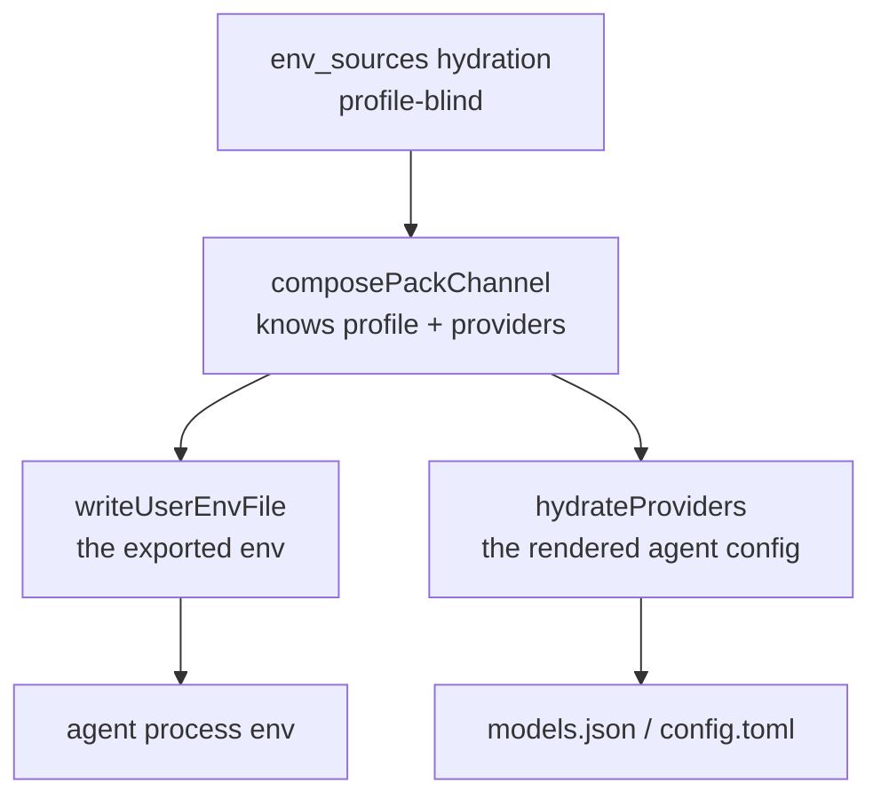

# Every provider's credential reaches every agent, and a profile cannot narrow it

**Status:** DESIGN, 2026-09-23; code claims re-verified 2026-09-24. No gate built. Code claims
cite a symbol, never a line; pi evidence was measured statically against the installed pi 0.87.1
and carries that version's line anchors.

> **In short.** A profile selects which provider an agent *uses*; it does not decide which
> provider credentials an agent *can see* — so selecting one provider grants the agent every
> provider the user has ever configured.

**Why it matters.** Measured in this jail on 2026-09-22: `.yolo/home/yolo-user-env.sh` delivers
`AWS_ACCESS_KEY_ID` and `AWS_SECRET_ACCESS_KEY`, put there by `env_sources` for **claude's**
bedrock profile, and pi's `amazon-bedrock` branch authenticates from exactly that pair
([`env-api-keys.js:120-153`](#5-evidence)). So pi offers Bedrock because claude has credentials.
The general form is worse than a wrong menu: a credential the user scoped to one agent's one
profile is readable by every process every other agent spawns.

**The shape.** A **delivery gate** — the set of credential variables a launch writes is narrowed
by the selected profile's provider, using a key→provider association the provider declaration
already half-carries.

**Cost.** Three delivery vehicles must agree or the gate covers one backend
([§2.3](#23-three-vehicles-and-a-gate-in-one-covers-one-backend)). A naive gate makes yolo refuse
the launch over the key it just withheld ([§3.2](#32-the-pre-flight-refuses-what-the-gate-withholds)).

**Start at [§3](#3-where-the-gate-can-sit)** — the layer choice decides everything else.

**Needs your ruling:** [OQ-CN1](#OQ-CN1), [OQ-CN2](#OQ-CN2), [OQ-CN3](#OQ-CN3), [OQ-CN4](#OQ-CN4), [OQ-CN5](#OQ-CN5).

**Scope note.** Split out of [`provider-switching.md`](provider-switching.md), which raised this as
[`OQ-PS5`](provider-switching.md#OQ-PS5) on 2026-09-21 and is otherwise entirely about **model-id renaming** — the alias
vocabulary, the selection state machine's fourth row, first-party providers. Nothing here is about
a model id, and the fix lands in the launch's environment channel rather than in
`agentcfg/selection.go`. That doc's [`OQ-PS5`](provider-switching.md#OQ-PS5) is now a redirect pointing here.

**Reads with:** [`../reference/providers.md`](../reference/providers.md) (the catalog, composition
and selection mechanism this gates), [`provider-switching.md`](provider-switching.md) (the sibling
half — model ids rather than credentials),
[`agent-credentials.md`](../reference/agent-credentials.md) (where each agent's credential comes
from).

---

## 1. Goal and non-goals

**Goal.** A launch delivers the credentials the selected profile's provider needs, and not the
others. `yolo -p zai -- pi` offers zai.

**Non-goals**, each considered and set aside:

- **Curating anyone's model catalog.** [`providers.md`](../reference/providers.md) forbids yolo
  deciding which models exist; this is about which *credentials* cross, which is a different act.
- **Revoking a credential from a running jail.** A variable already exported into a live shell
  cannot be un-exported by rewriting the file the shell sourced. The gate governs a launch.
- **Protecting an agent from itself.** An agent that reads a credential out of a file yolo did not
  write is outside this.
- **A secrets manager.** `env_sources` stays what it is.

## 2. What happens today, precisely

### 2.1 Delivery is profile-blind by construction

Hydration takes no profile, agent or provider: `ResolveEnvSourcesFull(workspace, cfg, warn)` is the
whole signature ([`envsources.go`](../../internal/config/envsources.go)). The writer then
loops over every hydrated key with no gate of any kind (`writeUserEnvFile`,
[`userenv.go`](../../internal/cli/run/userenv.go)).

Two things in that file *are* profile-scoped, and they are the reason the gap is easy to miss: a
pack's `profile`-gated `env` contribution (`packload.EnvFold`,
[`packload.go`](../../internal/packload/packload.go)), and the per-agent provider shape variables
(the `shapeVars` that `composePackChannel` fills,
[`profilechannel.go`](../../internal/cli/run/profilechannel.go)). A profile already decides
*what claude's `ANTHROPIC_AUTH_TOKEN` is*. It decides nothing about what pi can read.

> [!WARNING]
> **The per-agent shape variables are not per-agent at delivery.** Every agent's shape vars are
> written into the one shared file (`writeUserEnvFile`'s channel section), so
> claude's profile-scoped `ANTHROPIC_AUTH_TOKEN` lands in pi's environment too. A gate on
> `env_sources` alone leaves this second channel open.

### 2.2 The frozen contract is the grammar, not the key set

`writeUserEnvFile`'s doc comment freezes the file's *format*, because the entrypoint parses it back
([`userenv.go`](../../internal/cli/run/userenv.go)). The two line forms carry the precedence:
def-form `export K=${K:-'v'}` is a default the container environment beats, plain-form
`export K='v'` beats even the container's frozen environment
(`hydrateEnvFromUserEnvFile`'s doc comment, [`boot.go`](../../internal/entrypoint/boot.go)).

**Narrowing the key set does not touch that contract** — and the pinned-bytes test feeds the writer
a map and checks the rendering (`TestWriteUserEnvFileBytes`,
[`userenv_test.go`](../../internal/cli/run/userenv_test.go)),
so it stays green. That is a hole, not a reassurance: the change needs a test that fails when the
gate is deleted.

### 2.3 Three vehicles, and a gate in one covers one backend

| Vehicle | Where | Filters today |
| :--- | :--- | :--- |
| Container backends | `writeUserEnvFile` ([`userenv.go`](../../internal/cli/run/userenv.go)) → single-file mount | no |
| `macos-user` | its **own** `ResolveEnvSources` call, in `buildPlan` ([`orchestrator.go`](../../internal/macosuser/orchestrator.go)) | no |
| The host notch | `composeHostVars` ([`host.go`](../../internal/cli/host.go)) | no |

Three implementations of one channel is the shape this repo treats as a defect class, and it is why
the gate cannot be a local edit to the container writer.

⚠ The notches also **read different config scopes**: the host reads user scope only
(`hostScopedEnvSources`, [`host.go`](../../internal/cli/host.go)), the jail reads the merged config
(`loadAndValidateConfig`, [`preflight.go`](../../internal/cli/run/preflight.go)). A declaration that says which key
belongs to which provider must therefore be legible in both.

### 2.4 The agents disagree about what a credential even decides

This is the finding that reframes the question, and it is measured against the **installed**
programs rather than their docs.

| Agent | Does a credential decide the menu? | Its narrowing key, and how hard it holds | Does yolo set it? |
| :--- | :--- | :--- | :--- |
| **pi** 0.87.1 | yes — availability *is* credential presence ([`models.js:256-274`](#5-evidence)) | **`enabledModels` — a soft shortlist** ([§2.4.1](#241-what-pis-enabledmodels-actually-constrains)) | **yes**, for every pi-reachable selected provider (`yolo.derive("pi", "settings", …)` in [`derive.lua`](../../packs/pi/derive.lua)) |
| **opencode** | no — catalog rows register without an auth check | `enabled_providers` / `disabled_providers` — hard, per its schema | no |
| **claude** | no | `enforceAvailableModels` + `replaceBuiltInOptions` — an enforced allowlist | `openai-codex` only (the settings derive in [`packs/claude/derive.lua`](../../packs/claude/derive.lua)) |

So every agent measured ships a narrowing key; what differs is **how hard it holds and whether
yolo sets it.** opencode's own schema says `enabled_providers` means **"When set, ONLY these
providers will be enabled. All other providers will be ignored"**, and yolo does not set it.
claude's enforced menu is **already gated on the selected provider**, for `openai-codex` only.
pi's is already set on every profile launch — and it is the weakest of the three.

### 2.4.1 What pi's `enabledModels` actually constrains

pi documents the key as *"Model patterns used for startup selection and model cycling"*
(`docs/settings.md:16`). MEASURED 2026-09-23 by reading the installed 0.87.1 package — never
running a session. Anchors are in the unbundled `dist/`; the `pi` bin runs
`dist/bundle/cli.js`, and every distinctive string below is present in its
`chunks/chunk-OJP47DM6.js`.

| Surface | What a non-empty `enabledModels` does | Anchor |
| :--- | :--- | :--- |
| Resolution | patterns match only **credentialed** models, so a pattern for a provider with no credential matches nothing and warns | `core/model-resolver.js:204-280`, `main.js:641-644` |
| Startup selection | the saved default if it is in scope, else the **first** scoped model — an out-of-scope default is **replaced, not refused** | `main.js:382-402` |
| `--model` | **bypasses** the scope entirely: resolved against the full runtime before the scope is consulted | `main.js:359-381` |
| A resumed session | the scope does not pick the model | `main.js:382`, `core/model-resolver.js:493` |
| `/model` picker | opens on the **scoped** view, but **Tab toggles to all** — every credentialed model | `modes/interactive/components/model-selector.js:52,104-108,200-206,302-311` |
| `/model <term>` and its completions | scope-only | `modes/interactive/interactive-mode.js:446-448,4207-4213` |
| Ctrl+P cycling | scope-only | `core/agent-session.js:1683-1700` |
| Switching the model | checks **auth only**, never scope — nothing refuses an out-of-scope model | `core/agent-session.js:1645-1648` |
| Save-as-default from the all view | **appends** the model to the session scope and to `enabledModels` in the **global** settings file | `core/agent-session.js:1653-1656,1663-1676`, `core/settings-manager.js:956-958` |
| `/scoped-models` | edits `enabledModels` interactively | `core/slash-commands.js:7`, `modes/interactive/interactive-mode.js:4347-4410` |

**So `enabledModels` is a default view, never a boundary.** It shapes what pi starts on, cycles
through and completes. It forbids nothing: the escapes are one keystroke (Tab) and one flag
(`--model`), and the shortlist grows as it is used. It also **fails open**: a scope whose patterns
match no credentialed model is empty, and an empty scope means no scope at all
(`main.js:642-644`). So `yolo -p zai -- pi` already starts on zai (pi's settings derive), and
Bedrock is still one Tab away in the
picker. The measured symptom is the all view, and no pi key reaches it.

INFERRED, not measured: pi writes an appended pattern back to `~/.pi/agent/settings.json`, and
yolo's `settings` derive re-emits `enabledModels` on the next launch. Whether a user's appended
model survives that depends on how the render merges a derive's plain key, which this doc has not
traced.

> [!IMPORTANT]
> **Credentials are not the only gate even for pi.** A **stored** credential outranks the
> environment — *"A stored credential owns the provider: ambient/env is consulted only when nothing
> is stored"* ([`resolve.js:20-24`](#5-evidence)) — so withholding a variable cannot narrow a
> provider the user has ever logged into. And pi's `amazon-bedrock` counts as authenticated from
> `AWS_PROFILE`, or the access-key pair, or `AWS_BEARER_TOKEN_BEDROCK`, or container credentials
> ([`env-api-keys.js:120-153`](#5-evidence)), so one provider has four env spellings.

### 2.5 The mapping half-exists

[`OQ-PS5`](provider-switching.md#OQ-PS5) was filed saying yolo cannot tell which `env_sources` key belongs to which provider. That
is **half** wrong, and the half that is right is the load-bearing half.

A provider declaration carries `api_key_env_name`, and it has consumers across the tree — four
pack derives ([pi](../../packs/pi/derive.lua), [opencode](../../packs/opencode/derive.lua),
[codex](../../packs/codex/derive.lua), [omp](../../packs/omp/derive.lua)), packload's provider
composition and its pre-flight (`internal/packload/providers.go`), `hydrateProviders`, the
footprint report (`internal/packload/footprint.go`) and the wire bridge's boot
(`internal/wirebridged/boot.go`). The mapping exists; **no consumer of it lives in the delivery
path.**

Two gaps make it insufficient as it stands:

- **It is single-valued**, so a provider with several credential variables is inexpressible — which
  is exactly Bedrock's shape.
- **yolo's `bedrock` declaration names no key at all**, so the one provider causing the measured
  symptom is unmapped.
- **The name spaces do not join.** yolo's provider is `bedrock`; pi's catalog id is
  `amazon-bedrock`, and pi's own map is keyed by *its* ids
  ([`env-api-keys.js:63-112`](#5-evidence), 39 pairs).

## 3. Where the gate can sit

### 3.1 Four layers, and filtering the environment is not enough

| Layer | What a gate there achieves | What it misses |
| :--- | :--- | :--- |
| Hydration | nothing — it has no profile to gate on | everything |
| `composePackChannel` | the best-informed site: holds hydrated env, the profile table, the composed provider table and resolved profiles at once ([`profilechannel.go`](../../internal/cli/run/profilechannel.go)) | must still fan out to three vehicles |
| `writeUserEnvFile` | the exported environment | the rendered config, and two other backends |
| `hydrateProviders` | the rendered config | the exported environment |

**Both write paths must be gated or the leak survives.** `hydrateProviders` walks *every* entry of
the composed table and sets `api_key` on each one whose `api_key_env_name` resolves
([`deriveenv.go`](../../internal/packload/deriveenv.go)) — so a perfect filter on the
exported environment still writes every provider's credential into the agent's own config file.

### 3.2 The pre-flight refuses what the gate withholds

`requiredProviders` demands a credential for every composed entry that has an endpoint, scoped to
the **selected packs** and explicitly **not** to the profile
([`providers.go`](../../internal/packload/providers.go),
`checkProviderCredentials`'s doc comment in
[`providerpreflight.go`](../../internal/cli/run/providerpreflight.go)). So a gate that narrows
the channel makes `checkProviderCredentials` **refuse the launch over the key the gate just
withheld**.

The pre-flight has three call sites — the fresh container path, the attach path (stricter, with nil
argv pairs) and the macos-user arm — so this is not a one-line consequence.

### 3.3 The withhold primitive half-exists

A `yolo.env` producer can already emit a tombstone — `ctx.tombstone` becomes
`agentenv.Var{Unset: true}` (the env-derive runner, `packload.AgentEnv`, in
[`deriveenv.go`](../../internal/packload/deriveenv.go)) — and the host notch honours it. The
container path drops it, because *"Unset has no file spelling"* (`writeUserEnvFile`,
[`userenv.go`](../../internal/cli/run/userenv.go)).

⚠ **Only claude and copilot register a `yolo.env` producer at all**
([`claude`](../../packs/claude/derive.lua), [`copilot`](../../packs/copilot/derive.lua)), so
for pi, codex, opencode, omp and agy a profile contributes no environment at either notch. A design
built on the producer reaches two agents.

## 4. What this does not license

- **No curated model list.** Setting opencode's `enabled_providers` to the selected provider is a
  *credential-scope* act with a catalog-shaped mechanism; it must never grow into yolo choosing
  models.
- **No new secret store.** The gate decides which existing values cross, nothing else.
- **No silent narrowing.** A launch that withholds a credential the user configured says so —
  a disclosure, not a debug line.
- **No per-agent config scope.** Reading `env_sources` from anywhere but the scope it is read from
  today is a separate ruling; the host/jail scope asymmetry in
  [§2.3](#23-three-vehicles-and-a-gate-in-one-covers-one-backend) is a constraint here, not a
  target.

## 5. Evidence

Code, re-verified 2026-09-24. Each claim names the symbol that carries it:

| Claim | Anchor |
| :--- | :--- |
| The unfiltered loop over every hydrated key | `writeUserEnvFile` (`internal/cli/run/userenv.go`) |
| The frozen contract is the grammar; the pinned test checks rendering | `writeUserEnvFile`'s doc comment; `TestWriteUserEnvFileBytes` |
| Hydration takes no profile/agent/provider | `config.ResolveEnvSourcesFull` (`internal/config/envsources.go`) |
| The best-informed gate site | `(*Options).composePackChannel` (`internal/cli/run/profilechannel.go`) |
| `hydrateProviders` sets `api_key` on every composed entry | `hydrateProviders` (`internal/packload/deriveenv.go`) |
| The pre-flight is scoped to packs, not the profile | `requiredProviders` (`internal/packload/providers.go`); `checkProviderCredentials`'s doc comment (`internal/cli/run/providerpreflight.go`) |
| The second and third vehicles | `macosuser.buildPlan`'s `ResolveEnvSources` call; `composeHostVars` (`internal/cli/host.go`) |
| The container's fifth reader, on the agent launch path | `miseActivate` (`internal/cli/run/command.go`), which sources the file before every agent command |
| claude's already-gated enforced menu | the `openai-codex` branch of claude's settings derive (`packs/claude/derive.lua`) |
| yolo already writes pi's `enabledModels` for every selected provider | `yolo.derive("pi", "settings", …)` (`packs/pi/derive.lua`): an explicit three-model list for `openai-codex`, the declared ids (or `<provider>/*`) for the rest |
| The tombstone, and its container no-op | `packload.AgentEnv`'s `case nil` arm; `writeUserEnvFile`'s skip of `Unset` |
| `guest` refuses every verb | `render.NotchUnbuilt` (`internal/render/fieldset.go`) |

Vendor, measured in this jail against the **installed** packages — 2026-09-22 at pi 0.87.0, the
`pi-ai` anchors re-read 2026-09-23 at 0.87.1:

| Claim | Anchor |
| :--- | :--- |
| pi compiles in 41 providers | `@earendil-works/pi-ai/dist/models.generated.js:44-86` |
| pi's availability is credential presence | `pi-ai/dist/models.js:256-274` (`if (!auth) return []` at `:267-268`); `dist/core/model-runtime.js:171,187-190` |
| pi ships its own 39-pair key→provider map | `pi-ai/dist/env-api-keys.js:63-112` |
| A stored credential outranks the environment | `pi-ai/dist/auth/resolve.js:20-24`, code at `:40-54` |
| Bedrock has four env spellings in pi | `pi-ai/dist/env-api-keys.js:120-153` |
| pi's `enabledModels` is a soft shortlist | [§2.4.1](#241-what-pis-enabledmodels-actually-constrains), in `pi-coding-agent/dist` |
| opencode ships `enabled_providers` / `disabled_providers` | its config schema |

⚠ **`pi --version` runs the evergreen launcher, and that can upgrade pi in place** — one probe on
2026-09-21 took this jail from 0.85.1 to 0.87.0. So a pi number is a claim about the version it was
read at, and [`agent-program-runtimes.md`](agent-program-runtimes.md) records an older one.

## 6. Open Questions

1. 💬 **[OQ-CN1](#OQ-CN1): where does the key→provider association live?**
   `api_key_env_name` exists with nine consumers but is **single-valued**, and yolo's `bedrock`
   declaration sets it to nothing — so the provider causing the measured symptom is unmapped.
   A second credential route to the same service need not make one provider multi-keyed in a
   new way — **if** [`OQ-BR8`](bedrock-plumbing.md#OQ-BR8) rules as it leans, modelling two
   variants of one service as two providers. Then Bedrock over SSO and Bedrock over static keys
   are two providers, a gate keyed by provider stays sufficient, and each provider's list names
   its own route's variables. BR8 is **open**, so this question leans on it rather than resting
   on it. And the route count is now ruled:
   [`OQ-SSO7`](sso-backed-bedrock.md#13-decision-ledger) (2026-09-24) supports **three**
   Bedrock credentials — a bearer, a static key pair and an SSO session — each read from
   different variables, so whichever shape wins must express three routes to one service.
   [`agent-auth-modes.md`](agent-auth-modes.md)'s [`OQ-9`](agent-auth-modes.md#OQ-9) is the
   same question from the credential side. The
   stakes: whether the gate can be built on a field that already exists, or needs a multi-valued
   one, and whether a user must restate a fact about zai in their own config.

   <!-- vantage: oq id=OQ-CN1 leaning="Grow api_key_env_name into a list on the provider declaration. The key name is a fact about the provider, and a single-valued field cannot express Bedrock, which is the case that produced the bug. A per-profile allowlist in user config is the fallback and is worse: it puts a fact about zai in every user's file." -->

   _Leaning:_ Grow the field on the **provider declaration** into a list. The key name is a fact
   about the provider, not about the user, and single-valued cannot express Bedrock — the case that
   produced the bug. A per-profile allowlist in user config makes every user restate it.

   **Answer:**
   > _(empty — fill in when decided)_

2. 💬 **[OQ-CN2](#OQ-CN2): which layer holds the gate — and does the rendered config get gated too?**
   Filtering the exported environment leaves `hydrateProviders` writing every provider's `api_key`
   into the agent's own config file ([§3.1](#31-four-layers-and-filtering-the-environment-is-not-enough)).
   Gating only the config leaves the process environment open. The stakes: one gate or two, and
   whether `composePackChannel` becomes the single chokepoint that fans out to all three vehicles.

   <!-- vantage: oq id=OQ-CN2 leaning="Gate once in composePackChannel and let all three vehicles read the narrowed set, including the rendered-config path. Two independent filters is the duplicate-implementation defect this repo already treats as a class." -->

   _Leaning:_ **One gate, in `composePackChannel`**, with all three vehicles and the rendered-config
   path reading the narrowed set. Two independent filters is the duplicate-implementation shape this
   repo already treats as a defect.

   **Answer:**
   > _(empty — fill in when decided)_

3. 💬 **[OQ-CN3](#OQ-CN3): what happens to the credential pre-flight?**
   `requiredProviders` is deliberately scoped to the selected packs rather than the profile, so it
   will refuse the launch for exactly the key the gate withholds. Either the pre-flight narrows with
   the gate — reopening the ruling that scoped it to packs — or the gate sits downstream of it and
   the pre-flight keeps demanding keys nobody will deliver.

   <!-- vantage: oq id=OQ-CN3 leaning="Narrow the pre-flight with the gate: a key nobody will deliver is not a missing credential, and refusing a launch over one is the defect this doc is fixing, one layer up. That reopens the pack-scoping ruling deliberately rather than by accident." -->

   _Leaning:_ **Narrow the pre-flight with the gate.** A key nothing will deliver is not a missing
   credential, and refusing a launch over it is this same defect one layer up — so reopen the
   pack-scoping ruling deliberately rather than route around it.

   **Answer:**
   > _(empty — fill in when decided)_

4. 💬 **[OQ-CN4](#OQ-CN4): is the goal narrowing the MENU or withholding the CREDENTIAL?**
   They come apart, and the three agents sit at three points
   ([§2.4](#24-the-agents-disagree-about-what-a-credential-even-decides)). opencode and claude ship
   a hard menu key, cheaper and exact. For pi, "narrow the menu" means writing `enabledModels`
   patterns for the selected provider — and **yolo already does**. That is as strong as pi's menu
   gets: a default view that Tab and `--model` both escape, and that fails open
   ([§2.4.1](#241-what-pis-enabledmodels-actually-constrains)). So for pi the menu half is built,
   and the only lever left on the all view is the credential — which a stored credential in turn
   defeats. The stakes: whether this is one mechanism, or a per-agent capability the provider
   system dispatches on and discloses strength for.

   <!-- vantage: oq id=OQ-CN4 leaning="Both, named separately. Withholding is the security property and applies everywhere. Menu narrowing is the ergonomic one and uses each agent's own key: hard for opencode and claude, and for pi the soft enabledModels shortlist yolo already writes, which must never be described as a restriction." -->

   _Leaning:_ **Both, named separately.** Withholding is the security property and applies
   everywhere. Menu narrowing is the ergonomic one and uses each agent's own key — hard for opencode
   and claude, soft for pi, where the `enabledModels` shortlist yolo already writes is the ceiling
   and must never be described as a restriction. Treating the two as one mechanism is what made this
   look unbuildable.

   **Answer:**
   > _(empty — fill in when decided)_

5. 💬 **[OQ-CN5](#OQ-CN5): does the gate ship on all three vehicles at once?**
   `macos-user` makes its own hydration call and the host notch composes independently, so a
   container-only gate leaves two paths delivering everything — and the host notch is the one
   running outside every sandbox. The stakes: whether this lands as one change or as a container
   change with a named gap.

   <!-- vantage: oq id=OQ-CN5 leaning="All three, because the host notch is the highest-stakes one and shipping the container first would leave the weakest boundary unfixed while the doc reads as done. If that is too large, the host notch goes first, not last." -->

   _Leaning:_ **All three**, and if that is too large then the **host** notch goes first rather than
   last — it is the one composing an environment for a process outside every sandbox.

   **Answer:**
   > _(empty — fill in when decided)_

## 7. Decision Ledger

No rulings yet. Rows land here as [§6](#6-open-questions)'s questions are answered, and the ruling
moves into the body section it governs.

| ID | Ruling / Decision | Date | Settled in | Built |
| :--- | :--- | :--- | :--- | :--- |
| — | — | — | — | — |
