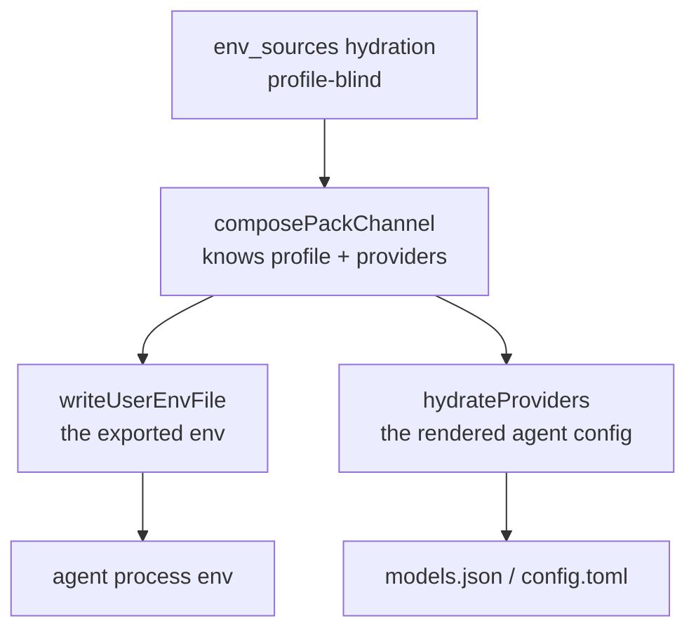

# What reaches which agent: a profile's credentials and env stay with the agent that selected it

**The question.** You run `yolo -p codex=bedrock -- codex`. Codex should get Bedrock's
credentials and settings. Should claude, pi, or a plain shell in the same jail get them too? The
maintainer ruled no. This doc works out how yolo delivers a provider's credentials and
profile-gated variables to the agent that selected it, and to no other.

**Status:** DESIGN, 2026-09-23. [OQ-BR4](#OQ-BR4) DECIDED 2026-09-25, unbuilt;
[OQ-CN1](#OQ-CN1)–[OQ-CN6](#OQ-CN6) open. No gate is built. MEASURED: the leak, in this jail on
2026-09-22 ([§2.1](#21-delivery-is-profile-blind-by-construction)), and pi's `enabledModels`,
read statically from installed pi 0.87.1 ([§2.4.1](#241-what-pis-enabledmodels-actually-constrains)).
Code claims re-verified 2026-09-24; they cite a symbol, never a line. UNMEASURED: whether a
per-agent env file reaches every way an agent is started ([OQ-CN6](#OQ-CN6)).

**Where things stand.** Today a profile picks which provider an agent *uses*, not which
credentials and variables it can *see*, so one agent's selection reaches every agent.
[OQ-BR4](#OQ-BR4) (ruled 2026-09-25, [§7](#7-decision-ledger)) says it must not: *"no I don't
want it to leak … as specific as possible … certainly not Claude Code gets Bedrock"* because
another agent selected it. Nothing is built yet, and it cannot be built on today's vehicles:
every hydrated credential, every agent's shape variables and every satisfied pack `env` gate
land in one file that every process in the jail reads
([§2.7](#27-one-shared-file-five-readers)). [OQ-CN6](#OQ-CN6) picks the per-agent vehicle.

**Needs your ruling:**

Rule these two together; they make the ruled [OQ-BR4](#OQ-BR4) buildable:

- [OQ-CN6](#OQ-CN6): how a value reaches one agent only. Leaning: a per-agent env file written from the one gate.
- [OQ-CN2](#OQ-CN2): which layer holds the gate. Leaning: one gate in `composePackChannel`, read by every write path.

Then:

- [OQ-CN1](#OQ-CN1): where the key→provider association lives. Leaning: `api_key_env_name` grows into a list on the provider.
- [OQ-CN3](#OQ-CN3): what happens to the credential pre-flight. Leaning: it narrows with the gate.
- [OQ-CN4](#OQ-CN4): narrow the menu or withhold the credential. Leaning: both, named separately.
- [OQ-CN5](#OQ-CN5): all three vehicles at once. Leaning: yes; if not, the host notch first.

**Start at [§2.7](#27-one-shared-file-five-readers) and [§3](#3-where-the-gate-can-sit):** why
nothing is per-agent today, and where the gate can sit. That choice decides the rest.

**Reads with:** [`../reference/providers.md`](../reference/providers.md) (the catalog,
composition and selection this gates), [`providers-and-profiles-redesign.md`](providers-and-profiles-redesign.md)
(what a provider and a profile should mean), [`agent-credentials.md`](../reference/agent-credentials.md)
(where each agent's credential comes from), [`sso-backed-bedrock.md`](sso-backed-bedrock.md)
(where a Bedrock credential comes from).

---

## Words this doc uses

- **Provider**: a declared model service: its address per wire protocol, its region, the name of
  the variable holding its key (`api_key_env_name`), its models. A pack or the user declares it.
- **Profile**: a named choice pointing at one provider, plus options such as the model.
  `-p <name>` selects it for every agent whose pack ships that name; `-p <agent>=<name>` for one
  agent; `use_profiles` persistently. **Selection** is the resulting agent→profile table, so
  scope is per agent. Why the two ideas are split, and whether they should be, is
  [`providers-and-profiles-redesign.md`](providers-and-profiles-redesign.md)'s question.
- **`env_sources`**: the config key that hydrates host-side values (`.env` files, host variables)
  into the jail. It is how a user's own API keys arrive.
- **Derive**: a pack's Lua function turning the provider table and selection into one agent's
  config or environment. A **`yolo.env` producer** is a derive that emits environment variables.
- **Shape variables** (coined here): the provider variables an env derive emits for one agent,
  such as claude's `ANTHROPIC_BASE_URL` and `ANTHROPIC_AUTH_TOKEN`, credential included.
- **Pack `env` gate**: a `kind: "env"` contribution with a `profile` field; it fires when that
  profile name is selected. **The wide pass** is its second rule: it also fires when the profile
  is active for *any* agent the launch installs, so a pack that installs no agent (a **CLI-less**
  pack, such as `aws-auth`) can gate env at all. Trap D2 ([§2.6](#26-the-pack-env-gate-is-the-same-leak-through-a-second-door-trap-d2)) is its leak.
- **Notch**: a place yolo renders an agent's environment: the jail (container backends and
  `macos-user`), the host (`yolo host`), and `guest`, unbuilt.
- **Delivery vehicle** (coined here): the code that writes a launch's environment for one notch
  or backend ([§2.3](#23-three-vehicles-and-a-gate-in-one-covers-one-backend)).
- **Channel section**: the part of `~/.config/yolo-user-env.sh` carrying the provider tables,
  the pack env fold and the shape variables, rewritten on every entry
  ([providers.md](../reference/providers.md#what-crosses-to-the-jail)).
- **Pre-flight**: the launch check refusing a launch whose provider credential is missing
  (`checkProviderCredentials`). **Tombstone**: a derive's instruction to unset a variable.

## Where the rest went

This doc is kept. It lost no question and gained two.

| Id or material | Where it lives now |
| :--- | :--- |
| [OQ-CN1](#OQ-CN1)–[OQ-CN5](#OQ-CN5) | here, [§6](#6-open-questions), unchanged in substance |
| [OQ-BR4](#OQ-BR4), trap D2, done-condition 3, build step 6 | **moved in** from [`bedrock-plumbing.md`](bedrock-plumbing.md) on 2026-09-25: [§2.6](#26-the-pack-env-gate-is-the-same-leak-through-a-second-door-trap-d2), [§5](#5-what-done-looks-like-and-what-i-would-build) |
| [OQ-CN6](#OQ-CN6) | new here, 2026-09-25 |
| [`OQ-PS5`](provider-switching.md#OQ-PS5) | raised in [`provider-switching.md`](provider-switching.md) on 2026-09-21 and split out here, because the fix lands in the launch's environment channel, not in `agentcfg/selection.go`; a redirect there points here |
| Whether a gate keys on the profile NAME or the provider ([`OQ-BR8`](providers-and-profiles-redesign.md#OQ-BR8), trap D5) | [`providers-and-profiles-redesign.md`](providers-and-profiles-redesign.md); [OQ-CN1](#OQ-CN1) reads it |
| All traffic through the wire bridge, routed per agent ([DIR-WG1](wire-bridge-gateway.md#DIR-WG1)) | [`wire-bridge-gateway.md`](wire-bridge-gateway.md) |
| Model allowlists enforced at the bridge ([`OQ-WG3`](wire-bridge-gateway.md#OQ-WG3)) | [`wire-bridge-gateway.md`](wire-bridge-gateway.md) |
| Picker and menu lists | [`model-lists-and-pickers.md`](model-lists-and-pickers.md); [OQ-CN4](#OQ-CN4)'s menu half names only each agent's own key |
| Static keys delivered beside `aws-auth`'s pointer ([`OQ-SSO8`](sso-backed-bedrock.md#OQ-SSO8)) | [`sso-backed-bedrock.md`](sso-backed-bedrock.md) |

## 1. Goal and non-goals

**Goal.** Each agent receives the credentials and gated variables of the provider *it*
selected, and none of the others. Scope is per agent, not per launch: `yolo -p zai -- pi` offers
zai, and `-p codex=bedrock` gives codex Bedrock without giving it to claude.

**Non-goals**, each considered and set aside:

- **Curating anyone's model catalog.** [`providers.md`](../reference/providers.md) forbids yolo
  deciding which models exist. This is about which *credentials* cross, a different act.
- **Revoking a credential from a running jail.** A variable already exported into a live shell
  cannot be un-exported by rewriting the file it sourced. The gate governs a launch.
- **Protecting an agent from itself.** An agent reading a credential from a file yolo did not
  write is outside this.
- **A secrets manager.** `env_sources` stays what it is.

## 2. What happens today, precisely

### 2.1 Delivery is profile-blind by construction

**MEASURED 2026-09-22 in this jail:** `.yolo/home/yolo-user-env.sh` delivers `AWS_ACCESS_KEY_ID`
and `AWS_SECRET_ACCESS_KEY`, put there by `env_sources` for **claude's** bedrock profile, and pi's
`amazon-bedrock` branch authenticates from exactly that pair ([`env-api-keys.js:120-153`](#9-evidence)).
So pi offers Bedrock because claude has credentials. The general form is worse than a wrong menu:
a credential scoped to one agent's profile is readable by every process every agent spawns.

Hydration takes no profile, agent or provider: `ResolveEnvSourcesFull(workspace, cfg, warn)` is
the whole signature ([`envsources.go`](../../internal/config/envsources.go)). The writer loops
over every hydrated key with no gate (`writeUserEnvFile`, [`userenv.go`](../../internal/cli/run/userenv.go)).

Two things in that file *are* profile-scoped, which is why the gap is easy to miss: a pack's
`profile`-gated `env` (`packload.EnvFold`, [`packload.go`](../../internal/packload/packload.go)),
and the shape variables `composePackChannel` fills ([`profilechannel.go`](../../internal/cli/run/profilechannel.go)).
A profile decides *what claude's `ANTHROPIC_AUTH_TOKEN` is*. It decides nothing about what pi reads.

> [!WARNING]
> **The per-agent shape variables are not per-agent at delivery.** Every agent's shape vars go
> into the one shared file (`writeUserEnvFile`'s channel section), so claude's profile-scoped
> `ANTHROPIC_AUTH_TOKEN` lands in pi's environment too. A gate on `env_sources` alone leaves this
> channel open. It is the same leak class as [OQ-BR4](#OQ-BR4): nothing in the file is per agent.

### 2.2 The frozen contract is the grammar, not the key set

`writeUserEnvFile`'s doc comment freezes the file's *format*, because the entrypoint parses it
back. The two line forms carry the precedence: def-form `export K=${K:-'v'}` is a default the
container environment beats; plain-form `export K='v'` beats even the container's frozen
environment (`hydrateEnvFromUserEnvFile`'s doc comment, [`boot.go`](../../internal/entrypoint/boot.go)).

**Narrowing the key set does not touch that contract.** The pinned-bytes test feeds the writer a
map and checks the rendering (`TestWriteUserEnvFileBytes`, [`userenv_test.go`](../../internal/cli/run/userenv_test.go)),
so it stays green with or without a gate. That is a hole, not a reassurance: the change needs a
test that fails when the gate's call site is deleted.

### 2.3 Three vehicles, and a gate in one covers one backend

| Vehicle | Where | Filters today |
| :--- | :--- | :--- |
| Container backends | `writeUserEnvFile` ([`userenv.go`](../../internal/cli/run/userenv.go)) → single-file mount | no |
| `macos-user` | its **own** `ResolveEnvSources` call, in `buildPlan` ([`orchestrator.go`](../../internal/macosuser/orchestrator.go)) | no |
| The host notch | `composeHostVars` ([`host.go`](../../internal/cli/host.go)) | no |

This repo treats three implementations of one channel as a defect class, so the gate cannot be a
local edit to the container writer. `guest` refuses every verb today (`render.NotchUnbuilt`), a
fourth vehicle the gate will eventually need.

⚠ The notches **read different config scopes**: the host reads user scope only
(`hostScopedEnvSources`, [`host.go`](../../internal/cli/host.go)), the jail the merged config
(`loadAndValidateConfig`, [`preflight.go`](../../internal/cli/run/preflight.go)). A declaration
of which key belongs to which provider must be legible in both.

### 2.4 The agents disagree about what a credential even decides

Measured against the **installed** programs, not their docs:

| Agent | Does a credential decide the menu? | Its narrowing key, and how hard it holds | Does yolo set it? |
| :--- | :--- | :--- | :--- |
| **pi** 0.87.1 | yes: availability *is* credential presence ([`models.js:256-274`](#9-evidence)) | **`enabledModels`, a soft shortlist** ([§2.4.1](#241-what-pis-enabledmodels-actually-constrains)) | **yes**, for every pi-reachable selected provider (`yolo.derive("pi", "settings", …)` in [`derive.lua`](../../packs/pi/derive.lua)) |
| **opencode** | no: catalog rows register without an auth check | `enabled_providers` / `disabled_providers`, hard per its schema | no |
| **claude** | no | `enforceAvailableModels` + `replaceBuiltInOptions`, an enforced allowlist | `openai-codex` only (the settings derive in [`packs/claude/derive.lua`](../../packs/claude/derive.lua)) |

Every agent measured ships a narrowing key; what differs is **how hard it holds and whether yolo
sets it.** opencode's schema says `enabled_providers` means **"When set, ONLY these providers will
be enabled. All other providers will be ignored"**, and yolo does not set it. pi's is set on every
profile launch, and it is the weakest of the three.

### 2.4.1 What pi's `enabledModels` actually constrains

pi documents the key as *"Model patterns used for startup selection and model cycling"*
(`docs/settings.md:16`). MEASURED 2026-09-23 by reading the installed 0.87.1 package, never
running a session. Anchors are in the unbundled `dist/`; the `pi` bin runs `dist/bundle/cli.js`,
and every distinctive string below is present in its `chunks/chunk-OJP47DM6.js`.

| Surface | What a non-empty `enabledModels` does | Anchor |
| :--- | :--- | :--- |
| Resolution | patterns match only **credentialed** models; a pattern for an uncredentialed provider matches nothing and warns | `core/model-resolver.js:204-280`, `main.js:641-644` |
| Startup selection | the saved default if in scope, else the **first** scoped model: an out-of-scope default is **replaced, not refused** | `main.js:382-402` |
| `--model` | **bypasses** the scope: resolved against the full runtime first | `main.js:359-381` |
| A resumed session | the scope does not pick the model | `main.js:382`, `core/model-resolver.js:493` |
| `/model` picker | opens on the **scoped** view, but **Tab toggles to all** credentialed models | `modes/interactive/components/model-selector.js:52,104-108,200-206,302-311` |
| `/model <term>`, its completions, Ctrl+P cycling | scope-only | `modes/interactive/interactive-mode.js:446-448,4207-4213`; `core/agent-session.js:1683-1700` |
| Switching the model | checks **auth only**, never scope | `core/agent-session.js:1645-1648` |
| Save-as-default from the all view | **appends** the model to the session scope and to the **global** `enabledModels` | `core/agent-session.js:1653-1656,1663-1676`, `core/settings-manager.js:956-958` |
| `/scoped-models` | edits `enabledModels` interactively | `core/slash-commands.js:7`, `modes/interactive/interactive-mode.js:4347-4410` |

**So `enabledModels` is a default view, never a boundary.** It shapes what pi starts on, cycles
through and completes, and forbids nothing: the escapes are one keystroke (Tab) and one flag
(`--model`), and the shortlist grows with use. It also **fails open**: a scope matching no
credentialed model is empty, and an empty scope means no scope (`main.js:642-644`). So
`yolo -p zai -- pi` starts on zai, and Bedrock is still one Tab away. No pi key reaches the all view.

INFERRED, not measured: pi writes an appended pattern to `~/.pi/agent/settings.json`, and yolo's
`settings` derive re-emits `enabledModels` next launch. Whether the appended model survives depends
on how the render merges a derive's plain key, which this doc has not traced.

> [!IMPORTANT]
> **Credentials are not the only gate even for pi.** A **stored** credential outranks the
> environment (*"A stored credential owns the provider: ambient/env is consulted only when nothing
> is stored"*, [`resolve.js:20-24`](#9-evidence)), so withholding a variable cannot narrow a
> provider the user has ever logged into. And pi's `amazon-bedrock` authenticates from
> `AWS_PROFILE`, the access-key pair, `AWS_BEARER_TOKEN_BEDROCK`, or container credentials
> ([`env-api-keys.js:120-153`](#9-evidence)): one provider, four env spellings to withhold.

### 2.5 The mapping half-exists

[`OQ-PS5`](provider-switching.md#OQ-PS5) was filed saying yolo cannot tell which `env_sources`
key belongs to which provider. That is **half** wrong, and the right half is the load-bearing one.

A provider declaration carries `api_key_env_name`, with consumers across the tree: four pack
derives ([pi](../../packs/pi/derive.lua), [opencode](../../packs/opencode/derive.lua),
[codex](../../packs/codex/derive.lua), [omp](../../packs/omp/derive.lua)), packload's provider
composition and pre-flight (`internal/packload/providers.go`), `hydrateProviders`, the footprint
report (`internal/packload/footprint.go`) and the wire bridge's boot (`internal/wirebridged/boot.go`).
The mapping exists; **no consumer of it is in the delivery path.** Three gaps:

- **It is single-valued**, so a provider with several credential variables, Bedrock's shape, is
  inexpressible.
- **yolo's `bedrock` declaration names no key**, so the provider causing the symptom is unmapped.
  Spot-checked 2026-09-24 in `packs/claude/pack.json`: still true.
- **The name spaces do not join.** yolo's provider is `bedrock`; pi's id is `amazon-bedrock`, and
  pi's own map is keyed by its ids ([`env-api-keys.js:63-112`](#9-evidence), 39 pairs).

### 2.6 The pack env gate is the same leak through a second door (trap D2)

**D2 (live hazard, SOURCED from the code).** `profileActive` in [`packload.go`](../../internal/packload/packload.go)
is true when the profile is active for an agent *this* pack installs, **or for any agent the
launch installs at all**. The wide pass is correct for its purpose, reaching a CLI-less pack. But
`-p codex=bedrock` in a jail that also selects `packs/claude` fires claude's gated
`CLAUDE_CODE_USE_BEDROCK=1` jail-wide, pointing claude at a Bedrock nobody configured it for. The
config-overlay twin has no such leak: `packoverlay.Collect` ([`packoverlay.go`](../../internal/packoverlay/packoverlay.go))
checks `profiles[key.Agent]`, the profile of the agent owning the target file. `env` cannot,
because an env value has no surface naming an agent; that missing binding is [OQ-CN6](#OQ-CN6).

**It became credential-shaped on 2026-09-18.** SOURCED from the repo: `packs/aws-auth`
(`9fc4879d`) ships one contribution,
`{"kind":"env","profile":"bedrock","vars":{"AWS_CONTAINER_CREDENTIALS_FULL_URI":…}}`, and
`packs/claude` ships the profile `bedrock` without yet `need`ing aws-auth (step 5 of
[`sso-backed-bedrock-plan.md`](sso-backed-bedrock-plan.md)), so a user selects both, as
[the pack README](../../packs/aws-auth/README.md) shows. aws-auth installs no agent, so it always
takes the wide pass: selecting `bedrock` for claude points **every** AWS SDK in the jail at the
credential adapter. INFERRED from the rule: narrowing the gate to a pack's own agents would break
aws-auth outright, since CLI-less is what it is. So the fix scopes by agent.

**What fixing D2 buys.** Of the three supported Bedrock credentials
([`OQ-SSO7`](sso-backed-bedrock.md#13-decision-ledger), ruled 2026-09-24), only the SSO pointer
arrives through a pack. The bearer and the static pair arrive through `env_sources`
([§2.1](#21-delivery-is-profile-blind-by-construction)). So D2's fix narrows aws-auth's pointer and
claude's flag; the CN gate narrows the rest. The ruling needs both. On the host notch the wide pass
cannot cross agents: INFERRED from `profileActive`'s doc comment, the host fold gets a single-agent
table. D2 is a jail-side leak.

> [!IMPORTANT]
> **Ruled 2026-09-25 ([OQ-BR4](#7-decision-ledger)).** *"no I don't want it to leak … as specific
> as possible … certainly not Claude Code gets Bedrock"* because another agent selected it. So a
> satisfied gate delivers its variables to **each agent whose selected profile satisfies it, and to
> no other**. A CLI-less pack stays reachable: aws-auth's pointer goes to every agent that selected
> `bedrock`, and only to them. Accepting the leak with a briefing note is off the table. The same
> comment spawned a direction, all traffic through the wire bridge so it can filter models and route
> per agent: [DIR-WG1](wire-bridge-gateway.md#DIR-WG1), not this doc's.

The other direction of the same function is trap D5: a name-matched gate fails to fire for a second
profile over the same provider. Name versus provider is [`OQ-BR8`](providers-and-profiles-redesign.md#OQ-BR8),
now in [`providers-and-profiles-redesign.md`](providers-and-profiles-redesign.md). Its leaning moves
claude's flag into claude's derive, making it a shape variable, and shape variables become per-agent
at delivery only once [OQ-CN6](#OQ-CN6) is built ([§2.1](#21-delivery-is-profile-blind-by-construction)).
Either way the flag needs CN6.

### 2.7 One shared file, five readers

Every channel above ends in `~/.config/yolo-user-env.sh`. SOURCED from the code, it has five
readers in a container jail:

| Reader | What it does with the file |
| :--- | :--- |
| `hydrateEnvFromUserEnvFile` ([`boot.go`](../../internal/entrypoint/boot.go)) | exports every line into the entrypoint's **process environment**, which every child inherits |
| `execBash` ([`boot.go`](../../internal/entrypoint/boot.go)) | sources it on the exec-into-existing path |
| `.bashrc` ([`shell.go`](../../internal/entrypoint/shell.go)) | sources it in every interactive shell |
| `miseActivate` ([`command.go`](../../internal/cli/run/command.go)) | sources it before every agent command |
| the wire bridge's key channel ([`keyfile.go`](../../internal/wirebridged/keyfile.go)) | reads a provider credential from it once at boot |

The first row settles it: whatever is in the shared file is in every process. So "as specific as
possible" means an agent-specific value **leaves the shared file entirely**; filtering one reader is
not enough. The last row is a constraint: a key the bridge serves must still reach the bridge.
`macos-user` layers the same channel into its per-invocation plan env and has rc files of its own
([`orchestrator.go`](../../internal/macosuser/orchestrator.go)).

## 3. Where the gate can sit

### 3.1 Four layers, and filtering the environment is not enough

| Layer | What a gate there achieves | What it misses |
| :--- | :--- | :--- |
| Hydration | nothing: it has no profile to gate on | everything |
| `composePackChannel` | the best-informed site: it holds the hydrated env, the profile table, the composed providers and the resolved profiles at once ([`profilechannel.go`](../../internal/cli/run/profilechannel.go)) | it must still fan out to three vehicles |
| `writeUserEnvFile` | the exported environment | the rendered config, and two other backends |
| `hydrateProviders` | the rendered config | the exported environment |

**Both write paths must be gated.** `hydrateProviders` walks *every* composed entry and sets
`api_key` on each whose `api_key_env_name` resolves ([`deriveenv.go`](../../internal/packload/deriveenv.go)),
so a perfect filter on the environment still writes every credential into the agent's config file.

### 3.2 The pre-flight refuses what the gate withholds

`requiredProviders` demands a credential for every composed entry with an endpoint, scoped to the
**selected packs** and explicitly **not** to the profile ([`providers.go`](../../internal/packload/providers.go);
`checkProviderCredentials`'s doc comment, [`providerpreflight.go`](../../internal/cli/run/providerpreflight.go)).
So a narrowing gate makes `checkProviderCredentials` **refuse the launch over the key it just
withheld**. It has three call sites: the fresh container path, the attach path (stricter, with nil
argv pairs) and the macos-user arm.

### 3.3 The withhold primitive half-exists

A `yolo.env` producer can emit a tombstone: `ctx.tombstone` becomes `agentenv.Var{Unset: true}`
(`packload.AgentEnv`, [`deriveenv.go`](../../internal/packload/deriveenv.go)), and the host notch
honors it. The container path drops it: *"Unset has no file spelling"* (`writeUserEnvFile`).

⚠ **Only claude and copilot register a `yolo.env` producer** ([`claude`](../../packs/claude/derive.lua),
[`copilot`](../../packs/copilot/derive.lua); spot-checked 2026-09-24). For pi, codex, opencode,
omp and agy a profile contributes no environment at either notch, so a producer-based design
reaches two agents.

## 4. What this does not license

- **No curated model list.** Setting opencode's `enabled_providers` to the selected provider is a
  credential-scope act with a catalog-shaped mechanism; it must never grow into yolo choosing
  models. Which models yolo ships is [`model-lists-and-pickers.md`](model-lists-and-pickers.md)'s.
- **No new secret store.** The gate decides which existing values cross, nothing else.
- **No silent narrowing.** A launch that withholds a credential the user configured says so, as a
  disclosure rather than a debug line.
- **No change to which config scope `env_sources` is read from.** The host reads user scope and the
  jail merged config ([§2.3](#23-three-vehicles-and-a-gate-in-one-covers-one-backend)). Changing
  that is a separate ruling; this design works within the asymmetry.

## 5. What done looks like, and what I would build

**Done looks like:**

1. `yolo -p zai -- pi`: pi's environment and `models.json` carry no AWS variable, and the launch
   discloses what it withheld.
2. `yolo -p codex=<a Bedrock profile> -- codex` leaves `CLAUDE_CODE_USE_BEDROCK` **unset** in the
   jail environment and in claude's (D2 closed). The profile's name is
   [`OQ-BR1`](bedrock-plumbing.md#OQ-BR1)'s. [OQ-BR4](#7-decision-ledger) is ruled, so the old
   "or the briefing says why" branch is gone.
3. With `aws-auth` selected, `-p codex=bedrock` gives codex `AWS_CONTAINER_CREDENTIALS_FULL_URI`;
   claude and a bare `yolo -- bash` shell get neither it nor claude's flag.
4. Each gate has a test that **fails when its call site is deleted**
   ([§2.2](#22-the-frozen-contract-is-the-grammar-not-the-key-set)).
5. All three vehicles meet 1–3, or a vehicle that cannot says so as a disclosure
   ([OQ-CN5](#OQ-CN5), [OQ-CN6](#OQ-CN6)).

**What I would build, in order.** Only step 2 is ruled; the rest waits on its question.

1. **The per-agent vehicle** ([OQ-CN6](#OQ-CN6)). Every later step writes into it.
2. **Close D2** (build step 6 of [`bedrock-plumbing.md`](bedrock-plumbing.md), its D2 half): the env fold delivers a
   satisfied gate only to agents whose profile satisfies it, with a deletion-sensitive test. The
   D5 half is [`providers-and-profiles-redesign.md`](providers-and-profiles-redesign.md)'s.
3. **The key→provider list** ([OQ-CN1](#OQ-CN1)), with `bedrock` declaring its variables.
4. **The one gate** ([OQ-CN2](#OQ-CN2)), feeding the env vehicles and `hydrateProviders`.
5. **The pre-flight narrowed with it** ([OQ-CN3](#OQ-CN3)), at all three call sites.
6. **The disclosure line**, and each agent's menu key where yolo does not set it ([OQ-CN4](#OQ-CN4)).

## 6. Open Questions

1. 💬 **[OQ-CN1](#OQ-CN1): where does the key→provider association live?**
   `api_key_env_name` has nine consumers but is **single-valued**, and `bedrock` sets it to
   nothing ([§2.5](#25-the-mapping-half-exists)). A second credential route to one service need
   not make a provider multi-keyed **if** [`OQ-BR8`](providers-and-profiles-redesign.md#OQ-BR8)
   rules as it leans, modelling variants of one service as separate providers. BR8 is open and now
   lives in the redesign, so this leans on it without resting on it. The route count is ruled:
   [`OQ-SSO7`](sso-backed-bedrock.md#13-decision-ledger) (2026-09-24) supports **three** Bedrock
   credentials (a bearer, a static key pair, an SSO session), each in different variables, so the
   winning shape must express three routes to one service. [`agent-auth-modes.md`](agent-auth-modes.md)'s
   [`OQ-9`](agent-auth-modes.md#OQ-9) is the same question from the credential side. The
   alternative, a per-profile credential allowlist in user config, needs no schema change but makes
   every user restate a fact about each provider. The stakes: whether the gate is built on a field
   that exists, and whether a user restates a fact about zai in their own config.

   <!-- vantage: oq id=OQ-CN1 leaning="Grow api_key_env_name into a list on the provider declaration. The key name is a fact about the provider, and a single-valued field cannot express Bedrock, which is the case that produced the bug. A per-profile allowlist in user config is the fallback and is worse: it puts a fact about zai in every user's file." -->

   _Leaning:_ Grow the field on the **provider declaration** into a list. The key name is a fact
   about the provider, not the user, and single-valued cannot express Bedrock, the case that
   produced the bug.

   **Answer:**
   > _(empty — fill in when decided)_

2. 💬 **[OQ-CN2](#OQ-CN2): which layer holds the gate, and is the rendered config gated too?**
   Filtering the environment leaves `hydrateProviders` writing every `api_key` into the agent's
   config ([§3.1](#31-four-layers-and-filtering-the-environment-is-not-enough)); gating only the
   config leaves the environment open. The alternative, two independent filters on
   `writeUserEnvFile` and `hydrateProviders`, is the duplicate-implementation shape. The stakes:
   one gate or two, and whether `composePackChannel` becomes the single chokepoint.

   <!-- vantage: oq id=OQ-CN2 leaning="Gate once in composePackChannel and let all three vehicles read the narrowed set, including the rendered-config path. Two independent filters is the duplicate-implementation defect this repo already treats as a class." -->

   _Leaning:_ **One gate, in `composePackChannel`**, with all three vehicles and the
   rendered-config path reading the narrowed set.

   **Answer:**
   > _(empty — fill in when decided)_

3. 💬 **[OQ-CN3](#OQ-CN3): what happens to the credential pre-flight?**
   `requiredProviders` is scoped to the selected packs, not the profile, so it refuses the launch
   for exactly the key the gate withholds ([§3.2](#32-the-pre-flight-refuses-what-the-gate-withholds)).
   Either it narrows with the gate, reopening the ruling that scoped it to packs, or the gate sits
   downstream and the pre-flight keeps demanding keys nobody will deliver.

   <!-- vantage: oq id=OQ-CN3 leaning="Narrow the pre-flight with the gate: a key nobody will deliver is not a missing credential, and refusing a launch over one is the defect this doc is fixing, one layer up. That reopens the pack-scoping ruling deliberately rather than by accident." -->

   _Leaning:_ **Narrow the pre-flight with the gate.** A key nothing will deliver is not a missing
   credential, and refusing over it is this defect one layer up. Reopen the pack-scoping ruling
   deliberately rather than route around it.

   **Answer:**
   > _(empty — fill in when decided)_

4. 💬 **[OQ-CN4](#OQ-CN4): is the goal narrowing the MENU or withholding the CREDENTIAL?**
   They come apart ([§2.4](#24-the-agents-disagree-about-what-a-credential-even-decides)). opencode
   and claude ship a hard menu key, cheap and exact. For pi, narrowing the menu means writing
   `enabledModels`, which **yolo already does**, and that is as strong as pi's menu gets: a default
   view that Tab and `--model` escape and that fails open ([§2.4.1](#241-what-pis-enabledmodels-actually-constrains)).
   So for pi the only lever on the all view is the credential, which a stored credential defeats.
   This covers only each agent's own key; what the lists contain is
   [`model-lists-and-pickers.md`](model-lists-and-pickers.md)'s, and a hard allowlist at the bridge
   is [`OQ-WG3`](wire-bridge-gateway.md#OQ-WG3). The stakes: one mechanism, or a per-agent
   capability the provider system dispatches on and discloses the strength of.

   <!-- vantage: oq id=OQ-CN4 leaning="Both, named separately. Withholding is the security property and applies everywhere. Menu narrowing is the ergonomic one and uses each agent's own key: hard for opencode and claude, and for pi the soft enabledModels shortlist yolo already writes, which must never be described as a restriction." -->

   _Leaning:_ **Both, named separately.** Withholding is the security property and applies
   everywhere. Menu narrowing is ergonomic and uses each agent's own key: hard for opencode and
   claude, soft for pi, whose shortlist must never be described as a restriction.

   **Answer:**
   > _(empty — fill in when decided)_

5. 💬 **[OQ-CN5](#OQ-CN5): does the gate ship on all three vehicles at once?**
   `macos-user` hydrates on its own and the host notch composes independently
   ([§2.3](#23-three-vehicles-and-a-gate-in-one-covers-one-backend)), so a container-only gate
   leaves two paths delivering everything, one of them the host notch outside every sandbox. The
   alternative, a container gate with a named gap, leaves the weakest boundary unfixed while the
   doc reads as done. The stakes: one change, or a container change with a named gap.

   <!-- vantage: oq id=OQ-CN5 leaning="All three, because the host notch is the highest-stakes one and shipping the container first would leave the weakest boundary unfixed while the doc reads as done. If that is too large, the host notch goes first, not last." -->

   _Leaning:_ **All three.** If that is too large, the **host** notch goes first, because it
   composes an environment for a process outside every sandbox.

   **Answer:**
   > _(empty — fill in when decided)_

6. 💬 **[OQ-CN6](#OQ-CN6): how does a value reach only the agent that selected it?**
   Every agent reads one shared env file, whose first reader exports it into the entrypoint's
   process environment ([§2.7](#27-one-shared-file-five-readers)). With [OQ-BR4](#7-decision-ledger)
   ruled "as specific as possible", a credential, a shape variable or a satisfied pack `env` gate
   must be written where only the selecting agent reads it. Candidates:

   | Candidate | What it costs |
   | :--- | :--- |
   | **A per-agent env file**, written from [OQ-CN2](#OQ-CN2)'s gate and sourced by that agent's launcher in `~/.yolo/bin/launch/` | a new file per agent and a new reader. The launcher dir precedes every install prefix on PATH, so every start should pass through it; UNMEASURED |
   | Values moved into each agent's derive | only claude and copilot have an env producer ([§3.3](#33-the-withhold-primitive-half-exists)), and derive output still lands in the shared file |
   | Per-agent tombstones | the container file cannot spell an unset, and withhold-by-exception leaks on every tombstone someone forgets |

   Two constraints hold whichever wins: the wire bridge still needs the key of every provider it
   serves ([`keyfile.go`](../../internal/wirebridged/keyfile.go)), and a bare `yolo -- bash`
   shell selects no provider, so it gets no provider value. The stakes: whether the BR4 ruling is
   buildable, and how many readers the file contract grows.

   <!-- vantage: oq id=OQ-CN6 leaning="A per-agent env file, written from CN2's single gate in composePackChannel and sourced by that agent's launcher. The host notch and macos-user read the same narrowed set, per CN5. A vehicle that cannot express per-agent delivery stays per launch and says so as a disclosure." -->

   _Leaning:_ **A per-agent env file**, written from CN2's single gate in `composePackChannel` and
   sourced by that agent's launcher; the shared file keeps only what every agent may see. The host
   notch, which runs one agent, and `macos-user` read the same narrowed set ([OQ-CN5](#OQ-CN5)). A
   vehicle that cannot express per-agent delivery stays per launch and says so as a disclosure.

   **Answer:**
   > _(empty — fill in when decided)_

## 7. Decision Ledger

| ID | Ruling / Decision | Date | Settled in | Built |
| :--- | :--- | :--- | :--- | :--- |
| OQ-BR4 | **A profile's gated env reaches only the agent that selected it; nothing leaks.** *"no I don't want it to leak … as specific as possible … certainly not Claude Code gets Bedrock"* because another agent selected it. Moved from [`bedrock-plumbing.md`](bedrock-plumbing.md) with its id. The leaning (scope by agent, as `packoverlay.Collect` does) is the ruling's shape; accepting the leak with a briefing note is rejected. The same comment's direction, all traffic through the wire bridge, is [DIR-WG1](wire-bridge-gateway.md#DIR-WG1) | 2026-09-25 | [§2.6](#26-the-pack-env-gate-is-the-same-leak-through-a-second-door-trap-d2) | — |

## 8. Downstream edits

Done 2026-09-25: [`providers.md`](../reference/providers.md#the-profile-modifier)'s wide-pass
WARNING, [`packs/aws-auth/README.md`](../../packs/aws-auth/README.md)'s jail-wide pointer note
and [`sso-backed-bedrock-plan.md`](sso-backed-bedrock-plan.md)'s links now cite the
[OQ-BR4](#OQ-BR4) ruling. None is owed.

## 9. Evidence

Code, re-verified 2026-09-24. Each claim names the symbol that carries it:

| Claim | Anchor |
| :--- | :--- |
| The unfiltered loop over every hydrated key | `writeUserEnvFile` (`internal/cli/run/userenv.go`) |
| The frozen contract is the grammar; the pinned test checks rendering | `writeUserEnvFile`'s doc comment; `TestWriteUserEnvFileBytes` |
| Hydration takes no profile, agent or provider | `config.ResolveEnvSourcesFull` (`internal/config/envsources.go`) |
| The best-informed gate site | `(*Options).composePackChannel` (`internal/cli/run/profilechannel.go`) |
| `hydrateProviders` sets `api_key` on every composed entry | `hydrateProviders` (`internal/packload/deriveenv.go`) |
| The pre-flight is scoped to packs, not the profile | `requiredProviders` (`internal/packload/providers.go`); `checkProviderCredentials`'s doc comment (`internal/cli/run/providerpreflight.go`) |
| The second and third vehicles | `macosuser.buildPlan`'s `ResolveEnvSources` call; `composeHostVars` (`internal/cli/host.go`) |
| The five readers of the shared file | `hydrateEnvFromUserEnvFile`, `execBash` (`internal/entrypoint/boot.go`); the `.bashrc` source line (`internal/entrypoint/shell.go`); `miseActivate` (`internal/cli/run/command.go`); `resolveKey` (`internal/wirebridged/keyfile.go`) |
| The env gate's wide pass | `profileActive`, `installsActiveBin` (`internal/packload/packload.go`); the `Profile` field's comment (`internal/packdecl/contributes.go`) |
| The overlay gate is agent-scoped | `packoverlay.Collect` (`internal/packoverlay/packoverlay.go`), `profiles[key.Agent]` |
| aws-auth's one gated env contribution | `packs/aws-auth/pack.json` |
| claude's already-gated enforced menu | the `openai-codex` branch of claude's settings derive (`packs/claude/derive.lua`) |
| yolo writes pi's `enabledModels` for every selected provider | `yolo.derive("pi", "settings", …)` (`packs/pi/derive.lua`): three explicit models for `openai-codex`, the declared ids (or `<provider>/*`) for the rest |
| The tombstone, and its container no-op | `packload.AgentEnv`'s `case nil` arm; `writeUserEnvFile`'s skip of `Unset` |
| `guest` refuses every verb | `render.NotchUnbuilt` (`internal/render/fieldset.go`) |

Vendor, measured in this jail against the **installed** packages: 2026-09-22 at pi 0.87.0, the
`pi-ai` anchors re-read 2026-09-23 at 0.87.1:

| Claim | Anchor |
| :--- | :--- |
| pi compiles in 41 providers | `@earendil-works/pi-ai/dist/models.generated.js:44-86` |
| pi's availability is credential presence | `pi-ai/dist/models.js:256-274` (`if (!auth) return []` at `:267-268`); `dist/core/model-runtime.js:171,187-190` |
| pi ships its own 39-pair key→provider map | `pi-ai/dist/env-api-keys.js:63-112` |
| A stored credential outranks the environment | `pi-ai/dist/auth/resolve.js:20-24`, code at `:40-54` |
| Bedrock has four env spellings in pi | `pi-ai/dist/env-api-keys.js:120-153` |
| pi's `enabledModels` is a soft shortlist | [§2.4.1](#241-what-pis-enabledmodels-actually-constrains), in `pi-coding-agent/dist` |
| opencode ships `enabled_providers` / `disabled_providers` | its config schema |

⚠ **`pi --version` runs the evergreen launcher, which can upgrade pi in place.** One probe on
2026-09-21 took this jail from 0.85.1 to 0.87.0, so a pi number is a claim about the version it
was read at; [`agent-program-runtimes.md`](agent-program-runtimes.md) records an older one.
