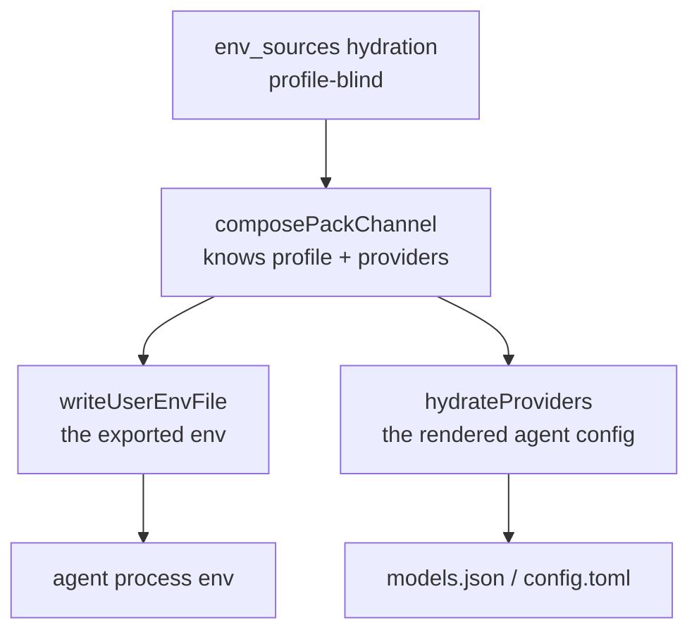

# Every provider's credential reaches every agent, and a profile cannot narrow it

**Status:** DESIGN, 2026-09-22. Nothing built. Evidence verified against `b99ca9b4`.

> **In short.** A profile selects which provider an agent *uses*; it does not decide which
> provider credentials an agent *can see* — so selecting one provider grants the agent every
> provider the user has ever configured.

**Why it matters.** Measured in this jail right now: `.yolo/home/yolo-user-env.sh` delivers
`AWS_ACCESS_KEY_ID` and `AWS_SECRET_ACCESS_KEY`, put there by `env_sources` for **claude's**
bedrock profile, and pi's `amazon-bedrock` branch authenticates from exactly that pair
([`env-api-keys.js:120-153`](#5-evidence)). So pi offers Bedrock because claude has credentials.
The general form is worse than a wrong menu: a credential the user scoped to one agent's one
profile is readable by every process every other agent spawns.

**The shape.** A **delivery gate** — the set of credential variables a launch writes is narrowed
by the selected profile's provider, using a key→provider association the provider declaration
already half-carries.

**Cost.** Three delivery vehicles must agree or the gate covers one backend
([§2.3](#23-three-vehicles-and-a-gate-in-one-covers-one-backend)). A naive gate makes yolo refuse
the launch over the key it just withheld ([§3.2](#32-the-pre-flight-refuses-what-the-gate-withholds)).

**Start at [§3](#3-where-the-gate-can-sit)** — the layer choice decides everything else.

**Needs your ruling:** [OQ-CN1](#OQ-CN1), [OQ-CN2](#OQ-CN2), [OQ-CN3](#OQ-CN3),
[OQ-CN4](#OQ-CN4), [OQ-CN5](#OQ-CN5).

**Scope note.** Split out of [`provider-switching.md`](provider-switching.md), which raised this as
[`OQ-PS5`](provider-switching.md#OQ-PS5) on 2026-09-21 and is otherwise entirely about **model-id renaming** — the alias
vocabulary, the selection state machine's fourth row, first-party providers. Nothing here is about
a model id, and the fix lands in the launch's environment channel rather than in
`agentcfg/selection.go`. That doc's [`OQ-PS5`](provider-switching.md#OQ-PS5) is now a redirect pointing here.

**Reads with:** [`../reference/providers.md`](../reference/providers.md) (the catalog, composition
and selection mechanism this gates), [`provider-switching.md`](provider-switching.md) (the sibling
half — model ids rather than credentials),
[`agent-credentials.md`](../reference/agent-credentials.md) (where each agent's credential comes
from).

---

## 1. Goal and non-goals

**Goal.** A launch delivers the credentials the selected profile's provider needs, and not the
others. `yolo -p zai -- pi` offers zai.

**Non-goals**, each considered and set aside:

- **Curating anyone's model catalog.** [`providers.md`](../reference/providers.md) forbids yolo
  deciding which models exist; this is about which *credentials* cross, which is a different act.
- **Revoking a credential from a running jail.** A variable already exported into a live shell
  cannot be un-exported by rewriting the file the shell sourced. The gate governs a launch.
- **Protecting an agent from itself.** An agent that reads a credential out of a file yolo did not
  write is outside this.
- **A secrets manager.** `env_sources` stays what it is.

## 2. What happens today, precisely

### 2.1 Delivery is profile-blind by construction

Hydration takes no profile, agent or provider: `ResolveEnvSourcesFull(workspace, cfg, warn)` is the
whole signature ([`envsources.go:130-195`](../../internal/config/envsources.go)). The writer then
loops over every hydrated key with no gate of any kind
([`userenv.go:96-102`](../../internal/cli/run/userenv.go)).

Two things in that file *are* profile-scoped, and they are the reason the gap is easy to miss: a
pack's `profile`-gated `env` contribution ([`packload.go:604-644`](../../internal/packload/packload.go)),
and the per-agent provider shape variables
([`profilechannel.go:138-147`](../../internal/cli/run/profilechannel.go)). A profile already decides
*what claude's `ANTHROPIC_AUTH_TOKEN` is*. It decides nothing about what pi can read.

> [!WARNING]
> **The per-agent shape variables are not per-agent at delivery.** Every agent's shape vars are
> written into the one shared file ([`userenv.go:117-125`](../../internal/cli/run/userenv.go)), so
> claude's profile-scoped `ANTHROPIC_AUTH_TOKEN` lands in pi's environment too. A gate on
> `env_sources` alone leaves this second channel open.

### 2.2 The frozen contract is the grammar, not the key set

`writeUserEnvFile`'s doc comment freezes the file's *format*, because the entrypoint parses it back
([`userenv.go:21-28`](../../internal/cli/run/userenv.go)). The two line forms carry the precedence:
def-form `export K=${K:-'v'}` is a default the container environment beats, plain-form
`export K='v'` beats even the container's frozen environment
([`boot.go:166-176`](../../internal/entrypoint/boot.go)).

**Narrowing the key set does not touch that contract** — and the pinned-bytes test feeds the writer
a map and checks the rendering ([`userenv_test.go:13-31`](../../internal/cli/run/userenv_test.go)),
so it stays green. That is a hole, not a reassurance: the change needs a test that fails when the
gate is deleted.

### 2.3 Three vehicles, and a gate in one covers one backend

| Vehicle | Where | Filters today |
| :--- | :--- | :--- |
| Container backends | [`userenv.go:83`](../../internal/cli/run/userenv.go) → single-file mount | no |
| `macos-user` | its **own** `ResolveEnvSources` call, [`orchestrator.go:273-277`](../../internal/macosuser/orchestrator.go) | no |
| The host notch | [`host.go:500-515`](../../internal/cli/host.go) | no |

Three implementations of one channel is the shape this repo treats as a defect class, and it is why
the gate cannot be a local edit to the container writer.

⚠ The notches also **read different config scopes**: the host reads user scope only
([`host.go:358`](../../internal/cli/host.go)), the jail reads the merged config
([`preflight.go:22`](../../internal/cli/run/preflight.go)). A declaration that says which key
belongs to which provider must therefore be legible in both.

### 2.4 The agents disagree about what a credential even decides

This is the finding that reframes the question, and it is measured against the **installed**
programs rather than their docs.

| Agent | Does a credential decide the menu? | Does it ship a narrowing key? |
| :--- | :--- | :--- |
| **pi** 0.87.0 | yes — availability *is* credential presence ([`models.js:256-274`](#5-evidence)) | no |
| **opencode** | no — catalog rows register without an auth check | **yes** — `enabled_providers` / `disabled_providers` |
| **claude** | no | **yes** — `enforceAvailableModels` + `replaceBuiltInOptions` |

So *"narrowing the catalog cannot work"* is true of pi and false as a general claim. opencode's own
schema says `enabled_providers` means **"When set, ONLY these providers will be enabled. All other
providers will be ignored"**, and yolo does not set it. claude already writes
`availableModels`, `enforceAvailableModels = true` and a `modelPicker` with
`replaceBuiltInOptions = true` — **already gated on the selected provider** —
at [`derive.lua:69-89`](../../packs/claude/derive.lua), for `openai-codex` only.

> [!IMPORTANT]
> **Credentials are not the only gate even for pi.** A **stored** credential outranks the
> environment — *"A stored credential owns the provider: ambient/env is consulted only when nothing
> is stored"* ([`resolve.js:20-24`](#5-evidence)) — so withholding a variable cannot narrow a
> provider the user has ever logged into. And pi's `amazon-bedrock` counts as authenticated from
> `AWS_PROFILE`, or the access-key pair, or `AWS_BEARER_TOKEN_BEDROCK`, or container credentials
> ([`env-api-keys.js:120-153`](#5-evidence)), so one provider has four env spellings.

### 2.5 The mapping half-exists

[`OQ-PS5`](provider-switching.md#OQ-PS5) was filed saying yolo cannot tell which `env_sources` key belongs to which provider. That
is **half** wrong, and the half that is right is the load-bearing half.

A provider declaration carries `api_key_env_name`, and it has at least nine non-test consumers —
four pack derives ([`pi:392`](../../packs/pi/derive.lua), [`opencode:86`](../../packs/opencode/derive.lua),
[`codex:134`](../../packs/codex/derive.lua), [`omp:37`](../../packs/omp/derive.lua)),
`providers.go:561` and `:617-618`, `deriveenv.go:245`, `footprint.go:464`, and
`wirebridged/boot.go:668`. The mapping exists; **no consumer of it lives in the delivery path.**

Two gaps make it insufficient as it stands:

- **It is single-valued**, so a provider with several credential variables is inexpressible — which
  is exactly Bedrock's shape.
- **yolo's `bedrock` declaration names no key at all**, so the one provider causing the measured
  symptom is unmapped.
- **The name spaces do not join.** yolo's provider is `bedrock`; pi's catalog id is
  `amazon-bedrock`, and pi's own map is keyed by *its* ids
  ([`env-api-keys.js:63-112`](#5-evidence), 39 pairs).

## 3. Where the gate can sit

### 3.1 Four layers, and filtering the environment is not enough

| Layer | What a gate there achieves | What it misses |
| :--- | :--- | :--- |
| Hydration | nothing — it has no profile to gate on | everything |
| `composePackChannel` | the best-informed site: holds hydrated env, the profile table, the composed provider table and resolved profiles at once ([`profilechannel.go:82-129`](../../internal/cli/run/profilechannel.go)) | must still fan out to three vehicles |
| `writeUserEnvFile` | the exported environment | the rendered config, and two other backends |
| `hydrateProviders` | the rendered config | the exported environment |

**Both write paths must be gated or the leak survives.** `hydrateProviders` walks *every* entry of
the composed table and sets `api_key` on each one whose `api_key_env_name` resolves
([`deriveenv.go:232-254`](../../internal/packload/deriveenv.go)) — so a perfect filter on the
exported environment still writes every provider's credential into the agent's own config file.

### 3.2 The pre-flight refuses what the gate withholds

`requiredProviders` demands a credential for every composed entry that has an endpoint, scoped to
the **selected packs** and explicitly **not** to the profile
([`providers.go:461-481`](../../internal/packload/providers.go),
[`providerpreflight.go:21-26`](../../internal/cli/run/providerpreflight.go)). So a gate that narrows
the channel makes `checkProviderCredentials` **refuse the launch over the key the gate just
withheld**.

The pre-flight has three call sites — the fresh container path, the attach path (stricter, with nil
argv pairs) and the macos-user arm — so this is not a one-line consequence.

### 3.3 The withhold primitive half-exists

A `yolo.env` producer can already emit a tombstone — `ctx.tombstone` becomes
`agentenv.Var{Unset: true}` ([`deriveenv.go:176-178`](../../internal/packload/deriveenv.go)) — and
the host notch honours it. The container path drops it, because
*"Unset has no file spelling"* ([`userenv.go:117-123`](../../internal/cli/run/userenv.go)).

⚠ **Only claude and copilot register a `yolo.env` producer at all**
([`claude:101`](../../packs/claude/derive.lua), [`copilot:63`](../../packs/copilot/derive.lua)), so
for pi, codex, opencode, omp and agy a profile contributes no environment at either notch. A design
built on the producer reaches two agents.

## 4. What this does not license

- **No curated model list.** Setting opencode's `enabled_providers` to the selected provider is a
  *credential-scope* act with a catalog-shaped mechanism; it must never grow into yolo choosing
  models.
- **No new secret store.** The gate decides which existing values cross, nothing else.
- **No silent narrowing.** A launch that withholds a credential the user configured says so —
  a disclosure, not a debug line.
- **No per-agent config scope.** Reading `env_sources` from anywhere but the scope it is read from
  today is a separate ruling; the host/jail scope asymmetry in
  [§2.3](#23-three-vehicles-and-a-gate-in-one-covers-one-backend) is a constraint here, not a
  target.

## 5. Evidence

Code, verified 2026-09-22 against `b99ca9b4`:

| Claim | Anchor |
| :--- | :--- |
| The unfiltered loop over every hydrated key | `internal/cli/run/userenv.go:96-102` |
| The frozen contract is the grammar; the pinned test checks rendering | `internal/cli/run/userenv.go:21-28`, `userenv_test.go:13-31` |
| Hydration takes no profile/agent/provider | `internal/config/envsources.go:130-195` |
| The best-informed gate site | `internal/cli/run/profilechannel.go:82-129` |
| `hydrateProviders` sets `api_key` on every composed entry | `internal/packload/deriveenv.go:232-254` |
| The pre-flight is scoped to packs, not the profile | `internal/packload/providers.go:461-481`, `internal/cli/run/providerpreflight.go:21-26` |
| The second and third vehicles | `internal/macosuser/orchestrator.go:273-277`, `internal/cli/host.go:500-515` |
| The container's fifth reader, on the agent launch path | `internal/cli/run/command.go:52` |
| claude's already-gated enforced menu | `packs/claude/derive.lua:69-89` |
| The tombstone, and its container no-op | `internal/packload/deriveenv.go:176-178`, `internal/cli/run/userenv.go:117-123` |
| `guest` refuses every verb | `internal/render/fieldset.go:24-27` |

Vendor, measured in this jail 2026-09-22 against the **installed** packages:

| Claim | Anchor |
| :--- | :--- |
| pi is 0.87.0 and compiles in 41 providers | `@earendil-works/pi-ai/dist/models.generated.js:44-86` |
| pi's availability is credential presence | `pi-ai/dist/models.js:256-274` (`if (!auth) return []` at `:267-268`); `dist/core/model-runtime.js:171,187-190` |
| pi ships its own 39-pair key→provider map | `pi-ai/dist/env-api-keys.js:63-112` |
| A stored credential outranks the environment | `pi-ai/dist/auth/resolve.js:20-24`, code at `:40-54` |
| Bedrock has four env spellings in pi | `pi-ai/dist/env-api-keys.js:120-153` |
| opencode ships `enabled_providers` / `disabled_providers` | its config schema |

⚠ **A `pi --version` probe during this measurement ran the evergreen launcher and upgraded pi
0.85.1 → 0.87.0 in this jail.** Every version-sensitive number above is at 0.87.0. Anything
measured against pi before 2026-09-21 23:42 is a different program —
[`agent-program-runtimes.md`](agent-program-runtimes.md) still says 0.86.1.

## 6. Open Questions

1. 💬 **[OQ-CN1](#OQ-CN1): where does the key→provider association live?**
   `api_key_env_name` exists with nine consumers but is **single-valued**, and yolo's `bedrock`
   declaration sets it to nothing — so the provider causing the measured symptom is unmapped. The
   stakes: whether the gate can be built on a field that already exists, or needs a multi-valued
   one, and whether a user must restate a fact about zai in their own config.

   <!-- vantage: oq id=OQ-CN1 leaning="Grow api_key_env_name into a list on the provider declaration. The key name is a fact about the provider, and a single-valued field cannot express Bedrock, which is the case that produced the bug. A per-profile allowlist in user config is the fallback and is worse: it puts a fact about zai in every user's file." -->

   _Leaning:_ Grow the field on the **provider declaration** into a list. The key name is a fact
   about the provider, not about the user, and single-valued cannot express Bedrock — the case that
   produced the bug. A per-profile allowlist in user config makes every user restate it.

   **Answer:**
   > _(empty — fill in when decided)_

2. 💬 **[OQ-CN2](#OQ-CN2): which layer holds the gate — and does the rendered config get gated too?**
   Filtering the exported environment leaves `hydrateProviders` writing every provider's `api_key`
   into the agent's own config file ([§3.1](#31-four-layers-and-filtering-the-environment-is-not-enough)).
   Gating only the config leaves the process environment open. The stakes: one gate or two, and
   whether `composePackChannel` becomes the single chokepoint that fans out to all three vehicles.

   <!-- vantage: oq id=OQ-CN2 leaning="Gate once in composePackChannel and let all three vehicles read the narrowed set, including the rendered-config path. Two independent filters is the duplicate-implementation defect this repo already treats as a class." -->

   _Leaning:_ **One gate, in `composePackChannel`**, with all three vehicles and the rendered-config
   path reading the narrowed set. Two independent filters is the duplicate-implementation shape this
   repo already treats as a defect.

   **Answer:**
   > _(empty — fill in when decided)_

3. 💬 **[OQ-CN3](#OQ-CN3): what happens to the credential pre-flight?**
   `requiredProviders` is deliberately scoped to the selected packs rather than the profile, so it
   will refuse the launch for exactly the key the gate withholds. Either the pre-flight narrows with
   the gate — reopening the ruling that scoped it to packs — or the gate sits downstream of it and
   the pre-flight keeps demanding keys nobody will deliver.

   <!-- vantage: oq id=OQ-CN3 leaning="Narrow the pre-flight with the gate: a key nobody will deliver is not a missing credential, and refusing a launch over one is the defect this doc is fixing, one layer up. That reopens the pack-scoping ruling deliberately rather than by accident." -->

   _Leaning:_ **Narrow the pre-flight with the gate.** A key nothing will deliver is not a missing
   credential, and refusing a launch over it is this same defect one layer up — so reopen the
   pack-scoping ruling deliberately rather than route around it.

   **Answer:**
   > _(empty — fill in when decided)_

4. 💬 **[OQ-CN4](#OQ-CN4): is the goal narrowing the MENU or withholding the CREDENTIAL?**
   They come apart. For pi they coincide. For opencode and claude a menu primitive already exists
   and is cheaper and exact. And for pi a stored credential defeats the credential route entirely,
   so withholding cannot deliver "zai and nothing else" for a user who has logged in. The stakes:
   whether this is one mechanism or a per-agent capability the provider system dispatches on.

   <!-- vantage: oq id=OQ-CN4 leaning="Both, and say which is which: withholding is the security property and applies everywhere; menu narrowing is the ergonomic one and should use each agent's own primitive where it has one. Framing it as a single mechanism is what makes it look impossible." -->

   _Leaning:_ **Both, named separately.** Withholding is the security property and applies
   everywhere; menu-narrowing is the ergonomic one and should use each agent's own key where one
   exists. Treating them as one mechanism is what made this look unbuildable.

   **Answer:**
   > _(empty — fill in when decided)_

5. 💬 **[OQ-CN5](#OQ-CN5): does the gate ship on all three vehicles at once?**
   `macos-user` makes its own hydration call and the host notch composes independently, so a
   container-only gate leaves two paths delivering everything — and the host notch is the one
   running outside every sandbox. The stakes: whether this lands as one change or as a container
   change with a named gap.

   <!-- vantage: oq id=OQ-CN5 leaning="All three, because the host notch is the highest-stakes one and shipping the container first would leave the weakest boundary unfixed while the doc reads as done. If that is too large, the host notch goes first, not last." -->

   _Leaning:_ **All three**, and if that is too large then the **host** notch goes first rather than
   last — it is the one composing an environment for a process outside every sandbox.

   **Answer:**
   > _(empty — fill in when decided)_

## 7. Decision Ledger

No rulings yet. Rows land here as [§6](#6-open-questions)'s questions are answered, and the ruling
moves into the body section it governs.

| ID | Ruling / Decision | Date | Settled in | Built |
| :--- | :--- | :--- | :--- | :--- |
| — | — | — | — | — |
