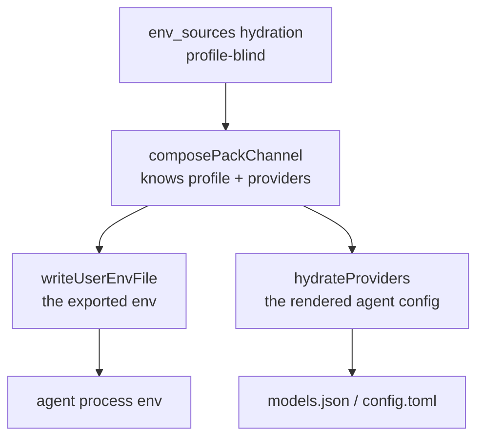

# What reaches which agent: a profile's credentials and env stay with the agent that selected it

**The question.** You run `yolo -p codex=bedrock -- codex`. Codex should get Bedrock's
credentials and settings. Should claude, pi, or a plain shell in the same jail get them too? The
maintainer ruled no. This doc works out how yolo delivers a provider's credentials and
profile-gated variables to the agent that selected it, and to no other.

**Status:** BUILT, 2026-09-28 — every ruling here is built. The three questions raised in
review are built at `7d0af878` ([OQ-CN7](#OQ-CN7): the `aws-auth` adapter starts only when a
profile selects `bedrock`, and its caller token reaches only that agent), `cef51809`
([OQ-CN8](#OQ-CN8): the user's explicit value wins) and `949d9430` ([OQ-CN9](#OQ-CN9): macos-user
writes the per-agent files), with CN-D21 to CN-D24 in [§7](#7-decision-ledger) recording how;
everything ruled before them by `packload.ScopeCredentials` and its callers (the gate, all three
vehicles, the narrowed pre-flight and trap D2's close), pinned by the done-condition tests named
below, and by opencode's `enabled_providers` derive (opencode's menu key, [OQ-CN4](#OQ-CN4)'s
menu half), pinned by `TestOpencodeMenuFollowsTheSelectedProvider`. [OQ-BR4](#OQ-BR4) was ruled
2026-09-25 and [OQ-CN1](#OQ-CN1)–[OQ-CN6](#OQ-CN6) on 2026-09-26, all as leaned. MEASURED BY
TESTS ONLY: the short suite runs the shipped packs through
the real composition (`composePackChannel`, `deliverChannel`), generates the real launchers from
the shipped manifests, and RUNS them against fake programs that report the environment they were
handed — done conditions 1–3 in `internal/cli/run`'s `TestGateDoneCondition1PiOnZaiSeesNoAWS` and
`TestGateDoneConditions2And3CodexOnBedrock`; the host notch through `hostMain` to its exec in
`internal/cli`'s `TestHostGate*`; macos-user through `Run` to its handler seam. Each gate's call
site was deleted in turn and a test failed ([§5](#5-what-done-looks-like-and-what-i-would-build)).
OBSERVED ONCE at a real boot: a nested podman launch at `3a48ca94` with pi selecting zai wrote only `~/.config/yolo-agent-env/pi.sh` (0600, in a 0700
directory) carrying `ZAI_API_KEY`, a bare shell had no `ZAI_API_KEY` while an unclaimed
`env_sources` value reached it, and the launch disclosed
`ZAI_API_KEY (provider zai): pi only`. No agent CLI ran; macos-user, Apple Container and `yolo host`
remain tests-only.
REVIEW, the same day, found and FIXED eight defects, each with a test that failed before its fix:
on Apple Container the per-agent files were 0644 in a 0755 directory and an attach never reached
them (`TestAppleContainerWritesOwnerOnlyAgentFilesAtTheJailsPath`,
`TestAppleContainerAttachRevokesADeselectedAgentsFile`); an attach to a jail launched before the
gate stripped every scoped credential while disclosing the opposite
(`TestAttachRefusesAPreGateJailItCannotDeliverTo`); an agent the image or a mise tool provides,
with no launch flags, had no carrier to source its file
(`TestAShadowedAgentWithoutLaunchFlagsStillSourcesItsOwnFile`); the launchers ran their
MCP-server and pre-launch refreshes holding the agent's credentials
(`TestTheRefreshStepsRunWithoutTheAgentsCredentials`); an MCP server gated on a claimed variable
was skipped on every launch (`TestRequiresEnvIsEvaluatedPerAgent`); a manifest's `null` or `""`
`api_key_env_name` became a fatal refusal (`TestAnEmptyOrNullCredentialVariableReadsAsAbsent`);
`yolo host env` dropped claimed values with no disclosure
(`TestHostEnvDisclosesWhatItsSliceWithholds`); and seven unpinned details got pins (among them
`TestMacosUserLaunchOmitsAnotherAgentsGatedEnv`,
`TestABedrockRouteSignsWithTheServedAgentsOwnPair` and
`TestSectionPacksPredictsTheOverrideOfADeliveredClaimedCredential`). The rows CN-D1, CN-D7,
CN-D10, CN-D16, CN-D18 and CN-D19 in [§7](#7-decision-ledger) say what changed. UNMEASURED: no
real container launch, nested jail, macos-user session or Apple Container has run it, so whether
the per-agent file reaches EVERY way an agent is started is still the open fact [OQ-CN6](#OQ-CN6) named: an absolute-path exec bypasses every carrier.
Earlier: the leak
was measured in this jail on 2026-09-22 ([§2.1](#21-delivery-is-profile-blind-by-construction)),
and pi's `enabledModels` read statically from installed pi 0.87.1
([§2.4.1](#241-what-pis-enabledmodels-actually-constrains)).

**Where things stand.** A profile used to pick which provider an agent *uses*, not which
credentials and variables it can *see*, so one agent's selection reached every agent.
[OQ-BR4](#OQ-BR4) (ruled 2026-09-25, [§7](#7-decision-ledger)) says it must not: *"no I don't
want it to leak … as specific as possible … certainly not Claude Code gets Bedrock"* because
another agent selected it. It is built: one function decides what reaches which agent, the
shared `yolo-user-env.sh` keeps only what every process may see, and each profiled agent's own
values cross in a per-agent env file its launcher sources ([§5](#5-what-done-looks-like-and-what-i-would-build),
[`providers.md`, the credential gate](../reference/providers.md#the-credential-gate)).
[§2](#2-what-happens-today-precisely) and [§3](#3-where-the-gate-can-sit) are the pre-gate analysis that ruling rested on, kept as the record of why.

**Rulings:** [OQ-CN7](#OQ-CN7), [OQ-CN8](#OQ-CN8) and [OQ-CN9](#OQ-CN9), all ruled 2026-09-28 in review, as leaned, and built the same day. Nothing here awaits a ruling or a build. UNVERIFIABLE HERE: the adapter's reachability on a real rootless host (a nested jail forces `--net=host`, AGENTS.md's first carve-out), and macos-user on hardware; CI and a Mac are the checks.

**Start at [§2.7](#27-one-shared-file-five-readers) and [§3](#3-where-the-gate-can-sit):** why
nothing was per-agent before the gate, and where the gate could sit. That choice decided the
rest; [§5](#5-what-done-looks-like-and-what-i-would-build) and the ledger's implementation rows
say what was built.

**Reads with:** [`../reference/providers.md`](../reference/providers.md) (the catalog,
composition and selection this gates), [`providers-and-profiles-redesign.md`](providers-and-profiles-redesign.md)
(what a provider and a profile should mean), [`agent-credentials.md`](../reference/agent-credentials.md)
(where each agent's credential comes from), [`sso-backed-bedrock.md`](sso-backed-bedrock.md)
(where a Bedrock credential comes from).

---

## Words this doc uses

- **Provider**: a declared model service: its address per wire protocol, its region, the name of
  the variable holding its key (`api_key_env_name`), its models. A pack or the user declares it.
- **Profile**: a named choice pointing at one provider, plus options such as the model.
  `-p <name>` selects it for every agent whose pack ships that name; `-p <agent>=<name>` for one
  agent; `use_profiles` persistently. **Selection** is the resulting agent→profile table, so
  scope is per agent. Why the two ideas are split, and whether they should be, is
  [`providers-and-profiles-redesign.md`](providers-and-profiles-redesign.md)'s question.
- **`env_sources`**: the config key that hydrates host-side values (`.env` files, host variables)
  into the jail. It is how a user's own API keys arrive.
- **Derive**: a pack's Lua function turning the provider table and selection into one agent's
  config or environment. A **`yolo.env` producer** is a derive that emits environment variables.
- **Shape variables** (coined here): the provider variables an env derive emits for one agent,
  such as claude's `ANTHROPIC_BASE_URL` and `ANTHROPIC_AUTH_TOKEN`, credential included.
- **Pack `env` gate**: a `kind: "env"` contribution with a `profile` field; it fires when that
  profile name is selected. **The wide pass** is its second rule: it also fires when the profile
  is active for *any* agent the launch installs, so a pack that installs no agent (a **CLI-less**
  pack, such as `aws-auth`) can gate env at all. Trap D2 ([§2.6](#26-the-pack-env-gate-is-the-same-leak-through-a-second-door-trap-d2)) is its leak.
- **Notch**: a place yolo renders an agent's environment: the jail (container backends and
  `macos-user`), the host (`yolo host`), and `guest`, unbuilt.
- **Delivery vehicle** (coined here): the code that writes a launch's environment for one notch
  or backend ([§2.3](#23-three-vehicles-and-a-gate-in-one-covers-one-backend)).
- **Channel section**: the part of `~/.config/yolo-user-env.sh` carrying the provider tables,
  the pack env fold and the shape variables, rewritten on every entry
  ([providers.md](../reference/providers.md#what-crosses-to-the-jail)).
- **Pre-flight**: the launch check refusing a launch whose provider credential is missing
  (`checkProviderCredentials`). **Tombstone**: a derive's instruction to unset a variable.

## Where the rest went

This doc is kept. It lost no question and gained two.

| Id or material | Where it lives now |
| :--- | :--- |
| [OQ-CN1](#OQ-CN1)–[OQ-CN5](#OQ-CN5) | here, [§6](#6-open-questions), unchanged in substance |
| [OQ-BR4](#OQ-BR4), trap D2, done-condition 3, build step 6 | **moved in** from [`bedrock-plumbing.md`](bedrock-plumbing.md) on 2026-09-25: [§2.6](#26-the-pack-env-gate-is-the-same-leak-through-a-second-door-trap-d2), [§5](#5-what-done-looks-like-and-what-i-would-build) |
| [OQ-CN6](#OQ-CN6) | new here, 2026-09-25 |
| [OQ-CN7](#OQ-CN7)–[OQ-CN9](#OQ-CN9) | new here, raised in review 2026-09-26 |
| [`OQ-PSW5`](#OQ-PSW5) | raised in the retired `provider-switching.md` on 2026-09-21 and split out here, because the fix lands in the launch's environment channel, not in `agentcfg/selection.go`; a redirect there points here |
| Whether a gate keys on the profile NAME or the provider ([`OQ-BR8`](providers-and-profiles-redesign.md#OQ-BR8), trap D5) | [`providers-and-profiles-redesign.md`](providers-and-profiles-redesign.md); [OQ-CN1](#OQ-CN1) reads it |
| All traffic through the wire bridge, routed per agent ([DIR-WG1](wire-bridge-gateway.md#DIR-WG1)) | [`wire-bridge-gateway.md`](wire-bridge-gateway.md) |
| Model allowlists enforced at the bridge ([`OQ-WG3`](wire-bridge-gateway.md#OQ-WG3)) | [`wire-bridge-gateway.md`](wire-bridge-gateway.md) |
| Picker and menu lists | [`model-lists-and-pickers.md`](model-lists-and-pickers.md); [OQ-CN4](#OQ-CN4)'s menu half names only each agent's own key |
| Static keys delivered beside `aws-auth`'s pointer ([`OQ-SSO8`](sso-backed-bedrock.md#OQ-SSO8)) | [`sso-backed-bedrock.md`](sso-backed-bedrock.md) |

## 1. Goal and non-goals

**Goal.** Each agent receives the credentials and gated variables of the provider *it*
selected, and none of the others. Scope is per agent, not per launch: `yolo -p zai -- pi` offers
zai, and `-p codex=bedrock` gives codex Bedrock without giving it to claude.

**Non-goals**, each considered and set aside:

- **Curating anyone's model catalog.** [`providers.md`](../reference/providers.md) forbids yolo
  deciding which models exist. This is about which *credentials* cross, a different act.
- **Revoking a credential from a running jail.** A variable already exported into a live shell
  cannot be un-exported by rewriting the file it sourced. The gate governs a launch.
- **Protecting an agent from itself.** An agent reading a credential from a file yolo did not
  write is outside this.
- **A secrets manager.** `env_sources` stays what it is.

## 2. What happens today, precisely

> [!NOTE]
> **This section and [§3](#3-where-the-gate-can-sit) describe the code BEFORE the gate**, re-verified 2026-09-24, and are
> kept as the analysis the rulings rest on. What was built is
> [§5](#5-what-done-looks-like-and-what-i-would-build) and the ledger's implementation rows.

### 2.1 Delivery is profile-blind by construction

**MEASURED 2026-09-22 in this jail:** `.yolo/home/yolo-user-env.sh` delivers `AWS_ACCESS_KEY_ID`
and `AWS_SECRET_ACCESS_KEY`, put there by `env_sources` for **claude's** bedrock profile, and pi's
`amazon-bedrock` branch authenticates from exactly that pair ([`env-api-keys.js:120-153`](#9-evidence)).
So pi offers Bedrock because claude has credentials. The general form is worse than a wrong menu:
a credential scoped to one agent's profile is readable by every process every agent spawns.

Hydration takes no profile, agent or provider: `ResolveEnvSourcesFull(workspace, cfg, warn)` is
the whole signature ([`envsources.go`](../../internal/config/envsources.go)). The writer loops
over every hydrated key with no gate (`writeUserEnvFile`, [`userenv.go`](../../internal/cli/run/userenv.go)).

Two things in that file *are* profile-scoped, which is why the gap is easy to miss: a pack's
`profile`-gated `env` (`packload.EnvFold`, [`packload.go`](../../internal/packload/packload.go)),
and the shape variables `composePackChannel` fills ([`profilechannel.go`](../../internal/cli/run/profilechannel.go)).
A profile decides *what claude's `ANTHROPIC_AUTH_TOKEN` is*. It decides nothing about what pi reads.

> [!WARNING]
> **The per-agent shape variables are not per-agent at delivery.** Every agent's shape vars go
> into the one shared file (`writeUserEnvFile`'s channel section), so claude's profile-scoped
> `ANTHROPIC_AUTH_TOKEN` lands in pi's environment too. A gate on `env_sources` alone leaves this
> channel open. It is the same leak class as [OQ-BR4](#OQ-BR4): nothing in the file is per agent.

### 2.2 The frozen contract is the grammar, not the key set

`writeUserEnvFile`'s doc comment freezes the file's *format*, because the entrypoint parses it
back. The two line forms carry the precedence: def-form `export K=${K:-'v'}` is a default the
container environment beats; plain-form `export K='v'` beats even the container's frozen
environment (`hydrateEnvFromUserEnvFile`'s doc comment, [`boot.go`](../../internal/entrypoint/boot.go)).

**Narrowing the key set does not touch that contract.** The pinned-bytes test feeds the writer a
map and checks the rendering (`TestWriteUserEnvFileBytes`, [`userenv_test.go`](../../internal/cli/run/userenv_test.go)),
so it stays green with or without a gate. That is a hole, not a reassurance: the change needs a
test that fails when the gate's call site is deleted.

### 2.3 Three vehicles, and a gate in one covers one backend

| Vehicle | Where | Filters today |
| :--- | :--- | :--- |
| Container backends | `writeUserEnvFile` ([`userenv.go`](../../internal/cli/run/userenv.go)) → single-file mount | no |
| `macos-user` | its **own** `ResolveEnvSources` call, in `buildPlan` ([`orchestrator.go`](../../internal/macosuser/orchestrator.go)) | no |
| The host notch | `composeHostVars` ([`host.go`](../../internal/cli/host.go)) | no |

This repo treats three implementations of one channel as a defect class, so the gate cannot be a
local edit to the container writer. `guest` refuses every verb today (`render.NotchUnbuilt`), a
fourth vehicle the gate will eventually need.

⚠ The notches **read different config scopes**: the host reads user scope only
(`hostScopedEnvSources`, [`host.go`](../../internal/cli/host.go)), the jail the merged config
(`loadAndValidateConfig`, [`preflight.go`](../../internal/cli/run/preflight.go)). A declaration
of which key belongs to which provider must be legible in both.

### 2.4 The agents disagree about what a credential even decides

Measured against the **installed** programs, not their docs:

| Agent | Does a credential decide the menu? | Its narrowing key, and how hard it holds | Does yolo set it? |
| :--- | :--- | :--- | :--- |
| **pi** 0.87.1 | yes: availability *is* credential presence ([`models.js:256-274`](#9-evidence)) | **`enabledModels`, a soft shortlist** ([§2.4.1](#241-what-pis-enabledmodels-actually-constrains)) | **yes**, for every pi-reachable selected provider (`yolo.derive("pi", "settings", …)` in [`derive.lua`](../../packs/pi/derive.lua)); since 2026-09-27 not for `openai-codex` (CN-D20 in [§7](#7-decision-ledger)) |
| **opencode** | no: catalog rows register without an auth check | `enabled_providers` / `disabled_providers`, hard per its schema | no |
| **claude** | no | `enforceAvailableModels` + `replaceBuiltInOptions`, an enforced allowlist | `openai-codex` only (the settings derive in [`packs/claude/derive.lua`](../../packs/claude/derive.lua)) |

Every agent measured ships a narrowing key; what differs is **how hard it holds and whether yolo
sets it.** opencode's schema says `enabled_providers` means **"When set, ONLY these providers will
be enabled. All other providers will be ignored"**, and yolo does not set it. pi's is set on every
profile launch, and it is the weakest of the three.

### 2.4.1 What pi's `enabledModels` actually constrains

pi documents the key as *"Model patterns used for startup selection and model cycling"*
(`docs/settings.md:16`). MEASURED 2026-09-23 by reading the installed 0.87.1 package, never
running a session. Since 2026-09-27 yolo writes no `enabledModels` for `openai-codex`, whose
registered catalog is already the declared list
([ML-D2](model-lists-and-pickers.md#ML-D2)); the table below still describes it for every
other provider. Anchors are in the unbundled `dist/`; the `pi` bin runs `dist/bundle/cli.js`,
and every distinctive string below is present in its `chunks/chunk-OJP47DM6.js`.

| Surface | What a non-empty `enabledModels` does | Anchor |
| :--- | :--- | :--- |
| Resolution | patterns match only **credentialed** models; a pattern for an uncredentialed provider matches nothing and warns | `core/model-resolver.js:204-280`, `main.js:641-644` |
| Startup selection | the saved default if in scope, else the **first** scoped model: an out-of-scope default is **replaced, not refused** | `main.js:382-402` |
| `--model` | **bypasses** the scope: resolved against the full runtime first | `main.js:359-381` |
| A resumed session | the scope does not pick the model | `main.js:382`, `core/model-resolver.js:493` |
| `/model` picker | opens on the **scoped** view, but **Tab toggles to all** credentialed models | `modes/interactive/components/model-selector.js:52,104-108,200-206,302-311` |
| `/model <term>`, its completions, Ctrl+P cycling | scope-only | `modes/interactive/interactive-mode.js:446-448,4207-4213`; `core/agent-session.js:1683-1700` |
| Switching the model | checks **auth only**, never scope | `core/agent-session.js:1645-1648` |
| Save-as-default from the all view | **appends** the model to the session scope and to the **global** `enabledModels` | `core/agent-session.js:1653-1656,1663-1676`, `core/settings-manager.js:956-958` |
| `/scoped-models` | edits `enabledModels` interactively | `core/slash-commands.js:7`, `modes/interactive/interactive-mode.js:4347-4410` |

**So `enabledModels` is a default view, never a boundary.** It shapes what pi starts on, cycles
through and completes, and forbids nothing: the escapes are one keystroke (Tab) and one flag
(`--model`), and the shortlist grows with use. It also **fails open**: a scope matching no
credentialed model is empty, and an empty scope means no scope (`main.js:642-644`). So
`yolo -p zai -- pi` starts on zai, and Bedrock is still one Tab away. No pi key reaches the all view.

INFERRED, not measured: pi writes an appended pattern to `~/.pi/agent/settings.json`, and yolo's
`settings` derive re-emits `enabledModels` next launch. Whether the appended model survives depends
on how the render merges a derive's plain key, which this doc has not traced.

> [!IMPORTANT]
> **Credentials are not the only gate even for pi.** A **stored** credential outranks the
> environment (*"A stored credential owns the provider: ambient/env is consulted only when nothing
> is stored"*, [`resolve.js:20-24`](#9-evidence)), so withholding a variable cannot narrow a
> provider the user has ever logged into. And pi's `amazon-bedrock` authenticates from
> `AWS_PROFILE`, the access-key pair, `AWS_BEARER_TOKEN_BEDROCK`, or container credentials
> ([`env-api-keys.js:120-153`](#9-evidence)): one provider, four env spellings to withhold.

### 2.5 The mapping half-exists

[`OQ-PSW5`](#OQ-PSW5) was filed saying yolo cannot tell which `env_sources`
key belongs to which provider. That is **half** wrong, and the right half is the load-bearing one.

A provider declaration carries `api_key_env_name`, with consumers across the tree: four pack
derives ([pi](../../packs/pi/derive.lua), [opencode](../../packs/opencode/derive.lua),
[codex](../../packs/codex/derive.lua), [omp](../../packs/omp/derive.lua)), packload's provider
composition and pre-flight (`internal/packload/providers.go`), `hydrateProviders`, the footprint
report (`internal/packload/footprint.go`) and the wire bridge's boot (`internal/wirebridged/boot.go`).
The mapping exists; **no consumer of it is in the delivery path.** Three gaps:

- **It is single-valued**, so a provider with several credential variables, Bedrock's shape, is
  inexpressible.
- **yolo's `bedrock` declaration names no key**, so the provider causing the symptom is unmapped.
  Spot-checked 2026-09-24 in `packs/claude/pack.json`: still true.
- **The name spaces do not join.** yolo's provider is `bedrock`; pi's id is `amazon-bedrock`, and
  pi's own map is keyed by its ids ([`env-api-keys.js:63-112`](#9-evidence), 39 pairs).

### 2.6 The pack env gate is the same leak through a second door (trap D2)

**D2 (live hazard, SOURCED from the code).** `profileActive` in [`packload.go`](../../internal/packload/packload.go)
is true when the profile is active for an agent *this* pack installs, **or for any agent the
launch installs at all**. The wide pass is correct for its purpose, reaching a CLI-less pack. But
`-p codex=bedrock` in a jail that also selects `packs/claude` fires claude's gated
`CLAUDE_CODE_USE_BEDROCK=1` jail-wide, pointing claude at a Bedrock nobody configured it for. The
config-overlay twin has no such leak: `packoverlay.Collect` ([`packoverlay.go`](../../internal/packoverlay/packoverlay.go))
checks `profiles[key.Agent]`, the profile of the agent owning the target file. `env` cannot,
because an env value has no surface naming an agent; that missing binding is [OQ-CN6](#OQ-CN6).

**It became credential-shaped on 2026-09-18.** SOURCED from the repo: `packs/aws-auth`
(`9fc4879d`) ships one contribution,
`{"kind":"env","profile":"bedrock","vars":{"AWS_CONTAINER_CREDENTIALS_FULL_URI":…}}`, and
`packs/claude` ships the profile `bedrock` without yet `need`ing aws-auth (step 5 of
[`sso-backed-bedrock.md` §12](sso-backed-bedrock.md#12-what-i-would-build-in-order)), so a user selects both, as
[the pack README](../../packs/aws-auth/README.md) shows. aws-auth installs no agent, so it always
takes the wide pass: selecting `bedrock` for claude points **every** AWS SDK in the jail at the
credential adapter. INFERRED from the rule: narrowing the gate to a pack's own agents would break
aws-auth outright, since CLI-less is what it is. So the fix scopes by agent.

**What fixing D2 buys.** Of the three supported Bedrock credentials
([`OQ-SSO7`](sso-backed-bedrock.md#13-decision-ledger), ruled 2026-09-24), only the SSO pointer
arrives through a pack. The bearer and the static pair arrive through `env_sources`
([§2.1](#21-delivery-is-profile-blind-by-construction)). So D2's fix narrows aws-auth's pointer and
claude's flag; the CN gate narrows the rest. The ruling needs both. On the host notch the wide pass
cannot cross agents: INFERRED from `profileActive`'s doc comment, the host fold gets a single-agent
table. D2 is a jail-side leak.

> [!IMPORTANT]
> **Ruled 2026-09-25 ([OQ-BR4](#7-decision-ledger)).** *"no I don't want it to leak … as specific
> as possible … certainly not Claude Code gets Bedrock"* because another agent selected it. So a
> satisfied gate delivers its variables to **each agent whose selected profile satisfies it, and to
> no other**. A CLI-less pack stays reachable: aws-auth's pointer goes to every agent that selected
> `bedrock`, and only to them. Accepting the leak with a briefing note is off the table. The same
> comment spawned a direction, all traffic through the wire bridge so it can filter models and route
> per agent: [DIR-WG1](wire-bridge-gateway.md#DIR-WG1), not this doc's.

The other direction of the same function is trap D5: a name-matched gate fails to fire for a second
profile over the same provider. Name versus provider is [`OQ-BR8`](providers-and-profiles-redesign.md#OQ-BR8),
now in [`providers-and-profiles-redesign.md`](providers-and-profiles-redesign.md). Its leaning moves
claude's flag into claude's derive, making it a shape variable, and shape variables become per-agent
at delivery only once [OQ-CN6](#OQ-CN6) is built ([§2.1](#21-delivery-is-profile-blind-by-construction)).
Either way the flag needs CN6.

### 2.7 One shared file, five readers

Every channel above ends in `~/.config/yolo-user-env.sh`. SOURCED from the code, it has five
readers in a container jail:

| Reader | What it does with the file |
| :--- | :--- |
| `hydrateEnvFromUserEnvFile` ([`boot.go`](../../internal/entrypoint/boot.go)) | exports every line into the entrypoint's **process environment**, which every child inherits |
| `execBash` ([`boot.go`](../../internal/entrypoint/boot.go)) | sources it on the exec-into-existing path |
| `.bashrc` ([`shell.go`](../../internal/entrypoint/shell.go)) | sources it in every interactive shell |
| `miseActivate` ([`command.go`](../../internal/cli/run/command.go)) | sources it before every agent command |
| the wire bridge's key channel ([`keyfile.go`](../../internal/wirebridged/keyfile.go)) | reads a provider credential from it once at boot |

The first row settles it: whatever is in the shared file is in every process. So "as specific as
possible" means an agent-specific value **leaves the shared file entirely**; filtering one reader is
not enough. The last row is a constraint: a key the bridge serves must still reach the bridge.
`macos-user` layers the same channel into its per-invocation plan env and has rc files of its own
([`orchestrator.go`](../../internal/macosuser/orchestrator.go)).

## 3. Where the gate can sit

### 3.1 Four layers, and filtering the environment is not enough

```mermaid
flowchart TD
  A[env_sources hydration<br/>profile-blind] --> B[composePackChannel<br/>knows profile + providers]
  B --> C[writeUserEnvFile<br/>the exported env]
  B --> D[hydrateProviders<br/>the rendered agent config]
  C --> E[agent process env]
  D --> F[models.json / config.toml]
```

| Layer | What a gate there achieves | What it misses |
| :--- | :--- | :--- |
| Hydration | nothing: it has no profile to gate on | everything |
| `composePackChannel` | the best-informed site: it holds the hydrated env, the profile table, the composed providers and the resolved profiles at once ([`profilechannel.go`](../../internal/cli/run/profilechannel.go)) | it must still fan out to three vehicles |
| `writeUserEnvFile` | the exported environment | the rendered config, and two other backends |
| `hydrateProviders` | the rendered config | the exported environment |

**Both write paths must be gated.** `hydrateProviders` walks *every* composed entry and sets
`api_key` on each whose `api_key_env_name` resolves ([`deriveenv.go`](../../internal/packload/deriveenv.go)),
so a perfect filter on the environment still writes every credential into the agent's config file.

### 3.2 The pre-flight refuses what the gate withholds

`requiredProviders` demands a credential for every composed entry with an endpoint, scoped to the
**selected packs** and explicitly **not** to the profile ([`providers.go`](../../internal/packload/providers.go);
`checkProviderCredentials`'s doc comment, [`providerpreflight.go`](../../internal/cli/run/providerpreflight.go)).
So a narrowing gate makes `checkProviderCredentials` **refuse the launch over the key it just
withheld**. It has three call sites: the fresh container path, the attach path (stricter, with nil
argv pairs) and the macos-user arm.

### 3.3 The withhold primitive half-exists

A `yolo.env` producer can emit a tombstone: `ctx.tombstone` becomes `agentenv.Var{Unset: true}`
(`packload.AgentEnv`, [`deriveenv.go`](../../internal/packload/deriveenv.go)), and the host notch
honors it. The container path drops it: *"Unset has no file spelling"* (`writeUserEnvFile`).

⚠ **Only claude and copilot register a `yolo.env` producer** ([`claude`](../../packs/claude/derive.lua),
[`copilot`](../../packs/copilot/derive.lua); spot-checked 2026-09-24). For pi, codex, opencode,
omp and agy a profile contributes no environment at either notch, so a producer-based design
reaches two agents.

## 4. What this does not license

- **No curated model list.** Setting opencode's `enabled_providers` to the selected provider is a
  credential-scope act with a catalog-shaped mechanism; it must never grow into yolo choosing
  models. Which models yolo ships is [`model-lists-and-pickers.md`](model-lists-and-pickers.md)'s.
- **No new secret store.** The gate decides which existing values cross, nothing else.
- **No silent narrowing.** A launch that withholds a credential the user configured says so, as a
  disclosure rather than a debug line.
- **No change to which config scope `env_sources` is read from.** The host reads user scope and the
  jail merged config ([§2.3](#23-three-vehicles-and-a-gate-in-one-covers-one-backend)). Changing
  that is a separate ruling; this design works within the asymmetry.

## 5. What done looks like, and what I would build

**Done looks like:**

1. `yolo -p zai -- pi`: pi's environment and `models.json` carry no AWS variable, and the launch
   discloses what it withheld.
2. `yolo -p codex=<a Bedrock profile> -- codex` leaves `CLAUDE_CODE_USE_BEDROCK` **unset** in the
   jail environment and in claude's (D2 closed). The profile's name is
   [`OQ-BR1`](bedrock-plumbing.md#OQ-BR1)'s. [OQ-BR4](#7-decision-ledger) is ruled, so the old
   "or the briefing says why" branch is gone.
3. With `aws-auth` selected, `-p codex=bedrock` gives codex `AWS_CONTAINER_CREDENTIALS_FULL_URI`;
   claude and a bare `yolo -- bash` shell get neither it nor claude's flag. Since `7d0af878` it
   holds for the CREDENTIAL too ([OQ-CN7](#OQ-CN7)): the adapter the pointer names starts only
   when some agent selected `bedrock`, and refuses a request without the caller token only the
   selecting agent's environment carries, so claude and the bare shell are refused `401`
   (`TestTheAWSAdapterServesOnlyTheAgentThatSelectedBedrock`). A same-uid file read of the
   agent's env file, or of the shared file's unexported record, still yields the token. The
   wire bridge publishes a route only for a selected provider, but its caller token is shared,
   so any jail process can use a published route; (c) was ruled for `aws-auth` alone.
4. Each gate has a test that **fails when its call site is deleted**
   ([§2.2](#22-the-frozen-contract-is-the-grammar-not-the-key-set)).
5. All three vehicles meet 1–3, or a vehicle that cannot says so as a disclosure
   ([OQ-CN5](#OQ-CN5), [OQ-CN6](#OQ-CN6)).

**Where each condition is shown, by tests only** (2026-09-26, the tests the gate was built with):

| Condition | Vehicle | Test |
| :--- | :--- | :--- |
| 1 | container: pi's launcher run against a fake pi, and a bare shell | `TestGateDoneCondition1PiOnZaiSeesNoAWS` (`internal/cli/run`); pi's `models.json` in `TestPiModelsJSONCarriesNoMultiRouteCredential` (`internal/entrypoint`) |
| 2, 3 | container: codex's and claude's launchers, and a bare shell, with `aws-auth` selected; claude selecting `bedrock` as the control | `TestGateDoneConditions2And3CodexOnBedrock` |
| 1–3 | host notch, through `hostMain` to its exec | `TestHostGatePiOnZaiSeesNoAWS`, `TestHostGateCodexOnBedrockAndClaudeUnselected` (`internal/cli`) |
| 1, 5 | macos-user, through `Run` to its handler seam | `TestMacosUserLaunchCarriesOnlyTheLaunchedAgentsCredentials` |
| 4 | every gate's call site | deleted one at a time; each deletion failed at least one test (the list is in the build report) |
| 5 | macos-user's per-launch limit | the disclosure `noteMacosUserCredentialScope` prints, pinned by the macos-user test above |

**What I would build, in order** — all six steps BUILT 2026-09-26, in one change:

1. ✅ **The per-agent vehicle** ([OQ-CN6](#OQ-CN6)): `<workspace>/.yolo/home/agent-env/<agent>.sh`,
   written by `deliverChannel` on a fresh launch and an attach, bound `:ro` at
   `~/.config/yolo-agent-env`, sourced by the agent's launcher (`agentEnvShellFn`).
2. ✅ **Close D2**: `packload.EnvFold` takes the agent; the launch-wide second pass is deleted
   (`gateFiresFor`). The D5 half is still [`providers-and-profiles-redesign.md`](providers-and-profiles-redesign.md)'s.
3. ✅ **The key→provider list** ([OQ-CN1](#OQ-CN1)): `packdecl.EnvNames`; `bedrock` lists its
   variables.
4. ✅ **The one gate** ([OQ-CN2](#OQ-CN2)): `packload.ScopeCredentials`, called by
   `composePackChannel` and `composeHostVars`, and the lookup `hydrateProviders` reads through.
5. ✅ **The pre-flight narrowed with it** ([OQ-CN3](#OQ-CN3)): `ProviderCredentialGaps` takes the
   selected providers, at the three jail call sites and the host notch.
6. ✅ **The disclosure line** on every arm, and opencode's menu key
   ([OQ-CN4](#OQ-CN4)); claude needs no new key (CN-D17 in [§7](#7-decision-ledger)).

## 6. Open Questions

1. ✅ **[OQ-CN1](#OQ-CN1): where does the key→provider association live?**
   `api_key_env_name` has nine consumers but is **single-valued**, and `bedrock` sets it to
   nothing ([§2.5](#25-the-mapping-half-exists)). A second credential route to one service need
   not make a provider multi-keyed **if** [`OQ-BR8`](providers-and-profiles-redesign.md#OQ-BR8)
   rules as it leans, modelling variants of one service as separate providers. BR8 is open and now
   lives in the redesign, so this leans on it without resting on it. The route count is ruled:
   [`OQ-SSO7`](sso-backed-bedrock.md#13-decision-ledger) (2026-09-24) supports **three** Bedrock
   credentials (a bearer, a static key pair, an SSO session), each in different variables, so the
   winning shape must express three routes to one service. [`agent-auth-modes.md`](agent-auth-modes.md)'s
   [`OQ-9`](agent-auth-modes.md#OQ-9) is the same question from the credential side. The
   alternative, a per-profile credential allowlist in user config, needs no schema change but makes
   every user restate a fact about each provider. The stakes: whether the gate is built on a field
   that exists, and whether a user restates a fact about zai in their own config.

   _Leaning:_ Grow the field on the **provider declaration** into a list. The key name is a fact
   about the provider, not the user, and single-valued cannot express Bedrock, the case that
   produced the bug.

   **Answer:**
   > **Ruled in review 2026-09-26, as leaned:** Grow `api_key_env_name` into a list on the provider
   > declaration. The key name is a fact about the provider, and a single-valued field cannot
   > express Bedrock, which is the case that produced the bug. A per-profile allowlist in user
   > config is the fallback and is worse: it puts a fact about zai in every user's file.

2. ✅ **[OQ-CN2](#OQ-CN2): which layer holds the gate, and is the rendered config gated too?**
   Filtering the environment leaves `hydrateProviders` writing every `api_key` into the agent's
   config ([§3.1](#31-four-layers-and-filtering-the-environment-is-not-enough)); gating only the
   config leaves the environment open. The alternative, two independent filters on
   `writeUserEnvFile` and `hydrateProviders`, is the duplicate-implementation shape. The stakes:
   one gate or two, and whether `composePackChannel` becomes the single chokepoint.

   _Leaning:_ **One gate, in `composePackChannel`**, with all three vehicles and the
   rendered-config path reading the narrowed set.

   **Answer:**
   > **Ruled in review 2026-09-26, as leaned:** Gate once in `composePackChannel` and let all three
   > vehicles read the narrowed set, including the rendered-config path. Two independent filters is
   > the duplicate-implementation defect this repo already treats as a class.

3. ✅ **[OQ-CN3](#OQ-CN3): what happens to the credential pre-flight?**
   `requiredProviders` is scoped to the selected packs, not the profile, so it refuses the launch
   for exactly the key the gate withholds ([§3.2](#32-the-pre-flight-refuses-what-the-gate-withholds)).
   Either it narrows with the gate, reopening the ruling that scoped it to packs, or the gate sits
   downstream and the pre-flight keeps demanding keys nobody will deliver.

   _Leaning:_ **Narrow the pre-flight with the gate.** A key nothing will deliver is not a missing
   credential, and refusing over it is this defect one layer up. Reopen the pack-scoping ruling
   deliberately rather than route around it.

   **Answer:**
   > **Ruled in review 2026-09-26, as leaned:** Narrow the pre-flight with the gate: a key nobody
   > will deliver is not a missing credential, and refusing a launch over one is the defect this
   > doc is fixing, one layer up. That reopens the pack-scoping ruling deliberately rather than by
   > accident.

4. ✅ **[OQ-CN4](#OQ-CN4): is the goal narrowing the MENU or withholding the CREDENTIAL?**
   They come apart ([§2.4](#24-the-agents-disagree-about-what-a-credential-even-decides)). opencode
   and claude ship a hard menu key, cheap and exact. For pi, narrowing the menu means writing
   `enabledModels`, which **yolo already does**, and that is as strong as pi's menu gets: a default
   view that Tab and `--model` escape and that fails open ([§2.4.1](#241-what-pis-enabledmodels-actually-constrains)).
   So for pi the only lever on the all view is the credential, which a stored credential defeats.
   This covers only each agent's own key; what the lists contain is
   [`model-lists-and-pickers.md`](model-lists-and-pickers.md)'s, and a hard allowlist at the bridge
   is [`OQ-WG3`](wire-bridge-gateway.md#OQ-WG3). The stakes: one mechanism, or a per-agent
   capability the provider system dispatches on and discloses the strength of.

   _Leaning:_ **Both, named separately.** Withholding is the security property and applies
   everywhere. Menu narrowing is ergonomic and uses each agent's own key: hard for opencode and
   claude, soft for pi, whose shortlist must never be described as a restriction.

   **Answer:**
   > **Ruled in review 2026-09-26, as leaned:** Both, named separately. Withholding is the security
   > property and applies everywhere. Menu narrowing is the ergonomic one and uses each agent's own
   > key: hard for opencode and claude, and for pi the soft `enabledModels` shortlist yolo already
   > writes, which must never be described as a restriction.

5. ✅ **[OQ-CN5](#OQ-CN5): does the gate ship on all three vehicles at once?**
   `macos-user` hydrates on its own and the host notch composes independently
   ([§2.3](#23-three-vehicles-and-a-gate-in-one-covers-one-backend)), so a container-only gate
   leaves two paths delivering everything, one of them the host notch outside every sandbox. The
   alternative, a container gate with a named gap, leaves the weakest boundary unfixed while the
   doc reads as done. The stakes: one change, or a container change with a named gap.

   _Leaning:_ **All three.** If that is too large, the **host** notch goes first, because it
   composes an environment for a process outside every sandbox.

   **Answer:**
   > **Ruled in review 2026-09-26, as leaned:** All three, because the host notch is the highest-
   > stakes one and shipping the container first would leave the weakest boundary unfixed while the
   > doc reads as done. If that is too large, the host notch goes first, not last.

6. ✅ **[OQ-CN6](#OQ-CN6): how does a value reach only the agent that selected it?**
   Every agent reads one shared env file, whose first reader exports it into the entrypoint's
   process environment ([§2.7](#27-one-shared-file-five-readers)). With [OQ-BR4](#7-decision-ledger)
   ruled "as specific as possible", a credential, a shape variable or a satisfied pack `env` gate
   must be written where only the selecting agent reads it. Candidates:

   | Candidate | What it costs |
   | :--- | :--- |
   | **A per-agent env file**, written from [OQ-CN2](#OQ-CN2)'s gate and sourced by that agent's launcher in `~/.yolo/bin/launch/` | a new file per agent and a new reader. The launcher dir precedes every install prefix on PATH, so every start should pass through it; UNMEASURED |
   | Values moved into each agent's derive | only claude and copilot have an env producer ([§3.3](#33-the-withhold-primitive-half-exists)), and derive output still lands in the shared file |
   | Per-agent tombstones | the container file cannot spell an unset, and withhold-by-exception leaks on every tombstone someone forgets |

   Two constraints hold whichever wins: the wire bridge still needs the key of every provider it
   serves ([`keyfile.go`](../../internal/wirebridged/keyfile.go)), and a bare `yolo -- bash`
   shell selects no provider, so it gets no provider value. The stakes: whether the BR4 ruling is
   buildable, and how many readers the file contract grows.

   _Leaning:_ **A per-agent env file**, written from CN2's single gate in `composePackChannel` and
   sourced by that agent's launcher; the shared file keeps only what every agent may see. The host
   notch, which runs one agent, and `macos-user` read the same narrowed set ([OQ-CN5](#OQ-CN5)). A
   vehicle that cannot express per-agent delivery stays per launch and says so as a disclosure.

   **Answer:**
   > **Ruled in review 2026-09-26, as leaned:** A per-agent env file, written from CN2's single
   > gate in `composePackChannel` and sourced by that agent's launcher. The host notch and macos-
   > user read the same narrowed set, per CN5. A vehicle that cannot express per-agent delivery
   > stays per launch and says so as a disclosure.

7. ✅ **[OQ-CN7](#OQ-CN7): are loopback credential services inside the gate?**
   The gate scopes what each agent's ENVIRONMENT carries. `aws-auth`'s in-jail adapter
   (`127.0.0.1:1461`, started whenever the loophole is enabled, whatever any profile selects)
   hands the minted AWS credential to any process that asks, a bare shell and claude under
   `-p codex=bedrock` included; the adapter's own comment says there is "no boundary at all"
   inside the jail. The wire bridge's listeners attach the served agent's key to every
   caller's request, so the key's USE leaks though its value does not. Options: (a) state it
   and stop there, which the docs now do; (b) start the adapter, and publish a bridge route,
   only when some agent's profile selects that provider; (c) mint a per-launch
   `AWS_CONTAINER_AUTHORIZATION_TOKEN`, deliver it only in the selecting agent's file, and
   have the adapter require it. (c) became meaningful with the per-agent file, since the token
   no longer reaches every process through the environment; a same-uid file read remains. The
   stakes: whether done condition 3 holds for the credential or only for the pointer.

   _Leaning:_ (b) now, as it narrows with no new secret, and (c) for `aws-auth` after it.
      **Answer:**
   > **Ruled in review 2026-09-28, as leaned:** (b) now, then (c) for `aws-auth`. yolo starts the
   > `aws-auth` adapter, and publishes a wire-bridge route, only when some agent's profile selects
   > that provider, which narrows with no new secret. Then `aws-auth` gets a per-launch
   > `AWS_CONTAINER_AUTHORIZATION_TOKEN`, delivered only in the selecting agent's file, which the
   > adapter requires.

8. ✅ **[OQ-CN8](#OQ-CN8): should a user's own override beat a profile-composed value?**
   Before the gate, the shape variables and gated env sat in the shared file, sourced before
   the user's command, so `ANTHROPIC_MODEL=x claude` or an `export` in a jail shell won. Now
   the agent's launcher sources its file after the user's shell, and those lines are
   plain-form, so the composed value wins. Options: keep it and say so (the docs now do); or
   write composed values def-form against the launcher's incoming environment, overriding
   only names the shared file or the boot set, so an explicit per-command value wins and a
   stale inherited one cannot. The stakes: whether a documented override habit keeps working.

   _Leaning:_ restore "the user's explicit value wins", by the second option.
      **Answer:**
   > **Ruled in review 2026-09-28, as leaned:** restore "the user's explicit value wins." Composed
   > values are written def-form against the launcher's incoming environment, overriding only
   > names the shared file or the boot set, so an explicit per-command value wins and a stale
   > inherited one cannot.

9. ✅ **[OQ-CN9](#OQ-CN9): should macos-user write per-agent files too?**
   macos-user delivers per LAUNCH (CN-D12): the session carries the launched program's own
   values. A bare `yolo` there starts a login zsh, which is no agent, so `use_profiles:
   {claude: zai}` and then `claude` inside the sandbox reaches Anthropic first-party; before
   the gate every agent's shape variables rode the session. The sandbox launchers already
   splice `agentEnvShellFn`, and `$HOME/.config` is a sidecar link, so the bootstrap could
   write the files the container vehicle writes. The stakes: whether that backend's
   interactive flow keeps its configured providers.

   _Leaning:_ yes, the same files, written by the bootstrap.
      **Answer:**
   > **Ruled in review 2026-09-28, as leaned:** yes. macos-user's bootstrap writes the same
   > per-agent files the container vehicle writes, so an agent started from a bare `yolo`'s login
   > shell gets its profile's values.

## 7. Decision Ledger

| ID | Ruling / Decision | Date | Settled in | Built |
| :--- | :--- | :--- | :--- | :--- |
| OQ-BR4 | **A profile's gated env reaches only the agent that selected it; nothing leaks.** *"no I don't want it to leak … as specific as possible … certainly not Claude Code gets Bedrock"* because another agent selected it. Moved from [`bedrock-plumbing.md`](bedrock-plumbing.md) with its id. The leaning (scope by agent, as `packoverlay.Collect` does) is the ruling's shape; accepting the leak with a briefing note is rejected. The same comment's direction, all traffic through the wire bridge, is [DIR-WG1](wire-bridge-gateway.md#DIR-WG1) | 2026-09-25 | [§2.6](#26-the-pack-env-gate-is-the-same-leak-through-a-second-door-trap-d2) | ✅ `packload.ScopeCredentials`, pinned by `TestAnAgentPacksGatedEnvReachesOnlyItsOwnAgent` and `TestGateDoneConditions2And3CodexOnBedrock` |
| OQ-CN1 | **Grow `api_key_env_name` into a list on the provider declaration.** | 2026-09-26 | [OQ-CN1](#OQ-CN1) | ✅ `packdecl.EnvNames`, pinned by `TestAProviderMayListItsCredentialVariables` |
| OQ-CN2 | **Gate once in `composePackChannel` and let all three vehicles read the narrowed set, including the rendered-config path.** | 2026-09-26 | [OQ-CN2](#OQ-CN2) | ✅ `packload.ScopeCredentials` in `composePackChannel`, pinned by `TestTheLaunchPathsDeliverThroughTheGate` and, for the rendered config, `TestTheEnvDeriveSeesOnlyTheAgentsOwnProvidersKey` |
| OQ-CN3 | **Narrow the pre-flight with the gate: a key nobody will deliver is not a missing credential, and refusing a launch over one is the defect this doc is fixing, one layer up.** | 2026-09-26 | [OQ-CN3](#OQ-CN3) | ✅ `packload.ProviderCredentialGaps`, pinned by `TestProviderCredentialGapsDemandOnlySelectedProviders` |
| OQ-CN4 | **Both, named separately.** | 2026-09-26 | [OQ-CN4](#OQ-CN4) | ✅ `TestScopeCredentialsSplitsClaimedFromShared` (withholding), `TestOpencodeMenuFollowsTheSelectedProvider` (opencode's menu key) |
| OQ-CN5 | **All three, because the host notch is the highest-stakes one and shipping the container first would leave the weakest boundary unfixed while the doc reads as done.** | 2026-09-26 | [OQ-CN5](#OQ-CN5) | ✅ `TestGateDoneCondition1PiOnZaiSeesNoAWS` (container), `TestHostGatePiOnZaiSeesNoAWS` (host notch), `TestMacosUserLaunchCarriesOnlyTheLaunchedAgentsCredentials` (macos-user) |
| OQ-CN6 | **A per-agent env file, written from CN2's single gate in `composePackChannel` and sourced by that agent's launcher.** | 2026-09-26 | [OQ-CN6](#OQ-CN6) | ✅ `writeAgentEnvFiles` and `agentEnvShellFn`, pinned by `TestDeliverChannelScopesCredentialsPerAgent` and `TestTheInstallerLaunchersSourceTheAgentsOwnEnvFile`; carriers fixed, pinned by `TestAShadowedAgentWithoutLaunchFlagsStillSourcesItsOwnFile` and `TestTheRefreshStepsRunWithoutTheAgentsCredentials` |
| OQ-CN7 | **(b) now, then (c) for `aws-auth`**: the adapter starts, and a bridge route is published, only when some agent's profile selects that provider; then a per-launch `AWS_CONTAINER_AUTHORIZATION_TOKEN` in the selecting agent's file, which the adapter requires | 2026-09-28 | [OQ-CN7](#OQ-CN7) | ✅ `7d0af878` (CN-D22, CN-D23) |
| OQ-CN8 | **The user's explicit value wins**: composed values def-form against the launcher's incoming environment, overriding only names the shared file or the boot set | 2026-09-28 | [OQ-CN8](#OQ-CN8) | ✅ `cef51809` (CN-D21) |
| OQ-CN9 | **macos-user's bootstrap writes the same per-agent files** | 2026-09-28 | [OQ-CN9](#OQ-CN9) | ✅ `949d9430` (CN-D24) |
| CN-D1 | *Implementation decision.* `api_key_env_name` is a string or a non-empty list of distinct valid names (`packdecl.EnvNames`, one rule for manifests and user `providers`). One name keeps the string spelling on every surface; a list of several points an agent at none of them (`KeyEnvName`), so the derives read a view with the one name or none (`ProvidersForDerive`) and the pre-flight and the wire bridge read `KeyEnvName`. Picking the first of several would, for Bedrock, compose a bearer into claude's `ANTHROPIC_AUTH_TOKEN`. In a manifest, `null` and `""` read as absent, as they did while the field was a plain unvalidated string (review found the first build refusing both, fatally at boot); a user config's `""` stays refused, as it always was. Manifest names are validated now, which a pack author can meet as a new refusal | 2026-09-26 | [providers.md](../reference/providers.md#the-credential-gate) | ✅ `TestAProviderMayListItsCredentialVariables`, `TestACredentialVariableListIsValidated`; the manifest's `null` and `""`, `TestAnEmptyOrNullCredentialVariableReadsAsAbsent` |
| CN-D2 | *Implementation decision.* `bedrock` claims `AWS_BEARER_TOKEN_BEDROCK`, `AWS_ACCESS_KEY_ID`, `AWS_SECRET_ACCESS_KEY`, `AWS_SESSION_TOKEN`, `AWS_PROFILE` and `AWS_CONTAINER_CREDENTIALS_FULL_URI`: [`OQ-SSO7`](sso-backed-bedrock.md#13-decision-ledger)'s three routes as the clients spell them, plus the other two of pi's four spellings ([§2.4](#24-the-agents-disagree-about-what-a-credential-even-decides)). Since [PP-D9](providers-and-profiles-redesign.md#PP-D9) (2026-09-29) a provider declaring the same `platform` and no `api_key_env_name` of its own co-claims these six, so a user's own Bedrock provider keeps them to its agents rather than having them withheld from every process | 2026-09-26 | [providers.md](../reference/providers.md#the-credential-gate) | ✅ `TestTheShippedBedrockProviderClaimsItsCredentialRoutes`; the platform co-claim `packload.credentialClaims` ([PP-D9](providers-and-profiles-redesign.md#PP-D9)) |
| CN-D3 | *Implementation decision.* An `env_sources` value no provider claims stays shared, delivered to every process as before. The gate scopes provider credentials; a user's other variables (`GH_TOKEN`) are not a provider's | 2026-09-26 | [providers.md](../reference/providers.md#the-credential-gate) | ✅ `TestScopeCredentialsSplitsClaimedFromShared` |
| CN-D4 | *Implementation decision.* The per-agent env gate (`gateFiresFor`): an agent pack's gated env reaches its own agent when that agent selected the profile; a CLI-less pack's reaches every agent that selected it; a table key naming no CLI any selected pack installs activates nothing. So `-p codex=bedrock` gives codex nothing of claude's either — "as specific as possible" — and the override pre-flight asks the same rule (`gateDelivered`) | 2026-09-26 | [§5](#5-what-done-looks-like-and-what-i-would-build) | ✅ `TestAnAgentPacksGatedEnvReachesOnlyItsOwnAgent`, `TestGateDoneConditions2And3CodexOnBedrock` |
| CN-D5 | *Implementation decision.* One gate function, `packload.ScopeCredentials`, with two call sites: `composePackChannel` (the jail, whose result the container and macos-user vehicles read) and `composeHostVars` (the host notch, which composes from user scope only and never went through `composePackChannel`). The same arrangement `EnvFold` and `AgentEnv` already had | 2026-09-26 | [providers.md](../reference/providers.md#the-credential-gate) | ✅ `TestGateDoneCondition1PiOnZaiSeesNoAWS` (the jail), `TestHostGatePiOnZaiSeesNoAWS` (the host notch) |
| CN-D6 | *Implementation decision.* The gate classifies NAMES, not sources: a claimed name is withheld from another provider's agent whether `env_sources` or the launch environment holds it, so the env derive's relay cannot hand one agent another's key | 2026-09-26 | [providers.md](../reference/providers.md#the-credential-gate) | ✅ `CredentialScope.LookupFor`, pinned by `TestTheEnvDeriveSeesOnlyTheAgentsOwnProvidersKey` |
| CN-D7 | *Implementation decision.* The container vehicle: `<workspace>/.yolo/home/agent-env/<agent>.sh`, mode 0600 in a 0700 directory, bound `:ro` at `~/.config/yolo-agent-env` on podman. `deliverChannel` writes it beside the shared file on a fresh launch and an attach, replacing the directory's contents whole; a directory bind shows an attach's rewrite to the running jail. On Apple Container, which binds `<workspace>/.yolo/home` itself as the home, `deliverChannel` writes the files, and the shared file's copy, straight to their in-home paths with the same modes on every entry. The first build copied them there at argv assembly instead, which made them 0644 in a 0755 directory and reached only a fresh launch, so an attach never revoked a deselected agent's file; review found both | 2026-09-26 | [§5](#5-what-done-looks-like-and-what-i-would-build) | ✅ `TestDeliverChannelRevokesADeselectedAgentsFile`; on Apple Container, `TestAppleContainerWritesOwnerOnlyAgentFilesAtTheJailsPath` and `TestAppleContainerAttachRevokesADeselectedAgentsFile` |
| CN-D8 | *Implementation decision.* A per-agent file only ADDS: no `unset` of values another agent holds. An agent started by another inherits that agent's environment, as any child does, and an unset list would also erase a value the user exported by hand in a jail shell. A derive's tombstone is spelled `unset`, which this bash-sourced file can say and the shared file cannot | 2026-09-26 | [providers.md](../reference/providers.md#the-credential-gate) | ✅ `agentEnvFileContent`, pinned by `TestAgentEnvFileContentGrammar` |
| CN-D9 | *Implementation decision.* The file grammar is the shared file's: `env_sources` values def-form (`export K=${K:-'v'}`), composed values plain-form; a derive key that is not a variable name is not written. Consequence found in review: the file is sourced by the launcher, after the user's shell, so a composed value beat the user's own inline or exported one, where before the gate the user's won; composed values are no longer plain-form since [OQ-CN8](#OQ-CN8) (CN-D21) | 2026-09-26 | [providers.md](../reference/providers.md#the-credential-gate) | ✅ `agentEnvFileContent`, `TestAgentEnvFileContentGrammar`; composed-value grammar replaced `cef51809` |
| CN-D10 | *Implementation decision.* The npm and native launchers source the file after install, update, the MCP server refresh and the pre-launch refresh (none needs a credential; the first build sourced it before the two refreshes, and review moved it), and before the pre-launch authentication step, which reads a profile-gated switch (pi's `YOLO_AUTH_PRELAUNCH_PI_FLAG`) from it; the launch-flag wrapper sources it before its exec. An agent the image, the store package farm or a declared mise tool provides has neither launcher, and one with no launch flags had no wrapper either, so nothing sourced its file; review found it, and the same wrapper, with no flags, is now written for any pack-declared program that has a file this entry and no other carrier. The path is `$HOME`-relative, as the templates' install prefixes are | 2026-09-26 | [providers.md](../reference/providers.md#the-credential-gate) | ✅ `agentEnvShellFn`, `TestTheInstallerLaunchersSourceTheAgentsOwnEnvFile` and `TestTheLaunchWrapperSourcesTheAgentsOwnEnvFile`; the flagless carrier `deliverEnvCarriers`, `TestAShadowedAgentWithoutLaunchFlagsStillSourcesItsOwnFile`; the order `TestTheRefreshStepsRunWithoutTheAgentsCredentials` |
| CN-D11 | *Implementation decision.* The wire bridge reads a served route's key from the file of the agent the route serves (`route.Agent`, `viaRoute.Agent`), then the shared file, then its own environment | 2026-09-26 | [wire-bridge.md](../reference/wire-bridge.md) | ✅ `TestTheBridgeReadsTheServedAgentsOwnKey`, `TestAViaRouteReadsItsAgentsOwnKey` |
| CN-D12 | *Implementation decision.* macos-user delivers PER LAUNCH: the session env carries the shared values plus the launched program's own (the basename of its argv[0]), with `env_sources` last to keep that backend's precedence; `macosuser.buildPlan` no longer hydrates `env_sources`; the launch says so when another agent had values it cannot carry. Consequence found in review: a bare `yolo` there starts a login zsh, which is no agent, so an agent started from that shell got none of its profile's values, where before the gate every agent's shape variables rode the session; since [OQ-CN9](#OQ-CN9) each profiled agent's own file carries them (CN-D24), and the session env is still per launch | 2026-09-26 | [providers.md](../reference/providers.md#the-credential-gate) | ✅ `TestMacosUserLaunchCarriesOnlyTheLaunchedAgentsCredentials`, `TestLaunchEnvLayersTheGatedEnvSourcesLast`; files `949d9430` |
| CN-D13 | *Implementation decision.* The host notch gates what yolo ADDS. The shell `yolo host` inherits is the user's and passes through untouched | 2026-09-26 | [providers.md](../reference/providers.md#the-credential-gate) | ✅ `TestHostGateCodexOnBedrockAndClaudeUnselected`; the shell untouched, `TestHostGrantShellHeldNameIsDisclosedAsNotAddedNeverWithheld` |
| CN-D14 | *Implementation decision.* The pre-flight's selected set is every provider some agent's profile resolves to (`SelectedProviders`) | 2026-09-26 | [providers.md](../reference/providers.md#the-credential-preflight) | ✅ `TestScopeCredentialsSplitsClaimedFromShared`, `TestProviderCredentialGapsDemandOnlySelectedProviders` |
| CN-D15 | *Implementation decision.* "Delivered", for the env-override pre-flight and `yolo check`'s prediction of it, means reaching SOME process through the gate; `yolo check` composes the same gate with `NoDerives`, running no pack code | 2026-09-26 | [providers.md](../reference/providers.md#the-credential-gate) | ✅ `TestEnvOverrideIgnoresACredentialTheGateWithholds`, `TestSectionPacksPredictsNoOverrideForAWithheldCredential` |
| CN-D16 | *Implementation decision.* The disclosure is one line naming the rule, then one line per group of variables with the same claimant and recipients ("`… (provider zai): pi only`", "`… withheld from every process`"), names only, printed only when a claimed credential was hydrated, on the fresh launch, the attach, macos-user and the host notch (`yolo host --`, and `yolo host env` on stderr since review found that front door printing nothing while its export dropped the value) | 2026-09-26 | [providers.md](../reference/providers.md#the-credential-gate) | ✅ `TestCredentialScopeDisclosureNamesOnly`; `yolo host env`, `TestHostEnvDisclosesWhatItsSliceWithholds` |
| CN-D17 | *Implementation decision.* The menu half: opencode's `enabled_providers` names the selected provider, under the selection beside `model` and only when a model is written (*amended 2026-09-30 by [AP-D17](active-provider-sets.md#AP-D17): written whenever the selected provider is one opencode's config holds, a model or not*); claude gets no new key, its env derive already pointing it at exactly one endpoint per launch, and an enforced MODEL allowlist is [`OQ-BR13`](model-lists-and-pickers.md#OQ-BR13); pi's `enabledModels` is unchanged and restricts nothing | 2026-09-26 | [providers.md](../reference/providers.md#the-credential-gate) | ✅ `TestOpencodeMenuFollowsTheSelectedProvider` |
| CN-D18 | *Implementation decision, from review; its disposition REPLACED the same day by the attach contract gate.* An attach to a jail launched BEFORE the gate (after per-entry delivery) cannot receive the per-agent half: that yolo bound no agent-env directory and wrote launchers that source none. Delivering only the shared half would strip every scoped credential and shape variable from the selecting agent while the disclosure named it as the recipient, and that still holds. The first build froze `YOLO_AGENT_ENV_FILES=1` into the container. On an attach whose inspect returned an environment without it, and whose channel scopes something to an agent, it refused a typed `-p`, and for a config-only selection it warned by name and delivered nothing. That second arm was the silent ride-along [`OQ-SK1`](attach-skew-and-contract-guardrails.md#OQ-SK1) forbids. **What replaced it:** the marker is now the `agent-env-files` contract tag, still read from jails that carry only the old marker. The missing tag takes the gate's disposition, typed or not: a `Restart jail now? [Y/n]` prompt at a terminal, a refusal naming `yolo stop` elsewhere, and `YOLO_ALLOW_ATTACH_SKEW=1` to proceed delivering nothing ([`attach-skew-and-contract-guardrails.md`](attach-skew-and-contract-guardrails.md#what-was-built-2026-09-26), SK-D2 to SK-D4) | 2026-09-26 | [providers.md](../reference/providers.md#what-crosses-to-the-jail) | ✅ `347afce6`; replaced by `settleAttachSkew`, pinned by `TestAttachRefusesAPreGateJailItCannotDeliverTo` and `TestAttachSkewPromptsARestartInATerminal` |
| CN-D19 | *Implementation decision, from review.* An MCP server's `requires_env` is asked PER AGENT at boot (`loadMCPTables`): the boot's environment plus that agent's own env file, read in the file's grammar. A claimed variable never reaches the boot's environment, so the jail-wide gate had skipped such a server on every launch, even for the agent holding the key. yolo writes the entry's `${VAR}` references verbatim for the agent's own process to resolve, so the agents that hold the variable are exactly the ones whose config should name the server. `yolo check`'s entrypoint preflight still renders every embedded pack with every hydrated value and no selection, so it configures such a server for every agent; that prediction is not per agent yet | 2026-09-26 | [mcp-configuration.md](../reference/mcp-configuration.md) | ✅ `TestRequiresEnvIsEvaluatedPerAgent` (boot); `yolo check` open |
| CN-D20 | *Implementation decision.* For `openai-codex` only, CN-D17's clause *"pi's `enabledModels` is unchanged"* is superseded: pi's settings derive writes no `enabledModels` for it, because the extension registers exactly the declared model list and pi's "all" view there already is that list. The menu half of [OQ-CN4](#OQ-CN4) for `openai-codex` is therefore the registered catalog, not `enabledModels`. Recorded as [ML-D2](model-lists-and-pickers.md#ML-D2), which owns the lists | 2026-09-27 | [ML-D2](model-lists-and-pickers.md#ML-D2) | ✅ `2a34a176` |
| CN-D21 | *Implementation decision, for [OQ-CN8](#OQ-CN8).* "The user set this" is told from "yolo set this" BY VALUE, not by name: a name alone cannot tell `ANTHROPIC_MODEL=x claude` from the shared file's own `ANTHROPIC_MODEL`. Each composed value in an agent's file (gated pack env, shape vars) is written against the launcher's incoming environment: def-form `export K=${K:-'v'}` when yolo set K nowhere else, else `case "${K-}" in ''\|'<inherited>'…) export K='v' ;; esac`, overriding only an empty value or one yolo put there. The inherited values (`inheritedValues`) are the shared file's (its channel section's plain lines and its env_sources default), the container's frozen environment (read off the running container on an attach; nil on a fresh launch, whose argv carries none of the channel's names), and every other agent's composed value for K this entry (an agent started by another inherits it). A derive's tombstone unsets only an inherited value, and is not written when yolo set K nowhere else. Not remembered: a value an entry older than the current one set, which a shell that outlived two changing attaches keeps as it would any exported value. Consequence found 2026-09-30 ([NC-D68](../plans/notch-convergence.md#NC-D68)): with every line deferring to a value already set, the file's first line wins, so inside one agent's file a claimed `env_sources` value and a gated pack env value now beat that agent's shape variable for the same name, where before the plain-form shape line won. Which of yolo's own sources should win is [OQ-NC12](../plans/notch-convergence.md#OQ-NC12), and whether the host keeps the user's value is [OQ-NC13](../plans/notch-convergence.md#OQ-NC13) | 2026-09-28 | [providers.md](../reference/providers.md#the-credential-gate) | ✅ `cef51809` |
| CN-D22 | *Implementation decision, for [OQ-CN7](#OQ-CN7) (b).* A **profile-served daemon** (coined in `internal/packload/profileserved.go`) is a jail daemon that some selected pack's `env` contribution names `served_by`, where every such contribution carries a `profile` gate; aws-auth's adapter is the one shipped, and codex's OpenAI refresh adapter is not (its pointer is ungated). `jailDaemonsFor` drops one from the payload unless the credential gate's own per-agent rule (`gateFiresFor`, over `effectiveUseProfiles`) delivers one of its gates to some agent, so it gets no caller token and serves no address. Keyed on the profile NAME, as the pointer's gate was; since [`OQ-BR8`](providers-and-profiles-redesign.md#OQ-BR8) (built 2026-09-29) both key on the selected provider's `platform`, so the adapter starts for a user profile over `bedrock` and a user Bedrock provider too ([PP-D5](providers-and-profiles-redesign.md#PP-D5)). The fresh container launch and the macos-user arm print `Not started: the aws-auth jail daemon, because no agent's selected provider is on platform "aws-bedrock"…`. An attach starts no daemon, so an attach whose selection needs one the running jail's frozen `YOLO_JAIL_DAEMONS` lacks takes the attach-skew disposition (restart prompt at a terminal, refusal naming `yolo stop` elsewhere, `YOLO_ALLOW_ATTACH_SKEW=1`); an unreadable container environment claims nothing missing. The host half of aws-auth, machine-wide, is unchanged. The wire bridge's half of (b) already held: its daemon is selection-lazy and publishes a route only for a selected provider (`WillServe`), pinned through the assembly by `TestBridgedLaunchComposesTheWholeStory` and `TestBridgeStagedButUnroutedIdlesAndEmitsNothing` | 2026-09-28 | [`packs/aws-auth/README.md`](../../packs/aws-auth/README.md) | ✅ `7d0af878`; re-keyed on the platform by aws-auth's `env` `platform` gate ([PP-D3](providers-and-profiles-redesign.md#PP-D3)) |
| CN-D23 | *Implementation decision, for [OQ-CN7](#OQ-CN7) (c).* The caller-token mechanism is reused (minted by `launchCallerTokens`, adopted on attach by `runningCallerTokens`, demanded by the daemon); only its delivery changes. A new env-value token `{caller_token}` (`loopholedecl.TokenCallerToken`) resolves to the `served_by` daemon's token; it is legal only as the whole value of a `profile`-gated contribution with `served_by`, because a client sends it verbatim and an ungated value reaches every process. A token some selected pack names this way is **scoped** (coined in the same file): it is exported only in the agent files its pointer reaches, as aws-auth's `AWS_CONTAINER_AUTHORIZATION_TOKEN`, and the shared file carries it as an unexported comment record in its channel section (`entrypoint.ScopedCallerTokenRecord`), which the adapter reads at boot when its environment carries none and an attach adopts. An attach that composes no use for a running token carries its record forward, so a later entry selecting `bedrock` again delivers the token the running adapter still demands. `AWS_CONTAINER_AUTHORIZATION_TOKEN_FILE` is gone from the pack: the AWS SDKs send `AWS_CONTAINER_AUTHORIZATION_TOKEN`'s value as the `Authorization` header, which "will only be used if `AWS_CONTAINER_AUTHORIZATION_TOKEN_FILE` is not set" (the AWS SDKs and Tools reference guide, container credential provider), and the boot writes no `/run/yolo/caller-tokens` file for a scoped token. What remains is a same-uid file read, as the ruling's question said | 2026-09-28 | [`packs/aws-auth/README.md`](../../packs/aws-auth/README.md) | ✅ `7d0af878` |
| CN-D24 | *Implementation decision, for [OQ-CN9](#OQ-CN9).* The files are written by the launcher's macos-user arm, ahead of the bootstrap, through the container vehicle's own `writeAgentEnvFiles`, into `<workspace>/.yolo/home/config/yolo-agent-env/`: `entrypoint.AgentEnvDirRel` with its leading dot trimmed, which is where the bootstrap's home layout links the sandbox's `~/.config` (`DeriveDarwinHomeLayout`). "The bootstrap writes" is met by the arm that precedes it, because the writer lives in the launcher's binary and calling it from the bootstrap would need a second copy. Not on a dry run. `noteMacosUserCredentialScope` now says the other agents read theirs from their own files. NOT MEASURED on hardware: that the sandbox account reads a 0600 file the invoking user wrote relies on the workspace's inheriting ACL, as every other sidecar file does | 2026-09-28 | [providers.md](../reference/providers.md#the-credential-gate) | ✅ `949d9430` |
| CN-D25 | *Implementation decision.* **The jail's credential pre-flight asks each agent whether its provider's key reaches it**, never whether the launch carries the key anywhere: the env_sources that agent receives, the shared and its own pack env, its own shape vars (`CredentialScope.DeliveredTo`, the question the region pre-flight already asked), and on a container the argv's `-e` pairs. The shell yolo was launched from reaches no process of a jail ([BR-D2](bedrock-plumbing.md#BR-D2)), so a key left only there counts for an agent whose env derive copied its value into the agent's own environment (`CredentialScope.Relays`; claude's `ANTHROPIC_AUTH_TOKEN`, copilot's `COPILOT_PROVIDER_API_KEY`) and for no other, and the refusal names the variable as left in that shell and offers `env_sources`. opencode, pi and codex read the variable itself and relay nothing, so the launch-wide lookup this replaces passed a launch that started them with no key. Found by the review of opencode's active set, 2026-09-30; it predates sets. The host notch keeps the launch-wide lookup, since the agent it execs inherits that shell | 2026-09-30 | [providers.md](../reference/providers.md#the-credential-preflight) | ✅ `packload.ProviderCredentialGapsTo`, `checkProviderCredentials`; `TestTheJailsCredentialPreflightAsksEachAgent`, `TestAKeyOnlyInTheLaunchShellCountsOnlyForAnAgentWhoseDeriveRelaysIt`, `TestAKeyLeftInTheLaunchShellRefusesOpencodesLaunch` |

## 8. Downstream edits

Done 2026-09-25: [`providers.md`](../reference/providers.md#the-profile-modifier)'s wide-pass
WARNING, [`packs/aws-auth/README.md`](../../packs/aws-auth/README.md)'s jail-wide pointer note
and the SSO-backed Bedrock implementation plan's links cited the [OQ-BR4](#OQ-BR4) ruling
(that plan was deleted on 2026-09-29, spent).

Done 2026-09-26, with the build: [`providers.md`](../reference/providers.md#the-credential-gate)
gained the credential gate's section and lost the wide-pass WARNING, and its pre-flight, crossing
and derive sections describe the narrowed behavior;
[`pack-system.md`](../reference/pack-system.md), [`wire-bridge.md`](../reference/wire-bridge.md),
[`agent-credentials.md`](../reference/agent-credentials.md),
[`host-agent-environment.md`](../reference/host-agent-environment.md) and
[`jail-home.md`](../reference/jail-home.md) name the per-agent file where they describe its
neighbors; `packs/aws-auth`, `packs/cerebras` and `packs/wire-bridge`'s READMEs, and the user
guide's configuration and settings-per-setup pages, say who receives a key;
[`bedrock-plumbing.md`](bedrock-plumbing.md)'s build step 6 marks its D2 half built, and
the SSO-backed Bedrock implementation plan's profile-gated-env note named the per-agent rule,
which [`agent-credentials.md`](../reference/agent-credentials.md#what-crosses-into-the-jail)
states since that plan was deleted (2026-09-29). None is owed.

Done 2026-09-26, with the review fixes: [`providers.md`](../reference/providers.md#the-credential-gate)
states the Apple Container arm, the flagless carrier, the pre-gate attach rule, the
precedence ([OQ-CN8](#OQ-CN8)) and that loopback services are outside the gate
([OQ-CN7](#OQ-CN7)); [`mcp-configuration.md`](../reference/mcp-configuration.md) says
`requires_env` is asked per agent; [`host-agent-environment.md`](../reference/host-agent-environment.md)
says `yolo host env` is one agent's slice; `yolo config-ref` describes the gate under
`env_sources` and `api_key_env_name`; `packs/aws-auth`'s README says the adapter is not
scoped; the user guide's settings-per-setup and configuration pages, and the CHANGELOG, say
what changed for a user.

Done 2026-09-28, with the builds of [OQ-CN7](#OQ-CN7)–[OQ-CN9](#OQ-CN9):
[`providers.md`](../reference/providers.md#the-credential-gate)'s two "consequences to know"
and its macos-user arm describe what was built; [`packs/aws-auth/README.md`](../../packs/aws-auth/README.md)
says the adapter starts only for `bedrock` and serves only its agent; the user guide's
providers page and settings-per-setup say a value you set wins, and what the Bedrock service
serves; the CHANGELOG says what changed for a user; and 📦 Ready row 19 is gone from the
[roadmap](../plans/roadmap.md). None is owed.

## 9. Evidence

Code, re-verified 2026-09-24, BEFORE the gate — the anchors of
[§2](#2-what-happens-today-precisely) and [§3](#3-where-the-gate-can-sit)'s analysis, true at
`8f2e32d7`. The gate changed most of them: `profileActive` and `installsActiveBin` are deleted,
`writeUserEnvFile` writes the gate's shared half, `ProviderCredentialGaps` takes the selected
providers, and `macosuser.buildPlan` no longer calls `ResolveEnvSources`. Each claim names the
symbol that carried it:

| Claim | Anchor |
| :--- | :--- |
| The unfiltered loop over every hydrated key | `writeUserEnvFile` (`internal/cli/run/userenv.go`) |
| The frozen contract is the grammar; the pinned test checks rendering | `writeUserEnvFile`'s doc comment; `TestWriteUserEnvFileBytes` |
| Hydration takes no profile, agent or provider | `config.ResolveEnvSourcesFull` (`internal/config/envsources.go`) |
| The best-informed gate site | `(*Options).composePackChannel` (`internal/cli/run/profilechannel.go`) |
| `hydrateProviders` sets `api_key` on every composed entry | `hydrateProviders` (`internal/packload/deriveenv.go`) |
| The pre-flight is scoped to packs, not the profile | `requiredProviders` (`internal/packload/providers.go`); `checkProviderCredentials`'s doc comment (`internal/cli/run/providerpreflight.go`) |
| The second and third vehicles | `macosuser.buildPlan`'s `ResolveEnvSources` call; `composeHostVars` (`internal/cli/host.go`) |
| The five readers of the shared file | `hydrateEnvFromUserEnvFile`, `execBash` (`internal/entrypoint/boot.go`); the `.bashrc` source line (`internal/entrypoint/shell.go`); `miseActivate` (`internal/cli/run/command.go`); `resolveKey` (`internal/wirebridged/keyfile.go`) |
| The env gate's wide pass | `profileActive`, `installsActiveBin` (`internal/packload/packload.go`); the `Profile` field's comment (`internal/packdecl/contributes.go`) |
| The overlay gate is agent-scoped | `packoverlay.Collect` (`internal/packoverlay/packoverlay.go`), `profiles[key.Agent]` |
| aws-auth's one gated env contribution | `packs/aws-auth/pack.json` |
| claude's already-gated enforced menu | the `openai-codex` branch of claude's settings derive (`packs/claude/derive.lua`) |
| yolo writes pi's `enabledModels` for every selected provider but `openai-codex` | `yolo.derive("pi", "settings", …)` (`packs/pi/derive.lua`): the declared ids (or `<provider>/*`) for each reachable provider; none for `openai-codex` since 2026-09-27, whose models the extension registers from the one declared list ([ML-D2](model-lists-and-pickers.md#ML-D2)) |
| The tombstone, and its container no-op | `packload.AgentEnv`'s `case nil` arm; `writeUserEnvFile`'s skip of `Unset` |
| `guest` refuses every verb | `render.NotchUnbuilt` (`internal/render/fieldset.go`) |

Vendor, measured in this jail against the **installed** packages: 2026-09-22 at pi 0.87.0, the
`pi-ai` anchors re-read 2026-09-23 at 0.87.1:

| Claim | Anchor |
| :--- | :--- |
| pi compiles in 41 providers | `@earendil-works/pi-ai/dist/models.generated.js:44-86` |
| pi's availability is credential presence | `pi-ai/dist/models.js:256-274` (`if (!auth) return []` at `:267-268`); `dist/core/model-runtime.js:171,187-190` |
| pi ships its own 39-pair key→provider map | `pi-ai/dist/env-api-keys.js:63-112` |
| A stored credential outranks the environment | `pi-ai/dist/auth/resolve.js:20-24`, code at `:40-54` |
| Bedrock has four env spellings in pi | `pi-ai/dist/env-api-keys.js:120-153` |
| pi's `enabledModels` is a soft shortlist | [§2.4.1](#241-what-pis-enabledmodels-actually-constrains), in `pi-coding-agent/dist` |
| opencode ships `enabled_providers` / `disabled_providers` | its config schema |

⚠ **`pi --version` runs the evergreen launcher, which can upgrade pi in place.** One probe on
2026-09-21 took this jail from 0.85.1 to 0.87.0, so a pi number is a claim about the version it
was read at; [`../reference/agent-program-runtimes.md`](../reference/agent-program-runtimes.md#the-principle--an-agents-interpreter-belongs-to-the-pack) records an older one.
