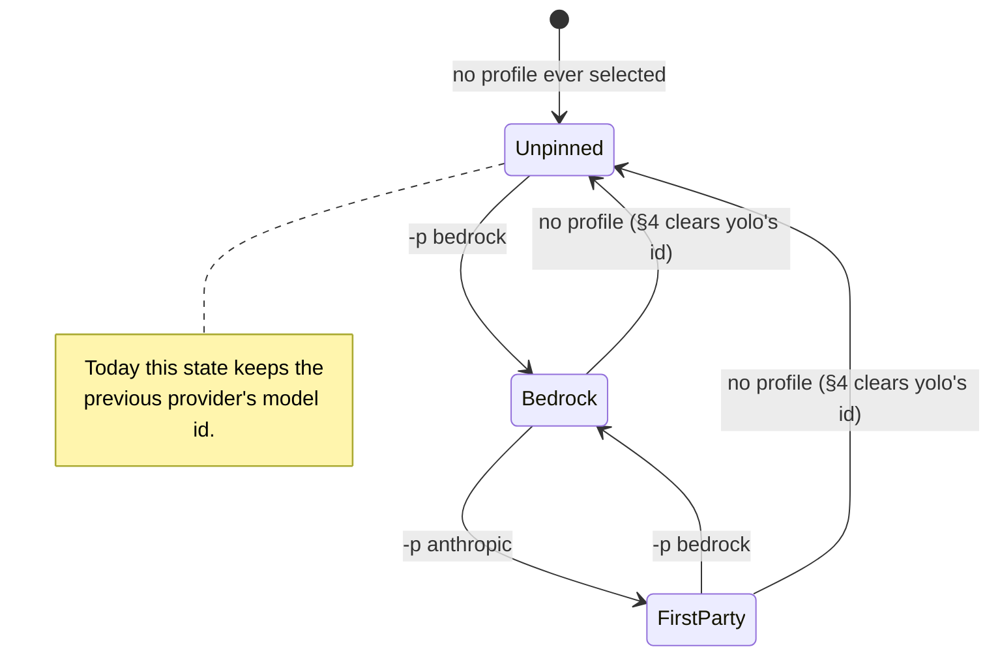

# Deselecting a profile clears the model id yolo wrote, and keeps the one you wrote

**The question this doc answers.** When a user stops selecting a profile, should yolo clear the
model id it wrote into the agent's config, and should it say so when it does?

**Status:** DESIGN, 2026-09-24. Nothing built. MEASURED: a null tombstone deletes through the
user's host file (`5e15b964`, 2026-09-20). Read from the tree 2026-09-24, not run:
`agentcfg.ApplySelection`'s not-selected arm still lifts the current value and never clears.
UNMEASURED: whether the clear holds on the launch *after* it, and whether plain omission would now
work ([§3](#3-what-happens-today)'s last note). Build step 1's test settles both. Code claims cite
a symbol, never a line.

**Where things stand.** Nothing here is built, and nothing here is ruled. The rule this revises is
[`OQ-CS2`](../reference/providers.md#oq-cs2) in the providers reference, which is ruled and
shipped. The alias and shipped-model questions that used to live here moved out on 2026-09-25
([Where the rest went](#where-the-rest-went)).

**Needs your ruling:**

- [`OQ-PS2`](#OQ-PS2): should deselecting clear the model id yolo wrote, and fall back to the
  `model` in your host config if you set one? Leaning: yes to both. "Never clear" was how
  [`OQ-CS2`](../reference/providers.md#oq-cs2)'s answer was implemented, not the answer itself.
  The mechanism (tombstone or omission) is the implementer's, chosen by build step 1's test, and
  it must keep a host-file value.
- [`OQ-PS4`](#OQ-PS4) 🤷: should the clear print a one-line notice? Leaning: genuinely your call,
  with a mild preference to print it.

**The most important section is [§4](#4-the-fourth-row-clear-what-yolo-wrote-keep-what-the-user-wrote).**
It covers the only live defect.

**Scope note.** This doc was split out of [`bedrock-plumbing.md`](bedrock-plumbing.md). Its
principle P1 ([§1 there](bedrock-plumbing.md#1-verdict-and-principles)) says an auth mode moves
its credential, environment and model ids together. That doc raised the problem and declined to
solve it. Nothing here is Bedrock-specific, and the fix lands in the provider system rather than
in a pack.

**Reads with:**

- [`../reference/providers.md`](../reference/providers.md), the mechanism this amends. See
  especially [Selection: write on activation, never on absence](../reference/providers.md#selection-write-on-activation-never-on-absence).
- [`model-lists-and-pickers.md`](model-lists-and-pickers.md), for aliases, first-party providers
  and shipped ids.
- [`provider-credential-scope.md`](provider-credential-scope.md), for which credentials reach
  which agent.

---

## Terms, in plain words

- **Provider.** A pack entry that describes one model service: where it lives, if it has a
  URL, and a `models` map from short aliases to that service's own model ids.
- **Profile.** A name you select (`yolo -p <name>`, or `use_profiles` in config) that picks one
  provider for an agent. Selecting a profile is how you tell yolo "this agent talks to that
  service".
- **Selection keys.** The config lines naming the provider and model an agent starts on: codex's
  `model_provider` + `model`, pi's `defaultProvider` + `defaultModel`, and opencode's `model`.
  yolo writes them only while a profile is selected.
- **Selection record.** A per-agent, per-file sidecar,
  `<workspace>/.yolo/prism/<agent>-<name>.selection.json`, holding what yolo's selection
  mechanism last wrote, key by key. It is how yolo tells its own value from yours.
- **Stateful render, computed layer, capture overlay.** At boot, yolo's *stateful render*
  rebuilds each agent config file from stacked layers. The *capture overlay* holds edits you made
  inside the jail, so they survive the rebuild. The *computed* layer is what packs' derive scripts
  emit, and it outranks both the capture overlay and your host file. See [`jail-home.md`](../reference/jail-home.md).
- **Null tombstone.** A JSON `null` in a layer, which the fold treats as "delete this key"
  ([RFC 7386](https://www.rfc-editor.org/rfc/rfc7386)).
- **Tier indirection** *(coined here)*. A user-typed, provider-relative model name that the agent
  itself resolves to a provider's id, such as Claude Code's `opus`.

---

## 1. The defect, and the principle behind it

Run `yolo -p bedrock -- codex`, and yolo writes a Bedrock provider and model id into
`~/.codex/config.toml`. Then run `yolo -- codex`. Both lines stay. Codex keeps asking for the
Bedrock model, because nothing ever removes what yolo wrote.

**The principle: deselection is a state, not the absence of one.** Today "no profile active"
means "whatever the last profile left behind". You reach that state by doing nothing, which is
why it is the one that bites.

---

## 2. Why claude needs no fix

The agents split on whether they have a tier indirection.

**Claude has one.** `/model opus` is provider-relative by design. The claude env derive
(`yolo.env("claude", …)` in `packs/claude/derive.lua`) emits `ANTHROPIC_MODEL` and the
`ANTHROPIC_DEFAULT_*_MODEL` variables *only while a provider is selected*. These are process
environment variables rebuilt every launch, and nothing is written to a file. So when you
deselect, the variables are simply absent, and Claude Code falls back to its own aliases. Two
later commits (`f7b14308`, 2026-09-15, and `caaaae1b`, 2026-09-16) made a profile's `model` option
pin every tier. That still happens only through the environment, so it vanishes on deselect too.

**Codex, pi and opencode have none.** yolo resolves the alias itself and writes a literal id into
a config file, through the reserved `selection` namespace. That file persists between launches.

| | claude | codex · pi · opencode |
| :--- | :--- | :--- |
| Who resolves the tier | the agent | yolo's derive |
| Where the id lives | a process env var, rebuilt per launch | a line in a config file, kept |
| What deselection does today | the var is not emitted: **correct** | the line stays: **the bug** |
| What is missing here | nothing | a clear |

> [!IMPORTANT]
> **Do not "fix" claude's half.** Its env path is already right, and a claude-side clear would be
> work with no defect under it. Claude's remaining gap is a missing `models` table, which is
> [`model-lists-and-pickers.md`](model-lists-and-pickers.md)'s business.

---

## 3. What happens today

`agentcfg.ApplySelection` decides each selection key once per launch. Its doc comment states the
contract, and its body implements it:

| Situation | Today | Right? |
| :--- | :--- | :--- |
| Key absent, selection names it | write it (activation) | yes |
| File value == what yolo last wrote, selection moved | write the new value | yes |
| File value != what yolo last wrote | keep the user's value | yes |
| Selection stops naming the key | **keep the file's value, keep the record** | **no** |

The code comment reads *"not selected → lift cur … never clear"* and cites
[`OQ-CS2`](../reference/providers.md#oq-cs2). That ruling was right about the danger it named: an
interactive `/model` choice must survive the next launch. But the rule it produced is broader than
that danger.
One behavior protects two different values. It protects **the user's** value, which must never be
touched, and **yolo's own** stale value, which nothing should protect. The selection record
already tells them apart, and row three uses it. Row four simply does not ask.

> [!WARNING]
> **Omitting the key is not clearing it**, as `ApplySelection`'s doc comment argues. The render
> rewrites the file wholesale, and the capture overlay may still hold the key's pre-yolo value.
> A key no layer asserts would fall back to that stale value instead of disappearing. So the
> design clears by lifting an explicit **null tombstone**, which `agentcfg.mergeValue` honors as a
> deletion.
>
> ⚠ **A tombstone deletes through every layer below it, the user's own host file included.**
> MEASURED 2026-09-20: three tombstones in `packs/claude/derive.lua` deleted a user's deliberate
> plugin enables on every boot (`5e15b964`). The selection lift lands on the computed layer, so
> a tombstone clear would also remove a `model` the user set in their **host** config: "clear"
> would mean the agent's built-in default, never the host value. [`OQ-PS2`](#OQ-PS2)'s leaning
> says that is not acceptable, so a tombstone that does this fails the ruling.

> [!NOTE]
> **UNMEASURED, found 2026-09-24 while rewriting this doc: the omission premise may be stale.**
> `ApplySelection`'s comment dates from `36dbc88e` (2026-09-02). Overlay narrowing,
> `agentcfg.narrowOverlay`, landed later in `7b0cc818` (2026-09-10). On every boot it drops overlay
> keys that the computed layer asserts, and it persists the narrowed overlay. Every boot since a
> key was selected has lifted that key onto the computed layer, so the overlay should no longer
> hold it. If so, two things follow.
>
> 1. A tombstone clear holds on the third launch, when no tombstone is lifted.
> 2. Plain omission might now work, and it would fall back to the user's host value instead of
>    deleting it.
>
> This is read from code and has not been run. Build step 1 tests both before choosing a
> mechanism.

---

## 4. The fourth row: clear what yolo wrote, keep what the user wrote

The proposal is one new branch in `ApplySelection`, keyed on the record it already holds. It runs
per key, so a provider-and-model pair clears as a pair:

| Situation, key not selected | New behavior |
| :--- | :--- |
| File value == the record (**yolo's own value**) | lift a **null tombstone**, and **drop the key from the record** |
| File value != the record (the user changed it) | lift the current value (unchanged) |
| No record for the key (yolo never wrote it) | lift the current value (unchanged) |
| Key absent from the file | nothing, except that the record entry is dropped |

**Dropping the record entry is what makes the clear safe.** If yolo cleared the key but
remembered the value, a user who later typed that same id by hand would lose it on the next
deselect. After a clear, yolo has no claim. That matches the rule the mechanism already follows
elsewhere: "a lost or corrupt record claims nothing".

This changes a ruled decision, so it is [`OQ-PS2`](#OQ-PS2) rather than a fiat.

`FirstParty` is a first-party provider entry, which does not exist yet. It is proposed in
[`model-lists-and-pickers.md`](model-lists-and-pickers.md#OQ-PS3). This doc only needs the arrows
back to `Unpinned`.

---

## 5. What this does not license

- **No clearing a value yolo did not write.** The record is the whole authority. No record means
  no claim, and a corrupt record means no claim either.
- **No touching claude's env path.** [§2](#2-why-claude-needs-no-fix)'s warning stands.
- **No cross-agent selection.** Each derive writes only its own agent's keys, and a selection is
  per CLI name. This matches the [`OQ-BR4`](provider-credential-scope.md#OQ-BR4) ruling (*"as
  specific as possible"*).
- **No new persistence.** The selection record already exists per surface and gains no fields.

---

## 6. Alternatives considered

| Alternative | Verdict |
| :--- | :--- |
| **Clear by omitting the key** instead of tombstoning it | **Rejected**, because the capture overlay re-supplies the stale value. ⚠ That premise may be stale ([§3](#3-what-happens-today)'s note), and if it is, this alternative is the better one. |
| **Always re-assert the selection every boot** | **Rejected.** It reverts an interactive `/model` on the next launch, which is the hazard [`OQ-CS2`](../reference/providers.md#oq-cs2) exists to prevent. |
| **Drop the record on deselect, keep the file value** | **Rejected.** The residue becomes permanent *and* unattributable: the next selection reads the stale id as the user's and refuses to move it. |
| **Refuse the launch when a config holds an id the selected provider's `models` does not contain** | **Rejected for v1 — reconsider later.** It would catch the residue loudly, but it also refuses every legitimate hand-picked model, which is most of them. It cannot see a mid-session `/model` switch either. The intent, an enforced allowlist, is now [`OQ-WG3`](wire-bridge-gateway.md#OQ-WG3) in the wire bridge, which sees every request. |
| **Document "always pass `-p`"** | **Rejected.** That rule would be enforced by memory. `use_profiles` in user config is the legitimate persistent form, and it is unaffected. |

---

## 7. Behavior this design fixes

**Degenerate inputs.** A key in the file with no record is never cleared and never claimed. A
record entry for a key absent from the file leaves nothing to clear, so the entry is dropped. An
empty `models` map produces no selection value and no clear.

**Failure paths.** An unreadable or corrupt record is treated as absent, so nothing is cleared.
That is the existing fail-safe. A failed tombstone write fails the render at the boot step and
refuses the jail. There is no partial apply, because the file is written wholesale.

**Concurrency and ordering.** The record is per workspace, per agent and per surface, and the
render writes it once per launch. Two concurrent launches are last-writer-wins on the record,
which is already true and already benign.

**Defaults, trigger, pre-existing state, one writer.** There are no new knobs, timeouts or
retries. The trigger is the stateful render, once per launch. There is no migration: the new
branch first runs on the first deselect after it ships. The selection mechanism stays the
record's only writer, and the clear only lets it give a key back.

**Forbidden.** Never clear a key the record does not hold. Never clear on a *changed* selection,
which is row three's job. Never emit a selection key for a provider whose catalog row the same
gate dropped.

**What done looks like.**

- **Done 1.** Run `yolo -p bedrock -- codex`, then `yolo -- codex`, then `yolo -- codex` again.
  After both later launches, `~/.codex/config.toml` has no `model` or `model_provider` key, and
  codex starts on its own default. The third launch is the UNMEASURED case from
  [§3](#3-what-happens-today).
- **Done 2.** Run the same sequence with a `/model` change in between. The user's id survives
  untouched.
- **Done 3.** Run the Done 1 sequence with a `model` set in the user's host
  `~/.codex/config.toml`. After the deselect, the jail's file holds that host value again, not
  the agent's default and not the Bedrock id.
- **Done 4.** Re-selecting after a clear writes the id again through the activation branch.

---

## 8. Risks

| Risk | Mitigation |
| :--- | :--- |
| **R1.** The clear surprises someone relying on today's stickiness: they used `-p` once and expected it to persist. | `use_profiles` is the supported persistent form, and it is unaffected. The clear goes in the release notes and is visible on the first deselect, not silently later. [`OQ-PS4`](#OQ-PS4)'s notice would make it visible in the moment. |
| **R2.** The new branch lands, and no test fails when its call site is deleted. This is the repo's recurring test shape. | The done-conditions are file-state assertions after a multi-launch sequence, which is where the call site (`internal/entrypoint/prism.go`) actually runs. |

---

## 9. What I would build, in order

- **Step 1. The fourth row** ([§4](#4-the-fourth-row-clear-what-yolo-wrote-keep-what-the-user-wrote)),
  with a multi-launch test. Select, deselect, launch again, and assert the keys are gone. Then
  select, hand-edit, deselect, and assert the edit survives. Run the tombstone and omission
  variants first, and keep whichever passes while also preserving a host-file value (Done 3). If
  neither does, stop and bring [`OQ-PS2`](#OQ-PS2) back rather than ship a clear that deletes
  the host value. It is the only defect here, and it depends on nothing else.
- **Step 2. Fold into [`providers.md`](../reference/providers.md) and retire this doc** through
  `system-doc`. The selection table there grows a row.

The pre-split doc's build steps 2 to 4 (the claude `models` map, the alias vocabulary and the
first-party providers) moved to [`model-lists-and-pickers.md`](model-lists-and-pickers.md).

---

## 10. Open Questions

1. 💬 **OQ-PS2: Should deselecting clear the id yolo wrote, which revises the
   providers ledger's fourth rule?** Today the fourth row keeps whatever the file holds. The
   proposal narrows "never clear" to "never clear the user's value", using the record already on
   disk. Stakes: this is the live defect, and it changes a ruled decision on a shipped mechanism.
   It hides a user-visible sub-question: what "clear" returns to when you set a `model` in your
   host config. A tombstone deletes that host value, so "clear" would mean the agent's built-in
   default. Omission, if [§3](#3-what-happens-today)'s UNMEASURED note holds, falls back to your
   host value. This ruling decides which behavior is right, and the test then picks a mechanism
   that delivers it.

   <!-- vantage: oq id=OQ-PS2 leaning="Revise it, and yes to both halves. OQ-CS2 answered 'must an interactive /model survive the next launch?' — yes, and the record already distinguishes that case. 'Never clear' was the implementation of that answer, not the answer, and it protects yolo's own stale value as a side effect nobody chose. 'Clear' means return to what you had before yolo wrote anything: your host config's model if set, else the agent's default. The mechanism (tombstone or omission) is the implementer's, chosen by build step 1's test; one that deletes a host-file value fails this ruling." -->

   _Leaning:_ Revise it. [`OQ-CS2`](../reference/providers.md#oq-cs2) answered "must an
   interactive `/model` survive the next launch?" The answer was yes, and the record already
   distinguishes that case. "Never clear" was the implementation of that answer, not the answer
   itself, and it protects yolo's own stale value as a side effect nobody chose. "Clear" means
   return to what you had before yolo wrote anything: your host config's `model` if set, else
   the agent's default. The mechanism (tombstone or omission) is the implementer's, chosen by
   build step 1's test. A mechanism that deletes a host-file value fails this ruling.

   **Answer:**
   > _(empty — fill in when decided)_

2. 💬 🤷 **OQ-PS4: Should a deselect that clears a key say so on stderr?** The
   clear is otherwise invisible: a file loses a line between two launches. A one-line notice
   ("cleared the `model` yolo set for profile `bedrock`") makes it legible. Because the clear drops
   the record entry, the notice fires on exactly one launch per deselect, not on every later one.
   Stakes: only how loud the transition is.

   <!-- vantage: oq id=OQ-PS4 leaning="Genuinely your call. I would print it: it fires on one launch per deselect, and a silent config change is the thing this doc is complaining about. But it is noise on a routine path, and I have no technical argument either way." -->

   _Leaning:_ Genuinely your call. I would print it, because it fires on one launch per deselect
   and a silent config change is the thing this doc is complaining about. But it is noise on a
   routine path, and I have no technical argument either way.

   **Answer:**
   > _(empty — fill in when decided)_

---

### Decision Ledger

No question in this doc is ruled yet. These pointer rows record rulings made elsewhere that shape
it:

| ID | Ruling / Decision | Date | Settled in | Built |
| :--- | :--- | :--- | :--- | :--- |
| OQ-CS2 | **Never write the selection key when no profile is active**, because an interactive in-agent choice must survive the next launch. This is the rule [`OQ-PS2`](#OQ-PS2) would narrow. | undated there | [providers.md](../reference/providers.md#oq-cs2) | yes |
| OQ-PS3 | **Answered by the [`OQ-BR3`](model-lists-and-pickers.md#OQ-BR3) ruling**, which says to ship model defaults in a built-in pack. The row lives in [model-lists-and-pickers.md](model-lists-and-pickers.md#OQ-PS3). | 2026-09-25 | [`model-lists-and-pickers.md`](model-lists-and-pickers.md#OQ-PS3) | — |

---

## Where the rest went

Moved on 2026-09-25. Each anchor is kept here so inbound links resolve.

- [**OQ-PS1**](#OQ-PS1) (does claude's derive move to capability aliases?) →
  [`model-lists-and-pickers.md#OQ-PS1`](model-lists-and-pickers.md#OQ-PS1).
- [**OQ-PS3**](#OQ-PS3) (does yolo ship model ids?) →
  [`model-lists-and-pickers.md#OQ-PS3`](model-lists-and-pickers.md#OQ-PS3), answered there by the
  [`OQ-BR3`](model-lists-and-pickers.md#OQ-BR3) ruling.
- [**OQ-PS5**](#OQ-PS5) (which credentials a profile lets reach an agent) →
  [`provider-credential-scope.md`](provider-credential-scope.md), split out 2026-09-22. It uses a
  different mechanism: the launch's env channel in
  [`userenv.go`](../../internal/cli/run/userenv.go), not selection. Its live questions are
  [`OQ-CN1`](provider-credential-scope.md#OQ-CN1) through
  [`OQ-CN6`](provider-credential-scope.md#OQ-CN6).
- **The shared tier vocabulary** (`default`/`fast`/`balanced`), **first-party
  providers**, the pre-split doc's **principle P2**, the no-catalog and open-vocabulary
  non-goals, the "canonical translation table" alternative, the "provider declaring only
  `default` warns" behavior, and the pre-split doc's done-conditions 3 and 4, risks R2 and R3
  and build steps 2 to 4 all went to [`model-lists-and-pickers.md`](model-lists-and-pickers.md).
  This doc's own numbering restarted after the split.
- **The "refuse the launch on an id outside the provider's `models`" alternative** stays in
  [§6](#6-alternatives-considered), where it is still rejected as a launch-time check. Its intent,
  an enforced model allowlist, moved to the wire bridge as
  [`OQ-WG3`](wire-bridge-gateway.md#OQ-WG3).

---

## 11. Evidence

Code, re-verified 2026-09-24. Each claim names the symbol or file that carries it, so it survives
an edit elsewhere in the file:

| Claim | Anchor |
| :--- | :--- |
| The four-row selection contract, stated | `agentcfg.ApplySelection`'s doc comment (`internal/agentcfg/selection.go`) |
| The not-selected branch keeps the file value and the record | the `case !selected:` arm of `agentcfg.ApplySelection` |
| Why omission was judged not to clear (wholesale rewrite + capture overlay) | `agentcfg.ApplySelection`'s doc comment, from `36dbc88e` (2026-09-02) |
| The overlay is narrowed against the computed layer every boot | `agentcfg.narrowOverlay` and its call in `internal/agentcfg/staterender.go`, from `7b0cc818` (2026-09-10) |
| Null tombstones delete a key through every lower layer | `agentcfg.mergeValue` (`internal/agentcfg/engine.go`); the `LiteralNulls` field comment in `internal/agentcfg/compose.go`; `5e15b964` |
| The selection lift lands on the computed layer | `agentcfg.ApplySelection`'s call site in `internal/entrypoint/prism.go` |
| claude emits its model vars only from a selected provider | `yolo.env("claude", …)` in `packs/claude/derive.lua` |
| packs/claude's `bedrock` provider declares no `models` | the `kind: "provider"` entry named `bedrock` in `packs/claude/pack.json` |
| The id-writing selection keys | the `selection` table returned by `packs/codex/derive.lua` (`model_provider`, `model`), `packs/pi/derive.lua` (`defaultProvider`, `defaultModel`) and `packs/opencode/derive.lua` (`model`) |
| Selection record path | `<workspace>/.yolo/prism/<agent>-<name>.selection.json` |

Vendor, 2026-09-04: Claude Code's aliases resolve per provider, which is what
`ANTHROPIC_DEFAULT_OPUS_MODEL` and its siblings exist to repoint
([model configuration](https://code.claude.com/docs/en/model-config)).
