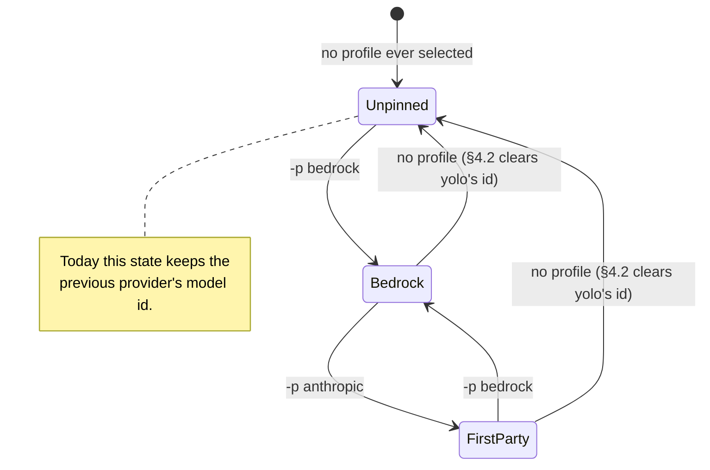

# The same model has a different name in every provider — and switching leaves the old one behind

**Status:** DESIGN SKETCH, 2026-09-04. Nothing built. Code claims verified against
`f604c6b2`.

**The short version.** A model id is provider-local — `claude-opus-5` on the first-party
API, `us.anthropic.claude-opus-5` on Bedrock, `openai.gpt-5.6-sol` on Bedrock Mantle,
`global.openai.gpt-5.6-sol` on Bedrock Runtime — so every provider switch is really a
*rename*, and yolo only does half of it. The provider system already has the right
primitive (`models: {alias → id}`, resolved per agent in its own derive); what it is
missing is three things. **One**, an alias vocabulary shared across providers, so `-p a`
and `-p b` resolve the same word to each side's own id. **Two**, a fourth row in the
selection state machine: deselecting a profile currently *keeps* the id yolo wrote, so the
agent goes on asking a new endpoint for the old provider's model. **Three**, a first-party
provider entry per agent, so "switch back" is a named selection rather than an absence.

**The most important section is §4.2** — the missing state-machine row is the only part
that is a live defect rather than a convenience.

**Scope note.** This doc was split out of
[`bedrock-plumbing.md`](bedrock-plumbing.md), which raised the problem in its P1 and then
correctly refused to solve it: nothing here is Bedrock-specific, and the fix lands in the
provider system, not in a pack.

**Reads with:** [`../reference/providers.md`](../reference/providers.md) (the mechanism
this amends — especially "Selection: write on activation, never on absence"),
[`bedrock-plumbing.md`](bedrock-plumbing.md) (the motivating case, and the second consumer
of a shared alias vocabulary).

---

## 1. Verdict and principles

**Make the tier the thing a human types, make the provider entry own the translation, and
make deselection a real transition rather than a no-op.**

**P1. An auth mode is a bundle of `{credential channel, environment, model ids}`, and the
three move together.** Inherited verbatim from `bedrock-plumbing.md` §1, which inherited it
from the 2026-05 Teams switch on this machine: the credential and the env moved, the
Bedrock-shaped model pin stayed, and the failure arrived later as a 404 on an unknown model
rather than as an auth error. Every rule below is this principle applied to one more place
the id can hide.

**P2. A human names a capability; a provider names a model.** `opus` and `fast` are things
a person means. `us.anthropic.claude-opus-5` is a thing a service calls something. If the
person has to type the second, the abstraction has failed, and it fails exactly at the
moment they switch — which is the moment they are least likely to notice.

**P3. Deselection is a state, not the absence of one.** Today "no profile active" means
"whatever the last profile left behind." That is not neutral, and it is the one state a
user reaches by *doing nothing*, which is why it is the one that bites.

---

## 2. Two shapes of the problem, and only one of them is a bug

The agents split cleanly by whether they have a **tier indirection** *(coined here: a
user-typed, provider-relative model name the agent itself resolves to a provider's id)*.

**Claude has one.** `--model opus` / `/model opus` is provider-relative by design, and
Claude Code resolves the alias differently per provider — the documented consequence being
that on Bedrock `--model sonnet` reaches an *older* Sonnet than the same word does on the
first-party API. `ANTHROPIC_DEFAULT_OPUS_MODEL` / `_SONNET_MODEL` / `_HAIKU_MODEL` exist
precisely to repoint an alias, and `packs/claude/derive.lua:64-79` already emits all three
from the selected provider's `models` map.

**Codex, pi and opencode have none.** yolo resolves the alias itself and writes a literal
id into their config — `model` in `config.toml`, `defaultModel` in pi's `settings.json`,
`model = "provider/id"` in `opencode.json` — through the reserved `selection` namespace.

That difference decides where each half of the fix lands:

| | claude | codex · pi · opencode |
| :--- | :--- | :--- |
| Who resolves the tier | the agent | yolo's derive |
| Where the id lives | a process env var | a line in a config file |
| What deselection does today | the var is not emitted — **correct** | the line stays — **the bug** |
| What is missing | a shipped `models` map, and a shared alias vocabulary | the above, plus a clear |

> [!IMPORTANT]
> **Do not "fix" claude's half.** Its env path is already right: no provider selected means
> no `ANTHROPIC_DEFAULT_*_MODEL` emitted, which means Claude Code falls back to its own
> per-provider aliases. Adding a claude-side clear would be work with no defect under it.
> The claude gap is a missing table, not a missing transition.

---

## 3. What happens today, precisely

`packs/claude/pack.json:121-124` ships the `bedrock` provider with **no `models` map at
all**. So the alias machinery that would make `opus` mean the right thing on both sides has
nothing to read: `packs/claude/derive.lua:71-79` emits nothing, and the user is back to
typing ids. That is the whole of the claude problem — a missing three-line table, not a
missing mechanism.

The other three share a state machine that is deliberate, documented, and one row short.
`internal/agentcfg/selection.go:138-147` states the contract; `:152-204` implements it:

| Situation | Today | Right? |
| :--- | :--- | :--- |
| Key absent, selection names it | write it (activation) | yes |
| File value == what yolo last wrote, selection moved | write the new value | yes |
| File value != what yolo last wrote | keep the user's value | yes |
| Selection stops naming the key | **keep the file's value, keep the record** | **no** |

The fourth row is where the residue comes from, and the code comment says so in as many
words: *"not selected → lift cur … never clear (OQ-CS2)"*. OQ-CS2 was right about the
danger it named — an interactive `/model` choice must survive the next launch — but the
rule it produced is broader than the danger. It protects two different values with one
behaviour: **the user's** value, which must never be touched, and **yolo's own** stale
value, which nothing should be protecting.

The information needed to tell them apart is already on disk. The selection record
(`<workspace>/.yolo/prism/<agent>-<name>.selection.json`) holds exactly "what yolo's
selection mechanism last wrote, per key", and the third row above already uses it to
distinguish the two cases. The fourth row simply does not ask.

> [!WARNING]
> **Omitting the key is not clearing it.** The stateful render rewrites the file wholesale
> from its layers, and the capture overlay may still hold the key's pre-yolo value — so a
> key no layer asserts falls back to that stale value rather than disappearing
> (`selection.go:116-123` explains this at length; it is why deactivation lifts the current
> value rather than dropping it). A clear must lift an explicit RFC-7386 **null tombstone**,
> which the fold already honours as a deletion (`internal/agentcfg/compose.go:396`).

---

## 4. The proposal

### 4.1 A shared tier vocabulary

Alias names are open vocabulary today and the reference doc says so deliberately: *"which
aliases a provider's consumers read is the consumer's business."* That stays true for
*extra* aliases. What is missing is a small **conventional core** every provider is expected
to declare, so one profile swap means one thing:

| Alias | Means | Today |
| :--- | :--- | :--- |
| `default` | what you get when nothing is said | zai, and every derive's fallback |
| `fast` | cheap and quick | zai only |
| `balanced` | the middle tier, where one exists | nowhere |

Three names, capability-shaped rather than vendor-shaped, because a vendor tier name
(`sonnet`, `terra`) cannot survive a switch to another vendor. This is a **convention with a
warning**, not an enum: a provider missing one gets a launch warning naming which, and
nothing is refused — the same tolerance the open `endpoints` key set has, for the same
version-skew reason.

The one place it bites is claude, whose derive reads the *vendor* aliases `sonnet` and
`haiku` literally (`derive.lua:74-79`). The proposal is that it read `balanced` → SONNET and
`fast` → HAIKU, keeping `sonnet`/`haiku` as accepted synonyms so no existing user config
breaks. **OQ-PS1.**

### 4.2 The fourth row: clear what yolo wrote, keep what the user wrote

One new branch in `ApplySelection`, keyed on the record it already holds:

| Situation, key not selected | New behaviour |
| :--- | :--- |
| File value == the record — **yolo's own value** | lift a **null tombstone**, and **drop the key from the record** |
| File value != the record — the user changed it | lift the current value (unchanged) |
| No record for the key — yolo never wrote it | lift the current value (unchanged) |
| Key absent from the file | nothing (unchanged) |

Dropping the record entry alongside the clear is not tidiness — it closes the one edge the
naive version opens. If yolo cleared the key but *remembered* the value, a user who later
typed that same id by hand would find it silently eaten by the next deselect. After a clear,
yolo has no claim, which is the safe direction the mechanism already prefers everywhere
else ("a lost or corrupt record claims nothing").

This is a change to a ruled decision, so it is **OQ-PS2**, not a fiat — but the ruling it
revises answered a narrower question than the rule it produced.

### 4.3 First-party providers, so "off" is rarely the transition

With §4.2 in place, deselecting is safe. It is still not *useful*: it drops the agent to
whatever defaults it has, which is rarely what someone switching between two accounts wants.
The complete answer is that both sides of a switch are named:

```jsonc
// packs/claude — the shape, not the file
{ "kind": "provider", "name": "anthropic",
  "models": { "default": "…", "balanced": "…", "fast": "…" } },
{ "kind": "profile",  "name": "anthropic", "provider": "anthropic" }
```

An endpoint-less provider, exactly like `bedrock` — the first-party endpoint is the client's
own default, so there is no URL to state, and no `api_key_env_name`, so the credential
preflight demands nothing. `-p anthropic` ↔ `-p bedrock` then swaps a whole bundle in one
word, and every id lives in a table rather than in someone's memory. **OQ-PS3** asks whether
yolo ships the ids or only the empty shape.



---

## 5. What this does not license

- **No model catalog in core.** The tier vocabulary is three *names*; the ids behind them
  stay in provider entries a user can replace.
- **No clearing a value yolo did not write.** The record is the whole authority. No record,
  no claim — and a corrupt or missing record means no claim either.
- **No touching claude's env path.** §2's warning stands.
- **No closing the alias vocabulary.** `default`/`fast`/`balanced` are a convention with a
  warning; a provider declaring `sol` as well is a provider with four aliases, not an error.
- **No cross-agent selection.** Each derive still writes its own agent's keys, and a
  selection is still per CLI name.
- **No new persistence.** The selection record already exists, is already per surface, and
  gains no new fields.

---

## 6. Alternatives considered

| Alternative | Verdict |
| :--- | :--- |
| **Clear on deselect by omitting the key** rather than tombstoning it | **Rejected — does not work.** The capture overlay re-supplies the stale value; `selection.go:116-123` documents exactly this. |
| **Always re-assert the selection every boot**, making the file yolo's outright | **Rejected.** It reverts an interactive `/model` on the next launch — the hazard OQ-CS2 exists to prevent, and the reason the record mechanism was built. |
| **Drop the record entirely on deselect, keep the file value** | **Rejected.** It makes the residue permanent *and* unattributable: the next selection would then read the stale id as the user's and refuse to move it. |
| **A canonical model-name translation table in core** (one id per model, per provider) | **Rejected as the catalog §5 forbids.** It is the `wire_api` enum mistake at model granularity: yolo would own a mapping that changes weekly and is wrong silently. |
| **Leave it, and document "always pass `-p`"** | **Rejected.** It is a rule enforced by memory, at the exact moment memory fails. `use_profiles` in user config is the legitimate version of this and is unaffected. |
| **Refuse the launch when a config holds an id the selected provider's `models` does not contain** | **Rejected for v1 — reconsider later.** It would catch the residue loudly, but it also refuses every legitimate hand-picked model, which is most of them. |

---

## 7. Behaviour this design fixes

**Degenerate inputs.** No record and a key in the file → never cleared, never claimed. A
record for a key absent from the file → nothing to clear; the record entry is dropped so
yolo stops claiming it. An empty `models` map → no selection value, no clear, unchanged.
A provider declaring only `default` → warning naming `fast` and `balanced`; launch proceeds.

**Failure paths.** Record unreadable or corrupt → treated as absent: nothing is cleared and
nothing is claimed, which is the existing fail-safe. Tombstone write fails → the render
fails as any render failure does, at the boot step, refusing the jail; there is no partial
apply because the file is written wholesale.

**Concurrency and ordering.** The record is per workspace, per agent, per surface, written
once per launch by the render. Two concurrent launches on one workspace are last-writer-wins
on the record, which is already true and already benign — the loser's next boot reads the
winner's record and claims nothing it should not.

**Defaults, with units.** No new knobs, no timeouts, no retries. The alias vocabulary
defaults to warning-only. The tier names are `default`, `fast`, `balanced` — strings, not an
enum.

**Trigger.** The stateful render, once per launch, as today. Nothing new watches anything.

**Pre-existing state.** Every jail already carrying a selection record is handled by the
existing branches; the new branch only fires on the *next* launch that has no selection for
a key the record holds. There is no migration and nothing to rewrite — the first deselect
after this ships is the first time the new row runs.

**One writer.** The selection record is written only by the selection mechanism, as its own
docstring insists. The clear does not change that; it only lets the mechanism give a key
back.

**Forbidden.** Never clear a key the record does not hold. Never clear on a *changed*
selection (that is row three's job). Never write a tier→id table into core. Never emit a
selection key for a provider whose catalog row the same gate dropped.

**What done looks like.**
1. `yolo -p bedrock -- codex`, then `yolo -- codex`: `~/.codex/config.toml` has no `model`
   key, and codex starts on its own default rather than on a Bedrock id.
2. Same sequence with a `/model` change in between: the user's id survives untouched.
3. `-p anthropic` and `-p bedrock` on claude both put the *same tier word* on the right id,
   with no hand-editing between them.
4. A provider declaring only `default` produces one warning naming the two missing aliases,
   and a working launch.
5. Re-selecting after a clear writes the id again through the activation branch.

---

## 8. Risks

| Risk | Mitigation |
| :--- | :--- |
| **R1.** The clear surprises someone relying on today's stickiness — they used `-p` once and expected it to persist. | `use_profiles` in user config is the supported persistent form and is unaffected. The clear is announced in release notes and is observable on the first deselect, not silently later. |
| **R2.** Renaming claude's `sonnet`/`haiku` aliases to `balanced`/`fast` breaks a user config that already declares the old names. | Synonyms, not a rename: the derive reads the new names and falls back to the old. §4.1 says so; a test should pin both. |
| **R3.** Shipping first-party model ids (§4.3) puts a model list in the repo that rots. | The same answer `bedrock-plumbing.md` OQ-BR3 gives: they are defaults, overridable in two lines, and dated in the pack README. OQ-PS3 may rule them out entirely. |
| **R4.** The new branch is added and no test fails when its call site is deleted — this repo's recurring test shape. | The done-conditions are file-state assertions after a two-launch sequence, which is where the call site actually lives. |

---

## 9. What I would build, in order

1. **The fourth row** (§4.2) with a two-launch test: select, deselect, assert the key is
   gone; and select, hand-edit, deselect, assert the edit survives. It is the only defect
   here and it is independent of everything else.
2. **The `models` map for packs/claude's `bedrock` provider** (§3) — the claude half, three
   lines, no code.
3. **The alias vocabulary** (§4.1): the warning, the claude derive's synonym reading, and a
   line in `providers.md` naming the three.
4. **First-party providers** (§4.3) for claude, and for any other agent whose first-party
   endpoint has ids worth naming.
5. **Fold into `docs/reference/providers.md`** — the selection table there grows a row, and
   this doc retires via `system-doc`.

---

## 10. Open Questions

1. 💬 **OQ-PS1: Does claude's derive move to capability aliases?** It reads the vendor names
   `sonnet` and `haiku` literally today. The proposal is to read `balanced` and `fast`,
   keeping the old names as synonyms. Stakes: whether one alias vocabulary spans every
   provider, or claude keeps a dialect of its own and a `-p` swap means something slightly
   different there.

   <!-- vantage: oq id=OQ-PS1 leaning="Move, with synonyms. A vendor tier name cannot survive a switch to another vendor, which is the whole problem this doc is about; and synonyms make the move free for anyone's existing config." -->

   _Leaning:_ Move, with synonyms. A vendor tier name cannot survive a switch to another
   vendor — which is the whole problem this doc is about — and synonyms make the move free
   for existing config.

   **Answer:**
   > _(empty — fill in when decided)_

2. 💬 **OQ-PS2: Clear on deselect — revise OQ-CS2?** The selection state machine's fourth
   row currently keeps whatever the file holds. The proposal narrows "never clear" to "never
   clear the user's value", using the record already on disk. Stakes: this is the live
   defect. It is also a change to a ruled decision on a shipped mechanism, and the ruling it
   revises was made for a real hazard.

   <!-- vantage: oq id=OQ-PS2 leaning="Revise it. OQ-CS2 answered 'must an interactive /model survive the next launch?' — yes, and the record already distinguishes that case. 'Never clear' was the implementation of that answer, not the answer, and it protects yolo's own stale value as a side effect nobody chose." -->

   _Leaning:_ Revise it. OQ-CS2 answered "must an interactive `/model` survive the next
   launch?" — yes, and the record already distinguishes that case. "Never clear" was the
   implementation of that answer, not the answer itself, and it protects yolo's own stale
   value as a side effect nobody chose.

   **Answer:**
   > _(empty — fill in when decided)_

3. 💬 **OQ-PS3: Does yolo ship the model ids, or only the empty provider shape?** §4.3's
   first-party provider and §3's `bedrock` `models` map both mean shipping literal ids that
   change on someone else's schedule — and for Bedrock they carry a geographic prefix
   (`us.` / `eu.` / `global.`) whose availability I did **not** verify for Anthropic models
   in this pass. Stakes: shipped ids make `-p bedrock` work on first use; empty ones make it
   a two-step setup but keep yolo out of the catalog business §5 forbids.

   <!-- vantage: oq id=OQ-PS3 leaning="Ship them, dated, in the pack README — but verify the Anthropic-on-Bedrock geo prefixes first, because an unverified prefix is exactly the 404-on-unknown-model failure P1 describes. If that verification is inconvenient, ship the shape empty and document the two lines." -->

   _Leaning:_ Ship them, dated, in the pack README — but verify the Anthropic-on-Bedrock geo
   prefixes first, because an unverified prefix is exactly the 404-on-unknown-model failure
   P1 describes. If that verification is inconvenient, ship the shape empty and document the
   two lines instead.

   **Answer:**
   > _(empty — fill in when decided)_

4. 💬 🤷 **OQ-PS4: Should a deselect that clears a key say so on stderr?** The clear is
   invisible: a file loses a line between two launches. A one-line notice ("cleared the
   `model` yolo set for profile `bedrock`") makes it legible; it also adds noise to every
   launch after a profile is dropped. Stakes: purely how loud the transition is.

   <!-- vantage: oq id=OQ-PS4 leaning="Genuinely your call. I would print it once, because a silent config change is the thing this whole doc is complaining about — but it is noise on a path people will hit routinely, and I have no technical argument either way." -->

   _Leaning:_ Genuinely your call. I would print it, because a silent config change is the
   thing this doc is complaining about — but it is noise on a routine path, and I have no
   technical argument either way.

   **Answer:**
   > _(empty — fill in when decided)_

---

## 11. Evidence

Code, verified 2026-09-04 against `f604c6b2`:

| Claim | Anchor |
| :--- | :--- |
| The four-row selection contract, stated | `internal/agentcfg/selection.go:138-147` |
| The `!selected` branch keeps the file value and the record | `internal/agentcfg/selection.go:168-174` |
| Why omission is not clearing (wholesale rewrite + capture overlay) | `internal/agentcfg/selection.go:116-123` |
| Null tombstones delete a key in the fold | `internal/agentcfg/compose.go:396` |
| claude emits the three `ANTHROPIC_DEFAULT_*_MODEL` vars from `models` | `packs/claude/derive.lua:64-79` |
| packs/claude's `bedrock` provider declares no `models` | `packs/claude/pack.json:121-124` |
| The three id-writing selection keys | `packs/codex/derive.lua:158-168`, `packs/pi/derive.lua:167-181`, `packs/opencode/derive.lua:118-140` |
| Selection record path | `<workspace>/.yolo/prism/<agent>-<name>.selection.json` |

Vendor, 2026-09-04: Claude Code's `opus`/`sonnet` aliases resolve per provider, and resolve
to *older* models on Bedrock than on the first-party API — which is what
`ANTHROPIC_DEFAULT_OPUS_MODEL` / `_SONNET_MODEL` exist to repoint
([model configuration](https://code.claude.com/docs/en/model-config),
[Claude Code model configuration](https://support.claude.com/en/articles/11940350-claude-code-model-configuration)).
Claude Code 2.1.261 is the version installed in this jail. The Bedrock id spellings are
sourced in [`bedrock-plumbing.md`](bedrock-plumbing.md) §14; the Anthropic-on-Bedrock
geographic prefix set is **not** verified here and is OQ-PS3's blocker.
