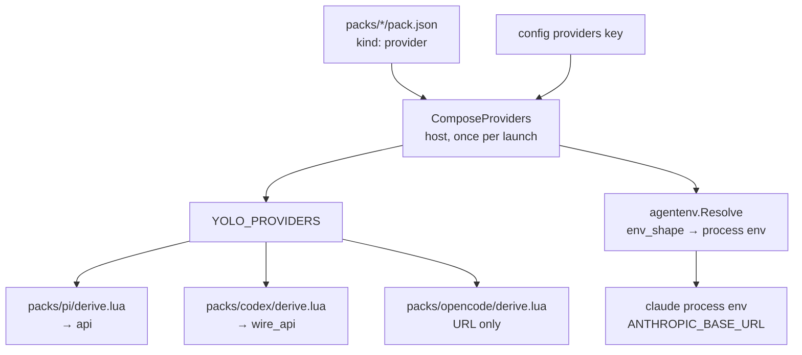

# The provider table is checked in yolo's vocabulary and delivered in everyone else's

**Status:** DECIDED, 2026-09-01 — every open question ruled (ledger, §11); nothing built. Written
against `980aed71`. **D9 (§5.6) is the one finding that outgrew this doc**: it belongs to
[`trust-paths.md`](trust-paths.md)'s census, not here.

**The short version.** The provider/profile design that shipped between `15688da1` and
`980aed71` is architecturally right and unusually well tested — I mutated two production call
sites and both failed loudly. What it got wrong is at the **edges of the abstraction, not
inside it**. `wire_api` is a closed enum, single-sourced, skew-tolerant, validated at both the
manifest and config layers — and its four values match **no agent's actual vocabulary**, while
the derives pass them through verbatim. The same shape recurs twice more: the composed provider
table can hold a `base_url`/`endpoints` pair that the config validator refuses when a user
writes it directly, and `packs/zai` now spells one endpoint URL twice with nothing pinning the
two copies equal. All three are **the abstraction being internally consistent and externally
unchecked**, and §3.0a takes it one step further: the enum is not four protocols but three, with
chat completions spelled twice. **Six** further defects share no cause with those (§5) — the
largest of them conceptual, and raised in review rather than found in the code: the word "profile"
names three different things, only one of which a user can override, and `packs/zai`'s own
`kind: "profile"` declaration is measurably a no-op — and, review found, **structurally unreachable**,
because a variant activates only through a CLI its own pack installs (§5.4).

> [!IMPORTANT]
> **The most important section is [§3](#3-d1--the-wire_api-enum-names-nobodys-protocol).** It is
> the only defect here that puts a wrong value into a file an agent reads, and the evidence
> refuting it was already in this repo before the value was chosen.

**Reads with:** [`profiles-as-pack-variants.md`](profiles-as-pack-variants.md) (the parent
design — this doc reports back against its §4.1 provider schema and §6.2 preflight),
[`zai-plumbing.md`](zai-plumbing.md) (the first consumer — its §5 resolution table is where the
dialect assumption is written down),
[`reference-mismatch-diagnostics.md`](reference-mismatch-diagnostics.md) (§7 step 3 is where the
four `wire_api` values were minted; this doc is its follow-on, not its contradiction),
[`local-model-endpoints.md`](../research/local-model-endpoints.md) (the source-verified
vocabulary evidence, §"Codex CLI" and §"pi"),
[`stringly-typed-references-principle.md`](stringly-typed-references-principle.md) (the principle
D1 shows is only half-applied),
[`provider-catalog-and-selection.md`](provider-catalog-and-selection.md) (the sibling this doc's
§5.4 spawned — populating an agent's provider directory and telling it which provider to USE are
two features, and only the first ships for three agents of four).

---

## 1. Verdict, and the two principles it turns on

**Verdict: the mechanism stays; the delivery end grows a translation seam.** No new contribution
kind, no schema change to `kind: "provider"`, no change to how the table composes or crosses to
the jail. What changes is that the four consumers stop reading yolo's vocabulary as if it were
their own, and the composed table gains one resolution rule it currently lacks.

Two principles, numbered so §3–§6 and any sibling doc can cite them:

**P1. A closed enum is only closed at the end that enforces it.** A value yolo validates against
its own list and then writes verbatim into a third party's config file is not type-safe — it is
type-safe against a type nobody else holds. Either the enum is the union of the consumers'
vocabularies **and** each consumer translates, or it is a free string. What it may not be is a
closed set that looks translated and is not.

**P2. A rule enforced on one layer of a merge must hold on the merge's output.** The config
validator refuses `base_url` and `endpoints` in one user-written provider entry. Composition can
produce exactly that entry from two inputs that are each legal. A rule that the composer can
manufacture a violation of is a lint, not an invariant.

> [!NOTE]
> **This doc is a report, not a retraction.** Everything in
> [`profiles-as-pack-variants.md`](profiles-as-pack-variants.md) and
> [`zai-plumbing.md`](zai-plumbing.md) that those docs claim to have measured, I re-measured and
> it holds. The provider kind cannot express a credential, the skew handling is right at all
> three levels, the backend-parity repairs are real, and `d1e45e8d`'s reasoning about not
> duplicating a provider fact into a config patch is correct — §4.2 is where a sibling commit
> then did the thing that commit declined to do.

---

## 2. What ships today — the delivery chain, measured

Verified against the tree at `980aed71`, **2026-09-01**.

One table is composed once on the host
([`internal/packload/providers.go:39`](../../internal/packload/providers.go#L39),
`ComposeProviders`) — pack-shipped `kind: "provider"` facts under the user's `providers` entries,
merged per field. That table crosses to the jail as `YOLO_PROVIDERS` and reaches **four
consumers that never re-validate it**:



Two facts about this chain decide everything below.

**First, the four consumers disagree about how to find an address.** The three derives prefer the
single-protocol `base_url` shorthand and fall back to `endpoints.openai`
([`packs/pi/derive.lua:12-20`](../../packs/pi/derive.lua#L12) and its codex/opencode twins).
`agentenv.providerVars` reads **`endpoints[protocol]` only** and never looks at the shorthand
([`internal/agentenv/agentenv.go:121`](../../internal/agentenv/agentenv.go#L121)). Nothing
reconciles them.

**Second, `wire_api` crosses verbatim.** `packs/codex/derive.lua:53` emits
`wire_api = wireApi or prov.wire_api or "openai-chat"` and `packs/pi/derive.lua:41` emits
`api = wireApi or prov.wire_api or "openai-completions"`. Neither maps yolo's value to the
agent's. The field's own doc comment
([`internal/packdecl/contributes.go`](../../internal/packdecl/contributes.go), `ProviderEndpoint.WireAPI`)
states the hazard exactly — *"the value crosses into the agents' config files verbatim, so a typo
here is a protocol error at first request"* — and then the enum is checked against
`knownWireAPIs` ([`contributes.go:1438`](../../internal/packdecl/contributes.go#L1438)), which is
yolo's list.

---

## 3. D1 — the `wire_api` enum names nobody's protocol

**Defect D1** *(the term "defect" is used here in the roadmap's sense — a shipped behaviour that is
wrong, as opposed to an unbuilt want)*.

`knownWireAPIs` is `{anthropic, openai-chat, openai-completions, responses}`. Set that beside the
consumers' own vocabularies:

| Consumer | Field it writes | Values that agent accepts | Source |
| :--- | :--- | :--- | :--- |
| codex | `model_providers.<id>.wire_api` | `responses` **only** — `chat` was removed from the product | [`local-model-endpoints.md`](../research/local-model-endpoints.md) §"Codex CLI", *verified from source: codex-cli 0.145.0 binary, strings @0x7B7B47, 2026-08-20* |
| pi | `providers.<id>.api` | `openai-completions`, `openai-responses` attested; `openai-chat` attested nowhere | research doc §"pi" (`dist/api/openai-completions.js`, 2026-08-20) + the maintainer's own working `~/.pi/agent/models.json` |
| opencode | — | consumes no protocol field | [`packs/opencode/derive.lua`](../../packs/opencode/derive.lua) |
| claude (env_shape) | — | consumes no protocol field | [`packs/zai/pack.json`](../../packs/zai/pack.json) |

**So the enum's four values are a union of nothing.** `responses` is codex's spelling; pi wants
`openai-responses`. `openai-completions` is pi's spelling; codex has no such value.
`openai-chat` belongs to neither — it resembles codex's **removed** `chat`, with a prefix codex
never used.

### 3.0a The enum is not four protocols — it is three, one of them spelled twice

Line the four values up against what each actually names on the wire, and the set stops being a
protocol vocabulary at all:

| Canonical value | Protocol it names | Whose spelling it is |
| :--- | :--- | :--- |
| `anthropic` | Anthropic Messages | shared |
| `openai-chat` | OpenAI **chat completions** | nobody's — resembles codex's removed `chat` with a prefix codex never used |
| `openai-completions` | OpenAI **chat completions** — *the same protocol* | pi's |
| `responses` | OpenAI responses | codex's |

**Two of the four name one protocol, and the protocol pi and codex actually differ over —
responses — has only codex's spelling.** A fifth dialect is already in the tree unmodelled:
copilot's `COPILOT_PROVIDER_WIRE_API ∈ {completions, responses}`, where `completions` again means
chat completions ([`local-model-endpoints.md`](../research/local-model-endpoints.md) §"Copilot
CLI", 2026-08-20).

So the enum was assembled by collecting the spellings that appeared in the derives, not by
enumerating protocols. That is why it validates and does not translate: a set of borrowed
spellings has no canonical member to translate *from*.

> [!NOTE]
> **VERIFIED from source 2026-09-02; the residual uncertainty this note used to carry is
> retired.** pi 0.84.4 — the exact package `~/.yolo/bin/launch/pi` installs, npm-installed to a
> scratch prefix with the CLI itself never run — keeps its `api` vocabulary in a **runtime
> registry**, not the schema: `BUILTIN_APIS` (`pi-ai/dist/compat.js:108-119`) lists ten ids, of
> which the OpenAI-protocol ones are exactly **`openai-completions`** and
> **`openai-responses`**. The schema is a free string (`dist/core/model-config.js:173`), so an
> unknown value loads cleanly and dies at first request — `No API provider registered for api:
> <value>` (`dist/core/provider-composer.js:320`). `openai-completions` **is** chat completions:
> `pi-ai/dist/api/openai-completions.js:213` calls `client.chat.completions.create(...)`. And pi
> has **no default** — an absent `api` is a composition error that deletes the provider from the
> model list (`dist/core/provider-composer.js:48-52`) — so the `openai-completions` default in
> yolo's rendered configs is `packs/pi/derive.lua`'s choice, not pi's. `openai-chat` and
> `responses` are not pi values: the two-data-point guess this note used to hedge on was right.

### 3.1 Where the value came from, and why the check missed it

[`reference-mismatch-diagnostics.md:151`](reference-mismatch-diagnostics.md) is where the four
values were minted, in the mock-up of the error message the new refusal would print. That row's
job was *"an invented `wire_api` must not reach the agent's config file"*, and it succeeded at
exactly that — `2ced4944` closed it at both decode paths. **The enum answers "is this string in
yolo's set", which was the question asked.** Nobody asked "and is yolo's set the agent's set",
which is the question P1 says has to be asked at the same time.

### 3.2 What actually ships wrong

Two distinct consequences, and the second is wider than zai:

1. **`packs/zai` declares `wire_api: "openai-chat"` on its openai endpoint**
   ([`packs/zai/pack.json`](../../packs/zai/pack.json)), which reaches pi as `api: "openai-chat"`
   and codex as `wire_api = "openai-chat"`. Neither knows the value.
2. **`18045688` changed codex's derive default from `responses` to `openai-chat`.** Every codex
   provider that omits `wire_api` — not just zai's — now gets a value codex has never accepted,
   where it previously got the only one codex does.

> [!WARNING]
> **Do not "fix" D1 by reverting `18045688` alone.** Its measurement is correct and load-bearing:
> `POST /v4/responses` is **404 on both z.ai routes** while `/v4/chat/completions` returns a real
> completion (zai OQ-Z1, measured 2026-09-01 with an authenticated probe). Reverting the default
> puts every provider back on an endpoint that 404s. The commit's error is not the measurement,
> it is the **inference**: it reasons about the provider's HTTP surface and concludes something
> about codex's config vocabulary. Those are different sets.

### 3.3 The conclusion the measurement actually supports

z.ai speaks chat-completions only. codex speaks responses only. Therefore **codex cannot reach
z.ai's OpenAI route at all** — no `wire_api` value makes that pairing work.
[`packs/zai/README.md:35`](../../packs/zai/README.md) currently lists codex in the "what lands
where" table as receiving *"a `zai` entry in their provider catalog, pointing at the openai
route"*, which is true of the catalog and misleading about the outcome. This is a **fact about
the world to record**, not a bug to fix in code.

### 3.4 The shape of the fix

**Each derive owns its own dialect map**, because a dialect is a fact about one agent and the
derive is the one place that already knows exactly one agent. Concretely, at the altitude this
doc works at:

- yolo's enum stays the **canonical protocol vocabulary** — the names the design speaks in, the
  names a pack author writes, the names the config validator enforces. It is not a wire value.
- Each derive translates canonical → its own agent's spelling, and **emits nothing** when the
  canonical value has no spelling in that agent (rather than passing it through). An absent field
  gets the agent's own default, which is the correct degradation: a provider the agent cannot
  reach should not get a half-configured entry that fails at first request.
- The per-agent tables are **evidence-bearing**: each entry carries the source and check date the
  research doc already established, because a dialect map with no provenance is the same
  unverified assertion in a new location.

The alternative placements are weighed in §7.

### 3.5 D10 and D11 — the catalog entries render and do not work (found while paying §3.0a's debt)

Both found **2026-09-02**, verifying the delivery chain's far end against each agent's own
source, and both are §3's class exactly: **a value yolo writes into an agent's config that the
agent does not read**. They are numbered here rather than in §5 because they share D1's cause —
the abstraction internally consistent, externally unchecked.

**D10 — opencode reads `baseURL` and `apiKey` only under `options`; the derive writes them
top-level.** Verified from upstream at the installed version (tag `v1.18.18`, commit `31406ccc`,
2026-08-13 — the tag the shipped binary reports): the schema declares both inside `options`
(`packages/core/src/v1/config/provider.ts`), the loader merges only `provider.options`
(`provider.ts:1431`), and `resolveSDK` reads `{ ...provider.options }` (`provider.ts:1674-1712`).
Measured against the installed binary with a local listener: the top-level spelling
[`packs/opencode/derive.lua`](../../packs/opencode/derive.lua) emits (`:54-61`) produces
`"undefined/chat/completions" cannot be parsed as a URL` and **zero requests**; the `options`
spelling delivers `POST /v1/chat/completions` with the Authorization header. The rendered `zai`
entry is therefore **visible-but-unusable**: it lists in `/models`, is selectable, and its URL
never reaches the SDK. The fix keeps `npm` and `models` top-level and moves `baseURL`/`apiKey`
under `options`; `{env:VAR}` stays valid there (substitution applies to the whole config text at
load, `packages/opencode/src/config/variable.ts:34-38`).

**D11 — pi has no `apiKeyEnv` field; the credential the derive names is dead configuration.**
[`packs/pi/derive.lua`](../../packs/pi/derive.lua)`:42` writes `apiKeyEnv = <name>`; pi's
`ProviderConfigSchema` has no such field (`dist/core/model-config.js:169-180` — name, baseUrl,
apiKey, api, oauth, headers, compat, authHeader, models, modelOverrides) and nothing in the
package reads one. The schema tolerates the extra key, so it passes through untouched and does
nothing. pi's actual env-var indirection is the config-value syntax **on `apiKey`** —
`"${ZAI_API_KEY}"` (`docs/custom-provider.md:186`; the maintainer's own hand-written
`~/.pi/agent/models.json` uses it). A provider carrying only `apiKeyEnv` has no configured
credential: its models are filtered from the available list, and a forced stream throws `No API
key for provider: <id>`.

Both fixes are one derive each and ride the sibling plan's derive work
([`provider-catalog-and-selection.md`](provider-catalog-and-selection.md) build-order steps
3–5); neither changes a schema. **§2 of that doc measures the catalog as "ships today ✅ all
four agents" — at the file level it does, and D10/D11 are the proof that file-level presence is
not wire-level delivery.**

---

## 4. D2 and D3 — the same shape, one layer down

### 4.1 D2 — composition manufactures the ambiguity the validator refuses

`validateProviders` refuses `base_url` and `endpoints` in one user-written entry
([`internal/config/validate.go:919-923`](../../internal/config/validate.go#L919)) — zai closure
rule 1, on the grounds that the pair is *"an ambiguity no consumer could resolve"*. It is right
about that. But `ComposeProviders` merges the user's entry **per field** over the pack's, so a
user entry carrying only `base_url` composed over a pack entry carrying only `endpoints` produces
precisely the refused pair. **Measured 2026-09-01**, user `base_url` over `packs/zai`:

```
composed = {"zai": {"api_key_env_name": "ZAI_API_KEY", "models": {...},
                    "endpoints": {"anthropic": {"base_url": "https://api.z.ai/api/anthropic"}, ...},
                    "env_shape": {...},
                    "base_url": "https://my.proxy.example/v1"}}

claude env: ANTHROPIC_BASE_URL=https://api.z.ai/api/anthropic     ← the pack's endpoint
pi/codex/opencode                → https://my.proxy.example/v1    ← the user's shorthand
```

The user asked for one URL and got two, split by consumer, silently. This is P2: the rule holds
on the inputs and not on the output.

It also falsifies a claim in the code. `agentenv.Resolve`'s doc comment says the composed table is
read *"so the env an agent is launched with and the config its derive wrote cannot disagree about
where a protocol points."* They can, and this is how.

**The fix is a resolution rule, not another refusal.** One function answers "where does protocol P
point for this entry", the derives and `agentenv` both call it, and the shorthand/endpoints
precedence is decided once (§10, OQ-PT2) instead of twice by accident. Whether the composer should
*additionally* refuse or warn on the manufactured pair is the second half of that question.

### 4.2 D3 — one endpoint URL, spelled twice, nothing pinning them equal

`980aed71` landed zai's `config-overlay` onto `claude/settings`, which is the right mechanism and
closes what OQ-16 deferred. But it delivers the URL as a **literal in the manifest**:

```jsonc
{ "kind": "config-overlay", "profile": "zai", "surface": "claude/settings",
  "config": { "managed": { "env": { "ANTHROPIC_BASE_URL": "https://api.z.ai/api/anthropic" } } } }
```

`https://api.z.ai/api/anthropic` now appears **twice** in
[`packs/zai/pack.json`](../../packs/zai/pack.json) — once as the provider's
`endpoints.anthropic.base_url`, once here — with no test asserting they agree. *(Corrected
2026-09-02: this parenthetical originally claimed the `api.z.ai` string "appears in no Go test";
it appears in 54 places across 15 `_test.go` files, as fixture URLs. The claim that matters held
— no test reads `packs/zai/pack.json` and pins the two literals equal, so a fixture and the
manifest can drift with the suite green.)*

> [!WARNING]
> **`d1e45e8d` declined this exact duplication one commit earlier**, and said why: for the bedrock
> profile, *"AWS_REGION and the ANTHROPIC_\* model ids stay env-delivered deliberately: they
> compose from the provider entry's own values at launch (env_shape), and a literal in the patch
> would be a second copy of a fact packs/claude's provider declaration already owns."* The
> reasoning is right and it applies unchanged here. Do not treat §4.2 as a new rule — it is the
> existing one, unapplied.

**And D3 makes D2 worse**, which is why they are in one section. After `980aed71` a user
overriding `providers.zai.base_url` gets **three** answers: the shorthand (derives), the pack's
`endpoints` (env_shape), and a hardcoded literal no override can reach (the overlay).

The shape of the fix is the placeholder vocabulary the `env_shape` field already has — a
`config-overlay` gated on a profile should be able to name `{endpoint}` rather than restate it —
which is a schema question, not a code-placement one, and is OQ-PT3.

---

## 5. Six more, sharing no cause with §3–§4

These are grouped only by "found in the same review". Each stands alone. **§5.4 is the
conceptual one, and it is the one a reader is most likely to have already noticed** — it came out of
review, not out of the code.

### 5.1 D4 — the preflight overrules the user's documented opt-out

`requiredProviders` ([`internal/packload/providers.go:137`](../../internal/packload/providers.go#L137))
adds **every provider a selected pack ships**, ungated by whether any variant is active. That is
OQ-13's deliberate rescoping and it is defensible for a provider *pack* — selecting `packs/zai` is
the intent. It collides with a different documented rule: a `null` user entry **drops** a provider,
*"the same convention the `providers` config key already has"*.

**Measured 2026-09-01**, `packs: ["claude"]` with `providers: {"bedrock": null}`:

```
• pack claude requires provider "bedrock", and the composed providers table has no entry by that name
```

The user's explicit "I do not want bedrock" becomes a launch refusal naming the pack they do want,
escapable only by keeping `YOLO_ALLOW_MISSING_PROVIDERS=1` set permanently. There is a test
asserting this shape (`TestCheckProviderCredentialsRefusesAMissingProvider`), so it is deliberate —
but that test's fixture is a *provider pack*, where refusing is right, and the behaviour
generalizes to a pack that merely happens to ship a provider, where it is not.

**RULED 2026-09-01 (OQ-PT4), and the fix is smaller than the diagnosis suggested.** No
supplies-versus-offers discriminator is needed: the requirement should follow **catalog
membership** rather than the pack declaration, so the `null` that removes a provider from the
catalog removes the requirement with it. One sentence — *in the dictionary means you need the key* —
and the measurement above stops reproducing. The catalog model that rule belongs to is
[`provider-catalog-and-selection.md`](provider-catalog-and-selection.md) §4.

### 5.2 D5 — `--profile` means two unrelated things

Bare `--profile` sets startup timing; `--profile <name>` selects a pack profile
([`internal/cli/runcmd.go:209-217`](../../internal/cli/runcmd.go#L209)), disambiguated by whether
the next token looks like a value. Two commits went into patching that parse — `bd2186d1` (a run
flag's value reading as a subcommand name) and `8868326a` (`-p` taking `run` as a profile name
after `RewriteArgv` inserted it). Both fixes are correct; the recurrence is the signal.

`--pack-profile <cli>=<name>` already exists as an unambiguous spelling, so the collision buys a
short form and costs a parse whose correctness depends on heuristics about the following token.
[`docs/guides/USER_GUIDE.md:217`](../guides/USER_GUIDE.md) still documents `--profile` as timing
only. Whether to rename either meaning is OQ-PT5 — it is a breaking CLI change and therefore
yours.

### 5.3 D6 — the census, and the missing test tier

Two independent gaps, both cheap:

- **`AGENTS.md:8` says "the ten that ship with yolo"** and names four CLI-less packs. There are
  **twelve**: `serial` (already stale before this work) and `zai`, which is a *third* category —
  installs no CLI **and** ships no loophole, the first pack whose whole content is declarative
  facts. [`packs/embed.go:20`](../../packs/embed.go#L20) carries the same stale list. The repo's
  own rule at [`AGENTS.md`](../../AGENTS.md) §Workflow step 6 says a number is *"the exact place a
  reader stops checking"*.
- **`integration/` has zero coverage of this feature.** Nothing there mentions `zai`,
  `pack_profiles`, or `providers`, though the pattern exists (`packs_test.go`, `mcp_test.go`
  assert in-jail rendering) and the feature's whole point is a host→jail crossing. The only
  end-to-end evidence is `packs/zai/README.md`'s *"measured in a nested jail"* prose. **An
  integration test that asserted the rendered `~/.codex/config.toml` against codex's real
  vocabulary is the single check that would have caught D1**, and it is the tier this work
  skipped while over-delivering on the tier below it (1.4:1 test:code, 88–98 % coverage on the new
  packages).

---

### 5.4 D7 — "profile" names three things, and only one of them has a user layer

This one came out of review rather than out of the code, and it is the finding most likely to be
independently noticed, because the confusion is in the vocabulary rather than in a behaviour.

**What a profile is, stated plainly.** A `kind: "profile"` contribution is *a named variant of one
pack's own declarations* — the shipped `autonomy` contribution with an open selector instead of a
two-valued one ([`profiles-as-pack-variants.md`](profiles-as-pack-variants.md) §3.1). Its body is a
`config` patch folded into the managed layer of a surface **that same pack owns**, launch flags
merged into a binary's, a static `env` map of literals, and `requires_provider`. That is the whole
mechanism.

**But the word does three jobs**, and only the first is that mechanism:

| # | What "profile" means there | Who owns it | Where |
| :--- | :--- | :--- | :--- |
| 1 | a **named variant of a pack's own declarations** | the pack | `kind: "profile"` |
| 2 | a **global free-form mode name** any pack may test against | nobody — it is a bare string | `pack_profiles[cli]`, `-p`, `ctx.pack_profiles`, the `config-overlay` `profile` gate |
| 3 | the **confinement preset** a render happens under (jail/host, autonomy bit) | core | [`render.Profile`](../../internal/render/confinement.go#L96), `Target.Profile()` |

(3) is unrelated and predates the rest; it is listed because a reader grepping `Profile` in the Go
tree meets it first. **The live confusion is (1) against (2)**, and it is structural, not
cosmetic: (1) is declared and scoped to a pack, (2) is undeclared and global. OQ-5's ruling made
profile names free-form and global on purpose — `-p zai` sets the name for every selected pack
whether or not any of them declared it — so **(2) works with no `kind: "profile"` anywhere in the
tree.** "Cross-pack profile filtering" is just (2): the `config-overlay` `profile` field
([`packoverlay.go:194`](../../internal/packoverlay/packoverlay.go#L194)) tests the active name for
the target surface's owning agent. It is not reaching into another pack's variant; there is no
variant involved, only a string comparison.

**Measured, 2026-09-01.** `packs/zai`'s `kind: "profile"` contribution carries an **empty body** —
no config, no launch, no env, only `requires_provider: "zai"`. And that assertion is redundant:
`requiredProviders` already adds every provider a selected pack *ships*, so the provider is required
by the `kind: "provider"` half regardless. **Deleting the contribution outright leaves the entire
test suite green** — including the tests written for the zai pack. It is a no-op declaration that
reads like the thing making `-p zai` work.

> [!WARNING]
> **Do not conclude from this that `kind: "profile"` is dead weight.** `packs/claude`'s `bedrock`
> profile carries a real body — `env.CLAUDE_CODE_USE_BEDROCK`, a `config` patch onto
> `claude/settings`, and `requires_provider` — and none of that has another home. The finding is
> that the kind is load-bearing for a pack varying **its own** surfaces and inert for a pack whose
> only job is to name a provider. zai is the second shape and was written as if it were the first.

**It is not a prism layer — it is a patch of one.** A profile's `config` body does not push a layer
onto the stack (`defaults < host < workspace < overlay < computed`, then Lua, then a re-asserted
`managed`). It deep-merges into the **`managed` map of a surface the pack already owns**, before
composition ([`foldPostureManaged`](../../internal/packload/packload.go), the same mechanism an
`autonomy` posture uses). That placement is why there is no user override to find: `managed` is the
layer re-asserted *last*, so a profile's config keys outrank every user-writable layer by
construction. The missing user layer in the table below is not an oversight in the config schema —
it is where the body lands.

**And the body is structurally unreachable for a pack that installs no CLI.** `ActiveProfiles`
iterates the pack's **own** `InstallBins()` and looks each one up in the profile table
([`packload.go`](../../internal/packload/packload.go), `ActiveProfiles`). `packs/zai` installs
nothing, so its bin list is empty and the loop never runs. **Measured 2026-09-01** — under
`{claude: zai}`, `{zai: zai}`, and `{claude: zai, pi: zai, codex: zai}`, `zai.ActiveProfiles`
returns empty every time, while `claude.ActiveProfiles({claude: bedrock})` returns its one entry.
So zai's variant is not merely empty; **a non-empty body there would have been silently dead too.**

> [!IMPORTANT]
> **The same pack already demonstrates the mechanism that does work.** `packs/zai`'s delivery to
> `claude/settings` rides the `config-overlay` `profile` modifier `568d5a3a` landed — and that gate
> keys on **the target surface's owning agent**
> ([`packoverlay.go:194`](../../internal/packoverlay/packoverlay.go#L194):
> `profiles[key.Agent] != ov.Profile`), not on the contributing pack's bins. So the modifier is
> **strictly more reachable than the kind**: it activates for a provider pack, and the kind cannot.
> zai ships both, and only the modifier does anything.

**And the layer asymmetry is the part that reads as "weird".** Set the two kinds side by side:

| | Who may declare it | Who may override it | Result |
| :--- | :--- | :--- | :--- |
| `kind: "provider"` | pack **and** user | user, **per field**, via the `providers` config key | pack ships facts, user retunes one URL or one alias and keeps the rest |
| `kind: "profile"` | **pack only** | nobody — `pack_profiles` is a *selector*, a CLI name to a profile **name**, and the config half lands in `managed`, the re-asserted layer | pack ships the body, user may only pick it by name or not |

There is no config key holding a profile *body*, so a user who wants `bedrock` but with one extra
launch flag has no spelling for it — the options are take the pack's variant whole, or fork the
pack. That is a real gap and it is invisible from the schema, because `pack_profiles` *looks* like
the user-side half of a two-layer story and is only a selector.

It also means the natural reading of the two words is **inverted from the implementation**: one
would expect the provider to carry the service's facts (it does) and the profile to carry what this
machine or this user contributes (it does not — machine values arrive through `env_sources` and the
process env, and the profile carries pack-authored literals).

> [!NOTE]
> **RULED 2026-09-01 (OQ-PT6/PT7/PT8): the natural reading wins.** A profile becomes what a reader
> already assumes it is — *user-declared intent, a named selection over a provider, with the
> tunables it may carry defined by that provider*. The pack-variant body described above is not a
> profile under that definition; it is contributions gated on a profile name, and it moves to the
> `profile:` modifier. The section is kept in its original tense because it is the diagnosis the
> ruling answers, and because the measurements in it — the empty body, the green suite, the
> unreachable variant — are the evidence that the body was the wrong home. The design lives in
> [`provider-catalog-and-selection.md`](provider-catalog-and-selection.md) §5.2.


### 5.5 D8 — the hydrated secret lands in a 0644 file, and on the argv

Found while tracing what `api_key_env_name` is actually used for
([`provider-catalog-and-selection.md`](provider-catalog-and-selection.md) §5.3 has the full path).
Two exposures, both measured in this jail **2026-09-01**:

1. **`yolo-user-env.sh` is written 0644.** `writeUserEnvFile`
   ([`internal/cli/run/userenv.go`](../../internal/cli/run/userenv.go)) writes every hydrated
   `env_sources` value to `<workspace>/.yolo/yolo-user-env.sh` with `os.WriteFile(..., 0o644)`,
   mounted into the jail at `~/.config/yolo-user-env.sh`. Measured: `-rw-r--r--`, holding
   `ZAI_API_KEY` and `CEREBRAS_API_KEY` in plaintext. The path is gitignored, so this is not a
   commit risk — but [`packs/zai/README.md`](../../packs/zai/README.md) instructs the user to keep
   the key in a file that is *"untracked, **0600**"*, and yolo's own copy of that value **downgrades
   the mode to world-readable**. The doc's promise and the code's behaviour disagree, and the doc is
   the one making the stronger claim.
2. **The claude path puts the value on the container argv.** `env_shape`'s `{key}` composes to
   `-e ANTHROPIC_AUTH_TOKEN=<secret>` on the `podman run` command line
   ([`assemble.go`](../../internal/cli/run/assemble.go)), visible in `ps` to anything on the host
   that can see the process. This one is **structural rather than accidental** — an env var has to
   reach the container somehow, and podman's alternatives (`--env-file`, or `-e KEY` inheriting from
   the launcher's own environment) trade one exposure for another. Recorded because it is the kind
   of fact a reader should not have to discover, not because the fix is obvious.

Neither is a hazard the provider work introduced — `env_sources` predates it — but the
provider/profile design is what made a credential routinely travel this path, and (1) is a
one-character fix whose only real cost is deciding whether anything reads that file as a non-owner.

> [!NOTE]
> **Half of D8 is already fixed (2026-09-01, the fix's own comment says so):**
> `writeUserEnvFile` now writes **and `Chmod`s** `yolo-user-env.sh` to **0600**
> ([`internal/cli/run/userenv.go`](../../internal/cli/run/userenv.go)) — `os.WriteFile` applies a
> mode only on create, so the chmod is explicit and every launch narrows in place a file an
> older yolo created 0644. Exposure (2), the value on the `podman run` argv, stands unchanged.


### 5.6 D9 — `derive.lua` is executable pack content with no row in the trust census

Found while settling OQ-PT9, and it outranks it. A pack's `derive.lua` is **Lua that yolo executes**,
loaded by `loadPackDeriveScript` from any pack's root
([`entrypoint/packsurfaces.go`](../../internal/entrypoint/packsurfaces.go)) with **no origin gate** —
the check `host_files` gets (`MayGrantHostFiles`: fetched content may never name a host file) has no
counterpart here. Its output becomes a config surface's computed layer, unvalidated against any
schema, and for claude and codex that layer includes `mcp_servers` with `command` and `args`.

**It does not appear in [`trust-paths.md`](trust-paths.md)'s 25-path census.** Searched 2026-09-01:
the word "lua" occurs once in that document, inside the phrase "re-derive", and no row names
`derive.lua`. Row 13 covers a *workspace* `yolo-jail.config.lua`, a different file; row 17 covers
fetched-pack **content** (skills, briefing, files, config-overlay), which is declarative data rather
than code.

The asymmetry is the finding: **a fetched pack may not name a host file to READ, and may ship code
yolo RUNS.** The weaker capability is gated and the stronger one is not.

> [!NOTE]
> **Stated as a census gap, not a verdict on what the rule should be.** It is possible the right
> answer is that derives are fine ungated — every shipped derive is embedded, and the census's own
> rows 18 and 19 show yolo knowingly granting fetched packs in-jail execution elsewhere. What is
> not defensible is that the decision was never made: [`trust-paths.md`](trust-paths.md) claims to
> enumerate every path and this one is absent, so no ruling exists to point at. That doc owns the
> census and should gain the row; the rule that follows is its call, not this doc's.

## 6. What this does NOT propose

- **No change to `kind: "provider"`'s schema**, its exclusivity, its skew handling, or the fact
  that a credential is unrepresentable in it. All of that is right.
- **No change to how the table composes or crosses to the jail.** One composition, host-side, is
  correct and hard-won (`17901200`); nothing here reopens it.
- **No re-litigation of OQ-13's ungated preflight.** §5.1 asks for a discriminator *within* that
  ruling, not a return to active-profile scoping, which OQ-13 rejected for a reason that still
  holds — a variant resolving to nothing would still write a config pointing at an undelivered
  provider.
- **No new contribution kind, and no adapter pack.** The `config-overlay` `profile` gate that
  `568d5a3a` landed is the right mechanism; §4.2 wants it to carry a placeholder, not a sibling.
- **Not a claim that the enum should be opened.** P1 offers two consistent options and this doc
  takes the closed one. A free-string `wire_api` would restore the failure
  [`reference-mismatch-diagnostics.md`](reference-mismatch-diagnostics.md) closed.

---

## 7. Alternatives considered

| # | Alternative | Verdict |
| :--- | :--- | :--- |
| A1 | **Make the enum the union of all agents' spellings** (add `openai-responses`, `chat`, …) and keep verbatim pass-through. | **Rejected.** Two agents spelling the same protocol differently makes the union ambiguous by construction — a pack author writing `openai-responses` has silently chosen "pi, and nothing else". The canonical/dialect split exists to stop that. |
| A2 | **Translate centrally in Go**, composing a per-agent value into the table before it crosses. | **Rejected, and it was rejected before this doc.** It puts an agent-name switch back in core, which `pack-code-separation.md` forbids and which `agentenv.agentProtocols` is already an acknowledged exception to. Recorded here so the refusal has a home, not because it was ever live — see OQ-PT1's rescoping note. |
| A3 | **Declare the dialect in the manifest** — a per-agent spelling table on the pack. | **Rejected as premature**, same status as A2. It is schema for a fact that changes when an agent releases, not when a pack does; the derive is already versioned with the pack that owns the agent, which is the same argument that made the placement question not a question. |
| A4 | **Refuse the composed `base_url`/`endpoints` pair** rather than resolving it. | **ADOPTED 2026-09-01 (OQ-PT2) — this row's original verdict was wrong.** I rejected it on the grounds that "a refusal makes a per-field override impossible to spell"; it does not. A user overriding a pack that ships `endpoints` writes `endpoints.<protocol>.base_url` — the same per-field merge, in the shape the pack already used. Refusing costs only the *shorthand as an override spelling*, and that shorthand is precisely what is ambiguous once more than one protocol exists. |
| A5 | **Leave D4 as-is and document the hatch.** | **Rejected.** `YOLO_ALLOW_MISSING_PROVIDERS=1` is a launch-refusal escape hatch; a user who has to set it permanently has lost the refusal for every real case too. |

---

## 8. Risks

| Risk | Mitigation |
| :--- | :--- |
| **The pi dialect is asserted from two data points, not from source.** `openai-completions` is source-verified; `openai-responses` comes from the maintainer's working config; `openai-chat`'s absence is an argument from silence. | The dialect map's own provenance requirement (§3.4) makes this visible rather than assumed. Verify pi's enum from `dist/` before the map ships, the way the codex half already is. |
| **Emitting nothing for an untranslatable protocol changes behaviour for providers that work today by accident.** | The canonical set is four values; three have a spelling in at least one agent. The only silent-drop case is a genuinely unreachable pairing, which is the honest outcome (§3.3). |
| **A resolution rule for D2 freezes a precedence the design never chose deliberately.** | That is exactly what OQ-PT2 is for — the rule is cheap, choosing it by default is what happened once already. |
| **Renaming `--profile` breaks anyone's muscle memory and scripts.** | Which is why D5 is a question and not a step. `--pack-profile` already works, so the status quo is survivable indefinitely. |

---

## 9. What I would build, in order

Three of these need no ruling and are independent of the rest.

1. **The integration test first** (§5.3), asserting the rendered codex and pi config against each
   agent's real vocabulary. It fails today, which is the point: it is the regression test for D1
   and it makes step 2 verifiable rather than argued. No ruling needed.
2. **The canonical vocabulary, then the dialect translation in the three derives** (§3.0a, §3.4),
   with provenance on every entry — including paying the pi verification debt §3.0a's note names
   *(paid 2026-09-02; see the note there)* — plus correcting `packs/zai/README.md`'s parity table
   to record §3.3's finding. Needs OQ-PT1.
3. **The census and the guide line** (§5.3, §5.2's doc half) — `AGENTS.md`, `packs/embed.go`,
   `USER_GUIDE.md:217`. No ruling needed, and worth doing regardless of everything above.
4. **The address resolution rule** (§4.1), one answer for four consumers. Needs OQ-PT2.
5. **The `config-overlay` placeholder** (§4.2), removing zai's duplicated literal. Needs OQ-PT3,
   and is the only item here that touches a schema.
6. **The preflight discriminator** (§5.1). Needs OQ-PT4.
7. **The profile layer, if it gets one** (§5.4). Needs OQ-PT6, and it is the only item that adds a
   user-facing config surface rather than correcting one.

Two are deliberately not in this list. **D5** (§5.2) is a breaking CLI change gated on OQ-PT5, and
its documentation half rides step 3. **OQ-PT7's rename** is a break across a config key, a CLI flag,
a Lua `ctx` field and an env var; if it happens it should ride whichever other break lands first,
not lead one.

**One thing worth doing whatever is ruled:** `packs/zai`'s no-op `kind: "profile"` contribution
(§5.4) either grows the body its README implies or comes out. Leaving a declaration that reads as
load-bearing and is measurably inert is the same failure mode as the stale census — it is a place a
reader stops checking.

---

## 10. Open Questions

1. ✅ **OQ-PT1: What should the canonical protocol vocabulary BE? — RESOLVED (2026-09-01).**
   Three protocol-shaped names — `anthropic`, `openai-chat-completions`, `openai-responses` — chosen
   to be **nobody's dialect**, so a derive cannot pass one through by accident and have it work.
   `openai-chat` and `openai-completions` collapse into one name (they were one protocol under two
   agents' spellings, §3.0a) and `responses` loses codex's spelling. Each derive translates
   canonical → its own agent's value and emits **nothing** for a protocol that agent cannot speak.
   Migration is a key rename with the retired-key convention's shape. Folded into §3.4.

2. ✅ **OQ-PT2: What is the address resolution rule? — RESOLVED (2026-09-01). There is no
   resolution rule; the pair is REFUSED.** *"Why would we allow both of these? That right there seems
   broken."* Correct, and **my §7 A4 was wrong to reject the refusal.** I argued a refusal "makes a
   per-field override of a pack-shipped provider impossible to spell" — it does not. A user
   overriding a pack that ships `endpoints` writes `endpoints.<protocol>.base_url`, which is the same
   per-field merge, in the shape the pack already used. The only thing refusing costs is the
   shorthand as an override spelling, and that shorthand is exactly what is ambiguous when more than
   one protocol is in play. So: the composer refuses a composed entry carrying both, naming both
   sources, rather than picking a winner and leaving the two consumers to disagree. Folded into §4.1;
   A4's verdict is corrected in place.

3. ✅ **OQ-PT3: Should a profile-gated `config-overlay` carry the substitution vocabulary? —
   RESOLVED (2026-09-01). YES** — a fact the provider owns is spelled once, and `packs/zai`'s
   duplicated URL literal (§4.2) comes out. **Which vocabulary** is now OQ-PT9's, not this
   question's: if the placeholder set is replaced by a derive, the overlay composes its value the
   same way everything else does, and the ruling stands unchanged either way. What is settled is that
   the literal is not restated.

4. ✅ **OQ-PT4: What distinguishes a provider a pack *supplies* from one it *offers*? — RESOLVED
   (2026-09-01), and the question dissolved rather than being answered.** The maintainer's rule —
   *"pack presence means in the dictionary, which also means fatal errors if no API key found"* —
   makes the discriminator unnecessary: the requirement follows **catalog membership**, not the pack
   declaration, so a `null`-dropped provider leaves the catalog and stops being required. Neither
   candidate discriminator is needed, and my leaning ("honor the explicit null") was the right
   outcome reached by a worse mechanism. Settled in
   [`provider-catalog-and-selection.md`](provider-catalog-and-selection.md) §4, which owns the
   catalog model; §5.1 here keeps the measurement.

5. ✅ **OQ-PT5: Does `--profile` keep both meanings? — RESOLVED (2026-09-01). No — the profile
   wins the good name.** *"Name the `--profile` timing thing whatever you want, that is rare, make
   the pack profile stuff short and easy."* The startup-timing flag is renamed (`--timing` is the
   obvious candidate and the name is not load-bearing), `--profile <name>` and `-p <name>` become
   unambiguous, and `profileValueAt`'s look-at-the-next-token heuristic — which cost two fix commits
   — is deleted rather than made more careful. `--pack-profile <cli>=<name>` stays for the per-CLI
   form. Folded into §5.2.

6. ✅ **OQ-PT6: Does a profile get a user layer, the way a provider has one? — RESOLVED
   (2026-09-01). YES, and it is the primary layer, not a second one.** *"That's what I want a
   profile to be. User declared, user intent."* A profile is a **named selection over a provider**,
   written in user config, customizable by name; a pack-shipped one is a default the user overrides,
   the way a pack-shipped provider already is. Settled in
   [`provider-catalog-and-selection.md`](provider-catalog-and-selection.md) §5.2, which owns the
   definition.

7. ✅ **OQ-PT7: Should the pack-variant and the global mode name stop sharing the word "profile"?
   — RESOLVED (2026-09-01), and neither of my options was taken.** I proposed renaming the selector;
   the ruling instead makes the **selector meaning the only meaning**. "Profile" = user-declared
   intent over a provider. The pack-variant body is not a profile at all — it is contributions
   gated on a profile name, which is the `profile:` modifier, so there is nothing left to rename.
   `render.Profile` (the confinement preset) is untouched and remains an unrelated homonym in Go.
   Settled in [`provider-catalog-and-selection.md`](provider-catalog-and-selection.md) §5.2.

8. ✅ **OQ-PT8: Should `kind: "profile"` shrink to a declaration, with the body moving to a
   `profile:` modifier? — RESOLVED (2026-09-01). YES**, as a consequence of OQ-PT6/PT7 rather than
   on its own merits. `kind: "profile"` becomes name + provider (+ the provider's tunables); `env`,
   `launch` and the config patch move to `profile:`-modified contributions. *(The direction is the
   maintainer's; this specific mechanism is the derivation, and the fallback recorded in the
   original question — keep the kind, make an unreachable body a load error — is moot, since the
   modifier form has no unreachable case.)* The migration for `packs/claude`'s `bedrock`, the one
   real body in the tree, is tabulated in
   [`provider-catalog-and-selection.md`](provider-catalog-and-selection.md) §5.2.


9. ✅ **OQ-PT9: What replaces the placeholder vocabulary? — RESOLVED (2026-09-01). Everything goes
   to the derive, credential included.** *"So it can set environment vars that can do literally
   anything, but we won't let it pass through a token, in a way that would simplify everything?"*

   **That is the right objection and my two previous positions were both wrong.** I argued for a
   `yolo.secret()` sentinel, withdrew it in favour of a declared `credential_env`, and both rested on
   a boundary the derive already crosses. Checked, 2026-09-01:

   - **The derive already has arbitrary in-jail execution.** It controls its surface's computed
     layer, and that layer includes `mcp_servers` entries — `command` plus `args`. Nothing validates
     the returned table against a schema. A derive that wants to run something already can.
   - **yolo already accepts exactly this for fetched packs, in writing.**
     [`trust-paths.md`](trust-paths.md) row 18 records a fetched pack's `env` as *"in-jail exec in
     practice (no key allowlist, so `LD_PRELOAD` etc.)"* with approval *"never, explicitly"*. So the
     capability the objection names is not hypothetical and is not being withheld — it is granted,
     knowingly, one row down.
   - The agent's own process **already holds the credential** (sourced from `yolo-user-env.sh`), so
     anything with execution there can read it without asking `ctx`.

   The Lua sandbox is real — `SkipOpenLibs`, only base/table/string/math, `os` and `io` deliberately
   closed ([`luahook/vm.go`](../../internal/agentcfg/luahook/vm.go)) — and it is beside the point: it
   stops a derive reading the environment *directly*, not from reaching it through the file it
   writes.

   **So: the derive gets the resolved credential, and `{endpoint}`, `{key}`, `{region}`,
   `{model:alias}`, the sentinel and `credential_env` all go.** One mechanism — a derive composes the
   agent's env and its config file — and the whole substitution vocabulary disappears rather than
   being replaced.

   > [!NOTE]
   > **The cost, recorded rather than argued away.** This is an auditability trade, not a security
   > one. A derive reading a token from `ctx` is silent; a derive exfiltrating it by writing an MCP
   > command leaves an artifact in a rendered config file that `yolo config diff` shows. Containment
   > bought that difference and nothing more — which is not enough to justify a template language,
   > and is worth knowing when the real boundary gets placed (D9).


---

## 11. Decision Ledger

Rulings compact here from §10, keeping their `OQ-PT<n>` IDs, with the normative text folded into
the section named in the last column.

| ID | Ruling / Decision | Date | Settled in |
| :--- | :--- | :--- | :--- |
| OQ-PT1 | **Three protocol-shaped canonical names** — `anthropic`, `openai-chat-completions`, `openai-responses` — deliberately nobody's dialect, so a pass-through cannot work by accident. Each derive translates and emits nothing for a protocol its agent cannot speak. | 2026-09-01 | §3.4, §3.0a |
| OQ-PT2 | **No resolution rule — the composed `base_url`/`endpoints` pair is REFUSED.** Overriding a pack that ships `endpoints` is spelled `endpoints.<protocol>.base_url`; only the shorthand-as-override is lost, and it is the ambiguous spelling. §7 A4's original rejection corrected. | 2026-09-01 | §4.1, §7 A4 |
| OQ-PT3 | **A profile-gated `config-overlay` composes the provider's fact rather than restating it** — zai's duplicated URL literal comes out. Which substitution mechanism is OQ-PT9's. | 2026-09-01 | §4.2 |
| OQ-PT5 | **The profile wins the good name** — the startup-timing flag is renamed, `-p`/`--profile` become unambiguous, and `profileValueAt`'s next-token heuristic is deleted. | 2026-09-01 | §5.2 |
| OQ-PT9 | **Everything goes to the derive, credential included** — the placeholder vocabulary, the `yolo.secret()` sentinel and the declared `credential_env` are all dropped. The containment they protected is not a boundary: a derive already controls `mcp_servers` commands, and `trust-paths.md` row 18 already grants a fetched pack's `env` in-jail exec unapproved. An auditability trade, recorded as such. | 2026-09-01 | §5.5, and D9 for where the boundary actually belongs |
| OQ-PT6 | **A profile gets a user layer, and it is the primary one** — a profile is user-declared intent: a named selection over a provider, customizable by name, with a pack-shipped one as an overridable default. | 2026-09-01 | [`provider-catalog-and-selection.md`](provider-catalog-and-selection.md) §5.2 |
| OQ-PT7 | **The selector meaning becomes the only meaning** — no rename. The pack-variant body is not a profile; it is contributions gated on a profile name. `render.Profile` stays an unrelated Go homonym. | 2026-09-01 | [`provider-catalog-and-selection.md`](provider-catalog-and-selection.md) §5.2 |
| OQ-PT8 | **`kind: "profile"` shrinks to name + provider**; `env`, `launch` and the config patch move to `profile:`-modified contributions. Derived from OQ-PT6/PT7, and it removes the CLI-less reachability defect rather than guarding it. | 2026-09-01 | [`provider-catalog-and-selection.md`](provider-catalog-and-selection.md) §5.2 |
| OQ-PT4 | **The credential requirement follows CATALOG MEMBERSHIP, not the pack declaration** — *"pack presence means in the dictionary, which also means fatal errors if no API key found."* A `null`-dropped provider leaves the catalog and stops being required, so the supplies-vs-offers discriminator is unnecessary. | 2026-09-01 | [`provider-catalog-and-selection.md`](provider-catalog-and-selection.md) §4; measurement kept in §5.1 |

---

## 12. Success criteria

- A provider whose protocol an agent cannot speak produces **no entry** in that agent's config,
  not a half-configured one — and the integration tier, not a unit test, is what says so.
- One URL, written once per pack, reaching every consumer as the same string; a user override of
  it moving all four consumers or none.
- `AGENTS.md`'s pack census matching `ls packs/`, checkable by the sweep
  [`docs/plans/README.md`](../plans/README.md) already defines.
- `providers: {"<name>": null}` meaning the same thing to the composer and to the preflight.
- Every `kind: "profile"` in the tree failing at least one test when deleted — the property
  `packs/zai`'s does not have today (§5.4), and the cheapest guard against the next inert
  declaration.
- A reader able to say what "profile" means without asking which of three things is meant.
