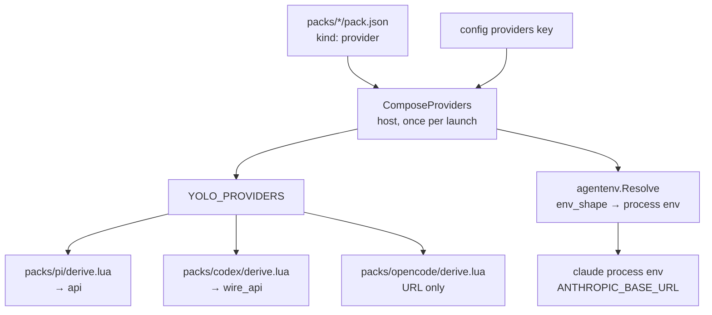

# The provider table is checked in yolo's vocabulary and delivered in everyone else's

**Status:** DESIGN, 2026-09-01. Nothing built. Written against `980aed71`.

**The short version.** The provider/profile design that shipped between `15688da1` and
`980aed71` is architecturally right and unusually well tested — I mutated two production call
sites and both failed loudly. What it got wrong is at the **edges of the abstraction, not
inside it**. `wire_api` is a closed enum, single-sourced, skew-tolerant, validated at both the
manifest and config layers — and its four values match **no agent's actual vocabulary**, while
the derives pass them through verbatim. The same shape recurs twice more: the composed provider
table can hold a `base_url`/`endpoints` pair that the config validator refuses when a user
writes it directly, and `packs/zai` now spells one endpoint URL twice with nothing pinning the
two copies equal. All three are **the abstraction being internally consistent and externally
unchecked**. Three further defects share no cause with those and are listed separately (§5).

> [!IMPORTANT]
> **The most important section is [§3](#3-d1--the-wire_api-enum-names-nobodys-protocol).** It is
> the only defect here that puts a wrong value into a file an agent reads, and the evidence
> refuting it was already in this repo before the value was chosen.

**Reads with:** [`profiles-as-pack-variants.md`](profiles-as-pack-variants.md) (the parent
design — this doc reports back against its §4.1 provider schema and §6.2 preflight),
[`zai-plumbing.md`](zai-plumbing.md) (the first consumer — its §5 resolution table is where the
dialect assumption is written down),
[`reference-mismatch-diagnostics.md`](reference-mismatch-diagnostics.md) (§7 step 3 is where the
four `wire_api` values were minted; this doc is its follow-on, not its contradiction),
[`local-model-endpoints.md`](../research/local-model-endpoints.md) (the source-verified
vocabulary evidence, §"Codex CLI" and §"pi"),
[`stringly-typed-references-principle.md`](stringly-typed-references-principle.md) (the principle
D1 shows is only half-applied).

---

## 1. Verdict, and the two principles it turns on

**Verdict: the mechanism stays; the delivery end grows a translation seam.** No new contribution
kind, no schema change to `kind: "provider"`, no change to how the table composes or crosses to
the jail. What changes is that the four consumers stop reading yolo's vocabulary as if it were
their own, and the composed table gains one resolution rule it currently lacks.

Two principles, numbered so §3–§6 and any sibling doc can cite them:

**P1. A closed enum is only closed at the end that enforces it.** A value yolo validates against
its own list and then writes verbatim into a third party's config file is not type-safe — it is
type-safe against a type nobody else holds. Either the enum is the union of the consumers'
vocabularies **and** each consumer translates, or it is a free string. What it may not be is a
closed set that looks translated and is not.

**P2. A rule enforced on one layer of a merge must hold on the merge's output.** The config
validator refuses `base_url` and `endpoints` in one user-written provider entry. Composition can
produce exactly that entry from two inputs that are each legal. A rule that the composer can
manufacture a violation of is a lint, not an invariant.

> [!NOTE]
> **This doc is a report, not a retraction.** Everything in
> [`profiles-as-pack-variants.md`](profiles-as-pack-variants.md) and
> [`zai-plumbing.md`](zai-plumbing.md) that those docs claim to have measured, I re-measured and
> it holds. The provider kind cannot express a credential, the skew handling is right at all
> three levels, the backend-parity repairs are real, and `d1e45e8d`'s reasoning about not
> duplicating a provider fact into a config patch is correct — §5.3 is where a sibling commit
> then did the thing that commit declined to do.

---

## 2. What ships today — the delivery chain, measured

Verified against the tree at `980aed71`, **2026-09-01**.

One table is composed once on the host
([`internal/packload/providers.go:39`](../../internal/packload/providers.go#L39),
`ComposeProviders`) — pack-shipped `kind: "provider"` facts under the user's `providers` entries,
merged per field. That table crosses to the jail as `YOLO_PROVIDERS` and reaches **four
consumers that never re-validate it**:



Two facts about this chain decide everything below.

**First, the four consumers disagree about how to find an address.** The three derives prefer the
single-protocol `base_url` shorthand and fall back to `endpoints.openai`
([`packs/pi/derive.lua:12-20`](../../packs/pi/derive.lua#L12) and its codex/opencode twins).
`agentenv.providerVars` reads **`endpoints[protocol]` only** and never looks at the shorthand
([`internal/agentenv/agentenv.go:121`](../../internal/agentenv/agentenv.go#L121)). Nothing
reconciles them.

**Second, `wire_api` crosses verbatim.** `packs/codex/derive.lua:53` emits
`wire_api = wireApi or prov.wire_api or "openai-chat"` and `packs/pi/derive.lua:41` emits
`api = wireApi or prov.wire_api or "openai-completions"`. Neither maps yolo's value to the
agent's. The field's own doc comment
([`internal/packdecl/contributes.go`](../../internal/packdecl/contributes.go), `ProviderEndpoint.WireAPI`)
states the hazard exactly — *"the value crosses into the agents' config files verbatim, so a typo
here is a protocol error at first request"* — and then the enum is checked against
`knownWireAPIs` ([`contributes.go:1438`](../../internal/packdecl/contributes.go#L1438)), which is
yolo's list.

---

## 3. D1 — the `wire_api` enum names nobody's protocol

**Defect D1** *(the term "defect" is used here in the roadmap's sense — a shipped behaviour that is
wrong, as opposed to an unbuilt want)*.

`knownWireAPIs` is `{anthropic, openai-chat, openai-completions, responses}`. Set that beside the
consumers' own vocabularies:

| Consumer | Field it writes | Values that agent accepts | Source |
| :--- | :--- | :--- | :--- |
| codex | `model_providers.<id>.wire_api` | `responses` **only** — `chat` was removed from the product | [`local-model-endpoints.md`](../research/local-model-endpoints.md) §"Codex CLI", *verified from source: codex-cli 0.145.0 binary, strings @0x7B7B47, 2026-08-20* |
| pi | `providers.<id>.api` | `openai-completions`, `openai-responses` attested; `openai-chat` attested nowhere | research doc §"pi" (`dist/api/openai-completions.js`, 2026-08-20) + the maintainer's own working `~/.pi/agent/models.json` |
| opencode | — | consumes no protocol field | [`packs/opencode/derive.lua`](../../packs/opencode/derive.lua) |
| claude (env_shape) | — | consumes no protocol field | [`packs/zai/pack.json`](../../packs/zai/pack.json) |

**So the enum's four values are a union of nothing.** `responses` is codex's spelling; pi wants
`openai-responses`. `openai-completions` is pi's spelling; codex has no such value.
`openai-chat` belongs to neither — it resembles codex's **removed** `chat`, with a prefix codex
never used.

### 3.1 Where the value came from, and why the check missed it

[`reference-mismatch-diagnostics.md:151`](reference-mismatch-diagnostics.md) is where the four
values were minted, in the mock-up of the error message the new refusal would print. That row's
job was *"an invented `wire_api` must not reach the agent's config file"*, and it succeeded at
exactly that — `2ced4944` closed it at both decode paths. **The enum answers "is this string in
yolo's set", which was the question asked.** Nobody asked "and is yolo's set the agent's set",
which is the question P1 says has to be asked at the same time.

### 3.2 What actually ships wrong

Two distinct consequences, and the second is wider than zai:

1. **`packs/zai` declares `wire_api: "openai-chat"` on its openai endpoint**
   ([`packs/zai/pack.json`](../../packs/zai/pack.json)), which reaches pi as `api: "openai-chat"`
   and codex as `wire_api = "openai-chat"`. Neither knows the value.
2. **`18045688` changed codex's derive default from `responses` to `openai-chat`.** Every codex
   provider that omits `wire_api` — not just zai's — now gets a value codex has never accepted,
   where it previously got the only one codex does.

> [!WARNING]
> **Do not "fix" D1 by reverting `18045688` alone.** Its measurement is correct and load-bearing:
> `POST /v4/responses` is **404 on both z.ai routes** while `/v4/chat/completions` returns a real
> completion (zai OQ-Z1, measured 2026-09-01 with an authenticated probe). Reverting the default
> puts every provider back on an endpoint that 404s. The commit's error is not the measurement,
> it is the **inference**: it reasons about the provider's HTTP surface and concludes something
> about codex's config vocabulary. Those are different sets.

### 3.3 The conclusion the measurement actually supports

z.ai speaks chat-completions only. codex speaks responses only. Therefore **codex cannot reach
z.ai's OpenAI route at all** — no `wire_api` value makes that pairing work.
[`packs/zai/README.md:35`](../../packs/zai/README.md) currently lists codex in the "what lands
where" table as receiving *"a `zai` entry in their provider catalog, pointing at the openai
route"*, which is true of the catalog and misleading about the outcome. This is a **fact about
the world to record**, not a bug to fix in code.

### 3.4 The shape of the fix

**Each derive owns its own dialect map**, because a dialect is a fact about one agent and the
derive is the one place that already knows exactly one agent. Concretely, at the altitude this
doc works at:

- yolo's enum stays the **canonical protocol vocabulary** — the names the design speaks in, the
  names a pack author writes, the names the config validator enforces. It is not a wire value.
- Each derive translates canonical → its own agent's spelling, and **emits nothing** when the
  canonical value has no spelling in that agent (rather than passing it through). An absent field
  gets the agent's own default, which is the correct degradation: a provider the agent cannot
  reach should not get a half-configured entry that fails at first request.
- The per-agent tables are **evidence-bearing**: each entry carries the source and check date the
  research doc already established, because a dialect map with no provenance is the same
  unverified assertion in a new location.

The alternative placements are weighed in §7.

---

## 4. D2 and D3 — the same shape, one layer down

### 4.1 D2 — composition manufactures the ambiguity the validator refuses

`validateProviders` refuses `base_url` and `endpoints` in one user-written entry
([`internal/config/validate.go:919-923`](../../internal/config/validate.go#L919)) — zai closure
rule 1, on the grounds that the pair is *"an ambiguity no consumer could resolve"*. It is right
about that. But `ComposeProviders` merges the user's entry **per field** over the pack's, so a
user entry carrying only `base_url` composed over a pack entry carrying only `endpoints` produces
precisely the refused pair. **Measured 2026-09-01**, user `base_url` over `packs/zai`:

```
composed = {"zai": {"api_key_env_name": "ZAI_API_KEY", "models": {...},
                    "endpoints": {"anthropic": {"base_url": "https://api.z.ai/api/anthropic"}, ...},
                    "env_shape": {...},
                    "base_url": "https://my.proxy.example/v1"}}

claude env: ANTHROPIC_BASE_URL=https://api.z.ai/api/anthropic     ← the pack's endpoint
pi/codex/opencode                → https://my.proxy.example/v1    ← the user's shorthand
```

The user asked for one URL and got two, split by consumer, silently. This is P2: the rule holds
on the inputs and not on the output.

It also falsifies a claim in the code. `agentenv.Resolve`'s doc comment says the composed table is
read *"so the env an agent is launched with and the config its derive wrote cannot disagree about
where a protocol points."* They can, and this is how.

**The fix is a resolution rule, not another refusal.** One function answers "where does protocol P
point for this entry", the derives and `agentenv` both call it, and the shorthand/endpoints
precedence is decided once (§10, OQ-PT2) instead of twice by accident. Whether the composer should
*additionally* refuse or warn on the manufactured pair is the second half of that question.

### 4.2 D3 — one endpoint URL, spelled twice, nothing pinning them equal

`980aed71` landed zai's `config-overlay` onto `claude/settings`, which is the right mechanism and
closes what OQ-16 deferred. But it delivers the URL as a **literal in the manifest**:

```jsonc
{ "kind": "config-overlay", "profile": "zai", "surface": "claude/settings",
  "config": { "managed": { "env": { "ANTHROPIC_BASE_URL": "https://api.z.ai/api/anthropic" } } } }
```

`https://api.z.ai/api/anthropic` now appears **twice** in
[`packs/zai/pack.json`](../../packs/zai/pack.json) — once as the provider's
`endpoints.anthropic.base_url`, once here — with no test asserting they agree (checked: the
`api.z.ai` string appears in no Go test; every fixture uses `https://n/...`).

> [!WARNING]
> **`d1e45e8d` declined this exact duplication one commit earlier**, and said why: for the bedrock
> profile, *"AWS_REGION and the ANTHROPIC_\* model ids stay env-delivered deliberately: they
> compose from the provider entry's own values at launch (env_shape), and a literal in the patch
> would be a second copy of a fact packs/claude's provider declaration already owns."* The
> reasoning is right and it applies unchanged here. Do not treat §4.2 as a new rule — it is the
> existing one, unapplied.

**And D3 makes D2 worse**, which is why they are in one section. After `980aed71` a user
overriding `providers.zai.base_url` gets **three** answers: the shorthand (derives), the pack's
`endpoints` (env_shape), and a hardcoded literal no override can reach (the overlay).

The shape of the fix is the placeholder vocabulary the `env_shape` field already has — a
`config-overlay` gated on a profile should be able to name `{endpoint}` rather than restate it —
which is a schema question, not a code-placement one, and is OQ-PT3.

---

## 5. Three more, sharing no cause with §3–§4

These are grouped only by "found in the same review". Each stands alone.

### 5.1 D4 — the preflight overrules the user's documented opt-out

`requiredProviders` ([`internal/packload/providers.go:137`](../../internal/packload/providers.go#L137))
adds **every provider a selected pack ships**, ungated by whether any variant is active. That is
OQ-13's deliberate rescoping and it is defensible for a provider *pack* — selecting `packs/zai` is
the intent. It collides with a different documented rule: a `null` user entry **drops** a provider,
*"the same convention the `providers` config key already has"*.

**Measured 2026-09-01**, `packs: ["claude"]` with `providers: {"bedrock": null}`:

```
• pack claude requires provider "bedrock", and the composed providers table has no entry by that name
```

The user's explicit "I do not want bedrock" becomes a launch refusal naming the pack they do want,
escapable only by keeping `YOLO_ALLOW_MISSING_PROVIDERS=1` set permanently. There is a test
asserting this shape (`TestCheckProviderCredentialsRefusesAMissingProvider`), so it is deliberate —
but that test's fixture is a *provider pack*, where refusing is right, and the behaviour
generalizes to a pack that merely happens to ship a provider, where it is not.

The distinction the preflight is missing is **who wanted the provider**: a provider the pack ships
as one of several optional variants is not the same claim as a provider the pack exists to supply.
Which of the candidate discriminators to use is OQ-PT4.

### 5.2 D5 — `--profile` means two unrelated things

Bare `--profile` sets startup timing; `--profile <name>` selects a pack profile
([`internal/cli/runcmd.go:209-217`](../../internal/cli/runcmd.go#L209)), disambiguated by whether
the next token looks like a value. Two commits went into patching that parse — `bd2186d1` (a run
flag's value reading as a subcommand name) and `8868326a` (`-p` taking `run` as a profile name
after `RewriteArgv` inserted it). Both fixes are correct; the recurrence is the signal.

`--pack-profile <cli>=<name>` already exists as an unambiguous spelling, so the collision buys a
short form and costs a parse whose correctness depends on heuristics about the following token.
[`docs/guides/USER_GUIDE.md:217`](../guides/USER_GUIDE.md) still documents `--profile` as timing
only. Whether to rename either meaning is OQ-PT5 — it is a breaking CLI change and therefore
yours.

### 5.3 D6 — the census, and the missing test tier

Two independent gaps, both cheap:

- **`AGENTS.md:8` says "the ten that ship with yolo"** and names four CLI-less packs. There are
  **twelve**: `serial` (already stale before this work) and `zai`, which is a *third* category —
  installs no CLI **and** ships no loophole, the first pack whose whole content is declarative
  facts. [`packs/embed.go:20`](../../packs/embed.go#L20) carries the same stale list. The repo's
  own rule at [`AGENTS.md`](../../AGENTS.md) §Workflow step 6 says a number is *"the exact place a
  reader stops checking"*.
- **`integration/` has zero coverage of this feature.** Nothing there mentions `zai`,
  `pack_profiles`, or `providers`, though the pattern exists (`packs_test.go`, `mcp_test.go`
  assert in-jail rendering) and the feature's whole point is a host→jail crossing. The only
  end-to-end evidence is `packs/zai/README.md`'s *"measured in a nested jail"* prose. **An
  integration test that asserted the rendered `~/.codex/config.toml` against codex's real
  vocabulary is the single check that would have caught D1**, and it is the tier this work
  skipped while over-delivering on the tier below it (1.4:1 test:code, 88–98 % coverage on the new
  packages).

---

## 6. What this does NOT propose

- **No change to `kind: "provider"`'s schema**, its exclusivity, its skew handling, or the fact
  that a credential is unrepresentable in it. All of that is right.
- **No change to how the table composes or crosses to the jail.** One composition, host-side, is
  correct and hard-won (`17901200`); nothing here reopens it.
- **No re-litigation of OQ-13's ungated preflight.** §5.1 asks for a discriminator *within* that
  ruling, not a return to active-profile scoping, which OQ-13 rejected for a reason that still
  holds — a variant resolving to nothing would still write a config pointing at an undelivered
  provider.
- **No new contribution kind, and no adapter pack.** The `config-overlay` `profile` gate that
  `568d5a3a` landed is the right mechanism; §4.2 wants it to carry a placeholder, not a sibling.
- **Not a claim that the enum should be opened.** P1 offers two consistent options and this doc
  takes the closed one. A free-string `wire_api` would restore the failure
  [`reference-mismatch-diagnostics.md`](reference-mismatch-diagnostics.md) closed.

---

## 7. Alternatives considered

| # | Alternative | Verdict |
| :--- | :--- | :--- |
| A1 | **Make the enum the union of all agents' spellings** (add `openai-responses`, `chat`, …) and keep verbatim pass-through. | **Rejected.** Two agents spelling the same protocol differently makes the union ambiguous by construction — a pack author writing `openai-responses` has silently chosen "pi, and nothing else". The canonical/dialect split exists to stop that. |
| A2 | **Translate centrally in Go**, composing a per-agent value into the table before it crosses. | **Rejected for v1.** It puts an agent-name switch back in core, which is what `pack-code-separation.md` forbids and what `agentenv.agentProtocols` is already an acknowledged exception to. Reconsider only if a fourth consumer appears. |
| A3 | **Declare the dialect in the manifest** — a per-agent spelling table on the pack. | **Rejected as premature.** It is schema for a fact that changes when an agent releases, not when a pack does; the derive is already versioned with the pack that owns the agent. |
| A4 | **Refuse the composed `base_url`/`endpoints` pair** rather than resolving it. | **Rejected as the primary fix, viable as an addition.** A refusal makes a per-field override of a pack-shipped provider impossible to spell, which is the feature `zai-plumbing.md` §7 calls "overrides, not authoring". The resolution rule is the fix; a warning on the manufactured pair is the open half of OQ-PT2. |
| A5 | **Leave D4 as-is and document the hatch.** | **Rejected.** `YOLO_ALLOW_MISSING_PROVIDERS=1` is a launch-refusal escape hatch; a user who has to set it permanently has lost the refusal for every real case too. |

---

## 8. Risks

| Risk | Mitigation |
| :--- | :--- |
| **The pi dialect is asserted from two data points, not from source.** `openai-completions` is source-verified; `openai-responses` comes from the maintainer's working config; `openai-chat`'s absence is an argument from silence. | The dialect map's own provenance requirement (§3.4) makes this visible rather than assumed. Verify pi's enum from `dist/` before the map ships, the way the codex half already is. |
| **Emitting nothing for an untranslatable protocol changes behaviour for providers that work today by accident.** | The canonical set is four values; three have a spelling in at least one agent. The only silent-drop case is a genuinely unreachable pairing, which is the honest outcome (§3.3). |
| **A resolution rule for D2 freezes a precedence the design never chose deliberately.** | That is exactly what OQ-PT2 is for — the rule is cheap, choosing it by default is what happened once already. |
| **Renaming `--profile` breaks anyone's muscle memory and scripts.** | Which is why D5 is a question and not a step. `--pack-profile` already works, so the status quo is survivable indefinitely. |

---

## 9. What I would build, in order

Three of these need no ruling and are independent of the rest.

1. **The integration test first** (§5.3), asserting the rendered codex and pi config against each
   agent's real vocabulary. It fails today, which is the point: it is the regression test for D1
   and it makes step 2 verifiable rather than argued. No ruling needed.
2. **The dialect translation in the three derives** (§3.4), with provenance on every entry, plus
   correcting `packs/zai/README.md`'s parity table to record §3.3's finding. Needs OQ-PT1.
3. **The census and the guide line** (§5.3, §5.2's doc half) — `AGENTS.md`, `packs/embed.go`,
   `USER_GUIDE.md:217`. No ruling needed, and worth doing regardless of everything above.
4. **The address resolution rule** (§4.1), one answer for four consumers. Needs OQ-PT2.
5. **The `config-overlay` placeholder** (§4.2), removing zai's duplicated literal. Needs OQ-PT3,
   and is the only item here that touches a schema.
6. **The preflight discriminator** (§5.1). Needs OQ-PT4.

D5 (§5.2) is deliberately not in this list — it is a breaking CLI change gated on OQ-PT5, and its
documentation half rides step 3.

---

## 10. Open Questions

1. 💬 **OQ-PT1: Where does the canonical→dialect translation live?** §3.4 puts a per-agent map in
   each derive; A2 puts it in Go; A3 puts it in the manifest. This decides whether core ever
   learns an agent's protocol spelling, and it is the one architectural call in the doc — the rest
   of §3 follows from it.

   _Leaning:_ The derive. It is already the one place that knows exactly one agent, it versions
   with the pack that owns that agent, and it keeps core free of the agent-name switch
   `pack-code-separation.md` forbids. The cost is three small tables instead of one, which is the
   right cost — they are three different facts.

   **Answer:**
   > _(empty — fill in when decided)_

2. 💬 **OQ-PT2: What is the address resolution rule, and does the manufactured pair also warn?**
   Two halves. (a) When a composed entry carries both `base_url` and `endpoints[P]`, which wins?
   (b) Does composition additionally report the pair the config validator would have refused?
   Deciding (a) alone closes the split-brain; (b) decides whether the user learns their override
   half-landed.

   _Leaning:_ `endpoints[P]` wins when it exists for the protocol being resolved, because it is
   the specific spelling and `base_url` is documented as the single-protocol shorthand — and
   **yes** to (b), as a warning naming both sources, because a user who wrote the shorthand
   intending a full override should hear that the endpoint map outranked it. I hold (a) less
   firmly than (b): the opposite precedence ("the user's own key wins over the pack's") is also
   defensible and would change which agent moves.

   **Answer:**
   > _(empty — fill in when decided)_

3. 💬 **OQ-PT3: Should a profile-gated `config-overlay` carry `env_shape`'s placeholders?**
   §4.2's duplication is only removable if the overlay can name `{endpoint}` instead of restating
   the URL. This is a schema addition to a kind that currently takes literals, and it decides
   whether "a fact the provider owns is spelled once" is a rule or an aspiration.

   _Leaning:_ Yes, and reusing the existing closed placeholder set rather than a new one — the
   vocabulary is already single-sourced (`ValidateProviderEnvShape`, exported for exactly this
   kind of second consumer in `0329b781`) and the skew story is already written. The narrower
   alternative is a test asserting the two literals agree, which fixes this instance and not the
   class.

   **Answer:**
   > _(empty — fill in when decided)_

4. 💬 **OQ-PT4: What distinguishes a provider a pack *supplies* from one it *offers*?** §5.1
   needs a discriminator so a null-drop of `bedrock` does not refuse a `claude` launch, without
   reopening OQ-13. Candidates: the pack ships **only** provider/profile contributions (zai's
   shape) and is therefore its provider's reason to exist; or the requirement follows the
   **active** variant for a pack that also installs a CLI; or the user's explicit `null` is
   simply honored as consent everywhere.

   _Leaning:_ Honor the explicit `null`. It is the smallest change, it needs no new concept, and
   it reads correctly out loud — a user who typed the provider's name to remove it has answered
   the question the preflight is asking. The "pack ships only providers" discriminator is
   tempting and I distrust it: it makes a pack's refusal behaviour change the day it grows a
   `program` contribution.

   **Answer:**
   > _(empty — fill in when decided)_

5. 💬 🤷 **OQ-PT5: Does `--profile` keep both meanings?** §5.2. `--pack-profile` already spells
   the profile case unambiguously, and the timing meaning is older. Options: leave it (and fix
   only the guide line), rename the timing flag, or drop the bare-`--profile` profile spelling
   and keep `-p`.

   _Leaning:_ Genuinely your call — it is a breaking CLI change and the current parse works. If
   pressed: keep `-p`, keep `--profile` for timing only, and let `--pack-profile` carry the long
   form, because that is the one reading where no token's meaning depends on the next token. But
   the status quo is survivable and I would not spend a break on it alone.

   **Answer:**
   > _(empty — fill in when decided)_

---

## 11. Decision Ledger

_Empty — nothing in this doc is settled yet. Rulings compact here from §10, keeping their
`OQ-PT<n>` IDs, with the normative text folded into the section named in the last column._

| ID | Ruling / Decision | Date | Settled in |
| :--- | :--- | :--- | :--- |
| — | — | — | — |

---

## 12. Success criteria

- A provider whose protocol an agent cannot speak produces **no entry** in that agent's config,
  not a half-configured one — and the integration tier, not a unit test, is what says so.
- One URL, written once per pack, reaching every consumer as the same string; a user override of
  it moving all four consumers or none.
- `AGENTS.md`'s pack census matching `ls packs/`, checkable by the sweep
  [`docs/plans/README.md`](../plans/README.md) already defines.
- `providers: {"<name>": null}` meaning the same thing to the composer and to the preflight.
