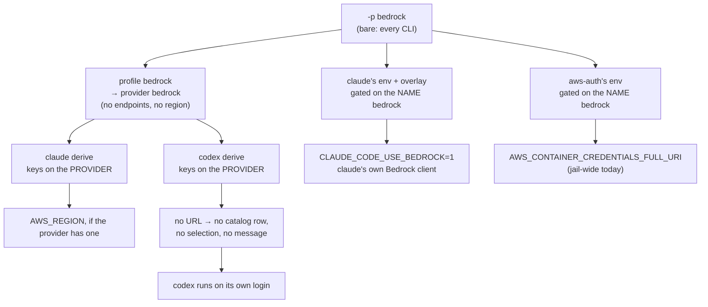

# Providers and profiles, redesigned: what `-p <name>` should mean

**Status:** DESIGN, 2026-09-25. Nothing of it is built, and no question in it is ruled.
MEASURED: the split between name-keyed gates and provider-keyed derives
([§2.2](#22-gates-key-on-the-name-derives-key-on-the-provider)), read at `7ad8358c`, re-read
at `f491d192`, and re-checked by grep at `ee8154f2` on 2026-09-24; the three copies of the
credential adapter's port and the test pinning all three against each other; every schema fact in
[§4](#4-the-marker-how-a-derive-recognizes-what-a-pick-is).
UNMEASURED: no launch was run for this doc. The loss a second profile suffers
([§2.1](#21-d5-a-second-profile-over-one-provider-silently-loses-every-gated-fact)) was measured
by a 2026-09-23 triage and re-derived here by reading the gates, not re-run.

**The question this doc answers.** When you type `yolo -p bedrock -- codex`, what did you
name? Today the answer is "a profile, which points at a provider, which some packs recognize by
the profile's spelling and others by the provider it resolves to". That answer produces four
confusions ([§2](#2-the-four-confusions)). This doc asks what a provider and a profile should
each mean, how a derive recognizes what a pick is, and whether any fact should key on a
profile's name at all.

**Why it exists.** It began as one question in [`bedrock-plumbing.md`](bedrock-plumbing.md):
[OQ-BR2](#OQ-BR2), a proposed `service` marker on the provider kind. In review on 2026-09-25 the
maintainer did not rule it:

> *"a bigger decision than you're making it look … could potentially remake how we do providers
> and profiles … I already don't love providers and profiles. I find it very confusing … an
> opportunity to dive deep and change that but this sounds like a design doc on its own."*

[OQ-BR8](#OQ-BR8) came with it, because it is the same function seen from the gate side.

**Where things stand.**

- **Built:** the provider system as [`providers.md`](../reference/providers.md) describes it —
  one composed provider table, profiles of exactly `{name, provider}`, name-keyed `profile`
  gates on `env` and `config-overlay`, and provider-keyed derives. packs/claude's endpoint-less
  `bedrock` provider and profile, and `packs/aws-auth`'s name-gated credential pointer.
- **Ruled, and binding here:** [OQ-BR4](provider-credential-scope.md#OQ-BR4) (2026-09-25): a
  profile's env must not leak to other agents, *"as specific as possible"*.
  [OQ-BR11](bedrock-plumbing.md#OQ-BR11) (2026-09-24): claude gets a native Bedrock profile
  and an everything profile. [DIR-BR3](bedrock-plumbing.md#decision-ledger) (2026-09-25): yolo
  ships `bedrock-runtime` only. [OQ-BR5](bedrock-plumbing.md#OQ-BR5) (2026-09-25): pi is
  supported both through its native Converse client and through the bridge.
- **Not ruled:** everything below.

**Needs your ruling:**

1. [OQ-BR2](#OQ-BR2) — the marker. It gates builds, so it comes first. _Leaning (⚠ changed
   2026-09-25):_ rule its substance now (a declared, open-vocabulary field, in both schemas),
   spelled so it survives any answer to [OQ-PP1](#OQ-PP1) — for example `platform` — and not
   spelled `service` or `native`.
2. [OQ-BR8](#OQ-BR8) — do gates key on the profile name or the provider? _Leaning:_ the
   provider, in each agent's own derive; variants are providers. That fixes which provider a
   fact fires for, not which agents receive it: that needs
   [OQ-CN6](provider-credential-scope.md#OQ-CN6)'s per-agent vehicle.
3. [OQ-PP1](#OQ-PP1) — what is the one thing `-p` names? _Leaning:_ deliberately none. A
   strawman is offered for you to argue with.
4. [OQ-PP2](#OQ-PP2) — is the transport declared by the provider or derived per agent?
   _Leaning:_ derived, with one opt-in name for "force the bridge".
5. [OQ-PP3](#OQ-PP3) — what does a bare `-p X` do for an agent that cannot reach X?
   _Leaning:_ one disclosure line naming those agents, never a refusal.

**Out of scope, and where it lives.** The credential delivery gate:
[`provider-credential-scope.md`](provider-credential-scope.md), whose
[OQ-CN1](provider-credential-scope.md#OQ-CN1) reads [OQ-BR8](#OQ-BR8). Bedrock's provider
shape and profile names: [`bedrock-plumbing.md`](bedrock-plumbing.md)
([OQ-BR9](bedrock-plumbing.md#OQ-BR9), [OQ-BR1](bedrock-plumbing.md#OQ-BR1)). Model lists:
[`model-lists-and-pickers.md`](model-lists-and-pickers.md). The deselection state machine:
[`provider-switching.md`](provider-switching.md). Routing all traffic through the wire bridge:
[`wire-bridge-gateway.md`](wire-bridge-gateway.md). Rewriting
[`providers.md`](../reference/providers.md) happens only after this doc rules.

---

## 1. Today's model, in plain words

[`providers.md`](../reference/providers.md) is the as-built reference. This section is the
short version, and it restates nothing that reference owns.

**Provider and profile, in two sentences.** A
**provider** is a place models are served from (Bedrock, OpenRouter, a local server): its address
if it has one, its region, its model ids, and the name of the variable holding its key. A
**profile** is the name you type after `-p`; it picks one provider, plus options such as the
starting model.

The rest of today's model:

- **Who declares them.** Packs ship providers; the user's `providers` key overrides them. Each
  provider also lists the wire protocol each endpoint speaks and the options a profile may tune.
- **What a profile carries.** A pack's profile is exactly `{name, provider}`
  ([OQ-PT8](../reference/providers.md#oq-pt8)); a user's may add option values. Anything a pack
  does differently under a profile is a separate contribution carrying a `profile: "<name>"`
  gate.
- **Catalog versus selection.** A provider that reaches an agent is listed in that agent's
  directory of providers (catalog, by presence). Telling the agent to *use* it is a separate,
  explicit act (selection, by `-p` or `use_profiles`).
- A **derive** is the Lua hook in an agent's own pack that turns the provider table and the
  selection into that agent's config and environment, in that agent's vocabulary.
- An **endpoint-less provider** names no URL. It is correct where the agent's own client
  composes the URL itself, as claude's Bedrock mode does from a region.
- **Why derives key on a URL.** Every derive but claude's asks one predicate — a
  `providerEndpoint` helper returning nil when the provider has no URL for the protocol that
  agent speaks — and gates its catalog row and its selection on it. So an endpoint-less
  provider is invisible to codex, pi, opencode, oh-omp and copilot.
- **A bare `-p X`** keys the name onto every CLI the selected packs install; `-p codex=X`
  keys it onto one.

### 1.1 One worked example: `-p bedrock` on claude, and on codex

For **claude**, three separate mechanisms together make Bedrock happen. The derive sees the
provider; two name-gated contributions switch claude into its native Bedrock mode and point the
AWS SDK at the credential adapter. For **codex**, the derive finds no URL and writes nothing,
and protocol resolution calls an endpoint-less provider "Direct against the agent's first-party
API" ([protocol-resolution.md](../reference/protocol-resolution.md#degenerate-inputs-and-what-each-resolves-to)),
so nothing refuses and nothing reports. codex goes on talking to OpenAI. Meanwhile the wide env
gate fires claude's and `aws-auth`'s variables for the whole jail — the leak
[OQ-BR4](provider-credential-scope.md#OQ-BR4) ruled must end.

### 1.2 Where the Bedrock split ended up

Which agent reaches Bedrock by which transport:
[bedrock-plumbing, Where the split ended up](bedrock-plumbing.md#where-the-split-ended-up). Where
the transport *lives* in the schema is this doc's [OQ-PP2](#OQ-PP2).

---

## 2. The four confusions

### 2.1 D5: a second profile over one provider silently loses every gated fact

**D5** (a trap label carried from bedrock-plumbing; live hazard). Every
`profile:`-gated contribution matches the profile NAME literally, while every derive matches
the PROVIDER the name resolves to. So a user profile `bedrock-sso` over provider `bedrock`
validates and selects, and then `-p bedrock-sso` delivers at most the provider's region. It
loses, silently:

- `CLAUDE_CODE_USE_BEDROCK` from claude's `bedrock`-gated `env` (`packs/claude/pack.json`);
- the `bedrock`-gated `claude/settings` overlay, in the same file;
- `aws-auth`'s `AWS_CONTAINER_CREDENTIALS_FULL_URI` pointer (`packs/aws-auth/pack.json`).

claude may then run first-party on whatever login it holds. Nothing reports it, by rule: an
inactive gate is a clean skip. MEASURED by the 2026-09-23 triage; INFERRED that no request
reached AWS. D5 is the twin of D2 (the wide env gate, now
[OQ-BR4](provider-credential-scope.md#OQ-BR4)'s): D2 fires a gate for the wrong agent, D5
fails to fire it for the right one.

**It breaks a case the design called supported.** The deleted
`provider-catalog-and-selection.md` (*What a profile is*, `git show
4e4ca2d1^:docs/design/provider-catalog-and-selection.md`, line 398) names *"a user adding a
second intent over the same provider"* as the case selection resolution exists for. The
SELECTION half was fixed: `ProviderFor` reads the resolved table, user profiles included. The
GATE half never moved. SOURCED from git history.

**It is about to become routine.** [OQ-BR11](bedrock-plumbing.md#OQ-BR11)'s everything
profile is a second claude profile over the Bedrock provider — D5's exact shape. It must not
set the name-gated `CLAUDE_CODE_USE_BEDROCK`, yet `aws-auth`'s pointer must still reach the
bridge.

### 2.2 Gates key on the name, derives key on the provider

MEASURED at `7ad8358c`, re-read at `f491d192`, re-checked at `ee8154f2`:

| Consumer | Keys on | Where |
| :--- | :--- | :--- |
| `env` gate | the literal NAME: `EnvFold` → `profileActive` → `installsActiveBin`, `profiles[bin] == name` | [`packload.go`](../../internal/packload/packload.go) |
| `config-overlay` gate | the literal NAME: `profiles[key.Agent] != ov.Profile` | [`packoverlay.go`](../../internal/packoverlay/packoverlay.go), `Collect` |
| surface derive | the PROVIDER: `packload.ProviderFor(resolved, profiles[s.Agent])` | [`packsurfaces.go`](../../internal/entrypoint/packsurfaces.go), `surfaceSelectionFor` |
| env derive | the PROVIDER: `selected := ProviderFor(cfg.resolved, profile)` | [`deriveenv.go`](../../internal/packload/deriveenv.go) |

Neither gate file calls `ProviderFor`. **Not Bedrock-specific:** the same name gate ships
twice more, MEASURED — `packs/pi/pack.json` gates the codex prelaunch env on the name `codex`,
and `packs/llamacpp/pack.json` gates `CLAUDE_CODE_ATTRIBUTION_HEADER=0` on the name
`llamacpp`.

### 2.3 The transport has nowhere to live

**Transport** (coined here) is which client carries an agent's model traffic to a provider:
the agent's own native client, or the wire bridge. Today it is never declared. It falls out of
three unrelated facts:

- for an endpoint-ful provider, the `adapter` pass composes the bridge's address into any
  provider that offers `openai` and lacks `anthropic`, and the resolver then *"cannot tell an
  adapted pairing from a native one"*
  ([protocol-resolution.md](../reference/protocol-resolution.md#the-four-outcomes));
- for claude on Bedrock, native mode is a name-gated env variable;
- for an endpoint-less provider, nothing distinguishes "the agent's first-party API" from "the
  agent's native Bedrock client".

So the everything profile can only express "use the bridge" by being a different profile
name, which is D5; and [OQ-BR1](bedrock-plumbing.md#OQ-BR1)'s naming question could not be
answered, because the thing the names should describe had no field. The maintainer's reading
was right: *"isn't it really provider native and then the wire bridge."*

### 2.4 A bare `-p X` silently does nothing for an agent that cannot reach X

`-p bedrock` in a jail with claude and codex writes nothing for codex and says nothing
([§1.1](#11-one-worked-example--p-bedrock-on-claude-and-on-codex)). bedrock-plumbing's
degenerate-input rule states the same for agy, and for copilot until the bridge serves the
provider: *"nothing written, no warning"*. The launch line prints DECLARED and RECEIVED and
never "honored" ([OQ-10](../reference/providers.md#pv-oq-10)), because what a derive does is
unobservable from the launcher. That is [OQ-PP3](#OQ-PP3).

---

## 3. Constraints any redesign keeps

- **Provider names are sole-owned across packs.** `KindProvider` combines with
  `CombineExclusive`, keyed by name (`internal/packdecl/kinds.go`): two packs shipping one
  provider name is a launch-refusing collision; one pack shipping two is ordinary. So no pack
  can add a field to another pack's provider row — `aws-auth` cannot annotate claude's
  `bedrock`. Profile names, by contrast, are sole-owned only *within* a pack: `bedrock` in two
  packs is two declarations sharing a selector value.
- **Two Bedrock providers are not a collision.** Two providers carrying the same marker are
  ordinary catalog rows, and only the selected one gets a selection key. It is the shipped case
  under bedrock-plumbing's two-provider fallback, and whenever a user declares a Bedrock provider
  of their own. Any marker design must keep it degenerate-safe.
- **"As specific as possible"** ([OQ-BR4](provider-credential-scope.md#OQ-BR4), 2026-09-25:
  *"no I don't want it to leak … certainly not Claude Code gets Bedrock"*). Every option below
  must deliver a provider's facts to the agent that selected it and no other. It is an input,
  not an answer.
- **No stringly-typed matches.** A derive testing `name == "bedrock-openai"` is what
  [`stringly-typed-references-principle.md`](../reference/stringly-typed-references-principle.md)
  forbids.
- **Core learns no agent's vocabulary** ([OQ-CS8](../reference/providers.md#oq-cs8)). What a
  marker or transport means for one agent is that agent's derive's business.

---

## 4. The marker: how a derive recognizes what a pick is

An endpoint-less provider needs a declared fact, because every derive but claude's keys
reachability on a URL. With a marker, codex's derive can say "this provider is Bedrock, select
my `amazon-bedrock-runtime` built-in and write `aws.region`" without a URL. The marker has
consumers queued behind it: bedrock-plumbing's native derives, the bridge's decision to sign,
and [OQ-BR22](bedrock-web-search.md#OQ-BR22)'s search-preset gate.

The three candidates, and what the tree says about each:

| Candidate | Verdict |
| :--- | :--- |
| A declared field on the provider kind (drafted as `service: "aws-bedrock"`), open vocabulary, unknown values inert | The old leaning: explicit, greppable, survives a second regional service. Tolerating unknown values is the version-skew rule the open `endpoints` key set already follows |
| Match the provider by NAME in each derive | **Rejected.** Stringly typed; breaks the moment a user declares a Bedrock provider under another name |
| Implicit: "has `region`, has no `endpoints`" | **Fails today.** SOURCED: packs/claude's `bedrock` provider declares neither |

**Two costs the old leaning did not state** (MEASURED from the repo, 2026-09-24):

- **`service` already names something.** `kind: "service"` is the contribution kind
  `packs/wire-bridge` ships, an in-jail daemon. A provider *field* named `service` gives one word
  two meanings in one manifest vocabulary.
- **It lands in two schemas.** A user-declared provider's key set is CLOSED:
  `knownProviderKeys` in `internal/config/config.go` accepts `base_url`, `endpoints`,
  `wire_api`, `api_key_env_name`, `models`, `region`, `capabilities` and `options`, and refuses
  anything else. So a user's own Bedrock provider cannot carry the marker until it is added there
  as well as to `internal/packdecl`.

**What the marker is not.**

- **Not a `wire_api` value.** Bedrock is not a protocol: its native clients speak Responses,
  Converse and the AWS SDK's own shapes. A service name in the canonical protocol enum is the
  pass-through mistake [OQ-PT1](../reference/providers.md#oq-pt1) closed, one field over.
- **Not an `endpoints` key.** `validateProviderEndpoints` in `internal/packdecl/contributes.go`
  refuses an endpoint with no `base_url` (`endpoints[%q]: needs a "base_url"`), and a pack cannot
  ship a Bedrock URL, because the URL contains a region the pack does not know. MEASURED from the
  code.

**Why it is bigger than a field.** The marker answers "what service is this?", which is half of
what a pick means. The other half is "by which transport does *this* agent reach it?"
([§2.3](#23-the-transport-has-nowhere-to-live)). Adding the marker without deciding the
transport's home leaves the everything profile distinguished only by its name. That is why
[OQ-BR2](#OQ-BR2) is asked beside [OQ-PP1](#OQ-PP1) and [OQ-PP2](#OQ-PP2), not after them.

---

## 5. What waits on this doc

- **First deliverable: the marker ruling, or its replacement.** Then the field lands in
  `internal/packdecl` and `knownProviderKeys` with its tolerance behavior. Nothing renders yet;
  it is the schema three derives will key on. This was bedrock-plumbing's build step 2.
- **Built after it:** bedrock-plumbing's native derives (codex, opencode, pi), and
  [OQ-BR22](bedrock-web-search.md#OQ-BR22)'s Bedrock gate on the search preset.
- **Not gated on it:** the bridge's SigV4 signer.
  [OQ-WG1](wire-bridge-gateway.md#OQ-WG1) leans toward keying the signer on the upstream host
  rather than on a provider marker, so the signer does not wait here.
- **Built with [OQ-BR8](#OQ-BR8):** closing D5, together with D2's fix under
  [OQ-BR4](provider-credential-scope.md#OQ-BR4), each with a test that fails when the call site
  is deleted.

---

## 6. Rulings this doc may reopen

| Ruling | What it settled | How this doc touches it |
| :--- | :--- | :--- |
| [OQ-CS9](../reference/providers.md#oq-cs9) | Profiles point at a provider; no `extends` | Rules out `bedrock-sso extends bedrock` ([OQ-BR8](#OQ-BR8)). Under [OQ-PP1](#OQ-PP1) (b) or (c) it is moot for profiles, but may reappear as a provider-level `extends` |
| [OQ-PT8](../reference/providers.md#oq-pt8), 2026-09-01 | A profile is `{name, provider}`; its body moved onto name-keyed `profile:` contributions | Does **not** answer [OQ-BR8](#OQ-BR8): name versus provider was a consequence, never a choice. [OQ-PP1](#OQ-PP1) (b) would make the `profile` kind an alias or delete it |
| [OQ-PT3](../reference/providers.md#oq-pt3) | A provider's fact is composed from the provider, not restated in a gated overlay | The precedent [OQ-BR8](#OQ-BR8)'s leaning follows |
| [agent-auth-modes OQ-9](agent-auth-modes.md#OQ-9) | Still open: AWS's two-part credential has no declarative home | Same question as [OQ-CN1](provider-credential-scope.md#OQ-CN1) from the credential side; a transport or marker field may give it one |

---

## 7. Open Questions

1. 💬 **[OQ-BR2](#OQ-BR2): How does a derive recognize what a provider is
   (the marker)?** Moved here from bedrock-plumbing on 2026-09-25, id kept. Candidates and costs
   are [§4](#4-the-marker-how-a-derive-recognizes-what-a-pick-is): a declared field, matching the
   name (rejected), or the implicit reading (fails today). Stakes: it gates bedrock-plumbing's
   native derives and [OQ-BR22](bedrock-web-search.md#OQ-BR22), it is the one piece of the Bedrock
   work that touches core, and it is the first stone of whatever [OQ-PP1](#OQ-PP1) builds. **Not
   ruled 2026-09-25** — the maintainer's words are this doc's opening.

   > [!WARNING]
   > **⚠ Leaning changed 2026-09-25.** The old leaning, in bedrock-plumbing, was a provider field
   > spelled `service: "aws-bedrock"`, open vocabulary, unknown values inert. The substance stays.
   > The spelling moved because `service` already names a contribution kind
   > ([§4](#4-the-marker-how-a-derive-recognizes-what-a-pick-is)), and the question moved because
   > the maintainer declined to rule it as a field.

   _Leaning:_ Rule the substance now so the builds are not held for the whole redesign: a
   declared, open-vocabulary field on the provider, unknown values inert, accepted by both
   `internal/packdecl` and `knownProviderKeys`. Spell it for what the service IS, not how it is
   reached: for example `platform: "aws-bedrock"` (coined here). Not `service`, which already
   names a contribution kind, and not `native`, which is a transport value in
   [OQ-PP1](#OQ-PP1) (c). It also gives [OQ-PP2](#OQ-PP2)'s derived transport the fact it reads.
   This asks again for the narrow ruling you declined once. It is safe to give because whatever
   [OQ-PP1](#OQ-PP1) decides about profiles, a provider still has to say what it is, so the field
   survives every option there. What still waits on it is bedrock-plumbing's build steps 3–5 (the
   `bedrock` pack's provider, then the codex, opencode and pi native bindings) and
   [bedrock-web-search](bedrock-web-search.md)'s step 9.3, the search preset's Bedrock gate
   ([OQ-BR22](bedrock-web-search.md#OQ-BR22)). The bridge's signer does not wait: [OQ-WG1](wire-bridge-gateway.md#OQ-WG1)
   leans toward keying it on the upstream host.

   <!-- vantage: oq id=OQ-BR2 leaning="Changed 2026-09-25 (was a `service` field). Rule the substance now: a declared, open-vocabulary provider field, unknown values inert, accepted by both packdecl and knownProviderKeys, spelled for what the service is, e.g. `platform` set to `aws-bedrock`. Not `service` (a contribution kind) nor `native` (a transport value in OQ-PP1 c). It survives every OQ-PP1 option. Waiting on it: bedrock-plumbing steps 3-5 and bedrock-web-search step 9.3; not the signer (OQ-WG1)." -->

   **Answer:**
   > _(empty — fill in when decided)_

2. 💬 **[OQ-BR8](#OQ-BR8): Does a contribution's gate key on the profile
   NAME or on the provider it selects?** Moved here from bedrock-plumbing on 2026-09-25, id kept.
   It is [OQ-BR4](provider-credential-scope.md#OQ-BR4)'s other direction: BR4 ruled that a gate
   must not fire for the wrong agent; this asks why it fails to fire for the right one
   ([§2.1](#21-d5-a-second-profile-over-one-provider-silently-loses-every-gated-fact),
   [§2.2](#22-gates-key-on-the-name-derives-key-on-the-provider)). Stakes: whether a second intent
   over a shipped provider is supported or a silent trap; whether the credential adapter's port
   stays written three times ([appendix](#appendix-evidence-and-how-to-re-check-it)); whether
   [OQ-BR11](bedrock-plumbing.md#OQ-BR11)'s everything profile can work; and whether
   [OQ-CN1](provider-credential-scope.md#OQ-CN1) can gate credentials by provider.

   | Option | Verdict |
   | :--- | :--- |
   | **Key provider facts on the provider**, in the agent's own derive on `ctx.selected_provider`, then on [OQ-BR2](#OQ-BR2)'s marker | **Leaning** |
   | A profile `extends` another, inheriting its gates | **Rejected**: reopens [OQ-CS9](../reference/providers.md#oq-cs9) |
   | The gate matches the selected provider's NAME instead | **Weaker**: the fact stays in a manifest keyed on one provider name, so a variant provider loses it again |
   | Warn at launch when a gate's name differs from the selected profile over the same provider | **Rejected as the fix**: reports the trap instead of removing it. Kept only as a `yolo check` note for a USER pack |

   The leaning, concretely:

   - claude's `CLAUDE_CODE_USE_BEDROCK` moves into claude's derive, in env and settings;
   - llamacpp's attribution header becomes a provider option;
   - pi's codex prelaunch env moves into a pi derive;
   - `aws-auth`'s adapter address is composed into a provider row, as codex's Responses address
     already is (the `openai-codex` provider's `endpoints` in `packs/openai-auth/pack.json`). That
     removes the duplicated `1461` and makes the pointer fire for the right provider; it reaches
     only the selecting agent once [OQ-CN6](provider-credential-scope.md#OQ-CN6)'s per-agent
     vehicle exists. Because provider names are
     sole-owned ([§3](#3-constraints-any-redesign-keeps)), `aws-auth` ships its own provider
     rather than annotating claude's;
   - two variants of one service are two PROVIDERS, not two profiles over one.

   A derive runs per agent, but today its output still lands in the one shared env file every
   process reads ([provider-credential-scope §2.7](provider-credential-scope.md#27-one-shared-file-five-readers)).
   So keying on the provider makes a fact fire for the right provider, which closes D5, and a
   provider-keyed fact reaches only the selecting agent once
   [OQ-CN6](provider-credential-scope.md#OQ-CN6)'s per-agent vehicle exists. The `claude/settings`
   half of claude's flag is per-agent already; the env half is not. So this option is necessary
   for [OQ-BR4](provider-credential-scope.md#OQ-BR4)'s *"as specific as possible"*, not
   sufficient. The everything profile then differs from the native one by provider or by a
   transport option ([OQ-PP2](#OQ-PP2)), never by name.

   **Working today, as a workaround** (MEASURED by the 2026-09-23 triage): declare a second
   provider in user `providers` (for example `bedrock-sso`, with its own `region`) and a profile
   over it, then a local pack at `~/.config/yolo-jail/local` whose `env` and `config-overlay`
   contributions are gated on the new name, restating `CLAUDE_CODE_USE_BEDROCK=1` in both and
   `AWS_CONTAINER_CREDENTIALS_FULL_URI=http://127.0.0.1:1461/credentials` — the fourth copy of
   the port, checked by nothing.

   _Leaning:_ The first option, as the bullets above spell it, built with
   [OQ-BR4](provider-credential-scope.md#OQ-BR4)'s fix, which is the same function.

   <!-- vantage: oq id=OQ-BR8 leaning="Key provider facts on the PROVIDER, in each agent's derive (ctx.selected_provider today, OQ-BR2's marker once it rules): claude's CLAUDE_CODE_USE_BEDROCK, llamacpp's header as a provider option, pi's codex prelaunch env via a pi derive. Compose aws-auth's adapter address into its own provider row, removing the duplicated 1461; model variants as providers. Needed for OQ-BR4's 'as specific as possible'; sufficient only with OQ-CN6's per-agent vehicle, since derive output still lands in the shared env file. Not extends (reopens OQ-CS9); not a warning alone — only a yolo check note for a user pack." -->

   **Answer:**
   > _(empty — fill in when decided)_

3. 💬 **[OQ-PP1](#OQ-PP1): What is the one thing a user names with `-p`?**
   The redesign's core.

   | Option | What `-p bedrock` names | Costs |
   | :--- | :--- | :--- |
   | **(a)** Today's indirection | a profile, which points at a provider | D5 survives unless [OQ-BR8](#OQ-BR8) moves every fact to the provider; two names for one thing remain to explain. The cheapest path is (a) plus [OQ-BR8](#OQ-BR8)'s leaning, which removes D5's harm without removing the indirection |
   | **(b)** A provider directly, plus options | the provider `bedrock`; options ride the flag or `use_profiles` | D5 cannot exist. The `profile` kind of [OQ-PT8](../reference/providers.md#oq-pt8) becomes an alias or goes. A variant must be a second provider, and without inheritance it restates the first's facts — so [OQ-CS9](../reference/providers.md#oq-cs9)'s "no `extends`" returns as a question about providers. Pack profiles whose name differs from their provider (`codex` → `openai-codex`) need a migration |
   | **(c)** A provider plus an explicit transport | the provider, and `native` or `bridge` per agent | D5 cannot exist, and the everything profile is spelled, not named. Every user must know what a transport is, and the flag grammar grows. Overlaps [OQ-PP2](#OQ-PP2) |

   _Leaning:_ **None, deliberately.** This is the question the maintainer *"already doesn't
   love"* today's answer to, so a pre-lean would steer it. A strawman to argue with: (b), with the
   transport derived ([OQ-PP2](#OQ-PP2)), because [OQ-BR8](#OQ-BR8)'s leaning already models
   variants as providers and (b) deletes the layer D5 lives in; its real cost is the provider
   `extends` question it revives.

   <!-- vantage: oq id=OQ-PP1 leaning="No leaning, deliberately: this is the redesign's core and a pre-lean would steer it. Strawman to argue with: (b) name a provider directly plus options, transport derived (OQ-PP2), since OQ-BR8 already models variants as providers and (b) deletes the layer D5 lives in; its real cost is reviving extends for providers (OQ-CS9)." -->

   **Answer:**
   > _(empty — fill in when decided)_

4. 💬 **[OQ-PP2](#OQ-PP2): Is the transport declared, or derived per
   agent?** Either the provider declares which transport serves which agent (the agent's native
   client or the wire bridge), so derives, the bridge and the search preset all read one fact;
   or yolo derives the transport per agent from what that agent can do: a native client for the
   provider's marker wins, else the bridge if it carries the provider, else nothing. Stakes: where
   [§2.3](#23-the-transport-has-nowhere-to-live)'s missing fact lives, and whether a provider
   author must know every agent. It reads [OQ-BR1](bedrock-plumbing.md#OQ-BR1) and does not block
   it.

   _Leaning:_ Derived, with one opt-in name for "force the bridge" (the everything profile's
   case, and [OQ-BR5](bedrock-plumbing.md#OQ-BR5)'s bridged pi). A declared per-agent table puts
   agent knowledge in a provider, against [OQ-CS8](../reference/providers.md#oq-cs8), and
   protocol resolution already derives the endpoint-ful half this way — an adapter fills a hole
   and is never preferred over a native endpoint. This confirms
   [OQ-BR1](bedrock-plumbing.md#OQ-BR1)'s Bedrock leaning for every provider.

   <!-- vantage: oq id=OQ-PP2 leaning="Derived per agent — its native client for the provider's marker, else the bridge if it carries the provider — with one opt-in name for 'force the bridge' (claude's everything profile, OQ-BR5's bridged pi). A declared per-agent table puts agent knowledge in a provider (against OQ-CS8), and protocol resolution already derives the endpoint-ful half this way. Confirms OQ-BR1's Bedrock leaning for every provider." -->

   **Answer:**
   > _(empty — fill in when decided)_

5. 💬 **[OQ-PP3](#OQ-PP3): What should a bare `-p X` do for an agent that
   cannot reach X?** Today: nothing written, nothing said
   ([§2.4](#24-a-bare--p-x-silently-does-nothing-for-an-agent-that-cannot-reach-x)). Stakes: a
   silent no-op looks exactly like a working selection, which is the failure
   [OQ-10](../reference/providers.md#pv-oq-10) guards against; but a refusal would stop every
   multi-agent jail whose other agents cannot reach X. Cost: the launcher cannot see what a
   derive does, so naming unreachable agents needs a reachability predicate it can compute —
   which exists only once [OQ-BR2](#OQ-BR2)'s marker and [OQ-PP2](#OQ-PP2)'s transport do.

   _Leaning:_ One launch line naming the agents X does not reach. A disclosure, never a
   refusal, so a jail with several agents still launches.

   <!-- vantage: oq id=OQ-PP3 leaning="One launch line naming the agents X does not reach — a disclosure, never a refusal, so a jail with several agents still launches. Needs a launcher-side reachability predicate, which exists once OQ-BR2's marker and OQ-PP2's transport do." -->

   **Answer:**
   > _(empty — fill in when decided)_

### Decision Ledger

No rulings yet. Why this doc exists, and the maintainer's words that started it, are under
**Why it exists** at the top and in [OQ-BR2](#OQ-BR2).

---

## Appendix: Evidence, and how to re-check it

Repo claims re-checked at `ee8154f2` on 2026-09-24. Re-run these rather than trusting the text.

| Claim | Label | Re-check |
| :--- | :--- | :--- |
| Neither gate calls `ProviderFor`; both derives do | MEASURED | `rg -n ProviderFor internal/packload/packload.go internal/packoverlay/packoverlay.go internal/entrypoint/packsurfaces.go internal/packload/deriveenv.go` |
| The env gate's wide pass matches any installed bin | MEASURED | `profileActive` and `installsActiveBin` in [`packload.go`](../../internal/packload/packload.go) |
| Name gates in claude, aws-auth, pi and llamacpp | MEASURED | `rg -n '"profile":' packs/claude/pack.json packs/aws-auth/pack.json packs/pi/pack.json packs/llamacpp/pack.json` |
| The adapter port `127.0.0.1:1461` is written three times | MEASURED | `rg -n 1461 internal/awscredadapter/handler.go packs/aws-auth/pack.json packs/aws-auth/loopholes/aws-auth/manifest.jsonc` — `DefaultListen`, the daemon's `--listen`, the pointer's value |
| All three shipped copies are pinned against each other; a user pack's copy is checked by nothing | MEASURED / INFERRED | `TestAWSAuthPointerAndAdapterAgreeOnThePort` in [`aws_auth_pointer_test.go`](../../packs/aws_auth_pointer_test.go) builds the wanted URI from `awscredadapter.DefaultListen`, then checks the pack's pointer and the manifest's `jail_daemon` `--listen` against it. It reads only the embedded packs, so a user pack's fourth copy is unchecked (INFERRED) |
| Provider names are sole-owned, by name | MEASURED | the `KindProvider` row in [`kinds.go`](../../internal/packdecl/kinds.go), `Combine: CombineExclusive` |
| A user provider's keys are closed | MEASURED | `knownProviderKeys` in [`config.go`](../../internal/config/config.go) |
| An endpoint needs a `base_url` | MEASURED | `validateProviderEndpoints` in [`contributes.go`](../../internal/packdecl/contributes.go) |
| `service` is already a contribution kind | MEASURED | `rg -n '"kind": "service"' packs/wire-bridge/pack.json` |
| claude's `bedrock` provider has no region and no endpoints | MEASURED | `packs/claude/pack.json`: the provider is a name and nothing else |
| Endpoint-less derives drop the provider | MEASURED | `providerEndpoint` in `packs/codex/derive.lua`, and its twins in pi, opencode and omp |
| D5's three losses | MEASURED 2026-09-23 triage, re-derived by reading, not re-run | select a user profile `bedrock-sso` over `bedrock` and diff `.yolo/home/yolo-user-env.sh` and `claude/settings` against `-p bedrock` |
| The supported "second intent" case | SOURCED | `git show 4e4ca2d1^:docs/design/provider-catalog-and-selection.md`, line 398 |
