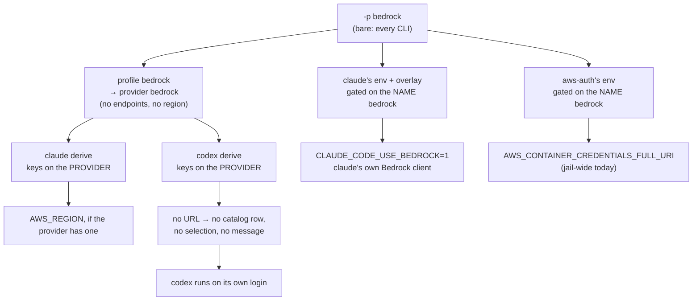

# Providers and profiles, redesigned: what `-p <name>` should mean

**Status:** DESIGN, 2026-09-25. [OQ-BR8](#OQ-BR8) and [OQ-BR2](#OQ-BR2) ruled 2026-09-29 (key facts on the provider, recognized by its `platform` field), and [PP-D1](#PP-D1) the same day; all three **built 2026-09-29** ([§8](#8-decision-ledger) has how), with the review's fixes the same day: a user's own provider of a platform co-claims its credential names ([PP-D9](#PP-D9)), a switch `yolo host apply` wrote is yolo's to clear and to name ([PP-D1](#PP-D1)), and a via no route carries claude through is disclosed ([PP-D4](#PP-D4)). Trap D5 is closed. [PP-D10](#PP-D10), the `profile` config key that mirrors `-p` and replaces `use_profiles`, was ruled and built the same day ([PP-D11](#PP-D11) has how). Triaged 2026-09-30: [OQ-PP2](#OQ-PP2) is answered by [OQ-BR1](bedrock-plumbing.md#OQ-BR1) with [OQ-WG2](wire-bridge-gateway.md#OQ-WG2), and [OQ-PP3](#OQ-PP3) by [OQ-AP3](active-provider-sets.md#OQ-AP3). [OQ-PP1](#OQ-PP1) stays open, restated against what those rulings built.
BUILT AND MEASURED BY TESTS ONLY: each moved fact is pinned where it is delivered, through the
credential gate and the shipped derives, for the shipped profile, a user's own profile over
`bedrock` and a user's own provider declaring `"platform": "aws-bedrock"`; no launch was run, no
agent was started and no request reached AWS.
MEASURED: the split between name-keyed gates and provider-keyed derives
([§2.2](#22-gates-key-on-the-name-derives-key-on-the-provider)), read at `7ad8358c`, re-read
at `f491d192`, and re-checked by grep at `ee8154f2` on 2026-09-24; the three copies of the
credential adapter's port and the test pinning all three against each other; every schema fact in
[§4](#4-the-marker-how-a-derive-recognizes-what-a-pick-is).
UNMEASURED: no launch was run for this doc. The loss a second profile suffers
([§2.1](#21-d5-a-second-profile-over-one-provider-silently-loses-every-gated-fact)) was measured
by a 2026-09-23 triage and re-derived here by reading the gates, not re-run.

**The question this doc answers.** When you type `yolo -p bedrock -- codex`, what did you
name? Today the answer is "a profile, which points at a provider, which some packs recognize by
the profile's spelling and others by the provider it resolves to". That answer produces four
confusions ([§2](#2-the-four-confusions)). This doc asks what a provider and a profile should
each mean, how a derive recognizes what a pick is, and whether any fact should key on a
profile's name at all.

**Why it exists.** It began as one question in [`bedrock-plumbing.md`](bedrock-plumbing.md):
[OQ-BR2](#OQ-BR2), a proposed `service` marker on the provider kind. In review on 2026-09-25 the
maintainer did not rule it:

> *"a bigger decision than you're making it look … could potentially remake how we do providers
> and profiles … I already don't love providers and profiles. I find it very confusing … an
> opportunity to dive deep and change that but this sounds like a design doc on its own."*

[OQ-BR8](#OQ-BR8) came with it, because it is the same function seen from the gate side.

**Where things stand.**

- **Built:** the provider system as [`providers.md`](../reference/providers.md) describes it —
  one composed provider table, profiles of exactly `{name, provider}`, and provider-keyed
  derives. Since 2026-09-29 a provider declares its `platform` ([OQ-BR2](#OQ-BR2)), every
  shipped provider fact keys on the provider ([OQ-BR8](#OQ-BR8)): packs/claude's
  endpoint-less `bedrock` provider declares `"platform": "aws-bedrock"`, claude's derive sets its
  Bedrock switch from that, and `packs/aws-auth`'s credential pointer gates on the platform. The
  name-keyed `profile` gate on `env` and `config-overlay` stays for a variant that really is a
  name; no shipped pack uses it.
- **Ruled, and binding here:** [OQ-BR4](provider-credential-scope.md#OQ-BR4) (2026-09-25): a
  profile's env must not leak to other agents, *"as specific as possible"*.
  [OQ-BR11](bedrock-plumbing.md#OQ-BR11) (2026-09-24): claude gets a native Bedrock profile
  and an everything profile. [DIR-BR3](bedrock-plumbing.md#decision-ledger) (2026-09-25): yolo
  ships `bedrock-runtime` only. [OQ-BR5](bedrock-plumbing.md#OQ-BR5) (2026-09-25): pi is
  supported both through its native Converse client and through the bridge.
- **Not ruled:** [OQ-PP1](#OQ-PP1), what `-p` names.

**Needs your ruling:** [OQ-PP1](#OQ-PP1). The questions, in the order they were asked:

1. ✅ [OQ-BR2](#OQ-BR2) — the marker, **ruled 2026-09-29: a `platform` field.** It gated builds, so it came first. _Leaning (⚠ changed
   2026-09-25):_ rule its substance now (a declared, open-vocabulary field, in both schemas),
   spelled so it survives any answer to [OQ-PP1](#OQ-PP1) — for example `platform` — and not
   spelled `service` or `native`.
2. ✅ [OQ-BR8](#OQ-BR8) — **ruled 2026-09-29:** gates key on the provider, in each agent's own
   derive. Which agents receive a fact is [OQ-CN6](provider-credential-scope.md#OQ-CN6)'s per-agent
   vehicle, now built.
3. [OQ-PP1](#OQ-PP1) — what is the one thing `-p` names? _Leaning (⚠ added 2026-09-30):_ (a),
   keep the profile over a provider as built, since every ruling since has built on the profile.
4. ✅ [OQ-PP2](#OQ-PP2) — **answered 2026-09-30 by [OQ-BR1](bedrock-plumbing.md#OQ-BR1) with
   [OQ-WG2](wire-bridge-gateway.md#OQ-WG2):** derived per agent, and a profile's `via` forces
   the bridge.
5. ✅ [OQ-PP3](#OQ-PP3) — **answered 2026-09-30 by [OQ-AP3](active-provider-sets.md#OQ-AP3):**
   one launch line naming the agents a bare `-p X` does not reach, never a refusal.

**Out of scope, and where it lives.** The credential delivery gate:
[`provider-credential-scope.md`](provider-credential-scope.md), whose
[OQ-CN1](provider-credential-scope.md#OQ-CN1) reads [OQ-BR8](#OQ-BR8). Bedrock's provider
shape and profile names: [`bedrock-plumbing.md`](bedrock-plumbing.md)
([OQ-BR9](bedrock-plumbing.md#OQ-BR9), [OQ-BR1](bedrock-plumbing.md#OQ-BR1)). Model lists:
[`model-lists-and-pickers.md`](model-lists-and-pickers.md). The deselection state machine:
[the providers reference](../reference/providers.md#deselection-clear-what-yolo-wrote-keep-what-the-user-wrote). Routing all traffic through the wire bridge:
[`wire-bridge-gateway.md`](wire-bridge-gateway.md). Rewriting
[`providers.md`](../reference/providers.md) happens only after this doc rules.

---

## 1. Today's model, in plain words

[`providers.md`](../reference/providers.md) is the as-built reference. This section is the
short version, and it restates nothing that reference owns.

**Provider and profile, in two sentences.** A
**provider** is a place models are served from (Bedrock, OpenRouter, a local server): its address
if it has one, its region, its model ids, and the name of the variable holding its key. A
**profile** is the name you type after `-p`; it picks one provider, plus options such as the
starting model.

The rest of today's model:

- **Who declares them.** Packs ship providers; the user's `providers` key overrides them. Each
  provider also lists the wire protocol each endpoint speaks and the options a profile may tune.
- **What a profile carries.** A pack's profile is exactly `{name, provider}`
  ([OQ-PT8](../reference/providers.md#oq-pt8)); a user's may add option values. Anything a pack
  does differently under a profile is a separate contribution carrying a `profile: "<name>"`
  gate.
- **Catalog versus selection.** A provider that reaches an agent is listed in that agent's
  directory of providers (catalog, by presence). Telling the agent to *use* it is a separate,
  explicit act (selection, by `-p` or `use_profiles`).
- A **derive** is the Lua hook in an agent's own pack that turns the provider table and the
  selection into that agent's config and environment, in that agent's vocabulary.
- An **endpoint-less provider** names no URL. It is correct where the agent's own client
  composes the URL itself, as claude's Bedrock mode does from a region.
- **Why derives key on a URL.** Every derive but claude's asks one predicate — a
  `providerEndpoint` helper returning nil when the provider has no URL for the protocol that
  agent speaks — and gates its catalog row and its selection on it. So an endpoint-less
  provider is invisible to codex, pi, opencode, oh-omp and copilot.
- **A bare `-p X`** keys the name onto every CLI the selected packs install; `-p codex=X`
  keys it onto one.

### 1.1 One worked example: `-p bedrock` on claude, and on codex

```mermaid
flowchart TD
  sel["-p bedrock<br/>(bare: every CLI)"] --> prof["profile bedrock<br/>→ provider bedrock<br/>(no endpoints, no region)"]
  prof --> cd["claude derive<br/>keys on the PROVIDER"]
  prof --> xd["codex derive<br/>keys on the PROVIDER"]
  sel --> g1["claude's env + overlay<br/>gated on the NAME bedrock"]
  sel --> g2["aws-auth's env<br/>gated on the NAME bedrock"]
  cd --> c1["AWS_REGION, if the provider has one"]
  g1 --> c2["CLAUDE_CODE_USE_BEDROCK=1<br/>claude's own Bedrock client"]
  g2 --> c3["AWS_CONTAINER_CREDENTIALS_FULL_URI<br/>(jail-wide today)"]
  xd --> x1["no URL → no catalog row,<br/>no selection, no message"]
  x1 --> x2["codex runs on its own login"]
```

For **claude**, three separate mechanisms together make Bedrock happen. The derive sees the
provider; two name-gated contributions switch claude into its native Bedrock mode and point the
AWS SDK at the credential adapter. For **codex**, the derive finds no URL and writes nothing,
and protocol resolution calls an endpoint-less provider "Direct against the agent's first-party
API" ([protocol-resolution.md](../reference/protocol-resolution.md#degenerate-inputs-and-what-each-resolves-to)),
so nothing refuses and nothing reports. codex goes on talking to OpenAI. Meanwhile the wide env
gate fires claude's and `aws-auth`'s variables for the whole jail — the leak
[OQ-BR4](provider-credential-scope.md#OQ-BR4) ruled must end.

### 1.2 Where the Bedrock split ended up

Which agent reaches Bedrock by which transport:
[bedrock-plumbing, Where the split ended up](bedrock-plumbing.md#where-the-split-ended-up). Where
the transport *lives* in the schema is this doc's [OQ-PP2](#OQ-PP2).

---

## 2. The four confusions

### 2.1 D5: a second profile over one provider silently loses every gated fact

> [!NOTE]
> **Closed 2026-09-29** by [OQ-BR8](#OQ-BR8)'s build: every fact below keys on the
> provider now, and a user profile `bedrock-sso` over `bedrock` gets all of them, as does a user
> provider with `"platform": "aws-bedrock"`. The text below is the trap as it stood.

**D5** (a trap label carried from bedrock-plumbing; closed). Every
`profile:`-gated contribution matches the profile NAME literally, while every derive matches
the PROVIDER the name resolves to. So a user profile `bedrock-sso` over provider `bedrock`
validates and selects, and then `-p bedrock-sso` delivers at most the provider's region. It
loses, silently:

- `CLAUDE_CODE_USE_BEDROCK` from claude's `bedrock`-gated `env` (`packs/claude/pack.json`);
- the `bedrock`-gated `claude/settings` overlay, in the same file;
- `aws-auth`'s `AWS_CONTAINER_CREDENTIALS_FULL_URI` pointer (`packs/aws-auth/pack.json`).

claude may then run first-party on whatever login it holds. Nothing reports it, by rule: an
inactive gate is a clean skip. MEASURED by the 2026-09-23 triage; INFERRED that no request
reached AWS. D5 is the twin of D2 (the wide env gate, now
[OQ-BR4](provider-credential-scope.md#OQ-BR4)'s): D2 fires a gate for the wrong agent, D5
fails to fire it for the right one.

**It breaks a case the design called supported.** The deleted
`provider-catalog-and-selection.md` (*What a profile is*, `git show
4e4ca2d1^:docs/design/provider-catalog-and-selection.md`, line 398) names *"a user adding a
second intent over the same provider"* as the case selection resolution exists for. The
SELECTION half was fixed: `ProviderFor` reads the resolved table, user profiles included. The
GATE half never moved. SOURCED from git history.

**It is about to become routine.** [OQ-BR11](bedrock-plumbing.md#OQ-BR11)'s everything
profile is a second claude profile over the Bedrock provider — D5's exact shape. It must not
set the name-gated `CLAUDE_CODE_USE_BEDROCK`, yet `aws-auth`'s pointer must still reach the
bridge.

### 2.2 Gates key on the name, derives key on the provider

MEASURED at `7ad8358c`, re-read at `f491d192`, re-checked at `ee8154f2`:

| Consumer | Keys on | Where |
| :--- | :--- | :--- |
| `env` gate | the literal NAME: `EnvFold` → `profileActive` → `installsActiveBin`, `profiles[bin] == name` | [`packload.go`](../../internal/packload/packload.go) |
| `config-overlay` gate | the literal NAME: `profiles[key.Agent] != ov.Profile` | [`packoverlay.go`](../../internal/packoverlay/packoverlay.go), `Collect` |
| surface derive | the PROVIDER: `packload.ProviderFor(resolved, profiles[s.Agent])` | [`packsurfaces.go`](../../internal/entrypoint/packsurfaces.go), `surfaceSelectionFor` |
| env derive | the PROVIDER: `selected := ProviderFor(cfg.resolved, profile)` | [`deriveenv.go`](../../internal/packload/deriveenv.go) |

Neither gate file calls `ProviderFor`. **Not Bedrock-specific:** the same name gate ships
twice more, MEASURED — `packs/pi/pack.json` gates the codex prelaunch env on the name `codex`,
and `packs/llamacpp/pack.json` gates `CLAUDE_CODE_ATTRIBUTION_HEADER=0` on the name
`llamacpp`.

### 2.3 The transport has nowhere to live

**Transport** (coined here) is which client carries an agent's model traffic to a provider:
the agent's own native client, or the wire bridge. Today it is never declared. It falls out of
three unrelated facts:

- for an endpoint-ful provider, the `adapter` pass composes the bridge's address into any
  provider that offers `openai` and lacks `anthropic`, and the resolver then *"cannot tell an
  adapted pairing from a native one"*
  ([protocol-resolution.md](../reference/protocol-resolution.md#the-four-outcomes));
- for claude on Bedrock, native mode is a name-gated env variable;
- for an endpoint-less provider, nothing distinguishes "the agent's first-party API" from "the
  agent's native Bedrock client".

So the everything profile can only express "use the bridge" by being a different profile
name, which is D5; and [OQ-BR1](bedrock-plumbing.md#OQ-BR1)'s naming question could not be
answered, because the thing the names should describe had no field. The maintainer's reading
was right: *"isn't it really provider native and then the wire bridge."*

### 2.4 A bare `-p X` silently does nothing for an agent that cannot reach X

`-p bedrock` in a jail with claude and codex writes nothing for codex and says nothing
([§1.1](#11-one-worked-example--p-bedrock-on-claude-and-on-codex)). bedrock-plumbing's
degenerate-input rule states the same for agy, and for copilot until the bridge serves the
provider: *"nothing written, no warning"*. The launch line prints DECLARED and RECEIVED and
never "honored" ([OQ-10](../reference/providers.md#pv-oq-10)), because what a derive does is
unobservable from the launcher. That is [OQ-PP3](#OQ-PP3), answered 2026-09-30: one launch line,
never a refusal.

---

## 3. Constraints any redesign keeps

- **Provider names are sole-owned across packs.** `KindProvider` combines with
  `CombineExclusive`, keyed by name (`internal/packdecl/kinds.go`): two packs shipping one
  provider name is a launch-refusing collision; one pack shipping two is ordinary. So no pack
  can add a field to another pack's provider row — `aws-auth` cannot annotate claude's
  `bedrock`. Profile names, by contrast, are sole-owned only *within* a pack: `bedrock` in two
  packs is two declarations sharing a selector value.
- **Two Bedrock providers are not a collision.** Two providers carrying the same marker are
  ordinary catalog rows, and only the selected one gets a selection key. It is the shipped case
  under bedrock-plumbing's two-provider fallback, and whenever a user declares a Bedrock provider
  of their own. Any marker design must keep it degenerate-safe.
- **"As specific as possible"** ([OQ-BR4](provider-credential-scope.md#OQ-BR4), 2026-09-25:
  *"no I don't want it to leak … certainly not Claude Code gets Bedrock"*). Every option below
  must deliver a provider's facts to the agent that selected it and no other. It is an input,
  not an answer.
- **No stringly-typed matches.** A derive testing `name == "bedrock-openai"` is what
  [`stringly-typed-references-principle.md`](../reference/stringly-typed-references-principle.md)
  forbids.
- **Core learns no agent's vocabulary** ([OQ-CS8](../reference/providers.md#oq-cs8)). What a
  marker or transport means for one agent is that agent's derive's business.

---

## 4. The marker: how a derive recognizes what a pick is

An endpoint-less provider needs a declared fact, because every derive but claude's keys
reachability on a URL. With a marker, codex's derive can say "this provider is Bedrock, select
my `amazon-bedrock-runtime` built-in and write `aws.region`" without a URL. The marker has
consumers queued behind it: bedrock-plumbing's native derives, the bridge's decision to sign,
and [OQ-BR22](bedrock-web-search.md#OQ-BR22)'s search-preset gate.

The three candidates, and what the tree says about each:

| Candidate | Verdict |
| :--- | :--- |
| A declared field on the provider kind (drafted as `service: "aws-bedrock"`), open vocabulary, unknown values inert | The old leaning: explicit, greppable, survives a second regional service. Tolerating unknown values is the version-skew rule the open `endpoints` key set already follows |
| Match the provider by NAME in each derive | **Rejected.** Stringly typed; breaks the moment a user declares a Bedrock provider under another name |
| Implicit: "has `region`, has no `endpoints`" | **Fails today.** SOURCED: packs/claude's `bedrock` provider declares neither |

**Two costs the old leaning did not state** (MEASURED from the repo, 2026-09-24):

- **`service` already names something.** `kind: "service"` is the contribution kind
  `packs/wire-bridge` ships, an in-jail daemon. A provider *field* named `service` gives one word
  two meanings in one manifest vocabulary.
- **It lands in two schemas.** A user-declared provider's key set is CLOSED:
  `knownProviderKeys` in `internal/config/config.go` accepts `base_url`, `endpoints`,
  `wire_api`, `api_key_env_name`, `models`, `region`, `capabilities` and `options`, and refuses
  anything else. So a user's own Bedrock provider cannot carry the marker until it is added there
  as well as to `internal/packdecl`.

**What the marker is not.**

- **Not a `wire_api` value.** Bedrock is not a protocol: its native clients speak Responses,
  Converse and the AWS SDK's own shapes. A service name in the canonical protocol enum is the
  pass-through mistake [OQ-PT1](../reference/providers.md#oq-pt1) closed, one field over.
- **Not an `endpoints` key.** `validateProviderEndpoints` in `internal/packdecl/contributes.go`
  refuses an endpoint with no `base_url` (`endpoints[%q]: needs a "base_url"`), and a pack cannot
  ship a Bedrock URL, because the URL contains a region the pack does not know. MEASURED from the
  code.

**Why it is bigger than a field.** The marker answers "what service is this?", which is half of
what a pick means. The other half is "by which transport does *this* agent reach it?"
([§2.3](#23-the-transport-has-nowhere-to-live)). Adding the marker without deciding the
transport's home leaves the everything profile distinguished only by its name. That is why
[OQ-BR2](#OQ-BR2) is asked beside [OQ-PP1](#OQ-PP1) and [OQ-PP2](#OQ-PP2), not after them.

---

## 5. What waits on this doc

- **First deliverable: the marker ruling, or its replacement.** Then the field lands in
  `internal/packdecl` and `knownProviderKeys` with its tolerance behavior. This was
  bedrock-plumbing's build step 2. **Built 2026-09-29** (`packdecl.PlatformProblem`): a derive reads it as
  `ctx.selected_platform`, and claude's derive and aws-auth's pointer already key on it.
- **Built after it:** bedrock-plumbing's native derives (codex, opencode, pi), and
  [OQ-BR22](bedrock-web-search.md#OQ-BR22)'s Bedrock gate on the search preset.
- **Not gated on it:** the bridge's SigV4 signer.
  [OQ-WG1](wire-bridge-gateway.md#OQ-WG1) leans toward keying the signer on the upstream host
  rather than on a provider marker, so the signer does not wait here.
- **Built with [OQ-BR8](#OQ-BR8):** closing D5, together with D2's fix under
  [OQ-BR4](provider-credential-scope.md#OQ-BR4), each with a test that fails when the call site
  is deleted. **Built 2026-09-29** ([PP-D2](#PP-D2) to [PP-D6](#PP-D6)).

---

## 6. Rulings this doc may reopen

| Ruling | What it settled | How this doc touches it |
| :--- | :--- | :--- |
| [OQ-CS9](../reference/providers.md#oq-cs9) | Profiles point at a provider; no `extends` | Rules out `bedrock-sso extends bedrock` ([OQ-BR8](#OQ-BR8)). Under [OQ-PP1](#OQ-PP1) (b) or (c) it is moot for profiles, but may reappear as a provider-level `extends` |
| [OQ-PT8](../reference/providers.md#oq-pt8), 2026-09-01 | A profile is `{name, provider}`; its body moved onto name-keyed `profile:` contributions | Does **not** answer [OQ-BR8](#OQ-BR8): name versus provider was a consequence, never a choice. [OQ-PP1](#OQ-PP1) (b) would make the `profile` kind an alias or delete it |
| [OQ-PT3](../reference/providers.md#oq-pt3) | A provider's fact is composed from the provider, not restated in a gated overlay | The precedent [OQ-BR8](#OQ-BR8)'s leaning follows |
| [agent-auth-modes OQ-9](agent-auth-modes.md#OQ-9) | Still open: AWS's two-part credential has no declarative home | Same question as [OQ-CN1](provider-credential-scope.md#OQ-CN1) from the credential side; a transport or marker field may give it one |

---

## 7. Open Questions

1. ✅ **[OQ-BR2](#OQ-BR2): How does a derive recognize what a provider is
   (the marker)?** Moved here from bedrock-plumbing on 2026-09-25, id kept. Candidates and costs
   are [§4](#4-the-marker-how-a-derive-recognizes-what-a-pick-is): a declared field, matching the
   name (rejected), or the implicit reading (fails today). Stakes: it gates bedrock-plumbing's
   native derives and [OQ-BR22](bedrock-web-search.md#OQ-BR22), it is the one piece of the Bedrock
   work that touches core, and it is the first stone of whatever [OQ-PP1](#OQ-PP1) builds. **Not
   ruled 2026-09-25** — the maintainer's words are this doc's opening.

   > [!WARNING]
   > **⚠ Leaning changed 2026-09-25.** The old leaning, in bedrock-plumbing, was a provider field
   > spelled `service: "aws-bedrock"`, open vocabulary, unknown values inert. The substance stays.
   > The spelling moved because `service` already names a contribution kind
   > ([§4](#4-the-marker-how-a-derive-recognizes-what-a-pick-is)), and the question moved because
   > the maintainer declined to rule it as a field.

   _Leaning:_ Rule the substance now so the builds are not held for the whole redesign: a
   declared, open-vocabulary field on the provider, unknown values inert, accepted by both
   `internal/packdecl` and `knownProviderKeys`. Spell it for what the service IS, not how it is
   reached: for example `platform: "aws-bedrock"` (coined here). Not `service`, which already
   names a contribution kind, and not `native`, which is a transport value in
   [OQ-PP1](#OQ-PP1) (c). It also gives [OQ-PP2](#OQ-PP2)'s derived transport the fact it reads.
   This asks again for the narrow ruling you declined once. It is safe to give because whatever
   [OQ-PP1](#OQ-PP1) decides about profiles, a provider still has to say what it is, so the field
   survives every option there. What still waits on it is bedrock-plumbing's build steps 3–5 (the
   `bedrock` pack's provider, then the codex, opencode and pi native bindings) and
   [bedrock-web-search](bedrock-web-search.md)'s step 9.3, the search preset's Bedrock gate
   ([OQ-BR22](bedrock-web-search.md#OQ-BR22)). The bridge's signer does not wait: [OQ-WG1](wire-bridge-gateway.md#OQ-WG1)
   leans toward keying it on the upstream host.

   **Answer:**
   > **Ruled 2026-09-29, as leaned.** A provider declares what service it is in an
   > open-vocabulary field, `platform` (for example `"platform": "aws-bedrock"`), accepted by
   > both `internal/packdecl` and `knownProviderKeys`, with unknown values inert. A derive
   > recognizes Bedrock by that field, never by a name, so a provider a user defines gets the
   > same behavior as the shipped one, which completes [OQ-BR8](#OQ-BR8).

2. ✅ **[OQ-BR8](#OQ-BR8): Does a contribution's gate key on the profile
   NAME or on the provider it selects?** Moved here from bedrock-plumbing on 2026-09-25, id kept.
   It is [OQ-BR4](provider-credential-scope.md#OQ-BR4)'s other direction: BR4 ruled that a gate
   must not fire for the wrong agent; this asks why it fails to fire for the right one
   ([§2.1](#21-d5-a-second-profile-over-one-provider-silently-loses-every-gated-fact),
   [§2.2](#22-gates-key-on-the-name-derives-key-on-the-provider)). Stakes: whether a second intent
   over a shipped provider is supported or a silent trap; whether the credential adapter's port
   stays written three times ([appendix](#appendix-evidence-and-how-to-re-check-it)); whether
   [OQ-BR11](bedrock-plumbing.md#OQ-BR11)'s everything profile can work; and whether
   [OQ-CN1](provider-credential-scope.md#OQ-CN1) can gate credentials by provider.

   | Option | Verdict |
   | :--- | :--- |
   | **Key provider facts on the provider**, in the agent's own derive on `ctx.selected_provider`, then on [OQ-BR2](#OQ-BR2)'s marker | **Leaning** |
   | A profile `extends` another, inheriting its gates | **Rejected**: reopens [OQ-CS9](../reference/providers.md#oq-cs9) |
   | The gate matches the selected provider's NAME instead | **Weaker**: the fact stays in a manifest keyed on one provider name, so a variant provider loses it again |
   | Warn at launch when a gate's name differs from the selected profile over the same provider | **Rejected as the fix**: reports the trap instead of removing it. Kept only as a `yolo check` note for a USER pack |

   The leaning, concretely:

   - claude's `CLAUDE_CODE_USE_BEDROCK` moves into claude's derive, in env and settings;
   - llamacpp's attribution header becomes a provider option;
   - pi's codex prelaunch env moves into a pi derive;
   - `aws-auth`'s adapter address is composed into a provider row, as codex's Responses address
     already is (the `openai-codex` provider's `endpoints` in `packs/openai-auth/pack.json`). That
     removes the duplicated `1461` and makes the pointer fire for the right provider; it reaches
     only the selecting agent once [OQ-CN6](provider-credential-scope.md#OQ-CN6)'s per-agent
     vehicle exists. Because provider names are
     sole-owned ([§3](#3-constraints-any-redesign-keeps)), `aws-auth` ships its own provider
     rather than annotating claude's;
   - two variants of one service are two PROVIDERS, not two profiles over one.

   A derive runs per agent, but today its output still lands in the one shared env file every
   process reads ([provider-credential-scope §2.7](provider-credential-scope.md#27-one-shared-file-five-readers)).
   So keying on the provider makes a fact fire for the right provider, which closes D5, and a
   provider-keyed fact reaches only the selecting agent once
   [OQ-CN6](provider-credential-scope.md#OQ-CN6)'s per-agent vehicle exists. The `claude/settings`
   half of claude's flag is per-agent already; the env half is not. So this option is necessary
   for [OQ-BR4](provider-credential-scope.md#OQ-BR4)'s *"as specific as possible"*, not
   sufficient. The everything profile then differs from the native one by provider or by a
   transport option ([OQ-PP2](#OQ-PP2)), never by name.

   **Working today, as a workaround** (MEASURED by the 2026-09-23 triage): declare a second
   provider in user `providers` (for example `bedrock-sso`, with its own `region`) and a profile
   over it, then a local pack at `~/.config/yolo-jail/local` whose `env` and `config-overlay`
   contributions are gated on the new name, restating `CLAUDE_CODE_USE_BEDROCK=1` in both and
   `AWS_CONTAINER_CREDENTIALS_FULL_URI=http://127.0.0.1:1461/credentials` — the fourth copy of
   the port, checked by nothing.

   _Leaning:_ The first option, as the bullets above spell it, built with
   [OQ-BR4](provider-credential-scope.md#OQ-BR4)'s fix, which is the same function.

   **Answer:**
   > **Ruled 2026-09-29, as leaned: key provider facts on the provider, never the profile's
   > name.** The maintainer: *"just because you have a differently named profile here doesn't mean
   > that things should happen differently. So we need to fix this bug. Like you need to be able to
   > define your own and get the same behavior."* The facts move into each agent's derive on
   > `ctx.selected_provider` now, which fixes a user's own profile over a shipped provider
   > (`-p bedrock-sso` over `bedrock`). "Define your own" also covers a user's own PROVIDER, which
   > a provider-name test would miss again; that half needs [OQ-BR2](#OQ-BR2)'s marker, so BR2 is
   > the remainder and goes to the next review set. The everything profile's switch-but-pointer
   > split (a transport check, not only "the provider is Bedrock") is part of the build.

3. 💬 **[OQ-PP1](#OQ-PP1): What is the one thing a user names with `-p`?**
   The redesign's core.

   | Option | What `-p bedrock` names | Costs |
   | :--- | :--- | :--- |
   | **(a)** Today's indirection | a profile, which points at a provider | D5 survives unless [OQ-BR8](#OQ-BR8) moves every fact to the provider; two names for one thing remain to explain. The cheapest path is (a) plus [OQ-BR8](#OQ-BR8)'s leaning, which removes D5's harm without removing the indirection |
   | **(b)** A provider directly, plus options | the provider `bedrock`; options ride the flag or `use_profiles` | D5 cannot exist. The `profile` kind of [OQ-PT8](../reference/providers.md#oq-pt8) becomes an alias or goes. A variant must be a second provider, and without inheritance it restates the first's facts — so [OQ-CS9](../reference/providers.md#oq-cs9)'s "no `extends`" returns as a question about providers. Pack profiles whose name differs from their provider (`codex` → `openai-codex`) need a migration |
   | **(c)** A provider plus an explicit transport | the provider, and `native` or `bridge` per agent | D5 cannot exist, and the everything profile is spelled, not named. Every user must know what a transport is, and the flag grammar grows. Overlaps [OQ-PP2](#OQ-PP2) |

   > [!WARNING]
   > **⚠ Restated 2026-09-30, same letters.** The rulings made around this question since it was
   > filed have each built on the profile. [OQ-BR8](#OQ-BR8) is built, so D5 is closed: a renamed profile over a
   > shipped provider gets every fact. [OQ-AP1](active-provider-sets.md#OQ-AP1) chose a list of
   > PROFILES per agent over a list of providers, because a provider loses a profile's options
   > (the start model among them). [PP-D10](#PP-D10) made `profile` the config key that mirrors
   > `-p`. [OQ-BR1](bedrock-plumbing.md#OQ-BR1) and [OQ-WG2](wire-bridge-gateway.md#OQ-WG2) put
   > the force-the-bridge switch on the profile (*"this should be a property of the profile"*).
   > The options now cost this:
   >
   > - **(a) Keep the profile, pointing at one provider.** Nothing moves. What is left of the
   >   complaint is two nouns to explain, and that is a rewrite of
   >   [`providers.md`](../reference/providers.md) in plain words, which this doc already defers
   >   until it rules.
   > - **(b) `-p` names a provider, and options ride the flag.** Everything since has to be
   >   respelled: the `-p` list grammar and the `profile` key ([AP-D13](active-provider-sets.md#AP-D13),
   >   [PP-D11](#PP-D11)), `bedrock-bridge` and a user profile's `via` as provider options, and
   >   `-p codex` (today the profile `codex` over the provider `openai-codex`), which needs a
   >   migration. A variant becomes a second provider that restates the first, so a provider-level
   >   `extends` comes back as a question ([OQ-CS9](../reference/providers.md#oq-cs9)).
   > - **(c) A provider plus a transport the user types.** Overtaken:
   >   [OQ-BR1](bedrock-plumbing.md#OQ-BR1) ruled the transport native by default and forced only
   >   by configuration (*"by default we should pick the right thing, the native by default, but
   >   we should allow configurations to force the bridge"*), and [OQ-PP2](#OQ-PP2) is answered
   >   the same way.

   <!-- vantage: oq id=OQ-PP1 leaning="(a), keep what is built: -p names a profile, and a profile points at one provider plus its options. D5 is closed (OQ-BR8), and every ruling since built on the profile (OQ-AP1's lists, PP-D10's profile key, OQ-WG2's via). The remaining cost is two nouns to explain, which is a plain-words rewrite of providers.md, not a schema change. (c) is overtaken by OQ-BR1." -->

   _Leaning (⚠ added 2026-09-30):_ **(a), keep what is built.** The doc first had no leaning,
   deliberately, so as not to steer the redesign. Since then [OQ-BR8](#OQ-BR8) has closed D5 and
   the rulings above have steered it: each built on the profile. What the maintainer *"already
   doesn't love"* is having two nouns, and that is now a documentation problem. (b) would reopen
   the shipped rulings above to remove it. The first strawman was (b), because it deleted the layer D5
   lived in, and that reason went when D5 was closed.

   **Answer:**
   > _(empty — fill in when decided)_

4. ✅ **[OQ-PP2](#OQ-PP2): Is the transport declared, or derived per
   agent?** Either the provider declares which transport serves which agent (the agent's native
   client or the wire bridge), so derives, the bridge and the search preset all read one fact;
   or yolo derives the transport per agent from what that agent can do: a native client for the
   provider's marker wins, else the bridge if it carries the provider, else nothing. Stakes: where
   [§2.3](#23-the-transport-has-nowhere-to-live)'s missing fact lives, and whether a provider
   author must know every agent. It reads [OQ-BR1](bedrock-plumbing.md#OQ-BR1) and does not block
   it.

   _Leaning:_ Derived, with one opt-in name for "force the bridge" (the everything profile's
   case, and [OQ-BR5](bedrock-plumbing.md#OQ-BR5)'s bridged pi). A declared per-agent table puts
   agent knowledge in a provider, against [OQ-CS8](../reference/providers.md#oq-cs8), and
   protocol resolution already derives the endpoint-ful half this way — an adapter fills a hole
   and is never preferred over a native endpoint. This confirms
   [OQ-BR1](bedrock-plumbing.md#OQ-BR1)'s Bedrock leaning for every provider.

   **Answer:**
   > **Answered by [OQ-BR1](bedrock-plumbing.md#OQ-BR1) (2026-09-29), with
   > [OQ-WG2](wire-bridge-gateway.md#OQ-WG2) (2026-09-25): derived per agent, with an opt-in on
   > the profile that forces the bridge.** The maintainer, ruling BR1: *"by default we should pick
   > the right thing, the native by default, but we should allow configurations to force the
   > bridge."* Ruling WG2: *"this should be a property of the profile."* So no provider declares a
   > per-agent transport table. Each agent's derive uses its own native client for the provider's
   > `platform` or endpoints, the bridge carries the agents that have none, and a profile's `via`
   > forces the bridge. The native half is built for Bedrock. The forcing half ships as
   > `bedrock-bridge` ([BR-D16](bedrock-plumbing.md#BR-D16)), which carries every agent since the
   > bridge reached Bedrock by region on 2026-09-30
   > ([`wire-bridge-gateway.md` WG-I39](wire-bridge-gateway.md#WG-I39)).

5. ✅ **[OQ-PP3](#OQ-PP3): What should a bare `-p X` do for an agent that
   cannot reach X?** Today: nothing written, nothing said
   ([§2.4](#24-a-bare--p-x-silently-does-nothing-for-an-agent-that-cannot-reach-x)). Stakes: a
   silent no-op looks exactly like a working selection, which is the failure
   [OQ-10](../reference/providers.md#pv-oq-10) guards against; but a refusal would stop every
   multi-agent jail whose other agents cannot reach X. Cost: the launcher cannot see what a
   derive does, so naming unreachable agents needs a reachability predicate it can compute —
   which exists only once [OQ-BR2](#OQ-BR2)'s marker and [OQ-PP2](#OQ-PP2)'s transport do.

   _Leaning:_ One launch line naming the agents X does not reach. A disclosure, never a
   refusal, so a jail with several agents still launches.

   **Answer:**
   > **Answered by [OQ-AP3](active-provider-sets.md#OQ-AP3) (2026-09-29): one launch line
   > naming the agents the selection does not reach, and never a refusal.** The maintainer, ruling
   > what a provider list with no agent named does: *"if you don't direct it at a specific agent,
   > then we should print out a message showing you if you give a comma separated list, if you
   > have agents that don't support it on your pack list, we're going to print out that these
   > will only get the first one and the others will be ignored."* That question named this one as
   > the case it meets. A bare `-p X` is the same kind of selection, aimed at no agent in
   > particular: an agent that cannot reach X is named on one line, and the launch goes on. **Not
   > built.** The line needs a reachability predicate on the launcher side. The `platform` marker
   > it reads is built ([OQ-BR2](#OQ-BR2)), and [OQ-PP2](#OQ-PP2)'s answer (derived per agent)
   > says how it decides.

### Decision Ledger

The rulings and the decisions that built them are in [§8](#8-decision-ledger). Why this doc
exists, and the maintainer's words that started it, are under **Why it exists** at the top and
in [OQ-BR2](#OQ-BR2).

---

## 8. Decision ledger

| ID | Ruling / Decision | Date | Built |
| :--- | :--- | :--- | :--- |
| [OQ-BR8](#OQ-BR8) | **Maintainer ruling:** a provider fact keys on the provider, in each agent's derive, never on the profile's name; a user-defined provider gets the same behavior through [OQ-BR2](#OQ-BR2)'s marker | 2026-09-29 | ✅ [PP-D2](#PP-D2) to [PP-D6](#PP-D6) |
| [OQ-BR2](#OQ-BR2) | **Maintainer ruling:** the marker is a declared provider field, `platform`, open vocabulary, unknown values inert | 2026-09-29 | ✅ [PP-D7](#PP-D7) |
| PP-D1 | **Maintainer ruling, from a rollout review:** yolo obeys a Bedrock switch (`CLAUDE_CODE_USE_BEDROCK`) that a user wrote in their own Claude settings, and when no Bedrock provider is selected for claude, so the credential gate sends it no AWS credential, the launch prints one line naming the conflict and both fixes (`-p bedrock`, or remove the key). yolo deletes nothing it did not write: the maintainer's *"there could be any uncountable number of environment variables … that we can just like never know about"* rules deletion out; the line exists because the gate is yolo's, so the failure is yolo's to name. **The same premise read from yolo's side** (review, 2026-09-29): a switch `yolo host apply` wrote into the real file for claude's host selection is yolo's, so the next apply that stops asserting it removes it ([HC-D25](host-computed-layer.md#HC-D25)), and while it is there the line names it as yolo's write, never as the user's | 2026-09-29 | ✅ [PP-D8](#PP-D8); yolo's own write [HC-D25](host-computed-layer.md#HC-D25) |
| PP-D2 | *Implementation decision.* **Where each name-gated fact went.** claude's `CLAUDE_CODE_USE_BEDROCK`, in env and in `claude/settings`, into claude's own derive, set when `ctx.selected_platform` is `aws-bedrock` and the profile routes through no via service. claude's and pi's OpenAI login prelaunch into their env derives (pi gained a `yolo.env` producer), keyed on the selected provider `openai-codex`: that provider is every agent's built-in subscription provider id, which the derives already match by name, so it takes no platform. llamacpp's `CLAUDE_CODE_ATTRIBUTION_HEADER` became the provider option `attribution_header: "false"`, which claude's derive translates; only claude receives it now. aws-auth's pointer: PP-D3 | 2026-09-29 | ✅ `nativeBedrock` in packs/claude's derive |
| PP-D3 | *Implementation decision.* **aws-auth's pointer rides a `platform` gate on its `env` contribution, not a composed provider row.** The ruling's shape was "composed into a provider row, as openai-codex's endpoints are". The pointer carries a per-launch secret (`{caller_token}`) that no composed table may hold ([providers.md](../reference/providers.md#what-this-does-not-license)), and its `served_by` and `overridden_by` declarations live on the contribution. So `env` takes a second gate, `platform: "
"`, which fires for each agent whose selected provider declares that platform: the recipients a row composed into every such provider would have had. One gate per contribution, `profile` or `platform` | 2026-09-29 | ✅ aws-auth's `env` `platform` gate |
| PP-D4 | *Implementation decision.* **The everything profile's split is a transport check.** claude's native switch requires `ctx.via_url` empty, so a profile over the Bedrock provider with `via: "wire-bridge"` gets aws-auth's pointer and not the switch. At `yolo host`, which serves no via, the same profile falls back to claude's own client and sets the switch. ⚠ **Claude has no via route**, found in review: claude speaks `anthropic`, and the via route passes only the two OpenAI wires. Since 2026-09-30 the everything profile carries claude through the bridge's adapter route instead, on an anthropic address composed for the via ([`wire-bridge-gateway.md` WG-I39](wire-bridge-gateway.md#WG-I39)); before that such a profile ran claude on its own login with a pointer nothing used. The via-route gate still discloses a via that carries none of an agent's requests, naming the agent's own switch for the provider's platform (`unroutedViaNotice`), and never refuses it: a Bedrock provider whose anthropic address is its own is one | 2026-09-29 | ✅ `nativeBedrock`; the disclosure `unroutedViaNotice` |
| PP-D5 | *Implementation decision.* **One selection answers every gate.** `packload.GateSelection` carries each agent's profile and the platform of the provider it resolves to (`SelectionOf`, over the launch's own table). The credential gate builds it and hands it out (`CredentialScope.Selection`); the fold, the env-override pre-flight at both notches and `yolo check` read that one. The jail-daemon payload is decided before the channel composes, so it builds the same selection itself (`daemonSelection`), and aws-auth's adapter starts for a user profile over `bedrock` and for a user Bedrock provider | 2026-09-29 | ✅ `packload.GateSelection` |
| PP-D6 | *Implementation decision.* **The `profile` modifier stays; shipped packs stop using it.** A name gate still suits a variant that really is a name, and a user's local pack may carry one. `TestNoShippedPackKeysAFactOnAProfileName` fails if a shipped pack reintroduces one. Consequence: pi's new env producer ends the host's "nothing reads the table" excuse for pi on a codex profile whose provider no selected pack ships; the shipped pi `needs` openai-auth, so only a hand-built pack set meets that refusal | 2026-09-29 | ✅ pinned by `TestNoShippedPackKeysAFactOnAProfileName` |
| PP-D7 | *Implementation decision.* **`platform` is shape-checked and user-scope only.** One token, no whitespace (`packdecl.PlatformProblem`, shared by the manifest and config validators). A workspace `providers.<name>.platform` is refused like `api_key_env_name`, because the platform gate decides which agents receive aws-auth's pointer. Exposed to a derive as `ctx.selected_platform`, read off the selected provider's composed row | 2026-09-29 | ✅ `packdecl.PlatformProblem` |
| PP-D8 | *Implementation decision.* **The switch is the agent pack's declaration.** Core names no agent's file or variable, so a program declares `platform_switches` (`{platform, surface, pointer}`); packs/claude declares `aws-bedrock` at `/env/CLAUDE_CODE_USE_BEDROCK` in `claude/settings`. `packload.PlatformSwitchConflicts` reads it from the user's own copy of that `readsHost` surface, on when true, 1, yes or on. The line prints before the provider pre-flight on every jail arm (fresh container launch, attach, macos-user) and at `yolo host --`; it offers a declared profile over a provider of the platform with no via. It says what yolo delivers, not that the launch fails: at `yolo host` the user's own credentials may still serve claude. Not read: a switch captured from an in-jail edit of the settings file, and the process environment | 2026-09-29 | ✅ `packdecl.PlatformSwitch` |
| PP-D9 | *Implementation decision, revised by the review the same day.* **The credential claims follow the platform.** A composed provider that declares a `platform` and no `api_key_env_name` of its own co-claims every name a same-platform provider in the composed table lists (`packload.credentialClaims`); one that lists its own keeps exactly those, and only a provider's own list is inherited. So a user's `"platform": "aws-bedrock"` provider keeps the six AWS names the shipped `bedrock` claims ([CN-D2](provider-credential-scope.md#7-decision-ledger)) to its agents, like the region variables, which are a platform fact too ([BR-D1](bedrock-plumbing.md#BR-D1)). The first build left the claims out and said such a key "reaches every process"; the review measured the opposite: the shipped `bedrock`, always in the table beside it, still claimed the names, so the gate withheld them from every process, the agent on the user's provider included, and claude started in Bedrock mode with no AWS credential and no word of it. The claim model still reads the composed table alone: the platform is a field of the composed entry, and the pre-flight, which asks for exactly one named key, is unchanged | 2026-09-29 | ✅ `packload.credentialClaims` |
| PP-D10 | **Maintainer ruling** (in chat): *"yes, let's go with your profile proposal. fire that off now."* The proposal it accepted: the persistent selection becomes the `profile` key, mirroring `-p`/`--profile` exactly. `"profile": "bedrock"` is `-p bedrock` (every agent); `"profile": { "pi": "codex", "claude": "bedrock" }` is `-p pi=codex,claude=bedrock`; `"profile": { "*": "bedrock", "pi": "codex" }` is `-p bedrock -p pi=codex`, *"`"*"` is every agent not named"*; and a list value (`{ "pi": ["zai", "openrouter"] }`) once the provider-list build lands (built 2026-09-30 as [AP-D13](active-provider-sets.md#AP-D13): `{ "pi": ["zai", "openrouter"] }` is `-p pi=zai,openrouter`, and the list form and a list under `"*"` are `-p zai,openrouter`). *"`"*"` can't collide with an agent, because agents are named by the program they install and no program is called `*`."* `use_profiles` is *"refused by name, with the new spelling in the message"*. It *"stays user-scope only, as today: a repo's committed config can't pick where your credentials go."* The key follows whatever [OQ-PP1](#OQ-PP1) decides `-p` names. The cost the maintainer accepted: `profile` (which to use) and `profiles` (the declarations) differ by one letter | 2026-09-29 | ✅ [PP-D11](#PP-D11); the list value ✅ 2026-09-30 ([AP-D13](active-provider-sets.md#AP-D13)) |
| PP-D11 | *Implementation decision.* **One shape and one fold for both spellings, and a pair keeps its CLI beside a bare `-p`.** The key and every `-p` value lower to `config.ProfileSelection` (a default and per-CLI entries), and `config.ProfileTableFor` is the one function that turns selections into the CLI-keyed table, at the jail launch, `yolo host --` and `yolo host env`, `yolo host apply`, the host footer, the overlay gate, `yolo check` and the selection closure. The precedence between the two sources is kept: every `-p` form beats every key form for each CLI it reaches. Within one source a named CLI keeps its entry and the default reaches every other CLI the selected packs install, never the command after `--`. That is a change to `-p`, which the ruling's equation requires: a bare `-p` was folded last and overwrote a pair typed beside it, so `-p bedrock -p pi=codex` ran pi on bedrock. A null entry keeps `"*"` off its agent; an empty name is refused, null being the spelling of none. At `yolo host` the default reaches the one command only when a selected pack installs it, so an ad-hoc command is neither refused nor handed a profile. `use_profiles` is an error on the host, respelling the user's own entries under the new key, at every host reader of the selection: `yolo host --` and `yolo host env`, `yolo host apply` in both postures, the automatic apply a wrapped launch runs (asked before its observe pass) and `yolo config render --at host` each run the provider and profile section of validation over user scope. The review found the first build refusing it at the two launch verbs alone: `yolo host apply --assert` read the selection off the new key, ignored the old one, and deselected the profile an earlier apply had written into the real home. It is a warning in-jail, where a snapshot an older launcher wrote carries it (the `agent_profiles` precedent); a workspace carrying it gets the rename and the user-scope refusal together. What crosses into a jail is unchanged: `YOLO_USE_PROFILES` is the folded table, the derive still reads it as `ctx.use_profiles`, and the inherited snapshots carry `profile` verbatim, `"*"` included. The list value landed where this row said it would, in the two fields of `ProfileSelection`, which are now ordered lists ([AP-D13](active-provider-sets.md#AP-D13), 2026-09-30): `config.ParseProfileFlag` reads -p's comma continuation, `ProfileSelectionOf` a JSON array, `validateProfile` checks both shapes, and the fold (`config.FoldProfiles`, whose table `ProfileTableFor` returns) emits a set and narrows a list naming no agent (the key's list form, a list under `"*"`, a bare `-p`) to its first entry for an agent whose pack declares no `provider_sets`, saying so at launch. The precedence and the pair-beside-a-bare-`-p` rule above are unchanged | 2026-09-29 | ✅ `config.ProfileSelection`, `config.FoldProfiles` and `config.ProfileTableFor`; pinned by `internal/cli/profilekeyflag_test.go` (its list rows included), `internal/cli/run/profilekey_test.go`, `internal/cli/hostprofilekey_test.go` and `internal/config/profileselection_test.go` |
| [OQ-PP2](#OQ-PP2) | **Answered by [OQ-BR1](bedrock-plumbing.md#OQ-BR1)'s ruling** (2026-09-29, the maintainer: *"by default we should pick the right thing, the native by default, but we should allow configurations to force the bridge"*) **and [OQ-WG2](wire-bridge-gateway.md#OQ-WG2)'s** (2026-09-25: *"this should be a property of the profile"*). The transport is derived per agent (a native client for the provider's `platform` or endpoints, else the bridge), and a profile's `via` forces the bridge. No provider declares a per-agent table, which also keeps agent knowledge out of providers ([OQ-CS8](../reference/providers.md#oq-cs8)) | 2026-09-30 | ✅ the native half for Bedrock ([BR-D9](bedrock-plumbing.md#BR-D9) to [BR-D14](bedrock-plumbing.md#BR-D14)); `bedrock-bridge` ships with no agent routed until the bridge has a Bedrock upstream ([BR-D16](bedrock-plumbing.md#BR-D16)) |
| [OQ-PP3](#OQ-PP3) | **Answered by [OQ-AP3](active-provider-sets.md#OQ-AP3)'s ruling** (2026-09-29, the maintainer: *"if you don't direct it at a specific agent, then we should print out a message showing you … these will only get the first one and the others will be ignored"*). A bare `-p X` names, on one launch line, each agent it does not reach, and never refuses, so a jail with several agents still launches | 2026-09-30 | no: needs a launcher-side reachability predicate over the `platform` marker and the derived transport |

## Appendix: Evidence, and how to re-check it

Repo claims re-checked at `ee8154f2` on 2026-09-24. Re-run these rather than trusting the text.

| Claim | Label | Re-check |
| :--- | :--- | :--- |
| Neither gate calls `ProviderFor`; both derives do | MEASURED | `rg -n ProviderFor internal/packload/packload.go internal/packoverlay/packoverlay.go internal/entrypoint/packsurfaces.go internal/packload/deriveenv.go` |
| The env gate's wide pass matches any installed bin | MEASURED | `profileActive` and `installsActiveBin` in [`packload.go`](../../internal/packload/packload.go) |
| Name gates in claude, aws-auth, pi and llamacpp | MEASURED | `rg -n '"profile":' packs/claude/pack.json packs/aws-auth/pack.json packs/pi/pack.json packs/llamacpp/pack.json` |
| The adapter port `127.0.0.1:1461` is written three times | MEASURED | `rg -n 1461 internal/awscredadapter/handler.go packs/aws-auth/pack.json packs/aws-auth/loopholes/aws-auth/manifest.jsonc` — `DefaultListen`, the daemon's `--listen`, the pointer's value |
| All three shipped copies are pinned against each other; a user pack's copy is checked by nothing | MEASURED / INFERRED | `TestAWSAuthPointerAndAdapterAgreeOnThePort` in [`aws_auth_pointer_test.go`](../../packs/aws_auth_pointer_test.go) builds the wanted URI from `awscredadapter.DefaultListen`, then checks the pack's pointer and the manifest's `jail_daemon` `--listen` against it. It reads only the embedded packs, so a user pack's fourth copy is unchecked (INFERRED) |
| Provider names are sole-owned, by name | MEASURED | the `KindProvider` row in [`kinds.go`](../../internal/packdecl/kinds.go), `Combine: CombineExclusive` |
| A user provider's keys are closed | MEASURED | `knownProviderKeys` in [`config.go`](../../internal/config/config.go) |
| An endpoint needs a `base_url` | MEASURED | `validateProviderEndpoints` in [`contributes.go`](../../internal/packdecl/contributes.go) |
| `service` is already a contribution kind | MEASURED | `rg -n '"kind": "service"' packs/wire-bridge/pack.json` |
| claude's `bedrock` provider has no region and no endpoints | MEASURED | `packs/claude/pack.json`: the provider is a name and nothing else |
| Endpoint-less derives drop the provider | MEASURED | `providerEndpoint` in `packs/codex/derive.lua`, and its twins in pi, opencode and omp |
| D5's three losses | MEASURED 2026-09-23 triage, re-derived by reading, not re-run | select a user profile `bedrock-sso` over `bedrock` and diff `.yolo/home/yolo-user-env.sh` and `claude/settings` against `-p bedrock` |
| The supported "second intent" case | SOURCED | `git show 4e4ca2d1^:docs/design/provider-catalog-and-selection.md`, line 398 |
