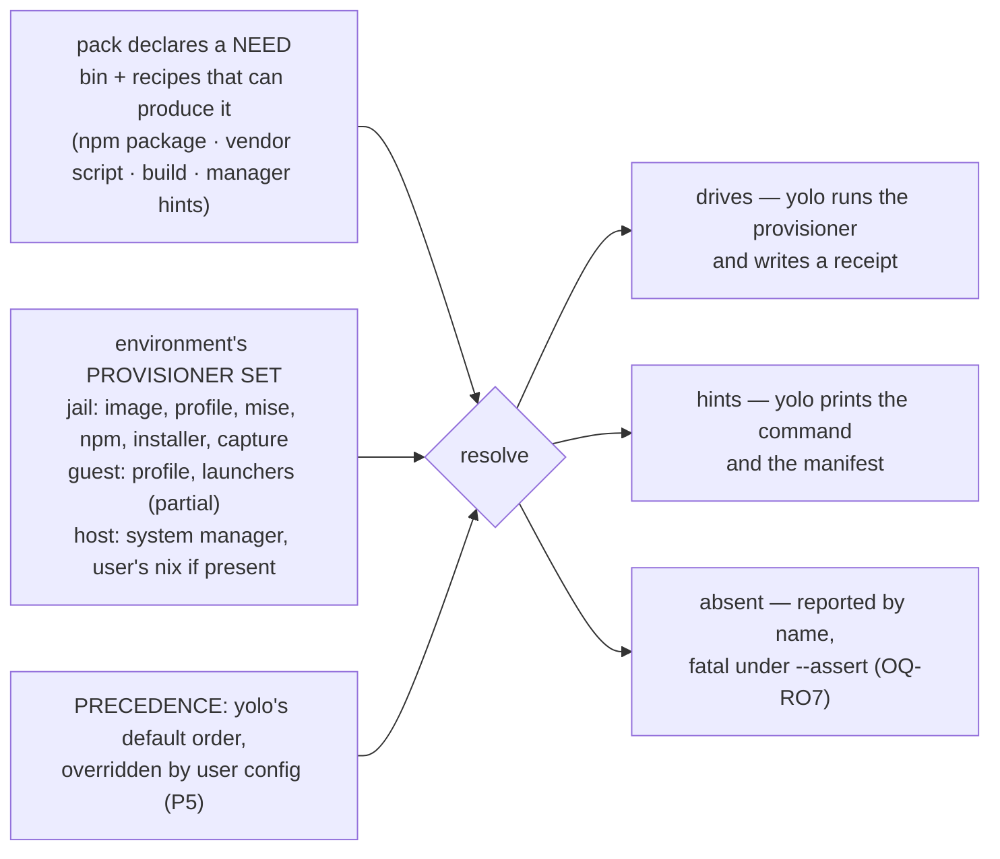

# yolo is a package manager whose backends differ per environment — and the pack contract cannot say so yet

**Status:** DESIGN, 2026-09-11, **split three ways on 2026-09-20.** This file is the **model**: the
verdict, the rulings, the alternatives and the thirteen live questions. The survey it rests on —
the provisioner inventory, the coverage matrix, the nix resolver's depth and the verification
tables — is [`provisioner-evidence.md`](provisioner-evidence.md); the Mac measurements are
[`../plans/runbooks/mac-provisioner-measurements.md`](../plans/runbooks/mac-provisioner-measurements.md).
Nothing moved out of the argument: where a ruling rests on a measured fact, the fact is stated
here and the other doc is where you check it.

Before that it was **amended twice on 2026-09-11** — first to absorb
[`noncontainer-nix-environment.md`](noncontainer-nix-environment.md) (retired; see the Scope note),
then by a review round that ruled two questions and **carved three compound ones into the
decisions they actually contained** ([the carve table](#the-2026-09-11-carve-one-question-one-decision)).
Nothing built. Claims about the tree were verified at `77190a2b`/`6eb7fe7f` on 2026-09-11 and are
labelled **MEASURED**, **READ FROM CODE** or **NOT MEASURED**; claims inherited from the merged doc
keep their own 2026-08-02 / 2026-08-23 verification dates and say so
([§14](#14-facts-verified-for-this-doc)). **Three questions are ruled** —
[`OQ-PS4`](#decision-ledger), [`OQ-PS3`](#decision-ledger), [`OQ-PS2`](#decision-ledger) — and
thirteen are open, all thirteen the maintainer's. The count went **up** because splitting a
compound question into its real decisions is the point.
**The five Mac measurements RAN on 2026-09-11**, on hardware this doc could not reach when it was
written — they corrected four of the five items that asked them, one of them opened
[`OQ-PS8`](#OQ-PS8), and one retracted a claim that had been gating [`OQ-PS10`](#OQ-PS10)
([§15](#15-what-a-mac-session-should-measure)).

> **In short.** yolo already is a package manager — the corpus has held that position since
> [`program-delivery.md` §6.3](program-delivery.md#63-installers-that-just-do-whatever-capture-the-install-then-treat-the-capture-as-the-package)
> adopted the AUR model — but it is one whose **backends differ per environment**, and the pack
> contract had no way to say so: `program` named one backend (`via`) where it should declare a
> need, so it worked only where that backend happened to exist. **The contract is now ruled the
> other way round**: the pack declares the need and its recipes, and the environment resolves.

**Why it matters.** At the host `program` and `requires` collapse into one report line because
there is nothing for either to drive; a user cannot say *"install claude from brew here"* because
the pack picks the backend; and a missing dependency is about to become fatal under `--assert`
([`OQ-RO7`](../reference/report-tiers.md#why-its-this-way)) with the install offer it presupposes unbuilt.

**The shape.** A **need** the pack declares once (a binary, plus the recipes that can produce
it); a **provisioner set** each environment has; a **resolution** that walks an ordered
preference — yolo's default, the user's config overriding it — and reports one of three
dispositions: *drives*, *hints*, *absent*.

**Cost.** Reverses `depcheck`'s shipped remedy precedence (the pack's own installer first),
knowingly accepting the version-currency cost that precedence exists to avoid
([§8.2](#82-the-ruling-a-shipped-default-order-the-user-config-overrides)); adds a user-facing
preference surface and the first yolo-driven mutation of a real machine's toolchain
([§8.5](#85-the-ruling-yolo-drives-the-winner-behind-the-confirm-and-last)); and, if the kind is
renamed, touches a closed 19-kind set, seven shipped manifests and a documentation gate.

**Start at [§1](#1-the-verdict-and-five-principles)** — the verdict and the five principles every
question below is asked against. Then [§8](#8-the-shape-this-doc-leans-toward) for the shape and
its three rulings:
[§8.4](#84-the-ruling-a-pack-declares-a-need-and-its-recipes-the-environment-resolves) (the
declaration), [§8.2](#82-the-ruling-a-shipped-default-order-the-user-config-overrides) (the
order) and [§8.5](#85-the-ruling-yolo-drives-the-winner-behind-the-confirm-and-last) (the verb).
The survey that forced all of it — the inventory, the coverage matrix, the nix depth — is
[`provisioner-evidence.md`](provisioner-evidence.md), and you need it to **check** the argument
rather than to follow it.

**Needs your ruling:** [`OQ-PS1`](#OQ-PS1), [`OQ-PS5`](#OQ-PS5), [`OQ-PS6`](#OQ-PS6), [`OQ-PS7`](#OQ-PS7), [`OQ-PS8`](#OQ-PS8), [`OQ-PS9`](#OQ-PS9), [`OQ-PS10`](#OQ-PS10), [`OQ-PS11`](#OQ-PS11), [`OQ-PS12`](#OQ-PS12), [`OQ-NX4`](#OQ-NX4), [`OQ-NX5`](#OQ-NX5), [`OQ-NX8`](#OQ-NX8), [`OQ-NX9`](#OQ-NX9).

> [!NOTE]
> **Scope note — this doc absorbed
> [`noncontainer-nix-environment.md`](noncontainer-nix-environment.md) on 2026-09-11, and that
> doc is retired.** The two held one subject from two directions: this one had the **model**
> (an environment has a provisioner set; a pack declares a need, the environment resolves it),
> that one had the **depth on one resolver** (nix below the jail notch) and six live questions,
> two of which were this doc's own questions asked earlier. Its questions keep their numbers under
> an `NX` prefix ([the id map](#question-id-map-old-spelling--new)) and are live here; its depth
> travelled on to [`provisioner-evidence.md`](provisioner-evidence.md) in the 2026-09-20 split,
> which is a move within one argument, **not** a re-separation of the two docs: the coverage
> matrix still exists once, where the evidence is.
>
> **This is still a sibling of [`program-delivery.md`](program-delivery.md), not an extension.**
> That doc is about the **jail**: its [§7](program-delivery.md#7-what-this-does-not-cover)
> excludes `macos-user` package delivery by name. Its
> [`OQ-PD16`](program-delivery.md#decision-ledger) routed the host notch to the merged doc and
> was **amended 2026-09-11** to name this one instead. So this doc **cites** its four delivery
> classes ([§3](program-delivery.md#3-four-delivery-classes-and-the-rule-that-falls-out)), its
> agent/project axis ([§3.5](program-delivery.md#35-the-second-axis-who-the-dependency-serves-amendment-2026-09-03))
> and its resolver seam ([§6](program-delivery.md#6-the-general-seam-one-ledger-many-resolvers))
> as given and re-derives none of them. What it adds is the axis no sibling owns: **which
> provisioners an environment has**, across all three notches at once.

**Reads with — the two halves of this doc first.**
[`provisioner-evidence.md`](provisioner-evidence.md) is the **survey**: the ten-row provisioner
inventory per notch, the coverage matrix, the nix resolver in depth with its preserved traps, and
the verified-facts tables — read it to check a claim, to add a row, or before re-running a probe.
[`../plans/runbooks/mac-provisioner-measurements.md`](../plans/runbooks/mac-provisioner-measurements.md)
is the **runbook**: the five Mac items M1–M5 with their commands, expectations and results — read
it at a Mac, or to see what a measurement actually returned.
Then: [`program-delivery.md`](program-delivery.md) (the jail's delivery classes and
resolvers — not restated here), [`../reference/macos-user-provisioning.md`](../reference/macos-user-provisioning.md) (the
guest's missing floor and stage),
[`yolo-as-environment-manager.md` §3.5](yolo-as-environment-manager.md#35-dependency-provisioning-declare-once-check-once-hand-off-with-a-manifest)
(*declare once, check once, hand off* — the host design this generalises),
[`../reference/nix-across-backends.md`](../reference/nix-across-backends.md) (what each backend's
nix path produces, as built),
[`../plans/environment-manager-plan.md`](../plans/environment-manager-plan.md) (Phase 6.4 and 4.3, both
unbuilt), [`../reference/report-tiers.md`](../reference/report-tiers.md) (the `--assert` fatal), and
[`../reference/pack-system.md`](../reference/pack-system.md) (the kinds). **No companion sketch
yet** — nothing here is settled enough to hold one; it opens with the first ruling that picks a
mechanism.

---

## 1. The verdict, and five principles

**yolo is a package manager with a different backend set per environment, and the pack
contract cannot express that.** The jail resolves `program` through npm, a vendor installer or
the capture store; the guest through a nix profile and launchers it cannot fully run; the host
through nothing yolo drives at all. The host's *own* manager — brew, apt, dnf, pacman — is the
one backend yolo has modelled down to a generated `Brewfile` and never once executed. So the two
kinds that look redundant, `program` and `requires`, are redundant only where yolo has no
backend: they differ in nine mechanical ways inside a jail and collapse to one report line on a
host, because the kind describes **what yolo would do if the binary were absent**, and on a host
yolo can do nothing.

Five principles, numbered so the questions and any sibling can cite them. P1 and P5 are the
maintainer's, stated in review on 2026-09-11; the other three are what the tree forces.

- **P1. The environment and the user choose the provisioner; the pack declares the need.**
  *"It shouldn't be up to the pack — that's the wrong place. It would be normal to use the
  Claude pack but install Claude from Homebrew."* A pack says what it needs and how it *can* be
  produced; who produces it is decided where the binary will live. **Ruled into the contract
  2026-09-11** — [`OQ-PS3`](#decision-ledger),
  [§8.4](#84-the-ruling-a-pack-declares-a-need-and-its-recipes-the-environment-resolves) — so this
  is no longer only a principle: `via` stops being a selector and every recipe is a candidate.
- **P2. A notch's provisioner choice does not propagate.** npm in the jail is a fact about the
  jail — *"in the jail containers we don't [use the system manager]… but that doesn't mean other
  environments have to follow that decision."*
- **P3. Every provisioner an environment has is either driven or hinted, out loud — never
  rendered and inert.** The guest notch has produced five instances of the inert case
  ([`../reference/macos-user-provisioning.md`'s P1](../reference/macos-user-provisioning.md#why-it-is-this-way), restated one level
  up); [§3.1](#31-five-findings-the-table-forces) finds two more, in F5.
- **P4. A default is platform-conditional**, because the environment includes the OS and its
  manager. brew covers six of six agent CLIs on macOS; apt covers none of them on Linux
  ([§4](#4-the-coverage-matrix-which-manager-covers-what)). *"The system package manager is the
  host default"* is right on one platform and wrong on the other, and that is a point **for**
  P1, not against it.
- **P5. There is no universally right answer, so the design's job is a good default plus a
  clean override.** *"It just seems like this should be a user choice, because there won't be
  one right answer for everybody"* — and, in the same breath, *"I guess we don't want to
  overwhelm the user with package choices here."* Pluralism is the justification and a
  **default precedence order** is the shape;
  [§8.2](#82-the-ruling-a-shipped-default-order-the-user-config-overrides) is the ruling and
  what it does **not** settle, and
  [§8.5](#85-the-ruling-yolo-drives-the-winner-behind-the-confirm-and-last) rules what yolo does
  with the winner.

---

## 2. Two frames that failed in review

Both were tried on 2026-09-11 and both broke. Recorded so nobody re-proposes them.

| Frame | Where it came from | Why it fails |
| :--- | :--- | :--- |
| **"install vs presence"** | the code's own words — [`pack-system.md`](../reference/pack-system.md#requires): *"`program` and `requires` are install vs presence"* | Describes the **check** each kind performs in a jail, not the **cause** of their difference. At the host both perform the same check (`Manifest.DepRequirements`, `internal/packdecl/contributes.go:599-604` — READ FROM CODE), so the frame predicts nothing about the notch where the question is live. |
| **"yolo produces it vs something external produces it"** | review, as a replacement | Two counter-examples from the maintainer. `via: npm` **is** an external package manager yolo merely drives (`npm install -g`, `internal/entrypoint/shims.go:985`). And a user may already have `claude` from brew: `depcheck.presentAt` probes PATH and records where it found the binary, with no interest in provenance (`internal/depcheck/depcheck.go:171-179`). The kind cannot be about where a binary came from. |

**What survives.** A kind describes what yolo *would do* if the binary were absent — a claim
about **yolo's capability in this environment**. That is why the notch only *correlates* with
the behaviour: what actually decides is the set of provisioners the environment offers, which
the notch happens to fix today because nothing else can vary it.

---

## 3. The provisioner inventory, per environment

**The inventory moved to
[`provisioner-evidence.md`](provisioner-evidence.md#1-the-provisioner-inventory-per-environment)** —
ten provisioners against the three notches, with the underlying tool, what declares it, and the record each keeps.
Every cell there is read from code at `77190a2b`, and three of the guest cells were since measured
on hardware. Go to it to check a cell, to correct one, or before claiming an environment can do
something. What stays here is the vocabulary the rest of this doc runs on and the five findings
the table forces.

**Three terms, coined here.** A **provisioner** is a mechanism that can make a binary present in
an environment, together with whether yolo drives it there. Every resolver in
[`program-delivery.md` §6](program-delivery.md#6-the-general-seam-one-ledger-many-resolvers) is one —
that doc names them from the **record** side (who keeps the lockfile); this one names the same
mechanisms from the **environment** side (is it here, and does yolo run it) — and two of the
inventory's rows are not that doc's resolvers at all: the system package manager, which yolo
hints, and the capture store, which yolo drives. An environment's **provisioner set** is the
provisioners it offers. A provisioner's **disposition** at a notch is one of **drives** (yolo runs
it), **hints** (yolo prints its command and stops) or **absent** (no code path). None of the three
words appears in the code; the nearest thing is the confinement Profile's one provisioning
primitive (F4 below).

Notches are the three values of the confinement dial —
[`yolo-as-environment-manager.md` §4](yolo-as-environment-manager.md#4-confinement-a-dial-with-three-notches).
**guest** means the shipped `macos-user` backend; the Linux guest is unbuilt and has no row.

### 3.1 Five findings the table forces

The findings are the argument; their code citations, their measured negatives and the table they
fall out of are in [`provisioner-evidence.md`](provisioner-evidence.md#11-five-findings-the-table-forces).

- **F1 — The nix asymmetry: the host is the only notch where yolo owns no provisioner.** The jail
  gets nix as a baked image or, opted in, as a profile; the guest gets the profile; the host gets
  nothing yolo drives. That, and not anything about the kinds, is why `program` degenerates there:
  with nothing to drive, every declaration reduces to *is it on PATH, and what would install it* —
  which is the whole of `requires`. The retired doc reached this conclusion for its one resolver
  and stopped there.
- **F2 — The system package manager is a provisioner yolo models completely and never uses.**
  `detectManager` picks brew on macOS and probes apt/dnf/pacman/brew on Linux, reaching `nix` by
  elimination; `installCmd` knows each manager's verb, brew's cask verb included; `Manifest` writes
  the manager's own bundle file and `check-deps` puts it at `~/.config/yolo/Brewfile`. Then it
  stops — **MEASURED negative:** every consumer of a remedy is a print, and the deferral is stated
  in the code's own comment. ⚠ **And the shipped precedence has the pack choosing**: `depcheck.Check`
  ranks the declaring pack's own installer first and keeps the detected manager's command only as
  `Fallback`. Under P1 that order inverts, which is the
  [§8.2](#82-the-ruling-a-shipped-default-order-the-user-config-overrides) ruling.
- **F3 — `program` and `requires` differ nine ways in a jail and collapse at the host, and the
  code says so itself** — *"The kinds differ in what they do to a JAIL (a program gets a launcher,
  a requires gets an assertion), not in what they ask of a host"* (`internal/packdecl/contributes.go`).
  In a jail they differ in their combine rule, a launcher versus nothing, capturability, a receipt,
  an agent-name claim, review-worthiness, a launch disclosure, a self-install command and their
  accepted field sets; at the host they share one collector, one probe and one report line whose
  only difference is the kind label. The one host-side artefact that does differ is the
  `yolo host --` wrapper `program` gets, and it installs nothing. **The noun/verb mismatch** —
  `program` is a thing, `requires` is an act — is noted here and spent nowhere else, because naming
  is downstream ([§7.3](#73-naming-is-downstream)).
- **F4 — The code already half-models the provisioner set, with one member.** The confinement
  Profile is a vector of primitives, and `PrimBakedImage`'s own comment calls it *"a provisioning
  primitive, not a confinement one"* that *"travels with the jail notch and is absent below it"*
  (`internal/render/confinement.go`). `describe` already switches on that primitive's **absence**
  to decide whether to print the resolved profile line. The provisioner set is that idea completed:
  a per-environment vector with as many members as the inventory has rows, of which the tree spells
  exactly one. Whether it lives in the Profile or beside it is an implementation choice this doc
  delegates ([§8](#8-the-shape-this-doc-leans-toward)).
- **F5 (a defect, not a finding) — the guest has two provisioners armed and unreachable.** The
  macos-user run plan bakes a non-empty server list and `SERVERS_ENABLED=1` into every guest
  launcher, but `_refresh_servers` and `_try_materialize` both open with `command -v yolo || return`
  and the sandbox's `yolo` is staged at a path that is not on `SandboxPath`. Both no-op silently,
  nothing in the tree records it, and the one launch warning nearby blames a different cause. It is
  P3's failure mode exactly, and small enough to fix ahead of any ruling
  ([§9](#9-what-i-would-build-in-order) step 1).

---

## 4. The coverage matrix: which manager covers what

**The matrix moved to
[`provisioner-evidence.md`](provisioner-evidence.md#2-the-coverage-matrix-which-manager-covers-what)**,
together with the `install_hints`-versus-nix-profile comparison that followed it. It was measured
2026-08-02 in the doc this one absorbed and is cited rather than re-measured: the two docs used to
carry two copies of the table, and the split did not make a third — what stays below is the handful
of numbers the rulings quote. Go there for the per-manager detail, the `brew bundle` exercise on
hardware, and the dates.

**The numbers are load-bearing here, so they stay.** Of the six agent CLIs: **`apt` covers none**,
**`dnf` one** (Rawhide only), **`pacman` two** (the other four are AUR-only, which `pacman -S`
cannot install), **`brew` all six** — four of them casks — and **`nix` all six**, three of which
are `unfree` and refused by a bare install. Three consequences the rest of this doc rests on:

- **On macOS the system-manager default is well-founded:** brew covers all six.
- **On Linux it fails:** a non-Arch host gets zero or one of six from its native manager, so the
  default is **conditional on the platform** — P4, and a point *for* P1 rather than against it.
- **The sharpest one cuts against a naive *prefer the system manager* rule:** on Linux, nix is the
  only manager covering all six, so **the reproducible path and the only-path-that-works path are
  the same path**. That is why [`OQ-PS1`](#OQ-PS1) is not a nicety. ⚠ And the premise *"there's no
  nix package"* is wrong in a way that widens the option space: `unfree` is a licensing gate a user
  can lift once, not an absence — though the lift is a `--impure` flag rather than an environment
  variable, measured on darwin ([M3](../plans/runbooks/mac-provisioner-measurements.md#m3--does-nix-profile-install-refuse-the-unfree-agent-clis-on-darwin)).

**`install_hints` and a nix profile are complementary, not competitors**, and the boundary is
structural rather than a preference: a user with no `/nix` gets nothing from a profile;
`install_hints` answers the wider question of a pack's *host dependencies* (`fzf` and `fd`, not
agent CLIs); and the printed remedy is the floor the env-manager design guarantees, so anything
driven is an **additional** offer — which is exactly how [`OQ-PS2`](#decision-ledger) was ruled
([§8.5](#85-the-ruling-yolo-drives-the-winner-behind-the-confirm-and-last)). The full comparison,
row by row, is
[there too](provisioner-evidence.md#21-install_hints-and-a-nix-profile-are-complementary-not-competitors).

---

## 5. The frame this corpus already holds: yolo is a package manager

*"Any way we look at it, we're building our own package manager, and we've already modeled this
on AUR, so we should continue to draw inspiration from there if we need it."* (maintainer,
2026-09-11.) The position is on record — [`program-delivery.md` §6.3](program-delivery.md#63-installers-that-just-do-whatever-capture-the-install-then-treat-the-capture-as-the-package):

> The prior art is Arch's. An AUR `PKGBUILD` runs upstream's opaque payload in a clean chroot
> (`makechrootpkg`), and the *output* is an ordinary pacman package with a file manifest — the
> package manager never trusts the build script's environment, only its captured product. The
> pack's `program via installer` contribution is already the PKGBUILD analogue: a name and a URL.

That was written for one class — the vendor installer. This doc generalises it: **every row of the
[provisioner inventory](provisioner-evidence.md#1-the-provisioner-inventory-per-environment) is a
package-manager backend**, and the thing the pack declares is a recipe. The AUR model is cited below only where it decides something;
where it does not, it is left alone.

### 5.1 Where the AUR model carries weight

- **The recipe is per-package; the installer is the system's.** An AUR helper builds from the
  `PKGBUILD` and hands the product to `pacman`. That separation **is P1**: the pack owns the
  recipe (what the binary is, how it can be produced), the environment owns installation. It is
  also [§6](program-delivery.md#6-the-general-seam-one-ledger-many-resolvers)'s *"many resolvers, one
  ledger"* seen from the other side — that section says every resolver keeps its own record under
  one reader; this says every environment picks its own resolver under one declaration.
- **Never trust the build environment, only the captured product.** This is why capture exists
  ([§6.3](program-delivery.md#63-installers-that-just-do-whatever-capture-the-install-then-treat-the-capture-as-the-package)),
  and it is why a **custom build** is expressible without widening trust
  ([§5.3](#53-a-custom-build-is-expressible-today-and-what-it-lacks)): a build script is exactly the
  *"installer that just does whatever"* the capture jail already contains.
- **`provides` / `depends`** is AUR's spelling of the relation `program` / `requires` strains to
  express, and it is verb/verb. The env-manager design's own sketch reached for it —
  `provides_from` in [§3.5](yolo-as-environment-manager.md#35-dependency-provisioning-declare-once-check-once-hand-off-with-a-manifest)'s
  example — and the field never shipped: a `program`'s accepted fields are `bin`, `via`, `package`,
  `url`, `flags`, `update`, `install_hints` (`internal/packdecl/contributes.go:29-72`), and
  `requires` takes `bin` and `install_hints` alone, refusing the rest by name
  (`:1589-1592`, re-resolved 2026-09-11). Evidence for [`OQ-PS11`](#OQ-PS11) — whether the pair
  collapses — which is where the verb/verb relation now lives.
- **`optdepends`.** No kind has an `optional` field (READ FROM CODE, every kind's field set), so
  yolo has no declared-but-optional category. [`OQ-RO7`](../reference/report-tiers.md#why-its-this-way)'s fatal implicitly
  assumes that category does not exist; if a pack ever needs it, the assumption becomes a
  question. One sentence, because nothing in the tree needs it yet.
- **`depends` vs `makedepends`** — runtime versus build-time. Nothing in the tree expresses the
  distinction (MEASURED negative: no `makedepends`, build-time or from-source vocabulary in
  `internal/packdecl`, `internal/depcheck`, `checkdeps.go` or `applyhostdeps.go`). The moment a
  `program` can be a build, yolo acquires it whether or not it is named
  ([§5.3](#53-a-custom-build-is-expressible-today-and-what-it-lacks)) — and
  [§8.4](#84-the-ruling-a-pack-declares-a-need-and-its-recipes-the-environment-resolves) now names
  it: a build recipe carries its own build-time needs.

### 5.2 Where it breaks

**AUR has one destination; yolo has a different provisioner set per environment — which is the
whole problem.** Every `PKGBUILD` ends in `pacman -U` on one distro. A yolo recipe ends in npm
inside a jail, a nix profile on a Mac guest, and — under P1 — whatever the user's host prefers.
The model carries the recipe/installer split and the trust property; it does not carry a rule
for **which** installer, because it never had to choose one. And the destination AUR takes for
granted, the system's own manager, is the one provisioner yolo has never driven (F2).

The choice is also platform-conditional in a way pacman never is
([§4](#4-the-coverage-matrix-which-manager-covers-what)), which is why the answer is an ordered
list rather than a name ([§8.2](#82-the-ruling-a-shipped-default-order-the-user-config-overrides)).

### 5.3 A custom build is expressible today, and what it lacks

The delivery vocabulary is closed at two values — `knownVias` is `{npm → "npm", installer →
"native"}` (`internal/packdecl/contributes.go:378-381`), and its comment says why: *"core has to
know how to DELIVER a mechanism before a pack may name it."* Nothing in the schema forbids a
build, because a build already fits the second value: the validator requires `via: installer` to
carry a non-empty `url` and nothing more (`:1586`), and the class is defined as a program that
*"runs arbitrary logic and leaves arbitrary state"*
([§6.3](program-delivery.md#63-installers-that-just-do-whatever-capture-the-install-then-treat-the-capture-as-the-package)).
A build script is that. The capture jail contains it and emits a package, exactly as it does for
claude's installer. **So the capability exists; the vocabulary does not.** Three things it
lacks:

1. **Build-time dependencies.** A build needing `cmake` or `rustc` has no way to say so. The
   throwaway capture jail's floor — the image's 36 core packages, `go`, `python3` and
   `nodejs_24` among them ([`../reference/macos-user-provisioning.md` — the floor](../reference/macos-user-provisioning.md#the-floor))
   — is the *implicit* `makedepends`, and a build that needs anything else fails inside the
   capture with no declaration to blame.
2. **A pack-shipped recipe.** `url` is the only source field; I found no scheme check on it and
   also no pack-relative form, so whether a script inside the pack tree can be named is
   **NOT VERIFIED**.
3. **A place in the vocabulary.** [§6.2](program-delivery.md#62-pay-the-enum-tolerance-before-the-next-mechanism-arrives)
   paid the enum tolerance so a third `via` value degrades to a skip on an older image rather than
   a refused boot — the tolerance is spent and waiting.

**Is `via` the right axis for it? RULED: no.** `via` was the pack *selecting* the delivery
mechanism; under [`OQ-PS3`](#decision-ledger) (2026-09-11) the pack does not select — it **lists**
what can produce the binary, and the resolver picks. **A build is a third *recipe kind*** beside
"an npm package" and "a vendor script", not a third value of a selector, and it carries the
build-time needs item 1 above found missing
([§8.4](#84-the-ruling-a-pack-declares-a-need-and-its-recipes-the-environment-resolves)). The one
thing the ruling does not widen is what core may *deliver*: `knownVias` stays closed until core
knows how.

---

## 6. The nix resolver, in depth

**The depth moved to
[`provisioner-evidence.md`](provisioner-evidence.md#3-the-nix-resolver-in-depth).** This section was
the absorbed [`noncontainer-nix-environment.md`](noncontainer-nix-environment.md), compacted, and it
is the only resolver with depth like this for a reason worth keeping in view: it already works at
two notches and has no caller at the third, so it is where [`OQ-PS1`](#OQ-PS1) is decided.

What is over there: the four nix mechanisms pinned and compared — a `devShell`, a `buildEnv`,
`nix profile` and `nix shell`, three of which are routinely conflated — and why a devShell is
**rejected in all forms** (measured: **22 PATH entries and 121 environment variables** for a
one-package shell, one of which is the package asked for); `nix profile --profile <dir>`, the only
candidate that reaches a user's own PATH; the already-shipped-versus-missing table; what a
non-container notch can and cannot reproduce of the jail; platform coverage and freshness; the
cases where the user has no nix; and four preserved traps — the devShell dump, the unfree warn-and-skip, the `x86_64-darwin` retraction and the GC
root's four deliberate properties. **Read it before designing anything nix-shaped**; each of those
traps cost a measurement to find.

**Three of its findings carry the model below, so they are stated here and checked there.**

- **The mechanism is shipped, with two consumers and no third.** A pure, toolchain-free profile of
  `packages:` builds for every system the flake enumerates, follows the machine's own system, and
  GC-roots itself; `macos-user` and the Linux store farm both call it. `yolo host apply` never
  does. That is F1 from the resolver's side — **one notch, one backend, no non-macOS coverage of
  the diagnostics, and no host caller** — and it is exactly what [`OQ-PS1`](#OQ-PS1) asks.
- **A nix tool environment is orthogonal to the *enforcement* primitives and load-bearing for the
  *provisioning* one.** It is not a peer of the confinement dial; it is what fills the
  `PrimBakedImage`-shaped hole at the two notches with no image (F4). Three things compound into
  that: `guest` needs the identical mechanism and the Linux guest has no package layer at all; the
  notch decides whether a PATH-prepend has a consumer at all, since `yolo host apply` launches
  nothing while `yolo host -- <cmd>` does; and `describe` already acts on the primitive's absence
  without minting a second one. **The practical consequence:** designing this as "a host feature"
  risks a Linux `guest` package layer being built twice.
- **A `buildEnv`'s "no pollution" claim is really "no *undeclared* pollution."** A `buildEnv`
  containing `gnugrep` still shadows `/usr/bin/grep` when prepended — the difference from a
  devShell is legibility, not effect, and on a Mac host that is the BSD-versus-GNU hazard arriving
  by the front door. Nothing warns today, on any path. That is [`OQ-NX5`](#OQ-NX5), and it is also
  [`OQ-P2`](../reference/macos-user-provisioning.md#why-it-is-this-way)'s problem one level down.

---

## 7. Reframing `program` as a package

The maintainer's stated payoff: *"it may make the capture step clearer when we're capturing the
binary install."* Tested here against what the reframing would actually have to explain.

### 7.1 Tested against the mechanical differences

Does *"a `program` is a package"* make each of F3's differences fall out, or merely rename it?

| Difference | Falls out of "package"? | Why |
| :--- | :--- | :--- |
| exclusive vs shared combine | **yes** | A package *provides* a name — one provider per name, as pacman's `conflicts` enforces. A dependency is *depended on* by many. |
| a launcher vs none | **yes** | A package yolo installs needs an entry point yolo owns; a dependency yolo does not install needs none. |
| capturable vs not | **partly** | Capture applies to a product whose *recipe* is opaque — the installer class. It falls out of the recipe kind, not of "package" as such: an npm package is a package and is refused by capture (`capturehost.go:263-266`), because a registry version already names it. |
| driven vs hinted | **no** | This is a property of the **environment's provisioner set**, not of the declaration. `claude` is one package however you spell it; it is driven in a jail and hinted on a host. The reframing clarifies the noun and leaves the disposition where it was. |

**Verdict:** the reframing buys a correct noun — one thing, produced by several recipes, installed
by several backends — and it is the noun the AUR model was already using. It does **not** by
itself repair the host, because the host's problem is an empty provisioner set
(F1), and no rename adds a member to it.

### 7.2 The capture payoff

Here the maintainer is right, and the corpus already says so in its own words: *"from then on
**the capture is the package**"*
([§6.3](program-delivery.md#63-installers-that-just-do-whatever-capture-the-install-then-treat-the-capture-as-the-package)).
Under the current vocabulary that sentence is a metaphor — a `program` is a launcher and a `via`,
and the capture is a store entry the launcher tries first. Under the reframing it is literal: a
`via: installer` recipe produces a package whose provisioner is the vendor's script, and capture
**re-provisions the same package** through yolo's CAS. Two provisioners, one package, and the
second is the one that needs nothing from the environment but a filesystem — which is why it is
the only [inventory row](provisioner-evidence.md#1-the-provisioner-inventory-per-environment) that
could work on a guest with no floor at all, once its recording-only half is finished (H1 and H2 in
[`../plans/install-capture.md`](../plans/install-capture.md#build-order)). The **materialize** half
is still **NOT MEASURED** — nothing has materialised a capture on macos-user, and nothing can until
H2 lands (`internal/cli/run/autocapture.go:16-31`, re-read 2026-09-11) — but the **recording** half
has since been measured working end to end on hardware
([M4](../plans/runbooks/mac-provisioner-measurements.md#m4--does-the-capture-recording-half-work-on-hardware)),
so this is the one place the reframing changes what an implementer would build rather than what
they would call it. ⚠ This pointer used to name M3, which is the nix-profile item; M4 is capture's.

### 7.3 Naming is downstream

A kind rename is its own decision ([`OQ-PS5`](#OQ-PS5)) and must not drive the model above —
which is why [`OQ-PS3`](#decision-ledger) was ruled without it, and why
[`OQ-PS11`](#OQ-PS11) (does the pair collapse) sits **upstream** of the name. Its measured blast
radius, so the cost is on the table: the closed 19-kind const set and
`footprints` map (`internal/packdecl/kinds.go:40-223`, `:293`); the validator's per-kind cases
(`contributes.go:1540`, `:1588`); **seven shipped manifests** under `packs/` — six `program`
(agy, claude, codex via installer; copilot, opencode, pi via npm — re-MEASURED 2026-09-11) and
one `requires` (`guardrails`, `rg` and `fd`) — plus the `claude-fzf-pack` example;
`yolo config-ref` (`internal/cli/config_ref.txt:998`, `:1010-1024`) and `yolo pack --help`
(`internal/cli/pack.go:72`, `:76`), both gated by `TestEveryKindIsDocumented`
(`internal/cli/packkinddocs_test.go:48`), which requires the kind's bare name to lead a line in
each; and any fetched pack. The pack **lockfile** records no kind names
(`internal/packsrc/lock.go:35-44`), so it is not on the list.

---

> [!IMPORTANT]
> **An installer script never runs inside a container. That is the rule** (maintainer,
> 2026-09-11): *"We're not going to run an installer in a container. We're going to turn it into
> something that looks like the Arch solution — or we can use another package manager. It doesn't
> have to be yolo's package manager, but it's just not going to be a bash script."*
>
> **The invariant is about the FORM of the installed thing, not about who supplies it.** Whatever
> installs into an environment installs a **package** — an artifact with a manifest — and never an
> opaque script executed in place. Any provisioner delivering that shape qualifies; what is excluded
> is the non-package form.
>
> **This is already how the two shipped `via` values behave, and the rule names it rather than
> changing it:**
>
> - **`via: npm`** is a package manager already, with a registry version to name — so it installs
>   directly and needs no capture (`internal/cli/capturehost.go:76-78`).
> - **`via: installer`** is the `curl | bash` case, and it is exactly the one `capture` exists for:
>   the script runs **once, in a throwaway jail**, and what reaches any real environment is the
>   captured product. That is [`program-delivery.md`](program-delivery.md)'s AUR prior art — *"the
>   package manager never trusts the build script's environment, only its captured product"* — and
>   under this rule it is the **requirement**, not an optimisation.
>
> ⚠ **Corrected 2026-09-11.** An earlier version of this note read the framing as *"everything yolo
> installs becomes a capture,"* and flagged a tension with capture being installer-only. **There is
> no tension.** npm is not a bash script, so it was never in scope; capture's installer-only
> boundary is the rule's implementation, not a gap in it.
>
> **What the rule bore on** was the model, and the model is now ruled: *"it doesn't have to be
> yolo's package manager"* means yolo's own store is one provisioner among several rather than the
> privileged one — the same conclusion [`OQ-PS3`](#decision-ledger) reached from the other
> direction ([§8.4](#84-the-ruling-a-pack-declares-a-need-and-its-recipes-the-environment-resolves)).
> What it still bears on downstream is [`OQ-PS11`](#OQ-PS11) and [`OQ-PS5`](#OQ-PS5), the
> vocabulary that names the result.

## 8. The shape this doc leans toward

**Three of its five parts are now ruled** — the declaration by
[§8.4](#84-the-ruling-a-pack-declares-a-need-and-its-recipes-the-environment-resolves), the
precedence by [§8.2](#82-the-ruling-a-shipped-default-order-the-user-config-overrides), the verb by
[§8.5](#85-the-ruling-yolo-drives-the-winner-behind-the-confirm-and-last). The rest is still the
leaning the remaining questions are asked against, so their stakes are concrete.

Read as behaviour, exhaustively; mechanism is the implementer's.

- **Declaration — RULED** ([§8.4](#84-the-ruling-a-pack-declares-a-need-and-its-recipes-the-environment-resolves)).
  A pack declares a binary and every recipe it knows that produces it, and privileges none of
  them. Today's `via` + `package`/`url` is one recipe; today's `install_hints` are the rest.
  Nothing forces a pack to know the user's platform, and a pack with **no** recipe for a binary is
  today's `requires`.
- **Provisioner set.** Each environment enumerates what it has, and the enumeration is what
  `describe` prints — the way it already prints the profile line when `PrimBakedImage` is absent.
  An environment with an **empty** set (a host with no manager detected and no nix) reports every
  need as *absent* with no remedy, which is today's `noRemedyReason` path
  (`applyhostdeps.go:187`) made systematic.
- **Resolution.** For each need, walk the precedence over the environment's set; the first
  provisioner that both exists here and has a recipe for this binary wins. **Ordered, first
  match**, so a preference that covers nothing on this platform is skipped rather than fatal.
  A recipe the declaration carries for a provisioner the environment lacks is *reported*, never
  attempted. The pack's own installer is one candidate among the set, ranked by the precedence —
  not the head of the list as `depcheck.Check` ranks it today (F2).
- **Disposition and record.** *Drives* — RULED as a confirm-gated offer sequenced last
  ([§8.5](#85-the-ruling-yolo-drives-the-winner-behind-the-confirm-and-last)) — writes a receipt,
  as every driven install already does;
  *hints* writes the manifest, as `check-deps` already does; *absent* names the binary and the
  set that could not cover it. Nothing is ever rendered inert (P3): a provisioner the environment
  cannot run is not in its set.
- **Propagation.** The jail's resolution is the jail's. A workspace whose jail installed `claude`
  via npm says nothing about how its host resolves `claude` (P2).
- **Pre-existing state.** A binary already present satisfies the need regardless of who put it
  there, exactly as `presentAt` behaves today. No resolution re-provisions a present binary.
- **Forbidden.** Never run a system-manager command without the confirm
  [`OQ-9`](../plans/environment-manager-plan.md#open-questions-to-resolve-before-their-phase) ruled; never set
  `allowUnfree` for the user; never let a pack's `via` override the resolved precedence.

### 8.1 Who chooses the provisioner today

Checked before widening scope, because *"let the user choose"* could be a config key or a
subsystem. It is mostly a key. The **data** exists: `install_hints` already carries one remedy
per manager including `brew-cask`, `hintFor` already indexes it by manager
(`depcheck.go:77-78`), and `Result.Fallback` already carries the alternative the user did not
get (`:110-117`) — and the precedence comment says why in as many words: *"When both exist the
manager's command is kept as Fallback rather than discarded, so a user who prefers their package
manager still sees the token"* (`depcheck.go:150-151`, re-read 2026-09-11). **The code already
anticipates this user; it just cannot let them win.** The **selector** does not exist:
`DetectManager` is a package-level var, overridable in tests and by nothing else (`:126-127`; a
config-key sweep of `internal/config` and `internal/cli` found none), and the precedence putting
the pack's installer first is hardcoded (F2).

### 8.2 The ruling: a shipped default order, the user config overrides

**Ruled 2026-09-11.** This settles [`OQ-PS4`](#decision-ledger) as asked and narrowed
[`OQ-PS2`](#decision-ledger), which was itself ruled later the same day
([§8.5](#85-the-ruling-yolo-drives-the-winner-behind-the-confirm-and-last)); it deliberately
settles nothing else, and [§8.3](#83-what-the-ruling-does-not-settle) says what stays open.

**1. The version-currency cost is accepted, and it is the user's to accept.** `depcheck.Check`'s
stated precedence reason is a real cost, and it is preserved rather than deleted:

> *"a tool with a first-party installer has a first-party updater, and a distro package silently
> pins it to whatever that repo has"*

(`internal/depcheck/depcheck.go:147-151`, re-read 2026-09-11.) The maintainer's ruling is that
this is **not a blocker**: *"It's fine regarding the evergreen stuff that a brew install only
moves when brew moves — that's why this is a configured choice of the user."* A user who chooses
brew is choosing brew's cadence **knowingly**. The same trade is what
the freshness argument in [`provisioner-evidence.md`](provisioner-evidence.md#37-macos-vs-linux-coverage-freshness-and-the-traps) prices for nix, and it lands
the same way.

> [!WARNING]
> **This does not repeal the evergreen ruling; it scopes it.**
> [`program-delivery.md` §3.5](program-delivery.md#35-the-second-axis-who-the-dependency-serves-amendment-2026-09-03)
> rules agent CLIs evergreen and never pinned. That is a **jail** policy, and P2 says a notch's
> choice does not propagate — so a user pinning `claude` to brew's cadence on their own host is
> not a violation of it. Do not read this ruling as licence to pin an agent CLI *inside a jail*
> without ruling [`OQ-PS6`](#OQ-PS6) first.

**2. The shape is a default precedence order, overridden by user config.** Not a per-package
interrogation: *"I guess we don't want to overwhelm the user with package choices here. Maybe
the precedence order is what we set and the user config."* Two properties make this the only
shape that works, and both are forced by [§4](#4-the-coverage-matrix-which-manager-covers-what):

- **Ordered, not a single name** — because on a non-Arch Linux host the native manager covers
  **0–1 of six** agent CLIs, so a single-name preference that covers nothing must degrade to the
  next choice rather than fail. First-match over an ordered list is the only shape that does.
- **Defaulted, not asked** — because most users will never set it, so the *default* is the
  product. P4 makes that default platform-conditional by construction.

**3. The justification is pluralism.** *"There won't be one right answer for everybody."* The
design's job is therefore **a good default plus a clean override**, and explicitly not a correct
universal answer. That is P5, and it is why
[§10](#10-alternatives-each-with-a-verdict)'s alternative D (a per-notch `via` in the manifest)
stays rejected: a pack author cannot know the user's distro, so no pack-side value can be the
right default anywhere.

### 8.3 What the ruling does NOT settle

Three things stay live, sharpened rather than closed. Recording them explicitly because the
ruling reads broader than it is. ⚠ **The last two rows were one question when this table was
written** — the table listing them separately is what exposed that, and they were carved apart on
2026-09-11 ([the carve table](#the-2026-09-11-carve-one-question-one-decision)).

| Still open | Question | Why the ruling does not reach it |
| :--- | :--- | :--- |
| **What the shipped default order actually is, per environment** | [`OQ-PS6`](#OQ-PS6) | P4 makes it a per-platform table, not a word; and the jail's row is the absorbed [`OQ-7`](#question-id-map-old-spelling--new) — *should the jail's agent CLIs come from nix?* — which the ruling does not answer. |
| **Whether the override is per-package or per-environment only** | [`OQ-PS7`](#OQ-PS7) | *"Claude from brew"* is the maintainer's own example and needs per-package grain; *"don't overwhelm the user"* pushes the other way. Both sentences are his and they pull apart. |
| **Whether a user may name a recipe no pack ships** | [`OQ-PS12`](#OQ-PS12) | Re-ranking the recipes packs already declare is a config key over data that exists ([§8.1](#81-who-chooses-the-provisioner-today)); a recipe they do **not** ship is a subsystem with a trust story. |

And the thing this ruling made sharper rather than settling — **whether yolo executes the winner
at all** — was itself ruled later the same day: **drive it, behind the confirm, sequenced last**
([§8.5](#85-the-ruling-yolo-drives-the-winner-behind-the-confirm-and-last),
[`OQ-PS2`](#decision-ledger)). This ruling picked the order; that one picked the verb.

---

### 8.4 The ruling: a pack declares a need and its recipes; the environment resolves

**Ruled 2026-09-11**, settling [`OQ-PS3`](#decision-ledger) — the model question the rest of this
doc turns on, and P1 turned from a principle into a contract.

**A pack declares a NEED — a binary, plus every recipe it knows that can produce it — and
privileges none of them.** The environment's provisioner set and the
[§8.2](#82-the-ruling-a-shipped-default-order-the-user-config-overrides) precedence order choose
which recipe runs. This is the AUR recipe/installer split
([§5.1](#51-where-the-aur-model-carries-weight)) with the destination made plural, which is the
one place AUR does not carry ([§5.2](#52-where-it-breaks)).

Three consequences, and none of them is a new field:

- **`via` stops being a selector.** A `via`+`package`/`url` contribution is **one recipe**, and
  each `install_hints` entry is **another**. The data already exists — `hintFor` indexes hints by
  manager (`internal/depcheck/depcheck.go:77-78`) and `Fallback` already carries the alternative
  the user did not get (`:110-117`). What the ruling removes is the pack's power to rank them.
- **A custom build is a recipe KIND, not a third `via` value.**
  [§5.3](#53-a-custom-build-is-expressible-today-and-what-it-lacks)'s question in miniature is
  answered: the capability already exists inside the capture jail, and what it lacked was a place
  in the vocabulary. It arrives as a recipe carrying its **own build-time needs** — the
  `makedepends` category [§5.1](#51-where-the-aur-model-carries-weight) found missing — rather
  than as a value of a selector the ruling just retired.
- **`requires` is a need with an empty recipe list.** That is a statement about semantics, and it
  is all the ruling settles here; whether the manifest keeps two kind names for it is
  [`OQ-PS11`](#OQ-PS11), and what the surviving kind is called is [`OQ-PS5`](#OQ-PS5).

> [!WARNING]
> **The ruling does not widen what a pack may *deliver*, and the enum tolerance is what makes
> that safe.** `knownVias` is closed at two values precisely because *"core has to know how to
> DELIVER a mechanism before a pack may name it"*
> (`internal/packdecl/contributes.go:378-381`). Recipes are declarations the resolver ranks; a
> recipe naming a mechanism this yolo cannot drive is **reported, never attempted**
> ([§8](#8-the-shape-this-doc-leans-toward)). The
> [§6.2](program-delivery.md#62-pay-the-enum-tolerance-before-the-next-mechanism-arrives)
> tolerance covers the older-image case — a recipe kind an older image does not know degrades to
> a skip rather than a refused boot — and it is already paid.
>
> ⚠ **And the installer rule is untouched.** *"It's just not going to be a bash script"* still
> binds every recipe: whatever reaches a real environment is a **package with a manifest**, and a
> `via: installer` recipe reaches it through capture. A recipe is a declaration of how a package
> can be produced, never a licence to run a script in place.

### 8.5 The ruling: yolo drives the winner, behind the confirm, and last

**Ruled 2026-09-11**, settling [`OQ-PS2`](#decision-ledger). The answer is **drive it** — and two
qualifiers carry as much weight as the verb.

1. **Behind the confirm that is already ruled.** Executing a system-manager command runs under
   env-manager [`OQ-9`](../plans/environment-manager-plan.md#open-questions-to-resolve-before-their-phase)'s
   disposition — batched by elevation class, sudo shown through — which was ruled 2026-08-01 and
   whose own audit says it *"has no consumer at all today"*. This ruling is that consumer.
2. **Sequenced LAST.** The precedence order ships first as a **print-only** improvement, and the
   driving is the increment after it ([§9](#9-what-i-would-build-in-order) steps 4 then 5). A
   precedence order that only ever prints the winner is already strictly better than today and
   carries no elevation risk; introducing the preference surface and the first mutation of a real
   machine's toolchain in one step would make a single failure ambiguous between the two.
3. **The written manifest stays the floor.** The env-manager guarantee — *"the composed manifest
   is always the floor"*
   ([§3.5](yolo-as-environment-manager.md#35-dependency-provisioning-declare-once-check-once-hand-off-with-a-manifest))
   — survives the ruling intact. `check-deps` keeps writing `~/.config/yolo/Brewfile` and kin
   whether or not the offer is taken, and a declined offer leaves a user exactly where today's
   yolo leaves them. Running it is an **offer on top**, never a replacement.

**What was already settled and is not re-opened:** the version-currency objection to leading with
a system manager. [`OQ-PS4`](#decision-ledger) ruled it an accepted cost
([§8.2](#82-the-ruling-a-shipped-default-order-the-user-config-overrides)), so what this ruling
decided was purely *does yolo execute the winner*.

> [!WARNING]
> **F2's precedence comment is preserved, not repealed.** `depcheck.Check` still ranks the
> declaring pack's own installer first for the reason it states — *"a tool with a first-party
> installer has a first-party updater, and a distro package silently pins it to whatever that repo
> has"* (`internal/depcheck/depcheck.go:147-151`). The ruling inverts the **order**, knowingly;
> the sentence stays because it is what the inversion costs, and R2 prices it.
>
> ⚠ **Driving is a per-launch offer, never a background action.** Nothing here licenses
> provisioning on a timer or at boot: the offer belongs to an `apply`-shaped verb a human invoked,
> and with no TTY it degrades to printing. That is the same rule
> [`OQ-9`](../plans/environment-manager-plan.md#open-questions-to-resolve-before-their-phase)
> already carries, restated because this is the first thing that will actually take it.

**The precondition is met on hardware.** A driven `brew` path presupposes the manifest yolo writes
is one `brew bundle` can read, and that was measured for the first time on 2026-09-11: `brew
bundle check --verbose` parsed the generated file, cask lines included, and reported per-entry
misses rather than a syntax error ([M2](../plans/runbooks/mac-provisioner-measurements.md#m2--does-the-generated-brewfile-actually-apply-casks-included)).

## 9. What I would build, in order

Prose, not tickets — granularity lives in [`../plans/roadmap.md`](../plans/roadmap.md). Two of
these are independent of every open question and should not wait on one.

1. **Fix F5, and warn on the guest's npm row.** Two provisioners are armed and unreachable on the
   guest, silently. That is P3's failure mode and it needs no ruling: either put the staged
   `yolo` on `SandboxPath` or stop baking a server list into a launcher that cannot use it, and
   make the npm launcher's missing `npm` a launch-time warning rather than a first-invocation
   failure.
2. ~~**Split the profile report out of the macos-user `check` section** and run it wherever
   `PrimBakedImage` is absent — the predicate `describe` already uses
   ([`OQ-NX9`](#OQ-NX9)'s narrow half). One predicate, already written, used twice.~~
   **SHIPPED 2026-09-14** as `check`'s own `sectionPackageProfile`, with one thing the step
   did not anticipate: the absent-root WARN's note (*"a run materializes it"*) is a fact about
   the **macos-user backend**, so at a notch with no provisioner it would have been a remedy
   the reader cannot run. That cell states the inertness instead. The rest of
   [`OQ-NX9`](#OQ-NX9) — the nix daemon probes — is untouched and still waits on
   [`OQ-PS1`](#OQ-PS1).
3. ~~**Make `yolo host apply` say what `describe` says about `packages:`**
   ([`OQ-NX8`](#OQ-NX8)'s narrow half). Two yolo commands currently disagree about whether the
   host manages packages; that is worth closing even if every policy question stays open.~~
   **SHIPPED 2026-09-17** as `cli.reportHostPackages`, which calls `describe`'s own
   `printPackageProfile` with the arguments `describe` computes — parity is a property of the
   call, not of two wordings kept in step by inspection. Two things the step did not anticipate.
   It confirmed step 2's finding rather than merely inheriting it: `describe` was still offering
   *"a launch or `yolo apply` materializes it"* at every notch, so the `materializes` flag
   `check` invented for itself moved into the shared renderer, and `yolo apply` stopped being
   named as a remedy it performs at NO notch (`darwinpkg.Materialize`'s one caller is the
   macos-user run seam). And the flag had to be DERIVED in `apply` too, not passed as a constant
   false — a `confinement: host` workspace whose runtime is macos-user does have a provisioner,
   so a constant would have re-opened the disagreement on exactly those configs.
4. **Then the precedence order, PRINT-ONLY** — the first increment of both rulings and the
   smallest thing that changes user-visible behaviour: a user-scope ordered preference replacing
   `detectManager`'s answer and re-ranking the recipes a pack already ships
   ([§8.1](#81-who-chooses-the-provisioner-today)). It needs [`OQ-PS6`](#OQ-PS6) for its default,
   [`OQ-PS7`](#OQ-PS7) for its grain and [`OQ-PS12`](#OQ-PS12) for its scope, and nothing else.
5. **Only then the driven half** — Phase 6.4, which [`OQ-PS2`](#decision-ledger) ruled **in**, at
   this position deliberately ([§8.5](#85-the-ruling-yolo-drives-the-winner-behind-the-confirm-and-last)).
   It is the first mutation of a real machine and must not be the increment that also introduces
   the preference surface, or a failure is ambiguous between the two.

Steps 1–3 are defect-shaped and ruled by P3 and by the two narrow halves already leaning; steps
4–5 are the design, and their order is itself ruled rather than merely preferred.

---

## 10. Alternatives, each with a verdict

The first six are this doc's; the last three are the absorbed doc's options, carried with their
shipped status so nobody re-opens a settled fork.

| Alternative | Verdict |
| :--- | :--- |
| **A. Status quo, reported honestly** — keep `via`, keep hinting at the host, fix F5 and the unwarned guest launcher | **Rejected as an end state, accepted as the interim.** It satisfies P3 and nothing else; a user still cannot choose brew, and the host still has no provisioner. |
| **B. Rename only** — `program` → `package`, `requires` unchanged | **Rejected, and now unreachable.** [§7.1](#71-tested-against-the-mechanical-differences): it changes no disposition anywhere — and since [`OQ-PS3`](#decision-ledger) retired `via` as a selector, the *"rename while `via` still selects"* arm it names no longer exists. What survives of naming is [`OQ-PS11`](#OQ-PS11) then [`OQ-PS5`](#OQ-PS5). |
| **C. A provisioner set per environment, a need per pack, a precedence between them** ([§8](#8-the-shape-this-doc-leans-toward)) | **ADOPTED, in three rulings.** [`OQ-PS3`](#decision-ledger) took the declaration half ([§8.4](#84-the-ruling-a-pack-declares-a-need-and-its-recipes-the-environment-resolves)), [`OQ-PS4`](#decision-ledger) the precedence half ([§8.2](#82-the-ruling-a-shipped-default-order-the-user-config-overrides)), [`OQ-PS2`](#decision-ledger) the verb ([§8.5](#85-the-ruling-yolo-drives-the-winner-behind-the-confirm-and-last)). Costs a preference surface, the F2 precedence reversal, and Phase 6.4. |
| **D. Per-notch `via` in the manifest** — `via: {jail: npm, host: brew}` | **Rejected.** The pack is the wrong place (P1), and a pack author cannot know the user's distro; the coverage matrix makes any pack-chosen host value wrong on some platform. P5 is the general form of this. |
| **E. Give the host nix** — yolo installs nix so every notch has the same provisioner | **Not an alternative to the model; one cell of it**, and the half of the old compound [`OQ-PS1`](#OQ-PS1) the corpus had never considered before this merge. It is now [`OQ-PS9`](#OQ-PS9) in its own right, reframed 2026-09-11 from *no* to **yes-in-principle, blocked on effort**. |
| **F. Agent CLIs from nix in the jail** | **No longer out of scope** — it was the absorbed doc's [`OQ-7`](#decision-ledger) and is now the jail row of [`OQ-PS6`](#OQ-PS6). Leaning stays no, for the freshness reason in [`provisioner-evidence.md`](provisioner-evidence.md#37-macos-vs-linux-coverage-freshness-and-the-traps). |
| **G. Do nothing; fix the two `install_hints` defects instead** (absorbed Option 0) | **DONE 2026-08-02.** The brew-cask Brewfile verb and the unfree hint both shipped (`e40df9f1`). The rest of it — *leave provisioning at the host as "print the remedy"* — is alternative A. |
| **H. Rename and generalize the nix mechanism, add no new consumer** (absorbed Option 1) | **MOSTLY SHIPPED 2026-08-05** (`11f8bb72`, `23cee7a6`): the system-neutral name, `NativeSystem()`, the GC root, `describe`'s report. Leftovers are [`OQ-NX8`](#OQ-NX8) and [`OQ-NX9`](#OQ-NX9), plus the deliberately-deferred `darwinpkg` Go-package rename. ⚠ **It was never able to deliver on its own**: a rename does not give `host` a consumer. |
| **I. A launch verb below `jail`** (absorbed Option 2) | **SHIPPED 2026-08-30.** `yolo host -- <cmd>`, with `yolo --at host -- <cmd>` as its systematic alias. This resolved the absorbed doc's [`OQ-NX1`](#decision-ledger) by events. |
| **J. A yolo-owned `nix profile` installer** (absorbed Option 3) | **Still unbuilt and unruled** — and it is not the other arm of a resolved fork, it is a separate installer product. It is now [`OQ-PS10`](#OQ-PS10) in its own right; the mechanism is the [`nix profile --profile <dir>` section](provisioner-evidence.md#33-nix-profile---profile-dir-the-only-candidate-that-reaches-a-users-own-path) of the evidence doc, whose sealing objection was retracted 2026-09-11. |

---

## 11. Risks

| # | Risk | Mitigation |
| :--- | :--- | :--- |
| R1 | **A preference surface nobody sets.** Most users never touch it, so the default must be right per platform (P4, P5). | The default is the product, not the override — [`OQ-PS6`](#OQ-PS6) is where it gets chosen. Print which provisioner won, every time. |
| R2 | **Reversing `depcheck`'s precedence re-pins agent CLIs to distro versions.** | **Ruled an accepted cost, 2026-09-11** ([§8.2](#82-the-ruling-a-shipped-default-order-the-user-config-overrides)) — the user choosing brew chooses brew's cadence knowingly. Keep the pack's recipe as the printed alternative, as `Fallback` does today in the other direction. The evergreen ruling is a **jail** policy and does not reach a host the user provisions (P2). |
| R3 | **Driving the system manager is the first time yolo mutates a real machine's toolchain.** | **Accepted 2026-09-11** ([`OQ-PS2`](#decision-ledger)) with the mitigation as the ruling's own terms: exactly the elevation the env-manager design priced — batched confirms, sudo shown through, no TTY means print only — and [§9](#9-what-i-would-build-in-order) sequences it **last**, behind a print-only precedence order. ⚠ [`OQ-PS9`](#OQ-PS9) would raise this risk by a class, since installing nix is a daemon and a store rather than a package. |
| R4 | **A custom build widens the capture jail's trust surface.** | It does not — the capture jail already runs arbitrary vendor scripts, and the product is what is trusted ([§5.1](#51-where-the-aur-model-carries-weight)). What widens is the *declaration*, and a fetched pack's installer URL is already the review-flagged claim. |
| R5 | **Almost every guest claim here is unmeasured.** | Every guest cell is labelled, and the five items in [`mac-provisioner-measurements.md`](../plans/runbooks/mac-provisioner-measurements.md) are the ordered list that closed the ones they reach — all five ran on 2026-09-11. ⚠ Note the *session* Seatbelt profile IS kernel-verified as of 2026-09-10, and capture's own profile since 2026-09-11; that runbook has both. |
| R6 | **The set is enumerated by hand and drifts.** | Derive it from the same source `describe` reads; a provisioner with no `describe` line is not in the set. This doc already found three drifted line numbers and one stale census while merging ([§14](#14-facts-verified-for-this-doc)). |
| R7 | **A nix route silently becomes a pin the evergreen ruling forbids.** | The ruling's own warning in [§8.2](#82-the-ruling-a-shipped-default-order-the-user-config-overrides): the accepted trade is the *user's host*, not the jail. [`OQ-PS6`](#OQ-PS6)'s jail row must be ruled before any jail default changes. |

---

## 12. What this does NOT cover

- **The four delivery classes, the agent/project axis, and the resolver seam.**
  [`program-delivery.md`](program-delivery.md) owns them and nothing here re-derives them.
- **Records, lockfiles, receipts.** [§6](program-delivery.md#6-the-general-seam-one-ledger-many-resolvers)'s
  *one ledger, many resolvers* is taken as ruled; this doc adds no record format.
- **Trust.** [`trust-paths.md`](trust-paths.md). A provisioner set says what *can* install; whether
  a fetched pack may name a recipe is that doc's.
- **How large the guest floor is, and GNU or BSD** — [`OQ-P1`](../reference/macos-user-provisioning.md#why-it-is-this-way),
  [`OQ-P2`](../reference/macos-user-provisioning.md#why-it-is-this-way). This doc needs the guest to have a *stage*; it does
  not say how big. ⚠ [`OQ-NX5`](#OQ-NX5) is the same hazard one level up and the two should be
  ruled together.
- **The Linux guest** (env-manager Phase 7.2). No code, no row — though
  the [orthogonality finding](provisioner-evidence.md#34-not-orthogonal-to-confinement-the-provisioning-primitive-below-jail)
  is the argument that it must not get a second package layer of its own.
- **The wording of the host report** — [`../reference/report-tiers.md`](../reference/report-tiers.md). This doc supplies the
  dispositions; that one decides how they print.
- **The `/lib` farm's darwin analogue** — there is none worth building, and
  [the reasons are recorded](provisioner-evidence.md#36-the-lib-farm-has-no-darwin-analogue-worth-building);
  that is a conclusion, not an omission.
- **The `darwinpkg` Go-package rename.** Mechanical, deliberately left for the consumer that
  needs it (`internal/darwinpkg/darwinpkg.go:8-14`).
- **A task list.** The roadmap is [`../plans/roadmap.md`](../plans/roadmap.md) and is not edited by
  this doc.

---

## 13. Where this sits against the sibling docs

| Doc | What it owns | What this doc takes from it, or hands to it |
| :--- | :--- | :--- |
| [`program-delivery.md`](program-delivery.md) | the jail's delivery classes, the evergreen ruling, resolvers, capture | Takes [§3](program-delivery.md#3-four-delivery-classes-and-the-rule-that-falls-out), [§3.5](program-delivery.md#35-the-second-axis-who-the-dependency-serves-amendment-2026-09-03), [§6](program-delivery.md#6-the-general-seam-one-ledger-many-resolvers), [§6.3](program-delivery.md#63-installers-that-just-do-whatever-capture-the-install-then-treat-the-capture-as-the-package) as given. ⚠ **[`OQ-PD16`](program-delivery.md#decision-ledger) was amended 2026-09-11** to name this doc as the host notch's owner, replacing the retired one. |
| [`noncontainer-nix-environment.md`](noncontainer-nix-environment.md) | **RETIRED 2026-09-11** — merged into this doc | Its live material is the nix-resolver depth, which travelled on to [`provisioner-evidence.md`](provisioner-evidence.md#3-the-nix-resolver-in-depth) in the 2026-09-20 split; its questions are re-prefixed `NX` ([the id map](#question-id-map-old-spelling--new)); its settled rulings are ledger rows here. The file is a retirement stub. |
| [`../reference/nix-across-backends.md`](../reference/nix-across-backends.md) | what each backend's nix path produces, as built | The evergreen reference for the mechanism the evidence doc's [shipped-state table](provisioner-evidence.md#31-what-is-already-solved-stated-precisely) enumerates. ⚠ Most of that nix depth is shipped-system material that should eventually graduate into this reference; not done in the split, and named as a follow-up. |
| [`../reference/macos-user-provisioning.md`](../reference/macos-user-provisioning.md) | the guest's floor and stage | Takes its four-keys table as the guest column's basis, **corrected** in one cell: the agent launchers are generated *and run* there, failing for want of npm — not inert. |
| [`../reference/macos-user-home-tiers.md`](../reference/macos-user-home-tiers.md) | the guest's home tiers and the symlink layout that separates them | Nothing directly, but [M4](../plans/runbooks/mac-provisioner-measurements.md#m4--does-the-capture-recording-half-work-on-hardware) is its measurement, because a provisioner that stages into the sandbox home depends on that layout resolving. |
| [`yolo-as-environment-manager.md`](yolo-as-environment-manager.md) | *declare once, check once, hand off* ([§3.5](yolo-as-environment-manager.md#35-dependency-provisioning-declare-once-check-once-hand-off-with-a-manifest)); [`OQ-EM1`](yolo-as-environment-manager.md#OQ-EM1) | Generalises [§3.5](yolo-as-environment-manager.md#35-dependency-provisioning-declare-once-check-once-hand-off-with-a-manifest) from "the host hands off" to "each environment resolves". ⚠ [`OQ-EM1`](yolo-as-environment-manager.md#OQ-EM1) and the plan's Phase 4 warning both say `FieldSet` *refuses* `program` at host citing `fieldset.go:38`; `HostFields()` honours it (`internal/render/fieldset.go`, *"honored but confirm-gated by the caller"*), so that refusal string is unreachable for `program` and the shipped rule is *report, do not install*. ⚠ Its promised `✗ packages   yolo does not manage packages here` line is contradicted by shipped `describe` and should be retired — [`OQ-NX8`](#OQ-NX8). |
| [`../plans/environment-manager-plan.md`](../plans/environment-manager-plan.md) | Phase 6.4 and 4.3, [`OQ-9`](../plans/environment-manager-plan.md#open-questions-to-resolve-before-their-phase) | Both unbuilt. **[`OQ-PS2`](#decision-ledger) ruled 2026-09-11 that they get built** — as *the host's driven provisioner*, behind that plan's own already-ruled confirm, and sequenced after the print-only precedence order. That plan's audit says [`OQ-9`](../plans/environment-manager-plan.md#open-questions-to-resolve-before-their-phase)'s resolution *"has no consumer at all today"*; this ruling is its consumer. |
| [`../reference/report-tiers.md`](../reference/report-tiers.md) | the `--assert` fatal, [`OQ-RO7`](../reference/report-tiers.md#why-its-this-way) | **RO7 was RULED 2026-09-11** — *both kinds fatal, only `program` gets the offer* — and [`OQ-PS3`](#decision-ledger)'s recipe model **reinforces** that predicate rather than disturbing it ([§3.1](#31-five-findings-the-table-forces) F2): a `requires` is a need with no runnable recipe, so there is nothing to offer. ⚠ What is still unsettled is the *spelling*: RO7's rule keys on the **kind**, and under P1 the offer keys on *whether a provisioner covers this binary here*. [`OQ-PS11`](#OQ-PS11) decides whether there is still a kind to key on. |
| [`host-render-target.md`](host-render-target.md) | the host as a reduced render target | ⚠ Its [§2.2](host-render-target.md#22-so-which-is-it-a-command-or-a-mode) table marks `macos-user · program: ✅ (native nix)`; that cell describes `packages:`, not `program` — no `program` is provisioned by nix on any notch. |
| [`boundary-broker.md`](boundary-broker.md), [`workspace-path-mirroring.md`](workspace-path-mirroring.md), [`../plans/proposed-fixes-open-findings.md`](../plans/proposed-fixes-open-findings.md) | — | All three cited the retired doc's ledger and were repointed here on 2026-09-11. |
| [`../reference/pack-system.md`](../reference/pack-system.md) | the kinds and their combine rules | Its [`requires`](../reference/pack-system.md#requires) section is the *install vs presence* frame ([§2](#2-two-frames-that-failed-in-review)); correct about the jail, silent about why the host differs. |

---

## 14. Facts verified for this doc

**The verification tables moved to [`provisioner-evidence.md`](provisioner-evidence.md#4-facts-verified-and-how)** — what
ran from a Linux podman jail at `77190a2b`/`6eb7fe7f` on 2026-09-11, what was inherited from the
retired doc with its own 2026-08-02 / 2026-08-23 dates and re-resolved citations, and the drift
found while verifying and reported rather than fixed. Go there to tell measurement from inference,
or before repeating a probe someone already ran.

The labels those tables assign are used throughout this doc and keep their meanings: **MEASURED**
(a command ran, and the claim is its output), **READ FROM CODE** (a symbol was read; no command
ran) and **NOT MEASURED**. ⚠ **Nothing about macOS is reachable from here** — a nested jail is
structurally blind to the `macos-user` backend and to rootless podman — which is why every macOS
claim carries a Mac session's date and lives in its own runbook
([§15](#15-what-a-mac-session-should-measure)).

---

## 15. What a Mac session should measure

**The runbook moved to
[`../plans/runbooks/mac-provisioner-measurements.md`](../plans/runbooks/mac-provisioner-measurements.md)**
— five items, M1 through M5, each with the command as written, what it was expected to show and
what it actually returned, plus what a vendor installer does to the generated home and what the
earlier macos-user runbook had already settled. **All five RAN on 2026-09-11**, in one session on
the maintainer's Apple Silicon Mac, and **four of the five corrected the item that asked them** —
so read the results there rather than the expectations. Go to it at a Mac, or to see what a
measurement actually returned before citing it.

What this doc takes from them, in the order they decide things here:

- **[M1](../plans/runbooks/mac-provisioner-measurements.md#m1--does-the-guest-have-any-working-program-provisioner) — the guest has exactly one working
  `program` provisioner, and it is the vendor installer.** Three `via: installer` packs installed
  and ran; both `via: npm` packs failed loudly on a missing `npm`, which is *warned*, not silent.
  That settles the guest cells of the inventory's installer and npm rows.
- **[M2](../plans/runbooks/mac-provisioner-measurements.md#m2--does-the-generated-brewfile-actually-apply-casks-included) — the generated Brewfile is runnable,
  casks included.** `brew bundle check --verbose` parsed it and reported per-entry misses rather
  than erroring, which was [`OQ-PS2`](#decision-ledger)'s precondition for ruling *drive it*.
- **[M3](../plans/runbooks/mac-provisioner-measurements.md#m3--does-nix-profile-install-refuse-the-unfree-agent-clis-on-darwin) — the `unfree` refusal is real on
  darwin, and the opt-in is a `--impure` FLAG rather than an environment variable** (a flake fact
  this corpus had backwards on both platforms). A yolo-owned `nix profile --profile <dir>` works,
  but pins to whatever channel tarball `nixpkgs#…` resolved to rather than to yolo's `flake.lock`,
  and an unfree attr has no binary cache, so it builds locally on first use. All three feed
  [`OQ-PS10`](#OQ-PS10) and [`OQ-PS6`](#OQ-PS6).
- **[M4](../plans/runbooks/mac-provisioner-measurements.md#m4--does-the-capture-recording-half-work-on-hardware) — capture's recording half works end to
  end on hardware**, in one pass, needing nothing from the guest but `curl` and `bash` — which is
  what [§7.2](#72-the-capture-payoff) claims for it. The materialize half stays gated on
  [`../plans/install-capture.md`](../plans/install-capture.md) hand-off H2.
- **[M5](../plans/runbooks/mac-provisioner-measurements.md#m5--does-seatbelt-resolve--through-a-symlinked-directory) — darwin resolves `..` physically**,
  the same as Linux, so
  [`../reference/macos-user-home-tiers.md`](../reference/macos-user-home-tiers.md#the-mirror-and-the-relative-credential-link-it-exists-for)'s
  sidecar mirror stands.
  It also needed no privileged launch, and the generalisation is worth carrying: an item is only
  worth one when the sandbox could change the answer.
- **A `via: installer` provisioner is a shell script the vendor controls**, and two of the three
  that ran reached past their own prefix into files yolo generates — one prompting on `/dev/tty`
  mid-probe, which opened [`OQ-PS8`](#OQ-PS8), the other appending a PATH prepend to every login rc
  and inverting the order the launcher mechanism depends on. That is a property of the row, not of
  those two packs, and it is the one real asymmetry against the npm row, which can only place a
  package.

---

## Open Questions

Thirteen live, in id order — this doc's own `PS` series, including the ones carved out of
compound questions on 2026-09-11 ([the carve table](#the-2026-09-11-carve-one-question-one-decision)),
plus the retired doc's under an `NX` prefix ([the id map](#question-id-map-old-spelling--new)).
[`OQ-PS11`](#OQ-PS11) gates [`OQ-PS5`](#OQ-PS5); [`OQ-PS2`](#decision-ledger) and
[`OQ-PS3`](#decision-ledger) were ruled on 2026-09-11 and are in the
[Decision Ledger](#decision-ledger). Each question below is written to be decidable **on its own** —
that is what the carve was for — with stakes and a leaning; the leaning is mine and is not a
recommendation the doc rests on.

1. 💬 **OQ-PS1: Should the host notch use the user's nix when `/nix` is present?** The premise of
   the retired doc, which treated [the absence of nix](provisioner-evidence.md#38-what-if-the-user-has-no-nix) as terminal, and whose mechanism has two
   consumers and no host caller (F1). **This asks one thing and nothing
   else**: does the already-built `yoloNoncontainerPackages` attribute get a third caller. What it
   produces is [`OQ-PS10`](#OQ-PS10); whether yolo would install nix for a user who has none is
   [`OQ-PS9`](#OQ-PS9); where nix ranks once it is in the set is
   [`OQ-PS6`](#OQ-PS6). **Stakes:** whether the host's provisioner set can contain a yolo-driven
   member at all without Phase 6.4, and whether `packages:` gains a meaning below `jail`
   ([`OQ-NX8`](#OQ-NX8)).

   _Leaning:_ **Yes, as one member of the host set, ranked by the precedence.** Unchanged, and the
   maintainer left it standing on 2026-09-11. It costs one caller for an attribute that already
   builds on every system `flake-utils` enumerates (the
   [shipped-state table](provisioner-evidence.md#31-what-is-already-solved-stated-precisely)), and on Linux it is the only provisioner
   covering all six agent CLIs ([§4](#4-the-coverage-matrix-which-manager-covers-what)).

   <!-- vantage: oq id=OQ-PS1 leaning="Yes — use the user's nix when /nix exists, as one ranked member of the host's provisioner set. It needs one caller for an attribute that already builds on every system, and on Linux it is the only provisioner covering all six agent CLIs." -->

   **Answer:**
   > _(empty — fill in when decided)_

2. 💬 **OQ-PS5: Does the kind get renamed to `package`?** **Narrowed by
   [`OQ-PS3`](#decision-ledger)'s ruling**, which removed one of the two answers this question used
   to carry: with the pack declaring a need plus recipes, `via` is no longer a selector, so
   *"rename while `via` still selects"* — [§10](#10-alternatives-each-with-a-verdict) alternative B,
   *"a noun and no behaviour"* — is not on the table. What survives is naming whatever kind or kinds
   the model leaves, which is why this now sits **downstream of [`OQ-PS11`](#OQ-PS11)**: rule the
   collapse first and you may be naming one kind rather than re-spelling one of two.
   **Stakes:** the measured blast radius in [§7.3](#73-naming-is-downstream) — a closed 19-kind
   const set, seven shipped manifests, two help surfaces gated by `TestEveryKindIsDocumented` —
   against the one place a rename changes what gets **built** rather than what it is called,
   capture ([§7.2](#72-the-capture-payoff)).

   _Leaning:_ **Rename to `package` only if [`OQ-PS11`](#OQ-PS11) collapses the pair; otherwise
   keep both names.** The rename earns its blast radius when there is one declaration to name and
   *"the capture is the package"* becomes literal; it does not earn it as a re-spelling of one half
   of a surviving pair.

   <!-- vantage: oq id=OQ-PS5 leaning="Rename to package only if OQ-PS11 collapses program and requires into one kind; otherwise keep both names. The rename earns its blast radius when there is one declaration to name and 'the capture is the package' becomes literal, not as a re-spelling of one half of a surviving pair." -->

   **Answer:**
   > _(empty — fill in when decided)_

3. 💬 **OQ-PS6: What is the shipped default precedence order, per environment?** Opened by the
   [§8.2](#82-the-ruling-a-shipped-default-order-the-user-config-overrides) ruling, which settled
   that there **is** a default order and left its content open. **Absorbs the retired doc's
   [`OQ-7`](#decision-ledger)** (*should the jail get its agent CLIs from nix too?*), which is
   exactly this question for the jail row. P4 makes it a per-platform table rather than a word.
   ⚠ **[`OQ-PS3`](#decision-ledger)'s ruling changed what is being ordered, not the order**: the
   list now ranks **recipes and provisioners uniformly** — the pack's own installer is one
   candidate and each `install_hints` entry is another — rather than *"the manager's hint versus
   the pack's installer"*, which is the two-slot shape `depcheck.Check` hardcodes today (F2).
   **Stakes:** the default is the product, because most users never set the override (R1); the
   macOS row and the non-Arch-Linux row cannot be the same list
   ([§4](#4-the-coverage-matrix-which-manager-covers-what)); and the jail row interacts with the
   evergreen ruling, which P2 scopes to the jail but does not remove
   ([§8.2](#82-the-ruling-a-shipped-default-order-the-user-config-overrides)'s warning).

   _Leaning:_ **macOS host: brew → user's nix if present → the pack's own recipe. Non-Arch Linux
   host: user's nix if present → the pack's own recipe → the native manager (which covers almost
   nothing). Jail: unchanged — npm/installer, never nix.** The Linux row inverts the macOS one
   because the coverage matrix inverts, which is P4 in one line. On the absorbed
   [`OQ-7`](#decision-ledger) half: **no, not now** — same-day upstream versions matter more for a
   CLI that ships daily than the pin does, two of six already lagged in nixpkgs at last
   measurement, and three are unfree, which would put warn-and-skip on the jail's critical path.
   ⚠ One number moved under nix on 2026-09-11: an unfree attr has **no binary cache**, so the
   three unfree CLIs build locally on first use ([M3](../plans/runbooks/mac-provisioner-measurements.md#m3--does-nix-profile-install-refuse-the-unfree-agent-clis-on-darwin)),
   which is a real cost against ranking nix first on macOS.

   <!-- vantage: oq id=OQ-PS6 leaning="macOS host: brew, then the user's nix if present, then the pack's own recipe. Non-Arch Linux host: the user's nix if present, then the pack's recipe, then the native manager which covers almost nothing. Jail: unchanged — npm/installer, never nix, because daily-shipping agent CLIs need upstream freshness more than a pin and three of six are unfree with no binary cache." -->

   **Answer:**
   > _(empty — fill in when decided)_

4. 💬 **OQ-PS7: Is the override per-package, or per-environment only?** *"Claude from brew"* is
   the maintainer's own example and needs **per-package** grain; *"we don't want to overwhelm the
   user with package choices"* pushes toward **per-environment only**. Both sentences are his and
   they pull apart, which is the whole of this question. Its former second half — how much
   machinery the override needs — is now [`OQ-PS12`](#OQ-PS12), because the two are ruleable
   independently and [§8.3](#83-what-the-ruling-does-not-settle) was already listing them as two
   rows. **Stakes:** whether one user-scope ordered list is the whole surface, or every package
   acquires a settable field.

   _Leaning:_ **A per-environment ordered list as the advertised surface, with a per-package
   override that exists but is not advertised.** The list is what a user sets once; the override is
   the escape hatch for the one package where the list is wrong, and putting it behind a
   rarely-read key is how *"don't overwhelm"* and *"claude from brew"* are both true.
   Per-environment, never global, because a jail's list must not be a host's (P2).

   <!-- vantage: oq id=OQ-PS7 leaning="A per-environment ordered list as the advertised surface, with a per-package override that exists but is not advertised — that is how 'claude from brew' and 'don't overwhelm the user' are both satisfied. Per-environment rather than global, because a jail's list must not be a host's." -->

   **Answer:**
   > _(empty — fill in when decided)_

5. 💬 **OQ-PS8: How is a vendor installer made non-interactive — core detaches the tty, or a
   recipe names the variable?** Opened by a MEASUREMENT, not a review: codex's installer prompts
   `Start Codex now? [y/N]` on `/dev/tty` and a human answered `N` mid-`--version`-probe
   ([what a vendor installer does to the generated home](../plans/runbooks/mac-provisioner-measurements.md#what-a-vendor-installer-does-to-the-generated-home)). It honors
   `CODEX_NON_INTERACTIVE=1`; `packdecl.Install` has no field that can pass it, and its one
   extensibility point (`flags`) is npm-only. **Two mechanisms, one decision, and they differ in who
   owns the knowledge.** Naming the variable per recipe puts it with the vendor's own facts, at the
   cost of a new field on the sharpest kind there is — a `via: installer` contribution is already
   *"a URL whose contents run as a shell script"*, and an env map on it is a second thing the
   origin rule has to cover. Detaching the tty makes every installer non-interactive
   **structurally**, needs no vocabulary and covers vendors yolo has never heard of, but cannot
   express the *positive* case (a variable an installer needs to succeed at all).
   ⚠ **This was written as two questions and is deliberately kept as one**: the env field is on the
   table only as the alternative way to close this prompt, and nothing measured yet needs an
   installer to *receive* a variable — so a separate *"may a recipe carry env?"* would be a
   question with no stakes. If a vendor ever needs one, that is when it becomes its own id.
   **Stakes:** whether an installer can block a launch on stdin; and the *no agent tests* rule,
   which this prompt is one `y` away from violating in CI.

   _Leaning:_ **Detach the tty in core, and do not add an env field yet.** The failure being
   prevented is *an installer waiting for a human*, and no vocabulary makes that impossible the way
   having no tty does — a per-vendor variable only fixes the vendors we have already met. ⚠ The
   *"wait for [`OQ-PS3`](#decision-ledger)"* half of this leaning is **spent**: that ruling landed
   on 2026-09-11 and recipes exist, so an env field would now have an obvious home (per recipe, not
   per program) and this question is decidable today rather than deferred. The cost I would accept
   is unchanged: an installer that genuinely needs an answer fails instead of prompting, which is
   the right failure for something running where nobody is watching.

   <!-- vantage: oq id=OQ-PS8 leaning="Detach the tty in core rather than adding a per-recipe env field — 'an installer waiting for a human' is prevented structurally by having no tty, and a named variable only covers vendors already met. Accepted cost: an installer that needs an answer fails rather than prompting. The old 'wait for OQ-PS3' deferral is spent — recipes now exist, so this is decidable today." -->

   **Answer:**
   > _(empty — fill in when decided)_

6. 💬 **OQ-PS9: Should yolo help the user install nix?** Carved from the old compound
   [`OQ-PS1`](#OQ-PS1) on 2026-09-11, and **reframed by the maintainer in the same review**: the
   leaning was a flat *no*, and he moved — *"If we can help the user install nix, that sounds like a
   good idea. Not sure how tough that is, and not a huge blocker right now."* So this is **not
   refused; it is yes-in-principle with effort as the blocker**, and the question is now *when and
   at what cost*, not *whether it is allowed*.

   **⚠ The objection the old leaning rested on does not carry this question.**
   The [no-nix case](provisioner-evidence.md#38-what-if-the-user-has-no-nix) — *"telling a brew
   user to install nix to get `copilot` is worse than `brew install copilot-cli`"* — is an
   argument about **ranking** — it says nix must
   not lead the macOS default order, which [`OQ-PS6`](#OQ-PS6)'s leaning already honours. It says
   nothing about a user whose **only** covering provisioner is nix, which on a non-Arch Linux host
   is the ordinary case: 0–1 of six from the native manager against 6/6 from nix
   ([§4](#4-the-coverage-matrix-which-manager-covers-what)). Re-examined 2026-09-11 as asked; the
   objection stays true of the default order and is withdrawn from this question.

   **What it would take, stated plainly — this is the cost the ruling is really about.** Installing
   nix is not installing a package; it is installing a **machine-wide store and daemon**, and four
   things follow:

   - **Root, and a system service.** `/nix`, a daemon (launchd on macOS, systemd on Linux), the
     `nixbld` build users, and `/etc` shell-rc edits. On macOS since Catalina also an APFS volume
     and an `/etc/synthetic.conf` firmlink. This is a strictly larger elevation class than every
     remedy [`OQ-9`](../plans/environment-manager-plan.md#open-questions-to-resolve-before-their-phase)
     batched.
   - **yolo would drive someone else's installer, not write one.** Both user-facing guides already
     recommend the Determinate installer by name (`docs/guides/USER_GUIDE.md:46`,
     `docs/guides/macos.md:88`, read 2026-09-11), so the work is the confirm, the sudo pass-through
     and the failure reporting — the same shape as any other driven remedy, one rung up.
   - **The trusted-user follow-on is the part that does not fit.** A fresh install leaves the
     invoking user untrusted, which is exactly what `yolo check` already flags; and the nearest
     precedent in the tree **refuses to write host nix config at all** — *"only a human can set it —
     yolo must not edit host nix config"* (`internal/cli/check/section_autogc.go:16-18`, read
     2026-09-11). An install that stops short of trusting the user has not finished the job it was
     wanted for, and finishing it means editing the one file yolo has ruled it will not touch.
   - **It is the one act yolo cannot cleanly undo.** Every other remedy in the corpus removes with
     the manager that installed it.

   **Stakes:** whether yolo is willing to be a package manager that installs a package manager;
   whether [`OQ-PS1`](#OQ-PS1)'s *"if `/nix` is present"* qualifier is permanent or a stepping
   stone; and the size of the first elevation yolo ever takes, if this lands before
   [`OQ-PS2`](#decision-ledger)'s driving machinery rather than after.

   _Leaning:_ **Yes in principle, not now — and not first.** Build it as one more driven remedy
   once [`OQ-PS2`](#decision-ledger)'s confirm-gated driving exists, so nix's install is the
   *largest* case of a mechanism that already works rather than the case that introduces it. Until
   then keep the hint yolo already prints (`internal/cli/check/section_nix_probe.go:25`, read
   2026-09-11). ⚠ And close the inconsistency that is live today either way: `detectManager` falls
   back to `nix` by elimination and `installCmd` then emits `nix profile install nixpkgs#<pkg>`
   (`internal/depcheck/depcheck.go:129-141`, `:206`), so a user with no other manager is told to
   run nix by one command while another tells them nix is missing.

   <!-- vantage: oq id=OQ-PS9 leaning="Yes in principle, not now and not first. Build it as one more driven remedy after OQ-PS2's confirm-gated driving exists, so installing nix is the largest case of a working mechanism rather than the case that introduces it. The blocker is effort and blast radius — root, a system service, an APFS volume on macOS, a trusted-user edit yolo has ruled it will not make, and no clean undo — not principle. The brew-user objection is about ranking and does not reach this." -->

   **Answer:**
   > _(empty — fill in when decided)_

7. 💬 **OQ-PS10: Does the host's nix provisioner leave anything behind?** Carved from the old
   compound [`OQ-PS1`](#OQ-PS1)(c) and **rewritten**, because the question as posed could not be
   read: it asked *"which nix mechanism"* and hid the stakes inside a conditional on `--sealed`'s
   semantics. Asked in terms of what a user gets, it is two answers:

   | | what it is | what survives the command |
   | :--- | :--- | :--- |
   | **A declarative closure** (ships today) | the `buildEnv` at `packages.yoloNoncontainerPackages`, realized with `--out-link`, `<out>/bin` prepended for the process yolo launches | **nothing** — one flake-pinned store path, GC-rooted, reachable only inside a yolo launch |
   | **A yolo-owned mutable profile** | `nix profile add --profile <dir>` into a yolo path ([the mechanism, worked through](provisioner-evidence.md#33-nix-profile---profile-dir-the-only-candidate-that-reaches-a-users-own-path)) | a generation-tracked directory: rollback, `nix profile list` provenance, a stable path a user could put on their own PATH |

   > [!IMPORTANT]
   > **The `--sealed` precondition is RESOLVED, and it resolves against the old conditional.**
   > The former leaning read *"the `--profile <dir>` variant, but only if `--sealed` is
   > best-effort"* — which asked a reviewer to hold sealing's semantics in their head to reach a
   > provisioning decision. Verified 2026-09-11: `applySealed` refuses exactly **two** inputs, a
   > present `yolo-jail.local.jsonc` and outstanding capture overlay keys
   > (`internal/cli/apply.go:800-833`); it reads no toolchain and no store path. And sealing's rule
   > over the closure tiers is *"refuses the **Undeclared** tier and **reports** the
   > Declared-impure tier"*
   > ([`yolo-as-environment-manager.md` §3.3](yolo-as-environment-manager.md#33-apply---sealed-the-definition-binds-or-the-apply-fails)),
   > whose criterion is **nameability** — so a profile at a path yolo names is Declared-impure, the
   > same tier `mise_tools` already occupies, and `--sealed` was never going to refuse it. **The
   > conditional was vacuous; it is withdrawn, and the decision below stands on its own.**

   **Stakes:** whether the host notch acquires **persistent yolo-owned state** at all — today it
   has none below rendered config, and a profile adds a thing to reap, report and reason about
   across versions; whether a yolo-provisioned binary is reachable **without going through yolo**
   (the `yolo host -- <cmd>` wrapper is the alternative answer to that); and what `describe` prints
   for the host environment — a single flake-pinned store path, or a generation number.

   _Leaning:_ **The declarative closure, with the profile held in reserve** — and this is a
   **change from the old (c) leaning**, driven by the resolved precondition above and by two
   measurements, so it is flagged rather than quietly swapped. Three reasons. (1) The profile's
   headline advantage is smaller than it looked: `--profile <dir>` builds a profile **the user's
   PATH does not see by default** ([the mechanism](provisioner-evidence.md#33-nix-profile---profile-dir-the-only-candidate-that-reaches-a-users-own-path)),
   so it does not answer *"how do I install copilot"* either — that is
   [`OQ-PS9`](#OQ-PS9)'s and `install_hints`' job. (2) Its pin is **weaker**: MEASURED 2026-09-11,
   a `--profile` entry locks to whatever channel tarball `nixpkgs#…` resolved to, not to yolo's
   `flake.lock` ([M3](../plans/runbooks/mac-provisioner-measurements.md#m3--does-nix-profile-install-refuse-the-unfree-agent-clis-on-darwin)), so matching the `buildEnv`'s
   pinning means passing yolo's own flake ref and re-deriving what the closure gets structurally.
   (3) *"It gcroots itself"* left the profile's side of the scale when the `buildEnv` acquired its
   own root ([`OQ-NX2`](#decision-ledger)). Revisit if generations and rollback are ever asked for
   by name.

   <!-- vantage: oq id=OQ-PS10 leaning="The declarative buildEnv closure, with the mutable profile held in reserve — a change from the old leaning. --profile <dir> is not on the user's PATH either, so it does not answer 'how do I install copilot'; its pin is weaker (it locks to a channel tarball, not yolo's flake.lock); and 'it gcroots itself' left its side of the scale when the buildEnv got its own root. The --sealed conditional that used to gate this is withdrawn: sealing reports the Declared-impure tier and refuses only the Undeclared one." -->

   **Answer:**
   > _(empty — fill in when decided)_

8. 💬 **OQ-PS11: Do `program` and `requires` collapse into one kind?** Carved from the old
   compound [`OQ-PS5`](#OQ-PS5) on 2026-09-11, and **sharpened by
   [`OQ-PS3`](#decision-ledger)'s ruling**, which settled the *semantics* and left the *vocabulary*:
   under the ruling a `requires` already **is** a need whose recipe list is empty — the same
   declaration minus the pack's own way to produce it. What is still open is whether the manifest
   keeps two kind names for one declaration. **Stakes:** whether `requires` keeps refusing
   `via`/`package`/`url` by name (`internal/packdecl/contributes.go:1589-1592`, read 2026-09-11) or
   becomes the degenerate case of one kind; whether F3's nine jail-side differences become
   properties of *whether a recipe exists* rather than of the kind label; and whether
   [`OQ-RO7`](../reference/report-tiers.md#why-its-this-way)'s kind-keyed `--assert` predicate still has a kind
   to key on. **Upstream of [`OQ-PS5`](#OQ-PS5)** — rule this one first, because it decides whether
   there is one kind to name or two.

   _Leaning:_ **Collapse.** If a need's recipe list may be empty, two names for one declaration is
   a distinction the resolver never reads, and every one of F3's nine differences is better
   predicted by *has a recipe here* than by the label — which is what makes them collapse at the
   host in the first place. The honest cost is the blast radius
   ([§7.3](#73-naming-is-downstream)) and a migration for seven shipped manifests.

   <!-- vantage: oq id=OQ-PS11 leaning="Collapse them. Under OQ-PS3's ruling a requires is already a need with an empty recipe list, so two names for one declaration is a distinction the resolver never reads, and F3's nine jail-side differences are better predicted by 'has a recipe here' than by the kind label. The cost is the blast radius and a migration for seven shipped manifests." -->

   **Answer:**
   > _(empty — fill in when decided)_

9. 💬 **OQ-PS12: May a user's override name a recipe no pack ships?** Carved from the old compound
   [`OQ-PS7`](#OQ-PS7) on 2026-09-11 — the *how much machinery* half, which
   [§8.3](#83-what-the-ruling-does-not-settle) was already listing as its own row. **Narrowed by
   [`OQ-PS3`](#decision-ledger)'s ruling**: each `install_hints` entry is now a recipe, so an
   override that merely **re-ranks what packs already declare** is a **config key** over data that
   exists ([§8.1](#81-who-chooses-the-provisioner-today)). The open arm is the other one — may a
   user name a recipe the pack does **not** ship (*"get `claude` from this tap"*, a local build, a
   binary at a path)? That is a **subsystem**: a user-side recipe source, a trust story, and a place
   to record it. **Stakes:** whether [§9](#9-what-i-would-build-in-order) step 4 is a key or a
   subsystem, and therefore whether it can ship ahead of [`OQ-PS2`](#decision-ledger)'s driving.

   _Leaning:_ **A config key first; refuse a user-named recipe for now.** The maintainer's own
   example needs nothing more: *"Claude from brew"* is a re-ranking of a recipe `packs/claude`
   already ships — `install_hints: {"brew-cask": "claude-code"}` (`packs/claude/pack.json:5-7`,
   read 2026-09-11). A user-authored recipe is a new trust surface and belongs with
   [`trust-paths.md`](trust-paths.md), not with a preference list; opening it later costs nothing
   that closing it now does not already pay.

   <!-- vantage: oq id=OQ-PS12 leaning="A config key first, refusing a user-named recipe for now. 'Claude from brew' needs only a re-ranking of a recipe packs/claude already ships, so the whole motivating case is a key; a user-authored recipe is a new trust surface that belongs with trust-paths.md rather than with a preference list." -->

   **Answer:**
   > _(empty — fill in when decided)_

10. 💬 **OQ-NX4: Does the environment need to carry *variables*, not just PATH?** (The retired
    doc's [`OQ-4`](#decision-ledger).) A `buildEnv` cannot; a devShell can, and that is the *only*
    real argument for one ([the four mechanisms, compared](provisioner-evidence.md#32-the-four-nix-mechanisms-compared-and-why-never-a-devshell)).
    Verified 2026-08-23: the Go whitelist is still exactly one variable, `PKG_CONFIG_PATH`, and only
    when `<out>/lib/pkgconfig` exists (`internal/darwinpkg/darwinpkg.go:175`, `:194`, re-resolved
    2026-09-11). The jail's baked `Env` carries `SSL_CERT_FILE`, `LD_LIBRARY_PATH`,
    `PKG_CONFIG_PATH`, `FONTCONFIG_*`, `TZDIR`. **What it decides:** whether the devShell rejection
    is re-opened on this one axis (never on PATH — that is not in question), and how far "mimic the
    in-jail env" can go for a non-container notch.

    _Leaning:_ **Keep the Go whitelist.** One variable is not a case for 121, and an explicit list
    in Go is more auditable than a derivation's dump. Revisit only if the enumeration comes back
    with more than about three.

    <!-- vantage: oq id=OQ-NX4 leaning="Keep the Go whitelist. One variable does not justify 121, and an explicit list is more auditable than a derivation dump. Revisit past about three." -->

    **Answer:**
    > _(empty — fill in when decided)_

11. 💬 **OQ-NX5: Is "no PATH pollution" the right claim for a `buildEnv`, or should it be "no
    *undeclared* pollution"?** (The retired doc's [`OQ-5`](#decision-ledger).) A `buildEnv`
    containing `gnugrep` still shadows `/usr/bin/grep` when prepended — the difference from a
    devShell is legibility, not effect, and on a Mac host that is the BSD-vs-GNU hazard arriving by
    the front door ([coverage, freshness and the traps](provisioner-evidence.md#37-macos-vs-linux-coverage-freshness-and-the-traps)). **What it
    decides:** whether a non-container profile *warns* when a declared package shadows a system
    binary, or trusts the declaration. Nothing warns today, on any path (confirmed absent
    2026-08-23). ⚠ It is the same hazard as [`OQ-P2`](../reference/macos-user-provisioning.md#why-it-is-this-way) one
    level up, and the two should be ruled together.

    _Leaning:_ **Restate the claim honestly as "no undeclared pollution" and build no warner yet**
    — a shadow is what `packages: ["gnugrep"]` means. Revisit if the `host` notch ever puts this on
    a human's interactive PATH, where the declaration was made once and the surprise arrives
    months later.

    <!-- vantage: oq id=OQ-NX5 leaning="Restate the claim as 'no undeclared pollution' and build no warner yet — a shadow is what packages: ['gnugrep'] means. Revisit if the host notch puts this on a human's interactive PATH, and rule it together with OQ-P2." -->

    **Answer:**
    > _(empty — fill in when decided)_

12. 💬 **OQ-NX8: Should the `packages:` key report at all below `jail`, and which command says
    so?** (The retired doc's [`OQ-8`](#decision-ledger).) `packages` is not a pack kind, so the
    `FieldSet` census never sees it and `yolo host apply` prints nothing about it, while
    `macos-user` honours it natively. The env-manager design promises `check --at host` will print
    *"packages: yolo does not manage packages here."* **What it decides:** whether "silently
    absent" — the exact failure mode `render.HostUnimplemented` exists to prevent, and P3 one level
    up — is allowed to persist for the one config key that has a real off-container implementation.
    Under this doc's frame it is the general question of **whether an environment's provisioner set
    reports itself, and where** (R6, and [§8](#8-the-shape-this-doc-leans-toward)'s *"the
    enumeration is what `describe` prints"*).

    _Leaning:_ **The narrow half should just be fixed, ahead of any ruling.** `describe` already
    reports the resolved profile whenever `PrimBakedImage` is absent
    (`internal/cli/describe.go:177-180`), which contradicts the env-manager's promised
    `✗ packages` line — so two yolo commands now disagree. Make `yolo host apply` say what
    `describe` says, and retire the `✗ packages` sentence from the env-manager design
    ([§9](#9-what-i-would-build-in-order) step 3). The *policy* half — should `host` manage
    packages at all — is [`OQ-PS1`](#OQ-PS1).

    <!-- vantage: oq id=OQ-NX8 leaning="Fix the narrow half now: describe already reports the resolved profile when PrimBakedImage is absent, contradicting the promised '✗ packages' line, so two commands disagree. Make yolo host apply agree with describe and retire that sentence from the env-manager design. The policy half is OQ-PS1." -->

    **Answer:**
    > _(empty — fill in when decided)_

13. 💬 **OQ-NX9: Do non-macOS `yolo check` runs need the nix probes and the profile report?** (The
    retired doc's [`OQ-9`](#decision-ledger) — **note the collision this prefix resolves**:
    env-manager's own [`OQ-9`](../plans/environment-manager-plan.md#open-questions-to-resolve-before-their-phase)
    is cited several times in this doc and is a different question.) Re-verified 2026-08-23:
    `nixDaemonStoreCheck` and the extra-platforms block are still `IsMacOS`-gated (both are
    called from one `o.IsMacOS && hasNix` branch in `internal/cli/check/section_nix_probe.go`),
    and so is the whole platform section (`sectionMacOSPlatform`'s call in `check.go`). **What
    it decides:** whether a Linux user of a non-container notch gets any diagnosis when their
    daemon is broken or their profile root is dangling. Sharper than when written: the
    *mechanism* is per-system, so a platform gate on its *diagnostics* is no longer symmetric with
    the thing it diagnoses.

    **THE PROFILE-REPORT HALF IS ANSWERED AND SHIPPED (2026-09-14)**, so only the daemon probes
    are still open here. It was macOS-only because it lived inside `checkMacosUserBackend`; it is
    now `check`'s own `sectionPackageProfile`, gated on `PrimBakedImage` being absent
    ([§9](#9-what-i-would-build-in-order) step 2). A `confinement: guest` or `host` workspace gets
    the report on any platform, and a jail gets none.

    _Leaning:_ the daemon probes are a larger question and can wait for [`OQ-PS1`](#OQ-PS1): they
    diagnose a nix installation, not a notch, and `check` has no notch-shaped reason to run them
    on a Linux host that is about to launch a container.

    <!-- vantage: oq id=OQ-NX9 leaning="The profile-report half shipped 2026-09-14 as sectionPackageProfile, gated on PrimBakedImage being absent. Only the nix daemon probes are still open, and they can wait for OQ-PS1 — they diagnose an installation, not a notch." -->

    **Answer:**
    > _(empty — fill in when decided)_

---

## Question id map: old spelling → new

The retired doc's questions were **bare-numbered**, which collides once two docs share one file.
The collision is concrete, not hypothetical: its [`OQ-9`](#OQ-NX9) and env-manager's
[`OQ-9`](../plans/environment-manager-plan.md#open-questions-to-resolve-before-their-phase) are
different questions and **this doc cites both**. The Vantage open-question
grammar allows a short uppercase prefix precisely for this, so every retired id keeps its **number** and gains an `NX`. Two were folded into questions
this doc already had, per the rule that one subject gets one question.

| Retired spelling | Now | Where it lives |
| :--- | :--- | :--- |
| [`OQ-1`](#decision-ledger), also cited as `N3` | [`OQ-NX1`](#decision-ledger) | settled 2026-09-02 — [Decision Ledger](#decision-ledger); the ruling is [§10](#10-alternatives-each-with-a-verdict) alternative I |
| [`OQ-2`](#decision-ledger), also cited as `N1` | [`OQ-NX2`](#decision-ledger) | settled 2026-08-05 — [Decision Ledger](#decision-ledger); the four traps are preserved in [the no-nix section](provisioner-evidence.md#38-what-if-the-user-has-no-nix) |
| [`OQ-3`](#decision-ledger) | **folded into [`OQ-PS1`](#OQ-PS1)(c)** | the mechanism is worked through in [the evidence doc](provisioner-evidence.md#33-nix-profile---profile-dir-the-only-candidate-that-reaches-a-users-own-path) |
| [`OQ-4`](#decision-ledger) | [`OQ-NX4`](#OQ-NX4) | live |
| [`OQ-5`](#decision-ledger) | [`OQ-NX5`](#OQ-NX5) | live |
| [`OQ-6`](#decision-ledger) | [`OQ-NX6`](#decision-ledger) | settled 2026-08-02 — [Decision Ledger](#decision-ledger); the three traps are preserved in [coverage, freshness and the traps](provisioner-evidence.md#37-macos-vs-linux-coverage-freshness-and-the-traps) |
| [`OQ-7`](#decision-ledger) | **folded into [`OQ-PS6`](#OQ-PS6)** | it is that question's jail row; [§10](#10-alternatives-each-with-a-verdict) alternative F |
| [`OQ-8`](#decision-ledger) | [`OQ-NX8`](#OQ-NX8) | live |
| [`OQ-9`](#decision-ledger) | [`OQ-NX9`](#OQ-NX9) | live — **and this is the id whose collision forced the prefix** |
| `N2` | `N2` | unchanged — a roadmap id, not an open-question one; [Decision Ledger](#decision-ledger) |

**This doc's own ids moved twice, both on 2026-09-11.** [`OQ-PS4`](#decision-ledger) was
**answered** and compacted into the ledger; its residues opened as [`OQ-PS6`](#OQ-PS6) and
[`OQ-PS7`](#OQ-PS7). Later the same day [`OQ-PS2`](#decision-ledger) and
[`OQ-PS3`](#decision-ledger) were answered and compacted the same way, and three compound
questions were carved (below). An inbound link to any answered question's old anchor should point
at the [Decision Ledger](#decision-ledger) instead.

### The 2026-09-11 carve: one question, one decision

Three questions each asked **two or three** things under one id, so a reviewer could not accept
one half and reject another — *"I need these split out into OQs, I can't follow this subquestion
thing"* (maintainer, 2026-09-11). The rule applied: **if the maintainer could rule one half yes
and the other no, they are two questions.** Every carved-off half took a **new** id at the end of
the series; **no existing id was renumbered or re-spelled**, because the roadmap and four sibling
docs cite them.

| Was | Now | What the half decides |
| :--- | :--- | :--- |
| [`OQ-PS1`](#OQ-PS1)(a) | [`OQ-PS1`](#OQ-PS1) (kept) | does the host use the user's nix when `/nix` is present |
| [`OQ-PS1`](#OQ-PS1)(b) | **[`OQ-PS9`](#OQ-PS9)** | does yolo *help install* nix — reframed from a flat *no* to yes-in-principle, blocked on effort |
| [`OQ-PS1`](#OQ-PS1)(c) | **[`OQ-PS10`](#OQ-PS10)** | does the host's nix provisioner leave anything behind — rewritten; its `--sealed` conditional is withdrawn as vacuous |
| [`OQ-PS5`](#OQ-PS5) first clause | [`OQ-PS5`](#OQ-PS5) (kept) | is the kind renamed to `package` |
| [`OQ-PS5`](#OQ-PS5) second clause | **[`OQ-PS11`](#OQ-PS11)** | do `program` and `requires` collapse into one kind — **upstream** of the rename |
| [`OQ-PS7`](#OQ-PS7) first clause | [`OQ-PS7`](#OQ-PS7) (kept) | is the override per-package or per-environment only |
| [`OQ-PS7`](#OQ-PS7) second clause | **[`OQ-PS12`](#OQ-PS12)** | may a user's override name a recipe no pack ships — a config key versus a subsystem |

**One compound title was deliberately NOT carved.** [`OQ-PS8`](#OQ-PS8) read *"can a recipe carry
environment, and who decides an installer's interactivity?"*, which passes the *could-be-ruled-
separately* test on its face — but the env half is on the table **only** as the alternative
mechanism for the interactivity half, and nothing measured yet needs an installer to *receive* a
variable. A separate *"may a recipe carry env?"* would therefore be a question with no stakes,
which is the one thing an open question may not be. It is retitled as the single decision it is,
and the note in its body says when it would become two.

---

## Decision Ledger

Settled here; the ruling itself lives in the body section named in the last column, and the traps
that made each ruling safe are preserved there as `> [!WARNING]` blocks. The `NX` rows were
inherited from the retired doc with their rulings intact.

| ID | Ruling / Decision | Date | Settled in |
| :--- | :--- | :--- | :--- |
| [`OQ-PS3`](#decision-ledger) | **A pack declares a NEED plus the recipes that can produce it; the environment and the precedence order resolve it** — the AUR recipe/installer split. Today's `via`+`package`/`url` is **one** recipe and each `install_hints` entry is **another**; what changes is that the pack privileges none of them. A custom build is then a **recipe kind** carrying its own build-time needs, not a third `via` value. This is P1 made into a contract, and it is the model question the rest of the doc turns on | 2026-09-11 | [§8.4](#84-the-ruling-a-pack-declares-a-need-and-its-recipes-the-environment-resolves), P1 in [§1](#1-the-verdict-and-five-principles) |
| [`OQ-PS2`](#decision-ledger) | **Drive the winner — behind [`OQ-9`](../plans/environment-manager-plan.md#open-questions-to-resolve-before-their-phase)'s batched confirm, and sequenced LAST**, after the precedence order has shipped as a print-only improvement. The **written manifest stays the floor**; running it is the offer on top, never a replacement. The version-currency objection was already settled as an accepted cost by [`OQ-PS4`](#decision-ledger) | 2026-09-11 | [§8.5](#85-the-ruling-yolo-drives-the-winner-behind-the-confirm-and-last), [§9](#9-what-i-would-build-in-order) step 5 |
| [`OQ-PS4`](#decision-ledger) | **A default precedence order yolo ships, overridden by user config** — not a per-package interrogation, and ordered rather than a single name because on a non-Arch Linux host the first choice covers 0–1 of six. The version-currency cost of leading with a system manager is an **accepted trade**, not a blocker: a user choosing brew chooses brew's cadence knowingly. Justified by pluralism — *"there won't be one right answer for everybody"*. ⚠ Residues opened as [`OQ-PS6`](#OQ-PS6) (what the default order is) and [`OQ-PS7`](#OQ-PS7) (the override's grain and its machinery) | 2026-09-11 | [§8.2](#82-the-ruling-a-shipped-default-order-the-user-config-overrides), P5 in [§1](#1-the-verdict-and-five-principles) |
| [`OQ-NX1`](#decision-ledger) / `N3` | **The host notch is a place agents RUN, answered by events**: `yolo host -- <cmd>` shipped with a fully composed launch env (`d546e9e1`, `e23df4aa`), and the provider-catalog rulings made host launches a peer of jail launches (*"the host notch runs the env derive"* — a constraint, not a choice). Reopen only if that shipped behaviour turns out to be unintended | 2026-09-02 (events 2026-08-30 → 09-02) | [§10](#10-alternatives-each-with-a-verdict) alternative I |
| [`OQ-NX2`](#decision-ledger) / `N1` | **Yes, GC-root the realized profile** — and the root IS the build's `--out-link`, at `build/package-roots/packages`, a sibling of the image roots so `prune` cannot sweep it. Shipped `23cee7a6` | 2026-08-05 | [`provisioner-evidence.md`](provisioner-evidence.md#38-what-if-the-user-has-no-nix), and its GC-root warning block |
| [`OQ-NX6`](#decision-ledger) | **Warn-and-skip, via `meta.available`** — an unfree attr in `packages:` is skipped with a named reason instead of aborting the build; yolo never sets `allowUnfree` for the user, and an opted-in user still gets the package. Shipped `e40df9f1` | 2026-08-02 | [`provisioner-evidence.md`](provisioner-evidence.md#37-macos-vs-linux-coverage-freshness-and-the-traps), and its unfree warning block |
| `N2` | **The nix mechanism is per-system and its name says so**: `yoloNoncontainerPackages` / `yoloUnavailablePackages` / `NativeSystem()`. Rejected the proposed `yoloHostPackages` — the axis is "no baked image", not "macOS", and not "`host`" either. Shipped `11f8bb72` | 2026-08-05 | [the shipped-state table](provisioner-evidence.md#31-what-is-already-solved-stated-precisely) and the [orthogonality finding](provisioner-evidence.md#34-not-orthogonal-to-confinement-the-provisioning-primitive-below-jail) |
| — | The two `install_hints` defects (brew-cask Brewfile verb; unfree hint) — **both fixed** `e40df9f1`. ✅ **Both exercised on a Mac 2026-09-11** — the cask verb by [M2](../plans/runbooks/mac-provisioner-measurements.md#m2--does-the-generated-brewfile-actually-apply-casks-included), the unfree refusal by [M3](../plans/runbooks/mac-provisioner-measurements.md#m3--does-nix-profile-install-refuse-the-unfree-agent-clis-on-darwin), which also found that the env-var opt-in needs `--impure` | 2026-08-02 | [§10](#10-alternatives-each-with-a-verdict) alternative G |
