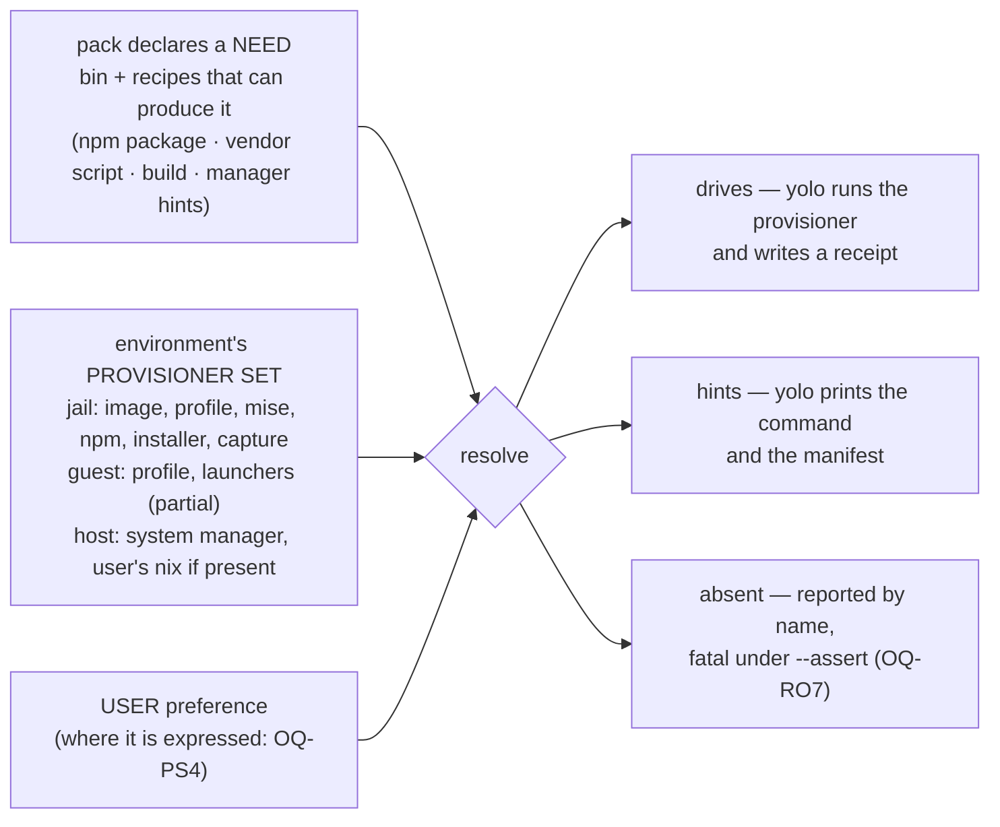

# yolo is a package manager whose backends differ per environment — and the pack contract cannot say so yet

**Status:** DESIGN, 2026-09-11. Nothing built. Every claim about the tree was verified at
`77190a2b` on 2026-09-11 and is labelled **MEASURED**, **READ FROM CODE** or **NOT MEASURED**
([§11](#11-facts-verified-for-this-doc)). Five questions are open and all five are the
maintainer's — this doc makes them decidable, it does not decide them.

> **In short.** yolo already is a package manager — the corpus has held that position since
> [`program-delivery.md` §6.3](program-delivery.md#63-installers-that-just-do-whatever-capture-the-install-then-treat-the-capture-as-the-package)
> adopted the AUR model — but it is one whose **backends differ per environment**, and the pack
> contract has no way to say so: `program` names one backend (`via`) where it should declare a
> need, so it works only where that backend happens to exist.

**Why it matters.** At the host `program` and `requires` collapse into one report line because
there is nothing for either to drive; a user cannot say *"install claude from brew here"* because
the pack picks the backend; and a missing dependency is about to become fatal under `--assert`
([`OQ-RO7`](report-tiers.md#OQ-RO7)) with the install offer it presupposes unbuilt.

**The shape.** A **need** the pack declares once (a binary, plus the recipes that can produce
it); a **provisioner set** each environment has; a **resolution** that picks a provisioner by the
user's preference and reports one of three dispositions — *drives*, *hints*, *absent*.

**Cost.** Reverses `depcheck`'s shipped remedy precedence (the pack's own installer first); adds
a user-facing preference surface; and, if the kind is renamed, touches a closed 19-kind set,
seven shipped manifests and a documentation gate.

**Start at [§3](#3-the-provisioner-inventory-per-environment)** — the inventory. The four
findings in [§3.1](#31-four-findings-the-table-forces) and every question below fall out of that
table.

**Needs your ruling:** [`OQ-PS1`](#OQ-PS1), [`OQ-PS2`](#OQ-PS2), [`OQ-PS3`](#OQ-PS3),
[`OQ-PS4`](#OQ-PS4), [`OQ-PS5`](#OQ-PS5).

> [!NOTE]
> **Scope note — a sibling of [`program-delivery.md`](program-delivery.md), not an extension,
> and here is why.** That doc is about the **jail**: its [§7](program-delivery.md#7-what-this-does-not-cover)
> excludes `macos-user` package delivery by name, and its [`OQ-PD16`](program-delivery.md#decision-ledger)
> ruled *"jail-only here; the host notch is owned by
> [`noncontainer-nix-environment.md`](noncontainer-nix-environment.md)"*. Extending it with a
> cross-notch model would reverse that ruling inside a doc that is one question away from
> graduating to a system reference. So this doc **cites** its four delivery classes
> ([§3](program-delivery.md#3-four-delivery-classes-and-the-rule-that-falls-out)), its agent/project
> axis ([§3.5](program-delivery.md#35-the-second-axis-who-the-dependency-serves-amendment-2026-09-03)) and its
> resolver seam ([§6](program-delivery.md#6-the-general-seam-one-ledger-many-resolvers)) as given and
> re-derives none of them. What it adds is the axis none of the three sibling docs owns: **which
> provisioners an environment has**, across all three notches at once.

**Reads with:** [`program-delivery.md`](program-delivery.md) (the jail's delivery classes and
resolvers — not restated here), [`noncontainer-nix-environment.md`](noncontainer-nix-environment.md)
(nix below the jail, and the coverage matrix in its [§2](noncontainer-nix-environment.md#2-what-install_hints-is-for-and-what-a-nix-env-would-and-would-not-replace)),
[`macos-user-provisioning.md`](macos-user-provisioning.md) (the guest's missing floor and stage),
[`yolo-as-environment-manager.md` §3.5](yolo-as-environment-manager.md#35-dependency-provisioning-declare-once-check-once-hand-off-with-a-manifest)
(*declare once, check once, hand off* — the host design this generalises),
[`../plans/environment-manager-plan.md`](../plans/environment-manager-plan.md) (Phase 6.4 and 4.3, both
unbuilt), [`report-tiers.md`](report-tiers.md) (the `--assert` fatal), and
[`../reference/pack-system.md`](../reference/pack-system.md) (the kinds). **No companion sketch
yet** — nothing here is settled enough to hold one; it opens with the first ruling.

---

## 1. The verdict, and four principles

**yolo is a package manager with a different backend set per environment, and the pack
contract cannot express that.** The jail resolves `program` through npm, a vendor installer or
the capture store; the guest through a nix profile and launchers it cannot fully run; the host
through nothing yolo drives at all. The host's *own* manager — brew, apt, dnf, pacman — is the
one backend yolo has modelled down to a generated `Brewfile` and never once executed. So the two
kinds that look redundant, `program` and `requires`, are redundant only where yolo has no
backend: they differ in nine mechanical ways inside a jail and collapse to one report line on a
host, because the kind describes **what yolo would do if the binary were absent**, and on a host
yolo can do nothing.

Four principles, numbered so the questions and any sibling can cite them. The first is the
maintainer's, stated in review on 2026-09-11; the other three are what the tree forces.

- **P1. The environment and the user choose the provisioner; the pack declares the need.**
  *"It shouldn't be up to the pack — that's the wrong place. It would be normal to use the
  Claude pack but install Claude from Homebrew."* A pack says what it needs and how it *can* be
  produced; who produces it is decided where the binary will live.
- **P2. A notch's provisioner choice does not propagate.** npm in the jail is a fact about the
  jail — *"in the jail containers we don't [use the system manager]… but that doesn't mean other
  environments have to follow that decision."*
- **P3. Every provisioner an environment has is either driven or hinted, out loud — never
  rendered and inert.** The guest notch has produced five instances of the inert case
  ([`macos-user-provisioning.md` §3](macos-user-provisioning.md#3-principles) P1, restated one level
  up); [§3](#3-the-provisioner-inventory-per-environment) finds two more.
- **P4. A default is platform-conditional**, because the environment includes the OS and its
  manager. brew covers six of six agent CLIs on macOS; apt covers none of them on Linux
  ([§4.2](#42-where-it-breaks)). *"The system package manager is the host default"* is right on
  one platform and wrong on the other, and that is a point **for** P1, not against it.

---

## 2. Two frames that failed in review

Both were tried on 2026-09-11 and both broke. Recorded so nobody re-proposes them.

| Frame | Where it came from | Why it fails |
| :--- | :--- | :--- |
| **"install vs presence"** | the code's own words — [`pack-system.md`](../reference/pack-system.md#requires): *"`program` and `requires` are install vs presence"* | Describes the **check** each kind performs in a jail, not the **cause** of their difference. At the host both perform the same check (`Manifest.DepRequirements`, `internal/packdecl/contributes.go:599-604` — READ FROM CODE), so the frame predicts nothing about the notch where the question is live. |
| **"yolo produces it vs something external produces it"** | review, as a replacement | Two counter-examples from the maintainer. `via: npm` **is** an external package manager yolo merely drives (`npm install -g`, `internal/entrypoint/shims.go:985`). And a user may already have `claude` from brew: `depcheck.presentAt` probes PATH and records where it found the binary, with no interest in provenance (`internal/depcheck/depcheck.go:171-179`). The kind cannot be about where a binary came from. |

**What survives.** A kind describes what yolo *would do* if the binary were absent — a claim
about **yolo's capability in this environment**. That is why the notch only *correlates* with
the behaviour: what actually decides is the set of provisioners the environment offers, which
the notch happens to fix today because nothing else can vary it.

---

## 3. The provisioner inventory, per environment

**Three terms, coined here.** A **provisioner** is a mechanism that can make a binary present in
an environment, together with whether yolo drives it there. Every resolver in
[`program-delivery.md` §6](program-delivery.md#6-the-general-seam-one-ledger-many-resolvers) is one —
that doc names them from the **record** side (who keeps the lockfile); this doc names the same
mechanisms from the **environment** side (is it here, and does yolo run it). Two provisioners
below are *not* [§6](program-delivery.md#6-the-general-seam-one-ledger-many-resolvers) resolvers: the system package manager, which yolo hints, and the capture
store, which yolo drives. An environment's **provisioner set** is the provisioners it offers. A
provisioner's **disposition** at a notch is one of **drives** (yolo runs it), **hints** (yolo
prints its command and stops) or **absent** (no code path). None of the three words appears in
the code; the nearest thing is the confinement Profile's one provisioning primitive
([§3.1](#31-four-findings-the-table-forces), F4).

Notches are the three values of the confinement dial —
[`yolo-as-environment-manager.md` §4](yolo-as-environment-manager.md#4-confinement-a-dial-with-three-notches).
**guest** below means the shipped `macos-user` backend; the Linux guest is unbuilt and has no
row.

| # | Provisioner | Underlying tool | Declared by | jail | guest (`macos-user`) | host | Record |
| :--- | :--- | :--- | :--- | :--- | :--- | :--- | :--- |
| 1 | **nix image** — the baked floor plus `packages:` | nix (`nix build .#ociImage`) | `packages:` (config key, not a pack kind) | **drives** | absent — no image | absent | `flake.lock`, load sentinel, image GC root |
| 2 | **nix profile** — `yoloNoncontainerPackages` buildEnv, `darwinpkg.Materialize` (`internal/darwinpkg/materialize.go:44`) | nix | `packages:` | **drives**, opt-in only: `YOLO_STORE_PACKAGES=1` on podman + Linux + a nix daemon (`internal/cli/run/storepackages.go:314`) | **drives** — the one mechanism that works there (`internal/macosuser/orchestrator.go:347-349`) | **absent — no caller.** `yolo host apply` has no `packages` path, honoured or refused ([`noncontainer-nix-environment.md` §1](noncontainer-nix-environment.md#1-what-is-already-solved-stated-precisely), re-checked) | `--out-link` GC root |
| 3 | **mise** | mise | `mise_tools` (config key) | **drives** — `mise install` in `setupScript` (`internal/cli/run/command.go:25-26`) | absent, **warned** (`internal/cli/run/loopholeinert.go:309-315`); the config is still written | absent | `mise.lock` honoured, never written by yolo |
| 4 | **npm / go, for servers** — LSP and MCP presets | `npm install -g`, `go install` | `lsp_servers`, `mcp_presets` | **drives** — bootstrap script (`internal/entrypoint/shell.go:204`) plus the evergreen refresh (`internal/entrypoint/serverrefresh.go`) | absent, **warned** — the bootstrap script is never generated on this path; ⚠ the refresh is baked into every launcher and **silently no-ops** ([§3.1](#31-four-findings-the-table-forces), F5) | absent | `~/.yolo-installed-lsps` sentinel; receipts |
| 5 | **npm, for programs** — `program via: npm` | `npm install -g` | pack `program` | **drives** — lazy launcher, hourly update (`internal/entrypoint/shims.go:342`) | **driven but unprovisioned** — the launcher is generated (`internal/entrypoint/darwin.go:78`) and second on `SandboxPath` (`internal/macosuser/macosuser.go:461`), and nothing supplies `npm`; it fails on the first invocation, unwarned | **hints** — present/missing plus a remedy; a `yolo host -- <bin>` wrapper is written (`internal/hostwrap/hostwrap.go:58`) and exits 127 when the binary is absent (`internal/cli/host.go:214-218`) | receipt `kind:"npm"` |
| 6 | **vendor installer** — `program via: installer` | `curl` the script, then `bash <file>` (`shims.go:1478`) | pack `program` | **drives** | **driven**; `curl` and `bash` exist at `/usr/bin`, so it may succeed — **NOT MEASURED** | **hints**, as row 5 | receipt `kind:"installer"` |
| 7 | **capture store** — yolo's own CAS | reflink → hardlink → copy (`internal/capture/materialize.go:148`) | derived from row 6 | **drives**, cold install only; auto-capture default on | **recording half only** — `yolo capture` still refuses here and `_try_materialize` cannot run (`internal/cli/run/autocapture.go:16-31`; F5) | absent | capture manifest; receipt `kind:"capture"` |
| 8 | **system package manager** — brew, brew-cask, apt, dnf, pacman; nix by elimination | none — command strings only | `install_hints` on `program` and `requires` | n/a (the image is the floor) | **hints** — `AssertRequiredBins` warns by name (`darwin.go:81`) | **hints only** — `check-deps` / `host apply` print the remedy and write `~/.config/yolo/Brewfile` and kin (`internal/cli/checkdeps.go:78-86`); **never executed** | the generated manifest |
| 9 | pnpm launcher | `npm install -g` | hardcoded (`shims.go:588`) | **drives** | driven, unprovisioned (as row 5) | absent | receipt `kind:"npm"` |
| 10 | claude plugins | `claude plugins install` | pack hook | **drives** | **drives** (`darwin.go:112`) | refused by design (`internal/render/fieldset.go:118-120`) | claude's own file |

Every cell is READ FROM CODE at `77190a2b`; the guest column is additionally NOT MEASURED on
hardware, for the reason [§11](#11-facts-verified-for-this-doc) gives.

### 3.1 Four findings the table forces

**F1 — The nix asymmetry: the host is the only notch where yolo owns no provisioner.** The jail
gets nix as an image (row 1) or, opted in, as a profile (row 2); the guest gets nix as a profile
(row 2). The same flake attribute serves both — `yoloNoncontainerPackages` has two consumers,
`macos-user` and the Linux store farm (`internal/cli/run/storepackages.go:327` calls
`darwinpkg.MaterializeAt`) — and **zero at the host**. So the host is not merely "the notch with
the fewest provisioners"; it is the notch with none yolo drives. That, and not anything about
the kinds, is why `program` degenerates there: with nothing to drive, every declaration reduces
to *is it on PATH, and what would install it* — which is the whole of `requires`.

**F2 — The system package manager is a provisioner yolo models completely and never uses.**
`detectManager` picks brew on macOS and probes apt/dnf/pacman/brew on Linux, reaching `nix` by
elimination (`internal/depcheck/depcheck.go:129-141`). `installCmd` knows each manager's verb,
brew's cask verb included (`:190`). `Manifest` writes the manager's own bundle file
(`:237`), and `check-deps` puts it at `~/.config/yolo/Brewfile` (`internal/cli/checkdeps.go:78-93`).
Then it stops. **MEASURED negative:** no reader of a remedy ever executes it — every consumer of
`Result.Remedy`, `.Fallback` and `.SelfInstall` is a print or a string builder, and no
`exec.Command` exists in `internal/depcheck`, `internal/render`, `checkdeps.go` or
`applyhostdeps.go`. The deferral is by name, in the code:

```go
// It NEVER installs anything (BACKLOG's detect-vs-apply split): it detects and hands off
// with the command. The offer-to-run (behind a batched, sudo-shown-through confirm,
// OQ-9) belongs to `apply` at a lower notch — this verb is the probe half, usable by a
// project's own doctor over the same declared hints.
```

(`internal/cli/checkdeps.go:9-12`.) The offer's UX was ruled on 2026-08-01 — env-manager
[`OQ-9`](../plans/environment-manager-plan.md#open-questions-to-resolve-before-their-phase): *batched by
elevation class, sudo first* — and that plan's own audit says its resolution *"has no
consumer at all today"*. What the roadmap's thread 29 did on 2026-09-10 was **authorise** Phase
6.4 and 4.3 as the mechanism for the `--assert` fatal, not design them, and
[`OQ-RO7`](report-tiers.md#OQ-RO7) — whether the fatal covers `program` as well as `requires` — is
still open. ⚠ **And the shipped precedence has the pack choosing.** `depcheck.Check` ranks the
declaring pack's *own* installer first and the detected manager's hint second, keeping the
manager's command only as `Fallback` (`depcheck.go:147-151`, `:160-164`; commit `b796d8b8`,
*"remedies that lead with upstream"*). Under P1 that order is inverted: the user's preferred
manager leads, and the pack's recipe is what it falls back to.

**F3 — `program` and `requires` differ nine ways in a jail and collapse at the host, and the
code says so itself.** In a jail: combine rule (`CombineExclusive` by bin vs `CombineShared`,
`internal/packdecl/kinds.go:296-307`); a launcher vs nothing (`internal/entrypoint/requires.go:12-14`:
*"this generates NOTHING"*); capturable (installer-via only, `internal/cli/capturehost.go:283`) vs
never; a receipt vs none; an agent-name claim vs deliberately not one
(`internal/packload/footprint.go:857`, `:908-918`); review-worthy vs not; a launch disclosure vs
none; a self-install command vs `""` (`contributes.go:570-571`); seven accepted fields vs two. At
the host: one collector, `Manifest.DepRequirements`, one probe, one report line differing in its
kind label (`internal/cli/applyhostdeps.go:129`), and one docstring that states this doc's finding
in the code's own words — *"The kinds differ in what they do to a JAIL (a program gets a launcher,
a requires gets an assertion), not in what they ask of a host"* (`contributes.go:594-598`). The one
host-side artefact that does differ is the `yolo host --` wrapper `program` gets and `requires`
does not (row 5), and it installs nothing. **The noun/verb mismatch** — `program` is a thing,
`requires` is an act — is part of why the pair reads as incomparable; it is noted here and spent
nowhere else, because naming is downstream ([§5.3](#53-naming-is-downstream)).

**F4 — The code already half-models the provisioner set, with one member.** The confinement
Profile is a vector of primitives, and one of its six is not a confinement primitive at all:

```go
// PrimBakedImage: a nix-built OCI image (the jail's package closure). A provisioning
// primitive, not a confinement one, but it travels with the jail notch and is absent
// below it.
```

(`internal/render/confinement.go:39-42`.) [`noncontainer-nix-environment.md` §7](noncontainer-nix-environment.md#7-is-it-orthogonal-to-confinement-no--and-this-is-the-load-bearing-finding)
already argues the nix profile is a candidate seventh (`PrimNixProfile`) and notes that
`describe` switches on `PrimBakedImage`'s **absence** to decide whether to print the profile. The
provisioner set is that idea completed: a per-environment vector with as many members as
[§3](#3-the-provisioner-inventory-per-environment) has rows, of which the tree today spells exactly
one. Whether it lives in the Profile or beside it is an implementation choice this doc delegates
([§6](#6-the-shape-this-doc-leans-toward)).

**F5 (a defect, not a finding) — the guest has two provisioners armed and unreachable.** The
macos-user run plan sets `YOLO_LSP_SERVERS` and `YOLO_MCP_PRESETS`, so every guest launcher is
baked with a non-empty server list and `SERVERS_ENABLED=1`; but `_refresh_servers` and
`_try_materialize` both open with `command -v yolo || return`, and the sandbox's `yolo` is staged
at `/var/yolo-jail/yolo` (`internal/macosuser/macosuser.go:139`), which is **not** on
`SandboxPath` (`:461-475`). Both no-op silently. Nothing in the tree records this, and the launch
warning at `loopholeinert.go:316-320` blames the missing bootstrap script alone. READ FROM CODE;
it is P3's failure mode exactly, and it is small enough to fix ahead of any ruling here.

---

## 4. The frame this corpus already holds: yolo is a package manager

*"Any way we look at it, we're building our own package manager, and we've already modeled this
on AUR, so we should continue to draw inspiration from there if we need it."* (maintainer,
2026-09-11.) The position is on record — [`program-delivery.md` §6.3](program-delivery.md#63-installers-that-just-do-whatever-capture-the-install-then-treat-the-capture-as-the-package):

> The prior art is Arch's. An AUR `PKGBUILD` runs upstream's opaque payload in a clean chroot
> (`makechrootpkg`), and the *output* is an ordinary pacman package with a file manifest — the
> package manager never trusts the build script's environment, only its captured product. The
> pack's `program via installer` contribution is already the PKGBUILD analogue: a name and a URL.

That was written for one class — the vendor installer. This doc generalises it: **every row of
[§3](#3-the-provisioner-inventory-per-environment) is a package-manager backend**, and the thing
the pack declares is a recipe. The AUR model is cited below only where it decides something;
where it does not, it is left alone.

### 4.1 Where the AUR model carries weight

- **The recipe is per-package; the installer is the system's.** An AUR helper builds from the
  `PKGBUILD` and hands the product to `pacman`. That separation **is P1**: the pack owns the
  recipe (what the binary is, how it can be produced), the environment owns installation. It is
  also [§6](program-delivery.md#6-the-general-seam-one-ledger-many-resolvers)'s *"many resolvers, one
  ledger"* seen from the other side — [§6](program-delivery.md#6-the-general-seam-one-ledger-many-resolvers) says every resolver keeps its own record under one
  reader; this says every environment picks its own resolver under one declaration.
- **Never trust the build environment, only the captured product.** This is why capture exists
  ([§6.3](program-delivery.md#63-installers-that-just-do-whatever-capture-the-install-then-treat-the-capture-as-the-package)),
  and it is why a **custom build** is expressible without widening trust
  ([§4.3](#43-a-custom-build-is-expressible-today-and-what-it-lacks)): a build script is exactly the
  *"installer that just does whatever"* the capture jail already contains.
- **`provides` / `depends`** is AUR's spelling of the relation `program` / `requires` strains to
  express, and it is verb/verb. The env-manager design's own sketch reached for it —
  `provides_from` in [§3.5](yolo-as-environment-manager.md#35-dependency-provisioning-declare-once-check-once-hand-off-with-a-manifest)'s
  example — and the field never shipped: a `program`'s accepted fields are `bin`, `via`, `package`,
  `url`, `flags`, `update`, `install_hints` (`internal/packdecl/contributes.go:29-72`), and
  `requires` takes `bin` and `install_hints` alone, refusing the rest by name (`:1588`). Evidence for
  [`OQ-PS5`](#OQ-PS5), where it stays.
- **`optdepends`.** No kind has an `optional` field (READ FROM CODE, every kind's field set), so
  yolo has no declared-but-optional category. [`OQ-RO7`](report-tiers.md#OQ-RO7)'s fatal implicitly
  assumes that category does not exist; if a pack ever needs it, the assumption becomes a
  question. One sentence, because nothing in the tree needs it yet.
- **`depends` vs `makedepends`** — runtime versus build-time. Nothing in the tree expresses the
  distinction (MEASURED negative: no `makedepends`, build-time or from-source vocabulary in
  `internal/packdecl`, `internal/depcheck`, `checkdeps.go` or `applyhostdeps.go`). The moment a
  `program` can be a build, yolo acquires it whether or not it is named
  ([§4.3](#43-a-custom-build-is-expressible-today-and-what-it-lacks)).

### 4.2 Where it breaks

**AUR has one destination; yolo has a different provisioner set per environment — which is the
whole problem.** Every `PKGBUILD` ends in `pacman -U` on one distro. A yolo recipe ends in npm
inside a jail, a nix profile on a Mac guest, and — under P1 — whatever the user's host prefers.
The model carries the recipe/installer split and the trust property; it does not carry a rule
for **which** installer, because it never had to choose one. And the destination AUR takes for
granted, the system's own manager, is the one provisioner yolo has never driven (F2).

The choice is also platform-conditional in a way pacman never is. [`noncontainer-nix-environment.md` §2](noncontainer-nix-environment.md#2-what-install_hints-is-for-and-what-a-nix-env-would-and-would-not-replace)
carries the verified coverage of the six agent CLIs per manager (sourced from the pack-host plan's
[§8.3](../plans/pack-host-management-plan.md#phase-8--host-deps-for-the-fzf-case--scoped-closes-the-acceptance-test--shipped); cited, not re-measured):

| manager | of the six agent packs |
| :--- | :--- |
| `apt` | **0** — no Debian/Ubuntu release packages any of them |
| `dnf` | **1**, and only in Rawhide |
| `pacman` | **2** — the other four are AUR-only, which `pacman -S` cannot install |
| `brew` | **6** — four are casks, a Brewfile defect fixed 2026-08-02 by the `brew-cask` key |
| `nix` | **6** — three are `unfree`, so a bare `nix profile install` refuses |

Three things follow, and the maintainer asked for the third to be checked.

- **On macOS he is right:** brew covers all six, so *"the system manager is the host default"* is
  well-founded there.
- **On Linux it fails:** a non-Arch host gets zero or one of six from its native manager. The
  default is therefore **conditional on the platform** — which reinforces P1 and P4 rather than
  weakening them, since "the environment" includes the distro.
- ⚠ **The premise *"there's no nix package"* is wrong, and the real reason is more useful.** nix
  covers six of six on every live platform; three refuse under a bare install because they are
  **`unfree`** — a licensing gate, not an absence. That widens the option space: `allowUnfree` is
  a decision a user can make once, where a missing package would have been a dead end. The jail
  and guest already handle it as warn-and-skip via `meta.available`
  ([`OQ-6`](noncontainer-nix-environment.md#decision-ledger) in [`noncontainer-nix-environment.md`](noncontainer-nix-environment.md)), and yolo
  deliberately never sets it on the user's behalf.

And the same source's sharpest sentence cuts against a naive *prefer the system manager* rule:
**on Linux, nix is the only manager covering all six, so the reproducible path and the
only-path-that-works path are the same path.**

### 4.3 A custom build is expressible today, and what it lacks

The delivery vocabulary is closed at two values — `knownVias` is `{npm → "npm", installer →
"native"}` (`internal/packdecl/contributes.go:378-381`), and its comment says why: *"core has to
know how to DELIVER a mechanism before a pack may name it."* Nothing in the schema forbids a
build, because a build already fits the second value: the validator requires `via: installer` to
carry a non-empty `url` and nothing more (`:1586`), and the class is defined as a program that
*"runs arbitrary logic and leaves arbitrary state"*
([§6.3](program-delivery.md#63-installers-that-just-do-whatever-capture-the-install-then-treat-the-capture-as-the-package)).
A build script is that. The capture jail contains it and emits a package, exactly as it does for
claude's installer. **So the capability exists; the vocabulary does not.** Three things it
lacks:

1. **Build-time dependencies.** A build needing `cmake` or `rustc` has no way to say so. The
   throwaway capture jail's floor — the image's 36 core packages, `go`, `python3` and
   `nodejs_24` among them ([`macos-user-provisioning.md` §1](macos-user-provisioning.md#1-the-two-missing-halves))
   — is the *implicit* `makedepends`, and a build that needs anything else fails inside the
   capture with no declaration to blame.
2. **A pack-shipped recipe.** `url` is the only source field; I found no scheme check on it and
   also no pack-relative form, so whether a script inside the pack tree can be named is
   **NOT VERIFIED**.
3. **A place in the vocabulary.** [§6.2](program-delivery.md#62-pay-the-enum-tolerance-before-the-next-mechanism-arrives)
   paid the enum tolerance so a third `via` value degrades to a skip on an older image rather than
   a refused boot — the tolerance is spent and waiting.

**Is `via` the right axis for it?** Today `via` is the pack *selecting* the delivery mechanism.
Under P1 the pack does not select; it **lists** what can produce the binary, and the resolver
picks. A build is then a third *recipe kind* beside "an npm package" and "a vendor script", not a
third value of a selector — which is [`OQ-PS3`](#OQ-PS3)'s question in miniature.

---

## 5. Reframing program as a package

The maintainer's stated payoff: *"it may make the capture step clearer when we're capturing the
binary install."* Tested here against what the reframing would actually have to explain.

### 5.1 Tested against the mechanical differences

Does *"a `program` is a package"* make each of F3's differences fall out, or merely rename it?

| Difference | Falls out of "package"? | Why |
| :--- | :--- | :--- |
| exclusive vs shared combine | **yes** | A package *provides* a name — one provider per name, as pacman's `conflicts` enforces. A dependency is *depended on* by many. |
| a launcher vs none | **yes** | A package yolo installs needs an entry point yolo owns; a dependency yolo does not install needs none. |
| capturable vs not | **partly** | Capture applies to a product whose *recipe* is opaque — the installer class. It falls out of the recipe kind, not of "package" as such: an npm package is a package and is refused by capture (`capturehost.go:263-266`), because a registry version already names it. |
| driven vs hinted | **no** | This is a property of the **environment's provisioner set**, not of the declaration. `claude` is one package however you spell it; it is driven in a jail and hinted on a host. The reframing clarifies the noun and leaves the disposition where it was. |

**Verdict:** the reframing buys a correct noun — one thing, produced by several recipes, installed
by several backends — and it is the noun the AUR model was already using. It does **not** by
itself repair the host, because the host's problem is an empty provisioner set
(F1), and no rename adds a member to it.

### 5.2 The capture payoff

Here the maintainer is right, and the corpus already says so in its own words: *"from then on
**the capture is the package**"*
([§6.3](program-delivery.md#63-installers-that-just-do-whatever-capture-the-install-then-treat-the-capture-as-the-package)).
Under the current vocabulary that sentence is a metaphor — a `program` is a launcher and a `via`,
and the capture is a store entry the launcher tries first. Under the reframing it is literal: a
`via: installer` recipe produces a package whose provisioner is the vendor's script, and capture
**re-provisions the same package** through yolo's CAS. Two provisioners, one package, and the
second is the one that needs nothing from the environment but a filesystem — which is why it is
the only row of [§3](#3-the-provisioner-inventory-per-environment) that could work on a guest with
no floor at all, once its recording-only half is finished (H1 and H2 in
[`../plans/install-capture.md`](../plans/install-capture.md#build-order)). **NOT MEASURED** — nothing
has materialised a capture on macos-user — but it is the one place the reframing changes what an
implementer would build rather than what they would call it.

### 5.3 Naming is downstream

A kind rename is its own decision ([`OQ-PS5`](#OQ-PS5)) and must not drive the model above. Its
measured blast radius, so the cost is on the table: the closed 19-kind const set and
`footprints` map (`internal/packdecl/kinds.go:40-223`, `:293`); the validator's per-kind cases
(`contributes.go:1540`, `:1588`); **seven shipped manifests** under `packs/` — six `program`
(agy, claude, codex via installer; copilot, opencode, pi via npm) and one `requires`
(`guardrails`, `rg` and `fd`) — plus the `claude-fzf-pack` example; `yolo config-ref`
(`internal/cli/config_ref.txt:998`, `:1010-1024`) and `yolo pack --help` (`internal/cli/pack.go:72`,
`:76`), both gated by `TestEveryKindIsDocumented` (`internal/cli/packkinddocs_test.go:48`), which
requires the kind's bare name to lead a line in each; and any fetched pack. The pack **lockfile**
records no kind names (`internal/packsrc/lock.go:35-44`), so it is not on the list.

---

## 6. The shape this doc leans toward

Not a decision — the leaning the five questions are asked against, so their stakes are concrete.



Read as behaviour, exhaustively; mechanism is the implementer's.

- **Declaration.** A pack declares a binary and every recipe it knows that produces it. Today's
  `via` + `package`/`url` is one recipe; today's `install_hints` are the rest. Nothing forces a
  pack to know the user's platform, and a pack with **no** recipe for a binary is today's
  `requires`.
- **Provisioner set.** Each environment enumerates what it has, and the enumeration is what
  `describe` prints — the way it already prints the profile line when `PrimBakedImage` is absent.
  An environment with an **empty** set (a host with no manager detected and no nix) reports every
  need as *absent* with no remedy, which is today's `noRemedyReason` path
  (`applyhostdeps.go:187`) made systematic.
- **Resolution.** For each need, walk the user's preference over the environment's set; the first
  provisioner that both exists here and has a recipe for this binary wins. **Ordered, first
  match**, so a preference that covers nothing on this platform is skipped rather than fatal.
  A recipe the declaration carries for a provisioner the environment lacks is *reported*, never
  attempted. The pack's own installer is one candidate among the set, ranked by the user — not
  the head of the list as `depcheck.Check` ranks it today (F2).
- **Disposition and record.** *Drives* writes a receipt, as every driven install already does;
  *hints* writes the manifest, as `check-deps` already does; *absent* names the binary and the
  set that could not cover it. Nothing is ever rendered inert (P3): a provisioner the environment
  cannot run is not in its set.
- **Propagation.** The jail's resolution is the jail's. A workspace whose jail installed `claude`
  via npm says nothing about how its host resolves `claude` (P2).
- **Pre-existing state.** A binary already present satisfies the need regardless of who put it
  there, exactly as `presentAt` behaves today. No resolution re-provisions a present binary.
- **Forbidden.** Never run a system-manager command without the confirm
  [`OQ-9`](../plans/environment-manager-plan.md#open-questions-to-resolve-before-their-phase) ruled; never set
  `allowUnfree` for the user; never let a pack's `via` override a user's stated preference.

### 6.1 Who chooses the provisioner today

Checked before widening scope, because *"let the user choose"* could be a config key or a
subsystem. It is mostly a key. The **data** exists: `install_hints` already carries one remedy
per manager including `brew-cask`, `hintFor` already indexes it by manager
(`depcheck.go:77-78`), and `Result.Fallback` already carries the alternative the user did not
get (`:110-117`). The **selector** does not: `DetectManager` is a package-level var, overridable
in tests and by nothing else (`:126-127`; a config-key sweep of `internal/config` and
`internal/cli` found none), and the precedence putting the pack's installer first is hardcoded
(F2). So the first increment of [`OQ-PS4`](#OQ-PS4) is a user-scope preference that replaces
`detectManager`'s answer and re-ranks `SelfInstall`, over hints the packs already ship. The
**subsystem** half — actually running the winner — is Phase 6.4 plus
[`OQ-RO7`](report-tiers.md#OQ-RO7), and is [`OQ-PS2`](#OQ-PS2).

---

## 7. Alternatives, each with a verdict

| Alternative | Verdict |
| :--- | :--- |
| **A. Status quo, reported honestly** — keep `via`, keep hinting at the host, fix F5 and the unwarned guest launcher | **Rejected as an end state, accepted as the interim.** It satisfies P3 and nothing else; a user still cannot choose brew, and the host still has no provisioner. |
| **B. Rename only** — `program` → `package`, `requires` unchanged | **Rejected.** [§5.1](#51-tested-against-the-mechanical-differences): it changes no disposition anywhere. |
| **C. A provisioner set per environment, a need per pack, a user preference between them** ([§6](#6-the-shape-this-doc-leans-toward)) | **The shape this doc leans toward**, contingent on all five questions. Costs a preference surface, the F2 precedence reversal, and — if the host is to *drive* anything — Phase 6.4. |
| **D. Per-notch `via` in the manifest** — `via: {jail: npm, host: brew}` | **Rejected.** The pack is the wrong place (P1), and a pack author cannot know the user's distro; the coverage matrix makes any pack-chosen host value wrong on some platform. |
| **E. Give the host nix** — yolo installs nix so every notch has the same provisioner | **Not an alternative to the model; one cell of it**, and the half of [`OQ-PS1`](#OQ-PS1) the corpus has never considered. |
| **F. Agent CLIs from nix in the jail** — [`noncontainer-nix-environment.md` OQ-7](noncontainer-nix-environment.md#OQ-7) | **Out of scope**, leaning no there. Noted because under P2 it would be a jail decision and would change nothing about the host. |

---

## 8. Risks

| # | Risk | Mitigation |
| :--- | :--- | :--- |
| R1 | **A preference surface nobody sets.** Most users never touch it, and the default must therefore be right per platform (P4). | Default = the detected manager where it covers the package, then the pack's recipe, then nix if present — and print which won, every time. |
| R2 | **Reversing `depcheck`'s precedence re-pins agent CLIs to distro versions.** The shipped order exists because a distro package silently pins a tool that has a first-party updater (`depcheck.go:147-151`). | State it as the cost of P1 and let the user's choice carry it; keep the pack's recipe as the printed alternative, as `Fallback` does today in the other direction. [§3.5](program-delivery.md#35-the-second-axis-who-the-dependency-serves-amendment-2026-09-03)'s evergreen ruling is a **jail** policy and does not reach a host the user provisions (P2). |
| R3 | **Driving the system manager is the first time yolo mutates a real machine's toolchain.** | Exactly the elevation the env-manager design priced ([§3.5](yolo-as-environment-manager.md#35-dependency-provisioning-declare-once-check-once-hand-off-with-a-manifest)): batched confirms, sudo shown through, no TTY means print only. [`OQ-PS2`](#OQ-PS2) asks whether to take it; it does not weaken it. |
| R4 | **A custom build widens the capture jail's trust surface.** | It does not — the capture jail already runs arbitrary vendor scripts, and the product is what is trusted ([§4.1](#41-where-the-aur-model-carries-weight)). What widens is the *declaration*, and a fetched pack's installer URL is already the review-flagged claim. |
| R5 | **Every guest claim here is unmeasured.** No Seatbelt profile from this backend has been loaded by a kernel (`internal/macosuser/capture.go:41-44`). | Every guest cell is labelled; F5 is a code reading a Mac can confirm in one launch. |
| R6 | **The set is enumerated by hand and drifts.** | Derive it from the same source `describe` reads; a provisioner with no `describe` line is not in the set. |

---

## 9. What this does NOT cover

- **The four delivery classes, the agent/project axis, and the resolver seam.**
  [`program-delivery.md`](program-delivery.md) owns them and nothing here re-derives them.
- **Records, lockfiles, receipts.** [§6](program-delivery.md#6-the-general-seam-one-ledger-many-resolvers)'s
  *one ledger, many resolvers* is taken as ruled; this doc adds no record format.
- **Trust.** [`trust-paths.md`](trust-paths.md). A provisioner set says what *can* install; whether
  a fetched pack may name a recipe is that doc's.
- **How large the guest floor is, and GNU or BSD** — [`OQ-P1`](macos-user-provisioning.md#OQ-P1),
  [`OQ-P2`](macos-user-provisioning.md#OQ-P2). This doc needs the guest to have a *stage*; it does
  not say how big.
- **The Linux guest** (env-manager Phase 7.2). No code, no row.
- **The wording of the host report** — [`report-tiers.md`](report-tiers.md). This doc supplies the
  dispositions; that one decides how they print.
- **Whether the jail should get agent CLIs from nix** — [`noncontainer-nix-environment.md` OQ-7](noncontainer-nix-environment.md#OQ-7).
- **A task list.** The roadmap is [`../plans/roadmap.md`](../plans/roadmap.md) and is not edited by
  this doc.

---

## 10. Where this sits against the sibling docs

| Doc | What it owns | What this doc takes from it, or hands to it |
| :--- | :--- | :--- |
| [`program-delivery.md`](program-delivery.md) | the jail's delivery classes, the evergreen ruling, resolvers, capture | Takes [§3](program-delivery.md#3-four-delivery-classes-and-the-rule-that-falls-out), [§3.5](program-delivery.md#35-the-second-axis-who-the-dependency-serves-amendment-2026-09-03), [§6](program-delivery.md#6-the-general-seam-one-ledger-many-resolvers), [§6.3](program-delivery.md#63-installers-that-just-do-whatever-capture-the-install-then-treat-the-capture-as-the-package) as given. Hands it one bullet in [§7](program-delivery.md#7-what-this-does-not-cover) naming this doc as the cross-notch owner. |
| [`noncontainer-nix-environment.md`](noncontainer-nix-environment.md) | nix below the jail; the coverage matrix; six live questions | Takes the matrix and the `PrimNixProfile` argument. Its premise — the user's nix is a *precondition* ([§5.4](noncontainer-nix-environment.md#54-what-if-the-user-has-no-nix)) — is half of [`OQ-PS1`](#OQ-PS1); the other half it never considers. |
| [`macos-user-provisioning.md`](macos-user-provisioning.md) | the guest's floor and stage | Takes its four-keys table as the guest column's basis, **corrected** in one cell: the agent launchers are generated *and run* there, failing for want of npm — not inert. |
| [`yolo-as-environment-manager.md`](yolo-as-environment-manager.md) | *declare once, check once, hand off* ([§3.5](yolo-as-environment-manager.md#35-dependency-provisioning-declare-once-check-once-hand-off-with-a-manifest)); [`OQ-EM1`](yolo-as-environment-manager.md#OQ-EM1) | Generalises [§3.5](yolo-as-environment-manager.md#35-dependency-provisioning-declare-once-check-once-hand-off-with-a-manifest) from "the host hands off" to "each environment resolves". ⚠ [`OQ-EM1`](yolo-as-environment-manager.md#OQ-EM1) and the plan's Phase 4 warning both say `FieldSet` *refuses* `program` at host citing `fieldset.go:38`; `HostFields()` honours it (`internal/render/fieldset.go:194`, *"honored but confirm-gated by the caller"*), so that refusal string is unreachable for `program` and the shipped rule is *report, do not install*. |
| [`../plans/environment-manager-plan.md`](../plans/environment-manager-plan.md) | Phase 6.4 and 4.3, [`OQ-9`](../plans/environment-manager-plan.md#open-questions-to-resolve-before-their-phase) | Both unbuilt; [`OQ-PS2`](#OQ-PS2) is whether to build them as *the host's driven provisioner* rather than as a one-off offer. |
| [`report-tiers.md`](report-tiers.md) | the `--assert` fatal, [`OQ-RO7`](report-tiers.md#OQ-RO7) | RO7's leaning (*both fatal, only `program` gets the offer*) is a **kind**-keyed rule; under P1 the offer would key on *whether a provisioner covers the binary here*, which is a different predicate. Flagged, not ruled. |
| [`host-render-target.md`](host-render-target.md) | the host as a reduced render target | ⚠ Its [§2.2](host-render-target.md#22-so-which-is-it-a-command-or-a-mode) table marks `macos-user · program: ✅ (native nix)`; that cell describes `packages:`, not `program` — no `program` is provisioned by nix on any notch. |
| [`../reference/pack-system.md`](../reference/pack-system.md) | the kinds and their combine rules | Its [`requires`](../reference/pack-system.md#requires) section is the *install vs presence* frame ([§2](#2-two-frames-that-failed-in-review)); correct about the jail, silent about why the host differs. |

---

## 11. Facts verified for this doc

Recorded so a later reader can tell measurement from inference. Everything ran from a Linux
podman jail at `77190a2b` on 2026-09-11.

| Claim | Status | How |
| :--- | :--- | :--- |
| No install hint is ever executed; no `brew`/`apt`/`dnf`/`pacman` is ever run | **MEASURED** negative | `rg -n 'exec\.Command\|syscall.Exec\|StartProcess'` over `internal/depcheck`, `internal/render`, `checkdeps.go`, `applyhostdeps.go` → none; every `.Remedy`/`.Fallback`/`SelfInstall` consumer is a print |
| `DetectManager` has no config path | **MEASURED** negative | `rg` for a manager-preference key over `internal/config`, `internal/cli` (non-test) → none |
| No build-time / `makedepends` / `optional` vocabulary exists | **MEASURED** negative | `rg -i` over `internal/packdecl`, `internal/depcheck`, `checkdeps.go`, `applyhostdeps.go`; every kind's field set read |
| `knownVias` is exactly `{npm, installer}` | READ FROM CODE | `internal/packdecl/contributes.go:378-381` |
| `program`/`requires` share one host path | READ FROM CODE | `contributes.go:599-604`; `applyhostdeps.go:61`, `:129`, `:187` |
| The guest generates and runs launchers; npm is unprovisioned; refresh and materialise no-op | READ FROM CODE, **NOT MEASURED** | `darwin.go:76-83`; `macosuser.go:139`, `:461-475`; `shims.go` launcher bodies |
| Any behaviour on macOS | **NOT MEASURED** — cannot be, from here | this jail is Linux; a nested jail is structurally blind to the `macos-user` backend and to rootless podman (AGENTS.md carve-outs), and the backend's own code says no Seatbelt profile has ever been kernel-loaded (`internal/macosuser/capture.go:41-44`) |
| The coverage matrix | cited, **not re-measured** | [`noncontainer-nix-environment.md` §2](noncontainer-nix-environment.md#2-what-install_hints-is-for-and-what-a-nix-env-would-and-would-not-replace), measured there 2026-08-02 against its own lock |
| `MISE_DISABLE_TOOLS` exists (`pnpm` excluded from mise) | READ FROM CODE — a first trace reported it absent; re-checked | `internal/cli/run/assemble.go:601-604`, `internal/config/config.go:242` |
| Seven manifests under `packs/` declare `program` or `requires` | **MEASURED** | `rg -l '"kind": *"(program\|requires)"' packs/` |

**Drift found while verifying, reported not fixed:** `internal/cli/config_ref.txt:999-1000` still
says the launcher is *"last on PATH"* (B2 moved it second, 2026-09-04); `internal/cli/packkinddocs_test.go:16`
and `:37` speak of a "16th kind" and "15 kinds" against a set of 19; the two stale cells named in
[§10](#10-where-this-sits-against-the-sibling-docs); and F5.

---

## Open Questions

Five open; none answered. *"We need to do some more thinking here"* — the maintainer, 2026-09-11.
Each is written to be decidable, with stakes and a leaning; the leaning is mine and is not a
recommendation the doc rests on.

1. 💬 **OQ-PS1: Should the host notch have nix — and which of two questions is being asked?**
   One sentence hides two. **(a)** *Use the user's nix if `/nix` is present* — this is the whole
   premise of [`noncontainer-nix-environment.md`](noncontainer-nix-environment.md), whose
   [§5.4](noncontainer-nix-environment.md#54-what-if-the-user-has-no-nix) treats absence as terminal
   and whose mechanism, `yoloNoncontainerPackages`, has two consumers and no host caller (F1).
   **(b)** *yolo installs nix* — never considered anywhere in the corpus (MEASURED negative: the
   only "install nix" sentences say that telling a brew user to do so is worse than
   `brew install`). **Stakes:** (a) decides whether the host's provisioner set can ever contain
   a yolo-driven member without Phase 6.4, and whether `packages:` gains a meaning below `jail`
   ([`OQ-8`](noncontainer-nix-environment.md#OQ-8) there); (b) decides whether yolo is willing to
   be a package manager that installs a package manager.

   _Leaning:_ **(a) yes, as one member of the host set, ranked by the user; (b) no.** (a) costs
   one caller for an attribute that already builds on every system, and on Linux it is the only
   provisioner that covers all six agent CLIs ([§4.2](#42-where-it-breaks)). (b) is the one act P1
   says belongs to the user: a machine-wide daemon and store is not a dependency a pack
   introduced. The brew user's objection in [§5.4](noncontainer-nix-environment.md#54-what-if-the-user-has-no-nix) stands unchanged.

   <!-- vantage: oq id=OQ-PS1 leaning="(a) yes — use the user's nix when /nix exists, as one ranked member of the host's provisioner set; it needs one caller for an attribute that already builds everywhere and is the only manager covering all six agent CLIs on Linux. (b) no — yolo installing nix is a machine-wide act P1 reserves for the user." -->

   **Answer:**
   > _(empty — fill in when decided)_

2. 💬 **OQ-PS2: Should yolo drive the system package manager, or keep hinting?** Today it is
   modelled completely and never run (F2). The adjacent authorisations are narrower than this
   question: Phase 6.4 is an *offer-to-run* attached to `apply`, and roadmap thread 29 authorised
   it as the mechanism behind the `--assert` fatal. This asks whether the system manager becomes
   a **driven provisioner** of the host in general — the thing the resolution in
   [§6](#6-the-shape-this-doc-leans-toward) selects and runs — and, per the maintainer, whether it
   is the host **default**. **Stakes:** the first mutation of a real machine's toolchain by yolo;
   [`OQ-RO7`](report-tiers.md#OQ-RO7)'s predicate (kind-keyed today, provisioner-keyed under P1);
   and whether the coverage matrix's Linux row makes "default" a per-platform table rather than a
   word.

   _Leaning:_ **Drive it, behind the confirm [`OQ-9`](../plans/environment-manager-plan.md#open-questions-to-resolve-before-their-phase)
   already ruled, as the host default where it covers the package** — which on macOS is brew for
   all six and on a non-Arch Linux host is nothing, so the resolution walks on to the next
   preference (nix if present, then the pack's own recipe). Keep hinting as the floor the
   env-manager design guarantees: the manifest is always written; running it is the offer on top.

   <!-- vantage: oq id=OQ-PS2 leaning="Drive it, behind OQ-9's batched confirm, as the host default where it covers the package — brew for all six on macOS, nothing on a non-Arch Linux host, where the resolution walks on to nix-if-present and then the pack's own recipe. The written manifest stays the floor." -->

   **Answer:**
   > _(empty — fill in when decided)_

3. 💬 **OQ-PS3: Does a pack declare a provisioner, or a need the environment resolves?** This is
   the deep one. Today `via` is the pack choosing the mechanism, and `install_hints` is a side
   channel of alternatives the host may print. P1 says the pack should declare *what* and *how it
   can be produced*, and the environment plus user should choose. **Stakes:** whether `via`
   survives as a selector or becomes one recipe among several; whether a custom build is a third
   `via` value or a third recipe kind ([§4.3](#43-a-custom-build-is-expressible-today-and-what-it-lacks)),
   and with it whether build-time dependencies get a declaration; whether `install_hints` stops
   being a hint and becomes a recipe with a provisioner name; and whether
   [§6](program-delivery.md#6-the-general-seam-one-ledger-many-resolvers)'s *one ledger, many resolvers*
   gains its mirror image, *one declaration, many environments*.

   _Leaning:_ **A need plus the recipes that can produce it; the environment resolves.** The AUR
   split ([§4.1](#41-where-the-aur-model-carries-weight)) is the shape; the current fields already
   hold the data (a `via`+`package`/`url` is one recipe, each `install_hints` entry is another);
   what changes is that no recipe is privileged by the pack. A custom build then arrives as a
   recipe kind carrying its own build-time needs, and the enum tolerance
   [§6.2](program-delivery.md#62-pay-the-enum-tolerance-before-the-next-mechanism-arrives) already paid
   covers the older-image case.

   <!-- vantage: oq id=OQ-PS3 leaning="A need plus the recipes that can produce it, resolved by the environment and the user — the AUR recipe/installer split. Today's via+package/url is one recipe and each install_hints entry is another; what changes is that the pack privileges none of them. A custom build is then a recipe kind with its own build-time needs." -->

   **Answer:**
   > _(empty — fill in when decided)_

4. 💬 **OQ-PS4: Where does the user express the choice?** A pack declares `program claude via:
   npm`; the user wants brew on this machine, and today nothing can say so — the only selector is
   `detectManager`, which no config reaches ([§6.1](#61-who-chooses-the-provisioner-today)). Three
   shapes, no schema: **per-package** (`claude: brew`), **per-environment** (`host: prefer brew`),
   or an **ordered preference list** the resolver walks until one provisioner covers the package.
   **Stakes:** only the ordered list degrades correctly on a Linux host whose first choice covers
   nothing (apt: zero of six); per-package is the only one that can express *"claude from brew,
   everything else from nix"*; per-environment is the only one a user would ever bother to set.
   It also decides scope: over existing `install_hints` this is a **config key**; if it must
   carry recipes the packs do not ship, it is a **subsystem**.

   _Leaning:_ **An ordered preference list per environment, user-scope, with a per-package
   override** — the list because it is the only shape that survives the Linux row, the override
   because *"claude from brew"* is the maintainer's own example, per-environment because a jail's
   list must not be a host's (P2). Scope: a key, first — it replaces `detectManager`'s answer
   and re-ranks `SelfInstall` over hints the packs already carry; the subsystem is
   [`OQ-PS2`](#OQ-PS2).

   <!-- vantage: oq id=OQ-PS4 leaning="An ordered preference list per environment, user-scope, with a per-package override. The list is the only shape that degrades correctly on a Linux host whose first choice covers nothing; the override is the maintainer's own 'claude from brew' example; per-environment because a jail's list must not be a host's. Scope: a config key over existing install_hints first." -->

   **Answer:**
   > _(empty — fill in when decided)_

5. 💬 **OQ-PS5: Does `program` become `package`, and what happens to `requires` under that?**
   Downstream of [`OQ-PS3`](#OQ-PS3) by construction: if the pack declares a need, the pair is
   *provides*/*depends*-shaped, verb/verb, and `requires` is a need with **no recipe of its own**
   — the same declaration minus the pack's own way to produce it. If `via` survives as a
   selector, the rename is cosmetic and [§5.1](#51-tested-against-the-mechanical-differences) says it
   buys a noun and no behaviour. **Stakes:** the blast radius in
   [§5.3](#53-naming-is-downstream) — a closed const set, seven manifests, two help surfaces and a
   doc gate — against the one place the rename changes what gets built, capture
   ([§5.2](#52-the-capture-payoff)); and whether `requires` keeps refusing `via`/`package`/`url` by
   name (`contributes.go:1588`) or becomes the degenerate case of one kind.

   _Leaning:_ **Defer until [`OQ-PS3`](#OQ-PS3) is ruled; then rename only if the ruling makes the
   pair one kind.** A rename that leaves `via` as a selector is B in
   [§7](#7-alternatives-each-with-a-verdict). If PS3 rules "need", the honest shape is one kind
   whose recipe list may be empty, and the two names collapse rather than get re-spelled.

   <!-- vantage: oq id=OQ-PS5 leaning="Defer until OQ-PS3 is ruled, then rename only if that ruling makes the pair one kind: a need whose recipe list may be empty. A rename that leaves via as a selector is alternative B — a noun and no behaviour." -->

   **Answer:**
   > _(empty — fill in when decided)_

## Decision Ledger

Nothing ruled yet. Rows arrive as the questions above are answered and compacted.

| ID | Ruling / Decision | Date | Settled in |
| :--- | :--- | :--- | :--- |
| — | — | — | — |
