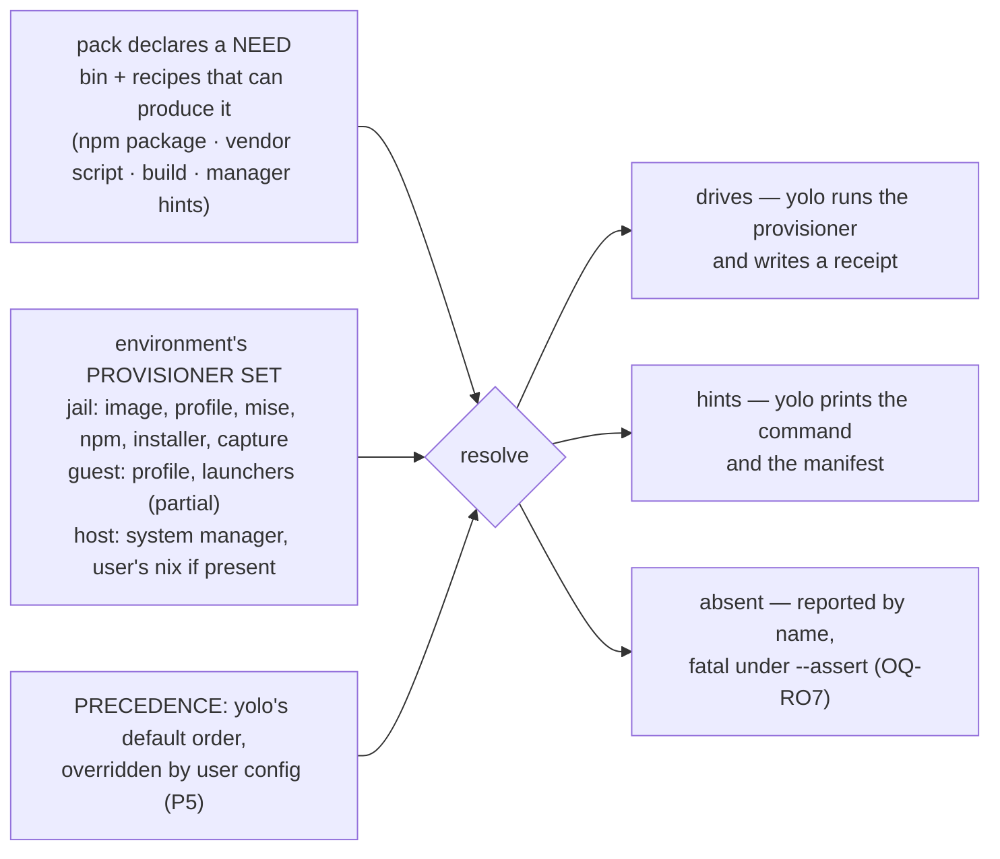

# yolo is a package manager whose backends differ per environment — and the pack contract cannot say so yet

**Status:** DESIGN, 2026-09-11, **amended the same day** to absorb
[`noncontainer-nix-environment.md`](noncontainer-nix-environment.md) (retired; see the Scope note). Nothing built. Claims about
the tree were verified at `77190a2b`/`6eb7fe7f` on 2026-09-11 and are labelled **MEASURED**,
**READ FROM CODE** or **NOT MEASURED**; claims inherited from the merged doc keep their own
2026-08-02 / 2026-08-23 verification dates and say so ([§14](#14-facts-verified-for-this-doc)).
One question was ruled on 2026-09-11 ([`OQ-PS4`](#decision-ledger)); eleven are open and all eleven
are the maintainer's. **[§15](#15-what-a-mac-session-should-measure)'s five Mac measurements RAN on
2026-09-11**, on hardware this doc could not reach when it was written — they carry their own
results, they corrected four of the five items that asked them, and one of them opened
[`OQ-PS8`](#OQ-PS8).

> **In short.** yolo already is a package manager — the corpus has held that position since
> [`program-delivery.md` §6.3](program-delivery.md#63-installers-that-just-do-whatever-capture-the-install-then-treat-the-capture-as-the-package)
> adopted the AUR model — but it is one whose **backends differ per environment**, and the pack
> contract has no way to say so: `program` names one backend (`via`) where it should declare a
> need, so it works only where that backend happens to exist.

**Why it matters.** At the host `program` and `requires` collapse into one report line because
there is nothing for either to drive; a user cannot say *"install claude from brew here"* because
the pack picks the backend; and a missing dependency is about to become fatal under `--assert`
([`OQ-RO7`](report-tiers.md#11-decision-ledger)) with the install offer it presupposes unbuilt.

**The shape.** A **need** the pack declares once (a binary, plus the recipes that can produce
it); a **provisioner set** each environment has; a **resolution** that walks an ordered
preference — yolo's default, the user's config overriding it — and reports one of three
dispositions: *drives*, *hints*, *absent*.

**Cost.** Reverses `depcheck`'s shipped remedy precedence (the pack's own installer first),
knowingly accepting the version-currency cost that precedence exists to avoid
([§8.2](#82-the-ruling-a-shipped-default-order-the-user-config-overrides)); adds a user-facing
preference surface; and, if the kind is renamed, touches a closed 19-kind set, seven shipped
manifests and a documentation gate.

**Start at [§3](#3-the-provisioner-inventory-per-environment)** — the inventory. The five
findings in [§3.1](#31-five-findings-the-table-forces) and every question below fall out of that
table. [§8.2](#82-the-ruling-a-shipped-default-order-the-user-config-overrides) is the one
ruling so far.

**Needs your ruling:** [`OQ-PS1`](#OQ-PS1), [`OQ-PS2`](#OQ-PS2), [`OQ-PS3`](#OQ-PS3),
[`OQ-PS5`](#OQ-PS5), [`OQ-PS6`](#OQ-PS6), [`OQ-PS7`](#OQ-PS7), [`OQ-NX4`](#OQ-NX4),
[`OQ-NX5`](#OQ-NX5), [`OQ-NX8`](#OQ-NX8), [`OQ-NX9`](#OQ-NX9).

> [!NOTE]
> **Scope note — this doc absorbed
> [`noncontainer-nix-environment.md`](noncontainer-nix-environment.md) on 2026-09-11, and that
> doc is retired.** The two held one subject from two directions: this one had the **model**
> (an environment has a provisioner set; a pack declares a need, the environment resolves it),
> that one had the **depth on one resolver** (nix below the jail notch) and six live questions,
> two of which were this doc's own questions asked earlier. Its live material is
> [§6](#6-the-nix-resolver-in-depth) and its questions keep their numbers under an `NX` prefix
> ([the id map](#question-id-map-old-spelling--new)). Its retirement stub is
> [`noncontainer-nix-environment.md`](noncontainer-nix-environment.md).
>
> **This is still a sibling of [`program-delivery.md`](program-delivery.md), not an extension.**
> That doc is about the **jail**: its [§7](program-delivery.md#7-what-this-does-not-cover)
> excludes `macos-user` package delivery by name. Its
> [`OQ-PD16`](program-delivery.md#decision-ledger) routed the host notch to the merged doc and
> was **amended 2026-09-11** to name this one instead. So this doc **cites** its four delivery
> classes ([§3](program-delivery.md#3-four-delivery-classes-and-the-rule-that-falls-out)), its
> agent/project axis ([§3.5](program-delivery.md#35-the-second-axis-who-the-dependency-serves-amendment-2026-09-03))
> and its resolver seam ([§6](program-delivery.md#6-the-general-seam-one-ledger-many-resolvers))
> as given and re-derives none of them. What it adds is the axis no sibling owns: **which
> provisioners an environment has**, across all three notches at once.

**Reads with:** [`program-delivery.md`](program-delivery.md) (the jail's delivery classes and
resolvers — not restated here), [`macos-user-provisioning.md`](macos-user-provisioning.md) (the
guest's missing floor and stage),
[`yolo-as-environment-manager.md` §3.5](yolo-as-environment-manager.md#35-dependency-provisioning-declare-once-check-once-hand-off-with-a-manifest)
(*declare once, check once, hand off* — the host design this generalises),
[`../reference/nix-across-backends.md`](../reference/nix-across-backends.md) (what each backend's
nix path produces, as built),
[`../plans/environment-manager-plan.md`](../plans/environment-manager-plan.md) (Phase 6.4 and 4.3, both
unbuilt), [`report-tiers.md`](report-tiers.md) (the `--assert` fatal), and
[`../reference/pack-system.md`](../reference/pack-system.md) (the kinds). **No companion sketch
yet** — nothing here is settled enough to hold one; it opens with the first ruling that picks a
mechanism.

---

## 1. The verdict, and five principles

**yolo is a package manager with a different backend set per environment, and the pack
contract cannot express that.** The jail resolves `program` through npm, a vendor installer or
the capture store; the guest through a nix profile and launchers it cannot fully run; the host
through nothing yolo drives at all. The host's *own* manager — brew, apt, dnf, pacman — is the
one backend yolo has modelled down to a generated `Brewfile` and never once executed. So the two
kinds that look redundant, `program` and `requires`, are redundant only where yolo has no
backend: they differ in nine mechanical ways inside a jail and collapse to one report line on a
host, because the kind describes **what yolo would do if the binary were absent**, and on a host
yolo can do nothing.

Five principles, numbered so the questions and any sibling can cite them. P1 and P5 are the
maintainer's, stated in review on 2026-09-11; the other three are what the tree forces.

- **P1. The environment and the user choose the provisioner; the pack declares the need.**
  *"It shouldn't be up to the pack — that's the wrong place. It would be normal to use the
  Claude pack but install Claude from Homebrew."* A pack says what it needs and how it *can* be
  produced; who produces it is decided where the binary will live.
- **P2. A notch's provisioner choice does not propagate.** npm in the jail is a fact about the
  jail — *"in the jail containers we don't [use the system manager]… but that doesn't mean other
  environments have to follow that decision."*
- **P3. Every provisioner an environment has is either driven or hinted, out loud — never
  rendered and inert.** The guest notch has produced five instances of the inert case
  ([`macos-user-provisioning.md` §3](macos-user-provisioning.md#3-principles) P1, restated one level
  up); [§3](#3-the-provisioner-inventory-per-environment) finds two more.
- **P4. A default is platform-conditional**, because the environment includes the OS and its
  manager. brew covers six of six agent CLIs on macOS; apt covers none of them on Linux
  ([§4](#4-the-coverage-matrix-which-manager-covers-what)). *"The system package manager is the
  host default"* is right on one platform and wrong on the other, and that is a point **for**
  P1, not against it.
- **P5. There is no universally right answer, so the design's job is a good default plus a
  clean override.** *"It just seems like this should be a user choice, because there won't be
  one right answer for everybody"* — and, in the same breath, *"I guess we don't want to
  overwhelm the user with package choices here."* Pluralism is the justification and a
  **default precedence order** is the shape;
  [§8.2](#82-the-ruling-a-shipped-default-order-the-user-config-overrides) is the ruling and
  what it does **not** settle.

---

## 2. Two frames that failed in review

Both were tried on 2026-09-11 and both broke. Recorded so nobody re-proposes them.

| Frame | Where it came from | Why it fails |
| :--- | :--- | :--- |
| **"install vs presence"** | the code's own words — [`pack-system.md`](../reference/pack-system.md#requires): *"`program` and `requires` are install vs presence"* | Describes the **check** each kind performs in a jail, not the **cause** of their difference. At the host both perform the same check (`Manifest.DepRequirements`, `internal/packdecl/contributes.go:599-604` — READ FROM CODE), so the frame predicts nothing about the notch where the question is live. |
| **"yolo produces it vs something external produces it"** | review, as a replacement | Two counter-examples from the maintainer. `via: npm` **is** an external package manager yolo merely drives (`npm install -g`, `internal/entrypoint/shims.go:985`). And a user may already have `claude` from brew: `depcheck.presentAt` probes PATH and records where it found the binary, with no interest in provenance (`internal/depcheck/depcheck.go:171-179`). The kind cannot be about where a binary came from. |

**What survives.** A kind describes what yolo *would do* if the binary were absent — a claim
about **yolo's capability in this environment**. That is why the notch only *correlates* with
the behaviour: what actually decides is the set of provisioners the environment offers, which
the notch happens to fix today because nothing else can vary it.

---

## 3. The provisioner inventory, per environment

**Three terms, coined here.** A **provisioner** is a mechanism that can make a binary present in
an environment, together with whether yolo drives it there. Every resolver in
[`program-delivery.md` §6](program-delivery.md#6-the-general-seam-one-ledger-many-resolvers) is one —
that doc names them from the **record** side (who keeps the lockfile); this doc names the same
mechanisms from the **environment** side (is it here, and does yolo run it). Two provisioners
below are *not* [§6](program-delivery.md#6-the-general-seam-one-ledger-many-resolvers) resolvers: the system package manager, which yolo hints, and the capture
store, which yolo drives. An environment's **provisioner set** is the provisioners it offers. A
provisioner's **disposition** at a notch is one of **drives** (yolo runs it), **hints** (yolo
prints its command and stops) or **absent** (no code path). None of the three words appears in
the code; the nearest thing is the confinement Profile's one provisioning primitive
([§3.1](#31-five-findings-the-table-forces), F4).

Notches are the three values of the confinement dial —
[`yolo-as-environment-manager.md` §4](yolo-as-environment-manager.md#4-confinement-a-dial-with-three-notches).
**guest** below means the shipped `macos-user` backend; the Linux guest is unbuilt and has no
row.

| # | Provisioner | Underlying tool | Declared by | jail | guest (`macos-user`) | host | Record |
| :--- | :--- | :--- | :--- | :--- | :--- | :--- | :--- |
| 1 | **nix image** — the baked floor plus `packages:` | nix (`nix build .#ociImage`) | `packages:` (config key, not a pack kind) | **drives** | absent — no image | absent | `flake.lock`, load sentinel, image GC root |
| 2 | **nix profile** — `yoloNoncontainerPackages` buildEnv, `darwinpkg.Materialize` (`internal/darwinpkg/materialize.go:44`) | nix | `packages:` | **drives**, opt-in only: `YOLO_STORE_PACKAGES=1` on podman + Linux + a nix daemon (`internal/cli/run/storepackages.go:314`) | **drives** — the one mechanism that works there (`internal/macosuser/orchestrator.go:347-349`) | **absent — no caller.** `yolo host apply` has no `packages` path, honoured or refused ([§6.1](#61-what-is-already-solved-stated-precisely)) | `--out-link` GC root |
| 3 | **mise** | mise | `mise_tools` (config key) | **drives** — `mise install` in `setupScript` (`internal/cli/run/command.go:25-26`) | absent, **warned** (`internal/cli/run/loopholeinert.go:309-315`); the config is still written | absent | `mise.lock` honoured, never written by yolo |
| 4 | **npm / go, for servers** — LSP and MCP presets | `npm install -g`, `go install` | `lsp_servers`, `mcp_presets` | **drives** — bootstrap script (`internal/entrypoint/shell.go:204`) plus the evergreen refresh (`internal/entrypoint/serverrefresh.go`) | absent, **warned** — the bootstrap script is never generated on this path; ⚠ the refresh is baked into every launcher and **silently no-ops** ([§3.1](#31-five-findings-the-table-forces), F5) | absent | `~/.yolo-installed-lsps` sentinel; receipts |
| 5 | **npm, for programs** — `program via: npm` | `npm install -g` | pack `program` | **drives** — lazy launcher, hourly update (`internal/entrypoint/shims.go:342`) | **driven but unprovisioned** — the launcher is generated (`internal/entrypoint/darwin.go:78`) and second on `SandboxPath` (`internal/macosuser/macosuser.go:461`), and nothing supplies `npm`; it fails on the first invocation — **MEASURED 2026-09-11** ([§15](#15-what-a-mac-session-should-measure), M1): `npm: command not found` then `⚠ <bin> not available`, exit 1, so *warned* after all | **hints** — present/missing plus a remedy; a `yolo host -- <bin>` wrapper is written (`internal/hostwrap/hostwrap.go:58`) and exits 127 when the binary is absent (`internal/cli/host.go:214-218`) | receipt `kind:"npm"` |
| 6 | **vendor installer** — `program via: installer` | `curl` the script, then `bash <file>` (`shims.go:1478`) | pack `program` | **drives** | **drives** — `curl` and `bash` exist at `/usr/bin` and it succeeds: **MEASURED 2026-09-11** ([§15](#15-what-a-mac-session-should-measure), M1), three of three packs, two installing from scratch. The one working `program` provisioner the guest has | **hints**, as row 5 | receipt `kind:"installer"` |
| 7 | **capture store** — yolo's own CAS | reflink → hardlink → copy (`internal/capture/materialize.go:148`) | derived from row 6 | **drives**, cold install only; auto-capture default on | **recording half only, and that half is MEASURED 2026-09-11** ([§15](#15-what-a-mac-session-should-measure), M4): `yolo capture claude` records and stores an entry; what refuses here is AUTO-capture and `_try_materialize` (`internal/cli/run/autocapture.go:16-31`; F5) | absent | capture manifest; receipt `kind:"capture"` |
| 8 | **system package manager** — brew, brew-cask, apt, dnf, pacman; nix by elimination | none — command strings only | `install_hints` on `program` and `requires` | n/a (the image is the floor) | **hints** — `AssertRequiredBins` warns by name (`darwin.go:81`) | **hints only** — `check-deps` / `host apply` print the remedy and write `~/.config/yolo/Brewfile` and kin (`internal/cli/checkdeps.go:78-86`); **never executed** | the generated manifest |
| 9 | pnpm launcher | `npm install -g` | hardcoded (`shims.go:588`) | **drives** | driven, unprovisioned (as row 5) | absent | receipt `kind:"npm"` |
| 10 | claude plugins | `claude plugins install` | pack hook | **drives** | **drives** (`darwin.go:112`) | refused by design (`internal/render/fieldset.go:118-120`) | claude's own file |

Every cell is READ FROM CODE at `77190a2b`. **The guest column's rows 5, 6 and 7 are now also
MEASURED on hardware** (2026-09-11, [§15](#15-what-a-mac-session-should-measure) M1 and M4), and two
of the three changed: row 6 from *may succeed* to **drives**, row 7's refusal from `yolo capture` to
auto-capture. The rest of that column is still READ FROM CODE only.

### 3.1 Five findings the table forces

**F1 — The nix asymmetry: the host is the only notch where yolo owns no provisioner.** The jail
gets nix as an image (row 1) or, opted in, as a profile (row 2); the guest gets nix as a profile
(row 2). The same flake attribute serves both — `yoloNoncontainerPackages` has two consumers,
`macos-user` and the Linux store farm (`internal/cli/run/storepackages.go:327` calls
`darwinpkg.MaterializeAt`) — and **zero at the host**. So the host is not merely "the notch with
the fewest provisioners"; it is the notch with none yolo drives. That, and not anything about
the kinds, is why `program` degenerates there: with nothing to drive, every declaration reduces
to *is it on PATH, and what would install it* — which is the whole of `requires`. The merged
doc reached this same conclusion for its one resolver and stopped there; its
[§6.4](#64-not-orthogonal-to-confinement-the-provisioning-primitive-below-jail) is the argument.

**F2 — The system package manager is a provisioner yolo models completely and never uses.**
`detectManager` picks brew on macOS and probes apt/dnf/pacman/brew on Linux, reaching `nix` by
elimination (`internal/depcheck/depcheck.go:129-141`). `installCmd` knows each manager's verb,
brew's cask verb included (`:190`). `Manifest` writes the manager's own bundle file
(`:237`), and `check-deps` puts it at `~/.config/yolo/Brewfile` (`internal/cli/checkdeps.go:78-93`).
Then it stops. **MEASURED negative:** no reader of a remedy ever executes it — every consumer of
`Result.Remedy`, `.Fallback` and `.SelfInstall` is a print or a string builder, and no
`exec.Command` exists in `internal/depcheck`, `internal/render`, `checkdeps.go` or
`applyhostdeps.go`. The deferral is by name, in the code:

```go
// It NEVER installs anything (BACKLOG's detect-vs-apply split): it detects and hands off
// with the command. The offer-to-run (behind a batched, sudo-shown-through confirm,
// OQ-9) belongs to `apply` at a lower notch — this verb is the probe half, usable by a
// project's own doctor over the same declared hints.
```

(`internal/cli/checkdeps.go:9-12`.) The offer's UX was ruled on 2026-08-01 — env-manager
[`OQ-9`](../plans/environment-manager-plan.md#open-questions-to-resolve-before-their-phase): *batched by
elevation class, sudo first* — and that plan's own audit says its resolution *"has no
consumer at all today"*. What the roadmap's thread 29 did on 2026-09-10 was **authorise** Phase
6.4 and 4.3 as the mechanism for the `--assert` fatal, not design them, and
[`OQ-RO7`](report-tiers.md#11-decision-ledger) — whether the fatal covers `program` as well as `requires` — is
still open. ⚠ **And the shipped precedence has the pack choosing.** `depcheck.Check` ranks the
declaring pack's *own* installer first and the detected manager's hint second, keeping the
manager's command only as `Fallback` (`depcheck.go:147-151`, `:160-164`, re-read 2026-09-11;
commit `b796d8b8`, *"remedies that lead with upstream"*). Under P1 that order is inverted: the
user's preferred manager leads, and the pack's recipe is what it falls back to — which is the
[§8.2](#82-the-ruling-a-shipped-default-order-the-user-config-overrides) ruling, and the reason
that precedence comment is preserved rather than deleted.

**F3 — `program` and `requires` differ nine ways in a jail and collapse at the host, and the
code says so itself.** In a jail: combine rule (`CombineExclusive` by bin vs `CombineShared`,
`internal/packdecl/kinds.go:296-307`); a launcher vs nothing (`internal/entrypoint/requires.go:12-14`:
*"this generates NOTHING"*); capturable (installer-via only, `internal/cli/capturehost.go:283`) vs
never; a receipt vs none; an agent-name claim vs deliberately not one
(`internal/packload/footprint.go:857`, `:908-918`); review-worthy vs not; a launch disclosure vs
none; a self-install command vs `""` (`contributes.go:570-571`); seven accepted fields vs two. At
the host: one collector, `Manifest.DepRequirements`, one probe, one report line differing in its
kind label (`internal/cli/applyhostdeps.go:129`), and one docstring that states this doc's finding
in the code's own words — *"The kinds differ in what they do to a JAIL (a program gets a launcher,
a requires gets an assertion), not in what they ask of a host"* (`contributes.go:594-598`). The one
host-side artefact that does differ is the `yolo host --` wrapper `program` gets and `requires`
does not (row 5), and it installs nothing. **The noun/verb mismatch** — `program` is a thing,
`requires` is an act — is part of why the pair reads as incomparable; it is noted here and spent
nowhere else, because naming is downstream ([§7.3](#73-naming-is-downstream)).

**F4 — The code already half-models the provisioner set, with one member.** The confinement
Profile is a vector of primitives, and one of its six is not a confinement primitive at all:

```go
// PrimBakedImage: a nix-built OCI image (the jail's package closure). A provisioning
// primitive, not a confinement one, but it travels with the jail notch and is absent
// below it.
```

(`internal/render/confinement.go:39-42`, re-read 2026-09-11.)
[§6.4](#64-not-orthogonal-to-confinement-the-provisioning-primitive-below-jail) argues the nix
profile is a candidate seventh (`PrimNixProfile`) and notes that `describe` switches on
`PrimBakedImage`'s **absence** to decide whether to print the profile. The provisioner set is
that idea completed: a per-environment vector with as many members as
[§3](#3-the-provisioner-inventory-per-environment) has rows, of which the tree today spells exactly
one. Whether it lives in the Profile or beside it is an implementation choice this doc delegates
([§8](#8-the-shape-this-doc-leans-toward)).

**F5 (a defect, not a finding) — the guest has two provisioners armed and unreachable.** The
macos-user run plan sets `YOLO_LSP_SERVERS` and `YOLO_MCP_PRESETS`, so every guest launcher is
baked with a non-empty server list and `SERVERS_ENABLED=1`; but `_refresh_servers` and
`_try_materialize` both open with `command -v yolo || return`, and the sandbox's `yolo` is staged
at `/var/yolo-jail/yolo` (`internal/macosuser/macosuser.go:139`), which is **not** on
`SandboxPath` (`:461-475`). Both no-op silently. Nothing in the tree records this, and the launch
warning at `loopholeinert.go:316-320` blames the missing bootstrap script alone. READ FROM CODE;
it is P3's failure mode exactly, and it is small enough to fix ahead of any ruling here.

---

## 4. The coverage matrix: which manager covers what

This table is the single most consequential fact in the doc — it is what makes P4 and P5 true
rather than merely plausible, and it is the only reason *"prefer the system manager"* cannot be
a rule. It was **measured 2026-08-02** in the doc this one absorbed, sourced from the pack-host
plan's [§8.3](../plans/pack-host-management-plan.md#phase-8--host-deps-for-the-fzf-case--scoped-closes-the-acceptance-test--shipped),
and is **cited, not re-measured, here** — the two docs carried two copies of it and this is the
survivor.

| manager | of the six agent packs | the detail that matters |
| :--- | :--- | :--- |
| `apt` | **0** | no Debian/Ubuntu release packages any of them, in any release |
| `dnf` | **1** | `pi-coding-agent`, and only in Rawhide |
| `pacman` | **2** | `openai-codex`, `opencode`; the other four are AUR-only, which `pacman -S` cannot install |
| `brew` | **6** | four are **casks** (`claude-code`, `copilot-cli`, `codex`, `antigravity-cli`) — a Brewfile defect fixed 2026-08-02 by the `brew-cask` hint key, **exercised on a Mac 2026-09-11**: `brew bundle check` parses the generated cask lines and reports misses ([§15](#15-what-a-mac-session-should-measure), M2) |
| `nix` | **6** | three are **`unfree`** (`claude-code`, `github-copilot-cli`, `antigravity-cli`), so a bare `nix profile install` refuses |

Four things follow, and the maintainer asked for the third to be checked.

- **On macOS the system-manager default is well-founded:** brew covers all six.
- **On Linux it fails:** a non-Arch host gets zero or one of six from its native manager. The
  default is therefore **conditional on the platform** — which reinforces P1 and P4 rather than
  weakening them, since "the environment" includes the distro.
- ⚠ **The premise *"there's no nix package"* is wrong, and the real reason is more useful.** nix
  covers six of six on every live platform; three refuse under a bare install because they are
  **`unfree`** — a licensing gate, not an absence. That widens the option space: `allowUnfree` is
  a decision a user can make once, where a missing package would have been a dead end. The jail
  and guest already handle it as warn-and-skip via `meta.available`
  ([`OQ-NX6`](#decision-ledger)), and yolo deliberately never sets it on the user's behalf.
- **The sharpest sentence cuts against a naive *prefer the system manager* rule:** on Linux, nix
  is the only manager covering all six, so **the reproducible path and the only-path-that-works
  path are the same path**. That is a much stronger argument for a nix route than
  "reproducibility is nice", and it is why [`OQ-PS1`](#OQ-PS1) is not a nicety.

### 4.1 `install_hints` and a nix profile are complementary, not competitors

The boundary is structural, not a preference. Inherited from the merged doc, verified 2026-08-02
and re-read 2026-09-11:

| | `install_hints` | a nix profile on PATH |
| :--- | :--- | :--- |
| Whose machine changes | **the user's**, permanently, in their manager's namespace | nothing outside `/nix/store` |
| Reproducibility | **none** — `brew install claude-code` is "whatever brew has today" | yolo's `flake.lock`, byte-identical per platform |
| Who runs it | the user (or Phase 4.3's confirm-gated offer) | yolo, as a build |
| Scope | machine-global | **process-scoped** if yolo launches; otherwise nothing |
| Works with no nix | **yes** — the entire point | no |
| Coverage of the six agent packs | **weak** (above) | **6/6 on all three live platforms** ([§6.7](#67-macos-vs-linux-coverage-freshness-and-the-traps)) |

**A nix profile does not make `install_hints` unnecessary, for three reasons**, and all three
survive the ruling:

1. **A user with no `/nix` gets nothing from it** ([§6.8](#68-what-if-the-user-has-no-nix)), and
   telling a brew user to install nix to get `copilot` is a worse experience than
   `brew install copilot-cli`. This is half of [`OQ-PS1`](#OQ-PS1).
2. **`install_hints` answers a different question** — a pack's *host dependencies* generally.
   The pack-host plan's motivating case is `fzf` and `fd` for a file-suggestion pack, not agent
   CLIs. `fzf` is in nixpkgs, brew, apt and pacman alike; for that class a nix profile is
   overkill.
3. **The printed remedy is the floor the design deliberately guarantees** (env-manager
   [§3.5](yolo-as-environment-manager.md#35-dependency-provisioning-declare-once-check-once-hand-off-with-a-manifest):
   *"the composed manifest is always the floor"*). Anything driven is an *additional* offer, never
   a replacement for the floor. [`OQ-PS2`](#OQ-PS2) asks whether to build the offer; it does not
   propose removing the floor.

---

## 5. The frame this corpus already holds: yolo is a package manager

*"Any way we look at it, we're building our own package manager, and we've already modeled this
on AUR, so we should continue to draw inspiration from there if we need it."* (maintainer,
2026-09-11.) The position is on record — [`program-delivery.md` §6.3](program-delivery.md#63-installers-that-just-do-whatever-capture-the-install-then-treat-the-capture-as-the-package):

> The prior art is Arch's. An AUR `PKGBUILD` runs upstream's opaque payload in a clean chroot
> (`makechrootpkg`), and the *output* is an ordinary pacman package with a file manifest — the
> package manager never trusts the build script's environment, only its captured product. The
> pack's `program via installer` contribution is already the PKGBUILD analogue: a name and a URL.

That was written for one class — the vendor installer. This doc generalises it: **every row of
[§3](#3-the-provisioner-inventory-per-environment) is a package-manager backend**, and the thing
the pack declares is a recipe. The AUR model is cited below only where it decides something;
where it does not, it is left alone.

### 5.1 Where the AUR model carries weight

- **The recipe is per-package; the installer is the system's.** An AUR helper builds from the
  `PKGBUILD` and hands the product to `pacman`. That separation **is P1**: the pack owns the
  recipe (what the binary is, how it can be produced), the environment owns installation. It is
  also [§6](program-delivery.md#6-the-general-seam-one-ledger-many-resolvers)'s *"many resolvers, one
  ledger"* seen from the other side — that section says every resolver keeps its own record under
  one reader; this says every environment picks its own resolver under one declaration.
- **Never trust the build environment, only the captured product.** This is why capture exists
  ([§6.3](program-delivery.md#63-installers-that-just-do-whatever-capture-the-install-then-treat-the-capture-as-the-package)),
  and it is why a **custom build** is expressible without widening trust
  ([§5.3](#53-a-custom-build-is-expressible-today-and-what-it-lacks)): a build script is exactly the
  *"installer that just does whatever"* the capture jail already contains.
- **`provides` / `depends`** is AUR's spelling of the relation `program` / `requires` strains to
  express, and it is verb/verb. The env-manager design's own sketch reached for it —
  `provides_from` in [§3.5](yolo-as-environment-manager.md#35-dependency-provisioning-declare-once-check-once-hand-off-with-a-manifest)'s
  example — and the field never shipped: a `program`'s accepted fields are `bin`, `via`, `package`,
  `url`, `flags`, `update`, `install_hints` (`internal/packdecl/contributes.go:29-72`), and
  `requires` takes `bin` and `install_hints` alone, refusing the rest by name (`:1588`). Evidence for
  [`OQ-PS5`](#OQ-PS5), where it stays.
- **`optdepends`.** No kind has an `optional` field (READ FROM CODE, every kind's field set), so
  yolo has no declared-but-optional category. [`OQ-RO7`](report-tiers.md#11-decision-ledger)'s fatal implicitly
  assumes that category does not exist; if a pack ever needs it, the assumption becomes a
  question. One sentence, because nothing in the tree needs it yet.
- **`depends` vs `makedepends`** — runtime versus build-time. Nothing in the tree expresses the
  distinction (MEASURED negative: no `makedepends`, build-time or from-source vocabulary in
  `internal/packdecl`, `internal/depcheck`, `checkdeps.go` or `applyhostdeps.go`). The moment a
  `program` can be a build, yolo acquires it whether or not it is named
  ([§5.3](#53-a-custom-build-is-expressible-today-and-what-it-lacks)).

### 5.2 Where it breaks

**AUR has one destination; yolo has a different provisioner set per environment — which is the
whole problem.** Every `PKGBUILD` ends in `pacman -U` on one distro. A yolo recipe ends in npm
inside a jail, a nix profile on a Mac guest, and — under P1 — whatever the user's host prefers.
The model carries the recipe/installer split and the trust property; it does not carry a rule
for **which** installer, because it never had to choose one. And the destination AUR takes for
granted, the system's own manager, is the one provisioner yolo has never driven (F2).

The choice is also platform-conditional in a way pacman never is
([§4](#4-the-coverage-matrix-which-manager-covers-what)), which is why the answer is an ordered
list rather than a name ([§8.2](#82-the-ruling-a-shipped-default-order-the-user-config-overrides)).

### 5.3 A custom build is expressible today, and what it lacks

The delivery vocabulary is closed at two values — `knownVias` is `{npm → "npm", installer →
"native"}` (`internal/packdecl/contributes.go:378-381`), and its comment says why: *"core has to
know how to DELIVER a mechanism before a pack may name it."* Nothing in the schema forbids a
build, because a build already fits the second value: the validator requires `via: installer` to
carry a non-empty `url` and nothing more (`:1586`), and the class is defined as a program that
*"runs arbitrary logic and leaves arbitrary state"*
([§6.3](program-delivery.md#63-installers-that-just-do-whatever-capture-the-install-then-treat-the-capture-as-the-package)).
A build script is that. The capture jail contains it and emits a package, exactly as it does for
claude's installer. **So the capability exists; the vocabulary does not.** Three things it
lacks:

1. **Build-time dependencies.** A build needing `cmake` or `rustc` has no way to say so. The
   throwaway capture jail's floor — the image's 36 core packages, `go`, `python3` and
   `nodejs_24` among them ([`macos-user-provisioning.md` §1](macos-user-provisioning.md#1-the-two-missing-halves))
   — is the *implicit* `makedepends`, and a build that needs anything else fails inside the
   capture with no declaration to blame.
2. **A pack-shipped recipe.** `url` is the only source field; I found no scheme check on it and
   also no pack-relative form, so whether a script inside the pack tree can be named is
   **NOT VERIFIED**.
3. **A place in the vocabulary.** [§6.2](program-delivery.md#62-pay-the-enum-tolerance-before-the-next-mechanism-arrives)
   paid the enum tolerance so a third `via` value degrades to a skip on an older image rather than
   a refused boot — the tolerance is spent and waiting.

**Is `via` the right axis for it?** Today `via` is the pack *selecting* the delivery mechanism.
Under P1 the pack does not select; it **lists** what can produce the binary, and the resolver
picks. A build is then a third *recipe kind* beside "an npm package" and "a vendor script", not a
third value of a selector — which is [`OQ-PS3`](#OQ-PS3)'s question in miniature.

---

## 6. The nix resolver, in depth

**This section is the absorbed [`noncontainer-nix-environment.md`](noncontainer-nix-environment.md)**, compacted. It is the only
resolver with depth like this, for a reason worth stating: it is the one that already works at
two notches and has no caller at the third, so it is where
[`OQ-PS1`](#OQ-PS1) is decided. Its original analysis ran 2026-08-02 and was re-verified
2026-08-23; dates below are the original measurements' unless stated.

**Four terms, pinned**, because three of them are routinely conflated in conversation about nix.

- **A `devShell`** — a `mkShell` derivation, entered with `nix develop` / `nix-shell`, or dumped
  with `nix print-dev-env`. A **build environment**: the whole `stdenv` (a C compiler, GNU
  coreutils, `make`) plus ~100 build variables.
- **A `buildEnv`** (a *profile*) — `pkgs.buildEnv { paths = [ … ]; }`, a derivation whose output
  is one symlink tree union-ing exactly the packages named. **No** toolchain, **no** environment
  variables. Realized with `nix build --print-out-paths`, consumed by prepending `<out>/bin` to
  PATH. Nothing is "entered." This is what `packages.yoloNoncontainerPackages` is.
- **`nix profile`** — an imperative, mutable, per-user generation-tracked profile whose `bin` is
  on the user's PATH via their nix install. It records a locked flake URL per entry, so it is
  not *unpinned* — but the pin is whatever nixpkgs the registry resolved at install time, per
  entry, drifting independently. It is not yolo's `flake.lock`.
- **`nix shell`** (not `nix develop`) — the forgotten fourth mechanism; it behaves like a
  `buildEnv`, prepending exactly the requested store `bin` dirs (verified 2026-08-02:
  `nix shell nixpkgs#hello --command bash -c 'echo $PATH'` prepends **one** entry).

### 6.1 What is already solved, stated precisely

The most common way to waste effort here is to design something that exists. State column
verified 2026-08-23; the flake line numbers re-resolved 2026-09-11 (**the merged doc's
`flake.nix:1204`/`:1210` are stale — the file grew above them**).

| Capability | State | Where |
| :--- | :--- | :--- |
| A nix expression materializing `packages:` as a pure, toolchain-free profile | **SHIPPED** | `flake.nix:1636` `packages.yoloNoncontainerPackages` |
| …for **every** `eachDefaultSystem` system, Linux included | **SHIPPED** | `noncontainerResolved`, `flake.nix:416`; verified on `x86_64-linux` |
| Realizing it and putting `<out>/bin` on an agent's PATH, no container | **SHIPPED** | `internal/darwinpkg` → `internal/macosuser/orchestrator.go` |
| Per-package "no build on this platform" filtering, warn-and-skip | **SHIPPED** | `noncontainerSkipped` (`flake.nix:521`), `yoloUnavailablePackages` (`:1642`) |
| Pinning to yolo's `flake.lock` rather than the user's channel | **SHIPPED** (structural — it *is* the flake) | `flake.lock`, plus a second `nixpkgs-x86-darwin` input ([§6.7](#67-macos-vs-linux-coverage-freshness-and-the-traps)) |
| A target system that follows the machine instead of a constant | **SHIPPED 2026-08-05** | `darwinpkg.NativeSystem()`, `internal/darwinpkg/darwinpkg.go:46-76` |
| A **gcroot** on the realized profile | **SHIPPED 2026-08-05** — the root *is* the build's `--out-link`, so it cannot be skipped | `internal/darwinpkg/gcroot.go`, `darwinpkg.go:117-141` |
| The resolved profile **reported** to a human | **SHIPPED 2026-08-05** for `describe` (gated on `PrimBakedImage` being absent) and for `check`'s macos-user section | `internal/cli/describe.go:161-190`, `internal/cli/check/sections_macos.go:103-134` |
| `yolo check` verifying nix + `/nix` + trusted-user **on macOS** | **SHIPPED** | `cli/check/section_nix_probe.go`, `sections_macos_platform.go` |
| The same, on **Linux** | **NOT WIRED** — `IsMacOS`-gated | `section_nix_probe.go:28-31`, `check.go:77-78` ([`OQ-NX9`](#OQ-NX9)) |
| A **caller** for the profile at the `host` notch | **DOES NOT EXIST** | `yolo host apply` never touches nix (`cli/apply.go`: no `packages` handling) |
| `packages:` reported by `yolo host apply` / `check --at host` | **DOES NOT EXIST** — `packages` is not a pack *kind*, so the `FieldSet` census never sees it | `render/fieldset.go`, `cli/apply.go` ([`OQ-NX8`](#OQ-NX8)) |

**So the honest framing was never "should yolo build a host nix environment."** It was: *yolo
already has one, for one notch on one platform, called by one backend.* Two of the original five
qualifiers are gone (the name, the GC root). What remains is F1 restated from the resolver's
side: **one notch, one backend, no non-macOS coverage, and no host caller.**

### 6.2 The four nix mechanisms compared, and why never a devShell

| | reproducible? | PATH pollution | must be *entered*? | mutates the user's machine |
| :--- | :--- | :--- | :--- | :--- |
| **devShell** (`nix develop` / `print-dev-env`) | yes (flake-pinned) | **severe — below** | **yes** (subshell) or source a 70 KB bash script | no |
| **`nix shell nixpkgs#x`** | yes | **none** (one dir prepended) | **yes** (subshell / `--command`) | no |
| **`buildEnv` + PATH prepend** (shipped) | yes (flake-pinned) | **none** | **no** — the caller sets PATH for the process it launches | no |
| **`nix profile add`** | per-entry, drifting | the user's whole profile | **no** — always on their PATH | **yes** — that is the point |

> [!WARNING]
> **The devShell is rejected in all forms, and the measurement is the argument.** Against this
> repo's own nearly-empty `devShells.default` (its `buildInputs` is literally `[ pkgs.just ]`),
> measured 2026-08-02: `nix print-dev-env` emits **22 PATH entries and 121 environment
> variables**. The 22 for a one-package shell are `patchelf`, `gcc-wrapper`, `gcc`, `glibc-bin`,
> `coreutils`, `binutils-wrapper`, `binutils`, **`just`**, then `stdenv.initialPath`'s
> `coreutils findutils diffutils gnused gnugrep gawk gnutar gzip bzip2 gnumake bash patch xz
> file`. **One of the 22 is what was asked for.** The 121 variables include `CC`, `CXX`, `AR`,
> `LD`, `NIX_CFLAGS_COMPILE`, `SOURCE_DATE_EPOCH`, `TZ` and `SHELL`.
>
> **It is worse at the host notch than it was on macos-user**, which is the new half of the
> argument: on macos-user the pollution lands on a sandboxed agent's PATH; at `host` it lands in
> **the human's own interactive shell**, beside their dotfiles, for the session. On macOS
> `stdenv.initialPath` puts **GNU** `sed`, `grep`, `awk`, `tar`, `find` ahead of `/usr/bin`,
> where those are BSD — `sed -i` alone differs — and `stdenv.cc` on `aarch64-darwin` is
> `clang-wrapper-21.1.8`, ahead of Xcode's. The flake already recorded this rejection at
> `flake.nix:1186-1194`; the host notch strengthens it.
>
> **Two caveats, so it is not overstated.** `nix develop --ignore-environment` with
> `stdenvNoCC` would reduce the dump — at which point you have hand-built a `buildEnv` with
> extra steps. And a devShell *does* carry one thing a `buildEnv` cannot: environment variables
> and `shellHook`s as part of the derivation. That is the whole of [`OQ-NX4`](#OQ-NX4).

**`nix shell` is the interesting dark horse and it loses on two shipped facts.** It is the
cheapest correct mechanism for "run this command with these tools available" and needs no flake
output at all — but it is *only* a launcher, and it forfeits the two things that have since
become load-bearing rather than theoretical: a **single stable path** (one dir to symlink,
report in `describe`, and GC-root, where `nix shell` re-resolves per invocation) and
**`flake.lock` pinning** (`nixpkgs#x` resolves through the user's *registry*, not yolo's lock).
Keep it in mind as a simplification if the `buildEnv` ever proves more machinery than it earns.

### 6.3 `nix profile --profile <dir>`: the only candidate that reaches a user's own PATH

This is the mechanism half of [`OQ-PS1`](#OQ-PS1), and the reason the merged doc's own [`OQ-3`](#decision-ledger)
folded into it.

`nix profile add` puts the binary on the user's PATH **forever, in every shell, with no
cooperation from yolo** — which is precisely what a user asking *"how do I install copilot"*
wants, and it is what `depcheck.installCmd` already prints for the `nix` manager. Its costs are
real: it **mutates the user's machine** (the same category `install_hints` is in, so it belongs
behind Phase 4.3's confirm, not a silent apply); its pin is per-entry and drifts from
`flake.lock`; `nix profile upgrade` only works for unlocked references; and a bare install
refuses the three `unfree` packages.

**A `--profile <dir>` variant is the genuinely interesting middle ground**, and nothing else in
the corpus considered it. `nix profile add --profile ~/.local/state/yolo/host-profile nixpkgs#…`
builds a **yolo-owned** profile the user's PATH does not see by default — a `buildEnv`-like
stable path *with* generations, rollback and `nix profile list` provenance. Verified working
2026-08-02 into a temp dir. It costs the imperative/declarative purity the env-manager's sealing
story rests on ([§3.3](yolo-as-environment-manager.md#33-apply---sealed-the-definition-binds-or-the-apply-fails)):
a profile is *mutable state*, and the closure table gains a row.

⚠ **One argument for it has since been taken off the table:** the declarative `buildEnv` now
GC-roots itself ([§6.8](#68-what-if-the-user-has-no-nix)), so *"it gcroots itself"* is no longer
a `nix profile` advantage.

### 6.4 Not orthogonal to confinement: the provisioning primitive below `jail`

The maintainer's original framing was that a nix env supplies *tools* while confinement supplies
*isolation*, so the two vary independently. That is true as a statement about the two **concepts**
and false as a statement about the **work**, for three reasons that compound. This is F1 and F4
from the resolver's side, and it is the merged doc's load-bearing finding.

1. **`guest` needs the identical mechanism, and it is unbuilt.** Phase 7 is *"a real home on the
   real filesystem, no image, an LSM boundary"*. **No image means no baked package closure**, so
   `confinement: guest` has by construction the same hole as `host`. macOS `guest` already
   answers it with the existing `buildEnv`; **Linux `guest` (7.2) has no package layer at all.**
   A host-notch nix env designed in isolation would be Phase 7.2's package layer under a
   different name. That is a shared dependency, not orthogonality.
2. **The notch decides whether a PATH-prepend has a consumer.** At `jail` and `guest` yolo
   launches the process, so a prepend works. At `host`, `yolo host apply` launches nothing —
   hence the `launch` and `env` kinds' refusals — though its sibling verb `yolo host -- <cmd>`
   does (shipped 2026-08-30). **The mechanism's viability is a function of the notch**, which is
   the definition of not-orthogonal.
3. **The primitive model already says so** — `PrimBakedImage`, F4's quoted comment. Since
   2026-08-05 the code acts on it without minting the primitive: `describe` prints the resolved
   profile line **iff `PrimBakedImage` is absent** from the notch's vector, because *"the
   question 'where does my toolset come from' has a nix-profile answer only below the jail
   notch"* (`internal/cli/describe.go:177-180`, re-read 2026-09-11). The *absence* of
   `PrimBakedImage` is already the live switch for the whole mechanism — the argument for a
   seventh primitive, made in the negative.

**Where the instinct *is* right, and it is not a small consolation.** The nix env is orthogonal
to the *enforcement* primitives — namespaces, Seatbelt, Landlock, separate-user. So the correct
statement is:

> A nix tool environment is orthogonal to the **enforcement** primitives and load-bearing for
> the **provisioning** primitive. It is not a peer of the dial; it is what fills the
> `PrimBakedImage`-shaped hole at the two notches that have no image.

**The practical consequence:** designing this as "a host feature" risks a Linux `guest` package
layer being built twice.

### 6.5 The isolation/environment split: what a non-container notch can reproduce

*"Mimic our in-jail envs more"* holds up, but only for about half of what the jail does, and
making the split precise is the merged doc's main contribution. Everything the jail gives its
agent, sorted by whether a nix closure plus a launch env could supply it off-container:

| What the jail provides | Class | Off-container? |
| :--- | :--- | :--- |
| `corePackages` / `fullPackages` (the baked set) | **environment** | ✅ a `buildEnv` of the same attrs, minus the Linux-only ones |
| `packages:` (user's extras) | **environment** | ✅ **already shipped** as `yoloNoncontainerPackages`, GC-rooted since 2026-08-05 |
| `mise_tools` | **environment** | ✅ already runs natively on macos-user (`ConfigureMisePrism`) |
| Env hygiene (`PAGER`/`GIT_PAGER=cat`, `EDITOR=cat`, `VISUAL=nvim`) | **environment** | ⚠️ **only for a process yolo launches.** In a shell yolo does not start this is a shell-rc edit, refused by name. And `EDITOR=cat` in a *human's* shell is hostile: it exists because an agent cannot drive an editor |
| `PATH` order | **environment** | ⚠️ same. macos-user already needs a **login-rc re-prepend** to survive macOS `path_helper` — evidence of how far you must reach to own a PATH you did not start |
| Blocked-tool shims (`grep -r`, `find`) | **hybrid** | ⚠️ mechanically yes; the design flags it opt-in — *"shims would land on your real PATH"* |
| `/lib` farm + `LD_LIBRARY_PATH` + nix-ld | **environment, Linux-container-only** | ❌ no darwin analogue ([§6.6](#66-the-lib-farm-has-no-darwin-analogue-worth-building)) |
| Composed agent config (settings, MCP, LSP, skills, briefing) | **environment** | ✅ **already shipped** — `yolo host apply` |
| Disposable home / overlay; credential omission; `resources`; `network`; `devices` | **isolation** | ❌ — and credential omission is *inverted* at `host`: your creds are the point |
| Agent autonomy | **policy, decided by confinement** | ✅ already correct — `host` renders the *guarded* posture |

**The line, in one sentence: a nix closure plus a launch env can supply everything in the
"environment" class for a process yolo starts, and nothing in the "isolation" class ever.**

**The blocked-tool shims are the one genuine hybrid**, and they look like environment while
behaving like policy: `grep -r` is blocked because a recursive grep wastes an agent's context,
which is an environment property — but at `host` the shims would land on **the human's** PATH,
and a human typing `grep -r` and being told to use `rg` is a different product. **If yolo
launches the host agent, the shims scope to that process and the dilemma dissolves** — a point
for the launcher answer over the rc-editing answer.

**The most valuable "mimic" target is none of the above.** All six agent CLIs are in nixpkgs for
all three live platforms while the jail installs them **lazily, at first use, via npm and
curl-to-shell**. So the jail does not get its agent CLIs from nix either, and a host nix env
would be **more reproducible than the jail** on exactly the axis the copilot question is about.
That inversion is [`OQ-PS6`](#OQ-PS6)'s jail row.

> [!WARNING]
> **The merged doc's `via` census is STALE and is corrected here.** It said *"four npm
> (`opencode`, `pi`, `copilot`, `codex`), two installer (`claude`, `agy`)"* as of 2026-08-23.
> **MEASURED 2026-09-11** (`rg -n '"via"' packs/*/pack.json`): **three npm** (`pi`, `copilot`,
> `opencode`) and **three installer** (`claude`, `agy`, `codex`). `codex` flipped on 2026-09-04
> under [`OQ-PD13`](program-delivery.md#decision-ledger) (`dc640752`). Still **zero nix**, which
> is the part the argument rests on.

### 6.6 The `/lib` farm has no darwin analogue worth building

The clearest environment-vs-isolation boundary case, so it gets its own heading. Inside the jail,
non-nix binaries find shared libraries through a three-part Linux-only contraption: the `/lib`
symlink farm, the baked `LD_LIBRARY_PATH`, and **nix-ld** as the FHS interpreter at `/lib64`.

The darwin analogue would be `DYLD_LIBRARY_PATH`, and it does not work, for reasons that are not
yolo's to fix: **SIP strips `DYLD_*`** from the environment of any protected binary and across
`exec` of platform binaries, with no `dyld` equivalent of nix-ld; macOS has no `/lib64` FHS
interpreter to replace, since Mach-O binaries carry absolute `LC_LOAD_DYLIB` paths; and **there
is nothing in the repo that tries** (`rg DYLD` → two hits, both vendored `golang.org/x/sys`
constants — confirmed 2026-08-23). That silence is itself evidence: the problem the Linux farm
solves barely exists on macOS, where foreign binaries expect `/usr/lib` and macOS **has**
`/usr/lib`. **Explicitly out of scope** for any non-container provisioner work.

### 6.7 macOS vs Linux: coverage, freshness, and the traps

Platform coverage of the six agent CLIs, measured 2026-08-02 by eval from a Linux jail (nixpkgs
eval is platform-independent; only *building* needs the platform), against `flake.lock` rev
`241313f4`: **6/6 on `aarch64-darwin`, `aarch64-linux` and `x86_64-linux`** —
`claude-code`, `github-copilot-cli`, `codex`, `opencode`, `pi-coding-agent`, `antigravity-cli`,
of which `claude-code`, `github-copilot-cli` and `antigravity-cli` are `unfree`. That is better
coverage than any other manager and is the strongest single fact in favour of a nix route.

**Freshness is close but not equal, and it is a real trade rather than a footnote.** At the time
of measurement `codex` and `pi-coding-agent` matched npm exactly, `claude-code` matched the
version running in the jail, and `opencode` and `github-copilot-cli` lagged. A nix route means
"pinned, and a few days-to-weeks behind" — which for a CLI that ships daily interacts with the
packs' auto-updater-off keys. **The specific version numbers are stale and deliberately not
restated**; the freshness *argument* stands and is exactly what
[§8.2](#82-the-ruling-a-shipped-default-order-the-user-config-overrides) rules on.

> [!WARNING]
> **⚠ Retracted, 2026-08-23: "`x86_64-darwin` is dead, an Intel Mac gets nothing."** The
> observation was right and mattered more than the doc knew; the consequence is wrong. nixpkgs
> 26.11's throw did not merely deny an Intel Mac its packages — it took out **every host-side
> nix call on that system**, `nix eval .#installPrefix` included, which is the integration
> suite's staleness oracle. The macOS nightly went red for **29 consecutive nights** and the
> roadmap recorded it as *"nix is broken on that runner, not in our tree"* — the opposite of
> true. The fix (2026-08-18, `927fb9f5`) is a **second nixpkgs input used for `x86_64-darwin`
> alone**, `nixpkgs-26.05-darwin`, deliberately **not** used for `aarch64-darwin`. Re-measured
> 2026-08-23: an Intel Mac gets **5 of 6**, not 0 of 6; `antigravity-cli` is the skip.
>
> **Do not "simplify" the flake back to one nixpkgs input.** `pkgs` is evaluated for every
> system `flake-utils` enumerates, so a throw on any one system is a throw on every attribute —
> which is why a single dead platform took CI down for a month while looking like an
> infrastructure problem. Any future platform drop wants the same shape: a per-system input
> override, not a `packages`-level filter.

> [!WARNING]
> **Three traps in the unfree warn-and-skip fix ([`OQ-NX6`](#decision-ledger)), each of which
> cost a measurement to find. Do not re-derive them.**
>
> - **`availableOn` alone can never catch unfree, and more platform probing will not help.** It
>   reads `meta.platforms`/`badPlatforms`; a licence is not a platform fact. The `tryEval` around
>   it *absorbs* the unfree assertion, so the package is reported available and the abort lands
>   later, inside `buildEnv` — **an eval that succeeds is not evidence the build will.**
> - **Test `meta.available`, not `meta.unfree`.** `meta.available` flips back to true under
>   `NIXPKGS_ALLOW_UNFREE=1`, so a user who deliberately opted in still gets the package instead
>   of a silent skip. **yolo does not set that variable on the user's behalf** — unfree is a
>   licence decision the user makes once, machine-wide, and slipping the override in would make
>   it for them silently. ⚠ **Amended 2026-09-11, measured on darwin
>   ([§15](#15-what-a-mac-session-should-measure) M3): that flip requires an IMPURE eval.** A pure
>   flake evaluation does not read the environment at all, so `NIXPKGS_ALLOW_UNFREE=1` changes
>   nothing and the user's opt-in is invisible — `nix profile add nixpkgs#claude-code` refuses
>   identically with and without it. yolo's own image build is `--impure` already (for
>   `builtins.getEnv "YOLO_EXTRA_PACKAGES"`), which is why this bullet has held there; **any NEW
>   nix call added for a provisioner has to pass `--impure` for the opt-in to be honored**, and
>   that is a flag yolo would be choosing on the user's behalf, unlike the variable.
> - **The warning has to ride on the BUILD path**, not the skip list alone, whose separate eval
>   discards stderr. And reason precedence puts the **platform** case first, because
>   `meta.available` folds `unsupported` in with the licence checks — testing it first mislabels
>   a plain platform miss (`iptables` on darwin) as "broken or blocklisted". A collection or a
>   non-package is **fatal, not skipped**, and that test sits deliberately OUTSIDE the `tryEval`,
>   which would otherwise relabel a typo'd `packages` entry as "no `<system>` build".

**A `buildEnv`'s "no pollution" claim is really "no *undeclared* pollution."** A `buildEnv`
containing `gnugrep` still shadows `/usr/bin/grep` when its `bin` is prepended; the difference
from a devShell is **legibility, not effect**. On a Mac host that is the BSD-vs-GNU hazard
arriving by the front door instead of the back. Nothing warns today, on any path (confirmed
absent 2026-08-23). That is [`OQ-NX5`](#OQ-NX5), and it is now also
[`OQ-P2`](macos-user-provisioning.md#OQ-P2)'s problem one level down.

### 6.8 What if the user has no nix?

Three sub-cases, and only one is interesting. This is the half of [`OQ-PS1`](#OQ-PS1) the merged
doc treated as terminal.

1. **No nix at all** (the common macOS/Linux user). The resolver is unavailable. `yolo check`
   already fails on `nix not found` — but on Linux the `/nix`-exists and `nix store info` probes
   are `IsMacOS`-gated and never run ([`OQ-NX9`](#OQ-NX9)). **Telling a brew user to install nix
   to get `copilot` is worse than `brew install copilot-cli`**, so `install_hints` stays the
   floor. That objection stands unchanged and is why [`OQ-PS1`](#OQ-PS1)(b) leans no.
2. **nix present, user not trusted.** Already handled as a warning, not a failure: a non-trusted
   user can still substitute from `cache.nixos.org`; being trusted is what makes
   `--accept-flake-config` consult yolo's cachix.
3. **nix present, but the closure must be *built* rather than substituted.** All six are prebuilt
   in `cache.nixos.org` for the three live systems, so in practice a download — but the failure
   mode (a from-source darwin build streaming for minutes) is documented for macos-user and
   identical here. `nixdiag.ParseDryRunWillBuild` already classifies it
   (build/substitutable/**inconclusive**, where inconclusive must never be read as a miss).

> [!WARNING]
> **Four things about the profile's GC root are deliberate. Changing any re-opens the defect it
> closed** (a user's next `nix-collect-garbage` deleting the realized profile out from under a
> running session — on a notch with no baked image that closure *is* the agent's toolset).
>
> - **The root IS the build's `--out-link`**, not a follow-up `nix-store --add-root`. The
>   two-step leaves a window in which a concurrent GC can collect a just-built closure. It also
>   makes rooting non-optional — failing to create the root fails the build, the right polarity
>   when the alternative is an agent executing from an unrooted closure
>   (`internal/darwinpkg/darwinpkg.go:117-141`).
> - **The leaf name is FIXED (`packages`), not keyed by `sha256(storePath)`.** `--out-link`
>   *replaces* the link in place, so a changed `packages:` retargets the one root and the old
>   closure becomes collectable — verified empirically. A content-keyed leaf would accumulate one
>   permanent root per package set ever configured, with no reaper: right for images, a slow disk
>   leak here.
> - **It lives in `build/package-roots/`, a SIBLING of `build/roots/`, on purpose.**
>   `prune.PruneOrphanImageRoots` enumerates every symlink under `build/roots` and reaps the ones
>   no recently-loaded image needs — a package root parked there would be swept by a routine
>   `yolo prune --apply`, unrooting the very closure it exists to pin.
> - **Registering it from inside a jail does not work, and that is fine.** `nix build --out-link`
>   does register the indirect root, and the host daemon then prunes it as stale, because the
>   link's path is the jail's spelling of a directory the host mounts elsewhere. Harmless today
>   because every caller is a non-container notch provisioning a real host home. Worth knowing
>   before someone reuses this from in-jail code and wonders why the root evaporates.

---

## 7. Reframing `program` as a package

The maintainer's stated payoff: *"it may make the capture step clearer when we're capturing the
binary install."* Tested here against what the reframing would actually have to explain.

### 7.1 Tested against the mechanical differences

Does *"a `program` is a package"* make each of F3's differences fall out, or merely rename it?

| Difference | Falls out of "package"? | Why |
| :--- | :--- | :--- |
| exclusive vs shared combine | **yes** | A package *provides* a name — one provider per name, as pacman's `conflicts` enforces. A dependency is *depended on* by many. |
| a launcher vs none | **yes** | A package yolo installs needs an entry point yolo owns; a dependency yolo does not install needs none. |
| capturable vs not | **partly** | Capture applies to a product whose *recipe* is opaque — the installer class. It falls out of the recipe kind, not of "package" as such: an npm package is a package and is refused by capture (`capturehost.go:263-266`), because a registry version already names it. |
| driven vs hinted | **no** | This is a property of the **environment's provisioner set**, not of the declaration. `claude` is one package however you spell it; it is driven in a jail and hinted on a host. The reframing clarifies the noun and leaves the disposition where it was. |

**Verdict:** the reframing buys a correct noun — one thing, produced by several recipes, installed
by several backends — and it is the noun the AUR model was already using. It does **not** by
itself repair the host, because the host's problem is an empty provisioner set
(F1), and no rename adds a member to it.

### 7.2 The capture payoff

Here the maintainer is right, and the corpus already says so in its own words: *"from then on
**the capture is the package**"*
([§6.3](program-delivery.md#63-installers-that-just-do-whatever-capture-the-install-then-treat-the-capture-as-the-package)).
Under the current vocabulary that sentence is a metaphor — a `program` is a launcher and a `via`,
and the capture is a store entry the launcher tries first. Under the reframing it is literal: a
`via: installer` recipe produces a package whose provisioner is the vendor's script, and capture
**re-provisions the same package** through yolo's CAS. Two provisioners, one package, and the
second is the one that needs nothing from the environment but a filesystem — which is why it is
the only row of [§3](#3-the-provisioner-inventory-per-environment) that could work on a guest with
no floor at all, once its recording-only half is finished (H1 and H2 in
[`../plans/install-capture.md`](../plans/install-capture.md#build-order)). **NOT MEASURED** — nothing
has materialised a capture on macos-user, and nothing can until H2 lands
(`internal/cli/run/autocapture.go:16-31`, re-read 2026-09-11) — but it is the one place the
reframing changes what an implementer would build rather than what they would call it, and
[§15](#15-what-a-mac-session-should-measure) M3 is the measurement that would settle it.

### 7.3 Naming is downstream

A kind rename is its own decision ([`OQ-PS5`](#OQ-PS5)) and must not drive the model above. Its
measured blast radius, so the cost is on the table: the closed 19-kind const set and
`footprints` map (`internal/packdecl/kinds.go:40-223`, `:293`); the validator's per-kind cases
(`contributes.go:1540`, `:1588`); **seven shipped manifests** under `packs/` — six `program`
(agy, claude, codex via installer; copilot, opencode, pi via npm — re-MEASURED 2026-09-11) and
one `requires` (`guardrails`, `rg` and `fd`) — plus the `claude-fzf-pack` example;
`yolo config-ref` (`internal/cli/config_ref.txt:998`, `:1010-1024`) and `yolo pack --help`
(`internal/cli/pack.go:72`, `:76`), both gated by `TestEveryKindIsDocumented`
(`internal/cli/packkinddocs_test.go:48`), which requires the kind's bare name to lead a line in
each; and any fetched pack. The pack **lockfile** records no kind names
(`internal/packsrc/lock.go:35-44`), so it is not on the list.

---

> [!IMPORTANT]
> **The maintainer's framing, 2026-09-11, and it is the shape this whole document is reaching
> for:** *"Essentially we now have a yolo package manager. We should be clear that we only ever
> install captured packages — in a jail, container, guest, host, wherever — and we have the
> machinery already for the capture. So it truly is just another backend, and truly just a
> slotted-in package manager."*
>
> **What that settles.** yolo's own provisioner stops being a special case and becomes one row in
> the provisioner set beside nix, brew and npm. Its *build* step is `capture`; its *install* step is
> materialize; and the install offer never runs arbitrary code at install time — it materializes a
> previously-captured artifact. That is the AUR property
> [`program-delivery.md`](program-delivery.md) already states as the prior art — *"the package
> manager never trusts the build script's environment, only its captured product"* — completed
> rather than newly proposed.
>
> ⚠ **One thing it does NOT settle, and the tension is with shipped code.** Capture is deliberately
> **installer-only** today, and `yolo capture`'s own help gives the reason: *"an npm-declared
> program has a registry version to name and needs no capture"*
> (`internal/cli/capturehost.go:76-78`, verified 2026-09-11). So *"we only ever install captured
> packages"* either extends capture to cover `via: npm` — reversing that reasoning — or is scoped to
> the install-offer path, leaving npm programs installed live from the registry as they are now.
> **Those are different systems**, and which one is meant is part of
> [`OQ-PS3`](#OQ-PS3): a pack declaring a *need* that the environment resolves is compatible with
> both; a pack declaring a *provisioner* is not.

## 8. The shape this doc leans toward

Not a decision, except where [§8.2](#82-the-ruling-a-shipped-default-order-the-user-config-overrides)
says otherwise — the leaning the questions are asked against, so their stakes are concrete.



Read as behaviour, exhaustively; mechanism is the implementer's.

- **Declaration.** A pack declares a binary and every recipe it knows that produces it. Today's
  `via` + `package`/`url` is one recipe; today's `install_hints` are the rest. Nothing forces a
  pack to know the user's platform, and a pack with **no** recipe for a binary is today's
  `requires`.
- **Provisioner set.** Each environment enumerates what it has, and the enumeration is what
  `describe` prints — the way it already prints the profile line when `PrimBakedImage` is absent.
  An environment with an **empty** set (a host with no manager detected and no nix) reports every
  need as *absent* with no remedy, which is today's `noRemedyReason` path
  (`applyhostdeps.go:187`) made systematic.
- **Resolution.** For each need, walk the precedence over the environment's set; the first
  provisioner that both exists here and has a recipe for this binary wins. **Ordered, first
  match**, so a preference that covers nothing on this platform is skipped rather than fatal.
  A recipe the declaration carries for a provisioner the environment lacks is *reported*, never
  attempted. The pack's own installer is one candidate among the set, ranked by the precedence —
  not the head of the list as `depcheck.Check` ranks it today (F2).
- **Disposition and record.** *Drives* writes a receipt, as every driven install already does;
  *hints* writes the manifest, as `check-deps` already does; *absent* names the binary and the
  set that could not cover it. Nothing is ever rendered inert (P3): a provisioner the environment
  cannot run is not in its set.
- **Propagation.** The jail's resolution is the jail's. A workspace whose jail installed `claude`
  via npm says nothing about how its host resolves `claude` (P2).
- **Pre-existing state.** A binary already present satisfies the need regardless of who put it
  there, exactly as `presentAt` behaves today. No resolution re-provisions a present binary.
- **Forbidden.** Never run a system-manager command without the confirm
  [`OQ-9`](../plans/environment-manager-plan.md#open-questions-to-resolve-before-their-phase) ruled; never set
  `allowUnfree` for the user; never let a pack's `via` override the resolved precedence.

### 8.1 Who chooses the provisioner today

Checked before widening scope, because *"let the user choose"* could be a config key or a
subsystem. It is mostly a key. The **data** exists: `install_hints` already carries one remedy
per manager including `brew-cask`, `hintFor` already indexes it by manager
(`depcheck.go:77-78`), and `Result.Fallback` already carries the alternative the user did not
get (`:110-117`) — and the precedence comment says why in as many words: *"When both exist the
manager's command is kept as Fallback rather than discarded, so a user who prefers their package
manager still sees the token"* (`depcheck.go:150-151`, re-read 2026-09-11). **The code already
anticipates this user; it just cannot let them win.** The **selector** does not exist:
`DetectManager` is a package-level var, overridable in tests and by nothing else (`:126-127`; a
config-key sweep of `internal/config` and `internal/cli` found none), and the precedence putting
the pack's installer first is hardcoded (F2).

### 8.2 The ruling: a shipped default order, the user config overrides

**Ruled 2026-09-11.** This settles [`OQ-PS4`](#decision-ledger) as asked and narrows
[`OQ-PS2`](#OQ-PS2); it deliberately settles nothing else, and
[§8.3](#83-what-the-ruling-does-not-settle) says what stays open.

**1. The version-currency cost is accepted, and it is the user's to accept.** `depcheck.Check`'s
stated precedence reason is a real cost, and it is preserved rather than deleted:

> *"a tool with a first-party installer has a first-party updater, and a distro package silently
> pins it to whatever that repo has"*

(`internal/depcheck/depcheck.go:147-151`, re-read 2026-09-11.) The maintainer's ruling is that
this is **not a blocker**: *"It's fine regarding the evergreen stuff that a brew install only
moves when brew moves — that's why this is a configured choice of the user."* A user who chooses
brew is choosing brew's cadence **knowingly**. The same trade is what
[§6.7](#67-macos-vs-linux-coverage-freshness-and-the-traps)'s freshness paragraph prices for nix,
and it lands the same way.

> [!WARNING]
> **This does not repeal the evergreen ruling; it scopes it.**
> [`program-delivery.md` §3.5](program-delivery.md#35-the-second-axis-who-the-dependency-serves-amendment-2026-09-03)
> rules agent CLIs evergreen and never pinned. That is a **jail** policy, and P2 says a notch's
> choice does not propagate — so a user pinning `claude` to brew's cadence on their own host is
> not a violation of it. Do not read this ruling as licence to pin an agent CLI *inside a jail*
> without ruling [`OQ-PS6`](#OQ-PS6) first.

**2. The shape is a default precedence order, overridden by user config.** Not a per-package
interrogation: *"I guess we don't want to overwhelm the user with package choices here. Maybe
the precedence order is what we set and the user config."* Two properties make this the only
shape that works, and both are forced by [§4](#4-the-coverage-matrix-which-manager-covers-what):

- **Ordered, not a single name** — because on a non-Arch Linux host the native manager covers
  **0–1 of six** agent CLIs, so a single-name preference that covers nothing must degrade to the
  next choice rather than fail. First-match over an ordered list is the only shape that does.
- **Defaulted, not asked** — because most users will never set it, so the *default* is the
  product. P4 makes that default platform-conditional by construction.

**3. The justification is pluralism.** *"There won't be one right answer for everybody."* The
design's job is therefore **a good default plus a clean override**, and explicitly not a correct
universal answer. That is P5, and it is why
[§10](#10-alternatives-each-with-a-verdict)'s alternative D (a per-notch `via` in the manifest)
stays rejected: a pack author cannot know the user's distro, so no pack-side value can be the
right default anywhere.

### 8.3 What the ruling does NOT settle

Three things stay live, sharpened rather than closed. Recording them explicitly because the
ruling reads broader than it is.

| Still open | Question | Why the ruling does not reach it |
| :--- | :--- | :--- |
| **What the shipped default order actually is, per environment** | [`OQ-PS6`](#OQ-PS6) | P4 makes it a per-platform table, not a word; and the jail's row is the absorbed [`OQ-NX7`](#question-id-map-old-spelling--new) — *should the jail's agent CLIs come from nix?* — which the ruling does not answer. |
| **Whether the override is per-package or per-environment-only** | [`OQ-PS7`](#OQ-PS7) | *"Claude from brew"* is the maintainer's own example and needs per-package grain; *"don't overwhelm the user"* pushes the other way. Both sentences are his and they pull apart. |
| **Whether this is a config key over `install_hints` or new machinery** | [`OQ-PS7`](#OQ-PS7) | The data exists ([§8.1](#81-who-chooses-the-provisioner-today)) but only for hints the packs already ship; a recipe they do not ship makes it a subsystem. |

And one thing the ruling makes *sharper* rather than settling: **whether yolo executes the
winner at all** is still [`OQ-PS2`](#OQ-PS2). A precedence order that resolves to `brew install
claude-code` and then prints it is a strictly better hint than today's; a precedence order that
*runs* it is the first time yolo mutates a real machine's toolchain. The ruling picks the order,
not the verb.

---

## 9. What I would build, in order

Prose, not tickets — granularity lives in [`../plans/roadmap.md`](../plans/roadmap.md). Two of
these are independent of every open question and should not wait on one.

1. **Fix F5, and warn on row 5's guest cell.** Two provisioners are armed and unreachable on the
   guest, silently. That is P3's failure mode and it needs no ruling: either put the staged
   `yolo` on `SandboxPath` or stop baking a server list into a launcher that cannot use it, and
   make the npm launcher's missing `npm` a launch-time warning rather than a first-invocation
   failure.
2. **Split the profile report out of the macos-user `check` section** and run it wherever
   `PrimBakedImage` is absent — the predicate `describe` already uses
   ([`OQ-NX9`](#OQ-NX9)'s narrow half). One predicate, already written, used twice.
3. **Make `yolo host apply` say what `describe` says about `packages:`**
   ([`OQ-NX8`](#OQ-NX8)'s narrow half). Two yolo commands currently disagree about whether the
   host manages packages; that is worth closing even if every policy question stays open.
4. **Then the precedence order**, which is the ruling's first increment and the smallest thing
   that changes user-visible behaviour: a user-scope ordered preference replacing
   `detectManager`'s answer and re-ranking `SelfInstall` over hints the packs already ship
   ([§8.1](#81-who-chooses-the-provisioner-today)). It needs [`OQ-PS6`](#OQ-PS6) for its default
   and [`OQ-PS7`](#OQ-PS7) for its grain, and nothing else.
5. **Only then the driven half** — Phase 6.4 plus [`OQ-PS2`](#OQ-PS2). It is the first mutation
   of a real machine and should not be the increment that also introduces the preference surface.

Steps 1–3 are defect-shaped and ruled by P3 and by the two narrow halves already leaning; steps
4–5 are the design.

---

## 10. Alternatives, each with a verdict

The first six are this doc's; the last three are the absorbed doc's options, carried with their
shipped status so nobody re-opens a settled fork.

| Alternative | Verdict |
| :--- | :--- |
| **A. Status quo, reported honestly** — keep `via`, keep hinting at the host, fix F5 and the unwarned guest launcher | **Rejected as an end state, accepted as the interim.** It satisfies P3 and nothing else; a user still cannot choose brew, and the host still has no provisioner. |
| **B. Rename only** — `program` → `package`, `requires` unchanged | **Rejected.** [§7.1](#71-tested-against-the-mechanical-differences): it changes no disposition anywhere. |
| **C. A provisioner set per environment, a need per pack, a precedence between them** ([§8](#8-the-shape-this-doc-leans-toward)) | **The shape this doc leans toward**, and the one the [§8.2](#82-the-ruling-a-shipped-default-order-the-user-config-overrides) ruling picks the precedence half of. Costs a preference surface, the F2 precedence reversal, and — if the host is to *drive* anything — Phase 6.4. |
| **D. Per-notch `via` in the manifest** — `via: {jail: npm, host: brew}` | **Rejected.** The pack is the wrong place (P1), and a pack author cannot know the user's distro; the coverage matrix makes any pack-chosen host value wrong on some platform. P5 is the general form of this. |
| **E. Give the host nix** — yolo installs nix so every notch has the same provisioner | **Not an alternative to the model; one cell of it**, and the half of [`OQ-PS1`](#OQ-PS1) the corpus had never considered before this merge. |
| **F. Agent CLIs from nix in the jail** | **No longer out of scope** — it was the absorbed doc's [`OQ-7`](#decision-ledger) and is now the jail row of [`OQ-PS6`](#OQ-PS6). Leaning stays no, for the freshness reason in [§6.7](#67-macos-vs-linux-coverage-freshness-and-the-traps). |
| **G. Do nothing; fix the two `install_hints` defects instead** (absorbed Option 0) | **DONE 2026-08-02.** The brew-cask Brewfile verb and the unfree hint both shipped (`e40df9f1`). The rest of it — *leave provisioning at the host as "print the remedy"* — is alternative A. |
| **H. Rename and generalize the nix mechanism, add no new consumer** (absorbed Option 1) | **MOSTLY SHIPPED 2026-08-05** (`11f8bb72`, `23cee7a6`): the system-neutral name, `NativeSystem()`, the GC root, `describe`'s report. Leftovers are [`OQ-NX8`](#OQ-NX8) and [`OQ-NX9`](#OQ-NX9), plus the deliberately-deferred `darwinpkg` Go-package rename. ⚠ **It was never able to deliver on its own**: a rename does not give `host` a consumer. |
| **I. A launch verb below `jail`** (absorbed Option 2) | **SHIPPED 2026-08-30.** `yolo host -- <cmd>`, with `yolo --at host -- <cmd>` as its systematic alias. This resolved the absorbed doc's [`OQ-NX1`](#decision-ledger) by events. |
| **J. A yolo-owned `nix profile` installer** (absorbed Option 3) | **Still unbuilt and unruled** — and it is not the other arm of a resolved fork, it is a separate installer product. Folded into [`OQ-PS1`](#OQ-PS1); the mechanism is [§6.3](#63-nix-profile---profile-dir-the-only-candidate-that-reaches-a-users-own-path). |

---

## 11. Risks

| # | Risk | Mitigation |
| :--- | :--- | :--- |
| R1 | **A preference surface nobody sets.** Most users never touch it, so the default must be right per platform (P4, P5). | The default is the product, not the override — [`OQ-PS6`](#OQ-PS6) is where it gets chosen. Print which provisioner won, every time. |
| R2 | **Reversing `depcheck`'s precedence re-pins agent CLIs to distro versions.** | **Ruled an accepted cost, 2026-09-11** ([§8.2](#82-the-ruling-a-shipped-default-order-the-user-config-overrides)) — the user choosing brew chooses brew's cadence knowingly. Keep the pack's recipe as the printed alternative, as `Fallback` does today in the other direction. The evergreen ruling is a **jail** policy and does not reach a host the user provisions (P2). |
| R3 | **Driving the system manager is the first time yolo mutates a real machine's toolchain.** | Exactly the elevation the env-manager design priced: batched confirms, sudo shown through, no TTY means print only. [`OQ-PS2`](#OQ-PS2) asks whether to take it; [§9](#9-what-i-would-build-in-order) sequences it last. |
| R4 | **A custom build widens the capture jail's trust surface.** | It does not — the capture jail already runs arbitrary vendor scripts, and the product is what is trusted ([§5.1](#51-where-the-aur-model-carries-weight)). What widens is the *declaration*, and a fetched pack's installer URL is already the review-flagged claim. |
| R5 | **Almost every guest claim here is unmeasured.** | Every guest cell is labelled, and [§15](#15-what-a-mac-session-should-measure) is the ordered list that would close them. ⚠ Note the *session* Seatbelt profile IS kernel-verified as of 2026-09-10 — see [§14.2](#142-what-the-mac-runbook-already-settled-and-one-stale-comment). |
| R6 | **The set is enumerated by hand and drifts.** | Derive it from the same source `describe` reads; a provisioner with no `describe` line is not in the set. This doc already found three drifted line numbers and one stale census while merging ([§14](#14-facts-verified-for-this-doc)). |
| R7 | **A nix route silently becomes a pin the evergreen ruling forbids.** | The ruling's own warning in [§8.2](#82-the-ruling-a-shipped-default-order-the-user-config-overrides): the accepted trade is the *user's host*, not the jail. [`OQ-PS6`](#OQ-PS6)'s jail row must be ruled before any jail default changes. |

---

## 12. What this does NOT cover

- **The four delivery classes, the agent/project axis, and the resolver seam.**
  [`program-delivery.md`](program-delivery.md) owns them and nothing here re-derives them.
- **Records, lockfiles, receipts.** [§6](program-delivery.md#6-the-general-seam-one-ledger-many-resolvers)'s
  *one ledger, many resolvers* is taken as ruled; this doc adds no record format.
- **Trust.** [`trust-paths.md`](trust-paths.md). A provisioner set says what *can* install; whether
  a fetched pack may name a recipe is that doc's.
- **How large the guest floor is, and GNU or BSD** — [`OQ-P1`](macos-user-provisioning.md#OQ-P1),
  [`OQ-P2`](macos-user-provisioning.md#OQ-P2). This doc needs the guest to have a *stage*; it does
  not say how big. ⚠ [`OQ-NX5`](#OQ-NX5) is the same hazard one level up and the two should be
  ruled together.
- **The Linux guest** (env-manager Phase 7.2). No code, no row — though
  [§6.4](#64-not-orthogonal-to-confinement-the-provisioning-primitive-below-jail) is the argument
  that it must not get a second package layer of its own.
- **The wording of the host report** — [`report-tiers.md`](report-tiers.md). This doc supplies the
  dispositions; that one decides how they print.
- **The `/lib` farm's darwin analogue** — there is none worth building
  ([§6.6](#66-the-lib-farm-has-no-darwin-analogue-worth-building)), and that is a conclusion, not
  an omission.
- **The `darwinpkg` Go-package rename.** Mechanical, deliberately left for the consumer that
  needs it (`internal/darwinpkg/darwinpkg.go:8-14`).
- **A task list.** The roadmap is [`../plans/roadmap.md`](../plans/roadmap.md) and is not edited by
  this doc.

---

## 13. Where this sits against the sibling docs

| Doc | What it owns | What this doc takes from it, or hands to it |
| :--- | :--- | :--- |
| [`program-delivery.md`](program-delivery.md) | the jail's delivery classes, the evergreen ruling, resolvers, capture | Takes [§3](program-delivery.md#3-four-delivery-classes-and-the-rule-that-falls-out), [§3.5](program-delivery.md#35-the-second-axis-who-the-dependency-serves-amendment-2026-09-03), [§6](program-delivery.md#6-the-general-seam-one-ledger-many-resolvers), [§6.3](program-delivery.md#63-installers-that-just-do-whatever-capture-the-install-then-treat-the-capture-as-the-package) as given. ⚠ **[`OQ-PD16`](program-delivery.md#decision-ledger) was amended 2026-09-11** to name this doc as the host notch's owner, replacing the retired one. |
| [`noncontainer-nix-environment.md`](noncontainer-nix-environment.md) | **RETIRED 2026-09-11** — merged into this doc | Its live material is [§6](#6-the-nix-resolver-in-depth); its questions are re-prefixed `NX` ([the id map](#question-id-map-old-spelling--new)); its settled rulings are ledger rows here. The file is a retirement stub. |
| [`../reference/nix-across-backends.md`](../reference/nix-across-backends.md) | what each backend's nix path produces, as built | The evergreen reference for the mechanism [§6.1](#61-what-is-already-solved-stated-precisely) tabulates. ⚠ Most of [§6](#6-the-nix-resolver-in-depth) is shipped-system material that should eventually graduate there; not done here, and named as a follow-up. |
| [`macos-user-provisioning.md`](macos-user-provisioning.md) | the guest's floor and stage | Takes its four-keys table as the guest column's basis, **corrected** in one cell: the agent launchers are generated *and run* there, failing for want of npm — not inert. |
| [`macos-user-home-tiers.md`](macos-user-home-tiers.md) | the guest's one-home defect and the A′ symlink layout | Nothing directly, but [§15](#15-what-a-mac-session-should-measure) M4 is its measurement, because a provisioner that stages into the sandbox home depends on that layout resolving. |
| [`yolo-as-environment-manager.md`](yolo-as-environment-manager.md) | *declare once, check once, hand off* ([§3.5](yolo-as-environment-manager.md#35-dependency-provisioning-declare-once-check-once-hand-off-with-a-manifest)); [`OQ-EM1`](yolo-as-environment-manager.md#OQ-EM1) | Generalises [§3.5](yolo-as-environment-manager.md#35-dependency-provisioning-declare-once-check-once-hand-off-with-a-manifest) from "the host hands off" to "each environment resolves". ⚠ [`OQ-EM1`](yolo-as-environment-manager.md#OQ-EM1) and the plan's Phase 4 warning both say `FieldSet` *refuses* `program` at host citing `fieldset.go:38`; `HostFields()` honours it (`internal/render/fieldset.go:194`, *"honored but confirm-gated by the caller"*), so that refusal string is unreachable for `program` and the shipped rule is *report, do not install*. ⚠ Its promised `✗ packages   yolo does not manage packages here` line is contradicted by shipped `describe` and should be retired — [`OQ-NX8`](#OQ-NX8). |
| [`../plans/environment-manager-plan.md`](../plans/environment-manager-plan.md) | Phase 6.4 and 4.3, [`OQ-9`](../plans/environment-manager-plan.md#open-questions-to-resolve-before-their-phase) | Both unbuilt; [`OQ-PS2`](#OQ-PS2) is whether to build them as *the host's driven provisioner* rather than as a one-off offer. |
| [`report-tiers.md`](report-tiers.md) | the `--assert` fatal, [`OQ-RO7`](report-tiers.md#11-decision-ledger) | RO7's leaning (*both fatal, only `program` gets the offer*) is a **kind**-keyed rule; under P1 the offer would key on *whether a provisioner covers the binary here*, which is a different predicate. Flagged, not ruled. |
| [`host-render-target.md`](host-render-target.md) | the host as a reduced render target | ⚠ Its [§2.2](host-render-target.md#22-so-which-is-it-a-command-or-a-mode) table marks `macos-user · program: ✅ (native nix)`; that cell describes `packages:`, not `program` — no `program` is provisioned by nix on any notch. |
| [`boundary-broker.md`](boundary-broker.md), [`workspace-path-mirroring.md`](workspace-path-mirroring.md), [`../plans/proposed-fixes-open-findings.md`](../plans/proposed-fixes-open-findings.md) | — | All three cited the retired doc's ledger and were repointed here on 2026-09-11. |
| [`../reference/pack-system.md`](../reference/pack-system.md) | the kinds and their combine rules | Its [`requires`](../reference/pack-system.md#requires) section is the *install vs presence* frame ([§2](#2-two-frames-that-failed-in-review)); correct about the jail, silent about why the host differs. |

---

## 14. Facts verified for this doc

Recorded so a later reader can tell measurement from inference. Everything in this table ran from
a Linux podman jail at `77190a2b`/`6eb7fe7f` on 2026-09-11.

| Claim | Status | How |
| :--- | :--- | :--- |
| No install hint is ever executed; no `brew`/`apt`/`dnf`/`pacman` is ever run | **MEASURED** negative | `rg -n 'exec\.Command\|syscall.Exec\|StartProcess'` over `internal/depcheck`, `internal/render`, `checkdeps.go`, `applyhostdeps.go` → none; every `.Remedy`/`.Fallback`/`SelfInstall` consumer is a print |
| `DetectManager` has no config path | **MEASURED** negative | `rg` for a manager-preference key over `internal/config`, `internal/cli` (non-test) → none |
| No build-time / `makedepends` / `optional` vocabulary exists | **MEASURED** negative | `rg -i` over `internal/packdecl`, `internal/depcheck`, `checkdeps.go`, `applyhostdeps.go`; every kind's field set read |
| `knownVias` is exactly `{npm, installer}` | READ FROM CODE | `internal/packdecl/contributes.go:378-381` |
| `program`/`requires` share one host path | READ FROM CODE | `contributes.go:599-604`; `applyhostdeps.go:61`, `:129`, `:187` |
| The remedy precedence, and its stated reason, are at `depcheck.go:147-151` | READ FROM CODE, **re-resolved** | the merged brief cited `:145-151`; `:145` is the docstring's last line and `:147` opens `REMEDY PRECEDENCE`. The quoted sentence is `:148-150` |
| `Fallback` exists *for* the user who prefers their manager | READ FROM CODE | `depcheck.go:150-151` — *"a user who prefers their package manager still sees the token"* |
| **Three** packs are `via: npm` and **three** `via: installer`; **zero** nix | **MEASURED** | `rg -n '"via"' packs/*/pack.json` → `pi`/`copilot`/`opencode` npm, `claude`/`agy`/`codex` installer. ⚠ Corrects the retired doc's 4/2 census ([§6.5](#65-the-isolationenvironment-split-what-a-non-container-notch-can-reproduce)) |
| Seven manifests under `packs/` declare `program` or `requires` | **MEASURED** | `rg -l '"kind": *"(program\|requires)"' packs/` → agy, claude, codex, copilot, opencode, pi, guardrails |
| The guest generates and runs launchers; npm is unprovisioned; refresh and materialise no-op | READ FROM CODE, then **MEASURED ON HARDWARE 2026-09-11** | `darwin.go:76-83`; `macosuser.go:139`, `:461-475`; `shims.go` launcher bodies — and [§15](#15-what-a-mac-session-should-measure) M1 ran all five of the measuring host's launchers: the three `via: installer` ones install and run, the two `via: npm` ones fail loudly on a missing `npm` |
| `PrimBakedImage`'s comment calls itself a provisioning primitive | READ FROM CODE | `internal/render/confinement.go:39-42` |
| `describe` gates the profile line on `PrimBakedImage` being absent | READ FROM CODE | `internal/cli/describe.go:177-180` |
| Auto-capture cannot run on macos-user, for two independent reasons | READ FROM CODE | `internal/cli/run/autocapture.go:16-31` — an empty `CAPTURES_DIR`, and slice 6's relocation contract refusing until H2 |
| Any behaviour on macOS | **MEASURED 2026-09-11**, on a Mac — not from here | nothing in this table's own run could reach it: that jail is Linux, and a nested jail is structurally blind to the `macos-user` backend and to rootless podman (AGENTS.md carve-outs). [§15](#15-what-a-mac-session-should-measure) was the list that would close it, and it did — five items, all five answered, each recorded at its own heading with the host and version that measured it |

**Drift found while verifying, reported not fixed:** `internal/cli/config_ref.txt:999-1000` still
says the launcher is *"last on PATH"* (B2 moved it second, 2026-09-04);
`internal/cli/packkinddocs_test.go:16` and `:37` speak of a "16th kind" and "15 kinds" against a
set of 19; the two stale cells named in [§13](#13-where-this-sits-against-the-sibling-docs); F5;
and the three stale citations in [§14.1](#141-inherited-from-the-retired-doc-with-its-own-dates).

### 14.1 Inherited from the retired doc, with its own dates

Carried, not re-run. Original measurements from a Linux jail on **2026-08-02** against
`flake.lock` rev `241313f4`, re-verified **2026-08-23** against `f13ff45a`. Three citations were
**re-resolved 2026-09-11** because the files grew; the claims themselves still hold.

| Claim | Date | Note |
| :--- | :--- | :--- |
| `yoloNoncontainerPackages` builds on `x86_64-linux`, and the darwin buildEnv *evaluates* from Linux | 2026-08-02 | the finding that reframed the work from "design a host nix env" to "give the existing one a caller" |
| devShell pollution: **22 PATH entries, 121 variables** for a one-package shell | 2026-08-02 | `nix print-dev-env --impure --json \| jq` on this repo's own `devShells.default` |
| `nix shell` prepends exactly one dir | 2026-08-02 | `nix shell nixpkgs#hello --command bash -c 'echo $PATH'` |
| All six agent attrs exist for `aarch64-darwin` and both Linuxes; three are `unfree` | 2026-08-02 | per-attr `nix eval` of `meta.platforms`/`meta.unfree`/`version`. **Versions deliberately not restated** — stale, and the freshness argument does not need them |
| Unfree warn-and-skip fires and `NIXPKGS_ALLOW_UNFREE=1` overrides it | 2026-08-23 | skip list is exactly `["claude-code","github-copilot-cli","antigravity-cli"]` on all three systems; `[]` on `aarch64-darwin` with the var |
| `x86_64-darwin` evaluates rather than throwing; an Intel Mac gets **5 of 6** | 2026-08-23 | the retraction in [§6.7](#67-macos-vs-linux-coverage-freshness-and-the-traps) |
| `nix profile` records a locked flake URL per entry; `--profile <dir>` works | 2026-08-02 | `nix profile add --profile <tmp> nixpkgs#hello; nix profile list --profile <tmp>` |
| No `DYLD_*` handling exists anywhere in the repo | 2026-08-23 | `rg DYLD` → 2 hits, both vendored `x/sys` constants |
| Nothing warns when a declared package shadows a system binary | 2026-08-23 | no shadow check in `internal/darwinpkg` or `internal/macosuser` |
| ⚠ **`flake.nix:1204` / `:1210`** for the two attrs | **STALE** | re-resolved 2026-09-11: `packages.yoloNoncontainerPackages` is `flake.nix:1636`, `yoloUnavailablePackages` is `:1642`, `noncontainerResolved` is `:416` |
| ⚠ **Four npm, two installer** packs | **STALE** | re-measured 2026-09-11: three and three ([§14](#14-facts-verified-for-this-doc)) |

### 14.2 What the Mac runbook already settled, and one stale comment

[`../plans/runbooks/macos-user-manual-checks.md`](../plans/runbooks/macos-user-manual-checks.md)
records **all four of its checks PASSING on 2026-09-10**, in one session on the maintainer's
Apple Silicon Mac (macOS 26.5, arm64): the privilege transition, **Seatbelt actually applied**,
`packages:` reaching the agent through the full native nix chain, and content staging. Two of
those bear directly on this doc — the nix chain works end to end on hardware, and the login-rc
re-prepend **holds** against macOS `path_helper`.

> [!NOTE]
> **`internal/macosuser/capture.go`'s *"NOT MEASURED, anywhere: … No Seatbelt profile has been
> loaded by a kernel"* was stale in its general form when this was written, and is now stale
> WHOLESALE** — [M4](#15-what-a-mac-session-should-measure) ran capture's own profile and its whole
> pipeline on hardware on 2026-09-11, which was the last narrow thing the comment was still right
> about. It said so accurately at the time: capture uses a different profile from the session one,
> and `CapturePlanInvariants` exists to fail *"if the profile is swapped for the session one"*, so
> runbook item 2 passing on 2026-09-10 did not reach it. **Corrected in the same pass that measured
> it** — this paragraph asked whoever next touched that file to fix the comment, and the Mac session
> that answered M4 was that pass.

---

## 15. What a Mac session should measure

A runbook entry, not prose. Five items, **ordered by what each decides**, each runnable as
written by an agent on the maintainer's Mac. Every one of them is a fact no Linux jail can reach
— a nested jail is structurally blind to this backend, and to rootless podman.

> [!NOTE]
> **Do not re-run the four checks in
> [`../plans/runbooks/macos-user-manual-checks.md`](../plans/runbooks/macos-user-manual-checks.md).**
> They passed 2026-09-10 and that runbook says so itself. ⚠ Items M1 and M4 below need a
> `macos-user` launch, which begins with `sudo --user=_yolojail` — **an agent cannot answer a
> password prompt**, so those two need the human at the keyboard for the first launch of the
> session. M2, M3 and M5 need no privilege at all.

> [!NOTE]
> **ALL FIVE ARE RUN, and all five answered** — one session on the maintainer's Apple Silicon Mac
> (macOS 26.5, arm64) on **2026-09-11**, host `yolo` `0.8.0+1336.gecb17e8c`, taken to HEAD with
> `just install` first because two of the 43 pending commits were capture/`agentcfg` fixes M4
> exercises. Per-item results are under each heading, as **MEASURED** paragraphs. Four of the five
> corrected the item that asked them, so read the result and not just the verdict.
>
> **M5 needed no launch at all**, which is a correction to the sentence above rather than a result:
> the fact is kernel path resolution, observable unsandboxed, and a Seatbelt profile can only
> subtract permissions.
>
> ⚠ **NEVER hand a `macos-user` launch a MULTI-LINE command — the first M1 attempt measured nothing
> and reported success while doing so.** `sudo --login` concatenates the command it is given
> *"separated by spaces, after escaping each character (including white space) with a backslash"*
> (sudo(8) `-i`), so every newline arrives at the target shell as a `\`-continuation it removes:
> nine probes collapsed into five commands, each becoming an argument to the previous `echo`, and
> every one of them exited 0. Single-line and semicolon-separated is immune. This is a **defect in
> the launch, not in the method** — it is filed at
> [`macos-user-provisioning.md` §1.1](macos-user-provisioning.md#11-the-forwarded-command-is-not-passed-through-faithfully),
> which owns that argv.

**M1 — Does the guest have *any* working `program` provisioner?** Decides
[§3](#3-the-provisioner-inventory-per-environment) rows 5 and 6, and the guest row of
[`OQ-PS6`](#OQ-PS6).

```console
$ YOLO_RUNTIME=macos-user yolo -- bash -lc 'claude --version; copilot --version; command -v npm'
```

**Expect:** `claude` (a `via: installer` pack) **succeeds** — `curl` and `bash` are at
`/usr/bin`, so its launcher should install and run; `copilot` (a `via: npm` pack) **fails**, and
`command -v npm` finds nothing. That pairing is the whole result: it confirms the installer row
is a real guest provisioner and the npm row is not. If `claude` also fails, the guest has **no**
`program` provisioner and [§3](#3-the-provisioner-inventory-per-environment)'s guest column needs
a row-6 correction to *absent*. Version probes only — never a session.

**MEASURED 2026-09-11 — the guest HAS a working `program` provisioner, and it is exactly the
installer row.** [§3](#3-the-provisioner-inventory-per-environment) rows 5 and 6 stand as written;
no correction needed. **`copilot` was substituted**, because the measuring host's `packs` does not
select it — the pairing was run over all five agent packs that host does select, three
`via: installer` and two `via: npm`, which is a stronger test than the one asked for:

| Probe | Result |
| :--- | :--- |
| `command -v curl` / `command -v bash` | `/usr/bin/curl` · `/bin/bash` |
| `command -v npm` / `command -v node` | **both empty** — the guest has neither |
| `claude --version` (installer) | `2.1.217`, rc=0 — via the already-installed copy; see the update note below |
| `codex --version` (installer) | installed 0.154.0 from scratch, `codex-cli 0.154.0`, rc=0 |
| `agy --version` (installer) | installed 1.2.1 from scratch, `1.2.1`, rc=0 |
| `opencode --version` (npm) | `launch/opencode: line 182: npm: command not found` → `⚠ opencode not available`, **rc=1** |
| `pi --version` (npm) | same shape, **rc=1** |

Three facts worth more than the verdict. (1) **The npm row does not fail silently** — the launcher
prints the missing interpreter and the pack name and exits non-zero, which is what
[`macos-user-provisioning.md` §2](macos-user-provisioning.md#2-what-this-costs-today)'s "silent"
cell claimed it did not do; that row is corrected there. (2) **`claude`'s launcher tried its hourly UPDATE and the
update FAILED** — `⚠ claude: update failed (status 124) — running the installed version`
(`internal/entrypoint/shims.go:1564`), then ran `2.1.217` anyway. The fallback behaved exactly as
designed, so what is unproven on this backend is the **evergreen** half, not the install half. ⚠
**The 124 is the vendor's, not a yolo timeout**: `HAS_UPDATE_VERB=1` for claude (`update:
["install"]`), so `_bounded` ran `claude install`, and `_bounded` only wraps in `timeout(1)` *where
the platform has one* — `shims.go:1020-1029` says in as many words that the image bakes it and a
stock macOS does not, and this Mac confirms it (no `/usr/bin/timeout`; Homebrew's `gtimeout` is off
`SandboxPath` and denied by the profile besides). So the update ran **unbounded** and 124 is
`claude install`'s own exit status. Worth knowing before reading 124 as a bound anywhere on this
backend: **there is no wall-clock bound on a guest update at all**, by the ruling in that comment. (3) **Two installers write into the generated home** and one of them reorders PATH:
see [§15.1](#151-what-a-vendor-installer-does-to-the-generated-home).

**M2 — Does the generated Brewfile actually apply, casks included?** Decides
[`OQ-PS2`](#OQ-PS2) (drive or keep hinting) and the macOS row of [`OQ-PS6`](#OQ-PS6). This is the
first hardware exercise of the `brew-cask` hint key shipped 2026-08-02.

```console
$ yolo check-deps                      # note which manager it names
$ cat ~/.config/yolo/Brewfile
$ brew bundle check --file ~/.config/yolo/Brewfile
```

**Expect:** `check-deps` names **brew** (confirming `DetectManager()` on a real Mac), the file
contains `cask "claude-code"`-style lines for the four casks and `brew "…"` for the rest, and
`brew bundle check` **parses the file** and reports what is missing rather than erroring. A parse
error means the manifest yolo hands users is not runnable, and [`OQ-PS2`](#OQ-PS2) should not be
ruled "drive it" until it is. `check`, not `install` — this must not mutate the machine.

**MEASURED 2026-09-11 — the manifest is RUNNABLE, and the cask verb is right on hardware for the
first time.** `brew bundle check --verbose` parsed the generated file and reported per-entry
misses (`→ Cask codex needs to be installed or updated`, `→ Formula fd needs to be installed or
updated`), exiting 1 for "things are missing" rather than erroring on the syntax. That is
[`OQ-PS2`](#OQ-PS2)'s precondition met: the file yolo hands a user is one `brew bundle` understands.
Two corrections to the expectation:

- **Two casks appeared, not four**, and the reason is not a defect: the Brewfile lists **misses
  only**, so `claude-code` was absent because `claude` is already installed on that host, and
  `copilot-cli` because that host does not select the copilot pack. The `brew-cask` hint key is
  therefore exercised for `codex` and `antigravity-cli` — the other two go through the identical
  key (`packs/claude/pack.json:6`, `packs/copilot/pack.json:6`), so what is measured is the KEY,
  not four independent paths.
- **`check-deps` never prints the word "brew".** It names the manager only implicitly: it writes a
  file called **`Brewfile`** and appends `or via brew: brew install --cask …` to each miss, then
  closes with the manager-agnostic `install with the command for your manager`. `DetectManager()`
  is confirmed to have returned brew — by the artifact it chose, not by a statement. If
  [`OQ-PS2`](#OQ-PS2) rules "drive it", that line is where the driving command belongs.

One unrelated observation, so the next reader does not chase it: `brew bundle check --verbose` also
printed `Formulae dependency graph sorting found a circular dependency: libtiff, webp`. That is
the measuring machine's own keg state, not anything in yolo's file.

**M3 — Does `nix profile install` really refuse the three `unfree` agent CLIs on darwin, and
does a yolo-owned `--profile` dir work there?** Decides [`OQ-PS1`](#OQ-PS1)'s mechanism half and
[§6.3](#63-nix-profile---profile-dir-the-only-candidate-that-reaches-a-users-own-path).

```console
$ nix profile add --profile /tmp/yolo-probe nixpkgs#claude-code
$ NIXPKGS_ALLOW_UNFREE=1 nix profile add --profile /tmp/yolo-probe nixpkgs#claude-code
$ nix profile list --profile /tmp/yolo-probe && rm -rf /tmp/yolo-probe
```

**Expect:** the first **refuses** with an unfree licence error; the second **succeeds**; the
listing shows a locked flake URL. All of this is asserted from a Linux jail today
([§14.1](#141-inherited-from-the-retired-doc-with-its-own-dates)) and never run on darwin. If the
refusal does not happen, the `unfree` half of [§4](#4-the-coverage-matrix-which-manager-covers-what)
is wrong and nix ranks higher in the macOS default order than this doc assumes.

**MEASURED 2026-09-11 — the refusal is real on darwin, the profile dir works, and the SECOND
command as written does not lift the refusal.** In order:

1. Bare `nix profile add` **refused**:
   `error: Refusing to evaluate package 'claude-code-2.1.266' in …/pkgs/by-name/cl/claude-code/package.nix:94 because it has an unfree license (‘unfree’)`.
   The `unfree` half of [§4](#4-the-coverage-matrix-which-manager-covers-what) holds on macOS.
2. ⚠ **`NIXPKGS_ALLOW_UNFREE=1 nix profile add` ALSO refused** — identically. **Flake evaluation is
   pure, so the env var is not read at all**; nix's own error text says so
   (*"When using `nix shell`, `nix build`, `nix develop`, etc with a flake, then pass `--impure` in
   order to allow use of environment variables"*). `NIXPKGS_ALLOW_UNFREE=1 nix profile add --impure`
   **succeeds**. This is not a darwin fact — it is a flake fact this doc had backwards on both
   platforms, and it matters for any design that plans to shell out to nix for an unfree agent CLI:
   **the escape hatch is a FLAG, not an environment variable**, and a `--profile` install of one of
   the three unfree CLIs must therefore run impure.
3. The yolo-owned `--profile` dir behaves as [§6.3](#63-nix-profile---profile-dir-the-only-candidate-that-reaches-a-users-own-path)
   needs: `/tmp/yolo-probe` → a `yolo-probe-1-link` generation symlink, `bin/claude` inside it, and
   the binary runs (`2.1.266 (Claude Code)`). `nix profile list --profile` printed
   `Original flake URL: flake:nixpkgs` against a **locked** URL
   (`https://releases.nixos.org/nixpkgs/nixpkgs-26.11pre1071116.aff8a0b28396/nixexprs.tar.xz?narHash=sha256-…`)
   — locked to a channel tarball plus narHash, which is what a bare `nixpkgs#…` resolves to; a
   design that wants the closure pinned to the *jail's* nixpkgs must pass its own flake ref.
4. **Unfree means no binary cache**, so it BUILT locally on aarch64-darwin, pulling
   `apple-sdk-14.4` and a clang wrapper to do it. Cheap here, but a first-use cost worth knowing
   before ranking nix highly in the macOS default order ([`OQ-PS6`](#OQ-PS6)): hydra does not build
   what it may not redistribute, so exactly the three unfree agent CLIs are the ones with no
   substitute.

**M4 — Does the capture *recording* half work on hardware?** Decides
[§7.2](#72-the-capture-payoff) and row 7's guest cell — whether capture can become the
floor-independent provisioner the reframing says it is.

```console
$ YOLO_RUNTIME=macos-user yolo capture claude
```

**Expect:** a staged install under `/Users/Shared/yolo-captures/claude/home` and a manifest. ⚠
**Do not expect materialize to work** — it cannot, and that is by design until
[`../plans/install-capture.md`](../plans/install-capture.md) hand-off H2 lands
(`internal/cli/run/autocapture.go:16-31`). This measures the half that exists, and it is the
first run of capture's **own Seatbelt profile**, which is the narrow thing
[§14.2](#142-what-the-mac-runbook-already-settled-and-one-stale-comment) says has never been
kernel-loaded.

**MEASURED 2026-09-11 — the recording half works end to end on hardware, in one pass, rc=0.** Every
stage of the pipeline `capture.go`'s header describes was observed: the staging tree on neutral
ground at `/Users/Shared/yolo-captures/claude`, the bootstrap into the **staging** home
(`yolo-jail macos-user bootstrap ok`), the **generated launcher** driving the real vendor installer
(`✔ Claude Code successfully installed! Version: 2.1.269`), then
`capture-run: 10 paths in /Users/Shared/yolo-captures/claude/out/tree (3 renamed, 0 copied)` and the
host act moving the finished proto-entry into the machine store:
`captured claude ceb51e9936131b0a 10 paths, 203.2 MB → ~/.local/share/yolo-jail/captures/entries/ceb51e9936131b0a`.
So capture **can** be the floor-independent provisioner [§7.2](#72-the-capture-payoff) says it is —
on this backend the recording half needs nothing from the guest but `curl` and `bash`.

One correction to the expectation: **`/Users/Shared/yolo-captures/claude/home` is a transient
state, not the artifact.** After a successful run that root is EMPTY — the entry is the durable
output, under `CapturesDir()` in the invoking user's home
(`internal/macosuser/capture.go`'s `CaptureRootDefault` is staging; the store is
`paths.CapturesDir()`). Someone checking this by `ls`-ing the staging path after the fact will read
a clean success as a failure.

**M5 — Does Seatbelt resolve `..` through a symlinked directory the way the Linux measurement
assumed?** Decides [`OQ-HT2`](macos-user-home-tiers.md#OQ-HT2)'s layout — the A′ remedy in
[`macos-user-home-tiers.md` §5.3](macos-user-home-tiers.md#53-what-the-credential-tier-then-needs-precisely)
rests on a `..` resolution measured on a **Linux** jail on 2026-09-11, and kernel path semantics
under a sandbox profile cannot be checked from here.

```console
$ mkdir -p /tmp/yp/real/sub /tmp/yp/shared && echo ok > /tmp/yp/shared/f
$ ln -s /tmp/yp/real/sub /tmp/yp/link && ln -s ../shared/f /tmp/yp/real/sub/via
$ YOLO_RUNTIME=macos-user yolo -- bash -lc 'cat /tmp/yp/link/via'
```

**Expect:** the read **fails** — `..` resolves physically to `/tmp/yp/real`, not through the
symlink — which is what the Linux measurement found and what the chosen A′ mirror-the-shared-dir
remedy is built for. A **success** would mean darwin resolves it logically and the mirror is
unnecessary, which would simplify that doc's [§5.3](macos-user-home-tiers.md#53-what-the-credential-tier-then-needs-precisely).

**MEASURED 2026-09-11 — darwin resolves `..` PHYSICALLY, same as Linux; the A′ mirror stands.**
`cat /tmp/yp/link/via` → `No such file or directory`. **And this item needs no launch, which is the
correction:** the read fails *unsandboxed*, as the invoking user, because the resolution happens in
the kernel's VFS before any policy is consulted — a Seatbelt profile can only deny an access, never
make a path that does not resolve resolve. So the sandboxed answer is entailed by the unsandboxed
one and the `macos-user` command in this item buys nothing. Stated because the reasoning
generalises: **an item is only worth a privileged launch when the sandbox could change the
answer.**

**Deliberately not asked.** The runbook's four checks (passed 2026-09-10). Capture's
*materialize* half (H2-gated, so a failure would prove nothing). And *"which of the image's 36
core packages have native darwin builds"* for [`OQ-P1`](macos-user-provisioning.md#OQ-P1) — that
is a per-attr `nix eval`, which is platform-independent and runs faster from this Linux jail than
from a Mac.

### 15.1 What a vendor installer does to the generated home

Not asked for, and the most interesting thing M1 produced. **Both installers that ran wrote into
files yolo generates**, and the answers differ per vendor:

- **codex** prompted. `Start Codex now? [y/N]` — written to **`/dev/tty`** and read from it
  (`install.sh:888`, via a `prompt_yes_no` helper at `:830-851` that falls back to stdin and, only
  when neither is a tty, declines). The human answered `N`; **`y` would have started an agent
  session inside a `--version` probe.** This answers a question
  [`../plans/native-installer-migration.md`](../plans/native-installer-migration.md) recorded as
  unverifiable — *"whether codex prompts without a TTY (`CODEX_NON_INTERACTIVE` defaults to
  `false`) — read but not exercised"* — with the sharper form: it prompts whenever a tty is
  reachable, which under a yolo launch it is. The installer honors
  `CODEX_NON_INTERACTIVE=1`, and **`packdecl.Install` has no field for passing it** (`kind`, `bin`,
  `package`, `flags`, `installerUrl`, `update` — `flags` is npm-only). So a pack cannot declare the
  one variable that makes its own installer non-interactive. Filed as
  [`OQ-PS8`](#OQ-PS8).
- **agy** appended `export PATH="/Users/_yolojail/.local/bin:$PATH"` to **`.bashrc`, `.zshrc`,
  `.zprofile` and `.bash_profile`** — every file `WriteLoginRC` writes, plus `.bashrc`. It logged
  each one. ⚠ **A trailing prepend inverts the PATH order the launcher mechanism depends on**: an
  install prefix landing ahead of `~/.yolo/bin/block` and `~/.yolo/bin/launch` is exactly the B2 /
  [`OQ-PD12a`](program-delivery.md#decision-ledger) failure — blockers stop intercepting and the evergreen updater
  stops mediating, which on Linux cost nine days of silent non-updates. **Bounded, not harmless:**
  every one of those files is rewritten wholesale on the next launch (`WriteLoginRC` uses
  `os.WriteFile` over `.zprofile`/`.zshrc`/`.bash_profile`, and `GenerateBashrc` runs as a
  `genStep` on this path too), so the inversion lives from the install until the next launch — and
  returns every time agy updates itself. Worth knowing before the
  [`macos-user-provisioning.md` §4](macos-user-provisioning.md#4-the-proposed-shape)-style
  provisioning stage runs installers on a schedule rather than on first use.

The general point for this doc: **a `via: installer` provisioner is a shell script the vendor
controls, and two of the three ran here reached past their own prefix into yolo's generated
files.** That is a property of the row, not of these two packs, and it is the one real asymmetry
against the npm row, which can only place a package.

---

## Open Questions

Eleven live, in id order; [`OQ-PS3`](#OQ-PS3) and [`OQ-PS1`](#OQ-PS1) gate the most. Seven are this
doc's, four are the retired doc's under an `NX` prefix ([the id map](#question-id-map-old-spelling--new)).
The seventh, [`OQ-PS8`](#OQ-PS8), was opened by the 2026-09-11 Mac session rather than by a review.
Each is written to be decidable, with stakes and a leaning; the leaning is mine and is not a
recommendation the doc rests on.

1. 💬 **OQ-PS1: Should the host notch have nix — and by which mechanism?** Three sub-questions,
   one of them absorbed. **(a)** *Use the user's nix if `/nix` is present* — the whole premise of
   the retired doc, whose [§6.8](#68-what-if-the-user-has-no-nix) treats absence as terminal and
   whose mechanism has two consumers and no host caller (F1). **(b)** *yolo installs nix* — never
   considered anywhere in the corpus (MEASURED negative: the only "install nix" sentences say
   that telling a brew user to do so is worse than `brew install`). **(c)** *Which nix mechanism*
   — the declarative `buildEnv` yolo already ships, or a yolo-owned
   `nix profile --profile <dir>` with generations and rollback
   ([§6.3](#63-nix-profile---profile-dir-the-only-candidate-that-reaches-a-users-own-path)).
   **(c) is the absorbed [`OQ-3`](#decision-ledger) and is the only one that reaches a user's own PATH.**
   **Stakes:** (a) decides whether the host's provisioner set can contain a yolo-driven member
   without Phase 6.4, and whether `packages:` gains a meaning below `jail`
   ([`OQ-NX8`](#OQ-NX8)); (b) decides whether yolo is willing to be a package manager that
   installs a package manager; (c) decides how much of the sealing story
   ([§3.3](yolo-as-environment-manager.md#33-apply---sealed-the-definition-binds-or-the-apply-fails))
   has to cover host provisioning, because a profile is mutable state and adds a row to the
   closure table.

   _Leaning:_ **(a) yes, as one member of the host set, ranked by the precedence; (b) no; (c) the
   `--profile <dir>` variant, but only if `--sealed` is best-effort.** (a) costs one caller for an
   attribute that already builds on every system, and on Linux it is the only provisioner
   covering all six agent CLIs ([§4](#4-the-coverage-matrix-which-manager-covers-what)). (b) is
   the one act P1 reserves for the user: a machine-wide daemon and store is not a dependency a
   pack introduced, and the brew user's objection in [§6.8](#68-what-if-the-user-has-no-nix)
   stands unchanged. On (c) I genuinely do not know and would not guess in code — if sealing is a
   hard guarantee a mutable profile is a trap; if best-effort, it is the cheapest route to
   generations and rollback, and N1 has already taken *"it gcroots itself"* off its side of the
   scale.

   <!-- vantage: oq id=OQ-PS1 leaning="(a) yes — use the user's nix when /nix exists, as one ranked member of the host's provisioner set; it needs one caller for an attribute that already builds everywhere and is the only manager covering all six agent CLIs on Linux. (b) no — yolo installing nix is a machine-wide act P1 reserves for the user. (c) undecided, and it turns on --sealed: if sealing is a hard guarantee a mutable nix profile is a trap; if best-effort, --profile <dir> is the cheapest route to generations and rollback." -->

   **Answer:**
   > _(empty — fill in when decided)_

2. 💬 **OQ-PS2: Should yolo drive the system package manager, or keep hinting?** Today it is
   modelled completely and never run (F2). **Narrowed by the
   [§8.2](#82-the-ruling-a-shipped-default-order-the-user-config-overrides) ruling**: the
   version-currency objection to leading with a system manager is now an accepted cost, so what
   remains is purely *does yolo execute the winner*. The adjacent authorisations are narrower
   than this question: Phase 6.4 is an *offer-to-run* attached to `apply`, and roadmap thread 29
   authorised it as the mechanism behind the `--assert` fatal. **Stakes:** the first mutation of
   a real machine's toolchain by yolo; [`OQ-RO7`](report-tiers.md#11-decision-ledger)'s predicate (kind-keyed
   today, provisioner-keyed under P1); and whether the manifest stays the floor when the offer
   exists.

   _Leaning:_ **Drive it, behind the confirm [`OQ-9`](../plans/environment-manager-plan.md#open-questions-to-resolve-before-their-phase)
   already ruled — but sequence it last** ([§9](#9-what-i-would-build-in-order)). Keep hinting as
   the floor the env-manager design guarantees: the manifest is always written; running it is the
   offer on top. A precedence order that only ever *prints* the winner is already strictly better
   than today and is the increment that carries no elevation risk.

   <!-- vantage: oq id=OQ-PS2 leaning="Drive it, behind OQ-9's batched confirm, but sequence it last — after the precedence order ships as a print-only improvement. The written manifest stays the floor; running it is the offer on top. The version-currency objection is already settled as an accepted cost." -->

   **Answer:**
   > _(empty — fill in when decided)_

3. 💬 **OQ-PS3: Does a pack declare a provisioner, or a need the environment resolves?** This is
   the deep one. Today `via` is the pack choosing the mechanism, and `install_hints` is a side
   channel of alternatives the host may print. P1 says the pack should declare *what* and *how it
   can be produced*, and the environment plus the precedence should choose. **Stakes:** whether
   `via` survives as a selector or becomes one recipe among several; whether a custom build is a
   third `via` value or a third recipe kind
   ([§5.3](#53-a-custom-build-is-expressible-today-and-what-it-lacks)), and with it whether
   build-time dependencies get a declaration; whether `install_hints` stops being a hint and
   becomes a recipe with a provisioner name; and whether
   [§6](program-delivery.md#6-the-general-seam-one-ledger-many-resolvers)'s *one ledger, many
   resolvers* gains its mirror image, *one declaration, many environments*.

   _Leaning:_ **A need plus the recipes that can produce it; the environment resolves.** The AUR
   split ([§5.1](#51-where-the-aur-model-carries-weight)) is the shape; the current fields already
   hold the data (a `via`+`package`/`url` is one recipe, each `install_hints` entry is another);
   what changes is that no recipe is privileged by the pack. A custom build then arrives as a
   recipe kind carrying its own build-time needs, and the enum tolerance
   [§6.2](program-delivery.md#62-pay-the-enum-tolerance-before-the-next-mechanism-arrives) already
   paid covers the older-image case.

   <!-- vantage: oq id=OQ-PS3 leaning="A need plus the recipes that can produce it, resolved by the environment and the precedence order — the AUR recipe/installer split. Today's via+package/url is one recipe and each install_hints entry is another; what changes is that the pack privileges none of them. A custom build is then a recipe kind with its own build-time needs." -->

   **Answer:**
   > _(empty — fill in when decided)_

4. 💬 **OQ-PS5: Does `program` become `package`, and what happens to `requires` under that?**
   Downstream of [`OQ-PS3`](#OQ-PS3) by construction: if the pack declares a need, the pair is
   *provides*/*depends*-shaped, verb/verb, and `requires` is a need with **no recipe of its own**
   — the same declaration minus the pack's own way to produce it. If `via` survives as a
   selector, the rename is cosmetic and [§7.1](#71-tested-against-the-mechanical-differences) says
   it buys a noun and no behaviour. **Stakes:** the blast radius in
   [§7.3](#73-naming-is-downstream) — a closed const set, seven manifests, two help surfaces and a
   doc gate — against the one place the rename changes what gets built, capture
   ([§7.2](#72-the-capture-payoff)); and whether `requires` keeps refusing `via`/`package`/`url`
   by name (`contributes.go:1588`) or becomes the degenerate case of one kind.

   _Leaning:_ **Defer until [`OQ-PS3`](#OQ-PS3) is ruled; then rename only if the ruling makes the
   pair one kind.** A rename that leaves `via` as a selector is alternative B in
   [§10](#10-alternatives-each-with-a-verdict). If PS3 rules "need", the honest shape is one kind
   whose recipe list may be empty, and the two names collapse rather than get re-spelled.

   <!-- vantage: oq id=OQ-PS5 leaning="Defer until OQ-PS3 is ruled, then rename only if that ruling makes the pair one kind: a need whose recipe list may be empty. A rename that leaves via as a selector is alternative B — a noun and no behaviour." -->

   **Answer:**
   > _(empty — fill in when decided)_

5. 💬 **OQ-PS6: What is the shipped default precedence order, per environment?** Opened by the
   [§8.2](#82-the-ruling-a-shipped-default-order-the-user-config-overrides) ruling, which settled
   that there **is** a default order and left its content open. **Absorbs the retired doc's
   [`OQ-7`](#decision-ledger)** (*should the jail get its agent CLIs from nix too?*), which is exactly this question
   for the jail row. P4 makes it a per-platform table rather than a word. **Stakes:** the default
   is the product, because most users never set the override (R1); the macOS row and the
   non-Arch-Linux row cannot be the same list ([§4](#4-the-coverage-matrix-which-manager-covers-what));
   and the jail row interacts with the evergreen ruling, which P2 scopes to the jail but does not
   remove ([§8.2](#82-the-ruling-a-shipped-default-order-the-user-config-overrides)'s warning).

   _Leaning:_ **macOS host: brew → user's nix if present → the pack's own recipe. Non-Arch Linux
   host: user's nix if present → the pack's own recipe → the native manager (which covers almost
   nothing). Jail: unchanged — npm/installer, never nix.** The Linux row inverts the macOS one
   because the coverage matrix inverts, which is P4 in one line. On the absorbed [`OQ-7`](#decision-ledger) half:
   **no, not now** — same-day upstream versions matter more for a CLI that ships daily than the
   pin does, two of six already lagged in nixpkgs at last measurement, and three are unfree,
   which would put warn-and-skip on the jail's critical path.

   <!-- vantage: oq id=OQ-PS6 leaning="macOS host: brew, then the user's nix if present, then the pack's own recipe. Non-Arch Linux host: the user's nix if present, then the pack's recipe, then the native manager which covers almost nothing. Jail: unchanged — npm/installer, never nix, because daily-shipping agent CLIs need upstream freshness more than a pin and three of six are unfree." -->

   **Answer:**
   > _(empty — fill in when decided)_

6. 💬 **OQ-PS7: Is the override per-package or per-environment-only, and is it a config key or new
   machinery?** The other residue of the ruling, and the two halves are entangled enough to ask
   together. *"Claude from brew"* is the maintainer's own example and needs **per-package** grain;
   *"we don't want to overwhelm the user with package choices"* pushes toward
   **per-environment-only**. On scope: over the `install_hints` the packs already ship this is a
   **config key** that replaces `detectManager`'s answer and re-ranks `SelfInstall`
   ([§8.1](#81-who-chooses-the-provisioner-today)); if the override must name a recipe no pack
   ships, it is a **subsystem**. **Stakes:** whether one user-scope list is the whole surface, or
   every package acquires a settable field; and whether this increment is small enough to ship
   ahead of [`OQ-PS2`](#OQ-PS2), which is [§9](#9-what-i-would-build-in-order)'s ordering.

   _Leaning:_ **Per-environment ordered list as the surface, with a per-package override that
   exists but is not advertised; a config key first, never a subsystem.** The list is what a user
   sets once; the override is the escape hatch for the one package where the list is wrong, and
   putting it behind a rarely-read key is how *"don't overwhelm"* and *"claude from brew"* are
   both true. Per-environment, never global, because a jail's list must not be a host's (P2).

   <!-- vantage: oq id=OQ-PS7 leaning="A per-environment ordered list as the advertised surface, with a per-package override that exists but is not advertised — that is how 'claude from brew' and 'don't overwhelm the user' are both satisfied. A config key over the install_hints packs already ship, never a subsystem, and per-environment rather than global because a jail's list must not be a host's." -->

   **Answer:**
   > _(empty — fill in when decided)_

7. 💬 **OQ-PS8: Can a recipe carry environment, and who decides an installer is
   non-interactive?** Opened by a MEASUREMENT, not a review: codex's installer prompts
   `Start Codex now? [y/N]` on `/dev/tty` and a human answered `N` mid-`--version`-probe
   ([§15.1](#151-what-a-vendor-installer-does-to-the-generated-home)). It honors
   `CODEX_NON_INTERACTIVE=1`; `packdecl.Install` has no field that can pass it, and its one
   extensibility point (`flags`) is npm-only. **Two ways to close it, and they differ in who owns
   the knowledge.** Per-recipe `env` in the manifest puts it with the vendor's own facts, at the
   cost of a new manifest field on the sharpest kind there is — a `via: installer` contribution is
   already *"a URL whose contents run as a shell script"*, and an env map on it is a second thing
   the origin rule has to cover. Alternatively core makes every installer non-interactive
   structurally, by giving it no tty rather than by naming a variable — which needs no vocabulary
   and covers vendors yolo has never heard of, but cannot express the *positive* case (a variable
   an installer needs to succeed at all). **Stakes:** whether the manifest gains a general
   env-carrying field under [`OQ-PS3`](#OQ-PS3)'s recipes (where it would be per-recipe, not
   per-program); whether an installer can ever block a launch on stdin; and the "no agent tests"
   rule, which this prompt is one `y` away from violating in CI.

   _Leaning:_ **Detach the tty in core, and do not add an env field yet.** The failure being
   prevented is *an installer waiting for a human*, and no vocabulary makes that impossible the way
   having no tty does — a per-vendor variable only fixes the vendors we have already met. It also
   keeps the field out of the manifest until [`OQ-PS3`](#OQ-PS3) has decided whether recipes exist,
   at which point `env` belongs to a recipe rather than being retrofitted onto `Install`. The cost
   I would accept: an installer that genuinely needs an answer fails instead of prompting, which is
   the right failure for something running inside a jail nobody is watching.

   <!-- vantage: oq id=OQ-PS8 leaning="Detach the tty in core rather than adding a per-recipe env field — 'an installer waiting for a human' is prevented structurally by having no tty, and a named variable only covers vendors already met. Defer env until OQ-PS3 decides whether recipes exist, so it lands on a recipe instead of being retrofitted onto Install. Accepted cost: an installer that needs an answer fails rather than prompting." -->

   **Answer:**
   > _(empty — fill in when decided)_

8. 💬 **OQ-NX4: Does the environment need to carry *variables*, not just PATH?** (The retired
   doc's [`OQ-4`](#decision-ledger).) A `buildEnv` cannot; a devShell can, and that is the *only* real argument for
   one ([§6.2](#62-the-four-nix-mechanisms-compared-and-why-never-a-devshell)). Verified
   2026-08-23: the Go whitelist is still exactly one variable, `PKG_CONFIG_PATH`, and only when
   `<out>/lib/pkgconfig` exists (`internal/darwinpkg/darwinpkg.go:175`, `:194`, re-resolved
   2026-09-11). The jail's baked `Env` carries `SSL_CERT_FILE`, `LD_LIBRARY_PATH`,
   `PKG_CONFIG_PATH`, `FONTCONFIG_*`, `TZDIR`. **What it decides:** whether the devShell rejection
   is re-opened on this one axis (never on PATH — that is not in question), and how far "mimic the
   in-jail env" can go for a non-container notch.

   _Leaning:_ **Keep the Go whitelist.** One variable is not a case for 121, and an explicit list
   in Go is more auditable than a derivation's dump. Revisit only if the enumeration comes back
   with more than about three.

   <!-- vantage: oq id=OQ-NX4 leaning="Keep the Go whitelist. One variable does not justify 121, and an explicit list is more auditable than a derivation dump. Revisit past about three." -->

   **Answer:**
   > _(empty — fill in when decided)_

9. 💬 **OQ-NX5: Is "no PATH pollution" the right claim for a `buildEnv`, or should it be "no
   *undeclared* pollution"?** (The retired doc's [`OQ-5`](#decision-ledger).) A `buildEnv` containing `gnugrep` still
   shadows `/usr/bin/grep` when prepended — the difference from a devShell is legibility, not
   effect, and on a Mac host that is the BSD-vs-GNU hazard arriving by the front door
   ([§6.7](#67-macos-vs-linux-coverage-freshness-and-the-traps)). **What it decides:** whether a
   non-container profile *warns* when a declared package shadows a system binary, or trusts the
   declaration. Nothing warns today, on any path (confirmed absent 2026-08-23). ⚠ It is the same
   hazard as [`OQ-P2`](macos-user-provisioning.md#OQ-P2) one level up, and the two should be
   ruled together.

   _Leaning:_ **Restate the claim honestly as "no undeclared pollution" and build no warner yet**
   — a shadow is what `packages: ["gnugrep"]` means. Revisit if the `host` notch ever puts this on
   a human's interactive PATH, where the declaration was made once and the surprise arrives
   months later.

   <!-- vantage: oq id=OQ-NX5 leaning="Restate the claim as 'no undeclared pollution' and build no warner yet — a shadow is what packages: ['gnugrep'] means. Revisit if the host notch puts this on a human's interactive PATH, and rule it together with OQ-P2." -->

   **Answer:**
   > _(empty — fill in when decided)_

10. 💬 **OQ-NX8: Should the `packages:` key report at all below `jail`, and which command says
   so?** (The retired doc's [`OQ-8`](#decision-ledger).) `packages` is not a pack kind, so the `FieldSet` census never
   sees it and `yolo host apply` prints nothing about it, while `macos-user` honours it natively.
   The env-manager design promises `check --at host` will print *"packages: yolo does not manage
   packages here."* **What it decides:** whether "silently absent" — the exact failure mode
   `render.HostUnimplemented` exists to prevent, and P3 one level up — is allowed to persist for
   the one config key that has a real off-container implementation. Under this doc's frame it is
   the general question of **whether an environment's provisioner set reports itself, and where**
   (R6, and [§8](#8-the-shape-this-doc-leans-toward)'s *"the enumeration is what `describe`
   prints"*).

   _Leaning:_ **The narrow half should just be fixed, ahead of any ruling.** `describe` already
   reports the resolved profile whenever `PrimBakedImage` is absent
   (`internal/cli/describe.go:177-180`), which contradicts the env-manager's promised
   `✗ packages` line — so two yolo commands now disagree. Make `yolo host apply` say what
   `describe` says, and retire the `✗ packages` sentence from the env-manager design
   ([§9](#9-what-i-would-build-in-order) step 3). The *policy* half — should `host` manage
   packages at all — is [`OQ-PS1`](#OQ-PS1)(a).

   <!-- vantage: oq id=OQ-NX8 leaning="Fix the narrow half now: describe already reports the resolved profile when PrimBakedImage is absent, contradicting the promised '✗ packages' line, so two commands disagree. Make yolo host apply agree with describe and retire that sentence from the env-manager design. The policy half is OQ-PS1(a)." -->

   **Answer:**
   > _(empty — fill in when decided)_

11. 💬 **OQ-NX9: Do non-macOS `yolo check` runs need the nix probes and the profile report?** (The
    retired doc's [`OQ-9`](#decision-ledger) — **note the collision this prefix resolves**:
    env-manager's own [`OQ-9`](../plans/environment-manager-plan.md#open-questions-to-resolve-before-their-phase)
    is cited three times in this doc and is a different question.) Re-verified 2026-08-23:
    `nixDaemonStoreCheck` and the extra-platforms block are still `IsMacOS`-gated
    (`internal/cli/check/section_nix_probe.go:28-31`), and so is the whole platform section
    (`check.go:77-78`). The profile report is **also** macOS-only — it lives inside
    `checkMacosUserBackend` (`sections_macos.go:100`), which returns early both in a jail and off
    macOS. **What it decides:** whether a Linux user of a non-container notch gets any diagnosis
    when their daemon is broken or their profile root is dangling. Sharper than when written: the
    *mechanism* is per-system, so a platform gate on its *diagnostics* is no longer symmetric with
    the thing it diagnoses.

    _Leaning:_ **Split the profile report out of the macos-user section and run it wherever
    `PrimBakedImage` is absent** — the same predicate `describe` already uses
    ([§9](#9-what-i-would-build-in-order) step 2). The daemon probes are a larger question and can
    wait for [`OQ-PS1`](#OQ-PS1).

    <!-- vantage: oq id=OQ-NX9 leaning="Split the profile report out of the macos-user check section and run it wherever PrimBakedImage is absent — the predicate describe already uses. The daemon probes are larger and can wait for OQ-PS1." -->

    **Answer:**
    > _(empty — fill in when decided)_

---

## Question id map: old spelling → new

The retired doc's questions were **bare-numbered**, which collides once two docs share one file.
The collision is concrete, not hypothetical: its [`OQ-9`](#OQ-NX9) and env-manager's
[`OQ-9`](../plans/environment-manager-plan.md#open-questions-to-resolve-before-their-phase) are
different questions and **this doc cites both**. The Vantage open-question
grammar allows a short uppercase prefix precisely for this, so every retired id keeps its **number** and gains an `NX`. Two were folded into questions
this doc already had, per the rule that one subject gets one question.

| Retired spelling | Now | Where it lives |
| :--- | :--- | :--- |
| [`OQ-1`](#decision-ledger), also cited as `N3` | [`OQ-NX1`](#decision-ledger) | settled 2026-09-02 — [Decision Ledger](#decision-ledger); the ruling is [§10](#10-alternatives-each-with-a-verdict) alternative I |
| [`OQ-2`](#decision-ledger), also cited as `N1` | [`OQ-NX2`](#decision-ledger) | settled 2026-08-05 — [Decision Ledger](#decision-ledger); the four traps are [§6.8](#68-what-if-the-user-has-no-nix)'s warning |
| [`OQ-3`](#decision-ledger) | **folded into [`OQ-PS1`](#OQ-PS1)(c)** | the mechanism is [§6.3](#63-nix-profile---profile-dir-the-only-candidate-that-reaches-a-users-own-path) |
| [`OQ-4`](#decision-ledger) | [`OQ-NX4`](#OQ-NX4) | live |
| [`OQ-5`](#decision-ledger) | [`OQ-NX5`](#OQ-NX5) | live |
| [`OQ-6`](#decision-ledger) | [`OQ-NX6`](#decision-ledger) | settled 2026-08-02 — [Decision Ledger](#decision-ledger); the three traps are [§6.7](#67-macos-vs-linux-coverage-freshness-and-the-traps)'s warning |
| [`OQ-7`](#decision-ledger) | **folded into [`OQ-PS6`](#OQ-PS6)** | it is that question's jail row; [§10](#10-alternatives-each-with-a-verdict) alternative F |
| [`OQ-8`](#decision-ledger) | [`OQ-NX8`](#OQ-NX8) | live |
| [`OQ-9`](#decision-ledger) | [`OQ-NX9`](#OQ-NX9) | live — **and this is the id whose collision forced the prefix** |
| `N2` | `N2` | unchanged — a roadmap id, not an open-question one; [Decision Ledger](#decision-ledger) |

**This doc's own id also moved once:** [`OQ-PS4`](#decision-ledger) was **answered** on
2026-09-11 and compacted into the ledger; its residues opened as [`OQ-PS6`](#OQ-PS6) and
[`OQ-PS7`](#OQ-PS7). An inbound link to that question's old anchor should point at the
[Decision Ledger](#decision-ledger) instead.

---

## Decision Ledger

Settled here; the ruling itself lives in the body section named in the last column, and the traps
that made each ruling safe are preserved there as `> [!WARNING]` blocks. The `NX` rows were
inherited from the retired doc with their rulings intact.

| ID | Ruling / Decision | Date | Settled in |
| :--- | :--- | :--- | :--- |
| [`OQ-PS4`](#decision-ledger) | **A default precedence order yolo ships, overridden by user config** — not a per-package interrogation, and ordered rather than a single name because on a non-Arch Linux host the first choice covers 0–1 of six. The version-currency cost of leading with a system manager is an **accepted trade**, not a blocker: a user choosing brew chooses brew's cadence knowingly. Justified by pluralism — *"there won't be one right answer for everybody"*. ⚠ Residues opened as [`OQ-PS6`](#OQ-PS6) (what the default order is) and [`OQ-PS7`](#OQ-PS7) (the override's grain and its machinery) | 2026-09-11 | [§8.2](#82-the-ruling-a-shipped-default-order-the-user-config-overrides), P5 in [§1](#1-the-verdict-and-five-principles) |
| [`OQ-NX1`](#decision-ledger) / `N3` | **The host notch is a place agents RUN, answered by events**: `yolo host -- <cmd>` shipped with a fully composed launch env (`d546e9e1`, `e23df4aa`), and the provider-catalog rulings made host launches a peer of jail launches (*"the host notch runs the env derive"* — a constraint, not a choice). Reopen only if that shipped behaviour turns out to be unintended | 2026-09-02 (events 2026-08-30 → 09-02) | [§10](#10-alternatives-each-with-a-verdict) alternative I |
| [`OQ-NX2`](#decision-ledger) / `N1` | **Yes, GC-root the realized profile** — and the root IS the build's `--out-link`, at `build/package-roots/packages`, a sibling of the image roots so `prune` cannot sweep it. Shipped `23cee7a6` | 2026-08-05 | [§6.8](#68-what-if-the-user-has-no-nix) and its warning block |
| [`OQ-NX6`](#decision-ledger) | **Warn-and-skip, via `meta.available`** — an unfree attr in `packages:` is skipped with a named reason instead of aborting the build; yolo never sets `allowUnfree` for the user, and an opted-in user still gets the package. Shipped `e40df9f1` | 2026-08-02 | [§6.7](#67-macos-vs-linux-coverage-freshness-and-the-traps) and its warning block |
| `N2` | **The nix mechanism is per-system and its name says so**: `yoloNoncontainerPackages` / `yoloUnavailablePackages` / `NativeSystem()`. Rejected the proposed `yoloHostPackages` — the axis is "no baked image", not "macOS", and not "`host`" either. Shipped `11f8bb72` | 2026-08-05 | [§6.1](#61-what-is-already-solved-stated-precisely), [§6.4](#64-not-orthogonal-to-confinement-the-provisioning-primitive-below-jail) |
| — | The two `install_hints` defects (brew-cask Brewfile verb; unfree hint) — **both fixed** `e40df9f1`. ✅ **Both exercised on a Mac 2026-09-11** — the cask verb by [§15](#15-what-a-mac-session-should-measure) M2, the unfree refusal by M3, which also found that the env-var opt-in needs `--impure` | 2026-08-02 | [§10](#10-alternatives-each-with-a-verdict) alternative G |
