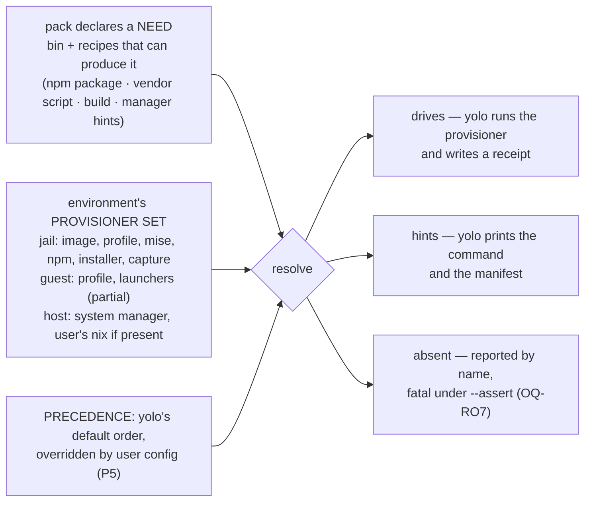

# yolo is a package manager whose backends differ per environment — and the pack contract cannot say so yet

**Status:** 2026-09-11, **split three ways on 2026-09-20.** This file is the **model**: the
verdict, the rulings, the alternatives and the live questions. The survey it rests on —
the provisioner inventory, the coverage matrix, the nix resolver's depth and the verification
tables — is [`provisioner-evidence.md`](provisioner-evidence.md); the Mac measurements are
[`../plans/runbooks/mac-provisioner-measurements.md`](../plans/runbooks/mac-provisioner-measurements.md).
Nothing moved out of the argument: where a ruling rests on a measured fact, the fact is stated
here and the other doc is where you check it.

Before that it was **amended twice on 2026-09-11** — first to absorb
[`noncontainer-nix-environment.md`](noncontainer-nix-environment.md) (retired; see the Scope note),
then by a review round that ruled two questions and **carved three compound ones into the
decisions they actually contained** ([the carve table](#the-2026-09-11-carve-one-question-one-decision)).
**The model is not built.** Three defect-shaped pieces shipped ahead of it (half of F5, and
[§9](#9-what-i-would-build-in-order) steps 2 and 3), and so did one piece of the design out of its
ruled order: `yolo host apply --assert`'s dependency gate, which drives an install behind a confirm
on the **old** pack-first precedence ([§8.5](#85-the-ruling-yolo-drives-the-winner-behind-the-confirm-and-last)).
Re-checked against the tree 2026-09-24. Claims about the tree were verified at `77190a2b`/`6eb7fe7f` on 2026-09-11 and are
labelled **MEASURED**, **READ FROM CODE** or **NOT MEASURED**; claims inherited from the merged doc
keep their own 2026-08-02 / 2026-08-23 verification dates and say so
([§14](#14-facts-verified-for-this-doc)). **Three questions are ruled** —
[`OQ-PS4`](#decision-ledger), [`OQ-PS3`](#decision-ledger), [`OQ-PS2`](#decision-ledger) — and
the rest are open, all of them the maintainer's. The number of open questions went **up** on
2026-09-11 because splitting a compound question into its real decisions is the point.
**The five Mac measurements RAN on 2026-09-11**, on hardware this doc could not reach when it was
written — they corrected four of the five items that asked them, one of them opened
[`OQ-PS8`](#OQ-PS8), and one retracted a claim that had been gating [`OQ-PS10`](#OQ-PS10)
([§15](#15-what-a-mac-session-should-measure)).
**Five questions were narrowed on 2026-09-29 by principle
[`HP-DIR3`](host-tool-provisioning.md#HP-DIR3)** (at the host, yolo manages the agent's
environment and never provisions or activates the workspace's runtime): [`OQ-PS1`](#OQ-PS1),
whose `packages:` half is answered no, and [`OQ-PS10`](#OQ-PS10), [`OQ-NX4`](#OQ-NX4),
[`OQ-NX5`](#OQ-NX5) and [`OQ-NX8`](#OQ-NX8), whose host halves follow from it. Each keeps a
remaining question. [`OQ-PS1`](#OQ-PS1) and [`OQ-NX5`](#OQ-NX5) were ruled the same day; the
other three still need a ruling.
**[`OQ-NX4`](#OQ-NX4) was researched and restated the same day**: the locator variables a
non-container notch needs, the corporate-certificate trap, and an extension-point design are
[§16](#16-locator-variables-on-a-non-container-notch-researched-2026-09-29), and the research
opened [`OQ-PS14`](#OQ-PS14) and [`OQ-PS15`](#OQ-PS15).
**Triaged 2026-09-30 against the later rulings.** [`OQ-PS6`](#OQ-PS6) and [`OQ-PS9`](#OQ-PS9)
are answered by [`OQ-PS1`](#OQ-PS1)'s ruling and the host floor's
([`HP-DIR4`](host-tool-provisioning.md#HP-DIR4)): the default order puts each pack's own recipe
first everywhere, so `depcheck`'s pack-first precedence is kept as the default rather than
reversed, and the user's nix is no longer a host provisioner yolo would install.
[`OQ-PS8`](#OQ-PS8), [`OQ-PS10`](#OQ-PS10), [`OQ-PS12`](#OQ-PS12), [`OQ-PS13`](#OQ-PS13) and
[`OQ-NX9`](#OQ-NX9) are decided as implementation choices, [`PS-D1`](#PS-D1) to
[`PS-D5`](#PS-D5) in the [Decision Ledger](#decision-ledger). **[`PS-D1`](#PS-D1),
[`PS-D4`](#PS-D4) and [`PS-D5`](#PS-D5) were built the same day**, and
[`PS-D6`](#PS-D6) and [`PS-D7`](#PS-D7) record the two choices the build made;
[`PS-D2`](#PS-D2) and [`PS-D3`](#PS-D3) wait on [`OQ-PS7`](#OQ-PS7)'s override.
[`PS-D8`](#PS-D8) records the fix for the defect [`OQ-PS9`](#OQ-PS9)'s answer named, also built
that day: `detectManager` probes nix instead of returning it by elimination. [`OQ-PS11`](#OQ-PS11) and the
rename it gates, [`OQ-PS5`](#OQ-PS5), were restated with lettered options and stay open.

> **In short.** yolo already is a package manager — the corpus has held that position since
> [`program-delivery.md` §6.3](program-delivery.md#63-installers-that-just-do-whatever-capture-the-install-then-treat-the-capture-as-the-package)
> adopted the AUR model — but it is one whose **backends differ per environment**, and the pack
> contract had no way to say so: `program` named one backend (`via`) where it should declare a
> need, so it worked only where that backend happened to exist. **The contract is now ruled the
> other way round**: the pack declares the need and its recipes, and the environment resolves.

**Why it matters.** At the host `program` and `requires` collapse into one report line because
there is nothing for either to drive; a user cannot say *"install claude from brew here"* because
the pack picks the backend; and a missing dependency is fatal under `--assert`
([`OQ-RO7`](../reference/report-tiers.md#why-its-this-way), shipped 2026-09-11) with an install offer
that ranks the pack's own recipe first. ⚠ *This doc read that order as the one
[§8.2](#82-the-ruling-a-shipped-default-order-the-user-config-overrides) ruled inverted;
[`OQ-PS6`](#OQ-PS6)'s answer (2026-09-30) keeps it as the default, and what a user still cannot
do is rank another provisioner above it.*

**The shape.** A **need** the pack declares once (a binary, plus the recipes that can produce
it); a **provisioner set** each environment has; a **resolution** that walks an ordered
preference — yolo's default, the user's config overriding it — and reports one of three
dispositions: *drives*, *hints*, *absent*.

**Cost.** Reverses `depcheck`'s shipped remedy precedence (the pack's own installer first) only
for a user whose override ranks another provisioner first, who knowingly accepts the
version-currency cost that precedence exists to avoid
([§8.2](#82-the-ruling-a-shipped-default-order-the-user-config-overrides)); the default keeps it
([`OQ-PS6`](#OQ-PS6)). It adds a user-facing
preference surface and the first yolo-driven mutation of a real machine's toolchain
([§8.5](#85-the-ruling-yolo-drives-the-winner-behind-the-confirm-and-last)); and, if the kind is
renamed, touches the closed kind set, every shipped manifest that declares a `program` or a
`requires`, and a documentation gate.

**Start at [§1](#1-the-verdict-and-five-principles)** — the verdict and the five principles every
question below is asked against. Then [§8](#8-the-shape-this-doc-leans-toward) for the shape and
its three rulings:
[§8.4](#84-the-ruling-a-pack-declares-a-need-and-its-recipes-the-environment-resolves) (the
declaration), [§8.2](#82-the-ruling-a-shipped-default-order-the-user-config-overrides) (the
order) and [§8.5](#85-the-ruling-yolo-drives-the-winner-behind-the-confirm-and-last) (the verb).
The survey that forced all of it — the inventory, the coverage matrix, the nix depth — is
[`provisioner-evidence.md`](provisioner-evidence.md), and you need it to **check** the argument
rather than to follow it.

**Needs your ruling:** [`OQ-PS5`](#OQ-PS5) (asked only if [`OQ-PS11`](#OQ-PS11) is ruled (a)), [`OQ-PS7`](#OQ-PS7), [`OQ-PS11`](#OQ-PS11), [`OQ-NX4`](#OQ-NX4), [`OQ-NX8`](#OQ-NX8), [`OQ-PS14`](#OQ-PS14), [`OQ-PS15`](#OQ-PS15).

> [!NOTE]
> **Scope note — this doc absorbed
> [`noncontainer-nix-environment.md`](noncontainer-nix-environment.md) on 2026-09-11, and that
> doc is retired.** The two held one subject from two directions: this one had the **model**
> (an environment has a provisioner set; a pack declares a need, the environment resolves it),
> that one had the **depth on one resolver** (nix below the jail notch) and six live questions,
> two of which were this doc's own questions asked earlier. Its questions keep their numbers under
> an `NX` prefix ([the id map](#question-id-map-old-spelling--new)) and are live here; its depth
> travelled on to [`provisioner-evidence.md`](provisioner-evidence.md) in the 2026-09-20 split,
> which is a move within one argument, **not** a re-separation of the two docs: the coverage
> matrix still exists once, where the evidence is.
>
> **This is still a sibling of [`program-delivery.md`](program-delivery.md), not an extension.**
> That doc is about the **jail**: its [§7](program-delivery.md#7-what-this-does-not-cover)
> excludes `macos-user` package delivery by name. Its
> [`OQ-PD16`](program-delivery.md#decision-ledger) routed the host notch to the merged doc and
> was **amended 2026-09-11** to name this one instead. So this doc **cites** its four delivery
> classes ([§3](program-delivery.md#3-four-delivery-classes-and-the-rule-that-falls-out)), its
> agent/project axis ([§3.5](program-delivery.md#35-the-second-axis-who-the-dependency-serves-amendment-2026-09-03))
> and its resolver seam ([§6](program-delivery.md#6-the-general-seam-one-ledger-many-resolvers))
> as given and re-derives none of them. What it adds is the axis no sibling owns: **which
> provisioners an environment has**, across all three notches at once.

**Reads with — the two halves of this doc first.**
[`provisioner-evidence.md`](provisioner-evidence.md) is the **survey**: the ten-row provisioner
inventory per notch, the coverage matrix, the nix resolver in depth with its preserved traps, and
the verified-facts tables — read it to check a claim, to add a row, or before re-running a probe.
[`../plans/runbooks/mac-provisioner-measurements.md`](../plans/runbooks/mac-provisioner-measurements.md)
is the **runbook**: the five Mac items M1–M5 with their commands, expectations and results — read
it at a Mac, or to see what a measurement actually returned.
Then: [`program-delivery.md`](program-delivery.md) (the jail's delivery classes and
resolvers — not restated here), [`../reference/macos-user-provisioning.md`](../reference/macos-user-provisioning.md) (the
guest's missing floor and stage),
[`yolo-as-environment-manager.md` §3.5](yolo-as-environment-manager.md#35-dependency-provisioning-declare-once-check-once-hand-off-with-a-manifest)
(*declare once, check once, hand off* — the host design this generalises),
[`../reference/nix-across-backends.md`](../reference/nix-across-backends.md) (what each backend's
nix path produces, as built),
[`../plans/environment-manager-plan.md`](../plans/environment-manager-plan.md) (Phase 4.3 shipped
as the host install offer; Phase 6.4's elevation-class batching is still owed —
[`OQ-EM1`](yolo-as-environment-manager.md#OQ-EM1)), [`../reference/report-tiers.md`](../reference/report-tiers.md) (the `--assert` fatal), and
[`../reference/pack-system.md`](../reference/pack-system.md) (the kinds). **No companion sketch
yet** — nothing here is settled enough to hold one; it opens with the first ruling that picks a
mechanism.

---

## 1. The verdict, and five principles

**yolo is a package manager with a different backend set per environment, and the pack
contract cannot express that.** The jail resolves `program` through npm, a vendor installer or
the capture store; the guest through a nix profile and launchers it cannot fully run; the host
through nothing yolo drives at all. The host's *own* manager — brew, apt, dnf, pacman — is the
one backend yolo has modelled down to a generated `Brewfile` and never once executed. So the two
kinds that look redundant, `program` and `requires`, are redundant only where yolo has no
backend: they differ in nine mechanical ways inside a jail and collapse to one report line on a
host, because the kind describes **what yolo would do if the binary were absent**, and on a host
yolo can do nothing.

Five principles, numbered so the questions and any sibling can cite them. P1 and P5 are the
maintainer's, stated in review on 2026-09-11; the other three are what the tree forces.

- **P1. The environment and the user choose the provisioner; the pack declares the need.**
  *"It shouldn't be up to the pack — that's the wrong place. It would be normal to use the
  Claude pack but install Claude from Homebrew."* A pack says what it needs and how it *can* be
  produced; who produces it is decided where the binary will live. **Ruled into the contract
  2026-09-11** — [`OQ-PS3`](#decision-ledger),
  [§8.4](#84-the-ruling-a-pack-declares-a-need-and-its-recipes-the-environment-resolves) — so this
  is no longer only a principle: `via` stops being a selector and every recipe is a candidate.
- **P2. A notch's provisioner choice does not propagate.** npm in the jail is a fact about the
  jail — *"in the jail containers we don't [use the system manager]… but that doesn't mean other
  environments have to follow that decision."*
- **P3. Every provisioner an environment has is either driven or hinted, out loud — never
  rendered and inert.** The guest notch has produced five instances of the inert case
  ([`../reference/macos-user-provisioning.md`'s P1](../reference/macos-user-provisioning.md#why-it-is-this-way), restated one level
  up); [§3.1](#31-five-findings-the-table-forces) finds two more, in F5.
- **P4. A default is platform-conditional**, because the environment includes the OS and its
  manager. brew covers six of six agent CLIs on macOS; apt covers none of them on Linux
  ([§4](#4-the-coverage-matrix-which-manager-covers-what)). *"The system package manager is the
  host default"* is right on one platform and wrong on the other, and that is a point **for**
  P1, not against it.
- **P5. There is no universally right answer, so the design's job is a good default plus a
  clean override.** *"It just seems like this should be a user choice, because there won't be
  one right answer for everybody"* — and, in the same breath, *"I guess we don't want to
  overwhelm the user with package choices here."* Pluralism is the justification and a
  **default precedence order** is the shape;
  [§8.2](#82-the-ruling-a-shipped-default-order-the-user-config-overrides) is the ruling and
  what it does **not** settle, and
  [§8.5](#85-the-ruling-yolo-drives-the-winner-behind-the-confirm-and-last) rules what yolo does
  with the winner.

---

## 2. Two frames that failed in review

Both were tried on 2026-09-11 and both broke. Recorded so nobody re-proposes them.

| Frame | Where it came from | Why it fails |
| :--- | :--- | :--- |
| **"install vs presence"** | the code's own words — [`pack-system.md`](../reference/pack-system.md#requires): *"`program` and `requires` are install vs presence"* | Describes the **check** each kind performs in a jail, not the **cause** of their difference. At the host both perform the same check (`Manifest.DepRequirements`, `internal/packdecl/contributes.go` — READ FROM CODE), so the frame predicts nothing about the notch where the question is live. |
| **"yolo produces it vs something external produces it"** | review, as a replacement | Two counter-examples from the maintainer. `via: npm` **is** an external package manager yolo merely drives (`npm install -g`, `internal/entrypoint/shims.go`). And a user may already have `claude` from brew: `depcheck.presentAt` probes PATH and records where it found the binary, with no interest in provenance (`internal/depcheck/depcheck.go`). The kind cannot be about where a binary came from. |

**What survives.** A kind describes what yolo *would do* if the binary were absent — a claim
about **yolo's capability in this environment**. That is why the notch only *correlates* with
the behaviour: what actually decides is the set of provisioners the environment offers, which
the notch happens to fix today because nothing else can vary it.

---

## 3. The provisioner inventory, per environment

**The inventory moved to
[`provisioner-evidence.md`](provisioner-evidence.md#1-the-provisioner-inventory-per-environment)** —
ten provisioners against the three notches, with the underlying tool, what declares it, and the record each keeps.
Every cell there is read from code at `77190a2b`, and three of the guest cells were since measured
on hardware. Go to it to check a cell, to correct one, or before claiming an environment can do
something. What stays here is the vocabulary the rest of this doc runs on and the five findings
the table forces.

**Three terms, coined here.** A **provisioner** is a mechanism that can make a binary present in
an environment, together with whether yolo drives it there. Every resolver in
[`program-delivery.md` §6](program-delivery.md#6-the-general-seam-one-ledger-many-resolvers) is one —
that doc names them from the **record** side (who keeps the lockfile); this one names the same
mechanisms from the **environment** side (is it here, and does yolo run it) — and two of the
inventory's rows are not that doc's resolvers at all: the system package manager, which yolo
hints, and the capture store, which yolo drives. An environment's **provisioner set** is the
provisioners it offers. A provisioner's **disposition** at a notch is one of **drives** (yolo runs
it), **hints** (yolo prints its command and stops) or **absent** (no code path). None of the three
words appears in the code; the nearest thing is the confinement Profile's one provisioning
primitive (F4 below).

Notches are the three values of the confinement dial —
[`yolo-as-environment-manager.md` §4](yolo-as-environment-manager.md#4-confinement-a-dial-with-three-notches).
**guest** means the shipped `macos-user` backend; the Linux guest is unbuilt and has no row.

### 3.1 Five findings the table forces

The findings are the argument; their code citations, their measured negatives and the table they
fall out of are in [`provisioner-evidence.md`](provisioner-evidence.md#11-five-findings-the-table-forces).

- **F1 — The nix asymmetry: the host is the only notch where yolo owns no provisioner.** The jail
  gets nix as a baked image or, opted in, as a profile; the guest gets the profile; the host gets
  nothing yolo drives. ⚠ *Since 2026-09-24 the guest also has the host's `nix` client on its
  sandbox PATH, as a daemon client (MEASURED on the macos-user CI job that day —
  [`macos-user-nix-and-features.md`](../reference/macos-user-nix-and-features.md)).* That is a tool
  the agent can run, not a provisioner yolo drives, so it adds no member to the guest's set; it
  does make "the user's nix, if present" reachable from inside the guest as well as on the host. That, and not anything about the kinds, is why `program` degenerates there:
  with nothing to drive, every declaration reduces to *is it on PATH, and what would install it* —
  which is the whole of `requires`. The retired doc reached this conclusion for its one resolver
  and stopped there.
- **F2 — The system package manager is a provisioner yolo models completely and never uses.**
  `detectManager` picks brew on macOS and probes apt/dnf/pacman/brew on Linux, then `nix`, and
  names none when it finds none (it reached `nix` by elimination until [`PS-D8`](#PS-D8));
  `installCmd` knows each manager's verb, brew's cask verb included; `Manifest` writes
  the manager's own bundle file and `check-deps` puts it at `~/.config/yolo/Brewfile`. Then it
  stops — **MEASURED negative:** every consumer of a remedy is a print, and the deferral is stated
  in the code's own comment. ⚠ **And the shipped precedence has the pack choosing**: `depcheck.Check`
  ranks the declaring pack's own installer first and keeps the detected manager's command only as
  `Fallback`. Under P1 the pack loses the power to rank, which is the
  [§8.2](#82-the-ruling-a-shipped-default-order-the-user-config-overrides) ruling. ⚠ *This was
  read here as inverting the order; [`OQ-PS6`](#OQ-PS6)'s answer (2026-09-30) keeps the pack's
  own recipe first as yolo's default instead, and the user's override is what may rank a manager
  above it.*
- **F3 — `program` and `requires` differ nine ways in a jail and collapse at the host, and the
  code says so itself** — *"The kinds differ in what they do to a JAIL (a program gets a launcher,
  a requires gets an assertion), not in what they ask of a host"* (`internal/packdecl/contributes.go`).
  In a jail they differ in their combine rule, a launcher versus nothing, capturability, a receipt,
  an agent-name claim, review-worthiness, a launch disclosure, a self-install command and their
  accepted field sets; at the host they share one collector, one probe and one report line whose
  only difference is the kind label. The one host-side artefact that does differ is the
  `yolo host --` wrapper `program` gets, and it installs nothing. **The noun/verb mismatch** —
  `program` is a thing, `requires` is an act — is noted here and spent nowhere else, because naming
  is downstream ([§7.3](#73-naming-is-downstream)).
- **F4 — The code already half-models the provisioner set, with one member.** The confinement
  Profile is a vector of primitives, and `PrimBakedImage`'s own comment calls it *"a provisioning
  primitive, not a confinement one"* that *"travels with the jail notch and is absent below it"*
  (`internal/render/confinement.go`). `describe` already switches on that primitive's **absence**
  to decide whether to print the resolved profile line. The provisioner set is that idea completed:
  a per-environment vector with as many members as the inventory has rows, of which the tree spells
  exactly one. Whether it lives in the Profile or beside it is an implementation choice this doc
  delegates ([§8](#8-the-shape-this-doc-leans-toward)).
- **F5 (a defect, not a finding) — the guest had two provisioners armed and unreachable.** The
  macos-user run plan bakes a non-empty server list and `SERVERS_ENABLED=1` into every guest
  launcher, but `_refresh_servers` and `_try_materialize` both open with `command -v yolo || return`,
  and the sandbox's `yolo` was staged at a path that was not on `SandboxPath`. Both no-opped
  silently. It is P3's failure mode exactly. ✅ **The reachability half is FIXED 2026-09-13**
  (`13dd68c4`): `macosuser.SandboxPath` now appends the staged-yolo directory, derived from
  `StagedYoloPath`, so `yolo` resolves in both functions. READ FROM CODE: the server refresh can now
  run there; `_try_materialize` still returns early, because nothing emits a capture-store path on
  that backend. That is [`install-capture.md`](../plans/install-capture.md#hand-offs--what-is-not-wired-and-the-exact-line-that-wires-it)'s
  hand-off H4, which needs a ruling on what the sandbox may read, and it is not a silent defect
  ([§9](#9-what-i-would-build-in-order) step 1). ⚠ This line used to say "structural until H2";
  H2, the relocation rewrite, landed 2026-09-26 and did not change it.

---

## 4. The coverage matrix: which manager covers what

**The matrix moved to
[`provisioner-evidence.md`](provisioner-evidence.md#2-the-coverage-matrix-which-manager-covers-what)**,
together with the `install_hints`-versus-nix-profile comparison that followed it. It was measured
2026-08-02 in the doc this one absorbed and is cited rather than re-measured: the two docs used to
carry two copies of the table, and the split did not make a third — what stays below is the handful
of numbers the rulings quote. Go there for the per-manager detail, the `brew bundle` exercise on
hardware, and the dates.

**The numbers are load-bearing here, so they stay.** ⚠ They cover the six agent CLIs shipped when
the matrix was measured (2026-08-02); `omp`, added 2026-09-15, is not in it. Of those six: **`apt` covers none**,
**`dnf` one** (Rawhide only), **`pacman` two** (the other four are AUR-only, which `pacman -S`
cannot install), **`brew` all six** — four of them casks — and **`nix` all six**, three of which
are `unfree` and refused by a bare install. Three consequences the rest of this doc rests on:

- **On macOS the system-manager default is well-founded:** brew covers all six.
- **On Linux it fails:** a non-Arch host gets zero or one of six from its native manager, so the
  default is **conditional on the platform** — P4, and a point *for* P1 rather than against it.
- **The sharpest one cuts against a naive *prefer the system manager* rule:** on Linux, nix is the
  only manager covering all six, so **the reproducible path and the only-path-that-works path are
  the same path**. That is why [`OQ-PS1`](#OQ-PS1) is not a nicety. ⚠ And the premise *"there's no
  nix package"* is wrong in a way that widens the option space: `unfree` is a licensing gate a user
  can lift once, not an absence — though the lift is a `--impure` flag rather than an environment
  variable, measured on darwin ([M3](../plans/runbooks/mac-provisioner-measurements.md#m3--does-nix-profile-install-refuse-the-unfree-agent-clis-on-darwin)).

**`install_hints` and a nix profile are complementary, not competitors**, and the boundary is
structural rather than a preference: a user with no `/nix` gets nothing from a profile;
`install_hints` answers the wider question of a pack's *host dependencies* (`fzf` and `fd`, not
agent CLIs); and the printed remedy is the floor the env-manager design guarantees, so anything
driven is an **additional** offer — which is exactly how [`OQ-PS2`](#decision-ledger) was ruled
([§8.5](#85-the-ruling-yolo-drives-the-winner-behind-the-confirm-and-last)). The full comparison,
row by row, is
[there too](provisioner-evidence.md#21-install_hints-and-a-nix-profile-are-complementary-not-competitors).

---

## 5. The frame this corpus already holds: yolo is a package manager

*"Any way we look at it, we're building our own package manager, and we've already modeled this
on AUR, so we should continue to draw inspiration from there if we need it."* (maintainer,
2026-09-11.) The position is on record — [`program-delivery.md` §6.3](program-delivery.md#63-installers-that-just-do-whatever-capture-the-install-then-treat-the-capture-as-the-package):

> The prior art is Arch's. An AUR `PKGBUILD` runs upstream's opaque payload in a clean chroot
> (`makechrootpkg`), and the *output* is an ordinary pacman package with a file manifest — the
> package manager never trusts the build script's environment, only its captured product. The
> pack's `program via installer` contribution is already the PKGBUILD analogue: a name and a URL.

That was written for one class — the vendor installer. This doc generalises it: **every row of the
[provisioner inventory](provisioner-evidence.md#1-the-provisioner-inventory-per-environment) is a
package-manager backend**, and the thing the pack declares is a recipe. The AUR model is cited below only where it decides something;
where it does not, it is left alone.

### 5.1 Where the AUR model carries weight

- **The recipe is per-package; the installer is the system's.** An AUR helper builds from the
  `PKGBUILD` and hands the product to `pacman`. That separation **is P1**: the pack owns the
  recipe (what the binary is, how it can be produced), the environment owns installation. It is
  also [§6](program-delivery.md#6-the-general-seam-one-ledger-many-resolvers)'s *"many resolvers, one
  ledger"* seen from the other side — that section says every resolver keeps its own record under
  one reader; this says every environment picks its own resolver under one declaration.
- **Never trust the build environment, only the captured product.** This is why capture exists
  ([§6.3](program-delivery.md#63-installers-that-just-do-whatever-capture-the-install-then-treat-the-capture-as-the-package)),
  and it is why a **custom build** is expressible without widening trust
  ([§5.3](#53-a-custom-build-is-expressible-today-and-what-it-lacks)): a build script is exactly the
  *"installer that just does whatever"* the capture jail already contains.
- **`provides` / `depends`** is AUR's spelling of the relation `program` / `requires` strains to
  express, and it is verb/verb. The env-manager design's own sketch reached for it —
  `provides_from` in [§3.5](yolo-as-environment-manager.md#35-dependency-provisioning-declare-once-check-once-hand-off-with-a-manifest)'s
  example — and the field never shipped: none of a `program`'s accepted fields is a
  provides-shaped relation (the field set is the `Contribution` struct in
  `internal/packdecl/contributes.go`; it has grown `node_floor` and `platforms` since this was
  written, neither of them one), and `requires` takes `bin` and `install_hints` alone, refusing
  the rest by name (`validateContribution`). Evidence for [`OQ-PS11`](#OQ-PS11) — whether the pair
  collapses — which is where the verb/verb relation now lives.
- **`optdepends`.** No kind has an `optional` field (READ FROM CODE, every kind's field set), so
  yolo has no declared-but-optional category. [`OQ-RO7`](../reference/report-tiers.md#why-its-this-way)'s fatal implicitly
  assumes that category does not exist; if a pack ever needs it, the assumption becomes a
  question. One sentence, because nothing in the tree needs it yet.
- **`depends` vs `makedepends`** — runtime versus build-time. Nothing in the tree expresses the
  distinction (MEASURED negative: no `makedepends`, build-time or from-source vocabulary in
  `internal/packdecl`, `internal/depcheck`, `checkdeps.go` or `applyhostdeps.go`). The moment a
  `program` can be a build, yolo acquires it whether or not it is named
  ([§5.3](#53-a-custom-build-is-expressible-today-and-what-it-lacks)) — and
  [§8.4](#84-the-ruling-a-pack-declares-a-need-and-its-recipes-the-environment-resolves) now names
  it: a build recipe carries its own build-time needs.

### 5.2 Where it breaks

**AUR has one destination; yolo has a different provisioner set per environment — which is the
whole problem.** Every `PKGBUILD` ends in `pacman -U` on one distro. A yolo recipe ends in npm
inside a jail, a nix profile on a Mac guest, and — under P1 — whatever the user's host prefers.
The model carries the recipe/installer split and the trust property; it does not carry a rule
for **which** installer, because it never had to choose one. And the destination AUR takes for
granted, the system's own manager, is the one provisioner yolo has never driven (F2).

The choice is also platform-conditional in a way pacman never is
([§4](#4-the-coverage-matrix-which-manager-covers-what)), which is why the answer is an ordered
list rather than a name ([§8.2](#82-the-ruling-a-shipped-default-order-the-user-config-overrides)).

### 5.3 A custom build is expressible today, and what it lacks

The delivery vocabulary is closed at two values — `knownVias` is `{npm → "npm", installer →
"native"}` (`internal/packdecl/contributes.go`), and its comment says why: *"core has to
know how to DELIVER a mechanism before a pack may name it."* Nothing in the schema forbids a
build, because a build already fits the second value: the validator requires `via: installer` to
carry a non-empty `url` and nothing more, and the class is defined as a program that
*"runs arbitrary logic and leaves arbitrary state"*
([§6.3](program-delivery.md#63-installers-that-just-do-whatever-capture-the-install-then-treat-the-capture-as-the-package)).
A build script is that. The capture jail contains it and emits a package, exactly as it does for
claude's installer. **So the capability exists; the vocabulary does not.** Three things it
lacks:

1. **Build-time dependencies.** A build needing `cmake` or `rustc` has no way to say so. The
   throwaway capture jail's toolchain — on a container backend the whole image; on `macos-user`
   the floor, which takes the image's **core** list (`coreFloorNames` — `go`, `python3` and
   `nodejs_24` among it) and not the image's extras
   ([`../reference/macos-user-provisioning.md` — the floor](../reference/macos-user-provisioning.md#the-floor))
   — is the *implicit* `makedepends`, and a build that needs anything else fails inside the
   capture with no declaration to blame. The two backends therefore disagree about what that
   implicit set is.
2. **A pack-shipped recipe.** `url` is the only source field; I found no scheme check on it and
   also no pack-relative form, so whether a script inside the pack tree can be named is
   **NOT VERIFIED**.
3. **A place in the vocabulary.** [§6.2](program-delivery.md#62-pay-the-enum-tolerance-before-the-next-mechanism-arrives)
   paid the enum tolerance so a third `via` value degrades to a skip on an older image rather than
   a refused boot — the tolerance is spent and waiting.

**Is `via` the right axis for it? RULED: no.** `via` was the pack *selecting* the delivery
mechanism; under [`OQ-PS3`](#decision-ledger) (2026-09-11) the pack does not select — it **lists**
what can produce the binary, and the resolver picks. **A build is a third *recipe kind*** beside
"an npm package" and "a vendor script", not a third value of a selector, and it carries the
build-time needs item 1 above found missing
([§8.4](#84-the-ruling-a-pack-declares-a-need-and-its-recipes-the-environment-resolves)). The one
thing the ruling does not widen is what core may *deliver*: `knownVias` stays closed until core
knows how.

---

## 6. The nix resolver, in depth

**The depth moved to
[`provisioner-evidence.md`](provisioner-evidence.md#3-the-nix-resolver-in-depth).** This section was
the absorbed [`noncontainer-nix-environment.md`](noncontainer-nix-environment.md), compacted, and it
is the only resolver with depth like this for a reason worth keeping in view: it already works at
two notches and has no caller at the third, so it is where [`OQ-PS1`](#OQ-PS1) is decided.

What is over there: the four nix mechanisms pinned and compared — a `devShell`, a `buildEnv`,
`nix profile` and `nix shell`, three of which are routinely conflated — and why a devShell is
**rejected in all forms** (measured: **22 PATH entries and 121 environment variables** for a
one-package shell, one of which is the package asked for); `nix profile --profile <dir>`, the only
candidate that reaches a user's own PATH; the already-shipped-versus-missing table; what a
non-container notch can and cannot reproduce of the jail; platform coverage and freshness; the
cases where the user has no nix; and four preserved traps — the devShell dump, the unfree warn-and-skip, the `x86_64-darwin` retraction and the GC
root's four deliberate properties. **Read it before designing anything nix-shaped**; each of those
traps cost a measurement to find.

**Three of its findings carry the model below, so they are stated here and checked there.**

- **The mechanism is shipped, with two consumers and no third.** A pure, toolchain-free profile of
  `packages:` builds for every system the flake enumerates, follows the machine's own system, and
  GC-roots itself; `macos-user` and the Linux store farm both call it. `yolo host apply` never
  does. That is F1 from the resolver's side — **one notch, one backend, no non-macOS coverage of
  the diagnostics, and no host caller** — and it is exactly what [`OQ-PS1`](#OQ-PS1) asks.
  ⚠ *Since 2026-09-29 that half of [`OQ-PS1`](#OQ-PS1) is answered no, by principle
  [`HP-DIR3`](host-tool-provisioning.md#HP-DIR3): `packages:` is the workspace's runtime, which
  yolo never provisions at the host, so the attribute gets no host caller.*
- **A nix tool environment is orthogonal to the *enforcement* primitives and load-bearing for the
  *provisioning* one.** It is not a peer of the confinement dial; it is what fills the
  `PrimBakedImage`-shaped hole at the two notches with no image (F4). Three things compound into
  that: `guest` needs the identical mechanism and the Linux guest has no package layer at all; the
  notch decides whether a PATH-prepend has a consumer at all, since `yolo host apply` launches
  nothing while `yolo host -- <cmd>` does; and `describe` already acts on the primitive's absence
  without minting a second one. **The practical consequence:** designing this as "a host feature"
  risks a Linux `guest` package layer being built twice.
- **A `buildEnv`'s "no pollution" claim is really "no *undeclared* pollution."** A `buildEnv`
  containing `gnugrep` still shadows `/usr/bin/grep` when prepended — the difference from a
  devShell is legibility, not effect, and on a Mac host that is the BSD-versus-GNU hazard arriving
  by the front door. Nothing warns today, on any path. That is [`OQ-NX5`](#OQ-NX5), and it is also
  [`OQ-P2`](../reference/macos-user-provisioning.md#why-it-is-this-way)'s problem one level down.

---

## 7. Reframing `program` as a package

The maintainer's stated payoff: *"it may make the capture step clearer when we're capturing the
binary install."* Tested here against what the reframing would actually have to explain.

### 7.1 Tested against the mechanical differences

Does *"a `program` is a package"* make each of F3's differences fall out, or merely rename it?

| Difference | Falls out of "package"? | Why |
| :--- | :--- | :--- |
| exclusive vs shared combine | **yes** | A package *provides* a name — one provider per name, as pacman's `conflicts` enforces. A dependency is *depended on* by many. |
| a launcher vs none | **yes** | A package yolo installs needs an entry point yolo owns; a dependency yolo does not install needs none. |
| capturable vs not | **partly** | Capture applies to a product whose *recipe* is opaque — the installer class. It falls out of the recipe kind, not of "package" as such: an npm package is a package and is refused by capture (`capturehost.go`), because a registry version already names it. |
| driven vs hinted | **no** | This is a property of the **environment's provisioner set**, not of the declaration. `claude` is one package however you spell it; it is driven in a jail and hinted on a host. The reframing clarifies the noun and leaves the disposition where it was. |

**Verdict:** the reframing buys a correct noun — one thing, produced by several recipes, installed
by several backends — and it is the noun the AUR model was already using. It does **not** by
itself repair the host, because the host's problem is an empty provisioner set
(F1), and no rename adds a member to it.

### 7.2 The capture payoff

Here the maintainer is right, and the corpus already says so in its own words: *"from then on
**the capture is the package**"*
([§6.3](program-delivery.md#63-installers-that-just-do-whatever-capture-the-install-then-treat-the-capture-as-the-package)).
Under the current vocabulary that sentence is a metaphor — a `program` is a launcher and a `via`,
and the capture is a store entry the launcher tries first. Under the reframing it is literal: a
`via: installer` recipe produces a package whose provisioner is the vendor's script, and capture
**re-provisions the same package** through yolo's CAS. Two provisioners, one package, and the
second is the one that needs nothing from the environment but a filesystem — which is why it is
the only [inventory row](provisioner-evidence.md#1-the-provisioner-inventory-per-environment) that
could work on a guest with no floor at all, once its recording-only half is finished (H1, H2 and H4
in [`../plans/install-capture.md`](../plans/install-capture.md#build-order)). The **materialize** half
is still **NOT MEASURED** — nothing has materialised a capture on macos-user, and no launch can until
H4 lands (`internal/cli/run/autocapture.go`). H2, the rewrite, landed 2026-09-26 and is measured on
Linux only. But the **recording** half
has since been measured working end to end on hardware
([M4](../plans/runbooks/mac-provisioner-measurements.md#m4--does-the-capture-recording-half-work-on-hardware)),
so this is the one place the reframing changes what an implementer would build rather than what
they would call it. ⚠ This pointer used to name M3, which is the nix-profile item; M4 is capture's.

### 7.3 Naming is downstream

A kind rename is its own decision ([`OQ-PS5`](#OQ-PS5)) and must not drive the model above —
which is why [`OQ-PS3`](#decision-ledger) was ruled without it, and why
[`OQ-PS11`](#OQ-PS11) (does the pair collapse) sits **upstream** of the name. Its measured blast
radius, so the cost is on the table: the closed kind const set and its `footprints` map
(`internal/packdecl/kinds.go` — the set is still growing, `config-list` having joined it
2026-09-24); the validator's per-kind cases (`validateContribution` in `contributes.go`); every
shipped manifest declaring either kind — `rg -l '"kind": "program"' packs/*/pack.json` is the
`program` list (it gained `omp` on 2026-09-15), and `guardrails` is the one `requires` (`rg` and
`fd`) — plus the `claude-fzf-pack` example; `yolo config-ref` (`internal/cli/config_ref.txt`) and
`yolo pack --help` (`internal/cli/pack.go`), both gated by `TestEveryKindIsDocumented`
(`internal/cli/packkinddocs_test.go`), which requires the kind's bare name to lead a line in
each; and any fetched pack. The pack **lockfile** records no kind names
(`internal/packsrc/lock.go`), so it is not on the list.

---

> [!IMPORTANT]
> **An installer script never runs inside a container. That is the rule** (maintainer,
> 2026-09-11): *"We're not going to run an installer in a container. We're going to turn it into
> something that looks like the Arch solution — or we can use another package manager. It doesn't
> have to be yolo's package manager, but it's just not going to be a bash script."*
>
> **The invariant is about the FORM of the installed thing, not about who supplies it.** Whatever
> installs into an environment installs a **package** — an artifact with a manifest — and never an
> opaque script executed in place. Any provisioner delivering that shape qualifies; what is excluded
> is the non-package form.
>
> **This is already how the two shipped `via` values behave, and the rule names it rather than
> changing it:**
>
> - **`via: npm`** is a package manager already, with a registry version to name — so it installs
>   directly and needs no capture (`internal/cli/capturehost.go`).
> - **`via: installer`** is the `curl | bash` case, and it is exactly the one `capture` exists for:
>   the script runs **once, in a throwaway jail**, and what reaches any real environment is the
>   captured product. That is [`program-delivery.md`](program-delivery.md)'s AUR prior art — *"the
>   package manager never trusts the build script's environment, only its captured product"* — and
>   under this rule it is the **requirement**, not an optimisation.
>
> ⚠ **Corrected 2026-09-11.** An earlier version of this note read the framing as *"everything yolo
> installs becomes a capture,"* and flagged a tension with capture being installer-only. **There is
> no tension.** npm is not a bash script, so it was never in scope; capture's installer-only
> boundary is the rule's implementation, not a gap in it.
>
> **What the rule bore on** was the model, and the model is now ruled: *"it doesn't have to be
> yolo's package manager"* means yolo's own store is one provisioner among several rather than the
> privileged one — the same conclusion [`OQ-PS3`](#decision-ledger) reached from the other
> direction ([§8.4](#84-the-ruling-a-pack-declares-a-need-and-its-recipes-the-environment-resolves)).
> What it still bears on downstream is [`OQ-PS11`](#OQ-PS11) and [`OQ-PS5`](#OQ-PS5), the
> vocabulary that names the result.

## 8. The shape this doc leans toward

**Three of its five parts are now ruled** — the declaration by
[§8.4](#84-the-ruling-a-pack-declares-a-need-and-its-recipes-the-environment-resolves), the
precedence by [§8.2](#82-the-ruling-a-shipped-default-order-the-user-config-overrides), the verb by
[§8.5](#85-the-ruling-yolo-drives-the-winner-behind-the-confirm-and-last). The rest is still the
leaning the remaining questions are asked against, so their stakes are concrete.


```mermaid
flowchart LR
    pack["pack declares a NEED<br/>bin + recipes that can produce it<br/>(npm package · vendor script · build · manager hints)"]
    env["environment's PROVISIONER SET<br/>jail: image, profile, mise, npm, installer, capture<br/>guest: profile, launchers (partial)<br/>host: system manager, user's nix if present"]
    pref["PRECEDENCE: yolo's default order,<br/>overridden by user config (P5)"]
    res{"resolve"}
    drive["drives — yolo runs the provisioner<br/>and writes a receipt"]
    hint["hints — yolo prints the command<br/>and the manifest"]
    absent["absent — reported by name,<br/>fatal under --assert (OQ-RO7)"]
    pack --> res
    env --> res
    pref --> res
    res --> drive
    res --> hint
    res --> absent
```

Read as behaviour, exhaustively; mechanism is the implementer's.

- **Declaration — RULED** ([§8.4](#84-the-ruling-a-pack-declares-a-need-and-its-recipes-the-environment-resolves)).
  A pack declares a binary and every recipe it knows that produces it, and privileges none of
  them. Today's `via` + `package`/`url` is one recipe; today's `install_hints` are the rest.
  Nothing forces a pack to know the user's platform, and a pack with **no** recipe for a binary is
  today's `requires`.
- **Provisioner set.** Each environment enumerates what it has, and the enumeration is what
  `describe` prints — the way it already prints the profile line when `PrimBakedImage` is absent.
  An environment with an **empty** set (a host with no manager detected and no nix) reports every
  need as *absent* with no remedy, which is today's `noRemedyReason` path
  (`applyhostdeps.go`) made systematic.
- **Resolution.** For each need, walk the precedence over the environment's set; the first
  provisioner that both exists here and has a recipe for this binary wins. **Ordered, first
  match**, so a preference that covers nothing on this platform is skipped rather than fatal.
  A recipe the declaration carries for a provisioner the environment lacks is *reported*, never
  attempted. The pack's own installer is one candidate among the set, ranked by the precedence —
  not the head of the list as `depcheck.Check` ranks it today (F2).
- **Disposition and record.** *Drives* — RULED as a confirm-gated offer sequenced last
  ([§8.5](#85-the-ruling-yolo-drives-the-winner-behind-the-confirm-and-last)) — writes a receipt,
  as every driven install already does;
  *hints* writes the manifest, as `check-deps` already does; *absent* names the binary and the
  set that could not cover it. Nothing is ever rendered inert (P3): a provisioner the environment
  cannot run is not in its set.
- **Propagation.** The jail's resolution is the jail's. A workspace whose jail installed `claude`
  via npm says nothing about how its host resolves `claude` (P2).
- **Pre-existing state.** A binary already present satisfies the need regardless of who put it
  there, exactly as `presentAt` behaves today. No resolution re-provisions a present binary.
- **Forbidden.** Never run a system-manager command without the confirm
  [`OQ-9`](../plans/environment-manager-plan.md#open-questions-to-resolve-before-their-phase) ruled; never set
  `allowUnfree` for the user; never let a pack's `via` override the resolved precedence.

### 8.1 Who chooses the provisioner today

Checked before widening scope, because *"let the user choose"* could be a config key or a
subsystem. It is mostly a key. The **data** exists: `install_hints` already carries one remedy
per manager including `brew-cask`, `hintFor` already indexes it by manager
(`depcheck.go`), and `Result.Fallback` already carries the alternative the user did not
get — and the precedence comment says why in as many words: *"When both exist the
manager's command is kept as Fallback rather than discarded, so a user who prefers their package
manager still sees the token"* (`depcheck.go`, re-read 2026-09-11). **The code already
anticipates this user; it just cannot let them win.** The **selector** does not exist:
`DetectManager` is a package-level var, overridable in tests and by nothing else (a
config-key sweep of `internal/config` and `internal/cli` found none), and the precedence putting
the pack's installer first is hardcoded (F2).

### 8.2 The ruling: a shipped default order, the user config overrides

**Ruled 2026-09-11.** This settles [`OQ-PS4`](#decision-ledger) as asked and narrowed
[`OQ-PS2`](#decision-ledger), which was itself ruled later the same day
([§8.5](#85-the-ruling-yolo-drives-the-winner-behind-the-confirm-and-last)); it deliberately
settles nothing else, and [§8.3](#83-what-the-ruling-does-not-settle) says what stays open.

**1. The version-currency cost is accepted, and it is the user's to accept.** `depcheck.Check`'s
stated precedence reason is a real cost, and it is preserved rather than deleted:

> *"a tool with a first-party installer has a first-party updater, and a distro package silently
> pins it to whatever that repo has"*

(`internal/depcheck/depcheck.go`, re-read 2026-09-11.) The maintainer's ruling is that
this is **not a blocker**: *"It's fine regarding the evergreen stuff that a brew install only
moves when brew moves — that's why this is a configured choice of the user."* A user who chooses
brew is choosing brew's cadence **knowingly**. The same trade is what
the freshness argument in [`provisioner-evidence.md`](provisioner-evidence.md#37-macos-vs-linux-coverage-freshness-and-the-traps) prices for nix, and it lands
the same way.

> [!WARNING]
> **This does not repeal the evergreen ruling; it scopes it.**
> [`program-delivery.md` §3.5](program-delivery.md#35-the-second-axis-who-the-dependency-serves-amendment-2026-09-03)
> rules agent CLIs evergreen and never pinned. That is a **jail** policy, and P2 says a notch's
> choice does not propagate — so a user pinning `claude` to brew's cadence on their own host is
> not a violation of it. Do not read this ruling as licence to pin an agent CLI *inside a jail*
> without ruling [`OQ-PS6`](#OQ-PS6) first.

**2. The shape is a default precedence order, overridden by user config.** Not a per-package
interrogation: *"I guess we don't want to overwhelm the user with package choices here. Maybe
the precedence order is what we set and the user config."* Two properties make this the only
shape that works, and both are forced by [§4](#4-the-coverage-matrix-which-manager-covers-what):

- **Ordered, not a single name** — because on a non-Arch Linux host the native manager covers
  **0–1 of six** agent CLIs, so a single-name preference that covers nothing must degrade to the
  next choice rather than fail. First-match over an ordered list is the only shape that does.
- **Defaulted, not asked** — because most users will never set it, so the *default* is the
  product. P4 makes that default platform-conditional by construction.

**3. The justification is pluralism.** *"There won't be one right answer for everybody."* The
design's job is therefore **a good default plus a clean override**, and explicitly not a correct
universal answer. That is P5, and it is why
[§10](#10-alternatives-each-with-a-verdict)'s alternative D (a per-notch `via` in the manifest)
stays rejected: a pack author cannot know the user's distro, so no pack-side value can be the
right default anywhere.

### 8.3 What the ruling does NOT settle

Three things stayed live, sharpened rather than closed. Recording them explicitly because the
ruling reads broader than it is. ⚠ **Since 2026-09-30 only [`OQ-PS7`](#OQ-PS7) is still open**:
[`OQ-PS6`](#OQ-PS6) was answered by [`OQ-PS1`](#OQ-PS1)'s ruling, and [`OQ-PS12`](#OQ-PS12) was
decided as [`PS-D3`](#PS-D3). ⚠ **The last two rows were one question when this table was
written** — the table listing them separately is what exposed that, and they were carved apart on
2026-09-11 ([the carve table](#the-2026-09-11-carve-one-question-one-decision)).

| Still open | Question | Why the ruling does not reach it |
| :--- | :--- | :--- |
| **What the shipped default order actually is, per environment** | [`OQ-PS6`](#OQ-PS6) | P4 makes it a per-platform table, not a word; and the jail's row is the absorbed [`OQ-7`](#question-id-map-old-spelling--new) — *should the jail's agent CLIs come from nix?* — which the ruling does not answer. |
| **Whether the override is per-package or per-environment only** | [`OQ-PS7`](#OQ-PS7) | *"Claude from brew"* is the maintainer's own example and needs per-package grain; *"don't overwhelm the user"* pushes the other way. Both sentences are his and they pull apart. |
| **Whether a user may name a recipe no pack ships** | [`OQ-PS12`](#OQ-PS12) | Re-ranking the recipes packs already declare is a config key over data that exists ([§8.1](#81-who-chooses-the-provisioner-today)); a recipe they do **not** ship is a subsystem with a trust story. |

And the thing this ruling made sharper rather than settling — **whether yolo executes the winner
at all** — was itself ruled later the same day: **drive it, behind the confirm, sequenced last**
([§8.5](#85-the-ruling-yolo-drives-the-winner-behind-the-confirm-and-last),
[`OQ-PS2`](#decision-ledger)). This ruling picked the order; that one picked the verb.

---

### 8.4 The ruling: a pack declares a need and its recipes; the environment resolves

**Ruled 2026-09-11**, settling [`OQ-PS3`](#decision-ledger) — the model question the rest of this
doc turns on, and P1 turned from a principle into a contract.

**A pack declares a NEED — a binary, plus every recipe it knows that can produce it — and
privileges none of them.** The environment's provisioner set and the
[§8.2](#82-the-ruling-a-shipped-default-order-the-user-config-overrides) precedence order choose
which recipe runs. This is the AUR recipe/installer split
([§5.1](#51-where-the-aur-model-carries-weight)) with the destination made plural, which is the
one place AUR does not carry ([§5.2](#52-where-it-breaks)).

Three consequences, and none of them is a new field:

- **`via` stops being a selector.** A `via`+`package`/`url` contribution is **one recipe**, and
  each `install_hints` entry is **another**. The data already exists — `hintFor` indexes hints by
  manager (`internal/depcheck/depcheck.go`) and `Fallback` already carries the alternative
  the user did not get. What the ruling removes is the pack's power to rank them.
- **A custom build is a recipe KIND, not a third `via` value.**
  [§5.3](#53-a-custom-build-is-expressible-today-and-what-it-lacks)'s question in miniature is
  answered: the capability already exists inside the capture jail, and what it lacked was a place
  in the vocabulary. It arrives as a recipe carrying its **own build-time needs** — the
  `makedepends` category [§5.1](#51-where-the-aur-model-carries-weight) found missing — rather
  than as a value of a selector the ruling just retired.
- **`requires` is a need with an empty recipe list.** That is a statement about semantics, and it
  is all the ruling settles here; whether the manifest keeps two kind names for it is
  [`OQ-PS11`](#OQ-PS11), and what the surviving kind is called is [`OQ-PS5`](#OQ-PS5).

> [!WARNING]
> **The ruling does not widen what a pack may *deliver*, and the enum tolerance is what makes
> that safe.** `knownVias` is closed at two values precisely because *"core has to know how to
> DELIVER a mechanism before a pack may name it"*
> (`internal/packdecl/contributes.go`). Recipes are declarations the resolver ranks; a
> recipe naming a mechanism this yolo cannot drive is **reported, never attempted**
> ([§8](#8-the-shape-this-doc-leans-toward)). The
> [§6.2](program-delivery.md#62-pay-the-enum-tolerance-before-the-next-mechanism-arrives)
> tolerance covers the older-image case — a recipe kind an older image does not know degrades to
> a skip rather than a refused boot — and it is already paid.
>
> ⚠ **And the installer rule is untouched.** *"It's just not going to be a bash script"* still
> binds every recipe: whatever reaches a real environment is a **package with a manifest**, and a
> `via: installer` recipe reaches it through capture. A recipe is a declaration of how a package
> can be produced, never a licence to run a script in place.

### 8.5 The ruling: yolo drives the winner, behind the confirm, and last

**Ruled 2026-09-11**, settling [`OQ-PS2`](#decision-ledger). The answer is **drive it** — and two
qualifiers carry as much weight as the verb.

1. **Behind the confirm that is already ruled.** Executing a system-manager command runs under
   env-manager [`OQ-9`](../plans/environment-manager-plan.md#open-questions-to-resolve-before-their-phase)'s
   disposition — batched by elevation class, sudo shown through — which was ruled 2026-08-01. When
   this was ruled, that plan's audit said it *"has no consumer at all today"*, and this ruling
   was to be its consumer. ⚠ See the warning below: a consumer arrived the same day by another
   route.
2. **Sequenced LAST.** The precedence order ships first as a **print-only** improvement, and the
   driving is the increment after it ([§9](#9-what-i-would-build-in-order) steps 4 then 5). A
   precedence order that only ever prints the winner is already strictly better than today and
   carries no elevation risk; introducing the preference surface and the first mutation of a real
   machine's toolchain in one step would make a single failure ambiguous between the two.
3. **The written manifest stays the floor.** The env-manager guarantee — *"the composed manifest
   is always the floor"*
   ([§3.5](yolo-as-environment-manager.md#35-dependency-provisioning-declare-once-check-once-hand-off-with-a-manifest))
   — survives the ruling intact. `check-deps` keeps writing `~/.config/yolo/Brewfile` and kin
   whether or not the offer is taken, and a declined offer leaves a user exactly where today's
   yolo leaves them. Running it is an **offer on top**, never a replacement.

**What was already settled and is not re-opened:** the version-currency objection to leading with
a system manager. [`OQ-PS4`](#decision-ledger) ruled it an accepted cost
([§8.2](#82-the-ruling-a-shipped-default-order-the-user-config-overrides)), so what this ruling
decided was purely *does yolo execute the winner*.

> [!WARNING]
> **F2's precedence comment is preserved, not repealed.** `depcheck.Check` still ranks the
> declaring pack's own installer first for the reason it states — *"a tool with a first-party
> installer has a first-party updater, and a distro package silently pins it to whatever that repo
> has"* (`internal/depcheck/depcheck.go`). The ruling inverts the **order**, knowingly;
> the sentence stays because it is what the inversion costs, and R2 prices it. ⚠ *Since
> [`OQ-PS6`](#OQ-PS6)'s answer (2026-09-30) the default keeps the pack's recipe first, so the
> inversion happens only where a user's override asks for it.*
>
> ⚠ **Driving is a per-launch offer, never a background action.** Nothing here licenses
> provisioning on a timer or at boot: the offer belongs to an `apply`-shaped verb a human invoked,
> and with no TTY it degrades to printing. That is the same rule
> [`OQ-9`](../plans/environment-manager-plan.md#open-questions-to-resolve-before-their-phase)
> already carries, restated because this is the first thing that will actually take it.

> [!WARNING]
> **The driven half SHIPPED FIRST, on the old precedence — the ruled order has been overtaken.**
> On 2026-09-11 (`f94b2c97`) `yolo host apply --assert` grew a dependency gate
> ([`applyhostdepgate.go`](../../internal/cli/applyhostdepgate.go)) under
> [`OQ-RO7`](../reference/report-tiers.md#why-its-this-way): a missing `program` is offered an
> install behind **one** prompt listing every command, a decline is **fatal**, and silence is NO.
> The command it offers is `depcheck.Check`'s remedy — the pack's own installer first, the detected
> manager's hint only when the pack has none — which is the pack-first precedence this doc read
> [§8.2](#82-the-ruling-a-shipped-default-order-the-user-config-overrides) as inverting, and which
> [`OQ-PS6`](#OQ-PS6)'s answer (2026-09-30) keeps as the default. So three
> of this section's terms no longer describe the tree: driving is not last, it is not behind
> [`OQ-9`](../plans/environment-manager-plan.md#open-questions-to-resolve-before-their-phase)'s per-elevation-class batching (which [`OQ-EM1`](yolo-as-environment-manager.md#OQ-EM1)
> asked about, answered 2026-09-30: not owed), and a decline is fatal where [`OQ-9`](../plans/environment-manager-plan.md#open-questions-to-resolve-before-their-phase) made the manifest a floor to continue over. **What
> is still true:** no system-manager command runs without the confirm, and `check-deps` still
> writes the manifest and installs nothing. Whether [§9](#9-what-i-would-build-in-order) step 4's
> print-only increment still comes first — or the precedence lands directly into a verb that
> already drives — is the maintainer's call; it is reported in the step, not ruled here.

**The precondition is met on hardware.** A driven `brew` path presupposes the manifest yolo writes
is one `brew bundle` can read, and that was measured for the first time on 2026-09-11: `brew
bundle check --verbose` parsed the generated file, cask lines included, and reported per-entry
misses rather than a syntax error ([M2](../plans/runbooks/mac-provisioner-measurements.md#m2--does-the-generated-brewfile-actually-apply-casks-included)).

## 9. What I would build, in order

Prose, not tickets, and this list is the steps' order; where the doc's work sits against other
work is [`../plans/roadmap.md`](../plans/roadmap.md)'s. Two of these are independent of every open
question and should not wait on one.

1. **Fix F5, and warn on the guest's npm row.** ~~Two provisioners are armed and unreachable on
   the guest, silently: either put the staged `yolo` on `SandboxPath` or stop baking a server list
   into a launcher that cannot use it.~~ **HALF SHIPPED 2026-09-13** (`13dd68c4`, DP-L4): the
   staged `yolo` is on `SandboxPath`, so the server refresh is reachable; materialize stays off by
   structure until
   [`install-capture.md`](../plans/install-capture.md#hand-offs--what-is-not-wired-and-the-exact-line-that-wires-it)'s
   H4 (F5). **Still owed:** a launch-time warning for the guest's npm row. That
   half may have lost most of its subject — the floor shipped 2026-09-12 and supplies node and
   npm, so the measured `npm: command not found` predates it — but no Mac run since has confirmed
   the launcher works ([`../reference/macos-user-provisioning.md`](../reference/macos-user-provisioning.md#what-each-imperative-config-key-delivers-here)).
2. ~~**Split the profile report out of the macos-user `check` section** and run it wherever
   `PrimBakedImage` is absent — the predicate `describe` already uses
   ([`OQ-NX9`](#OQ-NX9)'s narrow half). One predicate, already written, used twice.~~
   **SHIPPED 2026-09-14** as `check`'s own `sectionPackageProfile`, with one thing the step
   did not anticipate: the absent-root WARN's note (*"a run materializes it"*) is a fact about
   the **macos-user backend**, so at a notch with no provisioner it would have been a remedy
   the reader cannot run. That cell states the inertness instead. The rest of
   [`OQ-NX9`](#OQ-NX9) — the nix daemon probes — was decided 2026-09-30 as
   [`PS-D5`](#PS-D5), once [`OQ-PS1`](#OQ-PS1) was ruled, and **built the same day**: the
   connectivity probe runs wherever `nix` is found.
3. ~~**Make `yolo host apply` say what `describe` says about `packages:`**
   ([`OQ-NX8`](#OQ-NX8)'s narrow half). Two yolo commands currently disagree about whether the
   host manages packages; that is worth closing even if every policy question stays open.~~
   **SHIPPED 2026-09-17** as `cli.reportHostPackages`, which calls `describe`'s own
   `printPackageProfile` with the arguments `describe` computes — parity is a property of the
   call, not of two wordings kept in step by inspection. Two things the step did not anticipate.
   It confirmed step 2's finding rather than merely inheriting it: `describe` was still offering
   *"a launch or `yolo apply` materializes it"* at every notch, so the `materializes` flag
   `check` invented for itself moved into the shared renderer, and `yolo apply` stopped being
   named as a remedy it performs at NO notch (`darwinpkg.Materialize`'s one caller is the
   macos-user run seam). And the flag had to be DERIVED in `apply` too, not passed as a constant
   false — a `confinement: host` workspace whose runtime is macos-user does have a provisioner,
   so a constant would have re-opened the disagreement on exactly those configs.
4. **Then the precedence order, PRINT-ONLY** — written as the first increment of both rulings and the
   smallest thing that changes user-visible behaviour. ⚠ *"Print-only" no longer describes a
   first step:* the host already drives an install at `--assert` (step 5's note), so this increment
   now changes what that offer runs as well as what it prints: a user-scope ordered preference replacing
   `detectManager`'s answer and re-ranking the recipes a pack already ships
   ([§8.1](#81-who-chooses-the-provisioner-today)). It needs [`OQ-PS6`](#OQ-PS6) for its default,
   [`OQ-PS7`](#OQ-PS7) for its grain and [`OQ-PS12`](#OQ-PS12) for its scope, and nothing else.
   ⚠ *Two of the three are settled (2026-09-30):* the default keeps each pack's own recipe first
   ([`OQ-PS6`](#OQ-PS6)), so the default order changes nothing a user sees today and the
   increment is the override alone, and its values are recipes the selected packs declare
   ([`PS-D3`](#PS-D3)). [`OQ-PS7`](#OQ-PS7) is the one left.
5. **Only then the driven half** — Phase 6.4, which [`OQ-PS2`](#decision-ledger) ruled **in**, at
   this position deliberately ([§8.5](#85-the-ruling-yolo-drives-the-winner-behind-the-confirm-and-last)).
   It is the first mutation of a real machine and must not be the increment that also introduces
   the preference surface, or a failure is ambiguous between the two. ⚠ **Partly shipped out of
   order, 2026-09-11:** `yolo host apply --assert`'s dependency gate drives the pack-first remedy
   behind one prompt ([§8.5](#85-the-ruling-yolo-drives-the-winner-behind-the-confirm-and-last)'s
   warning). What is left of this step is running the *resolved* winner; the elevation-class
   batching is not owed ([`OQ-EM1`](yolo-as-environment-manager.md#OQ-EM1), answered 2026-09-30).

Steps 1–3 are defect-shaped and ruled by P3 and by the two narrow halves already leaning; steps
4–5 are the design, and their order was ruled rather than merely preferred — and has since been
overtaken by the dependency gate, which is the open conflict step 4 records.

---

## 10. Alternatives, each with a verdict

The first six are this doc's; the last three are the absorbed doc's options, carried with their
shipped status so nobody re-opens a settled fork.

| Alternative | Verdict |
| :--- | :--- |
| **A. Status quo, reported honestly** — keep `via`, keep hinting at the host, fix F5 and the unwarned guest launcher | **Rejected as an end state, accepted as the interim.** It satisfies P3 and nothing else; a user still cannot choose brew, and the host still has no provisioner. |
| **B. Rename only** — `program` → `package`, `requires` unchanged | **Rejected, and now unreachable.** [§7.1](#71-tested-against-the-mechanical-differences): it changes no disposition anywhere — and since [`OQ-PS3`](#decision-ledger) retired `via` as a selector, the *"rename while `via` still selects"* arm it names no longer exists. What survives of naming is [`OQ-PS11`](#OQ-PS11) then [`OQ-PS5`](#OQ-PS5). |
| **C. A provisioner set per environment, a need per pack, a precedence between them** ([§8](#8-the-shape-this-doc-leans-toward)) | **ADOPTED, in three rulings.** [`OQ-PS3`](#decision-ledger) took the declaration half ([§8.4](#84-the-ruling-a-pack-declares-a-need-and-its-recipes-the-environment-resolves)), [`OQ-PS4`](#decision-ledger) the precedence half ([§8.2](#82-the-ruling-a-shipped-default-order-the-user-config-overrides)), [`OQ-PS2`](#decision-ledger) the verb ([§8.5](#85-the-ruling-yolo-drives-the-winner-behind-the-confirm-and-last)). Costs a preference surface, the F2 precedence reversal where a user's override asks for it ([`OQ-PS6`](#OQ-PS6) keeps the default pack-first), and Phase 6.4. |
| **D. Per-notch `via` in the manifest** — `via: {jail: npm, host: brew}` | **Rejected.** The pack is the wrong place (P1), and a pack author cannot know the user's distro; the coverage matrix makes any pack-chosen host value wrong on some platform. P5 is the general form of this. |
| **E. Give the host nix** — yolo installs nix so every notch has the same provisioner | **Not an alternative to the model; one cell of it**, and the half of the old compound [`OQ-PS1`](#OQ-PS1) the corpus had never considered before this merge. It is now [`OQ-PS9`](#OQ-PS9) in its own right, reframed 2026-09-11 from *no* to **yes-in-principle, blocked on effort**, and answered so on 2026-09-30: not now, and since [`OQ-PS1`](#OQ-PS1) no longer a host provisioner. |
| **F. Agent CLIs from nix in the jail** | **No longer out of scope** — it was the absorbed doc's [`OQ-7`](#decision-ledger) and is now the jail row of [`OQ-PS6`](#OQ-PS6). **Answered no** with it (2026-09-30), for the freshness reason in [`provisioner-evidence.md`](provisioner-evidence.md#37-macos-vs-linux-coverage-freshness-and-the-traps) and P6's *Pin: none* for agent dependencies. |
| **G. Do nothing; fix the two `install_hints` defects instead** (absorbed Option 0) | **DONE 2026-08-02.** The brew-cask Brewfile verb and the unfree hint both shipped (`e40df9f1`). The rest of it — *leave provisioning at the host as "print the remedy"* — is alternative A. |
| **H. Rename and generalize the nix mechanism, add no new consumer** (absorbed Option 1) | **MOSTLY SHIPPED 2026-08-05** (`11f8bb72`, `23cee7a6`): the system-neutral name, `NativeSystem()`, the GC root, `describe`'s report. Leftovers are [`OQ-NX8`](#OQ-NX8) and [`OQ-NX9`](#OQ-NX9) (decided and built 2026-09-30 as [`PS-D5`](#PS-D5)), plus the deliberately-deferred `darwinpkg` Go-package rename. ⚠ **It was never able to deliver on its own**: a rename does not give `host` a consumer. |
| **I. A launch verb below `jail`** (absorbed Option 2) | **SHIPPED 2026-08-30.** `yolo host -- <cmd>`, with `yolo --at host -- <cmd>` as its systematic alias. This resolved the absorbed doc's [`OQ-NX1`](#decision-ledger) by events. |
| **J. A yolo-owned `nix profile` installer** (absorbed Option 3) | **Not built, by decision (2026-09-30)**: [`OQ-PS10`](#OQ-PS10) was decided as [`PS-D2`](#PS-D2), a closure in the host prefix rather than a profile. It was never the other arm of a resolved fork but a separate installer product; the mechanism is the [`nix profile --profile <dir>` section](provisioner-evidence.md#33-nix-profile---profile-dir-the-only-candidate-that-reaches-a-users-own-path) of the evidence doc, whose sealing objection was retracted 2026-09-11. |

---

## 11. Risks

| # | Risk | Mitigation |
| :--- | :--- | :--- |
| R1 | **A preference surface nobody sets.** Most users never touch it, so the default must be right per platform (P4, P5). | The default is the product, not the override — [`OQ-PS6`](#OQ-PS6) is where it gets chosen. Print which provisioner won, every time. |
| R2 | **Reversing `depcheck`'s precedence re-pins agent CLIs to distro versions.** | **Ruled an accepted cost, 2026-09-11** ([§8.2](#82-the-ruling-a-shipped-default-order-the-user-config-overrides)) — the user choosing brew chooses brew's cadence knowingly. Keep the pack's recipe as the printed alternative, as `Fallback` does today in the other direction. The evergreen ruling is a **jail** policy and does not reach a host the user provisions (P2). ⚠ Since [`OQ-PS6`](#OQ-PS6)'s answer (2026-09-30) the default keeps the pack's recipe first, so this arises only for a user whose override asks for it. |
| R3 | **Driving the system manager is the first time yolo mutates a real machine's toolchain.** | **Accepted 2026-09-11** ([`OQ-PS2`](#decision-ledger)) with the mitigation as the ruling's own terms: exactly the elevation the env-manager design priced — batched confirms, sudo shown through, no TTY means print only — and [§9](#9-what-i-would-build-in-order) sequences it **last**, behind a print-only precedence order. ⚠ [`OQ-PS9`](#OQ-PS9) would raise this risk by a class, since installing nix is a daemon and a store rather than a package. |
| R4 | **A custom build widens the capture jail's trust surface.** | It does not — the capture jail already runs arbitrary vendor scripts, and the product is what is trusted ([§5.1](#51-where-the-aur-model-carries-weight)). What widens is the *declaration*, and a fetched pack's installer URL is already the review-flagged claim. |
| R5 | **Almost every guest claim here is unmeasured.** | Every guest cell is labelled, and the five items in [`mac-provisioner-measurements.md`](../plans/runbooks/mac-provisioner-measurements.md) are the ordered list that closed the ones they reach — all five ran on 2026-09-11. ⚠ Note the *session* Seatbelt profile IS kernel-verified as of 2026-09-10, and capture's own profile since 2026-09-11; that runbook has both. |
| R6 | **The set is enumerated by hand and drifts.** | Derive it from the same source `describe` reads; a provisioner with no `describe` line is not in the set. This doc already found three drifted line numbers and one stale census while merging ([§14](#14-facts-verified-for-this-doc)). |
| R7 | **A nix route silently becomes a pin the evergreen ruling forbids.** | The ruling's own warning in [§8.2](#82-the-ruling-a-shipped-default-order-the-user-config-overrides): the accepted trade is the *user's host*, not the jail. [`OQ-PS6`](#OQ-PS6)'s jail row must be ruled before any jail default changes. ✅ Answered 2026-09-30: unchanged, never nix for an agent CLI. |

---

## 12. What this does NOT cover

- **The four delivery classes, the agent/project axis, and the resolver seam.**
  [`program-delivery.md`](program-delivery.md) owns them and nothing here re-derives them.
- **Records, lockfiles, receipts.** [§6](program-delivery.md#6-the-general-seam-one-ledger-many-resolvers)'s
  *one ledger, many resolvers* is taken as ruled; this doc adds no record format.
- **Trust.** [`trust-paths.md`](trust-paths.md). A provisioner set says what *can* install; whether
  a fetched pack may name a recipe is that doc's.
- **How large the guest floor is, and GNU or BSD** — [`OQ-P1`](../reference/macos-user-provisioning.md#why-it-is-this-way),
  [`OQ-P2`](../reference/macos-user-provisioning.md#why-it-is-this-way). This doc needs the guest to have a *stage*; it does
  not say how big. ⚠ [`OQ-NX5`](#OQ-NX5) is the same hazard one level up and the two should be
  ruled together.
- **The Linux guest** (env-manager Phase 7.2). No code, no row — though
  the [orthogonality finding](provisioner-evidence.md#34-not-orthogonal-to-confinement-the-provisioning-primitive-below-jail)
  is the argument that it must not get a second package layer of its own.
- **The wording of the host report** — [`../reference/report-tiers.md`](../reference/report-tiers.md). This doc supplies the
  dispositions; that one decides how they print.
- **The `/lib` farm's darwin analogue** — there is none worth building, and
  [the reasons are recorded](provisioner-evidence.md#36-the-lib-farm-has-no-darwin-analogue-worth-building);
  that is a conclusion, not an omission.
- **The `darwinpkg` Go-package rename.** Mechanical, deliberately left for the consumer that
  needs it (`internal/darwinpkg/darwinpkg.go`).
- **A task list.** The roadmap is [`../plans/roadmap.md`](../plans/roadmap.md) and is not edited by
  this doc.

---

## 13. Where this sits against the sibling docs

| Doc | What it owns | What this doc takes from it, or hands to it |
| :--- | :--- | :--- |
| [`program-delivery.md`](program-delivery.md) | the jail's delivery classes, the evergreen ruling, resolvers, capture | Takes [§3](program-delivery.md#3-four-delivery-classes-and-the-rule-that-falls-out), [§3.5](program-delivery.md#35-the-second-axis-who-the-dependency-serves-amendment-2026-09-03), [§6](program-delivery.md#6-the-general-seam-one-ledger-many-resolvers), [§6.3](program-delivery.md#63-installers-that-just-do-whatever-capture-the-install-then-treat-the-capture-as-the-package) as given. ⚠ **[`OQ-PD16`](program-delivery.md#decision-ledger) was amended 2026-09-11** to name this doc as the host notch's owner, replacing the retired one. |
| [`noncontainer-nix-environment.md`](noncontainer-nix-environment.md) | **RETIRED 2026-09-11** — merged into this doc | Its live material is the nix-resolver depth, which travelled on to [`provisioner-evidence.md`](provisioner-evidence.md#3-the-nix-resolver-in-depth) in the 2026-09-20 split; its questions are re-prefixed `NX` ([the id map](#question-id-map-old-spelling--new)); its settled rulings are ledger rows here. The file is a retirement stub. |
| [`../reference/nix-across-backends.md`](../reference/nix-across-backends.md) | what each backend's nix path produces, as built | The evergreen reference for the mechanism the evidence doc's [shipped-state table](provisioner-evidence.md#31-what-is-already-solved-stated-precisely) enumerates. ⚠ Most of that nix depth is shipped-system material that should eventually graduate into this reference; not done in the split, and named as a follow-up. |
| [`../reference/macos-user-provisioning.md`](../reference/macos-user-provisioning.md) | the guest's floor and stage | Takes its four-keys table as the guest column's basis, **corrected** in one cell: the agent launchers are generated *and run* there, failing for want of npm — not inert. |
| [`../reference/macos-user-home-tiers.md`](../reference/macos-user-home-tiers.md) | the guest's home tiers and the symlink layout that separates them | Nothing directly, but [M4](../plans/runbooks/mac-provisioner-measurements.md#m4--does-the-capture-recording-half-work-on-hardware) is its measurement, because a provisioner that stages into the sandbox home depends on that layout resolving. |
| [`yolo-as-environment-manager.md`](yolo-as-environment-manager.md) | *declare once, check once, hand off* ([§3.5](yolo-as-environment-manager.md#35-dependency-provisioning-declare-once-check-once-hand-off-with-a-manifest)); [`OQ-EM1`](yolo-as-environment-manager.md#OQ-EM1) | Generalises [§3.5](yolo-as-environment-manager.md#35-dependency-provisioning-declare-once-check-once-hand-off-with-a-manifest) from "the host hands off" to "each environment resolves". [`OQ-EM1`](yolo-as-environment-manager.md#OQ-EM1) used to say `FieldSet` *refuses* `program` at host; it was narrowed on 2026-09-22 to *is the elevation-class batching still owed?*, because `HostFields()` honours `program` and the confirm-gated install shipped. ⚠ Its promised `✗ packages   yolo does not manage packages here` line was read as contradicted by shipped `describe` and due to be retired; since principle [`HP-DIR3`](host-tool-provisioning.md#HP-DIR3) (2026-09-29) it is true of the host, and only its *"(no image to bake)"* reason needs changing — [`OQ-NX8`](#OQ-NX8). |
| [`../plans/environment-manager-plan.md`](../plans/environment-manager-plan.md) | Phase 6.4 and 4.3, [`OQ-9`](../plans/environment-manager-plan.md#open-questions-to-resolve-before-their-phase) | **[`OQ-PS2`](#decision-ledger) ruled 2026-09-11 that they get built** — as *the host's driven provisioner*, behind that plan's own already-ruled confirm, and sequenced after the print-only precedence order. ⚠ **Overtaken:** Phase 4.3 shipped as the `--assert` dependency gate (one prompt, decline fatal, pack-first remedy), which that plan records as its [`OQ-9`](../plans/environment-manager-plan.md#open-questions-to-resolve-before-their-phase) consumer and as reversing that question's non-fatal half; only 6.4's elevation-class batching is still owed ([§8.5](#85-the-ruling-yolo-drives-the-winner-behind-the-confirm-and-last)'s warning). |
| [`../reference/report-tiers.md`](../reference/report-tiers.md) | the `--assert` fatal, [`OQ-RO7`](../reference/report-tiers.md#why-its-this-way) | **RO7 was RULED and BUILT 2026-09-11** — *both kinds fatal, only `program` gets the offer* — and [`OQ-PS3`](#decision-ledger)'s recipe model **reinforces** that predicate rather than disturbing it ([§3.1](#31-five-findings-the-table-forces) F2): a `requires` is a need with no runnable recipe, so there is nothing to offer. ⚠ What is still unsettled is the *spelling*: RO7's rule keys on the **kind**, and under P1 the offer keys on *whether a provisioner covers this binary here*. [`OQ-PS11`](#OQ-PS11) decides whether there is still a kind to key on. |
| [`host-render-target.md`](host-render-target.md) | the host as a reduced render target | ⚠ Its [§2.2](host-render-target.md#22-so-which-is-it-a-command-or-a-mode) table marks `macos-user · program: ✅ (native nix)`; that cell describes `packages:`, not `program` — no `program` is provisioned by nix on any notch. |
| [`boundary-broker.md`](boundary-broker.md), [`workspace-path-mirroring.md`](workspace-path-mirroring.md), [`../plans/proposed-fixes-open-findings.md`](../plans/proposed-fixes-open-findings.md) | — | All three cited the retired doc's ledger and were repointed here on 2026-09-11. |
| [`../reference/pack-system.md`](../reference/pack-system.md) | the kinds and their combine rules | Its [`requires`](../reference/pack-system.md#requires) section is the *install vs presence* frame ([§2](#2-two-frames-that-failed-in-review)); correct about the jail, silent about why the host differs. |

---

## 14. Facts verified for this doc

**The verification tables moved to [`provisioner-evidence.md`](provisioner-evidence.md#4-facts-verified-and-how)** — what
ran from a Linux podman jail at `77190a2b`/`6eb7fe7f` on 2026-09-11, what was inherited from the
retired doc with its own 2026-08-02 / 2026-08-23 dates and re-resolved citations, and the drift
found while verifying and reported rather than fixed. Go there to tell measurement from inference,
or before repeating a probe someone already ran.

The labels those tables assign are used throughout this doc and keep their meanings: **MEASURED**
(a command ran, and the claim is its output), **READ FROM CODE** (a symbol was read; no command
ran) and **NOT MEASURED**. ⚠ **Nothing about macOS is reachable from here** — a nested jail is
structurally blind to the `macos-user` backend and to rootless podman — which is why every macOS
claim carries a Mac session's date and lives in its own runbook
([§15](#15-what-a-mac-session-should-measure)).

---

## 15. What a Mac session should measure

**The runbook moved to
[`../plans/runbooks/mac-provisioner-measurements.md`](../plans/runbooks/mac-provisioner-measurements.md)**
— five items, M1 through M5, each with the command as written, what it was expected to show and
what it actually returned, plus what a vendor installer does to the generated home and what the
earlier macos-user runbook had already settled. **All five RAN on 2026-09-11**, in one session on
the maintainer's Apple Silicon Mac, and **four of the five corrected the item that asked them** —
so read the results there rather than the expectations. Go to it at a Mac, or to see what a
measurement actually returned before citing it.

What this doc takes from them, in the order they decide things here:

- **[M1](../plans/runbooks/mac-provisioner-measurements.md#m1--does-the-guest-have-any-working-program-provisioner) — the guest has exactly one working
  `program` provisioner, and it is the vendor installer.** Three `via: installer` packs installed
  and ran; both `via: npm` packs failed loudly on a missing `npm`, which is *warned*, not silent.
  That settles the guest cells of the inventory's installer and npm rows.
- **[M2](../plans/runbooks/mac-provisioner-measurements.md#m2--does-the-generated-brewfile-actually-apply-casks-included) — the generated Brewfile is runnable,
  casks included.** `brew bundle check --verbose` parsed it and reported per-entry misses rather
  than erroring, which was [`OQ-PS2`](#decision-ledger)'s precondition for ruling *drive it*.
- **[M3](../plans/runbooks/mac-provisioner-measurements.md#m3--does-nix-profile-install-refuse-the-unfree-agent-clis-on-darwin) — the `unfree` refusal is real on
  darwin, and the opt-in is a `--impure` FLAG rather than an environment variable** (a flake fact
  this corpus had backwards on both platforms). A yolo-owned `nix profile --profile <dir>` works,
  but pins to whatever channel tarball `nixpkgs#…` resolved to rather than to yolo's `flake.lock`,
  and an unfree attr has no binary cache, so it builds locally on first use. All three feed
  [`OQ-PS10`](#OQ-PS10) and [`OQ-PS6`](#OQ-PS6).
- **[M4](../plans/runbooks/mac-provisioner-measurements.md#m4--does-the-capture-recording-half-work-on-hardware) — capture's recording half works end to
  end on hardware**, in one pass, needing nothing from the guest but `curl` and `bash` — which is
  what [§7.2](#72-the-capture-payoff) claims for it. The materialize half stays gated on
  [`../plans/install-capture.md`](../plans/install-capture.md) hand-off H4. Hand-off H2, the
  rewrite this line used to name, landed 2026-09-26.
- **[M5](../plans/runbooks/mac-provisioner-measurements.md#m5--does-seatbelt-resolve--through-a-symlinked-directory) — darwin resolves `..` physically**,
  the same as Linux, so
  [`../reference/macos-user-home-tiers.md`](../reference/macos-user-home-tiers.md#the-mirror-and-the-relative-credential-link-it-exists-for)'s
  sidecar mirror stands.
  It also needed no privileged launch, and the generalisation is worth carrying: an item is only
  worth one when the sandbox could change the answer.
- **A `via: installer` provisioner is a shell script the vendor controls**, and two of the three
  that ran reached past their own prefix into files yolo generates — one prompting on `/dev/tty`
  mid-probe, which opened [`OQ-PS8`](#OQ-PS8), the other appending a PATH prepend to every login rc
  and inverting the order the launcher mechanism depends on. That is a property of the row, not of
  those two packs, and it is the one real asymmetry against the npm row, which can only place a
  package.

---

## 16. Locator variables on a non-container notch (researched 2026-09-29)

**Why this section exists.** [`OQ-NX4`](#OQ-NX4) was directed on 2026-09-29, not ruled. The
maintainer asked whether these variables are an extension point, and stated a premise to check.
This section is that check and that design, and the restated question links back here.

**How it was researched.** In a Linux jail. The nix facts are `nix eval` runs against this flake's
two pins in `flake.lock` (`nixpkgs` at `e158d9ed`, which serves Apple Silicon Macs and Linux, and
`nixpkgs-x86-darwin` at `04f2338d` for Intel Macs), plus one `x86_64-linux` build of the profile.
The macOS behavior is read from source and from vendor documents. **Nothing was measured on a
Mac**; [§16.6](#166-what-a-mac-session-must-measure-before-the-ruling) lists what must be. yolo code
is cited at `c7ff7670`, and no code has changed since. No agent CLI was run: two agent binaries
were read as bytes.

**Labels.** **MEASURED**: a command ran here and the claim is its output, as in
[§14](#14-facts-verified-for-this-doc). **SOURCED**: read in the cited file at the cited version,
or in a vendor's document. **INFERRED**: reasoned from sourced facts, not observed.

**Terms used in this section:**

- **Locator variable**: the maintainer's word (2026-09-29) for an environment variable whose only
  job is to tell a program where a file it needs lives, such as `SSL_CERT_FILE`,
  `FONTCONFIG_FILE`, `TZDIR` or `PKG_CONFIG_PATH`. Not a variable that changes what a program does
  (`NO_COLOR`), and not `PATH`, which this question never covered.
- **Compiled-in default**: the path a program was built to look at when its locator variable is
  unset.
- **The profile**: the one nix `buildEnv` (a single store directory that merges the outputs of
  several packages) that a macos-user launch builds. It is `packages.yoloNoncontainerProfile` in
  `flake.nix`: the [macos-user package floor](../reference/macos-user-provisioning.md) plus the
  declared `packages:`. Not nix's **default profile**, `/nix/var/nix/profiles/default`, which the
  nix installer fills and yolo does not own.
- **System keychain**: the Mac-wide certificate and password store,
  `/Library/Keychains/System.keychain`. An employer's **MDM** (Mobile Device Management, the way
  IT configures a Mac remotely) installs its CAs there. Not the **login keychain**, which belongs to
  one user and lives in that user's home.
- **trustd**: the macOS daemon a program asks, over XPC (macOS's messaging between processes),
  whether a certificate chain is trusted.
- **Seatbelt**: macOS's per-process sandbox rules, written as a `sandbox-exec` profile. yolo's
  macos-user profile is generated in `internal/macosuser/seatbelt.go`.

### 16.1 The premise, and three corrections

The premise, from the directed note on [`OQ-NX4`](#OQ-NX4): these variables exist only because nix
puts certificates, fonts and timezone data in non-standard places, and a system or Homebrew install
puts the files where the libraries already look.

**It is right in direction.** nix gives every package its own directory under `/nix/store`. A
program and the data it reads from another package (certificates, fonts, `.pc` files) can
therefore be joined only at run time, and a locator variable is how. Homebrew builds its one shared
prefix (`/opt/homebrew`) into each formula, so its tools find their data with no variable. One word
needs changing: Homebrew's files are not in *standard* places either. They sit under one prefix that
each tool was built to look in.

**It is exactly right for `PKG_CONFIG_PATH`.** Homebrew's pkgconf has its prefix's `lib/pkgconfig`
and `share/pkgconfig` built in. nix's pkg-config knows only its own store path, which is why yolo
already sets this one. It sets only half of it, though: yolo names the profile's `lib/pkgconfig`
and not its `share/pkgconfig`, where zlib keeps its `.pc` file
([§16.2](#162-what-each-library-does-on-macos-with-its-variable-unset)). SOURCED:
[homebrew-core `pkgconf.rb` at `7caa51be`, lines 46-55](https://github.com/Homebrew/homebrew-core/blob/7caa51be/Formula/p/pkgconf.rb#L46-L55);
the reason the image's `Env` block gives (`flake.nix` lines 1632-1638).

**Three corrections:**

1. **Certificates: nix tools on a Mac already find a bundle with no variable set.** nixpkgs builds
   OpenSSL on darwin to fall back to the Mozilla bundle in nix's default profile
   ([§16.2](#162-what-each-library-does-on-macos-with-its-variable-unset)). So the variable does not
   decide *whether* a tool finds certificates. It decides *which*: Mozilla's public roots alone, or
   a bundle that also holds a CA an employer installed. Homebrew needs no variable because it
   **generates** its bundle from the System keychain when it installs or upgrades, not because of
   where the file sits. And several non-nix installs are just as blind to the keychain: uv,
   pip-installed certifi and requests, python.org Python, and nodejs.org Node without
   `--use-system-ca` ([§16.3](#163-the-corporate-certificate-trap)).
2. **`TZDIR` and `LD_LIBRARY_PATH` are Linux concerns.** No reader on macOS needs either one
   ([§16.2](#162-what-each-library-does-on-macos-with-its-variable-unset)).
3. **Fonts need a generated file, not a pointer.** No config file nixpkgs ships lists the macOS
   font folders, so pointing `FONTCONFIG_FILE` into the store does not help
   ([§16.4](#164-fonts-a-generated-file-not-a-pointer)).

**On the hesitation, "maybe this is an extension point": yes.** Every row the research found is
triggered by a fact about the profile or the launch (a directory exists, the keychain holds a CA),
never by a failure report. So each row can ship before a user hits the problem.
[§16.5](#165-the-extension-point-declared-rows) is the design, and it is option (a) of the restated
[`OQ-NX4`](#OQ-NX4).

### 16.2 What each library does on macOS with its variable unset

| Variable | Who reads it on macOS | Unset, with nix's build | Needed on macOS? |
| :--- | :--- | :--- | :--- |
| `NIX_SSL_CERT_FILE`, `SSL_CERT_FILE` | nix OpenSSL, and everything built on it | falls back to the default profile's Mozilla bundle | to choose *which* roots ([§16.3](#163-the-corporate-certificate-trap)) |
| `FONTCONFIG_FILE`, `FONTCONFIG_PATH` | nix fontconfig, in a program that calls it: its own `fc-*` tools, or pango only when `PANGOCAIRO_BACKEND=fc` | finds no config: DejaVu Sans only, and an error on every run | for those programs, pointing at a generated file ([§16.4](#164-fonts-a-generated-file-not-a-pointer)) |
| `PKG_CONFIG_PATH` | nix pkg-config | searches only its own store path | yes. yolo sets it to `lib/pkgconfig` only, and misses `share/pkgconfig` |
| `TZDIR` | GLib; not Apple's libc | GLib falls back to the zoneinfo macOS ships | no |
| `LD_LIBRARY_PATH` | nothing: macOS's loader reads `DYLD_*` instead | nothing changes | no |

The evidence, row by row:

- **Certificates.** nixpkgs OpenSSL 3.6.4 on darwin looks for a CA file in this order:
  `$NIX_SSL_CERT_FILE`, then `$SSL_CERT_FILE`, then the built-in
  `/nix/var/nix/profiles/default/etc/ssl/certs/ca-bundle.crt`. Its certificate directory is inside
  its own store path, and the build deletes it. On Linux the built-in file is
  `/etc/ssl/certs/ca-certificates.crt` instead. MEASURED: `nix eval` of `openssl`'s version and
  patch list at `e158d9ed` for `aarch64-darwin`. SOURCED at `e158d9ed`:
  [`use-etc-ssl-certs-darwin.patch` line 10](https://github.com/NixOS/nixpkgs/blob/e158d9ed9b51c98974c5e66e1ba1c9e0255fecaa/pkgs/development/libraries/openssl/3.5/use-etc-ssl-certs-darwin.patch#L10),
  [its Linux twin, line 10](https://github.com/NixOS/nixpkgs/blob/e158d9ed9b51c98974c5e66e1ba1c9e0255fecaa/pkgs/development/libraries/openssl/3.5/use-etc-ssl-certs.patch#L10),
  [`nix-ssl-cert-file.patch`](https://github.com/NixOS/nixpkgs/blob/e158d9ed9b51c98974c5e66e1ba1c9e0255fecaa/pkgs/development/libraries/openssl/3.0/nix-ssl-cert-file.patch),
  and [`openssl/default.nix` lines 205 and 327](https://github.com/NixOS/nixpkgs/blob/e158d9ed9b51c98974c5e66e1ba1c9e0255fecaa/pkgs/development/libraries/openssl/default.nix#L205).
  The Intel pin `04f2338d` carries the same patch line.
- **Everything built on it.** nix curl is built with no CA bundle of its own and falls back to
  OpenSSL's. nix git goes through that curl. nix Python's `ssl` module and nix certifi read
  `NIX_SSL_CERT_FILE`. nix Node 24 is built to use OpenSSL's default store instead of Node's bundled
  roots. MEASURED: `nix eval` of the configure flags at `e158d9ed` (curl: `--with-ca-fallback`,
  `--without-ca-bundle`, `--without-ca-path`; `nodejs_24` 24.20.0: `--openssl-use-def-ca-store`,
  `--shared-openssl`). SOURCED:
  [`curlMinimal/package.nix` lines 214-219](https://github.com/NixOS/nixpkgs/blob/e158d9ed9b51c98974c5e66e1ba1c9e0255fecaa/pkgs/by-name/cu/curlMinimal/package.nix#L214-L219),
  [`nodejs.nix` line 323](https://github.com/NixOS/nixpkgs/blob/e158d9ed9b51c98974c5e66e1ba1c9e0255fecaa/pkgs/development/web/nodejs/nodejs.nix#L323),
  and [certifi's `env.patch`](https://github.com/NixOS/nixpkgs/blob/e158d9ed9b51c98974c5e66e1ba1c9e0255fecaa/pkgs/development/python-modules/certifi/env.patch).
- **Who put the bundle there.** Both nix installers put nss-cacert (Mozilla's roots) in the default
  profile, but the official one does it only conditionally. It skips cacert when
  `NIX_SSL_CERT_FILE` already named an existing file outside the store at install time, which is
  exactly what a corporate user who set up a bundle first would have. Every nix OpenSSL client in
  the sandbox then fails TLS to every host, public ones included (INFERRED from the lookup order
  above). SOURCED:
  [NixOS/nix 2.34.0 `install-multi-user.sh` lines 976-980](https://github.com/NixOS/nix/blob/2.34.0/scripts/install-multi-user.sh#L976-L980);
  Determinate's
  [`setup_default_profile.rs`, lines 17 and 125](https://github.com/DeterminateSystems/nix-installer/blob/main/src/action/base/setup_default_profile.rs)
  (main, fetched 2026-09-29), which installs it unconditionally.
- **Fonts.** nixpkgs fontconfig is built to look for `/etc/fonts/fonts.conf`, which a Mac does not
  have, and to cache in `/var/cache/fontconfig`, which the Seatbelt does not let the sandbox write.
  It then falls back to a built-in config holding only DejaVu Sans (minimal) and
  `~/.local/share/fonts`, and prints `Fontconfig error: Cannot load default config file`. MEASURED:
  `fontconfig.configureFlags` for `aarch64-darwin` at `e158d9ed`. SOURCED:
  [`fontconfig/default.nix` lines 58-64](https://github.com/NixOS/nixpkgs/blob/e158d9ed9b51c98974c5e66e1ba1c9e0255fecaa/pkgs/development/libraries/fontconfig/default.nix#L58-L64);
  fontconfig 2.18.3
  [`src/fcinit.c` lines 40-54](https://gitlab.freedesktop.org/fontconfig/fontconfig/-/blob/2.18.3/src/fcinit.c#L40-54)
  and [`src/fcxml.c` line 3649](https://gitlab.freedesktop.org/fontconfig/fontconfig/-/blob/2.18.3/src/fcxml.c#L3649).
  Homebrew's fontconfig is built with its own prefix's `fonts.conf` and with `/System/Library/Fonts`,
  `/Library/Fonts`, `~/Library/Fonts` and the newest `com_apple_MobileAsset_Font*` directory, so it
  needs nothing:
  [`fontconfig.rb` at `e424db29`, lines 50-69](https://github.com/Homebrew/homebrew-core/blob/e424db29/Formula/f/fontconfig.rb#L50-L69).
- **Which programs reach fontconfig on macOS.** Fewer than on Linux. nixpkgs builds pango 1.57.1
  for darwin with both a CoreText and a fontconfig backend, and `pango_cairo_font_map_new()` picks
  CoreText, macOS's own text system, whenever `PANGOCAIRO_BACKEND` is unset. graphviz 15.1.1 lays
  its text out through exactly that call, so `dot -Tpng` most likely uses the Mac's own fonts and
  never reads `fonts.conf` (INFERRED; not run on a Mac). fontconfig's own tools, `fc-match` and
  `fc-list`, call it directly. MEASURED: the aarch64-darwin `libpangocairo-1.0.0.dylib` in
  cache.nixos.org (`/nix/store/8p3fhxs2…-pango-1.57.1`, read with `nix store cat`) carries the
  string ` coretext fontconfig`, and pango compiles in the word `coretext` only when it is built
  with both CoreText and cairo's Quartz support. SOURCED: pango 1.57.1 `pango/pangocairo-fontmap.c` lines 80-82; graphviz 15.1.1
  `plugin/pango/gvtextlayout_pango.c` line 85.
- **`TZDIR`.** No reader on macOS needs it. nix packages on darwin link Apple's own C library,
  which ignores it: it reads only `$TZ` and has its zoneinfo directory fixed at build time. nix
  Python's `zoneinfo` module is built pointing at the store's tzdata. Readers that do honor
  `TZDIR`, such as GLib on every Unix (nixpkgs builds GLib 2.88.3 for darwin), fall back to the
  zoneinfo macOS ships when it is unset; GLib's own list names `/var/db/timezone/zoneinfo` for
  macOS. The image sets `TZDIR` only for glibc on Linux (`flake.nix` line 1644). SOURCED: Apple
  [Libc-1752.120.2 `localtime.c` lines 692 and 1609](https://github.com/apple-oss-distributions/Libc/blob/Libc-1752.120.2/stdtime/FreeBSD/localtime.c#L692);
  nixpkgs
  [`cpython/default.nix` lines 499-500](https://github.com/NixOS/nixpkgs/blob/e158d9ed9b51c98974c5e66e1ba1c9e0255fecaa/pkgs/development/interpreters/python/cpython/default.nix#L499-L500);
  GLib 2.88.3
  [`glib/gtimezone.c` lines 563-568, 582 and 645](https://gitlab.gnome.org/GNOME/glib/-/blob/2.88.3/glib/gtimezone.c#L563-568).
- **`LD_LIBRARY_PATH` and `DYLD_*`.** nix binaries on darwin record absolute store paths for their
  libraries (INFERRED from how nixpkgs builds for darwin; not measured). And the `DYLD_*` variables
  could not cross the launch anyway. `sudo`, `/usr/bin/env`, `/usr/bin/sandbox-exec`, `/bin/sh` and
  `/bin/zsh` are all protected by System Integrity Protection (SIP), and macOS purges `DYLD_*` when
  it launches a protected program. SOURCED: Apple's
  [System Integrity Protection Guide, "Runtime Protections"](https://developer.apple.com/library/archive/documentation/Security/Conceptual/System_Integrity_Protection_Guide/RuntimeProtections/RuntimeProtections.html);
  the launch chain in `LaunchArgv` and `ExecWithEnvFile` (`internal/macosuser/macosuser.go` lines
  806-815, `internal/macosuser/envfile.go` lines 275-286). The image's `LD_LIBRARY_PATH` exists
  for non-nix binaries in a Linux image that has no `/lib` (`flake.nix` lines 863-873).

**What the sandbox gets today:**

- **None of the nix installer's variables.** The launch runs `sudo … /usr/bin/env -i` with a closed
  list: `HOME`, `USER`, `SHELL`, `PATH`, `MISE_DATA_DIR`, a copy of the login `PATH`, and the path of
  the session env file. That file adds terminal and color variables, git identity, pack `env` and
  `env_sources`, `NIX_REMOTE` and `NIX_CONFIG`, and `PKG_CONFIG_PATH` when `<profile>/lib/pkgconfig`
  exists. The container's combined CA-bundle step is marked *"not ported"* on this backend. SOURCED:
  `sandboxEnvPairs` (`internal/macosuser/macosuser.go` lines 836-863), `MacosSandboxEnv`
  (`internal/macosuser/orchestrator.go` lines 210-227), `hostNixEnv`
  (`internal/macosuser/hostnix.go` lines 61-64), `ProfilePaths` (`internal/darwinpkg/darwinpkg.go`
  lines 204-228), the merge in `internal/macosuser/runplan.go` lines 302-316, and
  `generate_ca_bundle`'s darwin reason (`internal/entrypoint/bootsteps.go` lines 256-270).
- **A profile with a bundle, and with no fonts or zoneinfo.** The profile has
  `etc/ssl/certs/ca-bundle.crt`, `lib/pkgconfig` and `share/pkgconfig`, and has no
  `share/zoneinfo` and no `etc/fonts`, **even when `packages:` lists `fontconfig`**.
  `share/pkgconfig` is zlib's: its `.pc` file lives only there, and yolo names only
  `lib/pkgconfig`. So with `pkg-config` in `packages:`, `pkg-config zlib` fails in the sandbox
  today (INFERRED), and so does anything whose `.pc` file requires zlib, as `libcurl.pc` does.
  MEASURED: in the built profile,
  `share/pkgconfig` links to `zlib-1.3.2-dev`'s copy, and the aarch64-darwin `zlib-1.3.2-dev` in
  cache.nixos.org holds only `share/pkgconfig/zlib.pc` (`nix store ls`). fontconfig installs only its `bin`
  output by default, `fonts.conf` lives in its `out` output, and the profile adds only `bin`, `lib`
  and `dev`. MEASURED: `nix eval` at `e158d9ed` for `aarch64-darwin` (`outputsToInstall` is `[bin]`
  for fontconfig, `[bin, man]` for tzdata, `[out]` for cacert), and
  `nix build --no-link .#packages.x86_64-linux.yoloNoncontainerProfile` at `c7ff7670`. That was a
  Linux build of the same `buildEnv`; the output selection does not depend on the platform, per the
  darwin eval. `flake.nix` (lines 1707-1716) already records the same fontconfig trap for the
  store-delivered extras, measured 2026-09-06, and the profile itself is at `flake.nix` lines
  1955-1959. **So the old setup story of [`OQ-NX4`](#OQ-NX4) was half wrong**: TLS tools *do* find a
  bundle, and fontconfig has nothing in the profile to point at.
- **Certificates that depend on how the host installed nix** (INFERRED; not measured on a Mac):

  | Host's nix | What a `zsh -c` agent in the sandbox has | So nix curl, git, Python and Node trust |
  | :--- | :--- | :--- |
  | Stock or Determinate | no `NIX_SSL_CERT_FILE`. `nix-daemon.sh`, the one place the installers set it, is sourced from `/etc/zshrc` and `/etc/bashrc`, which `zsh -c` does not read | Mozilla's roots in the default profile: public sites work, a corporate CA is missing |
  | nix-darwin | `NIX_SSL_CERT_FILE=/etc/ssl/certs/ca-certificates.crt`, because `/etc/zshenv`, which every zsh reads, sources nix-darwin's environment | the CAs listed in nix-darwin's `security.pki` option, which it builds from files, not from the keychain |

  SOURCED: NixOS/nix 2.34.0
  [`nix-profile-daemon.sh.in` lines 31-71](https://github.com/NixOS/nix/blob/2.34.0/scripts/nix-profile-daemon.sh.in#L31-L71)
  (it exports `NIX_PROFILES`, `XDG_DATA_DIRS`, `NIX_SSL_CERT_FILE` and `PATH`, and nothing for
  fonts, timezones or libraries) and
  [`install-multi-user.sh` line 1032](https://github.com/NixOS/nix/blob/2.34.0/scripts/install-multi-user.sh#L1032);
  Determinate's
  [`configure_shell_profile.rs` line 12](https://github.com/DeterminateSystems/nix-installer/blob/main/src/action/common/configure_shell_profile.rs);
  nix-darwin
  [`security/pki/default.nix` at `def1e23b`, lines 24-41 and 86-87](https://github.com/nix-darwin/nix-darwin/blob/def1e23b/modules/security/pki/default.nix#L24-L41),
  [`programs/zsh/default.nix` at `6d789c5a`, lines 150-161](https://github.com/nix-darwin/nix-darwin/blob/6d789c5a/modules/programs/zsh/default.nix#L150-L161),
  and [`environment/default.nix` at `4cff07de`, lines 8-9 and 163-168](https://github.com/nix-darwin/nix-darwin/blob/4cff07de/modules/environment/default.nix#L163-L168)
  (fetched 2026-09-29). The sandbox's trust therefore already varies with the host's shell files,
  and yolo decides none of it.

  ⚠ **The nix-darwin row has a second consequence** (INFERRED). Its environment file exports each
  variable unconditionally, `PATH` included, and it runs inside the agent's own `zsh -c`, after the
  session env file has been read. A value yolo put in the env file for `NIX_SSL_CERT_FILE` would be
  overwritten there, and so, it appears, would the launch's `PATH`. Whether that happens on a
  nix-darwin host is item 1 of [§16.6](#166-what-a-mac-session-must-measure-before-the-ruling).
- **An asymmetry inside nix.** nix *itself*, the client yolo hands the sandbox, tries
  `/etc/ssl/certs/ca-certificates.crt` first, and nixpkgs OpenSSL never looks at that path on
  darwin. On a nix-darwin Mac that file exists and holds whatever nix-darwin's bundle lists. A
  `zsh -c` agent there already has `NIX_SSL_CERT_FILE` naming the same file (the table above), so
  inside zsh the two agree. A process that does not start through zsh, such as the bash
  provisioning stage, has no variable: there `nix build` reads nix-darwin's bundle while nix curl
  and git read Mozilla's roots, so one can succeed where the other fails (INFERRED). SOURCED:
  NixOS/nix 2.34.0
  [`filetransfer.cc` lines 37-51](https://github.com/NixOS/nix/blob/2.34.0/src/libstore/filetransfer.cc#L37-L51).

### 16.3 The corporate-certificate trap

An employer that inspects TLS traffic (Zscaler, Netskope and similar products decrypt HTTPS and
re-sign it with their own certificate) has its MDM install that CA into the System keychain.
Whether a tool in the sandbox then works depends on where the tool gets its trust, not on who
installed the tool:

| Tool | Where it gets trust on macOS | Sees an MDM-installed CA with no variable? |
| :--- | :--- | :--- |
| Go programs such as `gh`; mise; pip 24.2 and later | asks trustd | yes. Go ignores `SSL_CERT_FILE` on macOS entirely |
| nix curl, nix git, nix Python (`ssl`, certifi), nix Node and everything npm installs under it | nix OpenSSL's file ([§16.2](#162-what-each-library-does-on-macos-with-its-variable-unset)) | no, only if `NIX_SSL_CERT_FILE` or `SSL_CERT_FILE` names a bundle that contains it |
| uv | its bundled Mozilla roots | no, only with `UV_SYSTEM_CERTS=true` or `SSL_CERT_FILE` |
| pip-installed requests and certifi; python.org Python | certifi's bundle | no, only with `REQUESTS_CA_BUNDLE` (requests) or `SSL_CERT_FILE` (python.org's `ssl`). python.org's certificate step installs certifi's Mozilla roots, not the keychain's |
| nodejs.org Node | its bundled roots | no, only with `NODE_EXTRA_CA_CERTS`, `--use-system-ca`, or `NODE_USE_SYSTEM_CA=1` (added in 24.6.0) |
| Claude Code | its bundled roots plus the system store, by default | yes, unless the system store comes back empty inside the Seatbelt (below) |

SOURCED: Go go1.26.7
[`cert_pool.go` line 108](https://github.com/golang/go/blob/go1.26.7/src/crypto/x509/cert_pool.go#L108)
and [`root_darwin.go` lines 43 and 62](https://github.com/golang/go/blob/go1.26.7/src/crypto/x509/root_darwin.go#L43);
[mise v2026.8.6 `Cargo.toml`](https://github.com/jdx/mise/blob/v2026.8.6/Cargo.toml) (default
feature `native-tls`; the version MEASURED at the pin);
[uv 0.12.17's certificates doc](https://github.com/astral-sh/uv/blob/0.12.17/docs/concepts/authentication/certificates.md)
(the version MEASURED at the pin);
[pip 26.2.1, HTTPS certificates](https://pip.pypa.io/en/stable/topics/https-certificates/);
[cpython `install_certificates.command` lines 26-42](https://github.com/python/cpython/blob/main/Mac/BuildScript/resources/install_certificates.command#L26-L42)
(main, read 2026-09-29); Node v24.20.0
[`doc/api/cli.md`](https://github.com/nodejs/node/blob/v24.20.0/doc/api/cli.md); Claude Code's
[network configuration doc](https://code.claude.com/docs/en/network-config), "CA certificate store".

**yolo's own sandbox collides with "just use the keychain"** (INFERRED; not measured). The Seatbelt
profile denies reads under `/Library/Keychains` and `/System/Library/Keychains`, and the agent runs
as a separate macOS account.

- A tool that hands the whole check to trustd, a daemon outside the sandbox, should still see an
  MDM CA: Go, mise, pip, and uv with system certificates on.
- A tool that *lists* the keychain's certificates from inside its own process probably does not.
  Node's `--use-system-ca` does exactly that, and Claude Code's system store may.
- Neither kind sees trust the human added to their own login keychain. That is per-user trust, and
  the sandbox is another user ([`OQ-PS15`](#OQ-PS15)).

SOURCED: `internal/macosuser/seatbelt.go` lines 67-72 (*"a tool that reads the keychain file
directly is the failure to watch for, and this deny is one line to revert if one turns up"*) and
lines 140-147; Node v24.20.0
[`crypto_context.cc` lines 503-505 and 556-576](https://github.com/nodejs/node/blob/v24.20.0/src/crypto/crypto_context.cc#L556-L576)
(`SecItemCopyMatching` over the default and System keychains); Apple Security
[`SecTrustSettings.h` at `db15acbe`, lines 222-231](https://github.com/apple-oss-distributions/Security/blob/db15acbe/trust/headers/SecTrustSettings.h#L222-L231)
(the user, admin and system trust domains). MEASURED: the Claude Code 2.1.285 Linux bundle carries
`CA certs: system store … returned empty` and `Failed to load system CA certificates` near byte
offset 101852500, so it has a system-store path that can come back empty.

**How the platforms already handle it:**

- **Homebrew generates its bundle from the keychain.** Its `ca-certificates` post-install exports
  the System keychain and the system root store, and keeps only unexpired TLS server CAs that
  macOS verifies: under the `ssl` policy for `System.keychain` (`security verify-cert … -p ssl`)
  and under the `basic` policy for `SystemRootCertificates.keychain` (lines 116-117). It then adds
  Mozilla's roots and points `openssl@3`'s `cert.pem` at the result. The file is a snapshot, taken
  at install or upgrade. SOURCED:
  [`ca-certificates.rb` at `a48f632d`, lines 96-153](https://github.com/Homebrew/homebrew-core/blob/a48f632d/Formula/c/ca-certificates.rb#L96-L153);
  [`openssl@3.rb` at `29441026`, lines 115-118](https://github.com/Homebrew/homebrew-core/blob/29441026/Formula/o/openssl@3.rb#L115-L118).
- **Determinate Nix exports the keychain when its daemon starts.** `determinate-nixd` writes
  `/etc/nix/macos-keychain.crt` at startup and points **nix's own** `ssl-cert-file` setting at it.
  A new CA needs a daemon restart. SOURCED:
  [the determinate-nixd docs](https://docs.determinate.systems/determinate-nix/determinate-nixd);
  [`place_nix_configuration.rs` lines 59-64](https://github.com/DeterminateSystems/nix-installer/blob/main/src/action/common/place_nix_configuration.rs#L59-L64);
  [nix-installer issue 1465](https://github.com/DeterminateSystems/nix-installer/issues/1465)
  (2025-02-24, showing the file and the `nix.conf` line).
- **nix-darwin builds its bundle from files you list**, not from the keychain
  ([`security/pki/default.nix` lines 32-41 and 86-87](https://github.com/nix-darwin/nix-darwin/blob/def1e23b/modules/security/pki/default.nix#L32-L41)).
- **Agent vendors ship their own tables of CA variables.** The codex 0.158.0 binary carries
  `CODEX_CA_CERTIFICATE` plus the list `SSL_CERT_FILE`, `REQUESTS_CA_BUNDLE`, `CURL_CA_BUNDLE`,
  `NODE_EXTRA_CA_CERTS`, `GIT_SSL_CAINFO`, `CARGO_HTTP_CAINFO`, `BUNDLE_SSL_CA_CERT`,
  `npm_config_cafile` and `NPM_CONFIG_CAFILE`. MEASURED: `rg -a -o -b` over the
  x86_64-linux-musl binary, offsets 235248109 and 235893974. Claude Code 2.1.285 ships
  `CLAUDE_CODE_CERT_STORE` (first at offset 98120540). Their macOS builds were not inspected.

**How this doc leans to handle it.** This is the mechanism under option (a) of
[`OQ-PS14`](#OQ-PS14), which holds the decision:

1. **Ask macOS where the tool can.** Go, mise and pip already do, and need nothing.
2. **Copy where the tool cannot, fresh at every launch.** The yolo process that starts the sandbox
   runs as the human, outside it, and `System.keychain` is world-readable on stock macOS (the
   Seatbelt profile's own comment, `seatbelt.go` lines 140-141), so the read needs no elevation. It
   applies Homebrew's filter (unexpired, a TLS server CA, `security verify-cert -p ssl`), joins the
   result with the profile's Mozilla bundle and with any loophole CA (as the container's bundle
   does), and writes the file per session beside the session env file, not into the sandbox home
   ([§16.5](#165-the-extension-point-declared-rows), "Where the rows are applied").
   `NIX_SSL_CERT_FILE`, `SSL_CERT_FILE`, `REQUESTS_CA_BUNDLE`, `CURL_CA_BUNDLE` and
   `GIT_SSL_CAINFO` point at it: the container's four, plus the one nix OpenSSL reads first.
   `NODE_EXTRA_CA_CERTS` points at a second file: one PEM file holding the extra CAs alone,
   concatenated, which Node adds to its bundled roots. Node reads that variable as a single file
   (Node v24.20.0 `doc/api/cli.md` line 3522, `NODE_EXTRA_CA_CERTS=file`), so the container
   launcher's shape is not copied. It joins several CA paths with `:`
   (`internal/loopholes/runtime.go` line 478), which Node would read as one missing path once a
   launch has two loophole CAs. That is a latent container fault, for a separate fix.
3. **Disclose it.** The launch names each CA it took from the keychain. The keychain stays the
   source of truth: read at every launch, never written. That is fresher than Homebrew's
   install-time snapshot and than Determinate's export at daemon start.
4. **Set the variables after `/etc/zshenv` has run** (INFERRED, from the nix-darwin row in
   [§16.2](#162-what-each-library-does-on-macos-with-its-variable-unset)). Otherwise the host's
   `/etc/zshenv` can overwrite them before the agent starts. yolo has no step for this today.
   `/bin/sh` reads the session env file and then execs `/bin/zsh -c`, so `/etc/zshenv` always runs after the
   file (`ExecWithEnvFile`, `internal/macosuser/envfile.go`), and yolo writes no `~/.zshenv`. The
   `.zprofile`, `.zshrc` and `.bash_profile` that `WriteLoginRC` writes
   (`internal/entrypoint/darwin.go`) are not read by `zsh -c`. nix-darwin's `/etc/zshenv` runs its
   `set-environment` file only under `[[ -o rcs ]]` and only while
   `__NIX_DARWIN_SET_ENVIRONMENT_DONE` is unset, and that file exports `PATH` and default `PAGER`
   (`less -R`) and `EDITOR` (`nano`) as well. SOURCED: nix-darwin `programs/zsh/default.nix` at
   `6d789c5a`, lines 150-161, and `environment/default.nix` at `4cff07de`, lines 155-168. Three
   mechanisms, each with a cost:
   - **A generated `~/.zshenv`** that re-sources the file `YOLO_DARWIN_ENV_FILE` names, a
     variable already on the `env -i` argv, and re-prepends `$YOLO_DARWIN_LOGIN_PATH` the way
     `WriteLoginRC` does. It runs in every zsh, after `/etc/zshenv`. The home is shared by every
     workspace, so the file can only re-read the value indirectly and never hold it. The cost: in
     every child zsh it also resets any of those variables a parent process changed.
   - **`zsh -f`** (the `NO_RCS` option) on the launch, which nix-darwin's zshenv respects. The
     cost: it covers that one shell only. `set-environment` never ran, so the guard variable is
     unset, and every child zsh the agent starts (a shell tool's `zsh -c`) runs it and overwrites
     the values after all. It also skips `~/.zshenv`.
   - **`__NIX_DARWIN_SET_ENVIRONMENT_DONE=1`** in the env file, so every zsh, children included,
     skips `set-environment`. The cost: it rests on a nix-darwin internal name, and it drops
     everything that file sets (its `PATH`, `NIX_PROFILES`, the XDG directories and the user's
     `environment.variables`), not only the variables that conflict.

   This doc leans to the generated `~/.zshenv`, the one mechanism that is yolo's own and reaches
   child shells. [§16.6](#166-what-a-mac-session-must-measure-before-the-ruling) item 1 measures
   whether it is needed at all.

This ports `generate_ca_bundle`, which today is marked not ported on this backend. It also fits
the direction the maintainer gave on 2026-09-29 for Copilot's token, a credential rather than a
CA: *"We shouldn't just steamroll over that. We should work with it"*
([`OQ-CT1`](../research/copilot-token-storage.md#OQ-CT1)). That means working with the system store
and disclosing any copy. The cost is unmeasured: one `security find-certificate` over
`System.keychain`, plus one `verify-cert` for each certificate found there. That should be a small
number, because the public roots come from Mozilla's bundle rather than from the system root store
(INFERRED).

⚠ **The container jail has the same gap, and this design does not close it.** Its combined bundle
is built from the image's Mozilla bundle and the loophole CAs alone (`GenerateCABundle`,
`internal/entrypoint/system.go`), so a host's corporate CA reaches no container jail either. That
is outside this question, and is recorded here so it is not lost.

### 16.4 Fonts: a generated file, not a pointer

For macos-user, port the container's store-fonts generator, fix its rule-set include, and add the
macOS font folders. At each launch, write a `fonts.conf` per session, beside the session env file
and not into the sandbox home ([§16.5](#165-the-extension-point-declared-rows), "Where the rows
are applied"), that:

- includes the upstream rule set, `<fontconfig.out>/etc/fonts/conf.d`, by its absolute store path.
  The flake has to name fontconfig's `out` output explicitly, as `yoloImageExtras` already does
  for the same trap (`flake.nix` lines 1707-1716). Including the upstream `fonts.conf` does not
  bring the rule set along: nixpkgs builds fontconfig with `--sysconfdir=/etc`, so that file's
  include is the absolute `/etc/fonts/conf.d`, which a Mac does not have, and the aliases and
  hinting rules are skipped without a word. MEASURED: line 103 of `etc/fonts/fonts.conf` is
  `<include ignore_missing="yes">/etc/fonts/conf.d</include>` in both the aarch64-darwin output
  (`/nix/store/w94ydwhq…-fontconfig-2.18.3`, read from cache.nixos.org with `nix store cat`) and
  the x86_64-linux one, and `conf.d` sits beside it in the same output;
- lists `/System/Library/Fonts`, `/Library/Fonts`, the newest
  `/System/Library/Assets{,V2}/com_apple_MobileAsset_Font*` directory and
  `<profile>/share/fonts`, so a font package in `packages:` counts. The MobileAsset directory is
  where macOS keeps the fonts it downloads on demand, many non-Latin faces among them. Homebrew
  picks it with the same glob when the formula is built; yolo resolves it at each launch.
  Homebrew lists these folders rather than fontconfig's defaults because *"fc-cache recursing
  unnecessary directories"* costs time (`fontconfig.rb` lines 59-67), so the list stays this
  short. The Seatbelt profile starts from `(allow default)`, so the system folders are readable
  (`seatbelt.go` line 94; INFERRED for the MobileAsset folder);
- sets a cache directory the sandbox can write, since the compiled-in `/var/cache/fontconfig` is
  not writable there. This is the one piece that stays in the sandbox home (`~/.cache/fontconfig`),
  because it must be writable. Sharing it across workspaces is safe, since fontconfig names each
  cache file after the font directory it describes (INFERRED);

and then point `FONTCONFIG_FILE` at it and `FONTCONFIG_PATH` at its directory. SOURCED:
`configureStoreFontconfig` (`internal/entrypoint/storepackages.go` lines 154-188), which does all
of this except the macOS folders and the rule-set include.

⚠ **`configureStoreFontconfig` has the same gap.** It includes the profile's `fonts.conf` and
nothing else, and its comment (lines 144-147) claims the *"relative `<include>conf.d` then
resolves inside the profile, so the upstream rule set comes along"*. For this build the include is
absolute, as measured above, so a lean container image gets no rule set either. That is a separate
fix, and it needs a test.

- **It fires on every macos-user launch**, not only when the profile holds fontconfig. A program
  that calls fontconfig brings it as a dependency, and a `buildEnv` links only the packages listed
  in it, so fontconfig can be in use without appearing in the profile (INFERRED). Which programs
  call it on macOS is unmeasured beyond fontconfig's own `fc-*` tools. graphviz, for one, links
  fontconfig but lays text out through CoreText by default
  ([§16.2](#162-what-each-library-does-on-macos-with-its-variable-unset)). The file is small and
  only fontconfig reads the variables, so firing every time costs nothing.
- **A file in the sandbox home is not an alternative.** A `~/.config/fontconfig/fonts.conf` there
  would need no variable, because even fontconfig's built-in fallback includes that file (`fcinit.c`
  line 53). But the sandbox home is one home every workspace shares, so it cannot hold a
  file naming one workspace's `<profile>/share/fonts`, and the fallback still prints
  `Cannot load default config file` on every run (SOURCED: `fcinit.c` lines 43-54, `fcxml.c` line
  3649).
- **The human's own `~/Library/Fonts` is not listed.** The Seatbelt denies reads under `/Users`,
  apart from the workspace and the sandbox home (`seatbelt.go` lines 130-139). A user who needs a
  font can declare a font package. Staging the human's own fonts would mean reading the human's
  home, the same line [`OQ-PS15`](#OQ-PS15) asks about for certificates, and it is not proposed.

### 16.5 The extension point: declared rows

**Two shapes of row** *(both terms coined here)*:

- **Locator row**: sets a variable to one or more paths inside the profile, joined with `:`, each
  added only when it exists, and fires only when at least one does. Today's one variable is a
  locator row, and an incomplete one: `PKG_CONFIG_PATH` points at `lib/pkgconfig` and misses
  `share/pkgconfig`.
- **Derived-file row**: sets one or more variables to a file yolo composes at launch, using a
  closed set of generators that core owns, the way core owns the hook set. The CA bundle
  ([§16.3](#163-the-corporate-certificate-trap)) and the macOS `fonts.conf`
  ([§16.4](#164-fonts-a-generated-file-not-a-pointer)) are the two generators.

Neither shape is a pack `env` contribution, which sets a literal value on every launch and knows
nothing about the profile. A switch such as `UV_SYSTEM_CERTS=true` is a literal, so it needs no new
shape, since a pack's `env` already sets it. Under the leaned CA row it would change nothing anyway,
because uv reads `SSL_CERT_FILE` ahead of it (SOURCED: the uv certificates doc says `SSL_CERT_FILE`
overrides "the default certificate source entirely").

**Three sources.** Core's rows cannot be overridden; between the other two, the user's wins:

1. **Core rows**: a Go table in `internal/darwinpkg`, replacing the single `if` in `ProfilePaths`.
   That package's own doc names it the mechanism for macos-user today and for a Linux `guest` notch
   next (`internal/darwinpkg/darwinpkg.go` lines 1-15). Core rows own their variables, so a pack or
   user row naming one is refused by name.
2. **Pack rows**: a new contribution kind, holding locator rows only. Its footprint is exclusive
   per variable, the way `env`'s is (a variable two packs claim collides), and
   `yolo pack footprint` lists it. Derived-file rows stay core's alone, because a generator reads the
   host (the keychain) or composes config, which is core's to own.
3. **User rows**: an `env` field on a `packages:` object entry, as a new key beside `name`,
   `outputs` and the rest (`knownPackageKeys`, `internal/config/config.go` line 187). Locator rows
   only. A user row replaces a pack row for the same variable, the way a user's
   `security.blocked_tools` entry replaces a pack's.

A sketch of the two new spellings, not a schema (the names are placeholders):

```jsonc
// pack.json: a locator row, relative to the profile
{ "kind": "locator", "vars": { "GI_TYPELIB_PATH": "lib/girepository-1.0" } }

// yolo-jail.jsonc: the same row, declared by the user on the package it serves
"packages": [
  { "name": "gobject-introspection", "env": { "GI_TYPELIB_PATH": "lib/girepository-1.0" } }
]
```

**The rows core would ship on macOS:**

| Variables | Shape | Fires when | Why |
| :--- | :--- | :--- | :--- |
| `PKG_CONFIG_PATH` | locator row: `lib/pkgconfig` and `share/pkgconfig`, each added when it exists | either directory exists | a fix to today's row, which misses zlib's `share/pkgconfig` ([§16.2](#162-what-each-library-does-on-macos-with-its-variable-unset)) |
| `NIX_SSL_CERT_FILE`, `SSL_CERT_FILE`, `REQUESTS_CA_BUNDLE`, `CURL_CA_BUNDLE`, `GIT_SSL_CAINFO` | derived-file row: the CA bundle | every launch, if [`OQ-PS14`](#OQ-PS14) is ruled (a) | [§16.3](#163-the-corporate-certificate-trap) |
| `NODE_EXTRA_CA_CERTS` | derived-file row: one PEM file holding the extra CAs alone | there is at least one | Node reads one file and adds it to its own roots |
| `FONTCONFIG_FILE`, `FONTCONFIG_PATH` | derived-file row: `fonts.conf` | every launch | [§16.4](#164-fonts-a-generated-file-not-a-pointer) |

The `share/pkgconfig` arm gets a `darwinpkg` test of its own, beside the one that pins
`lib/pkgconfig` today (`darwinpkg_test.go` line 185).

**No `TZDIR` or `LD_LIBRARY_PATH` row on macOS**, because no reader there needs them
([§16.2](#162-what-each-library-does-on-macos-with-its-variable-unset)). A future Linux `guest`
notch gets a table of its own, and a shorter one, because there the premise is nearly exact.
nixpkgs OpenSSL on Linux looks in `/etc/ssl/certs/ca-certificates.crt`, the Debian, Ubuntu and Arch
path, which holds whatever CAs the distro's own tools added, corporate ones included. nix glibc
looks in `/usr/share/zoneinfo`. The exceptions are the Fedora and RHEL family, whose bundle sits at
`/etc/pki/tls/certs/ca-bundle.crt`, openSUSE, whose bundle sits at `/etc/ssl/ca-bundle.pem`, and
fontconfig, which would read a distro `fonts.conf` written for a different fontconfig version
(INFERRED). SOURCED:
[`use-etc-ssl-certs.patch` line 10](https://github.com/NixOS/nixpkgs/blob/e158d9ed9b51c98974c5e66e1ba1c9e0255fecaa/pkgs/development/libraries/openssl/3.5/use-etc-ssl-certs.patch#L10);
[`glibc/common.nix` lines 214-216](https://github.com/NixOS/nixpkgs/blob/e158d9ed9b51c98974c5e66e1ba1c9e0255fecaa/pkgs/development/libraries/glibc/common.nix#L214-L216);
[nix 2.34.0 `nix-profile-daemon.sh.in` lines 46-47 and 50-51](https://github.com/NixOS/nix/blob/2.34.0/scripts/nix-profile-daemon.sh.in#L46-L51).

**Where the rows are applied.**

- **Against the profile's store path**, not against each package's store path. That needs no
  extra `nix eval`, and it stays pure Go, testable the way `darwinpkg_test.go` pins
  `PKG_CONFIG_PATH` today (line 185).
- **On the host side of the launch, into per-session files beside the env file.** Not into the
  sandbox home. `/Users/_yolojail` is one account home that every workspace shares
  (`internal/render/target.go` line 588; `sandboxEnvPairs`' comment in
  `internal/macosuser/macosuser.go`), and both derived files are per workspace: the `fonts.conf`
  names `<profile>/share/fonts`, and the CA bundle holds that launch's loophole CAs. Two
  concurrent launches would overwrite each other's copy. The host-side yolo also runs as the
  human, not as the sandbox account. The channel that already exists is the session env file:
  `/var/yolo-jail/env/<session>.env`, where `<session>` is the per-workspace name the Seatbelt
  profile and the staged pack tree are keyed by. It is root-owned, written through `sudo tee`,
  with one read ACE (an access-control entry) for the sandbox account (`SandboxEnvFile`,
  `SandboxEnvDirCommands`,
  `internal/macosuser/envfile.go` lines 28-33 and 85-98). It is per session so that *"two
  workspaces launching at once cannot read each other's composed environment"*, and read-only so
  the sandbox cannot choose its own environment. The derived files go beside it, keyed by the
  same session name, written the same way, with the same ACE, and swept with it. The variables reach
  the agent through the env file, the way `PKG_CONFIG_PATH` does
  (`internal/macosuser/runplan.go` lines 302-316), and are set again after `/etc/zshenv` has run
  ([§16.3](#163-the-corporate-certificate-trap), item 4). The font cache is the one exception
  ([§16.4](#164-fonts-a-generated-file-not-a-pointer)).
- **Disclosed.** The launch names each variable it set. A launch has no quiet mode
  ([`OQ-RO3`](../reference/report-tiers.md#why-its-this-way)), so this is one more line, not an
  option.

**On a container jail.** `JailFields` honors every kind in `packdecl.KnownKinds()` by default
(`internal/render/fieldset.go` lines 187-201), so the new kind would count as honored at `jail`
on the container backends too, and `packages:` entries are read on every backend. An accepted
declaration with no effect is the defect [`declaration-parity.md`](declaration-parity.md) exists
to name, so each container case needs an answer. `FieldSet` is keyed by notch, not by backend, so
it cannot say "honored on macos-user and not on podman". The kind goes into
`jailRenderedElsewhere` (fieldset.go line 220) with its reason, because the launch produces its
effect and the render path does not, as for `loophole`. Each backend's launch then answers for
itself, and this doc leans to resolving a row against wherever that launch's packages land
(INFERRED design):

- **A baked container image**: against `/`, where the image lays the packages out. The image's
  own `PKG_CONFIG_PATH` is `/lib/pkgconfig:/share/pkgconfig:/usr/lib/pkgconfig`
  (`flake.nix` lines 1632-1638).
- **A store-delivered container** (`YOLO_STORE_PACKAGES=1`): against each profile named on
  `YOLO_STORE_PROFILES`, first one wins, the farm's own precedence. That path needs wiring of its
  own, because its host half discards `ProfilePaths`' env today:
  `internal/cli/run/storepackages.go` line 342 returns only the profile path and the skip list.
- **The core rows stay macOS rows.** A container already has its own CA bundle
  (`GenerateCABundle`), its own `fonts.conf` (baked, or `configureStoreFontconfig`), and the
  image's `PKG_CONFIG_PATH`.

The fallback is to refuse the kind and `packages[].env` by name on the container backends until
one of these is built. Either way the answer is written down and not left to the default.

**Never at the host.** The new kind is refused at the host, with a reason naming
[`HP-DIR3`](host-tool-provisioning.md#HP-DIR3), written the way the existing refusals are
(`refusalReasons`, `internal/render/fieldset.go` lines 61-104). It cannot simply be left out of
`render.HostFields`. That set is *"the reduced set a host/guest target honors"*, and
`Target.Fields()` returns it for `KindGuest` too (fieldset.go lines 298-304), so leaving the kind
out would also refuse it at the future Linux `guest` notch, its next consumer, with a host-only
reason. So either `guest` gets its own field set before the kind lands (its census is Phase 7's to
state, as the `Fields()` comment says), or the refusal is made for `KindHost` alone. There is no
profile at the host to resolve against in any case. A `packages:` entry's `env` is inert there
because `packages:` itself is inert there ([`OQ-NX8`](#OQ-NX8)).

**Why a new kind, and not a `{profile}` token on `env`.** `env` already takes one placeholder,
`{listen}`, for a loophole's endpoint, so a second token looks cheaper. It fits badly, for three
reasons (INFERRED design):

- `env` is honored at the host (`render.HostFields`), where a `{profile}` token has nothing to
  resolve, so every such value would need a host refusal of its own.
- `env` sets its values on every launch, while a locator row fires only when its path exists.
- `env`'s contract is *"literal strings only (no interpolation, no host reads)"*
  (`internal/packdecl/kinds.go` lines 139-142), with `{listen}` as the one exception
  (`internal/packdecl/listentoken_test.go`).

### 16.6 What a Mac session must measure before the ruling

None of these probes needs an agent CLI. Run each one in `yolo -- zsh -c '…'` on the macos-user
backend, then again in the human's own Terminal, and record which installer the host's nix came
from: stock, Determinate or nix-darwin. When a Mac session takes them, they belong in
[the Mac runbook](../plans/runbooks/mac-provisioner-measurements.md) as a new item.

1. `echo "$NIX_SSL_CERT_FILE|$SSL_CERT_FILE|$PAGER|$EDITOR|$PATH"`, then the same `echo` in a
   child `zsh -c` (the way an agent's shell tool starts one), and
   `ls -l /nix/var/nix/profiles/default/etc/ssl/certs/ca-bundle.crt`: which bundle the sandbox
   inherits, and, on nix-darwin, whether `/etc/zshenv` replaced the launch's `PATH` or set
   `PAGER` and `EDITOR`
   ([§16.3](#163-the-corporate-certificate-trap), item 4).
2. `curl -sv https://example.com -o /dev/null 2>&1 | rg -i 'CAfile|verify'`: which file nix curl
   uses.
3. `python3 -c 'import ssl; print(ssl.get_default_verify_paths())'`.
4. `node -p "require('tls').getCACertificates('system').length"`, and
   `NODE_USE_SYSTEM_CA=1 node -e "require('https').get('https://example.com', r => console.log(r.statusCode))"`:
   whether the Seatbelt's keychain denies empty Node's system store.
5. On a Mac with a corporate CA: `mise ls-remote jq`, `git ls-remote https://github.com/NixOS/nix`,
   `uv pip install --dry-run requests`, and the same `uv` command with `UV_SYSTEM_CERTS=true`.
6. Inside the sandbox, `security find-certificate -a /Library/Keychains/System.keychain | head -1`,
   which should be denied.
7. With `packages: ["fontconfig"]`: `fc-match 'Hiragino Sans'` and `fc-list | wc -l`, watching
   for the fontconfig error and for DejaVu Sans as the answer. As a control, with
   `packages: ["graphviz"]`: `echo 'digraph{a [label="日本語"]}' | dot -Tpng -o /tmp/x.png`, once
   bare and once with `PANGOCAIRO_BACKEND=fc`. The bare run should go through CoreText and print
   no fontconfig error; the second should behave like `fc-match`
   ([§16.2](#162-what-each-library-does-on-macos-with-its-variable-unset)).
8. Outside the sandbox,
   `time security find-certificate -a -p /Library/Keychains/System.keychain | wc -l`: the cost of
   the export in [§16.3](#163-the-corporate-certificate-trap).

---

## Open Questions

The live questions, in id order — this doc's own `PS` series, including the ones carved out of
compound questions on 2026-09-11 ([the carve table](#the-2026-09-11-carve-one-question-one-decision)),
plus the retired doc's under an `NX` prefix ([the id map](#question-id-map-old-spelling--new)).
[`OQ-PS11`](#OQ-PS11) gates [`OQ-PS5`](#OQ-PS5), and [`OQ-PS14`](#OQ-PS14) gates
[`OQ-PS15`](#OQ-PS15); [`OQ-PS2`](#decision-ledger) and
[`OQ-PS3`](#decision-ledger) were ruled on 2026-09-11 and are in the
[Decision Ledger](#decision-ledger). Each question below is written to be decidable **on its own** —
that is what the carve was for — with stakes and a leaning; the leaning is mine and is not a
recommendation the doc rests on.

1. ✅ <a id="OQ-PS1"></a>**OQ-PS1: Should the host notch use the user's nix when `/nix` is present?** The premise of
   the retired doc, which treated [the absence of nix](provisioner-evidence.md#38-what-if-the-user-has-no-nix) as terminal, and whose mechanism has two
   consumers and no host caller (F1). **This asks one thing and nothing
   else**: does the already-built `yoloNoncontainerPackages` attribute get a third caller. What it
   produces is [`OQ-PS10`](#OQ-PS10); whether yolo would install nix for a user who has none is
   [`OQ-PS9`](#OQ-PS9); where nix ranks once it is in the set is
   [`OQ-PS6`](#OQ-PS6). **Stakes:** whether the host's provisioner set can contain a yolo-driven
   member at all without Phase 6.4, and whether `packages:` gains a meaning below `jail`
   ([`OQ-NX8`](#OQ-NX8)).

   **Narrowed 2026-09-29 by principle [`HP-DIR3`](host-tool-provisioning.md#HP-DIR3): the one
   thing this asks is answered no.** HP-DIR3 says that at the host yolo manages the agent's
   environment and never provisions or activates the workspace's runtime; in the maintainer's
   words, *"we don't maintain the host development environment, the workspace's runtime."*
   `yoloNoncontainerPackages` is the declared `packages:` list and nothing else (`flake.nix`; its
   sibling `yoloNoncontainerProfile` adds the
   [macos-user package floor](../reference/macos-user-provisioning.md) to it, for a notch with no
   image). `packages:` is a [project dependency](program-delivery.md#35-the-second-axis-who-the-dependency-serves-amendment-2026-09-03):
   that section's P6 table lists it, and
   [`host-tool-provisioning.md` §2](host-tool-provisioning.md#2-the-floor-what-it-contains-and-what-it-doesnt)
   and [§9](host-tool-provisioning.md#9-non-goals) leave it out of the
   [host agent floor](host-tool-provisioning.md#defined-terms) for that reason. So it is the
   workspace's runtime, and the attribute gets no host caller. At a host launch the user's own
   tools arrive through the user's carried PATH ([`HP-DIR2`](host-tool-provisioning.md#HP-DIR2),
   [`OQ-HP7`](host-tool-provisioning.md#OQ-HP7)), not through a closure yolo builds. In a jail,
   including the macos-user account, delivering `packages:` stays yolo's job. The stakes' second
   clause goes with it: `packages:` gains no meaning at the host ([`OQ-NX8`](#OQ-NX8)).
   ⚠ [`program-delivery.md`'s `OQ-PD16`](program-delivery.md#decision-ledger) (2026-09-03) says
   the host would be *"a third consumer"* of this attribute, for pinning project dependencies.
   HP-DIR3 (2026-09-29) supersedes that premise.

   **The remaining question: should yolo ever get an AGENT need from the user's nix?** An agent
   need is something the agent itself runs on: an agent CLI, the floor's Node, or a binary a pack
   lists under `requires`. HP-DIR3 leaves those as yolo's job, so it does not reach this half. The
   title, the old leaning's argument (coverage of the agent CLIs) and three other places use this
   question as the home for it: [`OQ-HP4`](host-tool-provisioning.md#OQ-HP4)'s option (b),
   [`OQ-PS9`](#OQ-PS9)'s stakes, and
   [`provisioner-evidence.md` §2](provisioner-evidence.md#2-the-coverage-matrix-which-manager-covers-what).

   **Setup.** A Linux host with `/nix` and a working daemon, and a user config that selects the
   `claude` and `copilot` packs. The ruled floor already delivers both: `copilot` through npm
   under the official Node tarball ([`OQ-HP4`](host-tool-provisioning.md#OQ-HP4)), and `claude`
   through the jail's `yolo capture` of its installer ([`OQ-HP3`](host-tool-provisioning.md#OQ-HP3)).

   **(a)** Yes: the user's nix is a default ranked member of the host's provisioner set, ordered
   by [`OQ-PS6`](#OQ-PS6), whose current Linux leaning puts it first.
   **(b)** Only when the user ranks it up through the override ([`OQ-PS7`](#OQ-PS7)), never by
   default.
   **(c)** Never: the floor's own sources, plus printed install hints.

   _Leaning:_ **(b).** This changes the old leaning, *"yes, as one member of the host set, ranked
   by the precedence"*, which the maintainer left standing on 2026-09-11. That leaning had two
   arguments. It cost one caller for the `packages:` attribute, which HP-DIR3 has removed from the
   host. And on Linux nix is the only provisioner covering all six agent CLIs
   ([§4](#4-the-coverage-matrix-which-manager-covers-what)). The floor is designed to cover every
   program pack on both OSes (the Linux capture path still awaits its measurement), which removes
   the second. [`HP-D2`](host-tool-provisioning.md#HP-D2) wants one materialization path for the
   floor. And the user's pluralism (*"claude from brew"*) is still served by the override.

   <!-- vantage: oq id=OQ-PS1 -->

   **Answer:**
   > **Ruled 2026-09-29, as leaned: (b).** The maintainer: *"maybe we can allow you to use Nix
   > here for where you get the host floor, but in general, I think if we're going to be
   > capturing these in a way like the Arch AUR does it, it's actually desirable to use the
   > official installer, so there's no additional things layered on top of that and we can manage
   > that ourselves."* The floor's default source is each agent's official installer, captured as
   > the floor already does ([OQ-HP3](host-tool-provisioning.md#OQ-HP3)); the user's nix serves an agent need only when the user's
   > config ranks it up ([`OQ-PS7`](#OQ-PS7)), never by default. The `packages:` half was already answered no
   > by HP-DIR3.

2. 💬 <a id="OQ-PS5"></a>**OQ-PS5: Does the kind get renamed to `package`?** **Asked only if
   [`OQ-PS11`](#OQ-PS11) is ruled (a)**, restated 2026-09-30 with lettered options. **Narrowed by
   [`OQ-PS3`](#decision-ledger)'s ruling**, which removed one of the two answers this question used
   to carry: with the pack declaring a need plus recipes, `via` is no longer a selector, so
   *"rename while `via` still selects"* — [§10](#10-alternatives-each-with-a-verdict) alternative B,
   *"a noun and no behaviour"* — is not on the table. What survives is naming whatever kind or kinds
   the model leaves, which is why this now sits **downstream of [`OQ-PS11`](#OQ-PS11)**: rule the
   collapse first and you may be naming one kind rather than re-spelling one of two.
   **Stakes:** the measured blast radius in [§7.3](#73-naming-is-downstream) — the closed kind
   const set, every shipped manifest declaring either kind, two help surfaces gated by `TestEveryKindIsDocumented` —
   against the one place a rename changes what gets **built** rather than what it is called,
   capture ([§7.2](#72-the-capture-payoff)).

   **The options, if the pair collapses into one kind:**
   **(a)** Name it `package`. *"The capture is the package"* becomes literal, which is the payoff
   the maintainer named (*"it may make the capture step clearer"*). Cost: every manifest declaring
   either kind changes its kind name, and so do the closed kind set and both help surfaces.
   **(b)** Keep `program` as its name, so a `requires` becomes a `program` with no recipe. Cost:
   only the `requires` declarations migrate (`guardrails`, the `claude-fzf-pack` example and any
   fetched pack using one), but the noun keeps reading as *a thing yolo installs* for a binary yolo
   only checks for.
   If [`OQ-PS11`](#OQ-PS11) keeps both kinds, both names stay and this question closes.

   _Leaning:_ **(a), rename to `package` — and only if [`OQ-PS11`](#OQ-PS11) collapses the pair;
   otherwise keep both names.** The rename earns its blast radius when there is one declaration to
   name and *"the capture is the package"* becomes literal; it does not earn it as a re-spelling of
   one half of a surviving pair.

   <!-- vantage: oq id=OQ-PS5 leaning="(a): rename to package, and only if OQ-PS11 collapses program and requires into one kind; otherwise keep both names. The rename earns its blast radius when there is one declaration to name and 'the capture is the package' becomes literal, not as a re-spelling of one half of a surviving pair." -->

   **Answer:**
   > _(empty — fill in when decided)_

3. ✅ <a id="OQ-PS6"></a>**OQ-PS6: What is the shipped default precedence order, per environment?** Opened by the
   [§8.2](#82-the-ruling-a-shipped-default-order-the-user-config-overrides) ruling, which settled
   that there **is** a default order and left its content open. **Absorbs the retired doc's
   [`OQ-7`](#decision-ledger)** (*should the jail get its agent CLIs from nix too?*), which is
   exactly this question for the jail row. P4 makes it a per-platform table rather than a word.
   ⚠ **[`OQ-PS3`](#decision-ledger)'s ruling changed what is being ordered, not the order**: the
   list now ranks **recipes and provisioners uniformly** — the pack's own installer is one
   candidate and each `install_hints` entry is another — rather than *"the manager's hint versus
   the pack's installer"*, which is the two-slot shape `depcheck.Check` hardcodes today (F2).
   **Stakes:** the default is the product, because most users never set the override (R1); the
   macOS row and the non-Arch-Linux row cannot be the same list
   ([§4](#4-the-coverage-matrix-which-manager-covers-what)); and the jail row interacts with the
   evergreen ruling, which P2 scopes to the jail but does not remove
   ([§8.2](#82-the-ruling-a-shipped-default-order-the-user-config-overrides)'s warning).

   _Leaning:_ **macOS host: brew → user's nix if present → the pack's own recipe. Non-Arch Linux
   host: user's nix if present → the pack's own recipe → the native manager (which covers almost
   nothing). Jail: unchanged — npm/installer, never nix.** The Linux row inverts the macOS one
   because the coverage matrix inverts, which is P4 in one line. On the absorbed
   [`OQ-7`](#decision-ledger) half: **no, not now** — same-day upstream versions matter more for a
   CLI that ships daily than the pin does, two of six already lagged in nixpkgs at last
   measurement, and three are unfree, which would put warn-and-skip on the jail's critical path.
   ⚠ One number moved under nix on 2026-09-11: an unfree attr has **no binary cache**, so the
   three unfree CLIs build locally on first use ([M3](../plans/runbooks/mac-provisioner-measurements.md#m3--does-nix-profile-install-refuse-the-unfree-agent-clis-on-darwin)),
   which is a real cost against ranking nix first on macOS.

   <!-- vantage: oq id=OQ-PS6 -->

   **Answer:**
   > **Answered by [`OQ-PS1`](#OQ-PS1)'s ruling and [`HP-DIR4`](host-tool-provisioning.md#HP-DIR4)
   > (2026-09-29): each pack's own recipe comes first at every notch, and the user's nix or a system
   > manager serves an agent only where the user's override ([`OQ-PS7`](#OQ-PS7)) ranks it up.**
   > The maintainer, ruling [`OQ-PS1`](#OQ-PS1): *"in general, I think if we're going to be capturing these in a
   > way like the Arch AUR does it, it's actually desirable to use the official installer, so
   > there's no additional things layered on top of that and we can manage that ourselves"*; and
   > for HP-DIR4: *"I thought the whole point of running yolo host was to get the actual agent."*
   > Per environment:
   >
   > - **Host, macOS and Linux alike:** the [host agent floor](host-tool-provisioning.md#defined-terms),
   >   whose sources are the pack's own recipe: the npm package on the floor's official Node
   >   ([`OQ-HP4`](host-tool-provisioning.md#OQ-HP4)), or the vendor's official installer, captured
   >   ([`OQ-HP3`](host-tool-provisioning.md#OQ-HP3)). The leaning's brew-first macOS row and
   >   nix-first Linux row are withdrawn. Where the floor has no entry (on macOS, an installer agent
   >   until [`HP-D2`](host-tool-provisioning.md#HP-D2)'s host capture ships), the launch runs the
   >   copy on PATH ([`OQ-HE11`](../reference/host-agent-environment.md#oq-he11), ruled (a)), and the
   >   dependency gate's offer keeps `depcheck.Check`'s shipped order: the pack's installer, then
   >   the detected manager's hint as the alternative.
   > - **Jail, the container and the macos-user account alike:** unchanged. The pack's npm package
   >   or installer, through the launcher and the capture store, and never nix for an agent CLI,
   >   which answers the absorbed [`OQ-7`](#question-id-map-old-spelling--new) no, as P6's
   >   *Pin: none* for agent dependencies
   >   ([`program-delivery.md` §3.5](program-delivery.md#35-the-second-axis-who-the-dependency-serves-amendment-2026-09-03))
   >   already did.
   > - **A `requires`** has no recipe, so it keeps printing the detected manager's hint.
   >
   > So `depcheck`'s pack-first precedence (F2) is kept as yolo's default rather than reversed. P1
   > holds in the form the rulings give it: the pack does not rank its recipes, yolo's default does,
   > and the user's override can re-rank them.

4. 💬 <a id="OQ-PS7"></a>**OQ-PS7: Is the override per-package, or per-environment only?** *"Claude from brew"* is
   the maintainer's own example and needs **per-package** grain; *"we don't want to overwhelm the
   user with package choices"* pushes toward **per-environment only**. Both sentences are his and
   they pull apart, which is the whole of this question. Its former second half — how much
   machinery the override needs — is now [`OQ-PS12`](#OQ-PS12), because the two are ruleable
   independently and [§8.3](#83-what-the-ruling-does-not-settle) was already listing them as two
   rows. **Stakes:** whether one user-scope ordered list is the whole surface, or every package
   acquires a settable field.

   _Leaning:_ **A per-environment ordered list as the advertised surface, with a per-package
   override that exists but is not advertised.** The list is what a user sets once; the override is
   the escape hatch for the one package where the list is wrong, and putting it behind a
   rarely-read key is how *"don't overwhelm"* and *"claude from brew"* are both true.
   Per-environment, never global, because a jail's list must not be a host's (P2).

   <!-- vantage: oq id=OQ-PS7 leaning="A per-environment ordered list as the advertised surface, with a per-package override that exists but is not advertised — that is how 'claude from brew' and 'don't overwhelm the user' are both satisfied. Per-environment rather than global, because a jail's list must not be a host's." -->

   **Answer:**
   > _(empty — fill in when decided)_

5. ✅ <a id="OQ-PS8"></a>**OQ-PS8: How is a vendor installer made non-interactive — core detaches the tty, or a
   recipe names the variable?** Opened by a MEASUREMENT, not a review: codex's installer prompts
   `Start Codex now? [y/N]` on `/dev/tty` and a human answered `N` mid-`--version`-probe
   ([what a vendor installer does to the generated home](../plans/runbooks/mac-provisioner-measurements.md#what-a-vendor-installer-does-to-the-generated-home)). It honors
   `CODEX_NON_INTERACTIVE=1`; `packdecl.Install` has no field that can pass it, and its one
   extensibility point (`flags`) is npm-only. **Two mechanisms, one decision, and they differ in who
   owns the knowledge.** Naming the variable per recipe puts it with the vendor's own facts, at the
   cost of a new field on the sharpest kind there is — a `via: installer` contribution is already
   *"a URL whose contents run as a shell script"*, and an env map on it is a second thing the
   origin rule has to cover. Detaching the tty makes every installer non-interactive
   **structurally**, needs no vocabulary and covers vendors yolo has never heard of, but cannot
   express the *positive* case (a variable an installer needs to succeed at all).
   ⚠ **This was written as two questions and is deliberately kept as one**: the env field is on the
   table only as the alternative way to close this prompt, and nothing measured yet needs an
   installer to *receive* a variable — so a separate *"may a recipe carry env?"* would be a
   question with no stakes. If a vendor ever needs one, that is when it becomes its own id.
   **Stakes:** whether an installer can block a launch on stdin; and the *no agent tests* rule,
   which this prompt is one `y` away from violating in CI.

   ⚠ **The measured case was closed on 2026-09-14 by a third route, which does not settle this.**
   `packs/codex` sets `CODEX_NON_INTERACTIVE=1` through a pack `env` contribution (`f62cb2f9`),
   which reaches the installer because it is set for the whole jail. That is neither core
   detaching the tty nor a per-recipe field, and it only works for a vendor-prefixed name: a
   generic variable such as copilot's `PREFIX` would leak into every tool in the jail. The general
   question — every installer yolo has not met — stands.

   _Leaning:_ **Detach the tty in core, and do not add an env field yet.** The failure being
   prevented is *an installer waiting for a human*, and no vocabulary makes that impossible the way
   having no tty does — a per-vendor variable only fixes the vendors we have already met. ⚠ The
   *"wait for [`OQ-PS3`](#decision-ledger)"* half of this leaning is **spent**: that ruling landed
   on 2026-09-11 and recipes exist, so an env field would now have an obvious home (per recipe, not
   per program) and this question is decidable today rather than deferred. The cost I would accept
   is unchanged: an installer that genuinely needs an answer fails instead of prompting, which is
   the right failure for something running where nobody is watching.

   <!-- vantage: oq id=OQ-PS8 -->

   **Answer:**
   > **Decided as an implementation choice ([`PS-D1`](#PS-D1)), reversible: core runs every vendor
   > installer with no controlling terminal, and no per-recipe env field is added for it.** The
   > capture jail has done so since 2026-09-09 (`022defbb`, `runCaptureJail` in
   > `internal/cli/capturehost.go`), and that is the path the host floor's installer programs take.
   > Still owed: the jail's own launcher, whose `_run_installer` (`internal/entrypoint/shims.go`)
   > runs the script on the agent's terminal, which is where the measured prompt fired, and a
   > `via: installer` remedy the host dependency gate runs. A variable an installer needs in order
   > to *succeed*, copilot's `PREFIX` being the one on file, becomes a field on the recipe when that
   > flip is decided ([`program-delivery.md`'s `OQ-PD13`](program-delivery.md#decision-ledger)); it
   > is not how non-interactivity is achieved.
   >
   > **Built 2026-09-30.** Both owed runs now start the installer in a session of its own, which
   > has no `/dev/tty`, with `/dev/null` on its stdin (`internal/notty`). The jail's launcher runs
   > it through `yolo internal no-terminal` on first use and on update, and asks first whether the
   > verb exists ([`PS-D7`](#PS-D7)). The host's dependency gate runs an accepted `via: installer`
   > remedy that way and a package-manager hint as before, and the prompt says, before it is
   > answered, that an installer runs with no terminal.

6. ✅ <a id="OQ-PS9"></a>**OQ-PS9: Should yolo help the user install nix?** Carved from the old compound
   [`OQ-PS1`](#OQ-PS1) on 2026-09-11, and **reframed by the maintainer in the same review**: the
   leaning was a flat *no*, and he moved — *"If we can help the user install nix, that sounds like a
   good idea. Not sure how tough that is, and not a huge blocker right now."* So this is **not
   refused; it is yes-in-principle with effort as the blocker**, and the question is now *when and
   at what cost*, not *whether it is allowed*.

   **⚠ The objection the old leaning rested on does not carry this question.**
   The [no-nix case](provisioner-evidence.md#38-what-if-the-user-has-no-nix) — *"telling a brew
   user to install nix to get `copilot` is worse than `brew install copilot-cli`"* — is an
   argument about **ranking** — it says nix must
   not lead the macOS default order, which [`OQ-PS6`](#OQ-PS6)'s leaning already honours. It says
   nothing about a user whose **only** covering provisioner is nix, which on a non-Arch Linux host
   is the ordinary case: 0–1 of six from the native manager against 6/6 from nix
   ([§4](#4-the-coverage-matrix-which-manager-covers-what)). Re-examined 2026-09-11 as asked; the
   objection stays true of the default order and is withdrawn from this question.

   **What it would take, stated plainly — this is the cost the ruling is really about.** Installing
   nix is not installing a package; it is installing a **machine-wide store and daemon**, and four
   things follow:

   - **Root, and a system service.** `/nix`, a daemon (launchd on macOS, systemd on Linux), the
     `nixbld` build users, and `/etc` shell-rc edits. On macOS since Catalina also an APFS volume
     and an `/etc/synthetic.conf` firmlink. This is a strictly larger elevation class than every
     remedy [`OQ-9`](../plans/environment-manager-plan.md#open-questions-to-resolve-before-their-phase)
     batched.
   - **yolo would drive someone else's installer, not write one.** The user guide already
     recommends the Determinate installer by name
     ([`getting-started.md`](../../userguide/getting-started.md#step-1-install-nix), read
     2026-09-30; on 2026-09-11 the macOS page named it too), so the work is the confirm, the sudo
     pass-through and the failure reporting — the same shape as any other driven remedy, one rung
     up.
   - **The trusted-user follow-on is the part that does not fit.** A fresh install leaves the
     invoking user untrusted, which is exactly what `yolo check` already flags; and the nearest
     precedent in the tree **refuses to write host nix config at all** — *"only a human can set it —
     yolo must not edit host nix config"* (`internal/cli/check/section_autogc.go`, read
     2026-09-11). An install that stops short of trusting the user has not finished the job it was
     wanted for, and finishing it means editing the one file yolo has ruled it will not touch.
   - **It is the one act yolo cannot cleanly undo.** Every other remedy in the corpus removes with
     the manager that installed it.

   **Stakes:** whether yolo is willing to be a package manager that installs a package manager;
   whether [`OQ-PS1`](#OQ-PS1)'s *"if `/nix` is present"* qualifier is permanent or a stepping
   stone; and the size of the first elevation yolo ever takes, if this lands before
   [`OQ-PS2`](#decision-ledger)'s driving machinery rather than after.

   ⚠ *Since 2026-09-11 a confirm-gated driven install does exist — `yolo host apply --assert`'s
   dependency gate, one prompt and a fatal decline — so "once driving exists" is met in form. It is
   not met in the shape this leaning assumed: there is no elevation-class batching, and installing
   nix would be the first elevation that gate ever took
   ([§8.5](#85-the-ruling-yolo-drives-the-winner-behind-the-confirm-and-last)'s warning).*

   _Leaning:_ **Yes in principle, not now — and not first.** Build it as one more driven remedy
   once [`OQ-PS2`](#decision-ledger)'s confirm-gated driving exists, so nix's install is the
   *largest* case of a mechanism that already works rather than the case that introduces it. Until
   then keep the hint yolo already prints (`internal/cli/check/section_nix_probe.go`, read
   2026-09-11). ⚠ And close the inconsistency that is live today either way: `detectManager` falls
   back to `nix` by elimination and `installCmd` then emits `nix profile install nixpkgs#<pkg>`
   (`internal/depcheck/depcheck.go`), so a user with no other manager is told to
   run nix by one command while another tells them nix is missing. *Closed 2026-09-30 as
   [`PS-D8`](#PS-D8): nix is probed like every other manager, and a PATH with none names none.*

   <!-- vantage: oq id=OQ-PS9 -->

   **Answer:**
   > **Answered by the maintainer's reframe in the 2026-09-11 review, narrowed by
   > [`OQ-PS1`](#OQ-PS1) (2026-09-29): yes in principle and not now, and no longer as a member of
   > the host's provisioner set.** The maintainer's words above answer *whether*: *"If we can help
   > the user install nix, that sounds like a good idea. Not sure how tough that is, and not a huge
   > blocker right now."* What this block then kept open, *when and at what cost*, is not a ruling:
   > *when* is the roadmap's, and the cost is stated above. [`OQ-PS1`](#OQ-PS1)'s ruling removes the host stake:
   > the user's nix never serves an agent need by default, and the floor's sources are npm and
   > captures. So a nix yolo helped install would serve the nix that `yolo check` already fails
   > without (*"nix not found"*, `internal/cli/check/section_nix_probe.go`), not an agent need. The
   > `detectManager` inconsistency the leaning names is a defect to fix, not a question.

7. ✅ <a id="OQ-PS10"></a>**OQ-PS10: Does the host's nix provisioner leave anything behind?** Carved from the old
   compound [`OQ-PS1`](#OQ-PS1)(c) and **rewritten**, because the question as posed could not be
   read: it asked *"which nix mechanism"* and hid the stakes inside a conditional on `--sealed`'s
   semantics. Asked in terms of what a user gets, it is two answers:

   | | what it is | what survives the command |
   | :--- | :--- | :--- |
   | **A declarative closure** (ships today) | the `buildEnv` at `packages.yoloNoncontainerPackages`, realized with `--out-link`, `<out>/bin` prepended for the process yolo launches | **nothing** — one flake-pinned store path, GC-rooted, reachable only inside a yolo launch |
   | **A yolo-owned mutable profile** | `nix profile add --profile <dir>` into a yolo path ([the mechanism, worked through](provisioner-evidence.md#33-nix-profile---profile-dir-the-only-candidate-that-reaches-a-users-own-path)) | a generation-tracked directory: rollback, `nix profile list` provenance, a stable path a user could put on their own PATH |

   > [!IMPORTANT]
   > **The `--sealed` precondition is RESOLVED, and it resolves against the old conditional.**
   > The former leaning read *"the `--profile <dir>` variant, but only if `--sealed` is
   > best-effort"* — which asked a reviewer to hold sealing's semantics in their head to reach a
   > provisioning decision. Verified 2026-09-11: `applySealed` refuses exactly **two** inputs, a
   > present `yolo-jail.local.jsonc` and outstanding capture overlay keys
   > (`internal/cli/apply.go`); it reads no toolchain and no store path. And sealing's rule
   > over the closure tiers is *"refuses the **Undeclared** tier and **reports** the
   > Declared-impure tier"*
   > ([`yolo-as-environment-manager.md` §3.3](yolo-as-environment-manager.md#33-apply---sealed-the-definition-binds-or-the-apply-fails)),
   > whose criterion is **nameability** — so a profile at a path yolo names is Declared-impure, the
   > same tier `mise_tools` already occupies, and `--sealed` was never going to refuse it. **The
   > conditional was vacuous; it is withdrawn, and the decision below stands on its own.**

   **Stakes:** whether the host notch acquires **persistent yolo-owned state** at all — today it
   has none below rendered config, and a profile adds a thing to reap, report and reason about
   across versions; whether a yolo-provisioned binary is reachable **without going through yolo**
   (the `yolo host -- <cmd>` wrapper is the alternative answer to that); and what `describe` prints
   for the host environment — a single flake-pinned store path, or a generation number.

   **Narrowed 2026-09-29 by principle [`HP-DIR3`](host-tool-provisioning.md#HP-DIR3): for
   `packages:`, nothing is built at the host, so neither row applies.** HP-DIR3 says that at the
   host yolo manages the agent's environment and never provisions the workspace's runtime. The
   table's closure row is `packages.yoloNoncontainerPackages`, which is the declared `packages:`
   list alone (`flake.nix`), and HP-DIR3 removes that tool set from the host
   ([`OQ-PS1`](#OQ-PS1)'s narrowing). So the host builds no `packages:` closure and no `packages:`
   profile. The closure is still what the macos-user account and the Linux
   [store-delivered package farm](../reference/image-staging-vs-baking.md#store-delivered-packages)
   (`YOLO_STORE_PACKAGES=1`) use. Two of the stakes moved for other reasons, not HP-DIR3.
   *Persistent yolo-owned state at the host* is already yes: the floor rulings created the
   [host prefix](host-tool-provisioning.md#3-the-host-prefix), a yolo-owned directory under
   yolo's state dir that the doc calls `host-tools/`. And *reachable without going through yolo*
   is moot: the prefix is on no PATH of the user's ([`OQ-HP2`](host-tool-provisioning.md#OQ-HP2)).

   **The remaining question** closes entirely if [`OQ-PS1`](#OQ-PS1)'s remainder is ruled (c),
   *never*. It survives only for an agent need, which is yolo's job at the host.

   **Setup.** A Linux host user with `/nix`, whom the [`OQ-PS1`](#OQ-PS1) ruling allows to take
   `claude` from their own nix. Where does yolo put what nix produces?

   **(a)** A flake-pinned `buildEnv` closure whose GC root lives inside the host prefix, so the
   floor stays one tree to reap and report.
   **(b)** A separate closure outside the prefix, prepended only for the launch (the shape of the
   table's first row, and of the leaning this replaces).
   **(c)** A yolo-owned `nix profile --profile <dir>`, with generations and rollback.

   _Leaning:_ **(a).** It keeps the old leaning's closure over a profile and moves the closure into
   the prefix. [`HP-D2`](host-tool-provisioning.md#HP-D2) gives the floor one materialization path.
   And [`OQ-HP2`](host-tool-provisioning.md#OQ-HP2) already keeps the prefix off every user PATH,
   so (c)'s one advantage, a stable path a user could add to their own PATH, no longer counts. The
   old leaning's reasons against (c) still stand: MEASURED 2026-09-11, a `--profile` entry locks to
   whatever channel tarball `nixpkgs#…` resolved to, not to yolo's `flake.lock`
   ([M3](../plans/runbooks/mac-provisioner-measurements.md#m3--does-nix-profile-install-refuse-the-unfree-agent-clis-on-darwin)),
   and *"it gcroots itself"* left the profile's side of the scale when the `buildEnv` acquired its
   own root ([`OQ-NX2`](#decision-ledger)). Revisit if generations and rollback are ever asked for
   by name.

   <!-- vantage: oq id=OQ-PS10 -->

   **Answer:**
   > **Decided as an implementation choice ([`PS-D2`](#PS-D2)), reversible: (a), a closure pinned by
   > yolo's own `flake.lock`, built into that program's floor entry and GC-rooted inside the host
   > prefix, with no `nix profile`.** [`OQ-PS1`](#OQ-PS1) was ruled (b), so this survives only for
   > a user whose override ranks their nix up, and nothing is built before
   > [`OQ-PS7`](#OQ-PS7)'s override exists. The maintainer's words in that ruling, *"maybe we can
   > allow you to use Nix here for where you get the host floor"*, make nix a source of the floor's
   > entry rather than a copy beside it. (b)'s closure outside the prefix, prepended for the launch,
   > would also add a folder the ruled child PATH does not have
   > ([`OQ-HE10`](../reference/host-agent-environment.md#oq-he10), ruled (c)). (c)'s advantages
   > are gone: its stable path because the prefix is on no user PATH
   > ([`OQ-HP2`](host-tool-provisioning.md#OQ-HP2)), its rollback because the floor already keeps
   > each program's previous version ([`HP-D8`](host-tool-provisioning.md#HP-D8)).

8. 💬 <a id="OQ-PS11"></a>**OQ-PS11: Do `program` and `requires` collapse into one kind?** Carved from the old
   compound [`OQ-PS5`](#OQ-PS5) on 2026-09-11, and **sharpened by
   [`OQ-PS3`](#decision-ledger)'s ruling**, which settled the *semantics* and left the *vocabulary*:
   under the ruling a `requires` already **is** a need whose recipe list is empty — the same
   declaration minus the pack's own way to produce it. What is still open is whether the manifest
   keeps two kind names for one declaration. **Stakes:** whether `requires` keeps refusing
   `via`/`package`/`url` by name (`internal/packdecl/contributes.go`, read 2026-09-11) or
   becomes the degenerate case of one kind; whether F3's nine jail-side differences become
   properties of *whether a recipe exists* rather than of the kind label; and whether
   [`OQ-RO7`](../reference/report-tiers.md#why-its-this-way)'s kind-keyed `--assert` predicate still has a kind
   to key on. **Upstream of [`OQ-PS5`](#OQ-PS5)** — rule this one first, because it decides whether
   there is one kind to name or two.

   ⚠ **Restated 2026-09-30: the host now tells the two apart as well.** Since the
   [host agent floor](host-tool-provisioning.md#defined-terms) was built (2026-09-29), a `program`
   gets a floor entry that yolo installs with no prompt and a `requires` does not
   ([`host-tool-provisioning.md` §2](host-tool-provisioning.md#2-the-floor-what-it-contains-and-what-it-doesnt)),
   so F3's *"collapse at the host"* no longer holds. At every notch the difference between them is
   now whether a recipe exists, which is the leaning's argument.

   **(a)** Collapse into one kind. An entry that lists a recipe gets what a `program` gets today: a
   launcher in a jail, a floor entry at the host, the install offer, and one provider per name. An
   entry with none gets what a `requires` gets: a presence check that many packs may share. Cost:
   every shipped manifest declaring either kind, the `claude-fzf-pack` example and any fetched pack
   migrate, and the two help surfaces and the kind set change with them.
   **(b)** Keep both kinds. The resolver treats a `requires` as a need with no recipe, and a pack
   author keeps writing which one they meant. Cost: two names for one declaration, and
   [`OQ-RO7`](../reference/report-tiers.md#why-its-this-way)'s install offer keeps keying on the
   label rather than on whether there is a recipe.

   _Leaning:_ **(a), collapse.** If a need's recipe list may be empty, two names for one declaration is
   a distinction the resolver never reads, and every one of F3's nine differences is better
   predicted by *has a recipe here* than by the label — which is what makes them collapse at the
   host in the first place. The honest cost is the blast radius
   ([§7.3](#73-naming-is-downstream)) and a migration for every shipped manifest declaring either kind.

   <!-- vantage: oq id=OQ-PS11 leaning="(a): collapse them. Under OQ-PS3's ruling a requires is already a need with an empty recipe list, so two names for one declaration is a distinction the resolver never reads, and F3's nine jail-side differences are better predicted by 'has a recipe here' than by the kind label. The cost is the blast radius and a migration for every shipped manifest declaring either kind." -->

   **Answer:**
   > _(empty — fill in when decided)_

9. ✅ <a id="OQ-PS12"></a>**OQ-PS12: May a user's override name a recipe no pack ships?** Carved from the old compound
   [`OQ-PS7`](#OQ-PS7) on 2026-09-11 — the *how much machinery* half, which
   [§8.3](#83-what-the-ruling-does-not-settle) was already listing as its own row. **Narrowed by
   [`OQ-PS3`](#decision-ledger)'s ruling**: each `install_hints` entry is now a recipe, so an
   override that merely **re-ranks what packs already declare** is a **config key** over data that
   exists ([§8.1](#81-who-chooses-the-provisioner-today)). The open arm is the other one — may a
   user name a recipe the pack does **not** ship (*"get `claude` from this tap"*, a local build, a
   binary at a path)? That is a **subsystem**: a user-side recipe source, a trust story, and a place
   to record it. **Stakes:** whether [§9](#9-what-i-would-build-in-order) step 4 is a key or a
   subsystem, and therefore whether it can ship ahead of [`OQ-PS2`](#decision-ledger)'s driving.

   _Leaning:_ **A config key first; refuse a user-named recipe for now.** The maintainer's own
   example needs nothing more: *"Claude from brew"* is a re-ranking of a recipe `packs/claude`
   already ships — `install_hints: {"brew-cask": "claude-code"}` (`packs/claude/pack.json`,
   read 2026-09-11). A user-authored recipe is a new trust surface and belongs with
   [`trust-paths.md`](trust-paths.md), not with a preference list; opening it later costs nothing
   that closing it now does not already pay.

   <!-- vantage: oq id=OQ-PS12 -->

   **Answer:**
   > **Decided as an implementation choice ([`PS-D3`](#PS-D3)), reversible: the override re-ranks
   > the recipes the selected packs declare, and refuses a recipe no selected pack ships, naming the
   > route that already exists.** The maintainer's example needs only the key, since
   > `packs/claude` ships `install_hints: {"brew-cask": "claude-code"}`. A user who wants a program
   > from somewhere no pack names can already have it at the host: leave its pack out of the floor
   > with `host_floor` ([`HP-D5`](host-tool-provisioning.md#HP-D5)), install it their own way, and
   > `yolo host` runs the copy on the launch PATH and says so
   > ([`OQ-HE11`](../reference/host-agent-environment.md#oq-he11), ruled (a)). A user-named recipe would add
   > only yolo running the user's own command, behind a new trust surface, and is built when
   > someone asks for that by name. It does not wait on [`OQ-PS7`](#OQ-PS7): whatever the grain,
   > the override's values are recipes a selected pack declares.

10. 💬 <a id="OQ-NX4"></a>**OQ-NX4: Should a non-container notch get its locator variables from a
    declared table, and who may add a row?** (The retired doc's [`OQ-4`](#decision-ledger), first
    asked as *"does the environment need to carry variables, not just PATH?"*, and restated
    2026-09-29 from the research in
    [§16](#16-locator-variables-on-a-non-container-notch-researched-2026-09-29).) A *locator
    variable* is one whose only job is to tell a program where a file it needs lives;
    [§16](#16-locator-variables-on-a-non-container-notch-researched-2026-09-29) defines it and the
    other terms used here.

    **Setup.** Priya's workspace runs on the macos-user backend, a jail that is a dedicated macOS
    account, whose tools yolo builds into one nix profile. Her agent builds a PDF report with a
    script that asks fontconfig which font file to embed (`fc-match -f '%{file}' 'Hiragino Sans'`),
    so she adds `packages: ["fontconfig"]`. Today nix fontconfig looks for
    `/etc/fonts/fonts.conf`, which no Mac has. It prints
    `Fontconfig error: Cannot load default config file` and falls back to a config holding DejaVu
    Sans alone, so `fc-match` answers DejaVu Sans. A Japanese label comes out as empty boxes, and
    one meant for the company font installed in `/Library/Fonts` comes out in DejaVu Sans. The
    `fontconfig` package does not
    bring its config file into the profile. yolo sets one locator variable, `PKG_CONFIG_PATH`, and
    only a yolo release can add another. (SOURCED and MEASURED in
    [§16.2](#162-what-each-library-does-on-macos-with-its-variable-unset) and
    [§16.4](#164-fonts-a-generated-file-not-a-pointer). `fc-match`'s answer and the boxes are
    INFERRED, since DejaVu Sans has no Japanese glyphs. Which other tools reach fontconfig on
    macOS is unmeasured: graphviz's `dot`, for one, lays its text out through CoreText, macOS's
    own text system, by default, and most likely never reads the file.)

    **Why it is a question. Directed 2026-09-29, not yet ruled.** The old leaning waited for a
    measured failure before adding each variable. The maintainer directed otherwise: *"maybe this
    is an extension point. I don't want to wait for reports of something to fix it because it may
    be a user hitting this and I want to get ahead of it."* His premise, that these variables exist
    only because nix puts files in non-standard places, holds in direction and needs three
    corrections ([§16.1](#161-the-premise-and-three-corrections)). nix tools already find *a*
    certificate bundle, and the variable picks *which* one. No reader on macOS needs `TZDIR` or
    `LD_LIBRARY_PATH`. And fonts need a generated file, not a pointer. Where the rows live decides who
    can add one, and how early.

    **(a) A declared table with three sources.** Core ships the rows in
    [§16.5](#165-the-extension-point-declared-rows): `PKG_CONFIG_PATH`, extended to
    `share/pkgconfig`, a CA bundle, and a generated macOS `fonts.conf`. Packs add rows through a
    new contribution kind, and a user adds one with an `env` field on a `packages:` entry.
    `fc-match` finds the Mac's own fonts, and Priya's report renders in them, with nothing in her
    config beyond the package. The launch names each variable it set, `yolo pack footprint` lists
    a pack's rows, and a tool yolo has never met is fixed by its pack or by one line of her config
    rather than by a yolo release.
    **(b) Core rows only.** Priya sees the same result. A tool yolo did not anticipate still needs
    a yolo release, or a variable she sets by hand that yolo knows nothing about.
    **(c) The table lives in `flake.nix`**, which prints exact store paths as JSON. Priya sees the
    same result, but the rows are nix code that `yolo pack footprint` cannot show, and no pack can
    add one.
    **(d) Keep the one-variable whitelist** and add a row each time a failure is reported, which
    was the old leaning. Priya keeps seeing boxes until someone reports it.
    **(e) Reopen a devShell-style dump**: about 121 variables, and the whole stdenv (nixpkgs'
    standard build environment) on PATH
    ([the four mechanisms, compared](provisioner-evidence.md#32-the-four-nix-mechanisms-compared-and-why-never-a-devshell)).
    Priya still sees boxes. Nothing in nixpkgs points fontconfig at the macOS font folders, and
    cacert's setup hook sets only Mozilla's bundle.

    **Not at the host: settled 2026-09-29 by principle
    [`HP-DIR3`](host-tool-provisioning.md#HP-DIR3).** At the host yolo manages the agent's
    environment and never provisions the workspace's runtime, so there is no `packages:` profile
    there ([`OQ-PS1`](#OQ-PS1)'s narrowing), and the agent's commands see the user's own shell
    environment ([`OQ-HP7`](host-tool-provisioning.md#OQ-HP7)). Under (a), the new kind is
    refused at the host alone, with a reason naming HP-DIR3. The host's field set is also the
    guest's today, so leaving the kind out of it would refuse it at `guest` too
    ([§16.5](#165-the-extension-point-declared-rows), "Never at the host"). A `packages:` entry's
    `env` is inert at the host because `packages:` is ([`OQ-NX8`](#OQ-NX8)). The floor agent's own startup
    variables are a separate matter, [`HP-DIR2`](host-tool-provisioning.md#HP-DIR2) item 2's.

    _Leaning:_ **(a).** Every core row fires on a fact about the profile or the launch, not on a
    failure report, so rows can ship ahead of reports, which is the direction given. A pack row
    keeps a tool's variable with the pack that knows the tool, and a user row covers a package no
    pack knows. The table has no `TZDIR` or `LD_LIBRARY_PATH` row on macOS, because no reader
    there needs them. The container backends answer for the new kind too
    ([§16.5](#165-the-extension-point-declared-rows), "On a container jail"). This question rules only that the certificate row exists; where its certificates
    come from is [`OQ-PS14`](#OQ-PS14). If a new pack kind is judged too much surface for now, (b)
    is the fallback: it fixes every case the research found, and it grows into (a) without changing
    a core row.

    <!-- vantage: oq id=OQ-NX4 leaning="(a): a declared table of locator rows with three sources: core rows (PKG_CONFIG_PATH extended to share/pkgconfig, a CA bundle built at launch, a generated macOS fonts.conf), a new pack contribution kind for profile-relative locator rows, and an env field on a packages: entry. Rows ship ahead of failure reports, as the maintainer directed on 2026-09-29. No TZDIR or LD_LIBRARY_PATH row on macOS, since no reader there needs them. The new kind is refused at the host alone under HP-DIR3 (not dropped from HostFields, which guest shares), container backends resolve rows where their packages land or refuse by name, and the CA row's source is OQ-PS14's. Fallback: (b), core rows only." -->

    **Answer:**
    > _(empty — fill in when decided)_

11. ✅ <a id="OQ-NX5"></a>**OQ-NX5: Is "no PATH pollution" the right claim for a `buildEnv`, or should it be "no
    *undeclared* pollution"?** (The retired doc's [`OQ-5`](#decision-ledger).) A `buildEnv`
    containing `gnugrep` still shadows `/usr/bin/grep` when prepended — the difference from a
    devShell is legibility, not effect, and on a Mac host that is the BSD-vs-GNU hazard arriving by
    the front door ([coverage, freshness and the traps](provisioner-evidence.md#37-macos-vs-linux-coverage-freshness-and-the-traps)). **What it
    decides:** whether a non-container profile *warns* when a declared package shadows a system
    binary, or trusts the declaration. Nothing warns today, on any path (confirmed absent
    2026-08-23). ⚠ It is the same hazard as [`OQ-P2`](../reference/macos-user-provisioning.md#why-it-is-this-way) one
    level up, and the two should be ruled together.

    **Narrowed 2026-09-29 by principle [`HP-DIR3`](host-tool-provisioning.md#HP-DIR3): at the
    host this case cannot arise.** HP-DIR3 says that at the host yolo manages the agent's
    environment and never provisions the workspace's runtime. yolo builds no `packages:` profile at
    the host ([`OQ-PS1`](#OQ-PS1)'s narrowing), so nothing of the workspace's lands on a host PATH
    that could shadow `/usr/bin/grep`. The old leaning's revisit condition, *"if the `host` notch
    ever puts this on a human's interactive PATH"*, can therefore never be met. The
    [host prefix](host-tool-provisioning.md#3-the-host-prefix) does not revive it either: it holds
    only floor names and is on no PATH of the user's
    ([`OQ-HP2`](host-tool-provisioning.md#OQ-HP2)). The only settled part is dropping the host
    from this question's scope.

    **The remaining question.** Setup: a workspace on the macos-user backend declares
    `packages: ["gnugrep"]`. Its profile's `bin` is prepended on the guest agent's PATH, so `grep`
    resolves to GNU grep instead of macOS's BSD `/usr/bin/grep`. Nothing warns, on any path.
    Should yolo warn?

    **(a)** Restate the claim as *"no undeclared pollution"* and build no warner, because a
    declared shadow is what the user asked for.
    **(b)** Warn at launch when a declared package puts a name ahead of one in `/bin` or
    `/usr/bin`.

    _Leaning:_ **(a).** [`OQ-P2`](../reference/macos-user-provisioning.md#oq-p2), already ruled
    (*"no GNU userland on this floor"*), keeps yolo's own floor BSD-clean, so any GNU shadow is one
    the user declared explicitly. And now that the host trigger is gone, (a) can stand without a
    revisit clause unless a guest-side surprise shows up.

    <!-- vantage: oq id=OQ-NX5 -->

    **Answer:**
    > **Ruled 2026-09-29, as leaned: (a).** The maintainer: *"the warning is in principle useful,
    > but seems like it's hard to implement, and yes, like you did this, so like this is what
    > happens to you. We can't warn against everything like that."* The claim is "no undeclared
    > pollution": a package the user lists that shadows a system command is what they asked for,
    > and yolo builds no warner.

12. 💬 <a id="OQ-NX8"></a>**OQ-NX8: Should the `packages:` key report at all below `jail`, and which command says
    so?** (The retired doc's [`OQ-8`](#decision-ledger).) `packages` is not a pack kind, so the
    `FieldSet` census never sees it and `yolo host apply` prints nothing about it, while
    `macos-user` honours it natively. The env-manager design promises `check --at host` will print
    *"packages: yolo does not manage packages here."* **What it decides:** whether "silently
    absent" — the exact failure mode `render.HostUnimplemented` exists to prevent, and P3 one level
    up — is allowed to persist for the one config key that has a real off-container implementation.
    Under this doc's frame it is the general question of **whether an environment's provisioner set
    reports itself, and where** (R6, and [§8](#8-the-shape-this-doc-leans-toward)'s *"the
    enumeration is what `describe` prints"*).

    The old leaning's narrow half, making `yolo host apply` say what `describe` says, **shipped
    2026-09-17** ([§9](#9-what-i-would-build-in-order) step 3), and it handed the policy half,
    should `host` manage packages at all, to [`OQ-PS1`](#OQ-PS1).

    **Narrowed 2026-09-29 by principle [`HP-DIR3`](host-tool-provisioning.md#HP-DIR3): at the
    host, `packages:` is permanently inert, not inert for now.** HP-DIR3 says that at the host
    yolo manages the agent's environment and never provisions the workspace's runtime, so yolo
    never provisions `packages:` there ([`OQ-PS1`](#OQ-PS1)'s narrowing). The host report names it
    inert, the same way [`OQ-NC8`](../plans/notch-convergence.md#OQ-NC8)'s parity ruling names
    `mise_tools` inert at the host. Three consequences:

    - The env-manager's promised line `✗ packages   yolo does not manage packages here`
      ([`yolo-as-environment-manager.md` §3.4](yolo-as-environment-manager.md#34-check-becomes-is-this-description-satisfiable-here))
      is true of the host after all. The old leaning retired it on the premise that the host might
      report a resolved profile, and HP-DIR3 removes that premise. Its *"(no image to bake)"*
      reason should cite HP-DIR3 instead.
    - The shipped reports stay: `reportHostPackages`, which calls `describe`'s
      `printPackageProfile` and prints the *"inert at this notch"* line, and `describe` itself.
    - The text that describes a future host package layer is now wrong and should change:
      `check`'s WARN body (*"`guest` and `host` have no package layer yet"*,
      `internal/cli/check/section_packageprofile.go`), the matching comments in
      `internal/cli/describe.go` and in that file, and the `internal/cli/apply.go` comment that
      the host's packages *"come from wherever a provisioner put them"*.

    **The remaining questions** are about the report's wording, and HP-DIR3 supplies none of it.
    Setup: a workspace with `confinement: host` and `packages: ["postgresql"]`. Today
    `yolo host apply` folds the entry into its one notch line as inert, and `yolo check` raises a
    WARN saying nothing materializes it at the host notch "yet".

    **Q1: at the host, what should `check` print?**
    **(a)** Keep the WARN, because the key has no effect here.
    **(b)** A by-design inert line at info level, matching `yolo host apply` and
    [`OQ-NC8`](../plans/notch-convergence.md#OQ-NC8)'s *"named as inert"* for `mise_tools`.
    **(c)** Name it inert, and also probe whether the package's binaries are on the host,
    detection only (the hand-off shape of
    [env-manager §3.4](yolo-as-environment-manager.md#34-check-becomes-is-this-description-satisfiable-here)).

    _Leaning on Q1:_ **(b).** Option (c) needs a map from a nix attribute to its binaries, which
    yolo does not have, and it drifts toward managing the workspace's runtime.

    **Q2: with `confinement: host` plus `runtime: macos-user`, should the host-notch report say
    inert whatever the runtime is?** Today `yolo host apply` and `describe` say *"a run
    materializes it"* there, because the macos-user backend builds a profile for its own account.
    But a launch under `confinement: host` refuses, and that profile never serves the host.

    _Leaning on Q2:_ **Yes.** The report should read the notch, not the runtime.

    The Linux `guest` notch is unbuilt (a launch refuses it), so *"no package layer yet"* stays
    accurate there until [env-manager Phase 7](../plans/environment-manager-plan.md) designs one,
    and nothing needs ruling for `guest` now.

    <!-- vantage: oq id=OQ-NX8 leaning="Q1 (b): at the host, check prints a by-design inert line at info level, matching yolo host apply and OQ-NC8's 'named as inert' for mise_tools; a presence probe needs a nix-attribute-to-binary map yolo lacks and drifts toward managing the workspace's runtime. Q2 yes: the host-notch report says inert whatever the runtime, because a confinement: host launch refuses and the macos-user profile never serves the host. HP-DIR3 (2026-09-29) already settled that packages: is permanently inert at the host, so the env-manager's '✗ packages' line is true there and 'no package layer yet' text should change." -->

    **Answer:**
    > _(empty — fill in when decided)_

13. ✅ <a id="OQ-NX9"></a>**OQ-NX9: Do non-macOS `yolo check` runs need the nix probes and the profile report?** (The
    retired doc's [`OQ-9`](#decision-ledger) — **note the collision this prefix resolves**:
    env-manager's own [`OQ-9`](../plans/environment-manager-plan.md#open-questions-to-resolve-before-their-phase)
    is cited several times in this doc and is a different question.) Re-verified 2026-08-23:
    `nixDaemonStoreCheck` and the extra-platforms block are still `IsMacOS`-gated (both are
    called from one `o.IsMacOS && hasNix` branch in `internal/cli/check/section_nix_probe.go`),
    and so is the whole platform section (`sectionMacOSPlatform`'s call in `check.go`). **What
    it decides:** whether a Linux user of a non-container notch gets any diagnosis when their
    daemon is broken or their profile root is dangling. Sharper than when written: the
    *mechanism* is per-system, so a platform gate on its *diagnostics* is no longer symmetric with
    the thing it diagnoses.

    **THE PROFILE-REPORT HALF IS ANSWERED AND SHIPPED (2026-09-14)**, so only the daemon probes
    are still open here. It was macOS-only because it lived inside `checkMacosUserBackend`; it is
    now `check`'s own `sectionPackageProfile`, gated on `PrimBakedImage` being absent
    ([§9](#9-what-i-would-build-in-order) step 2). A `confinement: guest` or `host` workspace gets
    the report on any platform, and a jail gets none.

    _Leaning:_ the daemon probes are a larger question and can wait for [`OQ-PS1`](#OQ-PS1): they
    diagnose a nix installation, not a notch, and `check` has no notch-shaped reason to run them
    on a Linux host that is about to launch a container.

    <!-- vantage: oq id=OQ-NX9 -->

    **Answer:**
    > **Decided as an implementation choice ([`PS-D5`](#PS-D5)), reversible, once
    > [`OQ-PS1`](#OQ-PS1) was ruled: the daemon connectivity probe runs wherever `nix` is found,
    > with that OS's restart remedy, and the trusted-user verdict and the extra-platforms and
    > Linux-builder block stay macOS-only.** This departs from the leaning in one respect. A Linux
    > host about to launch a container does use the daemon: the launch runs its image build through
    > the host's nix and bind-mounts the daemon socket into the jail when it exists
    > (`internal/cli/run/assemble.go`, `hostprobes.go`), so a hung daemon is a fault `check` can
    > name before a launch trips on it. The trusted-user and builder lines diagnose the macOS Linux
    > builder offload, whose `--builders` line needs a trusted user, and would be noise on Linux.
    > The profile-report half shipped 2026-09-14, as stated above.
    >
    > **Built 2026-09-30** (`sectionNix`, `internal/cli/check/section_nix_probe.go`). Off macOS a
    > daemon that answers is `Nix daemon: connected`, with no trust verdict, and a store `nix`
    > opened itself (a single-user install, or root on any) is named as that store rather than as
    > a daemon, since no daemon was asked. A timeout or a failed
    > connection is a `[FAIL]` naming `sudo systemctl restart nix-daemon` when `systemctl` is on
    > the PATH, and otherwise the nix-daemon service and whoever runs it, which in a jail is the
    > host. On macOS every line reads as it did.

14. ✅ <a id="OQ-PS13"></a>**OQ-PS13: Does the dependency gate's installer run get the launcher's body
    check?** Opened 2026-09-25, when the gap was recorded at the site (`5a44129d`). For a `via: installer`
    program the gate's remedy is `curl -fsSL <url> | sh` (`packdecl`'s remedy string,
    `internal/packdecl/contributes.go`), and `runDepInstallCommand`
    ([`applyhostdepgate.go`](../../internal/cli/applyhostdepgate.go)) runs it with `sh -c` exactly as
    printed. The jail's launcher downloads the same kind of URL to a file first and refuses a body that is a
    web page, a binary or non-text bytes, naming the URL (`_installer_body_kind`,
    `internal/entrypoint/shims.go`). So at the host a binary body reaches `sh` and fails with a shell error
    that does not name the URL, and a `#!` script with a NUL byte in its first KiB runs. The conflict: the
    check needs a download-then-run shape, and [`report-tiers.md`](../reference/report-tiers.md)'s dependency
    rule, point 3, promises the prompt lists *"the exact command each install would run"*.
    **Options:**
    (a) Leave it. The printed command is what runs, and the host user reads it before answering. Cost: two
    remedies for one installer URL behave differently at the two notches.
    (b) Print and run a download-check-run command instead: fetch to a temp file, apply the same body check,
    then `sh <file>`. The prompt shows that longer command, so point 3 still holds as written. Cost: the
    printed remedy is no longer the one-liner a user would paste, and the check exists twice, once in the
    launcher's shell and once in Go.
    (c) Keep printing the one-liner, but run it through yolo's own download and check, and amend point 3 to
    say the prompt shows the install's *source* rather than its literal command. Cost: the promise the
    prompt makes gets weaker.

    _Leaning:_ **(b).** It keeps point 3 true without rewording it, and a refusal that names the URL is
    what the jail already gives for the same fault.

    <!-- vantage: oq id=OQ-PS13 -->

    **Answer:**
    > **Decided as an implementation choice ([`PS-D4`](#PS-D4)), reversible: (b), the gate prints
    > and runs a download-check-run command for a `via: installer` remedy.** The prompt still lists
    > exactly what runs, so point 3 holds as written, and a body that is a web page, a binary or
    > non-text bytes is refused naming the URL, as the jail's launcher refuses it. The case has
    > narrowed since it was filed: the dependency probe answers a program the floor delivers by
    > its floor entry ([`HP-D9`](host-tool-provisioning.md#HP-D9)), so the gate reaches an
    > installer only for a program with no floor entry, today chiefly an installer agent on macOS
    > before [`HP-D2`](host-tool-provisioning.md#HP-D2)'s host capture ships. Whether the gate and
    > the launcher share one implementation of the check is the implementer's.
    >
    > **Built 2026-09-30.** The remedy is
    > `(f=$(mktemp) && trap 'rm -f "$f"' EXIT && curl -fsSL <url> -o "$f" && yolo internal installer-check <url> "$f" && sh "$f" </dev/null)`
    > (`packdecl.InstallerRemedy`), printed and run as spelled; the check is
    > `internal/installerbody`. The two implementations of the check are kept, and held to one
    > table ([`PS-D6`](#PS-D6)).

15. 💬 <a id="OQ-PS14"></a>**OQ-PS14: How does a macos-user sandbox trust a certificate authority
    that IT installed on the Mac?** Opened 2026-09-29 by the research for [`OQ-NX4`](#OQ-NX4)
    ([§16.3](#163-the-corporate-certificate-trap)).

    **Setup.** Sam's employer runs Zscaler, which decrypts HTTPS traffic and re-signs it with its
    own certificate, and its MDM put "Zscaler Root CA" into the Mac's System keychain. Sam runs
    `yolo` on the macos-user backend, and the agent runs `git clone https://github.com/…` or
    `npx some-mcp-server`. Today the sandbox starts from an empty environment, so nix git, curl and
    Node fall back to the Mozilla bundle in nix's default profile and fail with
    `SSL certificate problem: unable to get local issuer certificate`. `gh` and `mise` probably
    work, because they ask macOS itself, and `uv` fails. The same commands may work in Sam's own
    Terminal. If Sam set `NIX_SSL_CERT_FILE` before installing nix, the official nix installer
    skipped that bundle (Determinate's installs it regardless), and every nix TLS client in the
    sandbox fails against every site. (INFERRED from the
    sourced facts in [§16.2](#162-what-each-library-does-on-macos-with-its-variable-unset) and
    [§16.3](#163-the-corporate-certificate-trap); not yet seen on a Mac.)

    **Why it is a question.** The maintainer prefers working with the Mac's own store to copying
    around it. His words for Copilot's token on 2026-09-29 were *"We shouldn't just steamroll over
    that. We should work with it"* ([`OQ-CT1`](../research/copilot-token-storage.md#OQ-CT1)). But
    yolo's own Seatbelt profile denies reading the keychain files from inside the sandbox, on
    purpose, and the tools that fail here cannot ask macOS at all. Each route below trades those
    facts differently.

    **(a) Ask macOS where the tool can, and copy where it cannot, fresh at each launch.** Tools that
    ask macOS (gh, mise, pip) keep working. At every launch, the yolo process that starts the
    sandbox, running as Sam outside it, reads the System keychain, keeps only the CAs macOS trusts
    for TLS, joins them with Mozilla's bundle, and points the OpenSSL-family variables at the
    result and `NODE_EXTRA_CA_CERTS` at a file of the extra CAs alone. Sam sees
    `Trusting 1 certificate authority from this Mac's System keychain: Zscaler Root CA` at launch,
    clones work, and a CA that IT removes is gone at the next launch.
    **(b) Switches only, and no file.** yolo sets `UV_SYSTEM_CERTS=true` and `NODE_USE_SYSTEM_CA=1`.
    gh, uv, mise and pip work. git, curl and Python still fail with the same error, and Node may
    too, because it lists the keychain's certificates from inside the sandbox, where the keychain
    files are denied.
    **(c) Open the keychain to the sandbox**: remove the two Seatbelt keychain denies and set
    `NODE_USE_SYSTEM_CA=1`. Node-based tools may then work. git, curl and Python still fail, and the
    agent can read the System keychain file, a deny the Seatbelt profile calls load-bearing.
    **(d) Reuse a bundle the platform already made**: Determinate's `/etc/nix/macos-keychain.crt`
    or nix-darwin's `/etc/ssl/certs/ca-certificates.crt`. Only Determinate's is an export of the
    keychain, as fresh as its daemon's last start. nix-darwin builds its file from the files its
    `security.pki` option lists, not from the keychain
    ([§16.3](#163-the-corporate-certificate-trap)), so it helps Sam only if that option already
    lists the Zscaler CA. It does nothing on stock nix.
    **(e) Leave it to the user, as today.** Sam points `NIX_SSL_CERT_FILE` at a bundle through an
    `env_sources` file. The bundle must sit where the sandbox can read it, such as the workspace or
    `/Users/Shared`, and not in Sam's home, whose reads the Seatbelt denies. It goes stale when IT
    rotates the CA.

    _Leaning:_ **(a).** The keychain stays the source of truth: it is read at every launch and
    never written, and every CA taken from it is named at launch. It is the only route that fixes
    git, curl, Python and Node together without opening the keychain to the agent, and it is the
    direction given for Copilot's token (work with the system store, and disclose any copy) applied
    to certificates. Keep (d) only as evidence of what users already expect. The cost of the read
    is unmeasured ([§16.6](#166-what-a-mac-session-must-measure-before-the-ruling), item 8).

    <!-- vantage: oq id=OQ-PS14 leaning="(a): at every launch the host-side yolo reads the System keychain, keeps only CAs macOS trusts for TLS, joins them with Mozilla's bundle and any loophole CA, and points NIX_SSL_CERT_FILE, SSL_CERT_FILE, REQUESTS_CA_BUNDLE, CURL_CA_BUNDLE and GIT_SSL_CAINFO at the result (NODE_EXTRA_CA_CERTS at the extra CAs alone), naming each CA at launch. The keychain stays the source of truth, read fresh and never written, and the Seatbelt keychain denies stay. Keep (d) only as evidence of what users expect." -->

    **Answer:**
    > _(empty — fill in when decided)_

16. 💬 <a id="OQ-PS15"></a>**OQ-PS15: Does the sandbox also trust a CA that the launching user
    trusted only for themselves?** Opened 2026-09-29 with [`OQ-PS14`](#OQ-PS14), and asked only if
    that question is ruled (a).

    **Setup.** Lee trusted a staging server's CA by double-clicking it in Keychain Access, so it
    sits in Lee's login keychain marked "Always Trust". The macos-user agent runs as a different
    macOS account, and macOS does not extend one user's personal trust to another. So `gh`
    against the staging GitHub Enterprise server, a Go program that asks trustd, works in Lee's
    Terminal and fails inside the sandbox. (nix curl fails in both places, since it reads no
    keychain in any shell.) [`OQ-PS14`](#OQ-PS14)'s leaning exports only the System keychain, so
    this stays broken under it. (INFERRED from Apple's per-user trust domain, which
    [§16.3](#163-the-corporate-certificate-trap) cites; not measured.)

    **Why it is a question.** Including those CAs gives the agent trust that only Lee granted, not
    the Mac's administrator. Leaving them out makes the sandbox behave differently from Lee's own
    shell.

    **(a) The Mac's trust only.** Lee's staging call fails inside. When Lee's login keychain holds
    such a CA, the launch names it:
    `Not trusted in the sandbox (your login keychain only): staging-ca`.
    **(b) Also export the certificates Lee's login keychain marks as trusted for TLS.** The call
    works, and the launch lists those CAs as `from your login keychain`.
    **(c) (a) by default, with a config key that opts in to (b).**

    _Leaning:_ **(c), shipping (a) first.** The sandbox account is, by design, another user of this
    Mac, and the launch names what it left out, so Lee is not left guessing. The opt-in serves the
    user who wants their own shell's trust and says so.

    <!-- vantage: oq id=OQ-PS15 leaning="(c), shipping (a) first: by default the sandbox trusts only the Mac's System keychain, and the launch names any login-keychain-only CA it left out; a later config key opts in to exporting the user's own TLS-trusted CAs. The sandbox account is by design another user of the Mac." -->

    **Answer:**
    > _(empty — fill in when decided)_

---

## Question id map: old spelling → new

The retired doc's questions were **bare-numbered**, which collides once two docs share one file.
The collision is concrete, not hypothetical: its [`OQ-9`](#OQ-NX9) and env-manager's
[`OQ-9`](../plans/environment-manager-plan.md#open-questions-to-resolve-before-their-phase) are
different questions and **this doc cites both**. The Vantage open-question
grammar allows a short uppercase prefix precisely for this, so every retired id keeps its **number** and gains an `NX`. Two were folded into questions
this doc already had, per the rule that one subject gets one question.

| Retired spelling | Now | Where it lives |
| :--- | :--- | :--- |
| [`OQ-1`](#decision-ledger), also cited as `N3` | [`OQ-NX1`](#decision-ledger) | settled 2026-09-02 — [Decision Ledger](#decision-ledger); the ruling is [§10](#10-alternatives-each-with-a-verdict) alternative I |
| [`OQ-2`](#decision-ledger), also cited as `N1` | [`OQ-NX2`](#decision-ledger) | settled 2026-08-05 — [Decision Ledger](#decision-ledger); the four traps are preserved in [the no-nix section](provisioner-evidence.md#38-what-if-the-user-has-no-nix) |
| [`OQ-3`](#decision-ledger) | **folded into [`OQ-PS1`](#OQ-PS1)(c)** | the mechanism is worked through in [the evidence doc](provisioner-evidence.md#33-nix-profile---profile-dir-the-only-candidate-that-reaches-a-users-own-path) |
| [`OQ-4`](#decision-ledger) | [`OQ-NX4`](#OQ-NX4) | live |
| [`OQ-5`](#decision-ledger) | [`OQ-NX5`](#OQ-NX5) | live |
| [`OQ-6`](#decision-ledger) | [`OQ-NX6`](#decision-ledger) | settled 2026-08-02 — [Decision Ledger](#decision-ledger); the three traps are preserved in [coverage, freshness and the traps](provisioner-evidence.md#37-macos-vs-linux-coverage-freshness-and-the-traps) |
| [`OQ-7`](#decision-ledger) | **folded into [`OQ-PS6`](#OQ-PS6)** | it is that question's jail row; [§10](#10-alternatives-each-with-a-verdict) alternative F |
| [`OQ-8`](#decision-ledger) | [`OQ-NX8`](#OQ-NX8) | live |
| [`OQ-9`](#decision-ledger) | [`OQ-NX9`](#OQ-NX9) | decided 2026-09-30 as [`PS-D5`](#PS-D5) — **and this is the id whose collision forced the prefix** |
| `N2` | `N2` | unchanged — a former roadmap row id, not an open-question one; [Decision Ledger](#decision-ledger) |

**This doc's own ids moved twice, both on 2026-09-11.** [`OQ-PS4`](#decision-ledger) was
**answered** and compacted into the ledger; its residues opened as [`OQ-PS6`](#OQ-PS6) and
[`OQ-PS7`](#OQ-PS7). Later the same day [`OQ-PS2`](#decision-ledger) and
[`OQ-PS3`](#decision-ledger) were answered and compacted the same way, and three compound
questions were carved (below). An inbound link to any answered question's old anchor should point
at the [Decision Ledger](#decision-ledger) instead.

### The 2026-09-11 carve: one question, one decision

Three questions each asked **two or three** things under one id, so a reviewer could not accept
one half and reject another — *"I need these split out into OQs, I can't follow this subquestion
thing"* (maintainer, 2026-09-11). The rule applied: **if the maintainer could rule one half yes
and the other no, they are two questions.** Every carved-off half took a **new** id at the end of
the series; **no existing id was renumbered or re-spelled**, because the roadmap and four sibling
docs cite them.

| Was | Now | What the half decides |
| :--- | :--- | :--- |
| [`OQ-PS1`](#OQ-PS1)(a) | [`OQ-PS1`](#OQ-PS1) (kept) | does the host use the user's nix when `/nix` is present |
| [`OQ-PS1`](#OQ-PS1)(b) | **[`OQ-PS9`](#OQ-PS9)** | does yolo *help install* nix — reframed from a flat *no* to yes-in-principle, blocked on effort |
| [`OQ-PS1`](#OQ-PS1)(c) | **[`OQ-PS10`](#OQ-PS10)** | does the host's nix provisioner leave anything behind — rewritten; its `--sealed` conditional is withdrawn as vacuous |
| [`OQ-PS5`](#OQ-PS5) first clause | [`OQ-PS5`](#OQ-PS5) (kept) | is the kind renamed to `package` |
| [`OQ-PS5`](#OQ-PS5) second clause | **[`OQ-PS11`](#OQ-PS11)** | do `program` and `requires` collapse into one kind — **upstream** of the rename |
| [`OQ-PS7`](#OQ-PS7) first clause | [`OQ-PS7`](#OQ-PS7) (kept) | is the override per-package or per-environment only |
| [`OQ-PS7`](#OQ-PS7) second clause | **[`OQ-PS12`](#OQ-PS12)** | may a user's override name a recipe no pack ships — a config key versus a subsystem |

**One compound title was deliberately NOT carved.** [`OQ-PS8`](#OQ-PS8) read *"can a recipe carry
environment, and who decides an installer's interactivity?"*, which passes the *could-be-ruled-
separately* test on its face — but the env half is on the table **only** as the alternative
mechanism for the interactivity half, and nothing measured yet needs an installer to *receive* a
variable. A separate *"may a recipe carry env?"* would therefore be a question with no stakes,
which is the one thing an open question may not be. It is retitled as the single decision it is,
and the note in its body says when it would become two.

---

## Decision Ledger

Settled here; the ruling itself lives in the body section named in the last column, and the traps
that made each ruling safe are preserved there as `> [!WARNING]` blocks. The `NX` rows were
inherited from the retired doc with their rulings intact.

| ID | Ruling / Decision | Date | Settled in |
| :--- | :--- | :--- | :--- |
| [`OQ-PS3`](#decision-ledger) | **A pack declares a NEED plus the recipes that can produce it; the environment and the precedence order resolve it** — the AUR recipe/installer split. Today's `via`+`package`/`url` is **one** recipe and each `install_hints` entry is **another**; what changes is that the pack privileges none of them. A custom build is then a **recipe kind** carrying its own build-time needs, not a third `via` value. This is P1 made into a contract, and it is the model question the rest of the doc turns on | 2026-09-11 | [§8.4](#84-the-ruling-a-pack-declares-a-need-and-its-recipes-the-environment-resolves), P1 in [§1](#1-the-verdict-and-five-principles) |
| [`OQ-PS2`](#decision-ledger) | **Drive the winner — behind [`OQ-9`](../plans/environment-manager-plan.md#open-questions-to-resolve-before-their-phase)'s batched confirm, and sequenced LAST**, after the precedence order has shipped as a print-only improvement. The **written manifest stays the floor**; running it is the offer on top, never a replacement. The version-currency objection was already settled as an accepted cost by [`OQ-PS4`](#decision-ledger). ⚠ **Overtaken in order, not reversed:** the `--assert` dependency gate shipped the same day, driving the pack-first remedy behind one prompt ahead of any precedence order ([§8.5](#85-the-ruling-yolo-drives-the-winner-behind-the-confirm-and-last)'s warning) | 2026-09-11 | [§8.5](#85-the-ruling-yolo-drives-the-winner-behind-the-confirm-and-last), [§9](#9-what-i-would-build-in-order) step 5 |
| [`OQ-PS4`](#decision-ledger) | **A default precedence order yolo ships, overridden by user config** — not a per-package interrogation, and ordered rather than a single name because on a non-Arch Linux host the first choice covers 0–1 of six. The version-currency cost of leading with a system manager is an **accepted trade**, not a blocker: a user choosing brew chooses brew's cadence knowingly. Justified by pluralism — *"there won't be one right answer for everybody"*. ⚠ Residues opened as [`OQ-PS6`](#OQ-PS6) (what the default order is) and [`OQ-PS7`](#OQ-PS7) (the override's grain and its machinery) | 2026-09-11 | [§8.2](#82-the-ruling-a-shipped-default-order-the-user-config-overrides), P5 in [§1](#1-the-verdict-and-five-principles) |
| [`OQ-NX1`](#decision-ledger) / `N3` | **The host notch is a place agents RUN, answered by events**: `yolo host -- <cmd>` shipped with a fully composed launch env (`d546e9e1`, `e23df4aa`), and the provider-catalog rulings made host launches a peer of jail launches (*"the host notch runs the env derive"* — a constraint, not a choice). Reopen only if that shipped behaviour turns out to be unintended | 2026-09-02 (events 2026-08-30 → 09-02) | [§10](#10-alternatives-each-with-a-verdict) alternative I |
| [`OQ-NX2`](#decision-ledger) / `N1` | **Yes, GC-root the realized profile** — and the root IS the build's `--out-link`, at `build/package-roots/packages`, a sibling of the image roots so `prune` cannot sweep it. Shipped `23cee7a6` | 2026-08-05 | [`provisioner-evidence.md`](provisioner-evidence.md#38-what-if-the-user-has-no-nix), and its GC-root warning block |
| [`OQ-NX6`](#decision-ledger) | **Warn-and-skip, via `meta.available`** — an unfree attr in `packages:` is skipped with a named reason instead of aborting the build; yolo never sets `allowUnfree` for the user, and an opted-in user still gets the package. Shipped `e40df9f1` | 2026-08-02 | [`provisioner-evidence.md`](provisioner-evidence.md#37-macos-vs-linux-coverage-freshness-and-the-traps), and its unfree warning block |
| `N2` | **The nix mechanism is per-system and its name says so**: `yoloNoncontainerPackages` / `yoloUnavailablePackages` / `NativeSystem()`. Rejected the proposed `yoloHostPackages` — the axis is "no baked image", not "macOS", and not "`host`" either. Shipped `11f8bb72` | 2026-08-05 | [the shipped-state table](provisioner-evidence.md#31-what-is-already-solved-stated-precisely) and the [orthogonality finding](provisioner-evidence.md#34-not-orthogonal-to-confinement-the-provisioning-primitive-below-jail) |
| — | The two `install_hints` defects (brew-cask Brewfile verb; unfree hint) — **both fixed** `e40df9f1`. ✅ **Both exercised on a Mac 2026-09-11** — the cask verb by [M2](../plans/runbooks/mac-provisioner-measurements.md#m2--does-the-generated-brewfile-actually-apply-casks-included), the unfree refusal by [M3](../plans/runbooks/mac-provisioner-measurements.md#m3--does-nix-profile-install-refuse-the-unfree-agent-clis-on-darwin), which also found that the env-var opt-in needs `--impure` | 2026-08-02 | [§10](#10-alternatives-each-with-a-verdict) alternative G |
| [`OQ-PS6`](#OQ-PS6) | **Answered by [`OQ-PS1`](#OQ-PS1)'s ruling and [`HP-DIR4`](host-tool-provisioning.md#HP-DIR4)**, the maintainer: *"it's actually desirable to use the official installer, so there's no additional things layered on top of that and we can manage that ourselves."* The default order puts each pack's own recipe first at every notch: the host agent floor at the host, the launcher and the capture store in a jail. The user's nix or a system manager serves an agent only where the user's override ([`OQ-PS7`](#OQ-PS7)) ranks it up. The leaning's brew-first macOS row and nix-first Linux row are withdrawn; the jail row stands, never nix for an agent CLI (the absorbed [`OQ-7`](#question-id-map-old-spelling--new)); a `requires` keeps the detected manager's hint. `depcheck`'s pack-first order is kept as the default rather than reversed | 2026-09-30 (rulings 2026-09-29) | [`OQ-PS6`](#OQ-PS6) |
| [`OQ-PS9`](#OQ-PS9) | **Answered by the maintainer's reframe**, *"If we can help the user install nix, that sounds like a good idea. Not sure how tough that is, and not a huge blocker right now"*, **narrowed by [`OQ-PS1`](#OQ-PS1)**: yes in principle, not now. The user's nix is never a default host provisioner, so an install yolo helped with would serve the nix `yolo check` already requires, not an agent need; when it is built is the roadmap's | 2026-09-30 (reframe 2026-09-11) | [`OQ-PS9`](#OQ-PS9) |
| <a id="PS-D1"></a>PS-D1 | *Implementation decision, reversible, answering [`OQ-PS8`](#OQ-PS8):* every vendor installer yolo runs gets no controlling terminal and a `/dev/null` stdin: the capture jail (built 2026-09-09, `022defbb`), the jail launcher's `_run_installer` on first use and on update (built 2026-09-30, through `yolo internal no-terminal`), and a `via: installer` remedy the host dependency gate runs (built 2026-09-30). A system-manager hint the gate runs keeps the terminal, because its `sudo` asks for a password there. No per-recipe env field is added for non-interactivity; a variable an installer needs in order to succeed is added to the recipe when a flip needs one (copilot's `PREFIX`, [`OQ-PD13`](program-delivery.md#decision-ledger)). **Why:** having no terminal prevents *an installer waiting for a human* for every vendor, where a named variable covers only the vendors already met. The accepted cost is the leaning's: an installer that needs an answer fails instead of prompting | 2026-09-30 | [`OQ-PS8`](#OQ-PS8) |
| <a id="PS-D2"></a>PS-D2 | *Implementation decision, reversible, answering [`OQ-PS10`](#OQ-PS10):* (a). When a user's override ranks their nix up for an agent, yolo builds a closure pinned by its own `flake.lock` into that program's floor entry, GC-rooted inside the host prefix, and makes no `nix profile`. Nothing is built before [`OQ-PS7`](#OQ-PS7)'s override exists. **Why:** the maintainer's *"maybe we can allow you to use Nix here for where you get the host floor"* ([`OQ-PS1`](#OQ-PS1)) makes nix a source of the floor's entry; [`HP-D2`](host-tool-provisioning.md#HP-D2) gives the floor one materialization path; a launch-only prepend would add a folder the ruled child PATH lacks ([`OQ-HE10`](../reference/host-agent-environment.md#oq-he10)); and a profile's stable path and rollback are already covered by [`OQ-HP2`](host-tool-provisioning.md#OQ-HP2) and [`HP-D8`](host-tool-provisioning.md#HP-D8) | 2026-09-30 | [`OQ-PS10`](#OQ-PS10) |
| <a id="PS-D3"></a>PS-D3 | *Implementation decision, reversible, answering [`OQ-PS12`](#OQ-PS12):* the override re-ranks recipes the selected packs declare and refuses a recipe no selected pack ships. The refusal names the route that exists: leave the pack out of the floor with `host_floor` ([`HP-D5`](host-tool-provisioning.md#HP-D5)), install the program another way, and `yolo host` runs the copy on the launch PATH ([`OQ-HE11`](../reference/host-agent-environment.md#oq-he11), ruled (a)). **Why:** *"Claude from brew"* is a re-ranking of `packs/claude`'s `brew-cask` hint, and a user-named recipe would add only yolo running the user's own command, behind a new trust surface. Built when someone asks for that by name | 2026-09-30 | [`OQ-PS12`](#OQ-PS12) |
| <a id="PS-D4"></a>PS-D4 | *Implementation decision, reversible, answering [`OQ-PS13`](#OQ-PS13):* (b). A `via: installer` remedy is printed and run as a download-check-run command: fetch to a temporary file, refuse a web page, a binary or non-text bytes naming the URL, then run the file. **Why:** the prompt keeps listing the exact command ([`report-tiers.md`'s dependency rule](../reference/report-tiers.md#the-dependency-rule), point 3, unchanged), and the host refuses the same fault the jail's launcher refuses. Whether the two share one implementation of the check is the implementer's ([`PS-D6`](#PS-D6)). **Built 2026-09-30** (`packdecl.InstallerRemedy`, `yolo internal installer-check`) | 2026-09-30 | [`OQ-PS13`](#OQ-PS13) |
| <a id="PS-D5"></a>PS-D5 | *Implementation decision, reversible, answering [`OQ-NX9`](#OQ-NX9) once [`OQ-PS1`](#OQ-PS1) was ruled:* `yolo check`'s daemon connectivity probe (`nix store info`: its timeout, its failure) runs on every OS where `nix` is found, with the restart remedy for that OS's service manager. The trusted-user verdict and the extra-platforms and Linux-builder block stay macOS-only. **Why:** a Linux container launch runs its image build through the host's nix and bind-mounts the daemon socket when it exists (`internal/cli/run/assemble.go`), which the leaning's *"no notch-shaped reason"* missed; the trusted-user and builder lines diagnose the macOS builder offload and would be noise on Linux. **Built 2026-09-30**: off macOS the restart is `sudo systemctl restart nix-daemon` where `systemctl` is on the PATH, and otherwise a sentence naming the service; a failed connection off macOS carries it beside nix's own first line | 2026-09-30 | [`OQ-NX9`](#OQ-NX9) |
| <a id="PS-D6"></a>PS-D6 | *Implementation decision, reversible, inside [`PS-D4`](#PS-D4)'s open choice:* **the body check keeps two implementations, held to one table.** The jail's launcher keeps its shell check (`_installer_body_kind`), and the host's remedy runs a Go one (`internal/installerbody`, through `yolo internal installer-check`). `installerbody.Fixtures` is the table both answer to, and a parity test cuts the shell function out of the rendered launcher and runs every fixture through both. **Why:** the launcher's check must work where no `yolo` is on the PATH and under macOS's stock bash 3.2, so a shell copy stays whatever the host does, and the host cannot use that copy, because the prompt prints the exact command and a forty-line shell function inside it is not a command anyone can read before answering. One table catches a rule changed in one copy and not the other, which is the drift a second implementation risks. The host remedy spells the check as bare `yolo`, found on the PATH the install runs with; where there is none, the `&&` chain runs nothing | 2026-09-30 | [`OQ-PS13`](#OQ-PS13) |
| <a id="PS-D7"></a>PS-D7 | *Implementation decision, reversible, inside [`PS-D1`](#PS-D1):* **the jail's launcher asks whether `yolo internal no-terminal` exists before running its installer through it**, by running `yolo internal no-terminal -- true`. Where no `yolo` has the verb, the installer keeps its `/dev/null` stdin, loses only the terminal half, and the launcher prints one line saying so. The verb forwards an interrupt, terminate or hangup to the installer while it waits, since a process in its own session no longer gets the terminal's Ctrl-C, and when the installer dies of one it forwarded, the verb dies of that signal too (`notty.WrapperExit`): bash abandons a script on a Ctrl-C only when the command it waits on died of SIGINT, so a verb that exited 130 instead let the launcher go on to its stamp, an update receipt and the agent. For the same reason the host's dependency gate stops the run at an install a forwarded signal ended (`notty.Stopped`), with that signal's status and nothing written, rather than re-probing and carrying on. **Why:** a shell cannot drop its controlling terminal itself, and `setsid(1)` is not on a stock Mac, so the detach is yolo's. The jail's own `yolo` is the launcher's build on both backends, so the probe costs one process start on a path that downloads a vendor script anyway, while a `yolo` older than the launcher (a test host, a skewed install) would otherwise leave the installer never run | 2026-09-30 | [`OQ-PS8`](#OQ-PS8) |
| <a id="PS-D8"></a>PS-D8 | *Implementation decision, reversible, fixing the defect [`OQ-PS9`](#OQ-PS9)'s answer names:* **`detectManager` probes `nix` last, on the caller's lookup like every other manager, and returns no manager when it finds none.** It used to return `nix` by elimination, so on a host with none of brew, apt, dnf or pacman, `yolo check-deps` and `yolo host apply` offered `nix profile install` (as the remedy, or as the alternative beside a pack's own installer) while `yolo check` reported nix missing. With no manager, a hint is never the remedy: a pack's own installer still leads, with no package-manager alternative, and a binary with only hints is missing with no remedy, its line saying no package manager yolo knows is on the PATH (`depcheck.NoManager`, which both reports print). A binary declaring no hint at all keeps its no-hint line in both reports, since no manager would install it. The probe order is unchanged, so a host with another manager gets the same answer as before. **Why:** a remedy may not name a manager the host lacks, and that needs no ruling. Whether the no-manager line should go on to help install nix is [`OQ-PS9`](#OQ-PS9)'s *yes in principle, not now*, so it says only what is missing. **Built 2026-09-30** (`internal/depcheck`; `TestApplyHostOffersNoManagerThePathLacks` and `TestCheckDepsOffersNoManagerThePathLacks` drive both reports) | 2026-09-30 | [`OQ-PS9`](#OQ-PS9) |
