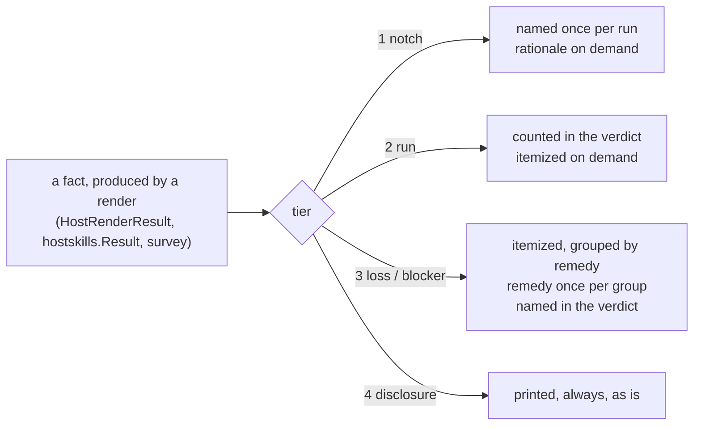

# One report, three readers — why `yolo host apply` says everything and tells you nothing

**Status:** SHIPPED, 2026-09-12. All eight steps of [§9](#9-what-i-would-build-in-order) landed and
all seven questions are ruled — and every one of them is built, which
[§11](#11-decision-ledger)'s **Built** column states row by row rather than leaving to be
inferred from this line. **Measured after the build, in this jail:
the default report is 30 lines where it was 278**, and `--verbose` carries the 267-line detail view.
The line-by-line measurements in [§2](#2-what-exists-today-measured) and [§3](#3-the-diagnosis) were
taken at `48f47e56` on 2026-09-10 and describe the report the change ACTED ON, not today's; every
claim about dependency handling was verified against the tree on 2026-09-11.

> **In short.** The report states every fact and never states its **result**, so the reader is
> left adding the lines up — and a missing dependency, the one finding that makes the rest of the
> apply pointless, is just another line in the middle. **The command should say how it went**, in
> one verdict line; the tiers exist so that every other line supports that sentence instead of
> competing with it.

**Why it matters.** 277 lines for one home, about sixteen of them actionable, and not one of them
says *this worked* or *this did not*. The same four-word fact — *fourteen of your skills move to
the local pack* — takes 210 lines. A missing host dependency prints correctly, with its install
command, and then changes nothing: not the exit code, and not the roll-up, which counts
destinations and never asks about dependencies
([`applyhostdeps.go:26-27`](../../internal/cli/applyhostdeps.go#L26-L27),
[`hostapplysurvey.go:21-46`](../../internal/cli/hostapplysurvey.go#L21-L46), 2026-09-11).

**The shape.** Every run ends in a **verdict line** stating what happened. Every line beneath it
carries a **report tier** — notch facts, run facts, losses and blockers — plus **disclosures** for
the launch, and the tier, not the emitter, decides whether it prints by default, once per run, or
only under `--verbose`. A declared dependency that is missing is a blocker: the dry run reports it,
`--assert` refuses over it.

**Cost.** `--assert` gains a failure mode it does not have today, so a home that applies now can
refuse later. Today's exhaustive report becomes the `--verbose` view. The kind-refusal rationale
leaves the report for the manual, which means extending the kind-doc drift gate to cover it. The
run-boot goldens move under sign-off; the census test keeps its intent and loses its letter.

**Scope note.** Four sibling docs own adjacent ground and this one does not re-rule any of it:
color and glyphs are [`cli-visual-polish.md`](../plans/cli-visual-polish.md)'s (its additive
byte-parity rule is inherited whole); the change predicate and the launch gate are
[`host-apply-staleness.md`](../reference/host-apply-staleness.md)'s; the *remedy* for a scalar
overwrite is [`config-ownership-and-promotion.md`](config-ownership-and-promotion.md)'s; the
`--format json` standard is [`self-documenting-cli.md`](../reference/self-documenting-cli.md)'s,
and [§4.8](#48-machine-consumers) extends its boundary from *verb* to *posture*.

**Start at [§4](#4-the-proposal--report-tiers)** — the verdict line and the tiers.
[§2](#2-what-exists-today-measured) and [§3](#3-the-diagnosis) are the evidence that they are the
right cut.

**Needs your ruling:** **None** — [`OQ-RO7`](#11-decision-ledger) closed 2026-09-11 and was the
last of the seven ([§10](#10-open-questions)).

**Reads with:** [`report-tiers-plan.md`](report-tiers-plan.md) (the implementation sketch the build
consumed), [`perf-logging.md`](../reference/perf-logging.md) (D14,
the reservation this doc spends, and D12, whose typed-vs-inherited distinction it inherits),
[`information-at-the-point-of-need.md`](../reference/information-at-the-point-of-need.md) (the
principle [§4.6](#46-the-report-vocabulary-and-where-the-rationale-goes) applies in reverse).

---

## 1. Verdict, and the principles it rests on

The verdict: **the output is correct and complete, and that is the problem.** Every fact it states
is true; every line has a docstring defending it; the no-silent-skip invariant behind most of them
is right. What is missing is a *reader model* — a decision about who is looking and what they need
first — and beneath that, something simpler: **the command never states its own result.** It hands
over 277 true lines and leaves the arithmetic to the reader, which is how a missing dependency ends
up indistinguishable from a skipped briefing. The fix is not to delete facts. It is to end every run
with the result, and to classify everything else so that the classification, not the emitter,
decides the rendering.

Eight principles, cited by number below. **P7 is the one the other seven serve** — it is numbered
last so the existing P1–P6 citations keep resolving, not because it ranks last:

- **P1 — One fact, once.** A property of the *notch* is stated once per run. A property of the
  *pack set* is stated once per set. A per-destination fact is stated per destination only when
  it is a change or a loss.
- **P2 — Every loss names its remedy, in copy-paste form, and names the scope the remedy covers.**
  A loss with no remedy says so rather than borrowing a `⚠` it cannot cash. This is
  [OQ-CO2](config-ownership-and-promotion.md#13-decision-ledger)'s ruling — feedback belongs *at the point of
  the act* — taken seriously: the message at that point has to be good enough to carry the whole
  load, because nothing else will.
- **P3 — Facts and remedies; the *why* lives in the manual.** The report states what is true of
  this run and what to do about it. The reasoning behind a rule is for the person changing the
  rule, not the person meeting it
  ([`information-at-the-point-of-need.md`](../reference/information-at-the-point-of-need.md),
  *What about the reasoning?*), and P8 says where it goes instead.
- **P4 — Disclosures are never suppressible.** Progress and provenance may be compressed to a
  line, but the decision they report stays visible on every launch. A quiet mode that could hide
  the host-access banner would delete the one thing
  [OQ-TP9](trust-paths.md#-oq-tp9--is-the-fetched-pack-approval-prompt-a-gate-or-theatre--resolved-2026-09-04)
  kept when it deleted the approval gate.
- **P5 — No silent skip survives this.** The census invariant is *named*, not *itemized*: a kind
  the host notch refuses appears in the report, and appearing once is appearing.
- **P6 — Counts count what the reader cares about.** Files, keys, servers, skills — not the
  destinations a loop visited; and "in sync" means *compared and equal*, not *not compared*.
- **P7 — The command states its own result; the reader never computes it.** Every run ends in one
  sentence saying how it went — *completed*, *would complete*, *refused*, *nothing to do* — and the
  counts sit underneath that sentence rather than standing in for it. A reader who has to sum lines
  to learn the outcome is being handed the command's own job. The corollary is the sharper half: a
  finding that decides the outcome belongs **in** the result, not merely somewhere in the stream
  that scrolled past ([§4.9](#49-a-missing-dependency-is-a-result-not-a-line)).
- **P8 — The report states facts, not rationale.** The reader is someone experienced with this
  tool, and explaining a design decision to them is what a manual is for. Terse and consistent
  beats self-explaining, which is why P8 comes with a closed vocabulary
  ([§4.6](#46-the-report-vocabulary-and-where-the-rationale-goes)): one fixed word per outcome,
  used everywhere, never varied for the sake of prose. The carve-out is explicit — a sentence or
  two where something really is unique to this run. Invariant paragraphs are the case that fails
  hardest: the seven kind-refusal texts run ~40 words each, are byte-identical in every home on
  every machine, and print once per contribution.

## 2. What exists today, measured

### 2.1 The stream, by line class

The command was `yolo apply --at host` (observe; `applyHost` is called with `write=false` without
`--assert` — [`apply.go:100`](../../internal/cli/apply.go#L100)). Exit 0. 277 lines on stdout plus
the one-line version banner on stderr, which is the 278 the maintainer counted. Every stdout line,
classified:

| Class | Lines | What it says | Varies with |
| :--- | ---: | :--- | :--- |
| Frame — header, count line, footer | 3 | `host apply  home … posture observe (dry-run)`; `8 in sync, 76 would change`; `observe only — nothing written…` | the home |
| Kind refusals | 19 | `state refused — state names a jail-writable home subtree …` (state ×6, hook ×4, loophole ×4, reads-host ×2, env, provider, profile ×1) | **nothing** — the text is a property of the notch |
| Autonomy posture | 5 | `autonomy   guarded posture — permission prompts stay ON; folded into …` | **nothing** — one per pack, same text |
| Program present | 5 | `program    ✓ claude  present at …` | the host's dep state |
| Surface verdicts | 13 | `would render` ×6, `unchanged` ×1, `skipped: …` ×6 (one config, five briefings) | the home |
| `⚠` children of a surface | 9 | `would overwrite your existing value for: …` ×4 (7 keys); `would damage your existing entry: …` ×3 (9 entries — the **same three MCP servers** in three agents); `comments are preserved, EXCEPT …` ×1; `skipped ${workspace}-keyed …` ×1 | the home |
| Skills, composed-from | 5 | `skills     ~/.claude/skills composed from: claude` | the pack set |
| Skills, adoption preview | 72 | a header, **70 paths** (14 skills × 5 dirs) yolo did not write, a 60-word explanation | the home |
| Skills, per-entry preview | 70 | `would move to your local pack` ×14, `would union into your local pack` ×56 | the home |
| Tail — `would change` list | 76 | 6 config surfaces + **70 skill destinations** | the home |

Two readings of that table carry the doc. **Twenty-four lines say nothing that could differ between
two machines.** And **210 lines state one fact** — *fourteen skills in five agent directories are
yours; an `--assert` moves them into the local pack and composes them back into all five* — at three
granularities (paths, per-entry actions, changed destinations), each complete on its own.

### 2.2 Where the lines come from

There is no report object. [`richtext.Printer`](../../internal/richtext/richtext.go#L100) has two
methods, `Print` and `Printf` — a line printer with color, deliberately: it exists to end the
strip-always duplication [`cli-color-audit.md`](../plans/cli-color-audit.md) closed, not to know
what a report is. Every structural property of the output is therefore a property of the loops
that call it (all anchors 2026-09-10):

- **The refusal text is per kind, the print is per contribution.** The seven reasons live in
  [`fieldset.go:38-127`](../../internal/render/fieldset.go#L38-L127) keyed by kind; the loop at
  [`apply.go:381-386`](../../internal/cli/apply.go#L381-L386) runs over
  `p.Decl.Contributions()` for each pack, so a pack declaring `state` twice earns two identical
  paragraphs, and `hook` — declared three times by `claude` and once by `agy` — earns four.
- **The autonomy line is a property of the notch, printed per pack**
  ([`apply.go:397-403`](../../internal/cli/apply.go#L397-L403)). Its value comes from
  `render.Host(...).Profile().AgentAutonomy`, which cannot differ between packs in one run.
- **The MCP remedy is a literal in the per-surface `⚠`**
  ([`apply.go:466-468`](../../internal/cli/apply.go#L466-L468)), so three surfaces produce three
  copies — and this copy omits the two words the confirmation prompt's copy has, *"reaching every
  agent"* ([`apply.go:615-617`](../../internal/cli/apply.go#L615-L617)).
- **The skills section reports every entry it visits**
  ([`printSkillResult`, `applyhostskills.go:366-381`](../../internal/cli/applyhostskills.go#L366-L381)),
  and reports the adoption set as a path list
  ([`reportSkillAdoptions`, `:294-310`](../../internal/cli/applyhostskills.go#L294-L310)).
- **The one cross-cutting accumulator holds no losses.** The survey
  ([`hostapplysurvey.go:20-45`](../../internal/cli/hostapplysurvey.go#L20-L45)) records kind,
  surface and path per changed destination plus an in-sync count — exactly what the launch gate
  needs, and nothing the operator's question ("would I lose anything?") needs.
- **The roll-up is printed last, on purpose**
  ([`apply.go:536-545`](../../internal/cli/apply.go#L536-L545)): *"so the last two lines read as
  verdict-then-posture."* It landed on 2026-09-03 (`015527be`), which is why the maintainer's
  "no summary and no counts" is half right — there is a count, and it is the wrong count
  ([§3.4](#34-the-count-counts-the-loop-not-the-facts)).

### 2.3 What the tests pin

This matters because it bounds what a redesign may change without a golden update. Checked
2026-09-10 across `internal/cli/applyhost*_test.go` and `hostapply*_test.go`:

- **Substrings, not layout.** The pins are action words and kind names — `would change`,
  `0 would change`, `unchanged`, `would archive`, `skipped (yours)`, `no effect`, `refusing to
  launch`, the absence of `[y/N]` in observe. Nothing pins indentation, ordering, or a full line.
- **The census test pins presence, not multiplicity.**
  [`applyhostcensus_test.go:57-63`](../../internal/cli/applyhostcensus_test.go#L57-L63) asserts
  `strings.Contains(report, string(kind))` for every kind in the closed set — its stated intent is
  that a kind is *"rendered, refused, or named as unimplemented, never silently skipped."* One line
  naming seven kinds satisfies it. Nineteen lines are not what it asks for.
- **Nothing pins the refusal text.** The three phrases `off-container the home simply`, `hooks are
  jail provisioning` and `only client is a container` occur in no test file.
- **Two count pins on the skills preview**, both against a one-skill fixture:
  [`applyhostskillscompose_test.go:353-361`](../../internal/cli/applyhostskillscompose_test.go#L353-L361)
  wants exactly one `would move to your local pack` line and one `would union into your local pack`
  line. A grouped rendering that says *1 skill would move to your local pack* still passes; a
  grouped rendering of fourteen skills is a shape the fixture cannot see, which is a hole the sketch
  names.

### 2.4 The launch stream, both halves

The launch prints from two processes, and only one half is ever written down.

**The host launcher's half** goes to the terminal and nowhere else — no log sink exists for it
(checked 2026-09-10: `/ctx/host-yolo-logs` holds daemon, relay and crossing logs and contains
none of the banner phrases; `<workspace>/.yolo/host-perf.log` records the launch *spans*, not the
text). The lines that are unconditional on a fresh `yolo -- bash`, in order
(verified against the tree 2026-09-10):

1. `yolo-jail <version> | <os>/<arch> | host` — the version banner, stderr, every subcommand
   ([`startupbanner.go:49-60`](../../internal/cli/startupbanner.go#L49-L60)). The **only line
   with a suppression knob**: `YOLO_NO_BANNER`
   ([`banner.go:49-55`](../../internal/banner/banner.go#L49-L55)).
2. `Flake source: <path> (<what selected it>)` — stderr, dim
   ([`probes.go:44-50`](../../internal/cli/run/probes.go#L44-L50)). Its docstring is its
   reason: *"naming what the next few gigabytes are being built from while there is still time to
   Ctrl-C."* [`AGENTS.md:210-211`](../../AGENTS.md#L210-L211) adds the developer's reason: read
   it before believing a nested green.
3. nix build progress — `Evaluating flake...`, `Building …`, `Fetching …` — **stdout**
   ([`image.go:120-130`](../../internal/image/image.go#L120-L130)).
4. `Jail binaries: <dir> (prebuilt, from the flake bundle | built from the flake source)` —
   stderr, dim ([`run.go:777`](../../internal/cli/run/run.go#L777)).
5. Image delivery, when it happens — `Image load needed: …`, `Store write: …`, `Copied image: …`,
   `Done: loaded image` — **stdout** ([`autoload.go:550-655`](../../internal/image/autoload.go#L550-L655)).
6. `Jail: <name> | podman` — stderr, raw `Fprintln`, not the printer
   ([`run.go:1619-1626`](../../internal/cli/run/run.go#L1619-L1626)), whose docstring says
   `YOLO_NO_BANNER` *"does NOT silence this line."*
7. The disclosures, when a pack claims anything: `Pack environment this launch:` + one line per
   read claim ([`run.go:566-572`](../../internal/cli/run/run.go#L566-L572)); `This launch runs
   pack code on your machine:` + one line per exec claim, printed *before* the spawn
   ([`packloopholes.go:269-276`](../../internal/cli/run/packloopholes.go#L269-L276)); the
   host-cache alias ([`hostcasalias.go:122-131`](../../internal/cli/run/hostcasalias.go#L122-L131));
   the host-loopback verdict; GPU/USB/KVM passthrough. All stderr.
8. Then the entrypoint's half.

**The entrypoint's half** is the one that is persisted: `attachBootLog` tees `e.Stderr` to the
terminal *and* `<workspace>/.yolo/boot.log`
([`bootlog.go:96-103`](../../internal/entrypoint/bootlog.go#L96-L103)), and gives the boot a
**second writer**, `e.LogOnly`, for lines that belong in the log and not on the terminal
([`env.go:54-70`](../../internal/entrypoint/env.go#L54-L70)) — *"a healthy jail's reachability
witness says nothing, and 'ran and was silent' then reads identically to 'never ran'."* This jail's
`boot.log` from the 2026-09-10 launch, in shape:

```text
=== yolo entrypoint 2026-09-10T10:26:04-0400 ===
  YOLO_VERSION=…  YOLO_RUNTIME=podman  YOLO_HOST_LOOPBACK=requested
boot catalog: npm package installed but not declared by any selected pack, preset or LSP recipe: @github/copilot
boot catalog: … : @openai/codex        (… six more, one per orphan — eight lines)
~/.claude/settings.json: 7 keys from captured in-jail edits (yolo config diff claude)
… (four more, one per surface with captured edits)
shared_credentials[claude]: … already symlinked to shared
  cgroup delegate: not available (no host daemon socket)
reachability: 1/1 enabled service(s) reachable, disposition=requested      ← log only
=== boot complete, handing over ===
```

The `boot catalog:` lines reach the terminal (they go through `e.warn`,
[`catalog.go:149-158`](../../internal/entrypoint/catalog.go#L149-L158)), and have named the same
eight packages at every launch of this jail since they were installed — the informational half of
[OQ-PD4](program-delivery.md#decision-ledger), which ruled that dropping a pack never deletes its
program, so the catalog reports and nothing acts. They are, in this doc's vocabulary, notch-facts
with a state dependency: true until the user does something, and repeated until then.

Three more things the inventory found, each a finding on its own:

- **There is no quiet mode.** No `--quiet`/`-q` exists in `internal/cli` or `internal/cli/run`;
  `--verbose` and `--timing` only add output. Two of the unconditional lines above carry
  docstrings arguing they must stay unconditional (items 2 and 6); the version banner carries three
  properties it calls *"not negotiable"* — stderr, no isatty gate, one hatch
  ([`banner.go:24-34`](../../internal/banner/banner.go#L24-L34)).
- **`NO_COLOR` is honored nowhere.** The string does not occur in `internal/` or `cmd/`
  (checked 2026-09-10). The color gate is TTY-only (`colorForWriter`,
  [`config.go:143-146`](../../internal/cli/config.go#L143-L146);
  [`console.go:29-31`](../../internal/cli/run/console.go#L29-L31)).
  [`cli-visual-polish.md`](../plans/cli-visual-polish.md) states *"honor `NO_COLOR`"* as an
  invariant. It is that plan's to close; noted here because a report redesign will be the moment
  someone tests a pipe.
- **The stream split is not a rule.** `warnIfNoPacks` states the rule — *"Stderr, like every other
  launch notice"* ([`run.go:531-539`](../../internal/cli/run/run.go#L531-L539)) — and the
  notices follow it, but the nix build progress, the image delivery lines, the config-change diff
  and its `[y/N]` prompt, the flock waiting notice and the GPU/USB disclosures go to **stdout**.
  Out of scope to fix here; in scope to say, because a machine-readable mode
  ([§4.8](#48-machine-consumers)) would meet it first.

## 3. The diagnosis

### 3.1 Three readers, one density

| Reader | Came to learn | Needs first | Gets, today |
| :--- | :--- | :--- | :--- |
| **The operator** — typed the command, or is about to type `--assert` | *Will this hurt me, and did it work?* | losses, then a verdict | the verdict at line 200 of stdout, counting 70 skill destinations as changes; the losses indented under surfaces, between refusals |
| **The auditor** — wants to know exactly what an `--assert` writes | every destination and every key | the per-destination detail | gets it, interleaved with 24 lines that are true of every home |
| **The diagnoser** — something surprising is in the home, or was refused | why *this* thing happened | the detail for one destination, plus the rationale | gets rationale for seven kinds they never asked about; for a launch, gets nothing persisted from the launcher's half |
| **The machine** — an agent, the CLI's primary operator per [`self-documenting-cli.md`](../reference/self-documenting-cli.md) | the survey, structured | JSON, or an exit code | prose to scrape; exit 0 whether or not losses are pending |

One stream cannot serve the first three at one density, and today's density is the auditor's. That
is the wrong default: the auditor is the reader who will ask for more, and the operator is the one
who will stop reading.

### 3.2 Invariant text, printed as news

Twenty-four of the 277 lines would be byte-identical in any home on any machine that selects the
same packs — and the seven refusal texts would be identical regardless of which packs, since the
text is keyed by kind. They are good text: each is a correct, argued sentence about why a kind has
no meaning at the host notch. They are also **rationale**, and under P8 rationale is the manual's
job, not the report's. Printed as they are, they cost the reader a paragraph per contribution to
learn that nothing happened.

The census invariant that motivates them ([§2.3](#23-what-the-tests-pin)) is satisfied by naming.
The rationale leaves the report altogether
([§4.6](#46-the-report-vocabulary-and-where-the-rationale-goes)).

### 3.3 Repetition is structural

Four repetition axes, each a loop boundary that became a line boundary:

| Axis | Instance | Lines | The fact, stated once |
| :--- | :--- | ---: | :--- |
| per **contribution** | `state refused —` ×6, `hook` ×4, `loophole` ×4 | 19 | *seven kinds do not apply at the host notch: env, hook, loophole, profile, provider, reads-host, state* |
| per **pack** | `autonomy   guarded posture — …` ×5 | 5 | *autonomy is guarded here: permission prompts stay on* |
| per **agent** | `would damage your existing entry: mcp_servers.chrome-devtools (dropped …), … (yolo owns this table; declare the entry under mcp_servers to keep it)` ×3 | 3 | *three MCP servers you added by hand would be dropped from codex, agy and opencode; declaring each once under `mcp_servers` keeps it in every agent* |
| per **destination** | 70 paths, then 70 per-entry actions, then 70 `would change skills` | 210 | *fourteen skills in five agent dirs are yours; an `--assert` moves them into your local pack and composes them back into all five* |

The third row is the one the maintainer singled out and the one with the most at stake: the three
lines read as three problems with three fixes, when they are one problem with one fix, and the fix
is a **single user-scope key** — which the report's own confirmation prompt knows
([`apply.go:615-617`](../../internal/cli/apply.go#L615-L617), *"reaching every agent"*) and its
per-surface line forgets.

### 3.4 The count counts the loop, not the facts

`8 in sync, 76 would change` is the roll-up the change predicate added
([`hostapplysurvey.go:66-71`](../../internal/cli/hostapplysurvey.go#L66-L71), `015527be`). It is
right for the launch gate, which asks a yes/no question, and wrong for a human, three ways:

- **It counts destinations.** 70 of the 76 are the fourteen skills, once per agent directory.
  The operator reads "76 things will change"; six files will.
- **It has no loss count.** Seven of the user's values would be overwritten in three files; nine
  MCP entries (three servers) would be dropped. Neither number appears anywhere.
- **"In sync" includes the skipped.** A skipped or refused surface has a path and no pending
  change, so `note` counts it as in sync
  ([`hostapplysurvey.go:47-58`](../../internal/cli/hostapplysurvey.go#L47-L58)) — by design,
  and the design's reason is sound for the gate (*"a launch gate stop on a condition applying
  cannot fix"*). Six of the eight were never compared. For a human, *in sync* is a claim the
  render did not make.

The frame around it is the maintainer's "cryptic": `host apply  home /home/agent  posture observe
(dry-run)` says *posture* to a reader who has never met the word, and the only sentence in the
report that says nothing was written is the last one.

### 3.5 Actionability audit

P2 applied to every warning class the report can emit (all 2026-09-10):

| Line | Names the fix? | Names where? | Names the scope? | Verdict |
| :--- | :--- | :--- | :--- | :--- |
| `⚠ would damage your existing entry: … (declare the entry under mcp_servers to keep it)` [`apply.go:466`](../../internal/cli/apply.go#L466) | key, yes | no file named | no — the prompt's copy says *"reaching every agent"*, this one does not | **half** |
| `⚠ would overwrite your existing value for: <keys>` [`apply.go:455`](../../internal/cli/apply.go#L455) | **no** | — | — | **none, and honestly so**: no remedy exists at this notch. A config-overlay folds *below* the owner's managed layer, which *"still wins a conflict"* ([`apply.go:434-436`](../../internal/cli/apply.go#L434-L436)), so the user cannot re-declare their value. The remedy is [`config-ownership-and-promotion.md`](config-ownership-and-promotion.md)'s to build; until then the line should say *these keys are managed by the pack* rather than wear a `⚠` that implies a fix |
| `⚠ comments are preserved, EXCEPT above <key> …` [`apply.go:488`](../../internal/cli/apply.go#L488) | n/a — an inherent cost | — | — | fine as a fact; 30 words |
| `⚠ yolo COMPOSES these skills directories … Each one MOVES into <local pack> …` [`applyhostskills.go:294-310`](../../internal/cli/applyhostskills.go#L294-L310) | yes — *add it to the local pack instead* | yes | yes | **good text, 72 lines** |
| `<kind> no effect — <pack> carries <kind> content, and no pack in packs names a <kind> destination (select … or declare into …)` [`apply.go:742`](../../internal/cli/apply.go#L742) | yes, both branches | yes | yes | good; 60 words on one line |
| `<kind> refused — <rationale>. Launch a jail to run it` [`fieldset.go:56-58`](../../internal/render/fieldset.go#L56-L58) | offers a remedy for a problem the user does not have | — | — | **not a warning** — a notch fact wearing `refused` |
| `yolo host: refusing to launch <bin> — … Apply it first: yolo host apply --assert … Or approve THIS launch only: <VAR>=1 <bin> …` [`hostapplygate.go:257-275`](../../internal/cli/hostapplygate.go#L257-L275) | two, copy-paste | the key **and** its file | yes | **the model** — every other line should read like this |
| `boot catalog: <pkg> installed but not declared by any selected pack …` [`catalog.go:149-158`](../../internal/entrypoint/catalog.go#L149-L158) | no, by ruling ([OQ-PD4](program-delivery.md#decision-ledger)) | — | — | a fact, correctly not a warning; eight lines at every launch |

The pattern: the lines written most recently, under the most pressure (the launch gate's refusal,
the skills adoption), meet P2. The lines that fire most often do not, and the `overwrite` line
cannot — which the report should say instead of implying otherwise.

### 3.6 The launch stream has the same shape, plus a line that must never move

The launch is a *stream* — it narrates a process as it happens — so "where the summary goes" does
not apply. Everything else does. The ten unconditional lines
([§2.4](#24-the-launch-stream-both-halves)) split cleanly into the tiers
[§4.1](#41-the-tiers) names: provenance (which flake, which binaries, which jail), progress (the
build, the load, the provisioning), disclosures (what host access this launch has), and the
entrypoint's warnings. The `boot catalog:` lines are the launch's kind-refusals: true, invariant
until the user acts, repeated until then.

The tension the maintainer named is real and it is P4: a disclosure is the *entire* boundary now.
`packhostgrants.go` says so in as many words — *"the boundary today is DISCLOSURE, not consent"*
([`packhostgrants.go:36-42`](../../internal/cli/run/packhostgrants.go#L36-L42)) — and the exec
disclosure is wired so that the spawn is reachable through exactly one already-disclosed path
([`packloopholes.go:277-289`](../../internal/cli/run/packloopholes.go#L277-L289)). Any density
control for the launch has to be built *around* those lines, never over them.

And the diagnoser's problem is worse here than at apply: the launcher's half of the stream is
gone the moment it scrolls. The entrypoint solved this for its half with `boot.log`; the launcher
never did.

## 4. The proposal — report tiers

### 4.1 The tiers

A **report tier** *(coined here)* is the class of fact a line states, assigned where the fact is
produced — in the result structs and the survey — and consumed by the printer to decide *whether*
the line prints, *how many times*, and *under which flag*. It is **not** a log level: a level is a
property the emitter picks in the moment ("this feels like a warning"), which is exactly how the
current output came to be; a tier is a property of the fact, and two emitters stating the same
fact get the same tier. It is **not** severity either: a kind refusal is a refusal and sits in tier
1; an MCP entry loss is a warning and sits in tier 3.

| Tier | Definition | Default rendering | `--verbose` adds |
| :--- | :--- | :--- | :--- |
| **1 — Notch facts** | True of this notch regardless of the home: which kinds do not apply here, the autonomy posture | **one line per run**, naming the kinds and the posture in [§4.6](#46-the-report-vocabulary-and-where-the-rationale-goes)'s words | which pack declared each — a fact. Never the reasoning; that is the manual's (P8) |
| **2 — Run facts** | Vary with the home but need no action: in-sync/skipped/unchanged surfaces, composed-from, the inferred-destination lines, would-render surfaces, and a declared dependency that is **present** | **counted in the verdict**; a `would render` config surface is itemized (there are few, and they are the auditor's core) | every destination, today's per-entry lines |
| **3 — Losses and blockers** | Two members, one treatment. A **loss**: something of the user's is replaced, dropped, moved or archived. A **blocker**: something stands between this home and a completed apply — a missing declared dependency, a refusal, a pack that failed to render | **always itemized, grouped by remedy**, each group carrying its remedy once, and **every group represented in the verdict line** | the per-destination expansion of each group (the 70 paths) |
| **4 — Disclosures** (launch only) | Host access this launch has: pack read/exec claims, the cache alias, passthrough, the loopback verdict | **always, unchanged**, never grouped or compressed | nothing — there is no more to say |

**Why losses and blockers share a tier.** They differ in whose problem they are and agree on
everything the tier decides: both are always itemized, both carry a remedy stated once, and both
change what the verdict line says. A tier is a rendering decision, so two facts that want the same
rendering are one tier — splitting them would be severity creeping back in, which is exactly what
[§7](#7-alternatives-considered) rejects log levels for. Dependency state splits across tiers for
the same reason: *present* needs no action and is counted (tier 2); *missing* blocks the apply and
is named (tier 3).



The fatal refusals — an `agents` selector naming nobody, a doubly-owned surface, a name claimed
twice ([`apply.go:296-340`](../../internal/cli/apply.go#L296-L340)) — are tier 3 in shape and
already right: they itemize, they name the fix, they exit 1 before anything renders. Nothing here
touches them.

### 4.2 The default view

What the operator sees with no flag, in order, for the measured home. **The wording below is the
implementer's to improve; the content, grouping and order are specified.** A sketch, not a golden:

```text
host apply — dry run into /home/agent; nothing is written

  claude/settings   would change   ~/.claude/settings.json
    replaces 3 of your values: permissions.additionalDirectories, permissions.defaultMode,
      skipDangerousModePermissionPrompt   (managed by the claude pack)
  pi/settings       would change   ~/.pi/agent/settings.json
    replaces 1 of your values: defaultProjectTrust   (managed by the pi pack)
  codex/config      would change   ~/.codex/config.toml
    replaces 2 of your values: approval_policy, sandbox_mode   (managed by the codex pack)
    drops the comment above approval_policy — its value changes
  agy/mcp · agy/settings · opencode/config   would change

  ⚠ 3 MCP servers you added by hand would be dropped from codex, agy and opencode:
      chrome-devtools, sequential-thinking, tavily
    → keep them in every agent: declare each under `mcp_servers` in ~/.config/yolo-jail/config.jsonc

  ⚠ 14 skills in 5 agent skill dirs are yours, not yolo's. An --assert moves them into your
    local pack (~/.config/yolo-jail/local/skills) and composes them back into all 5 dirs:
      brainstorming, configuring-the-jail, design-doc, developing-yolo-jail, diagnosing-the-jail,
      headful-browser, implementation-plan, new-project, open-source-project, research, roadmap,
      system-doc, user-stories, vantage-docs
    → to keep one out of yolo's hands, remove it from the agent dir before applying

  An --assert would complete.
  6 config files would change · 14 skills would move · 2 destinations compared and unchanged
  7 of your values replaced · 3 MCP servers dropped · 5 declared dependencies present
  7 kinds do not apply at the host notch (`yolo pack --help` says what each kind is)
  dry run — nothing written. `--assert` applies; `--verbose` lists every destination.
```

Twenty-eight lines against 277, and every one of the sixteen actionable facts is in it. Order,
and why:

1. **Header** — the posture in plain words (*dry run*, *nothing is written*), not
   `posture observe (dry-run)`. The home path stays: it is the one fact the in-jail reader needs
   to notice (this command renders into *this* jail's home when run from inside one).
2. **Changed config surfaces, each with its own losses.** A scalar replacement belongs to one
   surface and stays under it. Surfaces with no loss share a line.
3. **Cross-cutting losses and blockers, grouped by remedy**
   ([§4.4](#44-losses-blockers-and-the-remedy-contract)). The MCP group and the skills group are one group
   each because each has one remedy. This home has no blocker; one renders the same way
   ([§4.9](#49-a-missing-dependency-is-a-result-not-a-line)).
4. **The verdict block** ([§4.3](#43-the-verdict-block)) — the result sentence first, then the
   counts that evidence it.
5. **The posture footer**, which now also names the detail flag.

The verdict stays *last* — the existing rationale holds (*verdict-then-posture* is where the eye
lands when a command returns), and at this length the top-versus-bottom argument is moot. Tier 1
facts appear only as a count in the verdict; tier 2 only as counts and the changed-surface lines.

### 4.3 The verdict block

Two parts, in this order: the **verdict line**, which states the result, and the **counts**, which
are the evidence for it. The ordering is P7 — a reader who stops after one line still has the
answer.

**The verdict line.** One sentence, in every posture, on every path, including the degenerate ones.
It names the *outcome*, never the work:

| Posture | Condition | What it says | Exit |
| :--- | :--- | :--- | ---: |
| dry run | an `--assert` would complete | *An `--assert` would complete.* | 0 |
| dry run | nothing to do | *Nothing to do — this home is up to date.* | 0 |
| dry run | a blocker | *An `--assert` would NOT complete: 2 declared dependencies are missing (`rg`, `fd`).* | 0 |
| dry run | zero packs configured | *No packs configured — nothing to apply; N destinations retired.* | 0 |
| dry run | a pack failed to render | *An `--assert` would be incomplete — 1 pack failed to render (see stderr).* | 1 |
| `--assert` | wrote everything it planned | *Applied: 6 config files, 14 skills moved into your local pack.* | 0 |
| `--assert` | the same, after installing a missing dependency | *Installed `rg`; applied: 6 config files, 14 skills moved into your local pack.* | 0 |
| `--assert` | a missing dependency, install declined | *Refused: `rg` is missing and its install was declined. Nothing was written.* | 1 |
| `--assert` | a missing dependency, install run and still missing | *Refused: installing `rg` did not produce it. Nothing was written.* | 1 |
| `--assert` | nothing to do | *Nothing to apply — this home is up to date.* | 0 |
| either | refuses before rendering (selector, collision, unresolvable pack) | today's refusal lines, unchanged | 1 |

Four rules keep it a result rather than a second summary:

- **It prints on every path**, the zero-packs branch included. Today that branch returns at
  [`apply.go:201`](../../internal/cli/apply.go#L201) — *before* the roll-up at
  [`:536-545`](../../internal/cli/apply.go#L536-L545) — so an empty `packs` dry run ends with no
  count and no footer at all (verified 2026-09-11).
- **Every tier-3 group is represented in it.** A loss contributes a count; a blocker contributes
  its name. Grouping may compress the lines above the verdict; it may never leave the verdict
  silent about a class ([§4.4](#44-losses-blockers-and-the-remedy-contract)).
- **It states the outcome of the posture that ran.** The dry run is the exception only because its
  entire outcome *is* a prediction — which is what the posture is for
  ([§4.9](#49-a-missing-dependency-is-a-result-not-a-line)).
- **It is correct when the run ends early.** An `--assert` can now abort at a declined install
  before it renders anything ([§4.9](#49-a-missing-dependency-is-a-result-not-a-line)), so the
  verdict line is written from what the run actually did, never from the plan it started with. The
  counts beneath it cover only what was reached, and say so.
- **The wording is the implementer's; the distinctions are not.** Every row above is a case a
  reader must be able to tell apart, and the vocabulary each row draws on is
  [§4.6](#46-the-report-vocabulary-and-where-the-rationale-goes)'s.

**The counts.** What each one counts (P6):

| Count | Unit | Source | Why this and not the loop count |
| :--- | :--- | :--- | :--- |
| config files that would change | files | the survey's `config` changes | six, not 76 |
| surfaces adopted | surfaces | `HostRenderResult.Archived` | the one-way door the run walked through, and no other count here can represent it: the canonical adoption reproduces the file's bytes, so the destination reports no change ([`OQ-CO7`](config-ownership-and-promotion.md#13-decision-ledger)) |
| skills that would move / union / archive | skills, not destinations | the skills results, deduplicated by name | fourteen, not seventy |
| destinations compared and unchanged | destinations | `WouldChange == false` **and** the render compared content | "in sync" today includes six skipped surfaces; the skipped are named separately on demand |
| values of yours replaced | keys, with the file count | `HostRenderResult.Overwrites` | the operator's first question |
| MCP entries dropped | servers × agents, said as *N servers from M agents* | `HostRenderResult.EntryLosses` | the confirmation gate's own subject |
| kinds that do not apply at this notch | kinds | `HostFields().Refuse` over the declared kinds | P1: once |
| declared dependencies present / missing | binaries | `resolveHostDeps` ([`applyhostdeps.go`](../../internal/cli/applyhostdeps.go)) | the missing ones decide the verdict ([§4.9](#49-a-missing-dependency-is-a-result-not-a-line)); the survey cannot state either today |
| first apply into this home | flag | `HostRenderResult.FirstApply` | it is what turns the losses above into a prompt on `--assert` |

The survey grows to carry the loss and dependency counts; today it holds a kind, a surface, a path
and an in-sync tally, and nothing else
([`hostapplysurvey.go:21-46`](../../internal/cli/hostapplysurvey.go#L21-L46), verified 2026-09-11),
so it can state none of the last five. The launch gate keeps reading the same struct — one
collector, both consumers, as its docstring insists — and `Changes()` keeps its present meaning
([§6](#6-what-this-does-not-propose)).

### 4.4 Losses, blockers, and the remedy contract

Every tier-3 group states: **what** is lost or blocked, **whose** it is, **where**, and **the
remedy in a form that can be pasted**, naming the scope the remedy covers. Grouping is by *remedy
key* — the config key, the local-pack path, the missing binary, or "none" — never by text
similarity. The classes:

| Loss class | Group by | Remedy line | Scope word |
| :--- | :--- | :--- | :--- |
| MCP entry dropped | the entry name, across agents | *declare each under `mcp_servers` in `<user config path>`* | *in every agent* |
| skill adopted (moved/unioned/archived) | the skill name, across dirs | *remove it from the agent dir before applying* to opt one out; otherwise nothing — the move is the remedy | *all N dirs* |
| your value replaced by a managed key | the surface | **none exists**: the line states *managed by the `<pack>` pack* and stops. No `⚠`. The remedy is [`config-ownership-and-promotion.md`](config-ownership-and-promotion.md)'s; when it ships, this line names its key | — |
| comment dropped above a changed key | the surface | none possible; stated as a fact under the surface | — |
| first apply would replace a value yolo never asserted | the home | the existing `[y/N]` prompt on `--assert`, unchanged ([`confirmHostLosses`, `apply.go:577-619`](../../internal/cli/apply.go#L577-L619)); in observe, the flag in the verdict | — |
| **blocker:** a declared dependency is missing | the binary, across packs | the remedy `depcheck` already resolves for the detected manager, plus the package-manager alternative when the primary is the tool's own installer ([`applyhostdeps.go:148-158`](../../internal/cli/applyhostdeps.go#L148-L158)) | *this host* |
| **blocker:** the apply refuses (selector, collision, unresolvable pack) | as today | as today — these already meet P2 | — |

Two forbidden things. **The user's existing value is never printed**, in any view: the
host-render privacy ruling refused capture because a config value can be a credential
([`host-render-target.md`](host-render-target.md), the `capture`/`reset` refusal), and a terminal
transcript gets pasted into bug reports. The *incoming* value is the pack's declaration and may be
shown under `--verbose`; the implementer decides whether it earns the space. And **no default view
may omit a loss or a blocker**: grouping compresses the *lines*, never the *set* — every dropped
entry name, every adopted skill name and every missing binary appears in the default view, in its
group, and again by class in the verdict line.

### 4.5 Detail on demand

**The compressed view is the default** ([`OQ-RO1`](#11-decision-ledger)) and **`--verbose` carries
the detail** ([`OQ-RO2`](#11-decision-ledger)). The operator is the common reader and the one who
stops reading; the auditor is the one who asks for more, and the footer tells them how.

The `--verbose` view is **today's report, reorganized under the same headings**: every tier-1 line
expanded to name which pack declared each kind, every tier-2 destination itemized (the skipped
surfaces and why, the composed-from lines, the dependency probes, the inferred destinations), every
tier-3 group expanded to its per-destination lines (the 70 paths, the 70 actions). Every *fact*
today's output states survives; the one thing that does not move behind the flag is the kind-refusal
rationale, which leaves the report altogether
([§4.6](#46-the-report-vocabulary-and-where-the-rationale-goes)) — `--verbose` is a longer report,
never a more explanatory one.

Spending `--verbose` here spends [`perf-logging.md`](../reference/perf-logging.md)'s D14
reservation deliberately: D1 created the flag so the next non-timing diagnostic would have a home,
and this is that diagnostic. It honors **both** spellings — a typed `--verbose` and one inherited
through `YOLO_VERBOSE` ([`verbose.go:55-80`](../../internal/cli/verbose.go#L55-L80)) — because a
long report a user asked for in their own shell profile is not the table-at-every-quit D12 guarded
against. That is a real distinction in this code and the wrong half is the easy one to copy; the
sketch names the trap.

The launch gate's pointer — *"`yolo host apply --dry-run` shows exactly what changes in each"*
([`hostapplygate.go:236`](../../internal/cli/hostapplygate.go#L236)) — is written against the
current default, so it moves with it and must name `--verbose`; the sketch tracks it.

### 4.6 The report vocabulary, and where the rationale goes

P8 takes the report's explanations away, so the words have to carry what the paragraphs did. The
substitute is a **closed vocabulary** *(coined here as the report vocabulary)*: one fixed term per
outcome, used at every notch, in both postures, in the verdict line and in the lines above it, and
never varied for the sake of prose. The reader learns this table once instead of re-reading a
paragraph per contribution.

| Term | States | Never used for |
| :--- | :--- | :--- |
| **would change** / **changed** | the destination's content differs from what a render produces; an `--assert` writes it | a destination nothing compared |
| **unchanged** | compared, and equal | a destination that was skipped or refused — today's `in sync` count conflates the two ([§3.4](#34-the-count-counts-the-loop-not-the-facts)) |
| **skipped** | yolo did not touch it, and it stays the user's | something yolo declined for its own reasons |
| **does not apply** | this kind has no meaning at this notch | anything that stops the apply |
| **refused** | the apply stopped; nothing was rendered | a notch fact |
| **replaces** | a value of the user's is overwritten by a managed key | a key yolo already owned |
| **drops** | an entry of the user's is removed | a replaced value |
| **moves** | a file of the user's becomes yolo-managed in the local pack | a copy — the original does not stay |
| **archives** | content is retired into this run's archive generation | a delete; nothing is deleted |
| **missing** | a declared dependency is not on this host | one yolo could not probe, which is *not probed* |
| **dry run** | the posture that writes nothing | the `--assert` posture, which is *applying* |

Two of those rows resolve collisions in today's output, and both are worth stating outright:

- **`refused` belongs to the apply, not to a kind.** `<kind> refused — <rationale>. Launch a jail
  to run it` ([`fieldset.go:56-58`](../../internal/render/fieldset.go#L56-L58)) offers a remedy for
  a problem the reader does not have; [§3.5](#35-actionability-audit) already calls it a notch fact
  wearing a warning's word. Under the vocabulary it reads *does not apply*, and the word `refused`
  is left free for the thing that actually stops an apply.
- **The user-facing word for the observing posture is *dry run*.** `observe` stays the posture's
  name in the code and in this doc, because that is what it is called at the call site
  ([`apply.go:100`](../../internal/cli/apply.go#L100)); the report says *dry run*, because that is
  the question the reader is asking — *would this work if I ran it for real?*
  ([§4.9](#49-a-missing-dependency-is-a-result-not-a-line)). One word reaches the user, not two.

**Where the rationale goes: the manual, which already exists and is already pinned.** Both
user-facing kind listings — `yolo config-ref` (the embedded `config_ref.txt`) and `yolo pack --help`
(`packUsage`, [`pack.go:70-104`](../../internal/cli/pack.go#L70-L104)) — carry a list entry per
contribution kind, and `TestEveryKindIsDocumented` fails `just test-fast` when a kind in the closed
set is missing from either ([`packkinddocs_test.go`](../../internal/cli/packkinddocs_test.go), read
2026-09-11). That gate has its own control, `TestKindDocGateIsNotVacuous`, added after the first
version of it proved vacuous for 13 of the 15 kinds then declared.

> [!WARNING]
> **Moving prose out of a mechanism and into a hand-written doc is how this codebase loses
> documentation, and the only reason it is safe here is the gate.** The objection is real —
> retyped text drifts from the thing it describes — so the move carries a requirement, not a hope:
> the host notch's refusal reasons land in the manual **as list entries that same gate covers**,
> extended to assert that every kind the host `FieldSet` refuses has its reason documented, with
> the non-vacuity control extended alongside it. A reason that lands in prose no test reads is
> exactly the drift the objection predicts.

`render.HostFields().Refuse`
([`fieldset.go:38-127`](../../internal/render/fieldset.go#L38-L127)) keeps the strings: it is still
what the code decides by, and it is what the extended gate compares the manual against. **No
terminal view prints them, at any verbosity**, and the JSON document
([§4.8](#48-machine-consumers)) names the refused kinds without carrying the prose — rationale is
not data. `yolo host apply --help` gains one sentence naming `yolo pack --help` as the place kinds
are explained, which satisfies
[`self-documenting-cli.md`](../reference/self-documenting-cli.md)'s requirement 6 (concepts
reachable from the CLI) without retyping seven paragraphs into help text that would rot.

### 4.7 The launch stream under the same tiers

The launch keeps its stream shape — a process narrated in time — and adopts the tier vocabulary
without the report layout. What changes and what does not, line by line
([§2.4](#24-the-launch-stream-both-halves)):

| Line | Tier | Treatment |
| :--- | :--- | :--- |
| version banner; `Flake source:`; `Jail binaries:`; `Jail:` | provenance (a decision) | **unchanged.** Each answers a different question and two carry docstrings for staying. The only edit worth making is cosmetic and belongs to the polish plan: three vocabularies on three adjacent lines |
| nix build, image delivery, `📦 Provisioning tools...`, `↳ …`, `⚡ Executing:` | progress | **unchanged**; a stream needs its progress |
| pack read/exec disclosures, cache alias, loopback verdict, passthrough | **disclosure** | **unchanged, and un-gate-able by construction** (P4) |
| the config-change diff and prompt | disclosure (approval) | unchanged — [`config-safety.md`](../reference/config-safety.md)'s |
| `boot catalog: …` ×8 | notch fact with state | **one line**: *8 installed programs are declared by no selected pack (boot.log lists them; `programs.autoprune` removes them)* — the list already lands in `boot.log` through the same tee ([`OQ-RO3`](#11-decision-ledger)) |
| `<file>: N keys from captured in-jail edits (yolo config diff <agent>)` ×5 | run fact **with a remedy** | unchanged — it already meets P2, and five surfaces are five facts |
| the reachability witness, the cgroup line, credential symlinks | run facts / disclosures | unchanged |
| warnings and refusals | tier 3 | unchanged; the hatch notices already say what they suppress (*"rather than going quiet"*, [`providerpreflight.go:42-46`](../../internal/cli/run/providerpreflight.go#L42-L46)) |

**Persist the launcher's half.** The entrypoint's `boot.log` tee is the model and D2 of
[`perf-logging.md`](../reference/perf-logging.md) is the precedent for *where*: per workspace,
beside `boot.log`, so both halves of one launch sit in one directory. The launcher appends every
line it prints to `<workspace>/.yolo/launch.log`, with the same header shape `boot.log` uses and the
same retention the perf log has. D2's caveat is inherited whole — the directory is inside the live
workspace bind, so a jail can write the host's record — and so is D2's named remediation (the
host-global logs dir) for the day it is needed. Decided by precedent, not opened as a question.

**No `--quiet` for the launch, ever** ([`OQ-RO3`](#11-decision-ledger)). The compression above is
the whole density control: a flag that could hide a disclosure is refused by P4, and a flag that
could hide only progress would save four lines. **P4 is now the written rule** rather than a
conclusion three authors reached independently in three docstrings
([§2.4](#24-the-launch-stream-both-halves)) — which is what a policy made one line at a time looks
like just before it is made differently by the fourth.

**Share the vocabulary, not the layout.** The tier names, and the glyph/color each maps to (from
[`cli-visual-polish.md`](../plans/cli-visual-polish.md)'s semantic table — additive, byte-parity
preserved), become one small helper above `richtext` that both the apply report and the launch
notices call. The launch does not get a verdict block; the report does not get a progress stream.

### 4.8 Machine consumers

[`self-documenting-cli.md`](../reference/self-documenting-cli.md) requirement 7: *anything that
reports state must emit machine-readable output on request*; and its non-licence: *an acting verb
refuses the flag rather than growing a second output mode.* `yolo host apply` is an acting verb
whose **default posture is a state report** — it writes nothing and its whole output is "what would
change." The standard did not anticipate a verb that is both, and its own rationale (agents are the
primary operators; in-jail agents cannot read the host by hand) argues for the report half.

**The dry run emits it** ([`OQ-RO4`](#11-decision-ledger)), which extends the standard's boundary
from *verb* to *posture*: the argument for it is the standard's own rationale — agents are the
primary operators, and an in-jail agent cannot read the host by hand — so the one report that tells
such an agent what a host render would do to its own home must not be prose to scrape. The document
is the survey: destinations with tier, action and path; losses and blockers with class, names and
remedy key; the counts of [§4.3](#43-the-verdict-block); the verdict line's outcome as a stable
token; the first-apply flag. It goes through the existing `parseOutputFormat` front end
([`outputformat.go`](../../internal/cli/outputformat.go)), both spellings. It names the kinds that
do not apply and **does not carry their prose reasons** — rationale is not data
([§4.6](#46-the-report-vocabulary-and-where-the-rationale-goes)).

**`--assert --format json` refuses** (exit 2, stdout empty), which is requirement 3's shape and
requirement 7's non-licence applied to the half that acts. *"Nothing to report must still be a
document"*: zero packs emits a document with empty lists and the retire passes' results.

**Exit codes** ([`OQ-RO5`](#11-decision-ledger)). The dry run exits 0 whatever it finds — its
output *is* the finding, and the pin that says so stays
([`applyhostmcp_test.go:218-236`](../../internal/cli/applyhostmcp_test.go#L218-L236)). `--assert`
exits 0 only when the apply completed, and non-zero names why
([§4.3](#43-the-verdict-block)'s table). The asymmetry is the posture split, not an inconsistency:
a dry run that failed on its own findings would train scripts to ignore its exit code, while an
acting verb that returned 0 over an unready environment would be stating a result it did not
achieve (P7).

`config drift`'s 0/3/4 ([`config.go:53`](../../internal/cli/config.go#L53)) is the house precedent
for a *report* verb encoding its finding, and it is deliberately not copied: a dry run that has
JSON does not need the exit code to carry the verdict, and a caller who wants one class of finding
as a failure has `yolo check-deps`, which already is that verb for dependencies
([§4.9](#49-a-missing-dependency-is-a-result-not-a-line)). An `--exit-code` opt-in (the `git diff`
shape) can follow the first caller who asks; nothing is built for a hypothetical one.

### 4.9 A missing dependency is a result, not a line

**What happens today.** `program` and `requires` share one probe at the host notch — below the jail
notch both ask the host the same question, so `isDepKind` folds them together
([`apply.go:382-397`](../../internal/cli/apply.go#L382-L397)) — and the report states the answer
well: which binary, present or missing, the remedy `depcheck` resolved for the detected manager,
and the package-manager alternative when the primary remedy is the tool's own installer
([`applyhostdeps.go:143-158`](../../internal/cli/applyhostdeps.go#L143-L158)). Then nothing
happens. The line reaches neither the exit code nor the roll-up, and the code states that as a
ruling: *"A missing host dep therefore does not fail `yolo host apply` either — the report is
informational, and `yolo check-deps` is the verb that exits non-zero for a CI to gate on"*
([`applyhostdeps.go:26-27`](../../internal/cli/applyhostdeps.go#L26-L27), verified 2026-09-11).

**Why that argument does not survive.** Two reasons, and the second is the stronger one.

- **P7.** An `--assert`'s promise is a ready environment. A posture that returns 0 having left the
  environment unready has stated a result it did not achieve, and hands the reader the arithmetic
  the command was supposed to do.
- **yolo already disagrees with itself about this fact.** `yolo check-deps` runs the *same* probe
  over the *same* declared hints and **exits non-zero** when a declared dependency is missing
  ([`checkdeps.go:86-87`](../../internal/cli/checkdeps.go#L86-L87)). One verb calls it a line, the
  other calls it a failure. So `--assert`'s non-zero is not new policy — it adopts the precedent
  this tree already set, in the verb whose entire point is readiness. The same file also already
  places the offer-to-run here rather than there: *"The offer-to-run (behind a batched,
  sudo-shown-through confirm,
  [`OQ-9`](../plans/environment-manager-plan.md#open-questions-to-resolve-before-their-phase))
  belongs to `apply` at a lower notch — this verb is the probe half"* ([`checkdeps.go:9-12`](../../internal/cli/checkdeps.go#L9-L12)).

> [!NOTE]
> **Discoverability finding, worth one line.** No line `yolo host apply` prints names
> `yolo check-deps`; the verb appears only in Go comments in the file that probes the same deps
> ([`applyhostdeps.go:15`](../../internal/cli/applyhostdeps.go#L15),
> [`:17`](../../internal/cli/applyhostdeps.go#L17),
> [`:27`](../../internal/cli/applyhostdeps.go#L27),
> [`:86`](../../internal/cli/applyhostdeps.go#L86); verified 2026-09-11). A reader told
> *"host apply reports host deps; it installs nothing"* is not told which verb does gate on them.
>
> ⚠ **Whether `check-deps` should keep existing beside `apply`** — as the non-interactive probe
> half — is a live question for the maintainer and is **not this design's to answer.** This
> section records the overlap and stops there.

**The ruling.** The posture decides the treatment, and the split is the whole of it:

| Posture | A declared dependency is missing |
| :--- | :--- |
| **dry run** | **Reported, never prompted.** It is a tier-3 blocker: itemized with its remedy, named in the verdict line, which says an `--assert` would not complete. Exit 0 — the dry run writes nothing, installs nothing, and its output *is* the finding ([`OQ-RO5`](#11-decision-ledger)). |
| **`--assert`** | **Prompted, and a decline is fatal at the prompt.** yolo offers to run the install, showing the command; a NO stops the run there, not at the end. Exit 1, nothing written. |

Six things an implementer would otherwise decide by accident:

1. **The probe becomes a pre-flight**, run once over every configured pack before the first render.
   Today it runs per pack *inside* the render loop
   ([`apply.go:382`](../../internal/cli/apply.go#L382)), so aborting mid-loop would leave the packs
   already visited written and the rest not. *"We cannot continue"* has to also mean *"nothing was
   written"*, and only a pre-flight delivers both.
2. **Fatal at the prompt, not at the end**, and the reason is forward-looking rather than tidy: a
   later stage of the apply may come to rely on the tool, so continuing past a decline is
   continuing into an environment already known to be incomplete.
3. **One prompt**, listing every missing dependency and the exact command each install would run,
   answered once — the shape `confirmHostLosses` already uses
   ([`apply.go:577-619`](../../internal/cli/apply.go#L577-L619)). Phase 4.3's batched,
   elevation-class-grouped confirm (env-manager plan
   [`OQ-6`](../plans/environment-manager-plan.md#open-questions-to-resolve-before-their-phase)/7/9)
   may refine *how many* prompts there are and how elevation is disclosed; it never refines whether
   a decline is fatal.
4. **Silence is NO.** `promptYesNo` returns false for a nil stdin and for EOF
   ([`pack.go:1258-1278`](../../internal/cli/pack.go#L1258-L1278)), so an unattended `--assert`
   refuses rather than installing. It deliberately does **not** test for a terminal — its docstring
   makes that a contract, and every apply-side confirmation accepts a scripted answer — so a piped
   `y` installs, and **no terminal gate is added here**: the commands are the packs' own declared
   hints and are printed above the prompt before it is answered.
5. **An install that runs and leaves the binary missing is a decline.** Re-probe after each
   install; still-missing is the same fatal, with the failure named in the verdict line.
6. **A dependency yolo could not probe is not missing.** A contribution with no `bin`, or one the
   probe never saw ([`applyhostdeps.go:130-141`](../../internal/cli/applyhostdeps.go#L130-L141)),
   is *not probed*: yolo may not call an environment unready on evidence it does not have. Those
   lines print as they do today, count separately in the verdict (*N dependencies could not be
   probed*), and `yolo pack lint` is the verb for the manifest fault behind them.

**No hatch flag.** There is no `--ignore-missing-deps`. An escape hatch is for a user's broken
configuration, not for a verdict the user dislikes: the way to say *"not on this machine"* is to
drop the pack from `packs`, and the way to see the config half regardless is the dry run, which
prints everything and writes nothing. If a real caller turns up that needs to apply config onto a
host that will get the tool later, that is a new question with a named caller behind it.

**Whose severity, per kind** — [OQ-RO7](#11-decision-ledger). The fatal above is written as if `program` and
`requires` deserve the same treatment, and that is exactly the assumption worth not making
silently; the question states the case for splitting it.

> [!NOTE]
> **The probe this fatal rests on does not go through the argv path that was measured mangling
> commands** (checked 2026-09-11, after the Mac session). `depcheck` probes with in-process
> `exec.LookPath` (`internal/depcheck/depcheck.go:120-136`), not by forwarding a command through a
> launch — so the `sudo --login` concatenation found on `macos-user`
> ([`macos-user-provisioning.md` §1.1](macos-user-provisioning.md)) cannot reach it. That matters
> because the same defect made a probe run report **five successes for commands that never ran**,
> and a dependency fatal built on a probe that can silently report *present* would be worse than no
> fatal at all. The seam is a `var` for test overriding, which is the only way the answer changes.

## 5. Completeness — the holes, walked

- **Zero packs.** Today the branch prints one dim line, runs the retire passes, and returns at
  [`apply.go:201`](../../internal/cli/apply.go#L201) — *before* the roll-up at
  [`:536-545`](../../internal/cli/apply.go#L536-L545), so an empty `packs` dry run ends with no
  count, no verdict and no *nothing written* footer (verified 2026-09-11). Proposed: the verdict
  line, the counts and the footer print on every run, this branch included, with zero counts and
  the retire passes' results; those lines are tier 3 and stay itemized. There are no dependencies
  to probe, so no blocker is possible here.
- **A declared dependency is missing.** Dry run: a tier-3 blocker with its remedy, named in the
  verdict line, exit 0. `--assert`: one prompt, and NO is fatal at the prompt with nothing written,
  exit 1 ([§4.9](#49-a-missing-dependency-is-a-result-not-a-line)).
- **The install is accepted and fails, or succeeds and the binary is still absent.** Treated as a
  decline: exit 1, nothing written, the failure named in the verdict line.
- **A dependency cannot be probed** (no `bin`, or not probed). Not counted as missing, never fatal,
  counted separately in the verdict, and reported exactly as today.
- **`--assert` with nothing on stdin.** `promptYesNo` reads nil and EOF as NO
  ([`pack.go:1258-1278`](../../internal/cli/pack.go#L1258-L1278)), so an unattended run with a
  missing dependency refuses. Unattended runs with no missing dependency and no losses are
  unaffected; they never prompted.
- **A home with nothing to change.** Default view: header, a one-line verdict (*everything in
  sync · N kinds not applicable*), footer — three lines. On demand: today's output.
- **One loss.** A group of one; the same shape.
- **Many packs.** The tier-1 line lists kinds, not packs; its length is bounded by the kind set.
- **Long name lists.** A group lists up to 20 names inline and then *(and K more — `--verbose` lists
  all)*. Names, not characters, are the unit.
- **Duplicate remedies across groups.** Two groups with the same remedy key merge; two with the
  same *text* do not.
- **A pack fails to render.** Its error stays on stderr and sets rc 1
  ([`apply.go:421-425`](../../internal/cli/apply.go#L421-L425)); the verdict adds *1 pack failed
  to render (see stderr)*, and that pack's surfaces are absent from every count.
- **The apply refuses before rendering.** Unchanged: the refusal lines and exit 1, no verdict.
- **Prompts.** Unchanged, including fail-closed on nil/EOF stdin. Observe never prompts.
- **Ordering and concurrency.** One process, one pass, sequential; the per-home lock is
  [`host-apply-staleness.md`](../reference/host-apply-staleness.md)'s and is untouched. Two
  concurrent applies are its problem, not this doc's.
- **Defaults, with units.** Default view: compressed. `--verbose`: off, and honored whether typed
  or inherited through `YOLO_VERBOSE`. JSON: off. Name cap: 20 names. Retention of `launch.log`:
  the perf log's. `YOLO_NO_BANNER`: unchanged, one line. Dependency install prompt: one per run,
  default answer NO.
- **Trigger.** Every invocation; nothing is timed or cached.
- **Non-TTY and pipes.** Color is TTY-gated and stays so; the bytes minus ANSI are identical on a
  TTY and a pipe (the additive rule). `NO_COLOR` remains the polish plan's gap. Prompts fail
  closed. JSON, if ruled in, is stdout-only and ANSI-free, with the version banner on stderr where
  it already is.
- **Existing state.** No file on disk changes shape. Tests: the census test passes on the letter
  (every kind named) and the intent; the survey tests pass (`would change`, `0 would change` are
  kept in the verdict); the one-skill count pins pass; the run-boot goldens are untouched unless
  the `boot catalog:` compression lands, which is a sign-off golden update per the polish plan's
  frozen-bytes rule.
- **One writer.** The survey is the only thing that knows the counts; the printer reads it. No
  emitter computes its own total.
- **Forbidden.** Never suppress a tier-4 line under any flag. Never print a user's existing config
  value. Never let grouping drop a name from the default view, or a class out of the verdict line.
  Never print a kind-refusal rationale at any verbosity
  ([§4.6](#46-the-report-vocabulary-and-where-the-rationale-goes)). Never change what the dry run
  *writes* (nothing), *installs* (nothing) or *exits* (0). Never install without the prompt, and
  never continue past a decline. No `--quiet`, no `--ignore-missing-deps`.
- **What done looks like.** For the measured home: the default report is under thirty lines and
  contains every dropped entry name, every adopted skill name and every replaced key; every run,
  on every branch, ends in one sentence a reader can act on without adding anything up; every `⚠`
  names a remedy or states there is none; no line explains a design decision; `--verbose` contains
  every fact today's 277 lines contain; an up-to-date home reports in three lines; an `--assert`
  on a host missing a declared dependency either installs it after asking or exits 1 having
  written nothing; a launch prints its disclosures byte-identically to today; and after a launch,
  `<workspace>/.yolo/launch.log` holds the launcher's lines.

## 6. What this does not propose

- **Not color or glyphs.** [`cli-visual-polish.md`](../plans/cli-visual-polish.md) owns them; the
  tier→style mapping proposed in [§4.7](#47-the-launch-stream-under-the-same-tiers) is a consumer
  of its semantic table, not a change to it.
- **Not the change predicate, the survey's gate semantics, or the launch gate's dispositions.**
  [`host-apply-staleness.md`](../reference/host-apply-staleness.md) owns them; the survey grows
  fields, it does not change what `Changes()` means.
- **Not a remedy for managed-key overwrites.** There is none at this notch today
  ([§3.5](#35-actionability-audit)); building one is
  [`config-ownership-and-promotion.md`](config-ownership-and-promotion.md)'s design.
- **Not a change to what an apply writes, nor to the existing loss confirmation.** `--assert` does
  gain exactly one new refusal — a missing declared dependency whose install is declined
  ([§4.9](#49-a-missing-dependency-is-a-result-not-a-line)) — and the dry run's semantics are
  untouched: it writes nothing, installs nothing, prompts for nothing, exits 0.
- **Not a ruling on `yolo check-deps`' future.** The overlap between it and `apply` is recorded
  ([§4.9](#49-a-missing-dependency-is-a-result-not-a-line)) because it justifies the exit code;
  whether the two verbs should stay separate is the maintainer's call elsewhere.
- **Not a ruling on whether `program` and `requires` should both exist.** This doc records only
  that they share the host probe and make different claims, and asks the narrow question its own
  fatal needs answered ([OQ-RO7](#11-decision-ledger)).
- **Not Phase 4.3's confirm UX.** Running an install is that increment's work, with its own open
  questions on batching and elevation; this design says only that a decline is fatal and that the
  prompt exists.
- **Not a `--quiet` for `yolo host apply`.** The default *is* the quiet view.
- **Not [OQ-PD4](program-delivery.md#decision-ledger).** The boot catalog stays informational; [§4.7](#47-the-launch-stream-under-the-same-tiers)
  changes how many lines it takes, not what it does.
- **Not the jail notch's `apply` output**, which is a stub pointing at launch
  ([`apply.go:110-118`](../../internal/cli/apply.go#L110-L118)).
- **Not the stdout/stderr split of launch progress**, noted in [§2.4](#24-the-launch-stream-both-halves)
  and left where it is.

## 7. Alternatives considered

| Alternative | Verdict |
| :--- | :--- |
| **Keep the full report; add `--summary`** | Rejected. The default is what every reader sees and the operator is the common reader; a flag nobody knows to type changes nothing for them. |
| **Keep the full report; add `--quiet`** | Rejected, same argument inverted — and it names the wrong thing: the goal is not less, it is *the right things first*. |
| **Dedup identical lines only** | Partial. Fixes [§3.2](#32-invariant-text-printed-as-news) (19→7 refusal lines, 5→1 autonomy) and nothing in [§3.3](#33-repetition-is-structural)'s other three rows or [§3.4](#34-the-count-counts-the-loop-not-the-facts). Kept as the first build step; rejected as the answer. |
| **Log levels on the printer** (`Info`/`Warn`/`Debug` on `richtext.Printer`) | Rejected. A level is chosen by the emitter, per call — which is how the present output was chosen. The classification has to attach to the *fact*, in the result structs, or the next emitter picks its own level and the stream reverts. |
| **A unified diff instead of a report** | Rejected twice over: the launch gate already ruled *change list, not diff* for its surface, and a diff prints the user's existing values, which the privacy ruling forbids. |
| **One layout for launch and apply** | Rejected. A stream and a report are different genres; share the tier vocabulary and the style mapping, nothing else. |
| **Show old → new values on overwrite** | Rejected for the old value (privacy); delegated for the new. |
| **Explain each notch refusal once, behind the detail flag** | Rejected under P8, and it was this doc's own first answer. The reader is experienced with the tool; the kind listings already exist in two places and are pinned against drift ([§4.6](#46-the-report-vocabulary-and-where-the-rationale-goes)). Moving a paragraph behind a flag still writes it into the report's job description. |
| **Leave a missing dependency informational; let `check-deps` gate** | Rejected — it is today's behavior, and it is the inconsistency rather than the fix: the same probe over the same hints is a line in one verb and a non-zero exit in another ([§4.9](#49-a-missing-dependency-is-a-result-not-a-line)). The *reporting* half stays exactly as good as it is; only the silence goes. |
| **Install missing dependencies without asking** | Rejected. That runs third-party installers against a real host from a command whose name says *apply config*. The confirm is the whole difference between a tool and a surprise, and the maintainer's ruling says so outright. |
| **Report the dependency, finish the apply, fail at the end** | Rejected. A later stage of the apply may come to rely on the tool, so continuing past a decline continues into an environment already known to be incomplete — and an end-of-run failure cannot truthfully say *nothing was written*. |
| **A distinct exit code per refusal class** | Rejected for now, not forever. Exit 1 is already this command's word for *refused, nothing written*, and a caller that needs the class has the dry run with `--format json`, which this design rules in. The first caller with a real need can add a second code; none exists today. |

## 8. Risks

| Risk | Mitigation |
| :--- | :--- |
| Grouping hides a loss the user needed to see | Tier 3 is never compressed below the *name*: every dropped entry and adopted skill appears in the default view. A test asserts the default output contains every `EntryLosses` name and every adopted skill name for a multi-agent fixture. |
| Tests over-fit to the new layout | Pins stay on tier and vocabulary (the action words), not on lines or indentation — the discipline the current suite already follows. |
| Golden churn on the launch side | Only the `boot catalog:` compression and `launch.log` touch the launch; both are sign-off changes under the polish plan's frozen-bytes rule, and neither touches a disclosure. |
| A shell-exported `YOLO_VERBOSE=1` makes every apply verbose | Accepted. A long report a user asked for in their own profile is not the table-at-every-quit D12 guarded against, and the inherited spelling is honored deliberately ([`OQ-RO2`](#11-decision-ledger)). |
| A host that applies cleanly today refuses tomorrow | The refusal names the binary, names the exact install command, and offers to run it; the dry run shows it coming and changes nothing. This is a silent failure becoming visible, which is the point of the change rather than a side effect of it. |
| The install prompt runs third-party installers against a real host | The commands are the packs' own declared `install_hints`, printed above the prompt before it is answered; silence is NO; the dry run never prompts and never installs. Accepted consequence, stated rather than hidden: `promptYesNo` has no terminal gate by contract, so a deliberately piped `y` installs ([§4.9](#49-a-missing-dependency-is-a-result-not-a-line)). |
| The rationale drifts once it leaves the report for the manual | The move is conditional on extending the kind-doc drift gate and its non-vacuity control to cover the host notch's refusal reasons ([§4.6](#46-the-report-vocabulary-and-where-the-rationale-goes)). A reason that lands in prose no test reads is the predicted failure, not an unlucky one. |
| The vocabulary is defined and then not used | The terms are exactly the substrings this suite already pins on, so the existing discipline enforces them for free. The review question for any new report line is whether its verb is in [§4.6](#46-the-report-vocabulary-and-where-the-rationale-goes)'s table; a verb that is not is either a mistake or a table entry. |
| The tier-1 line hides a refusal that mattered | The kind is still named (P5); the rationale is one flag away; the census test holds. A refusal that *blocks* the apply is tier 3 and never compressed. |
| `launch.log` is writable from a jail | D2's accepted risk, inherited with D2's remediation named. Nothing reads it back to make a decision. |
| The compressed default costs the auditor a second command | It does, by design: the auditor asks for more, the operator does not. The footer names the flag so the second command is one line away. |

## 9. What I would build, in order

1. **Grow the survey** — tier per noted destination, loss counts (replaced keys with a file count,
   dropped entries by name), dependency counts, the first-apply flag. No output changes; the launch
   gate keeps working unchanged. Tests assert the counts against the multi-agent MCP fixture.
2. **The verdict line, the counts and the footer**, on every branch including the zero-packs one.
   This is the thesis and it is buildable before any compression: it makes the command state a
   result even while the 277 lines are still printing above it.
3. **Say tier-1 facts once**, in [§4.6](#46-the-report-vocabulary-and-where-the-rationale-goes)'s
   words — the kinds that *do not apply* on one line, the autonomy posture once. The census test
   still passes; a new test asserts each kind is named exactly once.
4. **Group tier 3 by remedy** and rewrite the MCP remedy to name the file and the scope. The
   confirmation prompt's text and the per-surface text become one string.
5. **The dependency pre-flight, the prompt and the fatal decline**
   ([§4.9](#49-a-missing-dependency-is-a-result-not-a-line)). [OQ-RO7](#11-decision-ledger) scopes *which
   kinds* it covers; the mechanism is identical either way, so the question gates the predicate,
   not the step.
6. **The default/`--verbose` split**, and in the same commit the rationale's move to the manual
   with the kind-doc gate extended to cover it — the two must not ship apart, or the reasons are
   deleted from the only place a user could read them.
7. **The launch side** — `launch.log`, then the `boot catalog:` compression; goldens updated under
   sign-off.
8. **JSON for the dry run**, and its `--assert` refusal.

Steps 1–5 need no flag and no new vocabulary, and on their own take the measured report from 277
lines to roughly 90 (the 70-path list and the 70 per-entry lines still print) while giving every
run a verdict.

## 10. Open Questions

**None — [`OQ-RO7`](#11-decision-ledger) closed 2026-09-11, and it was the last.** All seven
rulings are in [§11](#11-decision-ledger) and folded into the sections they govern.

---


## 11. Decision Ledger

Rulings are folded into the normative body text and compacted here, keeping the exact `OQ-RO` ids
so citations from the sketch and from sibling docs continue to resolve. **All seven are settled**, the last on
2026-09-11.

**Settled and built are two axes, and the second does not follow from the first.** Each `Built`
cell names the symbol that carries the ruling, read off the tree on 2026-09-12 rather than off
the sprint's commit messages. **Every row here shipped** — which is worth stating outright,
because the sibling design this one reads with has a ruling that did not
([`config-ownership-and-promotion.md`](config-ownership-and-promotion.md#13-decision-ledger)).

| ID | Ruling / Decision | Date | Settled in | Built |
| :--- | :--- | :--- | :--- | :--- |
| [`OQ-RO1`](#11-decision-ledger) | **The compressed view is the default**, and today's exhaustive report moves behind a flag. The operator is the common reader and the one who stops reading; the auditor asks for more, and the footer tells them how. | 2026-09-11 | [§4.2](#42-the-default-view), [§4.5](#45-detail-on-demand) | ✅ the compressed view is what a no-flag run prints; `detail` and `reportDestination` hold back the itemization |
| [`OQ-RO2`](#11-decision-ledger) | **`--verbose` carries the detail**, honoring both a typed flag and one inherited through `YOLO_VERBOSE`. This spends [`perf-logging.md`](../reference/perf-logging.md)'s D14 reservation: D1 created the flag so the next non-timing diagnostic would have a home, and this is that diagnostic. A long report a user asked for in their shell profile is not the table-at-every-quit D12 guarded against. | 2026-09-11 | [§4.5](#45-detail-on-demand) | ✅ `reportVerbose` reads the ENVIRONMENT, so a typed `--verbose` and an inherited `YOLO_VERBOSE` both reach the report — `explicitVerbose` is deliberately not the gate |
| [`OQ-RO3`](#11-decision-ledger) | **No quiet flag for the launch, ever**; the eight `boot catalog:` lines compress to one with the list in `boot.log`; and **P4 becomes the written rule** so the next author does not re-decide it in a docstring. | 2026-09-11 | [§4.7](#47-the-launch-stream-under-the-same-tiers), P1–P8 in [§1](#1-verdict-and-the-principles-it-rests-on) | ✅ `CatalogInstalledOrphans` prints one `catalogSummary` line with the names left in `boot.log`, and `TestTheLaunchHasNoQuietFlag` is P4 as a gate |
| [`OQ-RO4`](#11-decision-ledger) | **Yes for the dry run; refused with `--assert`** (exit 2, stdout empty). The standard's own rationale — agents are the primary operators and cannot read the host by hand — is the argument for the reporting half, and the acting half keeps the refusal it already has. Extends the standard's boundary from *verb* to *posture*. | 2026-09-11 | [§4.8](#48-machine-consumers) | ✅ `buildHostApplyDoc`/`emitHostApplyDoc` emit the dry run's document; `jsonRefusedForPosture` decides the refusal from argv alone and `refuseJSONForActingApply` exits 2 with stdout empty |
| [`OQ-RO5`](#11-decision-ledger) | **The dry run exits 0 — it is information**, and the pin that says so stays. **`--assert` carries an accurate exit code**: 0 only when the apply completed, non-zero naming why. The posture split is the reason the two differ. Recorded with it: *observe* undersells what the posture is for — it is a **dry run**, answering *would an `--assert` complete?*, and the report says so in those words. | 2026-09-11 | [§4.3](#43-the-verdict-block), [§4.6](#46-the-report-vocabulary-and-where-the-rationale-goes), [§4.8](#48-machine-consumers) | ✅ the dry run exits 0 and never prompts — `applyHost` runs `gateHostDeps` only when `write` — while `--assert` takes that gate's code or the render-failure path's; `hostApplyOutcome` names which case the verdict states |
| [`OQ-RO6`](#11-decision-ledger) | **Offer to install, with a confirm — and a decline is fatal at the prompt**, not at the end of the run: a later stage of the apply may come to rely on the tool, so continuing past a NO continues into an environment already known to be incomplete. The dry run reports and never prompts. Silence is NO, so an unattended `--assert` refuses rather than installing. | 2026-09-11 | [§4.9](#49-a-missing-dependency-is-a-result-not-a-line) | ✅ `gateHostDeps` prompts before the first render — silence is NO, a decline is fatal there, and an install that leaves the binary missing is a decline |
| [`OQ-RO7`](#11-decision-ledger) | **Both kinds are fatal; only `program` gets the install offer.** A missing `requires` is the more clear-cut blocker — `guardrails` removes `grep`/`find` in favour of binaries that must be present, and a block may never leave a jail with neither the tool nor its replacement — while offering to install one would contradict the kind's own definition, so it refuses with the remedy named. `program` gets both, which is the case Phase 4.3 was written for. | 2026-09-11 | [§4.9](#49-a-missing-dependency-is-a-result-not-a-line) | ✅ `hostDepFinding.installable` splits the offer: both kinds fatal, only `program` offered an install |
| — | **Two principles added, and they are the ones the rest serve.** P7: the command states its own result; the reader never computes it. P8: the report states facts, not rationale — which costs the report its kind-refusal paragraphs and buys it a closed vocabulary. Not questions; recorded because they reframed the thesis. | 2026-09-11 | [§1](#1-verdict-and-the-principles-it-rests-on), [§4.6](#46-the-report-vocabulary-and-where-the-rationale-goes) | ✅ P7 is `printHostApplyVerdict`, on every path; P8's rationale move is gated by `TestEveryHostNotchInapplicableKindHasItsReasonDocumented`, with `TestHostNotchDocGateIsNotVacuous` as its control |
| — | **Terminology: *blocker* joins *loss* in tier 3.** A tier is a rendering decision, and both want the same rendering, so they are one tier with two members rather than two tiers or a severity axis. Recorded because renaming a tier later costs every anchor that cites it. | 2026-09-11 | [§4.1](#41-the-tiers) | ✅ `tierLoss` carries both members, so the rendering decision has one name |
