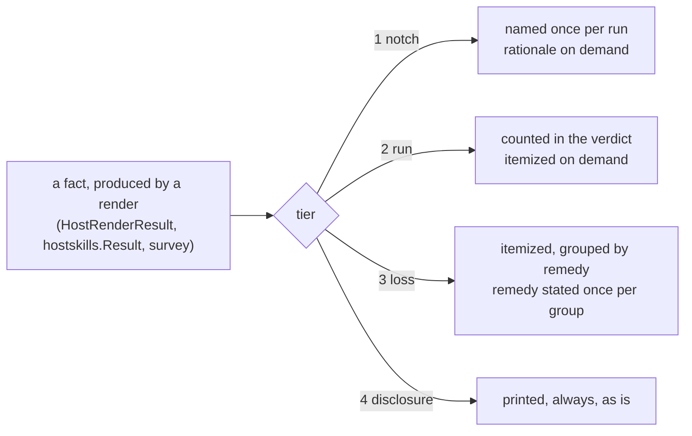

# One report, three readers — why `yolo host apply` says everything and tells you nothing

**Status:** DESIGN, 2026-09-10. Nothing built. Every measurement below was taken in this
development jail at `48f47e56` on 2026-09-10 by running `yolo apply --at host` in its default
observe posture (it writes nothing) and reading the code that produced each line.

> **In short.** The report has no author. Eleven files' worth of `Printf` calls each decide their
> own line, so the properties the maintainer is complaining about — repetition, no summary,
> rationale where the facts should be — are emergent, not chosen. Give every line a **report tier**
> (what kind of fact it states), and let the tier, not the emitter, decide whether it prints by
> default, once per run, or only on demand.

**Why it matters.** 277 lines for one home, of which about sixteen tell the reader something they
can act on. The same four-word fact — *fourteen of your skills move to the local pack* — takes 210
lines to say. A 40-word paragraph explaining why a `hook` means nothing off-container prints four
times, verbatim, in every home on every machine. And the launch stream mixes a security disclosure
that must never be hidden with eight `boot catalog:` lines that have been identical at every launch
for weeks — and persists the disclosure nowhere.

**The shape.** Three tiers — **notch facts**, **run facts**, **losses** — plus a fourth for the
launch, **disclosures**. A **verdict block** counts facts rather than loop iterations and leads with
losses. Each loss class states one remedy, once, in the scope it fixes.

**Cost.** Today's exhaustive report becomes the on-demand view; a flag has to carry it, and the
obvious one spends a vocabulary another design reserved ([OQ-RO2](#OQ-RO2)). The run-boot goldens
move under sign-off. The census test keeps its intent and loses its letter.

**Scope note.** Four sibling docs own adjacent ground and this one does not re-rule any of it:
color and glyphs are [`cli-visual-polish.md`](../plans/cli-visual-polish.md)'s (its additive
byte-parity rule is inherited whole); the change predicate and the launch gate are
[`host-apply-staleness.md`](../reference/host-apply-staleness.md)'s; the *remedy* for a scalar
overwrite is [`config-ownership-and-promotion.md`](config-ownership-and-promotion.md)'s; the
`--format json` standard is [`self-documenting-cli.md`](../reference/self-documenting-cli.md)'s,
and [§4.8](#48-machine-consumers) asks it one question.

**Start at [§4](#4-the-proposal--report-tiers)** — the tiers. [§2](#2-what-exists-today-measured)
and [§3](#3-the-diagnosis) are the evidence that they are the right cut.

**Needs your ruling:** [OQ-RO1](#OQ-RO1), [OQ-RO2](#OQ-RO2), [OQ-RO3](#OQ-RO3),
[OQ-RO4](#OQ-RO4), [OQ-RO5](#OQ-RO5).

**Reads with:** [`report-tiers-plan.md`](report-tiers-plan.md) (the implementation sketch —
incomplete while the questions are open), [`perf-logging.md`](../reference/perf-logging.md) (D14,
the policy this doc may be the first to spend),
[`information-at-the-point-of-need.md`](../reference/information-at-the-point-of-need.md) (the
principle [§4.6](#46-where-the-rationale-lives) applies in reverse).

---

## 1. Verdict, and the principles it rests on

The verdict: **the output is correct and complete, and that is the problem.** Every fact it states
is true; every line has a docstring defending it; the no-silent-skip invariant behind most of them
is right. What is missing is a *reader model* — a decision about who is looking and what they need
first — and without one, "complete" degenerates into "everything, at one indent level, in loop
order." The fix is not to delete facts. It is to classify them, and to let the classification
decide the rendering.

Six principles, cited by number below:

- **P1 — One fact, once.** A property of the *notch* is stated once per run. A property of the
  *pack set* is stated once per set. A per-destination fact is stated per destination only when
  it is a change or a loss.
- **P2 — Every loss names its remedy, in copy-paste form, and names the scope the remedy covers.**
  A loss with no remedy says so rather than borrowing a `⚠` it cannot cash. This is
  [OQ-CO2](config-ownership-and-promotion.md#13-decision-ledger)'s ruling — feedback belongs *at the point of
  the act* — taken seriously: the message at that point has to be good enough to carry the whole
  load, because nothing else will.
- **P3 — Facts and remedies by default; rationale on demand.** The *why* of a rule is for the
  person changing the rule, not the person meeting it
  ([`information-at-the-point-of-need.md`](../reference/information-at-the-point-of-need.md),
  *What about the reasoning?*).
- **P4 — Disclosures are never suppressible.** Progress and provenance may be compressed to a
  line, but the decision they report stays visible on every launch. A quiet mode that could hide
  the host-access banner would delete the one thing
  [OQ-TP9](trust-paths.md#-oq-tp9--is-the-fetched-pack-approval-prompt-a-gate-or-theatre--resolved-2026-09-04)
  kept when it deleted the approval gate.
- **P5 — No silent skip survives this.** The census invariant is *named*, not *itemized*: a kind
  the host notch refuses appears in the report, and appearing once is appearing.
- **P6 — Counts count what the reader cares about.** Files, keys, servers, skills — not the
  destinations a loop visited; and "in sync" means *compared and equal*, not *not compared*.

## 2. What exists today, measured

### 2.1 The stream, by line class

The command was `yolo apply --at host` (observe; `applyHost` is called with `write=false` without
`--assert` — [`apply.go:100`](../../internal/cli/apply.go#L100)). Exit 0. 277 lines on stdout plus
the one-line version banner on stderr, which is the 278 the maintainer counted. Every stdout line,
classified:

| Class | Lines | What it says | Varies with |
| :--- | ---: | :--- | :--- |
| Frame — header, count line, footer | 3 | `host apply  home … posture observe (dry-run)`; `8 in sync, 76 would change`; `observe only — nothing written…` | the home |
| Kind refusals | 19 | `state refused — state names a jail-writable home subtree …` (state ×6, hook ×4, loophole ×4, reads-host ×2, env, provider, profile ×1) | **nothing** — the text is a property of the notch |
| Autonomy posture | 5 | `autonomy   guarded posture — permission prompts stay ON; folded into …` | **nothing** — one per pack, same text |
| Program present | 5 | `program    ✓ claude  present at …` | the host's dep state |
| Surface verdicts | 13 | `would render` ×6, `unchanged` ×1, `skipped: …` ×6 (one config, five briefings) | the home |
| `⚠` children of a surface | 9 | `would overwrite your existing value for: …` ×4 (7 keys); `would damage your existing entry: …` ×3 (9 entries — the **same three MCP servers** in three agents); `comments are preserved, EXCEPT …` ×1; `skipped ${workspace}-keyed …` ×1 | the home |
| Skills, composed-from | 5 | `skills     ~/.claude/skills composed from: claude` | the pack set |
| Skills, adoption preview | 72 | a header, **70 paths** (14 skills × 5 dirs) yolo did not write, a 60-word explanation | the home |
| Skills, per-entry preview | 70 | `would move to your local pack` ×14, `would union into your local pack` ×56 | the home |
| Tail — `would change` list | 76 | 6 config surfaces + **70 skill destinations** | the home |

Two readings of that table carry the doc. **Twenty-four lines say nothing that could differ between
two machines.** And **210 lines state one fact** — *fourteen skills in five agent directories are
yours; an `--assert` moves them into the local pack and composes them back into all five* — at three
granularities (paths, per-entry actions, changed destinations), each complete on its own.

### 2.2 Where the lines come from

There is no report object. [`richtext.Printer`](../../internal/richtext/richtext.go#L100) has two
methods, `Print` and `Printf` — a line printer with color, deliberately: it exists to end the
strip-always duplication [`cli-color-audit.md`](../plans/cli-color-audit.md) closed, not to know
what a report is. Every structural property of the output is therefore a property of the loops
that call it (all anchors 2026-09-10):

- **The refusal text is per kind, the print is per contribution.** The seven reasons live in
  [`fieldset.go:38-127`](../../internal/render/fieldset.go#L38-L127) keyed by kind; the loop at
  [`apply.go:381-386`](../../internal/cli/apply.go#L381-L386) runs over
  `p.Decl.Contributions()` for each pack, so a pack declaring `state` twice earns two identical
  paragraphs, and `hook` — declared three times by `claude` and once by `agy` — earns four.
- **The autonomy line is a property of the notch, printed per pack**
  ([`apply.go:397-403`](../../internal/cli/apply.go#L397-L403)). Its value comes from
  `render.Host(...).Profile().AgentAutonomy`, which cannot differ between packs in one run.
- **The MCP remedy is a literal in the per-surface `⚠`**
  ([`apply.go:466-468`](../../internal/cli/apply.go#L466-L468)), so three surfaces produce three
  copies — and this copy omits the two words the confirmation prompt's copy has, *"reaching every
  agent"* ([`apply.go:615-617`](../../internal/cli/apply.go#L615-L617)).
- **The skills section reports every entry it visits**
  ([`printSkillResult`, `applyhostskills.go:366-381`](../../internal/cli/applyhostskills.go#L366-L381)),
  and reports the adoption set as a path list
  ([`reportSkillAdoptions`, `:294-310`](../../internal/cli/applyhostskills.go#L294-L310)).
- **The one cross-cutting accumulator holds no losses.** The survey
  ([`hostapplysurvey.go:20-45`](../../internal/cli/hostapplysurvey.go#L20-L45)) records kind,
  surface and path per changed destination plus an in-sync count — exactly what the launch gate
  needs, and nothing the operator's question ("would I lose anything?") needs.
- **The roll-up is printed last, on purpose**
  ([`apply.go:536-545`](../../internal/cli/apply.go#L536-L545)): *"so the last two lines read as
  verdict-then-posture."* It landed on 2026-09-03 (`015527be`), which is why the maintainer's
  "no summary and no counts" is half right — there is a count, and it is the wrong count
  ([§3.4](#34-the-count-counts-the-loop-not-the-facts)).

### 2.3 What the tests pin

This matters because it bounds what a redesign may change without a golden update. Checked
2026-09-10 across `internal/cli/applyhost*_test.go` and `hostapply*_test.go`:

- **Substrings, not layout.** The pins are action words and kind names — `would change`,
  `0 would change`, `unchanged`, `would archive`, `skipped (yours)`, `no effect`, `refusing to
  launch`, the absence of `[y/N]` in observe. Nothing pins indentation, ordering, or a full line.
- **The census test pins presence, not multiplicity.**
  [`applyhostcensus_test.go:57-63`](../../internal/cli/applyhostcensus_test.go#L57-L63) asserts
  `strings.Contains(report, string(kind))` for every kind in the closed set — its stated intent is
  that a kind is *"rendered, refused, or named as unimplemented, never silently skipped."* One line
  naming seven kinds satisfies it. Nineteen lines are not what it asks for.
- **Nothing pins the refusal text.** The three phrases `off-container the home simply`, `hooks are
  jail provisioning` and `only client is a container` occur in no test file.
- **Two count pins on the skills preview**, both against a one-skill fixture:
  [`applyhostskillscompose_test.go:353-361`](../../internal/cli/applyhostskillscompose_test.go#L353-L361)
  wants exactly one `would move to your local pack` line and one `would union into your local pack`
  line. A grouped rendering that says *1 skill would move to your local pack* still passes; a
  grouped rendering of fourteen skills is a shape the fixture cannot see, which is a hole the sketch
  names.

### 2.4 The launch stream, both halves

The launch prints from two processes, and only one half is ever written down.

**The host launcher's half** goes to the terminal and nowhere else — no log sink exists for it
(checked 2026-09-10: `/ctx/host-yolo-logs` holds daemon, relay and crossing logs and contains
none of the banner phrases; `<workspace>/.yolo/host-perf.log` records the launch *spans*, not the
text). The lines that are unconditional on a fresh `yolo -- bash`, in order
(verified against the tree 2026-09-10):

1. `yolo-jail <version> | <os>/<arch> | host` — the version banner, stderr, every subcommand
   ([`startupbanner.go:49-60`](../../internal/cli/startupbanner.go#L49-L60)). The **only line
   with a suppression knob**: `YOLO_NO_BANNER`
   ([`banner.go:49-55`](../../internal/banner/banner.go#L49-L55)).
2. `Flake source: <path> (<what selected it>)` — stderr, dim
   ([`probes.go:44-50`](../../internal/cli/run/probes.go#L44-L50)). Its docstring is its
   reason: *"naming what the next few gigabytes are being built from while there is still time to
   Ctrl-C."* [`AGENTS.md:210-211`](../../AGENTS.md#L210-L211) adds the developer's reason: read
   it before believing a nested green.
3. nix build progress — `Evaluating flake...`, `Building …`, `Fetching …` — **stdout**
   ([`image.go:120-130`](../../internal/image/image.go#L120-L130)).
4. `Jail binaries: <dir> (prebuilt, from the flake bundle | built from the flake source)` —
   stderr, dim ([`run.go:777`](../../internal/cli/run/run.go#L777)).
5. Image delivery, when it happens — `Image load needed: …`, `Store write: …`, `Copied image: …`,
   `Done: loaded image` — **stdout** ([`autoload.go:550-655`](../../internal/image/autoload.go#L550-L655)).
6. `Jail: <name> | podman` — stderr, raw `Fprintln`, not the printer
   ([`run.go:1619-1626`](../../internal/cli/run/run.go#L1619-L1626)), whose docstring says
   `YOLO_NO_BANNER` *"does NOT silence this line."*
7. The disclosures, when a pack claims anything: `Pack environment this launch:` + one line per
   read claim ([`run.go:566-572`](../../internal/cli/run/run.go#L566-L572)); `This launch runs
   pack code on your machine:` + one line per exec claim, printed *before* the spawn
   ([`packloopholes.go:269-276`](../../internal/cli/run/packloopholes.go#L269-L276)); the
   host-cache alias ([`hostcasalias.go:122-131`](../../internal/cli/run/hostcasalias.go#L122-L131));
   the host-loopback verdict; GPU/USB/KVM passthrough. All stderr.
8. Then the entrypoint's half.

**The entrypoint's half** is the one that is persisted: `attachBootLog` tees `e.Stderr` to the
terminal *and* `<workspace>/.yolo/boot.log`
([`bootlog.go:96-103`](../../internal/entrypoint/bootlog.go#L96-L103)), and gives the boot a
**second writer**, `e.LogOnly`, for lines that belong in the log and not on the terminal
([`env.go:54-70`](../../internal/entrypoint/env.go#L54-L70)) — *"a healthy jail's reachability
witness says nothing, and 'ran and was silent' then reads identically to 'never ran'."* This jail's
`boot.log` from the 2026-09-10 launch, in shape:

```text
=== yolo entrypoint 2026-09-10T10:26:04-0400 ===
  YOLO_VERSION=…  YOLO_RUNTIME=podman  YOLO_HOST_LOOPBACK=requested
boot catalog: npm package installed but not declared by any selected pack, preset or LSP recipe: @github/copilot
boot catalog: … : @openai/codex        (… six more, one per orphan — eight lines)
~/.claude/settings.json: 7 keys from captured in-jail edits (yolo config diff claude)
… (four more, one per surface with captured edits)
shared_credentials[claude]: … already symlinked to shared
  cgroup delegate: not available (no host daemon socket)
reachability: 1/1 enabled service(s) reachable, disposition=requested      ← log only
=== boot complete, handing over ===
```

The `boot catalog:` lines reach the terminal (they go through `e.warn`,
[`catalog.go:149-158`](../../internal/entrypoint/catalog.go#L149-L158)), and have named the same
eight packages at every launch of this jail since they were installed — the informational half of
[OQ-PD4](program-delivery.md#decision-ledger), which ruled that dropping a pack never deletes its
program, so the catalog reports and nothing acts. They are, in this doc's vocabulary, notch-facts
with a state dependency: true until the user does something, and repeated until then.

Three more things the inventory found, each a finding on its own:

- **There is no quiet mode.** No `--quiet`/`-q` exists in `internal/cli` or `internal/cli/run`;
  `--verbose` and `--timing` only add output. Two of the unconditional lines above carry
  docstrings arguing they must stay unconditional (items 2 and 6); the version banner carries three
  properties it calls *"not negotiable"* — stderr, no isatty gate, one hatch
  ([`banner.go:24-34`](../../internal/banner/banner.go#L24-L34)).
- **`NO_COLOR` is honored nowhere.** The string does not occur in `internal/` or `cmd/`
  (checked 2026-09-10). The color gate is TTY-only (`colorForWriter`,
  [`config.go:143-146`](../../internal/cli/config.go#L143-L146);
  [`console.go:29-31`](../../internal/cli/run/console.go#L29-L31)).
  [`cli-visual-polish.md`](../plans/cli-visual-polish.md) states *"honor `NO_COLOR`"* as an
  invariant. It is that plan's to close; noted here because a report redesign will be the moment
  someone tests a pipe.
- **The stream split is not a rule.** `warnIfNoPacks` states the rule — *"Stderr, like every other
  launch notice"* ([`run.go:531-539`](../../internal/cli/run/run.go#L531-L539)) — and the
  notices follow it, but the nix build progress, the image delivery lines, the config-change diff
  and its `[y/N]` prompt, the flock waiting notice and the GPU/USB disclosures go to **stdout**.
  Out of scope to fix here; in scope to say, because a machine-readable mode
  ([§4.8](#48-machine-consumers)) would meet it first.

## 3. The diagnosis

### 3.1 Three readers, one density

| Reader | Came to learn | Needs first | Gets, today |
| :--- | :--- | :--- | :--- |
| **The operator** — typed the command, or is about to type `--assert` | *Will this hurt me, and did it work?* | losses, then a verdict | the verdict at line 200 of stdout, counting 70 skill destinations as changes; the losses indented under surfaces, between refusals |
| **The auditor** — wants to know exactly what an `--assert` writes | every destination and every key | the per-destination detail | gets it, interleaved with 24 lines that are true of every home |
| **The diagnoser** — something surprising is in the home, or was refused | why *this* thing happened | the detail for one destination, plus the rationale | gets rationale for seven kinds they never asked about; for a launch, gets nothing persisted from the launcher's half |
| **The machine** — an agent, the CLI's primary operator per [`self-documenting-cli.md`](../reference/self-documenting-cli.md) | the survey, structured | JSON, or an exit code | prose to scrape; exit 0 whether or not losses are pending |

One stream cannot serve the first three at one density, and today's density is the auditor's. That
is the wrong default: the auditor is the reader who will ask for more, and the operator is the one
who will stop reading.

### 3.2 Invariant text, printed as news

Twenty-four of the 277 lines would be byte-identical in any home on any machine that selects the
same packs — and the seven refusal texts would be identical regardless of which packs, since the
text is keyed by kind. They are good text: each is a correct, argued sentence about why a kind has
no meaning at the host notch. They are also **rationale** in P3's sense, and rationale is what the
diagnoser wants once and the operator never wants. Printed as they are, they cost the reader a
paragraph per contribution to learn that nothing happened.

The census invariant that motivates them ([§2.3](#23-what-the-tests-pin)) is satisfied by naming.
The rationale is one flag away ([§4.6](#46-where-the-rationale-lives)).

### 3.3 Repetition is structural

Four repetition axes, each a loop boundary that became a line boundary:

| Axis | Instance | Lines | The fact, stated once |
| :--- | :--- | ---: | :--- |
| per **contribution** | `state refused —` ×6, `hook` ×4, `loophole` ×4 | 19 | *seven kinds do not apply at the host notch: env, hook, loophole, profile, provider, reads-host, state* |
| per **pack** | `autonomy   guarded posture — …` ×5 | 5 | *autonomy is guarded here: permission prompts stay on* |
| per **agent** | `would damage your existing entry: mcp_servers.chrome-devtools (dropped …), … (yolo owns this table; declare the entry under mcp_servers to keep it)` ×3 | 3 | *three MCP servers you added by hand would be dropped from codex, agy and opencode; declaring each once under `mcp_servers` keeps it in every agent* |
| per **destination** | 70 paths, then 70 per-entry actions, then 70 `would change skills` | 210 | *fourteen skills in five agent dirs are yours; an `--assert` moves them into your local pack and composes them back into all five* |

The third row is the one the maintainer singled out and the one with the most at stake: the three
lines read as three problems with three fixes, when they are one problem with one fix, and the fix
is a **single user-scope key** — which the report's own confirmation prompt knows
([`apply.go:615-617`](../../internal/cli/apply.go#L615-L617), *"reaching every agent"*) and its
per-surface line forgets.

### 3.4 The count counts the loop, not the facts

`8 in sync, 76 would change` is the roll-up the change predicate added
([`hostapplysurvey.go:66-71`](../../internal/cli/hostapplysurvey.go#L66-L71), `015527be`). It is
right for the launch gate, which asks a yes/no question, and wrong for a human, three ways:

- **It counts destinations.** 70 of the 76 are the fourteen skills, once per agent directory.
  The operator reads "76 things will change"; six files will.
- **It has no loss count.** Seven of the user's values would be overwritten in three files; nine
  MCP entries (three servers) would be dropped. Neither number appears anywhere.
- **"In sync" includes the skipped.** A skipped or refused surface has a path and no pending
  change, so `note` counts it as in sync
  ([`hostapplysurvey.go:47-58`](../../internal/cli/hostapplysurvey.go#L47-L58)) — by design,
  and the design's reason is sound for the gate (*"a launch gate stop on a condition applying
  cannot fix"*). Six of the eight were never compared. For a human, *in sync* is a claim the
  render did not make.

The frame around it is the maintainer's "cryptic": `host apply  home /home/agent  posture observe
(dry-run)` says *posture* to a reader who has never met the word, and the only sentence in the
report that says nothing was written is the last one.

### 3.5 Actionability audit

P2 applied to every warning class the report can emit (all 2026-09-10):

| Line | Names the fix? | Names where? | Names the scope? | Verdict |
| :--- | :--- | :--- | :--- | :--- |
| `⚠ would damage your existing entry: … (declare the entry under mcp_servers to keep it)` [`apply.go:466`](../../internal/cli/apply.go#L466) | key, yes | no file named | no — the prompt's copy says *"reaching every agent"*, this one does not | **half** |
| `⚠ would overwrite your existing value for: <keys>` [`apply.go:455`](../../internal/cli/apply.go#L455) | **no** | — | — | **none, and honestly so**: no remedy exists at this notch. A config-overlay folds *below* the owner's managed layer, which *"still wins a conflict"* ([`apply.go:434-436`](../../internal/cli/apply.go#L434-L436)), so the user cannot re-declare their value. The remedy is [`config-ownership-and-promotion.md`](config-ownership-and-promotion.md)'s to build; until then the line should say *these keys are managed by the pack* rather than wear a `⚠` that implies a fix |
| `⚠ comments are preserved, EXCEPT above <key> …` [`apply.go:488`](../../internal/cli/apply.go#L488) | n/a — an inherent cost | — | — | fine as a fact; 30 words |
| `⚠ yolo COMPOSES these skills directories … Each one MOVES into <local pack> …` [`applyhostskills.go:294-310`](../../internal/cli/applyhostskills.go#L294-L310) | yes — *add it to the local pack instead* | yes | yes | **good text, 72 lines** |
| `<kind> no effect — <pack> carries <kind> content, and no pack in packs names a <kind> destination (select … or declare into …)` [`apply.go:742`](../../internal/cli/apply.go#L742) | yes, both branches | yes | yes | good; 60 words on one line |
| `<kind> refused — <rationale>. Launch a jail to run it` [`fieldset.go:56-58`](../../internal/render/fieldset.go#L56-L58) | offers a remedy for a problem the user does not have | — | — | **not a warning** — a notch fact wearing `refused` |
| `yolo host: refusing to launch <bin> — … Apply it first: yolo host apply --assert … Or approve THIS launch only: <VAR>=1 <bin> …` [`hostapplygate.go:257-275`](../../internal/cli/hostapplygate.go#L257-L275) | two, copy-paste | the key **and** its file | yes | **the model** — every other line should read like this |
| `boot catalog: <pkg> installed but not declared by any selected pack …` [`catalog.go:149-158`](../../internal/entrypoint/catalog.go#L149-L158) | no, by ruling ([OQ-PD4](program-delivery.md#decision-ledger)) | — | — | a fact, correctly not a warning; eight lines at every launch |

The pattern: the lines written most recently, under the most pressure (the launch gate's refusal,
the skills adoption), meet P2. The lines that fire most often do not, and the `overwrite` line
cannot — which the report should say instead of implying otherwise.

### 3.6 The launch stream has the same shape, plus a line that must never move

The launch is a *stream* — it narrates a process as it happens — so "where the summary goes" does
not apply. Everything else does. The ten unconditional lines
([§2.4](#24-the-launch-stream-both-halves)) split cleanly into the tiers
[§4.1](#41-the-tiers) names: provenance (which flake, which binaries, which jail), progress (the
build, the load, the provisioning), disclosures (what host access this launch has), and the
entrypoint's warnings. The `boot catalog:` lines are the launch's kind-refusals: true, invariant
until the user acts, repeated until then.

The tension the maintainer named is real and it is P4: a disclosure is the *entire* boundary now.
`packhostgrants.go` says so in as many words — *"the boundary today is DISCLOSURE, not consent"*
([`packhostgrants.go:36-42`](../../internal/cli/run/packhostgrants.go#L36-L42)) — and the exec
disclosure is wired so that the spawn is reachable through exactly one already-disclosed path
([`packloopholes.go:277-289`](../../internal/cli/run/packloopholes.go#L277-L289)). Any density
control for the launch has to be built *around* those lines, never over them.

And the diagnoser's problem is worse here than at apply: the launcher's half of the stream is
gone the moment it scrolls. The entrypoint solved this for its half with `boot.log`; the launcher
never did.

## 4. The proposal — report tiers

### 4.1 The tiers

A **report tier** *(coined here)* is the class of fact a line states, assigned where the fact is
produced — in the result structs and the survey — and consumed by the printer to decide *whether*
the line prints, *how many times*, and *under which flag*. It is **not** a log level: a level is a
property the emitter picks in the moment ("this feels like a warning"), which is exactly how the
current output came to be; a tier is a property of the fact, and two emitters stating the same
fact get the same tier. It is **not** severity either: a kind refusal is a refusal and sits in tier
1; an MCP entry loss is a warning and sits in tier 3.

| Tier | Definition | Default rendering | On demand adds |
| :--- | :--- | :--- | :--- |
| **1 — Notch facts** | True of this notch regardless of the home: kind refusals, the autonomy posture, `program` presence lines | **one line per run** naming what does not apply and the posture | the rationale, one line per kind |
| **2 — Run facts** | Vary with the home but need no action: in-sync/skipped/unchanged surfaces, composed-from, the inferred-destination lines, would-render surfaces | **counted in the verdict**; a `would render` config surface is itemized (there are few, and they are the auditor's core) | every destination, today's per-entry lines |
| **3 — Losses** | Something of the user's is replaced, dropped, moved or archived; or the apply refuses | **always itemized, grouped by remedy**, each group carrying its remedy once | the per-destination expansion of each group (the 70 paths) |
| **4 — Disclosures** (launch only) | Host access this launch has: pack read/exec claims, the cache alias, passthrough, the loopback verdict | **always, unchanged**, never grouped or compressed | nothing — there is no more to say |



The fatal refusals — an `agents` selector naming nobody, a doubly-owned surface, a name claimed
twice ([`apply.go:296-340`](../../internal/cli/apply.go#L296-L340)) — are tier 3 in shape and
already right: they itemize, they name the fix, they exit 1 before anything renders. Nothing here
touches them.

### 4.2 The default view

What the operator sees with no flag, in order, for the measured home. **The wording below is the
implementer's to improve; the content, grouping and order are specified.** A sketch, not a golden:

```text
host apply — observe (dry run) into /home/agent; nothing is written

  claude/settings   would change   ~/.claude/settings.json
    replaces 3 of your values: permissions.additionalDirectories, permissions.defaultMode,
      skipDangerousModePermissionPrompt   (managed by the claude pack)
  pi/settings       would change   ~/.pi/agent/settings.json
    replaces 1 of your values: defaultProjectTrust   (managed by the pi pack)
  codex/config      would change   ~/.codex/config.toml
    replaces 2 of your values: approval_policy, sandbox_mode   (managed by the codex pack)
    drops the comment above approval_policy — its value changes
  agy/mcp · agy/settings · opencode/config   would change

  ⚠ 3 MCP servers you added by hand would be dropped from codex, agy and opencode:
      chrome-devtools, sequential-thinking, tavily
    → keep them in every agent: declare each under `mcp_servers` in ~/.config/yolo-jail/config.jsonc

  ⚠ 14 skills in 5 agent skill dirs are yours, not yolo's. An --assert moves them into your
    local pack (~/.config/yolo-jail/local/skills) and composes them back into all 5 dirs:
      brainstorming, configuring-the-jail, design-doc, developing-yolo-jail, diagnosing-the-jail,
      headful-browser, implementation-plan, new-project, open-source-project, research, roadmap,
      system-doc, user-stories, vantage-docs
    → to keep one out of yolo's hands, remove it from the agent dir before applying

  6 config files would change · 14 skills would move · 2 destinations compared and unchanged
  7 of your values replaced · 3 MCP servers dropped · 7 kinds not applicable at the host notch
  observe only — nothing written. `--assert` applies; `--verbose` lists every destination and why.
```

Twenty-four lines against 277, and every one of the sixteen actionable facts is in it. Order,
and why:

1. **Header** — posture in plain words (*observe*, *dry run*, *nothing is written*), not
   `posture observe (dry-run)`. The home path stays: it is the one fact the in-jail reader needs
   to notice (this command renders into *this* jail's home when run from inside one).
2. **Changed config surfaces, each with its own losses.** A scalar replacement belongs to one
   surface and stays under it. Surfaces with no loss share a line.
3. **Cross-cutting losses, grouped by remedy** ([§4.4](#44-losses-and-the-remedy-contract)).
   The MCP group and the skills group are one group each because each has one remedy.
4. **The verdict block** ([§4.3](#43-the-verdict-block)).
5. **The posture footer**, which now also names the on-demand flag.

The verdict stays *last* — the existing rationale holds (*verdict-then-posture* is where the eye
lands when a command returns), and at this length the top-versus-bottom argument is moot. Tier 1
facts appear only as a count in the verdict; tier 2 only as counts and the changed-surface lines.

### 4.3 The verdict block

Two lines, and what each counts (P6):

| Count | Unit | Source | Why this and not the loop count |
| :--- | :--- | :--- | :--- |
| config files that would change | files | the survey's `config` changes | six, not 76 |
| skills that would move / union / archive | skills, not destinations | the skills results, deduplicated by name | fourteen, not seventy |
| destinations compared and unchanged | destinations | `WouldChange == false` **and** the render compared content | "in sync" today includes six skipped surfaces; the skipped are named separately on demand |
| values of yours replaced | keys, with the file count | `HostRenderResult.Overwrites` | the operator's first question |
| MCP entries dropped | servers × agents, said as *N servers from M agents* | `HostRenderResult.EntryLosses` | the confirmation gate's own subject |
| kinds not applicable at this notch | kinds | `HostFields().Refuse` over the declared kinds | P1: once |
| first apply into this home | flag | `HostRenderResult.FirstApply` | it is what turns the losses above into a prompt on `--assert` |

The survey grows to carry the loss counts; today it cannot state any of the last four
([`hostapplysurvey.go:20-45`](../../internal/cli/hostapplysurvey.go#L20-L45)). The launch gate keeps
reading the same struct — one collector, both consumers, as its docstring insists.

### 4.4 Losses, and the remedy contract

Every tier-3 group states: **what** is lost, **whose** it is, **where**, and **the remedy in a form
that can be pasted**, naming the scope the remedy covers. Grouping is by *remedy key* — the config
key, the local-pack path, or "none" — never by text similarity. The classes:

| Loss class | Group by | Remedy line | Scope word |
| :--- | :--- | :--- | :--- |
| MCP entry dropped | the entry name, across agents | *declare each under `mcp_servers` in `<user config path>`* | *in every agent* |
| skill adopted (moved/unioned/archived) | the skill name, across dirs | *remove it from the agent dir before applying* to opt one out; otherwise nothing — the move is the remedy | *all N dirs* |
| your value replaced by a managed key | the surface | **none exists**: the line states *managed by the `<pack>` pack* and stops. No `⚠`. The remedy is [`config-ownership-and-promotion.md`](config-ownership-and-promotion.md)'s; when it ships, this line names its key | — |
| comment dropped above a changed key | the surface | none possible; stated as a fact under the surface | — |
| first apply would replace a value yolo never asserted | the home | the existing `[y/N]` prompt on `--assert`, unchanged ([`confirmHostLosses`, `apply.go:577-619`](../../internal/cli/apply.go#L577-L619)); in observe, the flag in the verdict | — |
| the apply refuses (selector, collision, unresolvable pack) | as today | as today — these already meet P2 | — |

Two forbidden things. **The user's existing value is never printed**, in any view: the
host-render privacy ruling refused capture because a config value can be a credential
([`host-render-target.md`](host-render-target.md), the `capture`/`reset` refusal), and a terminal
transcript gets pasted into bug reports. The *incoming* value is the pack's declaration and may be
shown on demand; the implementer decides whether it earns the space. And **no default view may
omit a loss**: grouping compresses the *lines*, never the *set* — every dropped entry name and
every adopted skill name appears in the default view, in its group.

### 4.5 Detail on demand

The on-demand view is **today's report, reorganized under the same headings**: every tier-1 line
with its rationale, every tier-2 destination itemized (the skipped surfaces and why, the
composed-from lines, the `program` probes, the inferred destinations), every tier-3 group expanded
to its per-destination lines (the 70 paths, the 70 actions). Nothing today's output states is
lost; it moves behind a flag. Which flag is [OQ-RO2](#OQ-RO2), and whether the default is the
compressed view at all is [OQ-RO1](#OQ-RO1).

The launch gate's pointer — *"`yolo host apply --dry-run` shows exactly what changes in each"*
([`hostapplygate.go:236`](../../internal/cli/hostapplygate.go#L236)) — is written against the
current default and moves with it; the sketch tracks it.

### 4.6 Where the rationale lives

The seven kind-refusal paragraphs are the best-argued text in the report and the least often
needed. P3 puts them on demand: the tier-1 line names the kinds and the flag; the on-demand view
prints each kind's reason **from `HostFields().Refuse`** — the same string the code decides by, so
it cannot drift (the point-of-need principle's own argument: *"a message emitted BY the mechanism
cannot drift from it"*). `yolo host apply --help` gains one sentence pointing at the flag, which
keeps [`self-documenting-cli.md`](../reference/self-documenting-cli.md)'s requirement 6 (concepts
reachable from the CLI) without retyping seven paragraphs into help text that would rot.

Rejected: moving the reasons into `config-ref` or a pack doc. Retyped text is the drift this
codebase keeps finding; the mechanism already has the sentence.

### 4.7 The launch stream under the same tiers

The launch keeps its stream shape — a process narrated in time — and adopts the tier vocabulary
without the report layout. What changes and what does not, line by line
([§2.4](#24-the-launch-stream-both-halves)):

| Line | Tier | Treatment |
| :--- | :--- | :--- |
| version banner; `Flake source:`; `Jail binaries:`; `Jail:` | provenance (a decision) | **unchanged.** Each answers a different question and two carry docstrings for staying. The only edit worth making is cosmetic and belongs to the polish plan: three vocabularies on three adjacent lines |
| nix build, image delivery, `📦 Provisioning tools...`, `↳ …`, `⚡ Executing:` | progress | **unchanged**; a stream needs its progress |
| pack read/exec disclosures, cache alias, loopback verdict, passthrough | **disclosure** | **unchanged, and un-gate-able by construction** (P4) |
| the config-change diff and prompt | disclosure (approval) | unchanged — [`config-safety.md`](../reference/config-safety.md)'s |
| `boot catalog: …` ×8 | notch fact with state | **one line**: *8 installed programs are declared by no selected pack (boot.log lists them; `programs.autoprune` removes them)* — the list already lands in `boot.log` through the same tee. [OQ-RO3](#OQ-RO3) asks whether even this is yours to compress |
| `<file>: N keys from captured in-jail edits (yolo config diff <agent>)` ×5 | run fact **with a remedy** | unchanged — it already meets P2, and five surfaces are five facts |
| the reachability witness, the cgroup line, credential symlinks | run facts / disclosures | unchanged |
| warnings and refusals | tier 3 | unchanged; the hatch notices already say what they suppress (*"rather than going quiet"*, [`providerpreflight.go:42-46`](../../internal/cli/run/providerpreflight.go#L42-L46)) |

**Persist the launcher's half.** The entrypoint's `boot.log` tee is the model and D2 of
[`perf-logging.md`](../reference/perf-logging.md) is the precedent for *where*: per workspace,
beside `boot.log`, so both halves of one launch sit in one directory. The launcher appends every
line it prints to `<workspace>/.yolo/launch.log`, with the same header shape `boot.log` uses and the
same retention the perf log has. D2's caveat is inherited whole — the directory is inside the live
workspace bind, so a jail can write the host's record — and so is D2's named remediation (the
host-global logs dir) for the day it is needed. Decided by precedent, not opened as a question.

**No `--quiet` for the launch.** The compression above is the whole density control; a flag that
could hide a disclosure is refused by P4, and a flag that could hide only progress would save four
lines. [OQ-RO3](#OQ-RO3) puts this to the maintainer because the inventory's docstrings show three
authors independently deciding their line is unconditional, which is a policy being made one line at
a time.

**Share the vocabulary, not the layout.** The tier names, and the glyph/color each maps to (from
[`cli-visual-polish.md`](../plans/cli-visual-polish.md)'s semantic table — additive, byte-parity
preserved), become one small helper above `richtext` that both the apply report and the launch
notices call. The launch does not get a verdict block; the report does not get a progress stream.

### 4.8 Machine consumers

[`self-documenting-cli.md`](../reference/self-documenting-cli.md) requirement 7: *anything that
reports state must emit machine-readable output on request*; and its non-licence: *an acting verb
refuses the flag rather than growing a second output mode.* `yolo host apply` is an acting verb
whose **default posture is a state report** — it writes nothing and its whole output is "what would
change." The standard did not anticipate a verb that is both, and its own rationale (agents are the
primary operators; in-jail agents cannot read the host by hand) argues for the report half.

If [OQ-RO4](#OQ-RO4) says yes: the document is the survey — destinations with tier, action and
path; losses with class, names and remedy key; the counts of [§4.3](#43-the-verdict-block); the
first-apply flag — via the existing `parseOutputFormat` front end
([`outputformat.go`](../../internal/cli/outputformat.go)), both spellings. `--assert --format json`
**refuses** (exit 2, stdout empty), which is requirement 3's shape and requirement 7's non-licence
applied to the half that acts. *"Nothing to report must still be a document"*: zero packs emits a
document with empty lists and the retire passes' results.

The exit code is a separate question ([OQ-RO5](#OQ-RO5)). Today observe exits 0 whatever it finds,
and a test pins that ([`applyhostmcp_test.go:218-236`](../../internal/cli/applyhostmcp_test.go#L218-L236)).
`config drift` is the house precedent for a report verb whose exit code carries its finding —
0 in sync, 3 drifted, 4 no baseline ([`config.go:53`](../../internal/cli/config.go#L53)).

## 5. Completeness — the holes, walked

- **Zero packs.** Today the branch prints one dim line, runs the retire passes, and returns at
  [`apply.go:201`](../../internal/cli/apply.go#L201) — *before* the roll-up at `:540`, so an empty
  `packs` observe ends with no count and no *nothing written* footer. Proposed: the verdict block
  and footer print on every observe, this branch included, with zero counts; the retire passes'
  lines are tier 3 and stay itemized.
- **A home with nothing to change.** Default view: header, a one-line verdict (*everything in
  sync · N kinds not applicable*), footer — three lines. On demand: today's output.
- **One loss.** A group of one; the same shape.
- **Many packs.** The tier-1 line lists kinds, not packs; its length is bounded by the kind set.
- **Long name lists.** A group lists up to 20 names inline and then *(and K more — `--verbose` lists
  all)*. Names, not characters, are the unit.
- **Duplicate remedies across groups.** Two groups with the same remedy key merge; two with the
  same *text* do not.
- **A pack fails to render.** Its error stays on stderr and sets rc 1
  ([`apply.go:421-425`](../../internal/cli/apply.go#L421-L425)); the verdict adds *1 pack failed
  to render (see stderr)*, and that pack's surfaces are absent from every count.
- **The apply refuses before rendering.** Unchanged: the refusal lines and exit 1, no verdict.
- **Prompts.** Unchanged, including fail-closed on nil/EOF stdin. Observe never prompts.
- **Ordering and concurrency.** One process, one pass, sequential; the per-home lock is
  [`host-apply-staleness.md`](../reference/host-apply-staleness.md)'s and is untouched. Two
  concurrent applies are its problem, not this doc's.
- **Defaults, with units.** Default view: compressed. On-demand flag: off. JSON: off. Name cap:
  20 names. Retention of `launch.log`: the perf log's. `YOLO_NO_BANNER`: unchanged, one line.
- **Trigger.** Every invocation; nothing is timed or cached.
- **Non-TTY and pipes.** Color is TTY-gated and stays so; the bytes minus ANSI are identical on a
  TTY and a pipe (the additive rule). `NO_COLOR` remains the polish plan's gap. Prompts fail
  closed. JSON, if ruled in, is stdout-only and ANSI-free, with the version banner on stderr where
  it already is.
- **Existing state.** No file on disk changes shape. Tests: the census test passes on the letter
  (every kind named) and the intent; the survey tests pass (`would change`, `0 would change` are
  kept in the verdict); the one-skill count pins pass; the run-boot goldens are untouched unless
  the `boot catalog:` compression lands, which is a sign-off golden update per the polish plan's
  frozen-bytes rule.
- **One writer.** The survey is the only thing that knows the counts; the printer reads it. No
  emitter computes its own total.
- **Forbidden.** Never suppress a tier-4 line under any flag. Never print a user's existing config
  value. Never let grouping drop a name from the default view. Never change what observe *writes*
  (nothing). Never change observe's exit code unless [OQ-RO5](#OQ-RO5) says so.
- **What done looks like.** For the measured home: the default report is under thirty lines and
  contains every dropped entry name, every adopted skill name and every replaced key; every `⚠`
  names a remedy or states there is none; the on-demand view contains every fact today's 277 lines
  contain; an in-sync home reports in three lines; a launch prints its disclosures byte-identically
  to today; after a launch, `<workspace>/.yolo/launch.log` holds the launcher's lines.

## 6. What this does not propose

- **Not color or glyphs.** [`cli-visual-polish.md`](../plans/cli-visual-polish.md) owns them; the
  tier→style mapping proposed in [§4.7](#47-the-launch-stream-under-the-same-tiers) is a consumer
  of its semantic table, not a change to it.
- **Not the change predicate, the survey's gate semantics, or the launch gate's dispositions.**
  [`host-apply-staleness.md`](../reference/host-apply-staleness.md) owns them; the survey grows
  fields, it does not change what `Changes()` means.
- **Not a remedy for managed-key overwrites.** There is none at this notch today
  ([§3.5](#35-actionability-audit)); building one is
  [`config-ownership-and-promotion.md`](config-ownership-and-promotion.md)'s design.
- **Not a change to observe/assert semantics, the confirmation prompts, or what is written.**
- **Not a `--quiet` for `yolo host apply`.** The default *is* the quiet view.
- **Not [OQ-PD4](program-delivery.md#decision-ledger).** The boot catalog stays informational; [§4.7](#47-the-launch-stream-under-the-same-tiers)
  changes how many lines it takes, not what it does.
- **Not the jail notch's `apply` output**, which is a stub pointing at launch
  ([`apply.go:110-118`](../../internal/cli/apply.go#L110-L118)).
- **Not the stdout/stderr split of launch progress**, noted in [§2.4](#24-the-launch-stream-both-halves)
  and left where it is.

## 7. Alternatives considered

| Alternative | Verdict |
| :--- | :--- |
| **Keep the full report; add `--summary`** | Rejected. The default is what every reader sees and the operator is the common reader; a flag nobody knows to type changes nothing for them. |
| **Keep the full report; add `--quiet`** | Rejected, same argument inverted — and it names the wrong thing: the goal is not less, it is *the right things first*. |
| **Dedup identical lines only** | Partial. Fixes [§3.2](#32-invariant-text-printed-as-news) (19→7 refusal lines, 5→1 autonomy) and nothing in [§3.3](#33-repetition-is-structural)'s other three rows or [§3.4](#34-the-count-counts-the-loop-not-the-facts). Kept as the first build step; rejected as the answer. |
| **Log levels on the printer** (`Info`/`Warn`/`Debug` on `richtext.Printer`) | Rejected. A level is chosen by the emitter, per call — which is how the present output was chosen. The classification has to attach to the *fact*, in the result structs, or the next emitter picks its own level and the stream reverts. |
| **A unified diff instead of a report** | Rejected twice over: the launch gate already ruled *change list, not diff* for its surface, and a diff prints the user's existing values, which the privacy ruling forbids. |
| **Rationale into `config-ref`** | Rejected ([§4.6](#46-where-the-rationale-lives)): retyped text drifts; the mechanism already holds the sentence. |
| **One layout for launch and apply** | Rejected. A stream and a report are different genres; share the tier vocabulary and the style mapping, nothing else. |
| **Show old → new values on overwrite** | Rejected for the old value (privacy); delegated for the new. |

## 8. Risks

| Risk | Mitigation |
| :--- | :--- |
| Grouping hides a loss the user needed to see | Tier 3 is never compressed below the *name*: every dropped entry and adopted skill appears in the default view. A test asserts the default output contains every `EntryLosses` name and every adopted skill name for a multi-agent fixture. |
| Tests over-fit to the new layout | Pins stay on tier and vocabulary (the action words), not on lines or indentation — the discipline the current suite already follows. |
| Golden churn on the launch side | Only the `boot catalog:` compression and `launch.log` touch the launch; both are sign-off changes under the polish plan's frozen-bytes rule, and neither touches a disclosure. |
| A shell-exported `YOLO_VERBOSE=1` makes every apply verbose | Acceptable if [OQ-RO2](#OQ-RO2) picks `--verbose`: a long report the user asked for in their profile is not the "table at every quit" D12 guarded against. Named in the question. |
| The tier-1 line hides a refusal that mattered | The kind is still named (P5); the rationale is one flag away; the census test holds. A refusal that *blocks* the apply is tier 3 and never compressed. |
| `launch.log` is writable from a jail | D2's accepted risk, inherited with D2's remediation named. Nothing reads it back to make a decision. |
| The compressed default costs the auditor a second command | It does, by design: the auditor asks for more, the operator does not. The footer names the flag so the second command is one line away. |

## 9. What I would build, in order

1. **Grow the survey** — tier per noted destination, loss counts (replaced keys with file count,
   dropped entries by name), the first-apply flag. No output changes; the launch gate keeps
   working unchanged. Tests assert the counts against the multi-agent MCP fixture.
2. **Say tier-1 facts once** — the seven kinds on one line, the autonomy posture once. The census
   test still passes; a new test asserts each kind is named exactly once.
3. **Group tier 3 by remedy** and rewrite the MCP remedy to name the file and the scope. The
   confirmation prompt's text and the per-surface text become one string.
4. **The verdict block and the footer**, including on the zero-packs branch.
5. **The default/on-demand split** — blocked on [OQ-RO1](#OQ-RO1) and [OQ-RO2](#OQ-RO2). Until
   then, steps 1–4 already shrink the measured report from 277 lines to roughly 90 (the 70-path
   list and 70 per-entry lines still print) without touching a flag.
6. **The launch side** — `launch.log`, then the `boot catalog:` compression if
   [OQ-RO3](#OQ-RO3) allows it; goldens updated under sign-off.
7. **JSON and the exit code** — blocked on [OQ-RO4](#OQ-RO4) and [OQ-RO5](#OQ-RO5).

## 10. Open Questions

1. 💬 **OQ-RO1: Is the compressed view the default, or a flag?** [§4.2](#42-the-default-view)
   makes the twenty-four-line view the default and moves today's report behind a flag. The
   alternative keeps today's default and adds `--summary`. This decides what every user of
   `yolo host apply` sees, and whether the launch gate's *"`--dry-run` shows exactly what changes"*
   pointer stays true as written.

   <!-- vantage: oq id=OQ-RO1 leaning="Default to the compressed view. The operator is the common reader and the one who stops reading; the auditor asks for more and the footer tells them how." -->

   _Leaning:_ Default to the compressed view. The operator is the common reader and the one who
   stops reading; the auditor asks for more, and the footer names the flag.

   **Answer:**
   > _(empty — fill in when decided)_

2. 💬 **OQ-RO2: Which flag carries the detail — the global `--verbose`, or an apply-local one?**
   [`perf-logging.md`](../reference/perf-logging.md) D14 reserved `--verbose` for *"the first
   non-timing diagnostic that wants a gate"*, and every consumer today is timing
   (`stop.go:72`, `commands.go:860`, `runcmd.go:354/373/451`, checked 2026-09-10) — so this is that
   diagnostic, and ruling it spends the vocabulary for the whole CLI. `--verbose` publishes itself
   as `YOLO_VERBOSE` to the process ([`verbose.go:55-80`](../../internal/cli/verbose.go#L55-L80)),
   so a profile export would make every apply verbose; D12 distinguished typed from inherited for
   the timing table, and the question is whether a report needs the same distinction. An
   apply-local flag (`--all`, `--explain`) avoids both and leaves D14 unspent.

   <!-- vantage: oq id=OQ-RO2 leaning="Spend --verbose on it, honoring both typed and inherited. D1 created the flag so the next diagnostic would have a home; a long report a user asked for in their profile is not the table-at-every-quit D12 guarded." -->

   _Leaning:_ Spend `--verbose`, honoring both typed and inherited. D1 created the flag so the
   next diagnostic would have a home that does not further load the word *timing*; this is the
   next diagnostic. A long report a user asked for in their shell profile is not the
   table-at-every-quit D12 guarded against.

   **Answer:**
   > _(empty — fill in when decided)_

3. 💬 **OQ-RO3: Does the launch get any density control, and is the `boot catalog:` compression
   yours to allow?** [§4.7](#47-the-launch-stream-under-the-same-tiers) refuses a `--quiet` for
   the launch (P4) and compresses one class of line — the eight `boot catalog:` lines — to one,
   with the list in `boot.log`. That line is [OQ-PD4](program-delivery.md#decision-ledger)'s
   informational report; compressing it changes what the ruling's output looks like, not what it
   does. The inventory also shows three authors independently ruling their own line unconditional
   ([§2.4](#24-the-launch-stream-both-halves)), which is a policy being made one docstring at a
   time. This decides whether P4 becomes the stated rule for launch output, and whether anything
   about the launch's line count is negotiable at all.

   <!-- vantage: oq id=OQ-RO3 leaning="No quiet flag, ever, for the launch; compress the boot catalog to one line with the list in boot.log; make P4 the written rule so the next author does not re-decide it." -->

   _Leaning:_ No quiet flag for the launch, ever; compress the boot catalog to one line (the list
   is already in `boot.log`); write P4 down as the rule so the next author does not re-decide it
   in a docstring.

   **Answer:**
   > _(empty — fill in when decided)_

4. 💬 **OQ-RO4: Does the observe posture emit `--format json`?**
   [`self-documenting-cli.md`](../reference/self-documenting-cli.md) requirement 7 says
   state-reporting surfaces must, and its non-licence says acting verbs refuse the flag.
   `yolo host apply` is both, by posture ([§4.8](#48-machine-consumers)). Ruling yes extends the
   standard's boundary from *verb* to *posture*; ruling no leaves an in-jail agent scraping prose
   for the one report that tells it what a host render would do to its own home.

   <!-- vantage: oq id=OQ-RO4 leaning="Yes for observe, refused with --assert (exit 2, stdout empty). The standard's own rationale — agents cannot read the host by hand — is the argument, and the acting half keeps the refusal." -->

   _Leaning:_ Yes for observe; refused with `--assert` (exit 2, stdout empty). The standard's own
   rationale is the argument, and the half that acts keeps the refusal it already has.

   **Answer:**
   > _(empty — fill in when decided)_

5. 💬 **OQ-RO5: May observe's exit code carry its finding?** Today it is 0 whatever is pending,
   pinned by [`applyhostmcp_test.go:218-236`](../../internal/cli/applyhostmcp_test.go#L218-L236)
   as the property that lets a scripted dry run report losses without failing. `config drift`
   exits 0/3/4 by finding ([`config.go:53`](../../internal/cli/config.go#L53)), the precedent for
   the other choice. This decides whether a script can ask *"would anything of mine be lost?"*
   without a JSON parser.

   <!-- vantage: oq id=OQ-RO5 leaning="Keep 0. A report verb that fails on its own findings trains scripts to ignore its exit code; JSON carries the verdict, and an --exit-code opt-in can follow if a real caller wants it." -->

   _Leaning:_ Keep 0. A report verb that fails on its own findings trains scripts to ignore its
   exit code; if [OQ-RO4](#OQ-RO4) lands, JSON carries the verdict, and an `--exit-code` opt-in
   (the `git diff` shape) can follow the first caller who wants it.

   **Answer:**
   > _(empty — fill in when decided)_

## 11. Decision Ledger

Empty — nothing has been ruled. Rulings on [OQ-RO1](#OQ-RO1)–[OQ-RO5](#OQ-RO5) compact into this
table and into the body sections they govern.

| ID | Ruling / Decision | Date | Settled in |
| :--- | :--- | :--- | :--- |
| — | — | — | — |
