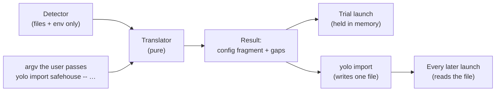

# Coming from SandVault or Agent Safehouse — try yolo on your setup, then keep it

**Status:** 2026-10-08. Nothing built. Both tools were read at source: SandVault `v1.32.0`
([`ad05889`](https://github.com/webcoyote/sandvault/tree/ad05889e9f5f7d63460d6e56a2586c724b14bcd0)),
Agent Safehouse `v0.12.0` plus 12 commits
([`398d67f`](https://github.com/eugene1g/agent-safehouse/tree/398d67ff25c3d85daf2f7bc57ed34f59dd1dcacd)).
The yolo side was checked against `d50a833d9` the same day.

> **In short.** A SandVault or Safehouse setup is almost entirely a description of the boundary
> (*the wall*): paths, features and environment. yolo can read that description without changing
> anything, run it, and save it, all through one translator. The trial is the import, run from
> memory without being written.

**Why it matters.** Safehouse's onboarding is *"two commands, no config file"*, and yolo's is a
runtime, an image and a config file that selects packs
([`agent-safehouse.md` §6.1](../research/agent-safehouse.md#61-who-the-config-author-is-meant-to-be)).
A user who already has a working setup should be able to try yolo without first learning yolo.

**The shape.** Three parts: a *detector* that reads files and environment variables only, a
*translator* that turns the detected setup into a yolo configuration plus a list of gaps, and two
*sinks*. The trial launch holds the result in memory. `yolo import` writes it to a yolo-owned file
for the workspace.

**Start at [§4](#4-one-translator-two-sinks)**: the mapping tables, the trial and the import all
follow from it.

**Needs your ruling:** [OQ-NB1](#OQ-NB1), [OQ-NB2](#OQ-NB2), [OQ-NB3](#OQ-NB3),
[OQ-NB4](#OQ-NB4), [OQ-NB5](#OQ-NB5).

**Reads with:** [`agent-safehouse.md`](../research/agent-safehouse.md) (the full comparison; this
document does not repeat it),
[`sandvault-macos-privileges.md`](../research/sandvault-macos-privileges.md) (SandVault's
privilege model), and
[`sandvault-safehouse-compat-plan.md`](sandvault-safehouse-compat-plan.md) (the implementation
sketch, which is incomplete while questions are open).

---

## 1. Verdict first

- **Build it, in this order:** the translator, then `yolo import`, then the trial launch. The
  import is useful without the trial. The trial is useful only because the import exists for a
  user who wants to keep the setup.
- **The trial writes no configuration and never modifies the other tool's files.** It does not
  touch SandVault's or Safehouse's files, the user's `config.jsonc` or the workspace's
  `yolo-jail.jsonc`. What it may write is yolo's own state, and how much of that lands in the
  project is [OQ-NB5](#OQ-NB5).
- **The import writes exactly one file**: a yolo-owned file under
  `~/.config/yolo-jail/workspaces/`, following the maintainer's per-workspace-file ruling
  ([`boundary-broker.md` BB-D53](boundary-broker.md#BB-D53)).
- **No mapping makes the boundary wider than the source made it.** Where yolo can only
  approximate a grant by allowing more, it reports a gap instead
  ([P5](#p5-never-wider-than-the-source)).
- **Five rulings are owed** ([§10](#10-open-questions)). Of these, [OQ-NB1](#OQ-NB1) (how a
  trial starts) and [OQ-NB2](#OQ-NB2) (which backend a SandVault setup gets) change the design.
  The other three set scope.

---

## 2. Environment first: what importing a confinement tool's setup means

yolo's charter puts the environment first and confinement second
([`what-yolo-is.md`](../reference/what-yolo-is.md),
[`yolo-as-environment-manager.md` §1](yolo-as-environment-manager.md#1-the-one-sentence-answer-to-how-is-this-different-from-sandvault)).
Both neighboring tools are confinement-first by their own descriptions. SandVault calls itself
*"a limited user account to sandbox shell commands and AI agents"*, and Safehouse calls itself
*"a macOS sandbox wrapper for coding agents"*. Their setups contain almost no environment:

| What a setup states | SandVault | Safehouse | Where it goes in yolo |
| :--- | :--- | :--- | :--- |
| The boundary | a fixed Seatbelt profile and a separate account; nothing in it is configurable | grants (`--add-dirs`, `--enable`, appended `.sb` files) | `confinement` / backend, `mounts`, gaps |
| Which agent | the subcommand (`sv claude`) | the wrapped command's basename | `packs` |
| Environment variables | none; the environment is cleared to a fixed list | a cleaned environment, plus `--env=FILE` and `--env-pass` | `env_sources`, [OQ-NB3](#OQ-NB3) |
| Tools | host Homebrew, or each agent's own installer (`-N`) | whatever is on the host | nothing to import; yolo supplies its own |

So importing never adds anything to yolo's environment layer. It converts the user's boundary
into yolo's confinement setting and their agent choice into a pack. Everything else the user gets
is what yolo adds. This sets the order of every trial message: **first what yolo adds, then what
was mirrored**. A trial that only reported the mirrored boundary would present yolo as a third
sandbox wrapper, which is the positioning
[`what-yolo-is.md`](../reference/what-yolo-is.md) rules out.

### Principles

<a id="p1-one-translator"></a>**P1. One translator.** The trial and the import call one pure
function from a detected setup to a yolo configuration plus gaps. For the same setup, the
configuration a trial ran and the configuration the import writes must have the same
`yolo describe --hash`.

<a id="p2-read-never-run"></a>**P2. Read, never run.** The detector reads files and environment
variables only. It never runs `sv`, `safehouse` or the user's shell startup files. Both tools'
durable configuration includes shell code: SandVault reads `SANDVAULT_ARGS`, and Safehouse users
keep shell functions in `~/.zshrc`. Running shell code to discover a configuration would execute
code the user did not ask yolo to run.

<a id="p3-own-file-only"></a>**P3. Write only yolo's own file.** The import writes its file and
nothing else. The trial writes no configuration file at all.

<a id="p4-every-gap-names-a-step"></a>**P4. Every gap names a next step**
([`happy-path-principle.md`](../reference/happy-path-principle.md)). The step is a yolo command,
a configuration key to write, or the statement that yolo deliberately does not do this, with the
alternative.

<a id="p5-never-wider-than-the-source"></a>**P5. Never wider than the source.** A mapping is
exact, narrower than the source, or a gap. It is never wider. One deliberate exception keeps
yolo's own boundary instead of the source's: credentials ([OQ-NB3](#OQ-NB3)).

<a id="p6-the-trial-is-disclosed"></a>**P6. The trial is always disclosed.** Every trial launch
prints what was mirrored, approximated and left out. As with every other launch disclosure, no
setting hides it ([`report-tiers.md`](../reference/report-tiers.md#why-its-this-way)).

---

## 3. What a setup consists of, measured

### 3.1 SandVault

A single Bash script, `sv`, with a fixed design. There is no configuration file that describes
the sandbox.

| Part | Where | Notes |
| :--- | :--- | :--- |
| Sandbox account and group | `sandvault-$USER`, home `/Users/sandvault-$USER` | created by `sv build` with `sudo` and hidden from the login window |
| Shared workspace | `/Users/Shared/sv-$USER`, owned by the host user, mode 0700 or 0770, with a group ACL | the only host area the account can write besides its home and the temporary directories |
| Seatbelt profile | `/var/sandvault/sandbox-sandvault-$USER.sb`, root-owned | `(allow default)`, then writes denied everywhere except the shared workspace, the account's home, the temporary directories and `/dev`; `/Users`, `/Volumes` other than the startup disk, and `/Library/Keychains` are unreadable. **This is the same shape as yolo's `macos-user` profile**, which calls itself *"SandVault-parity"* |
| Passwordless switch | `/etc/sudoers.d/50-nopasswd-for-sandvault-$USER` | see [`sandvault-macos-privileges.md`](../research/sandvault-macos-privileges.md) |
| Install marker | `~/.config/codeofhonor/sandvault/install` | in the host user's home, which the account cannot read |
| Extra SSH keys | `~/.config/codeofhonor/sandvault/authorized_keys.d/` | |
| Dotfiles | `/Users/Shared/sv-$USER/user/` | copied into the account's home at each run |
| Default arguments | `SANDVAULT_ARGS`, shell-quoted and parsed before the command line | |
| Launch | `sv <agent> [PATH] [-- AGENT_ARGS]`, where `<agent>` is `claude`, `codex`, `opencode`, `gemini`, `pi`, `muse` or `shell` | the environment is cleared (`env -i`) to `HOME`, `USER`, `SHELL`, `TERM`, the `SV_*` variables and a fixed `PATH`; each agent runs in its own skip-permissions mode |
| Session features | `--browser`/`--chrome`, `--lightpanda`, `--ios`/`--ios-gui`, `-x`/`--no-sandbox`, `-N`/`--native-install`, `-s`/`--ssh` | flags on each run, not stored settings |
| Agent logins and history | in the account's home | unreadable to the host user without root |

### 3.2 Agent Safehouse

Bash plus SBPL, with flags as the main surface. Its durable configuration is spread across four
places. [`agent-safehouse.md` §2](../research/agent-safehouse.md#2-what-safehouse-is--measured-not-from-the-tagline)
describes the policy that these settings produce.

| Part | Where | Notes |
| :--- | :--- | :--- |
| Flags on each run | `safehouse [flags] [--] <command>` | `--add-dirs`, `--add-dirs-ro`, `--workdir`, `--enable`, `--env`, `--env=FILE`, `--env-pass`, `--append-profile`, and the trust flags |
| Environment defaults | `SAFEHOUSE_ADD_DIRS`, `SAFEHOUSE_ADD_DIRS_RO`, `SAFEHOUSE_WORKDIR`, `SAFEHOUSE_ENV_PASS`, `SAFEHOUSE_TRUST_WORKDIR_CONFIG` | the only `SAFEHOUSE_*` names the runtime reads. `SAFEHOUSE_APPEND_PROFILE` in their README is a convention their shell functions use, not a variable Safehouse reads |
| The project's own file | `<workdir>/.safehouse`, with `add-dirs-ro=`, `add-dirs=`, `enable=` and `append-profile=` | **ignored unless trusted**; a malformed line or unknown key fails the launch |
| Trust record | `~/.config/safehouse/trusted-workdirs`, one absolute path per line | written by `--always-trust-workdir-config` |
| Shell functions | `~/.zshrc`, `~/.bashrc` or fish configuration, for example `claude() { safe claude --dangerously-skip-permissions "$@"; }` | the setup their documentation recommends, and the part P2 cannot read |
| Agent identity | the host user, with the real home | the agent's login is the user's real `~/.claude`, `~/.codex` and so on |

---

## 4. One translator, two sinks



The **detected setup** *(coined here)* is everything the detector found, with the path that
supplied each fact. The detected setup is different from the **result**, which is the translated
yolo configuration fragment plus a list of gaps.

A gap is one of four kinds, and each has a fixed disclosure word:

| Kind | Meaning | Word |
| :--- | :--- | :--- |
| Exact | yolo provides the same behavior | `mirrored` |
| Narrower or different | yolo provides a related behavior that never allows more | `approximated` |
| Not provided | yolo has no counterpart | `not mirrored` |
| Refused | yolo deliberately does not do this | `declined` |

### 4.1 SandVault → yolo

| SandVault | yolo | Kind | Next step the report names |
| :--- | :--- | :--- | :--- |
| `sv claude` / `codex` / `opencode` / `pi` | `packs: ["claude"]` and so on | mirrored | — |
| `sv gemini`, `sv muse` | no pack | not mirrored | `yolo -- bash` and install it there, or ask for a pack |
| `sv shell` | `yolo -- bash` | mirrored | — |
| `[PATH]` | the workspace, which must be the current directory ([NB-D4](#NB-D4)) | mirrored | `cd PATH && <the same command>` |
| `-- AGENT_ARGS` | passed to the agent | mirrored | — |
| the agent's skip-permissions flag | set by the pack | mirrored | — |
| account plus Seatbelt | depends on the backend ([OQ-NB2](#OQ-NB2)) | mirrored or approximated | — |
| shared workspace `/Users/Shared/sv-$USER` | a workspace when the current directory is under it | mirrored | — |
| `--browser` / `--chrome` | `packs: ["chrome-devtools"]`, a DevTools MCP server rather than a `SV_BROWSER_ENDPOINT` URL | approximated | — |
| `--lightpanda`, `--ios`, `--ios-gui` | none | not mirrored | none planned. The report says so, and that `--ios` needs a host bridge yolo does not ship |
| `-x` / `--no-sandbox` | none; `macos-user` always uses Seatbelt | declined | a container backend, where Seatbelt does not apply |
| `-N`, `-s`, `-v`, `-r`, `-n` | not needed (yolo installs agents itself; a second `yolo` in the project joins the running jail, which replaces SSH mode; the others are maintenance flags) | mirrored as no-ops | — |
| `SANDVAULT_ARGS` | parsed as if it preceded the command line ([NB-D11](#NB-D11)) | — | — |
| dotfiles in `.../user/` | not read; the jail's shell is bash, not zsh | not mirrored | `host_files` for a file the agent needs |
| `authorized_keys.d` | not needed | mirrored as no-op | — |
| host Homebrew tools on `PATH` | not read | not mirrored | list them in `packages`; `yolo check-deps` shows what a pack needs |
| agent logins in the account's home | not read (P2, and root-only) | not mirrored | a one-time `/login` in the jail ([OQ-NB3](#OQ-NB3)) |
| shared host network | container: bridge networking; `macos-user`: the host network | approximated / mirrored | — |

### 4.2 Safehouse → yolo

| Safehouse | yolo | Kind | Next step the report names |
| :--- | :--- | :--- | :--- |
| wrapped `claude`, `codex`, `copilot`, `kilo`, `opencode`, `pi` | the pack with that name | mirrored | — |
| wrapped `aider`, `amp`, `auggie`, `cline`, `cursor-agent`, `droid`, `gemini`, `goose` | no pack | not mirrored | as for `sv gemini` |
| the agent's skip-permissions flag | removed; the pack sets it ([NB-D6](#NB-D6)) | mirrored | — |
| workdir = current directory | workspace | mirrored | — |
| `--workdir=DIR` or `SAFEHOUSE_WORKDIR` other than the current directory | — | — | `cd DIR && …` ([NB-D4](#NB-D4)) |
| `--workdir=` (no workdir grant) | none; a yolo launch always has a workspace | not mirrored | run from an empty folder, where the explicit grants become the only `mounts` |
| `--add-dirs-ro`, `SAFEHOUSE_ADD_DIRS_RO`, `.safehouse` `add-dirs-ro=` | read-only `mounts` entry for each path | approximated: the path appears at `/ctx/<name>`, not its host path | — |
| `--add-dirs`, `SAFEHOUSE_ADD_DIRS`, `.safehouse` `add-dirs=` | `mounts` `{"host": …, "mode": "rw"}` | approximated, as above | a path the mount rules refuse (inside home on `macos-user`, overlapping the workspace) is reported with that rule's own next step |
| linked-worktree common directory | not mounted today | not mirrored | [OQ-HR3](../research/herdr-integration.md#OQ-HR3) |
| `--env=FILE` | `env_sources: [FILE]` | mirrored. A line using `$`-expansion is approximated ([NB-D12](#NB-D12)) | — |
| `--env-pass`, `SAFEHOUSE_ENV_PASS` | [OQ-NB3](#OQ-NB3) | — | — |
| `--env` (full host environment) | — | declined | `env_sources` with a dotenv file |
| `--append-profile=FILE.sb` | — | not mirrored. SBPL has no yolo counterpart, and yolo accepts no profile fragments | the file is named; a deny it makes inside the workspace can be written as `workspace_readonly` |
| `--enable=…` | per feature, [§4.3](#43-safehouse---enable-features) | — | — |
| `.safehouse` untrusted | not read ([NB-D5](#NB-D5)) | — | `yolo import safehouse --trust-workdir-config` |
| shell functions | not read (P2) | — | `yolo import safehouse -- <the function's safehouse arguments>` ([NB-D15](#NB-D15)) |
| agent login in the real home | not read | declined | a one-time `/login` in the jail ([OQ-NB3](#OQ-NB3)) |

### 4.3 Safehouse `--enable` features

| Feature | yolo | Kind |
| :--- | :--- | :--- |
| `chromium-headless`, `chromium-full`, `playwright-chrome`, `agent-browser` | `chrome-devtools` pack | approximated |
| `cloud-credentials` | `aws-auth` pack (Bedrock-scoped credentials only) | approximated; the report states the scope |
| `process-control` | `host-processes` pack (a view, with no signaling) | approximated |
| `docker` | podman inside the jail, not the host's Docker socket | approximated |
| `ssh`, `gpg`, `keychain`, `1password`, `kubectl` | — | declined. These hand host credentials across, and yolo's boundary is that host credentials are absent. The step names the deploy key, `github` broker or keychain design that applies |
| `shell-init` | — | declined: host dotfiles never enter |
| `wide-read` | — | declined ([P5](#p5-never-wider-than-the-source)); the step is a read-only `mounts` entry for the specific folders |
| `clipboard`, `macos-gui`, `microphone`, `spotlight`, `cleanshot`, `launch-services`, `vscode`, `xcode`, `lldb`, `electron`, `gpu`, `browser-native-messaging`, `cloud-storage`, `herdr` | — | not mirrored |
| `all-agents`, `all-apps` | — | mirrored as no-ops |
| a name not in this table | — | reported as unknown, with the Safehouse version the table was written against ([NB-D8](#NB-D8)) |

---

## 5. The import

```console
$ yolo import sandvault [--dry-run]
$ yolo import safehouse [--trust-workdir-config] [--dry-run] [-- <safehouse arguments>]
$ yolo import <tool> --remove
```

- **Run from the workspace**, on the host. In a jail it refuses and names the host command, as
  `yolo loopholes enable` does.
- **Output** is the report (each translated item with its kind and source path, then every gap
  with its next step), then the file written, then one line saying it applies from the next fresh
  launch. `--dry-run` prints the report and the file contents and writes nothing.
- **The file** is `~/.config/yolo-jail/workspaces/<slug>-<hash>.imported.jsonc`. It uses the same
  name stem as the per-workspace file
  ([BB-D53](boundary-broker.md#BB-D53)) and is a separate file with its own header and its own key
  set ([NB-D2](#NB-D2)). The file holds `workspace`, an `imported` provenance object (tool,
  version, date, and each source path) and only these configuration keys: `packs`, `mounts`,
  `env_sources`, `workspace_readonly` and `confinement`. The loader refuses any other key with a
  next step.
- **Merge position:** at user-scope precedence for that one workspace, after
  `config.jsonc` and its includes and before the workspace's own configuration
  ([NB-D14](#NB-D14)). Packs and read-write mounts are allowed there for the reason the
  per-workspace file allows switches: a human ran the command, and the file is outside every jail
  ([BB-D56](boundary-broker.md#BB-D56)).
- **Every launch that reads the file names it on one line**, with the tool it was imported from
  ([NB-D10](#NB-D10)). The loophole switch file prints nothing, but this file selects packs and
  mounts, which every other source of them discloses.
- **Re-running the import** replaces the whole file and prints a diff against the previous
  version. `--remove` deletes the file. Neither command reads or writes the other tool's files.
- **Nothing secret is written.** No environment variable value enters the file. An `--env=FILE`
  path is recorded as a path, as `env_sources` records it.
- **Degenerate cases.** If nothing is detected, the import exits 1 and names what it looked for. A
  detected setup that translates to zero items still writes a file, holding only provenance and
  whatever gaps reach the report. If both tools are detected, the user must name one.

A machine-wide import is [OQ-NB4](#OQ-NB4).

---

## 6. The trial: launching from a detected setup, writing no configuration

How a trial is started is [OQ-NB1](#OQ-NB1). Whatever the spelling, a trial launch:

1. Runs the detector and the translator ([§4](#4-one-translator-two-sinks)) with the same inputs
   an import would have.
2. Composes the result as one more user-scope layer in memory, in the import file's position, so
   the launch reads exactly what an import would have written. A real import file for the
   workspace takes precedence. A trial over an existing import refuses and names
   `yolo import <tool> --remove` or a plain launch.
3. Prints the disclosure block ([§6.2](#62-the-disclosure)) before anything is built.
4. Launches normally. It uses yolo's own backend selection, except where
   [OQ-NB2](#OQ-NB2) says otherwise for SandVault ([NB-D9](#NB-D9)).
5. Prints a final line naming `yolo import <tool>` and the file the import would write.

### 6.1 Detection

All probes are reads. None uses `sudo`, and none runs either tool ([P2](#p2-read-never-run)).

| Tool | A setup is **present** when | It is **partial** (reported, not used) when | Version from |
| :--- | :--- | :--- | :--- |
| SandVault | the install marker exists **and** the `sandvault-$USER` account exists in the local directory (read with `dscl . -read`) | only one of the two exists, or the shared workspace is missing | the `readonly VERSION=` line of the `sv` on `PATH`, read as text |
| Safehouse | `safehouse` is on `PATH`, **and** any of: a `SAFEHOUSE_*` variable is set, the current directory has a `.safehouse` file, or the current directory is in `trusted-workdirs` | `safehouse` is on `PATH` and none of the others holds. The trial still runs, and the report says the user's shell functions could not be read | the bundled script's version string, read as text |

On Linux neither tool runs, so detection finds a Safehouse setup only through a `.safehouse`
file in a cloned project. That is enough for `yolo import safehouse`, and the trial works from the
same input.

### 6.2 The disclosure

Like other launch lines it may be compressed, but no setting hides it. Its shape:

```text
Trying yolo on your SandVault 1.32.0 setup — nothing written. yolo adds: <the packs' environment
  summary: pinned packages, composed agent config, skills, brokers>.
  mirrored:     claude (sv claude), workspace /Users/Shared/sv-you/repos/app, Seatbelt-class boundary
  approximated: --browser → chrome-devtools MCP (no SV_BROWSER_ENDPOINT)
  not mirrored: Homebrew tools on PATH → list them in "packages"
                agent login → one /login in the jail; your SandVault login is untouched
  Keep it: yolo import sandvault   (writes ~/.config/yolo-jail/workspaces/app-3f9c….imported.jsonc)
```

The first line comes first by design ([§2](#2-environment-first-what-importing-a-confinement-tools-setup-means)).
Item wording belongs to the implementer. The four words, the order and the last line do not.

### 6.3 Moving from a trial to an import

- `yolo import <tool>` writes what the trial ran, with the same `describe --hash`
  ([P1](#p1-one-translator)).
- If the trial created a jail home, the import keeps it, so a `/login` made during the trial
  survives. Where that home lives is [OQ-NB5](#OQ-NB5).
- After an import, editing yolo's configuration is ordinary yolo use. The imported file is the
  user's to remove. yolo never syncs it again on its own ([§8](#8-non-goals)).

---

## 7. Per-backend support

| | `macos-user` | Apple Container | podman (macOS) | podman (Linux) |
| :--- | :--- | :--- | :--- | :--- |
| **SandVault trial** | per [OQ-NB2](#OQ-NB2). Under the leaning: not offered, because `_yolojail` cannot read `/Users/Shared/sv-$USER` without an ACL change, which counts as a modification. The report names the container trial | ✅ the workspace is bind-mounted; the host user owns it | ✅ | n/a: SandVault is macOS-only |
| **SandVault import** | ✅ writes `confinement: "guest"` under the leaning. The graduation steps it names are `yolo macos-setup`, then moving the project under `/Users/Shared/yolo` or sharing it | ✅ writes no `confinement` (jail) when the user picks containers | ✅ | n/a |
| **Safehouse trial** | only when the workdir is outside every home, which Safehouse workdirs usually are not; otherwise `macos-user` refuses as it does today and the report names the container trial | ✅. Read-only mounts need Apple Container 1.1.0 or later; below that each one is skipped and disclosed, as today | ✅ | ✅ from a `.safehouse` file only |
| **Safehouse import** | ✅ when the workdir is outside every home | ✅ | ✅ | ✅ from `.safehouse` |
| Mount paths | the real host folder, through a link in `$YOLO_CONTEXT_DIR` | `/ctx/<name>` | `/ctx/<name>` | `/ctx/<name>` |
| How close the boundary is | **SandVault: same shape** (account plus `(allow default)` Seatbelt profile). Safehouse: different (separate account, no deny-default) | a VM boundary. Stronger than both tools in kind, and the paths differ | as Apple Container | as Apple Container |

---

## 8. Non-goals

- **No export.** yolo does not write `.sb` files, `.safehouse` files or SandVault settings. The
  Policy Builder's standalone-artifact model is a different philosophy
  ([`agent-safehouse.md` §7.2](../research/agent-safehouse.md#72-where-they-genuinely-disagree) C).
- **No SBPL passthrough.** An appended `.sb` profile is a gap and never becomes part of yolo's
  profile.
- **No reading of the other tool's agent state.** yolo does not read the SandVault account's home
  or Safehouse's real `~/.claude`.
- **No ongoing sync.** An import is a snapshot, and the user re-runs it after changing the other
  tool.
- **No shell parsing.** yolo does not read shell functions or startup files ([P2](#p2-read-never-run)).
- **No new agent packs in this design.** A gap's next step may say to ask for a pack.

---

## 9. What yolo should adopt from each tool

The Safehouse comparison already ranked its adoptions, and three have shipped
([`agent-safehouse.md` §8](../research/agent-safehouse.md#8-what-to-adopt--ranked-by-value-against-cost)).
This table lists only what that comparison and the SandVault privileges note do not decide.

| # | From | What | Recommendation |
| :--- | :--- | :--- | :--- |
| A1 | SandVault | `sv-clone`: clone a local or remote repository into the shared area **and add a `sandvault` remote in the source repository**, so `git fetch sandvault` brings the agent's commits home | **Adopt for `macos-user`.** It replaces today's "move your project under `/Users/Shared/yolo`" refusal with a step that moves nothing. Route it into [`configurable-workspace-root.md`](configurable-workspace-root.md)'s onboarding |
| A2 | SandVault | Setup authorizes passwordless runtime switching; a non-interactive probe refuses and names `build --rebuild` | Already shortlisted in [`sandvault-macos-privileges.md`](../research/sandvault-macos-privileges.md); nothing new here |
| A3 | SandVault | A dedicated account keychain | Already the leaning of [OQ-KC4](keychain-from-a-jail.md#OQ-KC4) |
| A4 | SandVault | Session cleanup that spares sibling sessions | Already part of [`jail-lifetime-last-session-wins.md`](jail-lifetime-last-session-wins.md) |
| A5 | SandVault | A host-side iOS Simulator bridge over HTTP on localhost | **Defer.** A candidate macOS loophole pack. There is no recorded demand, and the bridge's path rule (apps must live under `/Users/Shared`) would need its own design |
| A6 | SandVault | The nested-sandbox note: `swift` and `xcodebuild` fail under an outer Seatbelt profile, and `SV_SESSION_ID` tells build scripts to pass `--disable-sandbox` | **Adopt as briefing text for `macos-user`**, not as a switch. The `-x` switch is declined in [§4.1](#41-sandvault--yolo) |
| A7 | SandVault | `SANDVAULT_ARGS`, default arguments from an environment variable | **Reject.** yolo's configuration file is where defaults live |
| A8 | Safehouse | When the workdir is a linked worktree, grant its common directory read-write and sibling worktrees read-only | Evidence for [OQ-HR3](../research/herdr-integration.md#OQ-HR3)'s leaning A. Safehouse shipped exactly that grant. Not a new question |
| A9 | Safehouse | `.safehouse` untrusted by default | Belongs to [OQ-AS3](../research/agent-safehouse.md#OQ-AS3) and [`workspace-config-trust.md`](workspace-config-trust.md). The import honors Safehouse's own trust ([NB-D5](#NB-D5)) |
| A10 | Safehouse | The browser Policy Builder | **Not now.** `yolo init` and this import fill its role; reconsider if the import's reports show users struggle with the vocabulary |
| A11 | Both | Agent-name commands (`sv claude`, `safehouse claude`) | Part of [OQ-NB1](#OQ-NB1)'s spelling. Not a general `yolo claude` shorthand, which would collide with subcommand names |

---

## 10. Open questions

1. 💬 **OQ-NB1: How does a trial start?**

   <!-- vantage: question id=OQ-NB1 leaning="C — an explicit `yolo try <tool>`, and the empty-packs notice names it when a setup is detected; nothing is active by default." -->

   This decides the command surface, and whether an empty configuration stays empty.

   - **A — An explicit command.** `yolo try sandvault claude` or `yolo try safehouse -- claude`,
     accepting the other tool's own argument list. One word to learn. Nothing changes for users
     who do not run it.
   - **B — Automatic.** A launch with no packs configured runs the detected setup. Truly zero
     configuration, but it reverses *nothing is active by default*: files outside yolo would
     change a bare launch.
   - **C — A, plus a pointer.** The empty-packs notice names the `yolo try` command when it
     detects a setup.

   _Leaning:_ C — an explicit `yolo try <tool>`, and the empty-packs notice names it when a setup
   is detected; nothing is active by default.

   **Answer:**
   > _(empty — fill in when decided)_

2. 💬 **OQ-NB2: Which backend does a SandVault setup get?**

   <!-- vantage: question id=OQ-NB2 leaning="A — a container for the trial, so 'writes nothing' holds; guest (macos-user) for the import, whose steps name macos-setup and sharing." -->

   SandVault is a separate account with Seatbelt, which is yolo's `guest` setting on macOS. Using
   that setting requires changes to the Mac.

   - **A — Container for the trial, guest for the import.** The trial modifies nothing. The import
     names `yolo macos-setup` and how to share the workspace.
   - **B — Container for both.** Simplest, but the closest match is never offered.
   - **C — Run as `sandvault-$USER` through SandVault's own sudo rule.** The closest match, and
     the user's existing logins work. Yolo would render configuration into SandVault's account home
     and install its profile with root, both of which modify the user's SandVault setup.

   _Leaning:_ A — a container for the trial, so "writes nothing" holds; guest (`macos-user`) for
   the import, whose steps name `macos-setup` and sharing.

   **Answer:**
   > _(empty — fill in when decided)_

3. 💬 **OQ-NB3: Do any of the other tool's credentials cross into a trial?**

   <!-- vantage: question id=OQ-NB3 leaning="C — never a login; named variables pass for a trial only, disclosed by name; an import writes no values." -->

   A Safehouse agent uses the real `~/.claude` login, and `--env-pass` forwards named variables
   such as `ANTHROPIC_API_KEY`. yolo's boundary is that host credentials are absent.

   - **A — Nothing crosses.** The user does a one-time `/login` in the jail. `--env-pass` names
     are reported with the `env_sources` dotenv step.
   - **B — The login crosses too**, for example through a credential view. Most like Safehouse,
     but this removes yolo's main guarantee.
   - **C — A, except that `--env-pass` variables are passed for the trial only**, like
     `--with-credentials`, named in the disclosure without their values. An import writes none of
     them.

   _Leaning:_ C — never a login; named variables pass for a trial only, disclosed by name; an
   import writes no values.

   **Answer:**
   > _(empty — fill in when decided)_

4. 💬 **OQ-NB4: Can an import cover every workspace on the machine?**

   <!-- vantage: question id=OQ-NB4 leaning="B — per workspace, plus --global printing a block to paste; yolo writes no machine-wide layer." -->

   SandVault's setup and Safehouse's shell functions are machine-wide. yolo never edits
   `config.jsonc`.

   - **A — Per workspace only.** One import for each project.
   - **B — A, plus `--global`, which prints a `config.jsonc` block to paste** and writes nothing,
     as `yolo loopholes enable --global` does.
   - **C — A yolo-owned machine-wide imported layer.** A new layer that every workspace merges,
     which is the shape of the withdrawn `config.local.jsonc`.

   _Leaning:_ B — per workspace, plus `--global` printing a block to paste; yolo writes no
   machine-wide layer.

   **Answer:**
   > _(empty — fill in when decided)_

5. 💬 **OQ-NB5: May a trial create `.yolo/` in the project?**

   <!-- vantage: question id=OQ-NB5 leaning="A — keep .yolo/ in the project, name it and its rm undo on the first trial; one home layout, and the trial's login survives import." -->

   Every launch keeps the jail's home and logs in `<workspace>/.yolo/`. In a git project it shows
   up as an untracked directory.

   - **A — Yes, and say so.** The first trial names the directory and how to delete it. There is
     one home layout, and an import keeps the trial's home.
   - **B — No.** A trial keeps its state under `~/.local/share/yolo-jail/`, keyed by workspace,
     and the import moves it into the project. The project stays untouched, at the cost of a second
     home location and a move step that can fail.

   _Leaning:_ A — keep `.yolo/` in the project, name it and its `rm` undo on the first trial; one
   home layout, and the trial's login survives import.

   **Answer:**
   > _(empty — fill in when decided)_

---

## 11. Decision ledger

Implementation decisions, made here and reversible.

| ID | Decision | Date | Settled in | Built |
| :--- | :--- | :--- | :--- | :--- |
| <a id="NB-D1"></a>NB-D1 | One pure translator for the trial and the import; the hash-equality test in [P1](#p1-one-translator) is its acceptance check | 2026-10-08 | [§4](#4-one-translator-two-sinks) | — |
| <a id="NB-D2"></a>NB-D2 | The import writes a separate `.imported.jsonc` beside the per-workspace switch file and does not add keys to that file. BB-D53's file holds switches and merges last. This file holds configuration and merges at user scope, and a single file in two positions would be harder to reason about. The maintainer's ruling allowed either file (*"generic for any … things that need to be per project"*) | 2026-10-08 | [§5](#5-the-import) | — |
| <a id="NB-D3"></a>NB-D3 | Neither tool is ever executed; versions are read as text from their scripts ([P2](#p2-read-never-run)) | 2026-10-08 | [§6.1](#61-detection) | — |
| <a id="NB-D4"></a>NB-D4 | A `PATH` or `--workdir` other than the current directory is refused, naming `cd <it> && <the same command>`. This keeps yolo's rule that a launch has no `--workspace` flag | 2026-10-08 | [§4.1](#41-sandvault--yolo) | — |
| <a id="NB-D5"></a>NB-D5 | `.safehouse` is read only when Safehouse itself would trust it (a `trusted-workdirs` entry or `SAFEHOUSE_TRUST_WORKDIR_CONFIG`) or when the user passes `--trust-workdir-config` to yolo. Without this, a cloned project's grants would become user-scope grants with nobody choosing them | 2026-10-08 | [§4.2](#42-safehouse--yolo) | — |
| <a id="NB-D6"></a>NB-D6 | The agent's own skip-permissions flags (`--dangerously-skip-permissions`, `--dangerously-bypass-approvals-and-sandbox`, `--yolo` and similar) are removed from the arguments, because the pack sets that mode; other arguments pass unchanged | 2026-10-08 | [§4.2](#42-safehouse--yolo) | — |
| <a id="NB-D7"></a>NB-D7 | Re-running the import replaces the whole file and prints a diff; `--remove` deletes it; `--dry-run` writes nothing | 2026-10-08 | [§5](#5-the-import) | — |
| <a id="NB-D8"></a>NB-D8 | The mapping tables are one table in the code, stamped with the tool versions they were written against. A flag, feature or agent the table does not know is reported as unknown, naming that version. Nothing is guessed | 2026-10-08 | [§4.3](#43-safehouse---enable-features) | — |
| <a id="NB-D9"></a>NB-D9 | A trial uses yolo's normal backend selection; only [OQ-NB2](#OQ-NB2) may override it, for SandVault | 2026-10-08 | [§6](#6-the-trial-launching-from-a-detected-setup-writing-no-configuration) | — |
| <a id="NB-D10"></a>NB-D10 | Every launch that reads an imported file prints one line naming it and the tool it came from | 2026-10-08 | [§5](#5-the-import) | — |
| <a id="NB-D11"></a>NB-D11 | `SANDVAULT_ARGS` is split with SandVault's quoting rules (one `xargs` word per argument) and placed before the command line, as `sv` does | 2026-10-08 | [§4.1](#41-sandvault--yolo) | — |
| <a id="NB-D12"></a>NB-D12 | An `--env=FILE` line that uses `$`-expansion or command substitution is mirrored as written and reported approximated. Safehouse runs the file with bash, and a yolo dotenv file is not evaluated | 2026-10-08 | [§4.2](#42-safehouse--yolo) | — |
| <a id="NB-D13"></a>NB-D13 | When both tools are detected, the import and the trial refuse and name both spellings; the empty-packs pointer names both | 2026-10-08 | [§5](#5-the-import) | — |
| <a id="NB-D14"></a>NB-D14 | The imported file merges at user-scope precedence for its one workspace, after `config.jsonc` and its includes and before the workspace's own configuration. Its lists append after the user configuration's lists | 2026-10-08 | [§5](#5-the-import) | — |
| <a id="NB-D15"></a>NB-D15 | `yolo import safehouse -- <args>` accepts a Safehouse argument list the user copied from their shell function, parsed with Safehouse's own grammar (flags before the first standalone `--`). This is how the setup P2 cannot read gets imported | 2026-10-08 | [§4.2](#42-safehouse--yolo) | — |

---

## 12. Risks

| Risk | Mitigation |
| :--- | :--- |
| Either tool changes its flags or paths (both changed within the last month) | [NB-D8](#NB-D8): unknown inputs are reported with the version the tables were written against, and nothing is guessed |
| An import makes a cloned project's grants permanent user-scope grants | [NB-D5](#NB-D5); every grant is listed in the report before the file is written |
| The trial is read as "yolo is another sandbox" | The order of [§6.2](#62-the-disclosure): what yolo adds comes first |
| A trial that works only on a container is read as a `macos-user` claim | Every trial line names the backend; [§7](#7-per-backend-support) is the user-guide table |
| Users expect agent history to carry over | Reported as not mirrored, with its step, on every trial |
