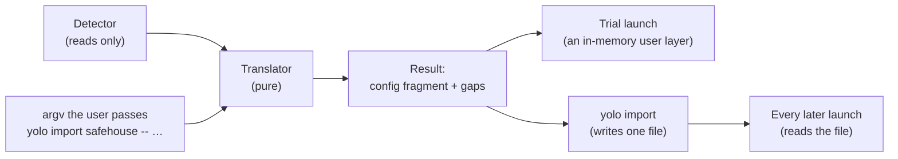

# Coming from SandVault or Agent Safehouse — try yolo on your setup, then keep it

**Status:** 2026-10-08. Nothing built. Both tools were read at source: SandVault `v1.32.0`
([`ad05889`](https://github.com/webcoyote/sandvault/tree/ad05889e9f5f7d63460d6e56a2586c724b14bcd0)),
Agent Safehouse `v0.12.0` plus 12 commits
([`398d67f`](https://github.com/eugene1g/agent-safehouse/tree/398d67ff25c3d85daf2f7bc57ed34f59dd1dcacd)).
The yolo side was checked against `d50a833d9` the same day. Revised the same day after an
independent review.

> **In short.** A user with a working SandVault or Safehouse setup can get yolo's environment
> without writing a yolo configuration: that setup is almost entirely a description of the
> boundary, which yolo can read without changing anything and translate once. The trial is the
> import, run from memory without being written.

**Why it matters.** Safehouse's onboarding is *"two commands, no config file"*, and yolo's is a
runtime, an image and a config file that selects packs
([`agent-safehouse.md` §6.1](../research/agent-safehouse.md#61-who-the-config-author-is-meant-to-be)).

**The shape.** A *detector* that only reads, a *translator* that turns the detected setup into a
yolo configuration plus a list of gaps, and two *sinks*: the trial launch holds the result in
memory, and `yolo import` writes it to a yolo-owned file for the workspace.

**Start at [§4](#4-one-translator-two-sinks)**: the mapping tables, the trial and the import all
follow from it.

**Needs your ruling:** [OQ-NB1](#OQ-NB1), [OQ-NB2](#OQ-NB2), [OQ-NB3](#OQ-NB3),
[OQ-NB5](#OQ-NB5).

**Reads with:** [`agent-safehouse.md`](../research/agent-safehouse.md) (the full comparison; this
document does not repeat it),
[`sandvault-macos-privileges.md`](../research/sandvault-macos-privileges.md) (SandVault's
privilege model), and
[`sandvault-safehouse-compat-plan.md`](sandvault-safehouse-compat-plan.md) (the implementation
sketch, which is incomplete while questions are open).

---

## 1. Verdict first

- **Build it, in this order:** the translator, then `yolo import`, then the trial launch. The
  import is useful without the trial. The trial is useful only because the import exists for a
  user who wants to keep the setup.
- **What the user gets is yolo's environment.** Every trial message leads with what yolo adds,
  then what was mirrored ([§2](#2-environment-first-what-importing-a-confinement-tools-setup-means)).
- **The trial writes no configuration and never modifies the other tool's files.** It does not
  touch SandVault's or Safehouse's files, the user's `config.jsonc` or the workspace's
  `yolo-jail.jsonc`. What it may write is yolo's own state, and how much of that lands in the
  project is [OQ-NB5](#OQ-NB5).
- **The import writes exactly one file**: a yolo-owned file under
  `~/.config/yolo-jail/workspaces/`, following the maintainer's per-workspace-file ruling
  ([`boundary-broker.md` BB-D53](boundary-broker.md#BB-D53)).
- **No mapping makes the boundary wider than the source made it**, checked per mapping and per
  backend. Where yolo could only approximate a grant by allowing more, the translator reports a
  gap or refuses ([P5](#p5-never-wider-than-the-source)).
- **Four rulings are owed** ([§10](#10-open-questions)). [OQ-NB1](#OQ-NB1) (how a trial starts)
  and [OQ-NB2](#OQ-NB2) (which backend a SandVault setup gets) change the design; the other two
  set scope.

---

## 2. Environment first: what importing a confinement tool's setup means

yolo's charter puts the environment first and confinement second
([`what-yolo-is.md`](../reference/what-yolo-is.md),
[`yolo-as-environment-manager.md` §1](yolo-as-environment-manager.md#1-the-one-sentence-answer-to-how-is-this-different-from-sandvault)).
Both neighboring tools are confinement-first by their own descriptions. SandVault calls itself
*"a limited user account to sandbox shell commands and AI agents"*, and Safehouse calls itself
*"a macOS sandbox wrapper for coding agents"*. Their setups contain almost no environment:

| What a setup states | SandVault | Safehouse | Where it goes in yolo |
| :--- | :--- | :--- | :--- |
| The boundary | a fixed Seatbelt profile and a separate account; nothing in it is configurable | grants (`--add-dirs`, `--enable`, appended `.sb` files) | `confinement`, `mounts`, gaps |
| Which agent | the subcommand (`sv claude`) | the wrapped command's basename | `packs` |
| Environment variables | none; the environment is cleared to a fixed list | a cleaned environment, plus `--env=FILE` and `--env-pass` | [OQ-NB3](#OQ-NB3) |
| Tools | host Homebrew, or each agent's own installer (`-N`) | whatever is on the host | nothing to import; yolo supplies its own |

So importing never adds anything to yolo's environment layer. It converts the user's boundary
into yolo's confinement setting and their agent choice into a pack. Everything else the user gets
is what yolo adds. A trial that only reported the mirrored boundary would present yolo as a third
sandbox wrapper, which is the positioning [`what-yolo-is.md`](../reference/what-yolo-is.md) rules
out.

### Principles

<a id="p1-one-translator"></a>**P1. One translator.** The trial and the import call one pure
function from a detected setup to a yolo configuration fragment plus gaps. For the same setup,
the fragment a trial ran and the configuration keys the import writes are equal, except for the
two deltas [NB-D16](#NB-D16) names: `confinement` (when [OQ-NB2](#OQ-NB2) sends the two to
different backends) and trial-only credential grants ([OQ-NB3](#OQ-NB3)), which are launch
grants and never configuration.

<a id="p2-read-never-run"></a>**P2. Read, never run.** The detector reads files, environment
variables and the local user directory (one `dscl . -read` per account). It never runs `sv`,
`safehouse` or the user's shell startup files. Both tools' durable configuration includes shell
code: `SANDVAULT_ARGS` is shell-quoted, and Safehouse users keep shell functions in `~/.zshrc`.
Running shell code to discover a configuration would execute code the user did not ask yolo to
run.

<a id="p3-own-file-only"></a>**P3. Write only yolo's own file.** The import writes its file and
nothing else. The trial writes no configuration file at all.

<a id="p4-every-gap-names-a-step"></a>**P4. Every gap names a next step**
([`happy-path-principle.md`](../reference/happy-path-principle.md)). The step is a yolo command,
a configuration key to write, or the statement that yolo deliberately does not do this, with the
alternative.

<a id="p5-never-wider-than-the-source"></a>**P5. Never wider than the source.** A mapping is
exact, narrower than the source, or a gap. It is never wider, and the check runs per backend as
well as per mapping: a backend whose boundary is wider in kind than the source's is not offered.
Credentials are not an exception: yolo's boundary there is narrower than both tools'
([OQ-NB3](#OQ-NB3)).

<a id="p6-the-trial-is-disclosed"></a>**P6. The trial is always disclosed.** Every trial launch
prints what was mirrored, approximated and left out. As with every other launch disclosure, no
setting hides it ([`report-tiers.md`](../reference/report-tiers.md#why-its-this-way)).

<a id="p7-the-source-cannot-be-edited-by-the-jail"></a>**P7. The jail cannot edit the source
it was translated from.** A trial or import that read a file inside the workspace locks it
read-only for the jail, so an agent cannot widen its own next trial or re-import
([NB-D17](#NB-D17)).

---

## 3. What a setup consists of, measured

### 3.1 SandVault

A single Bash script, `sv`, with a fixed design. There is no configuration file that describes
the sandbox.

| Part | Where | Notes |
| :--- | :--- | :--- |
| Sandbox account and group | `sandvault-$USER`, home `/Users/sandvault-$USER` | created by `sv build` with `sudo` and hidden from the login window |
| Shared workspace | `/Users/Shared/sv-$USER`, owned by the host user, mode 0700 or 0770, with a group ACL | the only host area the account can write besides its home and the temporary directories. `sv` treats every ACL in it as its own and strips and re-applies them on rebuild |
| Seatbelt profile | `/var/sandvault/sandbox-sandvault-$USER.sb`, root-owned | `(allow default)`, then writes denied everywhere except the shared workspace, the account's home, the temporary directories and `/dev`; `/Users`, `/Volumes` other than the startup disk, raw disk devices and `/Library/Keychains` are unreadable; mounting is denied, and so are mach lookups of the disk-arbitration, network-authentication and Apple Events services. yolo's `macos-user` profile calls itself *"SandVault-parity"* and shares the file rules, but not the mount and mach-lookup denies |
| Passwordless switch | `/etc/sudoers.d/50-nopasswd-for-sandvault-$USER` | see [`sandvault-macos-privileges.md`](../research/sandvault-macos-privileges.md) |
| Install marker | `~/.config/codeofhonor/sandvault/install` | in the host user's home, which the account cannot read |
| Extra SSH keys | `~/.config/codeofhonor/sandvault/authorized_keys.d/` | |
| Dotfiles | `/Users/Shared/sv-$USER/user/` | copied into the account's home at each run |
| Default arguments | `SANDVAULT_ARGS`, split by `xargs` and placed before the command line | |
| Launch | `sv <command> [PATH] [-- ARGS]`, where `<command>` is `claude`/`cl`, `codex`/`co`, `opencode`/`o`, `gemini`/`g`, `pi`/`p`, `muse`/`m` or `shell`/`s`; plus `build`/`b` and `uninstall`/`u` | the environment is cleared (`env -i`) to `HOME`, `USER`, `SHELL`, `TERM`, the `SV_*` variables and a fixed `PATH`. Each agent except pi runs in its skip-permissions mode. A `PATH` starting with `~` means the sandbox account's home, and a start directory the account cannot read falls back to the shared workspace |
| Session flags | `-b`/`--browser`/`--chrome`, `--lightpanda`, `-e`/`--endpoint`, `-i`/`--ios`, `-I`/`--ios-gui`, `-x`/`--no-sandbox`, `-N`/`--native-install`, `-s`/`--ssh` | flags on each run, not stored settings |
| Maintenance flags | `-r`/`--rebuild`, `-n`/`--no-build`, `-v`/`-vv`/`-vvv`, `--fix-permissions`, `--version`, `-h`; `-c`/`--clone` is removed and aborts | |
| Agent logins and history | in the account's home | unreadable to the host user without root |
| How it is installed | Homebrew, or a clone with `sv` on `PATH` **or as a shell alias** | an alias is invisible to a `PATH` lookup |

### 3.2 Agent Safehouse

Bash plus SBPL, with flags as the main surface. Its durable configuration is spread across five
places. [`agent-safehouse.md` §2](../research/agent-safehouse.md#2-what-safehouse-is--measured-not-from-the-tagline)
describes the policy that these settings produce.

| Part | Where | Notes |
| :--- | :--- | :--- |
| Flags on each run | `safehouse [flags] [--] <command> [args]` | flags end at the first standalone `--` or the first positional argument. `NAME=VALUE` words right after `--` become the command's environment |
| Environment defaults | `SAFEHOUSE_ADD_DIRS`, `SAFEHOUSE_ADD_DIRS_RO`, `SAFEHOUSE_WORKDIR`, `SAFEHOUSE_ENV_PASS`, `SAFEHOUSE_TRUST_WORKDIR_CONFIG` (a boolean: `1`/`0`, `true`/`false`, `yes`/`no`, `on`/`off`) | the ones that shape the policy. `SAFEHOUSE_CLAUDE_VSCODE_MODE` is also read, for an editor shim. `SAFEHOUSE_APPEND_PROFILE` in their README is a convention their shell functions use, not a variable Safehouse reads |
| The project's own file | `<workdir>/.safehouse`, with `add-dirs-ro=`, `add-dirs=`, `enable=` and `append-profile=` | **ignored unless trusted**; a malformed line or unknown key fails the launch; the sandbox may not write it unless `--allow-workdir-config-writes` |
| Trust record | `~/.config/safehouse/trusted-workdirs`, one absolute path per line | written by `--always-trust-workdir-config` |
| Appended profiles | any `.sb` file named by `--append-profile`, often `~/.config/agent-safehouse/local-overrides.sb` | loaded last, so their denies win; the sandbox may not write them unless `--allow-profile-writes` |
| Shell functions | `~/.zshrc`, `~/.bashrc` or fish configuration, for example `claude() { safe claude --dangerously-skip-permissions "$@"; }` | the setup their documentation recommends, and the part P2 cannot read |
| Agent identity | the host user, with the real home | the agent's login is the user's real `~/.claude`, `~/.codex` and so on |

---

## 4. One translator, two sinks



The **detected setup** *(coined here)* is everything the detector found, with the path that
supplied each fact. The detected setup is different from the **result**, which is the translated
yolo configuration fragment plus a list of gaps.

Each input lands in one of five kinds, each with a fixed disclosure word:

| Kind | Meaning | Word |
| :--- | :--- | :--- |
| Exact | yolo provides the same behavior | `mirrored` |
| Unneeded | the input has no effect worth keeping in yolo (a maintenance flag, an SSH mode) | `not needed` |
| Narrower or different | yolo provides a related behavior that never allows more | `approximated` |
| Not provided | yolo has no counterpart | `not mirrored` |
| Refused | yolo deliberately does not do this | `declined` |

A **refusal** is different from a gap: it stops the trial or import before anything runs or is
written, and names its step. It is used where dropping the input would make the result wider than
the source ([P5](#p5-never-wider-than-the-source)).

### 4.1 SandVault → yolo

| SandVault | yolo | Kind | Next step the report names |
| :--- | :--- | :--- | :--- |
| `claude`/`cl`, `codex`/`co`, `opencode`/`o`, `pi`/`p` | `packs: ["claude"]` and so on | mirrored | — |
| `gemini`/`g`, `muse`/`m` | no pack | not mirrored | `yolo -- bash` and install it there, or ask for a pack |
| `shell`/`s` | `yolo -- bash` | mirrored | — |
| `build`, `uninstall` | — | refusal | these are SandVault's own commands; run them with `sv` |
| current directory or `[PATH]` under `/Users/Shared/sv-$USER` | the workspace, which must be the current directory ([NB-D4](#NB-D4)) | approximated: yolo shows the agent that one folder, where SandVault showed the whole shared area | `cd PATH && <the same command>` |
| a directory outside the shared area, or a `~` `PATH` | — | refusal: `sv` would never have shown the agent that folder | `cd` into the shared area, or [A1](#9-what-yolo-should-adopt-from-each-tool)'s clone step once built |
| `-- ARGS` | passed to the agent | mirrored | — |
| the agent's skip-permissions flag | set by the pack | mirrored | — |
| account plus Seatbelt | depends on the backend ([OQ-NB2](#OQ-NB2), [§7](#7-per-backend-support)) | approximated | — |
| `-b` / `--browser` / `--chrome` | `packs: ["chrome-devtools"]`, a DevTools MCP server rather than a `SV_BROWSER_ENDPOINT` URL | approximated | — |
| `--lightpanda`, `-e`, `-i`, `-I` | none | not mirrored | none planned. The report says `--ios` needs a host bridge yolo does not ship |
| `-x` / `--no-sandbox` | none; `macos-user` always uses Seatbelt | declined | a container backend, where Seatbelt does not apply |
| `-N`, `-v`/`-vv`/`-vvv`, `-r`, `-n`, `--fix-permissions`, `--version`, `-h` | yolo installs agents itself; the others maintain SandVault | not needed | — |
| `-s` / `--ssh` | on a container backend a second `yolo` in the project joins the running jail; `macos-user` has no attach | not needed / not mirrored | — |
| `-c` / `--clone` | removed in SandVault itself | refusal | `sv-clone`, then the trial from the clone |
| `SANDVAULT_ARGS` | parsed as if it preceded the command line ([NB-D11](#NB-D11)) | — | — |
| dotfiles in `.../user/` | not read; the jail's shell is bash, not zsh | not mirrored | `host_files` for a file the agent needs |
| `authorized_keys.d` | — | not needed | — |
| host Homebrew tools on `PATH` | not read | not mirrored | list them in `packages`; `yolo check-deps` shows what a pack needs |
| agent logins in the account's home | not read (P2, and root-only) | not mirrored | a one-time `/login` in the jail ([OQ-NB3](#OQ-NB3)) |
| shared host network | container: bridge networking; `macos-user`: the host network | approximated / mirrored | — |

### 4.2 Safehouse → yolo

| Safehouse | yolo | Kind | Next step the report names |
| :--- | :--- | :--- | :--- |
| wrapped `claude`/`claude-code`, `codex`, `copilot`/`copilot-cli`, `kilo`/`kilocode`/`kilo-code`, `opencode`, `pi` | the pack: `claude`, `codex`, `copilot`, `kilo`, `opencode`, `pi` | mirrored | — |
| wrapped `aider`, `amp`, `auggie`, `cline`, `cursor-agent`/`cursor`/`agent`, `droid`, `gemini`, `goose`, or an app bundle (`65-apps`) | no pack | not mirrored | as for `sv gemini` |
| the agent's skip-permissions flag | removed; the pack sets it ([NB-D6](#NB-D6)) | mirrored | — |
| `NAME=VALUE` words after `--` | — | not mirrored; never written | put them in a dotenv file named in `env_sources` |
| workdir = current directory | workspace | mirrored | — |
| `--workdir=DIR` or `SAFEHOUSE_WORKDIR` other than the current directory | — | refusal | `cd DIR && …` ([NB-D4](#NB-D4)) |
| `--workdir=` (no workdir grant) | none; a yolo launch always has a workspace | not mirrored | run from an empty folder, where the explicit grants become the only `mounts` |
| `--add-dirs-ro`, `SAFEHOUSE_ADD_DIRS_RO`, `.safehouse` `add-dirs-ro=` | a read-only `mounts` entry for each path, each at a distinct `/ctx/<name>` ([NB-D18](#NB-D18)) | approximated: the path appears at `/ctx/<name>`, not its host path | a path holding credentials (`~/.aws`, `~/.ssh`, …) is reported by name as handing a credential in, as `cloud-credentials` would |
| `--add-dirs`, `SAFEHOUSE_ADD_DIRS`, `.safehouse` `add-dirs=` | `mounts` `{"host": …, "mode": "rw"}` | approximated, as above | a path the mount rules refuse (overlapping the workspace, containing the home) is reported with that rule's own next step |
| linked-worktree common directory | not mounted today | not mirrored | [OQ-HR3](../research/herdr-integration.md#OQ-HR3) |
| `--env=FILE` | `env_sources: [<absolute FILE>]` ([NB-D12](#NB-D12)) | [OQ-NB3](#OQ-NB3) | — |
| `--env-pass`, `SAFEHOUSE_ENV_PASS` | [OQ-NB3](#OQ-NB3) | — | — |
| `--env` (full host environment) | — | declined | `env_sources` with a dotenv file |
| `--append-profile=FILE.sb` with no `deny` | — | not mirrored. SBPL has no yolo counterpart | the file is named |
| `--append-profile=FILE.sb` containing a `deny` | — | refusal: dropping a deny widens the boundary | express it as `workspace_readonly` (writes) or by leaving the folder out (reads), then rerun with `--without-profile FILE` ([NB-D19](#NB-D19)) |
| `--enable=…` | per feature, [§4.3](#43-safehouse---enable-features) | — | — |
| `.safehouse` untrusted | not read ([NB-D5](#NB-D5)) | not mirrored | `--trust-workdir-config` on the trial or import |
| `--trust-workdir-config[=BOOL]`, `--always-trust-workdir-config[=BOOL]` | read as trust for this run only; yolo never writes `trusted-workdirs` | mirrored | — |
| `--allow-workdir-config-writes`, `--allow-profile-writes` | — | declined ([P7](#p7-the-source-cannot-be-edited-by-the-jail)) | — |
| `--output`, `--stdout`, `--explain` | yolo always discloses | not needed | `yolo describe` |
| shell functions | not read (P2) | not mirrored | `yolo import safehouse -- <the function's safehouse arguments>` ([NB-D15](#NB-D15)) |
| agent login in the real home | not read | declined | a one-time `/login` in the jail ([OQ-NB3](#OQ-NB3)) |

### 4.3 Safehouse `--enable` features

| Feature | yolo | Kind |
| :--- | :--- | :--- |
| `chromium-headless`, `chromium-full`, `playwright-chrome`, `agent-browser` | `chrome-devtools` pack | approximated |
| `cloud-credentials` | `aws-auth` pack (Bedrock-scoped credentials only) | approximated; the report states the scope |
| `process-control` | `host-processes` pack (a view, with no signaling) | approximated |
| `docker` | podman inside the jail on podman backends, not the host's Docker socket; nothing on Apple Container or `macos-user` | approximated / not mirrored |
| `ssh`, `gpg`, `keychain`, `1password`, `kubectl` | — | declined. These hand host credentials across, and yolo's boundary is that host credentials are absent. The step names the deploy key, `github` broker or keychain design that applies |
| `shell-init` | — | declined: host dotfiles never enter |
| `wide-read` | — | declined ([P5](#p5-never-wider-than-the-source)); the step is a read-only `mounts` entry for the specific folders |
| `clipboard`, `macos-gui`, `microphone`, `spotlight`, `cleanshot`, `launch-services`, `vscode`, `xcode`, `lldb`, `electron`, `gpu`, `browser-native-messaging`, `cloud-storage`, `herdr` | — | not mirrored |
| `all-agents` | the agent packs that exist ([§4.2](#42-safehouse--yolo)) | approximated |
| `all-apps` | — | not mirrored |
| a name not in this table | — | reported as unknown, with the Safehouse version the table was written against ([NB-D8](#NB-D8)) |

---

## 5. The import

```console
$ yolo import sandvault [--at jail|guest] [--dry-run] [--replace]
$ yolo import safehouse [--trust-workdir-config] [--without-profile FILE] [--dry-run] [--replace] [-- <safehouse arguments>]
$ yolo import --remove
```

- **Run from the workspace**, on the host. In a jail it refuses and names the host command, as
  `yolo loopholes enable` does. It refuses a folder no launch may use, naming the reason, as
  [BB-D57](boundary-broker.md#BB-D57) does.
- **Output** is the report (each translated item with its kind and source path, then every gap
  with its next step), then the file written, then one line saying it applies from the next fresh
  launch. `--dry-run` prints the report and the file contents and writes nothing.
- **The file** is `~/.config/yolo-jail/workspaces/<slug>-<hash>.imported.jsonc`. It uses the same
  name stem as the per-workspace switch file
  ([BB-D53](boundary-broker.md#BB-D53)), with its own header and key set ([NB-D2](#NB-D2)). It
  holds `workspace`, an `imported` provenance object (tool, version, date, each source path and
  the hash of each workspace file read) and only these configuration keys: `packs`, `mounts`,
  `env_sources`, `workspace_readonly` and `confinement`. The loader refuses any other key with a
  next step. A file whose `workspace` does not resolve to the workspace is ignored with a warning,
  as BB-D53's is.
- **How it is read:** as a user layer for that one workspace, at the precedence `--user-layer`
  has today, so every reader of user scope sees it: the merged configuration, `LoadPacks` and
  `LoadRWMounts` (which read user scope directly, not the merged configuration), `yolo check`,
  `describe` and `config dump` ([NB-D14](#NB-D14)). Packs and read-write mounts are allowed in it
  because a human ran the command and the file is outside every jail
  ([BB-D56](boundary-broker.md#BB-D56)). A nested launch never inherits it, for BB-D56's reason.
- **Which confinement it writes.** A Safehouse import writes none: the jail, the default
  ([§7](#7-per-backend-support)). A SandVault import writes what `--at` says, defaulting per
  [OQ-NB2](#OQ-NB2). `--at guest` is written only when `yolo check`'s `macos-user` checks pass
  for this workspace, and it refuses when a configured `runtime` or `YOLO_RUNTIME` names a
  container (the launch would refuse that combination), naming the setting to drop.
- **Every launch that reads the file names it on one line**, with the tool it was imported from
  ([NB-D10](#NB-D10)).
- **An existing file is never overwritten silently.** Without `--replace`, an import over an
  existing file prints the diff and exits 1, naming `--replace`. `--remove` deletes the file,
  whichever tool wrote it. Neither command reads or writes the other tool's files.
- **Nothing secret is written.** No environment variable value enters the file. An `--env=FILE`
  path is recorded as an absolute path, as `env_sources` records it.
- **Degenerate cases.** If nothing is detected, the import exits 1 and names what it looked for.
  A setup whose result has no configuration keys writes no file and says so. If both tools are
  detected, the user must name one ([NB-D13](#NB-D13)). Duplicates against the user's own
  configuration are dropped and named ([NB-D14](#NB-D14)).

The import is per workspace. A machine-wide import is decided by standing rulings rather than
asked: `--global` prints a `config.jsonc` block to paste and writes nothing
([OQ-NB4](#11-decision-ledger)).

---

## 6. The trial: launching from a detected setup, writing no configuration

How a trial is started is [OQ-NB1](#OQ-NB1). Whatever the spelling, a trial launch:

1. **Refuses when a jail is running for the workspace**, naming `yolo stop`: an attach never
   re-stages, so a trial joining a plain jail would not apply, and a plain launch joining a trial
   jail would get packs nobody imported. A plain launch that would attach to a running trial jail
   says so on its first line.
2. **Refuses when an import file exists** for the workspace, naming a plain launch or
   `yolo import --remove`.
3. Runs the detector and the translator ([§4](#4-one-translator-two-sinks)) with the inputs an
   import would have. It accepts `--trust-workdir-config` and `--without-profile`, as the import
   does.
4. Hands the result to the launch as an in-memory user layer, at the import file's position, so
   every reader sees what an import would have written. A nested launch does not inherit it.
5. Prints the disclosure block ([§6.2](#62-the-disclosure)) before anything is built.
6. Launches. It uses yolo's own backend selection, except where [OQ-NB2](#OQ-NB2) says otherwise
   for SandVault ([NB-D9](#NB-D9)). It locks the workspace files it read ([P7](#p7-the-source-cannot-be-edited-by-the-jail)).
7. Prints a final line naming `yolo import <tool>` and the file the import would write.

### 6.1 Detection

All probes are reads. None uses `sudo`, and none runs either tool ([P2](#p2-read-never-run)).

| Tool | A setup is **present** when | It is **partial** when | Version from |
| :--- | :--- | :--- | :--- |
| SandVault | the install marker exists **and** the `sandvault-$USER` account exists in the local directory | only one of the two exists, or the shared workspace is missing. Reported with SandVault's own step (`sv build`); no trial or import | the `readonly VERSION=` line of `sv`, read as text, from `PATH` or the Homebrew prefix. When `sv` is neither (a shell alias), the version is reported as unknown and the tables' version is named |
| Safehouse | any of: a `SAFEHOUSE_*` variable is set, the current directory has a `.safehouse` file, the current directory is in `trusted-workdirs`, or the user passed `-- <safehouse arguments>` | `safehouse` is on `PATH` and none of the others holds. A trial or import still runs, with an empty boundary and the agent the user names, and the report says shell functions could not be read | the bundled script's version string, read as text; unknown when `safehouse` is not on `PATH` |

On Linux neither tool runs, so a Safehouse setup is a `.safehouse` file in a cloned project or
arguments the user passes. With no `trusted-workdirs` there, the `.safehouse` is read only with
`--trust-workdir-config`.

### 6.2 The disclosure

Like other launch lines it may be compressed, but no setting hides it. Its shape:

```text
Trying yolo on your SandVault 1.32.0 setup — no configuration written. yolo adds: <the packs'
  environment summary: pinned packages, composed agent config, skills, brokers>.
  backend:      Apple Container (SandVault's account boundary is approximated by a VM)
  mirrored:     claude (sv claude)
  approximated: workspace /Users/Shared/sv-you/repos/app only, not the whole shared area
                --browser → chrome-devtools MCP (no SV_BROWSER_ENDPOINT)
  not mirrored: Homebrew tools on PATH → list them in "packages"
                agent login → one /login in the jail; your SandVault login is untouched
  Keep it: yolo import sandvault   (writes ~/.config/yolo-jail/workspaces/app-3f9c….imported.jsonc)
```

What yolo adds comes first by design ([§2](#2-environment-first-what-importing-a-confinement-tools-setup-means)).
Item wording belongs to the implementer. The five words, the backend line, the order and the
last line do not.

### 6.3 Moving from a trial to an import

- `yolo import <tool>` writes what the trial ran, up to [NB-D16](#NB-D16)'s two deltas
  ([P1](#p1-one-translator)).
- When the import keeps the trial's backend, it keeps the trial's jail home, so a `/login` made
  during the trial survives. Where that home lives is [OQ-NB5](#OQ-NB5). When the import moves
  to another backend (`--at guest`), the agent logs in once more there, and the import says so.
- After an import, editing yolo's configuration is ordinary yolo use. yolo never syncs the file
  again on its own ([§8](#8-non-goals)).

---

## 7. Per-backend support

| | `macos-user` | Apple Container | podman (macOS) | podman (Linux) |
| :--- | :--- | :--- | :--- | :--- |
| **SandVault trial** | per [OQ-NB2](#OQ-NB2). Under the leaning: not offered, because `_yolojail` cannot read `/Users/Shared/sv-$USER` without an ACL in SandVault's tree, which is a modification `sv --rebuild` would also strip. The report names the container trial | ✅ the workspace is bind-mounted; the host user owns it | ✅ | n/a: SandVault is macOS-only |
| **SandVault import** | `--at guest` under the leaning. Its steps, in order: `yolo macos-setup`; copy or clone the project under `/Users/Shared/yolo`; run the import from the new folder (an import is keyed by the folder, so one made before the move would be ignored). Sharing SandVault's own tree in place is not offered | ✅ writes no `confinement` | ✅ | n/a |
| **Safehouse trial** | not offered: yolo's profile is allow-default with network, exec and mach lookup open, wider in kind than Safehouse's deny-default ([P5](#p5-never-wider-than-the-source), [OQ-AS1](../research/agent-safehouse.md#OQ-AS1)). The report names the container trial | ✅. Read-only mounts and the [P7](#p7-the-source-cannot-be-edited-by-the-jail) lock need Apple Container 1.1.0 or later; below that a trial that read a workspace file refuses, naming the upgrade | ✅ | ✅ from a `.safehouse` file or passed arguments |
| **Safehouse import** | not offered, as above | ✅ | ✅ | ✅ |
| Mount paths | the real host folder, through a link in `$YOLO_CONTEXT_DIR` | `/ctx/<name>` | `/ctx/<name>` | `/ctx/<name>` |
| How close the boundary is | SandVault: the same account-plus-allow-default shape, approximated, because yolo's profile lacks SandVault's mount and mach-lookup denies | a VM boundary, stronger in kind than both tools; the paths differ | as Apple Container | as Apple Container |

`macos-user` is never auto-detected, so a trial reaches it only through [OQ-NB2](#OQ-NB2) or the
user's own `runtime` setting; a trial that would land there for Safehouse refuses as above.

---

## 8. Non-goals

- **No export.** yolo does not write `.sb` files, `.safehouse` files or SandVault settings. The
  Policy Builder's standalone-artifact model is a different philosophy
  ([`agent-safehouse.md` §7.2](../research/agent-safehouse.md#72-where-they-genuinely-disagree) C).
- **No SBPL passthrough.** An appended `.sb` profile is a gap or a refusal and never becomes part
  of yolo's profile.
- **No reading of the other tool's agent state.** yolo does not read the SandVault account's home
  or Safehouse's real `~/.claude`.
- **No ongoing sync.** An import is a snapshot, and the user re-runs it after changing the other
  tool.
- **No shell parsing.** yolo does not read shell functions or startup files ([P2](#p2-read-never-run)).
- **No new agent packs in this design.** A gap's next step may say to ask for a pack.
- **No new `macos-user` profile rules.** Closing the SandVault deny gap in [§7](#7-per-backend-support)
  is [OQ-AS1](../research/agent-safehouse.md#OQ-AS1)'s subject.

---

## 9. What yolo should adopt from each tool

The Safehouse comparison already ranked its adoptions, and three have shipped
([`agent-safehouse.md` §8](../research/agent-safehouse.md#8-what-to-adopt--ranked-by-value-against-cost)).
This table lists only what that comparison and the SandVault privileges note do not decide.

| # | From | What | Recommendation |
| :--- | :--- | :--- | :--- |
| A1 | SandVault | `sv-clone`: clone a local or remote repository into the shared area **and add a `sandvault` remote in the source repository**, so `git fetch sandvault` brings the agent's commits home | **Adopt for `macos-user`.** It replaces today's "move your project under `/Users/Shared/yolo`" refusal with a step that moves nothing. Route it into [`configurable-workspace-root.md`](configurable-workspace-root.md)'s onboarding |
| A2 | SandVault | Its profile's mount denies and its mach-lookup denies for disk arbitration, network authentication and Apple Events | **Adopt** as incremental denies under [OQ-AS1](../research/agent-safehouse.md#OQ-AS1)'s leaning; each needs its `#seatbelt-test-id:` case |
| A3 | SandVault | Setup authorizes passwordless runtime switching; a non-interactive probe refuses and names `build --rebuild` | Already shortlisted in [`sandvault-macos-privileges.md`](../research/sandvault-macos-privileges.md) |
| A4 | SandVault | A dedicated account keychain | Already the leaning of [OQ-KC4](keychain-from-a-jail.md#OQ-KC4) |
| A5 | SandVault | Session cleanup that spares sibling sessions | Already part of [`jail-lifetime-last-session-wins.md`](jail-lifetime-last-session-wins.md) |
| A6 | SandVault | A host-side iOS Simulator bridge over HTTP on localhost | **Defer.** A candidate macOS loophole pack. There is no recorded demand, and the bridge's path rule (apps must live under `/Users/Shared`) would need its own design |
| A7 | SandVault | The nested-sandbox note: `swift` and `xcodebuild` fail under an outer Seatbelt profile, and `SV_SESSION_ID` tells build scripts to pass `--disable-sandbox` | **Adopt as briefing text for `macos-user`**, not as a switch. The `-x` switch is declined in [§4.1](#41-sandvault--yolo) |
| A8 | SandVault | `SANDVAULT_ARGS`, default arguments from an environment variable | **Reject.** yolo's configuration file is where defaults live |
| A9 | Safehouse | When the workdir is a linked worktree, grant its common directory read-write and sibling worktrees read-only | Evidence for [OQ-HR3](../research/herdr-integration.md#OQ-HR3)'s leaning A. Safehouse shipped exactly that grant. Not a new question |
| A10 | Safehouse | `.safehouse` untrusted by default, and not writable from the sandbox | Belongs to [OQ-AS3](../research/agent-safehouse.md#OQ-AS3) and [`workspace-config-trust.md`](workspace-config-trust.md). The import honors Safehouse's trust ([NB-D5](#NB-D5)) and its write lock ([P7](#p7-the-source-cannot-be-edited-by-the-jail)) |
| A11 | Safehouse | The browser Policy Builder | **Not now.** `yolo init` and this import fill its role; reconsider if the import's reports show users struggle with the vocabulary |
| A12 | Both | Agent-name commands (`sv claude`, `safehouse claude`) | Part of [OQ-NB1](#OQ-NB1)'s spelling. Not a general `yolo claude` shorthand, which would collide with subcommand names |

---

## 10. Open questions

1. 💬 **OQ-NB1: How does a trial start?**

   <!-- vantage: question id=OQ-NB1 leaning="B — `yolo try <tool>`, and the empty-packs notice names it when a setup is detected." -->

   This decides the command surface. Starting a trial automatically on a bare launch is ruled
   out: *nothing is active by default* (AGENTS.md).

   - **A — An explicit command only.** `yolo try sandvault claude` or
     `yolo try safehouse -- claude`, accepting the other tool's own argument list. Nothing changes
     for users who never run it, and nobody learns it exists.
   - **B — A, plus a pointer.** When a launch finds no packs, the empty-packs notice names the
     `yolo try` command for a detected setup. It costs a detection pass on every packless launch.

   _Leaning:_ B — `yolo try <tool>`, and the empty-packs notice names it when a setup is
   detected.

   **Answer:**
   > _(empty — fill in when decided)_

2. 💬 **OQ-NB2: Which backend does a SandVault setup get?**

   <!-- vantage: question id=OQ-NB2 leaning="A — a container for the trial, so nothing of SandVault's is modified; --at guest as the import's default, whose steps name macos-setup and a copy under /Users/Shared/yolo." -->

   SandVault is a separate account with Seatbelt, which is yolo's `guest` setting on macOS. Using
   that setting requires changes to the Mac.

   - **A — Container for the trial, guest for the import.** The trial modifies nothing. The import
     names `yolo macos-setup` and a copy of the project; the agent logs in again there.
   - **B — Container for both.** Simplest, one login, but the closest match is never the default.
   - **C — Run as `sandvault-$USER` through SandVault's own sudo rule.** The closest match, and
     the user's existing logins work. yolo would render configuration into SandVault's account
     home and install its profile with root, both of which modify the user's SandVault setup.

   _Leaning:_ A — a container for the trial, so nothing of SandVault's is modified; `--at guest`
   as the import's default, whose steps name `macos-setup` and a copy under `/Users/Shared/yolo`.

   **Answer:**
   > _(empty — fill in when decided)_

3. 💬 **OQ-NB3: Which of the other tool's credentials reach the jail?**

   <!-- vantage: question id=OQ-NB3 leaning="C — never a login; --env-pass names pass for the trial only, disclosed by name; an --env=FILE is imported as env_sources, as any dotenv the user names is today." -->

   A Safehouse agent uses the real `~/.claude` login; `--env-pass` forwards named variables, and
   `--env=FILE` often holds API keys. yolo's boundary is that host credentials are absent unless
   the user names them.

   - **A — Nothing crosses.** One `/login` in the jail; `--env-pass` and `--env=FILE` are reported
     with the `env_sources` step.
   - **B — The login crosses too**, for example through a credential view. Most like Safehouse,
     but it removes yolo's main guarantee.
   - **C — No login. `--env-pass` names pass for the trial only**, like `--with-credentials`,
     named without values; an `--env=FILE` becomes an `env_sources` entry.

   _Leaning:_ C — never a login; `--env-pass` names pass for the trial only, disclosed by name;
   an `--env=FILE` is imported as `env_sources`, as any dotenv the user names is today.

   **Answer:**
   > _(empty — fill in when decided)_

4. 💬 **OQ-NB5: May a trial create `.yolo/` in the project?**

   <!-- vantage: question id=OQ-NB5 leaning="A — keep .yolo/ in the project, name it and its rm undo on the first trial; one home layout, and the trial's login survives import." -->

   Every launch keeps the jail's home and logs in `<workspace>/.yolo/`. In a git project it shows
   up as an untracked directory.

   - **A — Yes, and say so.** The first trial names the directory and how to delete it. There is
     one home layout, and an import keeps the trial's home.
   - **B — No.** A trial keeps its state under `~/.local/share/yolo-jail/`, keyed by workspace,
     and the import moves it into the project. The project stays untouched, at the cost of a second
     home location and a move step that can fail.

   _Leaning:_ A — keep `.yolo/` in the project, name it and its `rm` undo on the first trial; one
   home layout, and the trial's login survives import.

   **Answer:**
   > _(empty — fill in when decided)_

---

## 11. Decision ledger

Implementation decisions, made here and reversible, plus one question closed by standing rulings.

| ID | Decision | Date | Settled in | Built |
| :--- | :--- | :--- | :--- | :--- |
| OQ-NB4 | **Closed without a ruling owed, by standing rulings.** An import covers one workspace; `--global` prints a `config.jsonc` block to paste and writes nothing. A yolo-owned machine-wide layer would be the withdrawn `config.local.jsonc` ([`userlayer.go`](../../internal/config/userlayer.go): withdrawn with cause), and printing a block is [BB-D57](boundary-broker.md#BB-D57)'s `--global` precedent under [OQ-BB12](boundary-broker.md#OQ-BB12)'s never-edit-the-user-config ruling | 2026-10-08 | [§5](#5-the-import) | — |
| <a id="NB-D1"></a>NB-D1 | One pure translator for the trial and the import. Acceptance: for each fixture setup, the trial's in-memory layer and the import file's configuration keys are equal up to [NB-D16](#NB-D16) | 2026-10-08 | [§4](#4-one-translator-two-sinks) | — |
| <a id="NB-D2"></a>NB-D2 | The import writes a separate `.imported.jsonc` beside the per-workspace switch file and adds no keys to that file. BB-D53's file holds switches and merges last, over the agent-editable workspace files, because a switch must beat them. This file holds configuration and is read as a user layer ([NB-D14](#NB-D14)); one file in two positions would be harder to reason about. Both sit in the folder [OQ-BB12](boundary-broker.md#OQ-BB12) ruled generic for per-project properties. Unlike the withdrawn `config.local.jsonc`, it is named by the workspace it governs, written only by a command that names it, and disclosed at every launch | 2026-10-08 | [§5](#5-the-import) | — |
| <a id="NB-D3"></a>NB-D3 | Neither tool is ever executed; versions are read as text from their scripts ([P2](#p2-read-never-run)) | 2026-10-08 | [§6.1](#61-detection) | — |
| <a id="NB-D4"></a>NB-D4 | A `PATH` or `--workdir` other than the current directory is refused, naming `cd <it> && <the same command>`. This keeps yolo's rule that a launch has no `--workspace` flag | 2026-10-08 | [§4.1](#41-sandvault--yolo) | — |
| <a id="NB-D5"></a>NB-D5 | `.safehouse` is read only when Safehouse itself would trust it: a `trusted-workdirs` entry, or `SAFEHOUSE_TRUST_WORKDIR_CONFIG` with a true value by Safehouse's boolean rules (a false or invalid value means untrusted, reported), or `--trust-workdir-config` passed to yolo. Without this, a cloned project's grants would become user-scope grants with nobody choosing them | 2026-10-08 | [§4.2](#42-safehouse--yolo) | — |
| <a id="NB-D6"></a>NB-D6 | The agent's own skip-permissions flags (`--dangerously-skip-permissions`, `--dangerously-bypass-approvals-and-sandbox`, `--yolo`, `--dangerously-allow-all` and similar) are removed from the arguments, because the pack sets that mode; other arguments pass unchanged | 2026-10-08 | [§4.2](#42-safehouse--yolo) | — |
| <a id="NB-D7"></a>NB-D7 | An import over an existing file prints the diff and exits 1 unless `--replace`; `--replace` writes the whole file through a temporary file and one rename; `--remove` deletes it whichever tool wrote it; `--dry-run` writes nothing. yolo is the file's one writer; a hand edit is allowed and is lost on `--replace`, which the header says | 2026-10-08 | [§5](#5-the-import) | — |
| <a id="NB-D8"></a>NB-D8 | The mapping tables are one table in the code, including each tool's command aliases (Safehouse's from its agent profiles' command lines), stamped with the tool versions they were written against. A flag, feature or agent the table does not know is reported as unknown, naming that version. Nothing is guessed | 2026-10-08 | [§4.3](#43-safehouse---enable-features) | — |
| <a id="NB-D9"></a>NB-D9 | A trial uses yolo's normal backend selection; only [OQ-NB2](#OQ-NB2) may override it, for SandVault, and [§7](#7-per-backend-support)'s refusals apply to whatever was selected | 2026-10-08 | [§6](#6-the-trial-launching-from-a-detected-setup-writing-no-configuration) | — |
| <a id="NB-D10"></a>NB-D10 | Every launch that reads an imported file prints one line naming it and the tool it came from | 2026-10-08 | [§5](#5-the-import) | — |
| <a id="NB-D11"></a>NB-D11 | `SANDVAULT_ARGS` is split with SandVault's quoting rules (one `xargs` word per argument) and placed before the command line, as `sv` does | 2026-10-08 | [§4.1](#41-sandvault--yolo) | — |
| <a id="NB-D12"></a>NB-D12 | An `--env=FILE` is recorded as its absolute path. A line in it that uses `$`-expansion or command substitution, or that sets `PATH`, `HOME`, `SHELL`, `USER` or a `YOLO_*` name, is reported as not mirrored by name: Safehouse runs the file with bash, a yolo dotenv is not evaluated, and a literal `${PATH}` would break every command in the jail. When any such line exists the import refuses to name the file as is, and the step is a copy without those lines | 2026-10-08 | [§4.2](#42-safehouse--yolo) | — |
| <a id="NB-D13"></a>NB-D13 | When both tools are detected, the import and the trial refuse and name both spellings; the empty-packs pointer names both | 2026-10-08 | [§5](#5-the-import) | — |
| <a id="NB-D14"></a>NB-D14 | The imported file is read as a user layer for its one workspace, at `--user-layer`'s precedence (after `config.jsonc` and its includes; the workspace configuration still wins where it may set a key). Because `LoadPacks` and `LoadRWMounts` read user scope directly, they must read the layer too; a test that deletes either call site fails. Lists append after the user configuration's, with exact duplicates dropped and named: a pack already selected, a mount with the same source and destination. A mount whose destination another entry already uses gets a distinct `at` ([NB-D18](#NB-D18)) | 2026-10-08 | [§5](#5-the-import) | — |
| <a id="NB-D15"></a>NB-D15 | `yolo import safehouse -- <args>` accepts a Safehouse argument list the user copied from their shell function, parsed with Safehouse's grammar: flags end at the first standalone `--` or the first positional word, and `NAME=VALUE` words after `--` are reported, never written | 2026-10-08 | [§4.2](#42-safehouse--yolo) | — |
| <a id="NB-D16"></a>NB-D16 | The trial and the import may differ in exactly two ways: `confinement`, when [OQ-NB2](#OQ-NB2) sends them to different backends, and the trial-only `--env-pass` grant of [OQ-NB3](#OQ-NB3). Provenance fields are not configuration. `yolo try … --dry-run` prints the in-memory layer, so the comparison can be checked by hand | 2026-10-08 | [P1](#p1-one-translator) | — |
| <a id="NB-D17"></a>NB-D17 | Every workspace file the translator read (`.safehouse`, an appended profile or env file inside the workspace) is added to the launch's `workspace_readonly`, for a trial and for every launch of an import. The import records each file's hash; a re-import or trial whose file changed since prints the diff first. Where the lock cannot be enforced (Apple Container before 1.1.0), a trial that read a workspace file refuses, naming the upgrade | 2026-10-08 | [P7](#p7-the-source-cannot-be-edited-by-the-jail) | — |
| <a id="NB-D18"></a>NB-D18 | Each grant becomes a mount at `/ctx/<basename>`; two grants with one basename get `/ctx/<basename>-2` and so on, in source order, and the report names the paths. A grant naming one file maps to a read-only mount of that file where the backend binds files, otherwise to a `host_files` entry (checked in the sketch) | 2026-10-08 | [§4.2](#42-safehouse--yolo) | — |
| <a id="NB-D19"></a>NB-D19 | An appended profile is scanned as text for a `(deny` form. One that contains any refuses the trial and import, naming the file; `--without-profile FILE` drops it and the report then names it as dropped with its denies quoted. No other SBPL is interpreted | 2026-10-08 | [§4.2](#42-safehouse--yolo) | — |

---

## 12. Risks

| Risk | Mitigation |
| :--- | :--- |
| Either tool changes its flags or paths (both changed within the last month) | [NB-D8](#NB-D8): unknown inputs are reported with the version the tables were written against, and nothing is guessed |
| An import makes a cloned project's grants permanent user-scope grants | [NB-D5](#NB-D5); every grant is listed in the report before the file is written |
| An agent edits the source to widen its next trial | [P7](#p7-the-source-cannot-be-edited-by-the-jail), [NB-D17](#NB-D17) |
| Imported packs or mounts merge but never take effect | [NB-D14](#NB-D14)'s call-site test |
| The trial is read as "yolo is another sandbox" | The order of [§6.2](#62-the-disclosure): what yolo adds comes first |
| A trial that works only on a container is read as a `macos-user` claim | Every trial names its backend; [§7](#7-per-backend-support) is the user-guide table |
| Users expect agent history to carry over | Reported as not mirrored, with its step, on every trial |
