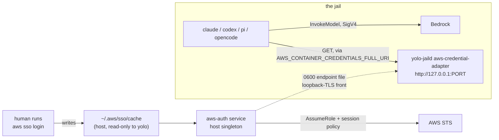

# Bedrock from an SSO login, without handing over the account

**Status:** DESIGN, 2026-09-17. Nothing built. Repo claims verified against `d4c0e7e3`;
every agent-artifact and vendor claim carries its version and date in
[§11](#11-evidence-and-how-to-re-check-it).

> **In short.** Least privilege and transparent refresh are independent problems with
> different solutions: narrowing happens **host-side, before the credential crosses**, and
> refresh happens only if what crosses is a **pointer rather than a value**. That makes this
> a pack, not a proxy.

**Why it matters.** Today the only sanctioned route is `env_sources`, which resolves once at
launch and writes a cleartext value into the jail
([`agent-credentials.md`](../reference/agent-credentials.md), *the sanctioned secret channel*).
An `aws sso login` cannot reach a running jail through it at all, so "re-login and keep
working" means relaunching every jail — and the thing relaunched with is a static key that
outlives the session it was cut from.

**The shape.** A host singleton owns the SSO-derived credential and narrows it; a jail-side
adapter serves the **AWS container-credentials protocol** on jail loopback; two pointer
variables in the jail env name it. Both halves are the shapes `packs/openai-auth` already
ships.

**Cost.** One more host daemon and one more `yolo-jaild` subcommand. Scoping down to
*inference only* needs one IAM role to assume — often self-serve, but somebody has to create
it, and until it exists the service can narrow to the Bedrock **service** but not to
`InvokeModel` ([OQ-SSO1](#OQ-SSO1) decides what it does in the meantime). Nothing here
reaches `macos-user`.

**Start at [§2](#2-two-requirements-two-axes--and-they-do-not-share-a-mechanism)** — the two
axes. Every option below is a point on that grid and nothing else in this doc makes sense
first.

**Needs your ruling:** [OQ-SSO1](#OQ-SSO1), [OQ-SSO2](#OQ-SSO2), [OQ-SSO3](#OQ-SSO3),
[OQ-SSO4](#OQ-SSO4), [OQ-SSO5](#OQ-SSO5), [OQ-SSO6](#OQ-SSO6).

**Reads with:** [`bedrock-plumbing.md`](bedrock-plumbing.md) (its
[§9](bedrock-plumbing.md#9-non-goals) excludes *"no credential lifecycle … no refresh daemon,
no broker"* and *"no `~/.aws` mount"* — this doc is exactly that excluded half, and the two
compose without either changing),
[`../reference/agent-credentials.md`](../reference/agent-credentials.md) (the channel
enumeration this adds to, and the boundary rules it must not break),
[`openai-auth-broker.md`](openai-auth-broker.md) (the host-singleton-plus-jail-adapter shape,
built),
[`boundary-broker.md`](boundary-broker.md) (where a human-approval tier would live if
[OQ-SSO6](#OQ-SSO6) ever wants one),
[`sso-backed-bedrock-plan.md`](sso-backed-bedrock-plan.md) (the implementation sketch —
incomplete, and unstable while questions are open).

---

## 1. Verdict and principles

**Build the credential service and the container-credentials adapter. Ship the Bedrock API
key arm beside it for clients that ignore the AWS chain. Do not build a proxy.**

Four principles the rest leans on.

**P1. Narrowing and refreshing are different problems, and one mechanism cannot do both.**
A credential is narrowed once, host-side, at mint time; it is refreshed repeatedly, over the
boundary, for as long as the jail lives. Conflating them is how you end up asking for a proxy
when what you need is a pointer.

**P2. yolo consumes an SSO session; it never creates or refreshes one.** The human runs
`aws sso login`. yolo reads the result and derives short-lived credentials from it. This is
not modesty — it is what removes the refresh-token rotation race that both existing brokers
exist to serialize, because the token yolo would have to rotate is one the host's own `aws`
CLI rotates too, and yolo cannot make that CLI take a lock. [OQ-SSO3](#OQ-SSO3) is where this
principle is expensive.

**P3. What crosses the boundary is a POINTER; the value is fetched.** This is the existing
rule one level out — `api_key_env_name` is *"the NAME of the environment variable holding the
credential — never the credential"* (`internal/packdecl/contributes.go:265`). Here the
variable itself holds a URL, and the credential is never in any environment at all. The
refresh requirement falls out of this and nothing else: a value cannot be refreshed after the
launch that wrote it, and a pointer does not need to be.

**P4. A credential the jail does not need is a credential that does not cross.** The
enumerated channels in
[`agent-credentials.md`](../reference/agent-credentials.md#the-delivery-channels) are an
allowlist by construction, and this adds one more to the list rather than widening any
existing one.

---

## 2. Two requirements, two axes — and they do not share a mechanism

The ask has two halves. They look like one problem and they are not.

| | The question | Where it is answered | What answers it |
| :--- | :--- | :--- | :--- |
| **Narrowing** | What can the thing in the jail do? | host-side, at mint time | a credential's **shape**, or an IAM **session policy** |
| **Refresh** | What happens when the session behind it moves? | jail-side, at use time | whether the jail holds a **value** or a **pointer** |

Two coinages, used throughout.

- A **push channel** *(coined here)* delivers a credential **value** into the jail once, and
  the jail keeps it. `env_sources` is the only one yolo has. It is not about who dials — the
  jail always dials — it is about whether the bytes that authenticate were fixed before the
  agent started.
- A **pull channel** *(coined here)* delivers a **pointer**, and the credential is fetched
  from behind it on demand. Nothing in yolo does this for AWS today.

And on the other axis:

- **Shape-scoped** *(coined here)* means the credential is narrow because of what it
  cryptographically *is* — a SigV4 presign whose credential scope names one service and one
  region cannot be replayed against another service, whatever IAM says.
- **Policy-scoped** *(coined here)* means it is narrow because IAM says so — a session policy
  intersected with the role's own policy.

The two are independent and they compose. Shape-scoping needs no AWS-side configuration at
all and cannot narrow *within* Bedrock; policy-scoping can narrow to a single action and
needs a role someone has to create.

> [!IMPORTANT]
> **The refresh requirement alone eliminates every channel yolo has today.** `env_sources`
> resolves host-side at launch and writes a file the jail sources
> (`internal/config/envsources.go:115`, `internal/cli/run/userenv.go`). Nothing re-runs it
> while a jail is up. So "re-run `aws sso login` and the agent keeps working" is not a
> configuration of the existing channel — it is a different channel.

---

## 3. What exists today

### 3.1 In yolo

- **`~/.aws` is not in the jail, on any backend.** Container backends never make the host home
  a mount source; `macos-user` denies reads under `/Users` and re-allows only the yolo home
  and the workspace (`internal/macosuser/seatbelt.go:74-80`). There is no deny-list entry
  naming `.aws` and there does not need to be.
- **The `bedrock` provider is claude's and carries no credential**
  (`packs/claude/pack.json:120-152`): a `kind: "provider"` with a name and nothing else, a
  profile selecting it, a profile-gated `CLAUDE_CODE_USE_BEDROCK=1`, and the matching
  config-overlay. The region reaches claude through its derive
  (`packs/claude/derive.lua:136-138`, `p.region` → `AWS_REGION`).
- **The host-singleton-plus-jail-adapter shape is built, twice.** `packs/openai-auth` ships a
  loophole whose `host_daemon` is `scope: "host"`, `publishes: "socket"`, and whose
  `jail_daemon` is `yolo-jaild openai-auth-adapter --listen 127.0.0.1:1460`
  (`packs/openai-auth/loopholes/openai-auth-broker/manifest.jsonc`). The adapter's package
  doc states the property this design wants verbatim: *"no canonical refresh token is stored
  in the jail"* (`internal/openaiauthadapter/handler.go:1-3`).
- **A pack-shipped loophole may not set jail env** — `jail_env` is refused, and the refusal
  hands back the `kind: "env"` contribution instead
  (`internal/loopholedecl/packshipped.go:126-134`). `packs/audio` is the shipped precedent for
  a pack carrying a loophole and its environment variables side by side.
- **A pack-shipped loophole must `publish: "socket"`** and let the framework run the TLS front
  (`internal/loopholedecl/packshipped.go:471-480`). The per-jail endpoint file is `0600` and
  is the jail's only credential for the hop.
- **`env_sources` values land cleartext at `0644`** in several agent config files and a render
  sidecar, and ride the process argv on `macos-user`
  ([`agent-credentials.md`](../reference/agent-credentials.md), the second warning under that
  channel). That is the cost of the only channel available today.

### 3.2 On the AWS side

Vendor facts, all dated in [§11](#11-evidence-and-how-to-re-check-it).

| Fact | Consequence here |
| :--- | :--- |
| `aws sso login` caches an access token plus a rotating refresh token under `~/.aws/sso/cache/`, and the SDKs refresh the access token against the portal session | the host has a live thing to derive from, and re-login replaces it in place |
| **Three separate duration limits stack here, and only one is per-role.** See [§6](#6-narrowing--shape-scoped-and-policy-scoped) for which dial moves what | the answer to *"can we just issue longer tokens?"* is different for each arm |
| A **session policy** on `AssumeRole` yields the **intersection** of the role's policy and the session policy | policy-scoping, and it needs a role to assume |
| SSO permission-set credentials are **already a role session**, so any `AssumeRole` from them is **role chaining**, which *"limits your … role session to a maximum of one hour … regardless of the maximum session duration configured for individual roles"* | the scoped credential is a 1-hour object, and **creating the role does not raise that** — a `MaxSessionDuration` of 12h on it changes nothing. It is re-minted rather than handed over once, which is why the ceiling costs nothing ([§6](#6-narrowing--shape-scoped-and-policy-scoped)) |
| `GetFederationToken` takes a session policy but requires IAM **user** credentials | unavailable from SSO — a dead end worth not re-deriving |
| A **short-term Bedrock API key** is a base64'd SigV4 presign, ≤12h, *"inherit[s] the permissions attached to the principal"*, and *"can be used only in the AWS Region from which you generated it"* | shape-scoping, with zero AWS-side configuration |
| Bedrock API keys are *"limited to Amazon Bedrock and Amazon Bedrock Runtime actions"* | the shape genuinely is the boundary, not a policy someone has to get right |
| The **container-credentials provider** accepts plain `http` on `127.0.0.0/8`, and its response contract is `{AccessKeyId, SecretAccessKey, Token, Expiration}` with all four required strings | a pull channel that needs no CA, no new file surface, and no per-agent code |

**And the fact that decides the design: every agent yolo ships already implements the pull
channel.** `AWS_CONTAINER_CREDENTIALS_FULL_URI` and `AWS_CONTAINER_AUTHORIZATION_TOKEN` are
present in the shipped artifacts of claude 2.1.274, codex 0.145.0, pi 0.85.1 and opencode
1.18.31 — read from the binaries and bundles installed in this jail on 2026-09-17
([§11](#11-evidence-and-how-to-re-check-it)). This is the same convergence
[`bedrock-plumbing.md`](bedrock-plumbing.md#4-what-each-agent-can-actually-do) found on
`AWS_BEARER_TOKEN_BEDROCK`, one layer down and stronger: it is not a variable four vendors
agreed on, it is an AWS SDK feature four vendors inherited.

---

### 3.3 Four AWS words this doc leans on

The [§6](#6-narrowing--shape-scoped-and-policy-scoped) ladder is unreadable if these four
blur together, and two of them are named confusingly by AWS itself.

| Term | What it is | Where it is configured |
| :--- | :--- | :--- |
| **Policy** | a JSON document listing allowed and denied actions. It attaches to things; it is not an identity and nothing assumes it | IAM, or inline wherever it is attached |
| **IAM role** | an identity inside **one** AWS account with no long-term credentials, carrying two policies: a **permissions policy** (what it may do) and a **trust policy** (who may assume it). You assume it and get temporary credentials for a **role session** | IAM, per account — `arn:aws:iam::<account>:role/<name>` |
| **Permission set** | a role **template**, defined once centrally and **assigned** to a user or group × account. On assignment Identity Center creates a real IAM role in that account, named `AWSReservedSSO_*`, with the permission set's policies attached and a trust policy only it can use. Takes up to 10 managed policies plus one inline policy, and carries its own **1–12h** session duration | the Identity Center console, once — not per account |
| **Session policy** | a policy passed **at `AssumeRole` time**, attached to nothing and living only for that session. Effective permissions are its **intersection** with the role's own | nowhere — it is an API parameter |

And one that is not an AWS-side object at all:

> **A profile** (`~/.aws/config`) is **client-side only** and has no permissions. It is a named
> block saying which permission set, in which account, this machine should ask for. ⚠ Its key
> is spelled **`sso_role_name`** and AWS defines it as *"The name of a permission set
> provisioned as an IAM role … Use the role name, not the role Amazon Resource Name (ARN)"* —
> the setting says role, the value is a **permission set name**. Everything in this doc that
> says "point the daemon at a profile" means this file and nothing in AWS.

**N3 and N4 differ on exactly this distinction.** N3 is a role **you** create in IAM and
assume — a *second* role session, so chained, so an hour. N4 is a permission set an admin
**assigns** you, whose role you receive directly from `sso:GetRoleCredentials` — a *first*
role session, so not chained, so up to twelve hours. Same policies, same narrowing; the
difference is entirely which of these two objects holds them.


## 4. Five options

The grid from [§2](#2-two-requirements-two-axes--and-they-do-not-share-a-mechanism), populated.
Each row states what the jail ends up holding, because that is the question being asked.

| | What the jail holds | Narrowed by | Refreshes? | Verdict |
| :--- | :--- | :--- | :--- | :--- |
| **A. Mount the wallet** — `host_files` on `~/.aws` | the whole SSO session, refresh token included | nothing | yes, by accident | **Rejected** |
| **B. A key in a dotenv** — today's `env_sources` + `AWS_BEARER_TOKEN_BEDROCK` | a bearer, ≤12h | shape | **no** | **Rejected as the answer; kept as the no-daemon fallback** |
| **C. Credential service + container-credentials endpoint** | a pointer | policy (session policy) | **yes** | **Adopt** |
| **D. Credential service + minted Bedrock API key** | a bearer, ≤12h | shape | no, within a launch | **Adopt as a companion, not an alternative** |
| **E. Signing proxy** | nothing | the proxy's own allowlist | yes | **Rejected for v1; named because it is the only answer to "zero credential"** |

**A. Mount the wallet.** A user can do this today with one `host_files` entry, and some will.
It is the honest baseline and it fails the ask completely: the jail gets every permission the
permission set grants, plus the refresh token, plus every other profile in the file. It is
also the only option that satisfies the refresh requirement for free, which is exactly why it
is tempting. *Rejected* — and worth naming in the pack README so the tempting version is
refused in prose rather than discovered.

**B. A key in a dotenv.** What exists. `AWS_BEARER_TOKEN_BEDROCK` is shape-scoped, which is
better than people assume, and it is frozen at launch, which is the whole complaint.
*Rejected as the answer*, kept because it is the only option with no host daemon, and a
machine where the daemon cannot run should still reach Bedrock.

**C. Credential service + container-credentials endpoint.** [§5](#5-the-recommended-shape).
The host singleton owns the narrowed session; the jail-side adapter serves the AWS container
protocol; the SDK re-fetches five minutes before expiry without anyone being told to.
*Adopt.*

**D. Credential service + minted Bedrock API key.** Same host half; the daemon presigns a
short-term Bedrock API key instead of handing over STS credentials, and the boot writes it
into the jail env. It is the only option that is narrow **with no AWS-side change at all**,
because the narrowing is the signature's credential scope rather than a policy. It is also
the only one that reaches a client which reads `AWS_BEARER_TOKEN_BEDROCK` and never consults
the chain. *Adopt as a companion* — and see the exclusivity rule in
[§8](#8-behaviour-this-design-specifies), because in every client measured the bearer **beats**
the chain, so a jail configured for both silently gets the frozen one.

**E. Signing proxy.** The jail sends unsigned requests to a loopback forwarder; the host
re-signs with SigV4 and forwards to AWS. It is the only option where the jail holds nothing,
it narrows per request (model allowlist, spend cap), and it refreshes perfectly because the
credential never leaves the host. It also costs: yolo would own a Bedrock wire implementation
including binary event-stream passthrough, the per-agent URL override is different for each
of the four, and **the host would see every prompt in cleartext** — a privacy change, not just
an engineering one. *Rejected for v1.* If the requirement is literally "no AWS credential in
the jail", this is the option and nothing above substitutes for it.

---

## 5. The recommended shape

Three components. Two are copies of things that exist.



**The `aws-auth` pack, its own pack.** Not a contribution of `packs/claude` and not one of the
`bedrock` pack [`bedrock-plumbing.md`](bedrock-plumbing.md#61-three-providers-because-a-models-map-cannot-hold-two-model-families)
proposes, because the service serves consumers in **both** — claude's `bedrock` provider lives
in `packs/claude` and the other three agents' would live in the new `bedrock` pack, so a
contribution of either would make one depend on the other. That is the same test
[OQ-A10](../reference/loophole-system.md#why-its-this-way) applied to the Claude broker and
got the opposite answer for: there the dependency was structural to one pack. Here it is
shared, so this is `openai-auth`'s situation, and `needs: [{"pack": "aws-auth"}]` on each
consumer is how they join (`packs/claude/pack.json:181-188` is the shipped spelling).

**The host service** holds one job: turn a live SSO session into a short-lived, narrowed
credential, and answer for it. It never writes a credential into a jail, never mounts
anything, and its state directory crosses only an inert sentinel — the `state_files`
discipline `openai-auth` records in a comment, *"keep this list nonempty or credentials.json
would cross into every jail."*

**The jail adapter** is one more `yolo-jaild` subcommand beside the three that exist
(`cmd/yolo-jaild/main.go:34-40`). It speaks the container-credentials protocol on jail
loopback and forwards through the authenticated front. It holds nothing across a request.

**The container-credentials protocol**, since the name oversells it. It is how ECS task roles
and EKS Pod Identity hand a container its credentials — AWS generalised it from those two
fixed link-local addresses (`169.254.170.2`, `169.254.170.23`) to any address the SDK will
accept, which is what `AWS_CONTAINER_CREDENTIALS_FULL_URI` names. In full:

| | |
| :--- | :--- |
| **Request** | one HTTP `GET` to that URI. No body, no signing, no handshake, no negotiation |
| **Auth** | an optional `Authorization` header, sent verbatim from `AWS_CONTAINER_AUTHORIZATION_TOKEN` (or the contents of `…_TOKEN_FILE`). Set neither and the SDK sends no header |
| **Success** | `200` with `{"AccessKeyId": …, "SecretAccessKey": …, "Token": …, "Expiration": "<RFC3339>"}` — all four required strings, nothing else read |
| **Failure** | `4xx` with `{"Code": …, "Message": …}`, both surfaced on the error the SDK raises; any other status is a bare failure |
| **Retry** | 3 attempts, each with a 1000 ms timeout, 1000 ms apart |

So: **an unauthenticated loopback endpoint that returns whatever credentials it likes, which
every AWS SDK already knows how to ask.** That is the whole appeal — no CA, no new file
surface, no per-agent code — and it is worth being plain that it is also the whole hazard.

> [!WARNING]
> **The boundary is positional, and the position is the network namespace.** The SDK speaks
> plain `http` only to `127.0.0.0/8` or those two link-local addresses (`checkUrl.js`), so the
> endpoint is unreachable from outside the jail, and *that* is what protects it. **Inside the
> jail there is no boundary at all**: every MCP server, every command the agent runs, every
> `curl` can `GET` the same credentials. Nothing can change that — see the token paragraph
> below — so the blast radius of this endpoint is exactly *"whatever the credential can do."*
> That is the reason [OQ-SSO1](#OQ-SSO1) is the closure question for the design rather than a
> configuration detail: the narrowing is not defence in depth here, it is the only defence.

**What lands in the jail environment** is two pointers and a region, through the pack's
`kind: "env"` contribution — the loophole cannot set them itself
(`internal/loopholedecl/packshipped.go:126-134`):

```
AWS_CONTAINER_CREDENTIALS_FULL_URI=http://127.0.0.1:<port>/credentials
AWS_REGION=<from the provider entry's region field, as today>
```

**No authorization token, deliberately.** The SDK sends `Authorization` only when
`AWS_CONTAINER_AUTHORIZATION_TOKEN` is set, and setting it here would buy nothing: an
environment variable is inherited by every process the agent spawns, which is the reason
[`agent-credentials.md`](../reference/agent-credentials.md) gives for the broker hop having
no token variable at all. Everything that could read the token can already reach the port.
The boundary is the `0600` endpoint file on the hop the adapter makes, not a header on the
hop it serves.

> [!WARNING]
> **A nested jail shares this port.** Podman-in-podman forces `--net=host`, so a nested
> jail's loopback *is* this jail's loopback and its SDKs will resolve these credentials. That
> is a property, not a defect — a nested jail already shares this jail's home — but it means
> the adapter's reachability is the jail's netns, and anything reasoning about who may mint
> must reason at the netns, not the process.

**Why plain HTTP and not the TLS front directly.** The container provider accepts `http` only
on loopback and accepts `https` anywhere, so pointing it straight at the per-jail front is
representable. It is rejected because the jail's CA reaches Node, Python, curl and git through
`$HOME/.yolo-ca-bundle.crt` (`internal/entrypoint/shell.go:225-235`) and **not** uniformly
through every SDK's own trust path; a channel whose correctness depends on four vendors'
TLS-root behaviour is a channel that will break for one of them silently. The loopback
carve-out is written into the SDK for exactly this case.

---

## 6. Narrowing — shape-scoped and policy-scoped

Three ways to make what the jail holds smaller than what the login can do. They are not
alternatives so much as a ladder, and the interesting fact is that the two cheapest ones cut
along **different** dimensions.

| | Mechanism | Needs from AWS | Narrows to | Ceiling |
| :--- | :--- | :--- | :--- | :--- |
| **N1** | short-term Bedrock API key (presign) | nothing | **the Bedrock service**, one region | 12h |
| **N2** | `AssumeRole` + inline session policy | one role whose trust policy names the SSO role | **named actions**, e.g. `InvokeModel*` only | 1h, not raisable — re-minted |
| **N3** | a purpose-built IAM role with only Bedrock permissions, **assumed** | a role, plus its trust policy | the role's own policy | 1h, not raisable — same chaining cap as N2 |
| **N4** | a purpose-built **permission set** with only Bedrock permissions, **assigned** | an admin creates and assigns it | the permission set's own policy | **up to 12h** — no chaining, and per-permission-set |

**N1 costs nothing and is stronger than it sounds.** The credential scope string a SigV4
presign signs is `<akid>/<date>/<region>/bedrock/aws4_request`, and the signature covers it —
so the credential cannot authenticate a request to STS, S3 or IAM. It is *cryptographically*
Bedrock-only. What it does **not** narrow is which Bedrock actions: it inherits the principal's
permissions, so a permission set that can delete a guardrail mints a key that can delete a
guardrail.

**N2 is the cheapest one that narrows inside Bedrock**, and the role it needs may well be
self-serve — `iam:CreateRole` is in many developer permission sets. It is not the *best* one;
N4 below is, and the only reason N2 leads is that it needs nothing from anybody else.

> [!IMPORTANT]
> **The 1-hour ceiling is not raisable, and it does not matter.** Setting
> `MaxSessionDuration: 12h` on the role you create buys nothing: IAM Identity Center has
> already handed you a role session, so your `AssumeRole` is role chaining and STS caps the
> result at an hour whatever the role says. It costs nothing because
> [§7](#7-refresh--what-happens-when-you-log-in-again)'s channel makes a credential's TTL
> invisible — the SDK re-fetches five minutes out, the daemon re-mints from the still-live
> SSO session, and nobody is interrupted. **The only lifetime a human ever feels is the SSO
> session's**, and that is the one `aws sso login` renews. Note which way the asymmetry runs,
> because it is backwards from the intuition: N1 can reach twelve hours *precisely because it
> is a presign rather than an `AssumeRole`*, so the **less** narrow arm is the longer-lived
> one. A push channel would have to trade those off; this one does not.

**The three duration dials, and which one you can actually move.** *"Can we just issue longer
tokens?"* has a different answer per dial, and only the middle one is per-role.

| Dial | Range | Default | Set where | Per role? |
| :--- | :--- | :--- | :--- | :--- |
| **User interactive (portal) session** — how long before `aws sso login` is needed again | 15 min – **90 days** | 8h | Identity Center **Settings → Authentication**, once | **No — instance-wide**, every user and every application |
| **Permission set session** — how long `sso:GetRoleCredentials` output lives | 1h – **12h** | 1h | per permission set, reprovisioned on save | **Yes** |
| **Role chaining** — the ceiling on an `AssumeRole` made from either of the above | **1h**, fixed | 1h | nowhere | No, and not configurable |

Reading that against the arms: **for N2/N3 the only dial that changes anything is the portal
session**, because the daemon's ability to keep re-minting lasts exactly as long as the
refresh token behind it, and the credential itself is chained at an hour either way — so the
dial that helps is the one you *cannot* scope to a single role. **For N1 the per-role dial is
the useful one**: a short-term Bedrock API key lives for the shorter of 12h and the principal's
remaining session, so a permission set left at the 1h default caps the bearer at an hour, and
raising that one permission set to 12h is a real change nobody else feels.

> [!WARNING]
> **A long portal session is not always the number you set.** With AWS Managed Microsoft AD as
> the identity source the Kerberos ticket lifetime is fixed at 10 hours and the session becomes
> *"the shorter of the IAM Identity Center setting and 10 hours"* — so a 28-hour setting is
> silently a 10-hour one. With an external IdP that passes `SessionNotOnOrAfter`, the effective
> value is the shorter of the IdP's session and the Identity Center setting. And long sessions
> need the **`sso-session` token-provider** config plus AWS CLI v2 ≥ 2.9; the legacy
> profile-only SSO form does not refresh. Measure the session you actually get before designing
> around the number in the console.

**N4 is the one to ask your admin for, and it is not N3 with different words.** N3 is a role
you *assume*, so it is chained and capped at an hour; N4 is a permission set you are
*assigned*, so the credentials come straight out of `sso:GetRoleCredentials` and are the
**first** role session rather than a second one. Nothing is chained, so the cap does not
apply and the permission set's own 1–12h dial does. A permission set takes an inline policy
like any other, so "Bedrock inference only" is an ordinary thing to build. Three consequences
worth having in one place: the daemon does **less** work under N4 — no `AssumeRole` at all,
just resolve a profile — the duration dial becomes per-role after all, and the window goes
from one hour to twelve.

**So: can you get the `+12`?** Yes, three ways, and the table below is the whole answer.
What does not exist is a **chained** credential that lasts longer than an hour — that cell is
empty and no configuration fills it.

| | Narrowed to | Tail past the portal session | Refreshes |
| :--- | :--- | :--- | :--- |
| N2 / N3 — chained | named actions | **+1h**, and not raisable | yes |
| N4 — a Bedrock-only permission set | the permission set's policy | **up to +12h** | yes |
| Un-narrowed permission set credentials | nothing ([OQ-SSO1](#OQ-SSO1)) | up to +12h | yes |
| N1 — the presigned bearer | the Bedrock **service** | 12h total, not a tail | **no** |

**N1 and N2 compose**, and composed they are the actual answer to the question as asked:
assume the scoped role, then presign from the scoped session, and the result is a credential
that is Bedrock-only by shape *and* invoke-only by policy.

**A real token in the jail is the target state, not a compromise.** The jail holding a
short-lived credential it can use for nothing but Bedrock inference is what "no more than
Bedrock" means here, and N2 alone gets there — it is precisely the thing the pull channel
in [§5](#5-the-recommended-shape) is built to deliver and keep fresh. Holding *no* credential
at all is a different and stronger property, and it costs a wire implementation and the host
seeing every prompt; it is priced as [option E](#4-five-options) and deliberately not
pursued. Do not read the presence of a token in the jail as this design falling short of one.

What the service does when neither is configured is [OQ-SSO1](#OQ-SSO1), and it is the
security posture of the whole feature: serving an un-narrowed SSO session over a beautifully
refreshing pull channel would be option A with extra steps.

---

## 7. Refresh — what happens when you log in again

The headline requirement, stated as a sequence.

1. The human runs `aws sso login --profile X` on the host. A new access token lands in
   `~/.aws/sso/cache/`.
2. Nothing tells the jail. Nothing needs to: the jail holds no credential to invalidate.
3. The agent's next credential fetch happens when the SDK's memoized credential is inside
   **five minutes** of expiry — measured, `credentialsTreatedAsExpired` at
   `300000` ms — and the refresh is *passive*, so a request in flight is not blocked.
4. The adapter forwards; the service mints from whatever session is live **now**; the agent
   gets a fresh credential and never learns that anything happened.

**And when the session is not live.** It **never fires a login** — that is P2, and
[OQ-SSO6](#OQ-SSO6) is the question of whether it ever should. It errors, and the remedy is
the ordinary gesture:

1. The SSO session lapses. **Nothing breaks yet**: the credential the agent is holding is
   good for up to an hour more and does not care that the session behind it is gone. The
   daemon's next re-mint is the first thing to fail, so the lapse is felt late and at a
   moment unrelated to the logout.
2. That re-mint fails, the adapter answers `4xx`, and the SDK raises an error carrying the
   `Message` below. **The turn in progress fails** — the SDK's three retries are a second
   apart, which is not a human's login, and nothing should pretend otherwise.
3. The human runs `aws sso login --profile X` on the host. Exactly as normal; yolo is not
   involved and does not need to be.
4. The agent's next turn re-resolves the chain, hits the adapter, and works. **No jail
   restart, no relaunch, no re-attach** — Claude Code clears its credential cache on a
   credential error, so there is no poisoned state to clear by hand.

So: one failed turn, one `aws sso login`, carry on. The only thing the human has to know is
which command to run, which is why the error text carries it verbatim.

**How much you get out of one login, and why it is not a round number.** The tail in step 1
is real and AWS documents the stacking with its own worked example — a 20-hour portal session
and a 12-hour permission set *"runs for the maximum of 20 hours plus 12 hours for a total of
32 hours"* if you mint just before the session dies. Here the second term is the chained
hour, so an 8-hour session tops out a second short of **nine hours**. You will not get that,
and nothing should be built expecting it: the daemon mints on its **own** clock, roughly every
50 minutes ([§8](#8-behaviour-this-design-specifies)), so the last mint before expiry lands
somewhere in the preceding 50 minutes and the usable window is **~8h10m to ~9h, depending on
phase**. Document the behaviour so the tail is not filed as a bug — "it kept working for
forty minutes after I logged out" is this, working correctly. **The `+1` is the chained arm's
number, not the design's**: on N4 the tail is the permission set's own duration, so the same
8-hour session yields up to 20 hours ([§6](#6-narrowing--shape-scoped-and-policy-scoped)).

> [!WARNING]
> **That tail assumes the daemon can still mint at T+7:59:59, and that assumption has a
> dependency the rest of this section does not state.** Minting needs a valid Identity Center
> **access token**, and AWS calls it *"the hourly access token … automatically refreshed
> using the refresh token."* Refreshing it is exactly the write to `~/.aws/sso/cache` that
> [OQ-SSO3](#OQ-SSO3) is about — so under the read-only reading the daemon can only mint while
> a token somebody **else** refreshed is still valid, and the window could be the access
> token's life rather than the portal session's. Public sources disagree on that raw lifetime
> (AWS's own text says hourly; a widely-cited teardown says a non-configurable 8 hours), and
> it is not settleable from here. **Measure it on the real machine before ruling
> [OQ-SSO3](#OQ-SSO3)** — it is the difference between an 8-hour window and a 1-hour one.

Two timing facts the implementation has to respect, both measured from the vendored provider
rather than from documentation:

> [!WARNING]
> **The fetch has a one-second budget.** `fromHttp` builds its handler with
> `requestTimeout: options.timeout ?? 1000` and `connectionTimeout` the same, retrying
> `maxRetries ?? 3` times with a 1000 ms delay. A mint that does an `AssumeRole` round trip
> inside the request will sometimes miss it. **The request path must be a cache read**: the
> service pre-mints and re-mints on its own clock, and serving is a lookup. Designing this as
> "fetch on demand" passes every test on a warm network and fails on a cold one.

**The failure path has a place to put a sentence, and it should use it.** On a 4xx the
provider parses the body and attaches `Code` and `Message` to the error it raises, so the
service can answer an expired session with a body naming the exact command:

```json
{"Code": "ExpiredSSOSession",
 "Message": "yolo: the AWS SSO session for profile 'X' has expired. On the host, run: aws sso login --profile X"}
```

That is the whole human-in-the-loop story for v1, and it is one-way by design: the jail is
told what to ask for and a human does it. Making the jail able to *trigger* a host login is
[`boundary-broker.md`](boundary-broker.md)'s approval queue, and half of it built here would
be the second front door that document exists to prevent ([OQ-SSO6](#OQ-SSO6)).

---

## 8. Behaviour this design specifies

Written for the implementer. Anything not here and not an open question is theirs.

**Degenerate inputs.**
- No profile configured → the pack contributes nothing, the loophole does not start, and the
  launch says so once. Not an error: a selected pack with no configuration is inert.
- Profile configured, no SSO session ever established → the launch **warns** with the
  `aws sso login` command and proceeds. It does not refuse: the human may be about to log in,
  and a jail that will not start is worse than a first request that fails clearly.
- SSO session present but expired at launch → identical to the above. Expiry is a runtime
  state, not a configuration error.
- A profile that is not an SSO profile (static keys, `credential_process`) → served the same
  way. The service resolves a profile; how that profile gets its credentials is AWS's problem.
  Say so, so nobody adds an SSO-only check.
- Two agents in one jail, both fetching → the adapter is stateless per request and the service
  serializes; concurrent fetches return the same cached credential.

**Failure paths.** Every one of these is observable by the human, and none is silent.

| Failure | What the jail sees | What the human sees |
| :--- | :--- | :--- |
| SSO session expired | 4xx with `Code`/`Message` naming the login command | the agent's error text |
| The role or session policy is rejected by STS | 4xx, STS's own message forwarded | the agent's error text, plus a host service log line |
| The host service is down | the adapter's connect fails; the SDK retries 3× then falls through the chain to IMDS and fails | the launch already refused — see below |
| The front is unreachable from the jail | **the launch refuses**, by the existing reachability witness (`internal/entrypoint/reachability.go`), which is fatal for an enabled jail-facing service | a refusal naming `YOLO_ALLOW_UNREACHABLE_SERVICES=1` |
| The `aws` CLI is missing on the host | the daemon fails **loudly at spawn** | a spawn failure report |

> [!WARNING]
> **Do not gate the loophole on `aws` being on the host PATH.** A `requires.command_on_path`
> probe is the shape that removed the Claude broker for exactly the user it existed for, and
> [`agent-credentials.md`](../reference/agent-credentials.md) records the rule that replaced
> it: *"a loophole whose program is missing must fail loudly at spawn, not disappear from
> `yolo loopholes list`."* The dependency is real; the probe is still wrong.

**Concurrency and ordering.** One writer of the minted-credential cache: the host service,
under one host-wide lock, as both existing brokers do. Mints are idempotent per (profile,
role, policy) within a credential's life. Two jails share the service and therefore share the
cache; a third arriving mid-mint waits rather than starting a second.

**Defaults, with units.** Re-mint when the cached credential has less than **10 minutes**
remaining — twice the SDK's own 5-minute window, so the cache is always warm when the agent
asks. Requested session duration **3600 s** (the role-chaining ceiling; a shorter value only
adds mints). Presign expiry for the N1 arm **43200 s** (12h, the maximum). Serve timeout
budget **under 200 ms** at the adapter, because of the SDK's 1000 ms ceiling. No retry inside
the request path: the SDK already retries three times.

**Trigger.** The service mints on two events and no others: a fetch that finds the cache cold
or inside the re-mint window, and its own timer at half the re-mint window. There is no
watcher on `~/.aws`, because a mint re-reads the session anyway and a watcher would be a
second source of truth for the same fact.

**Pre-existing state.** Jails using `AWS_BEARER_TOKEN_BEDROCK` through `env_sources` keep
working unchanged; the pack is opt-in and nothing in this design reads that variable. What it
must not do is *coexist* with it silently — see Forbidden.

**One writer, named.** The host service writes the minted-credential cache. Nothing writes
`~/.aws` (P2, subject to [OQ-SSO3](#OQ-SSO3)). The pack's `kind: "env"` contribution writes
the two pointer variables; the provider entry writes `AWS_REGION`, as it does today
(`packs/claude/derive.lua:136-138`) — the credential service never supplies a region, because
the container-credentials response has no field for one and a second writer of a fact the
provider already owns is how the Bedrock region got confusing in the first place.

**Forbidden.**
- **Never enable both arms in one jail.** `AWS_BEARER_TOKEN_BEDROCK` takes precedence over the
  credential chain in every client measured, so a jail with both configured uses the frozen
  bearer and the pull channel never runs — a silent wrong answer. Refuse the launch, naming
  which one to drop ([OQ-SSO5](#OQ-SSO5)).
- **Never grant `~/.aws` alongside this.** `fromIni` sits **ahead** of the container provider
  in the measured chain order, so a `host_files` mount of `~/.aws` does not merely duplicate
  this feature, it *disables* it while looking like it works.
- Never write a credential value into any jail-visible file, any agent settings block, or any
  environment variable.
- Never let the jail name the profile, role or policy it wants (see
  [OQ-SSO4](#OQ-SSO4) for where that is configured instead).
- Never refresh or rotate the host's SSO token as a side effect of serving a jail, unless
  [OQ-SSO3](#OQ-SSO3) rules otherwise.
- **Never set `awsAuthRefresh` or `awsCredentialExport`** in the composed claude settings.
  Both are push-shaped and belong to a host where `aws` and `~/.aws` exist; in the jail
  neither does, so `awsAuthRefresh` would fire a command that is not there at exactly the
  moment the session lapsed, turning a clear error into a confusing one. Claude Code's own
  docs also record `awsAuthRefresh` looping indefinitely when a browser flow is interrupted —
  a failure mode a jail can only reproduce, never resolve.

**What done looks like.** Seven observable outcomes, in order of what they prove.

1. `aws sso login --profile X` on the host, then `yolo -p bedrock -- claude` completes a turn
   against Bedrock. Inside the jail, `env | grep -i aws` shows the two pointers and
   `AWS_REGION`, and **no secret**; `ls ~/.aws` fails.
2. `curl -s $AWS_CONTAINER_CREDENTIALS_FULL_URI` from inside the jail returns the four-key JSON
   with an `Expiration` under an hour out.
3. Leave the session idle past that expiry; the next turn succeeds with no human action.
4. **The headline:** let the SSO session lapse, re-run `aws sso login` on the host, and the
   *already-running* jail's next turn succeeds with no restart and no relaunch.
5. With those same credentials, an `aws s3 ls` from inside the jail is **denied** — the
   narrowing demonstrated rather than asserted. ⚠ **Do not probe with
   `sts:GetCallerIdentity`**: *"No permissions are required to perform this operation. If an
   administrator attaches a policy … that explicitly denies access to `sts:GetCallerIdentity`,
   you can still perform this operation."* It succeeds against a correctly narrowed credential
   and would read as the narrowing having failed. Probe with a call that a policy can actually
   refuse.
6. With the SSO session lapsed and not renewed, the next turn fails with an error whose text
   contains `aws sso login --profile X`.
7. The same jail with `-- codex`, `-- pi` and `-- opencode` each completes a turn on the same
   channel, with no per-agent code written for any of them.

---

## 9. Non-goals

- **Not a gateway, not a proxy, not a model router.** Option E is described and rejected; if
  it is ever wanted, it is its own doc.
- **No AWS credentials for anything but inference.** This design does not give a jail a way to
  call S3, deploy, or read Secrets Manager, and no configuration of it should.
- **No host login automation.** yolo never runs `aws sso login`, never opens a browser, never
  schedules a re-login.
- **No second secret channel.** `env_sources` keeps its job and its warnings; this is a
  channel for one shape of credential, not a general improvement to secrets.
- **No provider, profile or model-id work.** Those are
  [`bedrock-plumbing.md`](bedrock-plumbing.md)'s and this doc changes none of them. The two
  compose: that doc gets a region and a model id to the agent, this one gets a credential.
- **No `~/.aws` inside the jail, in any form**, including a yolo-composed one. That is a
  standing property of the boundary
  ([`agent-credentials.md`](../reference/agent-credentials.md)) and the reason
  `credential_process` is not the delivery ([§4](#4-five-options)).
- **Nothing for `macos-user` in v1.** The loophole kind is inert there —
  `backendInertReason` answers *"the macos-user backend starts no loophole host services"*
  (`internal/cli/run/loopholeinert.go:86-89`) — with exactly one hand-wired exception:
  `startOpenAIAuthDisclosed` starts `openai-auth-broker` alone, and `BuildRunPlan` grants its
  endpoint file to the sandbox uid by ACL (`internal/macosuser/runplan.go:375-376`). That
  one-off is the shape this service would take on that backend if it is ever wanted; the
  general framework is still unbuilt and is not this doc's to build.

---

## 10. Risks

| | Risk | Mitigation |
| :--- | :--- | :--- |
| **R1** | The 1000 ms SDK budget is missed on a cold cache and the agent sees a credential error that looks like an auth failure. | The pre-mint rule in [§8](#8-behaviour-this-design-specifies) is the mitigation, and done-condition 2 measures the served latency directly. If it still bites, the service can block the *launch* until its first mint lands rather than the *request*. |
| **R2** | Shelling out to the host `aws` CLI refreshes and rotates the SSO refresh token, racing the human's own CLI, which takes no lock. | [OQ-SSO3](#OQ-SSO3) is exactly this. The read-only leaning removes the race entirely at the cost of more logins. |
| **R3** | An admin will not create the role N2 needs, and the feature ships serving un-narrowed sessions "temporarily". | [OQ-SSO1](#OQ-SSO1). If the answer is refuse-by-default, this risk becomes a configuration error instead of a silent widening. |
| **R4** | A future AWS SDK tightens the loopback carve-out and plain HTTP stops being accepted. | `checkUrl.js` is 40 lines and re-checkable in seconds ([§11](#11-evidence-and-how-to-re-check-it)); the fallback is the per-jail TLS front, which is already published — it costs a CA-trust question per SDK, not a redesign. |
| **R5** | Four agents are claimed to work from string evidence, and only claude is exercised. | Done-condition 7 is a live turn on each. This is the standing weakness of every provider integration in this repo and the answer is the same: the done-conditions are turns, not greps. |
| **R6** | The nested-jail netns sharing in [§5](#5-the-recommended-shape) is discovered by someone reasoning about process isolation and read as a vulnerability. | It is documented here and belongs in the pack README. A nested jail shares the home already; the netns is not the widest thing it shares. |
| **R7** | The one dial that would make a human log in less often is **instance-wide**: extending the portal session past 8h changes it for every user and every application of that Identity Center instance. "I re-authenticate too much" therefore escalates into an org-wide security change. | Name it in the pack README rather than letting someone discover it in a change-request. The per-role dial ([§6](#6-narrowing--shape-scoped-and-policy-scoped)) helps only N1, and the honest alternative for a genuinely long-lived non-interactive credential is not an SSO dial at all — it is not using SSO as the daemon's source, which is a different threat model and not designed here. |

---

## 11. Evidence, and how to re-check it

Repo claims are at `d4c0e7e3` and cited inline by `file:line`. Everything below is a fact about
a third party, so it carries its artifact and its date.

**Agent artifacts — read 2026-09-17, in this jail, never executed.** The claim is that each
contains the container-credentials variable names, i.e. that each inherits an AWS SDK
implementing the pull channel.

| Agent | Artifact | `AWS_CONTAINER_CREDENTIALS_FULL_URI` | `AWS_CONTAINER_AUTHORIZATION_TOKEN` |
| :--- | :--- | :--- | :--- |
| claude 2.1.274 | `~/.local/share/claude/versions/2.1.274` (ELF) | 9 | 8 |
| codex 0.145.0 | `@openai/codex-linux-x64/vendor/x86_64-unknown-linux-musl/bin/codex` | 1 | 1 |
| pi 0.85.1 | `@earendil-works/pi-coding-agent/node_modules/@aws-sdk/credential-provider-http/` | present | present |
| opencode 1.18.31 | `opencode-ai/node_modules/opencode-linux-x64/bin/opencode` | present | present |

```console
$ grep -c -a AWS_CONTAINER_CREDENTIALS_FULL_URI ~/.local/share/claude/versions/*
```

**AWS SDK behaviour — read from pi 0.85.1's vendored `@aws-sdk/credential-provider-*`,
2026-09-17.** These are the load-bearing measurements and they are first-hand:

| Claim | Where |
| :--- | :--- |
| plain `http` accepted on `127.0.0.0/8`, `localhost`, `[::1]`, and the ECS/EKS link-local hosts; everything else must be `https` | `credential-provider-http/dist-cjs/fromHttp/checkUrl.js` |
| response must be `{AccessKeyId, SecretAccessKey, Token, Expiration}`, all strings, `Expiration` RFC3339; 4xx bodies surface `Code` and `Message` on the raised error | `…/fromHttp/requestHelpers.js`, `getCredentials` |
| request and connection timeout default **1000 ms**; `maxRetries ?? 3`, delay = timeout | `…/fromHttp/fromHttp.js` |
| chain order: env → SSO (inputs-gated) → ini → process → token-file → **remoteProvider**, and `remoteProvider` selects `fromHttp` only when one of the two container variables is set | `credential-provider-node/dist-es/defaultProvider.js`, `remoteProvider.js` |
| memoized credentials are treated as expired **300000 ms** before `Expiration`, and the refresh above that threshold is passive | `credential-provider-node/dist-cjs/index.js:151` |

**Claude Code specifics — [code.claude.com/docs/en/amazon-bedrock](https://code.claude.com/docs/en/amazon-bedrock), read 2026-09-17.**
*"Claude Code uses the default AWS SDK credential chain."* It caches resolved credentials
until five minutes before expiry (one hour when they carry none), times each chain resolve out
at 60 s, and exposes `awsAuthRefresh` (runs only when credentials are detected expired, after
an STS `GetCallerIdentity` check) and `awsCredentialExport` (runs at session start and each
reload; must emit `{"Credentials": {AccessKeyId, SecretAccessKey, SessionToken, Expiration?}}`).
Neither is needed by this design; both are why a *push* channel looked viable and is not.

**AWS — all read 2026-09-17.** Bedrock API key mechanics (short-term = presigned SigV4, ≤12h,
inherits the principal's permissions, single-Region) and the *"limited to Amazon Bedrock and
Amazon Bedrock Runtime actions"* restriction from the Bedrock user guide's API-keys pages. The
short-term key's wire shape — `bedrock-api-key-` + base64 of a presign of
`bedrock.amazonaws.com/?Action=CallWithBearerToken` with `X-Amz-Expires` up to 43200 — from the
`aws-bedrock-token-generator` packages and third-party teardowns, **not** from an AWS
specification; treat it as reimplementable but verify against the official generator before
trusting a hand-rolled presign. **Role chaining** is defined in the IAM User Guide's roles
terms and concepts — *"when you use a role to assume a second role"*, and the cap *"applies
regardless of the maximum session duration configured for individual roles"* — which is what
makes it bind on an Identity Center permission-set session; session-policy intersection and
`GetFederationToken`'s IAM-user requirement are from the STS API reference. The same reference
carries the `GetCallerIdentity` trap quoted in [§8](#8-behaviour-this-design-specifies): *"No permissions are required to perform this
operation"*, and it succeeds even under an explicit deny — so it is useless as a proof of
narrowing. SSO
token caching and the refresh flow are from the AWS SDK reference's *how IAM Identity Center
authentication is resolved*, which is also where *"the hourly access token … is automatically
refreshed using the refresh token"* and *"if the IAM Identity Center access portal session is
expired, then no new access token is granted … [access] will expire … whenever the cached
permission set session length times out"* come from — the second being the tail in
[§7](#7-refresh--what-happens-when-you-log-in-again). ⚠ **The raw access-token lifetime is the
one number here that is NOT settled**: that page says hourly, a widely-cited third-party
teardown says a non-configurable 8 hours, and [OQ-SSO3](#OQ-SSO3) turns on which is true.
Measure it; do not cite either. The
three duration dials in [§6](#6-narrowing--shape-scoped-and-policy-scoped) are from the IAM
Identity Center user guide: *user interactive sessions* for the portal range
(*"default … is 8 hours … from a minimum of 15 minutes to a maximum of 90 days"*, configured
under **Settings → Authentication** with no per-role scope), *set session duration for AWS
accounts* for the permission set range (*"minimum … is 1 hour, and can be set to a maximum of
12 hours"*, *"For each permission set"*), and *session duration considerations* for the AD
10-hour Kerberos cap, the external-IdP `SessionNotOnOrAfter` rule, and the CLI v2 ≥ 2.9 plus
`sso-session` token-provider prerequisite.

**Sources:**
[Container credential provider](https://docs.aws.amazon.com/sdkref/latest/guide/feature-container-credentials.html) ·
[Claude Code on Amazon Bedrock](https://code.claude.com/docs/en/amazon-bedrock) ·
[Bedrock API keys reference](https://docs.aws.amazon.com/bedrock/latest/userguide/api-keys-reference.html) ·
[How Bedrock API keys work](https://docs.aws.amazon.com/bedrock/latest/userguide/api-keys-how.html) ·
[STS AssumeRole](https://docs.aws.amazon.com/STS/latest/APIReference/API_AssumeRole.html) ·
[STS GetCallerIdentity](https://docs.aws.amazon.com/STS/latest/APIReference/API_GetCallerIdentity.html) ·
[Roles terms and concepts — role chaining](https://docs.aws.amazon.com/IAM/latest/UserGuide/id_roles_terms-and-concepts.html) ·
[Identity Center user interactive sessions](https://docs.aws.amazon.com/singlesignon/latest/userguide/user-interactive-sessions.html) ·
[Set session duration for AWS accounts](https://docs.aws.amazon.com/singlesignon/latest/userguide/howtosessionduration.html) ·
[Custom permissions for permission sets](https://docs.aws.amazon.com/singlesignon/latest/userguide/permissionsetcustom.html) ·
[Session duration considerations](https://docs.aws.amazon.com/singlesignon/latest/userguide/user-session-duration-prereqs-considerations.html) ·
[How IAM Identity Center authentication is resolved](https://docs.aws.amazon.com/sdkref/latest/guide/understanding-sso.html) ·
[IAM Identity Center credential provider](https://docs.aws.amazon.com/sdkref/latest/guide/feature-sso-credentials.html) ·
[AWS CLI IAM Identity Center concepts](https://docs.aws.amazon.com/cli/latest/userguide/cli-configure-sso-concepts.html)

---

## 12. What I would build, in order

1. **The host service, standalone and host-only.** `yolo internal daemon aws-auth` plus a
   `--self-check` that mints once against the configured profile and prints what it got, with
   the credential elided. Nothing crosses a boundary yet, and it is the half that can be
   wrong about AWS.
2. **Rule [OQ-SSO1](#OQ-SSO1) and [OQ-SSO3](#OQ-SSO3).** They decide what the service in step 1
   is allowed to do, and building past them means building something that may have to be
   narrowed later — which is the one direction that breaks a user's working setup.
3. **The adapter and the manifest.** `yolo-jaild aws-credential-adapter`, `publishes: "socket"`,
   `scope` per [OQ-SSO2](#OQ-SSO2). Done-condition 2 (a `curl` inside the jail) is reachable
   here and proves the whole transport without an agent.
4. **The `aws-auth` pack**, with the `kind: "env"` pointers and the README that names option A
   and refuses it in prose. Selecting it changes nothing observable until step 5.
5. **`needs` on the consumers**, and done-conditions 1 and 4 — the headline, measured.
6. **The exclusivity refusal** ([OQ-SSO5](#OQ-SSO5)) with a test that fails when the call site
   is deleted, plus the `~/.aws`-grant conflict as a `yolo check` line.
7. **The N1 arm**, if [OQ-SSO5](#OQ-SSO5) keeps it: the presign, and the boot that writes the
   bearer.
8. **Fold into [`agent-credentials.md`](../reference/agent-credentials.md)** as a new delivery
   channel and retire this doc via `system-doc`.

---

## 13. Open Questions

Checked against the sibling ledgers first.
[`agent-auth-modes.md`](agent-auth-modes.md)'s [OQ-9](agent-auth-modes.md#11-open-questions)
asks whether AWS's multi-variable credential ever gets first-class declaration, and leans
*"leave it on `env_sources`."* **That ruling holds and this design strengthens it**: what
crosses here is a pointer pair, not a credential pair, so it wants no new schema at all.
[`bedrock-plumbing.md`](bedrock-plumbing.md)'s seven questions are all about providers, names
and model ids; none of them touch credentials, by that doc's own
[§9](bedrock-plumbing.md#9-non-goals).

1. 💬 **OQ-SSO1: Does the credential service ever serve an un-narrowed session?** With no
   `role_arn` and no session policy configured, the service can still mint from the SSO
   profile directly — a perfectly refreshing pull channel delivering the entire permission
   set. That is option A's blast radius with better ergonomics. The alternative is refusing to
   start without a narrowing configured, which makes the feature unusable until someone
   creates an IAM role. **This is the closure question for the whole design**: it decides
   whether "no more than Bedrock" is a property or an aspiration.

   <!-- vantage: oq id=OQ-SSO1 leaning="Refuse by default: no narrowing configured, no service. Provide one named opt-in — a `scope: inherit` setting — that the launch banner discloses by name on every launch, for the user who genuinely wants the whole role. A silent default that serves everything is the feature quietly not doing its job, and the disclosure banner is the repo's existing answer to 'allowed but loud'." -->

   _Leaning:_ Refuse by default — no narrowing configured, no service — with one named opt-in
   (`scope: "inherit"`) that the launch discloses on every launch. A silent default that
   serves everything is the feature quietly not doing its job, and "allowed but loud" is
   already how this repo handles a widening the user asked for.

   **Answer:**
   > _(empty — fill in when decided)_

2. 💬 **OQ-SSO2: Host singleton, or one service per launch?** Both existing brokers are
   `scope: "host"` singletons because a single-use refresh token forces it. P2 removes that
   forcing here — yolo never touches the SSO refresh token — so a per-launch daemon is legal
   and would let each jail name its own profile. Against it: a singleton shares one warm
   credential cache across every jail, and STS mints are the slow step. Stakes: whether
   per-jail AWS identity is possible at all, and how many AssumeRole calls a ten-jail machine
   makes an hour.

   <!-- vantage: oq id=OQ-SSO2 leaning="Host singleton, matching both existing brokers. The shared warm cache is worth more than per-jail profiles, the mint is the slow step and R1 makes warmth load-bearing, and a singleton can still serve several profiles by keying its cache on the profile — which gets per-jail identity back without a second process." -->

   _Leaning:_ Host singleton, matching both existing brokers. The warm shared cache is worth
   more than per-jail profiles, and a singleton can key its cache **by profile** and serve
   several — which recovers per-jail identity without a second process.

   **Answer:**
   > _(empty — fill in when decided)_

3. 💬 **OQ-SSO3: May serving a jail cause a write to the host's `~/.aws/sso/cache`?** Shelling
   out to `aws configure export-credentials` is the simplest and most faithful way to resolve a
   profile — it is the user's own tool, agreeing with their own config by construction — and it
   will silently refresh and **rotate** the SSO refresh token when it can, writing the user's
   cache and racing the user's own `aws` invocations, which take no lock. Reading the cache
   read-only removes the race and matches P2. A middle exists: shell out, but under a host-wide
   lock, accepting that the human's CLI is outside it.

   **The stakes are larger than they first looked, and the deciding fact is unmeasured.**
   Minting needs a valid access token, and refreshing that token *is* the write in question
   ([§7](#7-refresh--what-happens-when-you-log-in-again)). So read-only does not cost "a
   re-login every 8 hours" — it costs *a re-login every access-token lifetime*, and that
   number depends on which of two config forms the machine uses. Under the **legacy
   non-refreshable** profile AWS is unambiguous — *"your session is fixed at eight hours and
   cannot be refreshed automatically"* — so nothing refreshes, there is nothing to race, and
   read-only is free. Under **`sso-session`** the token *is* refreshed against the portal
   session, AWS's own prose calls it *"the hourly access token"*, and a read-only daemon can
   only ride a token somebody else renewed. The second form is the one the 90-day extension
   requires, so the interesting case is exactly the one that is unresolved. Look at
   `~/.aws/config` first: if there is no `[sso-session]` block, this question is already
   answered.

   > [!WARNING]
   > **The obvious escape does not work.** Refreshing in memory and discarding the rotated
   > refresh token — "write nothing, take nothing" — kills the human's cached refresh token,
   > because the rotation invalidates the one still on disk. It is strictly worse than either
   > option, and it is the first thing a reader invents.

   <!-- vantage: oq id=OQ-SSO3 leaning="Measure the access-token lifetime on the real machine before ruling — it decides this. If the cached token tracks the portal session, take read-only: it matches P2 and removes the only race in the design. If it is genuinely hourly, read-only is not viable and shelling out is the honest answer, because a daemon that stops one hour into an eight-hour session fails the requirement the design exists for. Avoid the middle option either way: a lock only one of two writers takes reads as serialized and is not." -->

   _Leaning:_ **Measure the access-token lifetime before ruling** — it decides this, and it is
   one observation. If the cached token tracks the portal session, take read-only: it matches
   P2 and removes the only race in the design. If it is genuinely hourly, read-only is not
   viable and shelling out is the honest answer, because a daemon that stops an hour into an
   eight-hour session fails the requirement the design exists for. Avoid the middle option
   either way: a lock only one of two writers takes reads as serialized and is not.

   **Answer:**
   > _(empty — fill in when decided)_

4. 💬 **OQ-SSO4: Which config scope names the profile, role and session policy?** Every one of
   the three decides what a jail can reach, and the workspace config is jail-writable — an
   agent that can edit `yolo-jail.jsonc` could otherwise point the service at the `admin`
   profile. User-config-only is the conservative answer, by the same argument that makes a
   source-bearing `host_files` entry inexpressible at workspace scope. The richer answer is a
   user-scope **allowlist** of profiles with a workspace-scope choice among them. Stakes: one
   scope rule, and whether a repo can express "this project uses the sandbox account."

   <!-- vantage: oq id=OQ-SSO4 leaning="User scope only for v1. The allowlist variant is strictly additive later, and shipping it first invents a second scope grammar for one feature before anyone has asked for the second account." -->

   _Leaning:_ User scope only for v1. The allowlist variant is strictly additive later, and
   shipping it first invents a second scope grammar for one feature before anyone has needed
   the second account.

   **Answer:**
   > _(empty — fill in when decided)_

5. 💬 **OQ-SSO5: Does the Bedrock-API-key arm ship, and what happens when both are on?** The N1
   arm is the only narrowing that needs nothing from AWS, and the only route to a client that
   reads `AWS_BEARER_TOKEN_BEDROCK` and never consults the chain. But the bearer **beats** the
   chain in every client measured, so a jail with both configured silently uses the frozen
   12-hour credential and the whole refresh story is dead with no error anywhere. Stakes: one
   arm's existence, and whether the failure mode is a refusal or a silent regression to option
   B.

   <!-- vantage: oq id=OQ-SSO5 leaning="Ship it, and make the two mutually exclusive at load — a configuration enabling both refuses the launch naming which to drop. The arm earns its place as the no-IAM-change narrowing and as the fallback for a chain-less client; what it must never be is a quiet winner over the arm that refreshes." -->

   _Leaning:_ Ship it, and make the two mutually exclusive at load — a configuration enabling
   both refuses the launch, naming which to drop. It earns its place as the no-IAM-change
   narrowing and as the fallback for a chain-less client; what it must never be is a quiet
   winner over the arm that refreshes.

   **Answer:**
   > _(empty — fill in when decided)_

6. 💬 **OQ-SSO6: Is a lapsed session a message, or a request?** [§7](#7-refresh--what-happens-when-you-log-in-again) proposes a
   4xx whose `Message` names the command, which reaches the human through the agent's error
   text — one-way, no new machinery. The other shape is
   [`boundary-broker.md`](boundary-broker.md)'s queue: the jail *requests* a host-side
   `aws sso login` and the human approves it, which is a much better experience and is a
   second front door if it is built here. Stakes: whether this feature is the first consumer
   of an approval tier, or stays deliberately one-way.

   <!-- vantage: oq id=OQ-SSO6 leaning="Message only for v1, and say in the pack README that the request shape is boundary-broker's to build. This design is a good first consumer for that queue and a bad place to invent it — half an approval mechanism living in a credential pack is exactly the second front door that doc exists to prevent." -->

   _Leaning:_ Message only for v1, and say in the README that the request shape is
   `boundary-broker`'s to build. This is a good first consumer for that queue and a bad place
   to invent it.

   **Answer:**
   > _(empty — fill in when decided)_
