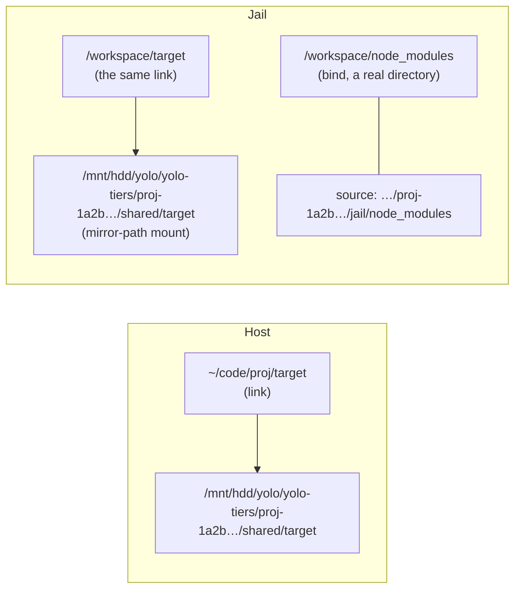

# One workspace across several disks, seen as one tree

**Status:** 2026-10-09. Nothing built. Revised around the owner's 2026-10-09 brief, which answered
[OQ-BS1](#decision-ledger) and replaced the single bulk-scratch proposal of 2026-10-08. Source
claims re-read at `ccf073633`. MEASURED in this jail (rootful nested Podman 5.8.7 with crun, btrfs):
the mechanism probes in [Appendix A](#appendix-a-what-was-measured-in-this-jail) and the
identity probes in [Appendix B](#appendix-b-which-identity-a-non-root-launcher-can-read-on-linux).
UNMEASURED: rootless Podman, real separate disks, every macOS backend.

> **In short.** A tier is a host directory on a disk the owner chose, and a workspace part is a
> directory inside the workspace that lives on one. The host sees an ordinary link, and the jail
> mounts that tier's directory at the same absolute path, so the link resolves on both sides with
> nothing for the agent to learn.

**Why it matters.** An owner with an HDD, an SSD and an NVMe drive wants source on the NVMe and a
40 GB `target/` or a model directory on the HDD, in one workspace that they also edit on the host.

**The shape.** User config names the tiers. A per-workspace rule maps each path to a tier. The host
launch makes the links and mounts. `yolo tiers move` moves data between tiers, and only when the
owner asks.

**Cost.** Every tiered path is a symbolic link on the host, which some tools treat differently
from a directory ([§7](#7-risks)). A launch now depends on every disk its workspace uses.

**Start at [§3](#3-the-mechanism-one-link-two-sides)**: the link plus the mirrored mount. The
rest follows from it.

**Needs your ruling:** [OQ-BS2](#OQ-BS2), [OQ-BS3](#OQ-BS3), [OQ-BS4](#OQ-BS4), [OQ-BS5](#OQ-BS5).

**Rule together with:** [OQ-STR2](shared-tool-store-relocation.md#OQ-STR2) and
[OQ-STR4](shared-tool-store-relocation.md#OQ-STR4), which ask [OQ-BS3](#OQ-BS3)'s and
[OQ-BS4](#OQ-BS4)'s questions of another directory ([§8.3](#83-rule-these-together)).

**Reads with:** [implementation sketch](storage-tiers-plan.md) (incomplete, not a build hand-off),
[durable scratch](durable-scratch-space.md) (restart survival, which this does not change),
[cache relocation](../plans/cache-relocation.md) (machine caches, which are not workspace parts),
[VM-local volumes](vm-local-volumes.md) (where a VM jail's jail-only copies go).

---

## 1. Goal, terms and boundaries

The owner's brief, 2026-10-09:

> *"I want to be able to support storage tiers. So what that means is I have a computer that has
> an HDD, an SSD, and an NVMe, and I want to be able to easily split different parts of a single
> workspace across these three different tiers in some seamless way."*

Terms, each coined here unless it says otherwise:

- **Tier.** A named, owner-created host directory on a disk the owner chose, for example
  `hdd → /mnt/hdd/yolo`. In ordinary storage usage a *storage tier* is a class of storage with
  its own cost, capacity and speed. Yolo never infers or checks a disk's speed; the name is only
  a label. A tier is not a cache relocation and not a context mount.
- **Workspace tier.** The reserved name `workspace`: wherever the workspace itself lives. A part
  on the workspace tier is an ordinary directory.
- **Part.** A directory inside the workspace, named by its workspace-relative path (`target`,
  `data/models`), that a rule places on a tier. A part is not a file, not a glob, and never
  tracked content.
- **Shared part.** A part with one copy that the host and the jail both use, such as `target`,
  `dist` or `data`.
- **Jail-only part.** A part on the [per-side path](../reference/jail-state-separation-design.md)
  set (`.venv`, `node_modules`, the mise venv path and `per_side_paths`). The jail already has its
  own copy of each, bound over the host's ([`mounts.go`](../../internal/cli/run/mounts.go#L105-L148)).
  The rule places that jail copy.
- **Tier directory.** `<tier root>/yolo-tiers/<workspace id>/`: one workspace's directory on one
  tier, created by yolo. A jail sees only its own.

Principles:

- **P1 — One tree on both sides.** The agent and the owner see the same workspace-relative paths.
  No part needs a different path, command or environment variable to use.
- **P2 — Placement never moves data implicitly.** Only `yolo tiers move`, run by the owner on the
  host, moves bytes. A launch creates empty directories and links, and reports misplaced data.
- **P3 — No silent fallback.** A part whose tier is unavailable never lands on another disk. The
  launch refuses and names the next step.
- **P4 — Narrow grants.** A jail sees this workspace's tier directories, never a tier root and
  never another workspace's directory.
- **P5 — Trusted placement.** Tier roots and rules come from host-side user scope. Nothing the
  jail can write chooses what is mounted.
- **P6 — Placement is not lifetime.** A tiered part survives exactly what it survived before. Yolo
  never reclaims tier contents.

### Non-goals

- Detecting disk speed, file heat or size, and moving files automatically.
- Tiering a single file, a glob such as `**/node_modules`, tracked content, the workspace root,
  `.git`, `.yolo/home` or `.yolo` as a whole ([§4.2](#42-what-may-be-a-part)).
- Machine-wide stores: the Nix store, container images, `~/.cache`, `/mise`. They are not parts of
  a workspace; [cache relocation](../plans/cache-relocation.md) and the
  [tool-store relocation](shared-tool-store-relocation.md) cover them.
- Quotas, deduplication, backups, a cleanup daemon, or a file watcher.
- Moving the whole workspace. The owner already does that by moving the checkout.
- Rules a committed project file declares ([BS-D11](#decision-ledger)).

## 2. What exists today

Re-read at `ccf073633`; links are evidence, not an edit plan.

| Existing piece | What it gives a tier design | What it lacks |
| :--- | :--- | :--- |
| Workspace bind at `/workspace` | The jail sees the host tree live | The jail path differs from the host path, so a **relative** link out of the workspace resolves differently on each side |
| Per-side shadows ([`venvShadowMountArgs`](../../internal/cli/run/mounts.go#L105-L148)) | A jail-only copy is already a bind from `<workspace>/.yolo/home/venv-shadows/<rel>`; choosing its source is all a tier needs | A part that is a **link on the host is skipped** with a warning, and the jail then uses the host's copy ([`mounts.go:116`](../../internal/cli/run/mounts.go#L116-L121)) |
| Podman makes mountpoints in the live workspace | Documented and accepted ([`mounts.go`](../../internal/cli/run/mounts.go#L122-L138)) | Nothing |
| `cache_relocations` | Trusted user-scope loading ([`relocations.go`](../../internal/config/relocations.go)) | Machine caches only. Its presence check is that the target's parent exists, and then [`EnsureCacheRelocations`](../../internal/storage/ensure.go#L90) creates the last component, so a target under an unmounted drive's mountpoint lands on the disk beneath it |
| Read-write context mounts | The refusal set ([`rwMountRefusal`](../../internal/config/mounts.go#L338), [§2.3](context-mounts.md#23-refusal-set)) and the writable-source scope rule ([`WritableSourceScopeBreach`](../../internal/paths/workspacescope.go#L169)) | One source for every workspace, at `/ctx/...`, not inside the workspace tree |
| Per-workspace properties file ([`workspacefile.go`](../../internal/config/workspacefile.go)) | Host-side, yolo-written per-workspace state, named `<folder>-<hash>` | No tier key |
| macos-user relocation links ([`ctxlinks.go`](../../internal/macosuser/ctxlinks.go)) | macos-user already delivers by laying links plus Seatbelt rules, and admits targets under `/Volumes` with a write probe ([CR-D2](../plans/cache-relocation.md#CR-D2)) | Not wired to workspace parts |

Rulings this does not reopen:

- [DS-D9](durable-scratch-space.md#DS-D9): durable scratch stays inside the workspace by default.
  A part under `.yolo/durable/` is opt-in ([§4.2](#42-what-may-be-a-part)).
- [DS-D35](durable-scratch-space.md#DS-D35): durable scratch is temporary agent work; tiering a
  subdirectory of it does not change that.
- [Cache relocation's scope boundary](../plans/cache-relocation.md#threat-model-why-user-scope-is-the-whole-design):
  a writable host-path grant is user scope only. Tier roots follow it.
- [OQ-JH1](../reference/jail-home.md#OQ-JH1) (relocating `.yolo` by a link) stays its own
  question; this design refuses `.yolo` and `.yolo/home` as parts.

## 3. The mechanism: one link, two sides

I recommend a **host-side symbolic link with an absolute target, plus a mirror-path mount** *(coined
here: a bind whose jail destination is the same absolute path as its host source)*. That
combination is the only one of the alternatives in [§6](#6-alternatives) that is transparent on
the host without root.



### 3.1 Shared parts

1. The part's host path is a link whose target is `<tier dir>/shared/<rel>`. The target keeps the
   part's own relative path and basename. Node resolves a package's dependencies from the
   package's real path, so a different basename breaks resolution (measured,
   [A4](#appendix-a-what-was-measured-in-this-jail)).
2. Each launch binds `<tier dir>/shared` read-write at the same absolute path in the jail. The
   link, which the jail reads through the workspace bind, then resolves to the same bytes
   (measured, [A1](#appendix-a-what-was-measured-in-this-jail)).
3. The link is absolute because the workspace sits at `/workspace` in the jail and somewhere
   else on the host. No relative target resolves on both sides.

The owner, an IDE, and a host shell see an ordinary link to a directory, with nothing yolo-specific
to know.

### 3.2 Jail-only parts

A jail-only part has no host link. Its per-side bind takes `<tier dir>/jail/<rel>` as its source
in place of `.yolo/home/venv-shadows/<rel>`, and keeps `/workspace/<rel>` as its destination. In
the jail it stays a real directory, so the [§7](#7-risks) link risks do not apply to it.
Whether the host's own copy also moves is [OQ-BS5](#OQ-BS5).

The two layouts cannot be combined at one path. crun refuses to bind onto a destination that
is a link ([A2](#appendix-a-what-was-measured-in-this-jail)), so the shadow for a linked path has to
target the link's resolved mirror path ([A2b](#appendix-a-what-was-measured-in-this-jail)). The
recommended answer to [OQ-BS5](#OQ-BS5) avoids that path.

### 3.3 What the jail is given

| Mount | Source | Jail destination | When |
| :--- | :--- | :--- | :--- |
| Shared tier directory | `<root>/yolo-tiers/<id>/shared` | The same absolute path | The workspace has at least one shared part on that tier |
| Jail-only part | `<root>/yolo-tiers/<id>/jail/<rel>` | `/workspace/<rel>` | Per jail-only part on a non-workspace tier |

Mount sources come from the trusted tier roots and the workspace id **only**. A link's target
never selects a mount source, because the jail can rewrite the link. Without this rule, an agent
could point `target` at `~/.ssh` and have the next launch mount it read-write
([BS-D5](#decision-ledger)).

A mirror destination may not lie on or under a path the jail already uses: `/workspace`,
`/home/agent`, `/nix`, `/opt`, `/mise`, `/ctx`, `/tmp`, `/var`, `/run`, `/etc`, `/bin`, `/usr`,
`/lib*`, `/proc`, `/sys` or `/dev`, or any other destination in the same launch's mount table.
A tier root that maps to one of these is refused when it is added, and the refusal says to put
the root somewhere else. Typical roots (`/mnt/...`, `/media/...`, `/data`, `/srv`,
`/home/<user>/...`, `/Volumes/...`) never collide. crun creates a missing mirror path inside a
read-only root filesystem ([A5](#appendix-a-what-was-measured-in-this-jail)), so the image does not
need to bake one.

### 3.4 The workspace id and moved workspaces

The `<id>` is `<folder name>-<12 hex digits>` from the workspace's resolved path, using the scheme
the [per-workspace file](../../internal/config/workspacefile.go) already uses. Host yolo writes
`yolo-tiers/<id>.owner` beside the directory, naming the workspace path. The file is never
mounted, so the jail cannot change it, and inventory can name each directory's workspace.

A moved workspace computes a new id while its links still point at the old directory. The launch
reports such links as belonging to another workspace and does not mount them
([BS-D5](#decision-ledger)). It names `yolo tiers adopt`. That host command renames the old
directory to the new id, rewrites this workspace's managed links and the `.owner` file, and
refuses when the old `.owner` names a workspace that still exists.

## 4. Declaring tiers and parts

### 4.1 Configuration

Tier roots are owner-written user config. The keys are proposed, not shipped:

```jsonc
// ~/.config/yolo-jail/config.jsonc (or a trusted include)
{
  "storage_tiers": {
    "hdd":  "/mnt/hdd/yolo",
    "nvme": "/mnt/nvme/yolo"
  }
}
```

- **Default:** absent means no tiers: no directories, mounts, links or new refusals.
- **Names:** `[a-z][a-z0-9-]{0,31}`; `workspace` is reserved. **Roots:** absolute and existing,
  with a leading `~/` expanded. A root with `:` in it is refused because Podman cannot mount it.
- **Scope:** user config and its trusted includes only. A workspace config, a pack or the in-jail
  snapshot cannot name a root ([BS-D11](#decision-ledger)).
- **Preparing a tier:** `yolo tiers init <name>` on the host checks the root
  ([§5.1](#51-admitting-a-tier)), creates `yolo-tiers/` with a marker, and records the mount
  identity and capabilities in yolo's host state. A configured tier that was never initialized is
  reported by `yolo check` and by any launch that uses it. Both name the `init` command.

Rules are per workspace. yolo writes them, on the host, to the per-workspace properties file:

```console
$ yolo tiers set target hdd        # record the rule; print the move command if target/ holds data
$ yolo tiers set data/models hdd
$ yolo tiers set target workspace  # override a default (OQ-BS2) back to the workspace's own disk
$ yolo tiers unset data/models     # drop the rule; the data stays where it is
$ yolo tiers status                # every part: rule, where its data actually is, and drift
```

User-scope default rules for every workspace (`"node_modules": "hdd"`) are
[OQ-BS2](#OQ-BS2). Run inside a jail, `set`, `unset`, `move`, `adopt` and `forget` refuse and
print the host command. `status` works in the jail and reports the running jail's grants.

### 4.2 What may be a part

| Path | Allowed | Reason |
| :--- | :--- | :--- |
| `.`, an absolute path, a `..` step, a template | No | Not a workspace sub-path ([`perside.ValidRel`](../../internal/perside/perside.go)) |
| `.git`, anything under it | No | Repository internals, which git reaches by path |
| `.yolo`, `.yolo/home`, anything under `.yolo` except `.yolo/durable/<sub>` | No | Yolo's own state. The launcher replaces links there ([jail-home](../reference/jail-home.md#OQ-JH1)) |
| `.yolo/durable/<sub>` | Yes, as a shared part | Large agent scratch; the former single bulk-scratch case |
| A path with tracked files under it | No | A link replacing tracked content is a type change git would commit |
| A path inside another part, or containing one | No | One placement per byte |
| Anything else | Yes | `target`, `dist`, `build`, `data`, `models`, `.cache`, `.pytest_cache`, per-side paths |

A rule's checks run when it is set and again at each launch. A rule that becomes invalid, for
example because files under it are now tracked, is reported and not applied. The launch goes on.

### 4.3 Which part belongs where

This is guidance for the owner, which `yolo tiers status` repeats. Yolo applies no rule by
default.

| Part | Suggested tier | Why |
| :--- | :--- | :--- |
| Source tree, `.git` | The workspace tier: put the checkout on the NVMe | Many small reads; it cannot be a part |
| `target/`, `build/`, `dist/` | SSD or HDD | Large and rebuildable; an HDD slows incremental builds |
| `node_modules`, `.venv` | SSD | Many small files; an HDD is slow at them |
| `data/`, `models/`, `.yolo/durable/<downloads>` | HDD | Large sequential files |
| `.yolo/home`, `.yolo/durable` itself | The workspace tier | Not parts |
| Nix store, images, `~/.cache`, `/mise` | Machine-wide levers | Not parts ([§1](#non-goals)) |

### 4.4 Git

A `.gitignore` entry with a trailing slash (`target/`, `/node_modules/`) matches directories, and
a link is not a directory, so git lists a linked shared part as untracked and `git add -A`
commits the link (measured, [A3](#appendix-a-what-was-measured-in-this-jail)). Therefore, when
the workspace is a git repository, the apply step keeps a yolo-managed block in the repository's
`info/exclude` (the common directory, shared by worktrees). The block lists each linked part,
anchored and without a slash (`/target`). It is written beneath the workspace with no-follow
operations, the same way as the
[workspace-state writes](../reference/jail-home.md#the-jail-home--how-homeagent-is-composed),
because the jail can write `.git`. Jail-only parts need no entry.

`git clean -fdx` removes a part's link and leaves the tier data in place
([A3](#appendix-a-what-was-measured-in-this-jail)). The next launch puts the link back.

## 5. Lifecycle

### 5.1 Admitting a tier

At `init`, and at every launch and `yolo check` that uses the tier:

1. Resolve the root once and use that path for every later step. A root that is a link to a
   directory is allowed; a dangling one is refused.
2. Refuse a root that is, contains or lies inside a credential-boundary directory, through
   [`WritableSourceScopeBreach`](../../internal/paths/workspacescope.go#L169). Refuse a tier
   directory that overlaps the workspace in either direction. Refuse a mirror collision
   ([§3.3](#33-what-the-jail-is-given)).
3. Prove the disk is the one recorded at `init` ([OQ-BS3](#OQ-BS3)). Never create `yolo-tiers/`
   outside `init`. A missing `yolo-tiers/` means the wrong or absent disk, not a first use.
4. At `init` only, probe and record what the filesystem supports: links, Unix permission bits,
   and the `noexec` mount option (read from mountinfo, with nothing executed). A jail-only part's
   rule onto a tier without links or with `noexec` is refused, because `.venv` and `node_modules`
   need both. A shared part is allowed there, and the briefing says what that tier lacks.

### 5.2 Each fresh launch

Under a per-workspace tier lock that serializes concurrent launches and tier commands, for each
rule, and for each managed link with no rule:

| What is at the part's path | Action |
| :--- | :--- |
| Nothing | Create `<tier dir>/shared/<rel>` (or `jail/<rel>`), lay the link (shared parts) and update the git exclude block |
| A managed link into the right tier | Nothing |
| A managed link into another of this workspace's tiers (the rule changed) | Mount both tiers. Report that the data is on `X`, the rule says `Y`, and name `yolo tiers move <rel> Y` |
| A real directory (data written before the rule, or a tool replaced the link) | Leave it. Report the drift and name the move command. The jail uses it where it is |
| A managed link into another workspace's directory | Do not mount it. Report it and name `yolo tiers adopt` ([§3.4](#34-the-workspace-id-and-moved-workspaces)) |
| Any other link | Leave it and do not manage it. Report it once as not managed |
| A managed link with no rule | Keep mounting its tier, since the data lives there. Report it and name `move` or `forget` |

Creation is idempotent, so a second launch that finds the work done does nothing. No step walks
a part's contents, so an idle HDD is not spun up just to be listed. Attach reruns nothing. It
uses the running jail's mounts and reports when the current rules differ from them.

### 5.3 A tier that is not there

| Condition | Behavior |
| :--- | :--- |
| A tier this workspace uses (a rule or a managed link) fails admission | **Refuse the launch** before creating anything. Name the tier, its root, the recorded mount and the parts on it. The next step is to mount the disk and rerun. If the disk is gone for good, run `yolo tiers forget <tier>`, which removes this workspace's links and rules for that tier after asking. Tools then recreate those directories on the workspace tier |
| A tier this workspace does not use is missing | No effect, not even a warning |
| A tier fills up | Writes fail with the filesystem's error. Nothing spills to another disk |
| A disk is removed during a session | Open files fail. Nothing is detected or recovered. Restore the disk and relaunch |
| A tier's root changes in config | New launches use the new root after `init`. Old data stays where it was, and its links now point outside every configured tier, so they are reported as not managed. Moving that data is a manual copy |

Refusing is what [DP-D15](declaration-parity.md#7-ruled-divergent-and-the-ones-i-would-re-open)
asks for: *"a fatal error … rather than having it be surprisingly not there"*. A dangling link would
not fill the SSD: writes through one fail and `mkdir -p` reports that the path exists
([A1](#appendix-a-what-was-measured-in-this-jail)). The agent would instead meet missing
directories mid-task. No `YOLO_ALLOW_*` hatch exists, because `forget` is the next step for a
disk that is gone ([escape-hatch rule](../reference/happy-path-principle.md)).

### 5.4 Moving a part

`yolo tiers move <rel> <tier|workspace>` is the one way bytes move between tiers. It also handles
first-time migration of an existing `target/`. It runs on the host only:

1. Refuse while any container of this workspace is running. When the runtime cannot be asked,
   refuse as well, since "no container" and "could not tell" look the same.
2. Take the per-workspace tier lock, then admit the source and destination tiers.
3. Act only on a part whose current link target lies, once resolved, inside this workspace's
   directory on a configured tier, or on a real directory at the part's path. Never follow a
   link the jail could have rewritten to anywhere else. This is the
   [confined-tree](../reference/agent-briefings.md#ws-p5) discipline: the walk does not follow
   links, and links inside the data are copied as links.
4. Copy into a staging directory on the destination filesystem. When source and destination share
   a filesystem, rename instead of copying. Verify that file count and total bytes match.
5. Swap, which changes only what the path resolves to: replace the link atomically for a tier
   destination, or unlink and then rename for the workspace tier. Until the swap the path
   resolves to the complete old copy; after it, to the complete new one.
6. Delete the old copy. A copy that cannot be deleted, for example files host root owns on
   rootful Podman, is left and reported with the command to remove it.

An interrupted move leaves a staging directory or an old copy, and never two authoritative
copies. `yolo tiers status` lists any leftovers with the command to delete them. `move` prints the
size it is about to copy and asks before copying more than 1 GiB. `--yes` skips the question.

### 5.5 Inventory, reclamation and reporting

- **Fresh launch:** one disclosure line per tier in use, naming the host directory, the jail path
  and the mount identity that was verified. Every launch also reports drift ([§5.2](#52-each-fresh-launch)).
- **Briefing:** the storage section lists each tiered part and its tier, says that a shared part
  is a link whose real path looks like a host path, and that deleting the link (`rm -rf target`,
  as opposed to `rm -rf target/*`) detaches the part until the next launch.
- **`yolo stores`:** per tier, the root, filesystem, and free and total bytes from `statfs`, plus
  this workspace's directories. Sizes are on demand within the existing time budget
  ([`durable/report.go`](../../internal/durable/report.go)). Other workspaces' directories are
  listed by their `.owner` file, and one whose workspace no longer exists is marked orphaned.
- **Reclamation:** `yolo prune` and every reaper ignore `yolo-tiers/`. Yolo deletes tier contents
  only in step 6 of `move`, and only the old copy. Deleting an orphaned directory is the owner's
  job with `rm`.
- **Backups:** a host backup that does not follow links skips tier data. `status` says so once.

### 5.6 Other launch kinds

| Launch | Behavior |
| :--- | :--- |
| Read-only workspace | Tier mounts stay writable, since they are separate grants. Links cannot be created, so a missing link is reported and not made |
| Nested jail | No tiers. The host's tier config is not in the jail, and a nested workspace gets no tier mounts |
| `yolo host` | Applies rules and links, which are host state, and mounts nothing |
| Attach | No apply step ([§5.2](#52-each-fresh-launch)) |

## 6. Alternatives

| Alternative | Verdict |
| :--- | :--- |
| A bind per part inside the jail, and no host link | The host sees an empty mountpoint directory instead of the data, which fails P1 for every shared part. **Kept only for jail-only parts**, which the host never reads |
| Host bind mounts or `/etc/fstab` entries | Need root on Linux and a third-party filesystem on macOS. **Rejected as yolo's mechanism.** An owner who makes them gets ordinary directories, which yolo treats as the workspace tier |
| A union filesystem across tiers (mergerfs, overlayfs) | Places files by policy rather than by directory, and needs FUSE or root. **Complementary, outside yolo** |
| Relative links | Resolve differently at `/workspace` and at the host path. **Rejected** |
| Links to a fixed jail path such as `/tiers/hdd` | The host cannot have that path without root. **Rejected** |
| Tool-specific redirects (`CARGO_TARGET_DIR`, `npm --prefix`) | Per tool, with no general answer for `node_modules` or `data`. **Complementary**; the briefing may mention them |
| The 2026-10-08 single `/bulk` directory | Became a special case: a rule placing `.yolo/durable/bulk` on `hdd`. **Superseded** ([OQ-BS1](#decision-ledger)) |
| Glob rules (`**/node_modules`) | A glob names directories that do not exist yet, and the link has to exist before the tool writes. With no watcher, nothing makes it in time. **Deferred**: literal paths only ([BS-D4](#decision-ledger)) |
| Moving data automatically at launch | A launch would copy gigabytes unasked, with open handles on the host. **Rejected** (P2) |

## 7. Risks

| Risk | Mitigation or remaining cost |
| :--- | :--- |
| A tool deletes the link by name and recreates the directory on the workspace tier (`rm -rf target` measured; Rust's `remove_dir_all` documents the same behavior) | Each launch reports the drift and names `move`, and the briefing warns. Data written in the meantime sits on the workspace tier |
| Code that finds the project root by walking up from a file's real path finds nothing (measured with Node, [A4](#appendix-a-what-was-measured-in-this-jail)) | Applies to shared parts only; jail-only parts are real directories in the jail. If a tool breaks, set that part back to `workspace` |
| Python's `venv` refuses to create into a linked `.venv` (measured, 3.14.7; `uv venv` writes through the link) | Jail-only `.venv` is a real directory in the jail. A host link exists only if [OQ-BS5](#OQ-BS5) rules B |
| The jail rewrites a link to reach host files | Mounts come from trusted roots and the id only. `move` acts only on links into this workspace's tier directories ([BS-D5](#decision-ledger)) |
| A launch now fails when a disk does | That is the purpose (P3), and `forget` handles a disk that is gone for good |
| Files root owns on a rootful Podman tier | Same as every rootful bind ([context-mounts §2.5](context-mounts.md#25-ownership)); `move` reports what it could not delete |
| A filesystem without links, permission bits or 4 GiB files (exFAT, NTFS, FAT32) | The `init` probe records it, jail-only parts are refused there, and the briefing names the limit |
| A nested jail cannot verify rootless ownership | Real rootless-host verification before landing ([AGENTS.md carve-outs](../../AGENTS.md#testing)) |

## 8. Delivery, backends and success

### 8.1 Backends

| Backend | First delivery (leaning of [OQ-BS4](#OQ-BS4)) |
| :--- | :--- |
| Linux Podman, rootless and rootful | Supported: links, mirror mounts, jail-only binds |
| macos-user | Second delivery. One copy on each side, so every part is a shared link, granted by Seatbelt rules the way [`ctxlinks.go`](../../internal/macosuser/ctxlinks.go) grants relocation targets, with a write probe under the session profile ([CR-D2](../plans/cache-relocation.md#CR-D2)). UNMEASURED |
| Apple Container, Podman machine | Refused while any tier rule applies, naming the backend and `yolo tiers status`. Their jail-only copies belong on [VM-local volumes](vm-local-volumes.md), and a shared part would be one more virtiofs share per tier |

Yolo checks no version of Podman, crun or git. When a tool's behavior breaks, the fix goes in at
that point (owner ruling 2026-10-09, [BS-D12](#decision-ledger)).

### 8.2 What done looks like

- With no `storage_tiers`, launches, paths and briefings are unchanged.
- With `target → hdd`, a build in the jail writes to the HDD, and the owner's host shell sees the
  same files at `~/code/proj/target`.
- `node_modules → ssd` puts the jail's copy on the SSD as a real directory in the jail, and
  `npm install` works there.
- With the HDD unplugged and its mountpoint empty, the launch refuses, names the disk, and creates
  nothing on the disk underneath.
- `yolo tiers move target workspace` brings the data back, and an interrupted move leaves the
  complete old copy authoritative.
- Two workspaces on one tier cannot see each other's directories. Rewriting a link in the jail
  changes no mount on the next launch.
- `git status` stays clean with a linked part whose `.gitignore` entry ends in a slash.
- `yolo prune` leaves every tier directory alone.

### 8.3 Rule these together

[OQ-BS3](#OQ-BS3) and [OQ-STR2](shared-tool-store-relocation.md#OQ-STR2) both ask how yolo knows a
disk is mounted. One answer should cover both, and `cache_relocations`' parent-exists check
should adopt it. [OQ-BS4](#OQ-BS4) and [OQ-STR4](shared-tool-store-relocation.md#OQ-STR4) both ask
which setups ship first; this doc leans rootful too, and that one leans rootless only.

## 9. Open questions

The body describes the leaning branch of each question. Nothing is authorized for implementation
until all four are answered.

1. 💬 **OQ-BS2: Do user-scope default rules apply to every workspace?**

   The owner wants `node_modules` and `target` on the SSD in every project, not set one by one.

   - **A — Defaults in user config, applied to every workspace.** A per-workspace rule overrides
     one, `workspace` included. Every workspace launched leaves a directory on that tier.
   - **B — Per-workspace rules only.** Each workspace needs `yolo tiers set` before anything
     moves.

   <!-- vantage: question id=OQ-BS2 leaning="A — the brief asks for easy and seamless; defaults make a new workspace tiered on its first launch, and an override restores any one of them." -->

   _Leaning:_ A — the brief asks for easy and seamless; defaults make a new workspace tiered on its first launch, and an override restores any one of them.

   **Answer:**

   > _(empty — fill in when decided)_

2. 💬 **OQ-BS3: How does yolo prove a tier's disk is the one that is mounted?**

   The HDD fails to mount after a reboot, and `/mnt/hdd` is now an empty directory on the SSD.
   Background: [Appendix B](#appendix-b-which-identity-a-non-root-launcher-can-read-on-linux).

   - **A — Recorded at `init`.** Mount point and filesystem type from mountinfo, plus the
     `yolo-tiers/` marker. Nothing for the owner to type. Works for ZFS, mergerfs and network
     shares. A different disk mounted at the same place with a copied marker passes.
   - **B — An owner-typed filesystem UUID.** Exact, but ZFS, mergerfs and network shares cannot
     have one, and btrfs needs a special lookup.
   - **C — The root exists.** Today's `cache_relocations` behavior; the SSD fills.

   <!-- vantage: question id=OQ-BS3 leaning="A — it catches the unmounted-disk case for every filesystem type with no owner input; the copied-marker case needs deliberate action." -->

   _Leaning:_ A — it catches the unmounted-disk case for every filesystem type with no owner input; the copied-marker case needs deliberate action.

   **Answer:**

   > _(empty — fill in when decided)_

3. 💬 **OQ-BS4: Which setups must the first delivery support?**

   One owner runs rootless Podman, one rootful Podman, and one macOS.

   - **A — Linux Podman, rootless and rootful.** macos-user follows. VM backends are refused
     with their reason. Rootful tier files are host-root-owned.
   - **A′ — Rootless Linux Podman only.** Matches [OQ-STR4](shared-tool-store-relocation.md#OQ-STR4)'s leaning.
   - **B — Every backend at once.** Waits on Mac measurements.

   <!-- vantage: question id=OQ-BS4 leaning="A — the mechanism is measured on Linux Podman, and rootful costs only the sudo-to-clean every rootful bind already has." -->

   _Leaning:_ A — the mechanism is measured on Linux Podman, and rootful costs only the sudo-to-clean every rootful bind already has.

   **Answer:**

   > _(empty — fill in when decided)_

4. 💬 **OQ-BS5: Does a rule on `node_modules` or `.venv` also move the host's own copy?**

   On a container backend the jail and the host each have a copy ([§3.2](#32-jail-only-parts)).

   - **A — The jail's copy only.** It stays a real directory in the jail. The host's copy, if
     host tools made one, stays on the workspace tier.
   - **B — Both copies.** The host gets a link, and the jail's bind moves to the link's mirror
     path (measured, [A2b](#appendix-a-what-was-measured-in-this-jail)). Both sides then see a
     link, and Python's `venv` refuses it.

   <!-- vantage: question id=OQ-BS5 leaning="A — the jail's copy is the one yolo owns, and it stays a real directory; B buys host-side placement at the cost of a link in the jail." -->

   _Leaning:_ A — the jail's copy is the one yolo owns, and it stays a real directory; B buys host-side placement at the cost of a link in the jail.

   **Answer:**

   > _(empty — fill in when decided)_

## Decision Ledger

`BS-D` rows are implementation decisions made here under the
[standing delegation for one-answer mechanism choices](../../AGENTS.md#workflow). Each can be
reversed.

| ID | Ruling / Decision | Date | Settled in | Built |
| :--- | :--- | :--- | :--- | :--- |
| OQ-BS1 | *The owner, 2026-10-09:* *"I want to be able to easily split different parts of a single workspace across these three different tiers in some seamless way."* Answers the single-destination question with N named tiers and per-part placement, against the earlier leaning toward one `bulk_storage` key. The single directory becomes one rule | 2026-10-09 | [§1](#1-goal-terms-and-boundaries), [§4](#4-declaring-tiers-and-parts) | — |
| BS-D1 | Shared parts are host links with absolute targets plus a mirror-path mount of the tier directory | 2026-10-09 | [§3.1](#31-shared-parts) | — |
| BS-D2 | Jail-only parts move the per-side bind source and keep `/workspace/<rel>` as the destination | 2026-10-09 | [§3.2](#32-jail-only-parts) | — |
| BS-D3 | A tier directory mirrors the part's relative path and basename | 2026-10-09 | [§3.1](#31-shared-parts) | — |
| BS-D4 | Rules name literal workspace-relative directories; globs are deferred | 2026-10-09 | [§6](#6-alternatives) | — |
| BS-D5 | Mount sources come from trusted roots and the workspace id only, never from a link target; other workspaces' directories are adopted, never mounted | 2026-10-09 | [§3.3](#33-what-the-jail-is-given), [§3.4](#34-the-workspace-id-and-moved-workspaces) | — |
| BS-D6 | A managed `info/exclude` block lists linked parts without a trailing slash; tracked paths cannot be parts | 2026-10-09 | [§4.4](#44-git) | — |
| BS-D7 | A launch never moves data. It reports drift and names `yolo tiers move`, a host-only command that refuses while the workspace's jail runs | 2026-10-09 | [§5.2](#52-each-fresh-launch), [§5.4](#54-moving-a-part) | — |
| BS-D8 | A tier the workspace uses that fails admission refuses the launch; `forget` is the next step for a lost disk, and no hatch exists | 2026-10-09 | [§5.3](#53-a-tier-that-is-not-there) | — |
| BS-D9 | `.`, `.git`, `.yolo` and `.yolo/home` cannot be parts; `.yolo/durable/<sub>` can | 2026-10-09 | [§4.2](#42-what-may-be-a-part) | — |
| BS-D10 | `init` probes links, permission bits and `noexec`; a jail-only part's rule onto a tier lacking any of them is refused | 2026-10-09 | [§5.1](#51-admitting-a-tier) | — |
| BS-D11 | Roots come from user config and rules from the per-workspace file; a committed project file cannot place parts, since tier names are machine-local | 2026-10-09 | [§4.1](#41-configuration) | — |
| BS-D12 | *The owner, 2026-10-09:* no gating on "tested" versions of external tools; fix when one breaks | 2026-10-09 | [§8.1](#81-backends) | — |
| BS-D13 | A nested jail gets no tiers; `yolo host` applies links and mounts nothing | 2026-10-09 | [§5.6](#56-other-launch-kinds) | — |
| BS-D14 | Reapers and `prune` never touch `yolo-tiers/`; `stores` lists tiers and orphaned directories | 2026-10-09 | [§5.5](#55-inventory-reclamation-and-reporting) | — |

## Appendix A: what was measured in this jail

2026-10-09, in this jail: Podman 5.8.7 with crun, rootful (`--userns=host`, as every nested
Podman here is), on btrfs. The tiers were directories on that one filesystem, which tests the
mechanism and says nothing about speed. The container used `--read-only` and a directory root
filesystem binding `/nix/store` and `/bin`.

| # | Probe | Result |
| :--- | :--- | :--- |
| A1 | Workspace bound at `/workspace` holding `target → /tmp/st/tierA/yolo-tiers/ws1/target`; tier directory bound at its own path | A write to `/workspace/target/out.bin` landed in the tier directory on the host, and `readlink -f` gave the host path. With the tier left unmounted, `ls` gave *No such file or directory*, `mkdir -p` gave *File exists*, and a write failed. Nothing was created elsewhere |
| A2 | Per-side bind at `/workspace/node_modules` where the host path is a link | crun refused the container: *openat2 `workspace/node_modules`: No such file or directory* |
| A2b | The same bind aimed at the link's resolved mirror path | Worked: the jail saw and wrote its own copy, and the host copy was unchanged |
| A3 | Git with linked `target` and `node_modules` | `.gitignore` with `target/` and `/node_modules/` listed both as untracked (`??`). Without the slash both were ignored (`!!`). `git clean -fdx` removed the links and kept the tier file |
| A4 | Node 24.19.0: `node_modules` linked to a tier directory, with package `a` requiring sibling `b` | Resolution failed when the tier directory was named `nm2`, and worked once it was named `node_modules`. Walking up from `a`'s `__dirname` to the project's `package.json` found nothing. `--preserve-symlinks` found it |
| A5 | Bind destination `/mnt/hdd/yolo-tiers/ws1` absent from the read-only root filesystem | crun created the path and the mount worked |
| A6 | Deleting a linked part | `rm -rf target/` emptied the tier and kept the link. `rm -rf target` removed the link and kept the tier data. `shutil.rmtree` refused the link |
| A7 | Python 3.14.7 `python -m venv .venv` with `.venv` linked | *Unable to create directory*. `uv venv .venv` (0.12.19) created the environment through the link |

Not measured: rootless Podman ownership, a real second disk, cargo (not installed here), and every
macOS backend.

## Appendix B: which identity a non-root launcher can read on Linux

Carried from the 2026-10-08 revision. Measured on the maintainer's host (btrfs on LUKS, Linux 7.2).

| Source | What it gives | Measured |
| :--- | :--- | :--- |
| `FS_IOC_GETFSUUID` ioctl on an open directory | The filesystem UUID, with no privilege, where the filesystem publishes one | **Fails on btrfs** (`ENOTTY`); succeeded on tmpfs. ext4 and XFS publish one; not measured |
| `stat` device number | A number only | On btrfs it names the subvolume (`0:59`), not the filesystem mountinfo lists (`0:28`) |
| `/proc/self/mountinfo` | Mount point, filesystem type, source and options for every mount | Readable, and statx's mount id matches its first field |
| `/dev/disk/by-uuid` | UUID-to-device links kept by udev | Not visible in a jail; normally world-readable |
| `/sys/fs/btrfs/<uuid>/` | One directory per mounted btrfs, named by its UUID | Readable |

A UUID takes several steps to find and does not exist for ZFS datasets, mergerfs pools, NFS or
SMB, which are common ways to run a large HDD pool. The mountinfo step alone finds which mount
contains a root, and that is what [OQ-BS3](#OQ-BS3)'s option A records. A systemd automount
shows as `autofs` until first access, so the check opens the root first.
