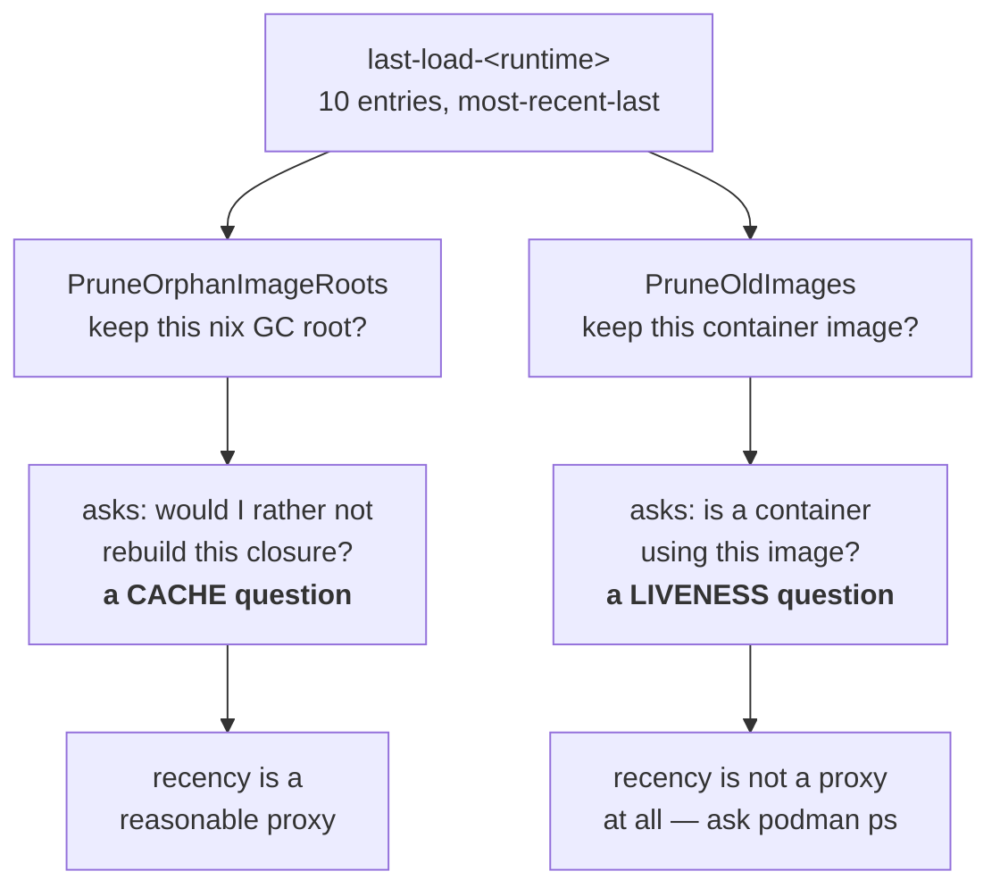

# The load sentinel is not a liveness oracle

**Status:** DESIGN SKETCH, 2026-09-08. One half already built (`feddc5e0` stopped the
image reaper from using it as liveness evidence); the other half — the nix GC-root
reaper — is untouched and still rests on a premise this doc shows is false.

**The short version.** `build/last-load-<runtime>` is a ten-entry, most-recent-last list
of nix store paths, appended to on every successful launch. Two reapers treat membership
in that list as permission to keep something. That is sound for the **nix GC roots**,
which are a cache and want recency; it is unsound for **container images**, which want
liveness — and the two are not the same question. A jail that is *running* but not
*relaunching* never re-appends, so it drops off the end while still in use.

**Start with [§4](#4-two-consumers-two-different-questions)** — everything else is
evidence for the claim that the two consumers are asking different questions.

**Reads with:** [`image-staging-vs-baking.md`](image-staging-vs-baking.md) (C2, which
demoted this same sentinel out of the load decision — the precedent this doc extends),
[`minimal-disk-footprint.md`](minimal-disk-footprint.md) ([OQ-DF3](minimal-disk-footprint.md#OQ-DF3), which armed the
automatic reap that fired).

---

## 1. Verdict

**The ledger is the right instrument for one consumer and the wrong instrument for the
other, and the codebase already contains the argument that settles it.**

C2 took this sentinel *out* of the load decision on exactly this reasoning
(`internal/image/autoload.go:440-465`, verified 2026-09-08):

> THE LOAD DECISION BELONGS TO THE RUNTIME, NOT TO THE SENTINEL.

The runtime is asked directly (`ImageInspectCmd`) whether the content-addressed ref is
present, and the sentinel was "demoted from authority" to diagnosis plus
*"prune's liveness ledger"* (`autoload.go:464-468`).

That demotion was half-finished. The same sentence — *ask the runtime, do not infer from
a history file* — applies unchanged to "is any container using this image", and there
the sentinel was left in authority. `podman ps` answers it exactly, in one call, with no
window and no cap.

Three principles I would hold to:

- **P1. Recency is a cache policy, not a liveness proof.** A bounded most-recently-used
  list answers "what would I like to still have"; it cannot answer "what is in use".
- **P2. A destructive sweep asks the authority.** Where an authority exists and is cheap
  (`podman ps`, `podman images`), evidence derived from a side-file is a guess.
- **P3. Unknown is not permission.** If the authority cannot be reached, the sweep
  declines. This one is already honoured throughout `internal/prune` and should stay.

## 2. What the ledger actually is

One file per runtime, `~/.local/share/yolo-jail/build/last-load-<runtime>`, one nix store
path per line, **most-recent-last**, capped at **ten entries**
(`internal/image/image.go:270-284`):

```
AddLoadedPath(sentinel, storePath):
    read existing lines, DROPPING any equal to storePath   # dedupe
    append storePath                                        # newest last
    if len > 10: keep the last 10                           # hard cap
    rewrite the file
```

| Property | Value | Evidence |
| :--- | :--- | :--- |
| Capacity | 10 entries, per runtime | `image.go:280-282` |
| Order | most-recent-last; dedupe-then-append | `image.go:274-279` |
| Written by | `AutoLoadImage`, on every SUCCESS (not only on a load) | `autoload.go:575` |
| Read as | an unordered SET (`map[string]struct{}`) | `image.go:224` |
| Write errors | discarded (`_ =`) | `autoload.go:575` |
| One writer | `AutoLoadImage` only; no locking between concurrent launches | — |

Two properties matter later. The **append fires on launch**, so a jail that is up but not
relaunching contributes nothing; and the reader **discards the order**, so "how recent"
is unavailable to a consumer even though the file encodes it.

> [!NOTE]
> Moving the append from the *load* path to *every success* was itself a fix for this
> family of bug (`autoload.go:562-574`): before it, an already-loaded image was never
> re-appended, so a jail relaunching daily still aged out. That fix is real and made the
> window wider — it did not make it unbounded, which is the gap this doc is about.

## 3. What it was originally for

It decided **whether to load the image**: compare this build's store path against the
most-recently-loaded entry; if they differ, load. C2 dissolved that question by making
the image ref the store-path hash, so presence is now a direct question to the runtime and
the sentinel's answer became redundant (`autoload.go:445-462`).

The file survived because two other things had come to depend on it. Nobody re-derived
whether it *fit* those uses — it was simply the ledger that already existed.

## 4. Two consumers, two different questions



**Consumer A — nix GC roots** (`internal/prune/imageroots.go:21-30`). A root pins a store
closure so a later `nix-collect-garbage` cannot reclaim it. Losing a root does not stop a
running container: the image already lives in the runtime's own storage. What it costs is
a **rebuild** the next time that path is wanted. That is a cache-retention question, and a
bounded MRU list is a defensible answer to it.

**Consumer B — container images** (`internal/prune/probes.go`, `PruneOldImages`). Removing
an image that a container is using destroys the container. That is a liveness question,
and the ledger cannot answer it.

## 5. The diagnosis

### 5.1 The premise that is false

`imageroots.go:24-26` justifies its protected-set guard like this:

> "The image a live container runs is **always the most recent sentinel entry**, so this
> never unroots a running closure; at most it over-retains ~10 roots per runtime."

That is true only when at most one jail is alive. `autoload.go:567-573` states the
opposite, in the same repository:

> "several images stay loaded at once and a launch can legitimately run image A while the
> sentinel's newest entry is B … A ages out of the ten-entry LRU while a jail is running
> on it, and prune's ProtectedImagePaths stops protecting its closure"

> [!WARNING]
> **Two comments in this codebase contradict each other, and the false one is load-bearing
> for a destructive guard.** `imageroots.go`'s "always the most recent entry" is the stated
> reason its reap is safe. It is not safe for the second and subsequent concurrent jails.
> Anyone touching either file should fix the comment, not re-derive the claim.

### 5.2 What it cost, measured

On 2026-09-08 the automatic image reap force-removed the images of **four jails that had
been up 3–4 days** (polyclav 3d21h, stories 4d0h, backplane 4d10h, yolo-jail-site 4d12h),
and `podman rmi -f` took the running containers with them. Reconstructed from the host
journal: a container removed and *that container's own image* untagged inside one podman
invocation, four times, between 13:35:26 and 13:36:26.

Three things had to line up, and all three are ordinary:

1. **The window filled.** Ten distinct store paths were loaded after those jails last
   launched. A `flake.lock` update plus per-workspace `packages:` variation (each distinct
   list is its own content-addressed image, C2) does that across a dozen workspaces in a
   day or two.
2. **The keep window is small.** `DefaultKeepImages = 2` (`autoreap.go:30`) — only the two
   newest by `CreatedAt` survive on age alone.
3. **The sort key works against long-running jails.** `CreatedAt` is when the archive was
   *streamed*, so a jail running for four days carries a four-day-old timestamp and sorts
   **oldest** — first in line (`probes.go:240-246`).

### 5.3 Why the age floor does not cover it — as written

Consumer A has a third guard: keep any root younger than **3600 seconds**
(`prunecmd.go:215`). That covers an in-flight launch whose path has not reached the
sentinel yet, and nothing else — an hour is far too short to be a cache policy and far too
long to be a race guard.

> [!IMPORTANT]
> **This section originally concluded "Consumer A therefore has the same latent hole as B",
> and that conclusion is REFUTED** — see [OQ-LS1](#OQ-LS1). B's hole is that it can delete
> something in use; A cannot, because losing a root costs a rebuild and nothing else. A's
> defect is not a missing veto but a **wrong duration**: an hour is not the horizon over which
> "will I want this closure again" is decided. The ruling raises it to a week and removes the
> protected set, rather than importing B's liveness evidence into a cache decision. Kept here
> because the refuted version is the more tempting one.

## 6. The proposal

**Separate the two questions and give each its own evidence.**

- **Liveness comes from the runtime — for Consumer B, and only for it.** `podman ps` yields the
  image IDs with containers on them; nothing in that set is ever selected for removal. Already
  built for Consumer B in `feddc5e0`.
- **Consumer A gets no liveness evidence at all, by ruling** ([OQ-LS1](#OQ-LS1)). Its question is
  a prediction about future want, and liveness is a wrong predictor in both directions — a jail
  stopped five seconds ago is not live, and a jail up for three weeks pins a closure nobody will
  build again. It becomes a pure **age** policy: reap a root unrooted longer than a week
  (`PruneOrphanImageRoots`' `olderThan`, raised from 3600 s), with an optional size cap applied
  after age and never instead of it. Because `mtime` is on the link, that policy has no authority
  it could fail to reach — which is why [P3](#1-verdict) stops applying to A rather than being
  weakened for it.
- **Recency stays a cache policy, and says so.** The sentinel keeps its MRU role for GC
  roots and for the human-readable "why did this load?" diagnosis. It stops being cited as
  liveness anywhere.
- **Destructive removal stops forcing.** A plain `rmi` fails on an in-use image, so the
  safety survives a wrong answer rather than depending on a right one. Built for B in
  `feddc5e0`.
- **Unknown declines** (P3), already the rule; keep it.

Behavior this fixes, stated as outcomes a human can check: a jail that has been running
for a week is never killed by a reap, no matter how many other images were loaded meanwhile;
a `nix-collect-garbage` after a reap never forces a rebuild of an image a live jail is
running; and `yolo prune --apply` on a machine with ten live jails removes nothing that is
in use.

### 6.1 The holes, answered

- **Degenerate inputs.** No sentinel / empty sentinel: Consumer B reaps nothing (fail-safe,
  already `liveKnown==false`); Consumer A no longer consults it at all, so an absent sentinel is
  not a condition for it ([OQ-LS1](#OQ-LS1)). No running containers: the veto is empty and only the keep window
  and age floor apply. More than ten live jails: irrelevant under the proposal, which is
  the point — the cap stops bounding safety.
- **Failure paths.** `podman ps` unreadable, non-zero, or timed out → decline the entire
  sweep, not just that entry. A removal that fails because the image is in use is *not* an
  error to report loudly; it is the guard working, and should be silent or dim.
- **Concurrency.** Two launches reaping at once is possible today: the 24-hour debounce
  sentinel is read-then-written with no lock, so both may pass. Under the proposal the
  worst case is a duplicated, idempotent sweep. The sentinel's own write is last-writer-wins
  and may lose an entry — acceptable for a cache, and another reason it must not be
  liveness evidence.
- **Trigger and defaults, unchanged by this doc.** The reap fires from `runContainer`
  after a successful image load (`run.go:803`), debounced to once per **24 hours**
  (`AutoReapInterval`), keeping the newest **2** images, with a **3600 s** root age floor.
  `YOLO_NO_AUTO_IMAGE_REAP` (any non-empty value) opts out.
- **Pre-existing state.** Sentinel files on disk keep working as-is; nothing migrates. A
  machine whose live jails have already aged out is protected from the next sweep the
  moment the runtime is consulted.
- **One writer.** `AutoLoadImage` remains the sole writer of the sentinel. No consumer
  writes it.
- **Forbidden.** No reaper may force-remove an image or unroot a closure on the strength
  of the sentinel alone; no reaper may treat an unreadable runtime as an empty one.

## 7. What this does NOT propose

- **Not deleting the sentinel.** It is the right instrument for GC-root retention and for
  the load diagnosis.
- **Not changing the ten-entry cap, the 24-hour debounce, or `keep=2`.** Those are
  disk-retention dials; once liveness is separate, they stop being safety mechanisms and can be
  tuned on their merits — or left alone ([OQ-LS3](#OQ-LS3) leaves `keep` at 2 until the layer
  plan makes an extra image cheap).
  **The age floor DOES change**, and that is [OQ-LS1](#OQ-LS1)'s ruling rather than an exception
  to this list: for Consumer A the floor stops being a race guard and becomes the whole policy,
  at a week instead of an hour.
- **Not re-opening C2's content-addressed tags.** They are what makes a direct runtime
  query unambiguous in the first place.
- **Not a new persistence format, database, or daemon.**
- **Not touching capture-store GC** (`internal/capture/gc.go`), which has its own model.

## 8. Alternatives considered

| Alternative | Verdict |
| :--- | :--- |
| Enlarge the cap (10 → 50) | **Rejected.** Buys time, fixes nothing: the bound is still arbitrary and still unrelated to whether anything is running. |
| Re-append on a timer while a jail runs (a heartbeat) | **Rejected.** Invents a liveness signal that already exists, and adds a writer to a file with no locking. |
| Protect by container name rather than image | **Rejected.** The names are per-workspace; the reaper's unit is the image, and one image can back several jails. |
| Never auto-reap; leave it to `yolo prune --apply` | **Rejected** — that was the state [OQ-DF3](minimal-disk-footprint.md#OQ-DF3) fixed, and 404 GiB accrued. The trigger is not the defect. |
| Sort by last-used rather than `CreatedAt` | **Deferred**, not rejected. It would stop long-running jails sorting oldest, but it needs a last-used signal that does not exist yet, and liveness makes it unnecessary for safety. Worth revisiting as a retention improvement. |

## 9. Risks

| Risk | Mitigation |
| :--- | :--- |
| `podman ps` is slow on a busy host, adding latency to every launch that reaps | The sweep is already debounced to once per 24h; one `ps` per sweep is negligible beside the `images` call it already makes. |
| A runtime that cannot enumerate containers now blocks all reclamation, and disk grows silently | P3 is deliberate, but the decline should be *visible* — a dim line, not silence, or the 404 GiB failure returns in a new costume. Currently it prints only on the manual path. |
| Consumer A's fix unroots less and the nix store grows | Bounded by the same keep/age dials, and a root pins bytes only until the next `nix-collect-garbage`. |
| The false comment gets copied into a third consumer before it is fixed | Fix the comment in the same change as the code ([§5.1](#51-the-premise-that-is-false)). |

## 10. What I would build, in order

First, correct `imageroots.go`'s comment — it is actively misleading and costs nothing to fix.

Second — **and this step inverted under [OQ-LS1](#OQ-LS1)** — do **not** give Consumer A the
running-container veto. Take the opposite step: drop the `protected`/`liveKnown` inputs from
`PruneOrphanImageRoots` and raise its `olderThan` from 3600 s to a week, so the GC-root reaper
becomes a pure age policy with no authority to consult.

Third, make a declined sweep **loud where it is a defect and an error where the user asked for
the work** ([OQ-LS2](#OQ-LS2)) — not the dim line this doc first proposed, and silent when there
is simply nothing to reclaim.

Only then, if disk is still a problem, revisit the retention dials — with the safety question
answered somewhere else, they become ordinary tuning, and [OQ-LS3](#OQ-LS3) says why `keep`
should wait for the layer plan rather than move now.

## 11. Open Questions

1. ✅ **[OQ-LS1](#OQ-LS1) — RULED 2026-09-08, AGAINST the leaning: does the GC-root reaper get the
   same liveness veto, or is losing a root acceptable?** Unrooting a live jail's closure does not kill it — it costs a rebuild the
   next time that path is wanted. If that is an acceptable cost, Consumer A can keep the
   MRU policy and only its comment needs fixing. This decides whether [§10](#10-what-i-would-build-in-order)'s
   second step exists at all.

   <!-- vantage: oq id=OQ-LS1 leaning="Give it the veto — the evidence is already being fetched for the image reaper, so sharing it is nearly free, and 'costs a rebuild' means a 175-second rebuild on this codebase." -->

   _Leaning:_ Give it the veto. The `podman ps` result is already being fetched for the
   image reaper in the same command, so sharing it is nearly free — and "costs a rebuild"
   means 175 seconds here, not a shrug.

   **Answer (2026-09-08): NO veto. An age cutoff, and a size cap if one is wanted — and the
   leaning was this doc's own defect committed in the opposite direction. BUILT `93f21f07`**
   (the size cap is not built: it needs a number, and [OQ-BF9](./disk-levers-and-backfill.md#OQ-BF9)'s
   ledger is what would produce one).
   > The maintainer, in full, because the argument is the ruling:
   >
   > > *"I don't love this because we're still conflating things. What we're trying to guess is
   > > whether in the future we will need to rebuild a jail image that uses these parts of the nix
   > > cache, and you're using liveness as a proxy there, which is reasonable — but you could have
   > > shut down a jail five seconds ago and you're going to spin it up in 30 seconds, and that
   > > seems bad. So an aging-based cutoff here is probably the right thing, aging and maybe cache
   > > size. In general: if you haven't built an image in a week you probably don't need the cache,
   > > you can wait again next build."*
   >
   > **This doc's [P1](#1-verdict) says recency is a cache policy, not a liveness proof. The
   > leaning did the mirror-image thing: it used a liveness proof to answer a cache question.**
   > Consumer A's question is *"would I rather not rebuild this closure?"* — a prediction about
   > future want. `podman ps` answers *"is a container on it right now?"*, and as a predictor that is
   > wrong in **both** directions:
   >
   > - **False negative** — the maintainer's case. A jail stopped five seconds ago is not live, so
   >   the veto permits unrooting the closure it will need thirty seconds from now. Liveness has no
   >   memory, and a cache needs exactly that.
   > - **False positive.** A jail that has been up for three weeks vetoes its closure forever, even
   >   though the image it came from has been superseded a dozen times and nobody will ever build
   >   that derivation again. The veto keeps the *most* stale thing on the machine.
   >
   > **So the policy is time, and it needs no authority at all.** *"If you haven't built an image in
   > a week you probably don't need the cache"* — an unrooted-for-a-week closure goes, and the cost
   > when the guess is wrong is one rebuild, which is the price a cache is allowed to charge. The
   > mechanism already exists: `PruneOrphanImageRoots` takes an `olderThan`, today **3600 s**
   > (`internal/prune/prunecmd.go:215`). The change is to raise that to the week and to **stop
   > passing it a `protected` set** at all.
   >
   > **A consequence worth naming, because it looks like a weakening and is not.** [P3](#1-verdict)
   > — *"unknown is not permission"* — becomes inapplicable to this consumer, and the `liveKnown`
   > fail-safe gate disappears from it. Not because the gate was wrong, but because an age policy
   > **has no authority it could fail to reach**: `mtime` is on the link itself. The gate is removed
   > along with the question it guarded, which is the only honest way to remove a safety check.
   >
   > **Size cap: yes as a second bound, no as the primary one.** Age answers "is this wanted"; a cap
   > answers "how much am I willing to spend on being right about that". Ordered the safe way —
   > reap by age first, then, if still over the cap, oldest-first until under it — a cap can only
   > ever remove things age has already deprioritised. It needs a number, and there is none yet:
   > [OQ-BF9](./disk-levers-and-backfill.md#OQ-BF9)'s sample ledger is what would produce one.
   >
   > > [!WARNING]
   > > **This ruling is about IMAGE CLOSURES and must not be applied to the install prefix.** A
   > > running jail *executes* from its prefix — pid1 included — so that root is not a cache and an
   > > age cutoff is exactly the wrong policy for it: a jail up for two weeks would have its own
   > > binaries unrooted. Prefix roots keep a liveness guarantee, which is
   > > [OQ-BF4](./disk-levers-and-backfill.md#OQ-BF4)'s subject, and that entry is corrected to say
   > > so. The test for which policy applies is the one this ruling turns on: **can losing it cost
   > > only a rebuild?** Image closure — yes. Prefix of a running jail — no.

2. ✅ **[OQ-LS2](#OQ-LS2) — RULED 2026-09-08, and the question was posed at the wrong volume: should a declined sweep be visible?** P3 makes an unreachable runtime
   decline everything, which is right, and silent, which may not be: a machine whose podman
   is wedged reclaims nothing and says nothing, which is how [OQ-DF3](minimal-disk-footprint.md#OQ-DF3)'s 404 GiB accrued in the
   first place. Decides whether the automatic path is allowed to be silent about *not*
   acting.

   <!-- vantage: oq id=OQ-LS2 leaning="One dim line when a sweep declines, on the automatic path too — silence about not-acting is what the original defect was made of." -->

   _Leaning:_ One dim line when a sweep declines. Silence about not acting is exactly what
   the original 404 GiB defect was made of.

   **Answer (2026-09-08): not a dim line. An ERROR where the user asked for the work, and
   nothing at all where they did not — because on the launch path the case cannot arise.
   BUILT `3c9e8de9`.**
   > *"What was broken? I don't quite get it. If something is wedged, fatal error and let's fix
   > it, no?"* Both halves are right, and the second one is a better answer than the leaning.
   >
   > **What was broken — plainly.** The 404 GiB was not a wedged runtime. `yolo prune` could
   > reclaim the tars and **nothing ever ran it**, so they accrued for 24+ days
   > ([`minimal-disk-footprint.md`](minimal-disk-footprint.md) [§1](minimal-disk-footprint.md#1-the-ruling-and-what-the-bug-actually-is)).
   > The shape of that defect was silence about *not acting*, which is why this question asked
   > about visibility. But the fix for it was a **trigger** ([OQ-DF3](minimal-disk-footprint.md#OQ-DF3)),
   > and a trigger that fires is not silent about anything. This question was solving the old
   > defect with the wrong instrument.
   >
   > **Why "wedged podman" is nearly unreachable on the launch path.** The automatic reap runs
   > after `autoLoadImage` succeeds and before the container starts, on a launch that is about to
   > run `podman run`. A podman that cannot answer `podman ps` cannot start a container either, so
   > the launch fails on its own terms and the reap's opinion never matters. There is no realistic
   > world in which a jail starts fine and the housekeeping quietly declines because the runtime
   > was unreachable.
   >
   > **So, split by who asked:**
   >
   > | Path | A decline means | Behaviour |
   > | :--- | :--- | :--- |
   > | `yolo prune` (the user asked to reclaim) | yolo could not do the thing it was told to do | **Error, non-zero exit**, naming what it could not read. Fatal, as the maintainer says |
   > | Automatic, in the launch's housekeeping | something that should be impossible just happened | **Loud** — a real warning, not a dim line: the runtime answered `run` and refused `ps`, or the ledger is unreadable. Both are bugs and should read as bugs |
   > | Automatic, nothing to reclaim | the steady state is working | **Silent.** No line, no stamp beyond the debounce |
   >
   > **What this drops from the leaning: the dim line, and the aesthetic it came from.** "Dim" was
   > hedging — loud enough to notice, quiet enough to ignore — for a condition that is either
   > normal (nothing to do; say nothing) or a defect (say so properly). The only case that wanted
   > a middle volume was the one where a decline might be routine, and the table above shows it is
   > not.

3. ✅ **[OQ-LS3](#OQ-LS3) — ANSWERED 2026-09-08 by naming the mechanism, which is what the question
   failed to do: is `keep=2` still the retention you want?** Once liveness is separate,
   `keep` stops being a safety margin and becomes a pure undo buffer — how many superseded
   images you want to be able to fall back to without a rebuild. Two is small for a machine
   that rebuilds on every `flake.lock` bump.

   <!-- vantage: oq id=OQ-LS3 leaning="Preference, not a technical call — though I would raise it once safety no longer depends on it." -->

   _Leaning:_ Your call — it is a disk-versus-rebuild trade, not a correctness one. I would
   raise it now that safety no longer rests on it.

   **Answer (2026-09-08): PODMAN IMAGES only — nix roots are a separate policy — and "rollback"
   was the wrong word for what `keep` buys, which is why the question read as uninteresting.
   NOT BUILT — blocked on a config-identity key that does not exist yet; see the correction below
   and [OQ-DF3](./minimal-disk-footprint.md#OQ-DF3)'s label, which is where it has to come from.**
   > *"Are we talking about nix roots or podman images or both here? I'm not sure I care about
   > rollback."*
   >
   > **Podman images, only.** `keep=2` is `--keep-images` / `prune.DefaultKeepImages`
   > (`internal/prune/autoreap.go:30`), a retention **count** over rows in podman's image store.
   > Nix GC roots are governed by a different mechanism with a different shape —
   > `PruneOrphanImageRoots`' `olderThan`, a **duration** — and [OQ-LS1](#OQ-LS1) just ruled that
   > one to be age-based at a week. Two policies, two units; the question conflated them and that
   > is corrected here.
   >
   > **And "undo buffer" was my framing, not a real use.** Nobody rolls back to a superseded jail
   > image on purpose. What `keep > 1` actually buys is **alternation**: a machine with several
   > workspaces has several distinct images (each `packages:` list is its own image), and after
   > C2 each store path has its own permanent tag. Keep too few and switching between two
   > workspaces evicts the other's image on every launch, so each switch pays a full re-copy. So
   > the number to reason about is **how many distinct configurations you actually alternate
   > between**, and it has nothing to do with rollback — which is why not caring about rollback is
   > the right instinct and still leaves the number mattering.
   >
   > **REVISED 2026-09-08 after the maintainer read it again, and the revision is a bigger change
   > than the number:** *"So you're saying this keep 2 is not per workspace. This is one of the old
   > \[dials\] it seems, just the wrong mechanism."*
   >
   > **Correct, and MEASURED in the code: the window is GLOBAL.** `OldImagesToRemove`
   > (`internal/prune/prune.go:208-221`) sorts **every** `yolo-jail` row by `Created`, keeps the
   > newest `keep`, and returns the rest. There is no notion of a workspace, a `packages:` list or a
   > configuration anywhere in it. So on a machine with four workspaces, four distinct images and
   > `keep=2`, **two are evicted on every pass no matter how recently each was used** — and the two
   > that survive are simply the two most recently BUILT. That is not a retention policy for
   > alternation; it is a retention policy for one workspace that happens to be applied to all of
   > them.
   >
   > **So the ruling is not a number. Two changes, in this order:**
   >
   > 1. **The unit becomes the CONFIGURATION, not the machine.** Keep each distinct config's
   >    current image, plus at most N superseded per config — which is what "how many things do I
   >    alternate between" actually asks. This subsumes
   >    [OQ-LI4](./layer-aware-image-delivery.md#OQ-LI4)'s reorder rather than competing with it —
   >    recency orders *within* a group once there is a group.
   >
   >    > [!WARNING]
   >    > **CORRECTION 2026-09-09: this ruling first said "C2 already supplies the key" and that is
   >    > FALSE.** `ImageStoreKey` is `sha256(storePath)[:16]` (`internal/image/gcroot.go:22-27`) —
   >    > per **image**, not per configuration, and it moves on every `flake.lock` bump. Grouping by
   >    > it makes every image its own group, so "current plus N superseded per config" degenerates
   >    > to keep-everything. Nothing else in the tree records a config identity either: no
   >    > `--label` is set anywhere in `internal/cli/run`.
   >    >
   >    > **The key has to be built, and the mechanism already has an owner:**
   >    > [`minimal-disk-footprint.md`](./minimal-disk-footprint.md) [OQ-DF3](./minimal-disk-footprint.md#OQ-DF3)'s
   >    > REACH ruling adds an image **label** carrying the image's identity, so that an untagged row
   >    > is attributable. Give that label a config-identity component — the thing that is equal for
   >    > two images of the same workspace configuration and differs across configurations — and it
   >    > serves both rulings from one mechanism. **Sequence: DF3's label first, then this.** Until
   >    > it exists, step 2 (raise N) is the only half of this ruling that can land, and it should
   >    > land with the layer plan as stated.
   > 2. **Then N goes up, because the layer plan makes it nearly free.** *"Now that we're doing that,
   >    these additional images should actually be very tiny, so we can keep a bunch of them."* The
   >    headline number in [`layer-aware-image-delivery.md`](./layer-aware-image-delivery.md) is the
   >    argument: **3.47 GB shipped to move 27 MB.** Once the base is a pinned shared tier, a
   >    superseded image costs its delta, and a keep-window measured in tens is the same order of
   >    disk that `keep=2` costs today.
   >
   > **And the maintainer's warning is the load-bearing part** — *"we need those base layers to not
   > disappear."* Two sides, and they are not symmetric:
   >
   > - **Podman side: keeping MORE images protects the base, which inverts the usual intuition
   >   about retention.** `rmi` removes only layers no remaining image references, so every kept
   >   image is a reference that holds the shared base in place. A too-small keep-window is now a
   >   way to *lose* the base and force a full re-copy — the opposite of what a small number was
   >   supposed to buy.
   > - **Nix side: there is no second copy to lose, which is better than the doc assumed.**
   >   VERIFIED in nix2container's source: `newLayers` with an empty `tarDirectory` calls
   >   **`TarPathsSum`** (`nix/layers.go:67-105`), which computes a digest and size and **writes no
   >   tar**. A layer is `{Digest, DiffIDs, Size, Paths}` — metadata plus the list of store paths it
   >   covers. So "the base layer" in the store *is* the ordinary nixpkgs closure, rooted by the
   >   image derivation like everything else; nothing new needs protecting, and this is exactly why
   >   [§6](./layer-aware-image-delivery.md#6-alternatives-considered)'s option C (a real OCI layout
   >   in the store) was rejected — that one *would* be a second copy.
   >
   > **The coupling to read alongside this, because the two rulings interact:** [OQ-LS1](#OQ-LS1)
   > makes GC roots age-based, so an image root can age out and let its closure become collectable.
   > If podman still holds the blobs, nothing is lost. If both go, the re-copy needs the closure
   > back — and most of it is stock nixpkgs, so that is a **download** from `cache.nixos.org` rather
   > than a compile. The part that is not substitutable is the fraction that is ours: the `nix-ld`
   > override, `binPathLinks`, and the patched skopeo (measured at 34 s,
   > [OQ-LI1](./layer-aware-image-delivery.md#OQ-LI1)). Bounded, but it is the honest floor on "you
   > can wait again next build".
   >
   > **What is settled regardless:** `keep` is no longer load-bearing for safety in either
   > direction. The `podman ps` veto protects what is in use, and this doc's whole point is that
   > the number stopped being a safety margin the moment liveness got its own evidence.
