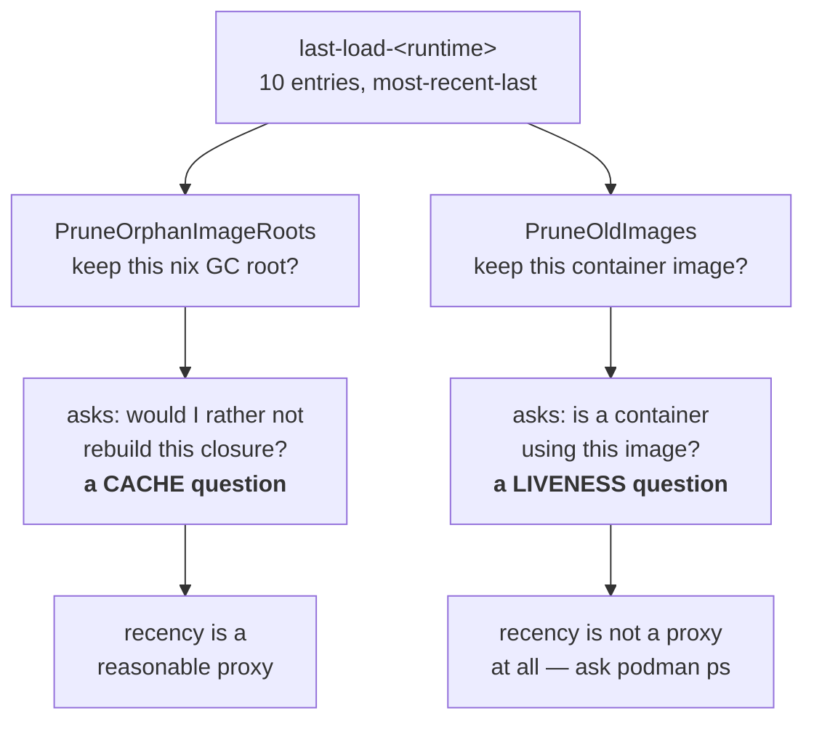

# The load sentinel is not a liveness oracle

**Status:** DESIGN SKETCH, 2026-09-08. One half already built (`feddc5e0` stopped the
image reaper from using it as liveness evidence); the other half — the nix GC-root
reaper — is untouched and still rests on a premise this doc shows is false.

**The short version.** `build/last-load-<runtime>` is a ten-entry, most-recent-last list
of nix store paths, appended to on every successful launch. Two reapers treat membership
in that list as permission to keep something. That is sound for the **nix GC roots**,
which are a cache and want recency; it is unsound for **container images**, which want
liveness — and the two are not the same question. A jail that is *running* but not
*relaunching* never re-appends, so it drops off the end while still in use.

**Start with [§4](#4-two-consumers-two-different-questions)** — everything else is
evidence for the claim that the two consumers are asking different questions.

**Reads with:** [`image-staging-vs-baking.md`](image-staging-vs-baking.md) (C2, which
demoted this same sentinel out of the load decision — the precedent this doc extends),
[`minimal-disk-footprint.md`](minimal-disk-footprint.md) ([OQ-DF3](minimal-disk-footprint.md#OQ-DF3), which armed the
automatic reap that fired).

---

## 1. Verdict

**The ledger is the right instrument for one consumer and the wrong instrument for the
other, and the codebase already contains the argument that settles it.**

C2 took this sentinel *out* of the load decision on exactly this reasoning
(`internal/image/autoload.go:440-465`, verified 2026-09-08):

> THE LOAD DECISION BELONGS TO THE RUNTIME, NOT TO THE SENTINEL.

The runtime is asked directly (`ImageInspectCmd`) whether the content-addressed ref is
present, and the sentinel was "demoted from authority" to diagnosis plus
*"prune's liveness ledger"* (`autoload.go:464-468`).

That demotion was half-finished. The same sentence — *ask the runtime, do not infer from
a history file* — applies unchanged to "is any container using this image", and there
the sentinel was left in authority. `podman ps` answers it exactly, in one call, with no
window and no cap.

Three principles I would hold to:

- **P1. Recency is a cache policy, not a liveness proof.** A bounded most-recently-used
  list answers "what would I like to still have"; it cannot answer "what is in use".
- **P2. A destructive sweep asks the authority.** Where an authority exists and is cheap
  (`podman ps`, `podman images`), evidence derived from a side-file is a guess.
- **P3. Unknown is not permission.** If the authority cannot be reached, the sweep
  declines. This one is already honoured throughout `internal/prune` and should stay.

## 2. What the ledger actually is

One file per runtime, `~/.local/share/yolo-jail/build/last-load-<runtime>`, one nix store
path per line, **most-recent-last**, capped at **ten entries**
(`internal/image/image.go:270-284`):

```
AddLoadedPath(sentinel, storePath):
    read existing lines, DROPPING any equal to storePath   # dedupe
    append storePath                                        # newest last
    if len > 10: keep the last 10                           # hard cap
    rewrite the file
```

| Property | Value | Evidence |
| :--- | :--- | :--- |
| Capacity | 10 entries, per runtime | `image.go:280-282` |
| Order | most-recent-last; dedupe-then-append | `image.go:274-279` |
| Written by | `AutoLoadImage`, on every SUCCESS (not only on a load) | `autoload.go:575` |
| Read as | an unordered SET (`map[string]struct{}`) | `image.go:224` |
| Write errors | discarded (`_ =`) | `autoload.go:575` |
| One writer | `AutoLoadImage` only; no locking between concurrent launches | — |

Two properties matter later. The **append fires on launch**, so a jail that is up but not
relaunching contributes nothing; and the reader **discards the order**, so "how recent"
is unavailable to a consumer even though the file encodes it.

> [!NOTE]
> Moving the append from the *load* path to *every success* was itself a fix for this
> family of bug (`autoload.go:562-574`): before it, an already-loaded image was never
> re-appended, so a jail relaunching daily still aged out. That fix is real and made the
> window wider — it did not make it unbounded, which is the gap this doc is about.

## 3. What it was originally for

It decided **whether to load the image**: compare this build's store path against the
most-recently-loaded entry; if they differ, load. C2 dissolved that question by making
the image ref the store-path hash, so presence is now a direct question to the runtime and
the sentinel's answer became redundant (`autoload.go:445-462`).

The file survived because two other things had come to depend on it. Nobody re-derived
whether it *fit* those uses — it was simply the ledger that already existed.

## 4. Two consumers, two different questions



**Consumer A — nix GC roots** (`internal/prune/imageroots.go:21-30`). A root pins a store
closure so a later `nix-collect-garbage` cannot reclaim it. Losing a root does not stop a
running container: the image already lives in the runtime's own storage. What it costs is
a **rebuild** the next time that path is wanted. That is a cache-retention question, and a
bounded MRU list is a defensible answer to it.

**Consumer B — container images** (`internal/prune/probes.go`, `PruneOldImages`). Removing
an image that a container is using destroys the container. That is a liveness question,
and the ledger cannot answer it.

## 5. The diagnosis

### 5.1 The premise that is false

`imageroots.go:24-26` justifies its protected-set guard like this:

> "The image a live container runs is **always the most recent sentinel entry**, so this
> never unroots a running closure; at most it over-retains ~10 roots per runtime."

That is true only when at most one jail is alive. `autoload.go:567-573` states the
opposite, in the same repository:

> "several images stay loaded at once and a launch can legitimately run image A while the
> sentinel's newest entry is B … A ages out of the ten-entry LRU while a jail is running
> on it, and prune's ProtectedImagePaths stops protecting its closure"

> [!WARNING]
> **Two comments in this codebase contradict each other, and the false one is load-bearing
> for a destructive guard.** `imageroots.go`'s "always the most recent entry" is the stated
> reason its reap is safe. It is not safe for the second and subsequent concurrent jails.
> Anyone touching either file should fix the comment, not re-derive the claim.

### 5.2 What it cost, measured

On 2026-09-08 the automatic image reap force-removed the images of **four jails that had
been up 3–4 days** (polyclav 3d21h, stories 4d0h, backplane 4d10h, yolo-jail-site 4d12h),
and `podman rmi -f` took the running containers with them. Reconstructed from the host
journal: a container removed and *that container's own image* untagged inside one podman
invocation, four times, between 13:35:26 and 13:36:26.

Three things had to line up, and all three are ordinary:

1. **The window filled.** Ten distinct store paths were loaded after those jails last
   launched. A `flake.lock` update plus per-workspace `packages:` variation (each distinct
   list is its own content-addressed image, C2) does that across a dozen workspaces in a
   day or two.
2. **The keep window is small.** `DefaultKeepImages = 2` (`autoreap.go:30`) — only the two
   newest by `CreatedAt` survive on age alone.
3. **The sort key works against long-running jails.** `CreatedAt` is when the archive was
   *streamed*, so a jail running for four days carries a four-day-old timestamp and sorts
   **oldest** — first in line (`probes.go:240-246`).

### 5.3 Why the age floor does not cover it

Consumer A has a third guard: keep any root younger than **3600 seconds**
(`prunecmd.go:215`). That covers an in-flight launch whose path has not reached the
sentinel yet. It does nothing for a jail that has been up for days, which is precisely the
population at risk. Consumer A therefore has the same latent hole as B, unfixed.

## 6. The proposal

**Separate the two questions and give each its own evidence.**

- **Liveness comes from the runtime.** `podman ps` yields the image IDs with containers on
  them; nothing in that set is ever selected for removal. Already built for Consumer B in
  `feddc5e0`; Consumer A should read the same set.
- **Recency stays a cache policy, and says so.** The sentinel keeps its MRU role for GC
  roots and for the human-readable "why did this load?" diagnosis. It stops being cited as
  liveness anywhere.
- **Destructive removal stops forcing.** A plain `rmi` fails on an in-use image, so the
  safety survives a wrong answer rather than depending on a right one. Built for B in
  `feddc5e0`.
- **Unknown declines** (P3), already the rule; keep it.

Behavior this fixes, stated as outcomes a human can check: a jail that has been running
for a week is never killed by a reap, no matter how many other images were loaded meanwhile;
a `nix-collect-garbage` after a reap never forces a rebuild of an image a live jail is
running; and `yolo prune --apply` on a machine with ten live jails removes nothing that is
in use.

### 6.1 The holes, answered

- **Degenerate inputs.** No sentinel / empty sentinel: reaps nothing (fail-safe, already
  `liveKnown==false`). No running containers: the veto is empty and only the keep window
  and age floor apply. More than ten live jails: irrelevant under the proposal, which is
  the point — the cap stops bounding safety.
- **Failure paths.** `podman ps` unreadable, non-zero, or timed out → decline the entire
  sweep, not just that entry. A removal that fails because the image is in use is *not* an
  error to report loudly; it is the guard working, and should be silent or dim.
- **Concurrency.** Two launches reaping at once is possible today: the 24-hour debounce
  sentinel is read-then-written with no lock, so both may pass. Under the proposal the
  worst case is a duplicated, idempotent sweep. The sentinel's own write is last-writer-wins
  and may lose an entry — acceptable for a cache, and another reason it must not be
  liveness evidence.
- **Trigger and defaults, unchanged by this doc.** The reap fires from `runContainer`
  after a successful image load (`run.go:803`), debounced to once per **24 hours**
  (`AutoReapInterval`), keeping the newest **2** images, with a **3600 s** root age floor.
  `YOLO_NO_AUTO_IMAGE_REAP` (any non-empty value) opts out.
- **Pre-existing state.** Sentinel files on disk keep working as-is; nothing migrates. A
  machine whose live jails have already aged out is protected from the next sweep the
  moment the runtime is consulted.
- **One writer.** `AutoLoadImage` remains the sole writer of the sentinel. No consumer
  writes it.
- **Forbidden.** No reaper may force-remove an image or unroot a closure on the strength
  of the sentinel alone; no reaper may treat an unreadable runtime as an empty one.

## 7. What this does NOT propose

- **Not deleting the sentinel.** It is the right instrument for GC-root retention and for
  the load diagnosis.
- **Not changing the ten-entry cap, the 24-hour debounce, `keep=2`, or the age floor.**
  Those are disk-retention dials; once liveness is separate, they stop being safety
  mechanisms and can be tuned on their merits — or left alone.
- **Not re-opening C2's content-addressed tags.** They are what makes a direct runtime
  query unambiguous in the first place.
- **Not a new persistence format, database, or daemon.**
- **Not touching capture-store GC** (`internal/capture/gc.go`), which has its own model.

## 8. Alternatives considered

| Alternative | Verdict |
| :--- | :--- |
| Enlarge the cap (10 → 50) | **Rejected.** Buys time, fixes nothing: the bound is still arbitrary and still unrelated to whether anything is running. |
| Re-append on a timer while a jail runs (a heartbeat) | **Rejected.** Invents a liveness signal that already exists, and adds a writer to a file with no locking. |
| Protect by container name rather than image | **Rejected.** The names are per-workspace; the reaper's unit is the image, and one image can back several jails. |
| Never auto-reap; leave it to `yolo prune --apply` | **Rejected** — that was the state [OQ-DF3](minimal-disk-footprint.md#OQ-DF3) fixed, and 404 GiB accrued. The trigger is not the defect. |
| Sort by last-used rather than `CreatedAt` | **Deferred**, not rejected. It would stop long-running jails sorting oldest, but it needs a last-used signal that does not exist yet, and liveness makes it unnecessary for safety. Worth revisiting as a retention improvement. |

## 9. Risks

| Risk | Mitigation |
| :--- | :--- |
| `podman ps` is slow on a busy host, adding latency to every launch that reaps | The sweep is already debounced to once per 24h; one `ps` per sweep is negligible beside the `images` call it already makes. |
| A runtime that cannot enumerate containers now blocks all reclamation, and disk grows silently | P3 is deliberate, but the decline should be *visible* — a dim line, not silence, or the 404 GiB failure returns in a new costume. Currently it prints only on the manual path. |
| Consumer A's fix unroots less and the nix store grows | Bounded by the same keep/age dials, and a root pins bytes only until the next `nix-collect-garbage`. |
| The false comment gets copied into a third consumer before it is fixed | Fix the comment in the same change as the code ([§5.1](#51-the-premise-that-is-false)). |

## 10. What I would build, in order

First, correct `imageroots.go`'s comment — it is actively misleading and costs nothing to
fix. Second, give Consumer A the same running-container veto Consumer B now has, so the
two reapers share one liveness source. Third, make the declined sweep visible on the
automatic path, so "we stopped reclaiming" cannot be silent. Only then, if disk is still a
problem, revisit the retention dials — with the safety question already answered somewhere
else, they become ordinary tuning.

## 11. Open Questions

1. 💬 **OQ-LS1: Does the GC-root reaper get the same liveness veto, or is losing a root
   acceptable?** Unrooting a live jail's closure does not kill it — it costs a rebuild the
   next time that path is wanted. If that is an acceptable cost, Consumer A can keep the
   MRU policy and only its comment needs fixing. This decides whether [§10](#10-what-i-would-build-in-order)'s
   second step exists at all.

   <!-- vantage: oq id=OQ-LS1 leaning="Give it the veto — the evidence is already being fetched for the image reaper, so sharing it is nearly free, and 'costs a rebuild' means a 175-second rebuild on this codebase." -->

   _Leaning:_ Give it the veto. The `podman ps` result is already being fetched for the
   image reaper in the same command, so sharing it is nearly free — and "costs a rebuild"
   means 175 seconds here, not a shrug.

   **Answer:**
   > _(empty — fill in when decided)_

2. 💬 **OQ-LS2: Should a declined sweep be visible?** P3 makes an unreachable runtime
   decline everything, which is right, and silent, which may not be: a machine whose podman
   is wedged reclaims nothing and says nothing, which is how [OQ-DF3](minimal-disk-footprint.md#OQ-DF3)'s 404 GiB accrued in the
   first place. Decides whether the automatic path is allowed to be silent about *not*
   acting.

   <!-- vantage: oq id=OQ-LS2 leaning="One dim line when a sweep declines, on the automatic path too — silence about not-acting is what the original defect was made of." -->

   _Leaning:_ One dim line when a sweep declines. Silence about not acting is exactly what
   the original 404 GiB defect was made of.

   **Answer:**
   > _(empty — fill in when decided)_

3. 💬 🤷 **OQ-LS3: Is `keep=2` still the retention you want?** Once liveness is separate,
   `keep` stops being a safety margin and becomes a pure undo buffer — how many superseded
   images you want to be able to fall back to without a rebuild. Two is small for a machine
   that rebuilds on every `flake.lock` bump.

   <!-- vantage: oq id=OQ-LS3 leaning="Preference, not a technical call — though I would raise it once safety no longer depends on it." -->

   _Leaning:_ Your call — it is a disk-versus-rebuild trade, not a correctness one. I would
   raise it now that safety no longer rests on it.

   **Answer:**
   > _(empty — fill in when decided)_
