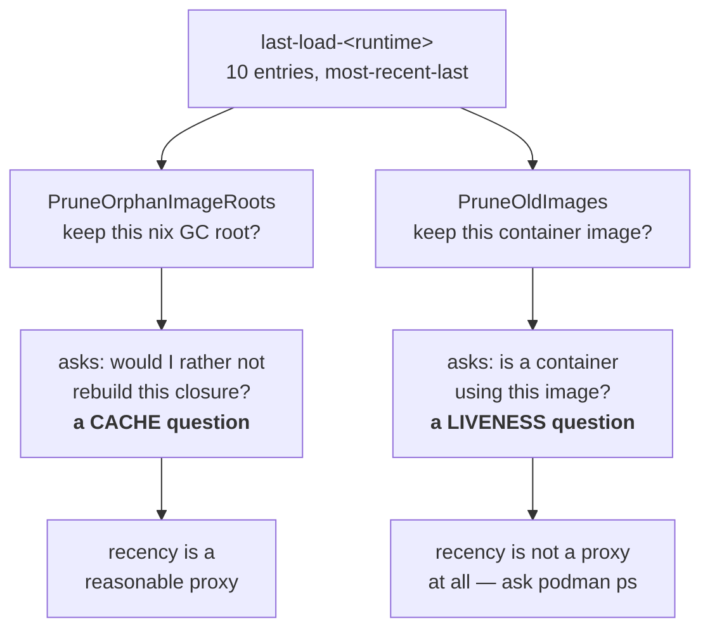

# The load sentinel is not a liveness oracle

**Status:** ACCEPTED, 2026-09-09 — **all three rulings are now BUILT** (`93f21f07`, `3c9e8de9`,
`ae190ac4`). **No open questions.** LS3's mechanism shipped as
[§6.2](#62-retention-after-the-two-rulings) describes it, after being blocked for a day on a
grouping key that turned out not to be needed. All three are compacted into
[§11.1](#111-decision-ledger).

**The short version.** `build/last-load-<runtime>` is a ten-entry, most-recent-last list
of nix store paths, appended to on every successful launch. Two reapers treat membership
in that list as permission to keep something. That is sound for the **nix GC roots**,
which are a cache and want recency; it is unsound for **container images**, which want
liveness — and the two are not the same question. A jail that is *running* but not
*relaunching* never re-appends, so it drops off the end while still in use.

**Start with [§4](#4-two-consumers-two-different-questions)** — everything else is
evidence for the claim that the two consumers are asking different questions.

**Reads with:** [`image-staging-vs-baking.md`](../reference/image-staging-vs-baking.md#the-content-addressed-image-ref) (the content-addressed image ref, which
demoted this same sentinel out of the load decision — the precedent this doc extends),
[`minimal-disk-footprint.md`](minimal-disk-footprint.md) ([OQ-DF3](minimal-disk-footprint.md#OQ-DF3), which armed the
automatic reap that fired).

---

## 1. Verdict

**The ledger is the right instrument for one consumer and the wrong instrument for the
other, and the codebase already contains the argument that settles it.**

C2 took this sentinel *out* of the load decision on exactly this reasoning
(`internal/image/autoload.go:440-465`, verified 2026-09-08):

> THE LOAD DECISION BELONGS TO THE RUNTIME, NOT TO THE SENTINEL.

The runtime is asked directly (`ImageInspectCmd`) whether the content-addressed ref is
present, and the sentinel was "demoted from authority" to diagnosis plus
*"prune's liveness ledger"* (`autoload.go:464-468`).

That demotion was half-finished. The same sentence — *ask the runtime, do not infer from
a history file* — applies unchanged to "is any container using this image", and there
the sentinel was left in authority. `podman ps` answers it exactly, in one call, with no
window and no cap.

Three principles I would hold to:

- **P1. Recency is a cache policy, not a liveness proof.** A bounded most-recently-used
  list answers "what would I like to still have"; it cannot answer "what is in use".
- **P2. A destructive sweep asks the authority.** Where an authority exists and is cheap
  (`podman ps`, `podman images`), evidence derived from a side-file is a guess.
- **P3. Unknown is not permission.** If the authority cannot be reached, the sweep
  declines. This one is already honoured throughout `internal/prune` and should stay.

## 2. What the ledger actually is

One file per runtime, `~/.local/share/yolo-jail/build/last-load-<runtime>`, one nix store
path per line, **most-recent-last**, capped at **ten entries**
(`internal/image/image.go:270-284`):

```
AddLoadedPath(sentinel, storePath):
    read existing lines, DROPPING any equal to storePath   # dedupe
    append storePath                                        # newest last
    if len > 10: keep the last 10                           # hard cap
    rewrite the file
```

| Property | Value | Evidence |
| :--- | :--- | :--- |
| Capacity | 10 entries, per runtime | `image.go:280-282` |
| Order | most-recent-last; dedupe-then-append | `image.go:274-279` |
| Written by | `AutoLoadImage`, on every SUCCESS (not only on a load) | `autoload.go:575` |
| Read as | an unordered SET (`map[string]struct{}`) | `image.go:224` |
| Write errors | discarded (`_ =`) | `autoload.go:575` |
| One writer | `AutoLoadImage` only; no locking between concurrent launches | — |

Two properties matter later. The **append fires on launch**, so a jail that is up but not
relaunching contributes nothing; and the reader **discards the order**, so "how recent"
is unavailable to a consumer even though the file encodes it.

> [!NOTE]
> Moving the append from the *load* path to *every success* was itself a fix for this
> family of bug (`autoload.go:562-574`): before it, an already-loaded image was never
> re-appended, so a jail relaunching daily still aged out. That fix is real and made the
> window wider — it did not make it unbounded, which is the gap this doc is about.

## 3. What it was originally for

It decided **whether to load the image**: compare this build's store path against the
most-recently-loaded entry; if they differ, load. C2 dissolved that question by making
the image ref the store-path hash, so presence is now a direct question to the runtime and
the sentinel's answer became redundant (`autoload.go:445-462`).

The file survived because two other things had come to depend on it. Nobody re-derived
whether it *fit* those uses — it was simply the ledger that already existed.

## 4. Two consumers, two different questions



**Consumer A — nix GC roots** (`internal/prune/imageroots.go:21-30`). A root pins a store
closure so a later `nix-collect-garbage` cannot reclaim it. Losing a root does not stop a
running container: the image already lives in the runtime's own storage. What it costs is
a **rebuild** the next time that path is wanted. That is a cache-retention question, and a
bounded MRU list is a defensible answer to it.

**Consumer B — container images** (`internal/prune/probes.go`, `PruneOldImages`). Removing
an image that a container is using destroys the container. That is a liveness question,
and the ledger cannot answer it.

## 5. The diagnosis

### 5.1 The premise that is false

`imageroots.go:24-26` justifies its protected-set guard like this:

> "The image a live container runs is **always the most recent sentinel entry**, so this
> never unroots a running closure; at most it over-retains ~10 roots per runtime."

That is true only when at most one jail is alive. `autoload.go:567-573` states the
opposite, in the same repository:

> "several images stay loaded at once and a launch can legitimately run image A while the
> sentinel's newest entry is B … A ages out of the ten-entry LRU while a jail is running
> on it, and prune's ProtectedImagePaths stops protecting its closure"

> [!WARNING]
> **Two comments in this codebase contradict each other, and the false one is load-bearing
> for a destructive guard.** `imageroots.go`'s "always the most recent entry" is the stated
> reason its reap is safe. It is not safe for the second and subsequent concurrent jails.
> Anyone touching either file should fix the comment, not re-derive the claim.

### 5.2 What it cost, measured

On 2026-09-08 the automatic image reap force-removed the images of **four jails that had
been up 3–4 days** (polyclav 3d21h, stories 4d0h, backplane 4d10h, yolo-jail-site 4d12h),
and `podman rmi -f` took the running containers with them. Reconstructed from the host
journal: a container removed and *that container's own image* untagged inside one podman
invocation, four times, between 13:35:26 and 13:36:26.

Three things had to line up, and all three are ordinary:

1. **The window filled.** Ten distinct store paths were loaded after those jails last
   launched. A `flake.lock` update plus per-workspace `packages:` variation (each distinct
   list is its own content-addressed image, C2) does that across a dozen workspaces in a
   day or two.
2. **The keep window is small.** `DefaultKeepImages = 2` (`autoreap.go:30`) — only the two
   newest by `CreatedAt` survive on age alone.
3. **The sort key works against long-running jails.** `CreatedAt` is when the archive was
   *streamed*, so a jail running for four days carries a four-day-old timestamp and sorts
   **oldest** — first in line (`probes.go:240-246`).

### 5.3 Why the age floor does not cover it — as written

Consumer A has a third guard: keep any root younger than **3600 seconds**
(`prunecmd.go:215`). That covers an in-flight launch whose path has not reached the
sentinel yet, and nothing else — an hour is far too short to be a cache policy and far too
long to be a race guard.

> [!IMPORTANT]
> **This section originally concluded "Consumer A therefore has the same latent hole as B",
> and that conclusion is REFUTED** — see [OQ-LS1](#111-decision-ledger). B's hole is that it can delete
> something in use; A cannot, because losing a root costs a rebuild and nothing else. A's
> defect is not a missing veto but a **wrong duration**: an hour is not the horizon over which
> "will I want this closure again" is decided. The ruling raises it to a week and removes the
> protected set, rather than importing B's liveness evidence into a cache decision. Kept here
> because the refuted version is the more tempting one.

## 6. The proposal

**Separate the two questions and give each its own evidence.**

- **Liveness comes from the runtime — for Consumer B, and only for it.** `podman ps` yields the
  image IDs with containers on them; nothing in that set is ever selected for removal. Already
  built for Consumer B in `feddc5e0`.
- **Consumer A gets no liveness evidence at all, by ruling** ([OQ-LS1](#111-decision-ledger)). Its question is
  a prediction about future want, and liveness is a wrong predictor in both directions — a jail
  stopped five seconds ago is not live, and a jail up for three weeks pins a closure nobody will
  build again. It becomes a pure **age** policy: reap a root unrooted longer than a week
  (`PruneOrphanImageRoots`' `olderThan`, raised from 3600 s), with an optional size cap applied
  after age and never instead of it. Because `mtime` is on the link, that policy has no authority
  it could fail to reach — which is why [P3](#1-verdict) stops applying to A rather than being
  weakened for it.
- **Recency stays a cache policy, and says so.** The sentinel keeps its MRU role for GC
  roots and for the human-readable "why did this load?" diagnosis. It stops being cited as
  liveness anywhere.
- **Destructive removal stops forcing.** A plain `rmi` fails on an in-use image, so the
  safety survives a wrong answer rather than depending on a right one. Built for B in
  `feddc5e0`.
- **Unknown declines** (P3), already the rule; keep it.

Behavior this fixes, stated as outcomes a human can check: a jail that has been running
for a week is never killed by a reap, no matter how many other images were loaded meanwhile;
a `nix-collect-garbage` after a reap never forces a rebuild of an image a live jail is
running; and `yolo prune --apply` on a machine with ten live jails removes nothing that is
in use.

### 6.1 The holes, answered

- **Degenerate inputs.** No sentinel / empty sentinel: Consumer B reaps nothing (fail-safe,
  already `liveKnown==false`); Consumer A no longer consults it at all, so an absent sentinel is
  not a condition for it ([OQ-LS1](#111-decision-ledger)). No running containers: the veto is empty and only the keep window
  and age floor apply. More than ten live jails: irrelevant under the proposal, which is
  the point — the cap stops bounding safety.
- **Failure paths.** `podman ps` unreadable, non-zero, or timed out → decline the entire
  sweep, not just that entry. A removal that fails because the image is in use is *not* an
  error to report loudly; it is the guard working, and should be silent or dim.
- **Concurrency.** Two launches reaping at once is possible today: the 24-hour debounce
  sentinel is read-then-written with no lock, so both may pass. Under the proposal the
  worst case is a duplicated, idempotent sweep. The sentinel's own write is last-writer-wins
  and may lose an entry — acceptable for a cache, and another reason it must not be
  liveness evidence.
- **Trigger and defaults, unchanged by this doc.** The reap fires from `runContainer`
  after a successful image load (`run.go:803`), debounced to once per **24 hours**
  (`AutoReapInterval`), keeping the newest **2** images, with a **3600 s** root age floor.
  `YOLO_NO_AUTO_IMAGE_REAP` (any non-empty value) opts out.
- **Pre-existing state.** Sentinel files on disk keep working as-is; nothing migrates. A
  machine whose live jails have already aged out is protected from the next sweep the
  moment the runtime is consulted.
- **One writer.** `AutoLoadImage` remains the sole writer of the sentinel. No consumer
  writes it.
- **Forbidden.** No reaper may force-remove an image or unroot a closure on the strength
  of the sentinel alone; no reaper may treat an unreadable runtime as an empty one.

### 6.2 Retention, after the two rulings

`keep` stops being a safety margin the moment liveness has its own evidence, and the two rulings
above leave it with almost nothing to do.

**The unit is the CONFIGURATION, and there are no superseded copies.** Keep each configuration's
current image; evolve forward, never hold a copy to go back to. What that leaves for a global count
like `--keep-images` is nothing — there is no depth for it to bound.

> [!IMPORTANT]
> **This needs a per-workspace CURRENT POINTER, not a config identity — and mistaking the one for
> the other cost a day.** Grouping by configuration looks like it needs a value that is equal
> across images of one config, and nothing in the tree records one: `ImageStoreKey` is per image,
> and `imageIdentity` is deliberately invariant across `packages:` lists, so neither can group. That
> is a real dead end, and it is the wrong problem. **A grouping key is only needed when a group has
> more than one member.** With zero superseded copies, "each config's current image" is a set of
> pointers, one per workspace — and a workspace already has a home for that kind of state at
> `<workspace>/.yolo/`, while the launcher already knows the store path it just used, because it
> writes that path to the load sentinel. Retention becomes the union of those pointers plus the
> `podman ps` veto. No identity, no hashing, no label extension.

> [!WARNING]
> **Zero superseded copies is not zero images.** A config whose current image is in use is
> protected by liveness regardless of any count, and under a shared-base layer plan every kept
> image also holds the base in place — so reaping to one-per-config is the FLOOR, not a target to
> beat. See [`layer-aware-image-delivery.md`](./layer-aware-image-delivery.md)
> [§4](./layer-aware-image-delivery.md#4-what-it-costs).

**BUILT, `ae190ac4`.** `internal/prune/currentimages.go` is the pointer — one file per workspace
under `BuildDir()/current-images/`, holding the store path and the workspace that recorded it —
and `internal/cli/run/currentimage.go` is the launch-side write, under the same machine-wide
housekeeping lock [OQ-BF5](disk-levers-and-backfill.md#111-decision-ledger) gave the load path.
`PruneOldImages` lost its `keep` parameter, `OldImagesToRemove` and `DefaultKeepImages` were
deleted, and `--keep-images` REFUSES rather than being silently ignored (`pruneOptions` has no
default case, so an ignored `--keep-images 8` would reclaim on the new rule with no sign the number
did nothing). **It was replaced by them, not tuned.**

Four things the build settled that this section did not say:

- **The pointers live under `BuildDir()`, not in `<workspace>/.yolo`.** A single pointer read by its
  own workspace would sit there happily; the REAPER needs the union, and it has no way to enumerate
  workspaces that is not itself a registry — the runtime's container list loses a row to `yolo
  prune`'s own stale-container sweep minutes earlier in the same run, and the per-container tracking
  files are deleted for every container that is not RUNNING. So they are host state keyed by the
  deterministic container name, the shape `paths.ApprovalsDir` already argues for, and a sibling of the sentinel and the GC roots.
- **The tri-state is the migration.** No honoured pointer ⇒ `known=false` ⇒ the pass DECLINES
  ([OQ-LS2](#111-decision-ledger)), which is exactly the state an upgraded machine is in before its
  first launch: nothing is reaped on the strength of an absence, and `yolo prune` exits non-zero
  naming the missing evidence plus what supplies it.
- **A pointer whose workspace is gone protects nothing, and its file is kept anyway.** A deleted
  workspace has no configuration, so there is nothing to retain for it; the ~100-byte file stays
  because a workspace can be temporarily absent and deleting it would cost the same re-stream it
  would save.
- **Measured, on the maintainer's jail-local podman store (2026-09-09).** With 8 distinct
  `yolo-jail` images across 12 rows, the old rule (`keep=2` plus the sentinel's LRU-10 veto) evicted
  **3**; the pointer rule with the two pointers real launches had written evicts **6**. Earlier the
  same day, at 14 images, the same comparison was **4** against **13** (one pointer) and **10**
  (four). So the pointer rule reclaims MORE, not less — the LRU, not `keep`, was doing the retaining
  ([`disk-levers-and-backfill.md` §2.2](disk-levers-and-backfill.md) said so), and this is the ⚠
  above in numbers: one-per-config is the FLOOR.

## 7. What this does NOT propose

- **Not deleting the sentinel.** It is the right instrument for GC-root retention and for
  the load diagnosis.
- **Not changing the ten-entry cap, the 24-hour debounce, or `keep=2`.** Those are
  disk-retention dials; once liveness is separate, they stop being safety mechanisms and can be
  tuned on their merits — or left alone. ⚠ **`keep` was the exception, and the ruling moved after
  this list was written:** [OQ-LS3](#111-decision-ledger) REPLACED it with the per-workspace pointer
  set of [§6.2](#62-retention-after-the-two-rulings) rather than tuning it — built `ae190ac4`, so
  there is no `--keep-images` and no `DefaultKeepImages` left to tune.
  **The age floor DOES change**, and that is [OQ-LS1](#111-decision-ledger)'s ruling rather than an exception
  to this list: for Consumer A the floor stops being a race guard and becomes the whole policy,
  at a week instead of an hour.
- **Not re-opening C2's content-addressed tags.** They are what makes a direct runtime
  query unambiguous in the first place.
- **Not a new persistence format, database, or daemon.**
- **Not touching capture-store GC** (`internal/capture/gc.go`), which has its own model.

## 8. Alternatives considered

| Alternative | Verdict |
| :--- | :--- |
| Enlarge the cap (10 → 50) | **Rejected.** Buys time, fixes nothing: the bound is still arbitrary and still unrelated to whether anything is running. |
| Re-append on a timer while a jail runs (a heartbeat) | **Rejected.** Invents a liveness signal that already exists, and adds a writer to a file with no locking. |
| Protect by container name rather than image | **Rejected.** The names are per-workspace; the reaper's unit is the image, and one image can back several jails. |
| Never auto-reap; leave it to `yolo prune --apply` | **Rejected** — that was the state [OQ-DF3](minimal-disk-footprint.md#OQ-DF3) fixed, and 404 GiB accrued. The trigger is not the defect. |
| Sort by last-used rather than `CreatedAt` | **Deferred**, not rejected. It would stop long-running jails sorting oldest, but it needs a last-used signal that does not exist yet, and liveness makes it unnecessary for safety. Worth revisiting as a retention improvement. |

## 9. Risks

| Risk | Mitigation |
| :--- | :--- |
| `podman ps` is slow on a busy host, adding latency to every launch that reaps | The sweep is already debounced to once per 24h; one `ps` per sweep is negligible beside the `images` call it already makes. |
| A runtime that cannot enumerate containers now blocks all reclamation, and disk grows silently | P3 is deliberate, but the decline should be *visible* — a dim line, not silence, or the 404 GiB failure returns in a new costume. Currently it prints only on the manual path. |
| Consumer A's fix unroots less and the nix store grows | Bounded by the same keep/age dials, and a root pins bytes only until the next `nix-collect-garbage`. |
| The false comment gets copied into a third consumer before it is fixed | Fix the comment in the same change as the code ([§5.1](#51-the-premise-that-is-false)). |

## 10. What I would build, in order

First, correct `imageroots.go`'s comment — it is actively misleading and costs nothing to fix.

Second — **and this step inverted under [OQ-LS1](#111-decision-ledger)** — do **not** give Consumer A the
running-container veto. Take the opposite step: drop the `protected`/`liveKnown` inputs from
`PruneOrphanImageRoots` and raise its `olderThan` from 3600 s to a week, so the GC-root reaper
becomes a pure age policy with no authority to consult.

Third, make a declined sweep **loud where it is a defect and an error where the user asked for
the work** ([OQ-LS2](#111-decision-ledger)) — not the dim line this doc first proposed, and silent when there
is simply nothing to reclaim.

Only then, if disk is still a problem, revisit the retention dials — with the safety question
answered somewhere else, they become ordinary tuning — except `keep`, which
[OQ-LS3](#111-decision-ledger) replaced outright with [§6.2](#62-retention-after-the-two-rulings)'s
pointer set (built `ae190ac4`), and which the layer plan's own step 1 was waiting on rather than the
reverse.

## 11. Decisions

All three are ruled and built. LS3's mechanism is [§6.2](#62-retention-after-the-two-rulings).
The rulings' arguments live in the body sections they govern — [§5.3](#53-why-the-age-floor-does-not-cover-it--as-written)
and [§6](#6-the-proposal) for LS1, [§6.1](#61-the-holes-answered) for LS2 — and the refuted
positions are kept there as warnings rather than as history.

### 11.1 Decision Ledger

| ID | Ruling / Decision | Date | Settled in | Built |
| :--- | :--- | :--- | :--- | :--- |
| OQ-LS1 | **NO liveness veto for the GC-root reaper — an age cutoff at ONE WEEK, and a size cap only after age.** Ruled AGAINST the leaning: the question is a prediction about future want, and liveness is a wrong predictor in both directions (a jail stopped five seconds ago is not live; a jail up three weeks pins a closure nobody will build again). `PruneOrphanImageRoots` loses its `protected` set and its `liveKnown` gate; P3 stops applying to that consumer rather than being weakened, because an age policy reads mtime off the link and has no authority it could fail to reach | 2026-09-08 | [§5.3](#53-why-the-age-floor-does-not-cover-it--as-written), [§6](#6-the-proposal) | ✅ `93f21f07` |
| OQ-LS2 | **A decline says so: an ERROR where the user asked, and nothing where they did not.** `yolo prune` exits non-zero naming the missing evidence; the automatic path records it; a debounced pass stays silent and carries no reason. The proposed "one dim line" was refused as the wrong volume — the only routine case says nothing at all. The candidate listing moved BEFORE the guards so that "declined" means "prevented work" rather than "fresh machine" | 2026-09-08 | [§6.1](#61-the-holes-answered) | ✅ `3c9e8de9` |
| OQ-LS3 | **`keep` is the wrong MECHANISM, not the wrong number — and there is NO undo.** The window was global (`OldImagesToRemove` sorted every row by `Created` and kept the newest N, with no notion of a workspace or a config), so on four workspaces two images were evicted per pass however recently each was used. The unit is the CONFIGURATION, and the superseded-per-config count is **zero**: *"I don't know that I've ever rolled back, only evolved forward."* `keep` is podman IMAGES only; nix roots are [OQ-LS1](#111-decision-ledger)'s duration policy | 2026-09-08, sharpened 2026-09-09 | [§6.2](#62-retention-after-the-two-rulings) | ✅ `ae190ac4` |

> [!WARNING]
> **LS2's "loud" does NOT mean the terminal.** The automatic path's notices went to stdout, then to
> stderr, and stderr is the same terminal — so a reclaim printed on top of a running agent's TUI
> (reported 2026-09-09, one launch after it shipped). Loud means NOT SILENT: the record goes to
> `<workspace>/.yolo/housekeeping.log`, and the non-zero exit lands where a human actually asked.
> See [`disk-levers-and-backfill.md`](./disk-levers-and-backfill.md) [§5.1](./disk-levers-and-backfill.md#51-the-housekeeping-slot).
