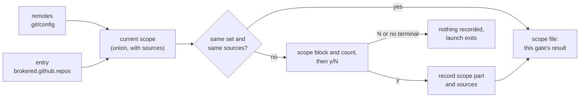

# The agent asks for a repository, the human says yes: GitHub scope widening moves into the workspace config

**Status:** 2026-10-05. The rulings are the maintainer's, from conversation that day. The
mechanism decisions are this doc's, recorded as implementation decisions in
[§10](#10-decision-ledger). Nothing is built. Evidence verified at `aea26d196`, and the
review's findings re-checked against the tree at `dd0cfeb53`.

> **In short.** The github-broker can reach a repository beyond the workspace's own remotes when
> the workspace config lists it, approved at the next fresh launch exactly as a new remote is.
> Keeping that list in the user config fenced off nothing an agent could not already reach, and it
> made the one supported path a host-side edit nobody wanted to make.

**Why it matters.** Today the supported way to give a jail a second repository is a host-side edit
to `~/.config/yolo-jail/config.jsonc`, under a key spelled with the workspace's host path. The only
other way is a fake git remote. The maintainer's verdict: *"this is just unworkable."*

**The shape.** One list, `brokered.<source>.repos`, in `yolo-jail.jsonc` or the local file beside
it. The gate's scope part takes it in beside the remotes. The labeled scope block shows each entry
with its file, and the broker gets the approved union and nothing else.

**Cost.**

- **Committed requests.** A committed config can ask, at any fresh broker launch, for any
  repository the user's login reaches. Once approved, that repository is also covered by every
  read-write window the human later grants.
- **One-time migration stop.** A user-config entry of the shipped form stops every launch on the
  machine until it is moved, and the refusal names the edit to make.
- **A remote's rename asks.** The gate now records where each approved repository came from, by
  remote name and file. So `git remote rename origin upstream`, or a second remote for a
  repository already approved, asks once at the next fresh launch. That holds in every project
  where the broker runs, including one with no entry ([OQ-WW1](#OQ-WW1)).

**Start at [§3.2](#32-the-gate)**, the gate. The rest falls out of it.

**Needs your ruling:** [OQ-WW1](#OQ-WW1), whether renaming a remote should ask. The build
follows its leaning, which is what this design already said; the other answer is a small change.

**Reads with:**

- [`boundary-broker.md`](boundary-broker.md): the broker. This doc re-rules its
  [OQ-BB6](boundary-broker.md#OQ-BB6), which makes its [OQ-BB11](boundary-broker.md#OQ-BB11) moot.
- [`config-safety.md`](../reference/config-safety.md): the config-change gate.
- [`workspace-widening-plan.md`](workspace-widening-plan.md): the implementation sketch, stamped
  `SKETCH`. Complete it before building from it.

---

## 1. The ruling, and what it overturns

### 1.1 In the maintainer's words

> *"We already have this config approval thing. We then allow context mounts to be outside of the
> jail. It's written in the JAILS file, and I think this is okay because we have the config
> approval … I'm thinking that same holds for this GitHub access, and it should not be in the user
> file because this is just unworkable. So I should be able to give an agent a repo. It will say it
> doesn't have access. It will add it to the config, and then I will say restart and yes, and then
> it will have access, whatever that access is."*

He then accepted the proposal as it was put to him: *"Yes, all of that sounds right."* It had
these parts:

- **The workspace config, behind the gate** ([WW-D1](#WW-D1)).
- **The labeled scope block, never JSON lines** in the config diff ([WW-D4](#WW-D4)).
- **The shape**, `brokered.github.repos` in `yolo-jail.jsonc` or `yolo-jail.local.jsonc`
  ([WW-D3](#WW-D3)).
- **The user-scope form deleted**, the old key an error naming the new place, and a CHANGELOG
  `### Changed` line ([WW-D2](#WW-D2)).
- **The refusal** names the entry and the restart ([WW-D5](#WW-D5)).
- **The reasons, [OQ-BB11](boundary-broker.md#OQ-BB11) among them** ([WW-D7](#WW-D7)).
- **Three costs**: the bar drops from a host edit to a y, a cloned project can ask for
  repositories, and restarting stays manual.

He added one note: *"the agent should be told if this is added to the config file, then you have to
ask the user to restart"* ([WW-D6](#WW-D6)). The rest of [§3](#3-the-design) is this doc's
implementation decisions, [WW-D8](#WW-D8) on.

The 2026-09-29 ruling this replaces was provisional by his own words: *"Let's start with A and then
see how it goes"* ([OQ-BB6](boundary-broker.md#OQ-BB6)).

### 1.2 Why it holds

- **The fence was already open.** The scope is every remote in the workspace's `.git/config` whose
  URL names `github.com` in the https, `ssh://` or `git@` form, and the agent can edit that file.
  Under [OQ-BB7](boundary-broker.md#OQ-BB7)'s ruling, `git remote add lib
  https://github.com/org/lib` and one y at the next launch admit `org/lib` today. A workspace-config
  entry behind the same y hands the agent nothing it lacks. It just saves the project from carrying
  a remote nobody wants.
- **Both objections to this option are answered.** [OQ-BB6](boundary-broker.md#OQ-BB6) declined
  option (d), *"a workspace-scope key, honored only once a human approves it through the existing
  config-change diff"*, for two reasons:
  - It put the widening in a file the maintainer had ruled a workspace may not use, under
    [OQ-BB1](boundary-broker.md#OQ-BB1). His 2026-10-05 ruling withdraws that.
  - It *"rides a diff the human may approve alongside an ordinary package change."*
    [BB-D31](boundary-broker.md#BB-D31) answered that the same day: a scope change is a labeled
    block shown first, one row per repository, never JSON lines. This design extends that block.
- **A standing ruling already admits it.** pack-system's
  [OQ-K2](../reference/pack-system.md#why-its-this-way) lets a workspace supply values that reach a host daemon *"as
  long as they go through the config-change gating"*. It rests on two conditions: the approval
  record stays in host-side state no jail mounts, and a launch with no terminal never auto-accepts.
  This channel joins that conditional. *"If either is ever reverted, this answer goes with it."*
- **It matches the read-only mount, for reads.** A workspace `mounts` element reaches any host path
  read-only, behind the same gate ([`context-mounts.md` §2.2](context-mounts.md#22-where-an-rw-mount-may-be-declared-deferred)), while
  read-write reach stays user-scope-only. Writes differ, and the difference is a cost. A listed
  repository joins the scope for every permission set ([OQ-BB9](boundary-broker.md#OQ-BB9)). So once
  read-write grants are built, it is covered by every read-write window the human grants: the
  whole set for 15 minutes by default ([OQ-BB2](boundary-broker.md#OQ-BB2)). Writes exit 77 today.

> [!NOTE]
> **The authority test decides it, applied to the restriction.**
> [Test 1](../reference/gate-placement-principle.md#test-1--the-authority-test-could-this-actor-already-do-it)
> asks whether the actor could already do the thing. For `packs`, keeping the key out of the
> workspace denies the agent something it could not otherwise get, so the restriction stands. Here
> the agent already gets the same outcome through a remote and a y, so keeping the key user-scope
> denies nothing.
>
> **Where `.git/config` is locked, the equivalence fails.** If `workspace_readonly` locks
> `.git/config`, the agent cannot add a remote. The local file is writable from inside the jail
> even then ([`workspace-config-trust.md`](workspace-config-trust.md)), so there the entry is a new
> agent input. It is still behind the y. [§7](#7-risks) carries this case.

### 1.3 What it changes in standing records

| Record | Change |
| :--- | :--- |
| [OQ-BB6](boundary-broker.md#OQ-BB6) | Re-ruled from (a), a user-scope entry keyed by workspace, to (d), a workspace key honored once approved. (e), an out-of-scope read that rings for approval, stays not adopted ([WW-D1](#WW-D1)) |
| [OQ-BB1](boundary-broker.md#OQ-BB1)'s *"we can't allow it to be widened in the workspace"* | Read as *not without a human's approval at the gate*, the reading [OQ-BB7](boundary-broker.md#OQ-BB7) already gave it for remotes |
| [BB-P9](boundary-broker.md#BB-P9) | Restated. A workspace has two inputs to its scope, its remotes and its entry, and both take effect only through the gate. Its headline, *"a workspace never widens its own reach"*, becomes *"never without a human's y"*. The other half stands: nothing a workspace says adds a command to a permission set |
| [BB-D30](boundary-broker.md#BB-D30) | The config part is now the workspace config minus `brokered`. The scope part takes in the entry and gains a sources record, `<container-name>.scope-sources.json`, beside it ([§3.2](#32-the-gate)). The P3 exception covers both inputs. Its rule that deleting any part alone fails safe holds for the new part too ([WW-D11](#WW-D11)) |
| [BB-D33](boundary-broker.md#BB-D33) | Superseded: no path key, no user scope, and the entry is part of the gate |
| [BB-D52](boundary-broker.md#BB-D52) | Superseded in part. These survive: the source named by the manifest's `brokered.source`, the `OWNER/REPO` check, and the case-insensitive dedupe. The warning for a source no selected pack brokers survives in host `yolo check` alone; a launch no longer prints it ([WW-D22](#WW-D22)) |
| [BB-D44](boundary-broker.md#BB-D44)'s 2026-10-01 revision | Reversed: an unapproved entry never reaches the broker ([§3.3](#33-what-the-broker-gets)) |
| [BB-D31](boundary-broker.md#BB-D31), [BB-D32](boundary-broker.md#BB-D32) | Extended: entry rows and source-change rows in the block, and the scope file written from the gate's own result |
| [§5.7](boundary-broker.md#57-permission-sets) | The `brokered` key splits by child: `<source>.repos` is workspace scope, and `<source>.sets`, still unbuilt, stays user scope ([WW-D14](#WW-D14)) |
| [OQ-BB11](boundary-broker.md#OQ-BB11) | Moot. A consequence of [WW-D1](#WW-D1) and [WW-D2](#WW-D2), named in the proposal the maintainer accepted: with no user-scope entry, no other workspace's entry reaches the delivery copy ([WW-D7](#WW-D7)) |
| [BB-D68](boundary-broker.md#BB-D68) | The github briefing gains one bullet ([§3.4](#34-what-the-agent-is-told)) |
| [OQ-K2](../reference/pack-system.md#why-its-this-way) | This channel joins its conditional, so a change to either condition reopens this design too |
| [`config-safety.md`](../reference/config-safety.md) | Several statements move:<br>• The *workspace scope only* invariant: the gate gets a projection.<br>• The repository-scope section: the block shows entries too, and the flag paths print it.<br>• The P3 exception now names two inputs.<br>• The drift sentence is restated ([§3.2](#32-the-gate)).<br>• [OQ-S3](../reference/config-safety.md#oq-s3): a fresh workspace whose only key is `brokered` records an empty config part, and its entry asks when a broker first starts. This falls within [OQ-S3](../reference/config-safety.md#oq-s3)'s purpose rather than excepting it: nothing in `brokered` acts until the scope part's own prompt approves it ([WW-D15](#WW-D15)) |
| [`loophole-system.md`](../reference/loophole-system.md), [`writing-loopholes.md`](../../userguide/guides/writing-loopholes.md) | Both say a brokered scope is the remotes alone. The scope is now the remotes plus `brokered.<source>.repos`, and a manifest's `source` names that workspace key too |

### 1.4 Terms

- **Widening entry.** The term is [`boundary-broker.md`](boundary-broker.md)'s, redefined here
  as a workspace's `brokered.<source>.repos` list: the repositories it asks for beyond its
  remotes. Use it in design docs only. Text an agent or user reads names the key instead, because
  those readers never see a definition ([WW-D13](#WW-D13)).
- **Repository scope.** The repositories a jail's brokered calls may touch, fixed for one fresh
  launch ([`boundary-broker.md` §5.6](boundary-broker.md#56-the-repository-scope)).
- **Approval record.** The host-side record of what a human approved for a workspace
  ([BB-D30](boundary-broker.md#BB-D30)), one file per part under `paths.ApprovalsDir()`, each
  named for the workspace's container name. Two parts are built:
  - The **config part**, `<container-name>.json`, is the canonical JSON of the workspace
    config. Its bytes are a frozen contract.
  - The **scope part**, `<container-name>.scope.json`, holds the approved `owner/repo` list per
    source.
  - This design adds a **sources record**, `<container-name>.scope-sources.json`, beside the
    scope part, holding where each approved repository came from ([WW-D11](#WW-D11)).
  - [EW-D33](agent-event-watchers.md#EW-D33) rules a third part, `<container-name>.sidecars.json`,
    which is not built. It sits beside these and is written by the same writer.

  Deleting any one part alone fails safe, BB-D30's rule: a missing part diffs against none and
  asks.
- **Scope block.** The labeled list of repositories added, removed, changed and unchanged that the
  gate prints above the config diff when the scope changed ([BB-D31](boundary-broker.md#BB-D31)).
- **Fresh launch.** A launch that starts the jail.
- **Attach.** Running `yolo` again while the jail runs. It validates the config but runs no gate
  and changes no scope. The exception is an attach whose skew gate restarts the jail: that
  invocation continues as a fresh launch ([`boundary-broker.md`
  §5.6](boundary-broker.md#56-the-repository-scope)).

## 2. What exists today

Verified at `aea26d196`.

- **The reader is user scope only.** `config.BrokeredWidening` reads `UserScopeConfigOrEmpty()`
  ([`brokered.go:70-72`](../../internal/config/brokered.go)), with entries keyed by host path. A
  workspace value is a hard error (`:294-299`).
- **It is read at spawn, after the gate, and needs no approval.** `writeScopeFiles` re-reads it
  ([`brokeredscope.go:89`](../../internal/cli/run/brokeredscope.go)). The fail-closed comment
  carries it into a spawn whose gate recorded nothing (`:72-79`). It is disclosed on its own line,
  *"scope widened by user config"* (`:117-118`).
- **The gate knows only remotes.**
  - The scope part is a flat `map[source][]string`
    ([`scopeapproval.go:59-60`](../../internal/config/scopeapproval.go)).
  - With no record and an empty scope, it records silently. Any added or removed repository counts
    as a change (`:144-160`).
  - The block header says *"read from <git config>"* (`:169-174`). An added or unchanged row names
    its remote, and a removed row names none (`:175-209`).
- **The config part is the whole workspace config.** The gate serializes `LoadWorkspaceConfig`'s
  result with `SnapshotJSON` ([`snapshot.go:287`](../../internal/config/snapshot.go)). The loader
  drops only `include_if_found`. Nothing filters `brokered`, so a workspace value left alone would
  show as JSON lines.
- **Both flag paths print nothing at the gate.** A no-terminal `--accept-config-changes` records
  both parts silently (`snapshot.go:379-404`). Host `yolo check --accept-config-changes` prints only
  a *"recorded"* line, listing the remotes.
- **The broker's advice tells the host user to edit the user config.** `Scope.widenAdvice` names
  `paths.UserConfigPath()` and the `workspaces` spelling
  ([`scope.go:79-93`](../../internal/ghbroker/scope.go)).
- **Three of its texts say *"widening entry"* without the entry spelled beside them:**
  - the empty-scope description (`:67`), which `gh auth status` also prints
    ([`daemon.go:430`](../../internal/ghbroker/daemon.go));
  - both account-wide refusals ([`classify.go:162-171`](../../internal/ghbroker/classify.go)).
- **The briefing says nothing about adding a repository**
  ([`gh.md`](../../packs/github/briefing/gh.md)).
- **How lists merge.** They union at every depth across the committed file, the local file and
  their includes, and a non-list value such as `null` replaces a list outright
  ([`load.go:136-141`](../../internal/config/load.go), `:180-191`).
- **`include_if_found` resolves anything relative**, `../` included, and refuses only absolute and
  `~` paths (`load.go:277-287`). The loader follows symlinks.
- **The user-scope form shipped in v0.11.1** (commit `5e53891c3`). The 0.11.1 release notes never
  mention it; a draft line was cut before the tag.

## 3. The design

**Principles**, cited below:

- <a id="WW-P1"></a>**WW-P1. One gate for every workspace input to the scope.** The remotes and the
  entry are both agent-writable, and each reaches the broker only through a human's approval at a
  fresh launch.
- <a id="WW-P2"></a>**WW-P2. The broker gets what this gate approved.**
  - The scope file, and the keeper's plan, carry the gate's own in-memory result for each source:
    the set this gate recorded or confirmed.
  - Nothing re-reads a config file or the approval record to get it.
  - No approval means no repositories.
- <a id="WW-P3"></a>**WW-P3. The scope is shown as the scope, legibly.**
  - Each repository is a row in the scope block that names where it came from. The entry never
    appears as JSON lines in the config diff.
  - Every label the agent could have chosen is escaped before it reaches the human's terminal.
- <a id="WW-P4"></a>**WW-P4. Every stop names its next step.** The out-of-scope refusal names the
  entry and the restart, and the old form's refusal names the edit to make
  ([happy-path principle](../reference/happy-path-principle.md)).

### 3.1 The entry

```jsonc
// yolo-jail.jsonc, or yolo-jail.local.jsonc for what the project should not commit
{
  "brokered": { "github": { "repos": ["org/lib", "org/docs"] } }
}
```

**Where it lives**

- **The source key** is the loophole manifest's `brokered.source`, `github` for the github pack,
  so core names no tool.
  - **A source no selected pack brokers is reported by host `yolo check` alone**, as a warning
    naming the next step: check the spelling against the loophole's `brokered.source`, or select
    the pack that brokers it ([WW-D22](#WW-D22)).
  - **A launch says nothing about it.** Today the same warning fires at every host launch as well
    as in `yolo check`, because the launch runs the shared validator with a resolver
    (`preflight.go:38`, `brokered.go:309-334`). Until now only the user's own config could hold
    the key. A committed entry would print it at every launch of every contributor who selects no
    such pack, with no step they could take, so the launch drops it.
  - Inside a jail the check is skipped, as it is today, so a misspelled source is caught only on
    the host.
- **The files it may come from.** The workspace's config file, `yolo-jail.jsonc` or its
  `yolo-jail.json` fallback, the local file beside it, and any file they pull in with
  `include_if_found` (the loader's handling of these is at `load.go:243-296` and `:349-366`).
  - **Inside the workspace only.** A file's bytes count as inside when the open that read them
    was confined to the workspace: the loader opens the file beneath an `os.Root` on the
    workspace, which follows a link that stays inside and refuses one that leaves or is absolute,
    in one step. A file that open refuses is read as today and counts as outside.
  - **Never check, then read.** Resolving a path, checking it, and reading it later is a race. On
    macos-user the sessions already running share the workspace while the next one runs its gate
    ([§3.5](#35-what-restart-means)), so an agent could swap `yolo-jail.local.jsonc` for a link
    between the check and the read.
  - **Outside is an error.** A `brokered` key arriving from a file outside is a config error
    naming that file and the include or link that reached it.
  - **Why.** The reader of remotes follows no symlink for this reason
    ([`remotes.go:77-81`](../../internal/brokerscope/remotes.go)). Followed blindly, a
    `../other/yolo-jail.local.jsonc` points the scope at another project's private list
    ([WW-D17](#WW-D17)).

**How it merges**

- **Lists union** across those files.
- **Comparison and spelling.** Repositories compare without regard to case. The spelling kept and
  shown is the first in merge order (committed file, its includes, local file, its includes), with
  a remote's spelling first when a remote also has it.
- **Removing entries.** A local file cannot remove one committed entry, but `"repos": null` there
  clears the whole list, by the generic merge rule.

**What each element is**

- **`OWNER/REPO` on the source's host**, checked as today (`brokerscope.ValidRepo`). There is no
  wildcard, no organization-wide entry and no account-wide reach
  ([OQ-BB9](boundary-broker.md#OQ-BB9)).
- **Degenerate inputs.**
  - An absent key, `null` or `[]` asks for nothing.
  - A duplicate, in any case, counts once.
  - An entry matching a remote is one repository whose row names every source.
  - There is no cap on the count. The gate states the count beside the question
    ([§3.2](#32-the-gate)).
- **A malformed element is a config error.** That covers a host prefix, a URL, one segment, three
  segments, or a non-string.
  - It is reported at the element's file and line, `yolo check` fails, and the launch refuses as it
    does for any invalid config.
  - An attach validates the config too, so it refuses a new terminal of the running jail. That is
    today's rule for any malformed workspace edit.
  - The reader still skips a bad element, as defense in depth.
  - In-jail `yolo check --no-build` runs the same shape check, so an agent can check its own edit.
- **A key written twice in one file is a config error.** That covers `brokered`, `<source>` and
  `repos`. The decoder keeps the last one silently, so an agent that pastes a second `brokered`
  object into a file that already has one drops the first one's repositories. Unrefused, in-jail
  `yolo check --no-build` passes it, and the human meets an unexpected *removed* row at the gate
  ([WW-D24](#WW-D24)).
- **What it admits** is a whole repository, for every permission set, exactly as a remote does
  ([OQ-BB9](boundary-broker.md#OQ-BB9)). Today that means reads. Once grants are built, it also
  means every read-write window the human grants: the maintainer's *"whatever that access is."*

**Refused shapes**

| Written | Where | Result |
| :--- | :--- | :--- |
| `brokered.<source>.repos` | user config, its includes, a `--user-layer` file | Error on the host, naming the workspace files instead, because a list with no workspace key would widen every workspace. Located at the user file's line, after the brokered-switch refusal (`validate_loopholes.go:440-469`) |
| `brokered.<source>.workspaces` | any scope | The old form, retired ([§3.6](#36-the-old-form)) |
| `brokered.<source>.sets` | any scope | An unknown key at every scope until the sets are built, as it is today ([`boundary-broker.md` §5.7](boundary-broker.md#57-permission-sets)). Their user-scope-only rule ([WW-D14](#WW-D14)) lands with them. No message of its own: a dedicated refusal for a key that never shipped is what the retired-key rule (`config.go:192-200`) keeps out |
| `brokered` | the per-workspace file | Refused, as today: that file holds `workspace` and `loopholes` alone |
| `brokered` | a file outside the workspace, reached by include or symlink | Config error naming the file ([WW-D17](#WW-D17)) |
| `brokered`, `<source>` or `repos` written twice | one workspace file | Config error naming the file and the key ([WW-D24](#WW-D24)) |

In a jail, the user scope is the host-generated snapshot. There each user-scope refusal is a
warning with the standard suffix telling the user to fix the host config, following the retired-key
convention ([`validate.go:223-232`](../../internal/config/validate.go)).

### 3.2 The gate



**When it runs**

- **Trigger.** At every fresh launch that starts a brokered loophole, by the predicate the spawn
  uses: the pack selected, the loophole enabled for this workspace, and a backend that runs it.
  - Host `yolo check --accept-config-changes` runs it too.
  - One shared helper reads the entry for both. A preflight with its own copy of the gate is how
    they drift.
  - Where no broker starts, the entry is inert and nothing asks about it. The first launch that
    starts the broker asks.
- **A failed read refuses.** The gate reads the workspace config once, strictly, with its
  sources. That one result feeds both halves: the config part, with `brokered` projected out,
  and the entry reader. If the read fails, or the gate cannot tell where an entry came from, the
  launch refuses, naming the file and the error. It never treats the entry as empty. The same
  holds for host `yolo check --accept-config-changes`, which today skips recording without a
  word when its read fails.
  - **Why strict.** Both gate call sites, and the check, read non-strict today with a warning
    callback that discards every message (`run.go:449`, `:1213`, `check.go:677`). A non-strict
    read never returns an error: an unparseable or unreadable file, or a bad include, reads as
    `{}`. So the `_` in `wsCfg, _ :=` hides nothing, and keeping that error would change nothing.
  - **The case it closes.** A file broken between the launch's own strict read (`run.go:175`)
    and the gate's read reached the gate as `{}`, and its entry read as empty.

**What it compares**

- **The scope part takes the entry in.** For each in-play source, the current scope is the remotes
  plus the entry, compared as a set with today's case-insensitive rule.
  - Any added or removed repository is a scope change, a removal included, as for remotes.
  - The scope part keeps its flat per-source shape, so no existing record reads differently.
- **A change of source is a change.** The new sources record,
  `<container-name>.scope-sources.json` beside the scope part, holds each approved repository's
  sources: remote names and workspace-relative files.
  - A repository whose source set differs from the recorded one is a row of its own, and the gate
    asks. Examples: an entry removed while a remote still lists it, or a second source added for an
    approved repository.
  - **Remote names count.** Renaming a remote, or adding a second remote for an approved
    repository, is a source change and asks once. Today's gate compares only the set of
    repositories (`scopeapproval.go:139-163`), so this is new in every workspace where the broker
    runs, with an entry or without. Keying on the name is what catches a human removing `origin`
    while a second remote the agent added keeps the repository in scope. Whether renames should
    ask is [OQ-WW1](#OQ-WW1).
  - **With no recorded sources** for a repository, as on the first launch after this ships, the
    gate records its current sources without asking only when every one of them is a remote, the
    only kind that could exist before this ships. A repository that any entry lists, with no
    recorded sources, asks as *source changed*. So deleting the sources record alone fails safe,
    as BB-D30 requires of every part.
  - The record writer writes the sources record. Every path that deletes the approval record
    deletes it too. Today that path is one, `cleanupCaptureWorkspace`
    (`capturehost.go:737-745`).
  - This closes a gap: without it, an agent could give an approved repository a second, unseen
    source, and the human's later removal of the visible one would silently leave it in scope
    ([WW-D11](#WW-D11)).
- **The config part leaves `brokered` out.** One projection removes the key from the workspace
  config before `SnapshotJSON`.
  - Every comparison and every writer of the config part calls it: the y path, the flag path and
    host `yolo check --accept-config-changes`.
  - It runs whether or not a broker starts, so turning the broker on or off never moves the config
    part's bytes.
  - It never goes inside `SnapshotJSON`, which drift, the delivery copy and the inherited files
    share.
  - A record holding `"brokered": null`, which today's validator lets through, re-prompts once. A
    non-null value could never pass validation, so no other record moves.

**What the human sees**

- **The scope block names every source.**
  - The header names each file the scope was read from.
  - A remote row keeps `remote "origin"`. An entry row names every file that lists the repository,
    relative to the workspace, in merge order.
  - A source-change row names the old sources and the new ones.
  - A removed row shows none, as today.
  - **Labels are escaped.** Every file label, in the block, the header, the decline lines, the
    no-terminal advice, the check's recorded line and the launch line, goes through
    `termsafe.Visible`. Where it is printed through markup it is also escaped with
    `richtext.Escape`. The agent chooses file names, and an unescaped control sequence could redraw
    the block so the human approves a row they never saw. This is the rule `ReadRemotes` already
    applies to its git-config path ([WW-D19](#WW-D19)).
  - Wording is the implementer's. One row per repository, its sources and the escaping are not:

    ```text
    ⚠  Repository scope changed since last run:

    github-broker repository scope, read from /home/you/code/app/.git/config and yolo-jail.jsonc:
        you/app    remote "origin"                       unchanged
      + org/lib    yolo-jail.jsonc                       added
      ~ org/docs   remote "docs" (was yolo-jail.jsonc)   source changed

    github-broker: 1 added, 0 removed, 1 source changed
    Accept these repository scope changes? [y/N]
    ```

- **A count line** per source sits directly above the y/N question and in the no-terminal refusal.
  A long config diff can scroll the block out of view, so the size of the change stays where the
  answer is given ([WW-D20](#WW-D20)).

**Answers and flags**

- **N** records nothing, and the launch exits as today. When an entry row changed, the decline
  lines name the file to edit, beside today's `yolo loopholes disable` step.
- **No terminal** refuses as today. The headline names the scope without claiming it came from the
  remotes alone, and the advice lists the config files that contributed beside the git config.
- **The flag paths print the block.** A no-terminal launch with `--accept-config-changes`, and host
  `yolo check --accept-config-changes`, print the block and the count line before recording. Both
  approve the entry exactly as they approve a remote. This now covers remotes too, following
  [EW-D33](agent-event-watchers.md#EW-D33)'s *"A launch that the flag approves prints the section
  anyway"* ([WW-D20](#WW-D20)).
- **The check's *"recorded"* line** lists the union, not the remotes alone.

**Other cases**

- **A fresh workspace**, a clone among them, has no record. A non-empty scope with no record asks
  once, under config-safety's P4 and [OQ-S3](../reference/config-safety.md#oq-s3).
  - With `brokered` projected out, a config whose only key is `brokered` has an empty config part
    and records silently. Its entry then asks at the first launch that starts the broker.
  - That is within [OQ-S3](../reference/config-safety.md#oq-s3), not an exception to it. It
    exists so that no config a human on this machine has not approved takes effect, which was
    [OQ-D3](../reference/config-safety.md#oq-d3)'s hole. Nothing in `brokered` takes
    effect until the scope part's own prompt approves it, and an empty config part leaves
    nothing else to approve ([WW-D15](#WW-D15)).
- **`yolo config drift`** keeps diffing the whole workspace config, so it reports an entry edit as
  drift.
  - That is accurate whenever the broker runs. Where it does not, the restart it asks for changes
    nothing, which is accepted.
  - `config-safety.md`'s sentence that drift and the gate cannot disagree becomes: they read the
    same layer, and the gate shows `brokered` in its scope block only where a broker starts.

### 3.3 What the broker gets

- **This gate's result, and nothing else** ([WW-P2](#WW-P2)).
  - The scope file is written from the set this gate recorded or confirmed, held in memory. It is
    never re-read from the approval record. A concurrent session on macos-user can write that
    record between this gate and the spawn.
  - Nothing that feeds the scope file re-reads the workspace config after the y. An edit landing
    between the y and the spawn waits for the next fresh launch.
  - **On the container arm the keeper writes the scope file and prints the launch line.** The
    gate's result crosses to it in the keeper's plan: each loophole's approved repositories and
    their sources, beside today's `ApprovedScopes`. The keeper never derives either from the plan's
    `Config`, which is the merged config read before the gate.
- **Fail closed.** A spawn with no result from the gate gets neither the remotes nor the entry, and
  the launch says so as today. This reverses BB-D44's 2026-10-01 revision.
- **The scope file.**
  - The broker already unions `repos` and `widened`, so the split only ever fed the disclosure.
  - The approved union goes in `repos`, and `widened` is no longer written. It stays decodable, and
    the file version does not move.
  - **It names the two workspace config files** the loader reads, by file name alone: the config
    file, `yolo-jail.jsonc` or the `yolo-jail.json` the project has, and the local file beside
    it, as `config.ResolveWorkspaceConfigPath` answers. Both fields are omitted when empty, and
    the version does not move: `brokerscope.ReadFile` ignores a field it does not know, and a
    broker handed a file without them falls back to generic words ([WW-D23](#WW-D23)).
  - The broker still reads no config ([BB-D32](boundary-broker.md#BB-D32)).
- **One launch line replaces *"scope widened by user config"*.**
  - It names each repository in the broker's scope with its escaped sources, taken from the
    same gate result.
  - Its other forms, an empty scope and no approved scope, stay.
  - Wording is the implementer's:
    `github-broker: scope for this workspace: you/app (remote "origin"), org/lib (yolo-jail.jsonc)`.
- **`gh auth status`** keeps its flat list. Its empty-scope line takes [§3.4](#34-what-the-agent-is-told)'s new
  text.
- **The audit log** is unchanged. It records the repository touched and gains no source field.

### 3.4 What the agent is told

- **Core-side text spells `brokered.<source>.repos`**, with the manifest's `brokered.source`
  substituted. That covers the block, the headline, the advice, the decline lines, the check's
  line and the launch line. Only text the github pack owns writes `github` literally: the broker's
  refusals, `gh.md` and `yolo gh --help` ([WW-D13](#WW-D13)).
- **The out-of-scope refusal** (exit 64) is built on the host by the broker, which reads no config.
  It says:
  1. the repository and the current scope, as today;
  2. to add the repository to the `repos` list under `brokered.github` in the config file the
     scope file names, creating the key, `"brokered": {"github": {"repos": ["<repo>"]}}`, only if
     the file has none; or in the local file it names, for what the project should not commit;
     and, if the config file is read-only here, to use the local file;
  3. to run `yolo check --no-build`;
  4. to ask the user to restart the jail and approve the repository scope at launch;
  5. that nothing sent through `gh` adds a repository.

  Notes on the refusal:
  - It names no host path and no user config.
  - **It says add to the list, never paste the object.** An agent that pastes a second top-level
    `brokered` into a file that already has one replaces the first silently. Duplicate keys are
    now refused ([§3.1](#31-the-entry)), but the text should not lead the agent there.
  - **The read-only case.** Under `workspace_readonly` the launch mounts the committed file
    read-only (`workspaceReadonlyMountArgs`, `mounts.go`), and the local file stays writable,
    creating it included ([`workspace-config-trust.md`](workspace-config-trust.md)).
  - The local file is not git-ignored by yolo, so the text never says it *is* ignored.
  - **It names the exact files.** The launch already knows which file the loader reads, and the
    scope file carries both names ([§3.3](#33-what-the-broker-gets)). So the text never tells an
    agent to create a `yolo-jail.jsonc` beside an existing `yolo-jail.json`, which would silently
    shadow the whole `.json` file. A scope file without the names says *the workspace config file
    your environment briefing names*, which the briefing already gives
    (`jailcontent/briefing.go`, `ConfigName`).
  - The broker's workspace-keyed advice machinery goes: `Scope.ForWorkspace` and the JSON quoting
    of the key. The scope file's `workspace` field stays, for the audit log and the placement rule.
- **The other broker texts drop the undefined term.**
  - The empty-scope description says *no approved GitHub remote and no approved
    `brokered.github.repos` entry*.
  - The account-wide refusals say *no `brokered.github.repos` entry can add a command across the
    account*.
- **The github briefing gains one bullet**, after the exit-64 bullet. Its content is fixed; its
  wording is the implementer's: *"A repository this workspace has no remote for stays out of scope
  until the user approves it. Add it to the `repos` list under `brokered.github` in the workspace
  config file your environment briefing names (create the key only if the file has none), or in
  the local file beside it for what the project should not commit, or when the config file is
  read-only here. Then run `yolo check --no-build`, and ask the user to restart the jail and
  answer y to the repository-scope prompt. Nothing changes before that restart."* The briefing
  test pins its content.
- **The `configuring-the-jail` skill** gets a contrast line beside its brokered-switch paragraph.
  The broker's `enabled` switch is still the human's, set on the host. Its `repos` list is a
  workspace key the agent may write, and it needs the human's approval at the next fresh launch.
  - **And it stops calling the local file gitignored.** Its layer list says
    `yolo-jail.local.jsonc` is *"gitignored per-machine tweaks"*, which is false: yolo adds only
    `.yolo/` to a project's `.gitignore` (`init.go`). An agent told to keep a private repository
    there would trust `git add -A` to leave it out. It becomes *conventionally untracked; yolo
    does not git-ignore it, so check `git check-ignore yolo-jail.local.jsonc`*. The same false
    claim in `yolo host apply --sealed`'s refusal and in `yolo config-ref` is corrected in the same
    landing.
- **`yolo gh --help`** names the entry as the way a repository joins the scope.

### 3.5 What "restart" means

- **The human ends the jail and launches it fresh.** Either quit every session (the last one out
  ends the jail) or run `yolo stop` on the host in the project. Then run `yolo` and answer y.
- **A second terminal is an attach.** It validates the config, so a malformed entry refuses it.
  It runs no gate, and the running broker keeps its scope. The one exception is an attach whose skew
  gate restarts the jail: that becomes a fresh launch and asks. An attach-time notice of a pending
  entry is a [non-goal](#5-non-goals).
- **On macos-user**, every invocation is fresh and runs the gate, so the next session sees the
  entry. Sessions already running keep their scope.
- **On Apple Container** the broker never starts, so the entry is inert.
- **Nested launches** are unchanged. `brokered` stays out of the inherited user-scope files: there
  it would apply to every workspace an inner launch opens, and user scope now refuses it. Only the
  census reason's text changes. The same holds for `yolo host`, where the key stays not applicable.

### 3.6 The old form

- **Refused at every scope, on the retired-key convention.** `workspaces` stays in the key set, so
  its targeted message is its only error, and its type checks are deleted. It is an error on the
  host and a warning in a jail.
- **What the message prints.** The key alone triggers it, whatever its shape.
  - **The launching project's own entry** gets the exact edit: `"brokered": {"<source>": {"repos":
    [...]}}`. Valid `OWNER/REPO` elements come out grouped and deduplicated without case, and the
    source key is the one the user wrote. The message says the next launch there asks for
    approval, and to remove the user-config key. The `use_profiles` respelling is the precedent.
  - **The edit goes in the local file.** Every old entry was, by construction, a private list
    kept outside every project, so the faithful move is `yolo-jail.local.jsonc`, or the
    `yolo-jail.local.json` the project uses. The message says yolo does not git-ignore that file,
    so check the `.gitignore`, and names the committed file only for a repository the project
    itself needs. Steering the move into `yolo-jail.jsonc` could commit private repository names
    to a project, a public one included.
  - **Other projects' entries** are only counted. The message says *N other projects have entries
    under this key*, and that host `yolo check` prints the edit for each.
    - **Why only a count.** Everything a launch prints is teed to that workspace's
      `.yolo/launch.log`, which its jail can read. Naming other projects' paths and private
      repositories there would recreate [OQ-BB11](boundary-broker.md#OQ-BB11)'s leak in a new
      file ([WW-D21](#WW-D21)).
    - **Where the full list goes.** Host `yolo check` prints it in full, since its output is copied
      into no workspace.
  - **One message, from the shared validator, in the launch form, always.** The validator,
    `ValidateConfig`, has three callers: the launch (`preflight.go:38`, teed to the launch log),
    `yolo check`, and `yolo internal config-dump`, which prints the messages as JSON. It takes no
    caller mode, so it never names another project to any of them. Host `yolo check` adds the
    full list itself, in its own section, reading the user scope directly. So no validator output
    can name another workspace, whoever calls it.
  - **A shape that cannot be read, or a key today's rules refuse,** gets the generic line instead.
    That covers a non-object, a relative path, `~user`, `$`, and an empty key. The line says:
    *move each listed repository into that project's workspace config*.
- **The error is machine-wide.** Every launch reads the user config, and an attach validates it,
  so one stale entry stops every workspace until it is removed. `journal`, `host_processes` and
  `agents` behave the same way. A narrower error, raised only where the key names the launching
  workspace, was declined: it would leave the stale key in place everywhere else
  ([WW-D21](#WW-D21)).
- **Moved repositories ask once.** In a workspace that had a user-scope entry, the moved list is a
  scope change at its next launch, and the human approves it.
- **Delivery copies.**
  - Only a fresh container launch writes `.yolo/config-assembled.json`, and macos-user never writes
    one.
  - A copy already written keeps the old key until that workspace's next successful fresh container
    launch rewrites it. A refused launch writes none.
  - That is accepted. A workspace no container launch opens again keeps its stale copy.
- **CHANGELOG.** The `[Unreleased]` `### Changed` section gets one line with the one action: move
  each entry into its project's local file, `yolo-jail.local.jsonc`, which yolo does not
  git-ignore, and approve it at the next launch. The feature, an agent asking for a repository,
  also gets a line under `### Added`, in the house style.

### 3.7 Who writes what

The trust argument rests on which of these files a jail can write. One row per file:

| File | Who writes it | Read by |
| :--- | :--- | :--- |
| `yolo-jail.jsonc`, or its `yolo-jail.json` fallback | The human or the agent. The jail can write it unless `workspace_readonly` has an entry, which mounts it read-only (`mounts.go`) | The loader, at the launch, the gate and `yolo check` |
| `yolo-jail.local.jsonc`, or its `.json` fallback | The human or the agent, always, and the jail can create it ([`workspace-config-trust.md`](workspace-config-trust.md)) | The same loader |
| A file either one includes, inside the workspace | The human or the agent, unless a `workspace_readonly` entry covers it | The same loader |
| `.git/config` | The human or the agent, unless a `workspace_readonly` entry covers it | `brokerscope.ReadRemotes`, at the gate |
| The approval record's parts, the sources record included | Host yolo alone: a y, `--accept-config-changes`, or host `yolo check --accept-config-changes`. They sit under `paths.ApprovalsDir()`, which is never mounted ([OQ-D1](../reference/config-safety.md#oq-d1)), and an in-jail `yolo check --accept-config-changes` warns and writes no part ([OQ-S2](../reference/config-safety.md#oq-s2)) | The gate |
| The per-workspace file, `~/.config/yolo-jail/workspaces/…` | The human on the host, through `yolo loopholes enable` or `disable`. Not mounted | The loader, merged last |
| The user config | The human on the host. A jail sees only the host-generated user scope it inherits, which holds no `brokered` | The loader, and the old form's refusal |
| A launch's scope file, `broker/<source>/scope/<launch-id>.json` | The host launch, or on the container arm its keeper, from the gate's result. A workspace `mounts` entry reaching it is refused ([BB-D26](boundary-broker.md#BB-D26)) | The broker |
| The audit log | The broker. Mounted into no jail | `yolo audit` |

## 4. What done looks like

Each of these is something a human can watch happen on a podman jail whose project has the broker
enabled and one GitHub remote.

**The agent asks**

1. `gh pr list -R org/lib` exits 64. The message names `brokered.github.repos` in the workspace's
   config file or the local file beside it, `yolo check --no-build`, and *ask the user to restart
   and approve*.
2. The agent adds the entry. In-jail `yolo check --no-build` passes, and `yolo config drift` exits 3.
3. With no skew, a second `yolo` in another terminal attaches, and the scope is unchanged.

**The human restarts and answers**

4. After `yolo stop` and `yolo`, the prompt opens with the scope block, showing
   `+ org/lib  yolo-jail.jsonc  added`, and the count line sits above the question. The config
   diff holds no `brokered` line, and with nothing else changed there is no config diff at all.
5. After y, the launch line lists `org/lib (yolo-jail.jsonc)`, and `gh pr list -R org/lib` runs.
6. After N, nothing is recorded, the launch exits, and the decline lines name the file to edit.
7. With no terminal, the launch refuses and names the config file as a scope source. With
   `--accept-config-changes`, it prints the block and the count line, then approves. Host `yolo
   check --accept-config-changes` does the same.

**Later changes**

8. Removing the entry asks again at the next fresh launch. If a remote still lists the repository,
   the row reads *source changed*.
9. Adding a second source for an approved repository, a remote or another file, asks at the next
   fresh launch as *source changed*. So does renaming a remote ([OQ-WW1](#OQ-WW1)).
10. An include named with an escape sequence renders escaped in the block and in the launch line.
11. A `brokered` key reached through `../` or a symlink out of the workspace fails `yolo check` and
    the launch, naming the file.
12. A workspace config made unparseable after the launch's first read refuses at the gate,
    naming the file. It never prompts over an empty config.
13. A file holding two `brokered` objects fails in-jail `yolo check --no-build`, naming the key.

**The old form and edge cases**

14. A user config holding the old `workspaces` form makes host `yolo check`, every launch and every
    attach fail. A launch prints the exact edit, into the local file, only for its own project and
    a count for the rest. Host `yolo check` prints every project's edit.
15. A user-config `brokered.github.repos` fails, naming the workspace files.
16. In a project with the broker off, a committed entry asks nothing about itself: no scope block,
    and no `brokered` line in any config diff. A config holding only the entry records silently.
17. A launch in a project that commits an entry, by a user who selects no pack brokering its
    source, prints no `brokered` line. Host `yolo check` warns, naming the next step.
18. After the workspace's first successful fresh launch on the new version, neither
    `.yolo/config-assembled.json` nor `.yolo/launch.log` holds another workspace's path or
    repository.
19. Existing approval records do not re-prompt, unless one holds `"brokered": null` or its scope
    changed. In a workspace with no entry, a remote rename or a second remote for an approved
    repository asks once ([OQ-WW1](#OQ-WW1)).

## 5. Non-goals

- **An attach that notices a pending entry**, or restarts the jail. A second terminal still
  attaches without a word. Whether an attach should say *"config changed since this jail started;
  restart to apply"* is a separate design across every key, not only this one.
- **A `yolo` verb that writes the entry.** yolo does not edit a hand-written config
  ([OQ-BB12](boundary-broker.md#OQ-BB12)'s reason). The agent or the human edits the file.
- **Git-ignoring the local file.** yolo adds only `.yolo/` to a project's `.gitignore`, and this
  design does not change that.
- **Extending `workspace_readonly`'s self-lock to the local file.** The local file is writable
  under it today for every key, which is
  [`workspace-config-trust.md`](workspace-config-trust.md)'s subject.
- **Approving the exact object the launch runs.** The launch runs a strict config read before the
  gate, and the gate approves a separate later read, for every key. That gap predates this design.
  [WW-P2](#WW-P2) keeps the scope out of it, and the rest is a separate design.
- **Per-repository sets or an organization-wide entry.** [OQ-BB9](boundary-broker.md#OQ-BB9)
  stands.
- **An out-of-scope read that rings for approval.** [OQ-BB6](boundary-broker.md#OQ-BB6)'s option
  (e) stays not adopted.
- **The permission sets themselves** ([§5.7](boundary-broker.md#57-permission-sets)), which stay
  unbuilt and user scope.
- **Turning the broker on from the workspace.** The switch stays the human's host command, one
  project at a time ([OQ-BB13](boundary-broker.md#OQ-BB13)). An agent can propose a repository, but
  it cannot make the host login reachable from a project that has not opted in.

## 6. Alternatives considered

| Alternative | Verdict |
| :--- | :--- |
| Keep the user-scope entry | Rejected. It is the status quo the maintainer called unworkable, and it fences nothing a remote does not already open |
| Keep both forms | Rejected. The user-scope form's only extra is skipping one prompt per change, and two paths to one scope is how they drift. Keeping it would also keep [OQ-BB11](boundary-broker.md#OQ-BB11)'s leak |
| The per-workspace file ([BB-D53](boundary-broker.md#BB-D53)'s home for per-project properties) | Rejected. It is host-only, so an agent cannot propose a repository. It would also mean a new key in a file the human edits on the host, which is the status quo's cost |
| The local file only | Rejected by ruling. A committed list is how a project says it needs `org/lib`. The cost is in [§7](#7-risks) |
| `git remote add` as the documented way | Rejected. It works today, but it puts a fake remote in every project that wants a second repository |
| The entry in the JSON diff as well as the block | Rejected by [BB-D31](boundary-broker.md#BB-D31). A JSON line of `owner/repo` reads like any other value |
| A new scope-part shape carrying sources | Rejected. A new shape reads as no record, so every broker workspace would re-prompt once. A sources record beside the scope part gives the same detection with no re-prompt ([WW-D11](#WW-D11)) |
| Entries from includes outside the workspace | Rejected. They let a cloned project harvest another project's private list into its own scope ([WW-D17](#WW-D17)) |

## 7. Risks

| Risk | Mitigation |
| :--- | :--- |
| A human presses y without reading | The block comes first, is labeled as the scope, and names each file. The count line sits at the question. Remotes already have this exposure, and [BB-D31](boundary-broker.md#BB-D31) states the limit |
| A scripted `--accept-config-changes` admits an agent's entry unread | Both flag paths print the block before recording, and every launch line names each repository and its source |
| **A cloned project's committed config asks for the user's private repositories.** This channel is new: a repository's author could never set the user's remotes | Two human acts in a fresh clone: `yolo loopholes enable` on the host in that project ([OQ-BB13](boundary-broker.md#OQ-BB13)), then a y (or the flag) to a block naming `yolo-jail.jsonc` as the source. In a project where the broker is already on, a pull that adds an entry meets the y alone |
| **An approved committed entry rides every later read-write window** | Accepted as the maintainer's *"whatever that access is"*. The window's notification names the repositories it covers ([`boundary-broker.md` §6.3](boundary-broker.md#63-what-the-notification-shows)). workspace-config-trust's *"never in a git-committed file"* was said of standing writable grants, and a window is not one |
| Where `workspace_readonly` locks `.git/config`, the entry is a new agent input | It is still behind the y. A lock covering the local file is a [non-goal](#5-non-goals) here |
| An agent-chosen file name redraws the block | Every label is escaped ([WW-P3](#WW-P3)) |
| An agent swaps a config file for a link out of the workspace between a check and the read | Containment is decided on the open that reads the bytes, beneath an `os.Root` on the workspace, never by a check before it ([WW-D17](#WW-D17)) |
| A file broken after the launch's first read reaches the gate as an empty config | The gate reads strictly and refuses on any error ([WW-D18](#WW-D18)) |
| Renaming a remote now asks in every workspace where the broker runs | Accepted as the cost of one rule, any change in where a repository comes from asks; [OQ-WW1](#OQ-WW1) puts it to the maintainer |
| A hidden second source keeps a repository after the human removes the visible one | The sources record makes a source change a row and a prompt ([§3.2](#32-the-gate)) |
| The old-form refusal names other projects in a jail-readable log | The shared validator names only the launching project, whoever calls it. The full list goes to host `yolo check`, from a section of its own ([§3.6](#36-the-old-form)) |
| One stale user-config entry stops every launch on the machine | The launch prints its own project's edit, and host `yolo check` prints the rest. The CHANGELOG `### Changed` line names the step |
| An edit, or a concurrent session's approval, lands between this gate and the spawn | The scope file comes from this gate's in-memory result ([WW-P2](#WW-P2)) |
| The approval snapshot's bytes drift and every workspace re-prompts | One projection outside `SnapshotJSON`, called by every comparison and writer. No existing record holds a non-null `brokered` |
| The launch and `yolo check` keep separate copies of the scope read, and they disagree | One shared helper reads the entry for both ([§3.2](#32-the-gate)) |

## 8. Sequencing

**One landing.** The validator, the gate, the sources record, the scope file and the refusal texts
change together, because each half is wrong without the other:

- A validator that accepts the workspace key before the gate shows it would admit a repository
  unseen.
- A gate that shows it before the reader takes it would approve something nothing honors.

**The doc rewrites land with it:**

- `config-ref`, the GitHub guide, and the pack README;
- the configuration and settings-per-setup references;
- `config-safety.md`, `loophole-system.md` and `writing-loopholes.md`;
- pack-system's [OQ-K2](../reference/pack-system.md#why-its-this-way) list;
- the body of [`boundary-broker.md`](boundary-broker.md) wherever it describes the user-scope form.

The plan lists them.

**Verification:**

- the unit gate;
- the integration tests that drive the broker;
- a nested-jail launch that shows the block.

The rootless-host carve-out does not apply, because nothing here touches reachability.

## 9. Open questions

The maintainer ruled the direction and its shape on 2026-10-05. The mechanism decisions, each
with one right answer, are in the ledger below. One question the review raised is a trade the
maintainer owns, and it is filed here. It blocks nothing: the build follows its leaning, which is
what [WW-D11](#WW-D11) already said.

1. <a id="OQ-WW1"></a>**[OQ-WW1](#OQ-WW1): Should renaming a remote ask?**
   Raised in review, 2026-10-05. The sources record keys a remote by its name
   ([§3.2](#32-the-gate)), so a rename, or a second remote for an approved repository, asks once
   as *source changed*. That holds wherever the broker runs, with no entry too. Today neither
   asks.

   - **(a)** Keep remote names: any change in where a repository comes from asks.
   - **(b)** Record a remote by its kind alone, and files by name. A rename or a second remote
     asks nothing, as today; a remote added behind an entry, or the reverse, still asks.

   <!-- vantage: question id=OQ-WW1 -->

   _Leaning:_ **(a).** It is the simplest rule, and renames are rare. (b) leaves open one case
   WW-D11 exists for. A human removes `origin`, believing the repository leaves the scope, while
   a second remote the agent added for the same repository keeps it in, unseen. Under (a) that
   second remote asked when it appeared; under (b) it never does, which is today's behavior for
   remotes. The cost of (a) is one prompt per rename, in every project where the broker runs.

   _Built as (a)._ Answering (b) changes one function, the key the record stores for a remote's
   source, and no record format.

## 10. Decision Ledger

| ID | Ruling / Decision | Date | Settled in | Built |
| :--- | :--- | :--- | :--- | :--- |
| <a id="WW-D1"></a>[`WW-D1`](#10-decision-ledger) | **Maintainer ruling:** extra repositories are a workspace-config key, honored once a human approves it at the config-change gate. [OQ-BB6](boundary-broker.md#OQ-BB6) is re-ruled from (a) to (d), and (e) stays not adopted. *"it should not be in the user file because this is just unworkable. So I should be able to give an agent a repo. It will say it doesn't have access. It will add it to the config, and then I will say restart and yes, and then it will have access, whatever that access is."* | 2026-10-05 | [§1](#1-the-ruling-and-what-it-overturns) | — |
| <a id="WW-D2"></a>[`WW-D2`](#10-decision-ledger) | **Maintainer ruling:** the user-scope form is deleted. The old key is refused, naming where the entry goes now, and the CHANGELOG gets a `### Changed` line naming the one action. *"Yes, all of that sounds right."* | 2026-10-05 | [§3.6](#36-the-old-form) | — |
| <a id="WW-D3"></a>[`WW-D3`](#10-decision-ledger) | **Maintainer ruling:** the shape is `brokered.github.repos`, in either workspace file. The committed file says what the project needs, and the local file holds what should not be committed | 2026-10-05 | [§3.1](#31-the-entry) | — |
| <a id="WW-D4"></a>[`WW-D4`](#10-decision-ledger) | **Maintainer ruling:** the entry is shown in the labeled scope block with its source, never as JSON lines in the config diff | 2026-10-05 | [§3.2](#32-the-gate) | — |
| <a id="WW-D5"></a>[`WW-D5`](#10-decision-ledger) | **Maintainer ruling:** the out-of-scope refusal names the workspace entry and tells the agent to ask for a restart and approval | 2026-10-05 | [§3.4](#34-what-the-agent-is-told) | — |
| <a id="WW-D6"></a>[`WW-D6`](#10-decision-ledger) | **Maintainer ruling:** the briefing tells the agent that after adding the entry it must ask the user to restart. *"the agent should be told if this is added to the config file, then you have to ask the user to restart or whatever."* | 2026-10-05 | [§3.4](#34-what-the-agent-is-told) | — |
| <a id="WW-D7"></a>[`WW-D7`](#10-decision-ledger) | *A consequence of WW-D1 and WW-D2, named among the reasons in the proposal the maintainer accepted:* [OQ-BB11](boundary-broker.md#OQ-BB11) is moot. With no user-scope entry, and with entries only from files inside the workspace ([WW-D17](#WW-D17)), the delivery copy carries only this workspace's own entry, which the jail can already read. No filter is built | 2026-10-05 | [§3.6](#36-the-old-form) | — |
| <a id="WW-D8"></a>[`WW-D8`](#10-decision-ledger) | *Implementation decision:* the ruled `github` key is the manifest's `brokered.source`, so the general shape is `brokered.<source>.repos` with no path key, and core names no tool | 2026-10-05 | [§3.1](#31-the-entry) | — |
| <a id="WW-D9"></a>[`WW-D9`](#10-decision-ledger) | *Implementation decision:* a user-scope `brokered.<source>.repos` is refused as well as the old form. A list with no workspace key would widen every workspace ([OQ-BB6](boundary-broker.md#OQ-BB6)'s premise). Refusals are errors on the host and warnings in a jail | 2026-10-05 | [§3.1](#31-the-entry) | — |
| <a id="WW-D10"></a>[`WW-D10`](#10-decision-ledger) | *Implementation decision:* the reader takes the workspace config alone, never the merged config: both files, their `.json` spellings, and includes inside the workspace. Lists union, repositories compare without case, the first spelling in merge order is kept, and `null` clears the list | 2026-10-05 | [§3.1](#31-the-entry) | — |
| <a id="WW-D11"></a>[`WW-D11`](#10-decision-ledger) | *Implementation decision:* the scope part takes the entry in and keeps its flat shape, so no record reads differently. A sources record beside it, `<container-name>.scope-sources.json`, makes a change of source a prompted row, a remote's rename included ([OQ-WW1](#OQ-WW1)). *Revised in review the same day:* with no recorded sources for a repository, its current sources are recorded unasked only when the set is unchanged and every source is a remote, the only kind that existed before this; a repository an entry lists asks. So deleting the sources record alone fails safe, BB-D30's rule for every part. The config part drops `brokered` through one projection outside `SnapshotJSON`, always, at every comparison and writer | 2026-10-05 | [§3.2](#32-the-gate) | — |
| <a id="WW-D12"></a>[`WW-D12`](#10-decision-ledger) | *Implementation decision:* the scope file, and the keeper's plan with its sources, come from this gate's in-memory result alone. The entry fails closed too, reversing [BB-D44](boundary-broker.md#BB-D44)'s 2026-10-01 revision. `widened` is no longer written | 2026-10-05 | [§3.3](#33-what-the-broker-gets) | — |
| <a id="WW-D13"></a>[`WW-D13`](#10-decision-ledger) | *Implementation decision:* text an agent or user reads names the key, never *"widening entry"*. Core-side text spells `brokered.<source>.repos` with the source substituted, and only github-pack text writes `github`. Every gate text and the launch line name every source | 2026-10-05 | [§3.4](#34-what-the-agent-is-told) | — |
| <a id="WW-D14"></a>[`WW-D14`](#10-decision-ledger) | *Implementation decision:* `brokered` splits by child. `<source>.repos` is workspace scope, and `<source>.sets` stays user scope when built. [§5.7](boundary-broker.md#57-permission-sets)'s *"refused at workspace scope"* now covers `sets` alone | 2026-10-05 | [§3.1](#31-the-entry) | — |
| <a id="WW-D15"></a>[`WW-D15`](#10-decision-ledger) | *Implementation decision:* where no broker starts, the entry is inert and nothing asks about it; the first launch that starts the broker asks. No new warning is added, and a launch drops the one it had ([WW-D22](#WW-D22)). A config whose only key is `brokered` records its empty config part silently. *Restated in review the same day:* that is within [OQ-S3](../reference/config-safety.md#oq-s3)'s purpose, not an exception to it, which keeps any config no human on this machine approved from taking effect, and nothing in `brokered` takes effect until the scope part's own prompt approves it | 2026-10-05 | [§3.2](#32-the-gate) | — |
| <a id="WW-D16"></a>[`WW-D16`](#10-decision-ledger) | *Implementation decision:* `brokered` stays out of the inherited files and stays not applicable at `yolo host`. Only the reasons' text changes | 2026-10-05 | [§3.5](#35-what-restart-means) | — |
| <a id="WW-D17"></a>[`WW-D17`](#10-decision-ledger) | *Implementation decision:* a `brokered` key is read only from files whose bytes came from inside the workspace. One from outside is a config error naming the file, for the reason the remotes reader follows no symlink. *Revised in review the same day:* inside is decided on the open that read the bytes, beneath an `os.Root` on the workspace, which follows a link that stays inside and refuses one that leaves or is absolute. Never by resolving a path and checking it before a read, which a macos-user session's agent can race | 2026-10-05 | [§3.1](#31-the-entry) | — |
| <a id="WW-D18"></a>[`WW-D18`](#10-decision-ledger) | *Implementation decision:* when the gate cannot read the workspace config or an entry's sources, the launch (or host `yolo check --accept-config-changes`) refuses, naming the file. It never treats the entry as empty. *Made precise in review the same day:* the gate's read is strict, once, with its sources, and that one result feeds the config part and the entry reader. The non-strict reads it replaces never returned an error | 2026-10-05 | [§3.2](#32-the-gate) | — |
| <a id="WW-D19"></a>[`WW-D19`](#10-decision-ledger) | *Implementation decision:* every file label printed at the gate, by the check and on the launch line goes through `termsafe.Visible`, and through `richtext.Escape` where printed through markup | 2026-10-05 | [§3.2](#32-the-gate) | — |
| <a id="WW-D20"></a>[`WW-D20`](#10-decision-ledger) | *Implementation decision:* both flag paths print the scope block before recording, for remotes as well as entries, after [EW-D33](agent-event-watchers.md#EW-D33). A per-source count line sits above the y/N question and in the no-terminal refusal | 2026-10-05 | [§3.2](#32-the-gate) | — |
| <a id="WW-D21"></a>[`WW-D21`](#10-decision-ledger) | *Implementation decision:* the old form is a machine-wide host error, by the retired-key convention. A launch's message gives the exact edit only for its own project and a count for the rest, because launch output is teed into a jail-readable log. Host `yolo check` prints every project's edit. A narrower error, raised only where the key names the launching workspace, was declined. *Revised in review the same day:* the shared validator, which has three callers and no caller mode, always emits the launch form, so no validator output names another project; host `yolo check` prints the full list from a section of its own that reads the user scope directly. The printed edit goes in the project's local file, which yolo does not git-ignore, since every old entry was a private list kept outside the project | 2026-10-05 | [§3.6](#36-the-old-form) | — |
| <a id="WW-D22"></a>[`WW-D22`](#10-decision-ledger) | *Implementation decision, from the review's second question the same day:* a source no selected pack brokers is reported by host `yolo check` alone, as a warning that names the next step, and never at a launch. The review offered keeping the launch's warning, warning only in the check, or never warning. A warning at every launch of every contributor who selects no such pack, with no step they can take, breaks the [happy-path principle](../reference/happy-path-principle.md) and [WW-D15](#WW-D15)'s *inert*. Never warning drops the misspelling catch [BB-D52](boundary-broker.md#BB-D52) kept. So one answer is left | 2026-10-05 | [§3.1](#31-the-entry) | — |
| <a id="WW-D23"></a>[`WW-D23`](#10-decision-ledger) | *Implementation decision, from review the same day:* the scope file names the workspace's config file and local file, by file name alone, as `config.ResolveWorkspaceConfigPath` answers, in fields omitted when empty. The file version does not move. The out-of-scope refusal names those two files. Without the names it says *the workspace config file your environment briefing names* | 2026-10-05 | [§3.4](#34-what-the-agent-is-told) | — |
| <a id="WW-D24"></a>[`WW-D24`](#10-decision-ledger) | *Implementation decision, from review the same day:* a `brokered`, `<source>` or `repos` key written twice in one workspace config file is a config error naming the file and the key, found by the index the provenance record already builds (`json5.Index.Locate`). The decoder keeps the last silently, so a pasted second `brokered` object would drop the first one's repositories while in-jail `yolo check --no-build` passed | 2026-10-05 | [§3.1](#31-the-entry) | — |
