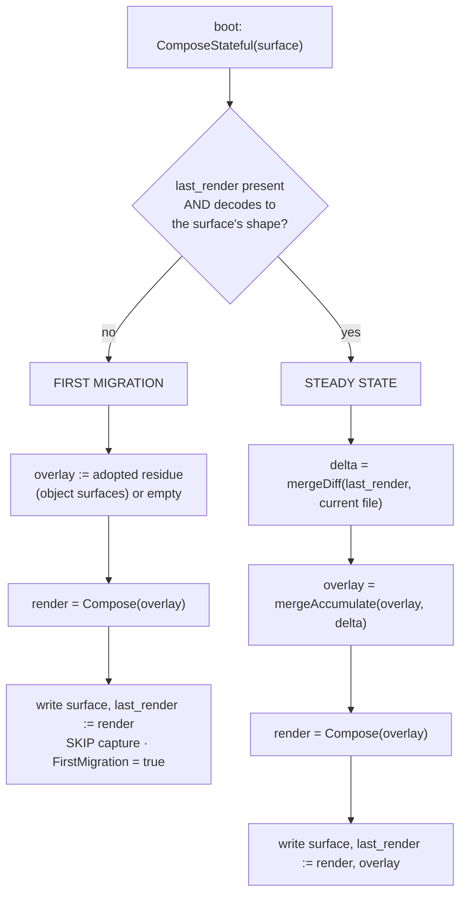

# First migration and the stateful boot render

**Status:** CURRENT as of 2026-09-11, verified against `3c25d099`.

Every boot, yolo re-renders each composed surface from its layers. But most surfaces already
have a file on disk: written by an older yolo, or by the agent itself, or by a person. **The
stateful render is the state machine that decides what that existing file means** — and it runs
whenever a surface has no trusted baseline, which is not only a historical migration: a fresh
workspace, a deleted sidecar, and a newly-added surface all take the same path.

Two paths, chosen by one signal — whether a trusted `last_render` sidecar exists:

- **First migration** — **adopt** the on-disk file into the overlay (object surfaces only, and
  only the narrowed residue), render, write the surface, seed the baseline from that render, and
  capture nothing this boot — there is no baseline to diff against. Stale bespoke output that no
  layer emits simply does not render, so it never comes back, while the agent's own keys survive.
- **Steady state** — diff the on-disk file against the trusted baseline, fold that delta into the
  durable overlay, render with the overlay in the fold, and rewrite both.

| Component | Lives in |
| :--- | :--- |
| The state machine, pure and file-free | `internal/agentcfg` (`ComposeStateful`, `StatefulInputs`, `StatefulOutput`) |
| The merge primitives | `internal/agentcfg` (`mergeDiff`, `mergeAccumulate`, `deepMerge`, `dropNullLeaves`) |
| The two narrowings an overlay passes through | `internal/agentcfg` (`dropComputedTables`, wholesale per declared in-full table, adoption only; `narrowOverlay`/`dropOverriddenKeys`, leaf-level, both branches) |
| The boot caller: sidecar I/O, host source, orphan retirement | `internal/entrypoint` (`renderSurfaceStateful`, `renderSurfaceStatefulSurface`, `retireOrphanSidecars`) |
| The non-stateful siblings | `internal/entrypoint` (`renderSurfaceComputed`, `renderSurfaceRMWSurface`) |
| Discarding captured edits | `internal/cli` (`configReset`, `truncateSurfaceToPureRender`) |

**Reads with:** [`pack-system.md`](pack-system.md) (the layer fold, the four surface modes, and
how a pack declares a surface — the authority for all of it),
[`composed-file-permissions.md`](composed-file-permissions.md) (which posture a surface should
have, and the Derived/Shared/State taxonomy), [`git-identity.md`](git-identity.md) (the one
surface that deliberately left this mechanism).

---

## The migration principle

> **yolo owns the bytes it generates.** When a surface renders for the first time, the existing
> on-disk file must converge to what the prism *would* generate from today's layers. It must not
> carry stale bespoke output forward, and it must not let the capture overlay mistake
> pre-existing bytes for a user-authored in-jail edit.

Four corollaries, each load-bearing below:

1. **The pre-existing file is not authoritative — the fresh render is.** Treating the file as the
   baseline is precisely what pins a stale value forever.
2. **A former default is not a managed key.** The `managed` layer is re-applied last and
   self-heals the keys yolo *asserts*. A value that used to be a *default* is emitted by no
   layer and scrubbed by no re-apply, so former defaults and host-synced values are the exposure
   `managed` does not cover.
3. **Convergence beats cataloguing.** Prefer a mechanism that needs no permanently-maintained
   list of every stale key yolo ever wrote. The seed needs no catalogue: a key present in no
   layer is absent from the render.
4. **A destructive rebuild is a real tool, but the last resort** — explicit, operator-triggered,
   and forbidden from touching anything yolo does not own.

**The class this exists for, and its worked case.** The surfaces the prism replaced were written
by **in-place editors that add and update but never remove** what they previously wrote, into a
**persistent** home. So the file on disk already carried output the current generator could not
self-heal, and the capture overlay would have mistaken it for an intentional edit and pinned it
forever. The sharpest member was the mise config: a runtime pin left by an older yolo whose base
tool list was non-empty, which no self-heal path could see and which **shadowed the baked
runtime** — a live, actively harmful bug rather than untidiness. It needed no scrub and no
catalogue of former defaults in the end: the first-migration seed renders from today's layers,
the pin is in none of them, and it simply does not come back. That is corollary 3 in one
sentence.

## Invariants

- **Never seed the baseline from the pre-existing file.** Seed from the fresh render, always. A
  baseline taken from the on-disk bytes re-introduces the whole hazard: the diff then reports the
  entire file as an in-jail edit and the overlay pins it.
- **The overlay on a first migration is the ADOPTED residue, not an empty map**, and capture is
  skipped that boot. Seeding empty is the data-loss bug the adoption rule below was written
  against; the empty seed survives only for a keyless surface, which is deliberately not adopted.
  From the second boot the ordinary loop runs against a *truthful* baseline, so only real edits
  become deltas.
- **A recoverable on-disk condition never fails the boot.** A corrupt, empty or absent sidecar,
  or an undecodable current file, self-heals by re-seeding or by skipping capture. Only a genuine
  programmer error — an unknown codec, or a `Compose` failure such as a shape mismatch —
  propagates, and boot's step wrapper downgrades even that to a warning.
- **Three writes, unconditionally, every boot:** the surface file, the `last_render` sidecar, and
  the overlay sidecar. A surface with a [list path](#list-paths-capture-per-entry) adds a fourth,
  the list-capture sidecar, and a surface without one never gets it. The state machine returns
  every value and performs no I/O itself.
- **A pure-overwrite surface must not go through the stateful path.** It would begin capturing
  in-jail edits into an overlay, silently converting an intentional overwrite into an
  edit-preserving surface.

## The two sidecars are different kinds of thing

They live side by side, and conflating them has caused real mistakes. Reason about each by its
kind, never as "the sidecars":

- **`overlay` — DURABLE STATE.** The accumulated in-jail edits, and the only record that they
  ever happened; nothing else can reconstruct it. Losing it loses every captured edit
  permanently, which is why discarding it *is* the discard operation and why it lives in the
  workspace rather than a cache dir. It is **always JSON**, because it must carry `null`
  tombstones (a captured deletion) that the TOML and lines codecs cannot express. It is
  engine-internal — the agent never sees it — so its format is yolo's choice, not the surface's.
- **`last_render` — a ONE-BOOT PENDING-EDIT BASELINE.** The exact surface-codec bytes yolo wrote
  last boot, stored in the surface's own codec so it byte-matches the file and diffs cleanly.

> [!WARNING]
> **Neither sidecar is a cache, and nothing may prune them as one.** `last_render` is derivable
> in principle, which is exactly the trap: deleting it does not cause a harmless recompute, it
> destroys the ability to tell an in-jail *edit* from yolo's own previous output, so every edit
> made since the last boot and not yet captured is silently lost. The overlay must be preserved
> and backed up like data; `last_render` must survive a single restart and is meaningless
> afterwards.

### Vocabulary

Three terms are in use and they are **not** synonyms, which is why a blanket rename would lose
information:

- **in-jail edit** — the *act*: an agent or a user writing to a composed file.
- **captured edits** — the user-facing name for the *state* that survives regeneration. This is
  the umbrella term: what `yolo config diff` shows and `yolo config reset` discards.
- **captured overlay** — the specific *layer* in the fold, between workspace and computed.

Deliberately **not** "managed": that already means keys yolo re-asserts and wins, which is the
opposite relationship. One word for both would make the fold order unreadable.

## The two paths

A `last_render` sidecar is **trusted** only when it is present *and* decodes to the surface's own
shape. Absent, empty or undecodable all mean first migration: there is nothing to diff against,
so seeding from the fresh render is the only correct move.

### Adoption: what the first migration keeps

The first-migration branch **adopts** the on-disk file rather than discarding it. For an
**object** surface the seed overlay is the *residue*: `mergeDiff(pure render, current file)`, with
null leaves dropped, then narrowed twice. What is left is the agent-owned state yolo says nothing
about.

**The two narrowings run at different granularities and neither subsumes the other.** First,
*wholesale*: a top-level key the **computed** layer holds as a non-empty object, and whose derive
**declares** it regenerates that table in full, is yolo's own previous output rather than a
captured edit, so the whole subtree drops (`dropComputedTables`, adoption only). The declaration
is the derive's `ctx.in_full(t)` sentinel, carried beside the layer as
`agentcfg.Inputs.ComputedInFull`; an MCP table, a provider catalog and `mise`'s `[tools]` are
declared, while claude's `env` is not — yolo asserts one variable there and owns none of the
rest, so a table not declared in full is left to the second pass and keeps the agent's own leaves
([`CO13`](../design/config-ownership-and-promotion.md#co13--how-a-derive-says-it-fills-a-computed-table-in-full--decided)).
An empty computed table drops nothing, declared or not. Second, *leaf-level*:
the shared pass both branches run strips every individual key a higher-ranking layer — computed,
then managed — would override anyway (`narrowOverlay`, built on `dropOverriddenKeys`). Managed
keys drop there because `managed` is re-asserted *after* the fold, so an adopted managed key could
never affect the output — it would sit in the sidecar as permanent noise and make
`yolo config diff` report a phantom edit the user cannot act on.

> [!WARNING]
> **Neither narrowing may become a blanket drop of every top-level key the pure render holds as
> an object.** That is what an earlier version did, and it took the `managed` `permissions` object
> with it — so `permissions.ask`, a leaf `managed` does not hold and `Enforce` merges around, was
> silently lost on every adopting boot while the very next boot captured it happily. Equally, the
> leaf pass alone cannot replace the wholesale one: `dropOverriddenKeys` keeps every key an
> object-valued owner lacks, and a stale entry under a computed table is exactly such a key — so
> the leaf pass on its own resurrects an MCP server that was dropped from config.

> [!WARNING]
> **Do not restore the empty-overlay seed for object surfaces.** Seeding empty destroyed every
> agent-owned key in the file. The sharp case is a credential surface rendered from defaults with
> no host layer: one boot with an absent or corrupt baseline — a fresh workspace, a deleted
> sidecar, an interrupted migration — collapsed a file holding OAuth tokens and logged-in users
> down to the defaults and logged the user out. Steady state recovered, which is why it went
> unnoticed for so long.

> [!WARNING]
> **Adoption is safe only because `yolo config reset` also truncates the surface to its pure
> render.** Reset removes both sidecars, and "no baseline" is indistinguishable from "the user
> asked to discard" — so without the truncation, reset → no baseline → adopt would resurrect
> exactly the edits the user just discarded, making reset a silent no-op. The two halves are one
> change; neither may be removed alone.

**Keyless surfaces are deliberately not adopted.** A raw or lines surface has one "key" — the
whole file — so adoption would mean "the existing file wins outright", which defeats the host
layer entirely: a host-mirrored file would freeze at whatever stale content was on disk and never
pick up host-side changes again. There is also no partial residue to take. Object surfaces are
where the data-loss risk lives, and they get exact key-level adoption instead.

### Defensive handling of inconsistent sidecars

A partially-migrated or hand-mangled home can leave the pair inconsistent, and each case has one
correct reading:

| On disk | Treated as |
| :--- | :--- |
| `last_render` absent (or present and undecodable), overlay present | First migration — the dangling overlay is **not** trusted; it may be a leftover from an aborted migration |
| Both present and decodable | Steady state |
| `last_render` present, overlay absent | Steady state with an empty overlay — no capture is lost; last boot simply had no edits |

### The accumulation step preserves tombstones

The capture loop folds this boot's delta into the durable overlay with a **tombstone-preserving**
merge: a `null` is stored even when the key is absent from the accumulator. Plain RFC-7386
`deepMerge` treats a tombstone applied to an absent key as a no-op delete, which silently drops
the deletion — so a captured *removal* would survive one boot and then vanish. Recursion happens
only when both sides are objects; otherwise the newer value replaces.

For a **keyless** surface the same loop holds with a degenerate diff: the file has one key
(itself), so "did it change" is value inequality and the captured delta is the whole edited
value. Accumulation is replacement — the newest edit is the overlay. Nothing else about capture
differs, which is why raw files get edit-survives-regeneration for free rather than needing a
parallel mechanism.

### And therefore a literal `null` travels beside the overlay, not in it

A tombstone costs something, and this is the bill. Inside a merge patch `null` has exactly one
meaning — *delete this key* — so a config file the user wrote holding `"apiKeyHelper": null` has
**no representation in the layer stack at all**: put it in the overlay and the fold deletes the
key instead of producing it. `mergeDiff`'s docstring has said so since it was written. The cost
went unnoticed until a whole-file composing notch existed to pay it: under
[`host_management: own`](../design/config-ownership-and-promotion.md#11-success-criteria) the
composed file simply lacked the key, and no loss field named the deletion.

The fix does not give `null` a second meaning anywhere. `ComposeStateful` reads the marked
keypaths off the **decoded current file** — where a null is unambiguous, because a decoded file
holds no tombstones — and hands them to `Compose` as `agentcfg.Inputs.LiteralNulls`, a keypath
skeleton that never merges. After the fold and after the managed enforce, each marked path is
set to a literal null **wherever no layer that OUTRANKS THE CAPTURE OVERLAY mentioned it**.

A literal null folds at **the capture overlay's own precedence**, because that is what it is — a
captured value, carried beside the stack only because no merge patch can spell one. So the layers
above the overlay beat it and the layers below it lose:

| `defaults` · `host` · `workspace` · `config-overlay:<pack>` | `overlay` | `computed` · `managed` |
| :--- | :---: | :--- |
| lose to the file's null | where the null folds | beat the file's null |

`computed` and `managed` winning is the case that matters *for them*: a `computed` tombstone
removes a key deliberately, and reinstating it would undo a decision that boot just made. The
losing half is the case that matters for the user, and it shipped backwards for one day
(2026-09-12): a file holding `"theme": null` against a pack whose `defaults` says `"system"` kept
the null under `assert` — rmw fills a default only where the key is **absent**, and a null-valued
key is present — and took the default under `own`. That is a value changing across a switch that
[§11](../design/config-ownership-and-promotion.md#11-success-criteria) says keeps every value.
The control settles the direction: the same file holding `"theme": "dark"` keeps `"dark"`, because
the capture overlay outranks `defaults`. A null has to fold where a non-null does, or the two
disagree for no reason except which of them the sidecar happens to be able to hold.

> [!IMPORTANT]
> **The capture overlay is the one layer that does not count as evidence, and the reason is
> circularity.** The overlay is a record *of* the file, so it cannot outrank the file — and the
> direction it fails in loses the key. A user ADDING `"k": null` to a rendered file produces the
> same delta as a user DELETING `k`, so the capture stores a tombstone, and on the next boot that
> tombstone deletes the key it was meant to record. Excluding the overlay costs nothing the
> "composed config already has a value here" check does not cover, and it self-heals a sidecar an
> older yolo already polluted. The stale tombstone stays in the sidecar: inert, and sweeping
> durable state is a separate decision.

Three properties follow, and the first is what keeps the sidecars honest:

- **The overlay is untouched and stays a pure merge patch.** Adoption goes on stripping every
  null out of its residue, which is still right — a residue is a patch.
- **It is self-sustaining rather than durable.** The render writes the null back, so the next
  boot reads the same mark off the same file; both the adoption and the steady-state branch read
  it, or the second render would drop what the first restored. Delete the key and the mark goes
  with it; `yolo config reset` truncates to the pure render and takes it too.
- **A literal null cannot be promoted.** A pack's `config-overlay` is a merge patch as well, so
  no destination could hold one — `yolo config promote` refuses it as not in the capture, which
  is the right answer rather than a gap.

### List paths capture per entry

A **list path** *(this doc's term, from [`pack-system.md`](pack-system.md#adding-entries-to-an-array-config-list))*
is an array path a `config-list` contribution targets. The merge patch replaces arrays whole, so
capturing a list path through it would store every pack-contributed entry the first time an agent
appended one of its own, and that capture would outrank every contribution from then on. So at a
list path the state machine records entries instead of the array, in a **list-capture sidecar**
beside the overlay: per path, the entries an in-jail edit added and the ones it removed. `Compose`
applies that record right after the capture overlay: removes first, then adds not already present.
The capture overlay never records a list path. Everything here is `listCapture` in
[`staterender.go`](../../internal/agentcfg/staterender.go).

- **The set of list paths is sticky.** It is the live contributions' paths plus every path the
  sidecar already names, and every render writes an entry for every one of them. That is how a
  capture with no layers learns them: `yolo config capture` and capture-on-terminate compose with
  no pack contributions at all, so the sidecar is their only source.
- **Steady state** compares `last_render` at each list path with the current file.
  - An array there records adds and removes by whole-value presence. They accumulate
    symmetrically, so an entry is never in both lists, and a record is never retired for
    converging.
  - What presence cannot express is not kept: a reorder of the surviving entries, or a
    de-duplication, is put back to the rendered order, and the boot says so.
  - Deleting the key, or replacing it with a non-array, is still a whole-value capture through
    the merge patch. It masks every contribution at that path, and the boot names
    `yolo config reset`. The path's record is kept, inert while the capture stands.
  - An array that reappears later ends that capture, including one captured at an ancestor (a
    deleted or replaced parent object). The new array is measured against the list the capture
    was hiding (the assembled list with the record applied), not against an empty list. So the
    next boot renders what the user wrote, and a pack's entries never become the user's adds.
  - An array emptied in-jail is per entry: every entry present then stays removed, and an entry
    first contributed later still appears.
- **Adoption** (a first migration) keeps only the entries the file holds beyond **B**, the fold
  below capture with no list contributions (`defaults < host < workspace < config-overlay`). So
  an entry already in the user's file that a pack also contributes stays the user's. When an
  `rmw` insert record sits beside the surface (the host keeps one under both contracts), an
  entry it says yolo inserted is not adopted, and an entry it says the user declined is adopted
  as a removal.
- **A legacy whole-array capture is converted**, on the first steady-state boot in which the path
  is a list path. With O the overlay's array: add = O − B, remove = B − O, and O is deleted from
  the overlay. The boot says it converted. Three things are lost: O's order relative to B, any
  duplicates within O, and O's pin against lower layers. From then on a lower-layer change at the
  path, such as a host-file edit, shows through. The cost of remove = B − O: every entry B holds
  that O lacks becomes a permanent user removal, including an entry a lower layer gained while
  the whole array pinned the list. Those stay hidden until `yolo config reset`, even if a host
  file adds them again; only changes after the conversion show through. A legacy tombstone or
  non-array at the path is not converted and stays a whole-value capture.
- **A record goes dead** when `computed` or `managed` holds its path, or an ancestor, as a
  non-object. It is emptied, and the path stays a list path.
- **A corrupt or unreadable sidecar reads as absent.** That costs per-entry history, never a
  file. A path no live contribution still names then drops out of the set and is captured
  whole again.

> [!WARNING]
> **Two orders put contributed entries into the user's record, and both are accepted.** First,
> adoption after a lost `last_render` measures against B, which excludes contributions, so an
> entry a pack contributed before becomes a user add and survives that pack being dropped. An
> `rmw` insert record beside the surface prevents this; the host keeps one, a jail does not.
> Second, an array frozen by an older yolo's capture-on-terminate is converted the same way on
> the next boot. The alternative, trusting the file's entries as yolo's, would delete the user's
> own matching entries on a drop.

`rmw` has no `last_render`, so its equivalent is yolo's record of the entries it inserted, and
[`pack-system.md`](pack-system.md#adding-entries-to-an-array-config-list) is the authority for
it. An `rmw` surface has no earlier list state to migrate. Its record starts empty, and entries
already in the file are never recorded, so a pack drop never removes them.

## What the boot caller owns

The state machine is pure. Everything environment-dependent stays in the boot path:

- **Resolving the host source** for a surface — in-jail that is a `:ro` mount under `/ctx`, gated
  by the reads-host allowlist, which cannot live in a codec-agnostic manifest.
- **The sidecar file layout**, under the workspace's gitignored `.yolo/prism/`. Paths key on the
  surface's agent and name, so a user-declared surface (a `host_files` destination) is
  collision-free with every builtin.
- **The one-time orphan retirement**, gated on the first-migration signal: a surface declares the
  pre-prism sidecar and snapshot filenames it obsoletes, and the migrating boot removes exactly
  those names beside the surface. Scoped to files yolo wrote, never a directory sweep, and
  failures are ignored — an unread file is untidy rather than wrong, and failing a boot over it
  would be worse.

### The stateless siblings

Not every surface is stateful, and the distinction is the point. A surface whose content is
recomputed from live config every boot — an MCP or LSP table — renders through the **computed**
path: compose, write the surface file, and **no `last_render`, no overlay, no host source**. A
surface holding live agent state renders through the **rmw** path: read the existing file, merge
yolo's keys in, write it back, no capture sidecar at all. [`pack-system.md`](pack-system.md) is the authority for
the mode set and for which mode a surface declares.

## Destructive rebuild: what it must never clear

The seed is automatic, per-surface and clean, and it is the default. A whole-config
clear-and-rebuild is the manual escape hatch for a home so mangled that per-surface convergence
is not enough — explicit, operator-triggered, never reachable from an ordinary boot, and printing
what it will delete before it acts. `yolo config reset` is the narrow, shipped form of it: two
sidecars (three, where there is a list capture) plus a truncation, per surface. The truncation
renders with no pack contributions, so the adoption that follows records none of their entries as
the user's.

**The hard invariant is what such an operation may not touch:**

- **Workspace files.** Anything under the workspace is the operating agent's and mirrors the host.
  yolo never writes it and a rebuild never touches it.
- **Host mirrors and host source config.** The `:ro`-staged host files. A jail-scope clear never
  reaches back to the host.
- **Agent project and session state** — conversation history, logs, caches, credentials and OAuth
  tokens. These are runtime state, not composed config; clearing them would destroy the agent's
  memory and log the user out.
- **The user's own config inputs** — `config.jsonc` is an *input* to the pipeline, not an
  output. Clearing it would delete the user's own settings.

## What this does not license

- **Not a catalogue of stale keys.** If a value is emitted by no layer, the seed already removes
  it; a maintained list of former defaults is the mechanism this design exists to avoid.
- **Not a git-config codec.** Git identity was the one surface this migration deferred, and it
  did **not** become a prism surface — it is host-composed and `:ro`-mounted. See
  [`git-identity.md`](git-identity.md) before reaching for a keyed-INI surface.
- **Not a licence to compose a credential surface.** A file holding tokens or session state may
  have keys *injected*; it must never be rendered from layers, because a first-migration render
  composes from defaults alone.
- **Not a reason to delete a sidecar to "force a refresh".** See the warning above: one of them
  is durable state and the other is a one-boot baseline whose loss is silent.

## Why it's this way

| Ruling | Why it holds |
| :--- | :--- |
| **First migration keys on the ABSENCE of a trusted `last_render`** | It is the one signal available at boot that does not require trusting the file being migrated, and it makes every "no baseline" cause — fresh workspace, deleted sidecar, new surface — take the one correct path. |
| **The first-migration seed ADOPTS the on-disk residue for object surfaces** | Discarding it was a silent data-loss bug on any surface holding agent-owned keys, and steady state recovering afterwards is what kept it hidden. Inverts this design's original "drop any un-captured pre-migration edit" cost, which was neither correct nor unavoidable. |
| **Keyless surfaces are not adopted** | "The existing file wins outright" defeats the host layer permanently, and there is no partial residue to take. |
| **`yolo config reset` truncates the surface as well as removing both sidecars** | Adoption makes "no baseline" mean "adopt what is there", so a reset that only deleted sidecars would re-capture the discarded edits. It also makes reset visible immediately rather than after the next boot. |
| **Accumulation preserves `null` tombstones** | RFC-7386 `deepMerge` drops a tombstone for an absent key, so a captured deletion would not survive two boots. |
| **A literal `null` VALUE travels outside the layer stack, at the capture overlay's precedence** | Having spent `null` on the tombstone, a patch has no token left for the value — so the file's own nulls are read off the decoded file and re-asserted after the fold, wherever no layer ABOVE the overlay spoke. Outside the stack is a statement about the CHANNEL, never about precedence: a captured null outranks `defaults`/`host`/`workspace`/`config-overlay` exactly as a captured non-null value does. |
| **A pure-overwrite sibling renders through the stateless path** | Sending it through the stateful path would begin capturing edits into an overlay and silently turn an intentional overwrite into an edit-preserving surface. |
| **Orphan retirement is declared per surface, not held as a central table** | The pack that obsoleted the file is the thing that knows its name, and the retirement then rides the same first-migration signal that makes it a one-time act. |

## Current values

Verified at `3c25d099`. The prose above explains what each of these is for; this table is the
only place the values themselves are stated.

| Value | Setting | Defined in |
| :--- | :--- | :--- |
| Sidecar directory (jail and preview targets) | `<workspace>/.yolo/prism/` | `render.Target.SidecarDir` |
| Baseline sidecar | `<agent>-<name>.last_render`, in the surface's own codec | `entrypoint.prismLastRenderPath` |
| Overlay sidecar | `<agent>-<name>.overlay.json`, always JSON | `entrypoint.prismOverlayPath` |
| List-capture sidecar (only for a surface with a list path) | `<agent>-<name>.list-capture.json`, JSON: `{"<pointer>": {"add": [...], "remove": [...]}}` | `render.Target.ListCapturePath` |
| Selection record (a separate mechanism) | `<agent>-<name>.selection.json` | `entrypoint.prismSelectionRecordPath` |
| Layer fold order | see [`pack-system.md`](pack-system.md)'s Current values | `internal/agentcfg` |
| Surface modes | `stateful` (default), `computed`, `rmw`, `unrendered` | `internal/agentcfg/manifest` |
| Codec kinds the machine branches on | object vs keyless | `internal/agentcfg/codec` (`KindObject`) |
| Orphan retirement declaration | `retireOnFirstRender` on a `config` contribution | `internal/packdecl`, applied by `entrypoint.retireOrphanSidecars` |
| Discard command | `yolo config reset <agent[/surface]>` | `internal/cli/configdiff.go` (`configReset`) |
