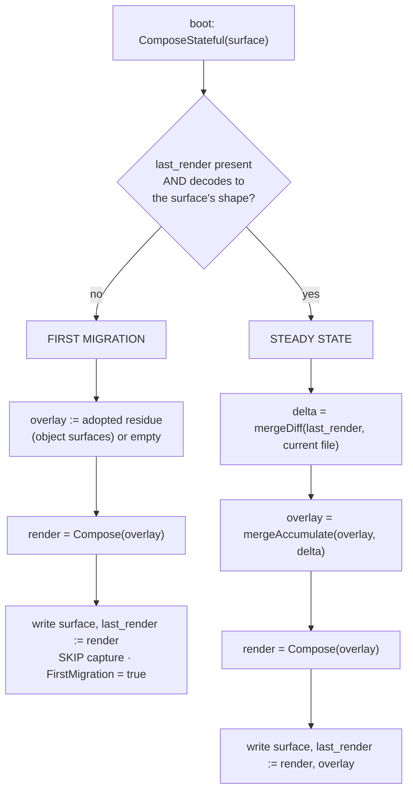

# First migration and the stateful boot render

**Status:** CURRENT as of 2026-09-09, verified against `38873c0d`.

Every boot, yolo re-renders each composed surface from its layers. But most surfaces already
have a file on disk: written by an older yolo, or by the agent itself, or by a person. **The
stateful render is the state machine that decides what that existing file means** — and it runs
whenever a surface has no trusted baseline, which is not only a historical migration: a fresh
workspace, a deleted sidecar, and a newly-added surface all take the same path.

Two paths, chosen by one signal — whether a trusted `last_render` sidecar exists:

- **First migration** — render with an **empty** overlay, write the surface, seed the baseline
  from that render, and **skip capture** for this boot. Stale bespoke output that no layer emits
  simply does not render, so it never comes back.
- **Steady state** — diff the on-disk file against the trusted baseline, fold that delta into the
  durable overlay, render with the overlay in the fold, and rewrite both.

| Component | Lives in |
| :--- | :--- |
| The state machine, pure and file-free | `internal/agentcfg` (`ComposeStateful`, `StatefulInputs`, `StatefulOutput`) |
| The merge primitives | `internal/agentcfg` (`mergeDiff`, `mergeAccumulate`, `deepMerge`, `dropNullLeaves`, `dropYoloOwnedSubtrees`) |
| The boot caller: sidecar I/O, host source, transforms, orphan retirement | `internal/entrypoint` (`renderSurfaceStateful`, `renderSurfaceStatefulSurface`, `retireOrphanSidecars`) |
| The non-stateful siblings | `internal/entrypoint` (`renderSurfaceComputed`, `renderSurfaceRMWSurface`) |
| Discarding captured edits | `internal/cli` (`configReset`, `truncateSurfaceToPureRender`) |

**Reads with:** [`pack-system.md`](pack-system.md) (the layer fold, the four surface modes, and
how a pack declares a surface — the authority for all of it),
[`composed-file-permissions.md`](composed-file-permissions.md) (which posture a surface should
have, and the Derived/Shared/State taxonomy), [`git-identity.md`](git-identity.md) (the one
surface that deliberately left this mechanism).

---

## The migration principle

> **yolo owns the bytes it generates.** When a surface renders for the first time, the existing
> on-disk file must converge to what the prism *would* generate from today's layers. It must not
> carry stale bespoke output forward, and it must not let the capture overlay mistake
> pre-existing bytes for a user-authored in-jail edit.

Four corollaries, each load-bearing below:

1. **The pre-existing file is not authoritative — the fresh render is.** Treating the file as the
   baseline is precisely what pins a stale value forever.
2. **A former default is not a managed key.** The `managed` layer is re-applied last and
   self-heals the keys yolo *asserts*. A value that used to be a *default* is emitted by no
   layer and scrubbed by no re-apply, so former defaults and host-synced values are the exposure
   `managed` does not cover.
3. **Convergence beats cataloguing.** Prefer a mechanism that needs no permanently-maintained
   list of every stale key yolo ever wrote. The seed needs no catalogue: a key present in no
   layer is absent from the render.
4. **A destructive rebuild is a real tool, but the last resort** — explicit, operator-triggered,
   and forbidden from touching anything yolo does not own.

**The class this exists for, and its worked case.** The surfaces the prism replaced were written
by **in-place editors that add and update but never remove** what they previously wrote, into a
**persistent** home. So the file on disk already carried output the current generator could not
self-heal, and the capture overlay would have mistaken it for an intentional edit and pinned it
forever. The sharpest member was the mise config: a runtime pin left by an older yolo whose base
tool list was non-empty, which no self-heal path could see and which **shadowed the baked
runtime** — a live, actively harmful bug rather than untidiness. It needed no scrub and no
catalogue of former defaults in the end: the first-migration seed renders from today's layers,
the pin is in none of them, and it simply does not come back. That is corollary 3 in one
sentence.

## Invariants

- **Never seed the baseline from the pre-existing file.** Seed from the fresh render, always. A
  baseline taken from the on-disk bytes re-introduces the whole hazard: the diff then reports the
  entire file as an in-jail edit and the overlay pins it.
- **The overlay begins genuinely empty on a first migration**, and capture is skipped that boot.
  From the second boot the ordinary loop runs against a *truthful* baseline, so only real edits
  become deltas.
- **A recoverable on-disk condition never fails the boot.** A corrupt, empty or absent sidecar,
  or an undecodable current file, self-heals by re-seeding or by skipping capture. Only a genuine
  programmer error — an unknown codec, a Lua failure — propagates, and boot's step wrapper
  downgrades even that to a warning.
- **Three writes, unconditionally, every boot:** the surface file, the `last_render` sidecar, and
  the overlay sidecar. The state machine returns all three values and performs no I/O itself.
- **A pure-overwrite surface must not go through the stateful path.** It would begin capturing
  in-jail edits into an overlay, silently converting an intentional overwrite into an
  edit-preserving surface.

## The two sidecars are different kinds of thing

They live side by side, and conflating them has caused real mistakes. Reason about each by its
kind, never as "the sidecars":

- **`overlay` — DURABLE STATE.** The accumulated in-jail edits, and the only record that they
  ever happened; nothing else can reconstruct it. Losing it loses every captured edit
  permanently, which is why discarding it *is* the discard operation and why it lives in the
  workspace rather than a cache dir. It is **always JSON**, because it must carry `null`
  tombstones (a captured deletion) that the TOML and lines codecs cannot express. It is
  engine-internal — the agent never sees it — so its format is yolo's choice, not the surface's.
- **`last_render` — a ONE-BOOT PENDING-EDIT BASELINE.** The exact surface-codec bytes yolo wrote
  last boot, stored in the surface's own codec so it byte-matches the file and diffs cleanly.

> [!WARNING]
> **Neither sidecar is a cache, and nothing may prune them as one.** `last_render` is derivable
> in principle, which is exactly the trap: deleting it does not cause a harmless recompute, it
> destroys the ability to tell an in-jail *edit* from yolo's own previous output, so every edit
> made since the last boot and not yet captured is silently lost. The overlay must be preserved
> and backed up like data; `last_render` must survive a single restart and is meaningless
> afterwards.

### Vocabulary

Three terms are in use and they are **not** synonyms, which is why a blanket rename would lose
information:

- **in-jail edit** — the *act*: an agent or a user writing to a composed file.
- **captured edits** — the user-facing name for the *state* that survives regeneration. This is
  the umbrella term: what `yolo config diff` shows and `yolo config reset` discards.
- **captured overlay** — the specific *layer* in the fold, between workspace and computed.

Deliberately **not** "managed": that already means keys yolo re-asserts and wins, which is the
opposite relationship. One word for both would make the fold order unreadable.

## The two paths

A `last_render` sidecar is **trusted** only when it is present *and* decodes to the surface's own
shape. Absent, empty or undecodable all mean first migration: there is nothing to diff against,
so seeding from the fresh render is the only correct move.

### Adoption: what the first migration keeps

The first-migration branch **adopts** the on-disk file rather than discarding it. For an
**object** surface the seed overlay is the *residue*: `mergeDiff(pure render, current file)`, with
null leaves dropped, subtrees yolo itself would produce dropped, and every key the surface
`managed` layer asserts dropped. What is left is the agent-owned state yolo says nothing about.

Each subtraction earns its place. Yolo-owned subtrees drop because yolo's own layers must win the
keys yolo asserts. Managed keys drop because `managed` is re-asserted *after* the fold, so an
adopted managed key could never affect the output — it would sit in the sidecar as permanent
noise and make `yolo config diff` report a phantom edit the user cannot act on.

> [!WARNING]
> **Do not restore the empty-overlay seed for object surfaces.** Seeding empty destroyed every
> agent-owned key in the file. The sharp case is a credential surface rendered from defaults with
> no host layer: one boot with an absent or corrupt baseline — a fresh workspace, a deleted
> sidecar, an interrupted migration — collapsed a file holding OAuth tokens and logged-in users
> down to the defaults and logged the user out. Steady state recovered, which is why it went
> unnoticed for so long.

> [!WARNING]
> **Adoption is safe only because `yolo config reset` also truncates the surface to its pure
> render.** Reset removes both sidecars, and "no baseline" is indistinguishable from "the user
> asked to discard" — so without the truncation, reset → no baseline → adopt would resurrect
> exactly the edits the user just discarded, making reset a silent no-op. The two halves are one
> change; neither may be removed alone.

**Keyless surfaces are deliberately not adopted.** A raw or lines surface has one "key" — the
whole file — so adoption would mean "the existing file wins outright", which defeats the host
layer entirely: a host-mirrored file would freeze at whatever stale content was on disk and never
pick up host-side changes again. There is also no partial residue to take. Object surfaces are
where the data-loss risk lives, and they get exact key-level adoption instead.

### Defensive handling of inconsistent sidecars

A partially-migrated or hand-mangled home can leave the pair inconsistent, and each case has one
correct reading:

| On disk | Treated as |
| :--- | :--- |
| `last_render` absent (or present and undecodable), overlay present | First migration — the dangling overlay is **not** trusted; it may be a leftover from an aborted migration |
| Both present and decodable | Steady state |
| `last_render` present, overlay absent | Steady state with an empty overlay — no capture is lost; last boot simply had no edits |

### The accumulation step preserves tombstones

The capture loop folds this boot's delta into the durable overlay with a **tombstone-preserving**
merge: a `null` is stored even when the key is absent from the accumulator. Plain RFC-7386
`deepMerge` treats a tombstone applied to an absent key as a no-op delete, which silently drops
the deletion — so a captured *removal* would survive one boot and then vanish. Recursion happens
only when both sides are objects; otherwise the newer value replaces.

For a **keyless** surface the same loop holds with a degenerate diff: the file has one key
(itself), so "did it change" is value inequality and the captured delta is the whole edited
value. Accumulation is replacement — the newest edit is the overlay. Nothing else about capture
differs, which is why raw files get edit-survives-regeneration for free rather than needing a
parallel mechanism.

## What the boot caller owns

The state machine is pure. Everything environment-dependent stays in the boot path:

- **Resolving the host source** for a surface — in-jail that is a `:ro` mount under `/ctx`, gated
  by the reads-host allowlist, which cannot live in a codec-agnostic manifest.
- **The sidecar file layout**, under the workspace's gitignored `.yolo/prism/`. Paths key on the
  surface's agent and name, so a user-declared surface (a `host_files` destination) is
  collision-free with every builtin.
- **Loading the Lua transform** (user, then workspace).
- **The one-time orphan retirement**, gated on the first-migration signal: a surface declares the
  pre-prism sidecar and snapshot filenames it obsoletes, and the migrating boot removes exactly
  those names beside the surface. Scoped to files yolo wrote, never a directory sweep, and
  failures are ignored — an unread file is untidy rather than wrong, and failing a boot over it
  would be worse.

### The stateless siblings

Not every surface is stateful, and the distinction is the point. A surface whose content is
recomputed from live config every boot — an MCP or LSP table — renders through the **computed**
path: compose, write the surface file, and **no `last_render`, no overlay, no host source**. A
surface holding live agent state renders through the **rmw** path: read the existing file, merge
yolo's keys in, write it back, no capture sidecar at all. [`pack-system.md`](pack-system.md) is the authority for
the mode set and for which mode a surface declares.

## Destructive rebuild: what it must never clear

The seed is automatic, per-surface and clean, and it is the default. A whole-config
clear-and-rebuild is the manual escape hatch for a home so mangled that per-surface convergence
is not enough — explicit, operator-triggered, never reachable from an ordinary boot, and printing
what it will delete before it acts. `yolo config reset` is the narrow, shipped form of it: two
sidecars plus a truncation, per surface.

**The hard invariant is what such an operation may not touch:**

- **Workspace files.** Anything under the workspace is the operating agent's and mirrors the host.
  yolo never writes it and a rebuild never touches it.
- **Host mirrors and host source config.** The `:ro`-staged host files. A jail-scope clear never
  reaches back to the host.
- **Agent project and session state** — conversation history, logs, caches, credentials and OAuth
  tokens. These are runtime state, not composed config; clearing them would destroy the agent's
  memory and log the user out.
- **The user's own config inputs** — `config.jsonc` and `config.lua` are *inputs* to the
  pipeline, not outputs. Clearing them would delete the user's own transforms and settings.

## What this does not license

- **Not a catalogue of stale keys.** If a value is emitted by no layer, the seed already removes
  it; a maintained list of former defaults is the mechanism this design exists to avoid.
- **Not a git-config codec.** Git identity was the one surface this migration deferred, and it
  did **not** become a prism surface — it is host-composed and `:ro`-mounted. See
  [`git-identity.md`](git-identity.md) before reaching for a keyed-INI surface.
- **Not a licence to compose a credential surface.** A file holding tokens or session state may
  have keys *injected*; it must never be rendered from layers, because a first-migration render
  composes from defaults alone.
- **Not a reason to delete a sidecar to "force a refresh".** See the warning above: one of them
  is durable state and the other is a one-boot baseline whose loss is silent.

## Why it's this way

| Ruling | Why it holds |
| :--- | :--- |
| **First migration keys on the ABSENCE of a trusted `last_render`** | It is the one signal available at boot that does not require trusting the file being migrated, and it makes every "no baseline" cause — fresh workspace, deleted sidecar, new surface — take the one correct path. |
| **The first-migration seed ADOPTS the on-disk residue for object surfaces** | Discarding it was a silent data-loss bug on any surface holding agent-owned keys, and steady state recovering afterwards is what kept it hidden. Inverts this design's original "drop any un-captured pre-migration edit" cost, which was neither correct nor unavoidable. |
| **Keyless surfaces are not adopted** | "The existing file wins outright" defeats the host layer permanently, and there is no partial residue to take. |
| **`yolo config reset` truncates the surface as well as removing both sidecars** | Adoption makes "no baseline" mean "adopt what is there", so a reset that only deleted sidecars would re-capture the discarded edits. It also makes reset visible immediately rather than after the next boot. |
| **Accumulation preserves `null` tombstones** | RFC-7386 `deepMerge` drops a tombstone for an absent key, so a captured deletion would not survive two boots. |
| **A pure-overwrite sibling renders through the stateless path** | Sending it through the stateful path would begin capturing edits into an overlay and silently turn an intentional overwrite into an edit-preserving surface. |
| **Orphan retirement is declared per surface, not held as a central table** | The pack that obsoleted the file is the thing that knows its name, and the retirement then rides the same first-migration signal that makes it a one-time act. |

## Current values

Verified at `38873c0d`. The prose above explains what each of these is for; this table is the
only place the values themselves are stated.

| Value | Setting | Defined in |
| :--- | :--- | :--- |
| Sidecar directory (jail and preview targets) | `<workspace>/.yolo/prism/` | `render.Target.SidecarDir` |
| Baseline sidecar | `<agent>-<name>.last_render`, in the surface's own codec | `entrypoint.prismLastRenderPath` |
| Overlay sidecar | `<agent>-<name>.overlay.json`, always JSON | `entrypoint.prismOverlayPath` |
| Selection record (a separate mechanism) | `<agent>-<name>.selection.json` | `entrypoint.prismSelectionRecordPath` |
| Layer fold order | see [`pack-system.md`](pack-system.md)'s Current values | `internal/agentcfg` |
| Surface modes | `stateful` (default), `computed`, `rmw`, `unrendered` | `internal/agentcfg/manifest` |
| Codec kinds the machine branches on | object vs keyless | `internal/agentcfg/codec` (`KindObject`) |
| Orphan retirement declaration | `retireOnFirstRender` on a `config` contribution | `internal/packdecl`, applied by `entrypoint.retireOrphanSidecars` |
| Discard command | `yolo config reset <agent> [--surface s]` | `internal/cli/configdiff.go` (`configReset`) |
