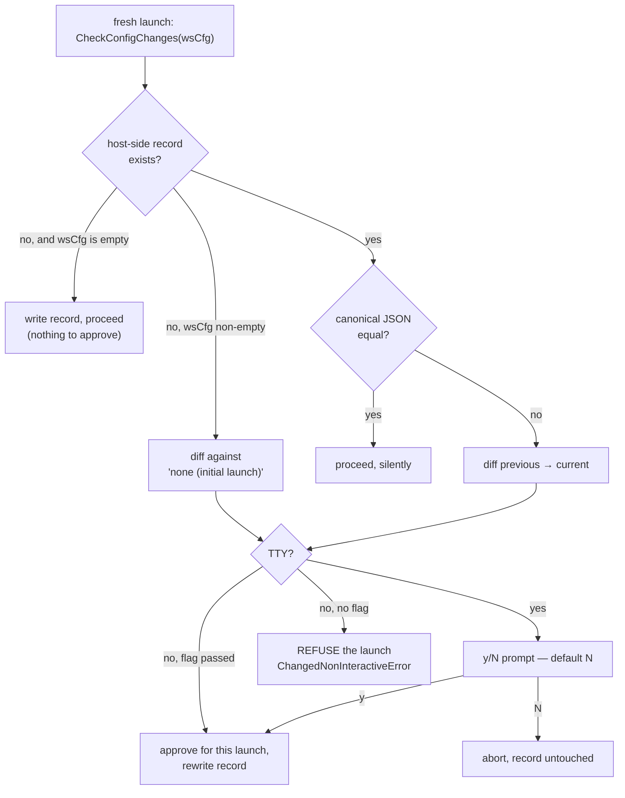

# Config-change approval — the gate on agent-editable config

**Status:** CURRENT as of 2026-09-09, verified against `38873c0d`.

An agent inside a jail can edit `yolo-jail.jsonc` — `/workspace` is bind-mounted read-write,
and asking for a package is ordinary work. **A human must approve that edit before a jail
launches with it.** The mechanism is a snapshot and a diff: at every fresh launch yolo
compares the workspace config against the last-approved copy, shows a unified diff, and asks.

Two properties make the promise hold rather than merely read well. The record of what was
approved lives **host-side**, where nothing in the jail can rewrite it. And a launch with
**no terminal to ask on refuses** rather than accepting silently.

The gate is scoped to the **workspace** config. Editing `~/.config/yolo-jail/config.jsonc`
takes host user authority, which is at least as much authority as the gate protects, so it
is trusted on disk and prompts nowhere — see [Why user config never prompts](#why-user-config-never-prompts).

| Component | Lives in |
| :--- | :--- |
| The comparison, the diff, the refusal, the flag spelling | `internal/config` (`CheckConfigChanges`, `ApprovalSnapshotPath`, `ChangedNonInteractiveError`, `AcceptConfigChangesFlag`, `SnapshotJSON`) |
| The two launch call sites, and rendering the refusal | `internal/cli/run` (`Options.checkConfigChanges`, `printChangeRefusal`, `changePrompter`) |
| Host-side pre-approval | `internal/cli/check` (`Options.AcceptConfigChanges`) |
| The delivered merged config, and the frozen boot baseline | `internal/config` (`assembled.go`), `internal/cli/run` (`writeLaunchConfigArtifacts`) |
| Where the approval record lives | `internal/paths` (`ApprovalsDir`), keyed by `runtime.FromWorkspace` |

**Reads with:** [`gate-placement-principle.md`](gate-placement-principle.md)
(why a gate only earns its place where authority changes hands),
[`loophole-system.md`](loophole-system.md#why-its-this-way) ([`OQ-A13`](loophole-system.md#oq-a13)
makes this diff the disclosure for enabling a host-reaching loophole),
[`envsource-relative-paths.md`](envsource-relative-paths.md) (what a relative path in a
config file points at). For the config keys themselves, run `yolo config-ref`.

---

## Design goals

The five requirements the mechanism serves. They are numbered because sibling text and test
comments cite them by number.

1. **Agents CAN edit the config** — they need to request packages for their work.
2. **Humans MUST approve changes** — no silent config modifications.
3. **Agents MUST self-validate edits** — run `yolo check` after every config change.
4. **The flow is natural** — no special commands or flags in the ordinary path.
5. **Non-interactive use still works** — through an explicit per-launch opt-in, never
   through an implicit yes.

## Principles

1. **P1 — Put the gate where the authority changes.** Writing the host user config requires
   host user access; prompting the human to confirm an edit they made in their own home is
   theatre ([`gate-placement-principle.md`](gate-placement-principle.md) Test 1).
2. **P2 — The gate protects against the agent.** `/workspace` is bind-mounted `:rw`, so the
   workspace config is the file an in-jail agent can rewrite, and it is the file the gate
   evaluates.
3. **P3 — No prompt fatigue from global edits.** Adding a pack, a package, or a loophole at
   user scope applies to every workspace instantly, with no prompt anywhere.
4. **P4 — A fresh workspace confirms its config.** A repository cloned from the internet is
   a config nobody on this machine has approved; its first launch shows it and asks.

## Invariants

- **Host-side storage.** The approval record lives under `paths.ApprovalsDir()` and is never
  mounted into any jail. Pinned by
  `TestCheckConfigChangesSnapshotLandsOutsideTheWorkspace`, which asserts both halves — the
  new path is written and the old workspace path is not.
- **Workspace scope only.** `CheckConfigChanges` is handed `LoadWorkspaceConfig`'s result at
  both call sites, never `LoadConfig`'s. A user-config change cannot produce a diff.
- **Fail-closed without a terminal.** Unapproved workspace config plus no TTY plus no
  `--accept-config-changes` is fatal, and the snapshot is **not** rewritten — so the same
  diff is still there to approve on the next interactive launch.
- **A refused launch records nothing.** Answering `N`, or being refused non-interactively,
  leaves the record untouched.
- **The snapshot is normalized.** It stores canonical JSON (`SnapshotJSON` — 2-space indent,
  sorted keys, ASCII-escaped), so reformatting, comment edits and key reordering do not
  register as changes. That serialization is a frozen contract: one byte of drift fires a
  spurious prompt for every workspace on the machine.
- **One spelling of the flag.** `config.AcceptConfigChangesFlag` owns it, because the refusal
  message has to name it and the message is composed in that package. `internal/cli`'s parser
  reads the constant back, so the flag a user is told to pass and the flag the parser accepts
  cannot drift apart.

## How the gate decides

One function, five branches, all injected (`isTTY`, `acceptNonInteractive`, and the prompter),
so every branch is testable with no terminal:

The record's absence is the fresh-workspace signal, and an **empty** workspace config is the
one case that passes silently — there is nothing in `{}` to approve. Deleting the record can
therefore never smuggle a config past the human: with a declared config, no record means the
whole thing is shown as a diff against nothing.

### Where it runs, and where it deliberately does not

The check is a **fresh-launch** gate. Attaching to a running container (`podman exec`) does
not re-check, because that container was created with its config already approved — which is
why an agent must run `yolo check` itself after every config edit, and why `yolo config drift`
exists to tell it whether a restart is owed.

**Every backend gates, including `macos-user`.** The call sits inside the `macos-user` arm
rather than above the backend dispatch, because "fresh launch only" is a container-path
distinction: that backend has no attach, so every invocation is a fresh sandbox. `--dry-run`
is exempt — it renders a plan and launches nothing, and refusing a plan render would only
hide the diff a user asked to inspect.

> [!WARNING]
> A test that patches `CheckConfigChanges` and asserts what it decides proves nothing about
> whether a launch still calls it. Both call sites reach it through
> `Options.checkConfigChanges`, and both must fail if the call is deleted — replacing a call
> site with a bare `_ = o.checkConfigChanges(cfg)` once left the entire unit gate green.

## The non-interactive refusal

A launch with piped stdin and a changed config **fails**, printing the same coloured diff the
prompt would have shown plus the paths that produced it: the workspace config, the workspace
local config when it exists, and the host-side approval record.

`yolo-jail.local.jsonc` is listed for a specific reason — it merges **over** `yolo-jail.jsonc`,
so a reader who diffs only the tracked file against git and finds it clean has been sent to
the one file that cannot explain the change.

> [!IMPORTANT]
> **A flag, not an environment variable**, even though this repo's other bypasses
> (`YOLO_ALLOW_STALE_IMAGE`, `YOLO_ALLOW_UNREACHABLE_SERVICES`) are env vars. Those suppress a
> *diagnosis*; this one grants an *approval*. An env var is inherited by every child process
> and survives in a shell for the rest of a session — precisely the property a per-launch
> approval must not have.

Granting it records the new config exactly as a `y` does, so the next launch is not asked
again. A pipeline that has been silently accepting config drift starts failing instead, which
is the good direction: it finds out immediately rather than continuing to not tell anyone.

### Pre-approving from the host

`yolo check --accept-config-changes` validates and records the approved workspace baseline
without starting a container, for setup tooling and power users. It is **host-only**: run
inside a jail it warns and writes nothing, because a jail writing the record that authorizes
its own config is the defect the host-side move closed.

## Why user config never prompts

The gate used to diff the fully merged (user + workspace) config against one per-workspace
record. Every workspace's record therefore went stale the moment the host user config changed,
so adding one loophole re-prompted, with the identical diff, in every jail on the machine —
and approving it in one workspace updated only that workspace's record.

The threat model is an in-jail agent editing files in the read-write workspace mount. An agent
cannot write `~/.config/yolo-jail/config.jsonc`; only the human, or something already holding
host user authority, can. Intercepting a launch to ask "did you mean the file you just edited?"
protects against no actor — and asking it N times trains the user to press `y` without reading,
which is the exact condition under which a real workspace edit slips through.

So user config is trusted on disk and the baseline is workspace-only. A side effect worth
knowing: `yolo config drift` (in-jail) and the approval gate (host-side) now read the same
layer, so they cannot disagree about what changed.

## File locations

| File | Role |
| :--- | :--- |
| `yolo-jail.jsonc` (+ `yolo-jail.local.jsonc`) | Workspace config — agent-editable, and the only thing the gate evaluates |
| `~/.config/yolo-jail/config.jsonc` | User-level defaults — trusted on disk, never diffed |
| `paths.ApprovalsDir()/<container-name>.json` | Last-approved canonical **workspace** config. Host-side, never mounted |
| `<workspace>/.yolo/config-assembled.json` | The merged config the host assembled for this launch, delivered into the jail |
| `<workspace>/.yolo/config-boot.json` | Frozen workspace-only config the jail was built from (`yolo config drift`) |

**Why there are two workspace-side files at all.** The approval record must be somewhere the
jail cannot write; the delivery copy must be somewhere it can read. One file cannot do both.
`config-assembled.json` is the delivery copy, written unconditionally at every fresh launch,
and nothing about its integrity is load-bearing: a jail that rewrites its own assembled config
has only lied to itself about a config it can already edit at the source, in the same mount.
It exists because the user-level `include_if_found` overrides it carries are host-side files
the jail never sees, so an in-jail re-assemble would silently produce a *reduced* config.

The record is keyed by `runtime.FromWorkspace`'s deterministic container name — the same key
`paths.ContainerDir` and `paths.AgentsDir` already use for per-workspace host state, rather
than a second keying scheme. Its one real cost: a workspace copied or moved elsewhere loses
its baseline and re-prompts, which is the direction to fail in.

> [!WARNING]
> **Do not adopt `<workspace>/.yolo/config-snapshot.json`.** That is where the record lived
> before it moved host-side, and it is by definition a file the jail could have written.
> Nothing reads it — neither its content nor its presence — and `LegacyWorkspaceSnapshotPath`
> survives only so tests can assert the old path is never written again. Seeding a baseline
> from it to skip a prompt would carry the original hole across the change meant to end it.
> Note the shape of that hole: **deleting** the record has always failed safe, so what was
> missing is *integrity*, not secrecy — which is why moving the file is the whole fix, and
> signing it or mounting it `:ro` is machinery the problem does not need.

## Failure modes and edge cases

| Situation | Behavior |
| :--- | :--- |
| No workspace config at all | `{}` is recorded silently. Adding a config later diffs |
| Config deleted | A diff (previous → empty), so it prompts |
| Approval record deleted | Fails safe: empty config accepts, non-empty config prompts. The record is out of the jail's reach anyway, so only the human can delete their own baseline |
| Two agents editing one config | The human sees all changes combined in one diff |
| Snapshot write fails | The launch aborts rather than proceeding on an unwritten approval record |
| Rejected change | The file on disk is still modified; the jail does not start. `git checkout yolo-jail.jsonc` reverts it |

## What this does not license

- **Not a claim that config is a sandbox boundary.** Packages are nix packages built in the
  nix sandbox; the gate is about *disclosure and consent*, not about what a package may do.
- **Not a mid-session control.** An attached session's config is frozen until restart. The
  gate cannot make a running jail safe; it decides what the *next* one launches with.
- **Not a gate on host user config**, at any scope, for any key. A key that would be unsafe to
  read from the workspace is refused by scope validation instead — that is a different
  mechanism with its own reasoning.
- **Not an integrity mechanism for the delivered config.** `config-assembled.json` is a
  convenience copy inside the mount the jail already controls.

## Why it's this way

Rulings a future change would otherwise undo, with their original IDs — those IDs are cited
from code comments and sibling docs, and this appendix is where they resolve.

| Ruling | Why it holds |
| :--- | :--- |
| [**OQ-D1**](#oq-d1) — the approval snapshot lives host-side, out of the rw bind mount | A record the jail can rewrite is not a record. It also unblocked the loophole disclosure: [`OQ-A13`](loophole-system.md#oq-a13) had declined to count this diff as a safety property *because* of this defect. |
| [**OQ-D2**](#oq-d2) — non-interactive plus a changed config is fatal; CI opts in with an explicit flag | Auto-accept made goal 2 conditional on somebody happening to have a terminal attached, and the scripted case is exactly where nobody is watching. |
| [**OQ-D3**](#oq-d3) — the migration window closes by prompting on a fresh workspace's first launch | The alternative was to keep a one-shot silent window keyed on a marker file *inside the mount it was signalling about* — the same bit in the same mount. Superseded by [`OQ-S3`](#oq-s3), against this doc's own earlier leaning. |
| [**OQ-S1**](#oq-s1) — no approval gating for host user config | The guarded act already required more authority than the gate protects; N identical prompts per edit train the `y` reflex that lets a real workspace edit through. |
| [**OQ-S2**](#oq-s2) — host-side pre-approval via `yolo check --accept-config-changes`, disabled in-jail | Recording an approval is the one operation that must not be reachable from the side being approved. |
| [**OQ-S3**](#oq-s3) — a fresh workspace with a non-empty config must confirm it | A cloned repo's `yolo-jail.jsonc` is a config nobody on this machine has approved, and making the silent first run conditional on anything in the workspace re-creates [`OQ-D3`](#oq-d3)'s hole. The empty-config case still passes silently: there is nothing in `{}` to approve. |

## Current values

Verified at `38873c0d`. The prose above explains what each of these is for; this table is the
only place the values themselves are stated.

| Value | Setting | Defined in |
| :--- | :--- | :--- |
| Approval record | `<host state>/approvals/<container-name>.json` | `paths.ApprovalsDir`, `config.ApprovalSnapshotPath` |
| Retired record path (never read) | `<workspace>/.yolo/config-snapshot.json` | `config.LegacyWorkspaceSnapshotPath` |
| Per-launch approval flag | `--accept-config-changes` | `config.AcceptConfigChangesFlag` |
| Prompt default | `N` (anything but `y`/`yes` declines) | `internal/cli/run` (`changePrompter`) |
| Diff labels, changed config | `previous workspace config` → `current workspace config` | `config.CheckConfigChanges` |
| Diff labels, fresh workspace | `none (initial launch)` → `workspace config` | `config.CheckConfigChanges` |
| Snapshot serialization | 2-space indent, sorted keys, ASCII-escaped | `config.SnapshotJSON` → `jsonx.DumpsSnapshot` |
| Snapshot file mode | `0o644`, trailing newline | `config.writeSnapshot` |
| Delivered merged config | `<workspace>/.yolo/config-assembled.json` | `internal/config/assembled.go` |
| Frozen boot baseline | `<workspace>/.yolo/config-boot.json` | `internal/cli/run` (`writeLaunchConfigArtifacts`) |
| Drift exit codes | `0` in sync, `3` drifted, `4` no baseline | `yolo config drift` (`internal/cli/config.go`) |
