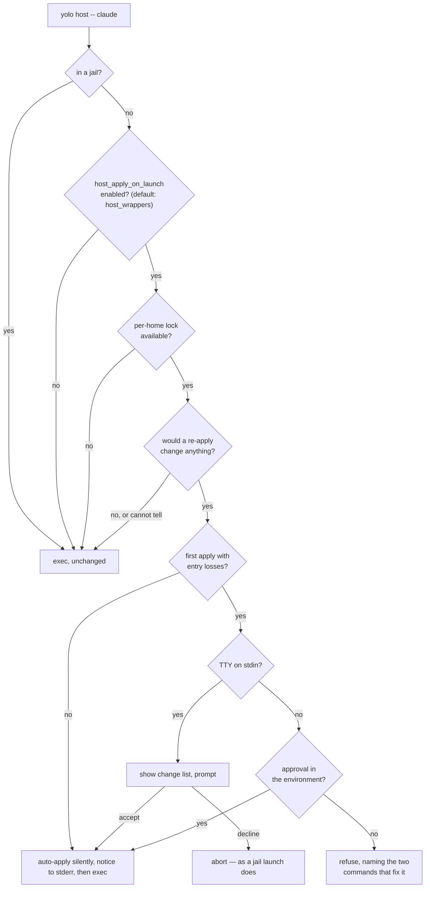

# The host launch gate — how a real `$HOME` render is kept from going stale

**Status:** CURRENT as of 2026-09-18, verified against `e7dc1d4d`.

> [!IMPORTANT]
> **A ruling dated 2026-09-20 narrows "active host management" to `own` alone — and it is NOT
> BUILT.** `host_management` keeps two values, `none` and `own`, with **`none` as the new
> default**; `assert` is retired, because it is the only mode in which yolo both writes a host
> file and reads it back. **Everything below describes the shipped tree**, where "active" means
> `assert` **or** `own` and an absent key resolves to `assert`. Two consequences for this gate
> when the ruling lands, neither of which moves a line of its mechanism:
>
> - **"Active management" reads `own`.** Every `assert`-or-`own` phrase below loses its first
>   term; nothing else about the disposition table changes, because the two modes were never
>   distinguished *by* this gate — they were the two answers that were not `none`.
> - **The `HostManagementNone` early return becomes the default path.** It is a minority branch
>   today; afterwards a machine that never declared ownership never reaches the survey at all,
>   which is the silence the gate's own comment already describes as the correct behaviour
>   there.
>
> The decision lives in
> [`config-ownership-and-promotion.md`](../design/config-ownership-and-promotion.md#4-declaring-ownership--the-host_management-key).

`yolo host apply` renders pack surfaces into the invoking user's real `$HOME`. Nothing
re-examines them afterwards, so what is in an agent's config files and what the packs now say
drift apart in silence. Every generated launch wrapper already execs `yolo host -- <bin>`, and
that is the only moment the content matters — agents read their config at startup and do not
reload it. So the **host launch gate** *(coined here)* keeps that launch synchronized:
under an opt-in key (`host_apply_on_launch`, which defaults to true when `host_wrappers` is on)
it compares the render against the home, execs straight through when nothing would change,
automatically synchronizes host configuration without prompting when drift is detected under
active host management (`assert` or `own` — `own` alone once the ruling above is built), and
pauses to prompt on a TTY (or refuses off a TTY) only when first-time adoption would overwrite
unmanaged keys (`FirstApply && EntryLosses`).

| Component | Lives in |
| :--- | :--- |
| The launch hook — the whole gate, and its exec/abort decision | `internal/cli` (`hostApplyGate`, `hostApplyGateApply`) |
| The roll-up predicate across one apply | `internal/cli` (`hostApplySurvey`, `noteWrapperPlan`) |
| The per-home lock | `internal/cli` (`tryHostApplyLock`, `hostApplyLockPath`) |
| The opt-in key, read from user scope directly | `internal/config` (`HostApplyOnLaunchEnabled`, `validateHostApplyOnLaunch`) |
| Per-destination predicate, config/briefing/files kinds | `internal/entrypoint` (`HostRenderResult.WouldChange`, `hostSurfaceWouldChange`) |
| Per-destination predicate, the skills kind | `internal/hostskills` (`Result.WouldChange`, `Changed`, `changedPluginTree`) |
| The delivered form — what a delivery actually leaves behind | `internal/hostskills` (`delivered.go`, `deliveredDigest`) |
| The wrapper bodies and their fifth surveyed destination | `internal/hostwrap` (`Body`, `Bins`, `Plan.Changed`) |
| Automated host apply on pack update | `internal/cli` (`packUpdate`, `hostApplyFromPackUpdate`) |
| The availability line at `yolo check` | `internal/cli/check` (`sectionHostWrappers`) |

**Reads with:** [`config-safety.md`](config-safety.md) (the jail's launch-time approval, whose
mechanism this mirrors and whose flag ruling it inherits),
[`../design/host-render-target.md`](../design/host-render-target.md) (what a host render is, and
what the `KindHost` notch refuses), [`composed-file-permissions.md`](composed-file-permissions.md)
(what a composed surface's posture is once written).

For the `host_apply_on_launch` key — its default, its scope, the user-facing disposition table,
the environment variable's spelling and the two-step remedy — run `yolo config-ref`. That is the
authority for everything a user needs; this doc is the mechanism behind it.

---

## Principles

Cited by number from sibling docs and code comments.

**P1. The launch is the only moment that matters.** Agents read their config at startup and do
not reload it mid-run. A host render that is stale while nothing reads it is not a problem; the
same render stale at the instant an agent starts is the whole problem. That is why there is no
per-command check, no fingerprint and no standalone staleness notice.

**P2. Consent, not disposability, is what licenses a write.** The operative question is never "is
this home precious" — it is "did the user opt in." Disposability is why a jail home needs no gate
at all; consent is why a host home needs one exactly once.

**P3. Measure the home, do not model its inputs.** Every fingerprint — mtime+size, content
hashes, an input closure — is a *model* of "would a re-apply change anything," and each carries a
false-positive rate plus a state file to keep. An observe render answers the question directly,
in the low tens of milliseconds against a warm home, which is three orders of magnitude inside
the gate's own budget. There is no stored state on the render side.

**P4. The approval is granted per launch, in the strongest spelling the launch channel allows.**
A flag where a flag can be passed; an environment variable on the wrapper path, where none can.
Never a config key — that is the one spelling that is genuinely standing consent, and it stays
refused.

**P5. A refusal must be actionable at the surface the user typed.** This gate's refusals reach
someone who typed `claude`, not `yolo`, so an unexplained failure reads as "claude is broken."
Every refusal names its remedy in the spelling its reader can actually use: the two-step apply
for an interactive reader, the environment variable for a scripted one.

## Invariants

- **The gate compares the RENDER, not the config.** Only that makes "the host is up to date
  whenever an agent launches" literally true. A config-approval snapshot mirroring the jail's
  `approvals/<name>.json` is structurally blind to a hand-edited `~/.claude/settings.json`: the
  config never moved, so nothing would prompt.

- **One collector, both consumers.** `hostApplySurvey` is filled in by the apply itself. The gate
  does not re-derive the answer from a traversal of its own: it runs the ordinary `applyHost` in
  observe posture with the output captured, and reads the survey. A second traversal of the
  written kinds would be a second thing to drift out of step with the apply it describes.

- **The gate adds a new MOMENT for the existing prompts, never a second mechanism.** An accepted
  prompt runs the ordinary writing `applyHost`, so `confirmHostLosses` and the skills and
  briefing adoption gates fire on exactly the conditions they already fire on.

- **One writer per home**, taken around the whole observe-then-write sequence — see
  [One writer per home](#one-writer-per-home).

- **In-jail is a hard no-op**, checked before the key is even read. `render.Host` targets the
  invoking user's real home and `paths.Home()` in a jail is the jail's own home, so there is no
  host home in there to be stale. The discriminator is `config.InJail`.

- **The gate writes to stderr, including its prompt.** A wrapped launch is one exec away from
  being the agent, and an agent's stdout is routinely parsed (`claude --print`), so a gate on
  stdout would corrupt the launches it is least entitled to disturb.

- **The opt-in key is read from user scope directly, and that is the security boundary.** The key
  licenses yolo to write into the real `$HOME` as a side effect of launching an agent. Two of the
  places a config key can come from are jail-writable — the workspace `yolo-jail{,.local}.jsonc`
  and the assembled workspace config — so reading the merged config would let a cloned repository
  arrange for its own `packs` to be rendered into the user's home the next time they typed
  `claude`. Reading user scope makes workspace scope *inexpressible* rather than merely refused;
  `validateHostApplyOnLaunch`'s workspace-scope error is defense-in-depth against a silent
  no-op, not the boundary itself. A user config that cannot be read or parsed yields false — an
  opt-in nobody could read has not been given.

## The change predicate

The **change predicate** *(coined here)* is the per-destination answer to *"would an `--assert`
write bytes that differ from what is on disk right now?"* It is computed by comparing rendered
result against current content, never by inspecting which report fields are populated.

It exists because no other field on a render result answers that question. `Action` reads *"would
render"* for every surface not skipped or refused, and `Overwrites` is empty both when the render
re-asserts an identical value and when it only adds keys — so a byte-for-byte correct surface and
one needing a whole new key were indistinguishable. The predicate lives on
`entrypoint.HostRenderResult.WouldChange` for the config, briefing and files kinds and on
`hostskills.Result.WouldChange` for skills; `hostApplySurvey` rolls both up into *"N in sync, M
would change"*, which is what `yolo host apply --dry-run` ends with and what the gate branches on.

The comparison **normalizes both sides through the same codec** rather than comparing against the
file's raw bytes. A literal byte comparison reports a change forever for canonical-TOML key
reordering and for any non-2-space JSON, with no loss recorded — which makes the formatting
carve-out below **structural** instead of merely checked.

There is a **fifth surveyed destination** beyond the four written kinds: the wrapper directory.
`applyHost` writes it, `hostwrap.Plan.Changed` is already an exact predicate over it, and a pack
added since the last apply has no wrapper — nothing else in the survey would say so.

### The two carve-outs

Both are the difference between a predicate and a prompt that never stops, and both are stated in
`WouldChange`'s own doc comment because a future reader will otherwise "fix" them.

| Carve-out | Why it does not count as a change |
| :--- | :--- |
| **Formatting** | A loss purely about a file's prose and layout — a dropped TOML comment, a re-indented JSON file, a re-sorted table. Nothing the user configured changes, so a gate reading this would prompt forever on a config they are perfectly happy with. |
| **Pruned** | A `${workspace}`-keyed key with no host referent is dropped from the layers on every render, by design. It is a declaration yolo never honors at this notch, so it is never a pending change. |

A surface the render **refuses** to touch counts as in sync, not as changed. Every refusal gets
its own loud line in the report; folding refusals into the changed set would make the gate stop on
a condition applying cannot fix — a prompt whose remedy does not exist.

### The render is idempotent

This is the load-bearing fact of the whole gate: re-rendering on every launch is a no-op *by
construction* rather than by luck. It is held by four convergence tests — byte-identical second
`--assert` on a config surface (`entrypoint`), convergence over a whole home (`internal/cli`), RMW
idempotence that must not clobber a value the agent changed (`entrypoint`), and convergence over a
pack whose skills and files are **symlinks into a dotfiles repo** (`internal/cli`).

> [!WARNING]
> **A convergence test proves nothing about a fixture shape it does not build.** The first three
> tests all build their fixtures out of real files, so the whole dotfile-manager class — rcm,
> stow, chezmoi, which is the shape a user's own local pack most often has — sat outside every
> convergence assertion in the tree, and did not converge. The fourth test exists because that was
> the gap, not because three was too few. See [R3](#r3--the-predicate-models-what-the-writer-produces).

## `FirstApply` — what "first" means

`FirstApply` is the **absence of a provenance record** for a surface under the host provenance
directory (`internal/render`'s target layout). It is **per surface**, not per home, and it is
**epistemic, not temporal**: "first" means "no record right now."

That is why idempotency does not dissolve it.

| | Question it answers | Settled by |
| :--- | :--- | :--- |
| Idempotency | does a second render write the same **content**? | the bytes |
| `FirstApply` | does yolo know which keys in this file are **its own**? | the record |

Before any apply, every key in `~/.claude/settings.json` is the user's, so replacing one is data
loss. After one apply, provenance says which keys yolo owns, so replacing those is policy. A
byte-identical second render does not help answer *"was this value mine or theirs?"* — nothing in
the content carries that, which is the whole reason a separate record exists.

`FirstApply` can become true again: prune or delete the state dir, or share one config across two
machines, and the record is gone and the confirmation returns. That is the same *deliberately weak
evidence* property `hostskills.Manifest` documents for the delivery manifests — a record that can
go stale in ordinary use, which is why it authorizes a reversible act (archive) rather than a
destructive one.

> [!WARNING]
> **Do not add an every-apply loss gate on the grounds that a real `$HOME` is precious.**
> `confirmHostLosses` fires only when `FirstApply` is true *and* there are entry losses, so on a
> home yolo has already asserted there is no door to fire. The repo already ruled that once opted
> in, wholesale regeneration is policy — the prompt's own text tells the user *"yolo regenerates
> the keys it manages wholesale, so anything above that is not in your config is dropped."* The
> intuition is a strong one and `confirmHostLosses` existing at all makes it feel confirmed;
> reading the four lines of gate is faster than re-arguing it. Conflating preciousness with
> consent turns a first-apply gate into an every-apply gate and makes re-rendering look dangerous
> when it is the same operation the user already authorized (P2).

> [!WARNING]
> **Config surfaces never archive.** `hostskills.Archive` has call sites for skills, the `files`
> kind, briefings and retirement — and none in the config render path. So an `EntryLoss` on a
> config surface is irreversible, which is exactly why `confirmHostLosses` distinguishes it from a
> reversible overwrite. Archiving config surfaces is a possible future softening; nothing in the
> gate depends on it, and until then the prompt is the only thing standing between a render and an
> unrecoverable loss.

## The launch gate

At `yolo host -- <bin>` the gate runs before the exec. `yolo host apply` and `yolo apply` are
excluded — the user is already applying.

### The opt-in key

A host-only boolean in the user config, **defaulting to the value of `host_wrappers`** (on when
wrappers are enabled; off when disabled). An explicit `"host_apply_on_launch": false` serves as
the opt-out escape hatch. `yolo check` prints a line either way — the feature is on, or it exists
and is off — so the mechanism is never invisible to someone wondering whether it ran.

> [!IMPORTANT]
> **Consent for safe updates is tied to active host management.** Under `assert` or `own` (`own`
> alone once the 2026-09-20 ruling at the top of this page is built), opting
> into host wrappers licenses yolo to keep managed surfaces synchronized without interactive prompts.
> Interactive confirmation is reserved for first-time adoption that would overwrite unmanaged host
> keys (`FirstApply && EntryLosses`), where a launch under an enabled key still prompts on a TTY
> and still refuses off one. Treating the key as blanket pre-authorization for unmanaged key
> clobbering remains refused.

### The dispositions

`yolo config-ref` prints these as a user-facing table. What follows is why each one is what it is.

| Situation | Disposition, and the reason |
| :--- | :--- |
| Nothing would change | Silent exec. A freshly-applied home must prompt **not at all, ever**, until something actually changes — that is [R3](#r3--the-predicate-models-what-the-writer-produces)'s bar, and the first thing to check when touching the predicate. |
| Safe managed changes | **Auto-apply silently**, emit a single stderr notice (`yolo host: synchronized host configuration (<targets>)`), and exec immediately. Under `assert` or `own`, updating managed keys is idempotent policy synchronization, not data loss. |
| First apply overwriting unmanaged keys (`FirstApply && EntryLosses`), TTY | Show the change list, prompt, apply on accept. A **decline aborts the launch**, as it does in the jail: launching anyway would make the question a formality, and applying anyway would make "no" mean nothing. |
| First apply overwriting unmanaged keys, no TTY, no approval | **Refuse**, and apply nothing. Consistency with `yolo run` beats a host special case, and the prompt is the guard that makes an irreversible config-surface loss safe. |
| First apply overwriting unmanaged keys, no TTY, approval present | Apply, then exec. |
| Cannot determine | **Exec**, with at most one line to stderr. See [below](#cannot-determine-versus-determined). |

"TTY" means **stdin**, matching the jail's own probe: `claude --print foo > out.txt` has a
redirected stdout and a perfectly good terminal, and refusing that launch as "nobody to ask"
would be false.

The gate shows a **change list, not a unified diff**, and names `yolo host apply --dry-run` for
per-key detail. A second diff renderer at a surface that interrupts someone starting an agent is
both duplication and too long to read.

### Why the approval is an environment variable here

When first-time adoption needs approval, the wrapper body is fixed — `exec yolo host -- <program> "$@"` — and
`hostMain` splits on the first `--`, handing everything after it to the program. A user typing `claude --print foo`
therefore has **no slot for a yolo-level flag**. There is a pre-`--` slot, but the generator emits
nothing into it and the user cannot reach it, so a flag here is not merely inconvenient — it is
unreachable. The choice is env-var-vs-nothing, and "nothing" means a scripted agent launch can
never proceed.

Four properties, each with its reason:

- **Scoped to this path.** Honored by the wrapped launch and nowhere else — never by `yolo run`,
  never by `yolo host apply`. Both of those take the flag, so honoring the variable there would
  buy nothing and would let one shell-rc line pre-approve every jail launch on the machine.
- **Named to match the flag it stands in for**, so the two read as one grant in two spellings and
  a refusal can offer whichever channel its reader can reach.
- **The spelling is a named constant beside the refusal that names it**, following the jail
  snapshot's rule for exactly this: the spelling a user is told to set and the spelling the code
  reads cannot drift apart. Its reader is by construction someone who could not be prompted.
- **Presence, not truth-parsing.** Any non-empty value grants, matching
  `YOLO_ALLOW_STALE_IMAGE`'s consent probe — consent is about intent, not about the token. A
  variable set to `0` by someone expecting "off" is the one plausible objection, and the house
  precedent goes the other way.

> [!IMPORTANT]
> **This does not contradict the jail's flag-not-an-env-var ruling; it answers a different
> question.** That ruling holds in every word: an env var is inherited by every child process and
> survives in a shell for the rest of a session, precisely the property a per-launch approval must
> not have. But for `yolo run` the choice is flag-vs-env-var, and there the variable is pure cost.
> On a fixed wrapper there is no flag channel at all, so the choice is env-var-vs-nothing. The
> jail ruling says *prefer a flag when you have one*; this path has none, and takes what the
> principle leaves. The cost is accepted knowingly: exported in a shell profile the variable
> becomes de facto standing consent for every wrapped launch in that shell, and the two
> containments — honored here and nowhere else, and never baked into a wrapper — are what make
> that tolerable rather than a hole.

> [!WARNING]
> **Do not bake the grant into the wrapper body** when a config key says so. It is the obvious
> next step and it is refused: it converts a per-shell act into a permanent one, which is the
> standing consent P4 forbids. The variable is tolerable *because* someone has to type it.

> [!WARNING]
> **Do not teach `yolo host apply` an `--accept-config-changes` flag** so the refusal can name a
> one-liner. Its parser accepts `--assert`, `--dry-run` and `--shell-init` and exits 2 on anything
> else, and adding the flag would make it stand in for the explicit apply's own fail-closed
> one-way-door confirmations — which the gate is specifically not licensed to touch, and which
> `TestApplyHostFirstApplyFailsClosedWithoutStdin` exists to hold. It is also unnecessary: the
> flag grants the *jail's* config approval, and an explicit host apply has none. The refusal names
> the bare `--assert`, and a test asserts the flag is not offered.

## Failure modes

### Cannot-determine versus determined

Two classes, because they end differently.

- **Cannot determine** — a malformed pack manifest, an unreadable or unresolvable home, an
  unreachable `file://` pack, a lock another process holds, a budget overrun. The predicate has no
  answer, so there is no change to refuse over: **exec**, with at most one line to stderr. This
  follows the house rule the source-skew gate states — a gate that cannot prove its condition does
  not fire.
- **Determined, and a change is needed** — the four dispositions above. This is the only path that
  can stop a launch, and it stops it *with a remedy*.

**The budget is a stuck-detector, not a tuning knob**, which is why there is no config key and no
environment variable for it: the observe pass is milliseconds against a warm home, so a second is
vast headroom and anything past it means a cold or network-mounted `$HOME` rather than a value
someone should be adjusting. On expiry the gate reports cannot-determine and execs — a launch must
never hang on a check it can decline to make.

**A failed apply after an accepted prompt aborts the launch.** The user said "apply these and
launch", so exec'ing an agent against a home the apply did not finish is the "it looked like it
worked" outcome the whole gate exists to remove. The render is idempotent, so the next launch
converges. What must not happen is a *single file* left half-written — that is the renderer's own
atomicity concern, unchanged by the gate.

### One writer per home

Two wrapped agents launched at once would both apply. Idempotence makes the content converge but
does not make two concurrent writers to one file safe, so the launch path takes a **flock keyed by
the resolved home**, and a launch that cannot take it treats that as cannot-determine and execs.

Two details are load-bearing:

- **The lock wraps the whole observe-then-write sequence, not the write alone.** Locking only the
  apply leaves the window that matters open: this launch's survey could read a home another
  process is halfway through applying, conclude "out of date", and prompt about drift that no
  longer exists by the time it asks.
- **The home is resolved the same way `applyHost` resolves it** — the OS user home, not
  `paths.Home()` — so the lock and the render cannot end up keyed to two different homes.

> [!WARNING]
> **The lock is the launch path's, not the command's.** An explicit `yolo host apply` run alongside
> a gated launch is still unserialized, deliberately. Closing that means either making the command
> wait on a launch that may be sitting at a `[y/N]` — an unbounded pause on someone else's
> terminal — or making it refuse, a new failure mode for a shipping command.

## R3 — the predicate models what the writer produces

> [!WARNING]
> **A change predicate must model what the WRITER produces, not what the source IS.** Get this
> wrong and the predicate reports a change it has already made, on every apply, forever — and at
> the launch gate that is a prompt on every start that no apply can ever settle.

This is `R3` — cited by that ID from `internal/hostskills` (`deliver.go`, `plugin.go`,
`deliver_test.go`), and the reason `internal/hostskills/delivered.go` exists as a package-local
digest instead of reusing `internal/treedigest`.

The two digests answer different questions, and the split is the point. `treedigest` asks *"are
these two trees the same tree?"* — an identity question in which a symlink's target and a file's
exact permission bits are part of what the tree **is**. That is right for the installer-capture
store, whose digest is a key, and for this package's own migration union, which compares two of
the *user's* trees and materializes neither. A **delivery** predicate cannot use it, because it
asks *"would copying the source over the destination alter it?"* — a fact about what the copy
produces:

- the copy **materializes** a symlink, because the destination is a real agent home whose tools
  must be able to read the skill. A pack deployed by a dotfile manager lands as **content**, so a
  predicate measuring it by its link *targets* can never match its own output;
- the copy **normalizes the mode**, keeping only the exec bit. A `0o700` source — what `git clone`
  leaves under `umask 077` — can never match its own `0o755` output.

So the delivered form records exactly what survives a delivery and nothing else, and its digest
alphabet differs from `treedigest`'s on purpose: the two are not interchangeable and a stray digest
must not silently compare.

The same rule produces the other two carve-outs in the skills path, and any new one should be
checked against the rule before it is checked against the code:

- `changedPluginTree` excludes the plugin manifest from the tree comparison and compares it against
  its **marked** form, because the delivery rewrites it to carry yolo's ownership marker — so the
  destination is deliberately one file different from the source.
- `changedExcept` skips, on the source side only, the paths a filtered copy leaves behind, because
  an excluded path never reaches the destination at all.

Every failure to read either side reads as **changed**. The cost of a false positive is one
redundant copy; the cost of a false negative is content nobody compared.

## The coverage boundary

The gate sees a launch **only if it goes through a generated wrapper.** An agent started by its
real binary (wrapper dir not on `PATH`), by an IDE extension, or by a desktop app is not observed
and runs against whatever the last explicit apply left.

That is the same boundary `host_wrappers` already has, and `sectionHostWrappers` already warns when
the feature is on but the dir is not on `PATH`, so the gap is announced by an existing channel. It
is the price of the approach: a per-command notice would have caught drift *sometime*, just never
at a moment tied to a launch (P1).

What gets a wrapper is exactly the pack-declared `program` contributions — `hostwrap.Bins` folds
the honored installs across the selected packs. That is agent launches: a human starting a session,
not a hot loop.

## Coupling with yolo pack update

Updating packs via `yolo pack update` on the host automatically triggers `host apply --assert`
when `host_management` is active (`assert` or `own`). Under `host_management: "none"` or inside a
jail, host apply is skipped. This couples pack updates with host configuration synchronization so
users do not need to run `yolo host apply --assert` manually after fetching pack updates.

> **⚠ Two spellings of "assert" meet in this paragraph, and only one of them is being retired.**
> The `--assert` **flag** on `yolo host apply` is the write-for-real posture and the
> [2026-09-20 ruling](#the-host-launch-gate--how-a-real-home-render-is-kept-from-going-stale)
> does not touch it. What the ruling retires is the `host_management` **value** `"assert"`, so
> the coupling condition above narrows from `assert`-or-`own` to `own`; the command it runs
> keeps its flag. Unbuilt — both terms are live today.

## What this does not do

- **It does not detect staleness on any other command.** P1.
- **It does not change the explicit `apply` path.** `yolo host apply` keeps observe-by-default and
  keeps its fail-closed confirmations.
- **It does not check the jail.** In-jail is a hard no-op.
- **It does not answer "does this host have the tools."** `check-deps` and `yolo check` own that.
  Dependency resolution shells out once per declared binary and is a different question.
- **It does not introduce a daemon, a timer, or a background process.**
- **It does not keep a fingerprint, a receipt, or any render-side state.** P3.

## Why it's this way

Rulings a future change would otherwise undo, kept with their original IDs — those IDs are cited
from code comments, and this appendix is where they resolve.

| Ruling | Why it holds |
| :--- | :--- |
| **R3** — the change predicate models what the writer produces | The alternative is a predicate that reports a change it already made, forever, which at the launch gate is a prompt no apply can settle. Realized once, on symlink-deployed and `0o700` sources. |
| **[OQ-1](#why-its-this-way)** — `host_wrappers: true` implies `host_apply_on_launch: true` by default | Having wrappers on PATH means the user routed their agent launches through yolo; running stale config by default because a second boolean was unset was a trap. `"host_apply_on_launch": false` is the escape hatch. |
| **[OQ-2](#why-its-this-way)** — zero-prompt auto-apply on launch under active management | Pausing to prompt when updating declared keys under `assert` or `own` turned routine pack updates into intrusive friction. Zero-prompt auto-apply synchronizes safe changes silently with a concise stderr notice, preserving confirmation prompts only for first-time unmanaged key adoption (`FirstApply && EntryLosses`). |
| **[OQ-3](#why-its-this-way)** — pack update on host couples with host apply --assert | Updating packs without re-rendering host surfaces leaves the host stale until launch; coupling them ensures pack updates immediately materialize into host configs under active management. |
| **[OQ-HS0](#why-its-this-way)** — measure the real thing, never a stat or hash fingerprint | Every fingerprint is a model with a false-positive rate and a state file to keep, and is *less* correct than measuring the home. An input content hash additionally spends most of its time hashing a binary whose identity is already free from the build stamps. |
| **[OQ-HS1](#why-its-this-way)** — the launch chokepoint is the only trigger | Per-command checking dragged in an eligibility apparatus (a deny-set for machine-consumed stdout, a `--help` side-effect hazard, an `eval "$(yolo host env)"` trap) protecting commands that never needed checking. |
| **[OQ-HS2](#why-its-this-way)** — a user-level opt-in key, default matches host_wrappers | A key that pre-approved unmanaged key destruction is refused. Defaulting to true when host_wrappers is on (amended by [`OQ-1`](#why-its-this-way)) ensures wrapped launches stay fresh. |
| **[OQ-HS3](#why-its-this-way)** — zero-prompt auto-apply for safe updates; prompt on first-apply losses | Amended by [`OQ-2`](#why-its-this-way): once opted into host management, updating declared keys is idempotent policy synchronization. The prompt is retained only when FirstApply would destroy unmanaged keys. |
| **[OQ-HS4](#why-its-this-way)** — everything is covered, all written kinds | Two tiers of "up to date" is a phrase that does not mean what the reader thinks. It is also why the key is a plain boolean: there is nothing for a list to enumerate. |
| **[OQ-HS5](#why-its-this-way)** — declining aborts the launch | Launching anyway makes the question a formality. |
| **[OQ-HS6](#why-its-this-way)** — non-TTY first-apply loss refuses, applying nothing | When FirstApply with EntryLosses has no terminal, the launch refuses to prevent irreversible loss. Safe updates auto-apply without requiring a TTY (amended by [`OQ-2`](#why-its-this-way)). |
| **[OQ-HS9](#why-its-this-way)** — the gate compares the render, not the config | A config-approval snapshot is cheaper and needs no predicate, and is blind to a hand-edited destination. The jail's two readings coincide only because it re-renders unconditionally afterwards. |
| **[OQ-HS10](#why-its-this-way)** — the non-TTY approval is an environment variable, on this path only | On a fixed wrapper the choice is env-var-vs-nothing; no flag can reach the process. Scoping it here is what stops a shell-rc line pre-approving every jail launch on the machine. |
| **[OQ-HS11](#why-its-this-way)** — both sides normalize through the same codec | A literal raw-byte comparison reports a change forever for canonical-TOML reordering and non-2-space JSON, with no loss recorded — `R3` by the back door. This makes the formatting carve-out structural instead of checked. |
| **[OQ-HS12](#why-its-this-way)** — the wrapper dir is a fifth surveyed destination | A pack added since the last apply has no wrapper, and nothing else in the survey would say so. |
| **[OQ-HS13](#why-its-this-way)** — "TTY" means stdin | A redirected stdout with a live terminal is a launch that can be asked. |
| **[OQ-HS14](#why-its-this-way)** — an apply that fails after an accepted prompt aborts the launch | The user asked for apply-then-launch; exec'ing against a half-applied home is the failure the gate exists to remove. |
| **[OQ-HS15](#why-its-this-way)** — the lock is the launch path's, not the command's | Closing the gap means an unbounded wait on someone else's prompt, or a new refusal in a shipping command. |
| **[OQ-HS16](#why-its-this-way)** — a change list, not a unified diff | A second diff renderer, at a surface interrupting someone starting an agent, is duplication and too long to read. |

## Current values

Verified at `e7dc1d4d`. The prose above explains what each of these is for; this table is the only
place the values themselves are stated.

| Value | Setting | Defined in |
| :--- | :--- | :--- |
| Opt-in key | `host_apply_on_launch`, boolean, default matches `host_wrappers` (true when enabled), **user scope only** | `config.HostApplyOnLaunchEnabled`; `yolo config-ref` is the user-facing authority |
| Pack update coupling | `yolo pack update` runs `host apply --assert` under `assert`/`own` on host — the 2026-09-20 ruling narrows the condition to `own` and leaves the flag alone (unbuilt) | `cli.packUpdate`, `cli.hostApplyFromPackUpdate` |
| Non-TTY approval | `YOLO_ACCEPT_CONFIG_CHANGES` (any non-empty value) | `cli.acceptConfigChangesEnv` |
| Observe budget | 1s, then cannot-determine | `cli.hostApplyGateBudget` |
| Per-home lock | a flock under the global storage lock dir, keyed by the resolved home | `cli.hostApplyLockPath`, `cli.tryHostApplyLock` |
| Host provenance record | `<home>/.local/share/yolo-jail/host-provenance/<agent>-<name>.provenance` | `internal/render` target layout |
| Surveyed destinations | the four written kinds plus the wrapper dir (`host_wrappers`) | `cli.hostApplySurvey`, `cli.noteWrapperPlan` |
| Dry-run roll-up | `"N in sync, M would change"` | `cli.hostApplySurvey.Summary` |
| Wrapper body | `exec yolo host -- <program> "$@"` | `hostwrap.Body` |
| TTY probe | stdin | `cli.hostGateCanPrompt` |
