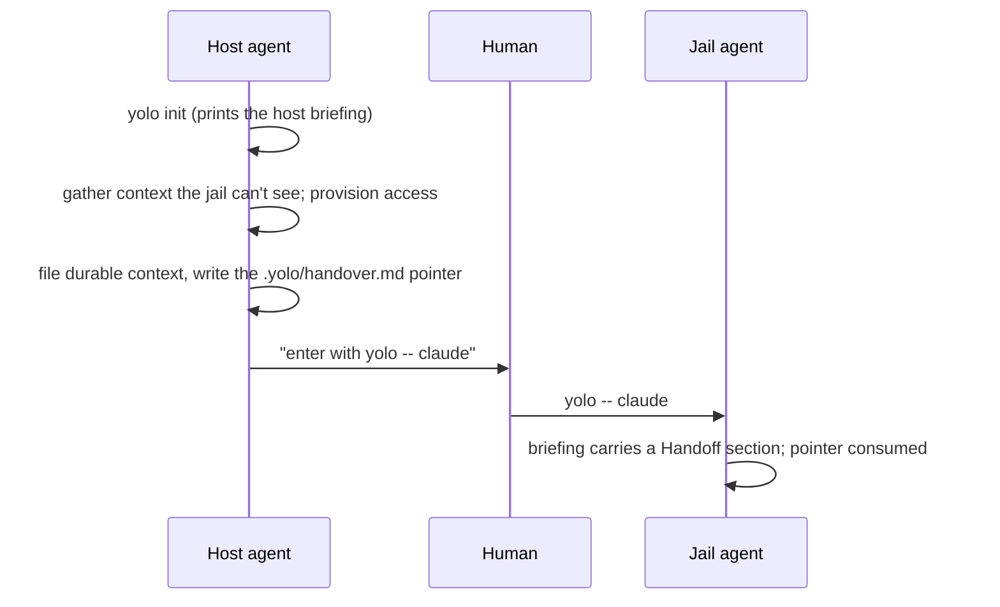

# The host→jail handoff — carrying one task across the boundary

**Status:** CURRENT as of 2026-09-09, verified against `d8cf1cf8`.

A host agent sets up a jail, gathers the context the jail cannot see, and has to carry that
context *and the task* across the boundary. The **handoff** is that carrier: a durable,
committed context file in the workspace plus a minimal pointer at `.yolo/handover.md`. On
the next launch the run pipeline renders the pointer as a conditional **Handoff** section in
the environment briefing and then **consumes** it, so the task is delivered exactly once.

**A handoff is a one-time event, and a startup ritual is a recurring one.** That distinction
is the whole design. There is no jail-side startup skill and no magic phrase: orientation is
passive (the environment briefing is already there), the task arrives once through the
briefing, and after that the task comes from the user.

| Component | Lives in |
| :--- | :--- |
| Reading, consuming and announcing the pointer | `internal/cli/run` (`readHandoff`, `consumeHandoff`, `noteHandoffConsumed`, `handoffPointer`, `handoffConsumed`) |
| The conditional Handoff section | `internal/jailcontent` (`BriefingInput.Handoff`, `BriefingContent`) |
| Where read and consume sit relative to the write loop | `internal/cli/run` (`refreshJailBriefings`) |
| The host agent's own instructions | `internal/cli/briefing.txt`, printed by `yolo init` |
| The built-in skill suite the ritual was deleted from | `internal/jailcontent/builtinskills` |

**Reads with:** [`agent-briefings.md`](agent-briefings.md) (how the section is composed and
delivered), [`storage-and-config.md`](storage-and-config.md#per-workspace-state) (the
workspace state dir the pointer lives in),
[`../design/self-documenting-cli.md`](../design/self-documenting-cli.md) (why the transition
instructions belong in `yolo init`'s own output rather than in a skill).

---

## Principles

**P1 — The transition is host-side and one-time.** `yolo init` and its printed briefing own
it. The host agent's job end to end is: scaffold the jail, set the config, gather the context
the jail will not have, provision the access it needs, and file the handoff. **The human is
not a relay** of the task or the context; they enter the jail and nothing else.

**P2 — The startup is passive.** The jail agent is oriented by the environment briefing,
which is already in place and already correct. There is no startup ritual: the agent comes up
and waits for the user.

**P3 — The task comes from the handoff at the transition, and from the user after.** A fresh
handoff *is* the task. A consumed one is at most context and is never re-read as the task.

## The flow

The handoff has **two parts on purpose**. The gathered context — research, decisions and
their rationale, files outside the workspace, gotchas — is long-term important, so the host
agent files it in a **durable, committed** spot in the workspace where version control keeps
it. `.yolo/handover.md` is then a **minimal pointer** to that content: a short note naming the
task and saying where the context lives. The pointer is the fresh-versus-stale signal and is
the only part consumed.

The host briefing's step 3 is marked mandatory and is deliberately the *last* substantive
step, because the carry-in only works if the host agent does its part.

## Rendering

A pointer present at launch becomes a **Handoff** section near the top of the jail-managed
briefing body — after any provisioning-failure warning, before Environment. The section says
in as many words that it appears once and that the pointer carrying it has been consumed.

With **no** pointer there is **no section**, and no standing counterpart line either.

> [!WARNING]
> **Do not add an always-present "where your task comes from" line.** The jail notch's
> config-independent header bytes are pinned by test, and an always-present line moves that
> rendered surface for every existing user — to restate a default the agent already follows
> (with no handoff, wait for the user). The one-time-ness that line was carrying lives
> *inside* the conditional section instead, where it costs the pinned header nothing. The
> veto is a test, not an oversight.

## Consuming the pointer

**Read before the render; consume after the write; consume only if a briefing was actually
written.**

The briefing write loop is driven by pack **declarations**, so a jail whose packs declare no
briefing destination writes nothing at all. The first implementation read, rendered and
consumed unconditionally in that order — which burned the pointer on exactly the launch that
could not deliver it. That is why read and consume are deliberately split *around* the write
loop rather than sitting together.

**The two failure directions are asymmetric, and the gate protects the worse one.** A consume
that *fails* means the handoff resurfaces next launch: noisy, never lost. A consume that
*succeeds without delivery* loses the task outright. The rename is therefore best-effort in
the failing direction too — a read-only state dir leaves the pre-consumption behaviour, which
is the safe one.

**Consuming renames rather than deletes**, to `handover.md.consumed`. That leaves a visible
"already handed off" state a human can inspect, and it is the recovery artifact.

### The residual: core cannot tell an agent from a shell

**Core has no agent concept**, so it cannot distinguish `yolo -- claude` from `yolo -- bash`:
a briefing written for a shell burns the handoff just as thoroughly as one written for an
agent. Gating on "is the target an agent" would reintroduce the registry the pack system
exists to have deleted, so the design does not.

The mitigation is **visibility rather than prevention**. The launch that consumes a handoff
prints on stderr which file it took and the `mv` that puts it back. A burn stays recoverable,
and the human sees it at the moment it happens instead of an agent discovering it by never
getting a task.

## What was deleted, and what must not come back

The built-in `jail-startup` skill is **gone**. It made "read `.yolo/handover.md`" a ritual
that ran on *every* session, which is right for neither half of the flow: on the one session
the handoff was meant for it worked, and on every session after it read a stale file as the
current task. That is not a stale-file bug — a stale file is the *expected* state of a
recurring ritual pointed at a one-time artifact.

> [!WARNING]
> **Do not reintroduce a jail-side startup skill, conditional or otherwise.** Its four jobs
> were each redundant or actively wrong. It re-derived orientation the environment briefing
> already carries. It needed a trigger that may not fire — a skill is model-invoked, and the
> flow also depended on the human remembering a magic phrase, so a startup behaviour on two
> unguaranteed invocations is one that intermittently does not happen. It could not tell the
> handoff session from the fortieth. And making it conditional on freshness just relocates
> the freshness heuristic the consume mechanism replaced.

> [!WARNING]
> **Do not delete `.yolo/handover.md` as vestigial.** The host-agent-carries-work-in case is
> the case, not a foreclosed one: a user-as-relay model cannot carry gathered context or
> provisioned-access notes across the boundary. What this design foreclosed is the *ritual* —
> mandatory file plus magic phrase plus every-session read — never the carrier.

> [!WARNING]
> **A host-side skill for this flow is also the wrong shape.** The host agent already gets the
> whole flow from `yolo init`'s printed briefing; a skill would duplicate the CLI's own
> output.

## Where the behavior is pinned

The wire tests drive `refreshJailBriefings`, never the helpers, and that is the point: the
first version of this feature was tested at the helper level only and **stayed green with the
call site deleted**. Anything added here needs a test that fails when the wiring is removed.

| Fact | Pinned by |
| :--- | :--- |
| A filed pointer reaches the composed briefing and is then consumed | `internal/cli/run/consumehandoff_test.go` |
| A launch that writes no briefing leaves the pointer fresh | `internal/cli/run/consumehandoff_test.go` |
| No pointer ⇒ no section, no marker, no notice | `internal/cli/run/consumehandoff_test.go` |
| The section's own content | `internal/jailcontent/briefing_test.go` (`TestBriefingContentHandoff`) |
| The last hop — a real launch, a real briefing file in a real jail, gone on the second launch | `integration/handoff_test.go` |

The integration test is not redundant with the host-side ones. Everything host-side stops at
the staging directory; the briefing mount, the staging filename and the inode-preserving
write all sit between there and the file an agent opens, and no host-side test can see any of
them.

## What this does not license

- **Not** an agent-versus-shell test in core. The residual above is accepted and mitigated by
  a notice; closing it needs a concept core deliberately does not have.
- **Not** a recurring read of the pointer. One delivery, then the user is the source.
- **Not** a deletion of the pointer. It is renamed, so a burn is recoverable.
- **Not** an unconditional consume. Delivery gates it.

## Current values

Verified at `d8cf1cf8`. The prose above explains what each of these is for; this table is the
only place the values themselves are stated.

| Value | Setting | Defined in |
| :--- | :--- | :--- |
| The pointer | `<workspace>/.yolo/handover.md` | `run.handoffPointer` |
| The consumed marker | `<workspace>/.yolo/handover.md.consumed` | `run.handoffConsumed` |
| Section heading in the briefing | `## Handoff` | `jailcontent.BriefingContent` |
| The recovery instruction printed on stderr | `mv .yolo/handover.md.consumed .yolo/handover.md` | `run.noteHandoffConsumed` |
| Built-in skills after the deletion | `configuring-the-jail`, `diagnosing-the-jail`, and a source-tree-only third | `internal/jailcontent/builtinskills` |

## Why it's this way

Forward-facing rulings a maintainer would otherwise undo, with their original ids.

| ID | Ruling | Why it stays |
| :--- | :--- | :--- |
 `.yolo/handover.md` stays as the transition carrier, and carries real work | The host-agent-carries-work-in case is the motivating case. A relay model cannot carry gathered context or provisioned-access notes across the boundary, so deleting the file forecloses the feature rather than simplifying it. |
| [`OQ-3`](#oq-3) | The enter-instructions stay in `yolo init`'s printed host briefing | A host-side skill would duplicate the CLI's own output, which the self-documenting-CLI principle exists to prevent. |
| [`OQ-4`](#oq-4) | Consume-on-first-read, performed by the **run pipeline** rather than by the agent | Host-side and deterministic. An agent is unreliable at self-erasure, and a freshness heuristic is exactly the first-versus-later-session distinction this design exists to stop making. |
| [`OQ-5`](#oq-5) | **No** standing "where your task comes from" line | The pinned jail header vetoes it: an always-present line moves a rendered surface for every existing user to restate a default the agent already follows. One-time-ness moved inside the conditional section. |
| [`OQ-6`](#oq-6) | Consume is gated on a briefing having been written this launch | An unconditional consume burns the pointer on the one launch that could not deliver it. The failure directions are asymmetric and the gate protects the losing one. The agent-versus-shell residual is mitigated by a stderr notice, not by an agent test. |
