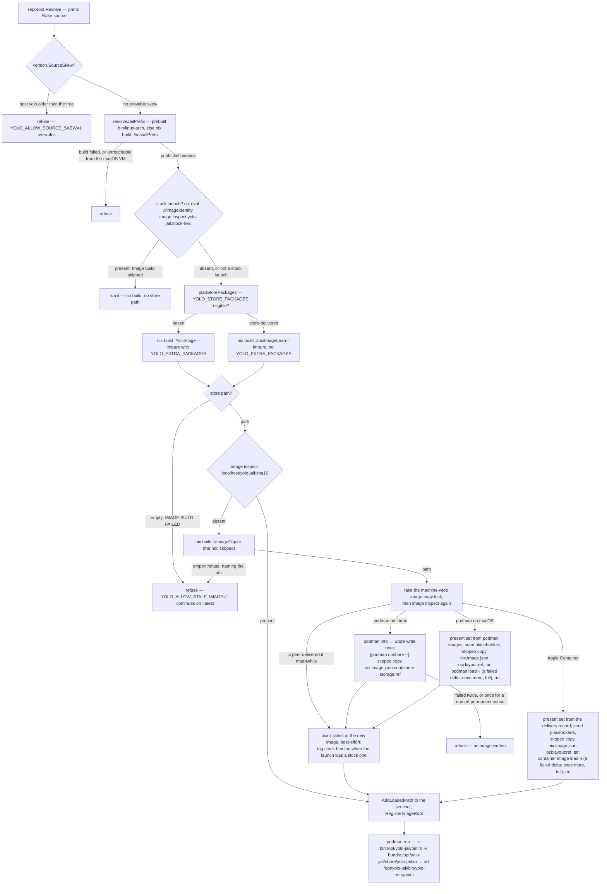

# Image delivery — what the image bakes, and what a launch mounts in

**Status:** CURRENT as of 2026-09-24, verified against `f491d192`. The two macOS delivery
arms were **measured at their launch call site on 2026-09-25**, both passing at `22011184` (Apple
Container on an arm64 Mac, Podman Machine on an Intel runner) — see
[Archive destinations](#archive-destinations).

A container jail runs on two things a launch assembles separately. The **image** is a nix-built
OCI image holding nixpkgs tools, the FHS link farm and `/etc` — and, of yolo's own code, nothing
but *names*. yolo's binaries and the flake bundle beside them are the **install prefix**, a host
directory the launch bind-mounts read-only at `/opt/yolo-jail`, and the container argv names
`/opt/yolo-jail/bin/yolo-entrypoint` absolutely. Every launch evaluates the flake; the image is
rebuilt and reloaded only when the store path it evaluates to has moved, is addressed in the
runtime by the hash of that store path, and is delivered by a `skopeo copy` that asks the
destination for each layer before sending it — no archive on either side where the runtime's store
is local, a temporary one where it is not. A build that ran and failed refuses the launch. Optionally a launch
delivers `packages:` from the mounted nix store instead of baking them, in which case the image
it builds contains none of them.

| Component | Lives in |
| :--- | :--- |
| Image derivations, the install prefix, the name-only links, the image identity | `flake.nix` (`mkOciImage`, `installPrefix`, `jailPrefixLinks`, `imageIdentity`, `goSrc`, `shippedBinaries`) |
| Build, failure report, content ref, GC roots | `internal/image` (`AutoLoadImage`, `buildFailureReport`, `JailImageRef`, `BuildJailPrefix`, `RegisterImageRoot`, `RegisterPrefixRoot`) |
| Layer-aware delivery: the copier, the copy, its retry and report | `internal/image` (`BuildImageCopier`, `copyArgv`, `copyImageWithRetry`, `retryWouldHelp`, `ReadLayerInventory`, `ReportFor`, `PresentLayerDigests`) |
| Destinations, and the namespace a store write runs in | `internal/image` (`ContainersStorageDest`, `OCILayoutDest`, `deliverViaArchive`, `StoreWritePrefix`, `PodmanRootlessness`, `StoreWriteNote`) |
| The delta archive and Apple Container's delivery record | `internal/image` (`newDeliveryWorkDir`, `seedPlaceholders`, `removePlaceholders`, `tarLayoutConsuming`, `presentInImage`, `writeDeliveryRecord`, `recordedPresentDigests` in `deltaarchive.go`); `internal/paths` (`ImageDeliveryDir`); `internal/prune` (`PruneImageDelivery`) |
| The machine-wide image-copy lock | `internal/image` (`lockImageCopy`, `ImageCopyLockPath`, the `LockImageCopy` seam) |
| `yolo check`'s delivery preflight | `internal/image` (`UnsharePreflight`, `DeliveryPreflight`); `internal/cli/check` (`reportImageDelivery`) |
| Which flake is built, and from where | `internal/reporoot` (`Resolve`, `BundledSourceDirFrom`) |
| The two-cadence skew gate | `internal/version` (`SourceSkew`, `ImageSourcePaths`); `internal/cli/run` (`refuseOnSourceSkew`) |
| Prefix resolution and the two mounts | `internal/cli/run` (`resolveJailPrefix`, `jailPrefixMountArgs`, `prefixUnreachableFromVM`, `JailEntrypointPath`) |
| Store-delivered packages, host half | `internal/cli/run` (`planStorePackages`, `storePackagesEligible`, `addImageExtras`); `internal/darwinpkg` (`MaterializeAt`) |
| Store-delivered packages, jail half | `internal/entrypoint` (`StoreProfilesEnv`, `StorePackagesRoot`, `imageProbePath`) |
| The bundle an install stages | `scripts/stage-source-bundle.sh`, `scripts/build-go.sh` |

**Reads with:** [`nix-across-backends.md`](nix-across-backends.md) (what nix produces for each
backend, and the `macos-user` path that has no image at all),
[`image-retention.md`](image-retention.md) (which loaded images and GC roots are kept, and why the
image's constant `created` no longer matters to that),
[`../design/minimal-disk-footprint.md`](../design/minimal-disk-footprint.md)
and [`../design/disk-levers-and-backfill.md`](../design/disk-levers-and-backfill.md) (what
reclaims the images, tars and store outputs this pipeline leaves behind),
[`../reference/jail-home.md`](jail-home.md) (every other mount).

---

## Invariants

**The image contains none of yolo's own binaries.** `/opt/yolo-jail` is two read-only bind
mounts the launch supplies — the Linux binaries at `bin/`, the flake bundle at
`share/yolo-jail/` — and the image bakes only the two mountpoint directories and one
`/bin/<name>` symlink per shipped binary, pointing into the mount. A commit touching only
`cmd/` or `internal/` moves no image input, so it costs no image rebuild and no delivery.

**The image moves only when an image input moves.** Those inputs are `flake.nix`,
`flake.lock`, and the `packages:` list a launch bakes. `imageIdentity` is a sha256 over
exactly the first two, baked into the image and read back out of a loaded one — the oracle
for "is this loaded image built from this flake". Before the binaries left the image, yolo's
own Go source was the trigger behind roughly half of all commits; measured after, a Go-only
edit leaves `.#ociImage`'s store path unchanged.

**Every host computes the same image identity, and the placement is what guarantees it.** An
identity a second host cannot compute is not an identity; it is a local cache key wearing one
([OQ-IP1](#why-its-this-way)). So `imageIdentity` is a content hash built with `builtins.hashFile`
and **declared outside the per-system scope**, in the flake outputs' top-level `let`, where
neither `system` nor `pkgs` is in scope to leak in.

> [!WARNING]
> **Moving that declaration back inside the per-system scope compiles, evaluates, and silently
> restores the whole defect.** It was a `pkgs.runCommand` whose **store path** was the identity:
> content identical on every system, path carrying the evaluating host's `system`. A darwin host
> therefore could not vouch for an image a Linux runner built from its own commit, so every launch
> there demanded a rebuild it had no Linux builder to perform. Nothing about the code looks wrong
> in the wrong scope, which is why `TestImageIdentityIsSystemInvariant` evaluates the identity
> under every default system and requires one value. Two constraints also rule out the obvious
> alternatives: the oracle must stay answerable **by eval** because the integration suite asks on
> every suite start, and no store path can be system-independent — every store path that can hold
> a directory is a derivation output carrying `system`, while a fixed-output derivation's output
> hash is the NAR hash of a directory nix cannot know before building it.

**A build that ran and failed is fatal.** The launch prints nix's own stderr under a fixed
headline and refuses. It never continues onto a previously loaded image on its own; the
operator has to say the image may be stale.

**The loaded image is addressed by content.** Its runtime name is the repository plus a hash
of the store path it was built from, and the copy's destination argument is the only place that
name comes from — the image is named on the way in.
`:latest` survives only as a best-effort alias for humans and for the degraded fallback that
has no store path in hand; nothing may depend on it by name.

**Nothing retains a tar, and where the store is local the copy negotiates per layer.**
`nix build .#ociImage` yields a nix2container `image.json` naming its layer digests, and
`skopeo copy nix:… containers-storage:…` asks the destination for each blob before sending it.
The two backends whose runtime cannot be copied into from the host — Apple Container, and podman
on macOS, whose store is inside a VM — get a TEMPORARY archive in their loader's own format, which
the launch removes itself. There is exactly one delivery mechanism per launch, chosen by the
backend and never by a failure, and no way back to the old one; see
["Delivering into the runtime"](#delivering-into-the-runtime).

**Exactly one package-delivery mechanism is live in any jail, decided per launch.** Either
every declared package is baked into the image, or the image is built with none of them and
the jail links them from the mounted nix store. Never a mixture: a package both baked and
staged silently runs the baked copy, so the unit of the choice is the launch.

**The flake is chosen by name, never by the working directory.** Three sources, in order:
`YOLO_REPO_ROOT`, a bundle beside the running binary, the bundle `just install` staged. Every
container launch prints which one it took before anything expensive runs.

**The two halves deploy on different cadences, and a launch refuses when they provably
disagree.** The jail's `yolo-entrypoint` is built and mounted from the resolved flake source on
every launch; the host `yolo` changes only when a human reinstalls it. A commit that moves a
host↔jail contract therefore skews the machine by default, and the launch refuses before the
build rather than failing three boot steps deep.

## The mounted prefix

**Install prefix** *(coined here — this document is the term's definition)* — the directory
tree a jail's own yolo binaries and flake bundle occupy at `/opt/yolo-jail`: `bin/<binary>` as
real files, `share/yolo-jail/flake.nix`, `share/yolo-jail/flake.lock`, and
`share/yolo-jail/bin/linux-<arch>/<binary>` — the same layout a Homebrew or tarball install of
yolo has on a host, so the exe-relative bundle resolver in `internal/reporoot` finds the flake the
same way inside and outside the jail. Not the image, and not the `/nix/store` mount: it is
whatever host directory pair the launch decided to bind there.

The image keeps two things about it. `fakeRootCommands` pre-creates both mountpoint
directories, because a `--read-only` root filesystem cannot grow one and this is the mount whose
absence costs pid1. `jailPrefixLinks` bakes `/bin/<name>` → `/opt/yolo-jail/bin/<name>` for each
name in `shippedBinaries` — a derivation over the *name list* and nothing else, so it is invariant
across every Go change. Symlinks rather than a PATH entry, because PATH order is spelled in three
independently written places (`BootPath`, the `.bashrc` export, `macosuser.SandboxPath`) and the
links reach the same names with none of them moving — and keep working for a consumer that
scrubs PATH and spells `/bin/yolo`.

The container argv names `JailEntrypointPath` — `/opt/yolo-jail/bin/yolo-entrypoint` —
absolutely, never the bare name. A bare name would resolve on the image's PATH through a
`/bin/<name>` link that now hops through the mountpoint, so a launch that failed to mount would
exec a dangling link and die as "failed to exec pid1" with no mention of the cause. The absolute
path makes the same failure say which path is missing.

Two mounts rather than one, because no host layout holds the prefix shape: a staged bundle keeps
`bin/linux-<arch>/` beside its flake files, not `bin/` beside `share/yolo-jail/`. Restaging into
the prefix shape would copy the binaries on every launch; two `-v` pairs leave the host layout
alone, and the in-jail result is identical because the resolver only ever looks at
`<exeDir>/../share/yolo-jail`. Both are emitted `:ro`, which Apple Container honors from
`container` 1.1.0 and ignored below it ([`backend-parity.md` §5.3](../design/backend-parity.md#53-the-premise-under-defects-11-and-13-was-measured-and-inverted)).

The prefix is resolved **before** the image build. A live checkout has to compile it, and
discovering that after streaming a multi-gigabyte image would put the cheap failure behind the
expensive success; and a launch that cannot produce the mount has no pid1 to run, so it refuses
before making a container at all.

### Where the binaries come from

**Flake bundle** *(coined here)* — a directory holding `flake.nix`, `flake.lock` and prebuilt
Linux binaries under `bin/linux-<arch>/`. `scripts/stage-source-bundle.sh` produces one for
`just install` (under `paths.FlakeBundleDir`), the release archive and Homebrew ship one beside
the binary, and `installPrefix` bakes one *into* the mounted prefix. Not a checkout: a checkout
has the flake files and no `bin/`.

`resolveJailPrefix` has two arms and no policy beyond them:

- **Prebuilt.** The resolved flake source carries `bin/linux-<arch>/yolo-entrypoint`. The mount
  sources are that directory and the source itself. Every installed bundle takes this arm, and so
  does a nested jail — its flake source is the prefix mounted at `/opt/yolo-jail/share/yolo-jail`,
  which carries prebuilt binaries by construction, so a nested jail never compiles Go for this.
  The existence check is on `yolo-entrypoint` specifically, not on the directory: an empty or
  half-staged `bin/linux-<arch>` is the failure that would otherwise mount cleanly and die at exec.
- **Built.** A live checkout ships none, so the launch runs `nix build .#installPrefix`
  (`BuildJailPrefix`) with a durable out-link keyed by the *source tree*, so rebuilding the same
  checkout replaces one link rather than accumulating one per build. A failed build refuses the
  launch — the image no longer carries a `yolo-entrypoint`, so there is nothing to fall back on.
  The prefix closure is then GC-rooted host-side under its own roots directory
  (`RegisterPrefixRoot`): held by *liveness* — is a container executing from it — and deliberately
  not under the image roots, which are reaped on age. The one test that decides which policy a root
  gets is whether losing it can cost only a rebuild; a running jail losing the file behind its own
  pid1 cannot.

The launch prints which arm it took, beside the flake-source line:

```console
Flake source: /home/me/.local/share/yolo-jail/flake-bundle (flake bundle staged by `just install`)
Jail binaries: /home/me/.local/share/yolo-jail/flake-bundle/bin/linux-amd64 (prebuilt, from the flake bundle)
```

In the flake, `goBinaries` is the same two-way switch: when `./bin/linux-<arch>` exists in the
flake source it copies those binaries; otherwise it compiles every `cmd/*` from the `goSrc`
fileset with the host Go toolchain, `CGO_ENABLED=0 GOOS=linux`, `-trimpath`, and no version
stamp. That cross-compile is why the prefix build needs no macOS offload: on darwin
`installPrefix` is a darwin derivation producing Linux binaries, unlike `.#ociImage`, which is a
Linux image and does have a builder-container path. `installPrefix` then *copies* the shipped
binaries into `opt/yolo-jail/bin/` — not symlinks, because `os.Executable` would resolve a
symlink through to `goBinaries`' own store path, which has no `share/yolo-jail` sibling and would
make the bundle undiscoverable — and copies them a second time into
`share/yolo-jail/bin/linux-<arch>/`, which is what gives a nested jail its prebuilt arm.

The share half is **never the checkout itself**, even though a checkout would satisfy the
resolver. Mounting it would put the whole working tree inside the jail at a second path and let
the in-jail `yolo` build an image from source newer than the binaries it is running — the exact
skew [the gate below](#two-halves-two-cadences) exists to refuse. The built bundle matches the
binaries beside it by construction; an agent that wants the live tree in a nested jail names it
the way the outer launch did, with `YOLO_REPO_ROOT`.

> [!WARNING]
> **The `goSrc` fileset is the filter, one layer over from where it used to bite.** The hermetic
> Go build sees only `go.mod`, `go.sum`, `vendor/`, `cmd/`, `internal/` and `packs/`. A top-level
> Go package outside that set vanishes from the **mounted prefix** while `go build ./...` stays
> green, and the moment anything under `cmd/` imports it the nix build fails with "cannot find
> module providing package". Add it to the fileset by hand. `packs/` is the live example of an
> explicit entry.

> [!WARNING]
> **`shippedBinaries` is a second filter of the same silent class.** `goBinaries` compiles every
> `cmd/*` directory; only the names in that list are copied into the prefix, and only those names
> get a `/bin/<name>` link. A new `cmd/` binary missing from it — or from
> `scripts/stage-source-bundle.sh`'s `SHIPPED_BINARIES` — vanishes from the jail or from a shipped
> bundle with no build error. `goprobe` is the one deliberate omission, which is exactly why an
> accidental one looks identical to it; `internal/entrypoint/shippedclients_test.go` pins the
> spellings together.

### The security delta

What executes in the jail — pid1 included — used to be immutable image content, addressed by
the image's own content hash. It is now a host directory that changes with **no rebuild and no
reload**: editing the staged bundle changes the next launch's `yolo-entrypoint`, and the image's
content hash no longer witnesses it. That mutability *is* the feature — it is what makes a
Go-only commit free — and it was traded deliberately, in the open.

What it does not move is the host trust boundary: a host that can write
`~/.local/share/yolo-jail` could already replace the `yolo` that builds the argv. What it does
spend is reproducibility. A jail's binaries are now only as pinned as the directory mounted in —
a nix-built prefix is an immutable store path, a staged bundle is not — where they used to be as
reproducible as the image. The mount is read-only from inside, and the launch prints which
directory it took, so the choice is visible without inspecting the argv.

> [!WARNING]
> **This is not the retired `/opt/yolo-jail/dist-go` dev-override, and must not become it.**
> That was a *second* copy of the binaries bind-mounted over a *baked* one, so a stale binary
> could silently shadow a fixed one and a fixed jail looked broken. There is no baked copy now:
> one copy, named absolutely, and a missing mount fails saying which path is missing. Do not add
> a second delivery path for the binaries — a copy under `$HOME`, a fallback to the image, a
> PATH entry for the prefix — in the name of convenience.

### macOS and the runtime VM

Podman on macOS runs containers in a VM that shares the user's home and `/private`, and not
`/nix`. yolo has always known this — `shouldMountHostNix` skips the nix store and daemon-socket
mounts on macOS for exactly that reason, unless `YOLO_NIX_HOST_DAEMON` says the VM does share
`/nix`. The mounted prefix made yolo's own binaries a bind mount too, and a **live checkout's**
prefix is a nix build, so it lives in `/nix/store` — the one tree the VM cannot see. Measured on
hardware: podman failed every such launch before pid1 ran, as

```text
Error: statfs /nix/store/…-yolo-jail-install-prefix/opt/yolo-jail/bin: no such file or directory
```

with exit status 125. `prefixUnreachableFromVM` now refuses that launch on darwin, on the
*result* of prefix resolution and regardless of which arm produced it, when either mount source
is under `/nix/store` and `YOLO_NIX_HOST_DAEMON` is not truthy — naming both fixes: share `/nix`
with the VM (`podman machine init -v /nix:/nix`, a fresh machine) and set the variable, or
launch from an installed bundle, which stages prebuilt binaries under `$HOME` and builds nothing
in the store. The variable is reused rather than a new dial added because it already means
precisely "my runtime VM shares `/nix`". The macOS nightly initialises its machine with
`-v /nix:/nix` and sets the variable, so CI exercises the documented fix rather than routing
around it. An installed bundle is unaffected, which is every Homebrew and `just install` user.

> [!CAUTION]
> **Setting it no longer turns the nix-delegation mounts on, and the sentence claiming it did
> was wrong.** This paragraph used to end "setting it also turns the nix-delegation mounts on —
> the same claim about the same VM". Those are two claims about two machines. Reachability asks
> whether a bind *source* under `/nix` resolves; delegation mounts the host store **at**
> `/nix/store`, replacing the tree the image's own `/bin` symlinks point into
> (`flake.nix`: `ln -s ${imagePkgs.bashInteractive}/bin/bash $out/bin/bash`). A Mac's store
> holds darwin paths, so on the 2026-09-13 nightly (run 34778464086) every launch died as
> `yolo-entrypoint: exec: "bash": executable file not found in $PATH` — the image having been
> built by an ubuntu job and shipped as a tar, its closure was in the image layers and nowhere
> else. Delegation on macOS now takes its own claim, `YOLO_NIX_HOST_STORE_LINUX`, and the
> nightly deliberately does not make it. `storepackages.go` had already reasoned this way about
> the same store — it refuses macOS because "the jail's packages are Linux builds" — and that
> argument simply had not reached the mount.

**In-jail nix on the two container Macs is possible but not planned for now** (ruled 2026-09-24).
Apple Container never gets the delegation mounts, whatever is set, and podman on macOS gets them
only with both claims above; the route that would make it work is recorded as a gap rather than
built. What to use instead, and the `macos-user` path that runs the Mac's own nix client, are in
[`nix-across-backends.md`](nix-across-backends.md) and
[`macos-user-nix-and-features.md`](macos-user-nix-and-features.md#nix-inside-the-sandbox).

The refusal is keyed on darwin, not on the runtime, so Apple Container gets it too. That
backend's prefix mount has **not** been exercised on hardware; podman on Linux (including the
nested jail this repo develops in) and macOS podman with `/nix` shared are the two measured
arms. `macos-user` needed nothing: it runs no container, loads no image, and its `yolo` is the
host's own binary. See [`../guides/macos.md`](../../userguide/guides/macos.md#the-same-rule-now-decides-whether-a-live-checkout-can-launch-at-all).

### Two halves, two cadences

`reporoot.Resolve` picks the flake source without reading the working directory: the
`YOLO_REPO_ROOT` override (validated to hold `flake.nix` or `go.mod`), then a `share/yolo-jail`
bundle beside the running executable (Homebrew, the release archive, and the in-jail mounted
prefix — one exe-relative method serving every checkout-less channel), then the bundle
`just install` staged under yolo's state dir. Each launch reports the result as
`Flake source: <path> (<what selected it>)` in its first phase, before staging and the nix
build, so there is still time to interrupt. The cwd used to outrank every bundle, which meant
one `yolo` built the image from a live tree in one directory and from an install-time snapshot
in the next, and the banner could not tell you which; it was also the only way the two halves
below could disagree by accident. A from-source developer therefore gets the **staged bundle**
even when standing inside the checkout — `just install` is how an image or Go change is
delivered, and `YOLO_REPO_ROOT` is how a live tree is asked for by name.

The two halves: the jail's `yolo-entrypoint` and image are produced from the resolved flake
source on every launch; the host `yolo` changes only at `just install`. Only `YOLO_REPO_ROOT` can
name a live checkout, so it is the only resolution that can skew at all — both bundles ship
*with* the binary and can never be older than it. `version.SourceSkew` compares the binary's
build-time commit stamp against the tree's HEAD, through `ImageSourcePaths` only — the `goSrc`
fileset plus the two flake files, pinned to the flake's own fileset by a test — and
`refuseOnSourceSkew` stops a container launch before the build, naming `just install` and the
path of the binary that refused (a reinstall that landed somewhere PATH does not reach first is
the other cause, and only the path tells them apart). It is silent by design for a docs-only
commit (HEAD moved, no image input did), for uncommitted work (HEAD has not moved, and the
by-path verification build stamps the fresh binary with the same HEAD), and for anything it
cannot prove — an unstamped binary, a stamp naming a commit this repo lacks, no git. A skew it
cannot prove is not one it reports. `macos-user` is exempt: no image, no second binary, nothing
to skew.

The stamp comes from `scripts/build-go.sh` and `just install` (`-ldflags -X` into
`internal/version`); the from-source nix build stamps nothing, which is why the in-jail binary
of a live-checkout nested jail never trips the gate.

## What the image bakes

What must be image content is what is needed before any yolo code runs, or what must resolve on
the image's own `PATH=/bin:/usr/bin`, or what is a literal store path burned into the image
config. The pattern throughout: **the image bakes a stable name and the launch or the boot
supplies the content.**

| Content | Why it is image content |
| :--- | :--- |
| The `/opt/yolo-jail/{bin,share/yolo-jail}` mountpoints and the `/bin/<name>` links | A `--read-only` rootfs cannot grow a mountpoint; the links are the only knowledge the image has of yolo's binaries, and they depend on the name list alone |
| `imageIdentity` at `/etc/yolo-jail-image-identity` (a file holding the hash), and the image labels | The staleness oracle for the flake's decisions; the owner label is how the image reaper proves a tag-less image is yolo's |
| `bash`, `sh`, `env`, coreutils under `/bin` and `/usr/bin` | Generated scripts and the runtime's exec path need a shell in the rootfs |
| nix-ld at `/lib/ld-*` and `/lib64/ld-*`, and its fallback library dir | A `PT_INTERP` is an absolute path in every FHS binary, not a PATH entry; the fallback dir is the only library search path a scrubbed environment gets |
| `/etc/passwd`, `/etc/group`, `/etc/containers/*`, `/etc/subuid`, `/etc/subgid` | Read by podman before and independently of yolo; nested-podman config on a read-only root |
| `/etc/nix/nix.conf`, enabling `nix-command` and `flakes` | Read by the nix *client* before any yolo code runs, and `/etc` is read-only, so a plain `nix shell` or `nix build` typed in the jail needs it baked — yolo's own nix calls pass the flags themselves and never noticed its absence. Client config only: where the host store is mounted, the host daemon keeps its own `nix.conf` for trust, sandbox and substituters. Unconditional across the three variants, inert in the minimal one, which has no nix; pinned by `integration/nixconf_test.go` |
| `config.Env` — `SSL_CERT_FILE`, `LD_LIBRARY_PATH`, `TZDIR`, `PATH` | Literal store paths in the image config; moving `cacert` or `tzdata` means moving these |
| The `/etc` **symlinks** into `/run` for `localtime`, `timezone` and `ld.so.cache` | The link is baked because `/etc` is read-only; the boot writes the target — the pattern in production |
| The nixpkgs package sets (`corePackagesFromNixpkgs`, and `fullPackages` unless the launch opted out) | Nearly all of the closure by bytes, invalidated only by `flake.lock` |

The image has three variants from one `mkOciImage`: the default, the **lean** image
*(coined here)* — the default without `fullPackages` and without the chromium half of the
`/lib` farm, for a launch that delivers those from the store — and CI's minimal variant, which
also drops the nested-podman config and is never a run-path image. The lean image is a second
flake attribute rather than another environment switch, because the point of store delivery is
to take variability *out* of the image derivation.

## What a launch delivers

Everything mutable already arrives at launch or at boot, and this is the larger set: the
workspace and home mounts with their writable anchors, the nix store and daemon socket where
[eligible](#store-delivered-packages), `/ctx/*` (podman creates a nested mountpoint under `/ctx`
on demand even under `--read-only`, so a new `/ctx` consumer needs no flake edit), `/mise`, the
staged packs; and, generated every boot by `internal/entrypoint`, the blocker and launcher
directories, `.bashrc`, the MCP wrappers, the `ld.so.cache` and timezone files under `/run`,
and every pack surface. Agent CLIs install into the writable npm prefix, mise tools into `/mise`;
only `mise` itself is baked. Which of these is in the image is documented in
[`../reference/jail-home.md`](jail-home.md) and
[`../design/program-delivery.md`](../design/program-delivery.md); this doc owns the two that are
about the image itself — yolo's binaries, above, and `packages:`, below.

## The build and load pipeline



A container launch runs the nix build **unless the stock image it wants is already in the
runtime** — the pre-build question below, added 2026-09-13. A launch that is not a stock one, or
whose stock image is absent, builds exactly as before: `SkipBuild` remains a dormant seam and no
flag suppresses anything. When the derivation's output already exists the build is a no-op
evaluation costing low single-digit seconds, so a warm launch that does build pays only that.
Every flake-evaluating nix call
carries `NixFlakeFlags` — the experimental-features flags and `--accept-flake-config`, so the
flake's own declared binary cache is honoured — and every build goes through one argv builder,
so a `yolo check` preflight and a run cannot drift on flags. `--impure` is passed for every
attribute, including ones that read no environment, because the flake as a whole reads
`YOLO_EXTRA_PACKAGES` and one spelling is worth more than a shaved evaluation.

### What moves the image

The store path `.#ociImage` (or `.#ociImageLean`) evaluates to moves when `flake.nix` moves,
when `flake.lock` moves, or when the `packages:` list threaded in through `YOLO_EXTRA_PACKAGES`
changes — and for nothing else. In particular it does not move for a commit under `cmd/` or
`internal/`, and it does not move for `just install`: the staged bundle's binaries carry a
`git describe` stamp that changes with every commit and every dirty tree, but stamped bytes are
prefix content, not image content, so two bundles differing only in their binaries evaluate to
the same image and to different prefixes. The bundle path and a source checkout now agree on the
image byte for byte.

A **reload** happens only when the runtime lacks the image for the resulting store path. The
decision is `image inspect <content ref>`; the load sentinel only explains *why*. A launch that
matched [the stock tag](#the-stock-tag-and-the-question-asked-before-the-build) reaches neither:
it has no store path to evaluate a ref from, having built nothing.

### A failed build is fatal

`AutoLoadImage` distinguishes a build that **ran and returned no store path** from a build that
was never attempted, and only the first is a failure. On failure it prints `buildFailureReport`:
the headline `IMAGE BUILD FAILED`, nix's own stderr tail first — whatever else the report gets
wrong, the line that says what broke has to reach the human — then the classifier's diagnosis
and remedy (the same `nixdiag` classifier `yolo check` uses, so the "needs a Linux builder" text
matches), then the refusal, which names the escape hatch. With `YOLO_ALLOW_STALE_IMAGE` set to
any non-empty value the same report is printed and the launch continues, saying loudly that it
is running on a stale image; only then does the degraded branch ask whether *an* image is present
under the legacy `:latest` name, and failing that, load the newest tar `newestTars` finds in the
image cache — a reader that still works on whatever files exist, though no backend writes them
any more.

The defect this replaces: the fallback used to fire silently, print "Using existing image", and
launch a working-looking jail on the *previous* image, so a failed `packages:` build surfaced as a
lib-farm assertion two layers from its cause. The rule the report enforces is that a run may end
up on an image this invocation could not rebuild, but it must never *look successful* while
silently stale. The escape hatch is what makes the rule affordable rather than a weakening of it:
the developer who takes it has said the image is stale, which is precisely the knowledge whose
absence caused the bug — refusing costs a rerun with one variable, continuing costs an
investigation at the wrong layer. A missing flake is fatal for the same reason, with the same
shape of fix named.

> [!WARNING]
> **`SkipBuild`'s silence is deliberate — do not "fix" the asymmetry.** No build was attempted,
> so there is no failure to report and the degraded path runs as before. Warning there would train
> the reader to ignore the warning. Likewise the gate is an environment variable and not a TTY
> test: what makes a stale run safe is not who is running but that somebody *said* the image may
> be stale.

**A stale image is never a legitimate basis for an integration result.** The hatch is a choice a
human at a terminal may make and a test may not, so the harness fails on the build-failure report
whichever branch printed it — it matches the marker, not the outcome.

> [!WARNING]
> **Do not set the stale-image hatch in a CI job.** It does not stop a build and never did; it
> lets a *failed* one proceed. In a job it therefore buys nothing, fails anyway on the rule above,
> and hides that a build was running at all. This is the standing escape-hatch rule — a hatch is
> for broken user configuration, never for a yolo bug — applied to the one hatch most often
> mis-recruited.

### The content-addressed image ref

**Content ref** *(coined here)* — the runtime name of a loaded jail image, `JailImageRef`:
the repository (`localhost/yolo-jail`, unqualified on Apple Container) plus a tag that is the
first sixteen hex characters of the SHA-256 of the store path it was built from. Not the `:latest`
tag, and not the store path itself. The same sixteen characters key the store path's durable GC
root under the image roots directory, its transient archive on the backends that need one, and
its legacy cache-tar name — so a reaper can correlate a loaded image, its root and its files with
no reverse lookup, and they can never drift apart.

The image is **named on the way in**, and since layer-aware delivery that is STRUCTURAL rather
than won. nix2container's `image.json` carries no repo:tag at all, so the copy's destination argv
is the only name an image can get: `containers-storage:<content ref>` on podman/Linux, and the
`<ref>` half of the `oci:<layout>:<ref>` destination on the backends whose loader takes a file
(the loader names the image from the layout's ref annotation). There is no baked `:latest` left for a post-load retag to read. (`StreamRepoTag`, which
bought the same property by overriding the stream archive's `RepoTags`, is deleted with the
stream.) Naming it *after* the load — `podman tag :latest <ref>` — read a shared mutable name a
second time with nothing serialising loads across workspaces, and a concurrent launch of a
different config could move `:latest` in between; the loser then bound its content ref to the
winner's image, and because the binding is a permanent name the wrong image would run forever.
`pointLatestAt` moves the `:latest` alias onto the new image *downstream* and best-effort, so a
failure there costs a stale `podman images` listing and nothing else, and the degraded branch
above still has a name to ask about.

The load decision belongs to the runtime, not to the sentinel. The **load sentinel** *(coined
here)* — `build/last-load-<runtime>`, an ordered list of the ten most recently *used* store
paths per runtime — used to be the authority: "is `:latest` the image this store path built" was
answered by comparing against its newest entry. It survives, demoted to two jobs it is still the
right instrument for: the three-way diagnosis printed when a load is needed (first run; sentinel
claims loaded but the ref is missing, so storage was reset or pruned; store path changed), and
the liveness ledger the image reaper reads to protect a live jail's closure. It is appended on
*every* successful launch, not only on a load, because several images now stay loaded at once and
a jail can legitimately run one whose load was many launches ago.

> [!WARNING]
> **Do not "simplify" this back into an LRU-membership test on `:latest`.** While one tag named
> every image, equality against the newest sentinel entry was the least-wrong answer, and
> membership across the history was wrong: nix builds are content-addressed, so reverting a config
> can reproduce a store path still in the history while a different, newer path has since become
> `:latest`. That is a description of not knowing what `:latest` is. Content addressing dissolves
> the question — when the ref *is* the hash, "is this ref present" has no ambiguity left.

> [!WARNING]
> **The container image tag is not a public surface.** Anything that hardcodes
> `localhost/yolo-jail:latest` is a bug, not a compatibility constraint. Code that wants "the jail
> image" in general filters by the *repository*, as `internal/prune` does. The cachix caveat that
> accompanied this ruling is about the **nix binary cache** — addressed by store path — and grants
> no licence over a flake attribute or the substituter config.

Per-config content tags armed a prune pass that had never fired. `PruneOldImages` filters by
repository and removes with `rmi -f`; while one tag named everything the query returned one row
and the global keep-window of the day could select nothing (that window is gone — see [`OQ-LS3`](image-retention.md#why-its-this-way)). With a row per name it could select a second workspace's live
image, so the same change deduplicated by image ID and added a liveness veto read from the
sentinel, later hardened to decline when the ledger cannot be read. The retention *number* and
its trigger belong to [`../design/minimal-disk-footprint.md`](../design/minimal-disk-footprint.md).

### The stock tag, and the question asked before the build

**Stock image** *(coined in `internal/image/stockimage.go`)* — the jail image a flake describes on
its own: the default `.#ociImage` variant, built with no `packages:` extras. It is what a launch
gets unless the workspace adds packages or the launch opts into store-delivered packages.

Until 2026-09-13 `AutoLoadImage`'s first act was the nix build, unconditionally. That was not a
policy: the store path the build returned was how the content ref got computed, so "is the image
already here?" could not be *asked* until after the build the question exists to avoid. A launch
now asks a cheaper question first — `nix eval --raw .#imageIdentity` (measured 0.49 s in this
jail; it touches no nixpkgs), then `image inspect <repo>:stock-<the identity's 64 hex chars>`.
A hit runs that image and builds nothing; every miss falls through to the build, which is what
every launch did before.

The identity is the right key for this and only for this. It is a hash of `flake.nix` +
`flake.lock` alone, which is the stock image's *entire* input set — so two stock images with the
same identity are the same image, whichever host built them. It is also deliberately invariant
across the full/minimal/lean trio and across every `packages:` list, which is why the check is
keyed on a **tag** and never on the identity label: an image carrying a matching identity may
still be a lean one, and accepting it for a stock launch would be the silent-staleness defect
[a failed build is fatal](#a-failed-build-is-fatal) exists to prevent, wearing a new costume.
Only code that knows it is looking at a stock image writes the tag — `AutoLoadImage` right after
delivering an image it built from the default attr with no extras, and the macOS nightly's
`Load jail image` step after loading the archive its Linux `build-image` job produced.

> [!IMPORTANT]
> **A stock-matched launch has no store path, and that is honest rather than lossy.** It built
> nothing, so `LoadResult.StorePath` is empty exactly as on the degraded branches: it registers no
> GC root and appends no load-sentinel entry. Both are cache bookkeeping — a lost root costs a
> rebuild and never a running container — and the workspace's current-image pointer keeps naming
> the store path the launch that first loaded this image recorded, because an unchanged identity
> means an unchanged store path on that host.

> [!NOTE]
> **An image built before the identity became content-addressed is recognised and still refused.**
> Its identity file is a symlink to a directory, so the `cat` read fails — and a failed probe is
> reported as a degraded harness, which *skips* the check, the wrong answer on the one commit
> where every image mismatches. The probe therefore falls back to reading the link, the old store
> path comes back as a plain string, it is rejected like any other non-identity, and `identityHint`
> names the shape. The diagnostic expires on its own, because nothing can produce that shape again.

This is what lets a **darwin** host run an image another machine built. A Mac cannot realise
`.#ociImage` without a Linux builder (the closure holds derivations no public cache serves), so
every darwin launch used to need one; now it needs one only when the image it wants is genuinely
absent. That is the second link of the chain in
[OQ-IP4](#why-its-this-way), and the link that survived making the identity
content-addressed — breaking [OQ-IP1](#why-its-this-way)'s link was necessary and was not
sufficient.

### The layer plan

**Layer plan** *(coined here — this document is the term's definition)* — the explicit, written
assignment of the image's store paths to layers, in a fixed bottom-to-top order chosen by how often
each group changes. It is not nixpkgs' popularity contest, which optimises for sharing between
*unrelated* images and has no notion of which paths are ours, and it is not a base image, which
would be a second artifact with its own identity. It is one half of
[layer-aware delivery](#delivering-into-the-runtime); the negotiating copy is the other, and
neither pays without the other — the copy can only skip layers that did not move, and the plan is
what keeps them from moving.

Three tiers, bottom to top:

| Tier | Holds | Moves when |
| :--- | :--- | :--- |
| **Base** | the nixpkgs closure — the core and full package sets, plus the two `/lib`-farm paths no package list carries | `flake.lock` moves, or a package is added to the flake |
| **Extras** | the launch's `packages:` closure, and each package's library output | that workspace's `packages:` list changes |
| **Top** | one joined root tree: the name-only `/bin` links, the `/lib` farm, the image identity file, the mountpoint directories and `/etc` | any `flake.nix` edit |

**The most volatile tier belongs on top**, because an overlay store chains layers: a layer's stored
identity depends on every layer beneath it, so a deep first-differing layer re-stores everything
behind it. By churn alone `packages:` is the most volatile — it varies per *workspace*, while the
top tier moves only when yolo itself is upgraded — and it still sits below the top tier, because
path precedence is a correctness constraint and outranks the churn argument.

**Why precedence forces the order.** Both tiers put names into the FHS view: the top tier's whole
job is `/bin/bash`, `/bin/sh`, `/bin/grep`, `/bin/sed`, `/usr/bin/env` and the `/lib` farm, and a
`packages:` entry contributes its own `bin/` names — which is how a baked tool reaches `/bin/<name>`.
Across layers a union filesystem gives a contested path to the **highest** layer. With extras on
top, a workspace could shadow `/bin/bash` — the shell the boot itself runs through — by naming a
package. So the curated set is last, and the price is one small layer re-stored per `packages:`
change: the top tier is links and directories, not content.

**Within the top tier, precedence is spelled by one list.** The top tier is a single
`symlinkJoin` (`rootTree` in `mkOciImage`) over the curated links, then the core set, then the full
set, then the extras — and it is the image's only `copyToRoot` entry. `lndir` keeps the **first**
link for a contested name, so precedence is the list's order: curated links over core over full
over extras, which is also how `gcc`'s `bin/ld` beats `binutils`'. The package *contents* are only
symlink targets here, so they dedup out of this layer into the tiers below and the top layer is
tens of megabytes of links. One entry also means nothing for the union to arbitrate and no duplicate
tar names.

> [!WARNING]
> **Do not split the top tier into several `copyToRoot` entries, or into one `buildEnv` per
> tier.** Both look like tidier spellings of the same plan and both are wrong. Two entries claiming
> one tar path with a different mode or size is a nix **build failure** in nix2container (measured
> by mutation: adding the core set beside the root tree fails on a colliding
> `nix-support/setup-hook`), not last-wins. And `buildEnv` points each link at the *source link*,
> where `lndir` copies a symlink **by value** — so `readlink /bin/bash` would name another symlink
> instead of the bash store path.

> [!WARNING]
> **The lower tiers carry `deps`, never `copyToRoot`, and the difference is load-bearing.** A
> `copyToRoot` entry carries a rewrite in its path options, and nix2container's cross-layer dedup
> compares `{Path, Options}` rather than the path alone. A store path with a rewrite in one tier
> and bare in the top tier's closure therefore does **not** dedup — it is tarred into both, and the
> top layer becomes hundreds of megabytes that every `flake.nix` edit re-copies. With `deps` every
> path in the lower tiers is bare, which is exactly the form the root tree's closure presents.

> [!WARNING]
> **The base tier's layer budget is a count, not a popularity split.** nix2container emits
> `maxLayers - 1` single-path layers in closure-graph order and dumps the entire remainder into one
> tail layer, so the knob buys many tiny layers plus one large tail that moves whenever any of its
> paths moves. Do not write a comment claiming it sub-splits by popularity. A real sub-split needs
> nested layer builds rather than a larger number, and nothing depends on one: a `flake.lock` bump
> is *supposed* to move the base.

The degenerate inputs are handled by construction:

- **An empty `packages:` list is left out of the image entirely** — no extras tier, rather than a
  zero-path layer, which would spend a layer slot and change every digest above it for no content.
  This is also what an opted-in [store-delivered](#store-delivered-packages) launch builds.
- **The extras tier is one layer however long the list is**, because the list changes as a unit.
- **A store path claimed by two tiers lands in the lowest and is skipped above it**: the extras
  tier is built against the base, and the top tier against both, so a package that is also in the
  core set is stored once.

Two store paths the `/lib` farm links are carried explicitly in the base tier rather than being
discovered through the root tree's closure — the nix-ld override and the C++ standard library —
because discovery would land them in the **top** tier, where every `flake.nix` edit re-tars them.
The image identity is written into the root tree as file contents, not joined in as a package, so
it is one small file in the top layer with no closure entry.

> [!NOTE]
> **nix2container tars the finished store path, which nix has already made read-only**, so the
> image's directories are `0555` and `/etc/passwd` and `/etc/group` are `0444`. That is inert for a
> jail, whose root filesystem is `--read-only` and whose every writable location is a tmpfs or a
> bind; it would show only under a bare `podman run` of the image without `--read-only`.
> nix2container's `perms` is the lever if that ever matters.

> [!NOTE]
> **Two integration guards hold this plan to a real image**
> ([`layerplan_test.go`](../../integration/layerplan_test.go), Linux lanes only, because
> `.#ociImage` is a Linux image). Each builds `.#ociImage` from a two-file copy of the flake
> (`flake.nix` and `flake.lock` as a `path:` flake, which evaluates to the checkout's own image)
> and reads the nix2container manifest rather than loading anything into a runtime.
>
> - **Precedence.** `TestLayerPlanKeepsTheCuratedShellOverAPackagesCollision` builds with
>   `packages: ["bashNonInteractive"]`, which ships its own `bin/bash` and `bin/sh`, and checks
>   that both still resolve to the curated `bashInteractive`. It works out the answer the way the
>   image does: the last root entry, bottom layer to top, that carries the name. So it fails both
>   on a reordered join and on a top tier split into several root entries. `bash` itself would
>   not do as the fixture, because in the pinned nixpkgs `bash` is the interactive build and
>   collides with nothing. The test checks that its collision is real before it trusts the
>   answer. Flipping the join order, with `extraPackages` first, turns it red.
> - **Byte budget.** `TestLayerPlanFlakeOnlyEditRedeliversOnlyTheTopLayer` builds the image
>   twice, once with a comment appended to `flake.nix`. That edit moves `imageIdentity` and
>   nothing else. The second image may re-deliver exactly one layer, the top one, and at most
>   40 MiB of it, counted by the production copy-report arithmetic (`image.ReportFor`). On
>   2026-09-25, on x86_64-linux, the edit moved only the top layer, at 27,408,896 bytes. The
>   budget was set by mutation. Linking one package whose closure is not in the base tier
>   (nix2container's skopeo, through a `bin-path-links` symlink) put about 33 MB of that closure
>   in the top layer, which grew to 61,253,120 bytes, and the test fails on that.

### Delivering into the runtime

**Layer-aware delivery** *(candidate **C9** in the disk-footprint work; coined here)* — delivering
the image as a copy that asks the destination which layers it already holds, over the
[layer plan](#the-layer-plan) that keeps those layers stable. It replaced
`streamLayeredImage` piped into `podman load` on 2026-09-09. Not a registry: nothing is pushed or
pulled and there is no daemon; the destination is the local runtime and nothing else.

**The image is a manifest and the delivery is a copy that negotiates.**
`nix build .#ociImage` realizes a nix2container `image.json` naming each layer's digest, size
and store paths; nothing is archived at build time. `BuildImageCopier` realizes `.#imageCopier`
— a skopeo carrying nix2container's `nix:` source transport, which stock skopeo does not have —
and the launch runs `skopeo --insecure-policy copy nix:<image.json> <destination>`.
`containers-storage` is asked for each blob before it is sent, so a layer already present costs
a digest lookup instead of its bytes. `--insecure-policy` because the source is a local store path,
with no signature to verify and no reason to require a policy file on every host.

nix2container is a **nix-level** dependency only. The Go side reads the two fields it needs out of
`image.json` through its own narrow struct, so `vendor/` and the `goSrc` fileset do not grow.

Four properties, each a requirement rather than an observation:

- **The destination ref is an argument**, so the image is still named on the way in — and now
  structurally: `image.json` carries no repo:tag at all, so the argv is the only name an image
  can get and there is nothing left for a post-load retag to race.
- **No archive exists at any point** on the podman/Linux path. This is strictly stronger than the
  streamed load it replaced, which wrote no tar of *yolo's* but still cost `podman load` a
  full-size spool to `/var/tmp` before it parsed anything.
- **The copier is resolved by store path, never by `PATH`.** An unpatched skopeo rejects the
  `nix:` transport in a way that reads as a broken image rather than as a wrong binary. It is a
  standalone flake package rather than a passthru of the image, so one realization per nixpkgs
  serves every image and every variant. It is built lazily, only on a launch that is about to
  copy (its own `image.copier_build` span), and is a SOURCE build no public cache serves
  (measured 2026-09-09: 2m27s cold against this flake's nixpkgs, 0s warm). Its out-link is its GC
  root, because it is a store path the launch executes.
- **A failed copy is retried at most once and then abandons the launch** — see
  [Failure paths](#failure-paths) for which failures skip the retry.

#### One mechanism, no way back

There is no legacy streamer, no environment variable, and no fallback: `streamLayeredImage` is
deleted from the jail image rather than kept behind a flag. An escape hatch is for a config the
user broke, not for yolo's own mechanism being broken, and a second path no launch exercises is
broken by the time anyone reaches for it. `YOLO_ALLOW_STALE_IMAGE=1` still launches the image
already loaded, which is orthogonal to how the next one is delivered.

> [!IMPORTANT]
> **The price is that a delivery bug which ships has no way back** (R8): a machine that cannot copy
> cannot start a jail until a fix ships. That is bounded by evidence, not by a fallback — a
> `nix:`-source copy measured loading and booting on each configuration before it is trusted — and
> the unit of that evidence is a **configuration, not a backend**. The one time R8 fired, the gap
> was not an unmeasured backend but an unmeasured *mode* of a measured one: every measurement had
> been rootful, and every rootless host, CI included, could not deliver an image until the
> [namespace fix](#the-namespace-the-copy-writes-from) landed.

The destinations below are not a second mechanism. **The backend selects**, from facts the
launcher has before anything runs, and the launch says which it took; no failure ever switches
between them.

#### The namespace the copy writes from

> [!WARNING]
> **On a rootless podman the copy must run inside podman's own user namespace, and this is the
> commonest configuration rather than an edge case.** A rootless `containers-storage` reproduces
> each layer's file *ownership*, not only its content — uid 0 inside an image becomes the user's
> mapped subuid on disk — so containers/storage creates an unprivileged user namespace for itself.
> AppArmor 4 mediates exactly that, and Ubuntu 24.04 ships the mediation on, so the copy dies as
> `Error during unshare(...): Operation not permitted`. podman itself is not subject to it because
> it establishes the mapping through the setuid helpers instead. The fix borrows podman's own
> machinery: the copy runs as `podman unshare -- <copier> copy …`, which does the privileged setup
> and execs the child inside the finished namespace with the marker containers/storage reads to
> know it must not unshare again.
>
> **It is not an allowlist story.** The first theory — that an unprofiled binary is denied while
> podman's path is permitted — is disproved: a binary shipping its own AppArmor profile failed
> identically, and so did a copy of it at an unprofiled path. The restriction is blanket.
>
> **Shipping a yolo AppArmor profile would also work and is refused**: it would need root and a
> parser reload, it is per-distro, and it would have a launch mutate the host's security
> configuration to win a privilege the podman it already invokes has.

**The wrapper cannot be unconditional, and the third state is the interesting one.** `podman
unshare` refuses on a **rootful** podman, and that refusal is right — a root store needs no
mapping. So the branch is decided from `podman info` **before** the copy starts, never by retrying
a failure, and when that cannot be read **nothing is added to the argv**: neither branch is
universally safe, so the tie goes to today's behaviour, which cannot newly break a host that works.
`PodmanRootless` is a tri-state for exactly this reason — "podman says rootful" and "yolo could not
ask" must not collapse into one value. The `--` matters too: without it `podman unshare` would try
to parse the copier's own flags. An archive destination is never wrapped, because an archive's
recorded ownership is data rather than something the filesystem must represent — so both macOS
arms are untouched.

Every podman/Linux delivery prints which namespace it chose, as a `Store write:` line — direct
(rootful), inside `podman unshare` (rootless), or direct-because-unknown with a warning of what the
copy may say next. The two failures this decision can produce are told apart by exactly that line.

**`yolo check` runs the namespace before any launch pays for it.** On podman off macOS, the
Container Image section reads the same rootlessness and, on a rootless store, actually enters the
namespace (`podman unshare -- /bin/sh -c :`, a shell at a fixed path rather than a `PATH` lookup).
A failure is a warning naming the subuid delegation and `podman unshare id`; a rootful store gets
one ok line; an unknown answer prints nothing, because the missing or broken podman is already the
runtime section's subject.

> [!CAUTION]
> **A nested jail is structurally blind to the wrapped path.** Podman-in-podman runs as root, so a
> nested launch takes the rootful branch by construction and can prove only that the direct copy
> works. This shipped green from a nested jail and took CI red on every container job. The
> instruments that settle it are a real rootless host or CI.

#### Archive destinations

Two backends cannot be copied into from the host, for unrelated reasons, and `deliverViaArchive`
serves both. The copy writes an OCI image layout, yolo tars it into an uncompressed `oci-archive`,
the runtime's loader reads that, and both files are removed on the way out.

| Backend | Why no direct copy | Destination, then loader | Present set |
| :--- | :--- | :--- | :--- |
| **Apple Container** | it has no `containers-storage` at all; `container image load` takes a file | `oci:<tmp layout>:<ref>`, tarred, then `container image load -i` | yolo's own delivery record ([below](#the-delta-archive)) |
| **podman on macOS** | its store is inside the Podman Machine VM, which shares the user's home and `/private` and not `/nix`; a local `containers-storage:` copy would write a store the VM never reads — an image that exists on the Mac and cannot be run | `oci:<tmp layout>:<ref>`, tarred, then `podman load -i`, which uploads the file over podman's own connection into the VM | `PresentLayerDigests`, the same two argvs the Linux report uses, answered by the remote podman |

In the destination string the directory comes first and the ref last, because skopeo splits the
reference at the first colon and the ref contains one. The layout copy always carries
`--dest-oci-accept-uncompressed-layers` (`copyArgv` adds it for an `oci:` destination). This is
what makes reuse possible, not a size choice. nix2container's layers are uncompressed, so each
blob's digest is its diffID, the value a present set holds. A gzipped layout would rename every
blob to a digest nothing on the other side can match.

**The files are temporary, and they live where no jail can reach them.** Each attempt gets a new
directory, mode 0700, at `~/.local/share/yolo-jail/image-delivery/<key>-<random>.delivery.tmp/`,
holding `layout/` (what the copier writes) and `image.oci-archive` (what the loader reads). The
launch removes it on the way out.

- **Not in `cache/`.** Every jail mounts the cache read-write at `~/.cache`. A running jail could
  then edit the layout while a delivery is in flight. It could repoint `index.json` at a manifest
  of its own, which the loader would name with this launch's content ref and every later launch
  of that ref would run. It could also swap a blob for a symlink to any host file while the host
  tars it. From C9 until the delta archive, the archive itself sat in `cache/images` and had the
  first exposure. `paths.ImageDeliveryDir` states the rule. As defense in depth, the tar opens each
  file `O_NOFOLLOW` and refuses one that is not the regular file the directory walk listed.
- **A new directory per attempt.** A killed launch's leftover, placeholders included, is never the
  directory the next copy writes into. Otherwise a stale zero-byte placeholder could be taken for a
  written blob and shipped as a zero-byte layer. `PruneImageDelivery` reclaims a leftover once the
  newest entry in it is an hour old, in `yolo prune` and in the automatic housekeeping slot.
- **Invisible to the degraded fallback.** `newestTars` scans `cache/images/*.tar`, so it never sees
  these files. A kept archive there would let it load one on the stale-image path and then claim
  `:latest` for an image named by its content ref.

The tar **consumes** the layout, deleting each blob once it is archived, so a full archive peaks at
about one image of transient disk, not two. The cost is that a storage reset re-copies rather than
re-loading a kept file, the trade the streamed load already made.

##### The delta archive

Both loaders read an `oci-archive` by extracting it and copying from the resulting layout, and
that copy asks the destination for each blob **before** opening its file. So a blob the destination
already holds does not need to be in the archive at all, as long as the manifest still names it.
That is the **delta archive**: its manifest names every layer, and its `blobs/` holds only the
layers outside the **present set** (the layer digests the destination already holds). Both terms
were coined in
[the research that ruled it](../research/macos-layer-reusing-image-delivery.md#terms)
([`OQ-LR1`](../research/macos-layer-reusing-image-delivery.md#OQ-LR1)). A docker-archive cannot carry one, because its reader refuses a tarball with a layer
file missing, which is why podman on macOS moved off it.

The existing copier writes one through **placeholder seeding** (`deltaarchive.go`):

1. Create a zero-byte file at `blobs/sha256/<hex>` for each present digest this image has.
2. Run `skopeo copy nix:<image.json> oci:<layout>:<ref>`. The OCI layout destination treats an
   existing file as an already-written blob, so it writes only the others.
3. Delete every placeholder still empty, then tar the layout.

skopeo records the source's layer sizes, not the placeholders' zero, so the manifest is
byte-identical to the full image's.

**An empty present set is the full archive**, through the same argv and the same loader. That is
what makes the failure rule one mechanism and not two:

- **Fail closed, retry once.** A delivery whose **loader** fails with a non-empty set is repeated
  exactly once with an empty set, and the launch says so in one line (`The delta image archive (N layer(s) left
  out …) did not load; retrying once with the full archive.`). An over-claimed set, such as a layer
  removed between the probe and the load, makes `podman load` refuse with no image written, so the
  retry starts clean. A failure with an empty set fails the launch as it always has. A copier or
  tar failure is **not** retried here: the present set cannot cause one, so the full archive would
  fail the same way, and the copy already has its own single retry for a transient cause.
- **An under-claim costs bytes.** Every approximation `PresentLayerDigests` makes is one: it
  enumerates only yolo's images, and it answers empty when it cannot run.
- **A copier that stops honoring placeholders is benign.** It writes the real blob over the
  placeholder. `removePlaceholders` keeps any seeded file that is no longer empty, the archive is
  simply full-size, and the launch prints a `Note:` saying so.

The placeholder behavior is pinned against the real `.#imageCopier` by
`TestPlaceholderSeedingIsHonoredByTheRealCopier`, and the retry against a real remote podman by
`TestArchiveDeltaRetryRecoversAnOverClaim` (both in `integration/archivedelta_test.go`). The
research's alternative, the "robust variant", writes the full layout and deletes the present blobs
before tarring. It relies on nothing in the copier, but it pays a full local write on every
delivery, which is most of what the delta removes. It is the fallback if that pin ever goes red.

**Apple Container's present set is yolo's own delivery record** ([`OQ-LR3`](../research/macos-layer-reusing-image-delivery.md#OQ-LR3)). After a successful load,
`image-delivery/<key>.delivered.json` records the ref and the layer digests just delivered. Only
yolo writes these records: they sit in the state directory beside the attempt directories, outside
every jail mount. A record
counts only while `container image inspect <ref>` exits 0, the same exit-status question the
launch already asks to decide whether a ref is loaded, so no Apple Container output format is
parsed. A record whose ref is gone is deleted when it is next read: Apple Container has no yolo
image reaper to do it ([`OQ-BF6`](../design/disk-levers-and-backfill.md#OQ-BF6)), so this is how a record is reaped with its image. A record whose
inspect could not run at all is kept and not counted, because "gone" and "could not ask" are
different answers.

The "one retry" rule rests, on this backend, on a premise that was UNMEASURED until
2026-09-25: that `container image load` exits nonzero when a manifest names a blob neither the
archive nor its content store holds. The research read that in Apple Container's import code
(SOURCED), and `TestMacArchiveFailClosedOnAppleContainer` measured it on `container` 1.1.0: exit
1, no image left (results below). If it
exited 0 instead, an over-claim would leave an image that inspects as present and fails at
`container run`, and no retry would fire. An over-claim is narrow here, because a record is written
only after a load of exactly those layers under exactly that content ref, and `just load` loads
`yolo-jail:latest`, never a content ref. The Mac commands include the check.

**The launch reports what was sent.** The archive arm prints the exact split and the archive's
real size, for example
`Copied image: 2 layer(s), 26 MB sent; 90 layer(s), 3.2 GB reused from podman's store (a 27 MB
archive)`. After a retry it describes the archive that landed, not the one planned.

**MEASURED 2026-09-24, Linux only.** The run used nested rootful podman 5.8.6 as a **remote**
client (`CONTAINER_HOST` at a private `podman system service`), skopeo 1.24.0 from `.#imageCopier`,
and the real `AutoLoadImage` macOS-podman arm. The image pair was `.#ociImage` with
`YOLO_EXTRA_PACKAGES` empty (A, 91 layers) and `["hello"]` (B, 92 layers). The research ran the
same shape.

| Delivery | The previous arm: `docker-archive` + `podman load -i` | The delta arm |
| :--- | :--- | :--- |
| A into an empty store | 24.2 s (write 6.8 s, load 17.3 s), 3,447,001,600 B | 27.7 / 27.9 s, a 3.2 GB archive (layout write 5.8 s, tar 1.2 s, the rest the load) |
| B into a store holding A | 10.1 s (write 6.7 s, load 3.3 s), 3,447,376,384 B | **1.9 / 1.8 s**, a 27 MB archive: 2 layers sent, 90 reused |

B loaded under `localhost/yolo-jail:<key>` from the layout's ref annotation. It has the same image
ID as the docker-archive path (`41685f1d…`) and the research's manifest digest (`c7382a44…`), and
`podman run … hello` printed `Hello, world!`. The first load is about 3.5 s slower here, the
layout-plus-tar pass. On a Mac the first load is dominated by the 3.45 GB upload, which is
unchanged.

**MEASURED 2026-09-25 on both Mac backends, at commit `22011184`**, through real launches
(`integration/TestMacArchiveDeliveryReusesLayers`, the same A/B pair as above). Each run
passed:

| Backend (run) | Delivery | Layers sent | Layers reused | Archive | `image.layer_copy` (copy + tar + load) | Whole launch |
| :--- | :--- | :--- | :--- | :--- | :--- | :--- |
| Apple Container 1.1.0, self-hosted arm64 Mac (Apple Container parity run `36095912087`) | A, first | 91 (3.2 GB) | 0 | 3.2 GB | 35.1 s | 45 s |
| | B, `packages: ["hello"]` | 2 (26 MB) | 90 (3.2 GB) | 27 MB | 19.4 s | 30 s |
| Podman Machine, GitHub `macos-26-intel` (nightly run `36128365198`, job `archive-delivery-macos`) | A, first | 91 (3.2 GB) | 0 | 3.2 GB | 988.1 s | 18 min 6 s |
| | B, `packages: ["hello"]` | 2 (26 MB) | 90 (3.2 GB) | 27 MB | 48.3 s | 1 min 46 s |

That answers the three questions this section left open for Apple Container:

1. **`container image load` imports a layout whose missing blobs its content store holds.** B
   arrived as a 27 MB archive with 90 layers reused, and the launch succeeded. ⚠ A's import was
   not cold on that Mac: `yolo-jail:latest` from `just load` was already loaded, so the content
   store held A's blobs, and A's 35 s is not a first-delivery cost.
2. **It fails closed.** `TestMacArchiveFailClosedOnAppleContainer` handed `container image load`
   (1.1.0) a delta naming a blob no store holds. It exited 1 with `missingContent(…)` and left
   no image, so yolo's single retry with the full archive fires
   ([above](#the-delta-archive)).
3. **The per-image ext4 unpack is not isolated.** `image.layer_copy` spans the copy, the tar
   and the load together, so B's 19.4 s is the whole delta delivery, not the unpack alone.

On the Intel podman machine, A's first delivery is the full 3.2 GB upload into the VM, and it
dominates the launch. The same job's [`OQ-LR2`](../research/macos-layer-reusing-image-delivery.md#OQ-LR2) step
([the research](../research/macos-layer-reusing-image-delivery.md)) timed a cold
`podman load` of A at 14 min 6 s uncompressed and 13 min 49 s from a 1.1 GB gzip archive, one
sample each.

**`.#imageCopier` has now been built on x86_64-darwin.** This section said no CI job built it
there, where it is a **different skopeo** (the darwin nixpkgs input resolves an older minor,
under the same `nix:` patch). The nightly's `archive-delivery-macos` job realizes it in
`macArchiveRealize` (`integration/macarchivedelivery_test.go`), and on run `36128365198` it
substituted 56 paths and built one derivation in 2 min 28 s. The two podman launches above ran
through it.

#### The image-copy lock

**One launch at a time copies an image on a machine.** The layer negotiation can only skip a layer
the store has already *committed*; a copy in flight is invisible to every other copy. So N launches
that start together against a store lacking the image each copy all of it — measured 2026-09-14,
when a reboot started eleven jails and five copied one identical 3.45 GB image side by side, each
for minutes. Nothing else serialised them: the run lock is per container name, and whatever
containers/storage locks for itself, the five copies demonstrably ran to completion together.

The **image-copy lock** *(coined here)* is a machine-wide `flock` under the state dir's `locks/`,
taken after the copier is built and before the copy, and released as soon as the store write is done
— before the tags and the report, which are names and cannot collide. **Measured under contention
on rootless podman, 2026-09-25** (`ci.yml` run 36167524940, both arches,
`TestImageCopyLockSerializesConcurrentLaunches`): of three launches started together, exactly one
copied and the other two were `delivered by a concurrent launch`. Each launch carried an
`image.copy_lock` span of 2–3 s. The test evicts names but keeps layers, so it measures the
serialization, not a cold-store copy. Its rules:

- **The image is inspected again under the lock.** The first inspect decided a copy was needed; if
  the peer this launch queued behind was delivering the *same* content ref, that decision is stale.
  A launch that finds the image present prints `Copied image: nothing — … delivered by a concurrent
  launch` and copies nothing. Without the re-inspect the lock would turn five concurrent copies into
  five sequential ones — slower than the bug.
- **The copier build stays outside it.** It is a nix derivation every launch shares and nix
  serialises identical builds itself; inside the lock a cold compile would sit in front of every
  other launch's copy.
- **The wait is announced**, on the launch stream rather than the jail command's stdout, because a
  launch parked on a lock in silence reads as a hang.
- **The wait has its own span, `image.copy_lock`, kept out of `image.layer_copy`**, so a launch
  that queued correctly never reads as a delivery regression.
- **Every failure degrades and none refuses.** An unwritable lock directory, or a filesystem whose
  `flock` fails, warns and leaves the launch doing its own copy — slow, not wrong, since the copy is
  idempotent and the ref content-addressed.
- **It is not the housekeeping lock, and must not share its file.** Housekeeping callers may *skip*
  when that lock is held; a copy waiter must never skip, skipping being exactly how the duplicate
  copy happens. And parking every reaper pass behind a multi-minute copy would be its own defect.
- **It is taken in-jail too.** A nested jail's podman store is shared by every launch out of that
  jail exactly as a host's is, so unlike the housekeeping seam this one defaults to the real lock.

The archive arms gain more from it than the copy arm: their transient file is keyed by store path
alone, so two unserialised launches of one image would write the same file at once.

#### Failure paths

The rule throughout: **the launch refuses and names the remedy; it does not degrade quietly.**

| Failure | Behaviour |
| :--- | :--- |
| The copier cannot be built | The same report as any failed image build — classification plus nix's own stderr — naming the attribute, and no launch. The stale-image hatch still applies to an image already loaded. |
| The copy exits nonzero | Retried **at most once**, immediately, no backoff: one recovery from a transient loss, never a loop that re-copies gigabytes. Layers the first attempt wrote are reused. A second failure abandons the launch. |
| The copy fails for a cause **measured to be permanent** | **Not retried**, and the report says why and what to look at. Two causes are named — the copier unable to create its user namespace, and `podman unshare` refusing a rootful podman. It is a **denylist**: an unrecognised failure keeps the retry, because an allowlist of transient causes would silently drop it for every failure not yet seen. |
| A blob does not match its digest | skopeo and containers/storage both verify, so the copy fails naming the digest. It is **not** on the denylist (never measured here), so it is retried once and then abandons — the honest diagnosis is a corrupt nix store, with `nix store verify` as the remedy. |
| The copy is killed, or the disk fills mid-copy | skopeo commits the image record **last**, so orphan blobs remain and no image exists under the ref. The next launch asks the same inspect, gets the same answer, and re-copies over the blobs already written. Nothing is left half-named or runnable. |
| Another launch is copying | The image-copy lock serialises yolo's own launches; containers/storage's own locking covers anything else. **No timeout of ours** anywhere on the copy — a timeout would turn a slow neighbour into a failed launch. |
| An archive delivery's loader fails with a non-empty present set | Retried **once** with an empty present set — the full archive, same argv and loader — announced in one line. An over-claimed set makes `podman load` refuse with no image written (measured), so the retry starts clean. A failure of the full archive fails the launch, and so does a copier or tar failure, which the present set cannot cause. |
| An image record present with its layers missing | `image inspect` succeeds, the launch runs, and the container start fails. Out of scope for delivery. |

Every abandoned copy prints skopeo's own stderr tail under a line saying that **no image was
written**, so the reader is never left guessing whether a partial image is runnable, and it names
no fallback, because there is none.

#### What a copy reports

The launch prints the split, because the ratio is the whole claim:
`Copied image: 1 layer(s), 26 MB copied; 91 layer(s), 3.2 GB already present`. The figures come
from the manifest's layer sizes minus the digests `podman image inspect` reports for the jail
images already present — nix2container's layers are uncompressed, so digest and diffID are the same
value. skopeo's own progress cannot supply them: it prints `Copying blob` whether or not the blob
was present. The copy itself consults neither, so a wrong figure changes a printed number and no
behaviour; "copied" is a ceiling, since an orphan blob from an interrupted copy is counted as moved.
The `image.layer_copy` span is the timing instrument, and it is the one the warm-launch acceptance
target was set against.

`created` is a **constant** (`0001-01-01T00:00:00Z`): nix2container `time.Parse`s the value, so
the `created = "now"` the flake used to pass would fail the nix build, and a build-time timestamp
would make the derivation vary per build and destroy content addressing
([OQ-LI4](#why-its-this-way)). Two consequences.
Re-delivering the *same* store path no longer mints a new image ID, so the duplicate-row class
the reaper used to price is gone. And every yolo-jail image now reports the same `CreatedAt` —
which was the sort key prune's keep window ordered by, until
[`OQ-LS3`](image-retention.md#why-its-this-way) deleted
that window outright and made `protected` the entire retention rule. The sort survives only to
order the report, and is a stable no-op.

On success the launch records the store path in the sentinel and, host-side only, registers a
durable GC root for the image closure (`RegisterImageRoot`) so a `nix-collect-garbage` cannot
delete the running jail's closure. From inside a jail the gcroots directory is not mounted and
the host daemon prunes a root pointing into a jail's home as stale, so in-jail the seam is a
no-op — the same rule the prefix root and the package-profile roots follow.

## Store-delivered packages

**Store delivery** *(coined here)* — delivering a launch's `packages:` (and, with the lean
image, the image's own bulk extras) by realising nix `buildEnv` profiles on the host and linking
their contents into the jail from the bind-mounted `/nix/store`, instead of baking them into the
image. Not the `macos-user` profile mechanism it reuses (that backend has no image to leave them
out of), and not a partial migration: the image an opting-in launch builds contains none of them.

**The dial** is the environment variable `YOLO_STORE_PACKAGES`, truthy per the launcher's one
spelling of "yes" (`1`, `true`, `yes`). An environment variable rather than a config key because
what it selects is a property of the *machine* and of this launch, while `packages:` is
workspace-scope by ruling; it sits beside `YOLO_NIX_HOST_DAEMON` and `YOLO_NO_HOST_LOOPBACK` and
is read the same way. **Eligibility** (`storePackagesEligible`) is podman, a Linux host, and a
host whose nix daemon socket and store the launch will bind-mount — the *same* predicate the
assembler uses to decide whether to emit those mounts, passed in rather than recomputed, so a
launch cannot promise store delivery and then omit the store. Apple Container cannot bind-mount
the host store at all, and a macOS podman's VM shares no store, so both keep baking — the baked
path is the only one on the Macs, by the same [OQ-1](#why-its-this-way) ruling. A `macos-user`
launch that sets the dial is told it is ignored, since that backend has no image and already takes
`packages:` from the nix store. A launch
that asks and is not eligible **falls back to baking and says so** — baking still yields a jail
with every declared tool, so refusing would cost a working launch over a preference about where
bytes live; what is not acceptable is doing it silently. A declared package that has no build for
the jail's platform is **fatal**, matching the `macos-user` ruling: a typo and a genuinely
unavailable package are indistinguishable at that point, and an opt-in image does not contain the
package either.

**The host half** realises the workspace's `packages:` into one `buildEnv` profile through
`darwinpkg.MaterializeAt` — the `macos-user` package mechanism, reused verbatim — with a
content-keyed out-link under the package-roots directory as its GC root. Content-keyed, not a
fixed leaf, because several workspaces with different lists are live at once and a fixed leaf
would let one launch unroot the closure another jail is executing from. Then, for the lean image,
it realises `.#yoloImageExtras` — `fullPackages` plus the chromium graphics stack plus
fontconfig's configuration output — and **appends** it behind the workspace profile, so the jail's
first-wins farm reproduces the precedence a baked image already gives a workspace's own version of
a tool yolo also ships. The extras derivation forces no environment read, and that purity is the
point: a lean image that varied with the environment would multiply the way baked `packages:`
images do.

**The one line that is the whole rule** is in `autoLoadImage`: an active plan passes *no*
`ExtraPackages` to the image build and selects `ImageAttrLean`. The image stops depending on
`builtins.getEnv`, so an opting-in machine holds **one image** however many workspaces declare
however many lists.

**The jail half** reads `YOLO_STORE_PROFILES` — a colon-separated, precedence-ordered list of
profile store paths (a store path's name can never contain a colon) — and builds a symlink farm
at `/run/yolo/packages`: each profile's `bin` into one PATH directory, its `lib/lib*.so*` into one
`LD_LIBRARY_PATH` directory, its `lib/pkgconfig/*.pc` into one `PKG_CONFIG_PATH` directory,
first-wins. A fixed directory rather than the profiles' own paths, because five things name the
location — `BootPath`, the `.bashrc` copy of it, the launcher-collision probe, ldconfig's scan
list and `LD_LIBRARY_PATH` — and a store hash in any of them is a value that must be threaded
and can drift. `/run` is a tmpfs, so the farm is writable under the read-only root and starts
empty every boot, which is the right lifetime for something derived entirely from this launch's
environment. Its PATH position is **immediately before `/bin`** — where a baked package already
resolves — so opting in moves no precedence relation: blockers, launchers and every per-project
install prefix still outrank it. The farm's targets resolve only because the launch bind-mounts
`/nix/store`, which is why the host decides eligibility and the jail does not: from inside, "this
host cannot share its store" and "the operator did not opt in" are the same observation.

Two consequences the lean image has, both handled at boot. Chromium is no longer at
`/usr/bin/chromium` — the MCP chrome wrapper resolves it, baked path first, then PATH — and
`/etc/fonts` is gone while the image still bakes `FONTCONFIG_FILE=/etc/fonts/fonts.conf`, so the
boot writes a small `fonts.conf` on `/run` that includes the profile's own and adds its fonts
directory; a no-op whenever the image's `/etc/fonts` exists, so every baked jail is untouched.
The chromium half of the `/lib` farm had to leave the lean image too, and keeping it would have
saved nothing: nix registers a derivation's references by scanning its output for store-path
strings, and a symlink's *target* is scanned, so a farm linking `${chromium}/…` drags chromium into
the closure whether or not it appears in `contents`.

> [!WARNING]
> **A name that leaves `/bin` becomes shadowable by a pack's launcher, and that is handled, not
> avoided.** Boot-written directories cannot shadow the image by position, but a store-delivered
> tool is not in the image. `imageProbePath` counts the farm — gated on the profile *declaration*,
> not on the directory's existence — so the launcher-collision check declines to write a launcher
> for a name the launch delivers. This does not widen the check the way its header warns against:
> nothing *installs* into the farm, so counting it can never make a launcher stop being written
> after its own first success.

> [!WARNING]
> **A scrubbed `LD_LIBRARY_PATH` loses a store-delivered library, exactly as it lost a baked
> user library.** nixpkgs' `ld.so` never reads the FHS `ld.so.cache`, so both `/lib` and
> `/run/yolo/packages/lib` are discoverable only through the variable. The nix-ld fallback
> directory stays baked and stays the core trio; growing it is an explicit call.

Two package-delivery mechanisms are maintained on purpose. That asymmetry is the accepted price
of the ruling that store delivery is an opt-in fast path with the baked path retained; the
alternative — make store delivery *the* mechanism and document the backends that cannot — is
not live.

## Cost model

This section keeps the shape of the measurements that decided the design and the magnitudes a
maintainer needs to reason about a change; every figure was taken on one development machine
(a Linux host with a nested podman) during 2026-08 and 2026-09, and the *ratios* are what to
rely on, not the absolutes.

**The build is cheap and the delivery is not.** The image closure is a few gigabytes, and nixpkgs
is about 97 % of it; everything yolo builds itself was about 3 % and is now not in the image at
all. A rebuild's nix phase is a handful of metadata derivations plus, before the mounted prefix, a
Go build — seconds. What costs is moving the result into the runtime.

**Layer-aware delivery, measured.** Taken 2026-09-09 in this repo's development jail, on a
virgin overlay store and through the real launcher for the delta case:

| Case | Before (stream into `podman load`) | After (`skopeo copy`) |
| :--- | :--- | :--- |
| Cold, empty store | 39.5 s, 3.47 GB, 99 layers | 24–26 s, 3.45 GB, 91–92 layers |
| A `flake.nix`-only edit, previous image present | a 12.8 s floor even for an identical image, re-spooling 3.47 GB | about 2 s: 1 layer, 26 MB |
| One package added to `packages:` | the whole image | 2 layers, about 27 MB — that package's closure plus the top tier |

The acceptance target for the warm case was at most 15 s and 250 MB. Before the change, on the
maintainer's host, the stream was 81 s of a 96 s image load (84 %; 86 % in this jail), and the
customisation layer a `flake.nix` edit is certain to move was 0.78 % of the archive — which is
the whole diagnosis: the bytes that changed were a rounding error, and the transport had no way to
say so. A `flake.lock` bump has no target and still copies the base: a new nixpkgs is new bytes.

**Why a rebuild USED TO cost what it did — the layer chain.** Everything in this paragraph is the
diagnosis layer-aware delivery acted on, and its numbers are the BEFORE column.
`streamLayeredImage` assigned store paths
to layers by a popularity ordering, capped at a hundred layers, and the overlay storage podman
uses keys a layer by its **parent chain**, not by its own digest. So a change to one store path
re-partitions the layer assignment somewhere in the middle of the chain, and every layer behind
the first moved one is stored again even though its bytes are identical: measured on a Go-only
rebuild, two of ninety-nine digests changed, the first at position seventy-eight, and podman
stored roughly **2.7 GB** of layers to deliver a closure delta of tens of kilobytes — while the
whole stream, about 3.5 GB, crossed the pipe. That per-rebuild figure, not the tag count, is what
fills a podman image store; a day of nested-jail verification launches minted tens of gigabytes
of it. The time splits the same way: for one such rebuild the nix build was about 8 s and the
stream-plus-`podman load` about 26 s — load is about three times the build, and podman's own
write share alone exceeded the entire build phase. A cold launch is tens of seconds against a
warm launch of a few.

> [!WARNING]
> **Do not re-derive "layers dedup, so a rebuild is cheap" from the digest count.** `podman load`
> skipped only the layers *before* the first moved one. Ninety-seven of ninety-nine digests being
> identical is compatible with re-storing most of the image. The lever is the layer *order*, and
> since 2026-09-09 it is pulled — [the layer plan](#the-layer-plan) pins yolo's own content to one
> top layer by construction rather than by the popularity contest's accident. **The parent-chain fact itself is
> unchanged**, which is exactly why the plan puts the volatile tier on top: reuse still covers the
> chain prefix and nothing above it.

Taking the binaries out of the image removed the trigger behind roughly half of all commits;
what still moves the image is `flake.nix` and `flake.lock` — measured at one commit in several
hundred, and none — and `packages:`.

### One image per distinct packages list

`packages:` reaches the flake as `YOLO_EXTRA_PACKAGES` read through `builtins.getEnv`, which is
why every image build is `--impure` and why one package added to the list produces a distinct
image derivation, coexisting under its own content tag. Under the stream a different package
closure re-cut the layer assignment from low down — roughly forty percent of digests changed — so
each distinct list cost about **3 GB** of podman storage; the [layer plan](#the-layer-plan) puts
the list in its own tier above a shared base, so a second list now costs its extras layer and a
top layer. Before content addressing there was exactly one tag, and two workspaces with different
lists reloaded the whole image on every alternation, forever; an alternation now costs one
`image inspect`. Store delivery removes the remaining cost at the root, for the launches that opt
in, by taking the list out of the image derivation entirely.

> [!WARNING]
> **The cross-workspace cost was never an argument for making `packages:` user-scope.** It was
> proposed and refused: fix the cost, never the scope. Scope gates exist for host *access*
> (`packs`, `host_files`); `packages:` grants a *tool*, which an agent inside the jail can already
> install, and a repo declaring its own toolchain is the feature. Do not re-derive the scope change
> from the paragraph above.

### The tars that are no longer written

Before streaming, every load materialised the image to a tar in the image cache and read it
back, and the tars were **retained**: on one machine, a hundred and twenty-five of them — over
400 GiB — accrued in twenty-four days, growing by roughly 16 GiB a day, with a `yolo prune` hint
firing and nothing acting on it. That was ruled a bug, not a configuration: the target is
*minimal* disk, not bounded, yolo may delete cached tars without `--apply`, and the shipped GC
work at the time had made a collection *safe* without making one *happen*. Streaming stopped the
creation on podman and swept nothing, and layer-aware delivery then gave the two backends that
cannot be copied into directly a [temporary archive](#archive-destinations) the launch removes,
so Apple Container stopped retaining one per store path; the backlog,
and every other store this pipeline fills, are
[`../design/minimal-disk-footprint.md`](../design/minimal-disk-footprint.md)'s and
[`../design/disk-levers-and-backfill.md`](../design/disk-levers-and-backfill.md)'s.

Two stores the pipeline fills and does not itself collect: podman's image store, reaped by
`PruneOldImages` on the launch path (debounced, vetoed by liveness, opt out with
`YOLO_NO_AUTO_IMAGE_REAP`), and yolo's own `*-install-prefix` and `*-go-0-dev` outputs in
`/nix/store`, of which one out-link per checkout roots only the newest.

## The binary cache

The flake declares `yolo-jail.cachix.org` as an extra substituter, and `--accept-flake-config`
on every flake-evaluating call is what lets nix honour it; without the flag nix prints "ignoring
untrusted flake configuration setting" and rebuilds from source a closure that already exists in
the cache — worst on macOS, where a from-source Linux image build cannot run locally at all, so
"build failed" meant only that the cache was never asked. The flag goes only on invocations that
evaluate the flake; `nix store gc`, `nix path-info` and `nix copy` take a store path and have no
flake config to accept.

What the cache reaches: first-run cost on a new machine or CI runner, and the `flake.lock` bump —
the one case where the nixpkgs half moves. That half is also what `cache.nixos.org` can
substitute, which is why `imageClosureRoot` names exactly the nixpkgs half of the image's
contents: the weekly `flake.lock` diff over it is a download rather than a build. What it
cannot reach: a from-source build of uncommitted local
code, which has never existed anywhere; and every `packages:`-bearing image, because CI publishes
only the stock attributes, so a baked `packages:` user is a cache miss by construction. Store
delivery is what makes the cache useful to them — complements, not alternatives. `macos-user` has
no image and nothing to substitute.

## Backends

| Backend | Image | yolo's binaries | `packages:` |
| :--- | :--- | :--- | :--- |
| podman on Linux | `skopeo copy nix:… containers-storage:…`, layer-negotiated, no archive; inside `podman unshare` on a rootless store | two `:ro` mounts; prebuilt or `nix build .#installPrefix` | baked, or store-delivered on opt-in |
| podman on macOS | a [delta archive](#the-delta-archive) — `skopeo copy nix:… oci:…`, tarred, then `podman load -i`, then both are removed; the archive leaves out the layers podman already holds, because the store is inside the Podman Machine VM, which does not share `/nix`, so there is no local store to negotiate with; ⚠ [measured on Linux only](#archive-destinations). The nix build may offload to a builder container | same mounts; a built (store-path) prefix is refused unless the VM shares `/nix` and `YOLO_NIX_HOST_DAEMON` says so | baked (no shared store) |
| Apple Container | a [delta archive](#the-delta-archive) — `skopeo copy nix:… oci:…`, tarred, then `container image load -i`, then both are removed; the present set is yolo's own delivery record; ⚠ [not run on a Mac](#archive-destinations) | same mounts, `:ro` ignored; not exercised on hardware | baked (cannot bind-mount the store) |
| `macos-user` | none | the host's own binary | a `buildEnv` profile on PATH — [`nix-across-backends.md`](nix-across-backends.md) |

## Non-goals

- **A registry.** Delivery pushes and pulls nothing and runs no daemon; the destination is the
  local runtime.
- **A cheap `flake.lock` bump.** A new nixpkgs is new bytes and the base tier moves with it; the
  layer plan makes everything *else* cheap.
- **A deduplicating storage driver** — `zstd:chunked`, composefs. Those are destination-side and
  would compose with layer-aware delivery rather than replace it.
- **Disk reclamation** — which images, tars, roots and store outputs get deleted, when, by whom:
  [`../design/minimal-disk-footprint.md`](../design/minimal-disk-footprint.md) and
  [`../design/disk-levers-and-backfill.md`](../design/disk-levers-and-backfill.md). Where they
  state a retention number, they win.
- **Image content policy.** Whether `chromium` or `gcc` belongs in a jail is a product question;
  the lean image only changes where they are delivered from.
- **The `macos-user` backend**, beyond being the existence proof store delivery reused —
  [`nix-across-backends.md`](nix-across-backends.md).
- **Skipping the build for a launch that is not a stock one.** The
  [stock tag](#the-stock-tag-and-the-question-asked-before-the-build) can skip it only because the
  identity is the stock image's *entire* input set; a `packages:` or lean launch has inputs the
  identity does not cover, so it builds — a no-op evaluation of seconds when nothing moved.

## Why it's this way

Rulings a maintainer reading only the normative text above might undo on purpose. IDs are the
ones cited from sibling docs and code comments and are never renumbered.

| ID | Ruling | Date |
| :--- | :--- | :--- |
| OQ-1 | Store delivery ships as an **opt-in fast path with the baked path retained**, and "retained" is per *launch*, never per package — two mechanisms, accepted deliberately. | 2026-08-25 |
| OQ-2 | A build that **ran and failed** is fatal: the classification and nix's own stderr are printed and the launch refuses. The opt-out is `YOLO_ALLOW_STALE_IMAGE=1`, not a TTY test; `SkipBuild`'s silence is untouched. This knowingly diverges from [`../reference/gate-placement-principle.md`](gate-placement-principle.md)'s "tell a human from a pipe": what makes a stale run safe is that somebody *said* it may be stale. | 2026-08-15 |
| OQ-3 | **Content-addressed image tags**; the LRU-membership variant on `:latest` is refused. `localhost/yolo-jail:latest` is not a public surface. The "making cachix useful" caveat concerns the nix binary cache, a different surface. | 2026-08-25 |
| OQ-4 | **`packages:` stays workspace-scope** — "yes, has to be". Fix the cost, never the scope. | 2026-08-25 |
| OQ-5 | Retained image tars are a **bug**, not a configuration; the goal is minimal disk; yolo may delete cached tars without `--apply`. Executed in [`../design/minimal-disk-footprint.md`](../design/minimal-disk-footprint.md). | 2026-08-25 |
| OQ-6 | A stable layer chain gets built by a **successor mechanism**, not by reordering `streamLayeredImage`, which cannot express a written layer plan; never a `fromImage` base, which re-emits the base layers into the stream. The go/no-go was GRANTED and BUILT on 2026-09-09 as [layer-aware delivery](#delivering-into-the-runtime): nix2container plus a three-tier layer plan plus a negotiating `skopeo copy`, with `streamLayeredImage` deleted from the jail image in the same change. | 2026-09-08 |
| OQ-7 | **Do not strip the `git describe` stamp from the bundle's binaries.** The stamp no longer moves the image (stamped bytes are prefix content), so removing it would buy a cheaper `runCommand` at the price of the fallback the in-jail version banner keeps. | 2026-09-06 |
| C9 | **Layer-aware delivery** is the candidate id for [the layer plan plus the negotiating copy](#delivering-into-the-runtime), cited by that id from `internal/image`, `internal/prune`, `internal/cli/check` and the integration harness. It is a name, not a ruling; the rulings are the `OQ-LI` rows. | 2026-09-09 |
| OQ-LI1 | The patched copier's **binary cache is an optimisation and may never become load-bearing** — a miss builds it, and nothing is wired to the miss. Losing the cache costs time only, and no path may require `--accept-flake-config` to function. | 2026-09-08 |
| OQ-LI2 | **Apple Container shipped in the same pass as podman/Linux**, not deferred: the objection was that nobody could measure it, a fact about the project rather than the backend, so a backend's measurement is a **precondition** of trusting its delivery rather than a follow-up. For both macOS arms that precondition is still [outstanding at the call site](#archive-destinations): the delta archive both now take is measured on Linux against a remote podman, and Apple Container's half of it is UNMEASURED. | 2026-09-08 |
| OQ-LI3 | **Keep the extras tier — three tiers, not two.** It is not transition scaffolding: store delivery is opt-in and podman-on-Linux only, so every macOS, Apple Container and un-opted Linux launch still bakes `packages:`. An opted-in launch simply has no extras tier. | 2026-09-08 |
| OQ-LI4 | **Refuse a per-build `created` timestamp**, and never pick a date to feed a sort: it would trade content addressing away for an ordering. The **load sentinel** is the recency instrument if an order is ever wanted. Its other half — ordering prune's keep-window by sentinel recency — is superseded: [`OQ-LS3`](image-retention.md#why-its-this-way) deleted the window, and the `CreatedAt` sort now orders only the report. | 2026-09-08 |
| OQ-LI5 | **One delivery mechanism, no way back**: the legacy streamer is deleted rather than kept behind a flag, and a failed copy abandons the launch. A second path no launch exercises is broken by the time anyone reaches for it. This retired R3 — two delivery mechanisms indefinitely — by removing it rather than accepting it, and R8 is what replaced it. | 2026-09-08 |
| R8 | **No way back if a delivery bug ships**, the accepted cost of [OQ-LI5](#why-its-this-way). It is bounded by evidence — a measured `nix:`-source copy that loads and boots — and the unit of that evidence is a **configuration**, not a backend: it fired once, on the unmeasured rootless mode of a measured backend. Do not bound it by adding a fallback. | 2026-09-09 |
| OQ-LI7 | The rootless copy is wrapped in podman's own namespace helper, **decided from `podman info` before the copy** and never by retrying a failure; the wrapper is emitted only on a positively rootless podman, an unknown answer adds nothing, and an archive destination is never wrapped. Refused: selecting the archive path on a rootless host (correct, but back to shipping the whole image for the commonest configuration) and shipping an AppArmor profile. This is not the fallback [OQ-LI5](#why-its-this-way) deleted: there is still exactly one mechanism and one destination. | 2026-09-09 |
| OQ-8 | yolo's own binaries are delivered by **mount**, on all three backends in one pass, and the [security delta](#the-security-delta) is the accepted price. | 2026-09-06 |
| OQ-IP1 | **Cross-system invariance of `imageIdentity` is a requirement, not a convenience** — and it is enforced by *placement*, outside the per-system scope, rather than by a promise. This is what licensed deleting the integration suite's darwin-only downgrade; `TestImageIdentityIsSystemInvariant` guards the relapse. | 2026-09-12 |
| OQ-IP2 | The **Linux-builder-on-macOS gap is filed separately**, not coupled to the identity fix. Only the identity was on the critical path, and coupling would have kept the instrument dark until both landed. A Mac that cannot offload a Linux build still cannot *build* an image — it can now *verify* one it was handed. | 2026-09-12 |
| OQ-IP3 | **Accept the one-time mismatch** when the identity's spelling changed; no dual-spelling window. A compatibility window is a second code path guarding a cost paid once. What was added instead is `identityHint`, which recognises the old shape and never accepts it. | 2026-09-12 |
| OQ-IP4 | **Ask the runtime before building** — a stock *tag*, not a trust signal. The build was unconditional and [OQ-IP1](#why-its-this-way) did not reach it, because the launcher compared nothing at all. The tag carries a claim the launch verifies against its own evaluation, so nothing is suppressed and no new environment variable exists. | 2026-09-13 |

## Current values

Verified at `f491d192`. The prose above says what each is for; this table is the only place the
values themselves are stated.

| Value | Setting | Defined in |
| :--- | :--- | :--- |
| Prefix mount destinations | `/opt/yolo-jail/bin`, `/opt/yolo-jail/share/yolo-jail` | `JailPrefixBinDir`, `JailPrefixShareDir` (`internal/cli/run/jailprefix.go`) |
| Container argv entrypoint | `/opt/yolo-jail/bin/yolo-entrypoint` | `JailEntrypointPath` (`internal/cli/run/jailprefix.go`) |
| Prebuilt binaries in a bundle | `bin/linux-<GOARCH>/` | `prebuiltBinDir` (`internal/cli/run/jailprefix.go`); `prebuiltBinDir` (`flake.nix`); `scripts/stage-source-bundle.sh` |
| Shipped binary set | 7 names; `goprobe` excluded | `shippedBinaries` (`flake.nix`); `SHIPPED_BINARIES` (`scripts/stage-source-bundle.sh`) |
| Go fileset the image build sees | `go.mod`, `go.sum`, `vendor/`, `cmd/`, `internal/`, `packs/` | `goSrc` (`flake.nix`); `version.ImageSourcePaths` adds `flake.nix`, `flake.lock` |
| Flake source order | `YOLO_REPO_ROOT` → bundle beside the binary → `~/.local/share/yolo-jail/flake-bundle` | `reporoot.Resolve`; `paths.FlakeBundleDir` |
| Skew gate opt-out | `YOLO_ALLOW_SOURCE_SKEW=1` | `AllowSourceSkewEnv` (`internal/cli/run/srcskew.go`) |
| Stale-image opt-out | `YOLO_ALLOW_STALE_IMAGE` (any non-empty value) | `image.StaleImageEnv` |
| Failed-build headline | `IMAGE BUILD FAILED` | `image.BuildFailedMarker` (the integration harness greps for it) |
| Image attributes | `.#ociImage`, `.#ociImageLean`, `.#ociImageMinimal` (CI only), `.#installPrefix`, `.#yoloImageExtras` — and `.#imageIdentity`, the one output with no system in its path, a string rather than a derivation | `image.ImageAttrDefault`, `image.ImageAttrLean`, `image.installPrefixAttr`; `flake.nix` |
| Image tags the flake bakes | `latest`, `lean`, `ci-minimal` | `mkOciImage` (`flake.nix`) |
| Content ref | `localhost/yolo-jail:<first 16 hex of sha256(store path)>` (`yolo-jail:…` on Apple Container) | `image.JailImageRef`, `paths.JailImageRepo` |
| Image identity file | `/etc/yolo-jail-image-identity`, holding `sha256:<64 hex>` | `imageIdentity` (`flake.nix`) |
| Image labels | `org.yolo-jail.owner=yolo`, `org.yolo-jail.image-identity=sha256:<64 hex>` | `mkOciImage` (`flake.nix`); read by `internal/prune` |
| Layer budget | base tier 90, extras tier 1 (omitted when `packages:` is empty), top tier 1 — at most 92 layers | `baseTier`, `extrasTier`, `n2c.buildImage` in `mkOciImage` (`flake.nix`) |
| Image creation time | absent, so nix2container's constant `0001-01-01T00:00:00Z` | `mkOciImage` (`flake.nix`) |
| The copier | `.#imageCopier` = nix2container's `skopeo-nix2container`, built against this flake's own nixpkgs | `packages.imageCopier` (`flake.nix`); `image.ImageCopierAttr` |
| Copier out-link (its GC root) | `build/image-copier-<sha16 of repo root>` | `image.ImageCopierOutLink` |
| Copy argv | `[<runtime> unshare --] <copier> --insecure-policy copy [--dest-oci-accept-uncompressed-layers] nix:<image.json> <dest>`, the flag on an `oci:` layout destination only | `copyArgv`, `StoreWritePrefix` |
| Copy retries | at most 1, immediate; none for a denylisted cause; no timeout | `copyImageWithRetry`, `retryWouldHelp` |
| Copier stderr kept for a failure report | last 12 lines | `copyTailLines` |
| Transient archives and layouts | `~/.local/share/yolo-jail/image-delivery/<sha16>-<random>.delivery.tmp/`, mode 0700, one per attempt, holding `layout/` and `image.oci-archive`; both archive backends | `paths.ImageDeliveryDir`, `newDeliveryWorkDir`, `DeliveryWorkSuffix` |
| Their leftover sweep | a directory whose newest entry is an hour old, by `yolo prune` and the housekeeping slot | `prune.PruneImageDelivery`, `imageCacheTmpGraceFloor` |
| Apple Container delivery records | `~/.local/share/yolo-jail/image-delivery/<sha16>.delivered.json` (`{"ref":…,"layers":[…]}`), deleted when read after its ref is gone | `writeDeliveryRecord`, `recordedPresentDigests`, `deliveryRecordSuffix` |
| Image-copy lock | `~/.local/share/yolo-jail/locks/image-copy.lock` | `image.ImageCopyLockPath` |
| Delivery spans | `image.copier_build`, `image.copy_lock`, `image.layer_copy` | `AutoLoadImage` |
| `yolo check` namespace probe | `podman unshare -- /bin/sh -c :`, 10 s timeout per subprocess | `unshareProbeArgv`; `deliveryProbeTimeout` (`internal/cli/check`) |
| Nix flags on every flake evaluation | `--extra-experimental-features "nix-command flakes" --accept-flake-config`; builds add `--impure --out-link … --print-build-logs` | `image.NixFlakeFlags`, `flakeBuildArgv` |
| Load sentinel | `~/.local/share/yolo-jail/build/last-load-<runtime>`, newest last, capped at 10 | `image.AddLoadedPath`, `paths.BuildDir` |
| Image GC roots | `build/roots/<sha16>` | `image.ImageRootsDir` |
| Prefix out-link and GC roots | `build/jail-prefix-<sha16 of repo root>`; `build/prefix-roots/<sha16>` | `image.JailPrefixOutLink`, `image.PrefixRootsDir` |
| Package-profile GC roots | `build/package-roots/` (`extras-<sha16>` for the image extras) | `paths.PackageRootsDir`; `rootExtrasProfile` (`internal/cli/run/storepackages.go`) |
| Legacy tar cache (read, never written, on every backend) | `~/.local/share/yolo-jail/cache/images/<sha16>.tar` | `image.ImageCachePath`, `paths.GlobalCache` |
| Host nix mounts | `/nix/var/nix/daemon-socket` (rw), `/nix/store` (`:ro`), `NIX_REMOTE=daemon` | `hostNixSocket`, `hostNixStore` (`internal/cli/run/hostprobes.go`) |
| macOS "the VM shares `/nix`" (reachability; gates the prefix mount) | `YOLO_NIX_HOST_DAEMON` truthy (`1`, `true`, `yes`) | `prefixUnreachableFromVM`, `envTruthy` |
| macOS "my store holds the jail's Linux closure" (gates delegation, additionally) | `YOLO_NIX_HOST_STORE_LINUX` truthy | `shouldMountHostNix`, `nixHostStoreLinuxEnv` |
| Store-delivery opt-in | `YOLO_STORE_PACKAGES` truthy | `StorePackagesOptInEnv` (`internal/cli/run/storepackages.go`) |
| Launch → boot profile list | `YOLO_STORE_PROFILES`, colon-separated, precedence-ordered | `entrypoint.StoreProfilesEnv` |
| The farm | `/run/yolo/packages/{bin,lib,lib/pkgconfig}`; `bin` sits immediately before `/bin` in `BootPath` | `entrypoint.StorePackagesRoot`, `BootPath` |
| `packages:` into the flake | `YOLO_EXTRA_PACKAGES` (JSON), read with `builtins.getEnv` | `image.AutoLoadOptions.ExtraPackages`; `extraPackages` (`flake.nix`) |
| Image reap on the launch path | every image except each workspace's current one, at most once per 24 h, opt out with `YOLO_NO_AUTO_IMAGE_REAP` | `prune.ReadCurrentImagePointers`, `prune.AutoReapInterval`; `autoReapOptOutEnv` (`internal/cli/run/autoreapimages.go`) |
| Binary-cache substituter | `yolo-jail.cachix.org` | `nixConfig` (`flake.nix`) |
