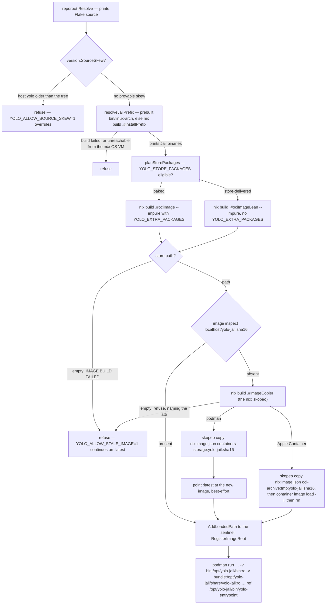

# Image delivery — what the image bakes, and what a launch mounts in

**Status:** CURRENT as of 2026-09-09, verified against `a00ccad5`.

A container jail runs on two things a launch assembles separately. The **image** is a nix-built
OCI image holding nixpkgs tools, the FHS link farm and `/etc` — and, of yolo's own code, nothing
but *names*. yolo's binaries and the flake bundle beside them are the **install prefix**, a host
directory the launch bind-mounts read-only at `/opt/yolo-jail`, and the container argv names
`/opt/yolo-jail/bin/yolo-entrypoint` absolutely. Every launch evaluates the flake; the image is
rebuilt and reloaded only when the store path it evaluates to has moved, is addressed in the
runtime by the hash of that store path, and is delivered by a `skopeo copy` that asks the
destination for each layer before sending it — no archive on either side. A build that ran and failed refuses the launch. Optionally a launch
delivers `packages:` from the mounted nix store instead of baking them, in which case the image
it builds contains none of them.

| Component | Lives in |
| :--- | :--- |
| Image derivations, the install prefix, the name-only links, the image identity | `flake.nix` (`mkOciImage`, `installPrefix`, `jailPrefixLinks`, `imageIdentity`, `goSrc`, `shippedBinaries`) |
| Build, failure report, content ref, layer copy, GC roots | `internal/image` (`AutoLoadImage`, `buildFailureReport`, `JailImageRef`, `ContainersStorageDest`, `BuildImageCopier`, `BuildJailPrefix`, `RegisterImageRoot`, `RegisterPrefixRoot`) |
| Which flake is built, and from where | `internal/reporoot` (`Resolve`, `BundledSourceDirFrom`) |
| The two-cadence skew gate | `internal/version` (`SourceSkew`, `ImageSourcePaths`); `internal/cli/run` (`refuseOnSourceSkew`) |
| Prefix resolution and the two mounts | `internal/cli/run` (`resolveJailPrefix`, `jailPrefixMountArgs`, `prefixUnreachableFromVM`, `JailEntrypointPath`) |
| Store-delivered packages, host half | `internal/cli/run` (`planStorePackages`, `storePackagesEligible`, `addImageExtras`); `internal/darwinpkg` (`MaterializeAt`) |
| Store-delivered packages, jail half | `internal/entrypoint` (`StoreProfilesEnv`, `StorePackagesRoot`, `imageProbePath`) |
| The bundle an install stages | `scripts/stage-source-bundle.sh`, `scripts/build-go.sh` |

**Reads with:** [`nix-across-backends.md`](nix-across-backends.md) (what nix produces for each
backend, and the `macos-user` path that has no image at all),
[`../design/layer-aware-image-delivery.md`](../design/layer-aware-image-delivery.md) (the
in-flight design for making the image's *layer order* the unit of transfer — the one lever this
doc does not own), [`../design/minimal-disk-footprint.md`](../design/minimal-disk-footprint.md)
and [`../design/disk-levers-and-backfill.md`](../design/disk-levers-and-backfill.md) (what
reclaims the images, tars and store outputs this pipeline leaves behind),
[`../reference/jail-home.md`](../reference/jail-home.md) (every other mount).

---

## Invariants

**The image contains none of yolo's own binaries.** `/opt/yolo-jail` is two read-only bind
mounts the launch supplies — the Linux binaries at `bin/`, the flake bundle at
`share/yolo-jail/` — and the image bakes only the two mountpoint directories and one
`/bin/<name>` symlink per shipped binary, pointing into the mount. A commit touching only
`cmd/` or `internal/` moves no image input, so it costs no image rebuild and no delivery.

**The image moves only when an image input moves.** Those inputs are `flake.nix`,
`flake.lock`, and the `packages:` list a launch bakes. `imageIdentity` is a derivation over
exactly the first two, baked into the image and read back out of a loaded one — the oracle
for "is this loaded image built from this flake". Before the binaries left the image, yolo's
own Go source was the trigger behind roughly half of all commits; measured after, a Go-only
edit leaves `.#ociImage`'s store path unchanged.

**A build that ran and failed is fatal.** The launch prints nix's own stderr under a fixed
headline and refuses. It never continues onto a previously loaded image on its own; the
operator has to say the image may be stale.

**The loaded image is addressed by content.** Its runtime name is the repository plus a hash
of the store path it was built from, and that name is written into the archive on the way in.
`:latest` survives only as a best-effort alias for humans and for the degraded fallback that
has no store path in hand; nothing may depend on it by name.

**Nothing writes a tar, and the copy negotiates per layer.** `nix build .#ociImage` yields a
nix2container `image.json` naming its layer digests, and `skopeo copy nix:… containers-storage:…`
asks the destination for each blob before sending it. The one backend that still needs a file is
Apple Container, whose `container image load` takes a path — it gets a TEMPORARY OCI archive the
launch removes itself. There is exactly one delivery mechanism and no way back to the old one;
see ["Delivering into the runtime"](#delivering-into-the-runtime).

**Exactly one package-delivery mechanism is live in any jail, decided per launch.** Either
every declared package is baked into the image, or the image is built with none of them and
the jail links them from the mounted nix store. Never a mixture: a package both baked and
staged silently runs the baked copy, so the unit of the choice is the launch.

**The flake is chosen by name, never by the working directory.** Three sources, in order:
`YOLO_REPO_ROOT`, a bundle beside the running binary, the bundle `just install` staged. Every
container launch prints which one it took before anything expensive runs.

**The two halves deploy on different cadences, and a launch refuses when they provably
disagree.** The jail's `yolo-entrypoint` is built and mounted from the resolved flake source on
every launch; the host `yolo` changes only when a human reinstalls it. A commit that moves a
host↔jail contract therefore skews the machine by default, and the launch refuses before the
build rather than failing three boot steps deep.

## The mounted prefix

**Install prefix** *(coined here — this document is the term's definition)* — the directory
tree a jail's own yolo binaries and flake bundle occupy at `/opt/yolo-jail`: `bin/<binary>` as
real files, `share/yolo-jail/flake.nix`, `share/yolo-jail/flake.lock`, and
`share/yolo-jail/bin/linux-<arch>/<binary>` — the same layout a Homebrew or tarball install of
yolo has on a host, so the exe-relative bundle resolver in `internal/reporoot` finds the flake the
same way inside and outside the jail. Not the image, and not the `/nix/store` mount: it is
whatever host directory pair the launch decided to bind there.

The image keeps two things about it. `fakeRootCommands` pre-creates both mountpoint
directories, because a `--read-only` root filesystem cannot grow one and this is the mount whose
absence costs pid1. `jailPrefixLinks` bakes `/bin/<name>` → `/opt/yolo-jail/bin/<name>` for each
name in `shippedBinaries` — a derivation over the *name list* and nothing else, so it is invariant
across every Go change. Symlinks rather than a PATH entry, because PATH order is spelled in three
independently written places (`BootPath`, the `.bashrc` export, `macosuser.SandboxPath`) and the
links reach the same names with none of them moving — and keep working for a consumer that
scrubs PATH and spells `/bin/yolo`.

The container argv names `JailEntrypointPath` — `/opt/yolo-jail/bin/yolo-entrypoint` —
absolutely, never the bare name. A bare name would resolve on the image's PATH through a
`/bin/<name>` link that now hops through the mountpoint, so a launch that failed to mount would
exec a dangling link and die as "failed to exec pid1" with no mention of the cause. The absolute
path makes the same failure say which path is missing.

Two mounts rather than one, because no host layout holds the prefix shape: a staged bundle keeps
`bin/linux-<arch>/` beside its flake files, not `bin/` beside `share/yolo-jail/`. Restaging into
the prefix shape would copy the binaries on every launch; two `-v` pairs leave the host layout
alone, and the in-jail result is identical because the resolver only ever looks at
`<exeDir>/../share/yolo-jail`. Both are emitted `:ro`; Apple Container ignores that flag, as it
does for every mount.

The prefix is resolved **before** the image build. A live checkout has to compile it, and
discovering that after streaming a multi-gigabyte image would put the cheap failure behind the
expensive success; and a launch that cannot produce the mount has no pid1 to run, so it refuses
before making a container at all.

### Where the binaries come from

**Flake bundle** *(coined here)* — a directory holding `flake.nix`, `flake.lock` and prebuilt
Linux binaries under `bin/linux-<arch>/`. `scripts/stage-source-bundle.sh` produces one for
`just install` (under `paths.FlakeBundleDir`), the release archive and Homebrew ship one beside
the binary, and `installPrefix` bakes one *into* the mounted prefix. Not a checkout: a checkout
has the flake files and no `bin/`.

`resolveJailPrefix` has two arms and no policy beyond them:

- **Prebuilt.** The resolved flake source carries `bin/linux-<arch>/yolo-entrypoint`. The mount
  sources are that directory and the source itself. Every installed bundle takes this arm, and so
  does a nested jail — its flake source is the prefix mounted at `/opt/yolo-jail/share/yolo-jail`,
  which carries prebuilt binaries by construction, so a nested jail never compiles Go for this.
  The existence check is on `yolo-entrypoint` specifically, not on the directory: an empty or
  half-staged `bin/linux-<arch>` is the failure that would otherwise mount cleanly and die at exec.
- **Built.** A live checkout ships none, so the launch runs `nix build .#installPrefix`
  (`BuildJailPrefix`) with a durable out-link keyed by the *source tree*, so rebuilding the same
  checkout replaces one link rather than accumulating one per build. A failed build refuses the
  launch — the image no longer carries a `yolo-entrypoint`, so there is nothing to fall back on.
  The prefix closure is then GC-rooted host-side under its own roots directory
  (`RegisterPrefixRoot`): held by *liveness* — is a container executing from it — and deliberately
  not under the image roots, which are reaped on age. The one test that decides which policy a root
  gets is whether losing it can cost only a rebuild; a running jail losing the file behind its own
  pid1 cannot.

The launch prints which arm it took, beside the flake-source line:

```console
Flake source: /home/me/.local/share/yolo-jail/flake-bundle (flake bundle staged by `just install`)
Jail binaries: /home/me/.local/share/yolo-jail/flake-bundle/bin/linux-amd64 (prebuilt, from the flake bundle)
```

In the flake, `goBinaries` is the same two-way switch: when `./bin/linux-<arch>` exists in the
flake source it copies those binaries; otherwise it compiles every `cmd/*` from the `goSrc`
fileset with the host Go toolchain, `CGO_ENABLED=0 GOOS=linux`, `-trimpath`, and no version
stamp. That cross-compile is why the prefix build needs no macOS offload: on darwin
`installPrefix` is a darwin derivation producing Linux binaries, unlike `.#ociImage`, which is a
Linux image and does have a builder-container path. `installPrefix` then *copies* the shipped
binaries into `opt/yolo-jail/bin/` — not symlinks, because `os.Executable` would resolve a
symlink through to `goBinaries`' own store path, which has no `share/yolo-jail` sibling and would
make the bundle undiscoverable — and copies them a second time into
`share/yolo-jail/bin/linux-<arch>/`, which is what gives a nested jail its prebuilt arm.

The share half is **never the checkout itself**, even though a checkout would satisfy the
resolver. Mounting it would put the whole working tree inside the jail at a second path and let
the in-jail `yolo` build an image from source newer than the binaries it is running — the exact
skew [the gate below](#two-halves-two-cadences) exists to refuse. The built bundle matches the
binaries beside it by construction; an agent that wants the live tree in a nested jail names it
the way the outer launch did, with `YOLO_REPO_ROOT`.

> [!WARNING]
> **The `goSrc` fileset is the filter, one layer over from where it used to bite.** The hermetic
> Go build sees only `go.mod`, `go.sum`, `vendor/`, `cmd/`, `internal/` and `packs/`. A top-level
> Go package outside that set vanishes from the **mounted prefix** while `go build ./...` stays
> green, and the moment anything under `cmd/` imports it the nix build fails with "cannot find
> module providing package". Add it to the fileset by hand. `packs/` is the live example of an
> explicit entry.

> [!WARNING]
> **`shippedBinaries` is a second filter of the same silent class.** `goBinaries` compiles every
> `cmd/*` directory; only the names in that list are copied into the prefix, and only those names
> get a `/bin/<name>` link. A new `cmd/` binary missing from it — or from
> `scripts/stage-source-bundle.sh`'s `SHIPPED_BINARIES` — vanishes from the jail or from a shipped
> bundle with no build error. `goprobe` is the one deliberate omission, which is exactly why an
> accidental one looks identical to it; `internal/entrypoint/shippedclients_test.go` pins the
> spellings together.

### The security delta

What executes in the jail — pid1 included — used to be immutable image content, addressed by
the image's own content hash. It is now a host directory that changes with **no rebuild and no
reload**: editing the staged bundle changes the next launch's `yolo-entrypoint`, and the image's
content hash no longer witnesses it. That mutability *is* the feature — it is what makes a
Go-only commit free — and it was traded deliberately, in the open.

What it does not move is the host trust boundary: a host that can write
`~/.local/share/yolo-jail` could already replace the `yolo` that builds the argv. What it does
spend is reproducibility. A jail's binaries are now only as pinned as the directory mounted in —
a nix-built prefix is an immutable store path, a staged bundle is not — where they used to be as
reproducible as the image. The mount is read-only from inside, and the launch prints which
directory it took, so the choice is visible without inspecting the argv.

> [!WARNING]
> **This is not the retired `/opt/yolo-jail/dist-go` dev-override, and must not become it.**
> That was a *second* copy of the binaries bind-mounted over a *baked* one, so a stale binary
> could silently shadow a fixed one and a fixed jail looked broken. There is no baked copy now:
> one copy, named absolutely, and a missing mount fails saying which path is missing. Do not add
> a second delivery path for the binaries — a copy under `$HOME`, a fallback to the image, a
> PATH entry for the prefix — in the name of convenience.

### macOS and the runtime VM

Podman on macOS runs containers in a VM that shares the user's home and `/private`, and not
`/nix`. yolo has always known this — `shouldMountHostNix` skips the nix store and daemon-socket
mounts on macOS for exactly that reason, unless `YOLO_NIX_HOST_DAEMON` says the VM does share
`/nix`. The mounted prefix made yolo's own binaries a bind mount too, and a **live checkout's**
prefix is a nix build, so it lives in `/nix/store` — the one tree the VM cannot see. Measured on
hardware: podman failed every such launch before pid1 ran, as

```text
Error: statfs /nix/store/…-yolo-jail-install-prefix/opt/yolo-jail/bin: no such file or directory
```

with exit status 125. `prefixUnreachableFromVM` now refuses that launch on darwin, on the
*result* of prefix resolution and regardless of which arm produced it, when either mount source
is under `/nix/store` and `YOLO_NIX_HOST_DAEMON` is not truthy — naming both fixes: share `/nix`
with the VM (`podman machine init -v /nix:/nix`, a fresh machine) and set the variable, or
launch from an installed bundle, which stages prebuilt binaries under `$HOME` and builds nothing
in the store. The variable is reused rather than a new dial added because it already means
precisely "my runtime VM shares `/nix`", and setting it also turns the nix-delegation mounts on —
the same claim about the same VM. The macOS nightly initialises its machine with `-v /nix:/nix`
and sets the variable, so CI exercises the documented fix rather than routing around it. An
installed bundle is unaffected, which is every Homebrew and `just install` user.

The refusal is keyed on darwin, not on the runtime, so Apple Container gets it too. That
backend's prefix mount has **not** been exercised on hardware; podman on Linux (including the
nested jail this repo develops in) and macOS podman with `/nix` shared are the two measured
arms. `macos-user` needed nothing: it runs no container, loads no image, and its `yolo` is the
host's own binary. See [`../guides/macos.md`](../guides/macos.md#the-same-rule-now-decides-whether-a-live-checkout-can-launch-at-all).

### Two halves, two cadences

`reporoot.Resolve` picks the flake source without reading the working directory: the
`YOLO_REPO_ROOT` override (validated to hold `flake.nix` or `go.mod`), then a `share/yolo-jail`
bundle beside the running executable (Homebrew, the release archive, and the in-jail mounted
prefix — one exe-relative method serving every checkout-less channel), then the bundle
`just install` staged under yolo's state dir. Each launch reports the result as
`Flake source: <path> (<what selected it>)` in its first phase, before staging and the nix
build, so there is still time to interrupt. The cwd used to outrank every bundle, which meant
one `yolo` built the image from a live tree in one directory and from an install-time snapshot
in the next, and the banner could not tell you which; it was also the only way the two halves
below could disagree by accident. A from-source developer therefore gets the **staged bundle**
even when standing inside the checkout — `just install` is how an image or Go change is
delivered, and `YOLO_REPO_ROOT` is how a live tree is asked for by name.

The two halves: the jail's `yolo-entrypoint` and image are produced from the resolved flake
source on every launch; the host `yolo` changes only at `just install`. Only `YOLO_REPO_ROOT` can
name a live checkout, so it is the only resolution that can skew at all — both bundles ship
*with* the binary and can never be older than it. `version.SourceSkew` compares the binary's
build-time commit stamp against the tree's HEAD, through `ImageSourcePaths` only — the `goSrc`
fileset plus the two flake files, pinned to the flake's own fileset by a test — and
`refuseOnSourceSkew` stops a container launch before the build, naming `just install` and the
path of the binary that refused (a reinstall that landed somewhere PATH does not reach first is
the other cause, and only the path tells them apart). It is silent by design for a docs-only
commit (HEAD moved, no image input did), for uncommitted work (HEAD has not moved, and the
by-path verification build stamps the fresh binary with the same HEAD), and for anything it
cannot prove — an unstamped binary, a stamp naming a commit this repo lacks, no git. A skew it
cannot prove is not one it reports. `macos-user` is exempt: no image, no second binary, nothing
to skew.

The stamp comes from `scripts/build-go.sh` and `just install` (`-ldflags -X` into
`internal/version`); the from-source nix build stamps nothing, which is why the in-jail binary
of a live-checkout nested jail never trips the gate.

## What the image bakes

What must be image content is what is needed before any yolo code runs, or what must resolve on
the image's own `PATH=/bin:/usr/bin`, or what is a literal store path burned into the image
config. The pattern throughout: **the image bakes a stable name and the launch or the boot
supplies the content.**

| Content | Why it is image content |
| :--- | :--- |
| The `/opt/yolo-jail/{bin,share/yolo-jail}` mountpoints and the `/bin/<name>` links | A `--read-only` rootfs cannot grow a mountpoint; the links are the only knowledge the image has of yolo's binaries, and they depend on the name list alone |
| `imageIdentity` at `/etc/yolo-jail-image-identity`, and the image labels | The staleness oracle for the flake's decisions; the owner label is how the image reaper proves a tag-less image is yolo's |
| `bash`, `sh`, `env`, coreutils under `/bin` and `/usr/bin` | Generated scripts and the runtime's exec path need a shell in the rootfs |
| nix-ld at `/lib/ld-*` and `/lib64/ld-*`, and its fallback library dir | A `PT_INTERP` is an absolute path in every FHS binary, not a PATH entry; the fallback dir is the only library search path a scrubbed environment gets |
| `/etc/passwd`, `/etc/group`, `/etc/containers/*`, `/etc/subuid`, `/etc/subgid` | Read by podman before and independently of yolo; nested-podman config on a read-only root |
| `config.Env` — `SSL_CERT_FILE`, `LD_LIBRARY_PATH`, `TZDIR`, `PATH` | Literal store paths in the image config; moving `cacert` or `tzdata` means moving these |
| The `/etc` **symlinks** into `/run` for `localtime`, `timezone` and `ld.so.cache` | The link is baked because `/etc` is read-only; the boot writes the target — the pattern in production |
| The nixpkgs package sets (`corePackagesFromNixpkgs`, and `fullPackages` unless the launch opted out) | Nearly all of the closure by bytes, invalidated only by `flake.lock` |

The image has three variants from one `mkOciImage`: the default, the **lean** image
*(coined here)* — the default without `fullPackages` and without the chromium half of the
`/lib` farm, for a launch that delivers those from the store — and CI's minimal variant, which
also drops the nested-podman config and is never a run-path image. The lean image is a second
flake attribute rather than another environment switch, because the point of store delivery is
to take variability *out* of the image derivation.

## What a launch delivers

Everything mutable already arrives at launch or at boot, and this is the larger set: the
workspace and home mounts with their writable anchors, the nix store and daemon socket where
[eligible](#store-delivered-packages), `/ctx/*` (podman creates a nested mountpoint under `/ctx`
on demand even under `--read-only`, so a new `/ctx` consumer needs no flake edit), `/mise`, the
staged packs; and, generated every boot by `internal/entrypoint`, the blocker and launcher
directories, `.bashrc`, the MCP wrappers, the `ld.so.cache` and timezone files under `/run`,
and every pack surface. Agent CLIs install into the writable npm prefix, mise tools into `/mise`;
only `mise` itself is baked. Which of these is in the image is documented in
[`../reference/jail-home.md`](../reference/jail-home.md) and
[`../design/program-delivery.md`](../design/program-delivery.md); this doc owns the two that are
about the image itself — yolo's binaries, above, and `packages:`, below.

## The build and load pipeline



Every container launch runs the nix build; the run path never skips it (`SkipBuild` is a dormant
seam). When the derivation's output already exists the build is a no-op evaluation costing
low single-digit seconds, so a warm launch pays only that. Every flake-evaluating nix call
carries `NixFlakeFlags` — the experimental-features flags and `--accept-flake-config`, so the
flake's own declared binary cache is honoured — and every build goes through one argv builder,
so a `yolo check` preflight and a run cannot drift on flags. `--impure` is passed for every
attribute, including ones that read no environment, because the flake as a whole reads
`YOLO_EXTRA_PACKAGES` and one spelling is worth more than a shaved evaluation.

### What moves the image

The store path `.#ociImage` (or `.#ociImageLean`) evaluates to moves when `flake.nix` moves,
when `flake.lock` moves, or when the `packages:` list threaded in through `YOLO_EXTRA_PACKAGES`
changes — and for nothing else. In particular it does not move for a commit under `cmd/` or
`internal/`, and it does not move for `just install`: the staged bundle's binaries carry a
`git describe` stamp that changes with every commit and every dirty tree, but stamped bytes are
prefix content, not image content, so two bundles differing only in their binaries evaluate to
the same image and to different prefixes. The bundle path and a source checkout now agree on the
image byte for byte.

A **reload** happens only when the runtime lacks the image for the resulting store path. The
decision is `image inspect <content ref>`; the load sentinel only explains *why*.

### A failed build is fatal

`AutoLoadImage` distinguishes a build that **ran and returned no store path** from a build that
was never attempted, and only the first is a failure. On failure it prints `buildFailureReport`:
the headline `IMAGE BUILD FAILED`, nix's own stderr tail first — whatever else the report gets
wrong, the line that says what broke has to reach the human — then the classifier's diagnosis
and remedy (the same `nixdiag` classifier `yolo check` uses, so the "needs a Linux builder" text
matches), then the refusal, which names the escape hatch. With `YOLO_ALLOW_STALE_IMAGE` set to
any non-empty value the same report is printed and the launch continues, saying loudly that it
is running on a stale image; only then does the degraded branch ask whether *an* image is present
under the legacy `:latest` name, and failing that, load the newest tar `newestTars` finds in the
image cache — a reader that still works on whatever files exist, though nothing on podman writes
them any more.

The defect this replaces: the fallback used to fire silently, print "Using existing image", and
launch a working-looking jail on the *previous* image, so a failed `packages:` build surfaced as a
lib-farm assertion two layers from its cause. The rule the report enforces is that a run may end
up on an image this invocation could not rebuild, but it must never *look successful* while
silently stale. The escape hatch is what makes the rule affordable rather than a weakening of it:
the developer who takes it has said the image is stale, which is precisely the knowledge whose
absence caused the bug — refusing costs a rerun with one variable, continuing costs an
investigation at the wrong layer. A missing flake is fatal for the same reason, with the same
shape of fix named.

> [!WARNING]
> **`SkipBuild`'s silence is deliberate — do not "fix" the asymmetry.** No build was attempted,
> so there is no failure to report and the degraded path runs as before. Warning there would train
> the reader to ignore the warning. Likewise the gate is an environment variable and not a TTY
> test: what makes a stale run safe is not who is running but that somebody *said* the image may
> be stale.

### The content-addressed image ref

**Content ref** *(coined here)* — the runtime name of a loaded jail image, `JailImageRef`:
the repository (`localhost/yolo-jail`, unqualified on Apple Container) plus a tag that is the
first sixteen hex characters of the SHA-256 of the store path it was built from. Not the `:latest`
tag, and not the store path itself. The same sixteen characters key the store path's durable GC
root under the image roots directory, its transient archive on the backends that need one, and
its legacy cache-tar name — so a reaper can correlate a loaded image, its root and its files with
no reverse lookup, and they can never drift apart.

The image is **named on the way in**, and since layer-aware delivery that is STRUCTURAL rather
than won. nix2container's `image.json` carries no repo:tag at all, so the copy's destination argv
is the only name an image can get: `containers-storage:<content ref>` on podman/Linux, and the
`<ref>` half of an `oci-archive:`/`docker-archive:` destination on the backends whose loader takes
a file. There is no baked `:latest` left for a post-load retag to read. (`StreamRepoTag`, which
bought the same property by overriding the stream archive's `RepoTags`, is deleted with the
stream.) Naming it *after* the load — `podman tag :latest <ref>` — read a shared mutable name a
second time with nothing serialising loads across workspaces, and a concurrent launch of a
different config could move `:latest` in between; the loser then bound its content ref to the
winner's image, and because the binding is a permanent name the wrong image would run forever.
`pointLatestAt` moves the `:latest` alias onto the new image *downstream* and best-effort, so a
failure there costs a stale `podman images` listing and nothing else, and the degraded branch
above still has a name to ask about.

The load decision belongs to the runtime, not to the sentinel. The **load sentinel** *(coined
here)* — `build/last-load-<runtime>`, an ordered list of the ten most recently *used* store
paths per runtime — used to be the authority: "is `:latest` the image this store path built" was
answered by comparing against its newest entry. It survives, demoted to two jobs it is still the
right instrument for: the three-way diagnosis printed when a load is needed (first run; sentinel
claims loaded but the ref is missing, so storage was reset or pruned; store path changed), and
the liveness ledger the image reaper reads to protect a live jail's closure. It is appended on
*every* successful launch, not only on a load, because several images now stay loaded at once and
a jail can legitimately run one whose load was many launches ago.

> [!WARNING]
> **Do not "simplify" this back into an LRU-membership test on `:latest`.** While one tag named
> every image, equality against the newest sentinel entry was the least-wrong answer, and
> membership across the history was wrong: nix builds are content-addressed, so reverting a config
> can reproduce a store path still in the history while a different, newer path has since become
> `:latest`. That is a description of not knowing what `:latest` is. Content addressing dissolves
> the question — when the ref *is* the hash, "is this ref present" has no ambiguity left.

> [!WARNING]
> **The container image tag is not a public surface.** Anything that hardcodes
> `localhost/yolo-jail:latest` is a bug, not a compatibility constraint. Code that wants "the jail
> image" in general filters by the *repository*, as `internal/prune` does. The cachix caveat that
> accompanied this ruling is about the **nix binary cache** — addressed by store path — and grants
> no licence over a flake attribute or the substituter config.

Per-config content tags armed a prune pass that had never fired. `PruneOldImages` filters by
repository and removes with `rmi -f`; while one tag named everything the query returned one row
and the global keep-window of the day could select nothing (that window is gone — see [`OQ-LS3`](../design/the-load-sentinel-is-not-a-liveness-oracle.md#111-decision-ledger)). With a row per name it could select a second workspace's live
image, so the same change deduplicated by image ID and added a liveness veto read from the
sentinel, later hardened to decline when the ledger cannot be read. The retention *number* and
its trigger belong to [`../design/minimal-disk-footprint.md`](../design/minimal-disk-footprint.md).

### Delivering into the runtime

**The image is a manifest and the delivery is a copy that negotiates.**
`nix build .#ociImage` realizes a nix2container `image.json` naming each layer's digest, size
and store paths; nothing is archived at build time. `BuildImageCopier` realizes `.#imageCopier`
— a skopeo carrying nix2container's `nix:` source transport, which stock skopeo does not have —
and the launch runs `skopeo --insecure-policy copy nix:<image.json> <destination>`.
`containers-storage` is asked for each blob before it is sent, so a layer already present costs
a digest lookup instead of its bytes.

Four properties, each a requirement rather than an observation:

- **The destination ref is an argument**, so the image is still named on the way in — and now
  structurally: `image.json` carries no repo:tag at all, so the argv is the only name an image
  can get and there is nothing left for a post-load retag to race.
- **No archive exists at any point** on the podman path. This is strictly stronger than the
  streamed load it replaced, which wrote no tar of *yolo's* but still cost `podman load` a
  full-size spool to `/var/tmp` before it parsed anything.
- **The copier is resolved by store path, never by `PATH`.** An unpatched skopeo rejects the
  `nix:` transport in a way that reads as a broken image rather than as a wrong binary. It is
  built lazily, only on a launch that is about to copy, and is a SOURCE build no public cache
  serves (measured 2026-09-09: 2m27s cold against this flake's nixpkgs, 0s warm).
- **A failed copy is retried exactly once and then abandons the launch.** There is no legacy
  streamer, no env var, and no fallback — an escape hatch is for a config the user broke, not
  for yolo's own mechanism being broken, and a second path no launch exercises is broken by the
  time anyone reaches for it. `YOLO_ALLOW_STALE_IMAGE=1` still launches the image already
  loaded, which is orthogonal to how the next one is delivered.

The launch prints the split, because the ratio is the whole claim:
`Copied image: 1 layer(s), 26 MB copied; 91 layer(s), 3.2 GB already present`. The figures come
from the manifest's layer sizes minus the digests `podman image inspect` reports for the jail
images already present; the copy itself consults neither, so a wrong figure changes a printed
number and no behaviour.

**Apple Container gets the layer plan and the deleted intermediate write, not the reuse.** It
has no `containers-storage`, so the copy writes an `oci-archive` and `container image load -i`
reads it back. Before this it wrote TWO full-size files per load — a docker-archive from the
stream script, then an OCI tar converted from it — and needed a skopeo or a podman on `PATH` to
convert between them. The archive is now temporary, under a name `newestTars` cannot match, and
removed by the launch: keeping it in the image cache would let the degraded fallback load it and
then claim `:latest` for an image named by its content ref. ⚠ **Unverified on hardware** — see
[`../design/layer-aware-image-delivery.md`](../design/layer-aware-image-delivery.md).

`created` is a **constant** (`0001-01-01T00:00:00Z`): nix2container `time.Parse`s the value, so
the `created = "now"` the flake used to pass would fail the nix build, and a build-time timestamp
would make the derivation vary per build and destroy content addressing. Two consequences.
Re-delivering the *same* store path no longer mints a new image ID, so the duplicate-row class
the reaper used to price is gone. And every yolo-jail image now reports the same `CreatedAt` —
which was the sort key prune's keep window ordered by, until
[`OQ-LS3`](../design/the-load-sentinel-is-not-a-liveness-oracle.md#111-decision-ledger) deleted
that window outright and made `protected` the entire retention rule.

On success the launch records the store path in the sentinel and, host-side only, registers a
durable GC root for the image closure (`RegisterImageRoot`) so a `nix-collect-garbage` cannot
delete the running jail's closure. From inside a jail the gcroots directory is not mounted and
the host daemon prunes a root pointing into a jail's home as stale, so in-jail the seam is a
no-op — the same rule the prefix root and the package-profile roots follow.

## Store-delivered packages

**Store delivery** *(coined here)* — delivering a launch's `packages:` (and, with the lean
image, the image's own bulk extras) by realising nix `buildEnv` profiles on the host and linking
their contents into the jail from the bind-mounted `/nix/store`, instead of baking them into the
image. Not the `macos-user` profile mechanism it reuses (that backend has no image to leave them
out of), and not a partial migration: the image an opting-in launch builds contains none of them.

**The dial** is the environment variable `YOLO_STORE_PACKAGES`, truthy per the launcher's one
spelling of "yes" (`1`, `true`, `yes`). An environment variable rather than a config key because
what it selects is a property of the *machine* and of this launch, while `packages:` is
workspace-scope by ruling; it sits beside `YOLO_NIX_HOST_DAEMON` and `YOLO_NO_HOST_LOOPBACK` and
is read the same way. **Eligibility** (`storePackagesEligible`) is podman, a Linux host, and a
host whose nix daemon socket and store the launch will bind-mount — the *same* predicate the
assembler uses to decide whether to emit those mounts, passed in rather than recomputed, so a
launch cannot promise store delivery and then omit the store. Apple Container cannot bind-mount
the host store at all, and a macOS podman's VM shares no store, so both keep baking. A launch
that asks and is not eligible **falls back to baking and says so** — baking still yields a jail
with every declared tool, so refusing would cost a working launch over a preference about where
bytes live; what is not acceptable is doing it silently. A declared package that has no build for
the jail's platform is **fatal**, matching the `macos-user` ruling: a typo and a genuinely
unavailable package are indistinguishable at that point, and an opt-in image does not contain the
package either.

**The host half** realises the workspace's `packages:` into one `buildEnv` profile through
`darwinpkg.MaterializeAt` — the `macos-user` package mechanism, reused verbatim — with a
content-keyed out-link under the package-roots directory as its GC root. Content-keyed, not a
fixed leaf, because several workspaces with different lists are live at once and a fixed leaf
would let one launch unroot the closure another jail is executing from. Then, for the lean image,
it realises `.#yoloImageExtras` — `fullPackages` plus the chromium graphics stack plus
fontconfig's configuration output — and **appends** it behind the workspace profile, so the jail's
first-wins farm reproduces the precedence a baked image already gives a workspace's own version of
a tool yolo also ships. The extras derivation forces no environment read, and that purity is the
point: a lean image that varied with the environment would multiply the way baked `packages:`
images do.

**The one line that is the whole rule** is in `autoLoadImage`: an active plan passes *no*
`ExtraPackages` to the image build and selects `ImageAttrLean`. The image stops depending on
`builtins.getEnv`, so an opting-in machine holds **one image** however many workspaces declare
however many lists.

**The jail half** reads `YOLO_STORE_PROFILES` — a colon-separated, precedence-ordered list of
profile store paths (a store path's name can never contain a colon) — and builds a symlink farm
at `/run/yolo/packages`: each profile's `bin` into one PATH directory, its `lib/lib*.so*` into one
`LD_LIBRARY_PATH` directory, its `lib/pkgconfig/*.pc` into one `PKG_CONFIG_PATH` directory,
first-wins. A fixed directory rather than the profiles' own paths, because five things name the
location — `BootPath`, the `.bashrc` copy of it, the launcher-collision probe, ldconfig's scan
list and `LD_LIBRARY_PATH` — and a store hash in any of them is a value that must be threaded
and can drift. `/run` is a tmpfs, so the farm is writable under the read-only root and starts
empty every boot, which is the right lifetime for something derived entirely from this launch's
environment. Its PATH position is **immediately before `/bin`** — where a baked package already
resolves — so opting in moves no precedence relation: blockers, launchers and every per-project
install prefix still outrank it. The farm's targets resolve only because the launch bind-mounts
`/nix/store`, which is why the host decides eligibility and the jail does not: from inside, "this
host cannot share its store" and "the operator did not opt in" are the same observation.

Two consequences the lean image has, both handled at boot. Chromium is no longer at
`/usr/bin/chromium` — the MCP chrome wrapper resolves it, baked path first, then PATH — and
`/etc/fonts` is gone while the image still bakes `FONTCONFIG_FILE=/etc/fonts/fonts.conf`, so the
boot writes a small `fonts.conf` on `/run` that includes the profile's own and adds its fonts
directory; a no-op whenever the image's `/etc/fonts` exists, so every baked jail is untouched.
The chromium half of the `/lib` farm had to leave the lean image too, and keeping it would have
saved nothing: nix registers a derivation's references by scanning its output for store-path
strings, and a symlink's *target* is scanned, so a farm linking `${chromium}/…` drags chromium into
the closure whether or not it appears in `contents`.

> [!WARNING]
> **A name that leaves `/bin` becomes shadowable by a pack's launcher, and that is handled, not
> avoided.** Boot-written directories cannot shadow the image by position, but a store-delivered
> tool is not in the image. `imageProbePath` counts the farm — gated on the profile *declaration*,
> not on the directory's existence — so the launcher-collision check declines to write a launcher
> for a name the launch delivers. This does not widen the check the way its header warns against:
> nothing *installs* into the farm, so counting it can never make a launcher stop being written
> after its own first success.

> [!WARNING]
> **A scrubbed `LD_LIBRARY_PATH` loses a store-delivered library, exactly as it lost a baked
> user library.** nixpkgs' `ld.so` never reads the FHS `ld.so.cache`, so both `/lib` and
> `/run/yolo/packages/lib` are discoverable only through the variable. The nix-ld fallback
> directory stays baked and stays the core trio; growing it is an explicit call.

Two package-delivery mechanisms are maintained on purpose. That asymmetry is the accepted price
of the ruling that store delivery is an opt-in fast path with the baked path retained; the
alternative — make store delivery *the* mechanism and document the backends that cannot — is
not live.

## Cost model

This section keeps the shape of the measurements that decided the design and the magnitudes a
maintainer needs to reason about a change; every figure was taken on one development machine
(a Linux host with a nested podman) during 2026-08 and 2026-09, and the *ratios* are what to
rely on, not the absolutes.

**The build is cheap and the delivery is not.** The image closure is a few gigabytes, and nixpkgs
is about 97 % of it; everything yolo builds itself was about 3 % and is now not in the image at
all. A rebuild's nix phase is a handful of metadata derivations plus, before the mounted prefix, a
Go build — seconds. What costs is moving the result into the runtime.

**Why a rebuild USED TO cost what it did — the layer chain.** Everything in this paragraph is the
diagnosis that
[`../design/layer-aware-image-delivery.md`](../design/layer-aware-image-delivery.md) acted on, and
the numbers below are the BEFORE column: the layer plan and the negotiating copy shipped
2026-09-09, and a `flake.nix`-only edit now moves ONE layer of 26 MB out of 92 in about two
seconds (measured, one host, overlay driver). Read on for why that was 3.5 GB and tens of seconds.
`streamLayeredImage` assigned store paths
to layers by a popularity ordering, capped at a hundred layers, and the overlay storage podman
uses keys a layer by its **parent chain**, not by its own digest. So a change to one store path
re-partitions the layer assignment somewhere in the middle of the chain, and every layer behind
the first moved one is stored again even though its bytes are identical: measured on a Go-only
rebuild, two of ninety-nine digests changed, the first at position seventy-eight, and podman
stored roughly **2.7 GB** of layers to deliver a closure delta of tens of kilobytes — while the
whole stream, about 3.5 GB, crossed the pipe. That per-rebuild figure, not the tag count, is what
fills a podman image store; a day of nested-jail verification launches minted tens of gigabytes
of it. The time splits the same way: for one such rebuild the nix build was about 8 s and the
stream-plus-`podman load` about 26 s — load is about three times the build, and podman's own
write share alone exceeded the entire build phase. A cold launch is tens of seconds against a
warm launch of a few.

> [!WARNING]
> **Do not re-derive "layers dedup, so a rebuild is cheap" from the digest count.** `podman load`
> skipped only the layers *before* the first moved one. Ninety-seven of ninety-nine digests being
> identical is compatible with re-storing most of the image. The lever is the layer *order*; it is
> owned by [`../design/layer-aware-image-delivery.md`](../design/layer-aware-image-delivery.md),
> and as of 2026-09-09 it is PULLED — yolo's own content is pinned to one top layer by
> construction rather than by the popularity contest's accident. **The parent-chain fact itself is
> unchanged**, which is exactly why the plan puts the volatile tier on top: reuse still covers the
> chain prefix and nothing above it.

Taking the binaries out of the image removed the trigger behind roughly half of all commits;
what still moves the image is `flake.nix` and `flake.lock` — measured at one commit in several
hundred, and none — and `packages:`.

### One image per distinct packages list

`packages:` reaches the flake as `YOLO_EXTRA_PACKAGES` read through `builtins.getEnv`, which is
why every image build is `--impure` and why one package added to the list produces a distinct
image derivation. A different package closure re-cuts the layer assignment from much lower down
than a Go change did — roughly forty percent of digests change, not two — so each distinct list
costs about **3 GB** of podman storage, coexisting under its own content tag. Before content
addressing there was exactly one tag, and two workspaces with different lists reloaded the whole
image on every alternation, forever; an alternation now costs one `image inspect`. Store
delivery removes the remaining cost at the root, for the launches that opt in, by taking the
list out of the image derivation entirely.

> [!WARNING]
> **The cross-workspace cost was never an argument for making `packages:` user-scope.** It was
> proposed and refused: fix the cost, never the scope. Scope gates exist for host *access*
> (`packs`, `host_files`); `packages:` grants a *tool*, which an agent inside the jail can already
> install, and a repo declaring its own toolchain is the feature. Do not re-derive the scope change
> from the paragraph above.

### The tars that are no longer written

Before streaming, every load materialised the image to a tar in the image cache and read it
back, and the tars were **retained**: on one machine, a hundred and twenty-five of them — over
400 GiB — accrued in twenty-four days, growing by roughly 16 GiB a day, with a `yolo prune` hint
firing and nothing acting on it. That was ruled a bug, not a configuration: the target is
*minimal* disk, not bounded, yolo may delete cached tars without `--apply`, and the shipped GC
work at the time had made a collection *safe* without making one *happen*. Streaming stopped the
creation on podman and swept nothing; the backlog, Apple Container's one-tar-per-store-path, and
every other store this pipeline fills are
[`../design/minimal-disk-footprint.md`](../design/minimal-disk-footprint.md)'s and
[`../design/disk-levers-and-backfill.md`](../design/disk-levers-and-backfill.md)'s.

Two stores the pipeline fills and does not itself collect: podman's image store, reaped by
`PruneOldImages` on the launch path (debounced, vetoed by liveness, opt out with
`YOLO_NO_AUTO_IMAGE_REAP`), and yolo's own `*-install-prefix` and `*-go-0-dev` outputs in
`/nix/store`, of which one out-link per checkout roots only the newest.

## The binary cache

The flake declares `yolo-jail.cachix.org` as an extra substituter, and `--accept-flake-config`
on every flake-evaluating call is what lets nix honour it; without the flag nix prints "ignoring
untrusted flake configuration setting" and rebuilds from source a closure that already exists in
the cache — worst on macOS, where a from-source Linux image build cannot run locally at all, so
"build failed" meant only that the cache was never asked. The flag goes only on invocations that
evaluate the flake; `nix store gc`, `nix path-info` and `nix copy` take a store path and have no
flake config to accept.

What the cache reaches: first-run cost on a new machine or CI runner, and the `flake.lock` bump —
the one case where the nixpkgs half moves. That half is also what `cache.nixos.org` can
substitute, which is why `imageClosureRoot` names exactly the nixpkgs half of the image's
contents: the weekly `flake.lock` diff over it is a download rather than a build. What it
cannot reach: a from-source build of uncommitted local
code, which has never existed anywhere; and every `packages:`-bearing image, because CI publishes
only the stock attributes, so a baked `packages:` user is a cache miss by construction. Store
delivery is what makes the cache useful to them — complements, not alternatives. `macos-user` has
no image and nothing to substitute.

## Backends

| Backend | Image | yolo's binaries | `packages:` |
| :--- | :--- | :--- | :--- |
| podman on Linux | `skopeo copy nix:… containers-storage:…`, layer-negotiated, no archive | two `:ro` mounts; prebuilt or `nix build .#installPrefix` | baked, or store-delivered on opt-in |
| podman on macOS | the same copy; ⚠ the storage lives inside the Podman Machine VM, which does not share `/nix`, so this backend is the one open question the copy inherits ([`../design/layer-aware-image-delivery.md`](../design/layer-aware-image-delivery.md)). The nix build may offload to a builder container | same mounts; a built (store-path) prefix is refused unless the VM shares `/nix` and `YOLO_NIX_HOST_DAEMON` says so | baked (no shared store) |
| Apple Container | `skopeo copy nix:… oci-archive:…`, then `container image load -i`, then the archive is removed — one write instead of two, and nothing retained; ⚠ unverified on hardware | same mounts, `:ro` ignored; not exercised on hardware | baked (cannot bind-mount the store) |
| `macos-user` | none | the host's own binary | a `buildEnv` profile on PATH — [`nix-across-backends.md`](nix-across-backends.md) |

## Non-goals

- **Layer order as the unit of transfer.** The measured finding that load dominates and that the
  chain re-stores everything behind the first moved layer is upheld; the mechanism is
  [`../design/layer-aware-image-delivery.md`](../design/layer-aware-image-delivery.md)'s, and no
  build authorisation for it lives here.
- **Disk reclamation** — which images, tars, roots and store outputs get deleted, when, by whom:
  [`../design/minimal-disk-footprint.md`](../design/minimal-disk-footprint.md) and
  [`../design/disk-levers-and-backfill.md`](../design/disk-levers-and-backfill.md). Where they
  state a retention number, they win.
- **Image content policy.** Whether `chromium` or `gcc` belongs in a jail is a product question;
  the lean image only changes where they are delivered from.
- **The `macos-user` backend**, beyond being the existence proof store delivery reused —
  [`nix-across-backends.md`](nix-across-backends.md).
- **Skipping the build when nothing moved.** A cheap `nix eval` gate before the build was
  considered and rejected: it saves about a second on a path that costs seconds to minutes
  elsewhere, and the cheap oracle is invariant under exactly the `flake.lock` change that matters.

## Why it's this way

Rulings a maintainer reading only the normative text above might undo on purpose. IDs are the
ones cited from sibling docs and code comments and are never renumbered.

| ID | Ruling | Date |
| :--- | :--- | :--- |
| OQ-1 | Store delivery ships as an **opt-in fast path with the baked path retained**, and "retained" is per *launch*, never per package — two mechanisms, accepted deliberately. | 2026-08-25 |
| OQ-2 | A build that **ran and failed** is fatal: the classification and nix's own stderr are printed and the launch refuses. The opt-out is `YOLO_ALLOW_STALE_IMAGE=1`, not a TTY test; `SkipBuild`'s silence is untouched. This knowingly diverges from [`../reference/gate-placement-principle.md`](../reference/gate-placement-principle.md)'s "tell a human from a pipe": what makes a stale run safe is that somebody *said* it may be stale. | 2026-08-15 |
| OQ-3 | **Content-addressed image tags**; the LRU-membership variant on `:latest` is refused. `localhost/yolo-jail:latest` is not a public surface. The "making cachix useful" caveat concerns the nix binary cache, a different surface. | 2026-08-25 |
| OQ-4 | **`packages:` stays workspace-scope** — "yes, has to be". Fix the cost, never the scope. | 2026-08-25 |
| OQ-5 | Retained image tars are a **bug**, not a configuration; the goal is minimal disk; yolo may delete cached tars without `--apply`. Executed in [`../design/minimal-disk-footprint.md`](../design/minimal-disk-footprint.md). | 2026-08-25 |
| OQ-6 | A stable layer chain gets built by a **successor mechanism**, not by reordering `streamLayeredImage`, which cannot express a written layer plan; never a `fromImage` base, which re-emits the base layers into the stream. The go/no-go moved to [`../design/layer-aware-image-delivery.md`](../design/layer-aware-image-delivery.md) — and was GRANTED and BUILT there on 2026-09-09: nix2container plus a three-tier layer plan plus a negotiating `skopeo copy`, with `streamLayeredImage` deleted from the jail image in the same change. | 2026-09-08 |
| OQ-7 | **Do not strip the `git describe` stamp from the bundle's binaries.** The stamp no longer moves the image (stamped bytes are prefix content), so removing it would buy a cheaper `runCommand` at the price of the fallback the in-jail version banner keeps. | 2026-09-06 |
| OQ-8 | yolo's own binaries are delivered by **mount**, on all three backends in one pass, and the [security delta](#the-security-delta) is the accepted price. | 2026-09-06 |

## Current values

Verified at `a00ccad5`. The prose above says what each is for; this table is the only place the
values themselves are stated.

| Value | Setting | Defined in |
| :--- | :--- | :--- |
| Prefix mount destinations | `/opt/yolo-jail/bin`, `/opt/yolo-jail/share/yolo-jail` | `JailPrefixBinDir`, `JailPrefixShareDir` (`internal/cli/run/jailprefix.go`) |
| Container argv entrypoint | `/opt/yolo-jail/bin/yolo-entrypoint` | `JailEntrypointPath` (`internal/cli/run/jailprefix.go`) |
| Prebuilt binaries in a bundle | `bin/linux-<GOARCH>/` | `prebuiltBinDir` (`internal/cli/run/jailprefix.go`); `prebuiltBinDir` (`flake.nix`); `scripts/stage-source-bundle.sh` |
| Shipped binary set | 7 names; `goprobe` excluded | `shippedBinaries` (`flake.nix`); `SHIPPED_BINARIES` (`scripts/stage-source-bundle.sh`) |
| Go fileset the image build sees | `go.mod`, `go.sum`, `vendor/`, `cmd/`, `internal/`, `packs/` | `goSrc` (`flake.nix`); `version.ImageSourcePaths` adds `flake.nix`, `flake.lock` |
| Flake source order | `YOLO_REPO_ROOT` → bundle beside the binary → `~/.local/share/yolo-jail/flake-bundle` | `reporoot.Resolve`; `paths.FlakeBundleDir` |
| Skew gate opt-out | `YOLO_ALLOW_SOURCE_SKEW=1` | `AllowSourceSkewEnv` (`internal/cli/run/srcskew.go`) |
| Stale-image opt-out | `YOLO_ALLOW_STALE_IMAGE` (any non-empty value) | `image.StaleImageEnv` |
| Failed-build headline | `IMAGE BUILD FAILED` | `image.BuildFailedMarker` (the integration harness greps for it) |
| Image attributes | `.#ociImage`, `.#ociImageLean`, `.#ociImageMinimal` (CI only), `.#installPrefix`, `.#yoloImageExtras`, `.#imageIdentity` | `image.ImageAttrDefault`, `image.ImageAttrLean`, `image.installPrefixAttr`; `flake.nix` |
| Image tags the flake bakes | `latest`, `lean`, `ci-minimal` | `mkOciImage` (`flake.nix`) |
| Content ref | `localhost/yolo-jail:<first 16 hex of sha256(store path)>` (`yolo-jail:…` on Apple Container) | `image.JailImageRef`, `paths.JailImageRepo` |
| Image identity file | `/etc/yolo-jail-image-identity` → the `imageIdentity` store path | `imageIdentity` (`flake.nix`) |
| Image labels | `org.yolo-jail.owner=yolo`, `org.yolo-jail.image-identity=<store path>` | `mkOciImage` (`flake.nix`); read by `internal/prune` |
| Layer cap; creation time | `maxLayers = 100`; `created = "now"` | `mkOciImage` (`flake.nix`) |
| Nix flags on every flake evaluation | `--extra-experimental-features "nix-command flakes" --accept-flake-config`; builds add `--impure --out-link … --print-build-logs` | `image.NixFlakeFlags`, `flakeBuildArgv` |
| Load sentinel | `~/.local/share/yolo-jail/build/last-load-<runtime>`, newest last, capped at 10 | `image.AddLoadedPath`, `paths.BuildDir` |
| Image GC roots | `build/roots/<sha16>` | `image.ImageRootsDir` |
| Prefix out-link and GC roots | `build/jail-prefix-<sha16 of repo root>`; `build/prefix-roots/<sha16>` | `image.JailPrefixOutLink`, `image.PrefixRootsDir` |
| Package-profile GC roots | `build/package-roots/` (`extras-<sha16>` for the image extras) | `paths.PackageRootsDir`; `rootExtrasProfile` (`internal/cli/run/storepackages.go`) |
| Legacy tar cache (read-only on podman now) | `~/.local/share/yolo-jail/cache/images/<sha16>.tar` | `image.ImageCachePath`, `paths.GlobalCache` |
| Host nix mounts | `/nix/var/nix/daemon-socket` (rw), `/nix/store` (`:ro`), `NIX_REMOTE=daemon` | `hostNixSocket`, `hostNixStore` (`internal/cli/run/hostprobes.go`) |
| macOS "the VM shares `/nix`" | `YOLO_NIX_HOST_DAEMON` truthy (`1`, `true`, `yes`) | `shouldMountHostNix`, `envTruthy` |
| Store-delivery opt-in | `YOLO_STORE_PACKAGES` truthy | `StorePackagesOptInEnv` (`internal/cli/run/storepackages.go`) |
| Launch → boot profile list | `YOLO_STORE_PROFILES`, colon-separated, precedence-ordered | `entrypoint.StoreProfilesEnv` |
| The farm | `/run/yolo/packages/{bin,lib,lib/pkgconfig}`; `bin` sits immediately before `/bin` in `BootPath` | `entrypoint.StorePackagesRoot`, `BootPath` |
| `packages:` into the flake | `YOLO_EXTRA_PACKAGES` (JSON), read with `builtins.getEnv` | `image.AutoLoadOptions.ExtraPackages`; `extraPackages` (`flake.nix`) |
| Image reap on the launch path | every image except each workspace's current one, at most once per 24 h, opt out with `YOLO_NO_AUTO_IMAGE_REAP` | `prune.ReadCurrentImagePointers`, `prune.AutoReapInterval`; `autoReapOptOutEnv` (`internal/cli/run/autoreapimages.go`) |
| Binary-cache substituter | `yolo-jail.cachix.org` | `nixConfig` (`flake.nix`) |
