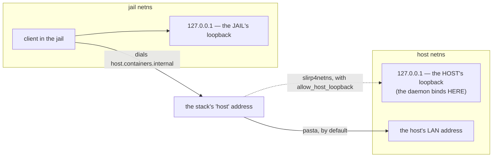

# Loopback-TLS reachability — how a jail reaches a host daemon

**Status:** CURRENT as of 2026-09-09, verified against `38873c0d`.

yolo's host daemons bind the **host's loopback** and advertise `host.containers.internal` — on
the assumption that the container runtime forwards that name to the host's loopback. **It does
not, by default.** Where the name lands is a property of *which rootless networking stack is in
use*, and pasta — podman's default since 5.0 — aims it at the host's **global** address instead.

The fix is in the **launcher**, not the transport: ask the runtime what it is, then tell it to
forward the loopback. The bind address, the certificate pinning, the per-jail bearer token and
the single-transport decision are all untouched. And because a host-side probe structurally
cannot answer this question, an **in-jail witness** evaluates it at boot and refuses the launch
when an enabled jail-facing service is unusable.

| Component | Lives in |
| :--- | :--- |
| The launcher decision: probe the stack, emit the option, disclose the outcome | `internal/cli/run` (`hostloopback.go`: `decideHostLoopback`, `hostLoopbackFactsFor`, `probeHostLoopbackSupport`) |
| The in-jail witness: probe every wired service, classify, escalate | `internal/entrypoint` (`reachability.go`: `loopbackDisposition`, `escalates`, `classifyReachability`) |
| Bind and advertise — deliberately unchanged | `internal/svcendpoint` (`Listen`, `DefaultAdvertiseHost`, `DialLocal`, `Probe`) |
| The honesty labels on host-side greens | `internal/cli/check` (`sections_loopholes.go`) |
| The disposition variable carried into the jail | `internal/paths` (`HostLoopbackEnvVar`) |

**Reads with:** [`loophole-transport.md`](loophole-transport.md) (the loopback-bind security model
this preserves, and the decision that retired a second transport),
[`loophole-system.md`](loophole-system.md) (what "enabled" means — nothing is on unless something
said so), [`security-shim.md`](security-shim.md) (the port-forward bridge, which is a different
mechanism with different properties).

> [!WARNING]
> **A nested jail gives this entire document a free green.** Podman-in-podman forces
> `--net=host`, the one mode where the jail's loopback and the launcher's are the *same*
> loopback — so no amount of nested testing can observe the class of bug this mechanism exists
> for. See [A nested jail is structurally blind](#a-nested-jail-is-structurally-blind-to-this)
> for what to do instead.

---

## The mental model: two namespaces, two loopbacks

This is what makes the rest obvious, and why *"just bind the right place and connect to the right
place"* is harder than it sounds.

A jail runs in its own **network namespace**: its own interfaces, its own routing table, and —
critically — **its own loopback**. When a daemon on the host binds `127.0.0.1` and a process in
the jail dials `127.0.0.1`, those are two different addresses on two different stacks. The jail
is not failing to reach the host; it is successfully reaching *itself*.

So the jail needs some *other* address that means "the host". Every rootless stack invents one,
and **they disagree about what it forwards to**:

**The trap: the two ends of that arrow are chosen by different parties.** yolo picks the bind
address; the *container runtime* picks what the forwarding address maps to. Choosing one end and
assuming the other is the whole bug.

**Pasta makes this especially confusing**, because it copies the host's interfaces, addresses and
routes into the namespace: the jail sees the host's interface name, the host's LAN address and
the host's default gateway, and believes it *is* that machine. It is not — it holds a **copy** of
that identity in a separate namespace, which is why dialling the host's own LAN address from
inside comes back *refused* rather than answered.

## The networking modes

Every row answers one question: **when a process inside the jail dials the "host" address, where
does the packet actually arrive?**

| Mode | The jail resolves the host name to | That forwards to | Can yolo *bind* what the jail dials? | Loopback-TLS |
| :--- | :--- | :--- | :--- | :--- |
| **pasta** (rootless; the podman ≥ 5.0 default) | a synthetic tunnel address | the host's **global** address ⚠ | **No** — it is not an interface on the host; `bind()` returns `EADDRNOTAVAIL` | ❌ broken |
| **pasta** + `--map-host-loopback` | the same tunnel address | the host's **loopback** | No — and it does not need to | ✅ **the fix** |
| **slirp4netns** (rootless; the older default) | the host's **global** address ⚠ — *not* its userspace gateway | the host's global address | **No** | ❌ broken, the same way |
| **slirp4netns** + `allow_host_loopback` **+ a pinned hosts entry** | its userspace gateway | the host's **loopback** | No — and it does not need to | ✅ the older-passt fallback |
| **netavark bridge** (rootful) | the bridge gateway | the host, over a real bridge interface | **Yes** — a genuine host interface | ✅ works |
| **`--net=host`** (no namespace) | n/a — the jail *shares* the host's stack | itself | Yes, trivially | ✅ works |
| **nested jail** (podman-in-podman) | forced onto `--net=host` | itself | Yes | ✅ works — **and this is why nobody caught it** |
| **Apple Container / `macos-user`** | a VM hop, not pasta | out of scope | — | not affected |

> [!WARNING]
> Read the fourth column downward. **In every rootless mode, yolo cannot bind the address the jail
> dials.** That is not an inconvenience to route around; it is the shape of the whole problem.
>
> Note the third and fourth rows: for slirp4netns the forwarding option alone is **not**
> sufficient, because it forwards a loopback that nothing in the jail dials — podman aims the
> host name at the host's global address there. **Both flags are load-bearing, or neither.**

## Why "bind somewhere else" has nowhere to go

The launcher's network namespace contains only loopback and the host's real interfaces, so there
are exactly two candidate bind addresses, and each fails a different test:

| Candidate | Reachable from a jail? | Acceptable? |
| :--- | :--- | :--- |
| the host's **loopback** (today) | ❌ no — the jail has its own | ✅ safe by construction |
| **a wildcard bind / the host's LAN address** | ✅ **yes, this works** | ❌ it puts the port on the LAN |

No candidate passes both, which is why the fix moved to the runtime.

> [!NOTE]
> **Binding globally would work.** This is rejected on security grounds, not because it fails —
> a differential probe from inside a jail reaches the host's SSH banner through the pasta tunnel,
> because `sshd` does not bind loopback-only. Anything listening on the host's global address *is*
> reachable from a jail; yolo's daemons were unreachable purely because of the address they chose.

What a global bind would cost, worth knowing because it stays the rival if the ladder ever runs
out on some host:

- **The port becomes visible to the network.** TLS with a pinned certificate and a per-jail bearer
  token still gate *access*, so it is not an open door. What is lost is that a loopback-bound
  socket is unreachable from the network **by construction** — no auth bug can be exploited
  remotely, because no packet can arrive. A global bind converts a structural guarantee into a
  dependency on the auth path being correct.
- **Every jail could reach every other jail's port.** Under pasta all jails resolve the host name
  to the same tunnel, so a globally-bound daemon is visible to all of them. Each per-jail relay
  would still reject a foreign token — but that is a move from *unreachable* to *rejected*, and
  those are different security properties.
- **A specific LAN address is not stable.** DHCP renewal or a change of network moves it, so the
  daemon would have to re-bind or bind the wildcard anyway — which is its widest form.

> [!CAUTION]
> **Do not bind the rootful bridge gateway.** It hits both failure modes at once: unbindable from
> a rootless launcher (`EADDRNOTAVAIL`, so the daemon dies at startup) *and* an address a pasta
> jail never dials. This was tried and reverted.

> [!WARNING]
> **Do not "fix" this in `internal/svcendpoint`.** A patch that touches the bind address or the
> advertised host is the wrong patch, and a bind-mounted AF_UNIX socket — which does work and is
> LAN-free — reopens the second-transport decision that was retired on purpose. If the ladder
> below ever runs out entirely, that is a written amendment, not a quiet change.

## The fix: ask the runtime, then tell it to forward loopback

The decision lives in the launcher, on the **default** network path only. `bridge` used to mean
"emit nothing, let podman decide"; it now means "emit the option that makes this host work, when
we can positively identify it." A transport that works only by luck of the host's network stack
is not a transport.

**A user who sets the network mode explicitly keeps full control and therefore keeps the bug**,
and is warned about it. yolo does not override a setting someone chose deliberately.

### The ladder

Every rung requires a **positive fact**. Anything unproven emits nothing and keeps the previous
argv byte-for-byte, because a wrong network option is a container that fails to *start* — the one
outcome this area may never produce.

1. **pasta that advertises the loopback-mapping flag** → emit it, mapped to the address the jail
   actually dials.
2. **else slirp4netns, if podman itself reports the binary** → emit the loopback option **and** an
   added hosts entry pinning the host name at slirp's gateway. Both, or neither.
3. **a podman that named no stack at all** → rung 2, on the same bar.
4. **else** warn and launch.

Availability at rung 2 is **podman's own answer, never a PATH lookup**: podman is the process that
execs the helper, so a binary yolo can see and podman cannot is a container that fails to start.
Podman reports an empty executable path when it has none, which makes the empty string a positive
fact.

**An old passt degrades; it is never refused.** yolo runs on the host it is given. The requirement
that survives is on the *message*: it names what breaks, the passt version that fixes it, and the
command that checks — and it must not read as an error, because launching is correct and the user
has done nothing wrong.

### A podman too old to *name* its stack

The field that reports the rootless network command does not exist below podman 5.1, and a
long-term-support distribution can ship a podman that answers `podman info` perfectly well and
names no stack. Reading that empty string as "unrecognised backend" emits nothing — correct for a
podman that would not answer, and wrong here, because the host *has* a rootless stack and can
forward the loopback.

**An UNREAD backend is not an unrecognised one.** The two are the same empty string one layer
down, so the launcher records the difference where it can still see it: `podman info` parsed, the
host is rootless, and the stack field was empty. That fact is positive in the same sense every
other fact here is, so a podman that did not run, would not answer, answered non-JSON, or is
rootful never sets it and keeps its silence.

The rescue is **rung 2 reached by a second door**, not a new mechanism: the same two flags, the
same bar, so the worst case is unchanged. What yolo cannot know is whether this *switched stacks* —
below podman 5.0 slirp4netns is the rootless default and only the forwarding option is new; from
5.0 pasta is, and the rescue moves off it. Picking one would be the guess-the-default this area
refuses, so the launch note states both readings and names the podman version that lets yolo read
the stack instead of asking for one.

## The in-jail witness

**A host-side check structurally cannot answer this.** The host-side dialer keeps the published
port and substitutes the host's loopback — the one address a jail cannot use. Everything is
reachable on the host's loopback by construction, because that is where the daemons bind, so a
host-side prober reports PASS during a total outage. **A probe that cannot fail when its subject
is down is worse than no probe.**

The advertised name is only meaningful inside a namespace the runtime built, so the only honest
place to evaluate it is at boot, from inside the jail.

### The severity rule

**An enabled jail-facing service the jail cannot reach is a failed launch.** One rule, no
per-service severity. It composes with activation: nothing is enabled unless it was asked for, so
the fatal only ever fires for a service the user deliberately turned on. *"Enabled but
unreachable"* is a genuine contradiction; *"present but unused"* is not a state that exists.

That makes the probe **load-bearing**: a warning that misfires is noise, a fatal that misfires is
no jail at all. Two things follow, and both are built:

- **A budget generous enough that scheduling starvation cannot read as unreachable.** A readiness
  poll that flaked at roughly one launch in eighty-five did so for exactly that reason.
- **An escape hatch**, mirroring the stale-image one: any non-empty value keeps the jail
  launching, it says what it is suppressing and that nothing was repaired, and the refusal names
  it so the reader is told the way past it. It is honoured **only where it suppresses something** —
  on a launch that was never going to refuse, it says nothing at all, rather than training people
  to skip the line it exists to be read on. The launcher forwards it into the container, because
  the witness runs in-jail and the user types it on the host.

### What may escalate

**"Broken" means yolo tried and failed — not "this host cannot."** Without that split, the two
rules collide: *fail when a service is unreachable* plus *an old passt cannot reach any service*
would mean an old-passt host cannot launch at all, which is the refusal the degrade rule rejects.

From inside, the two cases are the same observation — a service that does not answer — and the
facts that separate them are all host facts. So **the launcher's decision rides in on the wire**,
with every state spelled:

| Value | Means | May escalate |
| :--- | :--- | :--- |
| `requested` | the forwarding option reached the argv | ✅ |
| `shared` | the jail shares the launcher's netns — nothing to forward | ✅ |
| `unsupported` | yolo identified the stack and could not make it forward | ❌ — a known limitation |
| `unknown` | no conclusion: rootful, unrecognised backend, an explicit network mode, or the opt-out | ❌ |
| *absent* | the launcher predates the variable | ❌ — same default as `unknown` |

**Only positive facts escalate** — the discipline that governs the argv, applied to severity. An
unrecognised value must never be read as permission to fail a launch, so escalating values are
matched exactly and everything else falls through to safe.

**A shared namespace is the strongest case, not the weakest.** `--net=host` and a nested jail
share the launcher's stack, so the advertise address for them is the host's loopback, which is not
merely correct but the only thing that works: no gateway name, no forwarding hop, no rootless
stack in the path. A service unreachable there has no ambiguity to hide in.

The variable is emitted on **every** launch, so an absent value now means only "launcher older
than the variable". `shared` is decided at the emission point rather than inside the decision
function, because the shapes that have it branch to `--net=host` *above* that call and never reach
it — and it reads the same predicate the advertise address is chosen from, so the severity the
witness applies and the address the daemons publish cannot disagree.

### Which fault classes escalate

**All three.** The witness distinguishes three failures, and every one means "this service is
enabled and this jail cannot use it":

| Fault | What it is |
| :--- | :--- |
| unreachable | the endpoint file is good and the advertised address does not answer |
| unpublished | no endpoint file, one that does not parse, or one that is not a readable regular file |
| rejected | the endpoint parsed and the listener refused this jail's token — a stale file |

The distinctions that remain are about **where to look**, not how bad it is, which is what the
per-fault diagnosis paragraphs are for and what severity must not duplicate. Severity reads the
disposition; wording reads the fault.

**Neither of the two obvious objections survives contact with the code**, and both are the kind
that get re-derived:

- **There is no slow-to-publish race.** Readiness is polled *before* the container starts; a
  daemon that misses the window is killed as a group and its environment variable is never wired.
  At boot, a missing or stale endpoint means it was healthy seconds earlier and is not now.
- **There is no permanent lockout.** Every respawn path unlinks the stale artifact before
  spawning, and publishing renames a temp file onto the target. `unlink(2)` and `rename(2)` both
  work on a fifo, and the host never *opens* the path, so it cannot be wedged the way an in-jail
  probe can. The only shape that survives is a non-empty directory, and that cannot reach the
  escalation set at all: publish fails, readiness fails, and the variable is never wired.

> [!WARNING]
> **A host-wide singleton with no publish gate refuses every jail on the host.** The OAuth
> broker's endpoint variable is wired on the loophole being active alone, because it is a
> host-wide singleton rather than a per-jail daemon — so "broker configured, singleton down"
> reaches the jail as *unpublished*, and under this rule that refuses **every** jail on that host,
> not just one. Accepted deliberately: a jail with no agent auth is the case closest to fatal
> anyway. **Any future service wired without a publish gate owes this same question** — an
> endpoint variable is a *promise*, and the fatal turns every unbackable promise into a refused
> launch.

### The escalation is fatal

An enabled jail-facing service this jail cannot use refuses the launch, subject to the disposition
and the escape hatch. Isolating that to a single boolean is what made the flip a day of changing
one value rather than of writing the load-bearing branch blind against a user's broken host: the
escalation, the hatch and the scoping were all exercised by tests while it was still a warning.
The non-fatal side survives as a **test seam only** — no boot path can reach it — kept for the one
property that is otherwise unobservable: that the escape hatch may speak only where it is actually
suppressing a launch failure.

Boot output is persisted under the workspace's own state directory (the previous boot kept beside
it). That directory is bind-mounted from the host, so the log survives a boot that refused — the
state the fatal makes reachable, where there is no jail left to ask. A healthy witness records its
verdict there and stays silent on the terminal, because "ran and found nothing" and "never ran"
are otherwise the same bytes.

## A nested jail is structurally blind to this

A nested podman is forced onto `--net=host`, the one mode where the bug **cannot** reproduce. So
the repo-wide "verify in a nested jail" instruction is not merely insufficient here, it is
**actively misleading**, and it carries an explicit carve-out. Anything touching how a jail
reaches a host daemon — the network flag, the bind/advertise pair, the host-name hop, the in-jail
probe — gets a **free green** from a nested jail no matter how broken it is.

**Blind is not the same as impossible.** What blinds the nested path is `yolo`'s forced
`--net=host`, not the jail: a bare `podman run` from the same jail reproduces the outage and
demonstrates the fix in one command each, because **the jail is a perfectly good "host" for a
container it starts** and podman ships its own pasta. Bind a listener on the jail's own loopback —
the same shape as a yolo host daemon — and dial it from a container using the stack under test:
without the loopback-mapping option the dial fails; with it, it connects. The slirp4netns twin
reproduces the same way, dialling its gateway.

That proves the **flag** does what it claims. It still says nothing about a given host's passt
build, which is why the launcher probes for the flag rather than assuming it.

**A nested green means the plumbing is wired, never that the forwarding works.** The only
measurement that settles it is a **real jail on a rootless host**, reported together with what
podman says its rootless network command is.

`yolo check`'s output labels each green *"host-side, says nothing about in-jail reachability"*,
with a footnote per run pointing at the boot-time witness as the only thing that can answer. The
underlying asymmetry is not closed and cannot be: a host-side check still cannot fail on this.

## What this does not license

- **Not a change to the bind or the advertised host.** `internal/svcendpoint` is deliberately
  untouched, and a test pinning that the advertise host differs from the bind host still passes
  unmodified — real signal that nothing security-shaped moved.
- **Not a change to the loopback-bind security model.** The bind stands; this makes it
  *reachable*.
- **Not a revival of a second transport.** A bind-mounted socket works and is LAN-free, and it
  reopens a decision retired on purpose.
- **Not macOS work.** Apple Container and `macos-user` do not use pasta.
- **Not an override of an explicit network mode.** A user who chose one keeps it, and keeps the
  bug, and is told.

## Why it's this way

| Ruling | Why it holds |
| :--- | :--- |
| [**OQ-R0**](#oq-r0) — pasta forwards its tunnel address to the host's **global** address, not its loopback | Measured with a differential probe: SSH answers on the tunnel address, a neighbouring address times out, yolo's own ports come back *refused* rather than timing out. That single fact kills the whole "bind somewhere else" family. |
| [**OQ-R1**](#oq-r1) — yolo may emit a network option on the default path; unrecognised backends emit nothing | A transport that works by luck of the host's stack is not a transport. Emitting nothing when unproven keeps the argv byte-identical, because a wrong option is a container that does not start. |
| [**OQ-R2**](#oq-r2) — an enabled jail-facing service the jail cannot reach is a **failed launch**, not a warning | Nothing is enabled unless it was asked for, so the contradiction is genuine. The outage this replaced survived four days of all-green host-side checks. |
| [**OQ-R3**](#oq-r3) — a host yolo cannot fix **degrades and launches** | It is never refused for what it cannot help; the requirement lands on the message instead. |
| [**OQ-R4**](#oq-r4) — **all three** fault classes escalate, not just the dial failing | Every one of them means "enabled and unusable"; what differs is where to look, and that belongs in the diagnosis rather than in the severity. |
| [**OQ-R5**](#oq-r5) — a jail sharing the launcher's netns **is** escalatable | There is no host-stack excuse in that mode: the advertise address is the loopback and it is the only thing that works, so a failure has nothing to hide in. |
| [**OQ-R6**](#oq-r6) — the launcher's decision rides on the wire with **every** state spelled; only positive facts escalate | From inside the jail, "this host cannot forward loopback" and "yolo asked and the service is still down" are the same observation. Spelling every state is what keeps an absent variable from meaning anything but "older launcher". |
| [**OQ-R7**](#oq-r7) — a podman too old to **name** its rootless stack is an UNREAD backend, not an unrecognised one | Both are the same empty string one layer down, and reading them alike left every jail-facing service silently down on a stock LTS podman. |

## Current values

Verified at `38873c0d`. The prose above explains what each of these is for; this table is the
only place the values themselves are stated.

| Value | Setting | Defined in |
| :--- | :--- | :--- |
| Advertised host name | `host.containers.internal` | `svcendpoint.DefaultAdvertiseHost` |
| Bind address | the host's loopback, port 0 (kernel-assigned) | `internal/svcendpoint/listen.go` |
| pasta mapping address | `169.254.1.2` — the address podman puts in the jail's hosts file | `run.hostLoopbackAddr` |
| pasta flag | `--map-host-loopback` — one constant for both the emitted flag and the capability probe | `run.pastaMapHostLoopbackFlag` |
| slirp4netns host address | `10.0.2.2` (the second address of its default subnet) | `run.slirp4netnsHostAddr` |
| slirp4netns option | `allow_host_loopback=true`, plus an added hosts entry | `internal/cli/run/hostloopback.go` |
| Minimum passt release | the one that introduced the mapping flag | `run.minPasstVersion` |
| Recognised stack names | `pasta`, `slirp4netns`; anything else, including empty, is unrecognised | `run.backendPasta`, `run.backendSlirp4netns` |
| Disposition variable | `YOLO_HOST_LOOPBACK` = `requested` \| `shared` \| `unsupported` \| `unknown` | `paths.HostLoopbackEnvVar` |
| Reachability escape hatch | `YOLO_ALLOW_UNREACHABLE_SERVICES` (any non-empty value) | `paths.AllowUnreachableServicesEnv` |
| Launcher opt-out | `YOLO_NO_HOST_LOOPBACK` | `internal/cli/run/hostloopback.go` |
| Service endpoint variables | `YOLO_SERVICE_<NAME>_ENDPOINT` | `paths.ServiceEnvVarPrefix` / `ServiceEnvVarSuffix` |
| Boot log | `<workspace>/.yolo/boot.log`, previous boot kept beside it | `internal/entrypoint` |
| Fatal switch | one boolean, `true`; the false side is a test seam | `entrypoint.reachabilityFatal` |
