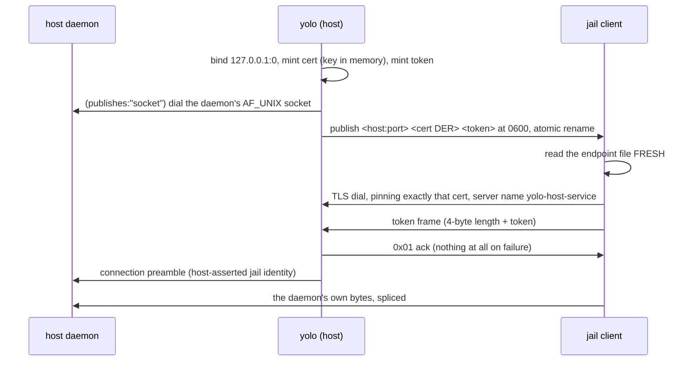

# The loophole transport — `loopback-tls`

**Status:** CURRENT as of 2026-09-09, verified against `a3922298`.

A jail reaches a host loophole daemon over **`loopback-tls`**: a TCP connection to
`127.0.0.1` that behaves like an owner-only Unix socket. It is the framework's only real
transport — `none` means *no daemon*, not a second transport — and the framework owns it
end to end, so a daemon never implements TLS, never opens a port, and never publishes a
credential. `internal/svcendpoint` holds both halves in one stdlib-only leaf package.

The transport sits **beneath** the wire protocol. `internal/frameproto` is unaware of it,
and a daemon behind the transport never learns which one carried its bytes.

| Component | Lives in |
| :--- | :--- |
| The transport, both halves | `internal/svcendpoint` (`Listen`, `Dial`, `DialLocal`, `Probe`, `IsToken`) |
| The front: authenticate, then splice to a Unix socket | `internal/svcendpoint` (`ServeFront`, `ServeFrontWithOptions`, `FrontOptions`) |
| The endpoint file: format, atomic publish, fail-closed dir check | `internal/svcendpoint` (`EndpointFile`, `AdvertiseHostEnv`) |
| The connection preamble | `internal/svcendpoint` (`Preamble`, `PreambleVersion`, `ReadPreamble`) |
| Tier-1 connection records | `internal/svcendpoint` (`Crossing`, `CrossingViaFront`, `CrossingViaEndpoint`) |
| The manifest vocabulary: `transport`, `publishes`, `request_end`, `scope` | `internal/loopholedecl` (`enums.go`) |
| Spawn, readiness, the front goroutine, teardown | `internal/cli/run` (`startExternalService`, `startHostSingleton`, `stopLoopholes`) |
| The three server entry points a Go daemon picks from | `internal/hostservice` (`ServeUnix`, `ServeFrontedUnix`, `ServeEndpoint`) |
| The cross-uid grant for a separate-user sandbox | `internal/macosuser` (`EndpointGrantCommands`) |

**Reads with:** [`loophole-protocol.md`](loophole-protocol.md) (the wire format above this
layer — unchanged by anything here), [`loophole-system.md`](loophole-system.md) (how a
loophole is declared, activated and disclosed),
[`pack-system.md`](pack-system.md) (the pack framework a loophole is a contribution to),
[`../guides/loopholes.md`](../guides/loopholes.md) (the manifest keys as an author writes
them).

---

## Why a Unix socket is not enough

On macOS + podman, containers run inside a podman-machine VM, and a per-jail directory
crosses that boundary over **virtiofs**. Virtiofs shares a socket's **inode** but not its
connection endpoint: in the jail the socket appears as an unstattable `s?????????` entry
and `connect()` fails. Apple Container has the same property.

That is a fact about the boundary, not about any one loophole. Every loophole reached by a
bind-mounted Unix socket fails identically there, which is why the answer belongs to the
framework rather than to a daemon.

## What `loopback-tls` is, in five steps

Each step exists to replace something the filesystem used to give away free.

1. The listener binds `127.0.0.1` on a **kernel-assigned** port. Loopback, so it is not on
   the LAN; kernel-assigned, so there is no probe-then-rebind window in which another
   local process could squat the port.
2. It mints a **throwaway TLS certificate whose private key never leaves that process's
   memory** — not marshaled, not written to disk, never mounted into a jail.
3. It publishes `host:port`, the public certificate, and a freshly minted
   **per-(jail, service) bearer token** to **one file** in the jail's own per-jail mounted
   directory. This is the address book; a socket did not need one because the path was the
   name.
4. The client re-reads that file **fresh on every dial** and demands the server present
   **exactly that certificate** — through a dedicated root pool, never a CA.
5. The client sends the token as the first bytes on the connection. The server compares it
   in constant time, acks one byte, and hangs up on a mismatch. Reachability is not
   authorization: possession of the token is what "only my user" means on a port.

**Why each piece is load-bearing**, because a simpler version is tempting and wrong:

| Piece | What breaks without it |
| :--- | :--- |
| loopback bind | the port is on the podman-machine bridge, i.e. the LAN |
| TLS | a sibling jail on the shared bridge can sniff the hop (every jail holds `NET_RAW` there) |
| pinning a **host-only** key, not a CA | a sibling can impersonate the listener — and a CA yolo owns is not available for this job (see the warning below) |
| per-(jail, service) bearer token | loopback TCP has no `connect()`-implies-authorized property; the socket-file model does not survive the port |
| re-read on every dial | a daemon restart otherwise strands the jail until relaunch |

> [!WARNING]
> **The pin must not depend on a CA, and specifically not on an intercepting loophole's
> own CA.** A loophole's state directory used to cross into every jail whole, so the
> broker CA's private key was readable in-jail — measured, and `0600` is no mitigation
> when the agent runs as UID 0 by design. The narrowing fix is the `state_files` manifest
> key: name the files the jail actually needs and each crosses on its own read-only mount
> while the state **directory** does not cross at all. Pinning one throwaway certificate
> whose key never left memory is what makes the transport independent of that question
> entirely.

## Threat model

**The adversary is a SIBLING JAIL. It is not the jail's own agent, and it is not a
same-user host process.**

- **The jail is trusted with its own credential by design.** It runs as UID 0 and can read
  its own endpoint file; rewriting it only breaks its own connection. Jail A using jail A's
  credential is the system working.
- **A same-user host process is inside the intended boundary too.** That is the product's
  specification, matching the host: anything running as you can already read your
  credentials or act as you, and a jail extends that unchanged.
- **What a shared loopback port loses** relative to a per-jail-mounted socket is *sibling
  isolation*: the port is scannable, so reachability stops proving identity. TLS stops a
  sibling sniffing, the pinned host-only key stops a sibling impersonating the listener,
  and the token stops a sibling impersonating the jail.

> [!WARNING]
> **`SO_PEERCRED` cannot distinguish a jail from a same-user host process, so do not reach
> for it as a boundary here.** Rootless podman maps the container's UID 0 to the invoking
> user's uid (and `--userns=host` on the nested path makes it literal), so both
> connections arrive carrying the same uid. There is nothing for the kernel to tell apart.
> Peer credentials **verify**; file permissions **restrict** — and restriction is the part
> a boundary needs. The one place `SO_PEERCRED` is genuinely load-bearing is a service
> whose whole security model *is* kernel-attested identity; see
> [The one service that cannot move](#the-one-service-that-cannot-move).

## The endpoint file is a credential

One line, three whitespace-separated fields: `<advertised-host:port> <base64 cert DER>
<token>`. It carries the bearer token alongside the address and the public cert, so its
owner-only mode and its per-jail directory are **load-bearing, not cosmetic**:

- written to a temp file in the **same** directory, then **atomically renamed**, because
  clients re-read it on every dial and a torn read hands them a truncated token;
- publication **fails closed** into a directory that is group- or world-accessible, or
  that is a symlink rather than a real directory owned by the publishing uid;
- **never logged, never copied between jails, never placed in a shared directory**;
- **no env-var delivery of the token, and no fallback.** An env var is inherited by every
  child process a daemon spawns; a fallback would keep that inheritance alive for whatever
  reads it first.

**The advertised host and the bind address are deliberately different.** Bind loopback;
advertise the container runtime's gateway name (or `$YOLO_SVC_ADVERTISE_HOST` when set).
Reverse the two and the jail dials its own loopback. `yolo check` therefore dials
`127.0.0.1` at the *published port* (`svcendpoint.DialLocal`), because the host generally
cannot resolve the advertised gateway name — which is why a listener must accept on
loopback regardless of what it advertised.

**Health is a content check, never file existence.** `Probe` re-parses the published file
on every call: exactly three fields, a splittable `host:port`, a certificate that parses,
a well-formed token. A file that merely exists proves nothing and is treated as proving
nothing.

> [!WARNING]
> **Unlink a dead predecessor's artifact BEFORE a spawn, and never satisfy a readiness
> wait with bare existence.** A daemon killed after its readiness deadline leaves its
> endpoint file (or its upstream socket) behind on a deterministic path; the next launch's
> wait is then satisfied *instantly*, the front publishes, `Probe` succeeds, the jail
> authenticates, and every request is dropped at the upstream dial — reading as a daemon
> failure. The per-jail spawn path removes both artifacts up front and waits on a
> **connect**. The host-scoped path deliberately does *not* pre-unlink its upstream
> socket, because that socket may belong to a live daemon serving another jail.

## Two server shapes, and how a manifest selects one

`transport` answers exactly one question — *does this loophole have a host daemon a jail
dials, and if so how* — and it has two values. The enumeration and its rationale live in
`internal/loopholedecl/enums.go`; the shape is:

- **`loopback-tls`** — the transport. The framework publishes an endpoint file.
- **`none`** — **no daemon**, not a different transport.

`host_daemon.publishes` then splits *what the jail dials* from *what the daemon binds*:

| `publishes` | The daemon binds | yolo does | Reachable by |
| :--- | :--- | :--- | :--- |
| `endpoint` | the loopback-TLS endpoint file itself | waits on `Probe` | a loophole yolo itself ships |
| `socket` | a plain AF_UNIX socket at `{socket}` | waits for the socket to **accept a connect**, then runs `ServeFront` in front of it and publishes the endpoint file | anything that can bind AF_UNIX and read a length prefix |

**Every loophole yolo ships declares `publishes: "socket"`**, and a pack-shipped loophole
may declare nothing else: `publishes: "endpoint"` is refused by the pack-shipped subset for
every manifest yolo reads. The reason is an **enforcement asymmetry** — on the client side
a sloppy implementation harms only itself, while on the server side every
security-critical property (the file's mode, the directory's mode, the key never
persisting, the constant-time compare, the length cap before allocation) is invisible to
yolo. The front distributes the *capability* and keeps **one** implementation of the
*obligation*.

> [!WARNING]
> **Do not export `internal/svcendpoint` "to open it up".** Exporting the Go package
> narrows the author's language to exactly one; the front opens it widest. Nothing here
> forecloses an export later — `svcendpoint` and `frameproto` are stdlib-only leaves with
> zero internal imports — but it is an addition, not the supported path.

**`{socket}` and `{endpoint}` diverge under `publishes: "socket"`**: `{socket}` is the
upstream path, `{endpoint}` is the published file. A manifest declaring
`publishes: "socket"` while naming `{endpoint}` in its argv is refused at load with the
fix.

**The upstream socket lives outside the mounted services directory.** Leaving it in the
read-write-mounted `/run/yolo-services` would keep a plain-socket path reachable from
inside the jail — which is what retiring that transport forbids — and would let the jail
unlink the daemon's own socket.

### `request_end` — how a request ends behind the front

The front waits only on the **response** direction and, by default, never propagates the
client's EOF upstream. The request direction runs unwaited in its own goroutine, so a
framed client that writes one request and then waits cannot have its response cut short.

> [!WARNING]
> **A daemon that reads its request to EOF works on a bare socket and hangs forever behind
> the front.** The fix is one field: declare `request_end: "eof"` beside
> `publishes: "socket"` and the front half-closes the upstream socket when the request
> direction ends. The default stays `framed` because a length-prefixed protocol is
> self-delimiting and does not need the EOF.

### `scope` — one daemon per jail, or one per host

`host_daemon.scope` says **what the daemon is shared across**. It is a scope rather than a
`singleton: true` bool deliberately: naming it for today's only interesting answer would
make a third answer look like a violation instead of an addition.

- **`jail`** (the default) — yolo spawns it at launch, waits for it, and kills its process
  **group** at teardown.
- **`host`** — one daemon per host, serving every jail. yolo **ensures** it (liveness
  check, then a spawn under a host-wide flock, with the loser of the race observing the
  winner) rather than spawning it, binds it at a fixed host-wide socket derived from the
  loophole *name*, and gives each jail its **own front** over that one socket.

`scope: "host"` **requires** `publishes: "socket"`, refused at load rather than merely
documented: an endpoint file carries **one** jail's bearer token, so a host-wide publisher
would hand every jail the same credential, or hand all but one a credential minted for
someone else.

> [!WARNING]
> **A jail ending closes ITS FRONT and touches nothing else** for a host-scoped daemon —
> no process-group kill, no socket unlink — or every other live jail on the machine loses
> its credential path. This is the asymmetry to preserve when editing teardown: the
> per-jail path kills the group and unlinks; the host-scoped path does neither.

> [!WARNING]
> **A long-lived host-wide daemon is invisible stale state, and every connect-based
> liveness gate in the system is designed to be satisfied by it.** A daemon started before
> its loophole moved behind a front is still listening at the same path and will consume
> the front's preamble as the client's request: every request fails while liveness reports
> green. yolo detects that specific state and names the one command that fixes it rather
> than killing the daemon (two yolo versions on one host would take turns restarting each
> other's). When verifying transport work from inside a jail, restart the singleton first
> or the verification measures the previous binary.

## The connection preamble

**The framework prepends its own connection preamble and never parses the daemon's
payload.** It is host→daemon only, exactly once, at connection open; it never appears in
the response direction and the jail-side client never sees it, so a client cannot forge,
suppress, or even observe it. What it carries first is the jail identity yolo derived
**host-side** from the path it published at — the same derivation the tier-1 crossing
record uses, which is what makes the two audit tiers agree by construction.

It is a **versioned envelope**, mandatory rather than optional: the preamble is meant to
grow, so a daemon that does not recognize a version fails loudly rather than guessing at a
key set it has never seen. Its length is capped before the buffer is allocated, the same
rule the token frame states, because `ReadPreamble` is exported for third-party daemons.

**The default is ON for a manifest and OFF for a `yolo-jail.jsonc` entry**, because a
config entry's daemon is a program yolo did not write. The knob is spelled `NoPreamble` so
that the zero value is the framework default rather than the absence of one. Suppressing
it costs that daemon its identity and buys yolo nothing in audit — tier 1's `jail=` is
derived from the publication path either way, so this is not a privacy switch and cannot
be used as one.

## The one service that cannot move

`cgroup-delegate` declares `"transport": "none"` and binds a plain AF_UNIX socket, and
that is not a migration nobody got round to. Its client is a baked Go binary, so "the
client is generated Python" — true of the journal bridge once — is not the reason.

**`SO_PEERCRED` is what does not survive the hop.** The delegate's security model is
kernel-attested identity: the operation that creates a job cgroup writes the peer's
**host-namespace** PID — read off the connection by the kernel, never sent by the caller —
into that cgroup's `cgroup.procs`, and that write *is* what moves the caller into the
cgroup.

| Option | Why it fails |
| :--- | :--- |
| publish an endpoint directly | a TCP connection carries no peer credential at all, so the peer PID would be 0 and every create-and-join would fail |
| `publishes: "socket"` behind a front | **worse than failing** — `SO_PEERCRED` on the upstream socket attests the FRONT's pid, i.e. yolo's own, so the delegate would move the `yolo run` process into the jail's job cgroup |
| the client sends its own PID | caller-**asserted** where the current value is kernel-**attested**, and it is a PID in the container's namespace where the host needs one in its own |

Closing the gap means giving the transport a way to carry a kernel-attested caller
identity — a credential decision with its own design, not a transport swap. The honest
consequence: `cgroup-delegate` is still AF_UNIX, so it is still unavailable on
macOS + podman for the virtiofs reason above. Its jail-side variable is the `_SOCKET`
spelling precisely because the value *is* a socket path, and the delegate itself is
yolo's own in-process goroutine on the launcher side rather than a spawned daemon.

## Failure modes

| Symptom | What it actually is |
| :--- | :--- |
| EOF immediately after the token frame, before any response | **auth rejected.** The server writes nothing on failure; the ack byte exists so this is distinguishable from "the daemon is down" |
| The endpoint file parses but `Probe` returns false | a malformed field — most often a token that is not exactly 64 lowercase hex. The daemon is SIGKILLed after the readiness deadline with a log that looks perfectly healthy |
| The jail authenticates and every request is dropped | the front published in front of an upstream that is not there — a stale socket satisfying a bare-existence wait, or a daemon that died after publication |
| Requests hang forever behind the front, but work against the bare socket | the daemon reads its request to EOF; declare `request_end: "eof"` |
| Connections succeed, every request fails, liveness is green | a host-scoped daemon predating the preamble, consuming it as the request |
| Nothing is reachable from any jail on a rootless pasta host | the *host loopback forwarding* problem, not this transport — see the reachability material in `AGENTS.md` and the launcher's own decision report |

Every one of these produces a tier-1 crossing record with an `outcome` and a `reason`
([`loophole-protocol.md`](loophole-protocol.md#tier-1--one-record-per-connection)), which
is the first place to look.

## Separate-user sandboxes

A backend that runs the sandbox as its **own OS user** — the macOS user-level sandbox, and
any future notch with a separate-user primitive — needs one extra step, not a second
transport: the endpoint file must be *reachable by that other uid*. That is a grant on the
file and a traverse grant on its directory (`macosuser.EndpointGrantCommands`), and it is
the one place a separate-user primitive costs something.

It is deliberately a **grant**, not peer-credential verification: file permissions
restrict, peer credentials only verify, and restriction is the half a boundary needs.

## Current values

Verified at `a3922298`. The prose above explains what each of these is for; this table is
the only place the values themselves are stated.

| Value | Setting | Defined in |
| :--- | :--- | :--- |
| Transport values | `loopback-tls`, `none` | `loopholedecl.TransportLoopbackTLS`, `TransportNone` |
| Retired transport values (recognized, refused, with a migration hint) | `unix-socket`, `tls-intercept` | `loopholedecl.RetiredTransportUnixSocket`, `RetiredTransportTLSIntercept` |
| `publishes` values | `endpoint` (default), `socket` | `loopholedecl.PublishesEndpoint`, `PublishesSocket` |
| `request_end` values | `framed` (default), `eof` | `loopholedecl.RequestEndFramed`, `RequestEndEOF` |
| `scope` values | `jail` (default), `host` | `loopholedecl.ScopeJail`, `ScopeHost` |
| Preamble version | `1` | `svcendpoint.PreambleVersion` |
| Preamble frame cap | 4096 bytes | `internal/svcendpoint/preamble.go` |
| Token frame cap | 4096 bytes | `internal/svcendpoint/token.go` |
| Pre-request handshake deadline | 5s | `internal/svcendpoint/token.go` |
| Daemon readiness wait before SIGKILL | 5s | `internal/cli/run` (`serviceReadyTimeoutDefault`) |
| Per-jail upstream socket for a fronted daemon | `/tmp/yolo-front-<8hex>-<name>.sock` | `internal/cli/run` (`frontSocketFile`) |
| Host-scoped rendezvous socket | derived from the loophole name | `paths.HostSingletonSocket` |
| Per-jail published-endpoint directory | `/tmp/yolo-host-services-<8hex>` | `internal/paths/paths.go` |
| Jail-side services directory | `/run/yolo-services` | `paths.JailHostServicesDir` |
| Advertised-host override | `YOLO_SVC_ADVERTISE_HOST` | `svcendpoint.AdvertiseHostEnv` |

## Why it's this way

Forward-facing rulings a maintainer would otherwise undo. Ids are the ones cited from
sibling docs and code comments.

| ID | Ruling | Why it stays |
| :--- | :--- | :--- |
| [`OQ-T9`](#oq-t9) | **One transport, not two.** `unix-socket` is retired — recognized by name, refused at load, with a hint naming the replacement | A value that still validates is a value someone will use, and two security models that drift apart is worse than a loopback TLS handshake. The security argument for keeping the socket was withdrawn: `SO_PEERCRED` cannot distinguish the jail from a same-user host process, and that set is the *intended* boundary rather than a gap. |
| [`OQ-T1`](#oq-t1) | **A bearer token, not mTLS** | There is one listener per (jail, service), so a matching token identifies the caller structurally. mTLS would add a second certificate lifecycle and, conventionally, a second CA, in exchange for nothing. What would reopen it: a single shared listener serving many jails. |
| [`OQ-T2`](#oq-t2) | **No transport-selection config key** | With one transport there is nothing to select, and an override could only mean "no daemon", which `enabled: false` already says. What the reasoning actually wanted — that the active choice be *visible* — is met by `yolo loopholes list` printing `transport=` per loophole. |
| [`OQ-T3`](#oq-t3) | Per-jail secrets belong to `loopback-tls` and nowhere else | On a per-jail-mounted socket the mount already provides sibling isolation, so a token there buys only attribution at the cost of a new failure mode on a path that works. |
| [`OQ-T5`](#oq-t5) | A jail may rewrite its own endpoint file, and gains nothing by it | It already holds its own token; redirecting its own endpoint only breaks its own connection, and a sibling cannot reach it. |
| [`OQ-T6`](#oq-t6) | `state_files` is the **narrow** form: name the files that cross, not a general mount vocabulary | Absent means the whole state dir crosses exactly as before, so no external manifest changed meaning. A missing entry is **skipped, not mounted**, because a container runtime materializes a missing bind source as an empty *directory*, which would shadow the very file the jail daemon waits for. Entries are validated at load as relative and `..`-free, so the key can only narrow the mount it describes. |
| [`OQ-T7`](#oq-t7) | The token rides in the published endpoint file, minted by the listener in process | One writer, one file, one rename: no persistence, no second artifact to leak, and rotation for free because the file is already re-read on every dial. |
| [`OQ-T4`](#oq-t4) | A no-VM macOS backend does not make this moot | It has no VM, but it starts no host services at all, so the separate-user grant above stays built and uncalled until a notch actually runs one. |

Two further constraints have no id and belong in the same register. **The token is
per-(jail, service), not per-jail** — a shared per-jail token would mean one leaked
endpoint file granted the others, and it is free under in-process minting. And **the
jail-facing variable is `_ENDPOINT` with no `_SOCKET` dual emission**: a stale baked
client reading an *absent* variable hits its own clear "not wired up in this jail" path,
where one reading a same-named variable whose value is no longer a socket would dial a
regular file and report something obscure.
