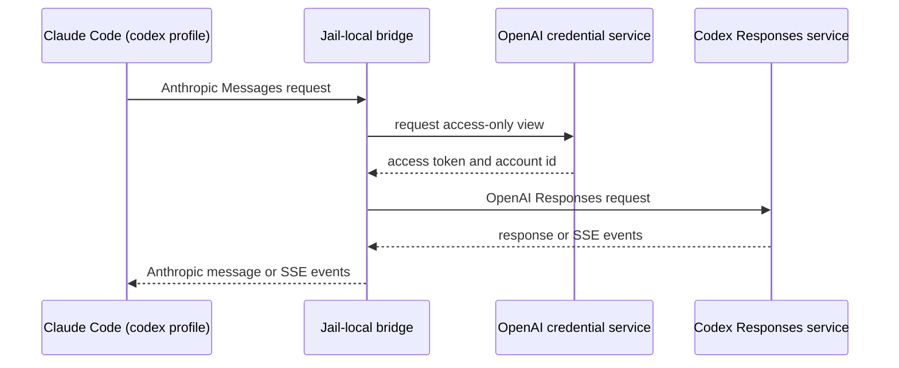

# OMP and the Claude Codex profile

**Status:** CURRENT as of 2026-09-15, verified against `e0d62605`.

This system adds two independent ways to use the agent environment. The `omp`
pack installs Oh My Pi (OMP) and derives its provider catalog from yolo's
composed provider facts. Claude's `codex` profile instead sends Claude Code's
Anthropic Messages requests to a jail-local bridge, which calls the Codex
Responses service with an access-token-only credential view. A **credential
view** is a deliberately restricted broker response: it contains the short-lived
access token needed for one upstream call, never the refresh or ID token that
would let the caller refresh credentials itself.

Neither feature changes a normal Claude launch. The profile is an explicit
selection, and OMP keeps its own agent state and generated configuration.

| Component | Lives in |
| :--- | :--- |
| OMP package, state, and generated model catalog | `packs/omp` |
| Structured YAML rendering used by OMP's catalog | `internal/agentcfg/codec` (`YAML`) |
| Claude profile and its environment derivation | `packs/claude` |
| Restricted credential-view client and broker response | `internal/openauthclient` (`AccessTokenView`), `internal/openaiauthdaemon` (`accessView`) |
| Messages-to-Responses translation and streaming event conversion | `internal/wirebridge` (`TranslateResponsesRequest`, `TranslateResponsesResponse`, `ResponsesStreamTranslator`) |
| Route selection, listener, and authenticated upstream requests | `internal/wirebridged` (`resolveRoute`, `NewCodexResponsesHandler`) |

**Reads with:** [`wire-bridge.md`](wire-bridge.md) for the service lifecycle and
the original chat-completions route, and
[`agent-credentials.md`](agent-credentials.md) for OpenAI credential ownership.

---

## Boundaries and ownership

OMP is a program pack, not a provider. Its derived model catalog contains URLs,
wire dialects, model identifiers, and environment-variable *names*; the values
of provider credentials remain in yolo's normal launch environment. OMP's
workspace state is distinct from every other agent's state.

The Claude `codex` profile is a profile of the Claude pack. It does not create a
global OpenAI provider record or change a default Claude endpoint. Selecting it
adds the `openai-auth` and `wire-bridge` packs through Claude's declared needs;
the bridge is selection-lazy, so it listens only when this profile is active.
The extra packs can therefore be present but healthy and idle on ordinary Claude
launches.

The OpenAI credential service remains the sole refresh-token owner. The bridge
asks it for a new access-token view for each request, keeps that token in memory,
and makes one retry after an upstream 401 with a newly requested view. It never
writes subscription credentials to agent configuration or accepts credentials
from Claude's inbound request.

> [!WARNING]
> Do not turn the bridge into a general OpenAI gateway or copy a refresh token
> into a Claude or OMP file. The selected route has one fixed upstream and the
> broker is the only refresh authority; widening either boundary reintroduces
> credential duplication and token-refresh races.

## Claude profile and bridge protocol

The profile's role is to make the protocol boundary explicit. Claude continues
to speak its native Messages protocol; the bridge translates only after Claude
has been routed to the jail loopback. The `openai-codex` identity is not a normal
composed provider because it is subscription-backed rather than API-key-backed.

The bridge converts the available equivalent forms: system instructions, text,
images, custom tool definitions, tool calls and results, token and sampling
controls, usage, and streaming text and tool-argument events. Claude thinking
is mapped to the Responses reasoning-effort control. Responses reasoning items
are not replayed as Anthropic thinking blocks because their opaque state is not
safe to expose or replay. A form without a supported semantic equivalent is
rejected with an Anthropic-shaped error rather than silently discarded.

Streaming remains incremental: `ResponsesStreamTranslator` turns Responses SSE
events into Anthropic SSE events without buffering a completion. Tool-call IDs
are retained across request and response translation, so a later tool result is
associated with the original call.

> [!WARNING]
> The bridge ignores inbound authorization. Jail-local reachability is the
> caller boundary; outbound authorization is constructed only from the restricted
> broker view. Trusting an inbound bearer would permit an agent configuration to
> replace subscription identity or quota ownership.

## OMP model catalog

`packs/omp` projects every composed provider with a supported dialect into OMP's
YAML model catalog. The projection is generated at provision time, so changing a
provider's endpoint or model aliases changes the catalog without a second,
hand-maintained provider registry. Providers without a usable endpoint are left
out instead of receiving a guessed URL.

The YAML codec is explicit for host-file composition: an author must select it
when structured YAML merging is wanted. YAML filenames otherwise retain raw,
byte-preserving treatment, which protects comments and formatting in unrelated
configuration files.

## What this does not provide

- It does not make Claude OAuth, an OpenAI API key, or a local Codex credential
  interchangeable with a Codex subscription.
- It does not start the Codex CLI or OMP as a proxy for Claude.
- It does not claim that every future Anthropic or Responses feature has a
  translation. New protocol forms need an explicit mapping and tests before they
  pass through this bridge.
- It does not make OMP's workspace state shared with Claude, Codex, or Pi.

## Current values

Verified at `e0d62605`. The prose above describes the durable boundaries; these
are the operational values that may change with a release.

| Value | Setting | Defined in |
| :--- | :--- | :--- |
| OMP executable | `oh-omp` | `packs/omp/pack.json` |
| OMP package | `@oh-labs/oh-omp@0.15.3` via npm | `packs/omp/pack.json` |
| OMP model catalog | `~/.oh-omp/agent/models.yml` | `packs/omp/pack.json` |
| OMP workspace state | `.oh-omp` | `packs/omp/pack.json` |
| Claude profile spelling | `claude=codex` | `packs/claude/pack.json` |
| Default profile model alias | `terra` | `packs/claude/derive.lua` |
| Claude bridge address — what the agent is pointed at | `http://127.0.0.1:8215`, declared as the `openai-responses → anthropic` adapter's `address` and composed into `openai-codex`'s entry. Claude's derive **no longer spells it** — it reads the endpoint like any other, and its own comment at that branch records the move ([`protocol-resolution.md`](protocol-resolution.md)) | `packs/wire-bridge/pack.json` |
| Codex route bind address — what the daemon listens on | `127.0.0.1:8215` — a Go constant the route selection reads directly, ahead of any table read. ⚠ A user-scope `adapters.openai-responses->anthropic.address` moves the row above and **not** this one, so the two can be made to disagree | `wirebridged.CodexResponsesListenAddr` |
| Codex Responses base URL | `https://chatgpt.com/backend-api/codex` | `wirebridged.CodexResponsesBaseURL` |
