# Timing spans — `--timing`, `perf_logging`, and the host perf log

**Status:** CURRENT as of 2026-09-19, verified against `16ef96cb`.

yolo times its own launch and shutdown as a set of named **spans** recorded by a
host-side collector, so the question "who is holding my shell prompt after the
agent exited?" has an answer with names in it. Every opt-in writes the spans to a
per-workspace file as they happen; only an explicit per-invocation flag prints
the table. The stretch yolo cannot time — podman's own post-exit cleanup, where
no yolo code runs — is attributed afterwards from podman's event log. The jail
has a second, older timing half of its own (the entrypoint's boot checkpoints),
which this system reads and prints but does not own.

| Component | Lives in |
| :--- | :--- |
| The collector: spans, marks, sinks, the report renderer | `internal/perf` (`Log`, `Span`, `Event`, `Sink`, `SlowSpanThreshold`) |
| The incremental file sink and its retention | `internal/perf` (`FileSink`, `MaxRuns`) |
| The two gates, collector construction, the report | `internal/cli/run` (`Options.timingRecording`, `Options.timingReporting`, `initPerf`, `emitTimingReport`) |
| Window A attribution from `podman events`, and its split | `internal/cli/run` (`attributeWindowA`, `recordWindowA`, `parsePodmanEvents`, `parseDieAndCleanup`) |
| The Window A probe: death detection and /proc sampling | `internal/lingerprobe` (`Start`, `Probe`, `Sampler`, `DetectExitDir`) |
| The probe's launch wiring, forwarded-input timing, the stderr line | `internal/cli/run` (`startLingerProbe`, `stopLingerProbe`, `noteForwardedInput`, `noteLingeringClient`) |
| The `child.*` marks and the input/pty observer | `internal/ttyproxy` (`Observer`, `StageHook`, `RunWithProxyObserved`), `internal/cli/run` (`runWithProxy`) |
| The `image.*` spans inside the image load | `internal/image` (`Options.Perf`) |
| The jail half's switch: the argv pair and the bash timers | `internal/cli/run` (`assembleRunCmd`, `buildFinalInternalCmd`) |
| The global `--verbose` / `-v` flag | `internal/cli` (`applyVerboseFlag`, `explicitVerbose`) |
| `yolo stop`'s spans | `internal/cli` (`stopJail`), `internal/cli/run` (`TimingLogFor`) |
| The host-process env opt-ins | `internal/paths` (`TimingEnv`, `VerboseEnv`) |
| The persistent config key | `internal/config` (`PerfLoggingEnabled`) |

**Reads with:** [`USER_GUIDE.md`](../guides/USER_GUIDE.md) (the flag as a user sees
it), [`jail-home.md`](../reference/jail-home.md) (the `<workspace>/.yolo/` state
directory both log files live under), [`image-staging-vs-baking.md`](image-staging-vs-baking.md)
(the load-cost model the `image.*` spans measure). `yolo config-ref` is the
authority for the `perf_logging` key and the two environment variables; this doc
does not restate it.

---

## Principles

**P1. Recording and reporting are separate gates.** Every opt-in records to the
file; only an *explicit, per-invocation* flag prints. A persistent setting — a
config key, a variable exported from a shell profile — is "always on", and an
always-on table scrolls away whatever the user was reading at every jail quit.
The rule for classifying the next opt-in, whatever it is: **an explicit
per-invocation flag prints; a persistent setting records silently.**

**P2. Best-effort, always, and free when off.** A timing logger that can fail a
launch is a worse bug than the blindness it fixes. No method on the collector
returns an error; a sink that hits one warns once and goes quiet. Every method is
a no-op on a nil collector, so call sites are unconditional — there are no
`if timing {}` guards around the spans themselves, and the disabled path is one
pointer check.

**P3. Events reach the sinks as they happen, never at report time.** Two reasons,
both shutdown-shaped: the tty proxy's signal arm leaves the process through
`os.Exit`, where deferred functions do not run, so anything buffered for an
end-of-run dump is lost on exactly the path most worth seeing; and a *hang* is
diagnosable only if the file already shows the last span that started and never
ended. That dangling start line is the answer to "who is doing it".

**P4. The collector's clock is the wall clock.** The run pipeline's `Options.Now`
seam exists so tests can freeze time; a span system built on a frozen clock
reports `0.000s` everywhere under test. The collector is constructed with
`time.Now` and nothing else.

**P5. The host-process opt-ins never cross into the jail.** `YOLO_TIMING` and
`YOLO_VERBOSE` are read by the launcher and deliberately not forwarded. The jail
half is switched by a separately named argv pair whose name shares no prefix with
either, so a grep for one can never match the other and forwarding can never look
intended.

## Vocabulary

- **Span** — a named interval with a start and an end. The field's usual meaning,
  as in [OpenTelemetry](https://opentelemetry.io/docs/concepts/signals/traces/#spans);
  here a span has a name, a duration, and no children or attributes.
- **Mark** — a point event with a name and a timestamp and no duration ("the child
  exited", "the probes are done"). Ours; the entrypoint's boot log uses the word
  the same way. Not a span: a mark can never dangle, which is why the one step in
  the shutdown chain that cannot be bounded is recorded as a mark
  (see [The shutdown path](#the-shutdown-path)).
- **Record** — a completed interval entered with a duration measured somewhere
  else, by something other than this collector (`perf.Log.Record`). Ours. It is
  the shape a Span cannot express: a Span times work this process is doing, and a
  Record is the opposite — an interval no yolo code was present for. It emits an
  `end` with no `start`, deliberately: a synthetic start would carry a past
  timestamp out of the file's time order and would claim yolo was there when the
  interval began, and a lone `start` has to keep meaning "this is where it hung".
  Window A and its two halves are the only ones.
- **Note** — a point event carrying a line of detail (`perf.Log.Note`). Ours. A
  note is written to the file as `note   <name>  <detail>` and never appears in the
  printed table: notes are the probe's samples and podman's per-event offsets,
  dozens of lines that would bury the spans.
- **Window A** — the stretch of a shutdown that happens entirely inside the
  `podman run --rm` child, after the container's PID 1 dies and before the podman
  process exits. No yolo code runs there, so no span can cover it; it can only be
  *attributed* after the fact, and is entered as a Record. Coined in the design
  this reference replaces (2026-09-06). It has two halves, recorded separately
  since 2026-09-24:
  - **podman's teardown** — from the `died` event to podman's last teardown event
    (`remove` for a `--rm` container): conmon's exit file, the cleanup process,
    the network teardown and unmounts;
  - **the client's exit** — from that last teardown event to the moment yolo reaps
    the `podman run` process. The container is already gone by then; whatever
    remains is the client's own.
- **The lingering client** — a `podman run` process still alive after its
  container has died. Coined here, 2026-09-24.
- **The probe** — the watcher that samples a lingering client from `/proc`
  (`internal/lingerprobe`). Coined here, 2026-09-24. See
  [The lingering-client probe](#the-lingering-client-probe).
- **The host half / the jail half** — the two timing records one launch produces.
  The host half is this system's file and table. The jail half is the
  entrypoint's own boot checkpoints, always on, appended to a file in the jail
  home that bind-backs onto the same `<workspace>/.yolo/` tree; this system
  prints it as part of the full report and otherwise leaves it alone.
- **The recording gate / the reporting gate** — the two questions P1 separates:
  does this launch collect spans and write the file; does it print.

## The two gates

| Opt-in | Kind | Records | Prints |
| :--- | :--- | :---: | :---: |
| `--timing` (run flag) | per-invocation | yes | yes |
| `--verbose` / `-v` (global flag, before the subcommand) | per-invocation | yes | yes |
| `perf_logging: true` (user config) | persistent | yes | no |
| `YOLO_TIMING`, `YOLO_VERBOSE` non-empty in the environment | persistent | yes | no |

The reporting gate is the two explicit flags and nothing else. The recording gate
is the reporting gate *or* any persistent opt-in. A printing launch prints three
things: the host-side span table, the Window A attribution line beneath it, and
the jail half's `=== YOLO Jail Profile ===` block, which the launcher switches on
by putting the jail-half argv pair on the container command line
([The jail half](#the-jail-half)). A launch that records without printing gets
one dim line at exit naming the file, so a `perf_logging` turned on months ago is
still discoverable — and it keeps the live slow-span notices, because one line
naming a culprit while the user is still waiting is the opposite of a table
nobody asked for.

**`--verbose` is a global flag**, stripped at the front door before subcommand
resolution — the same pattern as `--user-layer` — and published to the process
environment as `YOLO_VERBOSE`, so every subcommand and every nested `yolo` sees
it without each flag parser growing its own copy. The scan stops at `--`, so a
`-v` meant for the command the jail runs is left alone. It has no vocabulary of
its own yet: it enables exactly the timing surface `--timing` does, and exists so
non-timing diagnostics have a gate to grow into that does not further load the
word "timing".

> [!WARNING]
> **The published flag and the inherited variable are the same variable.**
> Because `--verbose` publishes itself as `YOLO_VERBOSE`, a typed `--verbose` and
> a `YOLO_VERBOSE=1` exported from a shell profile are indistinguishable to every
> `Getenv` reader downstream — and P1 requires them to differ. The distinction is
> carried **in-process**: the front door records that the flag was *typed* on this
> invocation (`explicitVerbose` in `internal/cli`) and hands it to the pipeline as
> `run.Options.Verbose`. Do not try to carry it in a second environment variable:
> it would be inherited by the next `yolo` too, which is the very thing being
> distinguished. For the same reason, nothing may fold a persistent opt-in into
> `Options.Timing` — that field means "typed on this invocation", and folding the
> config key into it is exactly what erased the distinction before the two gates
> existed. The persistent config answer lives in its own field, read once, and only
> when no explicit flag has already answered.

**`perf_logging` is user-scope only and fails closed.** It is read directly from
the user config at the very top of a launch — before any merged config exists,
which is what lets the probes and pack staging be spanned — so a workspace value
is never consulted, and the validator refuses the workspace spelling rather than
let it look accepted. The scope is also a boundary: the workspace is bind-mounted
read-write and agent-editable, and a workspace key would let whatever runs in the
jail switch on logging that writes into the workspace it is already editing. An
absent, false, or unreadable value is off: an opt-in to output must not start
writing files because a config failed to parse.

**`yolo stop` is the same rule in its small form.** It has no `--timing` of its
own; recording rides the two environment opt-ins only (the config key is not
consulted there), and the report prints only when the global `--verbose` was
typed on that invocation. It is the command reached for when a session is already
wedged, which is why it is measured at all.

## How the collector works

`internal/perf` is a leaf package with no internal imports, because the
candidates for a shutdown delay span four subsystems — podman's cleanup, the tty
proxy's drain, loophole teardown, the signal arm's stop — and the recorder has to
be callable from all of them without any of them importing the others.

A `Log` holds the in-memory event record and fans each event out to its sinks
**the moment it is recorded**, outside its own lock (P3; sinks lock themselves).
`Span` starts a named span and returns a handle whose `End` is idempotent, so a
manual end plus a deferred end cannot double-record; `Mark` records a point
event. Both are safe to call from any goroutine — spans end on the tty proxy's
signal goroutine while the main goroutine may be reporting. A nil `*Log`, the
shared `Disabled()` log, and a nil `*Span` are all fully inert (P2).

Two sinks are wired by the run pipeline:

- **The file sink** — one line per event, appended as it happens
  ([Where the log lives](#where-the-log-lives)).
- **The slow-span notice** — one dim stderr line, `<name> took N.NNNs`, the moment
  a span ends past the slow threshold. The culprit announced live, without waiting
  for (or ever reaching) a report. The threshold is a second rather than anything
  finer because the delays this exists to catch are seconds. **It is silent for one
  window: `child.spawned` until the child returns the terminal** (`child.exited` or
  `child.termios_restored`, whichever comes first — the two teardown arms order them
  differently). In that window both host streams are the container's, so a dim line
  from the launcher lands on top of the agent's TUI. Measured, and the reason the
  window exists: `housekeeping.slot took 62.891s` was the last line of the
  maintainer's `launch.log` on 2026-09-19, printed a minute into a live session.
  Nothing is lost — the event is already in the file, and `--timing`'s table renders
  it — and this is not a quiet mode ([`OQ-RO3`](report-tiers.md#why-its-this-way)): the notice is a diagnostic, every
  disclosure prints before the spawn, and the window closes before the teardown
  notices that name a slow quit. Same rule, same reason as `housekeepingNote`'s
  refusal to write to the terminal at all (`housekeeping.go`, property 2); the slot
  is also a span, and this sink was the second door.

**The report** renders the completed events in the same register as the
entrypoint's boot log — elapsed-since-start, `+delta` from the previous line, the
label — plus a duration column the entrypoint has no need for, so the two halves
of one launch read as siblings. Marks print with a `-` duration. **Starts are
never rendered**: they exist for the file, where a dangling one names a hang. The
report is a rendering of the in-memory record and adds nothing to the file.

The collector's zero of time is its construction, which the run pipeline places
right after the launch's early refusals and before the first probe — so a refused
launch writes no file, and the total covers the probes and staging that the old
single-stopwatch `Total` excluded. `yolo --version` under `YOLO_TIMING=1`
constructs nothing and writes nothing: only the run pipeline (and `yolo stop`)
builds a collector.

> [!WARNING]
> **Construct the collector with `time.Now`, never with `Options.Now`** (P4). The
> seam is right there in the same struct and it is the obvious thing to reach for;
> under test it is frozen, and every span then reports `0.000s`.

> [!WARNING]
> **Never buffer events for an end-of-run write** (P3). The signal arm exits the
> process via `os.Exit` inside the tty proxy, where defers do not run. This was
> proved on a real pty: SIGTERM to the launcher put the `terminate.*` spans in the
> file *after* the arm's exit and printed the report at rc 143 — an end-of-run dump
> would have lost the whole record on the one path most worth seeing. The same
> rule is why the file sink trims at *open* and never rewrites at exit.

## What is spanned

Span names are dotted, `<family>.<step>`, and the family says which arm of the
lifecycle a line belongs to. The full set is one grep — `Perf.Span(` and
`Perf.Mark(` under `internal/` — and is not repeated here; these are the families
and the members that carry meaning:

| Family | What it covers | Worth knowing |
| :--- | :--- | :--- |
| `probes.done` (mark) | the end of the repo-root / storage / config / runtime probes | the first line of every launch after the header |
| `launch.*` | every host-side step from staging to the child window: auto-capture, orphan reaping, briefing refresh, the workspace lock, the jail prefix, the image load, workspace state, argv assembly, port forwarding, loophole start, and `launch.run_with_proxy` — the whole child window under one span | `launch.auto_capture` was added after the first real run put most of a two-minute launch in an unspanned installer capture: **a span table's holes are only visible on a real launch** |
| `image.*` | inside `launch.auto_load_image`: the nix build, the stream load, the tar materialize | split because one span over four unrelated things measured minutes on a real host with no way to say which; the fixes for a slow build and a slow stream have nothing in common |
| `assemble.*` | the two argv-assembly steps that run subprocesses: the host-loopback probe and the host git identity | |
| `child.*` (marks) | the tty proxy's own transitions: `spawned`, `exited`, `drain_done`, `termios_restored` | `child.exited` → `child.drain_done` bounds the proxy-drain hypothesis; a path that skips a stage (a non-tty stdin, the non-Linux fallback) simply never reports it |
| `housekeeping.slot` | the post-launch housekeeping slot, on the proxy's `onStarted` goroutine | runs *concurrently with the child*, so it overlaps `launch.run_with_proxy` by design |
| `shutdown.*` | the normal-exit teardown chain | see [The shutdown path](#the-shutdown-path) |
| `terminate.*` | the signal arm's teardown chain | the same steps under a different family, so the report says which arm ran |
| `attach.exec` | the attach arm's child window (a second session into a running jail) | almost no teardown of its own: if the symptom reproduces here the delay is inside the runtime's `exec` |
| `stop.*` | `yolo stop`'s inspect and stop | |

## The shutdown path

What happens between "the agent's process exited" and "the shell prompt
returns", and which line in the record covers each step.

```mermaid
flowchart TD
    pid1["container PID 1 exits"] --> exitfile["conmon writes the exit file<br/>the probe's trigger: shutdown.window_a.exit_file_seen (mark)"]
    exitfile --> wa["Window A, half 1: podman's teardown<br/>(died → remove: cleanup, network, unmounts)<br/>no span; attributed afterwards"]
    wa --> linger["Window A, half 2: the client's exit<br/>(remove → the podman run process is reaped)<br/>sampled from /proc every 500 ms after the first second"]
    linger --> exited["child.exited (mark)"]
    exited --> drain["proxy drains the pty master<br/>child.drain_done (mark)"]
    drain --> termios["cooked termios restored<br/>child.termios_restored (mark)"]
    termios --> ports["shutdown.cleanup_port_forwarding<br/>(per socat: SIGTERM, short wait, SIGKILL; serial)"]
    ports --> fronts["shutdown.stop_loopholes<br/>shutdown.stop_front.&lt;name&gt; per daemon<br/>(front close, then group SIGTERM, wait, SIGKILL; serial)"]
    fronts --> check["shutdown.container_check (mark)<br/>then the UNBOUNDED podman ps"]
    check --> capture["shutdown.capture_config"]
    capture --> oom["shutdown.oom_check"]
    oom --> rec["probe stopped, then shutdown.window_a<br/>+ .podman_teardown + .client_exit<br/>recorded from podman events<br/>(bounded by --stream=false, never --until)"]
    rec --> report["the report, or the quiet line"]
    report --> title["deferred terminal-title restore<br/>process.title_restore"]
```



**The normal arm.** The proxy loop sees the child exit, drains whatever the pty
master still holds, restores the host terminal, and returns; `launch.run_with_proxy`
ends there. `teardownAfterExit` then runs the `shutdown.*` chain in the order
drawn. Every step in it is bounded except one: the container-liveness check
inside `stopLoopholes` runs the runtime's `ps` with no timeout, which is why it is
recorded as a **mark** placed immediately before the call — if the runtime hangs
there, that mark is the last line in the file, and the dangling record names
where the prompt went to die.

**The signal arm.** On SIGHUP (window close) or SIGTERM, the tty proxy's signal
goroutine restores cooked termios, runs `onTerminate`, and exits the process with
`128 + signal`. `onTerminate` begins with the `terminate.signal` mark and the
probe's final sample, while a lingering client may still be alive
([The terminate arm](#the-terminate-arm-and-a-killed-launcher)).

> [!IMPORTANT]
> **Ctrl-C no longer reaches this arm, as of 2026-09-19.** The host TTY is raw, so ^C arrives
> as a byte; the proxy used to eat it and raise a targeted SIGINT at itself, which made
> Ctrl-C mean *quit the launcher*. It is forwarded to the jail now, so the jail's own line
> discipline raises SIGINT at the jail's foreground process group — bash clears the line, an
> agent interrupts its own work. So a ^C keystroke produces no `terminate.*` chain and no
> report at all, and the `rc 130` row below is reachable only by an explicit `kill -INT` of
> the launcher. Window close and SIGTERM are unchanged.
>
> ⚠ This is about a jail that is RUNNING. Everything the launch prints before the proxy
> takes the terminal — the pack disclosures, the config-change prompt, the banner — is still
> on a cooked TTY, so Ctrl-C there still aborts the launch, which is what the rulings that
> rest on *"the user can still Ctrl-C"* actually depend on. `onTerminate` runs the `terminate.*` chain: stop the jail
(the runtime's own graceful stop, bounded), clean up port forwarding, release the
lock, stop the loopholes, capture config — and then prints the report as its
**last statement**. Both arms run on this path: the terminate arm's stop is what
makes the child exit, which unblocks the normal arm mid-teardown. That
interleaving is ordinary, not a fault, and it is why the report is guarded to print
once per `Run` — one table and one Window A query, not two.

**The attach arm.** A second session into a running jail spans `attach.exec`
around the runtime's `exec`, gets the same `child.*` marks, runs only the OOM
check, and reports.

**Platform shape.** The signal arm exists only where the tty proxy does — Linux,
with a tty on stdin. A non-tty stdin (a pipe, CI) or the non-Linux fallback runs a
plain foreground exec: `child.spawned` and `child.exited` are marked, there is no
drain, no termios stage, and no `onTerminate`, so a signal there tears nothing
down and reports nothing.

> [!WARNING]
> **In `onTerminate`, the report is the last statement, and nothing may follow it.**
> The proxy calls `os.Exit` the instant the closure returns; a statement placed after
> the report never runs, and a report moved into a `defer` never prints. On the
> normal arm the report prints inside `Run`, after the teardown chain and before
> `Run` returns — which is what keeps it ahead of the caller's deferred
> terminal-title restore, so it never interleaves with the returning shell prompt.

> [!WARNING]
> **The once-guard is a pointer on `Options`, not an embedded `sync.Once`.** `Run`
> takes `Options` by value, and `go vet`'s copylocks check refuses a struct that
> carries a lock by value. It is created exactly when a collector is, so a nil guard
> *is* "this launch recorded nothing" — the recording gate read off the state it
> produced rather than re-evaluated at exit.

## Window A attribution

After the child exits, each teardown arm asks podman's own event log for the
container's `died` event and its last teardown event and measures the
`died → podman exit` gap — the only way to see inside a stretch where yolo has no
code running. The query is bounded three ways so the diagnosis can never become
the delay: it runs only on the podman runtime (Apple Container has no events
command), it carries a short exec timeout, and it always passes `--stream=false`,
because `podman events --since` alone *streams* and never returns. The first
`died` wins (a stop-timeout escalation can produce several) and the last teardown
event wins — `remove` for a `--rm` container, which is how every jail runs, or
`cleanup` on a configuration that emits one.

**Attribution rides the RECORDING gate, not the reporting one** (2026-09-10). The
measured gap is entered in the log as `shutdown.window_a` — a `Record`, the one
event kind that is an `end` with no `start`, because the interval is priced from
another system's record rather than timed here (see
[Vocabulary](#vocabulary)). So every opt-in gets the number, `perf_logging: true`
included, and a launch that never prints anything still has Window A's cost on
disk afterwards.

That reverses where the query sat for its first four days, and the reason is
D12's own logic rather than an exception to it: **D12 governs what PRINTS.** It
never said the file should be missing a number yolo can go and get. Window A is
also the single worst span to gate behind foresight — the way a user discovers it
was slow is by waiting through it, by which time the launch that could have
measured it is over. The cost is one bounded exec (3 s cap; 19 ms measured) on
every quiet quit.

Two consequences worth knowing. A Window A over
[`SlowSpanThreshold`](#current-values) now **names itself on stderr** at a quiet
quit — `yolo: shutdown.window_a took 8.400s` — which is the culprit announced
without anyone having predicted they would want it. And the recorded event lands
inside the printed table as a row, where the attribution line beneath the table
used to be the only place it appeared.

Every failure mode is a dim one-line **reason** beneath the table — timed out,
could not run, non-zero exit, no `died` event in the log — rather than silence:
two real-host launches produced no attribution and no way to tell why, and an
observability feature that cannot explain its own blank is the failure it exists
to remove. A quiet launch prints no reason at all, so the same rule puts the
failure CLASS in the file instead, as a `shutdown.window_a_unattributed.<token>`
mark — `timeout`, `not_run`, `rc`, `no_die`. The token is short and stable on
purpose: the prose is for a human reading a table, and the file needs something
that survives rewording and greps.

> [!WARNING]
> **A `no_die` token is evidence about the QUERY before it is evidence about the
> host.** Its prose says the event log holds no `died` event for this jail, which
> really does happen on a host whose rootless file backend has expired them — and
> on the maintainer's host it was never once the reason. `no_die` was **8 for 8**
> in that host's perf log, every one of them after Window A shipped, so the
> feature built to price this window had not priced it a single time. Three
> separate causes, none of them the backend:
>
> 1. `--until podmanExited+5s` — a bound in the FUTURE makes podman wait for that
>    wall-clock moment instead of returning what it has (3.002 s per launch,
>    fixed 2026-09-06).
> 2. `--until <now>` at RFC3339 second granularity — truncation put the bound
>    just before the death it was hunting, which lands in the query's own second
>    on every fast shutdown (fixed 2026-09-13).
> 3. `--until <now>` at any precision, plus the wrong status spelling — measured
>    on podman 5.8.6, 2026-09-19: the shipped argv returned **nothing 3 times out
>    of 3** against a container whose death was in the log, while the same argv
>    with `--stream=false` and no `--until` returned all six of its events in
>    12 ms, 3 for 3. An `--until` at or before now makes podman stop at EOF
>    immediately, so what comes back is a racy prefix. And the parser had looked
>    for Docker's `die` since its first commit — podman emits `died` — inside a
>    log that, for a `--rm` container, has no `cleanup` event either.
>
> A `no_die` recorded before 2026-09-19 therefore says nothing about the host.

The attribution's own query is itself spanned, and **the arm runs it after its
whole chain and before the report** — the ordering is load-bearing twice over.
The query asks for what the log already holds, so every event conmon wrote has to
be in it by then; and running it from inside the report left its span, and now the
recorded gap, in the FILE and missing from the printed TABLE. The line it produces
still prints below the table, because it says more than the row does: the terminal
teardown event's own offset, or why there is no row.

An arm with no `child.exited` mark records nothing and asks nothing. That is the
attach arm — `podman exec` into a jail that keeps running has no container death
to attribute — which used to query anyway and get back "no `died` event", a blank
explaining a question nobody had asked. The one exception is the terminate arm of
a lingering client (see [The terminate arm](#the-terminate-arm-and-a-killed-launcher)).

### The split, and what it was built on

**Measured on the maintainer's host, 2026-09-24.** `host-perf.log` recorded
`shutdown.window_a dur=12.647s` at a quit. podman's own events for that container
were `died` at 15:40:43.450 and `remove` at 15:40:43.492, and `child.exited` was
15:40:56.097. So podman's teardown took **42 ms**, and the `podman run` client
stayed alive **12.6 s after its container was removed**. The child's stdio is the
pty slave itself, so Go's `exec.Cmd.Wait` was not waiting on a copy goroutine: the
process itself lingered. The same log holds Window A values of 0.99 s, 15.4 s,
29.2 s, 9.0 s and 12.6 s on recent quits, and the maintainer reports the wait
always ends on its own. That makes it a bounded wait, not a deadlock.

The flowchart's old caption for this stretch named conmon's exit file, network
teardown and unmounts. On that host those were the 42 ms. The seconds were in the
client, after all of them.

So the total is now recorded in two halves beside it. `shutdown.window_a` keeps
its name and meaning, so old logs still compare:

- `shutdown.window_a.podman_teardown`: `died` → the last teardown event.
- `shutdown.window_a.client_exit`: the last teardown event → `child.exited`.

With no teardown event in the log, or one stamped after the client was reaped
(it cannot bound the client's wait), only the total is recorded, beside a
`shutdown.window_a_unsplit.<token>` mark (`no_teardown`, `teardown_after_exit`),
in the same token scheme as the unattributed marks.

The same single query now also writes **every** event of the window as a
`shutdown.window_a.event` note with its offset from the death: `exec_died`,
`stop`, `kill`, `cleanup`, `remove`, and whatever else podman emitted. A `kill`
about 10 s after a `stop` would be a stop timeout. `exec_died` events are
attached sessions being torn down.

One datum already in that log counts against **lock or database contention at
the tail**, and no more than that. `shutdown.stop_loopholes`, which includes the
unbounded `podman ps` liveness check, took 0.031 s immediately after
`child.exited`, so podman answered a query quickly at that instant. That `ps` ran
after the linger had ended, so it says nothing about what the client was waiting
on during it.

### The lingering-client probe

The probe watches the `podman run` client from the moment its container dies and
writes down what the client is blocked on, into `host-perf.log`, **as each sample
is taken**. That is P3 again, and here it is decisive: a user gets out of a
lingering client with ^Z and then `kill %1` or `kill -9 %1`, and a SIGKILL
records nothing after itself.

**How yolo learns the container died.** This had to cost nothing for a jail's
whole life and poll nothing during a normal session. conmon writes
`<exit dir>/<container id>` the moment the container's process is reaped, where
the exit dir is `<engine tmp_dir>/exits`: `/run/libpod/exits` for a rootful podman
and `$XDG_RUNTIME_DIR/libpod/tmp/exits` for a rootless one, unless
`containers.conf` moves `tmp_dir`. The probe holds an **inotify watch on that
directory**. That is one goroutine parked in the Go netpoller, with no thread, no
process and no timer. It fires on the rename into place (`IN_MOVED_TO`, since
conmon writes a temp file first) or a direct close-after-write. The watch is
armed from `onStarted`, with the short id the lock-release wait already read from
`podman ps -q`, so arming costs no extra podman call. The directory is found
defensively (`lingerprobe.DetectExitDir`): the `containers.conf` override first,
then the rootful or rootless defaults, then podman's own fallbacks, and the first
that exists wins. None existing is recorded as a token, never a guess. Two
alternatives were rejected:

- **The pty going quiet is not a signal.** The client holds the slave open for as
  long as it lingers, and an idle agent is quiet too.
- **A pidfd on the container's init** would be exact, but it needs the init's
  host pid, which takes a `podman inspect`, and podman's own lock is one of the
  suspects.

**What a sample holds.** Sampling starts 1 s after the death and repeats every
500 ms until the client is gone. For the client and each of its live descendants
(a rootless podman is a wrapper process waiting on the real one), every thread
gets:

- its state, from `/proc/<pid>/task/<tid>/stat`;
- its blocked syscall, from `…/syscall`, named from this build's own per-arch
  table;
- its kernel wait channel, from `…/wchan`;
- for a syscall whose first argument is a descriptor, what that descriptor is,
  via `readlink /proc/<pid>/fd/<n>`;
- the syscall's **timeout argument** where there is one: `futex`, `epoll_pwait`,
  `ppoll`, `select`, `nanosleep`, `clock_nanosleep` and the rest. A
  pointer-valued timeout is read from `/proc/<pid>/mem`, and an absolute deadline
  is shown as time remaining. This is what tells a poll-with-backoff loop (short
  timeouts, repeating) from one long wait.

And for each process, in braces after its threads, what it has done and holds
(added 2026-09-25, after a linger whose samples showed one thread running and one
opening a file on disk in every sample, which is a client working rather than
waiting, and a thread list cannot say at what):

- `cpu`: its utime plus stime so far, from `stat`;
- `disk read`: bytes it has fetched from storage so far, the `io` file's
  `read_bytes`;
- `open:` every regular file it holds open, deduplicated and sorted, cut to a
  count after eight. Sockets, pipes, anon inodes and `/dev` are left out.

Both counters are cumulative, so the change from one sample to the next is the
rate. What `open:` names is the candidate: podman 6.1's post-attach path reads
no event log (its exit code is one sqlite query), so the files to look for are
its database and its storage tree, the two things its shutdown still touches.

Threads are grouped by identical state. An illustrative line, not a measured one:

```text
+1.003s pid 4243 podman: 1× S read(0 → /dev/pts/5) [wait_woken], 14× S futex(timeout=none) [futex_wait_queue], 1× S epoll_pwait(4 → anon_inode:[eventpoll], timeout=0.100s) [do_epoll_wait] {cpu 0.412s, disk read 0.3MB, open: /home/u/.local/share/containers/storage/db.sql}; pty icanon=off isig=off echo=off
```

A state that holds is written once, then as `unchanged ×N` every tenth sample, so
the file still shows when the client was last seen alive. Everything is readable
for our own uid without root. A file that cannot be read (EACCES under a strict
Yama `ptrace_scope`, a thread gone mid-read) renders `?`, quietly.

**Also written at the death:**

- `shutdown.window_a.host`: how busy the machine's podman was, from `/proc` alone.
  It counts podman and conmon processes owned by our uid (a nix podman's process
  name is `.podman-wrapped`, measured, and is counted as podman), `podman exec`
  clients naming this jail (other attached terminals), other yolo jails'
  conmons, and `/proc/loadavg`. This tests "busier machine, slower quit".
- `shutdown.window_a.pty_mode`: the proxy pty's line discipline as podman last set
  it (ICANON, ISIG, ECHO), read with `TCGETS` through the master. If podman puts
  the pty back in cooked mode on its way out, a forwarded ^C becomes a SIGINT it
  may ignore rather than a byte it reads. The mode is repeated on every sample.

**Bounds.** At most 120 samples and 80 lines per launch. The probe holds nothing
podman needs: it reads `/proc` and watches a directory. The one read that can
wait on podman is the `/proc/<pid>/mem` pread, which takes the target's mmap lock,
so it runs on the probe's goroutine and `Stop` never waits for a sample in flight.
Once `Stop` returns, nothing more is written. `recordWindowA` stops the probe
first, so every sample is in the file before the numbers it explains, and before
the report. Off Linux, on Apple Container, on the attach arm and on a launch that
records nothing, no probe is armed. A probe that should have run and could not
leaves a `shutdown.window_a_unsampled.<token>` mark: `no_ctr_id`, `no_exit_dir`,
`no_pid`, `start_failed`, or `death_unseen` (armed, but no exit file appeared).

**The stderr line.** When `client_exit` exceeds
[`SlowSpanThreshold`](#current-values), one dim line names the dominant state.
The duration below is the 2026-09-24 quit's; the blocked state is illustrative,
because that quit predates the probe:

```text
yolo: podman stayed 12.6s after its container was removed, blocked in read(0 → /dev/pts/5)
```

It prints on every recording launch, quiet ones included, under the
`shutdown.window_a took …` notice, and the bare `client_exit took …` notice is
suppressed in its favor. "Dominant" is a ranking, not a vote. An uninterruptible
(D-state) wait ranks first, then any named blocked call (a lock, a socket, a
C-level sleep), then a `read` of fd 0, then a thread running on CPU, then a wait
on a non-podman child. The Go runtime's own parking (`futex`, `epoll`,
`nanosleep`) and the rootless wrapper's wait on its podman child explain nothing
by themselves. When they are all there is, the line says so and lists the timed
waits seen. **A `read(0)` is ranked below the other blocked calls on purpose:** an
attached `podman run -it` has a thread in `read(stdin)` for its whole life, so its
presence proves nothing. The keystroke timing below is what convicts it or clears
it.

### Keystroke timing: the test of the stdin hypothesis

Once the death is seen, the tty proxy's observer records each forwarded stdin
chunk as a `child.input` note carrying its **byte count only**, never its content,
which can be a password. A chunk that is exactly one ^C (the raw `0x03`, or its
kitty or modifyOtherKeys escape) is tagged `key=ctrl-c`, the name of a control key
and not content. At the end, `shutdown.window_a.input_to_exit` records the gap
from the last forwarded chunk to `child.exited`. If exits consistently follow a
keystroke within milliseconds, podman was blocked reading stdin; the stderr line
then adds `it exited 4ms after forwarded input`. A ^C forwarded after the death
that did not end the wait is named too (`a forwarded ^C did not end it (8.1s
before exit)`). That is the maintainer's observation: since 2026-09-19 ^C reaches
podman's stdin as a byte, so if podman were blocked in `read(stdin)` that byte
should free it. Before the death nothing is written, only a clock updated, so a
session's typing never reaches the file.

### The terminate arm and a killed launcher

^Z works during a linger because the proxy's own loop is still running, and it is
marked now: `child.suspended`, then `child.resumed` on `fg`. What happens next:

- **`kill -9 %1`** kills the launcher and, since the proxy does no `setsid`,
  podman with it. Nothing is recorded at the end. Every sample up to that moment
  is already in the file.
- **A plain `kill %1`** on the stopped job sends SIGTERM, and bash follows it
  with SIGCONT. This was checked against bash with job control, not assumed: a
  stopped Go process with a SIGTERM handler received the SIGTERM at the moment of
  the `kill`, with no `SIGCONT` sent by hand, while a SIGTERM sent to the stopped
  pid (not the job spec) stayed pending until a SIGCONT arrived. The resumed
  proxy's signal goroutine then takes the SIGTERM arm.

  **Until 2026-09-25 that arm never finished from the background.** It opened
  with a termios write, and a termios write from a background process group
  raises SIGTTOU, whose default disposition stops the process again. The
  SIGCONT arm did the same before it did anything. So `jobs` still said
  `Stopped` after every `kill %1`, measured on the maintainer's host, and only
  `kill -9 %1` worked. Both arms now leave the terminal alone while the shell
  owns it, and the terminate arm ignores SIGTTOU and SIGTTIN on its way out
  (`ownsTerminal`, pinned by `TestBackgroundTerminate`). The arm also SIGKILLs
  the child at its pid after `onTerminate`: the lingering client ignores the
  SIGTERM that `kill %1` sends the job's group, and would otherwise be left
  running after the launcher exits.

  `onTerminate` first marks
  `terminate.signal` and takes one bounded, synchronous final sample (tagged
  `final (terminate arm)`) before `stopJail`, the step that can itself hang. With
  no `child.exited`, Window A is still recorded when the probe saw the death, cut
  at the signal, beside a `shutdown.window_a_cut.signal` mark that says the end is
  a signal and not an exit.

### The podman facts

Once per launch, `podman.facts` notes the facts that decide podman's exit path:
version, database backend (sqlite or boltdb), events logger, rootless, network
command and cgroup manager. They come from the `podman info --format json` that
the host-loopback decision already runs (`hostLoopbackFactsFor`), and no second
call is made. That call does not run on macOS or in a nested jail, so neither
records the facts.

> [!WARNING]
> **The bound is `--stream=false`, and `--until` must not be on the argv at all.**
> `podman events --since` alone keeps watching, so a bound is mandatory — but for
> two years the bound was assumed to have to be a *timestamp*, and every spelling
> of that assumption was wrong in a different direction: a future `--until` blocks
> until that moment (3 s per launch), and an `--until` at or before now makes
> podman stop at EOF immediately and hand back a racy, usually empty prefix of the
> log. `--stream=false` is what the bound always meant — "return what you have and
> exit" — and it says so to both event backends rather than encoding it as an
> instant a reader has to interpret. `--since` stays, at second granularity:
> truncating the START of a window downward only widens it, which can never hide
> an event. The format must stay `{{.TimeNano}}`; `{{.Time}}` renders integer
> seconds and inflates every measured window by up to one. Pinned by
> `TestWindowAQueryIsBoundedByStreamFalseNotUntil` in `internal/cli/run`.

## The jail half

The jail half is switched on by one variable the launcher puts on the container
argv, and consumed by bash the same launcher generates: `buildFinalInternalCmd`
wraps the in-container phases in timers and, at exit, prints the
`=== YOLO Jail Profile ===` block — the entrypoint's boot checkpoints for this run,
read back from the jail's own perf log, followed by the in-container phase times
and a node-startup comparison — to the terminal. The entrypoint appends its
checkpoints to that log **whether or not** the variable is set; the variable only
decides whether the block is printed. It therefore rides the **reporting** gate:
a quietly recording launch leaves it off the argv.

**Both halves of this switch are host-side.** Nothing in the image or the
entrypoint reads the variable — the launcher emits it and also generates the bash
that reads it, so the two move in one commit and renaming it is skew-free. It was
`YOLO_PROFILE` until 2026-09-08, a name one character from `YOLO_PROFILES`, the
resolved auth-profile table that *is* read in the jail and is an unrelated
mechanism.

> [!WARNING]
> **The jail-half variable must share no prefix with the host opt-ins.** Not
> `YOLO_TIMING` — that is the host-process opt-in P5 says is never forwarded, and
> reusing it would make forwarding look intended. Not `YOLO_TIMING_INNER` either:
> `YOLO_TIMING` is a strict prefix of it, recreating the exact grep collision the
> rename fixed one mechanism over. The test that pins the spelling
> (`internal/cli/run`'s `timingenv_test.go`) deliberately does not share a constant
> with the emit site — nothing in the tree reads the variable, so a shared constant
> would make the assertion tautological.

## Where the log lives

The host half is `<workspace>/.yolo/host-perf.log`, beside `boot.log`. The jail
half's file in the jail home bind-backs onto `<workspace>/.yolo/home/`, so one
directory holds both halves of one launch, and per-workspace files cannot
interleave across concurrent jails.

The file is opened **at construction, not lazily**: the run's header line is the
delimiter the retention needs, and a run that refuses or hangs with zero spans is
exactly the run whose header — and nothing else — you want on disk. Each run is
one header block; each event is one self-contained line carrying a
millisecond UTC timestamp, the kind (`start`, `mark`, `end`), the name, and for
ends the duration — so the host file, the jail's perf log and `podman events`
output can be correlated by eye. Retention is the entrypoint's idiom: at open,
keep the newest runs up to the cap, then append. Nothing rewrites the file at exit
(P3). Each line is a single `O_APPEND` write, so concurrent launches on one
workspace can interleave lines but never split one.

The file's size is structural, not proportional to how long anything took: one
start/end pair per span plus the marks, a couple of kilobytes per launch, bounded
per workspace by the run cap. A pathological thirty-second shutdown writes the
same bytes as a fast one.

If the file cannot be opened, the sink warns **once** (`yolo: timing log
unavailable at …`) and stays installed but silent; the in-memory record and the
stderr report still work, and a jail is never refused over its timing log.

> [!WARNING]
> **This directory is inside the live workspace bind**, so a jail *can* write the
> host's diagnostic record. That is the accepted cost of keeping both halves in one
> place, on the precedent that `boot.log` already lives there. If a jail is ever
> found mutating the host perf log, the shape to move to is the host-global
> `~/.local/share/yolo-jail/logs/` beside `crossings.log`, outside any jail's reach.

## Failure modes

| When | What the system does |
| :--- | :--- |
| The log file cannot be created or opened | one warning, then a silent sink; the launch proceeds and the report still prints |
| The runtime hangs in the unbounded liveness check | `shutdown.container_check` is the last line in the file — the dangling record names the step |
| Any other step hangs | its `start` line is in the file with no `end`; `tail` the file |
| `podman events` times out, fails, or holds no `die` | one dim reason line beneath the table; the table is unaffected |
| SIGHUP / SIGTERM to the launcher (or an explicit `kill -INT`) | `terminate.*` spans reach the file before the process exits; the report prints from inside the signal arm at `128 + signal`, so rc 130 for an explicit SIGINT |
| **Ctrl-C at the keyboard** | nothing — it is forwarded to the jail (see the signal arm above), so the launcher never terminates and no report is produced |
| Both teardown arms run (the ordinary signal-path interleaving) | one report, one Window A query — the once-guard |
| A persistent opt-in with no flag | the file is written — Window A included; one dim line names it; no table and no in-container block |
| The events query fails on a launch that prints nothing | the failure class reaches the file as a `shutdown.window_a_unattributed.<token>` mark; the prose reason has no reader and is dropped |
| An arm with no `child.exited` mark (attach) | no query, no event, no line |
| No teardown event, or one after the client's exit | the total alone, and a `shutdown.window_a_unsplit.<token>` mark |
| The probe could not be armed, or never saw the exit file | a `shutdown.window_a_unsampled.<token>` mark; the stderr line says `not sampled: <why>` |
| The client is SIGKILLed with the launcher (^Z, `kill -9 %1`) | every sample up to that moment is in the file; nothing after |
| SIGTERM/SIGHUP while the client lingers (including `kill %1` on a stopped job) | a tagged final sample, then Window A cut at `terminate.signal`, marked `shutdown.window_a_cut.signal` |
| A `/proc` file the probe cannot read | that field renders `?`; the sample is still written |
| Non-tty stdin or a non-Linux host | `child.spawned` / `child.exited` only; no drain or termios marks; no signal arm |
| `macos-user` backend | the collector records the host-side spans up to the backend dispatch and nothing after; no report and no quiet line — see [Known gaps](#known-gaps) |
| A refused launch (the live-overlay guard) | no collector, no file, no directory |

## What this does not do

- It is not a profiler and not a tracer: spans have no children, no attributes,
  and no propagation. The nesting in the report is by name (`image.*` inside
  `launch.auto_load_image`), not by structure.
- It does not instrument the jail. The in-container block is the entrypoint's
  pre-existing boot log plus three bash timers; nothing in this system runs inside
  the container.
- It does not fix any delay it names. The deferred fixes in [Known gaps](#known-gaps)
  are decided; each waits on a span, not on a ruling.
- ~~`--verbose` carries no non-timing meaning.~~ **The reservation was spent on
  2026-09-12** and this bullet no longer describes the flag. `yolo host apply`'s
  compressed report is D14's first non-timing consumer: `--verbose` (typed, or inherited
  through `YOLO_VERBOSE`) switches it to the per-destination detail view
  ([`report-tiers.md`](report-tiers.md#why-its-this-way),
  [`OQ-RO2`](report-tiers.md#why-its-this-way);
  [`hostapplydetail.go`](../../internal/cli/hostapplydetail.go)). What still holds is the
  rule underneath it — the flag gains meaning from a named consumer, never by accident —
  and nothing in *this* system reads it for anything but the timing table.
- Nothing here crosses the host↔jail boundary (P5). A second spelling that did
  would be a deploy-skew bug, not a convenience.

## Known gaps

Recorded here rather than omitted. None is waiting on a decision.

### Deferred fixes, each with the trigger that fires it

Each is decided work waiting on evidence, and every trigger is a span this system
already emits — which is the point of having built the instrument first.

| | The gap | The fix | Fires when |
| :--- | :--- | :--- | :--- |
| T1 | the tty proxy's post-exit master drain is a blocking read with no poll guard, so any process still holding the pty slave (a lingering conmon fd is the classic) pins it | guard the read with poll-and-timeout — not on spec, because an unbounded drain that never blocks in practice is not worth exit-semantics churn | `child.exited` → `child.drain_done` shows a real gap |
| T2 | the container-liveness `ps` inside `stopLoopholes` runs with no timeout, mid-chain, so a hung runtime holds the prompt forever | bound it at a few seconds, derived from what a healthy shutdown's spans cost rather than guessed | `shutdown.container_check` is a dangling last line, or the healthy-chain spans are in hand to derive the bound |
| T3 | `hostservice.serveListener`'s in-flight wait is unbounded, so an accepted-but-idle connection pins a daemon until the group SIGKILL | a read deadline on the request header | a `shutdown.stop_front.<name>` span at the SIGTERM-to-SIGKILL wait |
| T4 | `stopLoopholes` stops daemons serially, so the worst case is the sum rather than the max | parallelize **only** after measurement — the serial order may be load-bearing for shared fronts, and that has to be checked before it is broken | the shutdown chain is measured on a real host and the sum is the term that matters |

> [!IMPORTANT]
> **T4's trigger has already half-fired, in the direction of NOT doing it.** The
> first real runs put the entire `shutdown.*` chain at tens of milliseconds
> ([What has been measured](#what-has-been-measured)). A nested jail cannot speak
> for the maintainer's storage and network stack, so that does not settle it — but
> it does mean parallelising teardown is currently a solution to a 45 ms problem,
> and whoever picks it up should re-read that number first.

### The title-restore span is the last step, and it is now measured

`internal/cli` spans the deferred terminal-title restore as `process.title_restore`
— the last step between the report printing and the shell prompt returning. It
was a permanent no-op for its whole first life: `Run` takes `Options` by value
and built the collector on its own copy, so the caller's `Perf` was nil forever
and `Span` on a nil `*Log` is a silent no-op. Nothing pinned it, which is how it
shipped dead. `PerfRef` (`09826c0e`) is the fix — a one-field holder the caller
passes in to be handed the collector `initPerf` builds. Real-host launches record
it at 25–27 ms.

The step still runs subprocesses with no timeout of their own, and the report's
`Total` still ends before it.

### `macos-user` native runs have no collector past dispatch

The collector is constructed at the top of `Run` for every backend, so a
`macos-user` launch records the probes and staging spans. The dispatch then
returns the native arm's result directly: nothing after it is spanned, no report
prints, and the quiet line does not either. The proxy seam that arm uses carries a
bare `Options` with no collector, deliberately, until the arm grows one.

### The motivating symptom is narrowed to one arm, not yet attributed

The post-exit wait that motivated this system is now **located** on the real
host, and still **unpriced**. What the first real-host shutdown settled
(2026-09-10, rootless podman on Linux, a jail up 17.5 h, quiet
`perf_logging: true`):

- Everything from `child.exited` to the last recorded event took **58 ms** — the
  whole `shutdown.*` chain plus the title restore. No dangling start, so nothing
  hung. **Teardown is not the delay**, and the T4 note above holds.
- So the wait is upstream of `child.exited`: the agent's own exit, PID 1 dying,
  and Window A — the three things inside `launch.run_with_proxy` that no span
  separates.
- An independent anchor bounds that whole stretch at **9.27 s**: the agent's last
  write into the bind-mounted jail home (its LSP pid-refcount teardown) landed
  9.267 s before `child.exited`, and nothing wrote there afterwards. That is a
  bound on what followed that write, not on the wait a human perceives, which
  starts at the keystroke.

The arm is pinned by an unexpected instrument: **`^Z` reaches the user's shell
during the wait**, and `kill -9 %1` from that shell frees it (and, since
2026-09-25, a plain `kill %1`: see [The terminate arm](#the-terminate-arm-and-a-killed-launcher)). The proxy
intercepts `^Z` (0x1A) in its own stdin loop and self-suspends
(`ttyproxy.go`, `selfSuspend`), and that loop runs only until `cmd.Wait()`
returns. So a `^Z` that works is proof the launcher is still inside
`launch.run_with_proxy` with the podman child unreaped — which is exactly where
Window A lives, and rules out every step the 58 ms already covered.

Why it was unpriced on that shutdown, and what changed: attribution was on the
reporting gate, so the one launch that hit the symptom never ran the query. It
is on the recording gate now ([Window A attribution](#window-a-attribution)), and
a slow one names itself on stderr.

**Priced, then split, 2026-09-24.** The quit recorded in
[The split](#the-split-and-what-it-was-built-on) put 42 ms in podman's teardown
and 12.6 s in the client after its container was removed. So the wait is the
lingering client's. The probe exists so the next slow quit records *what the
client was blocked in*, with no flag and no user action. The candidate causes,
none established yet:

- podman's client blocking on stdin (its attach copy) until a keystroke. The
  keystroke timing tests this directly.
- lock or database contention with other podman processes (several jails run at
  once, and podman 5 uses sqlite). A lock wait shows as `fcntl(… F_SETLKW)`,
  `flock`, or a `clock_nanosleep` busy loop, and the host note gives the count of
  other clients.
- something in libpod's runtime or storage shutdown, which would show as a named
  blocked call or a D-state wait.

The standing caveat is unchanged: a **nested jail** cannot produce this number.
Podman-in-podman forces `--net=host`, and the nested store, image and mount set
are not the maintainer's — Window A's cost is a property of the real host's
storage driver and network stack, the same blindness
[AGENTS.md](../../AGENTS.md) records for reachability.

### What has been measured

One nested-jail launch set, 2026-09-06, podman 5.8.4 — the instrument's first
answers, kept because they say where *not* to look next. They are one machine's
numbers on one day and do not price the real host.

| Span | Measured |
| :--- | ---: |
| `launch.auto_capture` | 109.0 s on the first launch; 0.002 s once captured |
| `launch.auto_load_image` | 7.3 s warm; 85.9 s after a store prune (cold) |
| `launch.run_with_proxy` (the whole child window) | 4.6 – 7.8 s |
| the entire `shutdown.*` chain | 0.045 s |
| `shutdown.window_a_podman_events` | 0.019 s (3.002 s while `--until` was in the future) |
| the log file, one launch | 2,194 bytes / 35 lines |
| wall clock added after the child exit, whole chain including attribution | 39 ms |

And the first **real-host** set, 2026-09-10 — rootless podman on Linux, one quiet
`perf_logging: true` shutdown of a jail that had been up 17.5 hours. These are
the numbers the nested set could not speak for.

| Span | Measured |
| :--- | ---: |
| `shutdown.stop_loopholes` (one front, incl. the unbounded liveness `ps`) | 0.030 s |
| the entire `shutdown.*` chain | 0.032 s |
| `process.title_restore` | 0.025 s |
| `child.exited` → the last recorded event | 0.058 s |
| Window A | unpriced — the query was on the reporting gate; ≤ 9.27 s by the anchor above |

The seconds live in the image load and the installer capture, which are launch
costs; on that host, in that mode, teardown was not the delay. The instrument now
distinguishes the two, which nothing could before.

What the probe shows on a nested jail's rootful podman, 2026-09-24. It is the
mechanism working and **not** the maintainer's host. A `podman run --rm -i`
client on a pty, exiting normally, was reaped 26 ms after its exit file appeared.
The one sample taken inside that window showed a D-state `fsync` on
`/var/lib/containers/storage`, and the `read(0 → /dev/pts/1)` thread every
attached client has. With `storage.lock` held by another process through
`fcntl(F_SETLKW)`, the same client lingered 2.6 s after its death, and the probe
named the cause as dominant: `blocked in fcntl(7 →
/var/lib/containers/storage/storage.lock, F_SETLKW)`.

And the set that closed the loop, 2026-09-19 — the maintainer reported "10+ s
between the agent's last line and yolo's", quitting a jail that had been up 54
hours. The whole of what yolo did after the child was reaped is in the file:

| Span | Measured |
| :--- | ---: |
| `child.exited` → the last recorded event (`process.title_restore`) | 0.111 s |
| the entire `shutdown.*` chain | 0.084 s |
| `shutdown.window_a_podman_events` | 0.048 s |
| Window A | **unattributed** — `no_die`, as on all 8 recorded shutdowns |

So the wait was **entirely upstream of `child.exited`** — the agent's own exit,
PID 1 leaving, and Window A itself — and the instrument built to split that
stretch had never returned a number, for the reasons in the warning above. The
111 ms is also the answer to "why are there two yolo lines and a pause between
them": there is no pause between them. The pause is before both.

## Current values

Verified at `16ef96cb`. The prose above says what each of these is for; this table
is the only place the exact values and spellings are stated.

| Value | Setting | Defined in |
| :--- | :--- | :--- |
| Run flag | `--timing` | `internal/cli` (`runcmd.go` usage, `run.Options.Timing`) |
| Global flag | `--verbose`, `-v` | `internal/cli` (`verboseFlags`) |
| Host-process env opt-ins (any non-empty value) | `YOLO_TIMING`, `YOLO_VERBOSE` | `paths.TimingEnv`, `paths.VerboseEnv` |
| Persistent config key (boolean, user scope only) | `perf_logging` | `internal/config` (`perfLoggingKey`, `PerfLoggingEnabled`) |
| Jail-half argv pair | `-e YOLO_JAIL_TIMING=1` | `internal/cli/run` (`assembleRunCmd`) |
| Host perf log | `<workspace>/.yolo/host-perf.log` | `run.HostPerfLogName`, `paths.WorkspaceStateDir` |
| Jail perf log | `~/.yolo-perf.log` in the jail, backed by `<workspace>/.yolo/home/yolo-perf.log` | `internal/entrypoint` (`perfLog.dump`), `internal/cli/run` mount args |
| Run header prefix (also the trim delimiter) | `=== YOLO Host Perf (<timestamp>) jail=<name> ===` | `perf.runPrefix`, `perf.FileSink` |
| Runs retained per workspace | 50 | `perf.MaxRuns` |
| Slow-span notice threshold | 1 s | `perf.SlowSpanThreshold` |
| Report header | `--- Host-side timing (rc <n>) ---` | `run.emitTimingReportLocked` |
| Quiet line | `yolo: timings recorded in <file> (--timing prints them)` | `run.noteTimingLogLocation` |
| In-container block header | `=== YOLO Jail Profile ===` | `run.buildFinalInternalCmd` |
| Window A query | `podman events --since <collector start> --stream=false --filter container=<name> --format '{{.TimeNano}} {{.Status}}'` | `run.attributeWindowA` |
| Window A statuses parsed | first `died`; last `remove` or `cleanup` | `run.parseDieAndCleanup` |
| Window A query timeout | 3 s | `run.windowAEventsTimeout` |
| Window A recorded event | `shutdown.window_a` (an `end` with no `start`) | `run.recordWindowA`, `perf.Log.Record` |
| Window A unattributed marks | `shutdown.window_a_unattributed.{timeout,not_run,rc,no_die}` | `run.recordWindowA`, `run.windowAResult.token` |
| Window A halves | `shutdown.window_a.podman_teardown`, `shutdown.window_a.client_exit` (Records) | `run.recordWindowA` |
| Window A unsplit marks | `shutdown.window_a_unsplit.{no_teardown,teardown_after_exit}` | `run.attributeWindowA`, `run.windowAResult.splitToken` |
| Window A per-event note | `shutdown.window_a.event  <status> <±offset from died>`, at most 64 | `run.noteWindowAEvents`, `run.maxEventNotes` |
| Window A cut mark (terminate arm, client alive) | `shutdown.window_a_cut.signal`, ending at `terminate.signal` | `run.windowAEnd` |
| Probe trigger | inotify `IN_MOVED_TO` / `IN_CLOSE_WRITE` on conmon's exit dir; marks `shutdown.window_a.exit_file_seen` | `lingerprobe.watchExitFile`, `run.startLingerProbe` |
| Probe exit-dir candidates, in order | `containers.conf` `[engine] tmp_dir` + `/exits`; rootful `/run/libpod/exits`; rootless `$XDG_RUNTIME_DIR/libpod/tmp/exits`, `/run/user/<uid>/libpod/tmp/exits`, `$TMPDIR/podman-run-<uid>/libpod/tmp/exits` | `lingerprobe.ExitDirCandidates` |
| Probe timing | first sample 1 s after the death, then every 500 ms; at most 120 samples, 80 lines; `unchanged ×N` every 10th identical sample | `lingerprobe.Config` defaults, `lingerprobe.heartbeatEvery` |
| Probe notes | `shutdown.window_a.sample`, `shutdown.window_a.host`, `shutdown.window_a.pty_mode` | `lingerprobe.NoteSample`, `NoteHost`, `NotePty` |
| Probe unsampled marks | `shutdown.window_a_unsampled.{no_ctr_id,no_exit_dir,no_pid,start_failed,death_unseen}` | `run.startLingerProbe`, `run.stopLingerProbe` |
| Terminate-arm final sample budget | 200 ms | `run.finalSampleBudget` |
| Forwarded-input notes (after the death only) | `child.input  bytes=<n>[ key=ctrl-c]`, at most 40; then `shutdown.window_a.input_to_exit` | `run.noteForwardedInput`, `run.maxInputNotes`, `run.recordInputGap` |
| Suspend marks | `child.suspended`, `child.resumed` | `ttyproxy.StageSuspended`, `StageResumed` |
| Lingering-client line | `yolo: podman stayed N.Ns after its container was removed, <dominant state>` (dim), when `client_exit` > the slow-span threshold | `run.noteLingeringClient` |
| "Exited right after input" window | 250 ms | `run.quickExitAfterInput` |
| podman facts note | `podman.facts  version=… database=… events=… rootless=… network=… cgroups=…` | `run.podmanFactsNote`, `run.hostLoopbackFactsFor` |
| Signal-arm jail stop | runtime `stop -t 5`, exec bounded at 10 s | `run.teardownStopTimeoutSeconds` |
| Signal-arm exit code | `128 + signal` | `internal/ttyproxy` |
| Loophole front close grace | 2 s | `run.frontStopGrace` |
| Loophole group SIGTERM → SIGKILL wait | 5 s | `internal/cli/run` (`loopholesruntime.go`) |
| socat SIGTERM → SIGKILL wait | 2 s | `run.cleanupPortForwarding` |
| Slow-span notice text | `yolo: <name> took N.NNNs` (dim) | `run.initPerf`, `run.TimingLogFor` |
| Slow-span notice silent window | `child.spawned` → `child.exited` / `child.termios_restored` | `run.slowSpanNoticeSink` |

## Why it's this way

The design this reference replaces carried a ledger, D1–D14, whose IDs are cited
in code comments across `internal/`. The rows below are the rulings a maintainer
might otherwise undo; the rest (D4 the untouched jail half, D7 the slow-span
notice, D10 the auto-capture span) are absorbed into the body above and need no
defence.

| Ruling | Why a maintainer would otherwise undo it |
| :--- | :--- |
| D1 — grow `--timing`; add a global `--verbose` that aliases it | Coining a third performance flag is the obvious move; `--timing` already existed, was documented, and already switched the jail half. `--verbose` exists so the *next* diagnostic has a home that does not further load the word "timing" |
| D2 — the log lives in `<workspace>/.yolo/`, beside `boot.log` | The host-global logs dir is safer (out of the jail's reach) and looks like the right place; per-workspace was chosen so both halves of one launch sit in one directory and concurrent jails cannot interleave. The safer shape is named in the warning above for the day it is needed |
| D3 — events reach the sinks as they happen | An end-of-run dump is simpler and is what every other log here does; it loses the whole record on the `os.Exit` path and can never show a hang |
| D5 — `YOLO_TIMING` / `YOLO_VERBOSE` are host-process only, never forwarded | Forwarding "so the jail half turns on too" is the natural convenience; a second host↔jail spelling is a skew bug, and the jail half has its own name for exactly this reason |
| D6 — the signal arm's report prints *inside* `onTerminate`; the normal arm's before `Run` returns | Moving the report to a `defer` or to the caller reads cleaner and never prints on the signal path |
| D8 — the collector's clock is `time.Now`, never `Options.Now` | The seam is in the same struct and every other time read in the pipeline uses it; under test it is frozen |
| D9 — Window A attribution: podman only, `--stream=false` always, short timeout, best-effort | Dropping `--stream=false` (it looks redundant with `--since`) makes the query stream forever; spelling the bound as an `--until` timestamp instead returns a racy, usually empty prefix — the shape that made this feature report `no_die` on 8 of 8 recorded shutdowns; dropping the runtime gate runs a podman command against Apple Container |
| D11 — the report is once-per-`Run`, guarded by a `*sync.Once` on `Options` | Both teardown arms legitimately run on the signal path, so "the second report is a bug in the arms" is the wrong diagnosis; the pointer form is what vet's copylocks requires of a by-value `Options` |
| D12 — recording and reporting are separate gates | Folding the config key into `Options.Timing` is the one-line "fix" that reunites them and brings back a table at every jail quit. The classification rule is P1 |
| D13 — the jail-half variable is `YOLO_JAIL_TIMING` | "Match the flag" argues for `YOLO_TIMING`, which D5 forbids; `YOLO_TIMING_INNER` recreates the prefix collision the rename fixed. The rename itself was long blocked by a false premise — that the variable was a host↔jail wire contract — when both halves are host-side |
| D14 — `--verbose` gets no vocabulary until something needs one | Giving it meaning ahead of a consumer is a vocabulary nobody has lived with; the first non-timing diagnostic decides. **Spent 2026-09-12** by `yolo host apply`'s detail view ([`report-tiers.md`](report-tiers.md#why-its-this-way)) |
| D16 — the probe learns of the death from an inotify watch on conmon's exit directory | Polling `podman ps` or `/proc` during the session is simpler and costs every session to diagnose a few; a pidfd on the container's init needs a `podman inspect`, and podman's lock is a suspect; "the pty went quiet" is not a death at all |
| D17 — forwarded input is logged as a byte count and at most the name `ctrl-c`, and only after the death | Logging the bytes would make the keystroke test easier to read, and would put whatever the user typed (a password) in a file; logging from the start of the session would record a whole session's typing rhythm to answer a question about its last few seconds |
| D15 — Window A attribution RECORDS (every opt-in) while the table PRINTS (the typed flags) | D12 reads as "attribution is part of the report", and it shipped that way. But D12 governs what prints, and Window A is the one measurement a user cannot ask for in advance — they learn it was slow by waiting through it, after the launch that could have measured it is over. The cost is one bounded exec per quiet quit; the alternative was a number yolo could go and get, and chose not to write down |
