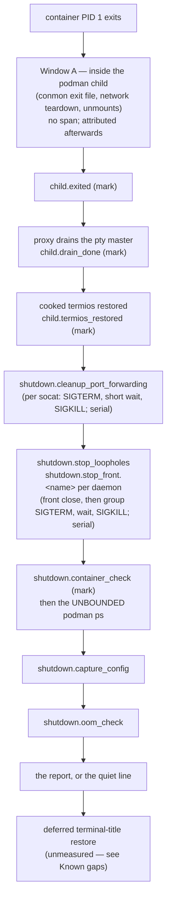

# Timing spans — `--timing`, `perf_logging`, and the host perf log

**Status:** CURRENT as of 2026-09-09, verified against `ca47c608`.

yolo times its own launch and shutdown as a set of named **spans** recorded by a
host-side collector, so the question "who is holding my shell prompt after the
agent exited?" has an answer with names in it. Every opt-in writes the spans to a
per-workspace file as they happen; only an explicit per-invocation flag prints
the table. The stretch yolo cannot time — podman's own post-exit cleanup, where
no yolo code runs — is attributed afterwards from podman's event log. The jail
has a second, older timing half of its own (the entrypoint's boot checkpoints),
which this system reads and prints but does not own.

| Component | Lives in |
| :--- | :--- |
| The collector: spans, marks, sinks, the report renderer | `internal/perf` (`Log`, `Span`, `Event`, `Sink`, `SlowSpanThreshold`) |
| The incremental file sink and its retention | `internal/perf` (`FileSink`, `MaxRuns`) |
| The two gates, collector construction, the report | `internal/cli/run` (`Options.timingRecording`, `Options.timingReporting`, `initPerf`, `emitTimingReport`) |
| Window A attribution from `podman events` | `internal/cli/run` (`attributeWindowA`, `parseDieAndCleanup`) |
| The `child.*` marks: the tty proxy's stage hook | `internal/ttyproxy` (`StageHook`, `RunWithProxyHooked`), `internal/cli/run` (`runWithProxy`) |
| The `image.*` spans inside the image load | `internal/image` (`Options.Perf`) |
| The jail half's switch: the argv pair and the bash timers | `internal/cli/run` (`assembleRunCmd`, `buildFinalInternalCmd`) |
| The global `--verbose` / `-v` flag | `internal/cli` (`applyVerboseFlag`, `explicitVerbose`) |
| `yolo stop`'s spans | `internal/cli` (`stopJail`), `internal/cli/run` (`TimingLogFor`) |
| The host-process env opt-ins | `internal/paths` (`TimingEnv`, `VerboseEnv`) |
| The persistent config key | `internal/config` (`PerfLoggingEnabled`) |

**Reads with:** [`USER_GUIDE.md`](../guides/USER_GUIDE.md) (the flag as a user sees
it), [`jail-home.md`](../reference/jail-home.md) (the `<workspace>/.yolo/` state
directory both log files live under), [`image-staging-vs-baking.md`](image-staging-vs-baking.md)
(the load-cost model the `image.*` spans measure). `yolo config-ref` is the
authority for the `perf_logging` key and the two environment variables; this doc
does not restate it.

---

## Principles

**P1. Recording and reporting are separate gates.** Every opt-in records to the
file; only an *explicit, per-invocation* flag prints. A persistent setting — a
config key, a variable exported from a shell profile — is "always on", and an
always-on table scrolls away whatever the user was reading at every jail quit.
The rule for classifying the next opt-in, whatever it is: **an explicit
per-invocation flag prints; a persistent setting records silently.**

**P2. Best-effort, always, and free when off.** A timing logger that can fail a
launch is a worse bug than the blindness it fixes. No method on the collector
returns an error; a sink that hits one warns once and goes quiet. Every method is
a no-op on a nil collector, so call sites are unconditional — there are no
`if timing {}` guards around the spans themselves, and the disabled path is one
pointer check.

**P3. Events reach the sinks as they happen, never at report time.** Two reasons,
both shutdown-shaped: the tty proxy's signal arm leaves the process through
`os.Exit`, where deferred functions do not run, so anything buffered for an
end-of-run dump is lost on exactly the path most worth seeing; and a *hang* is
diagnosable only if the file already shows the last span that started and never
ended. That dangling start line is the answer to "who is doing it".

**P4. The collector's clock is the wall clock.** The run pipeline's `Options.Now`
seam exists so tests can freeze time; a span system built on a frozen clock
reports `0.000s` everywhere under test. The collector is constructed with
`time.Now` and nothing else.

**P5. The host-process opt-ins never cross into the jail.** `YOLO_TIMING` and
`YOLO_VERBOSE` are read by the launcher and deliberately not forwarded. The jail
half is switched by a separately named argv pair whose name shares no prefix with
either, so a grep for one can never match the other and forwarding can never look
intended.

## Vocabulary

- **Span** — a named interval with a start and an end. The field's usual meaning,
  as in [OpenTelemetry](https://opentelemetry.io/docs/concepts/signals/traces/#spans);
  here a span has a name, a duration, and no children or attributes.
- **Mark** — a point event with a name and a timestamp and no duration ("the child
  exited", "the probes are done"). Ours; the entrypoint's boot log uses the word
  the same way. Not a span: a mark can never dangle, which is why the one step in
  the shutdown chain that cannot be bounded is recorded as a mark
  (see [The shutdown path](#the-shutdown-path)).
- **Window A** — the stretch of a shutdown that happens entirely inside the
  `podman run --rm` child, after the container's PID 1 dies and before the podman
  process exits: conmon writes the exit file, podman removes the container,
  tears down the network and unmounts the overlay root and every bind. No yolo
  code runs there, so no span can cover it; it can only be *attributed* after the
  fact. Coined in the design this reference replaces (2026-09-06).
- **The host half / the jail half** — the two timing records one launch produces.
  The host half is this system's file and table. The jail half is the
  entrypoint's own boot checkpoints, always on, appended to a file in the jail
  home that bind-backs onto the same `<workspace>/.yolo/` tree; this system
  prints it as part of the full report and otherwise leaves it alone.
- **The recording gate / the reporting gate** — the two questions P1 separates:
  does this launch collect spans and write the file; does it print.

## The two gates

| Opt-in | Kind | Records | Prints |
| :--- | :--- | :---: | :---: |
| `--timing` (run flag) | per-invocation | yes | yes |
| `--verbose` / `-v` (global flag, before the subcommand) | per-invocation | yes | yes |
| `perf_logging: true` (user config) | persistent | yes | no |
| `YOLO_TIMING`, `YOLO_VERBOSE` non-empty in the environment | persistent | yes | no |

The reporting gate is the two explicit flags and nothing else. The recording gate
is the reporting gate *or* any persistent opt-in. A printing launch prints three
things: the host-side span table, the Window A attribution line beneath it, and
the jail half's `=== YOLO Jail Profile ===` block, which the launcher switches on
by putting the jail-half argv pair on the container command line
([The jail half](#the-jail-half)). A launch that records without printing gets
one dim line at exit naming the file, so a `perf_logging` turned on months ago is
still discoverable — and it keeps the live slow-span notices, because one line
naming a culprit while the user is still waiting is the opposite of a table
nobody asked for.

**`--verbose` is a global flag**, stripped at the front door before subcommand
resolution — the same pattern as `--user-layer` — and published to the process
environment as `YOLO_VERBOSE`, so every subcommand and every nested `yolo` sees
it without each flag parser growing its own copy. The scan stops at `--`, so a
`-v` meant for the command the jail runs is left alone. It has no vocabulary of
its own yet: it enables exactly the timing surface `--timing` does, and exists so
non-timing diagnostics have a gate to grow into that does not further load the
word "timing".

> [!WARNING]
> **The published flag and the inherited variable are the same variable.**
> Because `--verbose` publishes itself as `YOLO_VERBOSE`, a typed `--verbose` and
> a `YOLO_VERBOSE=1` exported from a shell profile are indistinguishable to every
> `Getenv` reader downstream — and P1 requires them to differ. The distinction is
> carried **in-process**: the front door records that the flag was *typed* on this
> invocation (`explicitVerbose` in `internal/cli`) and hands it to the pipeline as
> `run.Options.Verbose`. Do not try to carry it in a second environment variable:
> it would be inherited by the next `yolo` too, which is the very thing being
> distinguished. For the same reason, nothing may fold a persistent opt-in into
> `Options.Timing` — that field means "typed on this invocation", and folding the
> config key into it is exactly what erased the distinction before the two gates
> existed. The persistent config answer lives in its own field, read once, and only
> when no explicit flag has already answered.

**`perf_logging` is user-scope only and fails closed.** It is read directly from
the user config at the very top of a launch — before any merged config exists,
which is what lets the probes and pack staging be spanned — so a workspace value
is never consulted, and the validator refuses the workspace spelling rather than
let it look accepted. The scope is also a boundary: the workspace is bind-mounted
read-write and agent-editable, and a workspace key would let whatever runs in the
jail switch on logging that writes into the workspace it is already editing. An
absent, false, or unreadable value is off: an opt-in to output must not start
writing files because a config failed to parse.

**`yolo stop` is the same rule in its small form.** It has no `--timing` of its
own; recording rides the two environment opt-ins only (the config key is not
consulted there), and the report prints only when the global `--verbose` was
typed on that invocation. It is the command reached for when a session is already
wedged, which is why it is measured at all.

## How the collector works

`internal/perf` is a leaf package with no internal imports, because the
candidates for a shutdown delay span four subsystems — podman's cleanup, the tty
proxy's drain, loophole teardown, the signal arm's stop — and the recorder has to
be callable from all of them without any of them importing the others.

A `Log` holds the in-memory event record and fans each event out to its sinks
**the moment it is recorded**, outside its own lock (P3; sinks lock themselves).
`Span` starts a named span and returns a handle whose `End` is idempotent, so a
manual end plus a deferred end cannot double-record; `Mark` records a point
event. Both are safe to call from any goroutine — spans end on the tty proxy's
signal goroutine while the main goroutine may be reporting. A nil `*Log`, the
shared `Disabled()` log, and a nil `*Span` are all fully inert (P2).

Two sinks are wired by the run pipeline:

- **The file sink** — one line per event, appended as it happens
  ([Where the log lives](#where-the-log-lives)).
- **The slow-span notice** — one dim stderr line, `<name> took N.NNNs`, the moment
  a span ends past the slow threshold. The culprit announced live, without waiting
  for (or ever reaching) a report. The threshold is a second rather than anything
  finer because the delays this exists to catch are seconds.

**The report** renders the completed events in the same register as the
entrypoint's boot log — elapsed-since-start, `+delta` from the previous line, the
label — plus a duration column the entrypoint has no need for, so the two halves
of one launch read as siblings. Marks print with a `-` duration. **Starts are
never rendered**: they exist for the file, where a dangling one names a hang. The
report is a rendering of the in-memory record and adds nothing to the file.

The collector's zero of time is its construction, which the run pipeline places
right after the launch's early refusals and before the first probe — so a refused
launch writes no file, and the total covers the probes and staging that the old
single-stopwatch `Total` excluded. `yolo --version` under `YOLO_TIMING=1`
constructs nothing and writes nothing: only the run pipeline (and `yolo stop`)
builds a collector.

> [!WARNING]
> **Construct the collector with `time.Now`, never with `Options.Now`** (P4). The
> seam is right there in the same struct and it is the obvious thing to reach for;
> under test it is frozen, and every span then reports `0.000s`.

> [!WARNING]
> **Never buffer events for an end-of-run write** (P3). The signal arm exits the
> process via `os.Exit` inside the tty proxy, where defers do not run. This was
> proved on a real pty: SIGTERM to the launcher put the `terminate.*` spans in the
> file *after* the arm's exit and printed the report at rc 143 — an end-of-run dump
> would have lost the whole record on the one path most worth seeing. The same
> rule is why the file sink trims at *open* and never rewrites at exit.

## What is spanned

Span names are dotted, `<family>.<step>`, and the family says which arm of the
lifecycle a line belongs to. The full set is one grep — `Perf.Span(` and
`Perf.Mark(` under `internal/` — and is not repeated here; these are the families
and the members that carry meaning:

| Family | What it covers | Worth knowing |
| :--- | :--- | :--- |
| `probes.done` (mark) | the end of the repo-root / storage / config / runtime probes | the first line of every launch after the header |
| `launch.*` | every host-side step from staging to the child window: auto-capture, orphan reaping, briefing refresh, the workspace lock, the jail prefix, the image load, workspace state, argv assembly, port forwarding, loophole start, and `launch.run_with_proxy` — the whole child window under one span | `launch.auto_capture` was added after the first real run put most of a two-minute launch in an unspanned installer capture: **a span table's holes are only visible on a real launch** |
| `image.*` | inside `launch.auto_load_image`: the nix build, the stream load, the tar materialize | split because one span over four unrelated things measured minutes on a real host with no way to say which; the fixes for a slow build and a slow stream have nothing in common |
| `assemble.*` | the two argv-assembly steps that run subprocesses: the host-loopback probe and the host git identity | |
| `child.*` (marks) | the tty proxy's own transitions: `spawned`, `exited`, `drain_done`, `termios_restored` | `child.exited` → `child.drain_done` bounds the proxy-drain hypothesis; a path that skips a stage (a non-tty stdin, the non-Linux fallback) simply never reports it |
| `housekeeping.slot` | the post-launch housekeeping slot, on the proxy's `onStarted` goroutine | runs *concurrently with the child*, so it overlaps `launch.run_with_proxy` by design |
| `shutdown.*` | the normal-exit teardown chain | see [The shutdown path](#the-shutdown-path) |
| `terminate.*` | the signal arm's teardown chain | the same steps under a different family, so the report says which arm ran |
| `attach.exec` | the attach arm's child window (a second session into a running jail) | almost no teardown of its own: if the symptom reproduces here the delay is inside the runtime's `exec` |
| `stop.*` | `yolo stop`'s inspect and stop | |

## The shutdown path

What happens between "the agent's process exited" and "the shell prompt
returns", and which line in the record covers each step.

**The normal arm.** The proxy loop sees the child exit, drains whatever the pty
master still holds, restores the host terminal, and returns; `launch.run_with_proxy`
ends there. `teardownAfterExit` then runs the `shutdown.*` chain in the order
drawn. Every step in it is bounded except one: the container-liveness check
inside `stopLoopholes` runs the runtime's `ps` with no timeout, which is why it is
recorded as a **mark** placed immediately before the call — if the runtime hangs
there, that mark is the last line in the file, and the dangling record names
where the prompt went to die.

**The signal arm.** On SIGHUP (window close) or SIGTERM, the tty proxy's signal
goroutine restores cooked termios, runs `onTerminate`, and exits the process with
`128 + signal`. `onTerminate` runs the `terminate.*` chain: stop the jail
(the runtime's own graceful stop, bounded), clean up port forwarding, release the
lock, stop the loopholes, capture config — and then prints the report as its
**last statement**. Both arms run on this path: the terminate arm's stop is what
makes the child exit, which unblocks the normal arm mid-teardown. That
interleaving is ordinary, not a fault, and it is why the report is guarded to print
once per `Run` — one table and one Window A query, not two.

**The attach arm.** A second session into a running jail spans `attach.exec`
around the runtime's `exec`, gets the same `child.*` marks, runs only the OOM
check, and reports.

**Platform shape.** The signal arm exists only where the tty proxy does — Linux,
with a tty on stdin. A non-tty stdin (a pipe, CI) or the non-Linux fallback runs a
plain foreground exec: `child.spawned` and `child.exited` are marked, there is no
drain, no termios stage, and no `onTerminate`, so a signal there tears nothing
down and reports nothing.

> [!WARNING]
> **In `onTerminate`, the report is the last statement, and nothing may follow it.**
> The proxy calls `os.Exit` the instant the closure returns; a statement placed after
> the report never runs, and a report moved into a `defer` never prints. On the
> normal arm the report prints inside `Run`, after the teardown chain and before
> `Run` returns — which is what keeps it ahead of the caller's deferred
> terminal-title restore, so it never interleaves with the returning shell prompt.

> [!WARNING]
> **The once-guard is a pointer on `Options`, not an embedded `sync.Once`.** `Run`
> takes `Options` by value, and `go vet`'s copylocks check refuses a struct that
> carries a lock by value. It is created exactly when a collector is, so a nil guard
> *is* "this launch recorded nothing" — the recording gate read off the state it
> produced rather than re-evaluated at exit.

## Window A attribution

After the child exits, a printing launch asks podman's own event log for the
container's `die` and `cleanup` events and renders the `die → podman exit` gap
beneath the table — the only way to see inside a stretch where yolo has no code
running. The query is bounded three ways so the diagnosis can never become the
delay: it runs only on the podman runtime (Apple Container has no events
command), it carries a short exec timeout, and it always passes `--until`,
because `podman events --since` alone *streams* on the journald backend and never
returns. The first `die` wins (a stop-timeout escalation can produce several) and
the last `cleanup` wins (it is the terminal one).

Every failure mode is a dim one-line **reason** beneath the table — timed out,
could not run, non-zero exit, no `die` event in the log — rather than silence:
two real-host launches produced no attribution and no way to tell why, and an
observability feature that cannot explain its own blank is the failure it exists
to remove. "No `die` event" is the ordinary case on a host whose rootless
file-backed event log keeps nothing, and is worded as such.

The attribution's own query is itself spanned, and **it runs before the table is
rendered** — its span appeared in the file and was missing from the printed table
until the order was fixed. The line it produces still prints below the table.
Attribution is part of the *report*: a quietly recording launch never runs the
query at all.

> [!WARNING]
> **`--until` must be now, never a moment in the future.** `podman events` treats a
> future `--until` as an instruction to keep watching until that wall-clock moment
> arrives, so it blocks instead of returning what it already has. The first version
> passed the child's exit time plus a few seconds of slack and stalled for the full
> exec timeout on every single launch — a timing feature adding three seconds to the
> thing it measures, found by its own report showing a suspiciously round number
> every run. No slack is needed: attribution runs after the whole teardown chain, so
> "now" is already later than any event conmon has written. Pinned by
> `TestWindowAUntilIsNeverInTheFuture` in `internal/cli/run`.

## The jail half

The jail half is switched on by one variable the launcher puts on the container
argv, and consumed by bash the same launcher generates: `buildFinalInternalCmd`
wraps the in-container phases in timers and, at exit, prints the
`=== YOLO Jail Profile ===` block — the entrypoint's boot checkpoints for this run,
read back from the jail's own perf log, followed by the in-container phase times
and a node-startup comparison — to the terminal. The entrypoint appends its
checkpoints to that log **whether or not** the variable is set; the variable only
decides whether the block is printed. It therefore rides the **reporting** gate:
a quietly recording launch leaves it off the argv.

**Both halves of this switch are host-side.** Nothing in the image or the
entrypoint reads the variable — the launcher emits it and also generates the bash
that reads it, so the two move in one commit and renaming it is skew-free. It was
`YOLO_PROFILE` until 2026-09-08, a name one character from `YOLO_PROFILES`, the
resolved auth-profile table that *is* read in the jail and is an unrelated
mechanism.

> [!WARNING]
> **The jail-half variable must share no prefix with the host opt-ins.** Not
> `YOLO_TIMING` — that is the host-process opt-in P5 says is never forwarded, and
> reusing it would make forwarding look intended. Not `YOLO_TIMING_INNER` either:
> `YOLO_TIMING` is a strict prefix of it, recreating the exact grep collision the
> rename fixed one mechanism over. The test that pins the spelling
> (`internal/cli/run`'s `timingenv_test.go`) deliberately does not share a constant
> with the emit site — nothing in the tree reads the variable, so a shared constant
> would make the assertion tautological.

## Where the log lives

The host half is `<workspace>/.yolo/host-perf.log`, beside `boot.log`. The jail
half's file in the jail home bind-backs onto `<workspace>/.yolo/home/`, so one
directory holds both halves of one launch, and per-workspace files cannot
interleave across concurrent jails.

The file is opened **at construction, not lazily**: the run's header line is the
delimiter the retention needs, and a run that refuses or hangs with zero spans is
exactly the run whose header — and nothing else — you want on disk. Each run is
one header block; each event is one self-contained line carrying a
millisecond UTC timestamp, the kind (`start`, `mark`, `end`), the name, and for
ends the duration — so the host file, the jail's perf log and `podman events`
output can be correlated by eye. Retention is the entrypoint's idiom: at open,
keep the newest runs up to the cap, then append. Nothing rewrites the file at exit
(P3). Each line is a single `O_APPEND` write, so concurrent launches on one
workspace can interleave lines but never split one.

The file's size is structural, not proportional to how long anything took: one
start/end pair per span plus the marks, a couple of kilobytes per launch, bounded
per workspace by the run cap. A pathological thirty-second shutdown writes the
same bytes as a fast one.

If the file cannot be opened, the sink warns **once** (`yolo: timing log
unavailable at …`) and stays installed but silent; the in-memory record and the
stderr report still work, and a jail is never refused over its timing log.

> [!WARNING]
> **This directory is inside the live workspace bind**, so a jail *can* write the
> host's diagnostic record. That is the accepted cost of keeping both halves in one
> place, on the precedent that `boot.log` already lives there. If a jail is ever
> found mutating the host perf log, the shape to move to is the host-global
> `~/.local/share/yolo-jail/logs/` beside `crossings.log`, outside any jail's reach.

## Failure modes

| When | What the system does |
| :--- | :--- |
| The log file cannot be created or opened | one warning, then a silent sink; the launch proceeds and the report still prints |
| The runtime hangs in the unbounded liveness check | `shutdown.container_check` is the last line in the file — the dangling record names the step |
| Any other step hangs | its `start` line is in the file with no `end`; `tail` the file |
| `podman events` times out, fails, or holds no `die` | one dim reason line beneath the table; the table is unaffected |
| SIGHUP / SIGTERM to the launcher | `terminate.*` spans reach the file before the process exits; the report prints from inside the signal arm at rc `128 + signal` |
| Both teardown arms run (the ordinary signal-path interleaving) | one report, one Window A query — the once-guard |
| A persistent opt-in with no flag | the file is written; one dim line names it; no table, no in-container block, no events query |
| Non-tty stdin or a non-Linux host | `child.spawned` / `child.exited` only; no drain or termios marks; no signal arm |
| `macos-user` backend | the collector records the host-side spans up to the backend dispatch and nothing after; no report and no quiet line — see [Known gaps](#known-gaps) |
| A refused launch (the live-overlay guard) | no collector, no file, no directory |

## What this does not do

- It is not a profiler and not a tracer: spans have no children, no attributes,
  and no propagation. The nesting in the report is by name (`image.*` inside
  `launch.auto_load_image`), not by structure.
- It does not instrument the jail. The in-container block is the entrypoint's
  pre-existing boot log plus three bash timers; nothing in this system runs inside
  the container.
- It does not fix any delay it names. The deferred fixes in [Known gaps](#known-gaps)
  are decided; each waits on a span, not on a ruling.
- `--verbose` carries no non-timing meaning. The first non-timing diagnostic that
  wants a gate decides what the flag means; until then it must not sprout meaning
  by accident.
- Nothing here crosses the host↔jail boundary (P5). A second spelling that did
  would be a deploy-skew bug, not a convenience.

## Known gaps

Recorded here rather than omitted. None is waiting on a decision.

### Deferred fixes, each with the trigger that fires it

Each is decided work waiting on evidence, and every trigger is a span this system
already emits — which is the point of having built the instrument first.

| | The gap | The fix | Fires when |
| :--- | :--- | :--- | :--- |
| T1 | the tty proxy's post-exit master drain is a blocking read with no poll guard, so any process still holding the pty slave (a lingering conmon fd is the classic) pins it | guard the read with poll-and-timeout — not on spec, because an unbounded drain that never blocks in practice is not worth exit-semantics churn | `child.exited` → `child.drain_done` shows a real gap |
| T2 | the container-liveness `ps` inside `stopLoopholes` runs with no timeout, mid-chain, so a hung runtime holds the prompt forever | bound it at a few seconds, derived from what a healthy shutdown's spans cost rather than guessed | `shutdown.container_check` is a dangling last line, or the healthy-chain spans are in hand to derive the bound |
| T3 | `hostservice.serveListener`'s in-flight wait is unbounded, so an accepted-but-idle connection pins a daemon until the group SIGKILL | a read deadline on the request header | a `shutdown.stop_front.<name>` span at the SIGTERM-to-SIGKILL wait |
| T4 | `stopLoopholes` stops daemons serially, so the worst case is the sum rather than the max | parallelize **only** after measurement — the serial order may be load-bearing for shared fronts, and that has to be checked before it is broken | the shutdown chain is measured on a real host and the sum is the term that matters |

> [!IMPORTANT]
> **T4's trigger has already half-fired, in the direction of NOT doing it.** The
> first real runs put the entire `shutdown.*` chain at tens of milliseconds
> ([What has been measured](#what-has-been-measured)). A nested jail cannot speak
> for the maintainer's storage and network stack, so that does not settle it — but
> it does mean parallelising teardown is currently a solution to a 45 ms problem,
> and whoever picks it up should re-read that number first.

### The title-restore span cannot fire

`internal/cli` spans the deferred terminal-title restore as `process.title_restore`
on the `Options` value it passes to `run.Run` — but `Run` takes `Options` by value
and constructs the collector on its own copy, so the caller's collector is always
nil and the span is a permanent no-op. The restore runs subprocesses with no
timeout of their own and is the last unmeasured step between the report and the
shell prompt. Nothing pins the span, which is how it shipped dead. The fix is a
collector the caller can see (construct it before `Run`, or have `Run` return it);
until then the step is unmeasured, and the report's `Total` ends before it.

### `macos-user` native runs have no collector past dispatch

The collector is constructed at the top of `Run` for every backend, so a
`macos-user` launch records the probes and staging spans. The dispatch then
returns the native arm's result directly: nothing after it is spanned, no report
prints, and the quiet line does not either. The proxy seam that arm uses carries a
bare `Options` with no collector, deliberately, until the arm grows one.

### The motivating symptom is unconfirmed

The 30-second post-exit wait that motivated this system has not been attributed,
because every measurement so far was taken in a **nested jail**, which is
structurally blind to it: podman-in-podman forces `--net=host`, and the nested
store, image and mount set are not the maintainer's. Window A is exactly the
stretch whose cost is a property of the real host's storage driver and network
stack — the same blindness [AGENTS.md](../../AGENTS.md) records for
reachability. The measurement that settles it is one `--timing` quit on the real
host, whose report names the arm and whose `host-perf.log` survives it.

### What has been measured

One nested-jail launch set, 2026-09-06, podman 5.8.4 — the instrument's first
answers, kept because they say where *not* to look next. They are one machine's
numbers on one day and do not price the real host.

| Span | Measured |
| :--- | ---: |
| `launch.auto_capture` | 109.0 s on the first launch; 0.002 s once captured |
| `launch.auto_load_image` | 7.3 s warm; 85.9 s after a store prune (cold) |
| `launch.run_with_proxy` (the whole child window) | 4.6 – 7.8 s |
| the entire `shutdown.*` chain | 0.045 s |
| `shutdown.window_a_podman_events` | 0.019 s (3.002 s before the `--until` fix) |
| the log file, one launch | 2,194 bytes / 35 lines |
| wall clock added after the child exit, whole chain including attribution | 39 ms |

The seconds live in the image load and the installer capture, which are launch
costs; on that host, in that mode, teardown was not the delay. The instrument now
distinguishes the two, which nothing could before.

## Current values

Verified at `ca47c608`. The prose above says what each of these is for; this table
is the only place the exact values and spellings are stated.

| Value | Setting | Defined in |
| :--- | :--- | :--- |
| Run flag | `--timing` | `internal/cli` (`runcmd.go` usage, `run.Options.Timing`) |
| Global flag | `--verbose`, `-v` | `internal/cli` (`verboseFlags`) |
| Host-process env opt-ins (any non-empty value) | `YOLO_TIMING`, `YOLO_VERBOSE` | `paths.TimingEnv`, `paths.VerboseEnv` |
| Persistent config key (boolean, user scope only) | `perf_logging` | `internal/config` (`perfLoggingKey`, `PerfLoggingEnabled`) |
| Jail-half argv pair | `-e YOLO_JAIL_TIMING=1` | `internal/cli/run` (`assembleRunCmd`) |
| Host perf log | `<workspace>/.yolo/host-perf.log` | `run.HostPerfLogName`, `paths.WorkspaceStateDir` |
| Jail perf log | `~/.yolo-perf.log` in the jail, backed by `<workspace>/.yolo/home/yolo-perf.log` | `internal/entrypoint` (`perfLog.dump`), `internal/cli/run` mount args |
| Run header prefix (also the trim delimiter) | `=== YOLO Host Perf (<timestamp>) jail=<name> ===` | `perf.runPrefix`, `perf.FileSink` |
| Runs retained per workspace | 50 | `perf.MaxRuns` |
| Slow-span notice threshold | 1 s | `perf.SlowSpanThreshold` |
| Report header | `--- Host-side timing (rc <n>) ---` | `run.emitTimingReportLocked` |
| Quiet line | `yolo: timings recorded in <file> (--timing prints them)` | `run.noteTimingLogLocation` |
| In-container block header | `=== YOLO Jail Profile ===` | `run.buildFinalInternalCmd` |
| Window A query | `podman events --since <collector start> --until <now> --filter container=<name>` | `run.attributeWindowA` |
| Window A query timeout | 3 s | `run.windowAEventsTimeout` |
| Signal-arm jail stop | runtime `stop -t 5`, exec bounded at 10 s | `run.teardownStopTimeoutSeconds` |
| Signal-arm exit code | `128 + signal` | `internal/ttyproxy` |
| Loophole front close grace | 2 s | `run.frontStopGrace` |
| Loophole group SIGTERM → SIGKILL wait | 5 s | `internal/cli/run` (`loopholesruntime.go`) |
| socat SIGTERM → SIGKILL wait | 2 s | `run.cleanupPortForwarding` |
| Slow-span notice text | `yolo: <name> took N.NNNs` (dim) | `run.initPerf`, `run.TimingLogFor` |

## Why it's this way

The design this reference replaces carried a ledger, D1–D14, whose IDs are cited
in code comments across `internal/`. The rows below are the rulings a maintainer
might otherwise undo; the rest (D4 the untouched jail half, D7 the slow-span
notice, D10 the auto-capture span) are absorbed into the body above and need no
defence.

| Ruling | Why a maintainer would otherwise undo it |
| :--- | :--- |
| D1 — grow `--timing`; add a global `--verbose` that aliases it | Coining a third performance flag is the obvious move; `--timing` already existed, was documented, and already switched the jail half. `--verbose` exists so the *next* diagnostic has a home that does not further load the word "timing" |
| D2 — the log lives in `<workspace>/.yolo/`, beside `boot.log` | The host-global logs dir is safer (out of the jail's reach) and looks like the right place; per-workspace was chosen so both halves of one launch sit in one directory and concurrent jails cannot interleave. The safer shape is named in the warning above for the day it is needed |
| D3 — events reach the sinks as they happen | An end-of-run dump is simpler and is what every other log here does; it loses the whole record on the `os.Exit` path and can never show a hang |
| D5 — `YOLO_TIMING` / `YOLO_VERBOSE` are host-process only, never forwarded | Forwarding "so the jail half turns on too" is the natural convenience; a second host↔jail spelling is a skew bug, and the jail half has its own name for exactly this reason |
| D6 — the signal arm's report prints *inside* `onTerminate`; the normal arm's before `Run` returns | Moving the report to a `defer` or to the caller reads cleaner and never prints on the signal path |
| D8 — the collector's clock is `time.Now`, never `Options.Now` | The seam is in the same struct and every other time read in the pipeline uses it; under test it is frozen |
| D9 — Window A attribution: podman only, `--until` always, short timeout, best-effort | Dropping `--until` (it looks redundant with `--since`) makes the query stream forever on journald; dropping the runtime gate runs a podman command against Apple Container |
| D11 — the report is once-per-`Run`, guarded by a `*sync.Once` on `Options` | Both teardown arms legitimately run on the signal path, so "the second report is a bug in the arms" is the wrong diagnosis; the pointer form is what vet's copylocks requires of a by-value `Options` |
| D12 — recording and reporting are separate gates | Folding the config key into `Options.Timing` is the one-line "fix" that reunites them and brings back a table at every jail quit. The classification rule is P1 |
| D13 — the jail-half variable is `YOLO_JAIL_TIMING` | "Match the flag" argues for `YOLO_TIMING`, which D5 forbids; `YOLO_TIMING_INNER` recreates the prefix collision the rename fixed. The rename itself was long blocked by a false premise — that the variable was a host↔jail wire contract — when both halves are host-side |
| D14 — `--verbose` gets no vocabulary until something needs one | Giving it meaning ahead of a consumer is a vocabulary nobody has lived with; the first non-timing diagnostic decides |
