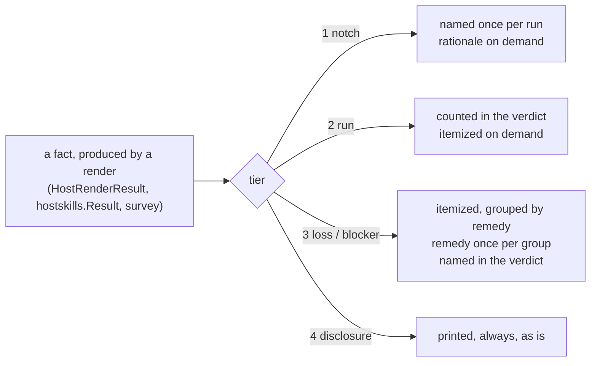

# Report tiers — what `yolo host apply` and a launch decide to print

**Status:** CURRENT as of 2026-09-13, verified against `71e86789`.

Two commands in yolo produce long output for three different readers: `yolo host apply`, which
renders pack surfaces into a real `$HOME`, and a container launch. A **report tier** *(coined
here)* is the class of fact a line states, assigned **where the fact is produced** — in the result
structs and the survey — and consumed by the printer to decide *whether* the line prints, *how many
times*, and *under which flag*.

A tier is deliberately neither a log level nor a severity. A level is a property the emitter picks
in the moment; a tier is a property of the fact, so two emitters stating the same fact get the same
tier. Severity cuts across it: a kind refusal is a refusal and sits in tier 1, while an MCP entry
loss is a warning and sits in tier 3.

Above the tiers sits the thing they serve: **the command states its own result.** Every `host
apply` run — in both postures, on every branch, including the degenerate ones — ends in one
sentence saying how it went, with the counts underneath it as evidence rather than in place of it.

| Component | Lives in |
| :--- | :--- |
| The tier vocabulary and the roll-up that carries it | `internal/cli` (`reportTier`, `tierRun`, `tierLoss`, `hostApplySurvey`) |
| The verdict line, the counts, the footer | `internal/cli` (`printHostApplyVerdict`, `hostApplyVerdict`, `hostApplyOutcome`) |
| Tier-3 grouping and the remedy contract | `internal/cli` (`hostDepBlockers`, `depBlockerGroups`, `printRemedyGroups`) |
| The default/detail split | `internal/cli` (`reportVerbose`, `reportDestination`, `hostapplydetail.go`) |
| Tier-1 notch facts, said once | `internal/cli` (`hostapplynotch.go`) |
| The dependency pre-flight and its gate | `internal/cli` (`resolveHostDeps`, `gateHostDeps`, `hostDepFinding`), `internal/depcheck` |
| The machine document, and the acting posture's refusal | `internal/cli` (`buildHostApplyDoc`, `emitHostApplyDoc`, `jsonRefusedForPosture`, `refuseJSONForActingApply`) |
| The launcher's half of one launch's record | `internal/cli/run` (`launchLog`, `LaunchLogName`) |
| The boot catalog's compression | `internal/entrypoint` (`CatalogInstalledOrphans`, `catalogSummary`) |

**Reads with:** [`host-apply-staleness.md`](host-apply-staleness.md) (the change predicate and the
survey's gate semantics, which this doc consumes and does not alter),
[`self-documenting-cli.md`](self-documenting-cli.md) (the machine-readable-output requirement whose
boundary this extends from verb to posture),
[`information-at-the-point-of-need.md`](information-at-the-point-of-need.md) (where reasoning goes
when it leaves a report), [`perf-logging.md`](perf-logging.md) (the `--verbose` flag's reservation,
and the per-workspace log precedent `launch.log` inherits).

For the flags themselves — `--assert`, `--verbose`, `--format` — run `yolo host apply --help`. That
is the authority for the surface; this doc is the mechanism behind it.

---

## Principles

Cited by number from sibling docs and code comments. **P7 is the one the other seven serve** — it
is numbered last so the existing P1–P6 citations keep resolving, not because it ranks last.

- **P1 — One fact, once.** A property of the *notch* is stated once per run. A property of the
  *pack set* is stated once per set. A per-destination fact is stated per destination only when it
  is a change or a loss.
- **P2 — Every loss names its remedy, in copy-paste form, and names the scope the remedy covers.**
  A loss with no remedy says so rather than borrowing a `⚠` it cannot cash. Feedback belongs at the
  point of the act, so the message at that point has to carry the whole load — nothing else will.
- **P3 — Facts and remedies; the *why* lives in the manual.** The report states what is true of
  this run and what to do about it. The reasoning behind a rule is for the person changing the
  rule, not the person meeting it
  ([`information-at-the-point-of-need.md`](information-at-the-point-of-need.md), *What about the
  reasoning?*), and P8 says where it goes instead.
- **P4 — Disclosures are never suppressible.** Progress and provenance may be compressed to a line,
  but the decision they report stays visible on every launch. A quiet mode that could hide the
  host-access banner would delete the one thing
  [`OQ-TP9`](../design/trust-paths.md#decision-ledger) kept when it deleted the approval gate.
- **P5 — No silent skip survives this.** The census invariant is *named*, not *itemized*: a kind
  the host notch refuses appears in the report, and appearing once is appearing.
- **P6 — Counts count what the reader cares about.** Files, keys, servers, skills — not the
  destinations a loop visited; and "in sync" means *compared and equal*, not *not compared*.
- **P7 — The command states its own result; the reader never computes it.** Every run ends in one
  sentence saying how it went, and the counts sit underneath that sentence rather than standing in
  for it. A reader who has to sum lines to learn the outcome is being handed the command's own job.
  The corollary is the sharper half: a finding that decides the outcome belongs **in** the result,
  not merely somewhere in the stream that scrolled past.
- **P8 — The report states facts, not rationale.** The reader is experienced with this tool, and
  explaining a design decision to them is what a manual is for. Terse and consistent beats
  self-explaining, which is why P8 comes with a closed vocabulary
  ([the report vocabulary](#the-report-vocabulary)): one fixed word per outcome, used everywhere,
  never varied for the sake of prose. The carve-out is explicit — a sentence or two where something
  really is unique to this run.

## Invariants

- **A tier is assigned where the fact is produced, never where it is printed.** The result structs
  and the survey carry it; the printer only reads it. An emitter that picks its own rendering is
  the failure this whole mechanism replaces.
- **The verdict prints on every path, in both postures**, the zero-packs branch included. Both
  branches are callers of `printHostApplyVerdict`.
- **Every tier-3 class is represented in the verdict.** A loss contributes a count; a blocker
  contributes its *name*. Grouping may compress the lines above the verdict; it may never leave the
  verdict silent about a class.
- **No default view omits a loss or a blocker.** Grouping compresses the *lines*, never the *set*:
  every dropped entry name, every adopted skill name and every missing binary appears in the
  default view, in its group, and again by class in the verdict line.
- **The user's existing value is never printed, at any verbosity.** A config value can be a
  credential and a terminal transcript gets pasted into bug reports. The *incoming* value is the
  pack's declaration and may be shown under `--verbose`.
- **A dependency yolo could not probe is not missing.** A contribution with no `bin`, or one the
  probe never saw, is *not probed* and counts separately. yolo may not call an environment unready
  on evidence it does not have.
- **Silence is NO.** `promptYesNo` returns false for a nil stdin and for EOF, so an unattended
  `--assert` refuses rather than installing.

## The tiers

| Tier | Definition | Default rendering | `--verbose` adds |
| :--- | :--- | :--- | :--- |
| **1 — Notch facts** | True of this notch regardless of the home: which kinds do not apply here, the autonomy posture | one line per run, naming the kinds and the posture in [the vocabulary](#the-report-vocabulary)'s words | which pack declared each — a fact. Never the reasoning; that is the manual's (P8) |
| **2 — Run facts** | Vary with the home but need no action: in-sync, skipped and unchanged surfaces, composed-from, inferred destinations, would-render surfaces, and a declared dependency that is **present** | counted in the verdict; a `would render` config surface is itemized | every destination, and the per-entry lines |
| **3 — Losses and blockers** | Two members, one treatment. A **loss**: something of the user's is replaced, dropped, moved or archived. A **blocker**: something stands between this home and a completed apply — a missing declared dependency, a refusal, a pack that failed to render | always itemized, grouped by remedy, each group carrying its remedy once, and every group represented in the verdict line | the per-destination expansion of each group |
| **4 — Disclosures** (launch only) | Host access this launch has: pack read/exec claims, the cache alias, passthrough, the loopback verdict | always, unchanged, never grouped or compressed | nothing — there is no more to say |

**Only tiers 2 and 3 have constants.** `reportTier` declares `tierRun` and `tierLoss` and stops,
because tiers 1 and 4 have no per-destination representative: a notch fact is true of the *notch*
rather than of a destination, and a disclosure belongs to a *launch*.

**Why losses and blockers share a tier.** They differ in whose problem they are and agree on
everything the tier decides: both are always itemized, both carry a remedy stated once, and both
change what the verdict line says. A tier is a rendering decision, so two facts that want the same
rendering are one tier. Dependency state splits across tiers for the same reason — *present* needs
no action and is counted (tier 2); *missing* blocks the apply and is named (tier 3).

The fatal refusals — an `agents` selector naming nobody, a doubly-owned surface, a name claimed
twice — are tier 3 in shape and already right: they itemize, they name the fix, and they exit 1
before anything renders.

## The verdict block

Two parts, in this order: the **verdict line**, which states the result, and the **counts**, which
are the evidence for it. The ordering is P7 — a reader who stops after one line still has the
answer.

### The outcome, as a stable token

`hostApplyOutcome` reduces a run to one of six tokens, and **the order of the cases is the ruling**.
It lives in one function rather than in the sentence builder so the token and the sentence cannot
disagree about the outcome they report.

| Token | The run found |
| :--- | :--- |
| `no_packs` | no packs are configured. Distinct from `nothing_to_do`, and the difference is the next action: one is *your config names nothing*, the other *your home already matches what it names* |
| `incomplete` | a pack failed to render, so the counts are missing its surfaces |
| `blocked` | a declared dependency is missing. **Dry run only** — an `--assert` with one is refused by the gate before it reaches a verdict at all |
| `nothing_to_do` | this home already matches what the packs declare |
| `applied` | an `--assert` wrote what it planned |
| `would_complete` | a dry run that found work and no blocker |

The precedence is what makes it a result rather than a summary. A **blocker outranks
`would_complete`** because a blocker is what decides the outcome. A **render failure outranks a
blocker** because it has already cost the run a pack's worth of surfaces — every count is missing
them, so no verdict may claim a completed apply out of an incomplete traversal.

`nothing_to_do` carries one subtlety worth keeping: it requires *both* no changes and no adoptions.
An adoption composes the file out of what it already holds, so the canonical one reproduces the
bytes and reports no change — while having copied the user's file into a slot there is one of,
forever. A run that walked through a one-way door is not a run with nothing to do.

> [!WARNING]
> **The tokens name the outcome, never the posture.** `nothing_to_do` is the same finding in a dry
> run and an `--assert`; only the sentence differs, because the sentence is what the posture
> changes. A consumer branches on these, so they change only when the set of distinguishable
> outcomes does.

### What the verdict does not cover

The early refusals — an `agents` selector naming nobody, a doubly-owned surface, a name claimed
twice, a declined loss confirmation — each already end in their own result sentence naming that
nothing was written. A second verdict there would be a second sentence about one outcome.

### The counts

Each count is chosen by P6 — the unit the reader cares about, not the loop count.

| Count | Unit | Source |
| :--- | :--- | :--- |
| config files that would change | files | the survey's `config` changes |
| surfaces adopted | surfaces | `HostRenderResult.Archived` |
| skills that would move, union or archive | skills, deduplicated by name | the skills results |
| destinations compared and unchanged | destinations | `WouldChange == false` **and** the render compared content |
| values of yours replaced | keys, with the file count | `HostRenderResult.Overwrites` |
| MCP entries dropped | servers × agents, said as *N servers from M agents* | `HostRenderResult.EntryLosses` |
| kinds that do not apply at this notch | kinds | `HostFields().Refuse` over the declared kinds |
| declared dependencies present, missing, not probed | binaries | `resolveHostDeps` |
| first apply into this home | flag | `HostRenderResult.FirstApply` |

The footer states the **posture**, never this run's action: the verdict has already said what
happened, and an `--assert` over a settled home writes nothing, so a footer claiming a write would
contradict the sentence above it. The dry run's footer also names `--verbose`, because the default
view counts what it does not itemize and the reader has to be told the word that produces it.

## The remedy contract

Every tier-3 group states **what** is lost or blocked, **whose** it is, **where**, and **the remedy
in a form that can be pasted**, naming the scope the remedy covers. Grouping is by *remedy key* —
the config key, the local-pack path, the missing binary, or "none" — never by text similarity.

| Loss class | Group by | Remedy | Scope word |
| :--- | :--- | :--- | :--- |
| MCP entry dropped | the entry name, across agents | declare each under `mcp_servers` in the user config | *in every agent* |
| skill adopted (moved, unioned, archived) | the skill name, across dirs | remove it from the agent dir before applying, to opt one out; otherwise the move is the remedy | *all N dirs* |
| your value replaced by a managed key | the surface | **none exists** at this notch: the line states *managed by the `<pack>` pack* and stops, with no `⚠` | — |
| comment dropped above a changed key | the surface | none possible; stated as a fact under the surface | — |
| first apply would replace a value yolo never asserted | the home | the `[y/N]` prompt on `--assert` (`confirmHostLosses`); in a dry run, the flag in the verdict | — |
| **blocker:** a declared dependency is missing | the binary, across packs | the remedy `depcheck` resolves for the detected manager, plus the package-manager alternative when the primary is the tool's own installer | *this host* |
| **blocker:** the apply refuses | as today — these already meet P2 | — | — |

## Detail on demand

**The compressed view is the default** and **`--verbose` carries the detail.** The operator is the
common reader and the one who stops reading; the auditor is the one who asks for more, and the
footer tells them how.

The `--verbose` view is the exhaustive report reorganized under the same headings: every tier-1
line expanded to name which pack declared each kind, every tier-2 destination itemized, every
tier-3 group expanded to its per-destination lines. Every *fact* the default states survives. The
one thing that does not move behind the flag is the kind-refusal rationale, which leaves the report
altogether — **`--verbose` is a longer report, never a more explanatory one.**

`reportVerbose` reads the **environment**, so a typed `--verbose` and one inherited through
`YOLO_VERBOSE` both reach the report; `explicitVerbose` is deliberately not the gate. A long report
a user asked for in their own shell profile is not the table-at-every-quit that
[`perf-logging.md`](perf-logging.md)'s D12 guards against.

## The report vocabulary

P8 takes the report's explanations away, so the words carry what the paragraphs did. The
**report vocabulary** *(coined here)* is closed: one fixed term per outcome, used at every notch, in
both postures, in the verdict line and in the lines above it. The reader learns this table once
instead of re-reading a paragraph per contribution.

| Term | States | Never used for |
| :--- | :--- | :--- |
| **would change** / **changed** | the destination's content differs from what a render produces; an `--assert` writes it | a destination nothing compared |
| **unchanged** | compared, and equal | a destination that was skipped or refused |
| **skipped** | yolo did not touch it, and it stays the user's | something yolo declined for its own reasons |
| **does not apply** | this kind has no meaning at this notch | anything that stops the apply |
| **refused** | the apply stopped; nothing was rendered | a notch fact |
| **replaces** | a value of the user's is overwritten by a managed key | a key yolo already owned |
| **drops** | an entry of the user's is removed | a replaced value |
| **moves** | a file of the user's becomes yolo-managed in the local pack | a copy — the original does not stay |
| **archives** | content is retired into this run's archive generation | a delete; nothing is deleted |
| **missing** | a declared dependency is not on this host | one yolo could not probe, which is *not probed* |
| **dry run** | the posture that writes nothing | the `--assert` posture, which is *applying* |

Two rows resolve collisions and are worth stating outright:

- **`refused` belongs to the apply, not to a kind.** A kind the notch has no meaning for reads
  *does not apply*, which leaves the word `refused` free for the thing that actually stops an
  apply.
- **The user-facing word for the observing posture is *dry run*.** `observe` stays the posture's
  name in the code, because that is what it is called at the call site; the report says *dry run*,
  because that is the question the reader is asking. One word reaches the user, not two.

### Where the rationale goes

The kind-refusal reasons live in the manual — `yolo config-ref` and `yolo pack --help` — and
**no terminal view prints them, at any verbosity**. `render.HostFields().Refuse` keeps the strings:
it is still what the code decides by, and it is what the drift gate compares the manual against.

> [!WARNING]
> **Moving prose out of a mechanism and into a hand-written doc is how this codebase loses
> documentation, and the only reason it is safe here is the gate.** Retyped text drifts from the
> thing it describes, so the move carries a requirement rather than a hope:
> `TestEveryHostNotchInapplicableKindHasItsReasonDocumented` asserts that every kind the host
> `FieldSet` refuses has its reason documented, with `TestHostNotchDocGateIsNotVacuous` as its
> control. A reason that lands in prose no test reads is exactly the predicted failure. Do not
> move a reason into the manual without extending both.

## The launch stream

A launch keeps its stream shape — a process narrated in time — and adopts the tier vocabulary
without the report layout. **Share the vocabulary, not the layout:** the launch does not get a
verdict block, and the report does not get a progress stream.

| Line | Tier | Treatment |
| :--- | :--- | :--- |
| version banner, `Flake source:`, `Jail binaries:`, `Jail:` | provenance (a decision) | unchanged. Each answers a different question |
| nix build, image delivery, provisioning, `⚡ Executing:` | progress | unchanged; a stream needs its progress |
| pack read/exec disclosures, the argv rewrite, cache alias, loopback verdict, passthrough | **disclosure** | unchanged, and un-gate-able by construction (P4) |
| the config-change diff and prompt | disclosure (approval) | unchanged — [`config-safety.md`](config-safety.md)'s |
| the boot catalog | notch fact with state | **one line**, naming how many installed programs no selected pack declares; the list lands in `boot.log` through the same tee (`CatalogInstalledOrphans`, `catalogSummary`) |
| captured-in-jail-edit notices | run fact **with a remedy** | unchanged — each already meets P2, and five surfaces are five facts |
| the reachability witness, the cgroup line, credential symlinks | run facts / disclosures | unchanged |
| warnings and refusals | tier 3 | unchanged |

> [!WARNING]
> **A launch has no quiet mode, and no flag may be added that could acquire one.** The compression
> above is the whole density control. A flag that could hide a disclosure is refused by P4 — the
> pack read/exec banners are the entire trust boundary, so hiding one deletes what
> [`OQ-TP9`](../design/trust-paths.md#decision-ledger) kept when it deleted the approval gate — and
> a flag that could hide only progress would save four
> lines. `TestTheLaunchHasNoQuietFlag` is P4 as a gate: it fails if such a flag appears on
> `runFlags`, the list an author would reach for. `YOLO_NO_BANNER` is the one hatch and it is
> narrow on purpose (the version line, nothing else).

**The launcher persists its half.** Everything the launcher prints is appended to
`<workspace>/.yolo/launch.log` (`launchLog`, `LaunchLogName`), beside the entrypoint's `boot.log`,
so both halves of one launch sit in one directory. "Too much on the terminal" is answered by
reading the file rather than by hiding the line. The caveat is
[`perf-logging.md`](perf-logging.md)'s D2, inherited whole: the directory is inside the live
workspace bind, so a jail can write the host's record. Nothing reads it back to make a decision.

## Machine consumers

[`self-documenting-cli.md`](self-documenting-cli.md)'s requirement 7 says anything that reports
state must emit machine-readable output on request, and its non-licence says an acting verb refuses
the flag rather than growing a second output mode. `yolo host apply` is an acting verb whose
**default posture is a state report**, so the boundary runs between *postures*, not *verbs*.

- **The dry run emits the document.** It is the survey: destinations with tier, action and path;
  losses and blockers with class, names and remedy key; the counts; the verdict's outcome as a
  stable token; the first-apply flag. It goes through the existing `parseOutputFormat` front end,
  both spellings. It names the kinds that do not apply and **does not carry their prose reasons** —
  rationale is not data.
- **`--assert --format json` refuses**, exit 2, stdout empty. *Nothing to report must still be a
  document*: zero packs emits a document with empty lists and the retire passes' results.

> [!WARNING]
> **The refusal has to stop a COMMAND, not a render.** Reached only from inside the render path it
> stopped the render and left every later stage running — `yolo host apply --assert --shell-init
> --format json` exited 2 with empty stdout and **still appended the PATH line to the user's shell
> rc**, silently, because the confirmation line goes through a sink JSON mode discards. That is why
> `jsonRefusedForPosture` is decided from argv alone and checked at the top of both entry points.
> A refusal that edits a shell rc file is the write P3 forbids.

### Exit codes

The dry run **exits 0 whatever it finds** — its output *is* the finding. `--assert` exits 0 only
when the apply completed, and non-zero names why. The asymmetry is the posture split, not an
inconsistency: a dry run that failed on its own findings would train scripts to ignore its exit
code, while an acting verb that returned 0 over an unready environment would be stating a result it
did not achieve (P7).

`config drift`'s 0/3/4 is the house precedent for a report verb encoding its finding, and it is
deliberately not copied: a dry run that has JSON does not need the exit code to carry the verdict.

## The dependency rule

`program` and `requires` share one probe at the host notch — below the jail notch both ask the host
the same question, so `isDepKind` folds them together. The posture decides the treatment:

| Posture | A declared dependency is missing |
| :--- | :--- |
| **dry run** | **Reported, never prompted.** A tier-3 blocker: itemized with its remedy, named in the verdict line, which says an `--assert` would not complete. Exit 0 — the dry run writes nothing, installs nothing, prompts for nothing |
| **`--assert`** | **Prompted, and a decline is fatal at the prompt.** yolo offers to run the install, showing the command; a NO stops the run there, not at the end. Exit 1, nothing written |

Six properties an implementer would otherwise decide by accident:

1. **The probe is a pre-flight**, run once over every configured pack before the first render. Run
   per pack *inside* the render loop, aborting mid-loop would leave the packs already visited
   written and the rest not. *"We cannot continue"* has to also mean *"nothing was written"*, and
   only a pre-flight delivers both.
2. **Fatal at the prompt, not at the end**, and the reason is forward-looking rather than tidy: a
   later stage of the apply may come to rely on the tool, so continuing past a decline is continuing
   into an environment already known to be incomplete.
3. **One prompt**, listing every missing dependency and the exact command each install would run,
   answered once. The blocker groups print **above** the prompt, whether the answer is yes, no or
   nobody's — that visibility is the protection against a piped `y`, since `promptYesNo` has no
   terminal gate by contract.
4. **Silence is NO**, so an unattended `--assert` refuses rather than installing.
5. **An install that runs and leaves the binary missing is a decline.** The re-probe is the
   command's *answer*, not its exit code: an installer that exits 0 and delivers nothing leaves the
   environment exactly as unready as one that failed loudly.
6. **Both kinds are fatal; only `program` gets the install offer.** `hostDepFinding.installable`
   splits them. Offering to install a `requires` would contradict the kind's own definition, so it
   refuses with the remedy named — and when any blocker is un-offerable the whole set is refused
   rather than prompting for the installable half, because the run cannot complete either way and a
   prompt there would spend the user's `y` on a host this run has already refused.

> [!WARNING]
> **There is no `--ignore-missing-deps`, and adding one is the mistake this section exists to
> prevent.** An escape hatch is for a user's broken configuration, not for a verdict the user
> dislikes. The way to say *"not on this machine"* is to drop the pack from `packs`; the way to see
> the config half regardless is the dry run, which prints everything and writes nothing.

> [!NOTE]
> **The probe does not go through the argv path that mangles forwarded commands.** `depcheck`
> probes with in-process `exec.LookPath`, not by forwarding a command through a launch, so the
> `sudo --login` concatenation found on `macos-user` cannot reach it. That matters because the same
> defect once made a probe run report five successes for commands that never ran, and a dependency
> fatal built on a probe that can silently report *present* would be worse than no fatal at all.
> The seam is a `var` for test overriding, which is the only way the answer changes.

> [!NOTE]
> **The probe resolves against the process PATH, which at the host notch is the caller's.** So the
> same `yolo host` gives a different verdict from a terminal and from a desktop launcher that never
> ran shell activation. [`host-launch-environment.md`](../design/host-launch-environment.md#3-one-authority--the-seam) proposes one
> composed host PATH for the probe and the exec alike.

## What this does not license

- **Not color or glyphs.** [`cli-visual-polish.md`](../plans/cli-visual-polish.md) owns them; the
  tier-to-style mapping is a consumer of its semantic table, not a change to it.
- **Not the change predicate, the survey's gate semantics, or the launch gate's dispositions.**
  [`host-apply-staleness.md`](host-apply-staleness.md) owns them. The survey grows fields; it does
  not change what `Changes()` means, and the launch gate keeps reading the same struct — one
  collector, both consumers.
- **Not a remedy for managed-key overwrites**, which is
  [`config-ownership-and-promotion.md`](../design/config-ownership-and-promotion.md)'s.
- **Not a change to what an apply writes, nor to the existing loss confirmation.** `--assert` has
  exactly one refusal the report added — a missing declared dependency whose install is declined.
- **Not a ruling on `yolo check-deps`' future.** The overlap between it and `apply` is recorded
  because it justifies the exit code; whether the two verbs should stay separate is open elsewhere.
- **Not a ruling on whether `program` and `requires` should both exist.** They share the host probe
  and make different claims; only the narrow question the dependency fatal needed is settled.
- **Not a `--quiet` for `yolo host apply`.** The default *is* the quiet view.
- **Not the jail notch's `apply` output**, which is a stub pointing at launch.

## Why it's this way

Rulings a maintainer would otherwise undo, keeping their original `OQ-RO` ids — cited from Go
comments and sibling docs, and this is where they resolve.

| ID | Ruling |
| :--- | :--- |
| `OQ-RO1` | **The compressed view is the default**, and the exhaustive report sits behind a flag. The operator is the common reader and the one who stops reading; a flag nobody knows to type changes nothing for them. |
| `OQ-RO2` | **`--verbose` carries the detail**, honoring both a typed flag and one inherited through `YOLO_VERBOSE`. This spends [`perf-logging.md`](perf-logging.md)'s D14 reservation: D1 created the flag so the next non-timing diagnostic would have a home. |
| `OQ-RO3` | **No quiet flag for the launch, ever**; the boot catalog compresses to one line with the list in `boot.log`; and **P4 is the written rule** so the next author does not re-decide it in a docstring. |
| `OQ-RO4` | **JSON for the dry run; refused with `--assert`** (exit 2, stdout empty). Extends [`self-documenting-cli.md`](self-documenting-cli.md)'s boundary from *verb* to *posture*, on the standard's own rationale: agents are the primary operators and an in-jail agent cannot read the host by hand. |
| `OQ-RO5` | **The dry run exits 0 — it is information.** `--assert` carries an accurate exit code: 0 only when the apply completed. Recorded with it: *observe* undersells what the posture is for — it is a **dry run**, and the report says so in those words. |
| `OQ-RO6` | **Offer to install, with a confirm — and a decline is fatal at the prompt**, not at the end of the run. The dry run reports and never prompts. Silence is NO. |
| `OQ-RO7` | **Both kinds are fatal; only `program` gets the install offer.** A missing `requires` is the more clear-cut blocker — `guardrails` removes `grep`/`find` in favour of binaries that must be present, and a block may never leave a jail with neither the tool nor its replacement — while offering to install one would contradict the kind's own definition. |
| — | **Tier 3 has two members, not two tiers.** A tier is a rendering decision and a loss and a blocker want the same rendering, so `tierLoss` carries both. Splitting them would be severity creeping back in. |

> [!WARNING]
> **Do not add log levels to the printer.** A level is chosen by the emitter, per call — which is
> how the unreadable report was chosen in the first place. The classification has to attach to the
> *fact*, in the result structs, or the next emitter picks its own level and the stream reverts.

> [!WARNING]
> **Do not replace the report with a unified diff.** The launch gate already ruled *change list,
> not diff* for its surface, and a diff prints the user's existing values, which the privacy
> invariant forbids.

## Current values

Verified at `71e86789`. The prose above explains what each of these is for; this table is the only
place the values themselves are stated.

| Value | Setting | Defined in |
| :--- | :--- | :--- |
| Report tiers with a constant | `tierRun` = 2, `tierLoss` = 3 | `internal/cli` (`reportTier`) |
| Outcome tokens | `no_packs`, `incomplete`, `blocked`, `nothing_to_do`, `applied`, `would_complete` | `internal/cli` (`hostapplyverdict.go`) |
| Dry-run exit code | 0, whatever it finds | `internal/cli` (`applyHost`) |
| `--assert` refusal exit code | 1 | `internal/cli` (`gateHostDeps`) |
| Acting-posture JSON refusal | exit 2, stdout empty | `internal/cli` (`refuseJSONForActingApply`) |
| Launcher log | `launch.log`, under `<workspace>/.yolo/` | `internal/cli/run` (`LaunchLogName`) |
| Detail flag | `--verbose`, and `YOLO_VERBOSE` in the environment | `internal/cli` (`reportVerbose`) |
| Launch banner hatch | `YOLO_NO_BANNER` (the version line only) | `internal/cli/run` |
