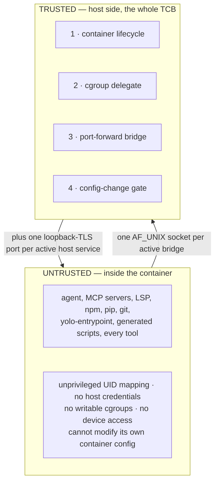

# The security shim — where the trust boundary is

**Status:** CURRENT as of 2026-09-09, verified against `38873c0d`.

yolo's security model borrows from two long-standing examples of privilege separation.
**xscreensaver**: only a tiny, auditable piece of code runs privileged (lock/unlock), while all
the complex, bug-prone code (the animations) runs unprivileged in a separate process.
**OpenSSH privsep**: a tiny privileged monitor performs the handful of operations that need root,
while the protocol parser and key exchange run in an unprivileged child, talking over a minimal
IPC protocol — so a fully compromised unprivileged side still faces a second, much simpler
barrier.

yolo applies the same principle: **all host-privileged code is concentrated in one small
auditable surface — the "security shim" — while the vast majority of the system (everything
inside the jail) runs with no special privilege.** The claim is not a line count; it is that the
surface is small enough to read in an afternoon, and that a bug anywhere else cannot escalate.

| Component | Lives in |
| :--- | :--- |
| 1. Container lifecycle — the moment host resources are granted | `internal/cli/run` (`assemble*.go`, `podmanNestingArgs`) |
| 2. Cgroup delegate — a socket server that writes cgroups on the jail's behalf | `internal/cgd` (`Handle`, `ParseRequest`, `ops.go`), started by `internal/cli/run` (`startCgroupDelegateInProc`) |
| 3. Port-forward bridge — host loopback ports into the jail | `internal/cli/run` (`network.go`) |
| 4. Config-change gate — a human approves an agent's config edit | `internal/config` (`CheckConfigChanges`), `internal/cli/run` (`checkConfigChanges`) |

**Reads with:** [`loophole-system.md`](loophole-system.md) and
[`loophole-protocol.md`](loophole-protocol.md) (every *other* thing that crosses the boundary,
and the wire it speaks), [`loophole-transport.md`](loophole-transport.md) (the loopback-TLS
model), [`config-safety.md`](config-safety.md) (component 4 in full),
[`pack-system.md`](pack-system.md#the-credential-boundary-disclosure-not-consent) (what a pack
may claim from the host, and why the answer is disclosure rather than a prompt),
[`host-execution-from-the-workspace.md`](host-execution-from-the-workspace.md) (the outbound
direction, which this model sits *outside* of).

> [!IMPORTANT]
> **This document sizes the TCB; it does not enumerate the whole trust boundary.** Since the pack
> system landed, three further channels cross it that no table here covers: pack-shipped
> **loopholes** (host code execution), the **`mount`** and **`reads-host`** contribution kinds
> (host reads), and **`host_files`**. Read [`loophole-system.md`](loophole-system.md) and
> [`pack-system.md`](pack-system.md)'s credential-boundary section before treating the four components as the whole
> bridge.

---

## The core idea

Everything else in the `yolo` CLI is config parsing, validation, image building and user
interaction: it runs **before** the container exists and holds no ongoing communication with the
untrusted side. Everything else in the jail runs **inside** the sandbox, so even fully
compromised it can only affect the container. To audit yolo's security you audit these four
components plus any enabled loophole's host daemon.

## The four components

### 1. Container lifecycle

**What it does:** constructs and executes the container runtime's `run` command. **Why it is
privileged:** this is the moment host resources — filesystem, devices, network — are granted, and
the flags passed here *define the entire sandbox boundary*.

| Constraint | Mechanism |
| :--- | :--- |
| No arbitrary mounts | Every mount comes from a validated config key; nothing is inferred from the environment |
| No arbitrary capabilities | A hardcoded capability set per branch, and the nesting branch is the only one that widens it |
| No arbitrary devices | Device paths are validated, and USB devices resolved rather than passed through as strings |
| No silent config changes | Component 4 gates the launch |
| No concurrent races | A workspace lock file serializes launches |
| Arguments are never shell-injected | The runtime is exec'd with an **argv slice**, never a shell string. Anything that genuinely must cross into the container's `bash -c` goes through `shquote.Join` |

**Audit target:** the argv construction. Every flag is visible in one place, and every mount is
explicit.

### 2. Cgroup delegate

**What it does:** serves a Unix socket on the host that creates child cgroups, sets CPU, memory
and PID limits, and moves the calling process into the new cgroup. **Why it is privileged:** the
container's cgroup filesystem is mounted read-only under rootless podman, so only the host can
write it.

| Constraint | Mechanism |
| :--- | :--- |
| Caller identity is unforgeable | `SO_PEERCRED` — the kernel attests the connecting process's host PID. No tokens, no headers, no spoofable identity |
| No path traversal | Cgroup names are matched against a strict pattern and `..` is rejected outright |
| No arbitrary cgroup writes | Three controllers only: `cpu`, `memory`, `pids` |
| Limits are bounded | CPU as a percentage bounded by the machine's own core count; a memory floor that prevents OOM-kill loops; a bounded PID range |
| Requests are bounded | One line per request, read with a hard byte cap |
| The protocol is tiny | Three operations: `create_and_join`, `destroy`, `status` — anything else is `unknown` |
| The daemon dies with the container | It runs as a goroutine of the launching process, stopped on teardown |

**It is a pack now, not built-in.** The daemon ships as a loophole of the `cgroup-delegate` pack
and is off unless that pack is selected; it used to be a Go function the run pipeline called with
no config key at all. Its wire protocol and threat model did not change — only its activation.
It is also the **last AF_UNIX consumer** in the system: every other host service moved to
loopback-TLS.

**The xscreensaver parallel:** the delegate does exactly one thing (manage child cgroups within a
container's own cgroup). No general-purpose RPC, no shell execution, no file I/O outside the
cgroup tree. **The OpenSSH parallel:** it accepts a tiny, finite set of messages from the
untrusted side — a state machine small enough to enumerate exhaustively.

**The per-request audit log.** Every request that reaches a caller leaves one tab-separated line
under the host's state dir (`logs/cgroup-delegate-audit.log`), naming the UTC time, the caller's
host PID from `SO_PEERCRED`, the operation, the container cgroup it was scoped to, and the verdict
the caller was actually told. `cgd.Auditor` writes it; `cgd.RequestOp` names the operation.

**Three paths record, not one.** The ordinary answer, a request refused because the container
cgroup is not yet resolved, and a request that did not parse at all — the last of which is what a
probe of this socket looks like from the host side, and so the last thing that may be dropped
silently. It renders as `op=UNPARSEABLE` rather than blank.

> [!WARNING]
> **The trail is best-effort, deliberately, and it says so when it stops.** Refusing a cgroup
> operation because its log line could not be appended would turn a full disk into a jail that
> cannot set a memory limit, and the security boundary here is the three-operation protocol and the
> container-scoped cgroup root — not this file. So a write failure never fails the operation. It is
> also never silent: the first failure per process is reported once, through the housekeeping log,
> saying operations are continuing UNRECORDED. **This is a forensic record, not a tamper-proof
> store, and it does not claim to be one.**

> [!WARNING]
> **The op and cgroup fields cross from the untrusted side, so they are escaped, not trusted.** A
> newline in either would let a caller forge an entry in the one file whose entire purpose is to be
> believed afterwards. `sanitizeAuditField` escapes newlines, carriage returns and tabs — escaping
> rather than stripping, so evidence of the attempt survives in the record.

> [!NOTE]
> **This was unimplemented until 2026-09-09, and the shape of the miss is worth remembering.**
> Principle 5 stated the invariant, `cgd.RequestOp` carried the doc comment *"extracts the op field
> ... for the audit log"*, and the one line joining them was never written — so the helper had no
> production caller and an audit of the shim would have found a documented trail that produced no
> bytes. Nothing about the surrounding code looked unfinished. `run.TestCgroupDelegateServeLoopAuditsEveryPath`
> now pins the call site by name, because the package's own tests all stayed green while the
> delegate logged nothing.

### 3. Port-forward bridge

**What it does:** forwards host loopback ports into the container by tunnelling over a
bind-mounted Unix socket (`socat UNIX-LISTEN` → `TCP` on the host's loopback). **Why it is
privileged:** the container cannot reach the host's loopback through container networking — see
[`loopback-tls-reachability.md`](loopback-tls-reachability.md) for why that is a property of the
rootless network stack rather than a bug.

| Constraint | Mechanism |
| :--- | :--- |
| Only declared ports | The list comes from validated config |
| Port range validated | A port must be a legal port |
| Only localhost | The bridge forwards the host's loopback and no other address |
| Cleanup on exit | Every helper process is terminated when the container exits |
| No network exposure | A Unix socket, not a TCP listener — invisible to a network scanner |

That last row is a property of **this** mechanism and does **not** generalize to loopholes: an
active loophole is reached over an authenticated loopback-TLS port, not a socket.

### 4. Config-change gate

**What it does:** detects that the workspace config changed since the last approved launch and
shows the operator a diff before proceeding. **Why it matters:** an agent inside the jail can
edit that file — it is in the read-write workspace mount — to add mounts, packages or devices,
and without the gate the next launch would silently apply them.

The mechanism, its scope, its refusal and its one opt-in flag are
[`config-safety.md`](config-safety.md). The two properties that make it part of the TCB rather
than a convenience: the approval record lives **host-side, never mounted**, so the jail can
neither rewrite it to hide a change nor delete it to bypass one; and a launch with **no terminal
is refused**, so the promise does not depend on someone happening to be watching.

## What is NOT in the security shim

Everything else is one of three things:

1. **Pre-launch setup** — config parsing, validation, image building, `yolo check`. Runs before
   the container exists; no ongoing trust relationship with the untrusted side.
2. **Container-side code** — the entrypoint, the generated scripts, the bootstrap. Runs entirely
   inside the sandbox. Fully compromised, it can only affect the container.
3. **Documentation and CLI UX** — no security implications.

So a bug in the entrypoint, in MCP or LSP config generation, in shim generation, in `.bashrc`
construction, or in any tool installed inside the jail **cannot escalate to host privilege.** It
can only affect the container environment.

## Design principles

1. **Minimize the bridge.** The untrusted side reaches the trusted side through a small, named
   set of channels and no others: the cgroup socket, the port-forward socket, and **one
   loopback-TLS port per active host service**. Every other mount is either read-only or data the
   agent is supposed to edit.

   > The loopback-TLS channel is authenticated rather than mounted: the jail reads a `0600`
   > endpoint file, pins the exact certificate named in it, and presents the per-jail bearer
   > token that also lives there. So the count is "two Unix sockets *plus* one port per active
   > service", and "invisible to network scanners" is true of the port-forward bridge only.

2. **Kernel-attested identity.** Never trust the container to identify itself. `SO_PEERCRED`
   yields the host-namespace PID of the connecting process, set by the kernel and not by the
   caller — the Unix equivalent of a hardware attestation.

3. **Finite protocol.** The cgroup delegate accepts exactly three message types; the port-forward
   bridge has no runtime messages at all (it is a static tunnel). There is no general-purpose RPC,
   no shell execution, no eval, and no dynamic code loading across the boundary.

4. **Fail closed.** No cgroup socket means the in-jail client prints an error and exits. Failed
   config validation means no container. A changed config with nobody to ask means a refused
   launch, and the default answer to the prompt is No.

5. **Everything is logged.** Every cgroup operation is recorded with the caller's host PID, the
   operation and the result, on the host filesystem outside the container's reach — a jail can be
   given read access to that directory but cannot write it. **Met since 2026-09-09**; unmet for
   months before that, with the helper it needed already written. See component 2.

6. **The shim dies with the container.** The delegate and the forwarding helpers are tied to the
   container's lifecycle; when the container exits the host cleans up. There are no orphaned
   privileged processes.

## Audit checklist

**Container lifecycle**

- [ ] Every mount flag — are all host paths expected, and does each trace to a config key?
- [ ] Every added capability — is the widened set confined to the nesting and GPU branches?
- [ ] Every device flag — are device paths validated rather than interpolated?
- [ ] Is the runtime exec'd with an argv slice, with no shell anywhere in the path?
- [ ] Does the UID/GID mapping match the invoking host user?

**Cgroup delegate**

- [ ] Is `SO_PEERCRED` still the only identity mechanism — no tokens, no caller-supplied PID?
- [ ] Does the name pattern reject `..`, `/` and every other traversal?
- [ ] Are the CPU, memory and PID bounds still enforced, and still derived from the machine?
- [ ] Are only the `cpu`, `memory` and `pids` controllers enabled?
- [ ] Is the request read with a byte cap?
- [ ] Does the server stop when the container exits?
- [ ] **Is every request logged?** (Today: no — principle 5 is unmet.)

**Port-forward bridge**

- [ ] Is only the host's loopback forwarded — never a wildcard bind?
- [ ] Are port numbers validated?
- [ ] Are the helper processes killed and the sockets cleaned up on exit?

**Config-change gate**

- [ ] Is the diff shown before any privileged operation?
- [ ] Is the default answer deny?
- [ ] Is the approval record stored outside the workspace mount, and never mounted in?

## Comparison with the prior art

| Property | xscreensaver | OpenSSH privsep | yolo |
| :--- | :--- | :--- | :--- |
| Privilege mechanism | setuid (optional) | a root monitor process | the container runtime, plus cgroup writes |
| IPC protocol | X11 atoms | a Unix pipe, fixed messages | a Unix socket, one JSON line, three operations |
| Identity verification | PAM | SSH keys / PAM | `SO_PEERCRED` (kernel-attested PID) |
| Untrusted code | the screensaver hacks | the protocol parser, key exchange | the agent, every tool, the entrypoint |
| Blast radius of compromise | an ugly screensaver | no root escalation | no host escalation |
| Audit strategy | read the lock code | read the monitor | read the four components |

## What this does not license

- **Not a claim that the four components are the whole boundary.** Loopholes, `mount`,
  `reads-host` and `host_files` all cross it too, and each has its own model.
- **Not a claim that the jail is a security boundary against the host.** It is the other
  direction: the host is protected from the jail, and
  [`host-execution-from-the-workspace.md`](host-execution-from-the-workspace.md) is the direction
  that is *not* contained.
- **Not a licence to add a general-purpose operation to the delegate.** Three operations is the
  property; a fourth needs the same justification the first three had.
- **Not a licence to add a second AF_UNIX consumer.** Every other host service is loopback-TLS
  precisely so there is one transport; the delegate is the exception because `SO_PEERCRED` is its
  authentication.
- **Not a size claim.** "Small enough to read in an afternoon" is the property; a specific line
  count is not, and one was quoted here for long enough to become wrong.

## Current values

Verified at `38873c0d`. The prose above explains what each of these is for; this table is the
only place the values themselves are stated.

| Value | Setting | Defined in |
| :--- | :--- | :--- |
| Delegate operations | `create_and_join`, `destroy`, `status` | `cgd.Handle` |
| Delegate controllers | `cpu`, `memory`, `pids` | `internal/cgd/ops.go` |
| Cgroup name pattern | a leading alphanumeric plus a bounded `[A-Za-z0-9._-]` tail, with `..` rejected separately | `internal/cgd/cgd.go` |
| CPU bound | 1% to 100 × the machine's core count | `internal/cgd/ops.go` |
| PID bound | 1 to 1,000,000 | `internal/cgd/ops.go` |
| Request framing | one newline-terminated JSON line, read with a byte cap | `cgd.ParseRequest`, `run.readLineBounded` |
| Delegate socket mode | `0o777` (the jail's UID differs; `SO_PEERCRED` is the authentication, not the mode) | `run.startCgroupDelegateInProc` |
| In-jail client | `yolo-cglimit` | `cmd/yolo-cglimit` |
| Port-forward mechanism | `socat UNIX-LISTEN` → the host's loopback TCP port | `internal/cli/run/network.go` |
| Port-forward key | `network.forward_host_ports` | `yolo config-ref` |
| Approval record | host-side, never mounted | `paths.ApprovalsDir` (see [`config-safety.md`](config-safety.md)) |
| Read-only workspace paths | `workspace_readonly` | see [`host-execution-from-the-workspace.md`](host-execution-from-the-workspace.md) |
