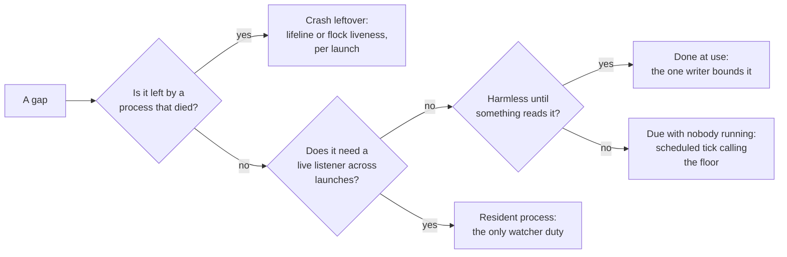

# What a central yolo watcher would buy, and why the answer is mostly a scheduler

**Status:** Exploration: **nothing here is proposed for implementation now**, and no watcher is
built. Evidence verified at `51620f7e` (2026-09-29), and the review corrections re-checked at
`bfb79a6e`. No ruling is owed: [OQ-YW1](#OQ-YW1) was ruled 2026-09-29, and [YW-D7](#YW-D7)
records why the direction needs none. Since then the sibling below built the **keeper** at the
container backends, and every row it moved was re-verified against `d4e435a3` on 2026-10-01: the
jail-lifetime, attach and host-service rows of [§2.1](#21-done-by-the-launch-in-the-launchs-own-process),
the orphan and SIGKILL rows of [§2.3](#23-reaped-at-the-next-launch-or-by-yolo-prune), items 1
and 2 of [§2.6](#26-done-by-nobody), and [§5.1](#51-jail-lifetime-and-sessions),
[§5.2](#52-host-services-a-launch-owns) and [§8](#8-where-this-touches-the-last-session-wins-sibling).
Those rows cite symbols at `d4e435a3`; every other row keeps its `51620f7e` line numbers. On Linux
the keeper's children end with it; off Linux, and on macos-user, which has no keeper, the two
SIGKILL rows still hold. And
[§2.6](#26-done-by-nobody) item 3, the unbounded host-service and socat logs, was closed
2026-10-01 with no watcher, by the processes that open them.

> **In short.** A central watcher would fix three different kinds of gap, and only one of them
> needs a resident process. Crash leftovers want a lifeline on each launch's children, and work
> that is due while nobody runs yolo wants a timer that starts one-shot runs. A process that holds
> a live listener across launches is the only thing that needs a watcher, and no ruled duty is
> that shape today.

**Why it matters.** The maintainer asked what a watcher for the whole system would fix
(2026-09-29). The answer decides whether the next few designs keep bolting duties onto the launch
path, or whether yolo gets a second place to run work.

**The shape.** Four tiers, cheapest first: the **per-launch floor**, **lifelines**, **scheduled
ticks**, and a resident watcher held back behind stated preconditions
([§7](#7-what-would-have-to-be-true-before-building-one)).

**Cost of the watcher itself.** It walks back into [HD-R1](../design/host-daemon-ownership.md#HD-R1)
and [OQ-HS3](../design/host-notch-services.md#OQ-HS3). It also brings back the version seam
[`host-daemon-ownership.md` §4](../design/host-daemon-ownership.md#4-the-version-boundary-that-is-not-there-and-why-it-stops-applying-here)
calls "no free answer", and it concentrates every jail's crossings in one long-lived process.

**Start at [§3](#3-three-kinds-of-gap-and-only-one-needs-a-watcher)**, the three kinds of gap.
Everything else falls out of it.

**Needs your ruling:** none; [OQ-YW1](#OQ-YW1) was ruled 2026-09-29 (no scheduled reclaim).

**Reads with:** [`jail-lifetime-last-session-wins.md`](../design/jail-lifetime-last-session-wins.md)
(the sibling from the same run, not in the tree at `51620f7e`, on keeping a jail up until its last session leaves;
[§8](#8-where-this-touches-the-last-session-wins-sibling) says where the two meet), and
[`host-daemon-ownership.md`](../design/host-daemon-ownership.md) (HD-R1, the ruling a watcher would collide with, and
[OQ-HD9](../design/host-daemon-ownership.md#OQ-HD9), the open question it would answer).

---

## 1. The verdict, and the words it uses

**Do not build a central watcher, and do not close the direction either.** My read, after three
independent passes over the tree, is that the watcher is the wrong unit. Almost every duty it
would take on is reachable by a cheaper mechanism that is already in the tree or already leaned
toward, and the cheaper mechanism keeps the rulings intact. What remains after the cheaper tiers
is a short list of duties that need a live listener outliving every launch. That list is empty
among ruled designs today. It is the thaw condition, not a build item.

### 1.1 Terms

- **Central watcher** — the maintainer's phrase. One long-lived host process per user, serving
  every workspace and jail, and outliving any single launch. It is **not** a per-jail process,
  and **not** today's three `scope: "host"` brokers, though those are its nearest relatives
  ([§2.4](#24-the-three-small-watchers-that-already-ship)).
- **Duty** *(coined here)* — one piece of recurring work yolo must get done: reap a scratch
  volume, refresh a credential, rotate a log. A duty is not a process; several shapes can carry
  one.
- **Per-launch floor** *(coined here)* — a duty's implementation on the launch path, which runs
  whether or not anything else is installed or alive. The housekeeping slot is one
  ([`housekeeping.go`](../../internal/cli/run/housekeeping.go)).
- **Lifeline** — the pipe [`launchservice.Lifeline`](../../internal/launchservice/launchservice.go)
  already gives a launch-owned child: the launch holds the write end, and the child sees EOF the
  moment the launch dies, however it dies. It is not coined here;
  [HS-D11](../design/host-notch-services.md#HS-D11) introduced it.
- **Tick** *(coined here)* — one short-lived yolo process an OS scheduler (a systemd user timer,
  a launchd agent) starts to do bounded duties and exit. `yolo internal tick` is **hypothetical**;
  no such subcommand exists.
- **Keeper** *(coined here)* — a per-jail process that outlives the launch that started it but
  not the jail. It is what "orphan ourselves" in the maintainer's framing of the sibling doc
  would produce, and it is **not** a central watcher: it serves one jail and holds nothing
  machine-wide.

### 1.2 Principles

Numbered so later sections can cite them.

- **YW-P1. The floor is the one implementation.** Anything a watcher or tick
  does, it does by calling the function the launch path already calls. Its absence changes
  latency, never correctness. That is host parity applied to time: one code path per concern.
- **YW-P2. "Could not ask the watcher" is never "nothing is live".** A missing,
  wedged or wrong-build watcher degrades to today's behavior. It never licenses a reap, a
  teardown or "no other sessions" (the tri-state rule).
- **YW-P3. Nothing jail-reachable lives longer than its jail.** Every
  jail-facing listener, credential and grant stays owned by something whose life is bounded by
  a jail: a launch or a keeper. This is [HD-R1](../design/host-daemon-ownership.md#HD-R1) and the
  security shim's "no orphaned privileged processes"
  ([`security-shim.md`](../reference/security-shim.md#design-principles)).
- **YW-P4. Work done with no launch discloses somewhere.** A launch has no
  quiet mode, and a tick or watcher has no terminal. So anything it does lands in a log that
  `yolo check` or `yolo stores` reports. It never gets a `YOLO_NO_*` hatch: turning it on or off
  is configuration.
- **YW-P5. A floor's opt-out must reach every caller of the floor.** Today's
  reclaim opt-out, `YOLO_NO_AUTO_IMAGE_REAP`, is read from the environment by the floor functions
  themselves (SOURCED: `internal/cli/run/autoreapimages.go:17`, read at `scratchremoval.go:194`
  among others), and it is a ruled hatch
  ([`minimal-disk-footprint.md`](../design/minimal-disk-footprint.md#OQ-DF3)). A process that
  systemd or launchd starts does not inherit the user's shell environment, so the same function
  called from a tick would silently ignore a standing opt-out: one code path, a different
  effective policy. Before any tick calls a floor, its opt-outs move to configuration or to a
  persisted place the tick reads (INFERRED).

## 2. What exists today, measured

Every row is one duty. **Kind** is MEASURED (run on 2026-09-29, read-only), SOURCED (a file and
line at `51620f7e`) or INFERRED (read from code, not reproduced).

### 2.1 Done by the launch, in the launch's own process

| Duty | What a crash leaves | Evidence | Kind |
| :--- | :--- | :--- | :--- |
| Container lifetime, **since the keeper** (container backends). The fresh launch spawns the jail's **keeper**, one background host process per running container jail, which starts the container. Its main process is a hold that only keeps the container running until a SIGTERM, and every session, the first included, enters by `exec`. The keeper ends the jail when it can take the jail's session lock exclusively, which is the last session gone, or when the container ends. Closing a session's window ends that session's processes in the jail and nothing else, and a Ctrl-C keypress is forwarded into the jail as a byte | a SIGKILLed launcher leaves nothing: the keeper owns the jail. A SIGKILLed keeper leaves an **unkept** jail, whose sessions run on without host services; its last session reaps it as it quits ([JL-D30](../design/jail-lifetime-last-session-wins.md#JL-D30)), and the next launch's reaper does once no session is left in it | `KeeperMain` (`internal/cli/run/keeper.go`), `HoldMainArg` (`internal/entrypoint/jailmain.go`), `sessionlock.go`, `sessionhangup.go`, `reapOrphanedJails` (`lifecycle.go`) at `d4e435a3`; [JL-D13](../design/jail-lifetime-last-session-wins.md#JL-D13) | SOURCED |
| Attach, a session like the first: `<runtime> exec`, holding the session lock shared. An arrival at a jail whose keeper is dead is refused, naming `yolo stop`, rather than attached-and-repaired | nothing; it owns nothing | `refuseUnkeptJail` (`lifecycle.go`) at `d4e435a3` | SOURCED |
| Loophole host daemons, fronts, cgroup delegate, socat forwarders: started by the jail's keeper on the container backends and torn down by its teardown chain (`teardownAfterExit`, which calls `stopLoopholes`) | see [§2.3](#23-reaped-at-the-next-launch-or-by-yolo-prune) | `keeper.go`, `teardownAfterExit` (`run.go`), `stopLoopholes` (`loopholesruntime.go`) at `d4e435a3` | SOURCED |
| Tracking file, home skeleton and pack tree removed once the runtime says the container is **known gone** | left for a later reaper | `trackingcleanup.go:1-86` | SOURCED |
| The housekeeping slot: old images, superseded store outputs, cache measure and purge, orphan agent staging, retired loophole state, image tars, flake-bundle generations, scratch volumes. Fresh launches only, after the container is visible, under a machine-wide skip-if-held flock. Every class except scratch volumes is debounced 24 hours; scratch volumes are reaped on every fresh launch, past a grace age | a pass cut mid-delete by the terminate arm's exit | `housekeeping.go:131-149, 273-287`, `scratchremoval.go:185-193`, `prune/autoreap.go:40` | SOURCED |
| The slot runs on the proxy's goroutine, so it never delays **its own** launch. The image load of **another** launch **blocks** on that same lock, and the slot has been recorded at **62 s and 116 s** on the maintainer's host | — | `run.go:1584-1589`, `housekeeping.go:208-221` (citing `host-perf.log`) | SOURCED |
| Git-pack refresh, on the critical path: fetch if never fetched, re-fetch a branch at most hourly | — | `packrefresh.go:13-33` | SOURCED |
| `yolo host` services (the wire-bridge host half): children of one launch, SIGTERM then SIGKILL after 2 s, a lifeline so a dead launch's service exits within 5 s | nothing; the lifeline closes it | [`host-notch-services.md` §4.4](../design/host-notch-services.md#44-lifetime) | SOURCED |
| macos-user host services: one dir per session, liveness is an exclusive flock the session holds, and the next session collects every dir whose lock is free | the dir and its endpoint files are collected by the next session. The session's loophole daemons are **orphaned**, as in [§2.3](#23-reaped-at-the-next-launch-or-by-yolo-prune): they are spawned by the same `Setsid` path, and the collector kills nothing | `internal/cli/run/servicessession.go:1-31, 155-207` (no `Kill` or `Signal` call), `loopholesruntime.go:1082`, [HD-D1](../design/host-daemon-ownership.md#HD-D1) | SOURCED |

### 2.2 Detached one-shots

| Duty | Evidence | Kind |
| :--- | :--- | :--- |
| Scratch-volume removal: `yolo internal scratch-rm`, `Setsid`, waits up to one minute for podman to let go. It once recreated `housekeeping.log` mid-`RemoveAll` in CI, which is why it now never creates `.yolo` | `scratchremoval.go:3-33, 56-62, 242` | SOURCED |
| Update check: an ordinary host command whose cached answer is 24 hours old starts `yolo internal update-check` detached, under a 10-minute lock. Never in a jail, under `CI`, or for a source install | [`self-update.md`](../reference/self-update.md#automatic-checks), `internal/selfupdate/state.go:188` | SOURCED |

### 2.3 Reaped at the next launch, or by `yolo prune`

| Duty | Who gets to it | Evidence | Kind |
| :--- | :--- | :--- | :--- |
| Orphaned jails: running, the owner-PID file naming a dead process, the keeper's liveness lock free, and no session holding the session lock | the next launch on the machine, Apple Container's keeper-era jails included (one started before keepers is still left alone there) | `reapOrphanedJails` (`lifecycle.go`) at `d4e435a3` | SOURCED |
| **The per-jail loophole host daemons of a SIGKILLed keeper.** A SIGKILLed launcher no longer matters, because the keeper, not the launcher, starts them. They are spawned `Setsid`, and on Linux each also gets the kernel's parent-death signal (SIGTERM), so they end with the keeper ([JL-D32](../design/jail-lifetime-last-session-wins.md#JL-D32)). **Still holds off Linux**, where there is no parent-death signal (Apple Container on a Mac: owed to the sibling's Mac step, [JL-D60](../design/jail-lifetime-last-session-wins.md#JL-D60)), **and on macos-user**, which has no keeper: a session's daemons are spawned the same `Setsid` way with neither. The orphan reap still passes `nil` handles, so it kills no process. The host-wide `scope: "host"` singletons are not in this row: they outlive every launch on purpose ([§2.4](#24-the-three-small-watchers-that-already-ship)) | on Linux, the kernel; off Linux and on macos-user, **nobody** | `setChildDeathSignal` (`keeper_linux.go`, a no-op in `keeper_other.go`), applied under `keeperMode` in `loopholesruntime.go`; `reapOrphanedJails` (`lifecycle.go`) at `d4e435a3` | SOURCED |
| **socat forwarders of a SIGKILLed keeper**: a plain `exec.Command`, and on Linux the same parent-death signal, so they end with the keeper. The keeper's next start also removes the whole forward socket dir first, so a socat left behind is unreachable from the next jail ([JL-D32](../design/jail-lifetime-last-session-wins.md#JL-D32)). **Still holds off Linux**: a leftover socat runs on until something ends it. Either way their `<cname>-socat.log` is appended forever | on Linux, the kernel; off Linux, **nobody** | `startPortForwards` (`network.go`) at `d4e435a3` | SOURCED |
| Owner-PID files of a launcher killed while its container also died | overwritten by the next fresh launch of that workspace, and harmless in between: the orphan reap walks live containers only. Litter only for a workspace never relaunched | `lifecycle.go:23-39, 184-204`, `run.go:1511` | SOURCED |
| Embedded-pack fallback trees (`$TMPDIR/yolo-embedded-lease-*`) of a process that died without release | the next fallback's sweep or `yolo prune`, past an age floor | [AGENTS.md](../../AGENTS.md), `packload/embeddedcache.go` | SOURCED |
| Image GC roots (one-week horizon, liveness held for running images), stopped containers, other builds' embedded-pack trees, shadowed home seeds, the host-render archive, superseded captures | **`yolo prune --apply` only**: each function's one non-test caller is `prunecmd.go` | `rg` over `internal/`; [`image-retention.md`](../reference/image-retention.md#gc-root-retention--age-except-under-a-running-image) | MEASURED |

### 2.4 The three small watchers that already ship

`claude-oauth-broker`, `openai-auth-broker` and `aws-auth` declare `host_daemon.scope: "host"`.
Each is spawned detached, outlives every launch, and is found by name through
`/tmp/yolo-<loophole>.{sock,pid,lock}` (SOURCED: `internal/paths/paths.go:361-390`). They are,
today, **yolo's only always-on machine-wide workers**, and HD-R1 retires all three
(ruled 2026-09-20, **not built**: the ledger row ends "❌ not built").

What they carry that nothing else does:

- The Claude broker's background refresher: a **60 s** tick and a **30-minute** lead
  (SOURCED: `internal/oauthbroker/oauthbroker.go:57-58`).
- It rewrites the credential view of **every registered workspace**, stopped ones included, on
  each new token. [CL-D16](../design/claude-login-without-interception.md#CL-D16) promises that a
  stopped workspace's next launch "starts on a live token" (SOURCED).
- A registration is dropped only when its workspace's overlay directory is gone, never by age or
  liveness, so the broker keeps writing views for workspaces that have not launched in months
  (SOURCED: `views.go:177-181`, the only `drop()` call site).
- aws-auth's proactive minter, which mints on start and then on a ticker, off with
  `--no-background-refresh` (SOURCED: `internal/awsauthdaemon/main.go:73, 229-248`).

> [!NOTE]
> **HD-R1 turns CL-D16's "kept current while stopped" into "refreshed at the next launch", and the
> user-visible promise survives.** A registration writes its view from the canonical credential
> as it registers (SOURCED: `RegisterView`, `internal/oauthbroker/views.go:464-503`, and
> [CL-D3](../design/claude-login-without-interception.md#CL-D3)), so each launch overwrites its
> own view before the agent runs. Whether that launch starts on a live token depends on the
> canonical credential, which is exactly the case
> [OQ-HD9](../design/host-daemon-ownership.md#OQ-HD9) already names, and its leaned
> unconditional catch-up refresh at launch covers it with no timer. What lapses is only the
> "kept current while stopped" half, which nothing yolo supports reads
> ([OQ-HS3](../design/host-notch-services.md#OQ-HS3)). And while any jail runs anywhere, its
> per-launch broker still writes every registration. So [OQ-HD9](../design/host-daemon-ownership.md#OQ-HD9) is not newly load-bearing: it
> still decides only the first launch after an idle stretch, and whether a long-idle refresh
> token survives (INFERRED from the rulings and the code; nothing has been run).

Their record is the risk ledger for any central watcher, and it is already written down:

- stale-build daemons a liveness check reports green, and two yolo versions standing off
  ([modes 3 and 4](../design/host-daemon-ownership.md#modes-3-and-4-alive-but-wrong-and-two-yolo-versions));
- idle forever ([mode 5](../design/host-daemon-ownership.md#mode-5-nobody-is-using-it));
- stale settings, hit live with aws-auth
  ([mode 7](../design/host-daemon-ownership.md#mode-7-it-runs-settings-the-config-no-longer-says));
- a stale PID file after every clean exit, which `yolo check` graded FAIL until `30d775de` made
  it a WARN (SOURCED: that commit's message);
- `/tmp` rendezvous paths with no user component, so another local user can take the lock first
  (SOURCED: `internal/broker/brokerlifecycle.go:593-610`).

### 2.5 Designed, not built

Every design in this table is `status: in-review`, and each lifecycle below is the author's
implementation decision, not a maintainer ruling (SOURCED: each doc's frontmatter; BB-D1 and
EW-D10 are labeled "Implementation decision"). So their per-jail shapes are evidence of what the
designs chose, not of what the maintainer ruled.

| Design | Its lifecycle as written | Evidence |
| :--- | :--- | :--- |
| Event-watcher sidecars and the ping box | host-side sidecars are children of the launch that creates the container, and an attach starts none ([EW-D10](../design/agent-event-watchers.md#EW-D10)). How a sidecar notices its launch died is left to the implementer | [`agent-event-watchers.md` §3.2](../design/agent-event-watchers.md#32-lifecycle-per-side-and-per-notch) |
| The GitHub boundary broker | "a loophole host daemon, one per jail" ([BB-D1](../design/boundary-broker.md#BB-D1)); "a jail stopping ends every grant it holds"; expiry checked at use, never by a sweeper; decided records kept 7 days "then go", in a store mutated under one flock by one function ([BB-D10](../design/boundary-broker.md#BB-D10)). ⚠ Spawned by today's `Setsid` path, it would inherit the orphan defect in [§2.3](#23-reaped-at-the-next-launch-or-by-yolo-prune) where that still holds, and "a jail stopping ends every grant" would fail for a SIGKILLed keeper off Linux (INFERRED; on Linux the keeper's parent-death signal ends it) | [`boundary-broker.md` §7](../design/boundary-broker.md#7-grants-and-the-request-store) |
| The podman reboot readiness gate | a host-wide advisory flock with a shared deadline, owned by whichever launch arrives first. Its own scope boundary says the design "must not … start a host service": a limit on that gate, not a ruling against any host process | [`podman-reboot-readiness.md`](../design/podman-reboot-readiness.md#verdict-and-boundary) |
| In-jail nix roots | a raw host-auto observer cannot identify a producing jail or recover pruned payloads; it is best effort. A cooperative per-workspace producer protocol is distinct, unbuilt and not permission to start a central service | [`in-jail-nix-roots.md` §5](../design/in-jail-nix-roots.md#5-what-registers-the-translated-root), [§6](../design/in-jail-nix-roots.md#6-alternatives-rejected) |
| The durable-dir report | computed at each fresh launch and in `yolo check` / `yolo stores`; never deletes | [`durable-scratch-space.md` §5.4](../design/durable-scratch-space.md#54-the-durable-dir-report) |

### 2.6 Done by nobody

1. **Keeping a jail up until its last session leaves**, now built at the container backends by
   the sibling's keeper, which ends the jail at the last session
   ([§8](#8-where-this-touches-the-last-session-wins-sibling)). The keeper at `yolo host` and
   macos-user is the sibling's step 5, unbuilt.
2. **Killing a SIGKILLed keeper's loophole daemons and socat off Linux, and a macos-user
   session's daemons** ([§2.3](#23-reaped-at-the-next-launch-or-by-yolo-prune)). On Linux the
   kernel's parent-death signal does it.
3. **Rotating two kinds of host log.** ✅ **Done 2026-10-01, by the process that opens each log,
   with no watcher**, as [§5.5](#55-logs-and-registrations) said it could be. Each open now goes
   through `internal/logcap`, which bounds the log the way `crossings.log` is bounded: past 4 MiB
   its newest 4 MiB, from a whole line, replace the one archived generation, `<log>.1`, and the log
   is emptied (SOURCED: `MaxBytes`, `ArchiveSuffix` and `Trim` in `internal/logcap/logcap.go`). The
   opens are the per-jail daemon's (`startExternalService`, `internal/cli/run/loopholesruntime.go`),
   each socat's (`startPortForwards`, `internal/cli/run/network.go`) and a host-wide daemon's spawn
   (`realSpawn`, `internal/broker/brokerlifecycle.go`). That third site was missing from this item:
   the two large logs measured below are host-wide daemons' (`scope: "host"` in
   `packs/claude/loopholes/claude-oauth-broker/manifest.jsonc` and
   `packs/aws-auth/loopholes/aws-auth/manifest.jsonc`), which `broker.EnsureSingleton` spawns,
   not the run pipeline. A fourth followed the same day: a launch-owned service's host half
   (`launchservice.Start`, `internal/launchservice/launchservice.go`), whose
   `launch-service-<service>.log` every `yolo host` or macos-user launch starting that service
   appends to: the wire bridge, or a credential doorway
   ([HS-D15](../design/host-notch-services.md#HS-D15)). A launch that reuses a live host-wide daemon trims its log too
   (`EnsureSingleton`'s reuse branch), because nothing reopens it. It is **copy and truncate, not
   crossings.log's rename**, because the writer is a child holding its own descriptor, and a
   per-jail daemon's log is keyed on the loophole's name, so every jail running it holds the same
   file: a rename would leave each writing into the archive. So a log holds at most 4 MiB plus what
   its writers wrote since the last launch that opened or reused it, and nothing trims it while no
   yolo command runs. A line written between the copy and the truncate is lost (UNMEASURED: how
   often a daemon writes inside that window). Retiring a loophole moves its `.1` with its log
   (`internal/packstage/loopholeowners.go`, `RetireLoopholeState`). Pinned by
   `TestAPortForwardLaunchCapsTheSocatLog` and `TestAHostDaemonLaunchCapsItsServiceLog`
   (`internal/cli/run/logcap_test.go`), `TestEnsureCapsTheLogOfALiveDaemonItReuses` and
   `TestRealSpawnCapsTheDaemonLog` (`internal/broker/logcap_test.go`), and
   `TestStartCapsTheServiceLog` (`internal/launchservice/logcap_test.go`). The rest of this item is
   the inventory as it was. The `host-service-<name>.log` files were opened `O_APPEND` with no
   bound (SOURCED at `51620f7e`: `internal/cli/run/loopholesruntime.go:1071-1073`), and so was
   each `<cname>-socat.log` (SOURCED at `51620f7e`: `network.go:35`). MEASURED in `/ctx/host-yolo-logs` on
   2026-09-29: `host-service-claude-oauth-broker.log` is 1.4 MB and `host-service-aws-auth.log`
   356 KB. Eleven `broker-relay-*.log` files from July and August remain from a relay that no
   longer exists. Five zero-byte test-daemon logs (`eofd`, `fake-svc`, `fronted`, `outside`,
   `quiet-svc`) and a 737-byte `yjtest-broker` log, all from 2026-09-18, sit in the production
   dir. Other host logs **are** bounded, each by its own writer: `crossings.log` rotates to one
   archived generation at 4 MiB, so at most 8 MiB ever exists (SOURCED:
   `internal/crossaudit/crossaudit.go:67-83`, rotation at `:164-207`), and the host launch log is
   trimmed to `perf.MaxRuns` runs at open (SOURCED: `internal/cli/run/launchlog.go:25-35`). In the
   jail, the supervisor rotates at 5 MB (SOURCED: `internal/supervisor/supervisor.go:130`).
4. **Expiring Claude view registrations** ([§2.4](#24-the-three-small-watchers-that-already-ship)).
   If wanted, the broker can do this at use: it walks the registry on every refresh.
5. **Refreshing credentials with no jail running**, once HD-R1 lands
   ([OQ-HD9](../design/host-daemon-ownership.md#OQ-HD9), open).
6. **Reclaim on a machine that never launches.** Every automatic class above waits for a fresh
   launch.
7. **Boot-time cleanup** before or alongside podman's own. At the 2026-09-29 reboot podman was
   cleaning up old volumes while yolo's probe failed; leftover per-launch scratch volumes are one
   plausible source of that load, and the reboot doc does not establish cause (INFERRED:
   [`podman-reboot-readiness.md`](../design/podman-reboot-readiness.md#what-happened-and-what-is-still-unknown)).
8. **Deleting the boundary broker's 7-day records** (designed with no deleter named). The store's
   one writer can delete them at use, when the per-jail broker starts or `yolo approve` reads the
   store: a 7-day-old record is harmless until something reads it.
9. **Prefetch or prebuild between launches**: pack fetches, an image rebuild after
   `just install`.

## 3. Three kinds of gap, and only one needs a watcher

Sorting [§2.6](#26-done-by-nobody) and the crash column of [§2.3](#23-reaped-at-the-next-launch-or-by-yolo-prune)
by *why* nobody does them gives three kinds. This is the finding the rest of the doc rests on. A
fourth row splits off the second: work that looks due on a clock but is harmless until something
reads it, so the reader can do it and no tick is needed.

| Kind | Rows | What reaches it | Needs a watcher? |
| :--- | :--- | :--- | :--- |
| **Crash leftover**: a process died without its teardown | SIGKILLed loophole daemons and socat off Linux and on macos-user, scratch volumes the remover never reached, skeletons and pack trees, fallback embedded trees, `/tmp/yolo-host-services-*` dirs | a lifeline on every yolo launch child (already built for `yolo host` services), the parent-death signal (built on Linux for every child a keeper starts), and the next launch's reapers. A held-flock marker (already built for macos-user sessions) is liveness **evidence** a reaper could act on; today its collector removes dirs, not processes. On podman, the runtime's own per-container process ([S8](#4-the-shapes-compared)) is a further route | **No.** A watcher reaps these sooner, and that is all it adds |
| **Done at use by the one writer** | log rotation, registration expiry, the broker's 7-day deletion | the process that writes the file or store bounds it when it opens or reads it, as `crossaudit` already does for `crossings.log` | **No**, and no tick either |
| **Due while nobody runs yolo** | idle credential refresh ([OQ-HD9](../design/host-daemon-ownership.md#OQ-HD9)), reclaim on an idle machine and the prune-only classes, boot-time scratch cleanup, prefetch | a **tick**: an OS timer starting a short yolo process that calls the floor's function and exits | **No.** A scheduler reaches all of these. A tick holds no resident state, but it has two build seams ([§6.2](#62-versions)) |
| **A live listener across launches** | a boundary-broker request that survives its jail; a ping that reaches every session; jail lifetime owned by nothing that is a launch | a resident process | **Yes**, and no design asks for one: the in-review broker and event-watcher designs chose per-jail and per-launch lifetimes, and [OQ-HS3](../design/host-notch-services.md#OQ-HS3) ruled host services per launch |

## 4. The shapes, compared

| Shape | What it reaches | Cost | What it breaks | Verdict |
| :--- | :--- | :--- | :--- | :--- |
| **S0. Nothing new** | today's rows | none | nothing; every gap in [§2.6](#26-done-by-nobody) stays | the baseline |
| **S1. Lifelines everywhere** | every crash leftover | small: `Lifeline` and flock liveness are in the tree, and since the keeper every child it starts carries `Pdeathsig` on Linux, socat included, which cannot read a pipe. Off Linux socat still takes a yolo wrapper | nothing. HD-R1 mode 6's stragglers (a refresh that must finish after its launch) must be deliberately exempt | **take it** whenever the crash class is worked, and before the boundary broker is built, whose per-jail grant lifetime depends on it ([§2.5](#25-designed-not-built)); it needs no watcher and no ruling beyond HD-R1's |
| **S2. Opportunistic one-shots**, the self-update pattern generalized: any host yolo command whose per-duty stamp is stale starts a detached, lock-guarded run | reclaim on a machine that runs yolo but rarely launches | more detached writers, each owning the hazard the scratch remover already hit | nothing ruled; does nothing when nobody types yolo, which is [OQ-HD9](../design/host-daemon-ownership.md#OQ-HD9)'s idle week | useful, and a weaker S3 |
| **S3. Scheduled ticks**: a systemd user timer or a launchd agent runs a tick every few minutes and at login | every "due while nobody runs" row | an install and uninstall step per OS; a status probe that reads "could not ask `systemctl`" as unknown; linger on Linux; on macOS, a job set to the `Background` session type in the `user/<uid>` domain if it must run with no GUI login ([§6.3](#63-platform)); keeping the unit's binary path in step with installs ([§6.2](#62-versions)) | [minimal-disk-footprint A6](../design/minimal-disk-footprint.md#7-alternatives-considered) and [disk-levers](../design/disk-levers-and-backfill.md#51-the-housekeeping-slot) rejected a timer for reclaim (P7: it runs at moments no user bounds). A tick pays P7 instead of avoiding it | **the shape to reach for first**, if [OQ-HD9](../design/host-daemon-ownership.md#OQ-HD9) rules a timer in; [OQ-YW1](#OQ-YW1) asks whether reclaim may ride it |
| **S4. A socket-activated resident watcher that exits when idle** | the live-listener rows, plus everything S3 reaches | a new IPC protocol and a new version handshake; two activation mechanisms; peer checks | HD-R1's spirit and [OQ-HS3](../design/host-notch-services.md#OQ-HS3); a busy old-build watcher is modes 3 and 4 again | **held back** behind [§7](#7-what-would-have-to-be-true-before-building-one) |
| **S5. A privilege-separated monitor**: holds only liveness and refcounts, parses no jail bytes, and spawns per-launch children for every jail-facing job | jail lifetime and reaping, with a jail-facing surface no larger than today's | two protocols, and a start and stop story | little that is ruled, as long as the monitor never holds a credential; "the monitor did not answer" must never read as "no other sessions" | the only resident shape I would draw if a watcher were ever wanted |
| **S6. The full supervisor**: the launcher becomes a thin client, and the watcher owns fronts, the cgroup delegate, sidecars, grants, notifications and container lifetime | every row | a rewrite of the security shim's lifecycle story; the delegate's `SO_PEERCRED` check attests the wrong PID through a proxy | HD-R1, [OQ-HS3](../design/host-notch-services.md#OQ-HS3), the shim's principle 6, and the disclosure boundary: pack-declared host code would run while no launch is present to print a banner | **rejected** |
| **S7. A yolo-spawned watcher with no init system** (flock, `Setsid`, a PID file) | whatever S4 reaches, on hosts without systemd or launchd | cheapest to write: `EnsureSingleton` generalized | it is exactly the singleton HD-R1 retired, stale PID files included | **rejected**, even as a fallback: it doubles the paths per duty |
| **S8. The runtime's own per-container process.** Podman's `conmon` already outlives a SIGKILLed launcher and drives the container's cleanup when it exits; an OCI `poststop` hook (`podman --hooks-dir`, [oci-hooks(5)](https://man.archlinux.org/man/oci-hooks.5.en)) runs host code at that moment | per-jail crash cleanup: loophole daemons and socat of a jail whose launcher died, when the container stops | hook-dir management; hook code runs as the host user with no terminal, so it must disclose through a log ([YW-P4](#YW-P4)) | nothing ruled. **Podman only**: Apple Container and macos-user have no equivalent. Its trigger is the container stopping, which the orphan reap already causes | a candidate for the crash class on podman, beside S1; INFERRED from podman's architecture, nothing measured |
| **S9. Transient systemd user units.** `systemd-run --user` with `--on-active=` for a one-shot tick, or a `--scope` / `BindsTo=` wrapping each launch's host daemons | some of S3's reach with no installed unit file and no uninstall step, but a transient timer is created by a launch and survives neither logout nor reboot; the init system as reaper for a launch's children | needs a running user manager, so linger on Linux as in S3 | nothing ruled. **Linux with systemd only** | a lighter S3 on Linux; INFERRED, nothing measured |

## 5. What a watcher would fix, duty by duty

Each group names the gap, what a resident watcher buys, and the cheapest shape that reaches the
same outcome. Where the cheaper shape reaches it, the watcher is not the reason to build anything.

### 5.1 Jail lifetime and sessions

- **Gap, closed at the container backends.** The first launch owned the container, so closing
  it ended every session.
- **A watcher buys** a refcount that lives outside every launch: sessions register, and the last
  one out stops the container.
- **What was built instead is the cheaper shape.** A **keeper**, one per jail and spawned by the
  fresh launch, owns the host services and the container and ends the jail when the session
  lock's last shared holder is gone. The container's main process became a hold, every agent,
  launch #1's included, runs as an exec session, and a closed window ends only its own session
  ([§2.1](#21-done-by-the-launch-in-the-launchs-own-process)). It is per jail, so it keeps
  [YW-P3](#YW-P3). The keeper at `yolo host` and macos-user is the sibling's unbuilt step 5
  ([§8](#8-where-this-touches-the-last-session-wins-sibling)).

### 5.2 Host services a launch owns

- **Gap, narrowed.** A SIGKILLed keeper's loophole daemons and socat keep running off Linux, and
  a SIGKILLed macos-user session's daemons keep running ([§2.3](#23-reaped-at-the-next-launch-or-by-yolo-prune)).
  On Linux the kernel's parent-death signal ends them with the keeper.
- **A watcher buys** a reaper that sees the dead keeper or session within seconds.
- **Cheaper.** The lifeline, which `yolo host` services already carry, or the parent-death signal
  where the kernel has one. This is defect-shaped and needs no watcher.

### 5.3 Credentials

- **Gap.** Once HD-R1 lands, nothing refreshes with no jail running. The first launch after an
  idle stretch pays the refresh, and a long-idle refresh token may not survive. CL-D16's
  user-visible promise holds through the registration-time write
  ([§2.4](#24-the-three-small-watchers-that-already-ship)).
- **A watcher buys** today's singleton behavior, under a supervisor.
- **Cheaper.** [OQ-HD9](../design/host-daemon-ownership.md#OQ-HD9)'s own leaning: an unconditional refresh at launch plus an optional timer
  that "refreshes a credential and never supervises a process". That is S3 with one duty.
- **What a credential watcher costs** is the heaviest in this doc: three vendors' refresh state in
  one address space, reachable through the fronts by jail-originated bytes, down for everyone at
  once. Under the same-user threat model it adds no capability for a host attacker, since the
  files are on disk. It adds **blast radius and time-at-risk**.

### 5.4 Cleanup and reclaim

- **Gap.** Reclaim waits for a fresh launch. GC roots and five other classes wait for a human
  to run `yolo prune`. Separately, a long pass stalls **another** launch's image load for up to
  116 s: the slot runs off its own launch's critical path, but the load of a concurrent launch
  blocks on the same machine-wide lock
  ([§2.1](#21-done-by-the-launch-in-the-launchs-own-process)).
- **A watcher buys** reclaim between launches.
- **Cheaper.** A daily tick that runs the slot's body and the prune-only classes under the same
  locks, debounce stamps and liveness gates. Every reclaimer must already be safe at any moment
  (P7). A tick makes that true by requirement rather than by luck.
- **What neither fixes: the image-load stall.** A tick running under the same lock holds it for
  the same 62-116 s, and a launch that lands in that window waits the same way, at a moment no
  user chose. That is the P7 objection A6 names. Ending the stall needs a finer lock (the
  reap-and-inspect window rather than the whole pass) or a shorter pass. That is a launch-path
  fix, independent of any scheduler (INFERRED from `housekeeping.go:208-221`).
- **And opt-outs.** A tick calling these floors would ignore `YOLO_NO_AUTO_IMAGE_REAP`
  ([YW-P5](#YW-P5)).

### 5.5 Logs and registrations

- **Gap.** View registrations never expire ([§2.6](#26-done-by-nobody) item 4). Host logs grew
  without bound until 2026-10-01, when the cheaper route below was built for them (item 3).
- **Cheaper.** Rotation in the process that writes the log needs neither a watcher nor a tick.
  The host side already has the pattern to copy: `crossaudit` rotates `crossings.log` at write
  time to one archived generation at 4 MiB, and the launch log is trimmed at open. The in-jail
  supervisor rotates at 5 MB. Registration expiry by age is a product call
  ([§9](#9-what-this-does-not-propose)), and it sits in the credential design, not here. If it is
  wanted, the broker walks the registry on every refresh and can expire there. The boundary
  broker's 7-day deletion has the same shape: its store's one writer can delete at use.

### 5.6 Approvals and notifications

- **Gap.** A boundary-broker request dies with its jail, and a notification's buttons die with
  the process that sent it. KDE strips a notification's actions once its sender leaves the bus
  ([`boundary-broker.md` §6.1](../design/boundary-broker.md#61-linux)).
- **A watcher buys** a request that outlives its jail and one owner for the desktop notifier.
- **Cheaper, and designed (in review, not ruled).** Per-jail brokers, grants that end with the
  jail, silence as a deny, and `yolo approve` from any terminal. **This is the one duty where only
  a resident process would do more, and the design deliberately does not want more.** "Grants end
  with the jail" holds for a SIGKILLed keeper on Linux, through the parent-death signal its
  children carry, and off Linux only once S1 covers loophole daemons.

### 5.7 Boot and updates

- **Gap.** Nothing cleans up leftover scratch volumes before podman's own boot pass, and an
  update check needs a detached child.
- **Cheaper.** A tick at login covers boot. The update check is already fine as a detached
  one-shot, and a watcher polling for updates would make yolo a standing host-side network actor.
- **Not the reboot gate's tool.** The in-review readiness-gate design deliberately starts no host
  service. That forbids nothing; it means that design would not use a watcher, which would be one
  more thing starting at boot.

### 5.8 Observation

- **A watcher buys** one place `yolo ps`, `yolo check` and `yolo stores` could read state from,
  instead of each re-probing the runtime.
- **Cheaper.** Nothing needs to. Re-probing is what makes every answer tri-state and current. A
  cached answer from a watcher is one more thing that can be stale.

### 5.9 Out of reach for any host watcher

- **In-jail nix roots.** A host watcher cannot attribute an entry to a jail. That is the reason
  the design put its watcher inside the jail.
- **Pack-declared host code between launches.** The launch banner is the whole trust boundary
  today ("the boundary today is DISCLOSURE, not consent", `packhostgrants.go`). A watcher running
  a pack's host code with no launch present would never print one.

## 6. What it would cost

### 6.1 Security

- **The uid does not separate a jail from its user on rootless podman.** A jail's processes run
  as the user's uid, so the uid that `SO_PEERCRED` reports is the same for both (SOURCED:
  [`loophole-transport.md`](../reference/loophole-transport.md)). The kernel-attested host **pid**
  can separate them, which the cgroup delegate relies on (SOURCED: `internal/cgd/cgd.go:1-3`),
  but only on a socket the caller reaches directly, never through a front. This doc still keeps
  the watcher's socket out of every jail, by choice: never mounted, granted or published, with
  every jail-facing duty on the per-jail loopback-TLS fronts, whose jail id the host asserts.
- **On macos-user the reverse holds.** The sandbox is another account, so peer credentials do
  separate it. `/tmp` is shared across accounts there, so a watcher socket under `/tmp` would need
  owner-only permissions and a peer-uid check (INFERRED, not measured).
- **Concentration.** A watcher with no credentials and no jail-facing surface (S5) concentrates
  liveness, not secrets. One that holds credentials or fronts (S6) becomes the host-side trusted
  computing base in one long-lived process, and a crash there drops every jail's crossings at
  once.
- **The unattended config gate.** The config-change gate refuses when nobody is there to ask
  (the shim's component 4). A watcher acting on changed workspace config with nobody present must
  refuse too, or it bypasses the gate.

### 6.2 Versions

The only version boundary yolo enforces, `version.SourceSkew`, works because neither half has
started yet. A resident watcher is a seam where the older half is a **running process holding
state**, the case [`host-daemon-ownership.md` §4](../design/host-daemon-ownership.md#4-the-version-boundary-that-is-not-there-and-why-it-stops-applying-here)
calls "no free answer". Exit-on-idle narrows it. A busy old-build watcher is still the
warn-don't-kill standoff of modes 3 and 4 under a new name.

A tick holds no resident state, so it has no seam of **that** kind. It has two build seams
(INFERRED):

- **The installed unit against the installed binary.** A systemd or launchd object fixes an
  executable path and an argv, written by the build that installed it. After `just install`, a
  Homebrew upgrade or an uninstall, that path can name a different build than the `yolo` on
  `PATH`, or nothing. The `Justfile` already warns that an older copy may win on `PATH`
  (SOURCED: `Justfile:86-90`). The rule has to be one of two: the unit names only a stable path
  and a verb every build accepts, or each launch re-renders the unit. Either way `yolo check`
  reports a unit whose target is missing.
- **A tick of one build against running launches of another.** A tick of build N+1 can reap
  under the same locks that a running launch of build N holds. Concurrent launches of different
  builds share this seam already, so it is not new, but every reclaimer must tolerate it.

### 6.3 Platform

| Constraint | Linux | macOS |
| :--- | :--- | :--- |
| Init-system object | a systemd user unit; the user manager dies at logout unless lingering is on, and polkit can deny linger (SOURCED: [Arch wiki, systemd/User](https://wiki.archlinux.org/title/Systemd/User)) | a default (`Aqua`) LaunchAgent from `~/Library/LaunchAgents` loads into `gui/<uid>` at GUI login ([Apple, creating launchd jobs](https://developer.apple.com/library/archive/documentation/MacOSX/Conceptual/BPSystemStartup/Chapters/CreatingLaunchdJobs.html)). A job with `LimitLoadToSessionType` set to `Background`, bootstrapped into `user/<uid>`, runs with no GUI login: "A user domain may exist independently of a logged-in user" and "Background agents may be loaded independently of a GUI login" (SOURCED: [launchctl(1) on ss64](https://ss64.com/mac/launchctl.html)) |
| Socket activation | the `LISTEN_FDS` protocol is a few lines of pure Go ([`sd_listen_fds`](https://www.freedesktop.org/software/systemd/man/latest/sd_listen_fds.html)) | `launch_activate_socket` is a libSystem C call, but a `CGO_ENABLED=0` Go binary can reach libSystem through dynamic-import trampolines, as the vendored `golang.org/x/sys/unix` already does (SOURCED: `vendor/golang.org/x/sys/unix/zsyscall_darwin_arm64.go:28`), and [go-launchd](https://pkg.go.dev/github.com/tprasadtp/go-launchd) "Supports launch_activate_socket without using cgo". So it costs per-arch stubs, not an impossibility. Kickstart-on-demand or a timer is still simpler (INFERRED) |
| Socket path | `$XDG_RUNTIME_DIR` | `sun_path` is 104 bytes, the reason today's singletons sit in `/tmp` (SOURCED: `paths.go:361-366`) |
| Hosts with neither | WSL without systemd, OpenRC or runit hosts, containers, a nested in-jail yolo | none found; an SSH-only Mac still has the `user/<uid>` domain |

yolo installs **no** init-system object today. `rg` over `internal/` and `cmd/` for `launchctl`,
`systemctl` and `LaunchAgent` finds only remediation hints in `internal/cli/check/section_nix_probe.go`
(MEASURED). A watcher or timer would be the first. The project has deleted one resident launchd
service before, the macOS Linux-builder VM, in favor of an ephemeral one
([`macos-linux-builder-explained.md`](macos-linux-builder-explained.md)).

### 6.4 Rulings it collides with

- **HD-R1**: every host daemon has a launch owner and ends with its jail.
- **[OQ-HS3](../design/host-notch-services.md#OQ-HS3)**: host services live for one launch, and an agent launched outside yolo may lack
  features. A watcher's main draw, serving things when no launch is present, is exactly what that
  ruling says need not be served.
- **The security shim's principle 6**: the shim dies with the container.
- **minimal-disk-footprint A6** and **disk-levers**: no daemon, timer or cron for reclaim.
- **image-retention**: does not license "a new persistence format, database or daemon"
  ([`image-retention.md`](../reference/image-retention.md#what-this-does-not-license)).

The reboot readiness gate is not on this list. Its "must not … start a host service" is an
in-review design's own scope boundary, not a ruling ([§2.5](#25-designed-not-built)).

A tick collides only with A6 and disk-levers, and only by paying P7 rather than dodging it.

### 6.5 Drift

Once a watcher exists, the next duty gets written watcher-only, and every host without one
quietly loses it. The guard is [YW-P1](#YW-P1) plus the AGENTS.md rule that a test must fail if
the production call site is deleted: for each duty, a test pins that the launch path still calls
it.

## 7. What would have to be true before building one

These are the thaw conditions for a resident watcher (S4 or S5), and
[YW-D7](#YW-D7) makes them the checklist a future proposal meets. A tick (S3) needs only 2, 3
and 6, plus the opt-out rule [YW-P5](#YW-P5) and the unit-path rule in [§6.2](#62-versions).

1. **A ruled duty needs a live listener across launches.** A design, ruled by the maintainer,
   whose behavior cannot be met by a launch, a keeper or a tick. None exists at `51620f7e`.
2. **Every duty it would carry already has a per-launch floor**, pinned by a call-site test
   ([YW-P1](#YW-P1)).
3. **It degrades to today when absent, wedged or wrong-build**, and a test drives each of those
   three ([YW-P2](#YW-P2)).
4. **The version seam has an answer**: a handshake carrying the build stamp, and a rule for a
   busy old-build watcher that is not "warn and keep serving".
5. **It holds no jail-reachable credential and parses no jail bytes**, or a ruling says why this
   one may ([YW-P3](#YW-P3)).
6. **It discloses outside a launch** ([YW-P4](#YW-P4)): an install-time notice, `yolo check`
   rows, and a log that `yolo stores` knows about.
7. **The maintainer rules it past HD-R1's spirit** for the named duties. That ruling is a
   revision of a standing ruling, so it happens in `host-daemon-ownership.md`'s ledger, not only
   here.

## 8. Where this touches the last-session-wins sibling

`docs/design/jail-lifetime-last-session-wins.md` asked whether
closing the first agent can stop taking the others down, with no central watcher, and its steps
1 to 3 built the answer at the container backends (re-checked at `d4e435a3`). The two docs meet
in three places:

- **The container was not the only thing the first launch owned.** Its process also held every
  per-jail front, loophole daemon, cgroup delegate goroutine and socat forwarder, and an attach
  cannot rebuild them. So last-session-wins meant **every launch-owned host service must outlive
  launch #1**, not only the container. That was the strongest pull toward a watcher in the whole
  inventory, and a per-jail keeper answered it.
- **The keeper is built, without a central watcher, and both preconditions this doc named were
  met.** The container's main process is a hold that waits for sessions, with every agent,
  launch #1's included, started as an exec session, and a closed terminal ends only its own
  session rather than running `stopJail`. The keeper owns the host services from the jail's first
  moment and stays resident until the session lock's last shared holder is gone
  ([§2.1](#21-done-by-the-launch-in-the-launchs-own-process)). It stays per jail and inside
  [YW-P3](#YW-P3). The keeper at `yolo host` and macos-user is the sibling's step 5, unbuilt.
- **Podman already runs a keeper-shaped process.** `conmon` is a per-container host process that
  outlives the launcher ([S8](#4-the-shapes-compared)). It keeps the container, not the
  launch-owned host services, so it covers half the job: those services would still need a
  host-side owner (INFERRED).
- **If the sibling concludes per-launch cannot do it**, jail lifetime becomes the first candidate
  for [§7](#7-what-would-have-to-be-true-before-building-one) item 1, and the shape to draw is S5,
  a monitor that holds only refcounts, not S6.

## 9. What this does not propose

- **Nothing here is proposed for implementation now.** No build slice, no plan, no roadmap
  build row.
- It does not answer [OQ-HD9](../design/host-daemon-ownership.md#OQ-HD9). It only notes that
  HD-R1 turns CL-D16's "kept current while stopped" into "refreshed at the next launch", which
  [OQ-HD9](../design/host-daemon-ownership.md#OQ-HD9)'s leaned catch-up already covers ([§2.4](#24-the-three-small-watchers-that-already-ship)).
- It does not decide whether view registrations expire by age. That belongs to
  [`claude-login-without-interception.md`](../design/claude-login-without-interception.md).
- It does not fix the SIGKILL-orphan rows in [§2.3](#23-reaped-at-the-next-launch-or-by-yolo-prune)
  where they still hold, off Linux and on macos-user. They are defect-shaped and need no watcher.
  The lifeline, or the parent-death signal the keeper already uses on Linux, is the fix.
- It does not design log rotation, which needs neither a watcher nor a tick.
- It does not fix the image-load stall behind the housekeeping lock
  ([§5.4](#54-cleanup-and-reclaim)). That is a launch-path lock-granularity question, and no
  scheduler changes it.
- It does not revisit whether the boundary broker's requests should outlive their jail.

## 10. Open Questions

One question, about direction. It blocks no build, because nothing here is proposed. The
direction question an earlier draft also filed, whether a resident watcher is closed or shelved,
is not a question: [HD-R1](../design/host-daemon-ownership.md#HD-R1) already covers every
host-side daemon, a resident watcher included, and any ruling can be revised in its own ledger.
It is recorded as [YW-D7](#YW-D7). Whether one timer or several carry timed duties is a mechanism
choice with one answer, recorded as [YW-D8](#YW-D8).

The background to [OQ-YW1](#OQ-YW1): A6 rejected a timer for
reclaim because it runs at moments no user bounds (P7), and "the launch path fires at least as
often as the artifacts are created". This question exists only if [OQ-HD9](../design/host-daemon-ownership.md#OQ-HD9) puts a timer on the
machine for credentials. It does not decide the image-load stall, which a tick holding the same
lock would move rather than end ([§5.4](#54-cleanup-and-reclaim)).

The two options it weighed:

- **A — No. A6 stands, and the timer stays credential-only.** Reclaim keeps running in the
  launch slot. A class that today waits for `yolo prune` can move into the slot, which needs no
  timer. An idle machine is reclaimed at its next launch, and it creates no new launch
  artifacts while idle.
- **B — Yes. The timer also runs the reclaim floors**, each calling the slot's own function
  under its existing locks and liveness gates. That buys reclaim on a machine that sits idle,
  and the prune-only classes run with nobody typing. It costs P7 exposure at unchosen moments,
  a launch that overlaps a tick waiting up to 116 s on the lock, moving
  `YOLO_NO_AUTO_IMAGE_REAP` into configuration first ([YW-P5](#YW-P5)), and the unit-path rule
  in [§6.2](#62-versions).

1. ✅ **[OQ-YW1](#OQ-YW1): If [OQ-HD9](../design/host-daemon-ownership.md#OQ-HD9)
   installs a timer, may reclaim also run on it while no launch is present, reversing
   [A6](../design/minimal-disk-footprint.md#7-alternatives-considered)?** The background, and the two
   options it weighed, are [above](#oq-yw1-background).

   _Leaning:_ **A.** An earlier draft leaned B because a tick seemed to take the 62-116 s pass off
   the launch path. It does not: the pass already runs off its own launch's path, and a tick under
   the same lock stalls a concurrent launch the same way. What remains for B is reclaim on an idle
   machine, which A6's own argument answers: an idle machine creates no new launch artifacts. A
   prune-only class that should run automatically can move into the slot, with no timer. **The
   trap:** once a timer exists, the next duty gets added to it because it is there. Every addition
   meets [§7](#7-what-would-have-to-be-true-before-building-one) items 2, 3 and 6 first, and a
   call-site test pins its launch-path floor.

   <!-- vantage: question id=OQ-YW1 -->

   **Answer:**
   > **Ruled 2026-09-29, as leaned: A.** A6 stands: disk reclaim stays at launch, and any timer
   > [OQ-HD9](../design/host-daemon-ownership.md#OQ-HD9) brings stays credential-only. The maintainer:
   > *"no. YOLO has no way of doing this, so... And I don't see why it's beneficial anyway. So,
   > no."*

## 11. Decision Ledger

Exploration conclusions that have one answer, recorded so a later design does not re-derive
them. None is built, because nothing here is proposed.

| ID | Ruling / Decision | Date | Settled in | Built |
| :--- | :--- | :--- | :--- | :--- |
| [`YW-D1`](#11-decision-ledger) | *Exploration conclusion.* Crash leftovers are never a reason for a watcher. The lifeline already in the tree (with `Pdeathsig` or a wrapper for socat) closes them per launch, the held-flock marker is liveness evidence a reaper can act on, podman's per-container process is a further route (S8), and the next launch's reapers are the backstop | 2026-09-29 | [§3](#3-three-kinds-of-gap-and-only-one-needs-a-watcher) | — |
| [`YW-D2`](#11-decision-ledger) | *Exploration conclusion.* Any tick or watcher calls the function the launch path calls, and a test pins each launch-path call site ([YW-P1](#YW-P1)) | 2026-09-29 | [§6.5](#65-drift) | — |
| [`YW-D3`](#11-decision-ledger) | *Exploration conclusion.* In-jail nix roots and pack-declared host code are out of reach for any host watcher: the first for attribution, the second for disclosure | 2026-09-29 | [§5.9](#59-out-of-reach-for-any-host-watcher) | — |
| [`YW-D4`](#11-decision-ledger) | *Exploration conclusion.* A watcher's socket is never mounted, granted or published into a jail. Rootless podman's uid mapping defeats a uid check; a host-pid check works only on a socket reached directly, which is exactly the exposure this avoids. Jail-facing duties stay on per-jail fronts | 2026-09-29 | [§6.1](#61-security) | — |
| [`YW-D5`](#11-decision-ledger) | *Exploration conclusion.* S6 (the full supervisor) and S7 (a yolo-spawned watcher with no init system) are rejected outright. Only S5's shape is drawn if a resident process is ever wanted | 2026-09-29 | [§4](#4-the-shapes-compared) | — |
| [`YW-D6`](#11-decision-ledger) | *Exploration conclusion.* No `YOLO_NO_WATCHER` or `YOLO_NO_TICK` hatch. Turning either on or off is configuration, because hatches are for broken user config ([YW-P4](#YW-P4)). An existing env-var opt-out on a floor a tick would call moves to configuration first ([YW-P5](#YW-P5)) | 2026-09-29 | [§1.2](#12-principles) | — |
| [`YW-D7`](#11-decision-ledger) | *Exploration conclusion.* [HD-R1](../design/host-daemon-ownership.md#HD-R1) already covers any resident host process, a central watcher included, so no separate direction ruling is needed. A future proposal for one revises HD-R1 in `host-daemon-ownership.md`'s ledger and meets every item of [§7](#7-what-would-have-to-be-true-before-building-one) | 2026-09-29 | [§7](#7-what-would-have-to-be-true-before-building-one) | — |
| [`YW-D8`](#11-decision-ledger) | *Implementation decision.* If yolo ever installs timed duties, they share one installed timer that starts one-shot ticks, never one timer per duty, and the tick supervises no process | 2026-09-29 | [§10](#10-open-questions) | — |

## 12. The neighbors

| Doc | Why it reads with this one |
| :--- | :--- |
| [`jail-lifetime-last-session-wins.md`](../design/jail-lifetime-last-session-wins.md) | the sibling: jail lifetime without a watcher; [§8](#8-where-this-touches-the-last-session-wins-sibling) |
| [`host-daemon-ownership.md`](../design/host-daemon-ownership.md#HD-R1) | [HD-R1](../design/host-daemon-ownership.md#HD-R1), the failure modes, [OQ-HD9](../design/host-daemon-ownership.md#OQ-HD9) and [OQ-HD10](../design/host-daemon-ownership.md#OQ-HD10) |
| [`host-notch-services.md`](../design/host-notch-services.md#44-lifetime) | [OQ-HS3](../design/host-notch-services.md#OQ-HS3) and the lifeline |
| [`claude-login-without-interception.md`](../design/claude-login-without-interception.md#CL-D16) | CL-D3 and CL-D16: views written at registration and on each new token |
| [`boundary-broker.md`](../design/boundary-broker.md#7-grants-and-the-request-store) | the one duty that would want a live listener, and why it is per jail |
| [`agent-event-watchers.md`](../design/agent-event-watchers.md#32-lifecycle-per-side-and-per-notch) | sidecars per launch ([EW-D10](../design/agent-event-watchers.md#EW-D10)) |
| [`in-jail-nix-roots.md`](../design/in-jail-nix-roots.md#6-alternatives-rejected) | why raw auto-only reconciliation cannot provide attribution or synchronized safety |
| [`minimal-disk-footprint.md`](../design/minimal-disk-footprint.md#7-alternatives-considered) | A6, the rejected timer for reclaim |
| [`podman-reboot-readiness.md`](../design/podman-reboot-readiness.md#verdict-and-boundary) | the boot race; the in-review gate deliberately starts no host service |
| [`image-retention.md`](../reference/image-retention.md#what-this-does-not-license) | which reapers are automatic and which are `yolo prune` only |
