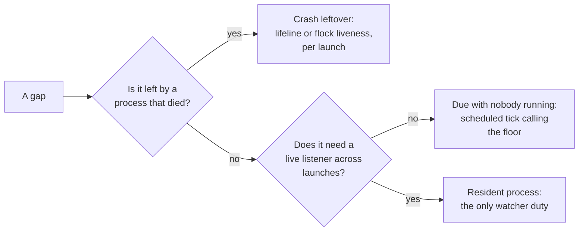

# What a central yolo watcher would buy, and why the answer is mostly a scheduler

**Status:** DESIGN, 2026-09-29. Exploration: **nothing here is proposed for implementation now**,
and nothing is built. Evidence verified at `51620f7e`. Two rulings are owed on direction only.

> **In short.** A central watcher would fix three different kinds of gap, and only one of them
> needs a resident process. Crash leftovers want a lifeline on each launch's children, and work
> that is due while nobody runs yolo wants a timer that starts one-shot runs. A process that holds
> a live listener across launches is the only thing that needs a watcher, and no ruled duty is
> that shape today.

**Why it matters.** The maintainer asked what a watcher for the whole system would fix
(2026-09-29). The answer decides whether the next few designs keep bolting duties onto the launch
path, or whether yolo gets a second place to run work.

**The shape.** Four tiers, cheapest first: the **per-launch floor**, **lifelines**, **scheduled
ticks**, and a resident watcher held back behind stated preconditions
([§7](#7-what-would-have-to-be-true-before-building-one)).

**Cost of the watcher itself.** It walks back into [HD-R1](../design/host-daemon-ownership.md#HD-R1)
and [OQ-HS3](../design/host-notch-services.md#OQ-HS3). It also brings back the version seam
[`host-daemon-ownership.md` §4](../design/host-daemon-ownership.md#4-the-version-boundary-that-is-not-there-and-why-it-stops-applying-here)
calls "no free answer", and it concentrates every jail's crossings in one long-lived process.

**Start at [§3](#3-three-kinds-of-gap-and-only-one-needs-a-watcher)**, the three kinds of gap.
Everything else falls out of it.

**Needs your ruling:** [OQ-YW1](#OQ-YW1), [OQ-YW2](#OQ-YW2).

**Reads with:** `docs/design/jail-lifetime-last-session-wins.md`
(the sibling from the same run, not in the tree at `51620f7e`, on keeping a jail up until its last session leaves;
[§8](#8-where-this-touches-the-last-session-wins-sibling) says where the two meet), and
[`host-daemon-ownership.md`](../design/host-daemon-ownership.md) (HD-R1, the ruling a watcher would collide with, and
[OQ-HD9](../design/host-daemon-ownership.md#OQ-HD9), the open question it would answer).

---

## 1. The verdict, and the words it uses

**Do not build a central watcher, and do not close the direction either.** My read, after three
independent passes over the tree, is that the watcher is the wrong unit. Almost every duty it
would take on is reachable by a cheaper mechanism that is already in the tree or already leaned
toward, and the cheaper mechanism keeps the rulings intact. What remains after the cheaper tiers
is a short list of duties that need a live listener outliving every launch. That list is empty
among ruled designs today. It is the thaw condition, not a build item.

### 1.1 Terms

- **Central watcher** — the maintainer's phrase. One long-lived host process per user, serving
  every workspace and jail, and outliving any single launch. It is **not** a per-jail process,
  and **not** today's three `scope: "host"` brokers, though those are its nearest relatives
  ([§2.4](#24-the-three-small-watchers-that-already-ship)).
- **Duty** *(coined here)* — one piece of recurring work yolo must get done: reap a scratch
  volume, refresh a credential, rotate a log. A duty is not a process; several shapes can carry
  one.
- **Per-launch floor** *(coined here)* — a duty's implementation on the launch path, which runs
  whether or not anything else is installed or alive. The housekeeping slot is one
  ([`housekeeping.go`](../../internal/cli/run/housekeeping.go)).
- **Lifeline** — the pipe [`launchservice.Lifeline`](../../internal/launchservice/launchservice.go)
  already gives a launch-owned child: the launch holds the write end, and the child sees EOF the
  moment the launch dies, however it dies. It is not coined here;
  [HS-D11](../design/host-notch-services.md#HS-D11) introduced it.
- **Tick** *(coined here)* — one short-lived yolo process an OS scheduler (a systemd user timer,
  a launchd agent) starts to do bounded duties and exit. `yolo internal tick` is **hypothetical**;
  no such subcommand exists.
- **Keeper** *(coined here)* — a per-jail process that outlives the launch that started it but
  not the jail. It is what "orphan ourselves" in the maintainer's framing of the sibling doc
  would produce, and it is **not** a central watcher: it serves one jail and holds nothing
  machine-wide.

### 1.2 Principles

Numbered so later sections can cite them.

- **YW-P1. The floor is the one implementation.** Anything a watcher or tick
  does, it does by calling the function the launch path already calls. Its absence changes
  latency, never correctness. That is host parity applied to time: one code path per concern.
- **YW-P2. "Could not ask the watcher" is never "nothing is live".** A missing,
  wedged or wrong-build watcher degrades to today's behavior. It never licenses a reap, a
  teardown or "no other sessions" (the tri-state rule).
- **YW-P3. Nothing jail-reachable lives longer than its jail.** Every
  jail-facing listener, credential and grant stays owned by something whose life is bounded by
  a jail: a launch or a keeper. This is [HD-R1](../design/host-daemon-ownership.md#HD-R1) and the
  security shim's "no orphaned privileged processes"
  ([`security-shim.md`](../reference/security-shim.md#design-principles)).
- **YW-P4. Work done with no launch discloses somewhere.** A launch has no
  quiet mode, and a tick or watcher has no terminal. So anything it does lands in a log that
  `yolo check` or `yolo stores` reports. It never gets a `YOLO_NO_*` hatch: turning it on or off
  is configuration.

## 2. What exists today, measured

Every row is one duty. **Kind** is MEASURED (run on 2026-09-29, read-only), SOURCED (a file and
line at `51620f7e`) or INFERRED (read from code, not reproduced).

### 2.1 Done by the launch, in the launch's own process

| Duty | What a crash leaves | Evidence | Kind |
| :--- | :--- | :--- | :--- |
| Container lifetime. The container's main process is the first launch's command (`--rm -i --init`), and Ctrl-C runs `podman stop -t 5`, so every attached session goes with it | the container runs until the next launch's orphan reaper | `internal/cli/run/assemble.go:345`, `run.go:1591-1606`, `lifecycle.go:158-166` | SOURCED |
| Attach. `podman exec` under the tty proxy with no start or terminate hook: "A jail whose launcher is gone is relaunched, not attached-and-repaired" | nothing; it owns nothing | `run.go:2131-2165` | SOURCED |
| Loophole host daemons, fronts, cgroup delegate, socat forwarders, torn down by `stopLoopholes` and `cleanupPortForwarding` on both exit arms | see [§2.3](#23-reaped-at-the-next-launch-or-by-yolo-prune) | `run.go:1600-1606`, `loopholesruntime.go:430-455` | SOURCED |
| Tracking file, home skeleton and pack tree removed once the runtime says the container is **known gone** | left for a later reaper | `trackingcleanup.go:1-86` | SOURCED |
| The housekeeping slot: old images, superseded store outputs, cache measure and purge, orphan agent staging, retired loophole state, image tars, flake-bundle generations, scratch volumes. Fresh launches only, after the container is visible, under a machine-wide skip-if-held flock, each class debounced 24 hours | a pass cut mid-delete by the terminate arm's exit | `housekeeping.go:131-149`, `prune/autoreap.go:40` | SOURCED |
| The image load **blocks** on that same lock, and the slot has been recorded at **62 s and 116 s** on the maintainer's host | — | `housekeeping.go:208-221` (citing `host-perf.log`) | SOURCED |
| Git-pack refresh, on the critical path: fetch if never fetched, re-fetch a branch at most hourly | — | `packrefresh.go:13-33` | SOURCED |
| `yolo host` services (the wire-bridge host half): children of one launch, SIGTERM then SIGKILL after 2 s, a lifeline so a dead launch's service exits within 5 s | nothing; the lifeline closes it | [`host-notch-services.md` §4.4](../design/host-notch-services.md#44-lifetime) | SOURCED |
| macos-user host services: one dir per session, liveness is an exclusive flock the session holds, and the next session collects every dir whose lock is free | nothing lasting; the kernel drops the lock | `internal/cli/run/servicessession.go:1-31`, [HD-D1](../design/host-daemon-ownership.md#HD-D1) | SOURCED |

### 2.2 Detached one-shots

| Duty | Evidence | Kind |
| :--- | :--- | :--- |
| Scratch-volume removal: `yolo internal scratch-rm`, `Setsid`, waits up to one minute for podman to let go. It once recreated `housekeeping.log` mid-`RemoveAll` in CI, which is why it now never creates `.yolo` | `scratchremoval.go:3-33, 56-62, 242` | SOURCED |
| Update check: an ordinary host command whose cached answer is 24 hours old starts `yolo internal update-check` detached, under a 10-minute lock. Never in a jail, under `CI`, or for a source install | [`self-update.md`](../reference/self-update.md#automatic-checks), `internal/selfupdate/state.go:188` | SOURCED |

### 2.3 Reaped at the next launch, or by `yolo prune`

| Duty | Who gets to it | Evidence | Kind |
| :--- | :--- | :--- | :--- |
| Orphaned jails (running, owner PID dead) | the next launch on the machine; a no-op on Apple Container | `run.go:1000-1003`, `lifecycle.go:170-206` | SOURCED |
| **The loophole host daemons of a SIGKILLed launcher.** They are spawned `Setsid` with no lifeline and no parent-death signal, and the orphan reap passes `nil` handles, so it removes the host-services dir and kills no process | **nobody** | `loopholesruntime.go:1082`, `lifecycle.go:202`; no `Pdeathsig` under `internal/` | INFERRED |
| **socat forwarders of a SIGKILLed launcher**: a plain `exec.Command`, no `Setsid`, no lifeline. Their `<cname>-socat.log` is appended forever | **nobody** | `network.go:33-43` | INFERRED |
| Owner-PID files of a launcher killed while its container also died | **nobody**; cleared only by `stopJail` and the normal teardown | `lifecycle.go:23-39`, `run.go:1700, 1747` | INFERRED |
| Embedded-pack fallback trees (`$TMPDIR/yolo-embedded-lease-*`) of a process that died without release | the next fallback's sweep or `yolo prune`, past an age floor | [AGENTS.md](../../AGENTS.md), `packload/embeddedcache.go` | SOURCED |
| Image GC roots (one-week horizon, liveness held for running images), stopped containers, other builds' embedded-pack trees, shadowed home seeds, the host-render archive, superseded captures | **`yolo prune --apply` only**: each function's one non-test caller is `prunecmd.go` | `rg` over `internal/`; [`image-retention.md`](../reference/image-retention.md#gc-root-retention--age-except-under-a-running-image) | MEASURED |

### 2.4 The three small watchers that already ship

`claude-oauth-broker`, `openai-auth-broker` and `aws-auth` declare `host_daemon.scope: "host"`.
Each is spawned detached, outlives every launch, and is found by name through
`/tmp/yolo-<loophole>.{sock,pid,lock}` (SOURCED: `internal/paths/paths.go:361-390`). They are,
today, **yolo's only always-on machine-wide workers**, and HD-R1 retires all three
(ruled 2026-09-20, **not built**: the ledger row ends "❌ not built").

What they carry that nothing else does:

- The Claude broker's background refresher: a **60 s** tick and a **30-minute** lead
  (SOURCED: `internal/oauthbroker/oauthbroker.go:57-58`).
- It rewrites the credential view of **every registered workspace**, stopped ones included, on
  each new token. [CL-D16](../design/claude-login-without-interception.md#CL-D16) promises that a
  stopped workspace's next launch "starts on a live token" (SOURCED).
- A registration is dropped only when its workspace's overlay directory is gone, never by age or
  liveness, so the broker keeps writing views for workspaces that have not launched in months
  (SOURCED: `views.go:177-181`, the only `drop()` call site).
- aws-auth's proactive minter
  ([`host-daemon-ownership.md` §11](../design/host-daemon-ownership.md#11-decision-ledger), HD-D2).

> [!WARNING]
> **CL-D16's promise holds only while a singleton runs.** HD-R1, once built, ends the broker with
> the last jail, and then nothing keeps a stopped workspace's view current. That makes
> [OQ-HD9](../design/host-daemon-ownership.md#OQ-HD9) (who refreshes with no jail running)
> load-bearing for a shipped behavior, not only for a faster first launch. INFERRED from the two
> rulings; nothing has been run.

Their record is the risk ledger for any central watcher, and it is already written down:

- stale-build daemons a liveness check reports green, and two yolo versions standing off
  ([modes 3 and 4](../design/host-daemon-ownership.md#modes-3-and-4-alive-but-wrong-and-two-yolo-versions));
- idle forever ([mode 5](../design/host-daemon-ownership.md#mode-5-nobody-is-using-it));
- stale settings, hit live with aws-auth
  ([mode 7](../design/host-daemon-ownership.md#mode-7-it-runs-settings-the-config-no-longer-says));
- a stale PID file after every clean exit, which `yolo check` graded FAIL until `30d775de` made
  it a WARN (SOURCED: that commit's message);
- `/tmp` rendezvous paths with no user component, so another local user can take the lock first
  (SOURCED: `internal/broker/brokerlifecycle.go:593-610`).

### 2.5 Designed, not built

| Design | Its lifecycle as written | Evidence |
| :--- | :--- | :--- |
| Event-watcher sidecars and the ping box | host-side sidecars are children of the launch that creates the container, and an attach starts none ([EW-D10](../design/agent-event-watchers.md#EW-D10)). How a sidecar notices its launch died is left to the implementer | [`agent-event-watchers.md` §3.2](../design/agent-event-watchers.md#32-lifecycle-per-side-and-per-notch) |
| The GitHub boundary broker | one per jail ([BB-D1](../design/boundary-broker.md#BB-D1)); "a jail stopping ends every grant it holds"; expiry checked at use, never by a sweeper; decided records kept 7 days "then go", with no deleter named | [`boundary-broker.md` §7](../design/boundary-broker.md#7-grants-and-the-request-store) |
| The podman reboot readiness gate | a host-wide advisory flock with a shared deadline, owned by whichever launch arrives first. The design "must not … start a host service" | [`podman-reboot-readiness.md`](../design/podman-reboot-readiness.md#verdict-and-boundary) |
| In-jail nix roots | option C is an **in-jail** root watcher. A host-side reconciler was rejected: "It cannot tell which jail an entry came from" | [`in-jail-nix-roots.md` §5](../design/in-jail-nix-roots.md#5-what-registers-the-translated-root), [§6](../design/in-jail-nix-roots.md#6-alternatives-rejected) |
| The durable-dir report | computed at each fresh launch and in `yolo check` / `yolo stores`; never deletes | [`durable-scratch-space.md` §5.4](../design/durable-scratch-space.md#54-the-durable-dir-report) |

### 2.6 Done by nobody

1. **Keeping a jail up until its last session leaves.** No process counts sessions. That is the
   sibling doc's whole subject ([§8](#8-where-this-touches-the-last-session-wins-sibling)).
2. **Killing a SIGKILLed launcher's loophole daemons and socat** (INFERRED, [§2.3](#23-reaped-at-the-next-launch-or-by-yolo-prune)).
3. **Host log rotation.** MEASURED in `/ctx/host-yolo-logs` on 2026-09-29:
   `host-service-claude-oauth-broker.log` is 1.4 MB, `host-service-aws-auth.log` 356 KB,
   `crossings.log` 225 KB. Eleven `broker-relay-*.log` files from July and August remain from a
   relay that no longer exists. Five zero-byte test-daemon logs (`eofd`, `fake-svc`, `fronted`,
   `outside`, `quiet-svc`) and a 737-byte `yjtest-broker` log, all from 2026-09-18, sit in the
   production dir. The in-jail supervisor rotates at 5 MB
   (`internal/supervisor/supervisor.go:130`); the host side has no equivalent that `rg` finds.
4. **Expiring Claude view registrations** ([§2.4](#24-the-three-small-watchers-that-already-ship)).
5. **Refreshing credentials with no jail running**, once HD-R1 lands
   ([OQ-HD9](../design/host-daemon-ownership.md#OQ-HD9), open).
6. **Reclaim on a machine that never launches.** Every automatic class above waits for a fresh
   launch.
7. **Boot-time cleanup** before or alongside podman's own. At the 2026-09-29 reboot podman was
   cleaning up old volumes while yolo's probe failed; leftover per-launch scratch volumes are one
   plausible source of that load, and the reboot doc does not establish cause (INFERRED:
   [`podman-reboot-readiness.md`](../design/podman-reboot-readiness.md#what-happened-and-what-remains-uncertain)).
8. **Deleting the boundary broker's 7-day records** (designed with no deleter).
9. **Prefetch or prebuild between launches**: pack fetches, an image rebuild after
   `just install`.

## 3. Three kinds of gap, and only one needs a watcher

Sorting [§2.6](#26-done-by-nobody) and the crash column of [§2.3](#23-reaped-at-the-next-launch-or-by-yolo-prune)
by *why* nobody does them gives three kinds. This is the finding the rest of the doc rests on.

| Kind | Rows | What reaches it | Needs a watcher? |
| :--- | :--- | :--- | :--- |
| **Crash leftover**: a process died without its teardown | SIGKILLed loophole daemons and socat, owner-PID files, scratch volumes the remover never reached, skeletons and pack trees, fallback embedded trees, `/tmp/yolo-host-services-*` dirs | a lifeline on every launch child (already built for `yolo host` services), a held-flock liveness marker (already built for macos-user sessions), and the next launch's reapers | **No.** A watcher reaps these sooner, and that is all it adds |
| **Due while nobody runs yolo** | idle credential refresh ([OQ-HD9](../design/host-daemon-ownership.md#OQ-HD9)), keeping CL-D16's stopped views fresh, reclaim on an idle machine, the slot's 62-116 s pass off the launch path, log rotation, registration expiry, boot-time scratch cleanup, the broker's 7-day deletion, prefetch | a **tick**: an OS timer starting a short yolo process that calls the floor's function and exits | **No.** A scheduler reaches all of these, and a tick is one build, so it has no version seam |
| **A live listener across launches** | a boundary-broker request that survives its jail; a ping that reaches every session; jail lifetime owned by nothing that is a launch | a resident process | **Yes**, and no ruled design asks for one: the broker is per jail, grants end with the jail, and sidecars belong to their launch |

## 4. The shapes, compared

| Shape | What it reaches | Cost | What it breaks | Verdict |
| :--- | :--- | :--- | :--- | :--- |
| **S0. Nothing new** | today's rows | none | nothing; every gap in [§2.6](#26-done-by-nobody) stays | the baseline |
| **S1. Lifelines everywhere** | every crash leftover | small: `Lifeline` and flock liveness are in the tree | nothing. HD-R1 mode 6's stragglers (a refresh that must finish after its launch) must be deliberately exempt | **take it** whenever the crash class is worked; it needs no watcher and no ruling beyond HD-R1's |
| **S2. Opportunistic one-shots**, the self-update pattern generalized: any host yolo command whose per-duty stamp is stale starts a detached, lock-guarded run | reclaim and expiry on a machine that runs yolo but rarely launches; moves the slot off the launch goroutine | more detached writers, each owning the hazard the scratch remover already hit | nothing ruled; does nothing when nobody types yolo, which is [OQ-HD9](../design/host-daemon-ownership.md#OQ-HD9)'s idle week | useful, and a weaker S3 |
| **S3. Scheduled ticks**: a systemd user timer or a launchd agent runs a tick every few minutes and at login | every "due while nobody runs" row | an install and uninstall step per OS; a status probe that reads "could not ask `systemctl`" as unknown; linger on Linux; a GUI session on macOS | [minimal-disk-footprint A6](../design/minimal-disk-footprint.md#7-alternatives-considered) and [disk-levers](../design/disk-levers-and-backfill.md#51-the-housekeeping-slot) rejected a timer for reclaim (P7: it runs at moments no user bounds). A tick pays P7 instead of avoiding it | **the shape to reach for first**, if [OQ-YW1](#OQ-YW1) says yolo may run work with no launch |
| **S4. A socket-activated resident watcher that exits when idle** | the live-listener rows, plus everything S3 reaches | a new IPC protocol and a new version handshake; two activation mechanisms; peer checks | HD-R1's spirit and [OQ-HS3](../design/host-notch-services.md#OQ-HS3); a busy old-build watcher is modes 3 and 4 again | **held back** behind [§7](#7-what-would-have-to-be-true-before-building-one) |
| **S5. A privilege-separated monitor**: holds only liveness and refcounts, parses no jail bytes, and spawns per-launch children for every jail-facing job | jail lifetime and reaping, with a jail-facing surface no larger than today's | two protocols, and a start and stop story | little that is ruled, as long as the monitor never holds a credential; "the monitor did not answer" must never read as "no other sessions" | the only resident shape I would draw if a watcher were ever wanted |
| **S6. The full supervisor**: the launcher becomes a thin client, and the watcher owns fronts, the cgroup delegate, sidecars, grants, notifications and container lifetime | every row | a rewrite of the security shim's lifecycle story; the delegate's `SO_PEERCRED` check attests the wrong PID through a proxy | HD-R1, [OQ-HS3](../design/host-notch-services.md#OQ-HS3), the shim's principle 6, and the disclosure boundary: pack-declared host code would run while no launch is present to print a banner | **rejected** |
| **S7. A yolo-spawned watcher with no init system** (flock, `Setsid`, a PID file) | whatever S4 reaches, on hosts without systemd or launchd | cheapest to write: `EnsureSingleton` generalized | it is exactly the singleton HD-R1 retired, stale PID files included | **rejected**, even as a fallback: it doubles the paths per duty |

## 5. What a watcher would fix, duty by duty

Each group names the gap, what a resident watcher buys, and the cheapest shape that reaches the
same outcome. Where the cheaper shape reaches it, the watcher is not the reason to build anything.

### 5.1 Jail lifetime and sessions

- **Gap.** The first launch owns the container, so closing it ends every session.
- **A watcher buys** a refcount that lives outside every launch: sessions register, and the last
  one out stops the container.
- **Cheaper.** A **keeper**: the first launch's own process stays resident without its terminal
  once its agent exits, and ends the jail when the last session's shared flock is released. That
  is per jail, so it keeps [YW-P3](#YW-P3). Whether it is buildable is the sibling doc's question
  ([§8](#8-where-this-touches-the-last-session-wins-sibling)).

### 5.2 Host services a launch owns

- **Gap.** A SIGKILLed launcher's loophole daemons and socat keep running, INFERRED.
- **A watcher buys** a reaper that sees the dead launch within seconds.
- **Cheaper.** The lifeline, which `yolo host` services already carry. The container-path daemons
  do not use it today. This is defect-shaped and needs no watcher.

### 5.3 Credentials

- **Gap.** Once HD-R1 lands, nothing refreshes with no jail running, and CL-D16's stopped views
  go stale ([§2.4](#24-the-three-small-watchers-that-already-ship)).
- **A watcher buys** today's singleton behavior, under a supervisor.
- **Cheaper.** [OQ-HD9](../design/host-daemon-ownership.md#OQ-HD9)'s own leaning: an unconditional refresh at launch plus an optional timer
  that "refreshes a credential and never supervises a process". That is S3 with one duty.
- **What a credential watcher costs** is the heaviest in this doc: three vendors' refresh state in
  one address space, reachable through the fronts by jail-originated bytes, down for everyone at
  once. Under the same-user threat model it adds no capability for a host attacker, since the
  files are on disk. It adds **blast radius and time-at-risk**.

### 5.4 Cleanup and reclaim

- **Gap.** Reclaim waits for a fresh launch, and a long pass stalls another launch's image load
  for up to 116 s. GC roots and five other classes wait for a human to run `yolo prune`.
- **A watcher buys** reclaim between launches and off the critical path.
- **Cheaper.** A daily tick that runs the slot's body and the prune-only classes under the same
  locks, debounce stamps and liveness gates. Every reclaimer must already be safe at any moment
  (P7). A tick makes that true by requirement rather than by luck.

### 5.5 Logs and registrations

- **Gap.** Host logs grow without bound, and view registrations never expire
  ([§2.6](#26-done-by-nobody) items 3 and 4).
- **Cheaper.** Rotation at open time, in the process that writes the log, as the in-jail
  supervisor already does, needs neither a watcher nor a tick. Registration expiry by age is a
  product call ([§9](#9-what-this-does-not-propose)), and it sits in the credential design, not
  here.

### 5.6 Approvals and notifications

- **Gap.** A boundary-broker request dies with its jail, and a notification's buttons die with
  the process that sent it. KDE strips a notification's actions once its sender leaves the bus
  ([`boundary-broker.md` §6.1](../design/boundary-broker.md#61-linux)).
- **A watcher buys** a request that outlives its jail and one owner for the desktop notifier.
- **Cheaper, and ruled.** Per-jail brokers, grants that end with the jail, silence as a deny, and
  `yolo approve` from any terminal. **This is the one duty where only a resident process would
  do more, and the design deliberately does not want more.**

### 5.7 Boot and updates

- **Gap.** Nothing cleans up leftover scratch volumes before podman's own boot pass, and an
  update check needs a detached child.
- **Cheaper.** A tick at login covers boot. The update check is already fine as a detached
  one-shot, and a watcher polling for updates would make yolo a standing host-side network actor.
- **Forbidden.** The reboot gate "must not … start a host service", so a watcher could not
  answer the reboot race anyway. It would be one more thing starting at boot.

### 5.8 Observation

- **A watcher buys** one place `yolo ps`, `yolo check` and `yolo stores` could read state from,
  instead of each re-probing the runtime.
- **Cheaper.** Nothing needs to. Re-probing is what makes every answer tri-state and current. A
  cached answer from a watcher is one more thing that can be stale.

### 5.9 Out of reach for any host watcher

- **In-jail nix roots.** A host watcher cannot attribute an entry to a jail. That is the reason
  the design put its watcher inside the jail.
- **Pack-declared host code between launches.** The launch banner is the whole trust boundary
  today ("the boundary today is DISCLOSURE, not consent", `packhostgrants.go`). A watcher running
  a pack's host code with no launch present would never print one.

## 6. What it would cost

### 6.1 Security

- **Caller authentication does not separate a jail from its user on rootless podman.** A jail's
  processes run as the user's uid, so `SO_PEERCRED` on a host socket cannot tell them apart
  (SOURCED: [`loophole-transport.md`](../reference/loophole-transport.md)). The watcher's socket
  would have to be never mounted, granted or published into a jail, and every jail-facing duty
  would stay on the per-jail loopback-TLS fronts, whose jail id the host asserts.
- **On macos-user the reverse holds.** The sandbox is another account, so peer credentials do
  separate it. `/tmp` is shared across accounts there, so a watcher socket under `/tmp` would need
  owner-only permissions and a peer-uid check (INFERRED, not measured).
- **Concentration.** A watcher with no credentials and no jail-facing surface (S5) concentrates
  liveness, not secrets. One that holds credentials or fronts (S6) becomes the host-side trusted
  computing base in one long-lived process, and a crash there drops every jail's crossings at
  once.
- **The unattended config gate.** The config-change gate refuses when nobody is there to ask
  (the shim's component 4). A watcher acting on changed workspace config with nobody present must
  refuse too, or it bypasses the gate.

### 6.2 Versions

The only version boundary yolo enforces, `version.SourceSkew`, works because neither half has
started yet. A resident watcher is a seam where the older half is a **running process holding
state**, the case [`host-daemon-ownership.md` §4](../design/host-daemon-ownership.md#4-the-version-boundary-that-is-not-there-and-why-it-stops-applying-here)
calls "no free answer". Exit-on-idle narrows it. A busy old-build watcher is still the
warn-don't-kill standoff of modes 3 and 4 under a new name. A tick has no seam: it is one build.

### 6.3 Platform

| Constraint | Linux | macOS |
| :--- | :--- | :--- |
| Init-system object | a systemd user unit; the user manager dies at logout unless lingering is on, and polkit can deny linger (SOURCED: [Arch wiki, systemd/User](https://wiki.archlinux.org/title/Systemd/User)) | a LaunchAgent runs only in a GUI login session ([Apple, creating launchd jobs](https://developer.apple.com/library/archive/documentation/MacOSX/Conceptual/BPSystemStartup/Chapters/CreatingLaunchdJobs.html)) |
| Socket activation | the `LISTEN_FDS` protocol is a few lines of pure Go ([`sd_listen_fds`](https://www.freedesktop.org/software/systemd/man/latest/sd_listen_fds.html)) | `launch_activate_socket` is a libSystem C call, and every yolo binary is `CGO_ENABLED=0` (SOURCED: `scripts/build-go.sh`); kickstart-on-demand or a timer is the practical route (INFERRED) |
| Socket path | `$XDG_RUNTIME_DIR` | `sun_path` is 104 bytes, the reason today's singletons sit in `/tmp` (SOURCED: `paths.go:361-366`) |
| Hosts with neither | WSL without systemd, OpenRC or runit hosts, containers, a nested in-jail yolo | an SSH-only Mac |

yolo installs **no** init-system object today. `rg` over `internal/` and `cmd/` for `launchctl`,
`systemctl` and `LaunchAgent` finds only remediation hints in `internal/cli/check/section_nix_probe.go`
(MEASURED). A watcher or timer would be the first. The project has deleted one resident launchd
service before, the macOS Linux-builder VM, in favor of an ephemeral one
([`macos-linux-builder-explained.md`](macos-linux-builder-explained.md)).

### 6.4 Rulings it collides with

- **HD-R1**: every host daemon has a launch owner and ends with its jail.
- **[OQ-HS3](../design/host-notch-services.md#OQ-HS3)**: host services live for one launch, and an agent launched outside yolo may lack
  features. A watcher's main draw, serving things when no launch is present, is exactly what that
  ruling says need not be served.
- **The security shim's principle 6**: the shim dies with the container.
- **minimal-disk-footprint A6** and **disk-levers**: no daemon, timer or cron for reclaim.
- **image-retention**: does not license "a new persistence format, database or daemon"
  ([`image-retention.md`](../reference/image-retention.md#what-this-does-not-license)).
- **The reboot gate**: must not start a host service.

A tick collides only with A6 and disk-levers, and only by paying P7 rather than dodging it.

### 6.5 Drift

Once a watcher exists, the next duty gets written watcher-only, and every host without one
quietly loses it. The guard is [YW-P1](#YW-P1) plus the AGENTS.md rule that a test must fail if
the production call site is deleted: for each duty, a test pins that the launch path still calls
it.

## 7. What would have to be true before building one

These are the thaw conditions for a resident watcher (S4 or S5). A tick (S3) needs only 2, 3
and 6.

1. **A ruled duty needs a live listener across launches.** A design, ruled by the maintainer,
   whose behavior cannot be met by a launch, a keeper or a tick. None exists at `51620f7e`.
2. **Every duty it would carry already has a per-launch floor**, pinned by a call-site test
   ([YW-P1](#YW-P1)).
3. **It degrades to today when absent, wedged or wrong-build**, and a test drives each of those
   three ([YW-P2](#YW-P2)).
4. **The version seam has an answer**: a handshake carrying the build stamp, and a rule for a
   busy old-build watcher that is not "warn and keep serving".
5. **It holds no jail-reachable credential and parses no jail bytes**, or a ruling says why this
   one may ([YW-P3](#YW-P3)).
6. **It discloses outside a launch** ([YW-P4](#YW-P4)): an install-time notice, `yolo check`
   rows, and a log that `yolo stores` knows about.
7. **The maintainer rules it past HD-R1's spirit** for the named duties. That ruling is a
   revision of a standing ruling, so it happens in `host-daemon-ownership.md`'s ledger, not only
   here.

## 8. Where this touches the last-session-wins sibling

`docs/design/jail-lifetime-last-session-wins.md` asks whether
closing the first agent can stop taking the others down, with no central watcher. The two docs
meet in three places:

- **The container is not the only thing the first launch owns.** Its process also holds every
  per-jail front, loophole daemon, cgroup delegate goroutine and socat forwarder
  ([§2.1](#21-done-by-the-launch-in-the-launchs-own-process)). An attach cannot rebuild them
  (`run.go:2131-2140`). So last-session-wins means **every launch-owned host service must outlive
  launch #1**, not only the container. That is the strongest pull toward a watcher in the whole
  inventory.
- **A keeper answers it without a central watcher.** If launch #1's process stays resident
  without its terminal until the last session's flock is free, everything it owns lives exactly
  as long as the jail. It stays per jail and inside [YW-P3](#YW-P3). The sibling doc is where
  whether that is buildable gets settled.
- **If the sibling concludes per-launch cannot do it**, jail lifetime becomes the first candidate
  for [§7](#7-what-would-have-to-be-true-before-building-one) item 1, and the shape to draw is S5,
  a monitor that holds only refcounts, not S6.

## 9. What this does not propose

- **Nothing here is proposed for implementation now.** No build slice, no plan, no roadmap
  build row.
- It does not answer [OQ-HD9](../design/host-daemon-ownership.md#OQ-HD9). It only notes that
  CL-D16 made that question load-bearing ([§2.4](#24-the-three-small-watchers-that-already-ship)).
- It does not decide whether view registrations expire by age. That belongs to
  [`claude-login-without-interception.md`](../design/claude-login-without-interception.md).
- It does not fix the SIGKILL-orphan rows in [§2.3](#23-reaped-at-the-next-launch-or-by-yolo-prune).
  They are defect-shaped, INFERRED from code, and need no watcher. The lifeline is the fix, if
  one is wanted.
- It does not design log rotation, which needs neither a watcher nor a tick.
- It does not revisit whether the boundary broker's requests should outlive their jail.

## 10. Open Questions

Both questions are about direction. Neither blocks a build, because nothing here is proposed.

1. 💬 **[OQ-YW1](#OQ-YW1): If [OQ-HD9](../design/host-daemon-ownership.md#OQ-HD9)
   installs a timer, does it stay credential-only or become yolo's one scheduler?** This decides
   whether yolo ever does bounded work while no yolo command runs: reclaim, log and record
   expiry, boot cleanup. It also decides whether the 62-116 s housekeeping pass can leave the
   launch path.

   - **A — Credential-only.** HD9's leaning as written. Reclaim keeps waiting for launches and
     keeps stalling image loads. No new P7 exposure.
   - **B — One scheduler for every bounded duty that already has a floor.** One installed object
     instead of several, each tick calling the floor's function under its existing locks. It pays
     P7 for every reclaimer, and reverses A6's "no timer" for reclaim.
   - **C — No timer at all.** Only the at-launch catch-up. An idle machine gets nothing, and
     CL-D16's stopped-view promise lapses once HD-R1 lands.

   <!-- vantage: oq id=OQ-YW1 leaning="B, but only after OQ-HD9 rules a timer in: one optional scheduler of one-shot ticks, each calling the launch path's own function, is better than one timer per duty, and a tick is one build so it has no version seam. Never process supervision." -->

   _Leaning:_ **B, once [OQ-HD9](../design/host-daemon-ownership.md#OQ-HD9) rules a timer in.** If one timer is installed at all, several
   duties sharing it cost less than several timers, and every duty on the list already needs the
   same safety properties (tri-state, P7-safe, debounced). The hard scope stays HD9's: a tick
   supervises no process. **The trap:** the tick becomes the only implementation of a duty. Pin
   each floor's call site first.

   **Answer:**
   > _(empty — fill in when decided)_

2. 💬 **[OQ-YW2](#OQ-YW2): Is the resident watcher closed as a direction, or
   shelved behind the preconditions in [§7](#7-what-would-have-to-be-true-before-building-one)?**
   This decides whether the next design that wants a long-lived listener (a broker request that
   outlives its jail, a ping to every session, jail lifetime owned by no launch) may propose one,
   or must find a per-jail shape.

   - **A — Closed.** HD-R1 extended to every host process: nothing outlives its jail except a
     tick. The simplest rule, and it forecloses a future duty nobody has designed yet.
   - **B — Shelved with preconditions.** A design may propose a resident process only by meeting
     every item in [§7](#7-what-would-have-to-be-true-before-building-one), and the proposal
     revises HD-R1 in its own ledger.
   - **C — Open.** Designs may propose one freely. The singleton history suggests this ends where
     the three brokers did.

   <!-- vantage: oq id=OQ-YW2 leaning="B, shelved with the preconditions: no ruled duty needs a watcher today, but the event-watcher and boundary-broker designs are unbuilt and last-session-wins is unsettled, so closing it outright would pre-rule designs that have not been argued." -->

   _Leaning:_ **B.** No ruled duty needs a watcher at `51620f7e`, so building one is premature.
   But three unbuilt designs (event watchers, the boundary broker, last-session-wins) could each
   surface a live-listener duty, and closing the direction would pre-rule them without argument.
   **The trap:** "shelved" drifting into "allowed". The preconditions are the gate, and item 7
   makes the revision of HD-R1 explicit rather than silent.

   **Answer:**
   > _(empty — fill in when decided)_

## 11. Decision Ledger

Exploration conclusions that have one answer, recorded so a later design does not re-derive
them. None is built, because nothing here is proposed.

| ID | Ruling / Decision | Date | Settled in | Built |
| :--- | :--- | :--- | :--- | :--- |
| [`YW-D1`](#11-decision-ledger) | *Exploration conclusion.* Crash leftovers are never a reason for a watcher. The lifeline and held-flock liveness already in the tree close them per launch, and the next launch's reapers are the backstop | 2026-09-29 | [§3](#3-three-kinds-of-gap-and-only-one-needs-a-watcher) | — |
| [`YW-D2`](#11-decision-ledger) | *Exploration conclusion.* Any tick or watcher calls the function the launch path calls, and a test pins each launch-path call site ([YW-P1](#YW-P1)) | 2026-09-29 | [§6.5](#65-drift) | — |
| [`YW-D3`](#11-decision-ledger) | *Exploration conclusion.* In-jail nix roots and pack-declared host code are out of reach for any host watcher: the first for attribution, the second for disclosure | 2026-09-29 | [§5.9](#59-out-of-reach-for-any-host-watcher) | — |
| [`YW-D4`](#11-decision-ledger) | *Exploration conclusion.* A watcher's socket is never mounted, granted or published into a jail, because rootless podman's uid mapping defeats a peer check. Jail-facing duties stay on per-jail fronts | 2026-09-29 | [§6.1](#61-security) | — |
| [`YW-D5`](#11-decision-ledger) | *Exploration conclusion.* S6 (the full supervisor) and S7 (a yolo-spawned watcher with no init system) are rejected outright. Only S5's shape is drawn if a resident process is ever wanted | 2026-09-29 | [§4](#4-the-shapes-compared) | — |
| [`YW-D6`](#11-decision-ledger) | *Exploration conclusion.* No `YOLO_NO_WATCHER` or `YOLO_NO_TICK` hatch. Turning either on or off is configuration, because hatches are for broken user config ([YW-P4](#YW-P4)) | 2026-09-29 | [§1.2](#12-principles) | — |

## 12. The neighbors

| Doc | Why it reads with this one |
| :--- | :--- |
| `docs/design/jail-lifetime-last-session-wins.md` | the sibling: jail lifetime without a watcher; [§8](#8-where-this-touches-the-last-session-wins-sibling) |
| [`host-daemon-ownership.md`](../design/host-daemon-ownership.md#HD-R1) | [HD-R1](../design/host-daemon-ownership.md#HD-R1), the failure modes, [OQ-HD9](../design/host-daemon-ownership.md#OQ-HD9) and [OQ-HD10](../design/host-daemon-ownership.md#OQ-HD10) |
| [`host-notch-services.md`](../design/host-notch-services.md#44-lifetime) | [OQ-HS3](../design/host-notch-services.md#OQ-HS3) and the lifeline |
| [`claude-login-without-interception.md`](../design/claude-login-without-interception.md#CL-D16) | CL-D16, the stopped-view promise |
| [`boundary-broker.md`](../design/boundary-broker.md#7-grants-and-the-request-store) | the one duty that would want a live listener, and why it is per jail |
| [`agent-event-watchers.md`](../design/agent-event-watchers.md#32-lifecycle-per-side-and-per-notch) | sidecars per launch ([EW-D10](../design/agent-event-watchers.md#EW-D10)) |
| [`in-jail-nix-roots.md`](../design/in-jail-nix-roots.md#6-alternatives-rejected) | why a host-side reconciler cannot do its job |
| [`minimal-disk-footprint.md`](../design/minimal-disk-footprint.md#7-alternatives-considered) | A6, the rejected timer for reclaim |
| [`podman-reboot-readiness.md`](../design/podman-reboot-readiness.md#verdict-and-boundary) | the boot race, and its ban on a host service |
| [`image-retention.md`](../reference/image-retention.md#what-this-does-not-license) | which reapers are automatic and which are `yolo prune` only |
