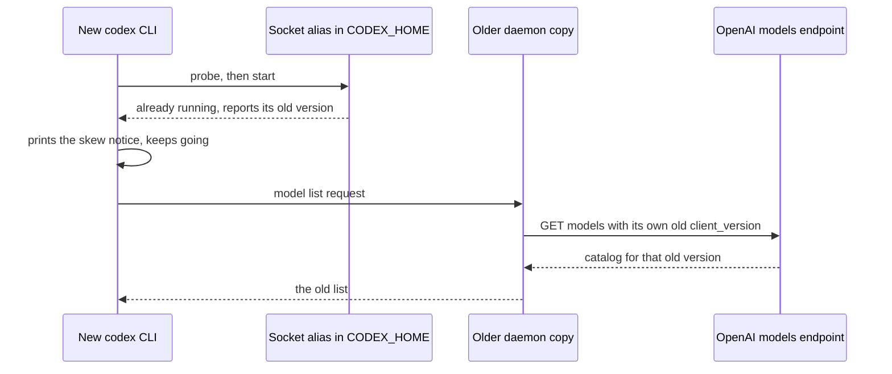

# Codex's background service: what it is, why it hid GPT-6.1 Sol, and what it means for yolo

**Status:** 2026-09-29; research. The first two questions were ruled that day (the daemon is off wherever yolo launches Codex, and a Codex run directly is never touched), and built the same day ([ledger](#decision-ledger)). A review of the build found that `codex agents` starts the daemon whatever the config key says; the host now hands it `--no-daemon`, and what that leaves in jails and on macos-user is [OQ-CDX3](#OQ-CDX3), open. Codex evidence
was read at tag `rust-v0.159.0` (commit `687a119f`, which the 0.159.0 binary embeds), yolo evidence
at `77f52ef1`. No agent CLI was run: every Codex claim comes from source, from the binary's bytes, or
from a published page.

> **In short.** The "background service" is Codex's own **daemon**: a second copy of Codex that the
> CLI starts in the background and then talks to. It is not a system service, and yolo does not
> ship it. It runs from a private copy of Codex that a CLI upgrade never replaces, and on the
> maintainer's host that copy may have been an old one left behind by the Arch package, though
> launch-day account rollout explains the missing model equally well. Every interactive Codex
> that yolo launches starts one too, so yolo has to decide whether to own it or turn it off.

**Why it matters.** It may explain a real incident on the maintainer's host, and a paired test
settles whether it does ([§1](#1-the-short-answer)). Inside yolo it puts a stale server behind
every Codex update yolo installs, and at `yolo host` it keeps a refresh address after the launch
that owned it has gone ([§3](#3-what-it-means-for-yolo-one-row-per-notch)).

**Needs your ruling:** [OQ-CDX3](#OQ-CDX3), what to do about `codex agents` in jails and on
macos-user. [OQ-CDX1](#OQ-CDX1) and [OQ-CDX2](#OQ-CDX2) were ruled 2026-09-29.

**Reads with:** [`agent-credentials.md`'s OpenAI service](../reference/agent-credentials.md#the-openai-subscription-credential-service) (the refresh owner the
daemon talks to), [`host-notch-services.md`](../design/host-notch-services.md#HS-D15) (the doorway
rule), [`host-daemon-ownership.md`](../design/host-daemon-ownership.md#HD-R1) (HD-R1, no host
singletons), [`central-yolo-watcher.md`](central-yolo-watcher.md) (the watcher exploration), and
[`host-tool-provisioning.md`](../design/host-tool-provisioning.md) (the host agent floor).

---

## 1. The short answer

**What the service is.** Since Codex 0.157.0 (2026-09-25), typing `codex` does two things. It
starts, or finds already running, a second copy of Codex in the background, and then the
full-screen terminal interface you see becomes a front end to that copy. The background copy fetches
the model list, runs the turns and refreshes your login. There is one per Codex state directory
(`~/.codex` by default). The CLI starts it itself, detached from your terminal, with no systemd unit
involved. It runs from its own copy of Codex, about 424 MiB (444 MB), under
`~/.codex/packages/app-server-daemon/`, not from the `codex` on your `PATH`
([§2](#2-what-it-is-and-how-it-works)).

**Why your Codex did not show GPT-6.1 Sol.** Two explanations fit, and both stay open until the
paired test below is run. Neither was observed on your host (INFERRED).

**Possibility 1: a stale daemon.** Each step's mechanism is measured in source, but the last step
needs OpenAI's server to gate GPT-6.1 Sol above the daemon's version, and nothing shows that.

1. From Arch's `openai-codex` 0.157.0-2 (2026-09-25), the Arch build ships the complete package
   layout the daemon can copy. Its version string is `<version>+arch.<pkgrel>` (MEASURED:
   [Arch packaging commit `a773c556`](https://gitlab.archlinux.org/archlinux/packaging/packages/openai-codex/-/commit/a773c556deb3982566da6a97f4b418b60e09cbc6)).
2. The first `codex` you ran after that copied the Arch build into `~/.codex`. A version with `+arch`
   is not a plain release to Codex, so the copy was named `local-<hash>` and never marked as
   following the latest release. A copy like that never updates itself (MEASURED:
   [`prepare_install.rs:248-252`](https://github.com/openai/codex/blob/rust-v0.159.0/codex-rs/app-server-daemon/src/prepare_install.rs#L248-L252),
   [`:419-425`](https://github.com/openai/codex/blob/rust-v0.159.0/codex-rs/app-server-daemon/src/prepare_install.rs#L419-L425),
   [`managed_install.rs:74-116`](https://github.com/openai/codex/blob/rust-v0.159.0/codex-rs/app-server-daemon/src/managed_install.rs#L74-L116)).
3. Every later start reuses that copy, whatever version the CLI is. So your `pacman` upgrades moved
   the CLI and left the daemon where it was (MEASURED:
   [`prepare_install.rs:104-120`](https://github.com/openai/codex/blob/rust-v0.159.0/codex-rs/app-server-daemon/src/prepare_install.rs#L104-L120);
   SOURCED: [the daemon README, lines 127-128](https://github.com/openai/codex/blob/rust-v0.159.0/codex-rs/app-server-daemon/README.md?plain=1#L127-L128)).
4. `pacman -R` removes only the files the package owns, so nothing under `~/.codex` goes, and a
   running daemon keeps running (INFERRED). The Arch seed is not self-contained, though: its
   `codex-resources/bwrap` and `codex-path/rg` are two-line stubs that run `exec /usr/bin/bwrap`
   and `exec /usr/bin/rg`, and the package depends on system libraries such as bubblewrap,
   oniguruma, sqlite, openssl and zstd (MEASURED: the `a773c556` diff above and
   [its `PKGBUILD`](https://gitlab.archlinux.org/archlinux/packaging/packages/openai-codex/-/blob/a773c556deb3982566da6a97f4b418b60e09cbc6/PKGBUILD)).
   So `pacman -Rs openai-codex`, which also removes dependencies nothing else needs, can leave a
   `local-<hash>` daemon that fails at its next start or its next sandboxed command (INFERRED).
   OpenAI's install script, run as a CLI install, writes only `packages/standalone/` within
   `CODEX_HOME`, and it never stops, restarts or replaces a daemon. Outside `CODEX_HOME` it writes
   the visible `codex` command under `~/.local/bin`, may add that directory to a shell profile,
   and can offer to uninstall an npm, Bun or Homebrew Codex (MEASURED:
   [`install.sh:16-24`](https://github.com/openai/codex/blob/rust-v0.159.0/scripts/install/install.sh#L16-L24)
   and [`:1271-1286`](https://github.com/openai/codex/blob/rust-v0.159.0/scripts/install/install.sh#L1271-L1286)).
5. So the new CLI connected to the old daemon. The daemon asks OpenAI for models while reporting
   its **own** old version (MEASURED:
   [`models-manager/src/lib.rs:19-26`](https://github.com/openai/codex/blob/rust-v0.159.0/codex-rs/models-manager/src/lib.rs#L19-L26),
   [`codex-api/src/endpoint/models.rs:37-44`](https://github.com/openai/codex/blob/rust-v0.159.0/codex-rs/codex-api/src/endpoint/models.rs#L37-L44)),
   and OpenAI's server withholds models from clients it considers too old (SOURCED:
   [openai/codex#32983](https://github.com/openai/codex/issues/32983#issuecomment-5580939823), the
   same symptom with GPT-6 Astra, fixed by a fresh daemon). This step holds only if the server
   gates GPT-6.1 Sol above the daemon's version.

**Possibility 2: account or rollout timing on launch day.** GPT-6.1 Sol arrived in 0.159.1 on
2026-09-29 ([§2.8](#28-dates)). The bundled catalogs set a model's minimum client version below
the release that shipped it, and those numbers look like the ones the server enforces (MEASURED:
[`models.json` at `rust-v0.156.0`](https://github.com/openai/codex/blob/rust-v0.156.0/codex-rs/models-manager/models.json),
[`rust-v0.156.1`](https://github.com/openai/codex/blob/rust-v0.156.1/codex-rs/models-manager/models.json)
and [`rust-v0.159.1`](https://github.com/openai/codex/blob/rust-v0.159.1/codex-rs/models-manager/models.json)):

- `gpt-6.1-sol` is listed at a minimum of 0.153.0.
- GPT-6 Sol, absent from 0.156.0 and first listed in 0.156.1, has a minimum of 0.155.0.
- GPT-6 Astra's minimum is also 0.153.0, and #32983's server refused Astra to a 0.151.0 daemon.
  That match is the evidence the catalog number is the enforced one.

An Arch-seeded daemon is at least 0.157.0, because 0.157.0-2 is the first Arch build with the
package layout (step 1). That clears 0.153.0, so if the server applies the catalog number, your
daemon would see Sol, and the account not yet having it would be the cause (INFERRED).

**The paired test** separates the two, but only if both paths are compared at the same moment.
Open `/model` in a normal `codex`, which attaches to the daemon, then immediately in
`codex --no-daemon`, which skips the daemon for one launch. For a ChatGPT login the server's list
is authoritative, so the bundled catalog cannot add Sol to the second by itself (MEASURED:
[`models-manager/src/manager.rs:577-601`](https://github.com/openai/codex/blob/rust-v0.159.0/codex-rs/models-manager/src/manager.rs#L577-L601)).

- Missing in the first and present in the second points at the daemon's version.
- Present in both means the rollout has since reached the account, and it was the cause.
- Missing in both means the account does not have the model yet.

**What fixes a stale daemon.** Run `codex app-server daemon update`, or open `/daemon` in Codex
and choose **Install latest public stable**, then relaunch. That installs the current release into
the daemon and puts it back on the self-updating channel (MEASURED:
[`tui/src/update_action.rs:185-198`](https://github.com/openai/codex/blob/rust-v0.159.0/codex-rs/tui/src/update_action.rs#L185-L198),
[`manual_update.rs:147-159`](https://github.com/openai/codex/blob/rust-v0.159.0/codex-rs/app-server-daemon/src/manual_update.rs#L147-L159);
SOURCED: [README 61-67](https://github.com/openai/codex/blob/rust-v0.159.0/codex-rs/app-server-daemon/README.md?plain=1#L61-L67)).
`codex app-server daemon stop` on its own is **not** enough, because the next start runs the same
old copy again. After an Arch seed, updating is also what removes the daemon's reliance on the
system packages step 4 names.

**What the warning means.** The exact text is *"A background Codex service is running v&lt;old&gt;,
older than your Codex CLI v&lt;new&gt;. Use /daemon to manage the local background server. Updating
may interrupt active or queued work."* (MEASURED: binary offset `0xdd4ceac`;
[`tui/src/status/remote_connection.rs:51-60`](https://github.com/openai/codex/blob/rust-v0.159.0/codex-rs/tui/src/status/remote_connection.rs#L51-L60)).
It means the CLI compared its own version with the version the daemon reported when it connected,
found the daemon older, and **kept using it anyway**. Codex warns rather than replacing the daemon,
most likely because a replacement would interrupt work other terminals have running on it
(INFERRED from the notice's own last sentence).

**For yolo.** Yes, it is yolo's to handle. Nothing yolo passes to Codex opts out, so every
interactive Codex yolo launches starts one ([§3](#3-what-it-means-for-yolo-one-row-per-notch)). In a jail it goes
stale after each Codex update yolo installs, adds an unpruned ~424 MiB copy per release, and updates
itself hourly outside yolo's update policy. At `yolo host -- codex` it outlives the launch and
keeps sending refreshes to that launch's refresh doorway after the doorway has closed (all
INFERRED from source; no yolo launch was run). It cannot
bypass the broker, because it never holds the real refresh token. The leaning is to turn it off
wherever yolo launches Codex ([OQ-CDX1](#OQ-CDX1)).

**As a strategy.** Not the resident daemon itself: [HD-R1](../design/host-daemon-ownership.md#HD-R1)
and the watcher exploration already rejected that shape, and this incident is a live example of the
reason. A few of its parts are worth copying ([§4](#4-is-it-a-strategy-yolo-could-use)).

## 2. What it is and how it works

### 2.1 Terms

- **The daemon** — Codex's shared local app server: the same `codex` binary run as
  `codex app-server --listen unix://`, one per Codex state directory, serving
  [JSON-RPC](https://www.jsonrpc.org/specification) over a Unix socket. Codex's own words for it are
  "background Codex service", "local background server" and "app-server daemon"; this doc uses **the
  daemon** for all three. It is **not** a systemd or launchd service, and it is **not** one of yolo's
  host daemons.
- **`CODEX_HOME`** — Codex's state directory, `~/.codex` unless the variable is set. When it is set,
  Codex canonicalizes it; when unset, it uses `$HOME/.codex` as spelled (MEASURED:
  [`utils/home-dir/src/lib.rs:20-62`](https://github.com/openai/codex/blob/rust-v0.159.0/codex-rs/utils/home-dir/src/lib.rs#L20-L62)).
- **TUI** — Codex's full-screen terminal interface, what `codex` opens with no subcommand.
- **Complete package** — Codex's install layout: `codex-package.json` beside `bin/codex`,
  `bin/codex-code-mode-host`, `codex-path/rg`, and on Linux `codex-resources/bwrap` (MEASURED:
  [`prepare_install.rs:427-471`](https://github.com/openai/codex/blob/rust-v0.159.0/codex-rs/app-server-daemon/src/prepare_install.rs#L427-L471)).
  A bare executable is not one.
- **Daemon package** — the copy of a complete package the daemon runs from, under
  `CODEX_HOME/packages/app-server-daemon/releases/`, selected by a `current` symlink. The term is
  Codex's ("Update the daemon package", binary help text).
- **Latest marker** — the `auto-update-version` file beside `current`, naming the release that was
  selected on the latest-release channel. Without it the updater loop never runs; an explicit
  `codex app-server daemon update` still works.
- **Updater loop** — the detached `codex app-server daemon pid-update-loop` process that updates the
  daemon package.
- **Skew notice** *(coined here)* — the warning quoted in [§1](#1-the-short-answer).

### 2.2 Who starts it

- **Every eligible interactive `codex`.** The feature `daemon_auto_start` is stable and on by
  default (MEASURED:
  [`features/src/lib.rs:943-948`](https://github.com/openai/codex/blob/rust-v0.159.0/codex-rs/features/src/lib.rs#L943-L948)).
  It was opt-in in 0.156.0 and became the default in 0.157.0 (SOURCED: the
  [0.157.0 release notes](https://github.com/openai/codex/releases/tag/rust-v0.157.0), #47179).
- **The TUI starts it and then uses it** as its server (MEASURED:
  [`tui/src/startup_orchestration.rs:494-557`](https://github.com/openai/codex/blob/rust-v0.159.0/codex-rs/tui/src/startup_orchestration.rs#L494-L557)).
  If the start fails, the TUI **refuses to open** and suggests `--no-daemon`; it does not fall back
  (MEASURED: [`:538`](https://github.com/openai/codex/blob/rust-v0.159.0/codex-rs/tui/src/startup_orchestration.rs#L538)).
  That refusal is what Arch users hit on 0.157.0-1, whose package had no complete layout (SOURCED:
  [openai/codex#48050](https://github.com/openai/codex/issues/48050)).
- **These skip it:** `--no-daemon`, `--oss`, workload identity, `CODEX_EXEC_SERVER_URL`,
  `--profile`, `-c`, `--enable`, `--disable` or `--search` overrides outside a short allow-list, a
  custom config loader, `--strict-config` and `--dangerously-bypass-hook-trust` (MEASURED:
  [`tui/src/daemon_startup.rs:25-104`](https://github.com/openai/codex/blob/rust-v0.159.0/codex-rs/tui/src/daemon_startup.rs#L25-L104)).
  So do `--remote`, which points the TUI at another server, and a Bedrock provider with no login
  yet, whose setup wizard runs on the in-process server (MEASURED:
  [`startup_orchestration.rs:494-520`](https://github.com/openai/codex/blob/rust-v0.159.0/codex-rs/tui/src/startup_orchestration.rs#L494-L520)).
  `--dangerously-bypass-approvals-and-sandbox` is not on the list.
- **`codex agents` starts it whatever the feature says.** Without `--remote`, the agents overview
  calls the daemon's start itself, before the TUI opens, and reads no feature on the way; the
  TUI's auto-start, the one reader of `daemon_auto_start`, leaves the overview out (MEASURED:
  [`cli/src/main.rs:2418-2434`](https://github.com/openai/codex/blob/rust-v0.159.0/codex-rs/cli/src/main.rs#L2418-L2434),
  [`startup_orchestration.rs:494-497`](https://github.com/openai/codex/blob/rust-v0.159.0/codex-rs/tui/src/startup_orchestration.rs#L494-L497)).
  That start seeds the package and starts the updater loop like any other
  ([`lib.rs:405-456`](https://github.com/openai/codex/blob/rust-v0.159.0/codex-rs/app-server-daemon/src/lib.rs#L405-L456)).
  With `--no-daemon`, Codex refuses `codex agents` before starting anything (MEASURED:
  [`:2383-2394`](https://github.com/openai/codex/blob/rust-v0.159.0/codex-rs/cli/src/main.rs#L2383-L2394)).
- **Attaching is separate from starting.** Every exclusion `daemon_startup.rs` returns also blocks
  attaching, because the TUI probes the socket only when no exclusion applies, and `--remote`
  skips the probe too (MEASURED:
  [`startup_orchestration.rs:176-183`](https://github.com/openai/codex/blob/rust-v0.159.0/codex-rs/tui/src/startup_orchestration.rs#L176-L183),
  [`:302-308`](https://github.com/openai/codex/blob/rust-v0.159.0/codex-rs/tui/src/startup_orchestration.rs#L302-L308)).
  Otherwise it attaches to any daemon already answering, whatever `daemon_auto_start` says. So
  among the switches that leave the rest of the launch alone, only `--no-daemon` refuses a running
  daemon: *"Run without the shared background server, even if it is already running"* (MEASURED:
  binary offset `0xe3d7fcb`). `features.daemon_auto_start = false` does not.
- **`codex exec` does not use it.** The exec crate neither depends on the daemon crate nor
  mentions its socket (MEASURED: `codex-rs/exec/Cargo.toml` and `codex-rs/exec/src`, by search),
  so it runs its own server in process (INFERRED from that absence).

### 2.3 Where it runs, and what it inherits

- **Detached, in a new session.** The daemon is spawned with
  [`setsid`](https://man7.org/linux/man-pages/man2/setsid.2.html), so it leaves the terminal's
  process group and survives the terminal (MEASURED:
  [`backend/pid_start.rs:138-146`](https://github.com/openai/codex/blob/rust-v0.159.0/codex-rs/app-server-daemon/src/backend/pid_start.rs#L138-L146)).
  No systemd unit, launchd agent or cron entry is written: the install script contains none of
  those words (MEASURED, by search).
- **It inherits the whole environment of the `codex` that started it.** Only a telemetry flag is
  removed, and a remote-control-disabled flag is added (MEASURED:
  [`pid_start.rs:81-96`](https://github.com/openai/codex/blob/rust-v0.159.0/codex-rs/app-server-daemon/src/backend/pid_start.rs#L81-L96),
  [`backend/pid.rs:405-415`](https://github.com/openai/codex/blob/rust-v0.159.0/codex-rs/app-server-daemon/src/backend/pid.rs#L405-L415)).
  Upstream states the consequence: *"Shared clients use the environment inherited when the daemon
  started … per-client environment isolation is not provided"* (SOURCED:
  [README lines 22-24](https://github.com/openai/codex/blob/rust-v0.159.0/codex-rs/app-server-daemon/README.md?plain=1#L22-L24)).
- **The socket is not in `CODEX_HOME`.** On Unix the daemon binds it at
  `/tmp/codex-daemon-<uid>/<hash>`, the hash being the SHA-256 of the canonical path of
  `CODEX_HOME/app-server-control/app-server-control.sock`, and publishes that `CODEX_HOME` path
  only as a symlink to it: *"The advertised path is only an alias"* (MEASURED:
  [`app-server-transport/src/transport/mod.rs:53-70`](https://github.com/openai/codex/blob/rust-v0.159.0/codex-rs/app-server-transport/src/transport/mod.rs#L53-L70),
  [`unix_socket.rs:75-110`](https://github.com/openai/codex/blob/rust-v0.159.0/codex-rs/app-server-transport/src/transport/unix_socket.rs#L75-L110),
  [`:282-296`](https://github.com/openai/codex/blob/rust-v0.159.0/codex-rs/app-server-transport/src/transport/unix_socket.rs#L282-L296),
  [`uds/src/daemon_directory.rs:12-39`](https://github.com/openai/codex/blob/rust-v0.159.0/codex-rs/uds/src/daemon_directory.rs#L12-L39)).
  Clients connect through the symlink. What still touches `CODEX_HOME` is the alias's directory,
  created with mode 0700 and refused unless it is owned by the user or root and is not group- or
  other-writable (MEASURED:
  [`unix_socket.rs:53-73`](https://github.com/openai/codex/blob/rust-v0.159.0/codex-rs/app-server-transport/src/transport/unix_socket.rs#L53-L73)),
  the symlink, and the startup lock beside it (MEASURED:
  [`app-server/src/lib.rs:642-649`](https://github.com/openai/codex/blob/rust-v0.159.0/codex-rs/app-server/src/lib.rs#L642-L649)).
  The one socket bound inside `CODEX_HOME` is the updater loop's,
  `app-server-daemon/daemon-updater.sock` (MEASURED:
  [`update_loop.rs:118-128`](https://github.com/openai/codex/blob/rust-v0.159.0/codex-rs/app-server-daemon/src/update_loop.rs#L118-L128),
  [`lib.rs:993-995`](https://github.com/openai/codex/blob/rust-v0.159.0/codex-rs/app-server-daemon/src/lib.rs#L993-L995)).
- **What it is for, upstream:** the desktop and mobile apps, remote control, and machines reached
  over SSH. The README calls it experimental, with a contract that "may change" (SOURCED:
  [README lines 3-9](https://github.com/openai/codex/blob/rust-v0.159.0/codex-rs/app-server-daemon/README.md?plain=1#L3-L9)).
  Remote control stays off unless explicitly enabled (MEASURED:
  [`settings.rs:28-34`](https://github.com/openai/codex/blob/rust-v0.159.0/codex-rs/app-server-daemon/src/settings.rs#L28-L34)).

### 2.4 What it keeps

| Path under `CODEX_HOME` | What it holds | Evidence |
| :--- | :--- | :--- |
| `packages/app-server-daemon/releases/<ver>-<target>` or `local-<hash>-<target>` | a full copy of a complete package | MEASURED: [`prepare_install.rs:222-262`](https://github.com/openai/codex/blob/rust-v0.159.0/codex-rs/app-server-daemon/src/prepare_install.rs#L222-L262) |
| `packages/app-server-daemon/current`, `auto-update-version` | the selected release and the latest marker | MEASURED: [`prepare_install.rs:327-338`](https://github.com/openai/codex/blob/rust-v0.159.0/codex-rs/app-server-daemon/src/prepare_install.rs#L327-L338) |
| `app-server-daemon/settings.json` | updater on or off, interval, stop grace, remote control | SOURCED: [README 48-55](https://github.com/openai/codex/blob/rust-v0.159.0/codex-rs/app-server-daemon/README.md?plain=1#L48-L55) |
| `app-server-daemon/daemon.pid`, `daemon-updater.pid`, `daemon-updater.sock`, `daemon.lock`, `*.stderr.log`, `loaded-threads.json` | process records, the updater loop's socket, the lifecycle lock, logs, thread recovery. Older installs use `app-server.pid` and `app-server-updater.pid` | MEASURED: [`lib.rs:50-56`](https://github.com/openai/codex/blob/rust-v0.159.0/codex-rs/app-server-daemon/src/lib.rs#L50-L56), [`:993-995`](https://github.com/openai/codex/blob/rust-v0.159.0/codex-rs/app-server-daemon/src/lib.rs#L993-L995), [`pid.rs:448-449`](https://github.com/openai/codex/blob/rust-v0.159.0/codex-rs/app-server-daemon/src/backend/pid.rs#L448-L449) |
| `app-server-control/app-server-control.sock`, `app-server-startup.lock` | a symlink to the socket, which lives at `/tmp/codex-daemon-<uid>/<hash>` with its own lock beside it, and the startup lock | MEASURED: [`transport/mod.rs:53-78`](https://github.com/openai/codex/blob/rust-v0.159.0/codex-rs/app-server-transport/src/transport/mod.rs#L53-L78), [`unix_socket.rs:75-110`](https://github.com/openai/codex/blob/rust-v0.159.0/codex-rs/app-server-transport/src/transport/unix_socket.rs#L75-L110) |
| `models_cache.json` | the model catalog, shared with any in-process server | MEASURED: [`models-manager/src/manager.rs:31-32`](https://github.com/openai/codex/blob/rust-v0.159.0/codex-rs/models-manager/src/manager.rs#L31-L32) |

**Sizes.** The 0.159.0 linux-x64 package measures 444,288,853 bytes, 424 MiB (444 MB), and this
jail's installed 0.157.0 and 0.158.0 releases measure 374 MiB and 424 MiB, 391,163,182 and
444,129,086 bytes (MEASURED: `du -sh`, `du -sb`). Neither the daemon crate
nor the install script deletes an old release. The script removes only its own `.staging.*` and
`.current.*` leftovers (MEASURED:
[`install.sh:750-759`](https://github.com/openai/codex/blob/rust-v0.159.0/scripts/install/install.sh#L750-L759);
the crate, by search).

### 2.5 How it is updated

- **Seeded once.** The first start with no daemon package copies the invoking CLI's complete
  package. A plain release version gets `<ver>-<target>`, plus the latest marker unless the CLI is a
  standalone install pinned to an explicit release. A version that is not plain (a pre-release,
  build metadata such as `+arch`, or 0.0.0) gets `local-<hash>-<target>` and no marker; so does
  anything installed with `update --from-cli` (MEASURED:
  [`prepare_install.rs:248-252`](https://github.com/openai/codex/blob/rust-v0.159.0/codex-rs/app-server-daemon/src/prepare_install.rs#L248-L252),
  [`:269-276`](https://github.com/openai/codex/blob/rust-v0.159.0/codex-rs/app-server-daemon/src/prepare_install.rs#L269-L276)
  and [`:419-425`](https://github.com/openai/codex/blob/rust-v0.159.0/codex-rs/app-server-daemon/src/prepare_install.rs#L419-L425)).
  So a daemon seeded from npm, Homebrew or the latest-channel standalone installer updates itself,
  and one seeded from a distro build such as Arch's, or from a pinned standalone release, never
  does. #48195 shows the npm case: the package copied and the updater loop running hourly
  (SOURCED: [#48195](https://github.com/openai/codex/issues/48195)).
- **Reused ever after.** `start` reuses any server that answers the socket, and otherwise launches
  the selected package, whatever the invoking CLI's version (MEASURED:
  [`lib.rs:405-456`](https://github.com/openai/codex/blob/rust-v0.159.0/codex-rs/app-server-daemon/src/lib.rs#L405-L456),
  [`prepare_install.rs:104-120`](https://github.com/openai/codex/blob/rust-v0.159.0/codex-rs/app-server-daemon/src/prepare_install.rs#L104-L120)).
- **`codex update` updates only the CLI.** Its standalone form is
  `curl -fsSL https://chatgpt.com/codex/install.sh | CODEX_NON_INTERACTIVE=1 sh` (MEASURED:
  [`update_action.rs:55-60`](https://github.com/openai/codex/blob/rust-v0.159.0/codex-rs/tui/src/update_action.rs#L55-L60)),
  and that script touches the daemon's directory only when `CODEX_INSTALL_DAEMON_ONLY=1`.
  An install Codex cannot classify, such as a distro package, gets no update action at all
  (MEASURED: [`update_action.rs:31-43`](https://github.com/openai/codex/blob/rust-v0.159.0/codex-rs/tui/src/update_action.rs#L31-L43)).
  That is why `codex update` refused on the Arch build, whose binary lives under `/usr/lib`
  (INFERRED).
- **The updater loop.** Five minutes after a managed start, then every 60 minutes by default, it
  downloads `https://chatgpt.com/codex/install.sh` and pipes it to `/bin/sh -s` with
  `CODEX_INSTALL_DAEMON_ONLY=1`, `CODEX_RELEASE=latest` and compare-and-swap guards. The script's
  output goes to `/dev/null` (MEASURED:
  [`update_loop.rs:63-68`](https://github.com/openai/codex/blob/rust-v0.159.0/codex-rs/app-server-daemon/src/update_loop.rs#L63-L68),
  [`:532-585`](https://github.com/openai/codex/blob/rust-v0.159.0/codex-rs/app-server-daemon/src/update_loop.rs#L532-L585),
  [`settings.rs:14`](https://github.com/openai/codex/blob/rust-v0.159.0/codex-rs/app-server-daemon/src/settings.rs#L14),
  [`:87-89`](https://github.com/openai/codex/blob/rust-v0.159.0/codex-rs/app-server-daemon/src/settings.rs#L87-L89)).
  When the binary changed, it restarts the running server, which may interrupt a turn after a
  60-second grace (SOURCED:
  [README 61-74](https://github.com/openai/codex/blob/rust-v0.159.0/codex-rs/app-server-daemon/README.md?plain=1#L61-L74)).
  The script served on 2026-09-29T21:05Z was byte-identical to the tag's copy, sha256 `150e3cf6…`
  (MEASURED).
- **The loop runs only for** a plain release, selected under the latest marker, whose binary
  supports the loop, with updates enabled (MEASURED:
  [`lib.rs:869-906`](https://github.com/openai/codex/blob/rust-v0.159.0/codex-rs/app-server-daemon/src/lib.rs#L869-L906)).
  It does not survive a reboot, and the next start restarts it (SOURCED:
  [README 143-144](https://github.com/openai/codex/blob/rust-v0.159.0/codex-rs/app-server-daemon/README.md?plain=1#L143-L144)).
- **Explicit updates.** `codex app-server daemon update` selects the latest stable release and
  restarts a running daemon. `update --from-cli --yes` copies and **pins** the invoking CLI's package,
  which also removes the latest marker and so stops the updater loop (MEASURED:
  [`prepare_install.rs:45-78`](https://github.com/openai/codex/blob/rust-v0.159.0/codex-rs/app-server-daemon/src/prepare_install.rs#L45-L78),
  [`:327-334`](https://github.com/openai/codex/blob/rust-v0.159.0/codex-rs/app-server-daemon/src/prepare_install.rs#L327-L334);
  [`cli/src/main.rs:634-676`](https://github.com/openai/codex/blob/rust-v0.159.0/codex-rs/cli/src/main.rs#L634-L676)).

### 2.6 How it is stopped or bypassed

- `codex app-server daemon stop` asks the server to exit and kills it after the grace window. It
  stops the server only: the updater loop keeps running and keeps installing on schedule (MEASURED:
  [`lib.rs:591-621`](https://github.com/openai/codex/blob/rust-v0.159.0/codex-rs/app-server-daemon/src/lib.rs#L591-L621);
  SOURCED: [#48195](https://github.com/openai/codex/issues/48195), *"Bug found while turning it
  off"*). `--no-daemon` and `daemon_auto_start = false` do not reach it either (INFERRED: both
  only skip the daemon's start, which is where the updater is managed). The next start runs the
  same selected package ([§2.5](#25-how-it-is-updated)).
- `codex --no-daemon` runs one launch with an in-process server, even when a daemon is running
  (MEASURED: [`tui/src/cli.rs:83-85`](https://github.com/openai/codex/blob/rust-v0.159.0/codex-rs/tui/src/cli.rs#L83-L85)).
  No environment variable does the same.
- `features.daemon_auto_start = false`, in `config.toml` or as `-c`, stops the TUI's own start.
  It is on the allow-list, so it does not itself force embedded mode, and it does **not** stop
  attaching to a daemon already running, nor `codex agents` and the explicit
  `codex app-server daemon` commands starting one ([§2.2](#22-who-starts-it)).
- `{"updater": {"autoUpdateEnabled": false}}` in `settings.json` stops the updater loop. A running
  loop rereads the file at each wake and exits before installing, and the next `daemon start` or
  `restart` stops it at once (MEASURED:
  [`update_loop.rs:184-185`](https://github.com/openai/codex/blob/rust-v0.159.0/codex-rs/app-server-daemon/src/update_loop.rs#L184-L185),
  [`lib.rs:470-474`](https://github.com/openai/codex/blob/rust-v0.159.0/codex-rs/app-server-daemon/src/lib.rs#L470-L474),
  [`:869-874`](https://github.com/openai/codex/blob/rust-v0.159.0/codex-rs/app-server-daemon/src/lib.rs#L869-L874);
  SOURCED: [README 48-55](https://github.com/openai/codex/blob/rust-v0.159.0/codex-rs/app-server-daemon/README.md?plain=1#L48-L55)).
- `tui.show_server_version_notice = false` hides the skew notice and changes nothing else (MEASURED:
  [`config/src/types.rs:828-831`](https://github.com/openai/codex/blob/rust-v0.159.0/codex-rs/config/src/types.rs#L828-L831)).
- Open upstream reports show recovery dead ends: an update that returns `unsupported`
  ([#47482](https://github.com/openai/codex/issues/47482)), a daemon "running but not managed" that
  refuses update and restart ([#46468](https://github.com/openai/codex/issues/46468)), and a request
  to make auto-start opt-in again ([#48195](https://github.com/openai/codex/issues/48195)) (SOURCED).

### 2.7 The model list and the refresh live in the daemon

- **Model list.** The TUI asks its server for the model list. With a daemon attached, the daemon
  fetches `<base>/models?client_version=<its own x.y.z>` (MEASURED:
  [`tui/src/app_server_session/models.rs:26-46`](https://github.com/openai/codex/blob/rust-v0.159.0/codex-rs/tui/src/app_server_session/models.rs#L26-L46),
  [`codex-api/src/endpoint/models.rs:37-44`](https://github.com/openai/codex/blob/rust-v0.159.0/codex-rs/codex-api/src/endpoint/models.rs#L37-L44)).
  It refreshes every 4 minutes 30 seconds (MEASURED:
  [`app-server/src/models_refresh_worker.rs:10`](https://github.com/openai/codex/blob/rust-v0.159.0/codex-rs/app-server/src/models_refresh_worker.rs#L10)).
- **The cache is not what goes stale.** `models_cache.json` lives 300 seconds, and an entry written
  for a different client version counts as a miss (MEASURED:
  [`models-manager/src/cache.rs:183-212`](https://github.com/openai/codex/blob/rust-v0.159.0/codex-rs/models-manager/src/cache.rs#L183-L212)).
  What goes stale is the daemon's own version, which it sends on every fetch.
- **The server gates models by client version.** #32983 shows a 0.151.0 daemon behind a 0.153.4
  CLI getting HTTP 400 *"requires a newer version of Codex"* for GPT-6 Astra (SOURCED:
  [the #32983 comment](https://github.com/openai/codex/issues/32983#issuecomment-5580939823)).
  Astra's catalog minimum is 0.153.0, so the refusal matches the catalog number
  ([§1](#1-the-short-answer)).
  The client does no such filtering itself: `minimal_client_version` appears outside the catalog
  file only in a test fixture (MEASURED, by search).
- **Refresh.** The refresh URL is read from the refreshing process's environment at each refresh:
  `CODEX_REFRESH_TOKEN_URL_OVERRIDE`, else `https://auth.openai.com/oauth/token` (MEASURED:
  [`login/src/auth/manager.rs:212-214`](https://github.com/openai/codex/blob/rust-v0.159.0/codex-rs/login/src/auth/manager.rs#L212-L214),
  [`:1726-1729`](https://github.com/openai/codex/blob/rust-v0.159.0/codex-rs/login/src/auth/manager.rs#L1726-L1729)).
  With a daemon attached, the refreshing process is the daemon, so the URL is whatever the first
  launch's environment held (INFERRED from [§2.3](#23-where-it-runs-and-what-it-inherits)).

### 2.8 Dates

| When | What | Evidence |
| :--- | :--- | :--- |
| 2026-09-22 | 0.156.0: auto-start exists, opt-in; `/daemon` and `--no-daemon` arrive | SOURCED: [release notes](https://github.com/openai/codex/releases/tag/rust-v0.156.0) |
| 2026-09-25 | 0.157.0: auto-start on by default | SOURCED: [release notes](https://github.com/openai/codex/releases/tag/rust-v0.157.0) |
| 2026-09-25 | Arch 0.157.0-1 cannot start Codex without `--no-daemon`; 0.157.0-2 adds the package layout | SOURCED: [#48050](https://github.com/openai/codex/issues/48050); MEASURED: [Arch commit list](https://gitlab.archlinux.org/archlinux/packaging/packages/openai-codex/-/commits/main) |
| 2026-09-29T08:05Z | 0.159.0: no `gpt-6.1` anywhere in its bytes | MEASURED: string search of the linux-musl binary |
| 2026-09-29T20:32Z | 0.159.1: *"Added GPT-6.1 Sol as the default model in the bundled catalog"* | SOURCED: [release notes](https://github.com/openai/codex/releases/tag/rust-v0.159.1) |

Five stable Codex releases shipped between 2026-09-25 and 2026-09-29 (MEASURED: GitHub releases
API). Every one of them is a fresh daemon copy wherever the updater loop runs.

## 3. What it means for yolo, one row per notch

A **notch** is one place an agent can run, from a jail to the bare host
([the launch-PATH ruling](../reference/host-agent-environment.md#he-dir1)).
At `77f52ef1`, yolo's tree never mentioned the daemon, `daemon_auto_start` or `--no-daemon`
(MEASURED: search over `internal/` and `packs/`; the build that followed the ruling changed this,
as the note below the table says). The codex pack installs through OpenAI's script, updates with
`codex update`, and passes only `--dangerously-bypass-approvals-and-sandbox` (MEASURED: the
`program` and `autonomy` contributions of [`packs/codex/pack.json`](../../packs/codex/pack.json)).
None of that skips the daemon ([§2.2](#22-who-starts-it)), so **every interactive Codex yolo
launched started one** (INFERRED: no yolo launch was run).

| Notch | Daemon starts? | Outlives the agent? | State it adds | Refresh doorway | What yolo would have to do |
| :--- | :--- | :--- | :--- | :--- | :--- |
| **Container jail** (podman, Apple Container) | yes | outlives `codex`, never the jail | a daemon package per release in the per-workspace `~/.codex`, never pruned | fixed address for the jail's life: stays correct | keep the daemon at the CLI's version, prune it, and govern its self-update; or turn it off |
| **macos-user** | yes | probably outlives the sandboxed command | the same, through the account home's `~/.codex` link, which one launch at a time owns | a per-launch port: a survivor keeps a dead one | as the jail, plus the survivor |
| **Host**: `yolo host -- codex`, and the floor | yes, in the managed `CODEX_HOME` | yes, indefinitely | a ~424 MiB copy under yolo's state directory, and an hourly installer run on the real host | a per-launch port: a later launch's refreshes go to a dead or reused one | must act: turn it off, or stop or restart it per launch |

> [!NOTE]
> **As built, 2026-09-29** ([OQ-CDX1](#OQ-CDX1)). The rows above describe yolo before the ruling.
> No jail's Codex TUI starts a daemon now, on any backend ([CDX-D1](#CDX-D1)). `codex agents`
> still does, since it starts one whatever the key says ([§2.2](#22-who-starts-it)): in a jail it
> runs from whatever copy the workspace home holds, nothing turns its updater off, and every
> later `codex` there attaches to it until the container ends, or on `macos-user` until it is
> stopped ([CDX-D4](#CDX-D4), [OQ-CDX3](#OQ-CDX3)). At `yolo host -- codex` the managed home carries the
> key and the updater off, the launch passes `--no-daemon`, `codex agents` included, which Codex
> then refuses, and what an earlier launch's daemon left there is shut down once
> ([CDX-D2](#CDX-D2), [CDX-D3](#CDX-D3)). What else remains is a daemon a `macos-user` session
> started before the change, and the copies already seeded in workspace homes
> ([CDX-D5](#CDX-D5)).

### 3.1 A podman or Apple Container jail

- **It starts, and dies with the jail.** When a container's first process exits, the kernel kills
  every other process in its [pid namespace](https://man7.org/linux/man-pages/man7/pid_namespaces.7.html)
  (MEASURED on podman in [`jail-lifetime-last-session-wins.md` §2](../design/jail-lifetime-last-session-wins.md#2-what-ties-a-jail-to-its-first-terminal-today),
  row 2; INFERRED for Apple Container, whose VM stops with its container). So the daemon outlives the `codex` that started it, and serves every later `codex` in the
  same jail, but never outlives the jail. Under the last-session-wins design it would live exactly
  as long as the jail, which that design needs nothing extra for. Its one wrinkle there is that it
  serves every session with the first session's environment (INFERRED).
- **It holds state in the per-workspace home.** The pack declares `~/.codex` as per-workspace state
  (the `state` contribution of [`pack.json`](../../packs/codex/pack.json)), so the daemon package, pid files,
  logs, settings and the socket's symlink land in the workspace's home overlay and persist across
  launches. This jail's `~/.codex` has no daemon state yet, and its standalone install's
  latest-channel record, `packages/standalone/auto-update-version`, names the current release,
  `0.158.0-x86_64-unknown-linux-musl` (MEASURED: `ls`, `cat`). That record matching the release
  name is what makes a daemon seeded from this CLI follow the latest release, so the first TUI
  here would seed a daemon with its own latest marker, and that daemon runs the updater loop
  (MEASURED:
  [`prepare_install.rs:269-276`](https://github.com/openai/codex/blob/rust-v0.159.0/codex-rs/app-server-daemon/src/prepare_install.rs#L269-L276);
  INFERRED for this jail).
- **It needs no socket from yolo.** The socket is bound in the container's own `/tmp`, with only a
  symlink to it in `~/.codex` ([§2.3](#23-where-it-runs-and-what-it-inherits)), and nothing is
  mounted or published for it. That `/tmp` is per launch
  ([`jail-home.md`](../reference/jail-home.md#everything-else-on-the-argv)), which is one more
  reason the daemon never outlives the container. The symlink left in `~/.codex` then points at
  nothing, and the next daemon removes a dangling alias of its own before binding (MEASURED:
  [`unix_socket.rs:256-263`](https://github.com/openai/codex/blob/rust-v0.159.0/codex-rs/app-server-transport/src/transport/unix_socket.rs#L256-L263)).
- **The refresh doorway stays right.** On a jail with its own network namespace the doorway listens
  at the fixed `127.0.0.1:1460` for the jail's life
  ([`manifest.jsonc`](../../packs/openai-auth/loopholes/openai-auth-broker/manifest.jsonc#L53-L66)).
  The **doorway** is the thin adapter an agent's client talks to, which checks the launch's caller
  token and forwards to the host service
  ([HS-D15](../design/host-notch-services.md#HS-D15)). A daemon that inherits that URL keeps a
  working address until the container ends (INFERRED).
- **It goes stale after every Codex update yolo installs.** The launcher moves the CLI with
  `codex update` at most hourly ([`shims.go:1462`](../../internal/entrypoint/shims.go#L1462)). The next launch's TUI starts the **old** selected package, prints
  the skew notice and lists the old version's models. yolo's `-p codex` default, `gpt-6.1-sol`
  since `5e6220e8` ([`packs/openai-auth/pack.json`](../../packs/openai-auth/pack.json#L33-L44)),
  is not at risk from a 0.157-or-later daemon: its catalog minimum is 0.153.0, and nothing shows the
  server gating it higher ([§1](#1-the-short-answer)). A model the server does gate above the
  daemon's version would be missing. About five minutes in, the updater loop installs the new release and restarts the server,
  which can cut off a turn running past the 60-second grace (INFERRED from
  [§2.5](#25-how-it-is-updated)).
- **It self-updates outside yolo's policy.** The updater loop runs `curl … | sh` hourly whatever
  `agent_updates` says, the config key that freezes an agent's version, and outside the launchers'
  update lock ([`shims.go:1466-1560`](../../internal/entrypoint/shims.go#L1466-L1560)) (INFERRED).
- **With the `guardrails` pack it never updates.** The installer calls `find` under `set -eu`
  ([`install.sh:3`](https://github.com/openai/codex/blob/rust-v0.159.0/scripts/install/install.sh#L3),
  [`:753-754`](https://github.com/openai/codex/blob/rust-v0.159.0/scripts/install/install.sh#L753-L754)),
  and the daemon inherits a `PATH` whose first entry holds the `find` blocker. Under `set -eu` that
  blocker aborts a script with exit 127 (MEASURED in this jail). yolo's own updates set
  `YOLO_BYPASS_SHIMS=1` ([`shims.go:1540-1546`](../../internal/entrypoint/shims.go#L1540-L1546)) and
  the daemon's do not, and their output goes to `/dev/null`. So the skew never ends, silently
  (INFERRED).
- **Disk.** The pack's `versions_dir` covers only `.codex/packages/standalone/releases`, pruned to
  two ([`pack.json:18`](../../packs/codex/pack.json#L18),
  [`shims.go:1473`](../../internal/entrypoint/shims.go#L1473)). The daemon's releases directory sits
  beside it, unpruned, at roughly 424 MiB per release per workspace (INFERRED).
- **Apple Container is unmeasured.** It binds the home over a shared filesystem. The control
  socket is bound in the container's own `/tmp`, so what touches the shared home is the rest:
  creating `~/.codex/app-server-control` with mode 0700, the check that it is owned by the user or
  root and is not group- or other-writable, the symlink, and the startup lock beside it (MEASURED:
  [`unix_socket.rs:53-73`](https://github.com/openai/codex/blob/rust-v0.159.0/codex-rs/app-server-transport/src/transport/unix_socket.rs#L53-L73),
  [`:107-110`](https://github.com/openai/codex/blob/rust-v0.159.0/codex-rs/app-server-transport/src/transport/unix_socket.rs#L107-L110)).
  Whether those hold on that filesystem is not known. If the check fails, the daemon cannot start
  and Codex refuses to open ([§2.2](#22-who-starts-it)) (INFERRED). The one socket bound on the
  shared home is the updater loop's, and a failure there costs only the updater: its start errors
  are warnings (MEASURED:
  [`lib.rs:447-453`](https://github.com/openai/codex/blob/rust-v0.159.0/codex-rs/app-server-daemon/src/lib.rs#L447-L453)).
  [§6](#6-what-is-unmeasured-and-how-to-measure-it) says how to find out.

### 3.2 A macos-user sandbox

- **It probably outlives the sandboxed command.** The agent runs as `sudo -u _yolojail … sandbox-exec
  … <agent>` ([`macosuser.go:759-814`](../../internal/macosuser/macosuser.go#L759-L814)), and yolo
  stops its background daemons by signalling their process groups
  ([`real.go:287-310`](../../internal/macosuser/real.go#L287-L310)). A `setsid` child has left every
  group yolo signals, and nothing in `internal/` reaps the sandbox account's leftover processes
  (MEASURED: search). So a daemon started in one sandbox session keeps running under the sandbox
  account, under that launch's Seatbelt profile (INFERRED).
- **A repoint cuts it off rather than cross-wiring it.** The account home holds one set of links,
  and a launch in another workspace repoints them
  ([`macos-user-home-tiers.md`](../reference/macos-user-home-tiers.md#no-migration-an-occupied-path-refuses-the-launch)).
  With `CODEX_HOME` unset, Codex uses `~/.codex` as spelled, uncanonicalized
  ([§2.1](#21-terms)), and that link targets the launch's sidecar, `<workspace>/.yolo/home/codex`.
  A survivor keeps launch A's Seatbelt profile. It denies writes everywhere except A's workspace,
  the sandbox home, `/tmp` and `/var/folders`, and denies reads under `/Users` except A's workspace
  and the sandbox home
  ([`seatbelt.go:95-107`](../../internal/macosuser/seatbelt.go#L95-L107),
  [`:130-138`](../../internal/macosuser/seatbelt.go#L130-L138)). Seatbelt judges a link by its
  target, so once launch B repoints `~/.codex` at B's sidecar, the survivor's reads and writes
  through it, `auth.json` refreshes included, are refused by its own profile
  ([What is still shared](../reference/macos-user-home-tiers.md#what-is-still-shared-and-what-that-costs),
  [Isolation](../reference/macos-user-home-tiers.md#isolation-the-seatbelt-profile-needs-no-change)).
  It stops working; it does not write into B's tree (INFERRED).
- **Its refresh address dies.** The macos-user doorway is a launch-owned listener on a port the
  launch picks and closes when the sandboxed command exits
  ([HS-D15](../design/host-notch-services.md#HS-D15),
  [`launchservice.go:223`](../../internal/launchservice/launchservice.go#L223)). A surviving daemon
  keeps the old port, which is the host hazard below, inside the sandbox (INFERRED).

### 3.3 The host: `yolo host -- codex` and the host agent floor

`yolo host -- codex` points Codex at a **managed `CODEX_HOME`**, `<yolo state>/host-agents/codex`,
so the host broker can serve it without touching the user's own `~/.codex`
([OQ-OA3](../reference/agent-credentials.md#oq-oa3)). It opens a refresh adapter on a fresh
`127.0.0.1:0` port and hands Codex that URL, and closes the adapter when the agent exits
(MEASURED: `prepare` and `Launch.Run` in [`host.go`](../../internal/openaiauthhost/host.go)).

- **The daemon outlives the launch.** yolo waits for the agent process only, and the daemon has left
  its session ([§2.3](#23-where-it-runs-and-what-it-inherits)). It keeps running after
  `yolo host` returns (INFERRED).
- **It keeps the first launch's refresh URL.** Launch A starts the daemon with A's port. When A
  exits, that port closes. Launch B opens a new port and, if no other launch is live, mints a new
  **caller token**, the per-launch secret the adapter requires inside every refresh marker
  ([`notch-convergence.md` §2.3](../plans/notch-convergence.md#23-the-fix-every-service-authenticates-its-caller-at-every-notch)).
  The mint is `sharedCallerToken` in [`host.go`](../../internal/openaiauthhost/host.go), and B
  rewrites `auth.json` with the token (`prepareCodexHome`, the same file).
  B's TUI attaches to A's daemon, which reads B's marker from disk and posts it to **A's** closed
  port. The refresh fails, and B's session loses its login when the access token expires. The same
  happens to a session still running when the first one quits (INFERRED; not reproduced).
- **Does it bypass the broker? No.** The managed `auth.json` holds a broker marker,
  `yolo-broker:<generation>` bound to the caller token, never the real refresh token
  (MEASURED: [`openauthclient/codex.go:54-62`](../../internal/openauthclient/codex.go#L54-L62);
  [the OpenAI service's one-writer rule](../reference/agent-credentials.md#openai-one-writer)). So the
  daemon cannot redeem anything at OpenAI itself, and the broker stays the one refresh owner.
- **What it can leak.** Once A's port is free, any local process, another user's included, can bind
  it and receive B's marker **with B's live caller token**. It can then replay that to B's adapter
  and get the current access token. The caller token exists to stop exactly that: it assumes Codex
  posts only to its own launch's listener, and the daemon breaks the assumption (INFERRED; it needs
  a local attacker who takes the freed port).
- **Cost.** The managed home gains its own ~424 MiB daemon package, and, because it is seeded from a
  plain release, an hourly installer run on the real host (INFERRED from
  [§2.5](#25-how-it-is-updated)). Inside that home, the user's standalone CLI is not under
  `CODEX_HOME/packages/standalone/releases`, so Codex classifies it as an unknown install and
  `codex update` refuses there (MEASURED:
  [`install-context/src/lib.rs:322-346`](https://github.com/openai/codex/blob/rust-v0.159.0/codex-rs/install-context/src/lib.rs#L322-L346)).
- **A long managed `CODEX_HOME` does not stop Codex opening on macOS.** Codex already handles it:
  the control socket is bound under `/private/tmp`, and a client whose alias path exceeds the
  socket-path limit retries at the symlink's short target (MEASURED:
  [`uds/src/lib.rs:166-175`](https://github.com/openai/codex/blob/rust-v0.159.0/codex-rs/uds/src/lib.rs#L166-L175)).
- **The models cache is separate.** The managed home keeps its own `models_cache.json`, which the
  user's `~/.codex` daemon does not share. A stale list there has the same cause as in
  [§2.7](#27-the-model-list-and-the-refresh-live-in-the-daemon): the daemon's version, not the cache.
- **The host agent floor** — the set of agents yolo guarantees on the host, installed into a
  yolo-owned prefix ([`host-tool-provisioning.md`](../design/host-tool-provisioning.md#defined-terms)) —
  is ruled and not built. Codex is in it by materializing a capture
  ([OQ-HP3](../design/host-tool-provisioning.md#OQ-HP3)). Three consequences follow (INFERRED):
  - The capture must keep the complete package layout, or Codex 0.157 and later refuses to open at
    the host while the daemon is on.
  - A copy outside `CODEX_HOME/packages/standalone/releases` cannot run `codex update`, so the floor
    updates by re-capturing and never through the pack's `update` verb.
  - A floor update moves the CLI and not the daemon package, so with the daemon on, the floor would
    also have to run `codex app-server daemon update --from-cli --yes` after each update.
- **Not affected:** the user's own `codex` in `~/.codex`, which is a different socket and a
  different daemon. So are Pi and Claude on the `openai-codex` provider, which talk to OpenAI
  directly and run no Codex daemon.

## 4. Is it a strategy yolo could use

| | Codex's daemon | yolo's launch-owned service ([HS-D11](../design/host-notch-services.md#HS-D11)) | yolo's host singletons, retired by [HD-R1](../design/host-daemon-ownership.md#HD-R1) (ruled, not built) | The watcher exploration's S7 ([YW-D5](central-yolo-watcher.md#YW-D5)) |
| :--- | :--- | :--- | :--- | :--- |
| Started by | the CLI, on demand, `setsid` | the launch | the first launch, `setsid` | yolo, `setsid` |
| Ends | the server: an explicit stop, or a reboot. The updater loop: a reboot, a kill, or updates turned off in its settings | with the agent; a lifeline pipe covers a killed launch | never | never |
| Environment | frozen at first start | per launch | frozen at first start | frozen at first start |
| Version seam | version in the handshake; warns and keeps serving | none needed: one build by construction | one-bit stamp; warns | would need a handshake and a rule that is not "warn and keep serving" |

What the comparison teaches:

1. **This is HD-R1's failure list in another product.** A process that outlives the build that
   started it drifts from the front end, which is
   [modes 3 and 4](../design/host-daemon-ownership.md#modes-3-and-4-alive-but-wrong-and-two-yolo-versions).
   It also keeps a per-launch setting frozen in, which is
   [mode 7](../design/host-daemon-ownership.md#mode-7-it-runs-settings-the-config-no-longer-says).
   HD-R1's cure, ending with the launch that asked, is exactly what `--no-daemon` gives back. The
   incident supports HD-R1 rather than challenging it.
2. **A version in the handshake is necessary, and it is not enough.** Codex has one and still
   ships "warn and keep serving", most likely because replacing the server would interrupt other
   terminals' turns (INFERRED). That is the same trade behind yolo's old no-kill rule for two yolo versions. The watcher
   exploration's precondition
   ([§7](central-yolo-watcher.md#7-what-would-have-to-be-true-before-building-one), item 4) asks for
   a rule that is not this, and the incident shows why.
3. **A launch-owned doorway assumes the agent leaves nothing behind.** [HS-D15](../design/host-notch-services.md#HS-D15)
   closes the doorway when the agent exits. A tool that daemonizes breaks that assumption, and
   nothing in the doorway rule notices. The jail's fixed address survives it only because the
   container bounds the daemon's life. Any future launch-owned doorway at the host or in macos-user
   has the same exposure.
4. **Worth copying, with no daemon:**
   - Run a long-lived process from its own immutable copy, so an update never deletes a running
     binary. yolo already does this with flake-bundle generations and the embedded-pack lease.
   - Identify a pid by its process start time, so a reused pid is not mistaken for the old one.
     That is the stale-PID class the watcher exploration lists in
     [§2.4](central-yolo-watcher.md#24-the-three-small-watchers-that-already-ship).
   - Guard an install with a compare-and-swap: apply an update only if the selection is still the
     one the updater saw (`CODEX_INSTALL_IF_LATEST`, `CODEX_UPDATE_FROM_RELEASE`), so a scheduled
     update cannot undo a pin.
   - Give automation a `version` verb that prints exactly one JSON object.
5. **The daemon is also an interface.** `codex queue` and `turn/start` reach a running Codex only
   through the daemon, and [`agent-event-watchers.md` A.4](../design/agent-event-watchers.md#a4-codex-01580)
   leans on that for waking Codex. Turning the daemon off closes that route until it is turned back
   on. That is [OQ-CDX1](#OQ-CDX1)'s real cost.

## 5. Open questions

1. ✅ **[OQ-CDX1](#OQ-CDX1): Where yolo launches Codex, is Codex's daemon on
   or off?**

   **The setup.** You run `yolo -- codex` in a workspace most days. Codex 0.160 ships, and the next
   launch's launcher updates the CLI. The jail's daemon package is still 0.159. The TUI starts it,
   prints the skew notice and lists 0.159's models, so a model the server gates above 0.159 is
   missing. About five minutes in, Codex's own updater downloads a second 424 MiB copy and
   restarts the server, cutting off any turn that runs past 60 seconds. In a workspace with
   `guardrails` selected, the updater never succeeds and the notice never goes away. On the host,
   `yolo host -- codex` leaves a daemon behind that refreshes through the first launch's closed
   doorway ([§3](#3-what-it-means-for-yolo-one-row-per-notch)). **Why it is a question:** turning
   the daemon off also closes the `codex queue` route yolo's own event-watcher design wanted
   ([§4](#4-is-it-a-strategy-yolo-could-use), item 5).

   - **A — Off everywhere yolo launches Codex.** In a jail, the codex pack's managed config sets
     `features.daemon_auto_start = false`. That is enough there, because no daemon survives a
     container, so there is never one to attach to. At `yolo host -- codex`, the managed config gets
     the same key, and the launch also passes `--no-daemon`, because a daemon from before this
     change may still be running. The host also shuts the updater loop down once, because
     `daemon stop` leaves it alive and neither the key nor the flag touches it: write
     `{"updater":{"autoUpdateEnabled":false}}` to the managed home's `app-server-daemon/settings.json`,
     which a running loop obeys at its next wake, then run `daemon restart` and `stop` to end it at
     once, or signal the process group recorded in `daemon-updater.pid`
     ([`lib.rs:591-621`](https://github.com/openai/codex/blob/rust-v0.159.0/codex-rs/app-server-daemon/src/lib.rs#L591-L621),
     [`:869-874`](https://github.com/openai/codex/blob/rust-v0.159.0/codex-rs/app-server-daemon/src/lib.rs#L869-L874);
     [§2.6](#26-how-it-is-stopped-or-bypassed)). **You see** Codex as it was in 0.156: no skew notice, the model
     list of the CLI yolo just installed, no second copy, no hourly `curl | sh`, no mid-session
     restart. **You lose** `codex queue`, `codex agents`, and one server shared by several terminals
     in a jail. The daemon copies already seeded in each workspace become dead weight a prune can
     remove.
   - **B — On in jails with yolo owning its version, off at the host.** After each update, the jail
     launcher runs `codex app-server daemon update --from-cli --yes`, which copies this CLI, pins
     it, and so stops Codex's own updater. The pack prunes the daemon's releases like the
     standalone ones. The host is as in A. **You see** a daemon at the CLI's version in every jail
     session, and `codex queue` works. **You pay** one extra copy per workspace, and an update
     restarts a running daemon, which interrupts another terminal's turn in the same jail.
   - **C — Leave Codex's default, and only prune.** **You see** a stale daemon after every update in
     every workspace, the updater bypassing `agent_updates`, and the host doorway hazard left open.

   _Leaning:_ **A.** Nothing the daemon is for applies in a jail: desktop and mobile remote control
   and SSH-launched machines. Its updater runs outside `agent_updates` and yolo's update lock, and
   upstream marks its contract experimental. A is one config key, one flag and, at the host, a
   one-time updater shutdown. B stays reachable
   later with public commands, if [`agent-event-watchers.md`](../design/agent-event-watchers.md)'s
   wake route is ever designed for real. **The trap:** the config key alone does not stop a
   `codex` attaching to a daemon that is already running. Wherever a daemon can outlive a launch,
   which means the host and possibly macos-user, the key must come with `--no-daemon` or a stop,
   and a stop leaves the updater loop running, which is why A's host arm also shuts it down.

   <!-- vantage: question id=OQ-CDX1 -->

   **Answer:**
   > **Ruled 2026-09-29: A, off everywhere yolo launches Codex.** The maintainer: *"I think we
   > have to turn this off. It just doesn't seem compatible with anything that we do, and it's a
   > strange feature for them to have that's going to cause a lot of annoyance."* In a jail the
   > codex pack's managed config sets `features.daemon_auto_start = false`; at `yolo host --
   > codex` the managed `CODEX_HOME` gets the same key, the launch passes `--no-daemon`, and the
   > updater loop is shut down once. Built; see the [ledger](#decision-ledger), and
   > [OQ-CDX3](#OQ-CDX3) for what `codex agents` leaves in jails.

2. ✅ **[OQ-CDX2](#OQ-CDX2): Does that choice reach the Codex you run by hand
   on the host?**

   **The setup.** Your incident happened in plain `codex` on the host, in `~/.codex`, outside any
   yolo launch. With host management on, `yolo host apply` renders the selected packs' settings
   into the real home, so a key in the codex pack's `config` contribution would land in your
   `~/.codex/config.toml` too (INFERRED; [§6](#6-what-is-unmeasured-and-how-to-measure-it), item 8).
   The broker ledger already says a direct host Codex "remains untouched"
   ([OQ-OA3](../reference/agent-credentials.md#oq-oa3)). **Why it is a question:** the same
   key that protects yolo's launches would have prevented your incident if the daemon caused it
   ([§1](#1-the-short-answer)), but it changes a program yolo does not launch.

   - **A — Launches only.** The key is written for jails, macos-user and the managed `CODEX_HOME`,
     never into your `~/.codex`. **You see** your own `codex` keep upstream behavior, daemon and
     skew included.
   - **B — Everywhere the pack renders, host apply included.** Your own `codex` stops starting a
     daemon too. One already running keeps serving until it is stopped. **You see** a stale daemon
     like the one [§1](#1-the-short-answer) suspects prevented. You lose auto-start for the desktop and mobile apps, though
     `codex remote-control start` still starts the daemon explicitly
     ([README 170-176](https://github.com/openai/codex/blob/rust-v0.159.0/codex-rs/app-server-daemon/README.md?plain=1#L170-L176)).
   - **C — Launches only, plus a `yolo check` row at the host.** The row reads files only: the
     daemon's `current` link against the CLI's own `codex-package.json`. It reports a daemon older
     than the CLI and names `codex app-server daemon update`. **You see** a stale daemon like the
     one [§1](#1-the-short-answer) suspects reported, and yolo changes nothing in your tool.

   _Leaning:_ **A**, which keeps [OQ-OA3](../reference/agent-credentials.md#oq-oa3)'s promise.
   C is A plus a read-only diagnosis. Choose C if you want `yolo check` to have caught this
   incident, knowing it makes yolo report on a process it neither starts nor owns.

   <!-- vantage: question id=OQ-CDX2 -->

   **Answer:**
   > **Ruled 2026-09-29, none of the options as written, closest to A.** The maintainer: *"We
   > decided that we don't care if you get to Codex not going through YOLO. If you have host
   > management on, if you have host management off, then YOLO doesn't do anything to it."* yolo
   > never changes a Codex the user starts directly from a terminal: `yolo host apply` does not
   > write the daemon key into the user's own `~/.codex`, and no `yolo check` row reports on its
   > daemon. This follows the 2026-09-28 ruling that an agent started outside yolo may lack
   > features, and [OQ-OA3](../reference/agent-credentials.md#oq-oa3)'s "remains untouched".

3. 💬 **[OQ-CDX3](#OQ-CDX3): In a jail and on macos-user, `codex agents`
   still starts Codex's daemon. Accept that, or hand every in-jail `codex` `--no-daemon`?**

   **The setup.** You run `codex agents` in a jail to look at your sessions. The config key
   [CDX-D1](#CDX-D1) writes does not stop it: the agents overview starts the daemon itself and
   reads no feature ([§2.2](#22-who-starts-it)). On podman or Apple Container the daemon then
   runs from whatever copy the workspace home holds, which can be one seeded before this change
   ([CDX-D5](#CDX-D5)), nothing turns its updater off, and every later `codex` in that jail
   attaches to it until the container ends. That brings back the stale model list [OQ-CDX1](#OQ-CDX1) ended.
   On `macos-user` it also outlives the sandboxed command, so later sessions of that workspace
   attach to it with the first session's closed refresh doorway
   ([§3.2](#32-a-macos-user-sandbox)); a daemon a session started before this change is in the
   same state. At `yolo host -- codex` none of this happens: the launch hands `agents`
   `--no-daemon`, which Codex refuses before starting anything ([CDX-D2](#CDX-D2)).
   **Why it is a question:** each fix costs something the [OQ-CDX1](#OQ-CDX1) ruling did not weigh, and
   CDX-D4 had recorded the `macos-user` residue as an implementation decision when it is a
   trade for you to make.

   - **A — Accept it, and say so.** The user guide says `codex agents` in a jail starts the
     background copy for the rest of that jail, or on `macos-user` until the Mac restarts.
     **You see** `codex agents` working in a jail, and the stale list after it until the jail
     stops. **You lose** nothing today; the `macos-user` doorway hazard stays open.
   - **B — The codex pack declares `--no-daemon` as an autonomous launch flag.** All three
     in-jail spellings carry it (the host argv, the `.bashrc` alias, the PATH launcher), so no
     jail `codex` starts or attaches to a daemon, on any backend, short of Codex's explicit
     `codex app-server daemon` commands; the launchers' own `codex update` calls do not pass
     through it. **You see** jails behave as `yolo host -- codex` does: `codex agents` and
     `codex queue` refused by Codex with its own message. **You lose** `--remote` in jails:
     `codex --remote …`, and resume, fork, archive, unarchive and delete with `--remote`, are
     refused too, because the pack channel's only suppression is an identical flag
     (`packload.InjectLaunchFlags`). `YOLO_NO_LAUNCH_FLAGS=1 \codex …` in the jail runs one
     invocation without it, and without the pack's other flag.
   - **C — Give core the host's word rule.** The macos-user host argv and the generated
     launcher apply the managed launch's rule (`openaiauthhost`'s `withoutDaemon`), so
     `--remote` keeps working. **You pay** core naming one agent's subcommands, which the pack
     system rules out ("Core does not know what an agent is", [AGENTS.md](../../AGENTS.md)), and
     the parser-restating manifest vocabulary `InjectLaunchFlags` rejects if it moves into the
     pack instead.

   _Leaning:_ **B.** [OQ-CDX1](#OQ-CDX1)'s ruling already gave `codex agents` and `codex queue` up, B makes
   every notch agree with that, and it is one pack line. `--remote` from inside a jail, the one
   loss beyond the ruling, has a one-invocation hatch. Choose A if `codex agents` in a jail
   matters more than the stale list it can bring back.

   <!-- vantage: question id=OQ-CDX3 leaning="B: the codex pack declares --no-daemon as an autonomous launch flag, so no in-jail codex starts or attaches to a daemon, as OQ-CDX1's ruling already implies; --remote in a jail is the one loss, with a one-invocation hatch." -->

   **Answer:**
   > *Open.*

## Decision ledger

| ID | Ruling | Date | Built |
| :--- | :--- | :--- | :--- |
| [OQ-CDX1](#OQ-CDX1) | **Maintainer ruling:** A; Codex's daemon is off wherever yolo launches Codex (the config key in jails; the key, `--no-daemon` and a one-time updater shutdown at `yolo host`) | 2026-09-29 | ✅ 2026-09-29, as [CDX-D1](#CDX-D1) to [CDX-D5](#CDX-D5), with a review's fixes the same day; `codex agents` still starts a daemon in jails and on `macos-user` ([OQ-CDX3](#OQ-CDX3), open). Unit-tested, and one real podman jail launch (`TestAJailLaunchTurnsCodexsBackgroundServerOff`); no `yolo host -- codex`, Mac or Apple Container has run it ([§6](#6-what-is-unmeasured-and-how-to-measure-it)) |
| [OQ-CDX2](#OQ-CDX2) | **Maintainer ruling:** yolo never changes a Codex started directly outside yolo, host management on or off | 2026-09-29 | ✅ 2026-09-29: the key is posture-scoped, so `yolo host apply` never writes it into `~/.codex` (`TestHostApplyNeverTurnsOffTheUsersOwnCodexBackgroundServer`), and the host arm reads and changes only the managed home (`TestAManagedLaunchNeverTouchesTheUsersOwnCodexDaemon`). No `yolo check` row reports on a direct Codex's daemon |
| [OQ-CDX3](#OQ-CDX3) | *Open*, raised by the build's review: `codex agents` starts a daemon in jails and on `macos-user`; accept it (A) or give the codex pack `--no-daemon` as a jail launch flag (B, the leaning) | — | not built; A is the state today, and the user guide says so |
| CDX-D1 | *Implementation decision*, building [OQ-CDX1](#OQ-CDX1) in jails and [OQ-CDX2](#OQ-CDX2). `features.daemon_auto_start = false` (Codex 0.159: the feature's key, [`features/src/lib.rs:943-948`](https://github.com/openai/codex/blob/rust-v0.159.0/codex-rs/features/src/lib.rs#L943-L948), read from `[features]` as one of `FeaturesToml`'s flattened boolean entries, [`:821-823`](https://github.com/openai/codex/blob/rust-v0.159.0/codex-rs/features/src/lib.rs#L821-L823)) is a key of the codex pack's **autonomous** posture, the existing notch-scoping mechanism ([P1](../design/notch-scoped-config-contributions.md#2-load-bearing-principles)). Every jail boot renders that posture on podman, Apple Container and `macos-user`, as does `yolo check`'s probe; `yolo host apply` renders the guarded one, so the key never reaches the user's own `~/.codex/config.toml`. No render code changed | 2026-09-29 | ✅ `TestEveryJailBootTurnsCodexsBackgroundServerOff`, `TestHostApplyNeverTurnsOffTheUsersOwnCodexBackgroundServer` |
| CDX-D2 | *Implementation decision.* At `yolo host -- codex` the managed `config.toml` gets the key whatever the user's own config says, and `--no-daemon` is the **managed launch's own argv rewrite** (`openaiauthhost`'s `Launch.Argv`), not a pack launch flag. The pack channel's only suppression is an identical flag, by design (`packload.InjectLaunchFlags`), and Codex refuses a root `--no-daemon` beside some words, read from source: `codex agents` always ([`cli/src/main.rs:2383-2394`](https://github.com/openai/codex/blob/rust-v0.159.0/codex-rs/cli/src/main.rs#L2383-L2394)), `codex queue` without a remote ([`tui/src/session_queue_commands.rs:32-36`](https://github.com/openai/codex/blob/rust-v0.159.0/codex-rs/tui/src/session_queue_commands.rs#L32-L36)), and `--remote` with the interactive TUI, resume, fork, archive, unarchive or delete ([`startup_orchestration.rs:16-20`](https://github.com/openai/codex/blob/rust-v0.159.0/codex-rs/tui/src/startup_orchestration.rs#L16-L20), [`session_archive_commands.rs:231-233`](https://github.com/openai/codex/blob/rust-v0.159.0/codex-rs/tui/src/session_archive_commands.rs#L231-L233)). Every other subcommand accepts it as a root option, since the TUI's options are flattened into the root parser ([`cli/src/main.rs:125-140`](https://github.com/openai/codex/blob/rust-v0.159.0/codex-rs/cli/src/main.rs#L125-L140)). The rewrite puts it after `argv[0]`, skips an argv holding `queue` or `--remote` anywhere (erring toward Codex's default: neither starts a daemon, and the key keeps the TUI from starting one), and is disclosed in the jail's argv-rewrite wording. **It does not skip `agents`**, though Codex refuses the flag there: the agents overview starts a daemon whatever the key says ([§2.2](#22-who-starts-it)), so the build's first skip of it let `yolo host -- codex agents` leave one behind, and Codex's refusal, which starts nothing, is the outcome [OQ-CDX1](#OQ-CDX1) ruled ("You lose … `codex agents`"). `codex agents --remote` keeps working, since `--remote` still skips the flag | 2026-09-29 | ✅ `TestWithoutDaemonAddsTheFlagOnlyWhereCodexAcceptsIt`, `TestAManagedCodexLaunchRunsWithoutTheBackgroundServer`, `TestHostExecRunsTheManagedLaunchsArgvRewriteAndSaysSo` |
| CDX-D3 | *Implementation decision.* The host's one-time shutdown, in the managed home only: merge `{"updater":{"autoUpdateEnabled":false}}` into `app-server-daemon/settings.json` (other keys kept; a file that is not a JSON object left as it is), whether or not a daemon ever ran there, making the directory 0700 when it is missing, because an explicit start reads no feature and starts the updater unless this file says otherwise ([`lib.rs:869-874`](https://github.com/openai/codex/blob/rust-v0.159.0/codex-rs/app-server-daemon/src/lib.rs#L869-L874)); then stop, with SIGTERM, a server **and** an updater the home's own pid records name, the updater by its process group as Codex's stop does. The server is stopped too, beyond the ruling's words, because an idle server still fetches models online every 4½ minutes, its refresh worker being started once per server rather than per client (MEASURED: [`models_refresh_worker.rs:10`](https://github.com/openai/codex/blob/rust-v0.159.0/codex-rs/app-server/src/models_refresh_worker.rs#L10), [`message_processor.rs:382`](https://github.com/openai/codex/blob/rust-v0.159.0/codex-rs/app-server/src/message_processor.rs#L382)), and so can go on refreshing through the closed doorway with whatever marker `auth.json` holds (INFERRED; [§3.3](#33-the-host-yolo-host----codex-and-the-host-agent-floor)). A record is trusted only when `ps` gives the recorded start time and an `app-server` command line; "could not ask" stops nothing, and neither does a live app server at another start time, which also keeps the package copy in place: `ps` prints local time in the caller's locale, so a daemon started from another time zone or locale mismatches its own record, and Codex's own start-time check retains such a record rather than calling it stale ([`backend/pid.rs:586-596`](https://github.com/openai/codex/blob/rust-v0.159.0/codex-rs/app-server-daemon/src/backend/pid.rs#L586-L596)). Where the record carries Codex's native identity, which 0.159 writes on Linux (the boot id and the kernel's start ticks, [`pid_start.rs:264-278`](https://github.com/openai/codex/blob/rust-v0.159.0/codex-rs/app-server-daemon/src/backend/pid_start.rs#L264-L278), [`pid_identity.rs:11-29`](https://github.com/openai/codex/blob/rust-v0.159.0/codex-rs/app-server-daemon/src/backend/pid_identity.rs#L11-L29)), that decides instead, as it does for Codex: no clock or locale moves it. A macOS record is judged by its start time alone, its identity needing `proc_pidinfo`. Processes are stopped, and the daemon's package copy removed, only when no other launch of the managed home is live, and the copy only at a launch where nothing recorded is running. Nothing refuses the launch | 2026-09-29 | ✅ `TestTheManagedHomesDaemonUpdaterIsTurnedOffKeepingItsOtherSettings`, `TestAFreshManagedHomeGetsTheDaemonUpdaterOffBeforeAnyDaemonRuns`, `TestALeftoverDaemonInTheManagedHomeIsStoppedAndItsCopyReclaimed`, `TestADaemonRecordThatDoesNotMatchItsProcessIsNeverSignalled`, `TestALiveAppServerWhoseStartTimeDiffersKeepsItsCopy`, `TestCodexsProcessIdentityDecidesWhichRecordedProcessIsTheDaemon` (Linux), `TestAnotherLiveLaunchOfTheManagedHomeKeepsItsDaemonRunning` |
| CDX-D4 | *What was built, pending [OQ-CDX3](#OQ-CDX3)*; first recorded as an implementation decision, which it is not, since what it leaves is a trade for the maintainer. `macos-user` gets the key and neither `--no-daemon` nor a stop. The key stops the TUI's own start there. What it leaves is a daemon a sandboxed session started, before this change or since with `codex agents`, which starts one whatever the key says ([§2.2](#22-who-starts-it)); a later session of the same workspace attaches to it with the first session's closed doorway. `--no-daemon` has no carrier that knows Codex's refusals: the pack launch flags reach a jail by three spellings (the host argv, the `.bashrc` alias, the PATH launcher), none with a subcommand rule, and teaching the manifest one is the parser-restating shape `InjectLaunchFlags` rejects. A stop has no safe place: inside a new sandbox the profile denies another sandbox's `process-info-pidinfo` and `procargs` ([`seatbelt.go`](../../internal/macosuser/seatbelt.go)), which Codex's own stop and a command-line check both read (INFERRED; no Mac), and outside it the launcher is not the sandbox account. The residue ends when that daemon is stopped or the Mac restarts. A carrier that accepts Codex's refusals instead of knowing them, the pack's own launch flag, would close it at the cost of `--remote` in jails: [OQ-CDX3](#OQ-CDX3)'s option B | 2026-09-29 | ✅ the key, by CDX-D1's tests; the residue is unmeasured |
| CDX-D5 | *Implementation decision.* The daemon package copies already seeded in each workspace's `~/.codex/packages/app-server-daemon` are **not** reclaimed automatically. `yolo prune` never walks workspace homes. The codex pack's keep-two prune (`_prune_versions`) acts only on a directory the live `~/.local/bin/codex` chain resolves into, which is the guard that makes it safe, and this directory is not one. Anything else is new manifest vocabulary or Codex-named deletion in the jail's boot. The user guide names the folder to delete. The managed home's copy is reclaimed ([CDX-D3](#CDX-D3)) | 2026-09-29 | ✅ the user guide's note |

## 6. What is unmeasured, and how to measure it

None of these needs an agent run in a test. Items 1 and 2 are for a human on the affected host,
and the others can be driven by reading files or with stand-ins.

1. **Which daemon your host was running.** Read `readlink ~/.codex/packages/app-server-daemon/current`
   (a `local-…` name means a non-release seed such as Arch), `cat ~/.codex/models_cache.json` for its
   `client_version`, and `~/.codex/app-server-daemon/*.stderr.log`. `ps -o pid,lstart,args` shows
   which `app-server` process is running and since when.
2. **Whether the server gates GPT-6.1 Sol by version.** A human opens `/model` in a normal
   `codex`, then immediately in `codex --no-daemon` ([§1](#1-the-short-answer)). Only "missing in
   the first, present in the second" points at the daemon's version; present in both means rollout
   was the cause. The server's rule itself is not observable from the client.
3. **That a yolo jail starts a daemon.** After a human's Codex session in a jail, list
   `~/.codex/app-server-daemon/` and `~/.codex/packages/app-server-daemon/`. A unit test can pin
   whatever [OQ-CDX1](#OQ-CDX1) rules, the rendered key or the launch flag, and must fail when the
   call site is deleted.
4. **The `yolo host` stale-URL chain.** A human runs two `yolo host -- codex` sessions one after the
   other, then reads the surviving `app-server` process's `CODEX_REFRESH_TOKEN_URL_OVERRIDE` from
   `/proc/<pid>/environ` and compares it with `ss -ltnp`. A test can stand in a fake `codex` that
   daemonizes with `setsid`, and assert yolo stops it or never lets it start.
5. **macos-user survivors, and the shared link.** After a sandboxed session ends, run
   `ps -u _yolojail`. Then launch a second workspace and check that a survivor's reads and writes
   through `~/.codex` are refused, as its own profile predicts ([§3.2](#32-a-macos-user-sandbox)).
6. **Apple Container's shared home.** Inside a jail, with a short script and no agent, create a
   directory under `~/.codex` with mode 0700, read back its owner and mode as Codex's check does
   (owned by the effective uid or root, not group- or other-writable), and create a symlink in it
   ([`unix_socket.rs:53-73`](https://github.com/openai/codex/blob/rust-v0.159.0/codex-rs/app-server-transport/src/transport/unix_socket.rs#L53-L73)).
   If the check fails, the daemon cannot start there and Codex refuses to open while the daemon is
   on. A Unix socket bound there matters only to the updater loop.
7. **The `guardrails` updater failure.** Run the tag's `install.sh` with `CODEX_INSTALL_DAEMON_ONLY=1`,
   a scratch `CODEX_HOME` and the block directory first on `PATH`, then check its exit status. That is
   the vendor installer, not an agent.
8. **Whether host apply writes the codex pack's config into `~/.codex/config.toml`.** A render
   test over the host notch shows it. *Answered 2026-09-29:* it does write that file, and without
   the daemon key (`TestHostApplyNeverTurnsOffTheUsersOwnCodexBackgroundServer`, [CDX-D1](#CDX-D1)).
9. **Whether `--no-daemon` is accepted before a subcommand** (`codex --no-daemon exec …`), which
   decides whether a launch flag is safe for every invocation or needs the launcher's skip rule.
   The CLI's argument definitions answer it without running anything. *Answered 2026-09-29 from
   source:* it is a root option and accepted before every subcommand, except that Codex refuses it
   with `agents`, with `queue` when no remote is named, and beside `--remote` for the interactive
   TUI, resume, fork, archive, unarchive and delete ([CDX-D2](#CDX-D2)).
10. **Whether the daemon rereads `config.toml` per thread.** `yolo host` rewrites the managed config
    on each launch to trust only that launch's workspace
    (`writeManagedCodexConfig` in [`host.go`](../../internal/openaiauthhost/host.go)). Whether a shared daemon
    sees each rewrite is not known.
